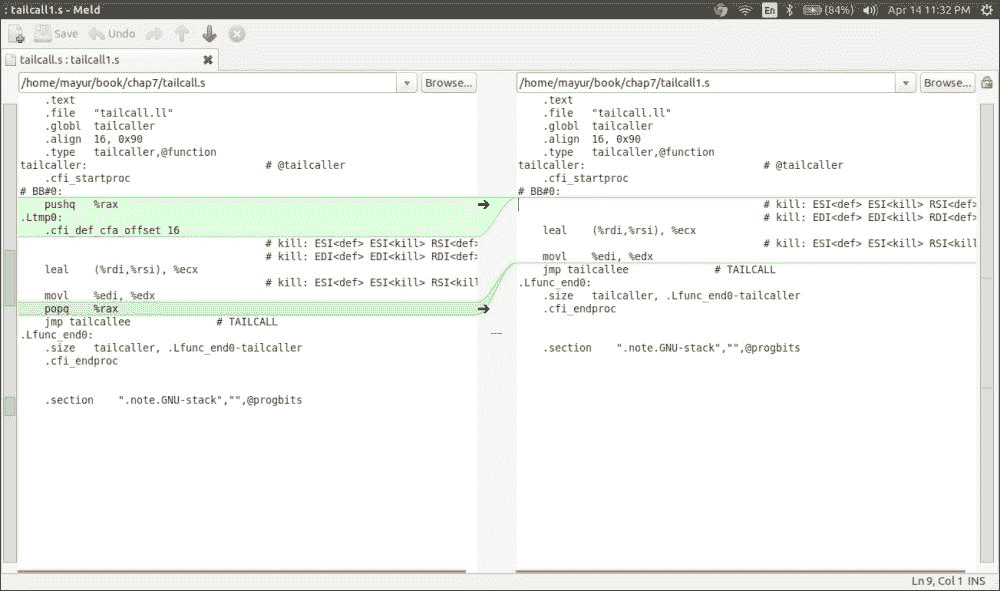

# 第七章. 优化机器代码

在本章中，我们将涵盖以下内容：

+   从机器代码中消除公共子表达式

+   分析活跃区间

+   寄存器分配

+   插入前导和后继代码

+   代码发射

+   尾调用优化

+   兄弟调用优化

# 简介

到目前为止生成的机器代码尚未分配到真实的目标架构寄存器。到目前为止看到的寄存器都是虚拟寄存器，数量无限。生成的机器代码处于 SSA 形式。然而，目标寄存器的数量是有限的。因此，寄存器分配算法需要大量的启发式计算来以最优方式分配寄存器。

但是，在寄存器分配之前，存在代码优化的机会。机器代码处于 SSA（Static Single Assignment）形式，也使得应用优化算法变得容易。一些优化技术（如机器死代码消除和机器公共子表达式消除）的算法几乎与 LLVM IR 中的相同。区别在于需要检查的约束条件。

在这里，我们将讨论在 LLVM 主干代码库中实现的一种机器代码优化技术——机器 CSE（Common Subexpression Elimination），以便您了解机器代码的算法是如何实现的。

# 从机器代码中消除公共子表达式

CSE 算法的目的是消除公共子表达式，使机器代码紧凑，并移除不必要的、重复的代码。让我们看看 LLVM 主干中的代码，以了解它是如何实现的。详细代码位于 `lib/CodeGen/MachineCSE.cpp` 文件中。

## 如何做到这一点……

1.  `MachineCSE` 类在机器函数上运行，因此它应该继承 `MachineFunctionPass` 类。它有各种成员，例如 `TargetInstructionInfo`，用于获取目标指令的信息（用于执行 CSE）；`TargetRegisterInfo`，用于获取目标寄存器的信息（是否属于保留的寄存器类，或更多此类类似类；以及 `MachineDominatorTree`，用于获取机器块的支配树信息：

    ```cpp
    class MachineCSE : public MachineFunctionPass {
        const TargetInstrInfo *TII;
        const TargetRegisterInfo *TRI;
        AliasAnalysis *AA;
        MachineDominatorTree *DT;
        MachineRegisterInfo *MRI;
    ```

1.  该类的构造函数定义如下，它初始化了遍历：

    ```cpp
    public:
        static char ID; // Pass identification
        MachineCSE() : MachineFunctionPass(ID), LookAheadLimit(5), CurrVN(0) {
          initializeMachineCSEPass(*PassRegistry::getPassRegistry());
        }
    ```

1.  `getAnalysisUsage()` 函数确定在当前遍历之前将运行哪些遍历，以获取可用于当前遍历的统计数据：

    ```cpp
        void getAnalysisUsage(AnalysisUsage &AU) const override {
          AU.setPreservesCFG();
          MachineFunctionPass::getAnalysisUsage(AU);
          AU.addRequired<AliasAnalysis>();
          AU.addPreservedID(MachineLoopInfoID);
          AU.addRequired<MachineDominatorTree>();
          AU.addPreserved<MachineDominatorTree>();
        }
    ```

1.  在此遍历中声明一些辅助函数以检查简单的复制传播和明显无用的定义，检查物理寄存器的活跃性和它们的定义使用，等等：

    ```cpp
      private:
    …..
    …..

    bool PerformTrivialCopyPropagation(MachineInstr *MI,
                                       MachineBasicBlock *MBB);

    bool isPhysDefTriviallyDead(unsigned Reg,
             MachineBasicBlock::const_iterator I,
             MachineBasicBlock::const_iterator E) const;

    bool hasLivePhysRegDefUses(const MachineInstr *MI,
                         const MachineBasicBlock *MBB,
                       SmallSet<unsigned,8> &PhysRefs,
                  SmallVectorImpl<unsigned> &PhysDefs,
                              bool &PhysUseDef) const;

    bool PhysRegDefsReach(MachineInstr *CSMI, MachineInstr *MI,
                          SmallSet<unsigned,8> &PhysRefs, SmallVectorImpl<unsigned> &PhysDefs,
                          bool &NonLocal) const;
    ```

1.  一些辅助函数有助于确定表达式作为 CSE 候选者的合法性和盈利性：

    ```cpp
        bool isCSECandidate(MachineInstr *MI);
        bool isProfitableToCSE(unsigned CSReg, unsigned Reg,
                         MachineInstr *CSMI, MachineInstr *MI);

    Actual CSE performing function
        bool PerformCSE(MachineDomTreeNode *Node);
    ```

让我们看看 CSE 函数的实际实现：

1.  `runOnMachineFunction()` 函数首先被调用，因为该遍历运行：

    ```cpp
    bool MachineCSE::runOnMachineFunction(MachineFunction &MF){
      if (skipOptnoneFunction(*MF.getFunction()))
        return false;

      TII = MF.getSubtarget().getInstrInfo();
      TRI = MF.getSubtarget().getRegisterInfo();
      MRI = &MF.getRegInfo();
      AA = &getAnalysis<AliasAnalysis>();
      DT = &getAnalysis<MachineDominatorTree>();
      return PerformCSE(DT->getRootNode());
    }
    ```

1.  接下来调用 `PerformCSE()` 函数。它接受 `DomTree` 的根节点，在 `DomTree` 上执行 DFS 遍历（从根节点开始），并填充一个包含 `DomTree` 节点的作业列表。在 DFS 遍历 `DomTree` 之后，它处理作业列表中每个节点对应的 `MachineBasicBlock` 类：

    ```cpp
    bool MachineCSE::PerformCSE(MachineDomTreeNode *Node) {
      SmallVector<MachineDomTreeNode*, 32> Scopes;
      SmallVector<MachineDomTreeNode*, 8> WorkList;
      DenseMap<MachineDomTreeNode*, unsigned> OpenChildren;

      CurrVN = 0;
    // DFS to populate worklist
      WorkList.push_back(Node);
      do {
        Node = WorkList.pop_back_val();
        Scopes.push_back(Node);
        const std::vector<MachineDomTreeNode*> &Children = Node->getChildren();
        unsigned NumChildren = Children.size();
        OpenChildren[Node] = NumChildren;
        for (unsigned i = 0; i != NumChildren; ++i) {
          MachineDomTreeNode *Child = Children[i];
          WorkList.push_back(Child);
        }
      } while (!WorkList.empty());

      // perform CSE.
      bool Changed = false;
      for (unsigned i = 0, e = Scopes.size(); i != e; ++i) {
        MachineDomTreeNode *Node = Scopes[i];
        MachineBasicBlock *MBB = Node->getBlock();
        EnterScope(MBB);
        Changed |= ProcessBlock(MBB);
        ExitScopeIfDone(Node, OpenChildren);
      }

      return Changed;
    }
    ```

1.  下一个重要的函数是 `ProcessBlock()` 函数，它作用于机器基本块。`MachineBasicBlock` 类中的指令被迭代并检查其合法性及盈利性，如果它们可以成为 CSE 候选者：

    ```cpp
    bool MachineCSE::ProcessBlock(MachineBasicBlock *MBB) {
      bool Changed = false;

      SmallVector<std::pair<unsigned, unsigned>, 8> CSEPairs;
      SmallVector<unsigned, 2> ImplicitDefsToUpdate;

    // Iterate over each Machine instructions in the MachineBasicBlock
      for (MachineBasicBlock::iterator I = MBB->begin(), E = MBB->end(); I != E; ) {
        MachineInstr *MI = &*I;
        ++I;

    // Check if this can be a CSE candidate.
        if (!isCSECandidate(MI))
          continue;

        bool FoundCSE = VNT.count(MI);
        if (!FoundCSE) {
          // Using trivial copy propagation to find more CSE opportunities.
          if (PerformTrivialCopyPropagation(MI, MBB)) {
            Changed = true;

            // After coalescing MI itself may become a copy.
            if (MI->isCopyLike())
              continue;

            // Try again to see if CSE is possible.
            FoundCSE = VNT.count(MI);
          }
        }

        bool Commuted = false;
        if (!FoundCSE && MI->isCommutable()) {
          MachineInstr *NewMI = TII->commuteInstruction(MI);
          if (NewMI) {
            Commuted = true;
            FoundCSE = VNT.count(NewMI);
            if (NewMI != MI) {
              // New instruction. It doesn't need to be kept.
              NewMI->eraseFromParent();
              Changed = true;
            } else if (!FoundCSE)
              // MI was changed but it didn't help, commute it back!
              (void)TII->commuteInstruction(MI);
          }
        }

        // If the instruction defines physical registers and the values *may* be
        // used, then it's not safe to replace it with a common subexpression.
        // It's also not safe if the instruction uses physical registers.
        bool CrossMBBPhysDef = false;
        SmallSet<unsigned, 8> PhysRefs;
        SmallVector<unsigned, 2> PhysDefs;
        bool PhysUseDef = false;

    // Check if this instruction has been marked for CSE. Check if it is using physical register, if yes then mark as non-CSE candidate
     if (FoundCSE && hasLivePhysRegDefUses(MI, MBB, PhysRefs,
                                                    PhysDefs, PhysUseDef)) {
          FoundCSE = false;
    …
    …
        }

        if (!FoundCSE) {
          VNT.insert(MI, CurrVN++);
          Exps.push_back(MI);
          continue;
        }

        // Finished job of determining if there exists a common subexpression.
      // Found a common subexpression, eliminate it.
        unsigned CSVN = VNT.lookup(MI);
        MachineInstr *CSMI = Exps[CSVN];
        DEBUG(dbgs() << "Examining: " << *MI);
        DEBUG(dbgs() << "*** Found a common subexpression: " << *CSMI);

        // Check if it's profitable to perform this CSE.
        bool DoCSE = true;
        unsigned NumDefs = MI->getDesc().getNumDefs() +
                           MI->getDesc().getNumImplicitDefs();

        for (unsigned i = 0, e = MI->getNumOperands(); NumDefs && i != e; ++i) {
          MachineOperand &MO = MI->getOperand(i);
          if (!MO.isReg() || !MO.isDef())
            continue;
          unsigned OldReg = MO.getReg();
          unsigned NewReg = CSMI->getOperand(i).getReg();

          // Go through implicit defs of CSMI and MI, if a def is not dead at MI,
          // we should make sure it is not dead at CSMI.
          if (MO.isImplicit() && !MO.isDead() && CSMI->getOperand(i).isDead())
            ImplicitDefsToUpdate.push_back(i);
          if (OldReg == NewReg) {
            --NumDefs;
            continue;
          }

          assert(TargetRegisterInfo::isVirtualRegister(OldReg) &&
                 TargetRegisterInfo::isVirtualRegister(NewReg) &&
                 "Do not CSE physical register defs!");

          if (!isProfitableToCSE(NewReg, OldReg, CSMI, MI)) {
            DEBUG(dbgs() << "*** Not profitable, avoid CSE!\n");
            DoCSE = false;
            break;
          }

          // Don't perform CSE if the result of the old instruction cannot exist
          // within the register class of the new instruction.
          const TargetRegisterClass *OldRC = MRI->getRegClass(OldReg);
          if (!MRI->constrainRegClass(NewReg, OldRC)) {
            DEBUG(dbgs() << "*** Not the same register class, avoid CSE!\n");
            DoCSE = false;
            break;
          }

          CSEPairs.push_back(std::make_pair(OldReg, NewReg));
          --NumDefs;
        }

        // Actually perform the elimination.
        if (DoCSE) {
          for (unsigned i = 0, e = CSEPairs.size(); i != e; ++i) {
            MRI->replaceRegWith(CSEPairs[i].first, CSEPairs[i].second);
            MRI->clearKillFlags(CSEPairs[i].second);
          }

          // Go through implicit defs of CSMI and MI, if a def is not dead at MI,
          // we should make sure it is not dead at CSMI.
          for (unsigned i = 0, e = ImplicitDefsToUpdate.size(); i != e; ++i)
            CSMI->getOperand(ImplicitDefsToUpdate[i]).setIsDead(false);

          if (CrossMBBPhysDef) {
            // Add physical register defs now coming in from a predecessor to MBB
            // livein list.
            while (!PhysDefs.empty()) {
              unsigned LiveIn = PhysDefs.pop_back_val();
              if (!MBB->isLiveIn(LiveIn))
                MBB->addLiveIn(LiveIn);
            }
            ++NumCrossBBCSEs;
          }

          MI->eraseFromParent();
          ++NumCSEs;
          if (!PhysRefs.empty())
            ++NumPhysCSEs;
          if (Commuted)
            ++NumCommutes;
          Changed = true;
        } else {
          VNT.insert(MI, CurrVN++);
          Exps.push_back(MI);
        }
        CSEPairs.clear();
        ImplicitDefsToUpdate.clear();
      }

      return Changed;
    }
    ```

1.  让我们也来看看合法性和盈利函数，以确定 CSE 候选者：

    ```cpp
    bool MachineCSE::isCSECandidate(MachineInstr *MI) {
    // If Machine Instruction is PHI, or inline ASM or implicit defs, it is not a candidate for CSE.

      if (MI->isPosition() || MI->isPHI() || MI->isImplicitDef() || MI->isKill() ||
          MI->isInlineAsm() || MI->isDebugValue())
        return false;

      // Ignore copies.
      if (MI->isCopyLike())
        return false;

      // Ignore instructions that we obviously can't move.
      if (MI->mayStore() || MI->isCall() || MI->isTerminator() || MI->hasUnmodeledSideEffects())
        return false;

      if (MI->mayLoad()) {
        // Okay, this instruction does a load. As a refinement, we allow the target
        // to decide whether the loaded value is actually a constant. If so, we can
        // actually use it as a load.
        if (!MI->isInvariantLoad(AA))
          return false;
      }
      return true;
    }
    ```

1.  盈利函数编写如下：

    ```cpp
    bool MachineCSE::isProfitableToCSE(unsigned CSReg, unsigned Reg,
      MachineInstr *CSMI, MachineInstr *MI) {

      // If CSReg is used at all uses of Reg, CSE should not increase register
      // pressure of CSReg.
      bool MayIncreasePressure = true;
      if (TargetRegisterInfo::isVirtualRegister(CSReg) &&
          TargetRegisterInfo::isVirtualRegister(Reg)) {
        MayIncreasePressure = false;
        SmallPtrSet<MachineInstr*, 8> CSUses;
        for (MachineInstr &MI : MRI->use_nodbg_instructions(CSReg)) {
          CSUses.insert(&MI);
        }
        for (MachineInstr &MI : MRI->use_nodbg_instructions(Reg)) {
          if (!CSUses.count(&MI)) {
            MayIncreasePressure = true;
            break;
          }
        }
      }
      if (!MayIncreasePressure) return true;

      // Heuristics #1: Don't CSE "cheap" computation if the def is not local or in
      // an immediate predecessor. We don't want to increase register pressure and
      // end up causing other computation to be spilled.
      if (TII->isAsCheapAsAMove(MI)) {
        MachineBasicBlock *CSBB = CSMI->getParent();
        MachineBasicBlock *BB = MI->getParent();
        if (CSBB != BB && !CSBB->isSuccessor(BB))
          return false;
      }

      // Heuristics #2: If the expression doesn't not use a vr and the only use
      // of the redundant computation are copies, do not cse.
      bool HasVRegUse = false;
      for (unsigned i = 0, e = MI->getNumOperands(); i != e; ++i) {
        const MachineOperand &MO = MI->getOperand(i);
        if (MO.isReg() && MO.isUse() &&
            TargetRegisterInfo::isVirtualRegister(MO.getReg())) {
          HasVRegUse = true;
          break;
        }
      }
      if (!HasVRegUse) {
        bool HasNonCopyUse = false;
        for (MachineInstr &MI : MRI->use_nodbg_instructions(Reg)) {
          // Ignore copies.
          if (!MI.isCopyLike()) {
            HasNonCopyUse = true;
            break;
          }
        }
        if (!HasNonCopyUse)
          return false;
      }

      // Heuristics #3: If the common subexpression is used by PHIs, do not reuse
      // it unless the defined value is already used in the BB of the new use.
      bool HasPHI = false;
      SmallPtrSet<MachineBasicBlock*, 4> CSBBs;
      for (MachineInstr &MI : MRI->use_nodbg_instructions(CSReg)) {
        HasPHI |= MI.isPHI();
        CSBBs.insert(MI.getParent());
      }

      if (!HasPHI)
        return true;
      return CSBBs.count(MI->getParent());
    }
    ```

## 它是如何工作的…

`MachineCSE` 传递在机器函数上运行。它获取 `DomTree` 信息，然后以 DFS 方式遍历 `DomTree`，创建一个由基本 `MachineBasicBlocks` 构成的节点作业列表。然后它对每个块进行 CSE 处理。在每个块中，它迭代所有指令并检查是否有任何指令是 CSE 候选者。然后它检查消除已识别表达式是否具有盈利性。一旦它发现已识别的 CSE 消除具有盈利性，它就从 `MachineBasicBlock` 类中消除 `MachineInstruction` 类。它还执行机器指令的简单复制传播。在某些情况下，`MachineInstruction` 在初始运行时可能不是 CSE 的候选者，但在复制传播后可能成为候选者。

## 查看更多

要查看更多以 SSA 形式呈现的机器代码优化，请查看 `lib/CodeGen/DeadMachineInstructionElim.cpp` 文件中机器死代码消除传递的实现。

# 分析活跃区间

在本章的后续内容中，我们将探讨寄存器分配。然而，在我们前往那里之前，你必须理解**活动变量**和**活动区间**的概念。通过活动区间，我们指的是变量活跃的范围，即从变量定义点到其最后使用点。为此，我们需要计算指令（变量的最后使用）之后立即失效的寄存器集合，以及指令使用但不在指令之后使用的寄存器集合。我们为函数中的每个虚拟寄存器和物理寄存器计算活动变量信息。使用 SSA（Static Single Assignment）来稀疏计算虚拟寄存器的生命周期信息，使我们能够仅跟踪块内的物理寄存器。在寄存器分配之前，LLVM 假设物理寄存器仅在单个基本块内活跃。这使得它能够执行单个、局部的分析，以在每个基本块内解决物理寄存器的生命周期。在执行活动变量分析后，我们拥有了执行活动区间分析和构建活动区间的所需信息。为此，我们开始对基本块和机器指令进行编号。之后，处理 live-in 值，通常是寄存器中的参数。对于虚拟寄存器的活动区间，我们将根据机器指令的某种顺序（*1*，*N*）进行计算。活动区间是一个区间（*i*，*j*），其中变量是活跃的，其中*1 >= i >= j > N*。

在这个菜谱中，我们将取一个示例程序，看看我们如何列出该程序的活动区间。我们将查看 LLVM 是如何计算这些区间的。

## 准备工作

要开始，我们需要一段用于执行活动区间分析的测试代码。为了简单起见，我们将使用 C 代码并将其转换为 LLVM IR：

1.  编写一个包含`if` - `else`块的测试程序：

    ```cpp
    $ cat interval.c
    void donothing(int a) {
     return;
    }

    int func(int i) {
     int a = 5;
     donothing(a);
     int m = a;
     donothing(m);
     a = 9;
     if (i < 5) {
     int b = 3;
     donothing(b);
     int z = b;
     donothing(z);
     }
     else {
     int k = a;
     donothing(k);
     }

     return m;
    }

    ```

1.  使用 Clang 将 C 代码转换为 IR，然后使用`cat`命令查看生成的 IR：

    ```cpp
    $ clang -cc1 -emit-llvm interval.c

    $ cat interval.ll
    ; ModuleID = 'interval.c'
    target datalayout = "e-m:e-i64:64-f80:128-n8:16:32:64-S128"
    target triple = "x86_64-unknown-linux-gnu"

    ; Function Attrs: nounwind
    define void @donothing(i32 %a) #0 {
     %1 = alloca i32, align 4
     store i32 %a, i32* %1, align 4
     ret void
    }

    ; Function Attrs: nounwind
    define i32 @func(i32 %i) #0 {
     %1 = alloca i32, align 4
     %a = alloca i32, align 4
     %m = alloca i32, align 4
     %b = alloca i32, align 4
     %z = alloca i32, align 4
     %k = alloca i32, align 4
     store i32 %i, i32* %1, align 4
     store i32 5, i32* %a, align 4
     %2 = load i32, i32* %a, align 4
     call void @donothing(i32 %2)
     %3 = load i32, i32* %a, align 4
     store i32 %3, i32* %m, align 4
     %4 = load i32, i32* %m, align 4
     call void @donothing(i32 %4)
     store i32 9, i32* %a, align 4
     %5 = load i32, i32* %1, align 4
     %6 = icmp slt i32 %5, 5
     br i1 %6, label %7, label %11

    ; <label>:7                               ; preds = %0
     store i32 3, i32* %b, align 4
     %8 = load i32, i32* %b, align 4
     call void @donothing(i32 %8)
     %9 = load i32, i32* %b, align 4
     store i32 %9, i32* %z, align 4
     %10 = load i32, i32* %z, align 4
     call void @donothing(i32 %10)
     br label %14

    ; <label>:11                              ; preds = %0
     %12 = load i32, i32* %a, align 4
     store i32 %12, i32* %k, align 4
     %13 = load i32, i32* %k, align 4
     call void @donothing(i32 %13)
     br label %14

    ; <label>:14                              ; preds = %11, %7
     %15 = load i32, i32* %m, align 4
     ret i32 %15
    }

    attributes #0 = { nounwind "less-precise-fpmad"="false" "no-frame-pointer-elim"="false" "no-infs-fp-math"="false" "no-nans-fp-math"="false" "no-realign-stack" "stack-protector-buffer-size"="8" "unsafe-fp-math"="false" "use-soft-float"="false" }

    !llvm.ident = !{!0}

    !0 = !{!"clang version 3.7.0 (trunk 234045)"}

    ```

## 如何做…

1.  要列出活动区间，我们需要修改`LiveIntervalAnalysis.cpp`文件的代码，添加打印活动区间的代码。我们将添加以下行（每行前带有`+`符号）：

    ```cpp
    void LiveIntervals::computeVirtRegInterval(LiveInterval &LI) {
      assert(LRCalc && "LRCalc not initialized.");
      assert(LI.empty() && "Should only compute empty intervals.");
      LRCalc->reset(MF, getSlotIndexes(), DomTree, &getVNInfoAllocator());
      LRCalc->calculate(LI, MRI->shouldTrackSubRegLiveness(LI.reg));
      computeDeadValues(LI, nullptr);

    /**** add the following code ****/
    + llvm::outs() << "********** INTERVALS **********\n";

      // Dump the regunits.
      + for (unsigned i = 0, e = RegUnitRanges.size(); i != e; ++i)
        + if (LiveRange *LR = RegUnitRanges[i])
          + llvm::outs() << PrintRegUnit(i, TRI) << ' ' << *LR << '\n';

      // Dump the virtregs.
      + llvm::outs() << "virtregs:";
      + for (unsigned i = 0, e = MRI->getNumVirtRegs(); i != e; ++i) {
        + unsigned Reg = TargetRegisterInfo::index2VirtReg(i);
        + if (hasInterval(Reg))
          + llvm::outs() << getInterval(Reg) << '\n';
      + }
    ```

1.  在修改前面的源文件后构建 LLVM，并将其安装到路径上。

1.  现在使用`llc`命令编译测试代码的 IR 形式。你将得到活动区间：

    ```cpp
    $ llc interval.ll
    ********** INTERVALS **********
    virtregs:%vreg0 [16r,32r:0)  0@16r
    ********** INTERVALS **********
    virtregs:%vreg0 [16r,32r:0)  0@16r
    ********** INTERVALS **********
    virtregs:%vreg0 [16r,32r:0)  0@16r
    %vreg1 [80r,96r:0)  0@80r
    ********** INTERVALS **********
    virtregs:%vreg0 [16r,32r:0)  0@16r
    %vreg1 [80r,96r:0)  0@80r
    %vreg2 [144r,192r:0)  0@144r
    ********** INTERVALS **********
    virtregs:%vreg0 [16r,32r:0)  0@16r
    %vreg1 [80r,96r:0)  0@80r
    %vreg2 [144r,192r:0)  0@144r
    %vreg5 [544r,592r:0)  0@544r
    ********** INTERVALS **********
    virtregs:%vreg0 [16r,32r:0)  0@16r
    %vreg1 [80r,96r:0)  0@80r
    %vreg2 [144r,192r:0)  0@144r
    %vreg5 [544r,592r:0)  0@544r
    %vreg6 [352r,368r:0)  0@352r
    ********** INTERVALS **********
    virtregs:%vreg0 [16r,32r:0)  0@16r
    %vreg1 [80r,96r:0)  0@80r
    %vreg2 [144r,192r:0)  0@144r
    %vreg5 [544r,592r:0)  0@544r
    %vreg6 [352r,368r:0)  0@352r
    %vreg7 [416r,464r:0)  0@416r
    ********** INTERVALS **********
    virtregs:%vreg0 [16r,32r:0)  0@16r
    %vreg1 [80r,96r:0)  0@80r
    %vreg2 [144r,192r:0)  0@144r
    %vreg5 [544r,592r:0)  0@544r
    %vreg6 [352r,368r:0)  0@352r
    %vreg7 [416r,464r:0)  0@416r
    %vreg8 [656r,672r:0)  0@656r

    ```

## 它是如何工作的…

在前面的例子中，我们看到了活区间与每个虚拟寄存器相关联的方式。程序中的活区间的开始和结束位置用方括号标记。生成这些活区间的过程从 `lib/CodeGen/LiveVariables.cpp` 文件中的 `LiveVariables::runOnMachineFunction(MachineFunction &mf)` 函数开始，它使用 `HandleVirtRegUse` 和 `HandleVirtRegDef` 函数分配寄存器的定义和使用。它使用 `getVarInfo` 函数获取给定虚拟寄存器的 `VarInfo` 对象。

`LiveInterval` 和 `LiveRange` 类在 `LiveInterval.cpp` 中定义。该文件中的函数接收每个变量的活跃信息，然后检查它们是否重叠。

在 `LiveIntervalAnalysis.cpp` 文件中，我们有活区间分析传递的实现，它以深度优先的方式遍历基本块（按线性顺序排列），并为每个虚拟和物理寄存器创建一个活区间。这种分析被寄存器分配器使用，将在下一食谱中讨论。

## 参见

+   如果您想详细了解不同基本块的虚拟寄存器是如何生成的，以及这些虚拟寄存器的生命周期，请在编译测试用例时使用 `llc` 工具的 `–debug-only=regalloc` 命令行选项。您需要一个调试版本的 LLVM 才能这样做。

+   要获取关于实时区间的更多详细信息，请查看以下代码文件：

    +   `Lib/CodeGen/ LiveInterval.cpp`

    +   `Lib/CodeGen/ LiveIntervalAnalysis.cpp`

    +   `Lib/CodeGen/ LiveVariables.cpp`

# 分配寄存器

寄存器分配是将物理寄存器分配给虚拟寄存器的任务。虚拟寄存器可以是无限的，但机器的物理寄存器是有限的。因此，寄存器分配的目标是最大化分配给虚拟寄存器的物理寄存器数量。在本食谱中，我们将了解寄存器在 LLVM 中的表示方式，如何修改寄存器信息，执行步骤，以及内置的寄存器分配器。

## 准备工作

您需要构建和安装 LLVM。

## 如何操作...

1.  要查看寄存器在 LLVM 中的表示方式，请打开 `build-folder/lib/Target/X86/X86GenRegisterInfo.inc` 文件并查看前几行，这些行显示寄存器以整数的形式表示：

    ```cpp
    namespace X86 {
    enum {
      NoRegister,
      AH = 1,
      AL = 2,
      AX = 3,
      BH = 4,
      BL = 5,
      BP = 6,
      BPL = 7,
      BX = 8,
      CH = 9,
    …
    ```

1.  对于具有共享相同物理位置的寄存器的架构，请查看该架构的 `RegisterInfo.td` 文件以获取别名信息。让我们查看 `lib/Target/X86/X86RegisterInfo.td` 文件。通过查看以下代码片段，我们可以看到 `EAX`、`AX` 和 `AL` 寄存器是如何别名的（我们只指定最小的寄存器别名）：

    ```cpp
    def AL : X86Reg<"al", 0>;
    def DL : X86Reg<"dl", 2>;
    def CL : X86Reg<"cl", 1>;
    def BL : X86Reg<"bl", 3>;

    def AH : X86Reg<"ah", 4>;
    def DH : X86Reg<"dh", 6>;
    def CH : X86Reg<"ch", 5>;
    def BH : X86Reg<"bh", 7>;

    def AX : X86Reg<"ax", 0, [AL,AH]>;
    def DX : X86Reg<"dx", 2, [DL,DH]>;
    def CX : X86Reg<"cx", 1, [CL,CH]>;
    def BX : X86Reg<"bx", 3, [BL,BH]>;

    // 32-bit registers
    let SubRegIndices = [sub_16bit] in {
    def EAX : X86Reg<"eax", 0, [AX]>, DwarfRegNum<[-2, 0, 0]>;
    def EDX : X86Reg<"edx", 2, [DX]>, DwarfRegNum<[-2, 2, 2]>;
    def ECX : X86Reg<"ecx", 1, [CX]>, DwarfRegNum<[-2, 1, 1]>;
    def EBX : X86Reg<"ebx", 3, [BX]>, DwarfRegNum<[-2, 3, 3]>;
    def ESI : X86Reg<"esi", 6, [SI]>, DwarfRegNum<[-2, 6, 6]>;
    def EDI : X86Reg<"edi", 7, [DI]>, DwarfRegNum<[-2, 7, 7]>;
    def EBP : X86Reg<"ebp", 5, [BP]>, DwarfRegNum<[-2, 4, 5]>;
    def ESP : X86Reg<"esp", 4, [SP]>, DwarfRegNum<[-2, 5, 4]>;
    def EIP : X86Reg<"eip", 0, [IP]>, DwarfRegNum<[-2, 8, 8]>;
    …
    ```

1.  要更改可用的物理寄存器数量，请转到`TargetRegisterInfo.td`文件，并手动注释掉一些寄存器，这些寄存器是`RegisterClass`的最后一个参数。打开`X86RegisterInfo.cpp`文件并删除寄存器`AH`、`CH`和`DH`：

    ```cpp
    def GR8 : RegisterClass<"X86", [i8],  8,
                            (add AL, CL, DL, AH, CH, DH, BL, BH, SIL, DIL, BPL, SPL,
                                 R8B, R9B, R10B, R11B, R14B, R15B, R12B, R13B)> {
    ```

1.  当您构建 LLVM 时，第一步中的`.inc`文件将已更改，并且不会包含`AH`、`CH`和`DH`寄存器。

1.  使用之前配方中的测试用例，*分析活动区间*，其中我们执行了活动区间分析，并运行 LLVM 提供的寄存器分配技术，即`fast`、`basic`、`greedy`和`pbqp`。让我们运行其中两个并比较结果：

    ```cpp
    $ llc –regalloc=basic interval.ll –o intervalregbasic.s

    ```

    接下来，创建`intervalregbasic.s`文件，如下所示：

    ```cpp
    $ cat intervalregbasic.s
     .text
     .file  "interval.ll"
     .globl  donothing
     .align  16, 0x90
     .type  donothing,@function
    donothing:                              # @donothing
    # BB#0:
     movl  %edi, -4(%rsp)
     retq
    .Lfunc_end0:
     .size  donothing, .Lfunc_end0-donothing

     .globl  func
     .align  16, 0x90
     .type  func,@function
    func:                                   # @func
    # BB#0:
     subq  $24, %rsp
     movl  %edi, 20(%rsp)
     movl  $5, 16(%rsp)
     movl  $5, %edi
     callq  donothing
     movl  16(%rsp), %edi
     movl  %edi, 12(%rsp)
     callq  donothing
     movl  $9, 16(%rsp)
     cmpl  $4, 20(%rsp)
     jg  .LBB1_2
    # BB#1:
     movl  $3, 8(%rsp)
     movl  $3, %edi
     callq  donothing
     movl  8(%rsp), %edi
     movl  %edi, 4(%rsp)
     jmp  .LBB1_3
    .LBB1_2:
     movl  16(%rsp), %edi
     movl  %edi, (%rsp)
    .LBB1_3:
     callq  donothing
     movl  12(%rsp), %eax
     addq  $24, %rsp
     retq
    .Lfunc_end1:
     .size  func, .Lfunc_end1-func

    ```

    接下来，运行以下命令以比较两个文件：

    ```cpp
    $ llc –regalloc=pbqp interval.ll –o intervalregpbqp.s

    ```

    创建`intervalregbqp.s`文件：

    ```cpp
    $cat intervalregpbqp.s
     .text
     .file  "interval.ll"
     .globl  donothing
     .align  16, 0x90
     .type  donothing,@function
    donothing:                              # @donothing
    # BB#0:
     movl  %edi, %eax
     movl  %eax, -4(%rsp)
     retq
    .Lfunc_end0:
     .size  donothing, .Lfunc_end0-donothing

     .globl  func
     .align  16, 0x90
     .type  func,@function
    func:                                   # @func
    # BB#0:
     subq  $24, %rsp
     movl  %edi, %eax
     movl  %eax, 20(%rsp)
     movl  $5, 16(%rsp)
     movl  $5, %edi
     callq  donothing
     movl  16(%rsp), %eax
     movl  %eax, 12(%rsp)
     movl  %eax, %edi
     callq  donothing
     movl  $9, 16(%rsp)
     cmpl  $4, 20(%rsp)
     jg  .LBB1_2
    # BB#1:
     movl  $3, 8(%rsp)
     movl  $3, %edi
     callq  donothing
     movl  8(%rsp), %eax
     movl  %eax, 4(%rsp)
     jmp  .LBB1_3
    .LBB1_2:
     movl  16(%rsp), %eax
     movl  %eax, (%rsp)
    .LBB1_3:
     movl  %eax, %edi
     callq  donothing
     movl  12(%rsp), %eax
     addq  $24, %rsp
     retq
    .Lfunc_end1:
     .size  func, .Lfunc_end1-func

    ```

1.  现在，使用`diff`工具并逐行比较两个汇编代码。

## 它是如何工作的…

虚拟寄存器到物理寄存器的映射可以有两种方式：

+   **直接映射**：通过使用`TargetRegisterInfo`和`MachineOperand`类。这取决于开发者，开发者需要提供加载和存储指令应插入的位置，以便在内存中获取和存储值。

+   **间接映射**：这依赖于`VirtRegMap`类来插入加载和存储操作，以及从内存中获取和设置值。使用`VirtRegMap::assignVirt2Phys(vreg, preg)`函数将虚拟寄存器映射到物理寄存器上。

寄存器分配器扮演的另一个重要角色是在 SSA 形式解构中。由于传统的指令集不支持`phi`指令，我们必须用其他指令替换它以生成机器代码。传统的方法是将`phi`指令替换为`copy`指令。

在此阶段之后，我们进行实际的物理寄存器映射。LLVM 中有四种寄存器分配的实现，它们各自有将虚拟寄存器映射到物理寄存器的算法。这里无法详细涵盖任何这些算法。如果您想尝试理解它们，请参考下一节。

## 参见

+   要了解更多关于 LLVM 中使用的算法的信息，请查看位于`lib/CodeGen/`的源代码：

    +   `lib/CodeGen/RegAllocBasic.cpp`

    +   `lib/CodeGen/ RegAllocFast.cpp`

    +   `lib/CodeGen/ RegAllocGreedy.cpp`

    +   `lib/CodeGen/ RegAllocPBQP.cpp`

# 插入序言-尾声代码

插入序言-尾声代码涉及堆栈展开、最终确定函数布局、保存调用者保留寄存器以及生成序言和尾声代码。它还将抽象帧索引替换为适当的引用。此阶段在寄存器分配阶段之后运行。

## 如何做…

在`PrologueEpilogueInserter`类中定义的骨架和重要函数如下：

+   序言-尾随代码插入传递在机器函数上运行，因此它继承了 `MachineFunctionPass` 类。它的构造函数初始化传递：

    ```cpp
    class PEI : public MachineFunctionPass {
      public:
        static char ID;
        PEI() : MachineFunctionPass(ID) {
          initializePEIPass(*PassRegistry::getPassRegistry());
        }
    ```

+   在这个类中定义了各种辅助函数，这些函数有助于插入序言和尾随代码：

    ```cpp
        void calculateSets(MachineFunction &Fn);
        void calculateCallsInformation(MachineFunction &Fn);
        void calculateCalleeSavedRegisters(MachineFunction &Fn);
        void insertCSRSpillsAndRestores(MachineFunction &Fn);
        void calculateFrameObjectOffsets(MachineFunction &Fn);
        void replaceFrameIndices(MachineFunction &Fn);
        void replaceFrameIndices(MachineBasicBlock *BB, MachineFunction &Fn,
                                 int &SPAdj);
        void scavengeFrameVirtualRegs(MachineFunction &Fn);
    ```

+   主要函数 `insertPrologEpilogCode()` 的任务是插入序言和尾随代码：

    ```cpp
        void insertPrologEpilogCode(MachineFunction &Fn);
    ```

+   在这个过程中首先执行的是 `runOnFunction()` 函数。代码中的注释显示了执行的各种操作，例如计算调用帧大小、调整栈变量、为修改过的寄存器插入被调用者保存的寄存器的溢出代码、计算实际的帧偏移、为函数插入序言和尾随代码、将抽象帧索引替换为实际偏移量，等等：

    ```cpp
    bool PEI::runOnMachineFunction(MachineFunction &Fn) {
      const Function* F = Fn.getFunction();
      const TargetRegisterInfo *TRI = Fn.getSubtarget().getRegisterInfo();
      const TargetFrameLowering *TFI = Fn.getSubtarget().getFrameLowering();

      assert(!Fn.getRegInfo().getNumVirtRegs() && "Regalloc must assign all vregs");

      RS = TRI->requiresRegisterScavenging(Fn) ? new RegScavenger() : nullptr;
      FrameIndexVirtualScavenging = TRI->requiresFrameIndexScavenging(Fn);

      // Calculate the MaxCallFrameSize and AdjustsStack variables for the
      // function's frame information. Also eliminates call frame pseudo
      // instructions.
      calculateCallsInformation(Fn);

      // Allow the target machine to make some adjustments to the function
      // e.g. UsedPhysRegs before calculateCalleeSavedRegisters.
      TFI->processFunctionBeforeCalleeSavedScan(Fn, RS);

      // Scan the function for modified callee saved registers and insert spill code
      // for any callee saved registers that are modified.
      calculateCalleeSavedRegisters(Fn);

      // Determine placement of CSR spill/restore code:
      // place all spills in the entry block, all restores in return blocks.
      calculateSets(Fn);

      // Add the code to save and restore the callee saved registers
      if (!F->hasFnAttribute(Attribute::Naked))
        insertCSRSpillsAndRestores(Fn);

      // Allow the target machine to make final modifications to the function
      // before the frame layout is finalized.
      TFI->processFunctionBeforeFrameFinalized(Fn, RS);

      // Calculate actual frame offsets for all abstract stack objects...
      calculateFrameObjectOffsets(Fn);

      // Add prolog and epilog code to the function.  This function is required
      // to align the stack frame as necessary for any stack variables or
      // called functions.  Because of this, calculateCalleeSavedRegisters()
      // must be called before this function in order to set the AdjustsStack
      // and MaxCallFrameSize variables.
      if (!F->hasFnAttribute(Attribute::Naked))
        insertPrologEpilogCode(Fn);

      // Replace all MO_FrameIndex operands with physical register references
      // and actual offsets.
      replaceFrameIndices(Fn);

      // If register scavenging is needed, as we've enabled doing it as a
      // post-pass, scavenge the virtual registers that frame index elimination
      // inserted.
      if (TRI->requiresRegisterScavenging(Fn) && FrameIndexVirtualScavenging)
        scavengeFrameVirtualRegs(Fn);

      // Clear any vregs created by virtual scavenging.
      Fn.getRegInfo().clearVirtRegs();

      // Warn on stack size when we exceeds the given limit.
      MachineFrameInfo *MFI = Fn.getFrameInfo();
      uint64_t StackSize = MFI->getStackSize();
      if (WarnStackSize.getNumOccurrences() > 0 && WarnStackSize < StackSize) {
        DiagnosticInfoStackSize DiagStackSize(*F, StackSize);
        F->getContext().diagnose(DiagStackSize);
      }
      delete RS;
      ReturnBlocks.clear();
      return true;
    }
    ```

+   插入序言-尾随代码的主要函数是 `insertPrologEpilogCode()` 函数。这个函数首先获取 `TargetFrameLowering` 对象，然后为该函数生成相应的目标序言代码。之后，对于该函数中的每个基本块，它检查是否存在返回语句。如果有返回语句，则生成该函数的尾随代码：

    ```cpp
    void PEI::insertPrologEpilogCode(MachineFunction &Fn) {
      const TargetFrameLowering &TFI = *Fn.getSubtarget().getFrameLowering();

      // Add prologue to the function.
      TFI.emitPrologue(Fn);

      // Add epilogue to restore the callee-save registers in each exiting block
      for (MachineFunction::iterator I = Fn.begin(), E = Fn.end(); I != E; ++I) {
        // If last instruction is a return instruction, add an epilogue
        if (!I->empty() && I->back().isReturn())
          TFI.emitEpilogue(Fn, *I);
      }

      // Emit additional code that is required to support segmented stacks, if
      // we've been asked for it.  This, when linked with a runtime with support
      // for segmented stacks (libgcc is one), will result in allocating stack
      // space in small chunks instead of one large contiguous block.
      if (Fn.shouldSplitStack())
        TFI.adjustForSegmentedStacks(Fn);

      // Emit additional code that is required to explicitly handle the stack in
      // HiPE native code (if needed) when loaded in the Erlang/OTP runtime. The
      // approach is rather similar to that of Segmented Stacks, but it uses a
      // different conditional check and another BIF for allocating more stack
      // space.
      if (Fn.getFunction()->getCallingConv() == CallingConv::HiPE)
        TFI.adjustForHiPEPrologue(Fn);
    }
    ```

## 它是如何工作的…

之前的代码调用了 `TargetFrameLowering` 类中的 `emitEpilogue()` 和 `emitPrologue()` 函数，这些将在后续章节中讨论的目标特定帧降低食谱中进行讨论。

# 代码发射

代码发射阶段将代码从代码生成抽象（如 `MachineFunction` 类、`MachineInstr` 类等）降低到机器代码层抽象（如 `MCInst` 类、`MCStreamer` 类等）。这个阶段的重要类是目标无关的 `AsmPrinter` 类、`AsmPrinter` 的特定目标子类和 `TargetLoweringObjectFile` 类。

MC 层负责生成包含标签、指令和指令的对象文件；而 `CodeGen` 层由 `MachineFunctions`、`MachineBasicBlock` 和 `MachineInstructions` 组成。在这个时候使用的一个关键类是 `MCStreamer` 类，它由汇编器 API 组成。`MCStreamer` 类具有 `EmitLabel`、`EmitSymbolAttribute`、`SwitchSection` 等函数，这些函数直接对应于上述汇编级指令。

为了在目标上发射代码，需要实现四个重要的事情：

+   为目标定义 `AsmPrinter` 类的子类。这个类实现了通用降低过程，将 `MachineFunctions` 函数转换为 MC 标签构造。`AsmPrinter` 基类方法和例程有助于实现特定目标的 `AsmPrinter` 类。`TargetLoweringObjectFile` 类实现了 `ELF`、`COFF` 或 `MachO` 目标的大部分公共逻辑。

+   为目标实现一个指令打印器。指令打印器接受一个`MCInst`类并将其渲染为`raw_ostream`类的文本。大部分内容都是自动从`.td`文件生成的（当你指定指令中的`$dst`、`$src1`、`$src2`等时），但你需要实现打印操作数的例程。

+   实现将`MachineInstr`类降低到`MCInst`类的代码，通常在`<target>MCInstLower.cpp`中实现。这个降低过程通常是目标特定的，负责将跳转表条目、常量池索引、全局变量地址等转换为适当的`MCLabels`。指令打印器或编码器会接收生成的`MCInsts`。

+   实现一个`MCCodeEmitter`子类，将`MCInsts`降低到机器代码字节和重定位。如果你想要支持直接`.o`文件发射，或者想要为你的目标实现一个汇编器，这是很重要的。

## 如何做…

让我们访问`lib/CodeGen/AsmPrinter/AsmPrinter.cpp`文件中的`AsmPrinter`基类的一些重要函数：

+   `EmitLinkage()`: 这会发射给定变量或函数的链接：

    ```cpp
    void AsmPrinter::EmitLinkage(const GlobalValue *GV, MCSymbol *GVSym) const ;
    ```

+   `EmitGlobalVariable()`: 这会将指定的全局变量发射到`.s`文件：

    ```cpp
    void AsmPrinter::EmitGlobalVariable(const GlobalVariable *GV);
    ```

+   `EmitFunctionHeader()`: 这会发射当前函数的头部：

    ```cpp
    void AsmPrinter::EmitFunctionHeader();
    ```

+   `EmitFunctionBody()`: 这个方法会发射函数的主体和尾部：

    ```cpp
    void AsmPrinter::EmitFunctionBody();
    ```

+   `EmitJumpTableInfo()`: 这会将当前函数使用的跳转表的汇编表示打印到当前输出流：

    ```cpp
    void AsmPrinter::EmitJumpTableInfo();
    ```

+   `EmitJumpTableEntry()`: 这会在当前流中为指定的`MachineBasicBlock`类发射一个跳转表条目：

    ```cpp
    void AsmPrinter::EmitJumpTableEntry(const MachineJumpTableInfo *MJTI, const MachineBasicBlock *MBB,
    unsigned UID) const;
    ```

+   发射 8 位、16 位或 32 位大小的整型类型：

    ```cpp
    void AsmPrinter::EmitInt8(int Value) const {
      OutStreamer.EmitIntValue(Value, 1);
    }

    void AsmPrinter::EmitInt16(int Value) const {
      OutStreamer.EmitIntValue(Value, 2);
    }

    void AsmPrinter::EmitInt32(int Value) const {
    OutStreamer.EmitIntValue(Value, 4);
    }
    ```

对于代码发射的详细实现，请参阅`lib/CodeGen/AsmPrinter/AsmPrinter.cpp`文件。需要注意的是，这个类使用`OutStreamer`类对象来输出汇编指令。目标特定的代码发射细节将在后面的章节中介绍。

# 尾调用优化

在这个菜谱中，我们将看到如何在 LLVM 中实现**尾调用优化**。尾调用优化是一种技术，其中被调用者重用调用者的栈而不是在调用栈中添加一个新的栈帧，因此节省了栈空间和返回次数，尤其是在处理相互递归函数时。

## 准备就绪

我们需要确保以下事项：

+   `llc`工具必须安装到`$PATH`

+   必须启用`tailcallopt`选项

+   测试代码必须包含尾调用

## 如何做…

1.  编写检查尾调用优化的测试代码：

    ```cpp
    $ cat tailcall.ll
    declare fastcc i32 @tailcallee(i32 inreg %a1, i32 inreg %a2, i32 %a3, i32 %a4)

    define fastcc i32 @tailcaller(i32 %in1, i32 %in2) {
     %l1 = add i32 %in1, %in2
     %tmp = tail call fastcc i32 @tailcallee(i32 inreg %in1, i32 inreg %in2, i32 %in1, i32 %l1)
     ret i32 %tmp
    }

    ```

1.  在测试代码上运行带有`-tailcallopt`选项的`llc`工具，以生成带有尾调用优化代码的汇编文件：

    ```cpp
    $ llc -tailcallopt tailcall.ll

    ```

1.  显示生成的输出：

    ```cpp
    $ cat tailcall.s
     .text
     .file  "tailcall.ll"
     .globl  tailcaller
     .align  16, 0x90
     .type  tailcaller,@function
    tailcaller:                             # @tailcaller
     .cfi_startproc
    # BB#0:
     pushq  %rax
    .Ltmp0:
     .cfi_def_cfa_offset 16
     # kill: ESI<def> ESI<kill> RSI<def>
     # kill: EDI<def> EDI<kill> RDI<def>
     leal  (%rdi,%rsi), %ecx
     # kill: ESI<def> ESI<kill> RSI<kill>
     movl  %edi, %edx
     popq  %rax
     jmp  tailcallee              # TAILCALL
    .Lfunc_end0:
     .size  tailcaller, .Lfunc_end0-tailcaller
     .cfi_endproc

     .section  ".note.GNU-stack","",@progbits

    ```

1.  使用`llc`工具再次生成汇编，但不使用`-tailcallopt`选项：

    ```cpp
    $ llc tailcall.ll -o tailcall1.s

    ```

1.  使用`cat`命令显示输出：

    ```cpp
    $ cat tailcall1.s
     .text
     .file  "tailcall.ll"
     .globl  tailcaller
     .align  16, 0x90
     .type  tailcaller,@function
    tailcaller:                             # @tailcaller
     .cfi_startproc
    # BB#0:
     # kill: ESI<def> ESI<kill> RSI<def>
     # kill: EDI<def> EDI<kill> RDI<def>
     leal  (%rdi,%rsi), %ecx
     # kill: ESI<def> ESI<kill> RSI<kill>
     movl  %edi, %edx
     jmp  tailcallee              # TAILCALL
    .Lfunc_end0:
     .size  tailcaller, .Lfunc_end0-tailcaller
     .cfi_endproc
     .section  ".note.GNU-stack","",@progbits

    ```

    使用 diff 工具比较两个汇编文件。这里我们使用了 meld 工具：

    

## 它是如何工作的...

尾调用优化是一种编译器优化技术，编译器可以使用它来调用一个函数而不占用额外的栈空间；我们不需要为这个函数调用创建一个新的栈帧。如果函数中最后执行的指令是调用另一个函数，就会发生这种情况。需要注意的是，调用函数现在不需要栈空间；它只是调用一个函数（另一个函数或自身）并返回被调用函数将返回的任何值。这种优化可以使递归调用占用恒定和有限的空间。在这个优化中，代码可能不一定总是以尾调用可能的形式存在。它尝试并修改源代码以查看是否可以进行尾调用。

在前面的测试用例中，我们可以看到由于尾调用优化，增加了一条推入和弹出指令。在 LLVM 中，尾调用优化由架构特定的`ISelLowering.cpp`文件处理；对于 x86，是`X86ISelLowering.cpp`文件：

```cpp
The code in function SDValue X86TargetLowering::LowerCall (…….)
bool IsMustTail = CLI.CS && CLI.CS->isMustTailCall();
  if (IsMustTail) {
    // Force this to be a tail call.  The verifier rules are enough to ensure
    // that we can lower this successfully without moving the return address
    // around.
    isTailCall = true;
  } else if (isTailCall) {
    // Check if it's really possible to do a tail call.
    isTailCall = IsEligibleForTailCallOptimization(Callee, CallConv,
                    isVarArg, SR != NotStructReturn,
                    MF.getFunction()->hasStructRetAttr(), CLI.RetTy,
                    Outs, OutVals, Ins, DAG);
```

上述代码用于在传递`tailcallopt`标志时调用`IsEligibleForTailCallOptimization()`函数。`IsEligibleForTailCallOptimization()`函数决定这段代码是否适合尾调用优化。如果是，则代码生成器将进行必要的更改。

# 兄弟调用优化

在这个菜谱中，我们将看到在 LLVM 中**兄弟调用优化**是如何工作的。可以将兄弟调用优化看作是优化过的尾调用，唯一的约束是函数应该具有相似的功能签名，即匹配的返回类型和匹配的函数参数。

## 准备工作

编写一个用于兄弟调用优化的测试用例，确保调用者和被调用者具有相同的调用约定（无论是 C 还是**fastcc**），并且尾位置的调用是尾调用：

```cpp
$ cat sibcall.ll
declare i32 @bar(i32, i32)

define i32 @foo(i32 %a, i32 %b, i32 %c) {
 entry:
 %0 = tail call i32 @bar(i32 %a, i32 %b)
 ret i32 %0
}

```

## 如何实现...

1.  运行`llc`工具生成汇编：

    ```cpp
    $ llc sibcall.ll

    ```

1.  使用`cat`命令查看生成的汇编：

    ```cpp
    $ cat sibcall.s
     .text
     .file    "sibcall.ll"
     .globl    foo
     .align    16, 0x90
     .type    foo,@function
    foo:                                    # @foo
     .cfi_startproc
    # BB#0:                                 # %entry
     jmp    bar                     # TAILCALL
    .Lfunc_end0:
     .size    foo, .Lfunc_end0-foo
     .cfi_endproc

     .section    ".note.GNU-stack","",@progbits

    ```

## 它是如何工作的...

兄弟调用优化是尾调用优化的一种受限版本，可以在不传递`tailcallopt`选项的情况下对尾调用进行优化。兄弟调用优化的工作方式与尾调用优化类似，不同之处在于兄弟调用会自动检测，并且不需要任何 ABI 更改。在函数签名中需要的相似性是因为当调用函数（调用尾递归函数的函数）试图清理被调用函数的参数时，在被调用函数完成其工作之后，如果被调用函数超出参数空间以执行对需要更多栈空间参数的函数的兄弟调用，这可能会导致内存泄漏。
