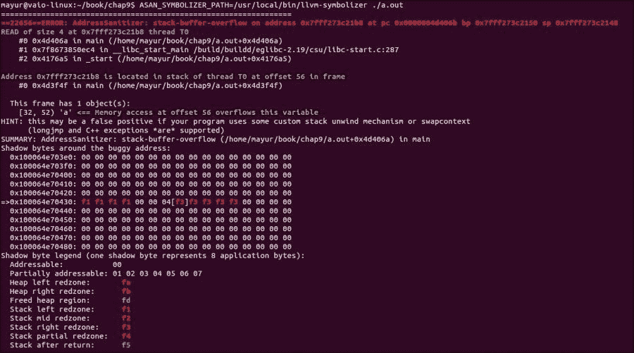
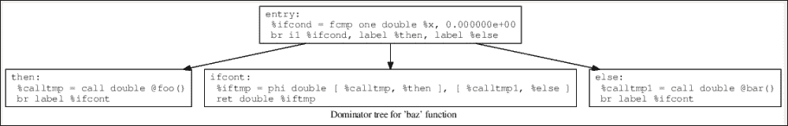

# 第九章：使用 LLVM 进行各种有用的项目

在本章中，我们将介绍以下食谱：

+   LLVM 中的异常处理

+   使用 sanitizers

+   使用 LLVM 编写垃圾收集器

+   将 LLVM IR 转换为 JavaScript

+   使用 Clang 静态分析器

+   使用 bugpoint

+   使用 LLDB

+   使用 LLVM 工具传递

# 简介

到目前为止，你已经学习了如何编写编译器的前端，编写优化并创建后端。在本章，本书的最后一章，我们将探讨 LLVM 基础设施提供的一些其他功能以及我们如何在项目中使用它们。我们不会深入探讨本章主题的细节。主要目的是让你了解这些重要的工具和技术，它们是 LLVM 中的热点。

# LLVM 中的异常处理

在这个食谱中，我们将探讨 LLVM 的异常处理基础设施。我们将讨论异常处理信息在 IR 中的外观以及 LLVM 为异常处理提供的内建函数。

## 准备就绪...

你必须理解异常处理是如何正常工作的，以及 `try`、`catch` 和 `throw` 等概念。你还需要在路径中安装 Clang 和 LLVM。

## 如何做到这一点…

我们将通过一个例子来描述在 LLVM 中异常处理是如何工作的：

1.  打开一个文件来写下源代码，并输入源代码以测试异常处理：

    ```cpp
    $ cat eh.cpp
    class Ex1 {};
    void throw_exception(int a, int b) {
     Ex1 ex1;
     if (a > b) {
     throw ex1;
     }
    }

    int test_try_catch() {
     try {
     throw_exception(2, 1);
     }
     catch(...) {
     return 1;
     }
     return 0;
    }

    ```

1.  使用以下命令生成位码文件：

    ```cpp
    $ clang -c eh.cpp -emit-llvm -o eh.bc

    ```

1.  要在屏幕上查看 IR，请运行以下命令，它将给出如下所示的输出：

    ```cpp
    $ llvm-dis eh.bc -o -
    ; ModuleID = 'eh.bc'
    target datalayout = "e-m:e-i64:64-f80:128-n8:16:32:64-S128"
    target triple = "x86_64-unknown-linux-gnu"

    %class.Ex1 = type { i8 }

    @_ZTVN10__cxxabiv117__class_type_infoE = external global i8*
    @_ZTS3Ex1 = linkonce_odr constant [5 x i8] c"3Ex1\00"
    @_ZTI3Ex1 = linkonce_odr constant { i8*, i8* } { i8* bitcast (i8** getelementptr inbounds (i8** @_ZTVN10__cxxabiv117__class_type_infoE, i64 2) to i8*), i8* getelementptr inbounds ([5 x i8]* @_ZTS3Ex1, i32 0, i32 0) }

    ; Function Attrs: uwtable
    define void @_Z15throw_exceptionii(i32 %a, i32 %b) #0 {
     %1 = alloca i32, align 4
     %2 = alloca i32, align 4
     %ex1 = alloca %class.Ex1, align 1
     store i32 %a, i32* %1, align 4
     store i32 %b, i32* %2, align 4
     %3 = load i32* %1, align 4
     %4 = load i32* %2, align 4
     %5 = icmp sgt i32 %3, %4
     br i1 %5, label %6, label %9

    ; <label>:6                                       ; preds = %0
     %7 = call i8* @__cxa_allocate_exception(i64 1) #1
     %8 = bitcast i8* %7 to %class.Ex1*
     call void @__cxa_throw(i8* %7, i8* bitcast ({ i8*, i8* }* @_ZTI3Ex1 to i8*), i8* null) #2
     unreachable

    ; <label>:9                                       ; preds = %0
     ret void
    }

    declare i8* @__cxa_allocate_exception(i64)

    declare void @__cxa_throw(i8*, i8*, i8*)

    ; Function Attrs: uwtable
    define i32 @_Z14test_try_catchv() #0 {
     %1 = alloca i32, align 4
     %2 = alloca i8*
     %3 = alloca i32
     %4 = alloca i32
     invoke void @_Z15throw_exceptionii(i32 2, i32 1)
     to label %5 unwind label %6

    ; <label>:5                                       ; preds = %0
     br label %13

    ; <label>:6                                       ; preds = %0
     %7 = landingpad { i8*, i32 } personality i8* bitcast (i32 (...)* @__gxx_personality_v0 to i8*)
     catch i8* null
     %8 = extractvalue { i8*, i32 } %7, 0
     store i8* %8, i8** %2
     %9 = extractvalue { i8*, i32 } %7, 1
     store i32 %9, i32* %3
     br label %10

    ; <label>:10                                      ; preds = %6
     %11 = load i8** %2
     %12 = call i8* @__cxa_begin_catch(i8* %11) #1
     store i32 1, i32* %1
     store i32 1, i32* %4
     call void @__cxa_end_catch()
     br label %14

    ; <label>:13                                      ; preds = %5
     store i32 0, i32* %1
     br label %14

    ; <label>:14                                      ; preds = %13, %10
     %15 = load i32* %1
     ret i32 %15
    }

    declare i32 @__gxx_personality_v0(...)

    declare i8* @__cxa_begin_catch(i8*)

    declare void @__cxa_end_catch()

    attributes #0 = { uwtable "less-precise-fpmad"="false" "no-frame-pointer-elim"="true" "no-frame-pointer-elim-non-leaf" "no-infs-fp-math"="false" "no-nans-fp-math"="false" "stack-protector-buffer-size"="8" "unsafe-fp-math"="false" "use-soft-float"="false" }
    attributes #1 = { nounwind }
    attributes #2 = { noreturn }

    !llvm.ident = !{!0}

    !0 = metadata !{metadata !"clang version 3.6.0 (220636)"}

    ```

## 它是如何工作的…

在 LLVM 中，如果抛出异常，运行时会尽力找到一个处理程序。它会尝试找到与抛出异常的函数相对应的异常帧。这个异常帧包含对异常表的引用，该表包含实现——当编程语言支持异常处理时如何处理异常。当语言不支持异常处理时，如何展开当前激活并恢复先前激活的状态的信息就包含在这个异常帧中。

让我们看看前面的例子，看看如何使用 LLVM 生成异常处理代码。

`try` 块被翻译为调用 LLVM 的指令：

```cpp
invoke void @_Z15throw_exceptionii(i32 2, i32 1)
          to label %5 unwind label %6
```

前一行告诉编译器如果 `throw_exception` 函数抛出异常时应该如何处理异常。如果没有抛出异常，则正常执行将通过 `%5` 标签进行。但如果抛出异常，它将分支到 `%6` 标签，即着陆地。这大致对应于 `try`/`catch` 序列中的 `catch` 部分。当执行在着陆地恢复时，它接收一个异常结构和与抛出异常类型相对应的选择器值。然后选择器被用来确定哪个 `catch` 函数应该实际处理异常。在这种情况下，它看起来像这样：

```cpp
%7 = landingpad { i8*, i32 } personality i8* bitcast (i32 (...)* @__gxx_personality_v0 to i8*)
     catch i8* null
```

上一段代码中的 `%7` 表示异常描述信息。代码中的 `{ i8*, i32 }` 部分描述了信息的类型。代码中的 `i8*` 部分表示异常指针部分，而 `i32` 是选择器值。在这种情况下，我们只有一个选择器值，因为 `catch` 函数接受所有类型的异常对象。`@__gxx_personality_v0` 函数是 `personality` 函数。它接收异常的上下文，一个包含异常对象类型和值的异常结构，以及当前函数的异常表引用。当前编译单元的 `personality` 函数在公共异常帧中指定。在我们的例子中，`@__gxx_personality_v0` 函数表示我们正在处理 C++ 异常。

因此，`%8 = extractvalue { i8*, i32 } %7, 0` 将表示异常对象，而 `%9 = extractvalue { i8*, i32 } %7, 1` 表示选择器值。

以下是一些值得注意的 IR 函数：

+   `__cxa_throw`：这是一个用于抛出异常的函数

+   `__cxa_begin_catch`：这个函数接受一个异常结构引用作为参数，并返回异常对象的值

+   `__cxa_end_catch`：这个函数定位最近捕获的异常，并减少其处理程序计数，如果这个计数器降到零，则从捕获状态中移除异常

## 相关内容

+   要了解 LLVM 使用的异常格式，请访问 [`llvm.org/docs/ExceptionHandling.html#llvm-code-generation`](http://llvm.org/docs/ExceptionHandling.html#llvm-code-generation)。

# 使用清理器

你可能已经使用过 **Valgrind** 等工具进行内存调试。LLVM 也为我们提供了内存调试的工具，如地址清理器、内存清理器等。与 Valgrind 相比，这些工具非常快速，尽管它们不如 Valgrind 成熟。大多数这些工具都处于实验阶段，所以如果你愿意，你可以为这些工具的开源开发做出贡献。

## 准备工作

要使用这些清理器，我们需要从 LLVM SVN 检出 `compiler-rt` 代码：

```cpp
cd llvm/projects
svn co http://llvm.org/svn/llvm-project/compiler-rt/trunk compiler-rt
```

按照我们在 第一章 中所做的那样构建 LLVM，*LLVM 设计和使用*。通过这样做，我们得到所需的运行时库。

## 如何操作…

现在，我们将对测试代码进行地址清理器的测试。

1.  编写一个测试用例来检查地址清理器：

    ```cpp
    $ cat asan.c
    int main() {
    int a[5];
    int index = 6;
    int retval = a[index];
    return retval;
    }

    ```

1.  使用 `fsanitize=address` 命令行参数编译测试代码以使用地址清理器：

    ```cpp
    $ clang -fsanitize=address asan.c

    ```

1.  使用以下命令生成地址清理器的输出：

    ```cpp
    $ ASAN_SYMBOLIZER_PATH=/usr/local/bin/llvm-symbolizer ./a.out

    ```

    这是输出：

    

## 它是如何工作的…

LLVM 地址清理器基于代码插桩的原则。该工具由一个编译器插桩模块和一个运行时库组成。代码插桩部分是通过 LLVM 的 pass 完成的，它通过传递`fsanitize=address`命令行参数来运行，就像前面的例子中那样。运行时库用自定义代码替换代码中的`malloc`和`free`函数。在我们继续讨论代码插桩的细节之前，我们必须知道虚拟地址空间被分为两个不相交的类别：主应用程序内存，它被常规应用程序代码使用；以及影子内存，它包含影子值（或元数据）。

影子内存和主应用程序内存相互链接。在主内存中污染一个字节意味着将特殊值写入相应的影子内存。

让我们回到地址清理器的主题；由`malloc`函数分配的区域周围的内存被污染。由`free`函数释放的内存被置于隔离区，并且也被污染。程序中的每次内存访问都会被编译器以以下方式转换。

起初，它看起来是这样的：

```cpp
*address = ...;
```

在转换后，它变成了以下内容：

```cpp
if (IsPoisoned(address)) {
  ReportError(address, kAccessSize, kIsWrite);
}
*address = ...;
```

这意味着如果它发现对这块内存的任何无效访问，它会报告一个错误。

在前面的例子中，我们为缓冲区溢出编写了一段代码，访问了一个越界的数组。在这里，代码的仪器是在数组的正前负后地址上进行的。因此，当我们访问数组超出其上界时，我们尝试访问红色区域。因此，地址清理器给我们提供了堆栈缓冲区溢出报告。

## 参见以下内容…

+   您可以查看[`clang.llvm.org/docs/AddressSanitizer.html`](http://clang.llvm.org/docs/AddressSanitizer.html)上的文档页面以获取更多信息。

+   您还可以通过以下链接查看 LLVM 中的其他清理器：

    [`clang.llvm.org/docs/MemorySanitizer.html`](http://clang.llvm.org/docs/MemorySanitizer.html)

    [`clang.llvm.org/docs/ThreadSanitizer.html`](http://clang.llvm.org/docs/ThreadSanitizer.html)

    [`code.google.com/p/address-sanitizer/wiki/LeakSanitizer`](https://code.google.com/p/address-sanitizer/wiki/LeakSanitizer)

# 使用 LLVM 编写垃圾回收器

垃圾回收是一种内存管理技术，其中回收器试图回收不再使用的对象占用的内存。这使程序员免于跟踪堆对象的生存期。

在这个菜谱中，我们将了解如何将 LLVM 集成到支持垃圾回收的语言的编译器中。LLVM 本身不提供垃圾回收器，但提供了一个框架来描述垃圾回收器对编译器的要求。

## 准备工作

必须构建和安装 LLVM。

## 如何操作…

在下面的配方中，我们将看到带有垃圾回收内置函数的 LLVM IR 代码是如何转换为相应的机器汇编代码的：

1.  编写测试代码：

    ```cpp
    $ cat testgc.ll

    declare i8* @llvm_gc_allocate(i32)
    declare void @llvm_gc_initialize(i32)

    declare void @llvm.gcroot(i8**, i8*)
    declare void @llvm.gcwrite(i8*, i8*, i8**)

    define i32 @main() gc "shadow-stack" {
    entry:
     %A = alloca i8*
     %B = alloca i8**

     call void @llvm_gc_initialize(i32 1048576)  ; Start with 1MB heap

     ;; void *A;
     call void @llvm.gcroot(i8** %A, i8* null)

     ;; A = gcalloc(10);
     %Aptr = call i8* @llvm_gc_allocate(i32 10)
     store i8* %Aptr, i8** %A

     ;; void **B;
     %tmp.1 = bitcast i8*** %B to i8**
     call void @llvm.gcroot(i8** %tmp.1, i8* null)

     ;; B = gcalloc(4);
     %B.upgrd.1 = call i8* @llvm_gc_allocate(i32 8)
     %tmp.2 = bitcast i8* %B.upgrd.1 to i8**
     store i8** %tmp.2, i8*** %B

     ;; *B = A;
     %B.1 = load i8**, i8*** %B
     %A.1 = load i8*, i8** %A
     call void @llvm.gcwrite(i8* %A.1, i8* %B.upgrd.1, i8** %B.1)

     br label %AllocLoop

    AllocLoop:
     %i = phi i32 [ 0, %entry ], [ %indvar.next, %AllocLoop ]
     ;; Allocated mem: allocated memory is immediately dead.
     call i8* @llvm_gc_allocate(i32 100)

     %indvar.next = add i32 %i, 1
     %exitcond = icmp eq i32 %indvar.next, 10000000
     br i1 %exitcond, label %Exit, label %AllocLoop

    Exit:
     ret i32 0
    }

    declare void @__main()

    ```

1.  使用 `llc` 工具生成汇编代码，并使用 `cat` 命令查看汇编代码：

    ```cpp
    $ llc testgc.ll

    $ cat testgc.s
     .text
     .file  "testgc.ll"
     .globl  main
     .align  16, 0x90
     .type  main,@function
    main:                                   # @main
    .Lfunc_begin0:
     .cfi_startproc
     .cfi_personality 3, __gcc_personality_v0
     .cfi_lsda 3, .Lexception0
    # BB#0:                                 # %entry
     pushq  %rbx
    .Ltmp9:
     .cfi_def_cfa_offset 16
     subq  $32, %rsp
    .Ltmp10:
     .cfi_def_cfa_offset 48
    .Ltmp11:
     .cfi_offset %rbx, -16
     movq  llvm_gc_root_chain(%rip), %rax
     movq  $__gc_main, 8(%rsp)
     movq  $0, 16(%rsp)
     movq  %rax, (%rsp)
     leaq  (%rsp), %rax
     movq  %rax, llvm_gc_root_chain(%rip)
     movq  $0, 24(%rsp)
    .Ltmp0:
     movl  $1048576, %edi          # imm = 0x100000
     callq  llvm_gc_initialize
    .Ltmp1:
    # BB#1:                                 # %entry.cont3
    .Ltmp2:
     movl  $10, %edi
     callq  llvm_gc_allocate
    .Ltmp3:
    # BB#2:                                 # %entry.cont2
     movq  %rax, 16(%rsp)
    .Ltmp4:
     movl  $8, %edi
     callq  llvm_gc_allocate
    .Ltmp5:
    # BB#3:                                 # %entry.cont
     movq  %rax, 24(%rsp)
     movq  16(%rsp), %rcx
     movq  %rcx, (%rax)
     movl  $10000000, %ebx         # imm = 0x989680
     .align  16, 0x90
    .LBB0_4:                                # %AllocLoop
     # =>This Inner Loop Header: Depth=1
    .Ltmp6:
     movl  $100, %edi
     callq  llvm_gc_allocate
    .Ltmp7:
    # BB#5:                                 # %AllocLoop.cont
     #   in Loop: Header=BB0_4 Depth=1
     decl  %ebx
     jne  .LBB0_4
    # BB#6:                                 # %Exit
     movq  (%rsp), %rax
     movq  %rax, llvm_gc_root_chain(%rip)
     xorl  %eax, %eax
     addq  $32, %rsp
     popq  %rbx
     retq
    .LBB0_7:                                # %gc_cleanup
    .Ltmp8:
     movq  (%rsp), %rcx
     movq  %rcx, llvm_gc_root_chain(%rip)
     movq  %rax, %rdi
     callq  _Unwind_Resume
    .Lfunc_end0:
     .size  main, .Lfunc_end0-main
     .cfi_endproc
     .section  .gcc_except_table,"a",@progbits
     .align  4
    GCC_except_table0:
    .Lexception0:
     .byte  255                     # @LPStart Encoding = omit
     .byte  3                       # @TType Encoding = udata4
     .asciz  "\234"                  # @TType base offset
     .byte  3                       # Call site Encoding = udata4
     .byte  26                      # Call site table length
     .long  .Ltmp0-.Lfunc_begin0    # >> Call Site 1 <<
     .long  .Ltmp7-.Ltmp0           #   Call between .Ltmp0 and .Ltmp7
     .long  .Ltmp8-.Lfunc_begin0    #     jumps to .Ltmp8
     .byte  0                       #   On action: cleanup
     .long  .Ltmp7-.Lfunc_begin0    # >> Call Site 2 <<
     .long  .Lfunc_end0-.Ltmp7      #   Call between .Ltmp7 and .Lfunc_end0
     .long  0                       #     has no landing pad
     .byte  0                       #   On action: cleanup
     .align  4

     .type  llvm_gc_root_chain,@object # @llvm_gc_root_chain
     .bss
     .weak  llvm_gc_root_chain
     .align  8
    llvm_gc_root_chain:
     .quad  0
     .size  llvm_gc_root_chain, 8

     .type  __gc_main,@object       # @__gc_main
     .section  .rodata,"a",@progbits
     .align  8
    __gc_main:
     .long  2                       # 0x2
     .long  0                       # 0x0
     .size  __gc_main, 8

     .section  ".note.GNU-stack","",@progbits

    ```

## 它是如何工作的…

在前面代码的主函数中，我们正在使用名为 `shadow-stack` 的内置 GC 收集器策略，该策略维护一个堆栈 `roots()` 的链表：

```cpp
define i32 @main() gc "shadow-stack"
```

它反映了机器堆栈。如果我们想的话，可以通过在此格式中指定函数名称后的名称来提供任何其他技术，即 `gc "策略名称"`。这个策略名称可以是内置策略，也可以是我们自己的自定义垃圾回收策略。

要识别根，即对堆对象的引用，LLVM 使用内置函数 `@llvm.gcroot` 或 `.statepoint` 重定位序列。`llvm.gcroot` 内置函数通知 LLVM，一个栈变量引用了堆上的对象，并且它需要被收集器跟踪。在前面代码中，以下行是调用 `llvm.gcroot` 函数以标记 `%tmp.1` 栈变量的调用：

```cpp
call void @llvm.gcroot(i8** %tmp.1, i8* null)
```

`llvm.gcwrite` 函数是一个写屏障。这意味着每当对正在执行垃圾回收的程序进行写操作时，它都会将指向堆对象字段的指针写入，收集器会被告知这一点。`llvm.gcread` 内置函数也存在，它在程序读取指向堆对象字段的指针时通知垃圾回收器。以下代码行将 `%A.1` 的值写入 `%B.upgrd` 堆对象：

```cpp
call void @llvm.gcwrite(i8* %A.1, i8* %B.upgrd.1, i8** %B.1)
```

### 注意

注意，LLVM 不提供垃圾回收器。它应该是语言运行时库的一部分。前面的解释处理了 LLVM 为描述垃圾回收器要求向编译器提供的基础设施。

## 参见

+   查看 [`llvm.org/docs/GarbageCollection.html`](http://llvm.org/docs/GarbageCollection.html) 了解垃圾回收的文档。

+   此外，还可以查看 [`llvm.org/docs/Statepoints.html`](http://llvm.org/docs/Statepoints.html) 了解垃圾回收的另一种方法。

# 将 LLVM IR 转换为 JavaScript

在本配方中，我们将简要讨论如何将 LLVM IR 转换为 JavaScript。

## 准备工作

要将 IR 转换为 JavaScript，执行以下步骤：

1.  我们将使用 `emscripten` LLVM 到 JavaScript 编译器。您需要下载在 [`kripken.github.io/emscripten-site/docs/getting_started/downloads.html`](https://kripken.github.io/emscripten-site/docs/getting_started/downloads.html) 提供的 SDK。您也可以从源代码构建它，但仅用于实验，您可以使用工具链中包含的 SDK。

1.  下载 SDK 后，将其解压缩到指定位置，并转到下载的根目录。

1.  安装 `default-jre`、`nodejs`、`cmake`、`build-essential` 和 `git` 依赖项。

1.  执行以下命令以安装 SDK：

    ```cpp
    ./emsdk update
    ./emsdk install latest
    ./emsdk activate latest

    ```

1.  查看位于 `~/emscripten` 的脚本，以检查其是否具有正确的值，如果不是，则相应地更新它。

## 如何操作…

执行以下步骤：

1.  编写转换的测试代码：

    ```cpp
    $ cat test.c
    #include<stdio.h>

    int main() {
     printf("hi, user!\n");
     return 0;
    }

    ```

1.  将代码转换为 LLVM IR：

    ```cpp
    $ clang –S –emit-llvm test.c

    ```

1.  现在请使用位于 `emsdk_portable/emscripten/master` 目录中的 `emcc` 可执行文件，将此 `.ll` 文件作为输入并转换为 JavaScript：

    ```cpp
    $ ./emcc test.ll

    ```

1.  生成的输出文件是 `a.out.js` 文件。我们可以使用以下命令执行此文件：

    ```cpp
    $ nodejs a.out.js
    hi, user!

    ```

## 查看更多

+   要了解更多细节，请访问 [`github.com/kripken/emscripten`](https://github.com/kripken/emscripten)

# 使用 Clang 静态分析器

在这个菜谱中，你将了解由 **Clang 静态分析器** 执行的代码静态分析。它是建立在 Clang 和 LLVM 之上的。Clang 静态分析器使用的静态分析引擎是一个 Clang 库，并且它具有在不同上下文中被不同客户端重用的能力。

我们将以除以零缺陷为例，向你展示 Clang 静态分析器如何处理这个缺陷。

## 准备工作

你需要构建和安装 LLVM 以及 Clang。

## 如何操作…

执行以下步骤：

1.  创建一个测试文件并在其中编写测试代码：

    ```cpp
    $ cat sa.c
    int func() {
    int a = 0;
    int b = 1/a;
    return b;
    }

    ```

1.  通过传递以下命令中显示的命令行选项运行 Clang 静态分析器，并在屏幕上获取输出：

    ```cpp
    $ clang -cc1 -analyze -analyzer-checker=core.DivideZero sa.c
    sa.c:3:10: warning: Division by zero
    int b = 1/a;
     ~^~
    1 warning generated.

    ```

## 它是如何工作的…

静态分析器核心执行程序的符号执行。输入值由符号值表示。表达式的值由分析器使用输入符号和路径计算得出。代码的执行是路径敏感的，因此分析每个可能的路径。

在执行过程中，执行跟踪由一个展开图表示。这个 `ExplodedGraph` 的每个节点都称为 `ExplodedNode`。它由一个 `ProgramState` 对象组成，该对象表示程序的抽象状态；以及一个 `ProgramPoint` 对象，该对象表示程序中的相应位置。

对于每种类型的错误，都有一个相关的检查器。这些检查器中的每一个都以一种方式链接到核心，从而为 `ProgramState` 构造做出贡献。每次分析器引擎探索一个新的语句时，它会通知已注册以监听该语句的每个检查器，给它一个报告错误或修改状态的机会。

每个检查器都会注册一些事件和回调，例如 `PreCall`（在函数调用之前）、`DeadSymbols`（当符号死亡时），等等。在请求的事件发生时，它们会收到通知，并实现针对此类事件采取的操作。

在这个菜谱中，我们查看了一个除以零检查器，该检查器在发生除以零条件时报告。在这种情况下，检查器在执行语句之前注册了`PreStmt`回调。然后它检查将要执行的下一个语句的运算符，如果找到除法运算符，它就寻找零值。如果找到这样的可能值，它就报告一个错误。

## 参见

+   有关静态分析器和检查器的更详细信息，请访问[`clang-analyzer.llvm.org/checker_dev_manual.html`](http://clang-analyzer.llvm.org/checker_dev_manual.html)

# 使用 bugpoint

在这个菜谱中，您将了解由 LLVM 基础设施提供的一个有用工具，称为 bugpoint。bugpoint 允许我们缩小 LLVM 工具和传递中问题来源的范围。它在调试优化器崩溃、优化器误编译或生成不良本地代码时非常有用。使用它，我们可以为我们的问题获取一个小测试用例并在此上工作。

## 准备工作

您需要构建和安装 LLVM。

## 如何做…

执行以下步骤：

1.  使用 bugpoint 工具编写测试用例：

    ```cpp
    $ cat crash-narrowfunctiontest.ll
    define i32 @foo() { ret i32 1 }

    define i32 @test() {
     call i32 @test()
     ret i32 %1
    }
    define i32 @bar() { ret i32 2 }

    ```

1.  在这个测试用例中使用 bugpoint 查看结果：

    ```cpp
    $ bugpoint -load  path-to-llvm/build/./lib/BugpointPasses.so crash-narrowfunctiontest.ll -output-prefix crash-narrowfunctiontest.ll.tmp -bugpoint-cras
    hcalls -silence-passes
    Read input file      : 'crash-narrowfunctiontest.ll'
    *** All input ok
    Running selected passes on program to test for crash: Crashed: Aborted (core dumped)
    Dumped core

    *** Debugging optimizer crash!
    Checking to see if these passes crash: -bugpoint-crashcalls: Crashed: Aborted (core dumped)
    Dumped core

    *** Found crashing pass: -bugpoint-crashcalls
    Emitted bitcode to 'crash-narrowfunctiontest.ll.tmp-passes.bc'

    *** You can reproduce the problem with: opt crash-narrowfunctiontest.ll.tmp-passes.bc -load /home/mayur/LLVMSVN_REV/llvm/llvm/rbuild/./lib/BugpointPasses.so -bugpoint-crashcalls

    *** Attempting to reduce the number of functions in the testcase
    Checking for crash with only these functions:  foo test bar: Crashed: Aborted (core dumped)
    Dumped core
    Checking for crash with only these functions:  foo test: Crashed: Aborted (core dumped)
    Dumped core
    Checking for crash with only these functions:  test: Crashed: Aborted (core dumped)
    Dumped core
    Emitted bitcode to 'crash-narrowfunctiontest.ll.tmp-reduced-function.bc'

    *** You can reproduce the problem with: opt crash-narrowfunctiontest.ll.tmp-reduced-function.bc -load /home/mayur/LLVMSVN_REV/llvm/llvm/rbuild/./lib/BugpointPasses.so -bugpoint-crashcalls
    Checking for crash with only these blocks: : Crashed: Aborted (core dumped)
    Dumped core
    Emitted bitcode to 'crash-narrowfunctiontest.ll.tmp-reduced-blocks.bc'

    *** You can reproduce the problem with: opt crash-narrowfunctiontest.ll.tmp-reduced-blocks.bc -load /home/mayur/LLVMSVN_REV/llvm/llvm/rbuild/./lib/BugpointPasses.so -bugpoint-crashcalls
    Checking for crash with only 1 instruction: Crashed: Aborted (core dumped)
    Dumped core

    *** Attempting to reduce testcase by deleting instructions: Simplification Level #1
    Checking instruction:   %1 = call i32 @test()Success!

    *** Attempting to reduce testcase by deleting instructions: Simplification Level #0
    Checking instruction:   %1 = call i32 @test()Success!

    *** Attempting to perform final cleanups: Crashed: Aborted (core dumped)
    Dumped core
    Emitted bitcode to 'crash-narrowfunctiontest.ll.tmp-reduced-simplified.bc'

    *** You can reproduce the problem with: opt crash-narrowfunctiontest.ll.tmp-reduced-simplified.bc -load /home/mayur/LLVMSVN_REV/llvm/llvm/rbuild/./lib/BugpointPasses.so -bugpoint-crashcalls

    ```

1.  现在，要查看缩减的测试用例，请使用`llvm-dis`命令将`crash-narrowfunctiontest.ll.tmp-reduced-simplified.bc`文件转换为`.ll`形式。然后查看缩减的测试用例：

    ```cpp
    $ llvm-dis crash-narrowfunctiontest.ll.tmp-reduced-simplified.bc
    $ cat $ cat crash-narrowfunctiontest.ll.tmp-reduced-simplified.ll
    define void @test() {
     call void @test()
     ret void
    }

    ```

## 它是如何工作的…

bugpoint 工具在测试程序上运行命令行中指定的所有传递。如果这些传递中的任何一个崩溃，bugpoint 将启动崩溃调试器。崩溃调试器试图减少导致此崩溃的传递列表。然后它尝试删除不必要的函数。一旦能够将测试程序缩减到单个函数，它就尝试删除控制流图的边以减小函数的大小。之后，它继续删除对失败没有影响的单个 LLVM 指令。最后，bugpoint 给出输出，显示哪个传递导致崩溃，以及一个简化的缩减测试用例。

如果没有指定`–output`选项，那么 bugpoint 将在一个`"safe"`后端上运行程序并生成参考输出。然后它比较由所选代码生成器生成的输出。如果有崩溃，它将运行崩溃调试器，如前一段所述。除此之外，如果代码生成器生成的输出与参考输出不同，它将启动代码生成器调试器，通过类似于崩溃调试器的技术缩减测试用例。

最后，如果代码生成器生成的输出和参考输出相同，那么 bugpoint 将运行所有的 LLVM 遍历，并将输出与参考输出进行比较。如果有任何不匹配，它将运行误编译调试器。误编译调试器通过将测试程序分成两部分来工作。它在一个部分上运行指定的优化，然后将两部分重新链接在一起，并最终执行结果。它试图从遍历列表中缩小到导致误编译的遍历，然后确定正在被误编译的测试程序的部分。它输出导致误编译的简化案例。

在前面的测试用例中，bugpoint 检查所有函数中的崩溃，并最终确定问题出在测试函数中。它还尝试减少函数内的指令。每个阶段的输出都会在终端上显示，这是不言自明的。最后，它以位码格式生成简化的简化测试用例，我们可以将其转换为 LLVM IR 并获取简化后的测试用例。

## 参见

+   要了解更多关于 bugpoint 的信息，请访问[`llvm.org/docs/Bugpoint.html`](http://llvm.org/docs/Bugpoint.html)

# 使用 LLDB

在这个菜谱中，你将学习如何使用 LLVM 提供的名为`LLDB`的调试器。LLDB 是一个下一代、高性能的调试器。它本质上是一个可重用组件的集合，在更大的 LLVM 项目中优于现有的库。你可能会觉得它和`gdb`调试工具非常相似。

## 准备工作

在使用 LLDB 之前，我们需要以下内容：

1.  要使用 LLDB，我们需要在`llvm/tools`文件夹中检出 LLDB 源代码：

    ```cpp
    svn co http://llvm.org/svn/llvm-project/lldb/trunk lldb

    ```

1.  构建并安装 LLVM，这将同时构建 LLDB。

## 如何操作...

执行以下步骤：

1.  使用 LLDB 编写一个简单示例的测试用例：

    ```cpp
    $ cat lldbexample.c
    #include<stdio.h>
    int globalvar = 0;

    int func2(int a, int b) {
    globalvar++;
    return a*b;
    }

    int func1(int a, int b) {
    globalvar++;
    int d = a + b;
    int e = a - b;
    int f = func2(d, e);
    return f;
    }

    int main() {
    globalvar++;
    int a = 5;
    int b = 3;

    int c = func1(a,b);
    printf("%d", c);
    return c;
    }

    ```

1.  使用带有`-g`标志的 Clang 编译代码以生成调试信息：

    ```cpp
    $ clang -g lldbexample.c

    ```

1.  使用 LLDB 调试前一个文件生成的输出文件。要加载输出文件，我们需要将其名称传递给 LLDB：

    ```cpp
    $ lldb a.out
    (lldb) target create "a.out"
    Current executable set to 'a.out' (x86_64).

    ```

1.  在主函数中设置断点：

    ```cpp
    (lldb) breakpoint set --name main
    Breakpoint 1: where = a.out'main + 15 at lldbexample.c:20, address = 0x00000000004005bf

    ```

1.  要查看设置的断点列表，请使用以下命令：

    ```cpp
    (lldb) breakpoint list
    Current breakpoints:
    1: name = 'main', locations = 1
     1.1: where = a.out'main + 15 at lldbexample.c:20, address = a.out[0x00000000004005bf], unresolved, hit count = 0

    ```

1.  在遇到断点时添加要执行的命令。在这里，让我们在主函数上的断点被触发时添加回溯`bt`命令：

    ```cpp
    (lldb) breakpoint command add 1.1
    Enter your debugger command(s).  Type 'DONE' to end.
    > bt 
    > DONE

    ```

1.  使用以下命令运行可执行文件。这将触发`main`函数上的断点并执行之前步骤中设置的回溯(`bt`)命令：

    ```cpp
    (lldb) process launch
    Process 2999 launched: '/home/mayur/book/chap9/a.out' (x86_64)
    Process 2999 stopped
    * thread #1: tid = 2999, 0x00000000004005bf a.out'main + 15 at lldbexample.c:20, name = 'a.out', stop reason = breakpoint 1.1
     frame #0: 0x00000000004005bf a.out'main + 15 at lldbexample.c:20
     17
     18
     19    int main() {
    -> 20    globalvar++;
     21    int a = 5;
     22    int b = 3;
     23
    (lldb)  bt
    * thread #1: tid = 2999, 0x00000000004005bf a.out'main + 15 at lldbexample.c:20, name = 'a.out', stop reason = breakpoint 1.1
     * frame #0: 0x00000000004005bf a.out'main + 15 at lldbexample.c:20
     frame #1: 0x00007ffff7a35ec5 libc.so.6'__libc_start_main(main=0x00000000004005b0, argc=1, argv=0x00007fffffffda18, init=<unavailable>, fini=<unavailable>, rtld_fini=<unavailable>, stack_end=0x00007fffffffda08) + 245 at libc-start.c:287
     frame #2: 0x0000000000400469 a.out

    ```

1.  在全局变量上设置`watchpoint`，请使用以下命令：

    ```cpp
    (lldb) watch set var globalvar
    Watchpoint created: Watchpoint 1: addr = 0x00601044 size = 4 state = enabled type = w
     declare @ '/home/mayur/book/chap9/lldbexample.c:2'
     watchpoint spec = 'globalvar'
     new value: 0

    ```

1.  当`globalvar`的值变为`3`时停止执行，请使用`watch`命令：

    ```cpp
    (lldb) watch modify -c '(globalvar==3)'
    To view list of all watch points:
    (lldb) watch list
    Number of supported hardware watchpoints: 4
    Current watchpoints:
    Watchpoint 1: addr = 0x00601044 size = 4 state = enabled type = w
     declare @ '/home/mayur/book/chap9/lldbexample.c:2'
     watchpoint spec = 'globalvar'
     new value: 0
     condition = '(globalvar==3)'

    ```

1.  在主函数之后继续执行，请使用以下命令。可执行文件将在`func2`函数内部`globalvar`的值变为`3`时停止：

    ```cpp
    (lldb) thread step-over
    (lldb) Process 2999 stopped
    * thread #1: tid = 2999, 0x000000000040054b a.out'func2(a=8, b=2) + 27 at lldbexample.c:6, name = 'a.out', stop reason = watchpoint 1
     frame #0: 0x000000000040054b a.out'func2(a=8, b=2) + 27 at lldbexample.c:6
     3
     4     int func2(int a, int b) {
     5     globalvar++;
    -> 6     return a*b;
     7     }
     8
     9

    Watchpoint 1 hit:
    old value: 0
    new value: 3
    (lldb) bt
    * thread #1: tid = 2999, 0x000000000040054b a.out'func2(a=8, b=2) + 27 at lldbexample.c:6, name = 'a.out', stop reason = watchpoint 1
     * frame #0: 0x000000000040054b a.out'func2(a=8, b=2) + 27 at lldbexample.c:6
     frame #1: 0x000000000040059c a.out'func1(a=5, b=3) + 60 at lldbexample.c:14
     frame #2: 0x00000000004005e9 a.out'main + 57 at lldbexample.c:24
     frame #3: 0x00007ffff7a35ec5 libc.so.6'__libc_start_main(main=0x00000000004005b0, argc=1, argv=0x00007fffffffda18, init=<unavailable>, fini=<unavailable>, rtld_fini=<unavailable>, stack_end=0x00007fffffffda08) + 245 at libc-start.c:287
     frame #4: 0x0000000000400469 a.out

    ```

1.  要继续执行可执行文件，使用 `thread continue` 命令，它将执行到结束，因为没有遇到其他断点：

    ```cpp
    (lldb) thread continue
    Resuming thread 0x0bb7 in process 2999
    Process 2999 resuming
    Process 2999 exited with status = 16 (0x00000010)

    ```

1.  要退出 LLDB，使用以下命令：

    ```cpp
    (lldb)  exit

    ```

## 参见

+   查阅 [`lldb.llvm.org/tutorial.html`](http://lldb.llvm.org/tutorial.html) 获取 LLDB 命令的详尽列表。

# 使用 LLVM 实用传递函数

在这个菜谱中，你将了解 LLVM 的实用传递函数。正如其名所示，它们对希望了解关于 LLVM 的某些不易通过代码理解的事情的用户非常有用。我们将探讨两个代表程序 CFG 的实用传递函数。

## 准备工作

你需要构建和安装 LLVM，并安装 `graphviz` 工具。你可以从 [`www.graphviz.org/Download.php`](http://www.graphviz.org/Download.php) 下载 `graphviz`，或者如果它在可用软件包列表中，可以从你的机器的包管理器中安装它。

## 如何操作...

执行以下步骤：

1.  编写运行实用传递函数所需的测试代码。此测试代码包含 `if` 块，它将在 CFG 中创建一个新的边：

    ```cpp
    $ cat utility.ll
    declare double @foo()

    declare double @bar()

    define double @baz(double %x) {
    entry:
     %ifcond = fcmp one double %x, 0.000000e+00
     br i1 %ifcond, label %then, label %else

    then:       ; preds = %entry
     %calltmp = call double @foo()
     br label %ifcont

    else:       ; preds = %entry
     %calltmp1 = call double @bar()
     br label %ifcont

    ifcont:     ; preds = %else, %then
     %iftmp = phi double [ %calltmp, %then ], [ %calltmp1, %else ]
     ret double %iftmp
    }

    ```

1.  运行 `view-cfg-only` 传递函数以查看函数的 CFG，而不包括函数体：

    ```cpp
    $ opt –view-cfg-only utility.ll

    ```

1.  现在，查看使用 `graphviz` 工具生成的 `dot` 文件：

1.  运行 `view-dom` 传递函数以查看函数的 **支配树**：

    ```cpp
    $ opt –view-dom utility.ll

    ```

1.  查看使用 `graphviz` 工具生成的 `dot` 文件：

## 参见

+   其他实用传递函数的列表可在 [`llvm.org/docs/Passes.html#utility-passes`](http://llvm.org/docs/Passes.html#utility-passes) 获取
