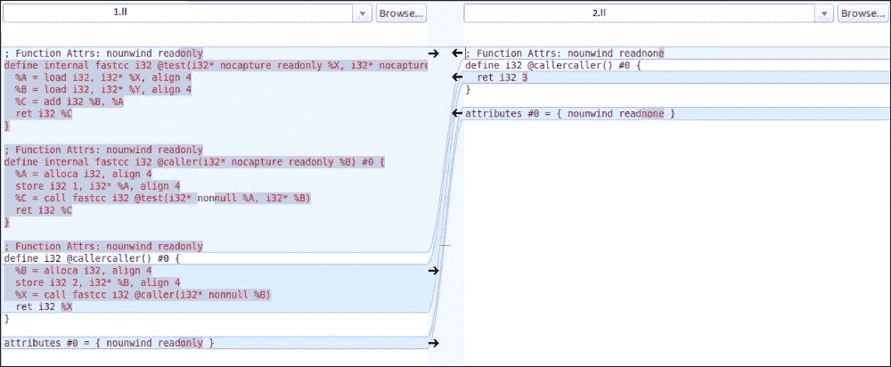

# 第四章. 基本 IR 转换

到目前为止，我们已经看到了 IR 如何独立于其目标，以及它如何被用来为特定的后端生成代码。为了为后端生成高效的代码，我们通过运行一系列分析和转换 Pass 来优化前端生成的 IR，使用 LLVM Pass 管理器。我们必须注意，编译器中发生的许多优化都发生在 IR 上，其中一个原因是 IR 是可重定位的，同一组优化对于多个目标都是有效的。这减少了为每个目标编写相同优化的工作量。也有一些特定于目标的优化；它们在选择 DAG 层级发生，我们将在后面看到。IR 成为优化目标的另一个原因是 LLVM IR 是 SSA 形式，这意味着每个变量只被分配一次，每个变量的新赋值本身就是一个新变量。这种表示的一个非常明显的优点是我们不必进行到达定义分析，其中某个变量被赋予另一个变量的值。SSA 表示法也有助于许多优化，如常量传播、死代码消除等。接下来，我们将看到一些重要的 LLVM 优化，LLVM Pass 基础设施的作用，以及我们如何使用 opt 工具执行不同的优化。

在本章中，我们将涵盖以下主题：

+   Opt 工具

+   Pass 和 Pass 管理器

+   在自己的 Pass 中使用其他 Pass 信息

+   IR 简化示例

+   IR 组合示例

# Opt 工具

**Opt** 是在 LLVM IR 上运行的 LLVM 优化器和分析工具，用于优化 IR 或生成关于它的分析。我们在第一章中看到了对 opt 工具的非常基本的介绍，以及如何使用它来运行分析和转换 Pass。在本节中，我们将了解 opt 工具还能做什么。我们必须注意，opt 是一个开发者工具，它提供的所有优化都可以从前端调用。

使用 opt 工具，我们可以指定所需的优化级别，这意味着我们可以指定从 `O0`、`O1`、`O2` 到 `O3`（`O0` 是最不优化的代码，`O3` 是最优化代码）的优化级别。除了这些，还有一个优化级别 `Os` 或 `Oz`，它处理空间优化。调用这些优化之一的语法是：

```cpp
$ opt -Ox -S input.ll

```

在这里，x 代表优化级别，其值可以是 0 到 3 或 s 或 z。这些优化级别与 Clang 前端指定的类似。`-O0` 表示没有优化，而 `–O1` 表示只启用少量优化。`–O2` 是一个适度的优化级别，而 `–O3` 是最高级别的优化，它与 `–O2` 类似，但它允许执行耗时更长或可能生成更大代码的优化（O3 级别并不保证代码是最优化和高效的，它只是说明编译器会尝试更多优化代码，在这个过程中可能会破坏某些东西）。`–Os` 表示针对大小的优化，基本上不运行会增加代码大小的优化（例如，它会移除 `slp-vectorizer` 优化）并执行减少代码大小的优化（例如，指令组合优化）。

我们可以直接将 opt 工具指向运行所需的具体 pass。这些 pass 可以是已经定义并列举在 [`llvm.org/docs/Passes.html`](http://llvm.org/docs/Passes.html) 中的 pass，或者是我们自己编写的 pass。上述链接中列出的 pass 也在 `-O1`、`-O2` 和 `-O3` 的优化级别中运行。要查看在某个优化级别正在运行哪个 pass，请使用 `-debug-pass=Structure` 命令行选项与 opt 工具一起使用。

让我们通过一个例子来演示 `O1` 和 `O2` 优化级别的差异。`O3` 级别通常比 `O2` 级别多一个或两个遍历。所以，让我们举一个例子，看看 `O2` 优化级别如何优化代码。将测试代码写入 `test.ll` 文件：

```cpp
define internal i32 @test(i32* %X, i32* %Y)
{  
    %A = load i32, i32* %X
    %B = load i32, i32* %Y
    %C = add i32 %A, %B
    ret i32 %C
}
define internal i32 @caller(i32* %B)
{
    %A = alloca i32
    store i32 1, i32* %A
    %C = call i32 @test(i32* %A, i32* %B)
    ret i32 %C
}
define i32 @callercaller()
{
    %B = alloca i32
    store i32 2, i32* %B
    %X = call i32 @caller(i32* %B)
    ret i32 %X
}
```

在这个测试代码中，`callercaller` 函数调用 `caller` 函数，而 `caller` 函数又调用 `test` 函数，该函数执行两个数字的加法并返回值给其调用者，然后调用者将值返回给 `callercaller` 函数。

现在，运行 `O1` 和 `O2` 优化级别，如下所示：

```cpp
$ opt -O1 -S test.ll > 1.ll
$ opt -O2 -S test.ll > 2.ll

```

以下截图显示了 `O1` 和 `O2` 优化级别优化代码的差异：



如我们所见，`O2` 优化了函数调用和 `Add` 操作，并直接从 `callercaller` 函数返回结果。这是由于 `O2` 优化运行了 `always-inline` pass，它内联了所有函数调用并将代码视为一个大的函数。然后，它还运行了 `globaldce` pass，该 pass 从代码中消除了不可达的内部部分。之后，它运行 `constmerge`，将重复的全局常量合并为单个常量。它还执行了一个全局值编号 pass，该 pass 消除了部分或完全冗余的指令，并消除了冗余的加载指令。

# Pass 和 Pass Manager

LLVM 的 `Pass` 基础设施是 LLVM 系统的许多重要特性之一。有多个分析和优化遍历可以使用这个基础设施运行。LLVM 遍历的起点是 `Pass` 类，它是所有遍历的超类。我们需要从一些预定义的子类中继承，考虑到我们的遍历将要实现的功能。

+   **ModulePass**: 这是最高级的超类。通过继承这个类，我们可以一次性分析整个模块。模块内的函数可以不按特定顺序引用。要使用它，编写一个继承自 `ModulePass` 子类的子类，并重载 `runOnModule` 函数。

    ### 注意

    在讨论其他 `Pass` 类之前，让我们看看 `Pass` 类覆盖的三个虚拟方法：

    +   **doInitialization**: 这意味着执行不依赖于当前正在处理的函数的初始化操作。

    +   **runOn{Passtype}**: 这是实现我们子类以实现遍历功能的方法。对于 `FunctionPass`，这将对应于 `runOnFunction`，对于 `LoopPass`，将对应于 `runOnLoop` 等。

    +   **doFinalization**: 当 `runOn{Passtype}` 为程序中的每个函数完成工作后，将调用此方法。

+   **FunctionPass**: 这些遍历操作在模块中的每个函数上执行，独立于模块中的其他函数。没有定义函数处理的顺序。它们不允许修改正在处理的函数以外的函数，也不允许从当前模块中添加或删除函数。要实现 `FunctionPass`，我们可能需要通过在 `runOnFunction` 方法中实现来重载前面提到的三个虚拟函数。

+   **BasicBlockPass**: 这些遍历操作一次处理一个基本块，独立于程序中存在的其他基本块。它们不允许添加或删除任何新的基本块或更改控制流图（CFG）。它们也不允许执行 `FunctionPass` 不允许执行的操作。为了实现，它们可以重载 `FunctionPass` 的 `doInitialization` 和 `doFinalization` 方法，或者重载它们自己的虚拟方法，用于前面提到的两个方法和 `runOnBasicBlock` 方法。

+   **LoopPass**: 这些遍历操作针对函数中的每个循环进行处理，独立于函数内的其他所有循环。循环的处理方式是，最外层的循环最后执行。要实现 `LoopPass`，我们需要重载 `doInitialization`、`doFinalization` 和 `runOnLoop` 方法。

现在，让我们看看如何开始编写自定义遍历。让我们编写一个遍历，该遍历将打印所有函数的名称。

在开始编写遍历的实现之前，我们需要在代码的几个地方进行更改，以便遍历被识别并可以运行。

我们需要在 LLVM 树下创建一个目录。让我们创建一个目录，`lib/Transforms/FnNamePrint`。在这个目录中，我们需要创建一个 `Makefile`，内容如下，这将允许我们的 `pass` 被编译：

```cpp
LEVEL = ../../..

LIBRARYNAME = FnNamePrint

LOADABLE_MODULE = 1

include $(LEVEL)/Makefile.common
```

这指定了所有 `.cpp` 文件都应该编译并链接成一个共享对象，该对象将在 `build-folder` 的 `lib` 文件夹中可用（`build-folder/lib/FnNamePrint.so`）。

现在，让我们开始编写实际的 `pass` 实现。我们需要在 `lib/Transforms/FnNamePrint` 中创建 `pass` 的源文件：让我们命名为 `FnNamePrint.cpp`。现在的第一步是选择正确的子类。在这种情况下，因为我们试图打印每个函数的名称，所以 `FunctionPass` 类将一次处理一个函数来满足我们的目的。此外，我们只打印函数的名称，而不修改其内部的内容，所以我们选择 `FunctionPass` 以保持简单。我们也可以使用 `ModulePass`，因为它是一个 `Immutable Pass`。

现在，让我们编写 `pass` 实现的源代码，它看起来是这样的：

```cpp
#include "llvm/Pass.h"
#include "llvm/IR/Function.h"
#include "llvm/Support/raw_ostream.h"

using namespace llvm;

namespace {
  struct FnNamePrint: public FunctionPass {
    static char ID;
    FnNamePrint () : FunctionPass(ID) {}
    bool runOnFunction(Function &F) override {
      errs() << "Function " << F.getName() << '\n';
      return false;
    }
  };
}

char FnNamePrint::ID = 0;static RegisterPass< FnNamePrint > X("funcnameprint","Function Name Print", false, false);
```

在前面的代码中，我们首先 `include` 所需的头文件，并使用 `llvm` 命名空间：

```cpp
#include "llvm/Pass.h"
#include "llvm/IR/Function.h"
#include "llvm/Support/raw_ostream.h"

using namespace llvm;
```

我们将我们的 `pass` 声明为一个结构体，`FnNamePrint`，它是 `FunctionPass` 的子类。在 `runOnFunction` 中，我们实现了打印函数名的逻辑。最后返回的 `bool` 值表示我们是否在函数内进行了任何修改。如果进行了修改，则返回 `True`，否则返回 `false`。在我们的例子中，我们没有进行任何修改，所以返回 `false`。

```cpp
struct FnNamePrint: public FunctionPass {
  static char ID;
  FnNamePrint () : FunctionPass(ID) {}
  bool runOnFunction(Function &F) override {
    errs() << "Function " << F.getName() << '\n';
    return false;
    }
  };
}
```

然后，我们声明该 `pass` 的 `ID`，它用于识别该 `pass`：

```cpp
char FnNamePrint::ID = 0;
```

最后，我们需要将 `pass` 注册到 `Pass Manager` 中。第一个参数是 `opt` 工具用于识别此 `pass` 的 `Pass` 名称。第二个参数是实际的 `Pass` 名称。第三个和第四个参数指定 `pass` 是否修改了 `cfg` 以及它是否是一个分析 `pass`。

```cpp
static RegisterPass< FnNamePrint > X("funcnameprint","Function Name Print", false, false);
```

### 注意

`pass` 的实现已完成。现在，在我们使用它之前，我们需要使用 `make` 命令构建 LLVM，这将构建构建（`build-folder/lib/FnNamePrint.so`）文件夹中的共享对象。

现在，我们可以使用以下方式使用 `opt` 工具在测试用例上运行 `pass`：

```cpp
$ opt -load path-to-llvm/build/lib/FnNamePrint.so -funcnameprint test.ll

```

`load` 命令行选项指定了从哪里获取 `pass` 的共享对象，`–funcnameprint` 是用于告诉 opt 工具运行我们编写的 `pass` 的选项。该 `pass` 将打印出测试用例中所有函数的名称。对于第一部分中的示例，它将打印出：

```cpp
Function test
Function caller
Function callercaller

```

因此，我们开始了编写 `Pass`。现在，我们将看到 `PassManager` 类在 LLVM 中的重要性。

`PassManager` 类安排运行的 passes 以实现高效。`PassManager` 被所有运行 passes 的 LLVM 工具使用。确保 passes 之间的交互正确是 `PassManager` 的责任。因为它试图以优化的方式执行 passes，它必须了解 passes 如何相互交互以及 passes 之间的不同依赖关系。

一个 pass 可以指定对其他 passes 的依赖，即哪些 passes 需要在当前 pass 执行之前运行。它还可以指定由当前 pass 执行而失效的 passes。`PassManager` 在执行 pass 之前获取分析结果。我们将在后面看到 pass 如何指定此类依赖。

`PassManager` 的主要工作是避免反复计算分析结果。这是通过跟踪哪些分析可用、哪些已失效以及哪些分析是必需的来实现的。`PassManager` 跟踪分析结果的生命周期，并在不需要时释放持有分析结果的内存，从而实现最优的内存使用。

`PassManager` 将 passes 管道化以获得更好的内存和缓存结果，从而改善编译器的缓存行为。当给出一系列连续的 `FunctionPass` 时，它将在第一个函数上执行所有 `FunctionPass`，然后在第二个函数上执行所有 `FunctionPass`，依此类推。这改善了缓存行为，因为它只处理 LLVM 表示中的单个函数部分，而不是整个程序。

`PassManager` 还指定了 `–debug-pass` 选项，我们可以用它来查看一个 pass 如何与其他 pass 交互。我们可以使用 `–debug-pass=Argument` 选项查看所有运行的 passes。我们可以使用 `–debug-pass=Structure` 选项来查看 passes 的运行情况。它还会给出运行过的 passes 的名称。让我们以本章第一节的测试代码为例：

```cpp
$ opt -O2 -S test.ll -debug-pass=Structure
$ opt -load /build-folder/lib/LLVMFnNamePrint.so test.ll -funcnameprint -debug-pass=Structure

Pass Arguments:  -targetlibinfo -tti -funcnameprint -verify
Target Library Information
Target Transform Information
 ModulePass Manager
 FunctionPass Manager
 Function Name Print
 Module Verifier
Function test
Function caller
Function callercaller

```

在输出中，`Pass Arguments` 给出了运行的 passes，以下列表是运行每个 pass 所使用的结构。紧接在 `ModulePass` `Manager` 之后的 Passes 将显示每个模块运行的 passes（这里为空）。`FunctionPass` `Manager` 层级中的 passes 显示这些 passes 是按函数运行的（这里是 `Function Name Print` 和 `Module Verifier`），这是预期的结果。

`PassManger` 还提供了一些其他有用的标志，其中一些如下：

+   **time-passes**: 这提供了关于 pass 以及其他排队 passes 的时间信息。

+   **stats**: 这会打印每个 pass 的统计信息。

+   **instcount**: 这会收集所有指令的计数并报告它们。`–stats` 也必须传递给 opt 工具，以便 `instcount` 的结果可见。

# 在当前 Pass 中使用其他 Pass 信息

为了使遍历管理器最优运行，它需要知道遍历之间的依赖关系。每个遍历都可以自己声明其依赖关系：在执行此遍历之前需要执行的分析遍历以及当前遍历运行后将被使无效的遍历。为了指定这些依赖关系，一个遍历需要实现`getAnalysisUsage`方法。

```cpp
virtual void getAnalysisUsage(AnalysisUsage &Info) const;
```

使用此方法，当前遍历可以通过在`AnalysisUsage`对象中填写详细信息来指定所需和无效化的集合。为了填写信息，遍历需要调用以下任何一种方法：

## `AnalysisUsage::addRequired<>`方法

此方法安排在当前遍历之前执行一个遍历。一个例子是：对于内存复制优化，它需要别名分析的结果：

```cpp
void getAnalysisUsage(AnalysisUsage &AU) const override {
AU.addRequired<AliasAnalysis>();
…
…
}
```

通过添加需要运行的遍历，确保在`MemCpyOpt`遍历之前运行`Alias Analysis Pass`。这也确保了如果`Alias Analysis`已被其他遍历使无效，它将在运行`MemCpyOpt`遍历之前运行。

## `AnalysisUsage::addRequiredTransitive<>`方法

当分析链到其他分析以获取结果时，应使用此方法而不是`addRequired`方法。也就是说，当我们需要保留分析遍历的运行顺序时，我们使用此方法。例如：

```cpp
void DependenceAnalysis::getAnalysisUsage(AnalysisUsage &AU) const {
  …
  AU.addRequiredTransitive<AliasAnalysis>();
  AU.addRequiredTransitive<ScalarEvolution>();
  AU.addRequiredTransitive<LoopInfo>();
}
```

在这里，`DependenceAnalysis`通过`AliasAnalysis`、`ScalarEvolution`和`LoopInfo`遍历链到结果。

## `AnalysisUsage::addPreserved<>`方法

通过使用此方法，一个遍历可以指定它在运行时不会使其他遍历的分析无效：也就是说，如果存在，它将保留现有信息。这意味着后续需要该分析的遍历不需要再次运行。

例如，在前面看到的`MemCpyOpt`遍历的情况下，它需要`AliasAnalysis`的结果，并且还保留了它们。此外：

```cpp
void getAnalysisUsage(AnalysisUsage &AU) const override {
      ……
      AU.addPreserved<AliasAnalysis>();
      …..
    }
```

为了详细了解所有这些是如何相互关联和协同工作的，你可以选择任何转换遍历，查看源代码，你就会知道它们是如何从其他遍历获取信息以及如何使用这些信息的。

# 指令简化示例

在本节中，我们将看到如何在 LLVM 中将指令折叠成更简单的形式。在这里，不会创建新的指令。指令简化包括常量折叠：

```cpp
sub i32 2, 1 -> 1
```

即，它将`sub`指令简化为常量值`1`。

它也可以处理非常量操作数：

```cpp
or i32 %x, 0 -> %x
```

它返回变量`%x`的值

```cpp
and i32 %x %x -> %x

```

在这种情况下，它返回一个已存在的值。

简化指令的方法实现位于`lib/Analysis/InstructionSimplify.cpp`。

处理指令简化的某些重要方法包括：

+   **SimplifyBinOp 方法**：此方法用于简化二进制运算，如加法、减法和乘法等。它的函数签名如下：

    ```cpp
    static Value *SimplifyBinOp(unsigned Opcode, Value *LHS, 
    Value *RHS, const Query &Q, unsigned MaxRecurse)
    ```

在这里，我们通过 `Opcode` 指的是我们试图简化的操作符指令。LHS 和 RHS 是操作符两边的操作数。`MaxRecurse` 是我们指定的递归级别，在此之后，例程必须停止尝试简化指令。

在这个方法中，我们对 `Opcode` 有一个 switch 案例处理：

```cpp
switch (Opcode) {
```

使用这个 `Opcode`，该方法决定需要调用哪个函数进行简化。以下是一些方法：

+   **SimplifyAddInst**：此方法尝试在操作数已知时折叠 `Add` 操作符的结果。以下是一些折叠的例子：

    ```cpp
    X + undef -> undef
    X + 0 -> X
    X + (Y - X) -> Y or (Y - X) + X -> Y
    ```

函数 `static Value *SimplifyAddInst(Value *Op0, Value *Op1, bool isNSW, bool isNUW, const Query &Q, unsigned MaxRecurse )` 中最后简化的代码看起来像这样：

```cpp
if (match(Op1, m_Sub(m_Value(Y), m_Specific(Op0))) ||
      match(Op0, m_Sub(m_Value(Y), m_Specific(Op1))))
    return Y;
```

在这里，第一个条件匹配表达式中的 `(Y-X)` 值，因为 `Operand1: m_Value(Y)` 表示 `Y` 的值，而 `m_Specific(Op0)` 表示 `X`。一旦匹配成功，它将表达式折叠为常量值 `Y` 并返回它。对于条件的第二部分也是类似的情况：

+   **SimplifySubInst**：此方法尝试在操作符已知时折叠 `subtract` 操作符的结果。以下是一些相同示例：

    ```cpp
    X - undef -> undef
    X - X -> 0
    X - 0 -> X
    X - (X - Y) -> Y
    ```

指令匹配和折叠的执行方式类似于 `SimplifyAddInst` 中所示：

+   **SimplifyAndInst**：与前面两种方法类似，它尝试折叠逻辑运算符 And 的结果。以下是一些示例：

    ```cpp
    A & ~A  =  ~A & A  =  0
    ```

在该方法中，代码看起来像这样：

```cpp
if (match(Op0, m_Not(m_Specific(Op1))) ||
      match(Op1, m_Not(m_Specific(Op0))))
    return Constant::getNullValue(Op0->getType());
```

在这里，它尝试匹配 `A` 和 `~A`，并在匹配到条件时返回一个 `Null` 值，即 0。

因此，我们已经看到了一些指令简化的例子。那么，如果我们可以用一组更有效的指令替换一组指令，我们该怎么办呢？

# 指令组合

指令组合是 LLVM 传递和编译技术，其中我们用更有效且在更少的机器周期内执行相同结果的指令替换一系列指令。指令组合不会改变程序的 CFG，主要用于代数简化。指令组合与指令简化的主要区别在于，在指令简化中我们不能生成新的指令，而在指令组合中是可能的。此传递通过指定 opt 工具的 `–instcombine` 参数来运行，并在 `lib/transforms/instcombine` 文件夹中实现。`instcombine` 传递组合

```cpp
%Y = add i32 %X, 1
%Z = add i32 %Y, 1
into:
%Z = add i32 %X, 2
```

它已删除一个冗余的 `add` 指令，因此将两个 `add` 指令合并为一个。

LLVM 页面指出，此传递确保在程序上执行以下规范化的操作：

+   二元运算符的常数操作数被移动到 RHS。

+   带有常数操作数的位运算符与位移运算一起分组，首先执行位移运算，然后是 'or' 操作，'and' 操作，最后是 'xor' 操作。

+   如果可能，比较运算符从 <,>,<=,>= 转换为 == 或 !=。

+   所有操作布尔值的 `cmp` 指令都被替换为逻辑操作。

+   添加 X，X 表示为 X*2，即 X<<1

+   常数为 2 的幂的乘法器被转换为位移操作。

这个过程从 `bool InstCombiner::runOnFunction(Function &F)` 开始，该函数位于 `InstructionCombining.cpp` 文件中。在 `lib/Transform/InstCombine` 文件夹下有不同文件，用于组合与不同指令相关的指令。在尝试组合指令之前，这些方法试图简化它们。其中一些用于简化 `instcombine` 模块的简化方法包括：

+   **SimplifyAssociativeOrCommutative 函数**：它对具有结合律或交换律的运算符进行简化。对于交换律运算符，它按复杂度递增的顺序从右到左对操作数进行排序。对于形式为 "`(X op Y) op Z`" 的结合律运算，如果 (Y op Z) 可以简化，则将其转换为 "`X op (Y op Z)`"。

+   **tryFactorization 函数**：该方法尝试通过使用运算符的交换律和分配律提取公共项来简化二进制运算。例如，`(A*B)+(A*C)` 被简化为 `A*(B+C)`。

现在，让我们看看指令组合。如前所述，不同的功能在不同的文件中实现。让我们以一个示例测试代码为例，看看在哪里添加代码，以便为我们的测试代码执行指令组合。

让我们在 `test.ll` 中编写测试代码，以匹配模式 `(A | (B ^ C)) ^ ((A ^ C) ^ B)`，该模式可以简化为 `(A & (B ^ C))`：

```cpp
define i32 @testfunc(i32 %x, i32 %y, i32 %z) {
%xor1 = xor i32 %y, %z
%or = or i32 %x, %xor1
%xor2 = xor i32 %x, %z
%xor3 = xor i32 %xor2, %y
%res = xor i32 %or, %xor3
ret i32 %res
}
```

LLVM 中处理 "And"、"Or" 和 "Xor" 等运算符的代码位于 `lib/Transforms/InstCombine/InstCombineAndOrXor.cpp` 文件中。

在 `InstCombineAndOrXor.cpp` 文件中，在 `InstCombiner::visitXor(BinaryOperator &I)` 函数中，转到 `if` 条件 `If` `(Op0I && Op1I)` 并添加以下代码片段：

```cpp
If (match(Op01, m_Or(m_Xor(m_Value(B), m_Value(C)), m_Value(A)))
&& match(Op1I, m_Xor( m_Xor(m_Specific(A), m_Specific(C)), m_Specific(B)))) {
  return BinaryOperator::CreateAnd(A, Builder->CreateXor(B,C));
}
```

如此明显，添加的代码是为了匹配模式 `(A | (B ^ C)) ^ ((A ^ C) ^ B)` 并在匹配时返回 `(A & (B ^ C))`。

要测试代码，构建 LLVM 并使用此测试代码运行 `instcombine` Pass，查看输出。

```cpp
$ opt –instcombine –S test.ll
define i32 @testfunc(i32 %x, i32 %y, i32 %z) {
%1 = xor i32 %y, %z
%res = and i32 %1, %x
ret i32 %res
}

```

因此，输出显示现在只需要一个 `xor` 和一个 `and` 操作，而不是之前所需的四个 `xor` 和一个 `or` 操作。

要理解和添加更多转换，您可以查看 `InstCombine` 文件夹中的源代码。

# 摘要

因此，在本章中，我们探讨了如何将简单的转换应用于 IR。我们探讨了 opt 工具、LLVM Pass 基础设施、`Passmanager` 以及如何在 Pass 之间使用信息。我们以指令简化和指令组合的示例结束本章。在下一章中，我们将看到一些更高级的优化，如循环优化、标量演化等，在这些优化中，我们将操作代码块而不是单个指令。
