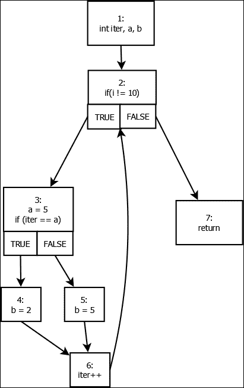
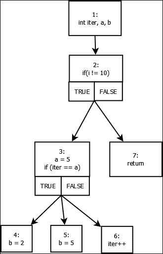
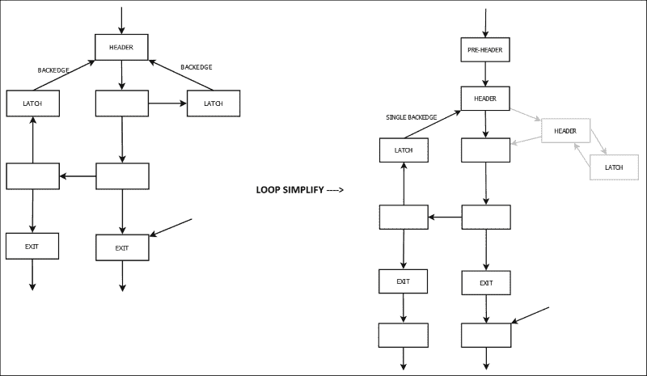
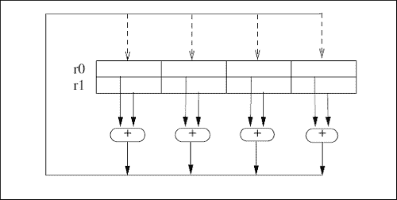
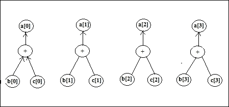

# 第五章：高级 IR 块转换

在上一章中，我们已经介绍了一些优化，这些优化主要在指令级别。在本章中，我们将探讨块级别的优化，我们将优化一段代码到一个更简单的形式，这使得代码更加高效。我们将首先探讨在 LLVM 中如何表示循环，使用支配关系和 CFG 来优化循环。我们将使用**循环简化**（`LoopSimplify`）和**循环不变式代码移动**优化来进行循环处理。然后我们将看到标量值在程序执行过程中的变化，以及如何将这种**标量演化优化**的结果用于其他优化。然后我们将探讨 LLVM 如何表示其内建函数，称为 LLVM 内联函数。最后，我们将探讨 LLVM 通过理解其向量化方法来处理并行概念。

在本章中，我们将探讨以下主题：

+   循环处理

+   标量演化

+   LLVM 内联函数

+   向量化

# 循环处理

在开始循环处理和优化之前，我们必须对 CFG 和支配信息的概念有一个初步的了解。CFG 是程序的控制流图，它展示了程序如何通过各种基本块被执行。通过支配信息，我们了解到 CFG 中各个基本块之间的关系。

在 CFG 中，我们说节点 `d` 支配节点 `n`，如果通过 `n` 的每条路径（从输入到输出的路径）都必须通过 `d`。这表示为 `d -> n`。图 `G = (V, E)`，其中 `V` 是基本块的集合，`E` 是定义在 `V` 上的支配关系，被称为支配树。

让我们通过一个示例来展示程序的控制流图（CFG）和相应的支配树。

在此处放置示例代码：

```cpp
void fun() {
  int iter, a, b;

  for (iter = 0; iter < 10; iter++) {
    a = 5;
    if (iter == a)
      b = 2;
    else
      b = 5;
  }
}
```

前述代码的 CFG 看起来如下：



从你所学的支配关系和支配树，前一个 CFG 的支配树看起来如下：



第一幅图显示了前述代码的 CFG，下一幅图显示了相同 CFG 的支配树。我们已经对 CFG 的各个组件进行了编号，我们可以看到在 CFG 中，2 支配着 3，2 也支配着 4、5 和 6。3 支配着 4、5 和 6，并且是这些节点的直接支配者。4 和 5 之间没有支配关系。6 不是 5 的支配者，因为存在通过 4 的另一个路径，同样地，由于同样的原因，4 也不支配 6。

LLVM 中的所有循环优化和转换都源自于位于 `lib/Analysis` 目录下的 `LoopPass.cpp` 文件中实现的 `LoopPass` 类。`LPPassManager` 类负责处理所有的 `LoopPasses`。

开始处理循环最重要的类是`LoopInfo`类，它用于识别代码中的自然循环以及了解 CFG 中各种节点的深度。自然循环是 CFG 中的循环结构。为了在 CFG 中定义一个自然循环，我们必须知道什么是回边：它是在 CFG 中源节点支配目标节点的边。一个自然循环可以通过一个回边`a->d`来定义，它定义了 CFG 的一个子图，其中`d`是头节点，它包含所有可以到达`a`而不必到达`d`的其他基本块。

我们可以在前面的图中看到回边`6->2`形成了一个由节点`2`、`3`、`4`、`5`和`6`组成的自然循环。

下一个重要步骤是将循环简化为规范形式，这包括向循环中插入一个预头节点，这反过来又确保从循环外部只有一个入口边到循环头。它还插入循环退出块，确保所有从循环退出的块只有来自循环内部的先导。这些预头节点和退出块的插入有助于后续的循环优化，例如循环独立代码移动。

循环简化还确保循环只有一个回边，即如果循环头有超过两个先导（从预头节点块和多个锁存器到循环），我们只调整这个循环锁存器。一种实现方式是插入一个新块，这个新块是所有回边的目标，并使这个新块跳转到循环头。让我们看看**循环简化遍历**后循环看起来如何。我们将能够看到插入了一个预头节点，创建了新的退出块，并且只有一个回边。



现在，在从`LoopInfo`获取所需信息并将循环简化为规范形式之后，我们将探讨一些循环优化。

主要的循环优化之一是**循环不变代码移动**（**LICM**）优化。这个遍历尝试尽可能从循环体中移除代码。移除代码的条件是这段代码在循环内是不变的，即这部分代码的输出不依赖于循环执行，并且它将在循环的每次迭代中保持相同。这是通过将这段代码移动到预头节点块或将代码移动到退出块来实现的。这个遍历在`lib/TransformsScalar/LICM.cpp`文件中实现。如果我们查看循环的代码，我们会看到它需要在运行之前运行`LoopInfo`和`LoopSimplify`遍历。它还需要`AliasAnalysis`信息。别名分析是必要的，以便将循环不变加载和调用移出循环。如果没有加载和调用在循环内部与存储的任何内容别名，我们可以将这些移出循环。这也帮助了内存的标量提升。

让我们通过一个例子来看看 LICM 是如何完成的。

让我们在文件 `licm.ll` 中编写这个测试用例：

```cpp
$ cat licm.ll
define void @func(i32 %i) {
Entry:
 br label %Loop
Loop:
 %j = phi i32 [ 0, %Entry ], [ %Val, %Loop ]
 %loopinvar = mul i32 %i, 17
 %Val = add i32 %j, %loopinvar
 %cond = icmp eq i32 %Val, 0
 br i1 %cond, label %Exit, label %Loop
Exit: 
 ret void
}

```

这个 `testcase` 在测试代码中有一个由 Loop 块表示的循环，循环条件是 `br i1 %cond`，`label %Exit`，`label %Loop`（循环的 Latch 部分）。我们可以看到 `%j` 值，它是作为归纳变量被使用的，是在使用 phi 指令之后推导出来的。基本上，它告诉如果控制来自 Entry 块，则选择值 `0`，如果控制来自 Loop 块，则选择 `%Val`。在这里，不变代码可以看作是 `%loopinvar = mul i32 %i, 17`，因为 `%loopinvar` 的值不依赖于循环的迭代次数，只依赖于函数参数。所以当我们运行 LICM 过滤器时，我们期望这个值能够从循环中提升出来，从而防止在循环的每次迭代中计算它。

让我们运行 `licm` 过滤器并查看输出：

```cpp
$ opt -licm licm.ll -o licm.bc
$ llvm-dis licm.bc -o licm_opt.ll
$ cat licm_opt.ll
; ModuleID = 'licm.bc'

define void @func(i32 %i) {
Entry:
 %loopinvar = mul i32 %i, 17
 br label %Loop

Loop: 
; preds = %Loop, %Entry
 %j = phi i32 [ 0, %Entry ], [ %Val, %Loop ]
 %Val = add i32 %j, %loopinvar
 %cond = icmp eq i32 %Val, 0
 br i1 %cond, label %Exit, label %Loop

Exit: 
; preds = %Loop
 ret void
}

```

正如我们在输出中看到的，计算 `%loopinvar = mul i32 %i, 17` 已经从循环中提升出来，这正是我们期望的输出。

我们还有许多其他的循环优化，例如**循环旋转**、**循环交换**、**循环展开**等等。这些优化的源代码可以在 LLVM 文件夹 `lib/Transforms/Scalar` 下找到，以获得对这些优化的更多理解。在下一节中，我们将看到标量演化的概念。

# 标量演化

通过标量演化，我们指的是一个标量值在程序中随着代码执行而变化的情况。我们查看一个特定的标量值，并观察它是如何被推导出来的，它依赖于哪些其他元素，这些元素是否在编译时已知，以及执行了哪些操作。我们需要查看代码块而不是单个指令。一个标量值由两个元素组成，一个变量和一个常数步长的操作。构建这个标量值的变量元素在编译时是未知的，其值只能在运行时知道。另一个元素是常数部分。这些元素本身可能可以递归地分解成其他元素，例如一个常数、一个未知值或一个算术操作。

这里的主要思想是在编译时查看包含未知部分的完整标量值，并观察这个值在执行过程中的变化，并尝试利用这一点进行优化。一个例子是移除一个与程序中其他某个值具有相似标量演化的冗余值。

在 LLVM 中，我们可以使用标量演化来分析包含常见整数算术运算的代码。

在 LLVM 中，`ScalarEvolution` 类在 `include/llvm/Analysis` 中实现，这是一个 LLVM 通过，可以用来分析循环中的标量表达式。它能够识别通用归纳变量（循环中值是迭代次数函数的变量）并使用 SCEV 类的对象来表示它们，SCEV 类用于表示程序中分析的表达式。使用这种分析可以获得迭代次数和其他重要分析。这种标量演化分析主要用于归纳变量替换和循环强度降低。

现在我们举一个例子，并运行标量演化通过它，看看它生成什么输出。

编写一个包含循环和一些循环内标量值的测试用例`scalevl.ll`。

```cpp
$ cat scalevl.ll
define void @fun() {
entry:
 br label %header
header:
 %i = phi i32 [ 1, %entry ], [ %i.next, %body ]
 %cond = icmp eq i32 %i, 10
 br i1 %cond, label %exit, label %body
body:
 %a = mul i32 %i, 5
 %b = or i32 %a, 1
 %i.next = add i32 %i, 1
 br label %header
exit: 
 ret void
}

```

在这个测试用例中，我们有一个由头和体块组成的循环，其中`%a`和`%b`是感兴趣的循环体内的标量。让我们运行标量演化通过这个，看看输出结果：

```cpp
$ opt -analyze -scalar-evolution scalevl.ll
Printing analysis 'Scalar Evolution Analysis' for function 'fun':
Classifying expressions for: @fun
 %i = phi i32 [ 1, %entry ], [ %i.next, %body ]
 -->  {1,+,1}<%header> U: [1,11) S: [1,11)    Exits: 10
 %a = mul i32 %i, 5
 -->  {5,+,5}<%header> U: [5,51) S: [5,51)    Exits: 50
 %b = or i32 %a, 1
 -->  %b U: [1,0) S: full-set                 Exits: 51
 %i.next = add i32 %i, 1
 -->  {2,+,1}<%header> U: [2,12) S: [2,12)    Exits: 11
Determining loop execution counts for: @fun
Loop %header: backedge-taken count is 9
Loop %header: max backedge-taken count is 9

```

如我们所见，标量演化通过输出的范围显示了特定变量（`U`代表无符号范围，`S`代表有符号范围，这里两者相同）的值域以及退出值，即循环运行其最后一次迭代时该变量的值。例如，`%i`的值域为`[1,11)`，这意味着起始迭代值为`1`，当`%i`的值变为`11`时，条件`%cond = icmp eq i32 %i, 10`变为假，循环中断。因此，当`%i`退出循环时的值为`10`，这在输出中用`Exits: 10`表示。

`{x,+,y}`形式的值，例如`{2,+,1}`，表示加法递归，即在循环执行期间改变值的表达式，其中 x 代表第 0 次迭代的基值，y 代表在每次后续迭代中添加到它上面的值。

输出还显示了循环在第一次运行后的迭代次数。这里，它显示了`9`的值，表示回边取用，即循环总共运行了`10`次。最大回边取用值是永远不会小于回边取用值的最小值，这里为`9`。

这是这个示例的输出，你可以尝试一些其他的测试用例，看看这个通过会输出什么。

# LLVM 内置函数

内置函数是编译器内部构建的函数。编译器知道如何以最优化方式实现这些函数的功能，并为特定后端替换成一组机器指令。通常，函数的代码会内联插入，从而避免函数调用的开销（在许多情况下，我们确实调用了库函数。例如，对于列在[`llvm.org/docs/LangRef.html#standard-c-library-intrinsics`](http://llvm.org/docs/LangRef.html#standard-c-library-intrinsics)中的函数，我们调用`libc`）。这些在其他编译器中也被称为内置函数。

在 LLVM 中，这些内建函数在 IR 级别的代码优化期间引入（程序代码中编写的内建函数可以通过前端直接发出）。这些函数名将以前缀"`llvm.`"开头，这是 LLVM 中的一个保留词。这些函数始终是外部的，用户不能在其代码中指定这些函数的主体。在我们的代码中，我们只能调用这些内建函数。

在本节中，我们不会深入探讨细节。我们将通过一个示例来了解 LLVM 如何使用其自身的内建函数优化代码的某些部分。

让我们编写一段简单的代码：

```cpp
$ cat intrinsic.cpp
int func()
{
 int a[5];

 for (int i = 0; i != 5; ++i)
 a[i] = 0;

 return a[0];
}

```

现在，使用 Clang 生成 IR 文件。使用以下命令，我们将得到包含未优化 IR 且没有任何内建函数的`intrinsic.ll`文件。

```cpp
$ clang -emit-llvm -S intrinsic.cpp

```

现在，使用 opt 工具以 O1 优化级别优化 IR。

```cpp
$ opt -O1 intrinsic.ll -S -o -
; ModuleID = 'intrinsic.ll'
target datalayout = "e-m:e-i64:64-f80:128-n8:16:32:64-S128"
target triple = "x86_64-unknown-linux-gnu"

; Function Attrs: nounwind readnone uwtable
define i32 @_Z4funcv() #0 {
 %a = alloca [5 x i32], align 16
 %a2 = bitcast [5 x i32]* %a to i8*
 call void @llvm.memset.p0i8.i64(i8* %a2, i8 0, i64 20, i32 16, i1 false)
 %1 = getelementptr inbounds [5 x i32], [5 x i32]* %a, i64 0, i64 0
 %2 = load i32, i32* %1, align 16
 ret i32 %2
}

; Function Attrs: nounwind argmemonly
declare void @llvm.memset.p0i8.i64(i8* nocapture, i8, i64, i32, i1) #1

```

这里需要注意的重要优化是调用 LLVM 内建函数`llvm.memset.p0i8.i64`以填充数组值为`0`。内建函数可以用于在代码中实现向量化和并行化，从而生成更好的代码。它可能会调用`libc`库中最优化的`memset`调用版本，并且如果没有使用此函数，可能会选择完全省略此函数。

调用中的第一个参数指定了数组"`a`"，即需要填充值的目标数组。第二个参数指定了要填充的值。调用中的第三个参数指定了要填充的字节数。第四个参数指定了目标值的对齐方式。最后一个参数用于确定这是一个易失性操作还是非易失性操作。

在 LLVM 中有一系列这样的内建函数，其列表可以在[`llvm.org/docs/LangRef.html#intrinsic-functions`](http://llvm.org/docs/LangRef.html#intrinsic-functions)找到。

# 向量化

**向量化**是编译器的重要优化手段，我们可以将代码向量化以一次执行多个数据集上的指令。高级目标架构通常具有向量寄存器和向量指令——其中广泛的数据类型（通常是 128/256 位）可以加载到向量寄存器中，并且可以在这些寄存器集上执行操作，同时执行两个、四个，有时甚至八个操作，其成本与一个标量操作相当。

在 LLVM 中有两种向量化类型——**超字级并行**（**SLP**）和循环向量化。循环向量化处理循环中的向量化机会，而 SLP 向量化处理基本块中的直接代码的向量化。

向量指令执行**单指令多数据**（**SIMD**）操作；在多个数据通道上并行执行相同的操作。



让我们看看如何在 LLVM 基础设施中实现 SLP 向量化。

如代码本身所描述，LLVM 中 SLP 矢量化实现的灵感来源于 Ira Rosen、Dorit Nuzman 和 Ayal Zaks 在论文 *GCC 中的循环感知 SLP* 中描述的工作。LLVM SLP 矢量化传递实现自底向上的 SLP 矢量化器。它检测可以组合成向量存储的连续存储操作。接下来，它尝试将存储操作组合成向量存储。然后，它尝试使用 `use-def` 链构造可矢量化树。如果找到了有利的树，SLP 矢量化器就会在树上执行矢量化。

SLP 矢量化有三个阶段：

+   识别模式并确定它是否是有效的矢量化模式

+   确定矢量化代码是否有利可图

+   如果步骤 1 和 2 都成立，那么就矢量化代码

让我们来看一个例子：

考虑将两个数组的 `4` 个连续元素添加到第三个数组中。

```cpp
int a[4], b[4], c[4];

void addsub() {
a[0] = b[0] + c[0];
a[1] = b[1] + c[1];
a[2] = b[2] + c[2];
a[3] = b[3] + c[3];
}
```

前一种表达式的 IR 将看起来像这样：

```cpp
; ModuleID = 'addsub.c'

@a = global [4 x i32] zeroinitializer, align 4
@b = global [4 x i32] zeroinitializer, align 4
@c = global [4 x i32] zeroinitializer, align 4

; Function Attrs: nounwind
define void @addsub() {
entry:
  %0 = load i32, i32* getelementptr inbounds ([4 x i32], [4 x i32]* @b, i32 0, i32 0)
  %1 = load i32, i32* getelementptr inbounds ([4 x i32], [4 x i32]* @c, i32 0, i32 0)
  %add = add nsw i32 %1, %0
  store i32 %add, i32* getelementptr inbounds ([4 x i32], [4 x i32]* @a, i32 0, i32 0)
  %2 = load i32, i32* getelementptr inbounds ([4 x i32], [4 x i32]* @b, i32 0, i32 1)
  %3 = load i32, i32* getelementptr inbounds ([4 x i32], [4 x i32]* @c, i32 0, i32 1)
  %add1 = add nsw i32 %3, %2
  store i32 %add1, i32* getelementptr inbounds ([4 x i32], [4 x i32]* @a, i32 0, i32 1)
  %4 = load i32, i32* getelementptr inbounds ([4 x i32], [4 x i32]* @b, i32 0, i32 2)
  %5 = load i32, i32* getelementptr inbounds ([4 x i32], [4 x i32]* @c, i32 0, i32 2)
  %add2 = add nsw i32 %5, %4
  store i32 %add2, i32* getelementptr inbounds ([4 x i32], [4 x i32]* @a, i32 0, i32 2)
  %6 = load i32, i32* getelementptr inbounds ([4 x i32], [4 x i32]* @b, i32 0, i32 3)
  %7 = load i32, i32* getelementptr inbounds ([4 x i32], [4 x i32]* @c, i32 0, i32 3)
  %add3 = add nsw i32 %7, %6
  store i32 %add3, i32* getelementptr inbounds ([4 x i32], [4 x i32]* @a, i32 0, i32 3)
  ret void
}
```

前一个模式的表达式树可以可视化为一系列的存储和加载操作：



对于前面的表达式树，自底向上的 SLP 矢量化首先构建一个以存储指令开始的链：

```cpp
// Use the bottom up slp vectorizer to construct chains that start
// with store instructions.
 BoUpSLP R(&F, SE, TTI, TLI, AA, LI, DT, AC);
```

然后，它扫描前面代码中已经构建的树中的所有给定基本块中的存储操作：

```cpp
    // Scan the blocks in the function in post order.
    for (auto BB : post_order(&F.getEntryBlock())) {
      // Vectorize trees that end at stores.
      if (unsigned count = collectStores(BB, R)) {
        (void)count;
        DEBUG(dbgs() << "SLP: Found " << count << " stores to vectorize.\n");
        Changed |= vectorizeStoreChains(R);
      }
      // Vectorize trees that end at reductions.
      Changed |= vectorizeChainsInBlock(BB, R);
    }
```

`collectStores()` 函数收集所有存储引用。

```cpp
unsigned SLPVectorizer::collectStores(BasicBlock *BB, BoUpSLP &R) {
  unsigned count = 0;
  StoreRefs.clear();
  const DataLayout &DL = BB->getModule()->getDataLayout();
  for (Instruction &I : *BB) {
    StoreInst *SI = dyn_cast<StoreInst>(&I);
    if (!SI)
      continue;

    // Don't touch volatile stores.
    if (!SI->isSimple())
      continue;

    // Check that the pointer points to scalars.
    Type *Ty = SI->getValueOperand()->getType();
    if (!isValidElementType(Ty))
      continue;

    // Find the base pointer.
    Value *Ptr = GetUnderlyingObject(SI->getPointerOperand(), DL);

    // Save the store locations.
    StoreRefs[Ptr].push_back(SI);
    count++;
  }
  return count;
}
```

`SLPVectorizer::vectorizeStoreChains()` 函数有三个步骤和对每个步骤的函数调用：

```cpp
bool SLPVectorizer::vectorizeStoreChain(ArrayRef<Value *> Chain,
                                        int CostThreshold, BoUpSLP &R,
                                        unsigned VecRegSize) {
   … 
   …
    R.buildTree(Operands);

    int Cost = R.getTreeCost();

    DEBUG(dbgs() << "SLP: Found cost=" << Cost << " for VF=" << VF << "\n");
    if (Cost < CostThreshold) {
      DEBUG(dbgs() << "SLP: Decided to vectorize cost=" << Cost << "\n");
      R.vectorizeTree();
… 
…
}
```

第一步是识别模式。函数 `buildTree()` 随后递归地构建树，如前面的可视化所示。

```cpp
void BoUpSLP::buildTree(ArrayRef<Value *> Roots,
                        ArrayRef<Value *> UserIgnoreLst) {
    … 
    …
    buildTree_rec(Roots, 0);
    …
    … 
}
```

对于我们的给定例子，它将确定所有存储操作的操作数都是二进制加法操作：

```cpp
void BoUpSLP::buildTree_rec(ArrayRef<Value *> VL, unsigned Depth) {
…
…
case Instruction::Add:
newTreeEntry(VL, true);
    DEBUG(dbgs() << "SLP: added a vector of bin op.\n");

    // Sort operands of the instructions so that each side is more 
    // likely to have the sam opcode 
    if (isa<BinaryOperator>(VL0) && VL0->isCommutative()) {
      ValueList Left, Right;
      reorderInputsAccordingToOpcode(VL, Left, Right);
      buildTree_rec(Left, Depth + 1);
      buildTree_rec(Right, Depth + 1);
      return;
    }
…
…
}
```

当遇到二进制运算符 `ADD` 时，它会在 ADD 操作的左右操作数（在我们的情况下都是 `Load`）上递归地构建树（调用相同的函数）：

```cpp
case Instruction::Load: {
    // Check that a vectorized load would load the same memory as a // scalar load.
    // For example we don't want vectorize loads that are smaller than 8 bit.
    // Even though we have a packed struct {<i2, i2, i2, i2>} LLVM treats
    // loading/storing it as an i8 struct. If we vectorize loads/stores from
    // such a struct we read/write packed bits disagreeing with the
    // unvectorized version.
    const DataLayout &DL = F->getParent()->getDataLayout();
    Type *ScalarTy = VL[0]->getType();

    if (DL.getTypeSizeInBits(ScalarTy) != DL.getTypeAllocSizeInBits(ScalarTy)) {
      BS.cancelScheduling(VL);
      newTreeEntry(VL, false);
      DEBUG(dbgs() << "SLP: Gathering loads of non-packed type.\n");
      return;
    }
    // Check if the loads are consecutive or of we need to swizzle them.
    for (unsigned i = 0, e = VL.size() - 1; i < e; ++i) {
      LoadInst *L = cast<LoadInst>(VL[i]);
      if (!L->isSimple()) {
        BS.cancelScheduling(VL);
        newTreeEntry(VL, false);
        DEBUG(dbgs() << "SLP: Gathering non-simple loads.\n");
        return;
      }

      if (!isConsecutiveAccess(VL[i], VL[i + 1], DL)) {
        if (VL.size() == 2 && isConsecutiveAccess(VL[1], VL[0], DL)) {
          ++NumLoadsWantToChangeOrder;
        }
        BS.cancelScheduling(VL);
        newTreeEntry(VL, false);
        DEBUG(dbgs() << "SLP: Gathering non-consecutive loads.\n");
        return;
      }
    }
    ++NumLoadsWantToKeepOrder;
    newTreeEntry(VL, true);
    DEBUG(dbgs() << "SLP: added a vector of loads.\n");
    return;
  }
```

在构建树的过程中，有几个检查来验证树是否可以矢量化。例如，在前面的例子中，当在树之间遇到加载操作时，会检查它们是否是连续加载。在我们的表达式树中，LHS 中的树之间的加载操作（b[0]、b[1]、b[2] 和 b[3]）正在访问连续的内存位置。同样，RHS 中的树之间的加载操作（c[0]、c[1]、c[2] 和 c[3]）也在访问连续的内存位置。如果给定的操作中的任何检查失败，则树的构建将被终止，代码不会被矢量化。

在识别了模式和构建了向量树之后，下一步是获取构建的树的矢量化成本。这实际上是指如果矢量化，与当前标量形式的树的成本相比的成本。如果矢量化成本低于标量成本，则矢量化树是有益的：

```cpp
int BoUpSLP::getTreeCost() {
  int Cost = 0;
  DEBUG(dbgs() << "SLP: Calculating cost for tree of size "
               << VectorizableTree.size() << ".\n");

  // We only vectorize tiny trees if it is fully vectorizable.
  if (VectorizableTree.size() < 3 && !isFullyVectorizableTinyTree()) {
    if (VectorizableTree.empty()) {
      assert(!ExternalUses.size() && "We should not have any external users");
    }
    return INT_MAX;
  }

  unsigned BundleWidth = VectorizableTree[0].Scalars.size();

  for (unsigned i = 0, e = VectorizableTree.size(); i != e; ++i) {
    int C = getEntryCost(&VectorizableTree[i]);
    DEBUG(dbgs() << "SLP: Adding cost " << C << " for bundle that starts with " << *VectorizableTree[i].Scalars [0] << " . \n" );
    Cost += C;
  }

  SmallSet<Value *, 16> ExtractCostCalculated;
  int ExtractCost = 0;
  for (UserList::iterator I = ExternalUses.begin(), E = ExternalUses.end();
       I != E; ++I) {
    // We only add extract cost once for the same scalar.
    if (!ExtractCostCalculated.insert(I->Scalar).second)
      continue;

    // Uses by ephemeral values are free (because the ephemeral value will be
    // removed prior to code generation, and so the extraction will be
    // removed as well).
    if (EphValues.count(I->User))
      continue;

    VectorType *VecTy = VectorType::get(I->Scalar->getType(), BundleWidth);
    ExtractCost +=
        TTI->getVectorInstrCost(Instruction::ExtractElement, VecTy, I->Lane);
  }

  Cost += getSpillCost();

  DEBUG(dbgs() << "SLP: Total Cost " << Cost + ExtractCost << ".\n");
  return Cost + ExtractCost;
}
```

在这里需要关注的一个重要接口是**TargetTransformInfo**（**TTI**），它提供了访问用于 IR 级别转换的代码生成接口。在我们的 SLP 向量化中，TTI 用于获取构建的向量树中向量指令的成本：

```cpp
int BoUpSLP::getEntryCost(TreeEntry *E) {
…
…
case Instruction::Store: {
    // We know that we can merge the stores. Calculate the cost.
    int ScalarStCost = VecTy->getNumElements() *
                       TTI->getMemoryOpCost(Instruction::Store, ScalarTy, 1, 0);
    int VecStCost = TTI->getMemoryOpCost(Instruction::Store, VecTy, 1, 0);
    return VecStCost - ScalarStCost;
  }
…
…
}
```

在同一个函数中，也计算了向量加法的成本：

```cpp
case Instruction::Add:  {
// Calculate the cost of this instruction.
    int ScalarCost = 0;
    int VecCost = 0;
    if (Opcode == Instruction::FCmp || Opcode == Instruction::ICmp ||
        Opcode == Instruction::Select) {
      VectorType *MaskTy = VectorType::get(Builder.getInt1Ty(), VL.size());
      ScalarCost =
          VecTy->getNumElements() *
          TTI->getCmpSelInstrCost(Opcode, ScalarTy, Builder.getInt1Ty());
      VecCost = TTI->getCmpSelInstrCost(Opcode, VecTy, MaskTy);
    } else {
      // Certain instructions can be cheaper to vectorize if they have
      // a constant second vector operand.
      TargetTransformInfo::OperandValueKind Op1VK =
          TargetTransformInfo::OK_AnyValue;
      TargetTransformInfo::OperandValueKind Op2VK =
          TargetTransformInfo::OK_UniformConstantValue;
      TargetTransformInfo::OperandValueProperties Op1VP =
          TargetTransformInfo::OP_None;
      TargetTransformInfo::OperandValueProperties Op2VP =
          TargetTransformInfo::OP_None;

      // If all operands are exactly the same ConstantInt then set the
      // operand kind to OK_UniformConstantValue.
      // If instead not all operands are constants, then set the operand kind
      // to OK_AnyValue. If all operands are constants but not the 
     // same, then set the operand kind to OK_NonUniformConstantValue.
      ConstantInt *CInt = nullptr;
      for (unsigned i = 0; i < VL.size(); ++i) {
        const Instruction *I = cast<Instruction>(VL[i]);
        if (!isa<ConstantInt>(I->getOperand(1))) {
          Op2VK = TargetTransformInfo::OK_AnyValue;
          break;
        }
        if (i == 0) {
          CInt = cast<ConstantInt>(I->getOperand(1));
          continue;
        }
        if (Op2VK == TargetTransformInfo::OK_UniformConstantValue &&
            CInt != cast<ConstantInt>(I->getOperand(1)))
          Op2VK = TargetTransformInfo::OK_NonUniformConstantValue;
      }
      // FIXME: Currently cost of model modification for division by
      // power of 2 is handled only for X86\. Add support for other 
      // targets.
      if (Op2VK == TargetTransformInfo::OK_UniformConstantValue && CInt &&
          CInt->getValue().isPowerOf2())
        Op2VP = TargetTransformInfo::OP_PowerOf2;

      ScalarCost = VecTy->getNumElements() *
 TTI->getArithmeticInstrCost(Opcode, ScalarTy, Op1VK, Op2VK, Op1VP, Op2VP);
 VecCost = TTI->getArithmeticInstrCost(Opcode, VecTy, Op1VK, Op2VK, Op1VP, Op2VP);
    }
    return VecCost - ScalarCost;
  }
```

在我们的例子中，整个表达式树的总成本为`-12`，这表明向量化这棵树是有利可图的。

最后，通过在树上调用函数`R.vectorizeTree()`来对树进行向量化：

```cpp
Value *BoUpSLP::vectorizeTree() {
  …
  …
  vectorizeTree(&VectorizableTree[0]);
  …
  …
}
```

让我们看看向量化过程遵循的所有步骤。注意，这需要`'opt'`工具的`'Debug'`构建版本。

```cpp
$ opt -S -basicaa -slp-vectorizer -mtriple=aarch64-unknown-linuxgnu -mcpu=cortex-a57 addsub.ll –debug

Features:
CPU:cortex-a57

SLP: Analyzing blocks in addsub.
SLP: Found 4 stores to vectorize.
SLP: Analyzing a store chain of length 4.
SLP: Analyzing a store chain of length 4
SLP: Analyzing 4 stores at offset 0
SLP:  bundle:   store i32 %add, i32* getelementptr inbounds ([4 x i32], [4 x i32]* @a, i32 0, i32 0)
SLP:  initialize schedule region to   store i32 %add, i32* getelementptr inbounds ([4 x i32], [4 x i32]* @a, i32 0, i32 0)
SLP:  extend schedule region end to   store i32 %add1, i32* getelementptr inbounds ([4 x i32], [4 x i32]* @a, i32 0, i32 1)
SLP:  extend schedule region end to   store i32 %add2, i32* getelementptr inbounds ([4 x i32], [4 x i32]* @a, i32 0, i32 2)
SLP:  extend schedule region end to   store i32 %add3, i32* getelementptr inbounds ([4 x i32], [4 x i32]* @a, i32 0, i32 3)
SLP: try schedule bundle [  store i32 %add, i32* getelementptr inbounds ([4 x i32], [4 x i32]* @a, i32 0, i32 0);  store i32 %add1, i32* getelementptr inbounds ([4 x i32], [4 x i32]* @a, i32 0, i32 1);  store i32 %add2, i32* getelementptr inbounds ([4 x i32], [4 x i32]* @a, i32 0, i32 2);  store i32 %add3, i32* getelementptr inbounds ([4 x i32], [4 x i32]* @a, i32 0, i32 3)] in block entry
SLP:       update deps of [  store i32 %add, i32* getelementptr inbounds ([4 x i32], [4 x i32]* @a, i32 0, i32 0);  store i32 %add1, i32* getelementptr inbounds ([4 x i32], [4 x i32]* @a, i32 0, i32 1);  store i32 %add2, i32* getelementptr inbounds ([4 x i32], [4 x i32]* @a, i32 0, i32 2);  store i32 %add3, i32* getelementptr inbounds ([4 x i32], [4 x i32]* @a, i32 0, i32 3)]
SLP:       update deps of /   store i32 %add1, i32* getelementptr inbounds ([4 x i32], [4 x i32]* @a, i32 0, i32 1)
SLP:       update deps of /   store i32 %add2, i32* getelementptr inbounds ([4 x i32], [4 x i32]* @a, i32 0, i32 2)
SLP:       update deps of /   store i32 %add3, i32* getelementptr inbounds ([4 x i32], [4 x i32]* @a, i32 0, i32 3)
SLP:     gets ready on update:   store i32 %add, i32* getelementptr inbounds ([4 x i32], [4 x i32]* @a, i32 0, i32 0)
SLP: We are able to schedule this bundle.
SLP: added a vector of stores.
SLP:  bundle:   %add = add nsw i32 %1, %0
SLP:  extend schedule region start to   %add = add nsw i32 %1, %0
SLP: try schedule bundle [  %add = add nsw i32 %1, %0;  %add1 = add nsw i32 %3, %2;  %add2 = add nsw i32 %5, %4;  %add3 = add nsw i32 %7, %6] in block entry
SLP:       update deps of [  %add = add nsw i32 %1, %0;  %add1 = add nsw i32 %3, %2;  %add2 = add nsw i32 %5, %4;  %add3 = add nsw i32 %7, %6]
SLP:       update deps of /   %add1 = add nsw i32 %3, %2
SLP:       update deps of /   %add2 = add nsw i32 %5, %4
SLP:       update deps of /   %add3 = add nsw i32 %7, %6
SLP:   schedule [  store i32 %add, i32* getelementptr inbounds ([4 x i32], [4 x i32]* @a, i32 0, i32 0);  store i32 %add1, i32* getelementptr inbounds ([4 x i32], [4 x i32]* @a, i32 0, i32 1);  store i32 %add2, i32* getelementptr inbounds ([4 x i32], [4 x i32]* @a, i32 0, i32 2);  store i32 %add3, i32* getelementptr inbounds ([4 x i32], [4 x i32]* @a, i32 0, i32 3)]
SLP:    gets ready (def): [  %add = add nsw i32 %1, %0;  %add1 = add nsw i32 %3, %2;  %add2 = add nsw i32 %5, %4;  %add3 = add nsw i32 %7, %6]
SLP: We are able to schedule this bundle.
SLP: added a vector of bin op.
SLP:  bundle:   %1 = load i32, i32* getelementptr inbounds ([4 x i32], [4 x i32]* @c, i32 0, i32 0)
SLP:  extend schedule region start to   %1 = load i32, i32* getelementptr inbounds ([4 x i32], [4 x i32]* @c, i32 0, i32 0)
SLP: try schedule bundle [  %1 = load i32, i32* getelementptr inbounds ([4 x i32], [4 x i32]* @c, i32 0, i32 0);  %3 = load i32, i32* getelementptr inbounds ([4 x i32], [4 x i32]* @c, i32 0, i32 1);  %5 = load i32, i32* getelementptr inbounds ([4 x i32], [4 x i32]* @c, i32 0, i32 2);  %7 = load i32, i32* getelementptr inbounds ([4 x i32], [4 x i32]* @c, i32 0, i32 3)] in block entry
SLP:       update deps of [  %1 = load i32, i32* getelementptr inbounds ([4 x i32], [4 x i32]* @c, i32 0, i32 0);  %3 = load i32, i32* getelementptr inbounds ([4 x i32], [4 x i32]* @c, i32 0, i32 1);  %5 = load i32, i32* getelementptr inbounds ([4 x i32], [4 x i32]* @c, i32 0, i32 2);  %7 = load i32, i32* getelementptr inbounds ([4 x i32], [4 x i32]* @c, i32 0, i32 3)]
SLP:       update deps of /   %3 = load i32, i32* getelementptr inbounds ([4 x i32], [4 x i32]* @c, i32 0, i32 1)
SLP:       update deps of /   %5 = load i32, i32* getelementptr inbounds ([4 x i32], [4 x i32]* @c, i32 0, i32 2)
SLP:       update deps of /   %7 = load i32, i32* getelementptr inbounds ([4 x i32], [4 x i32]* @c, i32 0, i32 3)
SLP:   schedule [  %add = add nsw i32 %1, %0;  %add1 = add nsw i32 %3, %2;  %add2 = add nsw i32 %5, %4;  %add3 = add nsw i32 %7, %6]
SLP:    gets ready (def): [  %1 = load i32, i32* getelementptr inbounds ([4 x i32], [4 x i32]* @c, i32 0, i32 0);  %3 = load i32, i32* getelementptr inbounds ([4 x i32], [4 x i32]* @c, i32 0, i32 1);  %5 = load i32, i32* getelementptr inbounds ([4 x i32], [4 x i32]* @c, i32 0, i32 2);  %7 = load i32, i32* getelementptr inbounds ([4 x i32], [4 x i32]* @c, i32 0, i32 3)]
SLP: We are able to schedule this bundle.
SLP: added a vector of loads.
SLP:  bundle:   %0 = load i32, i32* getelementptr inbounds ([4 x i32], [4 x i32]* @b, i32 0, i32 0)
SLP:  extend schedule region start to   %0 = load i32, i32* getelementptr inbounds ([4 x i32], [4 x i32]* @b, i32 0, i32 0)
SLP: try schedule bundle [  %0 = load i32, i32* getelementptr inbounds ([4 x i32], [4 x i32]* @b, i32 0, i32 0);  %2 = load i32, i32* getelementptr inbounds ([4 x i32], [4 x i32]* @b, i32 0, i32 1);  %4 = load i32, i32* getelementptr inbounds ([4 x i32], [4 x i32]* @b, i32 0, i32 2);  %6 = load i32, i32* getelementptr inbounds ([4 x i32], [4 x i32]* @b, i32 0, i32 3)] in block entry
SLP:       update deps of [  %0 = load i32, i32* getelementptr inbounds ([4 x i32], [4 x i32]* @b, i32 0, i32 0);  %2 = load i32, i32* getelementptr inbounds ([4 x i32], [4 x i32]* @b, i32 0, i32 1);  %4 = load i32, i32* getelementptr inbounds ([4 x i32], [4 x i32]* @b, i32 0, i32 2);  %6 = load i32, i32* getelementptr inbounds ([4 x i32], [4 x i32]* @b, i32 0, i32 3)]
SLP:       update deps of /   %2 = load i32, i32* getelementptr inbounds ([4 x i32], [4 x i32]* @b, i32 0, i32 1)
SLP:       update deps of /   %4 = load i32, i32* getelementptr inbounds ([4 x i32], [4 x i32]* @b, i32 0, i32 2)
SLP:       update deps of /   %6 = load i32, i32* getelementptr inbounds ([4 x i32], [4 x i32]* @b, i32 0, i32 3)
SLP:     gets ready on update:   %0 = load i32, i32* getelementptr inbounds ([4 x i32], [4 x i32]* @b, i32 0, i32 0)
SLP: We are able to schedule this bundle.
SLP: added a vector of loads.
SLP: Checking user:  store i32 %add, i32* getelementptr inbounds ([4 x i32], [4 x i32]* @a, i32 0, i32 0).
SLP:   Internal user will be removed:  store i32 %add, i32* getelementptr inbounds ([4 x i32], [4 x i32]* @a, i32 0, i32 0).
SLP: Checking user:  store i32 %add1, i32* getelementptr inbounds ([4 x i32], [4 x i32]* @a, i32 0, i32 1).
SLP:   Internal user will be removed:  store i32 %add1, i32* getelementptr inbounds ([4 x i32], [4 x i32]* @a, i32 0, i32 1).
SLP: Checking user:  store i32 %add2, i32* getelementptr inbounds ([4 x i32], [4 x i32]* @a, i32 0, i32 2).
SLP:   Internal user will be removed:  store i32 %add2, i32* getelementptr inbounds ([4 x i32], [4 x i32]* @a, i32 0, i32 2).
SLP: Checking user:  store i32 %add3, i32* getelementptr inbounds ([4 x i32], [4 x i32]* @a, i32 0, i32 3).
SLP:   Internal user will be removed:  store i32 %add3, i32* getelementptr inbounds ([4 x i32], [4 x i32]* @a, i32 0, i32 3).
SLP: Checking user:  %add = add nsw i32 %1, %0.
SLP:   Internal user will be removed:  %add = add nsw i32 %1, %0.
SLP: Checking user:  %add1 = add nsw i32 %3, %2.
SLP:   Internal user will be removed:  %add1 = add nsw i32 %3, %2.
SLP: Checking user:  %add2 = add nsw i32 %5, %4.
SLP:   Internal user will be removed:  %add2 = add nsw i32 %5, %4.
SLP: Checking user:  %add3 = add nsw i32 %7, %6.
SLP:   Internal user will be removed:  %add3 = add nsw i32 %7, %6.
SLP: Checking user:  %add = add nsw i32 %1, %0.
SLP:   Internal user will be removed:  %add = add nsw i32 %1, %0.
SLP: Checking user:  %add1 = add nsw i32 %3, %2.
SLP:   Internal user will be removed:  %add1 = add nsw i32 %3, %2.
SLP: Checking user:  %add2 = add nsw i32 %5, %4.
SLP:   Internal user will be removed:  %add2 = add nsw i32 %5, %4.
SLP: Checking user:  %add3 = add nsw i32 %7, %6.
SLP:   Internal user will be removed:  %add3 = add nsw i32 %7, %6.
SLP: Calculating cost for tree of size 4.
SLP: Adding cost -3 for bundle that starts with   store i32 %add, i32* getelementptr inbounds ([4 x i32], [4 x i32]* @a, i32 0, i32 0) .
SLP: Adding cost -3 for bundle that starts with   %add = add nsw i32 %1, %0 .
SLP: Adding cost -3 for bundle that starts with   %1 = load i32, i32* getelementptr inbounds ([4 x i32], [4 x i32]* @c, i32 0, i32 0) .
SLP: Adding cost -3 for bundle that starts with   %0 = load i32, i32* getelementptr inbounds ([4 x i32], [4 x i32]* @b, i32 0, i32 0) .
SLP: #LV: 0, Looking at   %add = add nsw i32 %1, %0
SLP: #LV: 1 add, Looking at   %1 = load i32, i32* getelementptr inbounds ([4 x i32], [4 x i32]* @c, i32 0, i32 0)
SLP: #LV: 2  , Looking at   %0 = load i32, i32* getelementptr inbounds ([4 x i32], [4 x i32]* @b, i32 0, i32 0)
SLP: SpillCost=0
SLP: Total Cost -12.
SLP: Found cost=-12 for VF=4
SLP: Decided to vectorize cost=-12
SLP: schedule block entry
SLP:    initially in ready list:   store i32 %add, i32* getelementptr inbounds ([4 x i32], [4 x i32]* @a, i32 0, i32 0)
SLP:   schedule [  store i32 %add, i32* getelementptr inbounds ([4 x i32], [4 x i32]* @a, i32 0, i32 0);  store i32 %add1, i32* getelementptr inbounds ([4 x i32], [4 x i32]* @a, i32 0, i32 1);  store i32 %add2, i32* getelementptr inbounds ([4 x i32], [4 x i32]* @a, i32 0, i32 2);  store i32 %add3, i32* getelementptr inbounds ([4 x i32], [4 x i32]* @a, i32 0, i32 3)]
SLP:    gets ready (def): [  %add = add nsw i32 %1, %0;  %add1 = add nsw i32 %3, %2;  %add2 = add nsw i32 %5, %4;  %add3 = add nsw i32 %7, %6]
SLP:   schedule [  %add = add nsw i32 %1, %0;  %add1 = add nsw i32 %3, %2;  %add2 = add nsw i32 %5, %4;  %add3 = add nsw i32 %7, %6]
SLP:    gets ready (def): [  %1 = load i32, i32* getelementptr inbounds ([4 x i32], [4 x i32]* @c, i32 0, i32 0);  %3 = load i32, i32* getelementptr inbounds ([4 x i32], [4 x i32]* @c, i32 0, i32 1);  %5 = load i32, i32* getelementptr inbounds ([4 x i32], [4 x i32]* @c, i32 0, i32 2);  %7 = load i32, i32* getelementptr inbounds ([4 x i32], [4 x i32]* @c, i32 0, i32 3)]
SLP:    gets ready (def): [  %0 = load i32, i32* getelementptr inbounds ([4 x i32], [4 x i32]* @b, i32 0, i32 0);  %2 = load i32, i32* getelementptr inbounds ([4 x i32], [4 x i32]* @b, i32 0, i32 1);  %4 = load i32, i32* getelementptr inbounds ([4 x i32], [4 x i32]* @b, i32 0, i32 2);  %6 = load i32, i32* getelementptr inbounds ([4 x i32], [4 x i32]* @b, i32 0, i32 3)]
SLP:   schedule [  %7 = load i32, i32* getelementptr inbounds ([4 x i32], [4 x i32]* @c, i32 0, i32 0);  %6 = load i32, i32* getelementptr inbounds ([4 x i32], [4 x i32]* @c, i32 0, i32 1);  %5 = load i32, i32* getelementptr inbounds ([4 x i32], [4 x i32]* @c, i32 0, i32 2);  %4 = load i32, i32* getelementptr inbounds ([4 x i32], [4 x i32]* @c, i32 0, i32 3)]
SLP:   schedule [  %3 = load i32, i32* getelementptr inbounds ([4 x i32], [4 x i32]* @b, i32 0, i32 0);  %2 = load i32, i32* getelementptr inbounds ([4 x i32], [4 x i32]* @b, i32 0, i32 1);  %1 = load i32, i32* getelementptr inbounds ([4 x i32], [4 x i32]* @b, i32 0, i32 2);  %0 = load i32, i32* getelementptr inbounds ([4 x i32], [4 x i32]* @b, i32 0, i32 3)]
SLP: Extracting 0 values .
SLP:   Erasing scalar:  store i32 %add, i32* getelementptr inbounds ([4 x i32], [4 x i32]* @a, i32 0, i32 0).
SLP:   Erasing scalar:  store i32 %add1, i32* getelementptr inbounds ([4 x i32], [4 x i32]* @a, i32 0, i32 1).
SLP:   Erasing scalar:  store i32 %add2, i32* getelementptr inbounds ([4 x i32], [4 x i32]* @a, i32 0, i32 2).
SLP:   Erasing scalar:  store i32 %add3, i32* getelementptr inbounds ([4 x i32], [4 x i32]* @a, i32 0, i32 3).
SLP:   Erasing scalar:  %add = add nsw i32 %8, %3.
SLP:   Erasing scalar:  %add1 = add nsw i32 %7, %2.
SLP:   Erasing scalar:  %add2 = add nsw i32 %6, %1.
SLP:   Erasing scalar:  %add3 = add nsw i32 %5, %0.
SLP:   Erasing scalar:  %8 = load i32, i32* getelementptr inbounds ([4 x i32], [4 x i32]* @c, i32 0, i32 0).
SLP:   Erasing scalar:  %7 = load i32, i32* getelementptr inbounds ([4 x i32], [4 x i32]* @c, i32 0, i32 1).
SLP:   Erasing scalar:  %6 = load i32, i32* getelementptr inbounds ([4 x i32], [4 x i32]* @c, i32 0, i32 2).
SLP:   Erasing scalar:  %5 = load i32, i32* getelementptr inbounds ([4 x i32], [4 x i32]* @c, i32 0, i32 3).
SLP:   Erasing scalar:  %3 = load i32, i32* getelementptr inbounds ([4 x i32], [4 x i32]* @b, i32 0, i32 0).
SLP:   Erasing scalar:  %2 = load i32, i32* getelementptr inbounds ([4 x i32], [4 x i32]* @b, i32 0, i32 1).
SLP:   Erasing scalar:  %1 = load i32, i32* getelementptr inbounds ([4 x i32], [4 x i32]* @b, i32 0, i32 2).
SLP:   Erasing scalar:  %0 = load i32, i32* getelementptr inbounds ([4 x i32], [4 x i32]* @b, i32 0, i32 3).
SLP: Optimizing 0 gather sequences instructions.
SLP: vectorized "addsub"

```

最终的向量化输出是：

```cpp
; ModuleID = 'addsub.ll'
target triple = "aarch64-unknown-linuxgnu"

@a = global [4 x i32] zeroinitializer, align 4
@b = global [4 x i32] zeroinitializer, align 4
@c = global [4 x i32] zeroinitializer, align 4

define void @addsub()  {
entry:
 %0 = load <4 x i32>, <4 x i32>* bitcast ([4 x i32]* @b to <4 x i32>*), align 4
 %1 = load <4 x i32>, <4 x i32>* bitcast ([4 x i32]* @c to <4 x i32>*), align 4
 %2 = add nsw <4 x i32> %1, %0
 store <4 x i32> %2, <4 x i32>* bitcast ([4 x i32]* @a to <4 x i32>*), align 4
 ret void
}

```

# 摘要

在本章中，我们总结了编译器的优化部分，其中我们看到了块级优化。我们讨论了循环优化、标量演化、向量化和 LLVM 内建函数的例子。我们还了解了在 LLVM 中如何处理 SLP 向量化。然而，还有许多其他这样的优化你可以去了解并掌握。

在下一章中，我们将看到如何将这个中间表示（IR）转换为**有向无环图**。在`selectionDAG`级别也有一些优化，我们将对其进行探讨。
