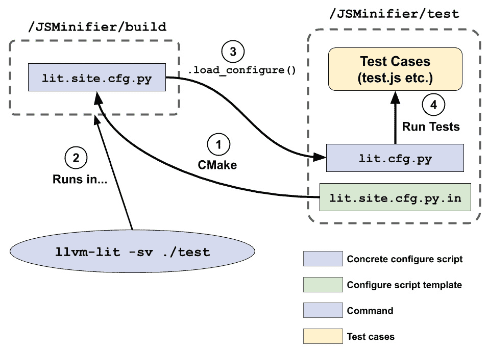

# *第三章*：使用 LLVM LIT 进行测试

在上一章中，我们学习了如何利用 LLVM 自己的 CMake 工具来提高我们的开发体验。我们还学习了如何无缝地将 LLVM 集成到其他树外项目中。在本章中，我们将讨论如何亲身体验 LLVM 自己的测试基础设施 LIT。

**LIT**是一个最初为运行 LLVM 回归测试而开发的测试基础设施。现在，它不仅是运行 LLVM 中所有测试的框架（包括**单元**和**回归测试**），而且还是一个可以在 LLVM 之外使用的通用测试框架。它还提供了一系列测试格式来应对不同的场景。本章将为您详细介绍该框架的组件，并帮助您掌握 LIT。

在本章中，我们将涵盖以下主题：

+   在树外项目中使用 LIT

+   了解高级 FileCheck 技巧

+   探索 TestSuite 框架

# 技术要求

LIT 的核心是用*Python*编写的，所以请确保您已安装 Python 2.7 或 Python 3.x（Python 3.x 更佳，因为 LLVM 现在正在逐步淘汰 Python 2.7）。

此外，还有一些支持工具，例如`FileCheck`，稍后将使用。不幸的是，构建这些工具最快的方法是构建任何`check-XXX`（伪）目标。例如，我们可以构建`check-llvm-support`，如下面的代码所示：

```cpp
$ ninja check-llvm-support
```

最后，最后一节要求已构建`llvm-test-suite`，这是一个与`llvm-project`分开的仓库。我们可以使用以下命令克隆它：

```cpp
$ git clone https://github.com/llvm/llvm-test-suite
```

配置构建的最简单方法之一是使用缓存的 CMake 配置文件。例如，为了以优化（`O3`）构建测试套件，我们将使用以下代码：

```cpp
$ mkdir .O3_build
$ cd .O3_build
$ cmake -G Ninja -DCMAKE_C_COMPILER=<desired Clang binary \ path> -C ../cmake/caches/O3.cmake ../
```

然后，我们可以使用以下命令正常构建它：

```cpp
$ ninja all
```

# 在树外项目中使用 LIT

编写树内 LLVM IR 回归测试非常简单：您只需在 IR 文件上添加测试指令即可。例如，看看以下脚本：

```cpp
; RUN: opt < %s -instcombine -S -o - | FileCheck %s
target triple = "x86_64-unknown-linux"
define i32 @foo(i32 %c) {
entry:
  ; CHECK: [[RET:%.+]] = add nsw i32 %c, 3
  ; CHECK: ret i32 [[RET]]
  %add1 = add nsw i32 %c, 1
  %add2 = add nsw i32 %add1, 2
  ret i32 %add2
}
```

此脚本检查`InstCombine`（由前面片段中显示的`-instcombine`命令行选项触发）是否将两个连续的算术加法简化为一个。将此文件放入`llvm/test`下的任意文件夹后，当您执行`llvm-lit`命令行工具时，脚本将自动被选中并作为回归测试的一部分运行。

尽管它很方便，但这几乎不能帮助您在树外项目中使用 LIT。在树外使用 LIT 特别有用，当您的项目需要一些端到端测试功能时，例如格式转换器、文本处理器、代码检查器和，当然，编译器。本节将向您展示如何将 LIT 带入您的树外项目，并提供 LIT 运行流程的完整概述。

## 为我们的示例项目做准备

在本节中，我们将使用树外 CMake 项目。此示例项目构建一个命令行工具，`js-minifier`，它可以*压缩*任意 JavaScript 代码。我们将转换以下 JavaScript 代码：

```cpp
const foo = (a, b) => {
  let c = a + b;
  console.log(`This is ${c}`); 
}
```

这将被转换成尽可能短的*语义等效*代码：

```cpp
const foo = (a,b) => {let c = a + b; console.log(`This is ${c}`);}
```

而不是教您如何编写这个 `js-minifier`，本节的目标是向您展示如何创建一个 LIT 测试环境来*测试*这个工具。

此示例项目具有以下文件夹结构：

```cpp
/JSMinifier
  |__ CMakeLists.txt
  |__ /src
      |__ js-minifier.cpp
  |__ /test
      |__ test.js
      |__ CMakeLists.txt
  |__ /build
```

`/src` 文件夹下的文件包含 `js-minifier` 的源代码（我们在这里不会涉及）。我们将关注的是用于测试 `js-minifier` 的文件，这些文件位于 `/test` 文件夹下（目前只有一个文件，`test.js`）。

在本节中，我们将设置一个测试环境，以便当我们运行 CMake `/build` 文件夹下的 `llvm-lit`（本节的测试驱动和主要角色）时，它会打印测试结果，如下所示：

```cpp
$ cd build
$ llvm-lit -sv .
-- Testing: 1 tests, 1 workers –
PASS: JSMinifier Test :: test.js (1 of 1)
Testing Time: 0.03s
  Expected Passes    : 1
```

这显示了通过了多少个以及哪些测试用例。

这是测试脚本，`test.js`：

```cpp
// RUN: %jsm %s -o - | FileCheck
// CHECK: const foo = (a,b) =>
// CHECK-SAME: {let c = a + b; console.log(`This is ${c}`);}
const foo = (a, b) => {
  let c = a + b;
  console.log(`This is ${c}`); 
}
```

如您所见，这是一个简单的测试过程，它运行 `js-minifier` 工具（由 `%jsm` 指令表示，稍后将替换为 `js-minifier` 可执行文件的实际路径）并使用 `FileCheck` 的 `CHECK` 和 `CHECK-SAME` 指令检查运行结果。

通过这样，我们已经设置了我们的示例项目。在我们完成准备工作之前，我们还需要创建一个最终的工具。

由于我们试图减少对 LLVM 源树的依赖，我们将使用 *PyPi 仓库*（即 `pip` 命令行工具）中可用的 `LIT` 包重新创建 `llvm-lit` 命令行工具。您需要做的只是安装该包：

```cpp
$ pip install --user lit
```

最后，用以下脚本包装该包：

```cpp
#!/usr/bin/env python
from lit.main import main
if __name__ == '__main__':
    main()
```

现在，我们可以使用 LIT 而不必构建 LLVM 树！接下来，我们将创建一些 LIT 配置脚本，这些脚本将驱动整个测试流程。

## 编写 LIT 配置

在本小节中，我们将向您展示如何编写 LIT 配置脚本。这些脚本描述了测试过程——文件将在哪里被测试，测试环境（如果我们需要导入任何工具，例如），失败时的策略等等。学习这些技能可以极大地提高您在 LLVM 树外使用 LIT 的效率。让我们开始吧：

1.  在 `/JSMinifier/test` 文件夹内，创建一个名为 `lit.cfg.py` 的文件，其中包含以下内容：

    ```cpp
    import lit.formats
    config.name = 'JSMinifier Test'
    config.test_format = config variable here is a Python object that will be populated later when this script is loaded into LIT's runtime. It's basically a registry with predefined fields that carry configuration values, along with custom fields that can be added by lit.*.py scripts at any time.The `config.test_format` field suggests that LIT will run every test inside a shell environment (in the `ShTest` format), while the `config.suffixes` field suggests that only files with `.js` in their filename suffix will be treated as test cases (that is, all the JavaScript files).
    ```

1.  在上一步的代码片段之后，LIT 现在需要另外两块信息：测试文件的*根路径*和*工作目录*：

    ```cpp
    …
    config.suffixes = ['.js']
    config.test_source_root = os.path.dirname(__file__)
    config.test_exec_root = os.path.join(config.test_source_root, it's simply pointing to /JSMinifier/test. On the other hand, config.test_exec_root, which is the working directory, is pointing to a place whose parent folder is the value of a custom configuration field, my_obj_root. While it will be introduced later, simply put, it points to the build folder path. In other words, config.test_exec_root will eventually have a value of /JSMinifier/build/test.
    ```

1.  我们在 `test.js` 中之前看到的 `%jsm` 指令用作占位符，最终将被替换为 `js-minifier` 可执行文件的实际/绝对路径。以下行将设置替换：

    ```cpp
    …
    config.test_exec_root = os.path.join(config.my_obj_root, 'test')
    config.config.substitutions field, which makes LIT replace every %jsm occurrence in the test files with the /JSMinifier/build/js-minifier value. This wraps up all the content in lit.cfg.py.
    ```

1.  现在，创建一个名为 `lit.site.cfg.py.in` 的新文件，并将其放置在 `/JSMinifier/test` 文件夹下。该文件的前部分看起来如下：

    ```cpp
    import os
    config.my_src_root = r'@CMAKE_SOURCE_DIR@'
    config.my_obj_root = r'@CMAKE_BINARY_DIR@'
    ```

    这个神秘的 `config.my_obj_root` 字段最终在这里得到了解决，但它不是指向一个普通字符串，而是被分配了一个叫做 `@CMAKE_BINARY_DIR@` 的奇怪值。同样，这将在稍后由 CMake 替换为真实路径。对于 `config.my_src_root` 字段也是如此。

1.  最后，`lit.site.cfg.py.in` 由以下行封装：

    ```cpp
    …
    lit_config.@ being resolved and copied into the build folder. From there, it will *call back* the lit.cfg.py script we saw in the earlier steps. This will be explained later in this section.
    ```

1.  最后，是时候使用 CMake 的 `configure_file` 函数替换那些奇怪的 @-夹住的字符串为真实值了。在 `/JSMinifier/test/CMakeLists.txt` 中，在文件中某处添加以下行：

    ```cpp
    configure_file function will replace all the @-clamped string occurrences in the input file (lit.site.cfg.py.in, in this case) with their CMake variable counterparts in the current CMake context. For example, let's say there is a file called `demo.txt.in` that contains the following content:

    ```

    name = "@FOO@"

    age = @AGE@

    ```cpp

    Now, let's use `configure_file` in `CMakeLists.txt`:

    ```

    set(FOO "John Smith")

    set(AGE 87)

    configure_file(demo.txt.in

    demo.txt @ONLY)

    ```cpp

    Here, the aforementioned replacement will kick in and generate an output file, `demo.txt`, that contains the following content:

    ```

    name = "John Smith"

    age = 87

    ```cpp

    ```

1.  回到 `lit.site.cfg.py.in` 片段，由于 `CMAKE_SOURCE_DIR` 和 `CMAKE_BINARY_DIR` 总是可用的，它们分别指向根源文件夹和 `build` 文件夹。生成的 `/JSMinifier/build/test/lit.site.cfg.py` 将包含以下内容：

    ```cpp
    import os
    config.my_src_root = r'/absolute/path/to/JSMinifier'
    config.my_obj_root = r'/absolute/path/to/JSMinifier/build'
    lit_config.load_config(
        config, os.path.join(config.my_src_root, 'test/      lit.cfg.py'))
    ```

通过这样，我们已经学会了如何为我们的示例项目编写 LIT 配置脚本。现在，是时候解释一些 LIT 内部工作细节以及为什么我们需要这么多文件（`lit.cfg.py`、`lit.site.cfg.py.in` 和 `lit.site.cfg.py`）了。

## LIT 内部机制

让我们看看以下图表，它说明了在我们刚刚创建的演示项目中运行 LIT 测试的工作流程：



图 3.1 – LIT 在我们的示例项目中的分支流程

让我们更详细地看看这个图表：

1.  `lit.site.cfg.py.in` 被复制到 `/JSMinifier/build/lit.site.cfg.py`，它携带一些 CMake 变量值。

1.  `llvm-lit` 命令在 `/JSMinifier/build` 内部启动。它将首先执行 `lit.site.cfg.py`。

1.  `lit.site.cfg.py` 然后使用 `load_configure` Python 函数加载主 LIT 配置（`lit.cfg.py`）并运行所有测试用例。

这张图表中最关键的部分是解释 `lit.site.cfg.py` 和 `lit.site.cfg.py.in` 的作用：许多参数，如 `build` 文件夹的绝对路径，将在 CMake 配置过程完成之前保持未知。因此，放置了一个 *跳板* 脚本——即 `lit.site.cfg.py`——在 `build` 文件夹中，以将信息传递给真正的测试运行器。

在本节中，我们学习了如何为我们的树外示例项目编写 LIT 配置脚本。我们还学习了 LIT 在底层是如何工作的。了解这一点可以帮助你在除了 LLVM 以外的各种项目中使用 LIT。在下一节中，我们将重点关注 `FileCheck`，这是一个关键且常用的 LIT 工具，它执行高级模式检查。

# 学习有用的 FileCheck 技巧

`grep` 命令行工具在 Unix/Linux 系统中可用，但提供了更强大且直观的基于行的上下文语法。此外，你可以在测试目标旁边放置 `FileCheck` 指令，这使得测试用例自包含且易于理解。

虽然基本的 `FileCheck` 语法很容易上手，但还有许多其他 `FileCheck` 功能真正释放了 `FileCheck` 的力量，并大大提高了你的测试体验——创建更简洁的测试脚本和解析更复杂的程序输出，仅举几例。本节将向你展示其中的一些技巧。

## 准备我们的示例项目

首先需要构建 `FileCheck` 命令行工具。类似于前面的章节，在 LLVM 树中构建一个 `check-XXX`（伪）目标是这样做最容易的方法。以下是一个示例：

```cpp
$ ninja check-llvm-support
```

在本节中，我们将使用一个虚构的命令行工具 `js-obfuscator`，一个 JavaScript 混淆器，作为我们的示例。**混淆**是一种常用的技术，用于隐藏知识产权或实施安全保护。例如，我们可以在以下 JavaScript 代码上使用一个真实的 JavaScript 混淆器：

```cpp
const onLoginPOST = (req, resp) => {
  if(req.name == 'admin')
    resp.send('OK');
  else
    resp.sendError(403);
}
myReset.post('/console', onLoginPOST);
```

这将转换成以下代码：

```cpp
const t = "nikfmnsdzaO";
const aaa = (a, b) => {
  if(a.z[0] == t[9] && a.z[1] == t[7] &&…)
    b.f0(t[10] + t[2].toUpperCase());
  else
    b.f1(0x193);
}
G.f4(YYY, aaa);
```

此工具将尝试使原始脚本尽可能难以阅读。测试部分的挑战是在保留足够随机空间的同时验证其正确性。简单来说，`js-obfuscator` 将仅应用四种混淆规则：

1.  仅混淆局部变量名，包括形式参数。形式参数名应始终以 *<小写单词><参数索引号>* 格式混淆。局部变量名将始终被混淆成小写和大写字母的组合。

1.  如果我们使用箭头语法声明函数——例如，`let foo = (arg1, arg2) => {…}`——箭头和左花括号（`=> {`）需要放在下一行。

1.  将一个字面数字替换为相同值但不同表示形式；例如，将 *87* 替换为 *0x57* 或 *87.000*。

1.  当你向工具提供 `--shuffle-funcs` 命令行选项时，会打乱顶层函数的声明/出现顺序。

最后，以下 JavaScript 代码是用于 `js-obfuscator` 工具的示例：

```cpp
const square = x => x * x;
const cube = x => x * x * x;
const my_func1 = (input1, input2, input3) => {
  // TODO: Check if the arrow and curly brace are in the second   // line
  // TODO: Check if local variable and parameter names are   // obfuscated
  let intermediate = square(input3);
  let output = input1 + intermediate - input2;
  return output;
}
const my_func2 = (factor1, factor2) => {
  // TODO: Check if local variable and parameter names are   // obfuscated
  let term2 = cube(factor1);
  // TODO: Check if literal numbers are obfuscated
  return my_func1(94,
                  term2, factor2);
}
console.log(my_func2(1,2));
```

## 编写 FileCheck 指令

以下步骤将填充前面代码中出现的所有 `TODO` 注释：

1.  根据行号，第一个任务是检查局部变量和参数是否被正确混淆。根据规范，形式参数有特殊的重命名规则（即，*<小写单词><参数索引号>*），因此使用正常的 `CHECK` 指令与 FileCheck 的正则表达式语法将是此处最合适的解决方案：

    ```cpp
    // CHECK: my_func1 = ({{[a-z]+0}}, {{[a-z]+1}}, // {{[a-z]+2}})
    const my_func1 = (input1, input2, input3) => {
    …
    ```

    FileCheck 使用正则表达式的一个子集进行模式匹配，这些正则表达式被`{{…}}`或`[[…]]`符号包围。我们将在稍后介绍后者。

1.  这段代码看起来相当简单。然而，一旦执行了混淆，代码的语义也需要是正确的。所以，除了检查格式外，对那些参数的后续引用也需要重构，这就是 FileCheck 的模式绑定发挥作用的地方：

    ```cpp
    // CHECK: my_func1 = ([[A0:[a-z]+0]], // [[A1:[a-z]+1]], [[A2:[a-z]+2]])
    const my_func1 = (input1, input2, input3) => {
      // CHECK: square(A0 ~ A2 using the [[…]] syntax, in which the binding variable name and the pattern are divided by a colon: [[<binding variable>:<pattern>]]. On the reference sites of the binding variable, the same [[…]] syntax is used, but without the pattern part.NoteA binding variable can have multiple definition sites. Its reference sites will read the last defined value. 
    ```

1.  我们不要忘记第二条规则——函数头部的箭头和左花括号需要放在第二行。为了实现“下一行”的概念，我们可以使用`CHECK-NEXT`指令：

    ```cpp
    // CHECK: my_func1 = ([[A0:[a-z]+0]], // [[A1:[a-z]+1]], [[A2:[a-z]+2]])
    const my_func1 = (input1, input2, input3) => {
      // CHECK directive, CHECK-NEXT will not only check if the pattern exists but also ensure that the pattern is in the line that follows the line matched by the previous directive.
    ```

1.  接下来，在`my_func1`中检查所有局部变量和形式参数：

    ```cpp
    // CHECK: my_func1 = ([[A0:[a-z]+0]], // [[A1:[a-z]+1]], [[A2:[a-z]+2]])
    const my_func1 = (input1, input2, input3) => {
      // CHECK: let [[IM:[a-zA-Z]+]] = square([[A2]]);
      let intermediate = square(input3);
      // CHECK: let [[OUT:[a-zA-Z]+]] =
      // CHECK-SAME directive was used to match the succeeding pattern in the exact same line. The rationale behind this is that FileCheck expected different CHECK directives to be matched in different *lines*. So, let's say part of the snippet was written like this:

    ```

    // CHECK: let [[OUT:[a-zA-Z]+]] =

    // CHECK: [[A0]] + [[IM]] - [[A1]];

    ```cpp

    It will *only* match code that spread across two lines or more, as shown here:

    ```

    let BGHr =

    r0 + jkF + r1;

    ```cpp

    It will throw an error otherwise. This directive is especially useful if you wish to avoid writing a super long line of checking statements, thus making the testing scripts more concise and readable.
    ```

1.  现在，进入`my_func2`，是时候检查数字是否被正确混淆了。这里的检查语句被设计为接受任何实例/模式*除了*原始数字。因此，`CHECK-NOT`指令在这里就足够了：

    ```cpp
    …
    // CHECK: return my_func1(
    // CHECK-NOT: 94 
    return my_func1(94,
                    term2, factor2);
    …
    // CHECK: return my_func1
    // CHECK-NOT: 94,
    // CHECK-SAME: {{0x5[eE]}}
    return my_func1(94,
                    term2, factor2);
    ```

1.  现在，只需要验证一条混淆规则：当`js-obfuscator`工具提供额外的命令行选项`--shuffle-funcs`，它实际上会打乱所有顶级函数的顺序时，我们需要检查顶级函数在打乱顺序后是否保持了一定的顺序。在 JavaScript 中，函数在调用时会被解析。这意味着`cube`、`square`、`my_func1`和`my_func2`可以有一个任意的顺序，只要它们放在`console.log(…)`语句之前。为了表达这种灵活性，`CHECK-DAG`指令非常有用。

    相邻的`CHECK-DAG`指令将按任意顺序匹配文本。例如，假设我们有以下指令：

    ```cpp
    // CHECK-DAG: 123
    // CHECK-DAG: 456
    ```

    这些指令将匹配以下内容：

    ```cpp
    123
    456
    ```

    它们也会匹配以下内容：

    ```cpp
    456
    123
    ```

    然而，这种排序的自由度在`CHECK`或`CHECK-NOT`指令中都不会保持。例如，假设我们有以下指令：

    ```cpp
    // CHECK-DAG: 123
    // CHECK-DAG: 456
    // CHECK: 789
    // CHECK-DAG: abc
    // CHECK-DAG: def
    ```

    这些指令将匹配以下文本：

    ```cpp
    456
    123
    789
    def
    abc
    ```

    然而，它们不会匹配以下文本：

    ```cpp
    456
    789
    123
    def
    abc
    ```

1.  回到我们的动机示例，可以通过以下代码检查混淆规则：

    ```cpp
    …
    // FileCheck provides a way to multiplex different *check suites* into a single file, where each suite can define how it runs and separates the checks from other suites. 
    ```

1.  `FileCheck`中检查前缀的想法相当简单：你可以创建一个独立运行的*检查套件*，与其他套件分开。而不是使用`CHECK`字符串，每个套件都会在前面提到的所有指令（包括`CHECK-NOT`和`CHECK-SAME`等）中替换成另一个字符串，包括`CHECK`本身，以便区分同一文件中的其他套件。例如，你可以创建一个带有`YOLO`前缀的套件，这样示例的这部分现在看起来如下所示：

    ```cpp
    // --check-prefix command-line option. Here, the FileCheck command invocation will look like this:

    ```

    $ cat test.out.js | FileCheck --check-prefix=YOLO test.js

    ```cpp

    ```

1.  最后，让我们回到我们的示例。最后一个混淆规则可以通过为那些 `CHECK-DAG` 指令使用一个替代前缀来解决：

    ```cpp
    …
    // CHECK-SHUFFLE-DAG: const square =
    // CHECK-SHUFFLE-DAG: const cube =
    // CHECK-SHUFFLE-DAG: const my_func1 =
    // CHECK-SHUFFLE-DAG: const my_func2 =
    // CHECK-SHUFFLE: console.log
    console.log(my_func2(1,2));
    ```

这必须与默认的检查套件结合使用。本节中提到的所有检查都可以通过两个单独的命令运行，如下所示：

```cpp
# Running the default check suite
$ js-obfuscator test.js | FileCheck test.js
# Running check suite for the function shuffling option
$ js-obfuscator --shuffle-funcs test.js | \
  FileCheck --check-prefix=CHECK-SHUFFLE test.js
```

在本节中，我们通过我们的示例项目展示了某些高级且有用的 `FileCheck` 技巧。这些技巧为你提供了不同的方式来编写验证模式，并使你的 LIT 测试脚本更加简洁。

到目前为止，我们一直在讨论测试方法，该方法在类似 shell 的环境中运行测试（即在 `ShTest` LIT 格式中）。在下一节中，我们将介绍一个替代的 LIT 框架——源自 `llvm-test-suite` 项目的 TestSuite 框架和测试格式——它为 LIT 提供了一种 *不同类型* 的有用测试方法。

# 探索 TestSuite 框架

在前面的章节中，我们学习了如何在 LLVM 中执行回归测试。更具体地说，我们看了 `ShTest` 测试格式（回忆一下 `config.test_format = lit.formats.ShTest(…)` 这一行），它基本上以 shell 脚本的方式运行端到端测试。`ShTest` 格式在验证结果方面提供了更多的灵活性，因为它可以使用我们在上一节中介绍的 `FileCheck` 工具，例如。

本节将要介绍另一种测试格式：`llvm-test-suite` 项目——为测试和基准测试 LLVM 而创建的测试套件和基准测试集合。类似于 `ShTest`，这种 LIT 格式也是为了运行端到端测试而设计的。然而，TestSuite 的目标是让开发者在使用基于现有可执行文件的测试套件或基准测试代码库时更加方便。例如，如果你想将著名的 **SPEC 基准测试** 作为你的测试套件之一，你所需要做的只是添加一个构建描述和预期的纯文本输出。这在你的测试逻辑无法使用 **文本测试脚本** 表达时也很有用，正如我们在前面的章节中看到的。

在本节中，我们将学习如何将现有的测试套件或基准测试代码库导入到 `llvm-test-suite` 项目中。

## 为我们的示例项目做准备

首先，请按照本章开头提供的说明构建 `llvm-test-suite`。

本节的其余部分将使用一个名为 `GeoDistance` 的伪测试套件项目。该项目使用 C++ 和 GNU `Makefile` 构建一个命令行工具 `geo-distance`，该工具计算并打印出由输入文件提供的经纬度对列表构建的路径的总距离。

它应该具有以下文件夹结构：

```cpp
GeoDistance
  |___ helper.cpp
  |___ main.cpp
  |___ sample_input.txt
  |___ Makefile
```

在这里，`Makefile` 的样子如下：

```cpp
FLAGS := -DSMALL_INPUT -ffast-math
EXE := geo-distance
OBJS := helper.o main.o
%.o: %.cpp
    $(CXX) $(FLAGS) -c $^
$(EXE): $(OBJS)
    $(CXX) $(FLAGS) $< -o $@
```

要运行 `geo-distance` 命令行工具，请使用以下命令：

```cpp
$ geo-distance ./sample_input.txt
```

这会在 `stdout` 上打印出浮点距离：

```cpp
$ geo-distance ./sample_input.txt
94.873467
```

这里的浮点精度要求是 `0.001`。

## 将代码导入到 llvm-test-suite

基本上，我们只需要做两件事就可以将现有的测试套件或基准测试导入到`llvm-test-suite`中：

+   使用 CMake 作为构建系统

+   编写验证规则

要使用 CMake 作为构建系统，项目文件夹需要放在`llvm-test-suite`源树中的`MultiSource/Applications`子目录下。然后，我们需要相应地更新外部的`CMakeLists.txt`文件：

```cpp
# Inside MultiSource/Applications/CMakeLists.txt
…
add_subdirectory(GeoDistance)
```

要从我们的 GNU `Makefile`迁移到`CMakeLists.txt`，而不是使用内置的 CMake 指令（如`add_executable`）重写它，LLVM 为您提供了一些方便的函数和宏：

```cpp
# Inside MultiSource/Applications/GeoDistance/CMakeLists.txt
# (Unfinished)
llvm_multisource(geo-distance)
llvm_test_data(geo-distance sample_input.txt)
```

这里有一些新的 CMake 指令。`llvm_multisource`及其兄弟指令`llvm_singlesource`分别从多个源文件或单个源文件添加一个新的可执行文件构建目标。它们基本上是`add_executable`，但如前所述的代码所示，您可以选择留空源文件列表，它将使用当前目录中显示的所有 C/C++源文件作为输入。

注意

如果有多个源文件但您使用的是`llvm_singlesource`，每个源文件都将被视为一个独立的可执行文件。

`llvm_test_data`将您希望在运行时使用的任何资源/数据文件复制到正确的工作目录。在这种情况下，是`sample_input.txt`文件。

现在骨架已经设置好了，是时候使用以下代码配置编译标志了：

```cpp
# Inside MultiSource/Applications/GeoDistance/CMakeLists.txt
# (Continue)
list(APPEND CPPFLAGS -DSMALL_INPUT)
list(APPEND CFLAGS -ffast-math)
llvm_multisource(geo-distance)
llvm_test_data(geo-distance sample_input.txt)
```

最后，TestSuite 需要知道如何运行测试以及如何验证结果：

```cpp
# Inside MultiSource/Applications/GeoDistance/CMakeLists.txt
# (Continue)
…
set(RUN_OPTIONS sample_input.txt)
set(FP_TOLERANCE 0.001)
llvm_multisource(geo-distance)
…
```

`RUN_OPTIONS` CMake 变量非常直观——它提供了测试可执行文件的命令行选项。

对于验证部分，默认情况下，TestSuite 将使用增强的 diff 来比较`stdout`的输出和退出代码与以`.reference_output`结尾的文件。

例如，在我们的案例中，创建了一个`GeoDistance/geo-distance.reference_output`文件，其中包含预期的答案和退出状态代码：

```cpp
94.873
exit 0
```

您可能会发现这里的预期答案与本节开头（`94.873467`）的输出略有不同，这是因为比较工具允许您指定所需的浮点精度，这由之前显示的`FP_TOLERANCE` CMake 变量控制。

在本节中，我们学习了如何利用`llvm-test-suite`项目及其 TestSuite 框架来测试来自现有代码库或无法使用文本脚本表达测试逻辑的可执行文件。这将帮助您在使用 LIT 测试不同类型的项目中变得更加高效。

# 摘要

LIT 是一个通用测试框架，不仅可以用于 LLVM 内部，还可以轻松地用于任意项目。本章试图通过向你展示如何将 LIT 集成到树外项目中，甚至无需构建 LLVM 来证明这一点。其次，我们看到了 FileCheck——一个被许多 LIT 测试脚本使用的强大模式检查器。这些技能可以增强你测试脚本的表达能力。最后，我们向你介绍了 TestSuite 框架，它适用于测试不同类型的程序，并补充了默认的 LIT 测试格式。

在下一章中，我们将探讨 LLVM 项目中的另一个支持框架：**TableGen**。我们将向你展示 TableGen 也是一个 *通用工具箱*，可以解决树外项目的各种问题，尽管如今它几乎仅被用于 LLVM 的后端开发。

# 进一步阅读

目前，FileCheck 的源代码——用 C++ 编写——仍然位于 LLVM 的源树中。尝试使用 Python ([`github.com/mull-project/FileCheck.py`](https://github.com/mull-project/FileCheck.py)) 来复制其功能，这将有效地帮助你使用 FileCheck 而无需构建 LLVM，就像 LIT 一样！
