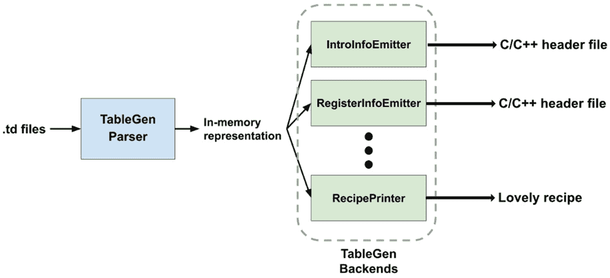

# *第四章*：TableGen 开发

**TableGen** 是一种最初在 **低级虚拟机**（**LLVM**）中开发的 **领域特定语言**（**DSL**），用于表达处理器的 **指令集架构**（**ISA**）和其他硬件特定细节，类似于 **GNU 编译器集合**（**GCC**）的 **机器描述**（**MD**）。因此，许多人在处理 LLVM 的后端开发时会学习 TableGen。然而，TableGen 不仅用于描述硬件规范：它是一种 *通用 DSL*，适用于任何涉及非平凡 *静态和结构化数据* 的任务。LLVM 也已经在后端之外的部分使用了 TableGen。例如，Clang 一直在使用 TableGen 来管理其命令行选项。社区中的人们也在探索在 TableGen 语法中实现 **InstCombine** 规则（LLVM 的 **窥孔优化**）的可能性。

尽管 TableGen 具有通用性，但该语言的核心语法从未被许多新开发者广泛理解，因此在 LLVM 的代码库中产生了大量的复制粘贴的样板 TableGen 代码，因为他们对语言本身不熟悉。本章试图为这种状况提供一些启示，并展示如何将这项惊人的技术应用于广泛的领域。

本章从介绍常见的和重要的 TableGen 语法开始，为你准备在 TableGen 中编写美味的甜甜圈配方作为实践，最终在第二部分展示 TableGen 的通用性。最后，本章将以一个教程结束，介绍如何开发自定义 *发射器* 或 **TableGen 后端**，将 TableGen 配方中的那些古怪句子转换为可以放入厨房的正常纯文本描述。

这里是我们将要涵盖的部分列表：

+   TableGen 语法介绍

+   在 TableGen 中编写甜甜圈配方

+   通过 TableGen 后端打印配方

# 技术要求

本章重点介绍 `utils` 文件夹中的一个工具：`llvm-tblgen`。要构建它，请运行以下命令：

```cpp
$ ninja llvm-tblgen
```

注意

如果你选择了在第一章中引入的 `LLVM_OPTIMIZED_TABLEGEN` CMake 变量中构建 `llvm-tblgen`，你可能想要更改这个设置，因为在这个章节中始终拥有 `llvm-tblgen` 的调试版本会更好。

本章中所有的源代码都可以在这个 GitHub 仓库中找到：[`github.com/PacktPublishing/LLVM-Techniques-Tips-and-Best-Practices-Clang-and-Middle-End-Libraries/tree/main/Chapter04`](https://github.com/PacktPublishing/LLVM-Techniques-Tips-and-Best-Practices-Clang-and-Middle-End-Libraries/tree/main/Chapter04)。

# TableGen 语法介绍

这一节提供了一个对所有重要和常见 TableGen 语法的快速浏览，提供了所有必要的知识，以便在下一节中通过 TableGen 编写甜甜圈配方。

TableGen 是一种用于建模自定义数据布局的特定领域编程语言。尽管它是一种编程语言，但它所做的与传统的语言大不相同。**传统编程语言**通常描述对（输入）数据执行的操作、它们与环境如何交互以及它们如何生成结果，无论你采用哪种编程范式（命令式、函数式、事件驱动…）。相比之下，TableGen 几乎不描述任何操作。

TableGen 仅设计用于描述结构化的 **静态数据**。首先，开发者定义他们所需数据结构的布局——本质上只是一个包含许多字段的表格。然后，他们需要立即将这些数据填充到布局中，因为大多数字段都是填充/初始化的。后者可能是 TableGen 独特之处：许多编程语言或框架提供设计特定领域数据结构的方法（例如，Google 的 **Protocol Buffers**），但在那些场景中，数据通常是在消耗 DSL 部分的代码中 **动态** 填充的。

`TABLE`; 在 TableGen 中则是 `class`，这部分将在本节稍后介绍。然而，SQL 提供了比仅仅构建布局多得多的功能。它还可以动态地查询（实际上，这也是其名称的由来：**结构化查询语言**）和更新数据，这是 TableGen 所不具备的。然而，在本章的后面部分，你将看到 TableGen 提供了一个灵活处理和 *解释* 这些 TableGen 定义的框架。

我们现在将介绍四个重要的 TableGen 构造，如下所示：

+   布局和记录

+   破折号运算符

+   多类

+   **有向无环图**（**DAG**）数据类型

## 布局和记录

由于 TableGen 只是一种更花哨、更易于表达的方式来描述结构化数据，因此很容易想到存在一种原始的数据 `class` 语法表示，如下面的代码片段所示：

```cpp
class Person {
  string Name = "John Smith";
  int Age;
}
```

如此所示，一个类类似于 C 语言和其他许多编程语言中的结构体，它只包含一组数据字段。每个字段都有一个类型，可以是任何原始类型（`int`、`string`、`bit` 等）或另一个用户定义的 `class` 类型。字段还可以分配一个默认值，例如 `John Smith`。

在查看布局之后，是时候创建一个实例（或 TableGen 术语中的 **记录**）了，如下所示：

```cpp
def john_smith : Person;
```

在这里，`john_smith` 是一个使用 `Person` 作为模板的记录，因此它也有两个字段——`Name` 和 `Age`——其中 `Name` 字段填充了值 `John Smith`。这看起来相当直接，但请记住 TableGen 应该定义静态数据，并且 *大多数* 字段应该填充值。此外，在这种情况下，`Age` 字段仍然未被初始化。你可以通过以下方式用括号闭合和其中的语句来 *覆盖* 它的值：

```cpp
def john_smith : Person {
  let Age = 87;
}
```

您甚至可以专门为`john_smith`记录定义新字段，如下所示：

```cpp
def john_smith : Person {
  let Age = 87;
  string Job = "Teacher";
}
```

请注意，您只能覆盖已声明的字段（使用`let`关键字），就像在许多其他编程语言中一样。

## Bang 操作符

Bang 操作符是一组执行基本任务（如基本算术或值转换）的函数。以下是一个将千克转换为克的简单示例：

```cpp
class Weight<int kilogram> {
  int Gram = !mul(kilogram, 1000);
}
```

常见操作符包括算术和位运算符（仅举几例），其中一些在此概述：

+   `!add(a, b)`: 用于算术加法

+   `!sub(a, b)`: 用于算术减法

+   `!mul(a, b)`: 用于算术乘法

+   `!and(a, b)`: 用于逻辑`AND`运算

+   `!or(a, b)`: 用于逻辑`OR`运算

+   `!xor(a, b)`: 用于逻辑`XOR`运算

我们还使用条件操作符，这里概述了一些：

+   `!ge(a, b)`: 如果`a >= b`，则返回 1，否则返回 0

+   `!gt(a, b)`: 如果`a > b`，则返回 1，否则返回 0

+   `!le(a, b)`: 如果`a <= b`，则返回 1，否则返回 0

+   `!lt(a, b)`: 如果`a < b`，则返回 1，否则返回 0

+   `!eq(a, b)`: 如果`a == b`，则返回 1，否则返回 0

其他有趣的操作符包括以下内容：

+   `!cast<type>(x)`: 此操作符根据`type`参数对操作数`x`进行类型转换。在类型是数值类型的情况下，例如`int`或`bits`，这会执行正常的算术类型转换。在某些特殊情况下，我们有以下场景：

    如果`type`是字符串且`x`是记录，则返回记录的名称。

    如果`x`是字符串，它被视为记录的名称。TableGen 将查找迄今为止的所有记录定义，并返回具有`x`名称的记录，其类型与`type`参数匹配。

+   `!if(pred, then, else)`: 如果`pred`为 1，则此操作符返回`then`表达式，否则返回`else`表达式。

+   `!cond(cond1 : val1, cond2 : val2, …, condN : valN)`: 这个操作符是`!if`操作符的增强版本。它将连续评估`cond1…condN`，直到其中一个表达式返回 1，然后返回其关联的`val`表达式。

    注意

    与函数不同，函数是在运行时评估的，而 Bang 操作符更像*宏*，它们是在构建时评估的——或者用 TableGen 的术语来说，当这些语法被 TableGen 后端处理时。

## 多类

在许多情况下，我们希望一次性定义多个记录。例如，以下代码片段尝试为多辆汽车创建*自动部件*记录：

```cpp
class AutoPart<int quantity> {…}
def car1_fuel_tank : AutoPart<1>;
def car1_engine : AutoPart<1>;
def car1_wheels : AutoPart<4>;
…
def car2_fuel_tank : AutoPart<1>;
def car2_engine : AutoPart<1>;
def car2_wheels : AutoPart<4>;
…
```

我们可以通过使用`multiclass`语法进一步简化这些操作，如下所示：

```cpp
class AutoPart<int quantity> {…}
multiclass Car<int quantity> {
  def _fuel_tank : AutoPart<quantity>;
  def _engine : AutoPart<quantity>;
  def _wheels : AutoPart<!mul(quantity, 4)>;
  …
}
```

在创建记录实例时，使用`defm`语法而不是`def`，如下所示：

```cpp
defm car1 : Car<1>;
defm car2 : Car<1>;
```

因此，最终它仍然会生成具有`car1_fuel_tank`、`car1_engine`、`car2_fuel_tank`等名称的记录。

尽管其名称中包含 `class`，但 `multiclass` 与类无关。`multiclass` 不是描述记录布局的，而是作为一个模板来 *生成* 记录。在 `multiclass` 模板内部是预期创建的记录以及模板展开后的记录名称 *后缀*。例如，前述片段中的 `defm car1 : Car<1>` 指令最终将被展开成三个 `def` 指令，如下所示：

+   `def car1_fuel_tank : AutoPart<1>;`

+   `def car1_engine : AutoPart<1>;`

+   `def car1_wheels : AutoPart<!mul(1, 4)>;`

如前所述的列表所示，我们在 `multiclass` 中找到的名称后缀（例如，`_fuel_tank`）与 `defm` 后出现的名称连接在一起—在本例中是 `car1`。此外，`multiclass` 的 `quantity` 模板参数也被实例化到每个展开的记录中。

简而言之，`multiclass` 尝试从多个记录实例中提取公共参数，并使其能够一次性创建它们。

## DAG 数据类型

除了传统数据类型外，TableGen 还有一个相当独特的第一类类型：用于表示 DAG 实例的 `dag` 类型。要创建 DAG 实例，你可以使用以下语法：

```cpp
(operator operand1, operand2,…, operandN)
```

虽然 `operator` 只能是记录实例，但操作数（`operand1`…`operandN`）可以具有任意类型。以下是一个尝试建模算术表达式 `x * 2 + y + 8 * z` 的示例：

```cpp
class Variable {…}
class Operator {…}
class Expression<dag expr> {…}
// define variables
def x : Variable;
def y : Variable;
def z : Variable;
// define operators
def mul : Operator;
def plus : Operator;
// define expression
def tmp1 : Expression<(mul x, 2)>;
def tmp2 : Expression<(mul 8, z)>;
def result : Expression<(plus tmp1, tmp2, y)>;
```

可选地，你可以将 `operator` 和/或每个操作数与一个 *tag* 关联，如下所示：

```cpp
…
def tmp1 : Expression<(mul:$op x, 2)>;
def tmp2 : Expression<(mul:$op 8, z)>;
def result : Expression<(plus tmp1:$term1, tmp2:$term2, y:$term3)>;
```

标签始终以美元符号 `$` 开头，后跟用户定义的标签名称。这些标签为每个 `dag` 组件提供了一种 *逻辑* 描述，并在 TableGen 后端处理 DAG 时可能很有用。

在本节中，我们介绍了 TableGen 语言的主体组件并介绍了一些基本语法。在下一节中，我们将亲自动手，使用 TableGen 编写美味的甜甜圈配方。

# 在 TableGen 中编写甜甜圈配方

在前几节的知识基础上，现在是时候编写我们自己的甜甜圈配方了！我们将按以下步骤进行：

1.  首先要创建的文件是 `Kitchen.td`。它定义了烹饪环境，包括测量单位、设备和程序等。我们将从测量单位开始，如下所示：

    ```cpp
    class Unit {
      string Text;
      bit Imperial;
    }
    ```

    在这里，`Text` 字段是显示在配方上的文本格式，而 `Imperial` 只是一个布尔标志，表示此单位是英制还是公制。每个重量或体积单位都将是一个继承自该类的记录—请查看以下代码片段以了解此例：

    ```cpp
    def gram_unit : Unit {
      let Imperial = false;
      let Text = "g";
    }
    def tbsp_unit : Unit {
      let Imperial = true;
      let Text = "tbsp";
    }
    ```

    我们想要创建许多测量单位，但代码已经相当长。一种简化并使其更易于阅读的方法是使用 `class` 模板参数，如下所示：

    ```cpp
    class Unit<bit imperial, string text> {
      string Text = text;
      bit Imperial = imperial;
    }
    def gram_unit : Unit<false, "g">;
    def tbsp_unit : Unit<true, "tbsp">;
    ```

    与 C++ 的模板参数不同，TableGen 中的模板参数仅接受具体值。它们只是为字段赋值的一种替代方式。

1.  由于 TableGen 不支持浮点数，我们需要定义一种方法来表示编号，例如提到的 `Integral` 和 `DecimalPoint` 字段，这个 `FixedPoint` 类表示的值等于以下公式：

    `*Integral * 10^(-DecimalPoint)*`

    由于 ¼、½ 和 ¾ 在测量中显然是常用的（尤其是对于像美国杯这样的英制单位），使用一个辅助类来创建它们可能是个好主意，如下所示：

    ```cpp
    class NplusQuarter<class is simply just integrating its fields.
    ```

1.  要实现 `NplusQuarter`，特别是将 `NplusQuarter` 类模板参数转换为 `FixedPoint` 的转换，我们需要进行一些简单的算术计算，这正是 TableGen 的感叹号运算符发挥作用的地方，如下所示：

    ```cpp
    class NplusQuarter<num_quarter variable. By writing num_quarter{1…0}, this gives you a bits value that is equal to the 0th and first bit of num_quarter. There are some other variants of this technique. For example, it can slice a non-continuous range of bits, as follows:

    ```

    `num_quarter{8…6,4,2…0}`

    ```cpp

    Or, it can extract bits in reversed ordering, as follows:

    ```

    `num_quarter{1…7}`

    ```cpp

    NoteYou might wonder why the code needs to extract the smallest 2 bits *explicitly* even it has declared that `num_quarter` has a width of 2 bits (the `bits<2>` type). It turned out that for some reason, TableGen will not stop anyone from assigning values greater than `3` into `num_quarter`, like this: `def x : NplusQuarter<1,999>`.
    ```

1.  使用测量单位和数字格式，我们最终可以处理这个食谱所需的成分。首先，让我们使用一个单独的文件，`Ingredients.td`，来存储所有成分记录。要使用前面提到的所有内容，我们可以使用 `include` 语法导入 `Kitchen.td`，如下所示：

    ```cpp
    // In Ingredients.td…
    include "Kitchen.td"
    ```

    然后，创建一个所有成分的基类来携带一些常用字段，如下所示：

    ```cpp
    class IngredientBase<Unit unit> {
      IngredientBase, with parameters to specify the quantity needed by a recipe, and the unit used to measure this ingredient. Take milk, for example, as shown in the following code snippet:

    ```

    `class Milk<cup_unit put at the template argument for IngredientBase tells us that milk is measured by a US cup unit, and its quantity is to be determined later by the Milk class template arguments. When writing a recipe, each required ingredient is represented by a record created from one of these ingredient `class` types:`

    ```cpp
    def ingredient_milk : Milk<1,2>; // Need 1.5 cup of milk
    ```

    ```cpp

    ```

1.  一些成分总是同时出现——例如，柠檬皮和柠檬汁、蛋黄和蛋白。也就是说，如果你有两个蛋黄，那么就必须有两个蛋白的份量。然而，如果我们需要逐个创建记录并为每种成分分配数量，将会产生大量的重复代码。解决这个问题的更优雅的方法是使用 TableGen 的 `multiclass` 语法。

    以以下蛋黄为例，假设我们想一次性创建 `WholeEgg`、`EggWhite` 和 `EggYolk` 记录，并使用相同的数量，首先定义 `multiclass`：

    ```cpp
    defm syntax to create multiclass records, as follows:

    ```

    `defm egg_ingredient : Egg<3>;`

    ```cpp

    After using `defm`, three records will actually be created: `egg_ingredient_whole`, `egg_ingredient_yolk`, and `egg_ingredient_white`, inheriting from `WholeEgg`, `EggYolk`, and `EggWhite`, respectively. 
    ```

1.  最后，我们需要一种方法来描述制作甜甜圈的过程。许多食谱都有一些不需要按特定顺序完成的准备步骤。以这里的甜甜圈食谱为例：在甜甜圈准备好油炸之前，可以随时预热油。因此，用 `dag` 类型表达烘焙步骤可能是个好主意。

    让我们首先创建一个 `class` 来表示烘焙步骤，如下所示：

    ```cpp
    class Step<Action field carries the baking instructions and information about the ingredients used. Here is an example:

    ```

    `def Action is just a class used for describing movements. The following snippet represents the fact that step_mixing2 is using the outcome from step_mixing (maybe a raw dough) and mixing it with butter:`

    ```cpp
    …
    def step_mixing : Step<(mix milk, flour), …>;
    def step_mixing2 : Step<Step records will form a DAG, in which a vertex will either be a step or an ingredient record.We're also annotating our `dag` operator and operand with tags, as follows:

    ```

    `def step_mixing2 : Step<(mix:dag tags have no immediate effect in TableGen code, except affecting how TableGen backends handle the current record—for example, if we have a string type field, CustomFormat, in the Step class, as follows:`

    ```cpp
    def step_prep : Step<(heat:$action, $oil, and $temp in the string with the textual representation of those records, generating a string such as *heat the peanut oil until it reaches 300 F*.
    ```

    ```cpp

    ```

    ```cpp

    ```

这样就结束了本章的这一部分。在下一节中，目标是开发一个自定义的 TableGen 后端，以这里作为输入的 TableGen 版本配方，并打印出正常的纯文本配方。

# 通过 TableGen 后端打印配方

在上一节的最后部分之后，在 TableGen 语法中组成甜甜圈配方后，就到了通过自定义构建的 TableGen 后端打印出一个**正常**配方的时候了。

注意

请不要将**TableGen 后端**与**LLVM 后端**混淆：前者将（或转换）TableGen 文件转换为**任意文本内容**，C/C++头文件是最常见的形式。另一方面，LLVM 后端将 LLVM**中间表示**（**IR**）转换为低级汇编代码。

在本节中，我们正在开发 TableGen 后端，将我们在上一节中组成的甜甜圈配方打印成内容，如下所示：

```cpp
=======Ingredients=======
1\. oil 500 ml
2\. flour 300 g
3\. milk 1.25 cup
4\. whole egg 1
5\. yeast 1.50 tsp
6\. butter 3.50 tbsp
7\. sugar 2.0 tbsp
8\. salt 0.50 tsp
9\. vanilla extract 1.0 tsp
=======Instructions=======
1\. use deep fryer to heat oil until 160 C
2\. use mixer to mix flour, milk, whole egg, yeast, butter, sugar, salt, and vanilla extract. stir in low speed.
3\. use mixer to mix outcome from (step 2). stir in medium speed.
4\. use bowl to ferment outcome from (step 3).
5\. use rolling pin to flatten outcome from (step 4).
6\. use cutter to cut outcome from (step 5).
7\. use deep fryer to fry outcome from (step 1) and outcome from (step 6).
```

首先，我们将概述`llvm-tblgen`，这是驱动 TableGen 翻译过程的程序。然后，我们将向您展示如何开发我们的配方打印 TableGen 后端。最后，我们将向您展示如何将我们的后端集成到`llvm-tblgen`可执行文件中。

## TableGen 的高级工作流程

TableGen 后端接受我们刚刚学到的 TableGen 代码的内存表示（以 C++对象的形式），并将其转换成任意的`llvm-tblgen`可执行文件，其工作流程可以用这张图来表示：



图 4.1 – llvm-tblgen 的工作流程

TableGen 代码的内存表示（由 C++类型和 API 组成）在 TableGen 后端开发中起着重要作用。类似于 LLVM IR，它是**层次化**组织的。从顶层开始，以下是它的层次结构列表，其中每个项目都是一个 C++类：

1.  `RecordKeeper`：当前翻译单元中所有`Record`对象的集合（和所有者）。

1.  `Record`：表示一个记录或一个`class`。封装的字段由`RecordVal`表示。如果它是一个`class`，你也可以访问它的模板参数。

1.  `RecordVal`：表示记录字段及其初始化值的一个**对**，以及补充信息，如字段类型和源位置。

1.  `Init`：表示字段的初始化值。它是`many`的父类，代表不同类型的初始化值——例如，`IntInit`用于整数值和`DagInit`用于 DAG 值。

为了让您在 TableGen 后端的实际方面有一个小任务，以下是它的框架：

```cpp
class SampleEmitter {
  RecordKeeper &Records;
public:
  SampleEmitter(RecordKeeper &RK) : Records(RK) {}
  void run(raw_ostream &OS);
};
```

这个发射器基本上将一个`RecordKeeper`对象（由构造函数传入）作为输入，并将输出打印到`raw_ostream`流中——`SampleEmitter::run`函数的参数。

在下一节中，我们将向您展示如何设置开发环境并动手编写一个 TableGen 后端。

## 编写 TableGen 后端

在本节中，我们将向您展示如何编写后端以打印出用 TableGen 编写的食谱的步骤。让我们从设置开始。

### 项目设置

要开始，LLVM 已经为编写 TableGen 后端提供了一个骨架。因此，请将 `llvm/lib/TableGen/TableGenBackendSkeleton.cpp` 文件从 LLVM 项目的源树复制到 `llvm/utils/TableGen` 文件夹中，如下所示：

```cpp
$ cd llvm
$ cp lib/TableGen/TableGenBackendSkeleton.cpp \
     utils/TableGen/RecipePrinter.cpp
```

然后，将 `SkeletonEmitter` 类重构为 `RecipePrinter`。

`RecipePrinter` 有以下工作流程：

1.  收集所有烘焙步骤和成分记录。

1.  使用单独的函数以文本格式打印单个成分，使用单独的函数以文本格式打印测量单位、温度、设备等。

1.  线性化所有烘焙步骤的 DAG。

1.  使用一个用于打印自定义格式的函数来打印每个线性化的烘焙步骤。

我们不会涵盖所有实现细节，因为许多后端代码实际上与 TableGen 并不直接相关（例如文本格式化和字符串处理）。因此，以下子节仅关注如何从 TableGen 的内存对象中检索信息。

### 获取所有烘焙步骤

在 TableGen 后端中，TableGen 记录由 `Record` C++ 类表示。当我们想要检索从特定 TableGen `class` 派生的所有记录时，我们可以使用 `RecordKeeper` 的一个函数：`getAllDerivedDefinitions`。例如，假设我们想要获取从本例中 `Step` TableGen 类派生的所有烘焙步骤记录。以下是使用 `getAllDerivedDefinitions` 的方法：

```cpp
// In RecipePrinter::run method…
std::vector<Record*> Steps = Records.getAllDerivedDefinitions("Step");
```

这为我们提供了一个表示所有 `Step` 记录的 `Record` 指针列表。

注意

在本节的其余部分，我们将使用（带有 Courier 字体外观）的 `Record` 格式来引用 TableGen 记录的 C++ 对应物。

### 检索字段值

从 `Record` 中检索字段值可能是最基本操作。假设我们正在编写一个用于打印之前引入的 `Unit` 记录对象的方法，如下所示：

```cpp
void RecipePrinter::printUnit(raw_ostream& OS, Record* UnitRecord) {
  OS << UnitRecord->getValueAsString("Text");
}
```

`Record` 类提供了一些方便的函数，例如 `getValueAsString`，用于检索字段的值并尝试将其转换为特定类型，这样您就不需要在获取实际值之前检索特定字段（在这种情况下，是 `Text` 字段）的 `RecordVal` 值。类似函数包括以下内容：

+   `Record* getValueAsDef(StringRef FieldName)`

+   `bool getValueAsBit(StringRef FieldName)`

+   `int64_t getValueAsInt(StringRef FieldName)`

+   `DagInit* getValueAsDag(StringRef FieldName)`

除了这些实用函数之外，我们有时只想检查记录中是否存在特定字段。在这种情况下，调用 `Record::getValue(StringRef FieldName)` 并检查返回的值是否为 null。但请注意，并非每个字段*都需要*初始化；您可能仍然需要检查字段是否存在，但未初始化。当这种情况发生时，让 `Record::isValueUnset` 帮助您。

注意

TableGen 实际上使用一个特殊的`Init`类，`UnsetInit`来表示一个未初始化的值。

### 类型转换

`Init`代表初始化值，但大多数时候我们并不是直接与它工作，而是与它的子类之一工作。

例如，`StepOrIngredient`是一个代表`Step`记录或成分记录的`Init`类型对象。由于`DefInit`提供了更丰富的功能，将其转换为底层的`DefInit`对象会更容易。我们可以使用以下代码将`Init`类型的`StepOrIngredient`转换为`DefInit`类型对象：

```cpp
const auto* SIDef = cast<const DefInit>(StepOrIngredient);
```

您也可以使用`isa<…>(…)`来首先检查其底层类型，或者如果您不希望在转换失败时接收异常，可以使用`dyn_cast<…>(…)`。

`Record`代表一个 TableGen 记录，但如果我们能找到它的父类，这将进一步告诉我们字段的信息会更好。

例如，在获取`SIDef`的底层`Record`对象之后，我们可以使用`isSubClassOf`函数来判断该`Record`是否是一个烘焙步骤或成分，如下所示：

```cpp
Record* SIRecord = SIDef->getDef();
if (SIRecord->isSubClassOf("Step")) {
  // This Record is a baking step!
} else if (SIRecord->isSubClassOf("IngredientBase")){
  // This Record is an ingredient!
} 
```

了解底层 TableGen 类实际上是什么可以帮助我们以它自己的方式打印出该记录。

### 处理 DAG 值

现在，我们将打印出`Step`记录。回想一下，我们使用`dag`类型来表示烘焙步骤的动作和所需的成分。看看下面的代码示例：

```cpp
def step_prep : Step<(heat:$action fry_oil:$oil, oil_temp:$temp)> {
  let CustomFormat = "$action $oil until $temp";
}
```

这里，高亮的`dag`存储在`Step` TableGen 类的`Action`字段中。因此，我们使用`getValueAsDag`来检索该字段作为`DagInit`对象，如下所示：

```cpp
DagInit* DAG = StepRecord->getValueAsDag("Action");
```

`DagInit`是另一个从`Init`派生出来的类，它是在之前引入的。它包含一些 DAG 特定的 API。例如，我们可以通过`getArg`函数遍历所有的操作数并获取它们关联的`Init`对象，如下所示：

```cpp
for(i = 0; i < DAG->arg_size; ++i) {
  Init* Arg = DAG->getArg(i);
}
```

此外，我们可以使用`getArgNameStr`函数来检索令牌（如果有的话），在 TableGen 后端中，令牌总是以字符串类型表示，与特定的操作数相关联，如下面的代码片段所示：

```cpp
for(i = 0; i < DAG->arg_size; ++i) {
  StringRef ArgTok = DAG->getArgNameStr(i);
}
```

如果`ArgTok`为空，这意味着没有与该操作数关联的令牌。要获取与操作符关联的令牌，我们可以使用`getNameStr` API。

注意

`DagInit::getArgNameStr`和`DagInit::getNameStr`都返回不带前导美元符号的令牌字符串。

本节向您展示了使用 TableGen 指令内存中 C++表示的一些最重要的方面，这是编写 TableGen 后端的基本构建块。在下一节中，我们将向您展示将所有东西组合在一起并运行自定义 TableGen 后端的最后一步。

## 集成 RecipePrinter TableGen 后端

在完成`utils/TableGen/RecipePrinter.cpp`文件后，是时候将所有东西组合在一起了。

如前所述，一个 TableGen 后端总是与 `llvm-tblgen` 工具相关联，这也是使用后端的唯一接口。`llvm-tblgen` 使用简单的命令行选项来选择要使用的后端。

这里是一个选择其中一个后端，`IntrInfoEmitter`，从包含 `X86` 指令集信息的 `TableGen` 文件生成 C/C++ 头文件的例子：

```cpp
$ llvm-tblgen -gen-instr-info /path/to/X86.td -o GenX86InstrInfo.inc
```

现在我们来看看如何将 `RecipePrinter` 源文件集成到 `TableGen` 后端：

1.  要将 `RecipePrinter` 源文件链接到 `llvm-tblgen` 并添加一个命令行选项来选择它，我们首先使用 `utils/TableGen/TableGenBackends.h`。此文件仅包含一个 TableGen 后端入口函数列表，这些函数接受一个 `raw_ostream` 输出流和 `RecordKeeper` 对象作为参数。我们还把我们的 `EmitRecipe` 函数放入列表中，如下所示：

    ```cpp
    …
    void EmitX86FoldTables(RecordKeeper &RK, raw_ostream &OS);
    void EmitRecipe(RecordKeeper &RK, raw_ostream &OS);
    void EmitRegisterBank(RecordKeeper &RK, raw_ostream &OS);
    …
    ```

1.  接下来，在 `llvm/utils/TableGen/TableGen.cpp` 中，我们首先添加一个新的 `ActionType` 枚举元素和选定的命令行选项，如下所示：

    ```cpp
    enum Action Type {
    …
      GenRecipe,
    …
    }
    …
    cl::opt<ActionType> Action(
        cl::desc("Action to perform:"),
        cl::values(
            …
            clEnumValN(GenRecipe, "gen-recipe",
                       "Print delicious recipes"),
            …
        ));
    ```

1.  之后，转到 `LLVMTableGenMain` 函数并插入对 `EmitRecipe` 函数的调用，如下所示：

    ```cpp
    bool LLVMTableGenMain(raw_ostream &OS, RecordKeeper &Records) {
      switch (Action) {
      …
      case GenRecipe:
        EmitRecipe(Records, OS);
        break;
      }
    }
    ```

1.  最后，别忘了更新 `utils/TableGen/CMakeLists.txt`，如下所示：

    ```cpp
    add_tablegen(llvm-tblgen LLVM
      …
      RecipePrinter.cpp
      …)
    ```

1.  就这些了！你现在可以运行以下命令：

    ```cpp
    -o option.)The preceding command will print out a (mostly) normal donut recipe, just like this:

    ```

    =======成分=======

    1\. 油 500 毫升

    2\. 面粉 300 克

    3\. 牛奶 1.25 杯

    4\. 全蛋 1 个

    5\. 酵母 1.50 茶匙

    6\. 黄油 3.50 汤匙

    7\. 糖 2.0 汤匙

    8\. 盐 0.50 茶匙

    9\. 香草提取物 1.0 茶匙

    =======说明=======

    1\. 使用深 fryer 将油加热至 160 C

    2\. 使用搅拌器将面粉、牛奶、全蛋、酵母、黄油、糖、盐和香草提取物混合。以低速搅拌。

    3\. 使用搅拌器将步骤 2 的结果混合均匀，以中速搅拌。

    4\. 使用碗将步骤 3 的结果发酵。

    5\. 使用擀面杖将步骤 4 的结果擀平。

    6\. 使用刀将步骤 5 的结果切割。

    7\. 使用深 fryer 炸步骤 1 和步骤 6 的结果。

    ```cpp

    ```

在本节中，我们学习了如何构建一个定制的 TableGen 后端，将用 TableGen 编写的配方转换为普通纯文本格式。我们学到的内容包括 `llvm-tblgen`，TableGen 代码的驱动程序，是如何工作的；如何使用 TableGen 后端的 C++ API 操作 TableGen 指令的内存表示；以及如何将我们的自定义后端集成到 `llvm-tblgen` 中以运行它。结合本章和上一章中学到的技能，你可以创建一个完整且独立的工具链，实现你的自定义逻辑，使用 TableGen 作为解决方案。

# 摘要

在本章中，我们介绍了 TableGen，这是一种用于表达结构化数据的强大 DSL。我们展示了它在解决各种任务中的通用性，尽管它最初是为编译器开发而创建的。通过在 TableGen 中编写甜甜圈食谱的例子，我们学习了其核心语法。接下来的关于开发自定义 TableGen 后端的部分教了你如何使用 C++ API 与从源输入解析的内存中 TableGen 指令交互，这赋予了你创建一个完整且独立的 TableGen 工具链以实现你自己的自定义逻辑的能力。学习如何掌握 TableGen 不仅可以帮助你在 LLVM 相关项目中进行开发，还为你提供了更多在任意项目中解决结构化数据问题的选择。

本节标志着第一部分的结束——介绍了 LLVM 项目中各种有用的支持组件。从下一章开始，我们将进入 LLVM 的核心编译管道。我们将首先覆盖的第一个重要主题是 Clang，它是 LLVM 为 C 家族编程语言提供的官方前端。

# 进一步阅读

+   这个 LLVM 页面提供了关于 TableGen 语法的好参考：[`llvm.org/docs/TableGen/ProgRef.html`](https://llvm.org/docs/TableGen/ProgRef.html)

+   这个 LLVM 页面提供了关于开发 TableGen 后端的好参考：[`llvm.org/docs/TableGen/BackGuide.html`](https://llvm.org/docs/TableGen/BackGuide.html)
