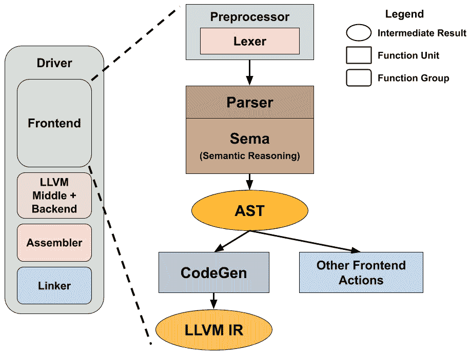

# *第五章*：探索 Clang 的架构

**Clang** 是 LLVM 的官方前端，用于 **C 家族** 编程语言，包括 C、C++ 和 Objective-C。它处理输入源代码（例如解析、类型检查和语义推理等）并生成等效的 LLVM IR 代码，然后由其他 LLVM 子系统接管以执行优化和本地代码生成。许多 *类似 C* 的方言或语言扩展也发现 Clang 很容易托管它们的实现。例如，Clang 提供了对 OpenCL、OpenMP 和 CUDA C/C++ 的官方支持。除了正常的前端工作外，Clang 一直在发展，将其功能划分为库和模块，以便开发者可以使用它们创建各种与 **源代码处理** 相关的工具；例如，代码重构、代码格式化和语法高亮。学习 Clang 开发不仅可以让你更深入地参与到 LLVM 项目中，还可以为创建强大的应用程序和工具开辟广泛的可能性。

与将大多数任务安排在单个管道（即 **PassManager**）中并按顺序运行的 LLVM 不同，Clang 组织其子组件的方式更加多样化。在本章中，我们将向您展示一个清晰的图像，说明 Clang 的重要子系统是如何组织的，它们的作用是什么，以及你应该查找代码库的哪个部分。

术语

从本章开始到本书的其余部分，我们将使用 Clang（以大写 C 开头，并使用 Minion Pro 字体）来指代整个 **项目** 和其 **技术**。当我们使用 `clang`（全部小写，并使用 Courier 字体）时，我们指的是 **可执行程序**。

在本章中，我们将涵盖以下主要主题：

+   学习 Clang 的子系统及其角色

+   探索 Clang 的工具功能和扩展选项

到本章结束时，你将拥有这个系统的路线图，以便你可以启动自己的项目，并为后续章节中关于 Clang 开发的相关内容奠定基础。

# 技术要求

在 *第一章* 中，*构建 LLVM 时的资源节约*，我们向您展示了如何构建 LLVM。然而，这些说明并没有构建 Clang。要包括 Clang 在构建列表中，请编辑分配给 `LLVM_ENABLE_PROJECTS` CMake 变量的值，如下所示：

```cpp
$ cmake -G Ninja -DLLVM_ENABLE_PROJECTS="clang;clang-tools-extra" …
```

该变量的值应该是一个分号分隔的列表，其中每个项目都是 LLVM 的子项目之一。在这种情况下，我们包括 Clang 和 `clang-tools-extra`，它包含基于 Clang 技术的一组有用工具。例如，`clang-format` 工具被无数开源项目使用，特别是大型项目，以在其代码库中强制实施统一的编码风格。

将 Clang 添加到现有构建中

如果您已经有一个 Clang 未启用的 LLVM 构建，您可以在不再次调用原始 CMake 命令的情况下编辑 `CMakeCache.txt` 中的 `LLVM_ENABLE_PROJECTS` CMake 参数的值。编辑文件后，CMake 应该会重新配置自己，然后再次运行 Ninja（或您选择的构建系统）。

您可以使用以下命令构建 `clang`、Clang 的驱动程序和主程序：

```cpp
$ ninja clang
```

您可以使用以下命令运行所有 Clang 测试：

```cpp
$ ninja check-clang
```

现在，您应该在 `/<您的构建目录>/bin` 文件夹中拥有 `clang` 可执行文件。

# 学习 Clang 的子系统及其作用

在本节中，我们将为您概述 Clang 的结构和组织。在本书的后续部分，我们将通过专门的章节或章节进一步介绍一些重要的组件或子系统。我们希望这能给您一些关于 Clang 内部结构和它们如何对您的开发有益的想法。

首先，让我们看看整体情况。以下图表显示了 Clang 的高级结构：



图 5.1 – Clang 的高级结构

如图例所述，圆角矩形代表可能由具有相似功能的多个组件组成的子系统。例如，**前端** 可以进一步细分为预处理器、解析器和代码生成逻辑等组件。此外，还有中间结果，如图中所示为椭圆形。我们特别关注其中的两个 – **Clang AST** 和 **LLVM IR**。前者将在 *第七章* 中深入讨论，*处理 AST*，而后者是 *第三部分*，*中间端开发* 的主角，将讨论可以应用于 LLVM IR 的优化和分析。

让我们从查看驱动程序的概述开始。以下小节将简要介绍这些驱动程序组件的每个组件。

## 驱动程序

一个常见的误解是 `clang` 可执行文件是编译器前端。虽然 `clang` 确实使用了 Clang 的前端组件，但可执行文件本身实际上是一种称为 **编译器驱动程序** 或 **驱动程序** 的程序。

编译源代码是一个复杂的过程。首先，它包括多个阶段，如下所示：

+   **前端**：解析和语义检查

+   **中间端**：程序分析和优化

+   **后端**：本地代码生成

+   **汇编**：运行汇编器

+   **链接**：运行链接器

在这些阶段及其包含的组件中，有无数选项/参数和标志，例如告诉编译器在哪里搜索包含文件的选项（即 GCC 和 Clang 中的 `-I` 命令行选项）。此外，我们希望编译器能够确定这些选项中的某些值。例如，如果编译器能够默认将一些 C/C++ 标准库文件夹（例如 Linux 系统中的 `/include` 和 `/usr/include`）包含在头文件搜索路径中，那就太好了，这样我们就不需要在命令行中手动指定每个文件夹。继续这个例子，很明显，我们希望我们的编译器能够在不同的操作系统和平台上**通用**，但许多操作系统使用不同的 C/C++ 标准库路径。那么，编译器是如何相应地选择正确的路径的呢？

在这种情况下，一个驱动程序被设计出来以提供帮助。它是一段软件，充当核心编译组件的管家，为他们提供必要的信息（例如，我们之前提到的特定于操作系统的系统包含路径）并安排它们的执行，以便用户只需提供重要的命令行参数。观察驱动程序辛勤工作的一个好方法是使用 `clang` 调用中的 `-###` 命令行标志。例如，你可以尝试使用该标志编译一个简单的 hello world 程序：

```cpp
$ clang++ -### -std=c++11 -Wall ./hello_world.cpp -o hello_world
```

以下是在 macOS 计算机上运行先前命令后的输出的一部分：

```cpp
"/path/to/clang" "-cc1" "-triple" "x86_64-apple-macosx11.0.0" "-Wdeprecated-objc-isa-usage" "-Werror=deprecated-objc-isa-usage" "-Werror=implicit-function-declaration" "-emit-obj" "-mrelax-all" "-disable-free" "-disable-llvm-verifier" … "-fno-strict-return" "-masm-verbose" "-munwind-tables" "-target-sdk-version=11.0" … "-resource-dir" "/Library/Developer/CommandLineTools/usr/lib/clang/12.0.0" "-isysroot" "/Library/Developer/CommandLineTools/SDKs/MacOSX.sdk" "-I/usr/local/include" "-stdlib=libc++" … "-Wall" "-Wno-reorder-init-list" "-Wno-implicit-int-float-conversion" "-Wno-c99-designator" … "-std=c++11" "-fdeprecated-macro" "-fdebug-compilation-dir" "/Users/Rem" "-ferror-limit" "19" "-fmessage-length" "87" "-stack-protector" "1" "-fstack-check" "-mdarwin-stkchk-strong-link" … "-fexceptions" … "-fdiagnostics-show-option" "-fcolor-diagnostics" "-o" "/path/to/temp/hello_world-dEadBeEf.o" "-x" "c++" "hello_world.cpp"…
```

这些实际上是驱动程序翻译后传递给**真实** Clang 前端的标志。虽然你不需要理解所有这些标志，但确实，即使是简单的程序，编译流程也包含大量的编译器选项和许多子组件。

驱动程序的源代码可以在 `clang/lib/Driver` 下找到。在*第八章* *与编译器标志和工具链一起工作*中，我们将更详细地探讨这一点。

前端

一本典型的编译器教科书可能会告诉你，编译器前端由一个**词法分析器**和一个**解析器**组成，它们生成一个**抽象语法树**（**AST**）。Clang 的前端也使用这个框架，但有一些主要区别。首先，词法分析器通常与**预处理器**结合使用，对源代码进行的语义分析被分离到一个单独的子系统，称为**Sema**。这构建了一个 AST 并执行各种语义检查。

### 词法分析和预处理器

由于编程语言标准的复杂性和现实世界源代码的规模，预处理变得非同寻常。例如，当你有 10+层的头文件层次结构时，解决包含的文件变得复杂，这在大型项目中很常见。在 OpenMP 使用`#pragma`并行化 for 循环的情况下，高级指令如`#pragma`可能会受到挑战。解决这些挑战需要预处理程序和词法分析器之间的紧密合作，它们为所有预处理动作提供原语。它们的源代码可以在`clang/lib/Lex`下找到。在*第六章* *扩展预处理程序*中，你将熟悉预处理程序和词法分析器开发，并学习如何使用强大的扩展系统实现自定义逻辑。

### 解析器和 Sema

Clang 的解析器从预处理程序和词法分析器消耗标记流，并试图实现它们的语义结构。在这里，Sema 子系统在生成 AST 之前，从解析器的结果中进行更多的语义检查和分析。历史上，还有一个抽象层，你可以创建自己的*解析器动作*回调，以指定在解析某些语言指令（例如，变量名等标识符）时想要执行的操作。

在那时，Sema 是这些解析器动作之一。然而，后来人们发现这一额外的抽象层并不是必要的，所以解析器现在只与 Sema 交互。尽管如此，Sema 仍然保留了这种回调式设计。例如，当解析到 for 循环结构时，会调用`clang::Sema::ActOnForStmt(…)`函数（在`clang/lib/Sema/SemaStmt.cpp`中定义）。然后它会进行各种检查以确保语法正确，并为 for 循环生成 AST 节点；即，一个`ForStmt`对象。

### AST

AST（抽象语法树）是当你想要用自定义逻辑扩展 Clang 时最重要的基本元素。我们将要介绍的所有的常见 Clang 扩展/插件都是基于 AST 操作的。为了体验 AST，你可以使用以下命令从源代码中打印出 AST：

```cpp
$ clang -Xclang -ast-dump -fsyntax-only foo.c
```

例如，在我的电脑上，我使用了以下简单的代码，它只包含一个函数：

```cpp
int foo(int c) { return c + 1; }
```

这将产生以下输出：

```cpp
TranslationUnitDecl 0x560f3929f5a8 <<invalid sloc>> <invalid sloc>
|…
`-FunctionDecl 0x560f392e1350 <./test.c:2:1, col:30> col:5 foo 'int (int)'
  |-ParmVarDecl 0x560f392e1280 <col:9, col:13> col:13 used c 'int'
  `-CompoundStmt 0x560f392e14c8 <col:16, col:30>
    `-ReturnStmt 0x560f392e14b8 <col:17, col:28>
      `-BinaryOperator 0x560f392e1498 <col:24, col:28> 'int' '+'
        |-ImplicitCastExpr 0x560f392e1480 <col:24> 'int' <LValueToRValue>
        | `-DeclRefExpr 0x560f392e1440 <col:24> 'int' lvalue ParmVar 0x560f392e1280 'c' 'int'
        `-IntegerLiteral 0x560f392e1460 <col:28> 'int' 1
```

这个命令非常有用，因为它告诉你代表某些语言指令的 C++ AST 类，这对于编写 AST 回调——许多 Clang 插件的核心至关重要。例如，从前面的行中，我们可以知道变量引用位置（在`c + 1`表达式中的`c`）由`DeclRefExpr`类表示。

与解析器的组织方式类似，你可以注册不同类型的`ASTConsumer`实例来访问或操作 AST。**CodeGen**，我们将在稍后介绍，是其中之一。在*第七章* *处理 AST*中，我们将向您展示如何使用插件实现自定义 AST 处理逻辑。

### CodeGen

虽然没有关于如何处理 AST（例如，如果你使用前面显示的`-ast-dump`命令行选项，前端将打印文本 AST 表示）的规定，但 CodeGen 子系统执行的最常见任务是生成 LLVM IR 代码，该代码随后将被 LLVM 编译成本地汇编或目标代码。

## LLVM、汇编器和链接器

一旦代码生成子系统生成了 LLVM IR 代码，它将被 LLVM 编译管道处理以生成本地代码，无论是汇编代码还是目标代码。LLVM 提供了一个名为**MC 层**的框架，其中架构可以选择实现直接集成到 LLVM 管道中的汇编器。主要架构如 x86 和 ARM 都采用这种方法。如果你不这样做，LLVM 管道末尾生成的任何文本汇编代码都需要由驱动程序调用的外部汇编程序处理。

尽管 LLVM 已经拥有自己的链接器，即被称为**LLD**项目，但一个**集成**链接器仍然不是一个成熟的选项。因此，外部链接器程序总是由驱动程序调用以链接目标文件并生成最终的二进制工件。

外部与集成

使用外部汇编器或链接器意味着调用一个**独立进程**来运行程序。例如，要运行外部汇编器，前端需要将汇编代码放入一个临时文件中，然后使用该文件路径作为其命令行参数之一来启动汇编器。另一方面，使用集成汇编器/链接器意味着汇编或链接的功能被打包到**库**中，而不是可执行文件。因此，在编译管道的末尾，LLVM 将调用 API 来处理汇编代码的**内存中**实例以生成目标代码。这种集成方法的优点当然是节省许多间接操作（写入临时文件并立即读取）。这在一定程度上也使代码更加简洁。

有了这些，你已经对正常的编译流程有了概述，从源代码到本地代码。在下一节中，我们将超越`clang`可执行文件，并提供 Clang 提供的工具和扩展选项的概述。这不仅增强了`clang`的功能，还提供了一种在树外项目中使用 Clang 惊人技术的方法。

# 探索 Clang 的工具功能和扩展选项

Clang 项目不仅包含 `clang` 可执行文件。它还为开发者提供了扩展其工具的接口，以及将其功能作为库导出的接口。在本节中，我们将为您概述所有这些选项。其中一些将在后面的章节中介绍。

目前在 Clang 中有三种工具和扩展选项可用：`clang::FrontendAction` 类。

## `FrontendAction` 类

在 *学习 Clang 的子系统及其角色* 部分，我们探讨了 Clang 的各种前端组件，例如预处理器和 Sema，仅举几个例子。许多这些重要的组件都被一个单一的数据类型封装，称为 `FrontendAction`。一个 `FrontendAction` 实例可以被视为在前端运行的单个任务。它提供了一个统一的接口，以便任务可以消费和与各种资源进行交互，例如输入源文件和 AST，从这个角度来看，它类似于 **LLVM Pass** 的角色（LLVM Pass 提供了一个统一的接口来处理 LLVM IR）。然而，与 LLVM Pass 也有一些显著的不同：

+   并非所有前端组件都被封装到 `FrontendAction` 中，例如解析器和 Sema。它们是独立的组件，为其他 FrontendAction 运行生成材料（例如，AST）。

+   除了少数场景（Clang 插件就是其中之一）外，Clang 编译实例很少运行多个 FrontendAction。通常情况下，只有一个 `FrontendAction` 将被执行。

一般而言，一个 `FrontendAction` 描述了在前端一个或两个重要位置要执行的任务。这也解释了为什么它对于工具或扩展开发如此重要——我们基本上是将我们的逻辑构建到一个 `FrontendAction`（更精确地说，是 `FrontendAction` 的一个派生类）实例中，以控制和定制正常 Clang 编译的行为。

为了让你对 `FrontendAction` 模块有一个感觉，这里列出了一些它的重要 API：

+   `FrontendAction::BeginSourceFileAction(…)/EndSourceFileAction(…)`: 这些是派生类可以覆盖的回调，分别在处理源文件之前和之后执行操作。

+   `FrontendAction::ExecuteAction(…)`: 这个回调描述了为这个 `FrontendAction` 需要执行的主要操作。请注意，虽然没有人阻止你直接覆盖这个方法，但许多 `FrontendAction` 的派生类已经提供了更简单的接口来描述一些常见任务。例如，如果你想处理一个 AST，你应该从 `ASTFrontendAction` 继承并利用其基础设施。

+   `FrontendAction::CreateASTConsumer(…)`: 这是一个工厂函数，用于创建 `ASTConsumer` 实例，它是一组回调，当前端遍历 AST 的不同部分时会被调用（例如，当前端遇到一组声明时会被调用的回调）。请注意，尽管大多数 FrontendAction 的工作是在 AST 生成之后，但 AST 可能根本不会生成。这可能发生在用户只想运行预处理器的情况下（例如，使用 Clang 的 `-E` 命令行选项来转储预处理器的内容）。因此，你不必总是实现你自定义的 `FrontendAction` 中的这个函数。

再次强调，通常你不会直接从 `FrontendAction` 派生你的类，但了解 FrontendAction 在 Clang 中的内部角色及其接口，可以在进行工具或插件开发时为你提供更多的材料。

## Clang 插件

Clang 插件允许你动态注册一个新的 `FrontendAction`（更具体地说，是一个 `ASTFrontendAction`），它可以在 `clang` 的主要动作之前、之后，甚至替换主要动作来处理 AST。一个现实世界的例子是将 `virtual` 关键字放置在应该为虚拟的方法上。

可以使用简单的命令行选项将插件轻松加载到普通的 `clang` 中：

```cpp
$ clang -fplugin=/path/to/MyPlugin.so … foo.cpp
```

如果你想要自定义编译但没有控制 `clang` 可执行文件（即你不能使用修改过的 `clang` 版本），这非常有用。此外，使用 Clang 插件允许你更紧密地集成到构建系统中；例如，如果你想在源文件或任意构建依赖项被修改后重新运行你的逻辑。由于 Clang 插件仍然使用 `clang` 作为驱动程序，而现代构建系统在解析常规编译命令依赖项方面相当出色，这可以通过对编译标志进行一些调整来实现。

然而，使用 Clang 插件的最大缺点是其 `clang` 可执行文件，但这仅当你的插件使用了 C++ API（以及 ABI）并且 `clang` 可执行文件与之匹配时。不幸的是，目前 Clang（以及整个 LLVM 项目）没有意向使其任何 C++ API 稳定。换句话说，为了走最安全的路线，你需要确保你的插件和 `clang` 都使用完全相同的（主要）版本的 LLVM。这个问题使得 Clang 插件很难独立发布。

我们将在 *第七章* 中更详细地探讨这个问题，*处理 AST*。

## LibTooling 和 Clang Tools

`clang` 可执行文件。此外，API 被设计得更加高级，这样你就不需要处理许多 Clang 的内部细节，使其对非 Clang 开发者更加友好。

**语言服务器**是 libTooling 最著名的用例之一。语言服务器作为一个守护进程启动，并接受来自编辑器或 IDE 的请求。这些请求可能非常简单，如检查代码片段的语法，或者非常复杂，如代码补全。虽然语言服务器不需要像普通编译器那样将传入的源代码编译成本地代码，但它需要一种方式来解析和分析该代码，这从头开始构建是非平凡的。libTooling 通过采用 Clang 的技术并为语言服务器开发者提供一个更简单的接口，避免了在这种情况下需要“重新造轮子”的需求。

为了让您更具体地了解 libTooling 与 Clang 插件的区别，这里有一个（简化的）代码片段，用于执行一个名为`MyCustomAction`的自定义`ASTFrontendAction`：

```cpp
int main(int argc, char** argv) {
  CommonOptionsParser OptionsParser(argc, argv,…);
  ClangTool Tool(OptionsParser.getCompilations(), {"foo.cpp"});
  return Tool.run(newFrontendActionFactory<MyCustomAction>().         get());
}
```

如前述代码所示，你不能随意将此代码嵌入到任何代码库中。libTooling 还提供了许多有用的工具，例如`CommonOptionsParser`，它可以解析文本命令行选项并将它们转换为 Clang 选项。

libTooling 的 API 稳定性

不幸的是，libTooling 也没有提供稳定的 C++ API。然而，这并不是问题，因为你完全控制着使用的 LLVM 版本。

最后但同样重要的是，`clang-refactor`用于重构代码。这包括重命名变量，如下面的代码所示：

```cpp
// In foo.cpp…
struct Location {
  float Lat, Lng;
};
float foo(Location *loc) {
  auto Lat = loc->Lat + 1.0;
  return Lat;
}
```

如果我们想要重命名`Location`结构体中的`Lat`成员变量`Latitude`，我们可以使用以下命令：

```cpp
$ clang-refactor --selection="foo.cpp:1:1-10:2" \
                 --old-qualified-name="Location::Lat" \
                 --new-qualified-name="Location::Latitude" \
                 foo.cpp
```

构建 clang-refactor

请务必遵循本章开头的说明，将`clang-tools-extra`包含在`LLVM_ENABLE_PROJECTS` CMake 变量的列表中。通过这样做，您将能够使用`ninja clang-refactor`命令构建`clang-refactor`。

你将得到以下输出：

```cpp
// In foo.cpp…
struct Location {
  float Latitude, Lng;
};
float foo(Location *loc) {
  auto Lat = loc->Latitude + 1.0;
  return Lat;
}
```

这是由 libTooling 内部构建的重构框架完成的；`clang-refactor`仅仅为其提供了一个命令行接口。

# 摘要

在本章中，我们探讨了 Clang 的组织结构以及一些重要子系统组件的功能。然后，我们了解了 Clang 的主要扩展和工具选项之间的区别——Clang 插件、libTooling 和 Clang Tools——包括它们的外观以及它们的优缺点。Clang 插件通过动态加载的插件提供了一种简单的方法将自定义逻辑插入到 Clang 的编译管道中，但存在 API 稳定性问题；libTooling 与 Clang 插件的关注点不同，它旨在为开发者提供一个工具箱以创建独立工具；Clang Tools 提供了各种应用。

在下一章中，我们将讨论预处理器开发。我们将学习预处理器和词法分析器在 Clang 中的工作方式，并展示如何编写插件以定制预处理逻辑。

# 进一步阅读

+   这里是 Chromium 的 Clang 插件执行的检查列表：[`chromium.googlesource.com/chromium/src/tools/clang/+/refs/heads/master/plugins/FindBadConstructsAction.h`](https://chromium.googlesource.com/chromium/src/tools/clang/+/refs/heads/master/plugins/FindBadConstructsAction.h).

+   你可以在这里了解更多关于选择正确的 Clang 扩展接口的信息：[`clang.llvm.org/docs/Tooling.html`](https://clang.llvm.org/docs/Tooling.html).

+   LLVM 还有一个基于 libTooling 的自己的语言服务器，称为`clangd`：[`clangd.llvm.org`](http://clangd.llvm.org).
