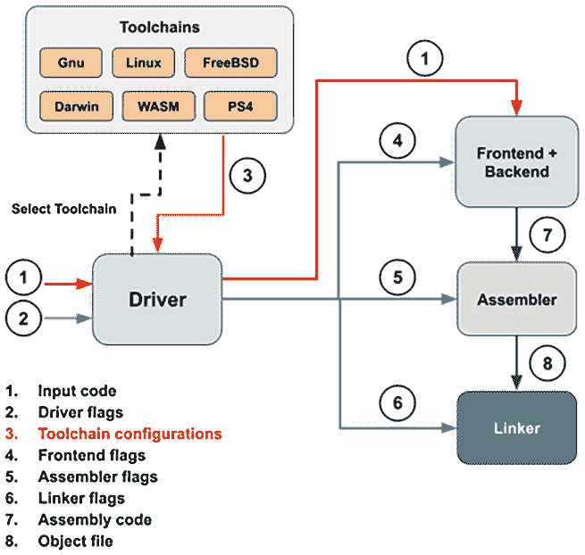

# *第八章*：使用编译器标志和工具链

在上一章中，我们学习了如何处理 Clang 的 AST – 分析程序中最常见的格式之一。此外，我们还学习了如何开发 AST 插件，这是一种将自定义逻辑插入 Clang 编译管道的简单方法。这些知识将帮助你在源代码检查或寻找潜在的安全漏洞等任务中增强你的技能集。

在本章中，我们正在从特定的子系统向上攀升，着眼于更大的图景 – 编译器**驱动程序**和**工具链**，根据用户的需求协调、配置和运行单个 LLVM 和 Clang 组件。更具体地说，我们将关注如何添加新的编译器标志以及如何创建自定义工具链。正如我们在*第五章*中提到的，即[*探索 Clang 的架构*]，编译器驱动程序和工具链通常被低估，并且长期以来一直被忽视。然而，没有这两个重要的软件组件，编译器将变得极其难以使用。例如，由于缺乏标志转换，用户需要传递超过 *10* 个不同的编译器标志才能构建一个简单的 *hello world* 程序。用户还需要运行至少三种不同类型的工具，以便创建一个可执行的程序来运行，因为没有驱动程序或工具链帮助我们调用 *汇编器* 和 *链接器*。在本章中，你将学习编译器驱动程序和工具链在 Clang 中的工作方式以及如何自定义它们，这对于你想要在新的操作系统或架构上支持 Clang 来说非常有用。

在本节中，我们将涵盖以下主题：

+   理解 Clang 中的驱动程序和工具链

+   添加自定义驱动程序标志

+   添加自定义工具链

# 技术要求

在本章中，我们仍然依赖于 `clang` 可执行文件，所以请确保你已构建它，如下所示：

```cpp
$ ninja clang
```

正如我们在*第五章*中提到的，即[*探索 Clang 的架构*]，我们正在使用驱动程序，你可以使用 `-###` 命令行选项来打印出已从驱动程序转换的前端标志，如下所示：

```cpp
$ clang++ -### -std=c++11 -Wall hello_world.cpp -o hello_world
"/path/to/clang" "-cc1" "-triple" "x86_64-apple-macosx11.0.0" "-Wdeprecated-objc-isa-usage" "-Werror=deprecated-objc-isa-usage" "-Werror=implicit-function-declaration" "-emit-obj" "-mrelax-all" "-disable-free" "-disable-llvm-verifier" … "-fno-strict-return" "-masm-verbose" "-munwind-tables" "-target-sdk-version=11.0" … "-resource-dir" "/Library/Developer/CommandLineTools/usr/lib/clang/12.0.0" "-isysroot" "/Library/Developer/CommandLineTools/SDKs/MacOSX.sdk" "-I/usr/local/include" "-stdlib=libc++" … "-Wall" "-Wno-reorder-init-list" "-Wno-implicit-int-float-conversion" "-Wno-c99-designator" … "-std=c++11" "-fdeprecated-macro" "-fdebug-compilation-dir" "/Users/Rem" "-ferror-limit" "19" "-fmessage-length" "87" "-stack-protector" "1" "-fstack-check" "-mdarwin-stkchk-strong-link" … "-fexceptions" … "-fdiagnostics-show-option" "-fcolor-diagnostics" "-o" "/path/to/temp/hello_world-dEadBeEf.o" "-x" "c++" "hello_world.cpp"…
```

使用此标志将**不会**运行编译的其余部分，而只是执行驱动程序和工具链。这使得它成为验证和调试特定标志以及检查它们是否正确从驱动程序传播到前端的好方法。

最后但同样重要的是，在本章的最后部分，*添加自定义工具链*，我们将处理一个只能在 Linux 系统上运行的项目。此外，请事先安装 OpenSSL。在大多数 Linux 系统中，它通常作为软件包提供。例如，在 Ubuntu 上，你可以使用以下命令来安装它：

```cpp
$ sudo apt install openssl
```

我们只使用命令行工具，因此不需要安装通常用于开发的任何 OpenSSL 库。

本章将使用的代码可以在以下位置找到：[`github.com/PacktPublishing/LLVM-Techniques-Tips-and-Best-Practices-Clang-and-Middle-End-Libraries/tree/main/Chapter08`](https://github.com/PacktPublishing/LLVM-Techniques-Tips-and-Best-Practices-Clang-and-Middle-End-Libraries/tree/main/Chapter08).

在本章的第一部分，我们将简要介绍 Clang 的驱动程序和工具链基础设施。

# 理解 Clang 中的驱动程序和工具链

在我们讨论 Clang 的编译器驱动程序之前，有必要强调一点：**编译一段代码**永远不是一个**单一**的任务（也不是一个简单的任务）。在学校，我们被教导说编译器由一个**词法分析器**、一个**解析器**组成，有时还包含一个**优化器**，并以**汇编代码生成器**结束。虽然你仍然可以在现实世界的编译器中看到这些阶段，但它们只能给你文本形式的汇编代码，而不是我们通常期望的可执行文件或库。此外，这个简单的编译器只提供了有限的灵活性——它不能移植到任何其他操作系统或平台。

为了使这个玩具编译器更加真实和可用，还需要将许多其他**管道**工具组合起来，包括核心编译器：一个**汇编器**，将汇编代码转换为（二进制格式）目标文件，一个**链接器**，将多个目标文件放入可执行文件或库中，以及许多其他例程来解决特定平台的配置，例如数据宽度、默认头文件路径或**应用程序二进制接口**（**ABIs**）。只有借助这些**管道**，我们才能通过输入几个单词来使用编译器：

```cpp
$ clang hello_world.c -o hello_world
```

**编译器驱动程序**是一种组织这些**管道**工作的软件。尽管在编译过程中有多个不同的任务需要完成，但本章我们将只关注两个最重要的任务——处理编译器标志和在不同平台上调用正确的工具——这正是工具链设计的目的。

以下图表显示了驱动程序、工具链和编译器其他部分的交互：



图 8.1 – Clang 驱动程序、工具链和编译器其他部分的典型工作流程

如前图所示，Clang 的驱动程序充当 *调度器* 并将标志和工作负载分配给编译的每个阶段，即前端/后端、汇编器和链接器。为了给您一个更具体的概念，了解每个这些阶段的标志看起来像什么，回想一下我们在本章开头介绍的 `-###` 编译器选项。该选项打印的（大量）内容是前端（`-internal-isystem` 包含有关系统头文件路径的信息，包括 C/C++ 标准库头文件存储的路径。显然，Clang 的前端需要知道标准库头文件存储在哪里，但根据您过去使用 `clang`（或 `gcc`）的经验，您很少需要明确地告诉它们这些头文件的路径 – 驱动程序会为您完成这项工作。同样的逻辑也适用于链接阶段。链接器通常需要不仅仅是对象文件才能正确生成可执行文件或库。例如，它们需要知道 C/C++ 标准库的库文件（在 Unix/Linux 系统上是 `*.a` 或 `*.so`）在哪里。在这种情况下，Clang 的驱动程序将通过链接器标志向链接器提供这些信息。

提供给各个编译阶段的标志和工作负载（简称为 *配置*）是从两个来源 *转换* 的：驱动标志（`-c`、`-Wall` 和 `-std=c++11`。在下一节，*添加自定义驱动标志* 中，我们将展示一些 Clang 如何将驱动标志转换为前端标志或甚至汇编器/链接器标志的示例。

另一方面，还有 `/usr/include` 和 `/usr/lib`。此外，macOS X 使用一种名为 **Mach-O** 的可执行格式，这与 Linux 的 ELF 格式不同。这极大地影响了编译器（Clang）构建代码的方式。

为了让 Clang 为各种平台编译代码，它使用工具链（在内部通过 `ToolChain` C++ 类有效地表示）来封装平台特定的信息和配置。在编译的早期阶段，Clang 的驱动程序根据当前运行的系统（称为 `-target=` 驱动标志，用于请求 Clang 为与主机系统不同的特定平台构建程序，目前实际上是在做 `ld64` 和 `lld` 链接器，而 Linux 可以使用 `ld`（BFD 链接器）、`ld.gold` 和 `lld` 作为链接器。因此，工具链还应指定要使用哪个汇编器和链接器。在本章的最后部分，*添加自定义工具链*，我们将通过一个示例项目来了解 Clang 的工具链是如何工作的。让我们从学习 Clang 中驱动标志的工作原理开始我们的旅程。

# 添加自定义驱动标志

在上一节中，我们解释了驱动和工具链在 Clang 中的作用。在本节中，我们将学习如何通过向 Clang 添加自定义驱动标志来实现 Clang 的这种转换。同样，我们将在单独的部分中演示详细步骤之前，首先概述这个示例项目。

## 项目概述

我们将在本节中使用的示例项目将添加一个新的驱动标志，以便当用户提供该标志时，头文件将 *隐式地* 包含在输入代码中。

更具体地说，这里我们有一个头文件 – `simple_log.h` – 如下代码所示，它定义了一些简单的 API 来打印日志消息：

```cpp
#ifndef SIMPLE_LOG_H
#define SIMPLE_LOG_H
#include <iostream>
#include <string>
#ifdef SLG_ENABLE_DEBUG
inline void print_debug(const std::string &M) {
  std::cout << "[DEBUG] " << M << std::endl;
}
#endif
#ifdef SLG_ENABLE_ERROR
inline void print_error(const std::string &M) {
  std::cout << "[ERROR] " << M << std::endl;
}
#endif
#ifdef SLG_ENABLE_INFO
inline void print_info(const std::string &M) {
  std::cout << "[INFO] " << M << std::endl;
}
#endif
#endif
```

这里的目标是使用这些 API 在我们的代码中 *不* 写入 `#include "simple_log.h"` 行来导入头文件。并且这个特性只有在提供自定义驱动标志 `-fuse-simple-log` 给 `clang` 时才会启用。例如，让我们写下以下代码，`test.cc`：

```cpp
int main() {
  print_info("Hello world!!");
  return 0;
}
```

尽管它没有任何 `#include` 指令，但它仍然可以编译（使用 `-fuse-simple-log` 标志）并运行而不会出现任何问题：

```cpp
$ clang++ -fuse-simple-log test.cc -o test
$ ./test
[INFO] Hello world!!
$
```

此外，我们可以使用 `-fuse-<log level>-simple-log` /`-fno-use-<log level>-simple-log` 来包含或排除特定日志级别的函数。例如，让我们使用相同的先前代码片段，但在编译代码时添加 `-fno-use-info-simple-log`：

```cpp
$ clang++ -fuse-simple-log -fno-use-info-simple-log test.cc -o test
test.cc:2:3: error: use of undeclared identifier 'print_info'
  print_info("Hello World!!");
  ^
1 error generated
$
```

每个日志打印功能的开关简单地由其周围的 `simple_log.h` 中的 `#ifdef` 语句控制。例如，`print_info` 只有在 `SLG_ENABLE_INFO` 被定义时才会被包含。在 *翻译自定义驱动标志* 部分，我们将向您展示这些宏定义是如何通过驱动标志切换的。

最后但同样重要的是，您可以指定 `simple_log.h` 文件的自定义路径。默认情况下，我们的特性将在源代码的当前文件夹中包含 `simple_log.h`。您可以通过提供 `-fsimple-log-path=<file path>` 或 `-fuse-simple-log=<file path>` 来更改此设置。例如，我们想要使用 `simple_log.h` 的一个替代版本 – `advanced_log.h`，它存储在 `/home/user`，提供了相同接口但不同实现的函数。现在，我们可以使用以下命令：

```cpp
$ clang++ -fuse-simple-log=/home/user/advanced_log.h test.cc -o test
[01/28/2021 20:51 PST][INFO] Hello World!!
$
```

以下部分将向您展示如何更改 Clang 驱动中的代码，以便您可以实现这些功能。

## 声明自定义驱动标志

首先，我们将引导您通过步骤来 *声明* 自定义驱动标志，例如 `-fuse-simple-log` 和 `-fno-use-info-simple-log`。然后，我们将 *连接* 这些标志到真正的前端功能。

Clang 使用 **TableGen** 语法来声明所有类型的编译器标志 – 包括驱动标志和前端标志。

TableGen

**TableGen** 是一种 **领域特定语言** (**DSL**)，用于声明结构和关系数据。要了解更多信息，请参阅 *第四章*，*TableGen 开发*。

所有这些标志声明都放在`clang/include/clang/Driver/Options.td`中。以常见的`-g`标志为例，它告诉你你想要生成源级调试信息。例如，它有一个这样的声明：

```cpp
def g_Flag : Flag<["-"], "g">, Group<g_Group>,
  HelpText<"Generate source-level debug information">;
```

TableGen 记录`g_Flag`是由几个 TableGen 类创建的：`Flag`、`Group`和`HelpText`。其中，我们最感兴趣的是`Flag`，其模板值（`["-"]`和`"g"`）描述了实际的命令行标志格式。注意，当我们声明一个*布尔*标志时——这个标志的值由其存在决定，没有其他值跟随——就像在这个例子中，我们继承自`Flag`类。

在我们想要声明一个具有等于号（"="）后跟值的标志的情况下，我们继承自`Joined`类。例如，`-std=<C++ standard name>`的 TableGen 声明看起来像这样：

```cpp
def std_EQ : Joined<["-", "--"], "std=">, Flags<[CC1Option]>, …;
```

通常，这类标志的记录名称（如本例中的`std_EQ`）以`_EQ`作为后缀。

最后但同样重要的是，`Flags`（复数）类可以用来指定一些属性。例如，前面的代码片段中的`CC1Options`告诉我们这个标志也可以是一个前端标志。

现在我们已经了解了如何通常声明驱动器标志，是时候创建我们自己的了：

1.  首先，我们将处理`-fuse-simple-log`标志。以下是我们的声明方式：

    ```cpp
    def fuse_simple_log : Flag<["-"], "fuse-simple-log">,
                      Group<f_Group>, Flags<[NoXarchOption]>;
    ```

    这个代码片段基本上与我们之前使用的示例没有区别，只是多了`Group`类和`NoXarchOption`。前者指定了这个标志所属的*逻辑*组——例如，`f_Group`是为以`-f`开头的标志。后者告诉我们这个标志*只能*在驱动器中使用。例如，你不能将它传递给前端（但我们如何直接将标志传递给前端？我们将在本节的最后回答这个问题）。

    注意，我们在这里只声明了`-fuse-simple-log`，而没有声明`-fuse-simple-log=<file path>`——这将在稍后介绍的另一个标志中完成。

1.  接下来，我们处理`-fuse-<log level>-simple-log`和`-fno-use-<log level>-simple-log`。在 GCC 和 Clang 中，看到成对标志（如`-f<flag name>`/`-fno-<flag name>`）以启用或禁用某个功能是很常见的。因此，Clang 提供了一个方便的 TableGen 实用工具——`BooleanFFlag`——以简化成对标志的创建。请参见以下代码中`-fuse-error-simple-log`/`-fno-use-error-simple-log`的声明：

    ```cpp
    defm use_error_simple_log : BooleanFFlag<"use-error-simple-log">, Group<f_Group>, Flags<[NoXarchOption]>;
    ```

    `BooleanFFlag`是一个*多类*（所以请确保你使用`defm`而不是`def`来创建 TableGen 记录）。在底层，它同时为`-f<flag name>`和`-fno-<flag name>`创建 TableGen 记录。

    现在我们已经了解了如何创建`use_error_simple_log`，我们可以使用同样的技巧来为其他日志级别创建 TableGen 记录：

    ```cpp
    defm use_debug_simple_log : BooleanFFlag<"use-debug-simple-log">, Group<f_Group>, Flags<[NoXarchOption]>;
    defm use_info_simple_log : BooleanFFlag<"use-info-simple-log">, Group<f_Group>, Flags<[NoXarchOption]>;
    ```

1.  最后，我们声明了`-fuse-simple-log=<文件路径>`和`-fsimple-log-path=<文件路径>`标志。在前面的步骤中，我们只处理布尔标志，但在这里，我们正在创建具有等于号后跟值的标志，因此我们使用了我们之前引入的`Joined`类：

    ```cpp
    def fsimple_log_path_EQ : Joined<["-"], "fsimple-log-path=">, Group<f_Group>, Flags<[NoXarchOption]>;
    def fuse_simple_log_EQ : Joined<["-"], "fuse-simple-log=">, Group<f_Group>, Flags<[NoXarchOption]>;
    ```

    再次，具有值的标志通常在其 TableGen 记录名称后缀中使用`_EQ`。

这就完成了声明我们自定义驱动程序标志所需的所有必要步骤。在 Clang 的构建过程中，这些 TableGen 指令将被翻译成 C++枚举和其他由驱动程序使用的实用程序。例如，`-fuse-simple-log=<文件路径>`将被表示为一个枚举；即`options::OPT_fuse_simple_log_EQ`。下一节将向您展示如何查询用户给出的所有命令行标志，以及最重要的是，如何将我们的自定义标志翻译成其前端对应物。

## 翻译自定义驱动程序标志

请记住，编译器驱动程序在幕后为用户做了很多事情。例如，它们根据编译目标确定正确的工具链，并将用户指定的驱动程序标志翻译成驱动程序标志，这正是我们接下来要做的。在我们的例子中，当我们的新创建的`-fuse-simple-log`被给出时，我们希望为用户包含`simple_log.h`头文件，并定义宏变量，如`SLG_ENABLE_ERROR`，以根据`-fuse-<日志级别>-simple-log`/`-fno-use-<日志级别>-simple-log`标志包含或排除某些日志打印函数。更具体地说，这些任务可以分为两部分：

+   如果给出`-fuse-simple-log`，我们将将其翻译成前端标志：

    ```cpp
    -include frontend flag, as its name suggests, *implicitly* includes the designated file in the compiling source code.Using the same logic, if `-fuse-simple-log=/other/file.h` or `-fuse-simple-log -fsimple-log-path=/other/file.h` are given, they will be translated into the following:

    ```

    `-include "/other/file.h"

    ```cpp

    ```

+   如果给出`-fuse-<日志级别>-simple-log`或`-fno-use-<日志级别>-simple-log`中的任何一个——例如，`-fuse-error-simple-log`——它将被翻译成以下：

    ```cpp
    -D flag implicitly defines a macro variable for the compiling source code.However, if only `-fuse-simple-only` is given, the flag will implicitly include all the log printing functions. In other words, `-fuse-simple-only` will not only be translated into the `-include` flag, as introduced in previous bullet point, but also the following flags:

    ```

    `-D -fuse-simple-log`和`-fno-use-<日志级别>-simple-log`一起使用，例如：

    ```cpp
    -fuse-simple-log -fno-use-error-simple-log
    ```

    它们将被翻译成以下代码：

    ```cpp
    -include "simple_log.h" -D SLG_ENABLE_DEBUG -D SLG_ENABLE_INFO
    ```

    最后但同样重要的是，我们还允许以下组合：

    ```cpp
    -fuse-info-simple-log -fsimple-log-path="my_log.h"
    ```

    也就是说，我们只启用单个日志打印函数，而不使用`-fuse-simple-log`（而不是使用该标志并减去两个其他日志打印函数），并使用自定义简单日志头文件。这些驱动程序标志将被翻译成以下代码：

    ```cpp
    -include "my_log.h" -D SLG_ENABLE_INFO
    ```

    上述规则和标志的组合实际上可以以一种相当优雅的方式处理，尽管乍一看可能很复杂。我们很快就会向您展示如何做到这一点。

    ```cpp

    ```

现在我们已经了解了将要翻译的前端标志是什么，是时候学习如何进行这些翻译了。

许多驱动程序标志翻译发生的地方是在`driver::tools::Clang` C++类内部。更具体地说，这发生在其`Clang::ConstructJob`方法中，该方法位于`clang/lib/Driver/ToolChains/Clang.cpp`文件中。

关于 driver::tools::Clang

对于这个 C++ 类，最突出的问题可能包括：它代表什么 *概念*？为什么它被放在名为 *ToolChains* 的文件夹下？这意味着它也是一个工具链吗？虽然我们将在下一节详细回答这些问题，*添加自定义工具链*，但到目前为止，你只需将其视为 Clang 前端的代表。这（某种程度上）解释了为什么它负责将驱动标志转换为前端标志。

下面是将我们的自定义驱动标志翻译的步骤。以下代码可以插入到 `Clang::ConstructJob` 方法中的任何位置，在调用 `addDashXForInput` 函数之前，该函数开始封装翻译过程：

1.  首先，我们定义了一个帮助类 – `SimpleLogOpts` – 来携带我们的自定义标志信息：

    ```cpp
    struct SimpleLogOpts {
      // If a certain log level is enabled
      bool Error = false,
           Info = false,
           Debug = false;
      static inline SimpleLogOpts All() { 
        return {true, true, true};
      }
      // If any of the log level is enabled
      inline operator bool() const {
        return Error || Info || Debug;
      }
    };
    // The object we are going to work on later
    SimpleLogOpts SLG;
    ```

    `SimpleLogOpts` 中的 `bool` 字段 – `Error`、`Info` 和 `Debug` – 代表由我们的自定义标志启用的日志级别。我们还定义了一个辅助函数 `SimpleLogOpts::All()`，用于创建一个所有日志级别都启用的 `SimpleLogOpts`，以及一个 `bool` 类型转换运算符，这样我们就可以使用更简洁的语法，如下所示，来告诉我们是否启用了任何级别：

    ```cpp
    if (SLG) {
      // At least one log level is enabled!
    }
    ```

1.  让我们先处理最简单的情况 – `-fuse-simple-log` 标志。在这个步骤中，当我们看到 `-fuse-simple-log` 标志时，我们只会在 `SLG` 中打开所有日志级别。

    在 `Clang::ConstructJob` 方法内部，用户提供的驱动标志存储在 `Args` 变量中（`ConstructJob` 的一个参数），该变量是 `ArgList` 类型。查询 `Args` 有许多方法，但在这里，因为我们只关心 `-fuse-simple-log` 的 *存在性*，所以 `hasArg` 是最合适的选择：

    ```cpp
    if (Args.hasArg(options::OPT_fuse_simple_log)) {
      SLG = SimpleLogOpts::All();
    }
    ```

    在之前的代码中，我们通过 TableGen 语法声明的每个标志都将由 `options` 命名空间下的一个唯一的 *enum* 来表示。在这种情况下，枚举值是 `OPT_fuse_simple_log`。枚举值的名称通常是 `OPT_`，后面跟着我们在声明标志时使用的 `def` 或 `defm`)。如果 `ArgList::hasArg` 函数返回 true，则表示给定的标志标识符存在于输入驱动标志中。

    除了 `-fuse-simple-log` 之外，当提供 `-fuse-simple-log=<文件路径>` 时，我们还需要打开所有日志级别，尽管我们稍后只处理跟随的文件路径。因此，我们将前面的代码片段更改为以下内容：

    ```cpp
    if (Args.hasArg(options::OPT_fuse_simple_log,
                    options::OPT_fuse_simple_log_EQ)) {
      SLG = SimpleLogOpts::All();
    }
    ```

    `ArgList::hasArg` 实际上可以接受多个标志标识符，如果 *任何* 一个存在于输入驱动标志中，则返回 true。再次强调，`-fuse-simple-log=<…>` 标志由 `OPT_fuse_simple_log_EQ` 表示，因为它的 TableGen 记录名称是 `fuse_simple_log_EQ`。

1.  接下来，我们将处理 `-fuse-<日志级别>-simple-log`/`-fno-use-<日志级别>-simple-log`。以错误级别为例（其他级别的标志使用完全相同的方式，所以这里不展示），在这里，我们利用了 `ArgList::hasFlag` 函数：

    ```cpp
    SLG.Error = Args.hasFlag(options::OPT_fuse_error_simple_log, options::OPT_fno_use_error_simple_log, SLG.Error);
    ```

    `hasFlag` 函数将根据第一个（此处为 `OPT_fuse_error_simple_log`）或第二个（此处为 `OPT_fno_use_error_simple_log`）参数是否存在于输入驱动标志中返回 true 或 false。

    如果两个标志都不存在，`hasFlag` 将返回由其第三个参数指定的默认值（在这种情况下为 `SLG.Error`）。

    使用这种机制，我们已经在本节中提到的（复杂的）规则和标志组合中实现了一些：

    a) `-fno-use-<log level>-simple-log` 标志可以禁用某些日志打印功能，当 `-fuse-simple-log`（最初实际上包括所有日志打印功能）存在时。

    b) 即使没有 `-fuse-simple-log` 的存在，我们也可以通过使用 `-fuse-<log level>-simple-log` 标志来启用单个日志打印功能。

1.  目前，我们只是在玩弄 `SimpleLogOpts` 数据结构。从下一步开始，我们将根据我们迄今为止构建的 `SimpleLogOpts` 实例开始生成前端标志。我们在这里生成的前端第一个标志是 `-include <file path>`。首先，如果至少已经启用了一个日志级别，那么继续才有意义。因此，我们将通过检查 `SLG`（正如我们之前解释的那样）用 `if` 语句包装 `-include` 的生成：

    ```cpp
    if (SLG) {
      CmdArgs.push_back("-include");
      …
    }
    ```

    `CmdArgs`（`Clang::ConstructJob` 内的一个局部变量，具有类似向量的类型）是我们将放置 `CmdArgs` 的地方，它将被视为 `argv`，我们可以在 C/C++ 的 `main` 函数中看到，任何单个参数内的空白都会在参数实现时造成失败。

    相反，我们正在单独推送简单日志头文件的路径，如下所示：

    ```cpp
    if (SLG) {
      CmdArgs.push_back("-include");
      if (Arg *A = Args.getLastArg(options::OPT_fuse_simple_  log_EQ, options::OPT_fsimple_log_path_EQ))
        CmdArgs.push_back(A->getValue());
      else
        CmdArgs.push_back("simple_log.h");
      …
    }
    ```

    `ArgList::getLastArg` 函数将检索值（如果有多个相同的标志，则为最后一个值），跟随给定的标志，如果这些标志都不存在，则返回 null。例如，在这种情况下，标志是 `-fuse-simple-log=`（第二个参数中的 `-fsimple-log-path=` 只是第一个标志的*别名*标志）。

1.  最后，我们正在生成前端标志，以控制哪些日志打印功能应该被启用。同样，我们在这里只展示了其中一个日志级别的代码，因为其他级别使用的是相同的方法：

    ```cpp
    if (SLG) {
      …
      if (SLG.Error) {
        CmdArgs.push_back("-D");
        CmdArgs.push_back("SLG_ENABLE_ERROR");
      }
      …
    }
    ```

这些基本上是我们项目所需的全部修改。在我们继续之前，我们必须验证我们的工作。回想一下 `-###` 命令行标志，它用于打印传递给前端的所有标志。我们在这里使用它来查看我们的自定义驱动标志是否被正确转换。

首先，让我们尝试这个命令：

```cpp
$ clang++ -### -fuse-simple-log -c test.cc
```

输出应包含这些字符串：

```cpp
"-include" "simple_log.h" "-D" "SLG_ENABLE_ERROR" "-D" "SLG_ENABLE_INFO" "-D" "SLG_ENABLE_DEBUG"
```

现在，让我们尝试以下命令：

```cpp
$ clang++ -### -fuse-simple-log=my_log.h -fno-use-error-simple-log -c test.cc
```

输出应包含这些字符串：

```cpp
"-include" "my_log.h" "-D" "SLG_ENABLE_INFO" "-D" "SLG_ENABLE_DEBUG"
```

最后，让我们使用以下命令：

```cpp
$ clang++ -### -fuse-info-simple-log -fsimple-log-path=my_log.h -c test.cc
```

输出应包含以下字符串：

```cpp
"-include" "my_log.h" "-D" "SLG_ENABLE_INFO"
```

在本节的最后一个小节中，我们将讨论一些向前端传递标志的杂项方法。

## 向前端传递标志

在前几节中，我们展示了驱动程序标志和前端标志之间的区别，它们是如何相关的，以及 Clang 的驱动程序如何将前者转换为后者。在这个时候，你可能想知道，我们能否跳过驱动程序，直接将标志传递给前端？我们允许传递哪些标志？

对于第一个问题的简短答案是**是的，实际上你已经在之前的章节中这样做了好几次**。回想一下，在*第七章*，*处理抽象语法树*中，我们开发了一个插件——更具体地说，是一个抽象语法树插件。我们使用像这里显示的命令行参数来在 Clang 中加载和运行我们的插件：

```cpp
$ clang++ -fplugin=MyPlugin.so \
          -Xclang -plugin -Xclang ternary-converter \
          -fsyntax-only test.cc
```

你可能已经发现，我们需要在 `-plugin` 和 `ternary-converter` 参数之前先使用 `-Xclang` 标志。答案是简单的：这是因为 `-plugin`（及其值 `ternary-converter`）是一个**仅前端**标志。

要直接将标志传递给前端，我们可以在其前面加上 `-Xclang`。但是使用 `-Xclang` 有一个注意事项：单个 `-Xclang` 只会转达**一个**随后的命令行参数（一个没有空白的字符串）到前端。换句话说，你不能像这样重写前面的插件加载示例：

```cpp
# Error: `ternary-converter` will not be recognized
$ clang++ -fplugin=MyPlugin.so \
          -Xclang -plugin ternary-converter \
          -fsyntax-only test.cc
```

这是因为 `-Xclang` 只会将 `-plugin` 传递到前端，而将 `ternary-converter` 留在后面，在这种情况下，Clang 将无法知道要运行哪个插件。

向前端直接传递标志的另一种方法是将 `-cc1` 使用。回想一下，当我们使用 `-###` 在前几节打印由驱动程序翻译的前端标志时，在这些前端标志中，第一个跟随 `clang` 可执行文件路径的总是 `-cc1`。这个标志有效地收集所有命令行参数并将它们发送到前端。虽然这看起来很方便——我们不再需要将每个想要传递给前端标志的前缀为 `-Xclang`——但请注意，你不允许在该标志列表中混合任何**仅驱动程序**标志。例如，在本节早期，当我们使用 TableGen 语法声明我们的 `-fuse-simple-log` 标志时，我们用 `NoXarchOption` 注释了该标志，这表示它只能由驱动程序使用。在这种情况下，`-fuse-simple-log` 不能出现在 `-cc1` 之后。

这引出了我们的最终问题：驱动程序或前端可以使用哪些标志，以及哪些标志被两者都接受？答案实际上可以通过刚刚提到的 `NoXarchOption` 来看到。在 TableGen 语法中声明标志时——无论是为驱动程序还是前端——你可以使用 `Flags<…>` TableGen 类及其模板参数来强制执行一些约束。例如，使用以下指令，你可以*阻止*驱动程序使用 `-foo` 标志：

```cpp
def foo : Flag<["-"], "foo">, Flags<[NoDriverOption]>;
```

除了 `NoXarchOption` 和 `NoDriverOption` 之外，这里还有一些你可以在 `Flags<…>` 中使用的其他常见注释：

+   `CoreOption`：表示此标志可以被 `clang` 和 `clang-cl` 共享。`clang-cl` 是一个有趣的驱动程序，它与 Microsoft Visual Studio 使用的命令行界面（包括命令行参数）兼容。

+   `CC1Option`：表示此标志可以被前端接受。但这并不意味着它是一个仅限前端使用的标志。

+   `Ignored`：表示此标志将被 Clang 驱动程序忽略（但继续编译过程）。GCC 有许多标志在 Clang 中不受支持（要么已过时，要么根本不适用）。然而，Clang 实际上试图*识别*这些标志，但除了显示关于缺少实现的警告消息外，不做任何操作。背后的理由是我们希望 Clang 可以在不修改许多项目中现有的构建脚本的情况下（没有这个兼容层，当 Clang 看到未知标志时将终止编译）。 

在本节中，我们学习了如何为 Clang 的驱动程序添加自定义标志，并实现了将它们转换为前端标志的逻辑。当你想要以更直接和简洁的方式切换自定义功能时，这项技能非常有用。

在下一节中，我们将通过创建自己的自定义工具链来学习工具链的作用以及它在 Clang 中的工作原理。

# 添加自定义工具链

在前一节中，我们学习了如何在 Clang 中为驱动程序添加自定义标志，并了解了驱动程序如何将它们转换为前端接受的标志。在本节中，我们将讨论工具链——驱动程序内部的一个重要模块，它帮助驱动程序适应不同的平台。

回想一下，在本章的第一节“理解 Clang 中的驱动程序和工具链”中，我们展示了驱动程序和工具链之间的关系——*图 8.1*：驱动程序根据目标平台选择合适的工具链，然后利用其知识执行以下操作：

1.  执行正确的*汇编器*、*链接器*或任何用于生成目标代码所需的工具。

1.  将*平台特定的*标志传递给编译器、汇编器或链接器。

这些信息对于构建源代码至关重要，因为每个平台可能都有其独特的特性，例如系统库路径和支持的汇编器/链接器变体。没有它们，甚至无法生成正确的可执行文件或库。

本节旨在教会你如何在将来为定制平台创建 Clang 工具链。Clang 的工具链框架足够强大，可以适应各种用例。例如，你可以创建一个类似于 Linux 上传统编译器的工具链——包括使用 GNU AS 进行汇编和 GNU LD 进行链接——而无需对默认库路径或编译器标志进行许多自定义。另一方面，你可以有一个异国风情的工具链，甚至不使用 Clang 编译源代码，并使用专有汇编器和链接器以及不常见的命令行标志。本节将尝试使用一个示例，以涵盖最常见的用例，同时不遗漏这个框架的灵活方面。

本节组织如下：通常，我们将从将要工作的项目概述开始。之后，我们将把项目工作量分解为三个部分——添加自定义编译器选项、设置自定义汇编器和设置自定义链接器——在我们把它们组合起来完成本节之前。

系统要求

作为另一个友好的提醒，以下项目只能在 Linux 系统上运行。请确保已安装 OpenSSL。

## 项目概述

我们将在链接阶段创建一个名为 `.tarbell` 文件的工具链。

Base64

**Base64** 是一种常用的编码方案，用于将二进制转换为纯文本。它可以在不支持二进制格式的环境中轻松传输（例如，HTTP 头部）。你还可以将 Base64 应用于普通文本文件，就像在我们的案例中一样。

这个工具链在生产环境中基本上是没用的。它仅仅是一个演示，模拟了开发者在为定制平台创建新工具链时可能遇到的一些常见情况。

此工具链通过自定义驱动器标志 `-zipline`/`--zipline` 启用。当提供此标志时，首先，编译器会隐式地将 `my_include` 文件夹添加到你的主目录中，作为搜索头文件的路径之一。例如，回想一下在上一节中，*添加自定义驱动器标志*，我们的自定义 `-fuse-simple-log` 标志会隐式地包含一个头文件，`simple_log.h`，在输入源代码中：

```cpp
$ ls
main.cc simple_log.h
$ clang++ -fuse-simple-log -fsyntax-only main.cc
$ # OK
```

然而，如果 `simple_log.h` 不在当前目录中，就像前面的片段中那样，我们需要通过另一个标志指定其完整路径：

```cpp
$ ls .
# No simple_log.h in current folder
main.cc
$ clang++ -fuse-simple-log=/path/to/simple_log.h -fsyntax-only main.cc
$ # OK
```

在 Zipline 的帮助下，你可以将 `simple_log.h` 放在 `/home/<用户名>/my_include` 中，编译器将找到它：

```cpp
$ ls .
# No simple_log.h in current folder
main.cc
$ ls ~/my_include
simple_log.h
$ clang++ -zipline -fuse-simple-log -fsyntax-only main.cc
$ # OK
```

Zipline 的第二个特性是，在`-c`标志下，`clang`可执行文件会将源代码编译成由 Base64 编码的汇编代码，这个标志原本是用来将汇编文件（来自编译器）组装成目标文件的。以下是一个示例命令：

```cpp
$ clang -zipline -c test.c
$ file test.o
test.o: ASCII text # Not (binary) object file anymore
$ cat test.o
CS50ZXh0CgkuZmlsZQkidGVzdC5jYyIKCS 5nbG9ibAlfWjNmb29pCgkucDJhbGln
bgk0LCAweDkwCgkudHlwZQlfWjNmb29p LEBmdW5jdGlvbgpfWjNmb29pOgoJLmNm
… # Base64 encoded contents
$
```

前面的`file`命令显示，来自之前`clang`调用的生成文件`test.o`不再是二进制格式对象文件。现在这个文件的内容是编译器后端生成的汇编代码的 Base64 编码版本。

最后，Zipline 用自定义的链接阶段替换了原始的链接阶段，将上述 Base64 编码的汇编文件打包并压缩成`.zip`文件。以下是一个示例：

```cpp
$ clang -zipline test.c -o test.zip
$ file test.zip
test.zip: Zip archive, at least v2.0 to extract
$
```

如果你解压`test.zip`，你会发现那些提取的文件是 Base64 编码的汇编文件，正如我们之前提到的。

或者，我们可以在 Zipline 中使用 Linux 的`tar`和`gzip`实用工具来打包和压缩它们。让我们看看一个示例：

```cpp
$ clang -zipline -fuse-ld=tar test.c -o test.tar.gz
$ file test.tar.gz
test.tar.gz: gzip compressed data, from Unix, original size…
$
```

通过使用现有的`-fuse-ld=<linker name>`标志，我们可以在自定义链接阶段之间选择使用`zip`或`tar`和`gzip`。

在下一节中，我们将为这个工具链创建骨架代码，并展示如何将额外的文件夹添加到头文件搜索路径中。

## 创建工具链并添加自定义包含路径

在本节中，我们将为我们的 Zipline 工具链创建骨架，并展示如何将额外的包含文件夹路径——更具体地说，一个额外的**系统包含路径**——添加到 Zipline 的编译阶段。以下是详细步骤：

1.  在我们添加实际的工具链实现之前，别忘了我们将使用自定义驱动程序标志`-zipline`/`--zipline`来启用我们的工具链。让我们使用在上一节中学到的相同技能，*添加自定义驱动程序标志*，来完成这个任务。在`clang/include/clang/Driver/Options.td`内部，我们将添加以下行：

    ```cpp
    // zipline toolchain
    def zipline : Flag<["-", "--"], "zipline">,
                  Flags<[NoXarchOption]>; 
    ```

    再次强调，`Flag`告诉我们这是一个布尔标志，而`NoXarchOption`告诉我们这个标志仅适用于驱动程序。我们将在不久的将来使用这个驱动程序标志。

1.  在 Clang 中，工具链由`clang::driver::ToolChain`类表示。Clang 支持的每个工具链都从它派生出来，它们的源文件都放在`clang/lib/Driver/ToolChains`文件夹下。我们将在那里创建两个新文件：`Zipline.h`和`Zipline.cpp`。

1.  对于`Zipline.h`，我们首先添加以下骨架代码：

    ```cpp
    namespace clang {
    namespace driver {
    namespace toolchains {
    struct LLVM_LIBRARY_VISIBILITY ZiplineToolChain 
      : public Generic_ELF {
      ZiplineToolChain(const Driver &D, const llvm::Triple    &Triple, const llvm::opt::ArgList &Args)
        : Generic_ELF(D, Triple, Args) {}
      ~ZiplineToolChain() override {}
      // Disable the integrated assembler
      bool IsIntegratedAssemblerDefault() const override
        { return false; }
      bool useIntegratedAs() const override { return false; }
      void
      AddClangSystemIncludeArgs(const llvm::opt::ArgList    &DriverArgs, llvm::opt::ArgStringList &CC1Args) 
        const override;
    protected:
      Tool *buildAssembler() const override;
      Tool *buildLinker() const override;
    };
    } // end namespace toolchains
    } // end namespace driver
    } // end namespace clang
    ```

    我们在这里创建的类`ZiplineToolChain`是从`Generic_ELF`派生出来的，`Generic_ELF`是`ToolChain`的一个子类，专门用于使用 ELF 作为其执行格式的系统——包括 Linux。除了父类之外，我们将在本节或后续章节中实现三个重要方法：`AddClangSystemIncludeArgs`、`buildAssembler`和`buildLinker`。

1.  `buildAssembler` 和 `buildLinker` 方法生成代表 `AddClangSystemIncludeArgs` 方法的 `Tool` 实例。在 `Zipline.cpp` 中，我们将添加其方法体：

    ```cpp
    void ZiplineToolChain::AddClangSystemIncludeArgs(
                           const ArgList &DriverArgs,
                           ArgStringList &CC1Args) const {
      using namespace llvm;
      SmallString<16> CustomIncludePath;
      sys::fs::expand_tilde("~/my_include",                         CustomIncludePath);
      addSystemInclude(DriverArgs,
                       CC1Args, CustomIncludePath.c_str());
    }
    ```

    我们在这里所做的唯一事情是调用 `addSystemInclude` 函数，并传入位于主目录中的 `my_include` 文件夹的完整路径。由于每个用户的家目录都不同，我们使用 `sys::fs::expand_tilde` 辅助函数来展开 `~/my_include` – 其中 `~` 代表 Linux 和 Unix 系统中的主目录 – 到绝对路径。另一方面，`addSystemInclude` 函数可以帮助你将 `"-internal-isystem" "/path/to/my_include"` 标志添加到所有前端标志的列表中。`-internal-isystem` 标志用于指定系统头文件文件夹，包括标准库头文件和一些特定平台的头文件。

1.  最后但同样重要的是，我们需要教会驱动程序在看到我们新创建的 `-zipline`/`--zipline` 驱动标志时使用 Zipline 工具链。我们将修改 `clang/lib/Driver/Driver.cpp` 中的 `Driver::getToolChain` 方法来实现这一点。`Driver::getToolChain` 方法包含一个巨大的 switch case，用于根据目标操作系统和硬件架构选择不同的工具链。请导航到处理 Linux 系统的代码；我们将在那里添加一个额外的分支条件：

    ```cpp
    const ToolChain
    &Driver::getToolChain(const ArgList &Args,
                          const llvm::Triple &Target) const {
      …
      switch (Target.getOS()) {
      case llvm::Triple::Linux:
      …
        else if (Args.hasArg(options::OPT_zipline))
         TC = std::make_unique<toolchains::ZiplineToolChain>     (*this, Target, Args);
      …
        break;
      case …
      case …
      }
    }
    ```

    这个额外的 `else-if` 语句基本上表示，如果目标操作系统是 Linux，那么当给出 `-zipline`/`--zipline` 标志时，我们将使用 Zipline。

通过这样，你已经添加了 Zipline 的骨架，并成功告诉驱动程序在给出自定义驱动标志时使用 Zipline。除此之外，你还学习了如何将额外的系统库文件夹添加到头文件搜索路径中。

在下一节中，我们将创建一个自定义汇编阶段并将其连接到我们在这里创建的工具链。

## 创建自定义汇编阶段

正如我们在 *项目概述* 部分中提到的，在 Zipline 的汇编阶段，我们不是进行常规的汇编来将汇编代码转换为对象文件，而是调用一个程序将我们从 Clang 生成的汇编文件转换为它的 Base64 编码的对应文件。在我们深入其实现之前，让我们先了解工具链中每个 *阶段* 的表示方法。

在上一节中，我们了解到在 Clang 中，工具链由 `ToolChain` 类表示。每个这些 `ToolChain` 实例都负责告诉驱动程序在每个编译阶段运行哪个 *工具* —— 也就是编译、汇编和链接。这些信息封装在一个 `clang::driver::Tool` 类型的对象中。回想一下上一节中的 `buildAssembler` 和 `buildLinker` 方法；它们返回的正是描述汇编和链接阶段要执行的操作以及要运行的工具的 `Tool` 类型对象。在本节中，我们将向您展示如何实现由 `buildAssembler` 返回的 `Tool` 对象。让我们开始吧：

1.  让我们先回到 `Zipline.h`。在这里，我们在 `clang::driver::tools::zipline` 命名空间内添加了一个额外的类，`Assembler`：

    ```cpp
    namespace clang {
    namespace driver {
    namespace tools {
    namespace zipline {
    struct LLVM_LIBRARY_VISIBILITY Assembler : public Tool {
      Assembler(const ToolChain &TC)
        : Tool("zipeline::toBase64", "toBase64", TC) {}
      bool hasIntegratedCPP() const override { return false; }
      void ConstructJob(Compilation &C, const JobAction &JA,
                        const InputInfo &Output,
                        const InputInfoList &Inputs,
                        const llvm::opt::ArgList &TCArgs,
                        const char *LinkingOutput) const                     override;
    };
    } // end namespace zipline
    } // end namespace tools
    namespace toolchains {
    struct LLVM_LIBRARY_VISIBILITY ZiplineToolChain … {
    …
    };
    } // end namespace toolchains
    } // end namespace driver
    } // end namespace clang
    ```

    请注意，新创建的 `Assembler` 位于 `clang::driver::tools::zipline` 命名空间中，而我们在上一节中创建的 `ZiplineToolChain` 位于 `clang::driver::toolchains` 中。

    `Assembler::ConstructJob` 方法是我们将放置调用 Base64 编码工具逻辑的地方。

1.  在 `Zipline.cpp` 内部，我们将实现 `Assembler::ConstructJob` 方法的主体：

    ```cpp
    void
    tools::zipline::Assembler::ConstructJob(Compilation &C,
                                const JobAction &JA,
                                const InputInfo &Output,
                                const InputInfoList &Inputs,
                                const ArgList &Args,
                                const char *LinkingOutput)                            const {
                                ArgStringList CmdArgs;
                                const InputInfo &II =                             Inputs[0];
      std::string Exec =
        Args.MakeArgString(getToolChain().     GetProgramPath("openssl"));
      // opeenssl base64 arguments
      CmdArgs.push_back("base64");
      CmdArgs.push_back("-in");
      CmdArgs.push_back(II.getFilename());
      CmdArgs.push_back("-out");
      CmdArgs.push_back(Output.getFilename());

      C.addCommand(
        std::make_unique<Command>(
               JA, *this, ResponseFileSupport::None(),
               Args.MakeArgString(Exec), CmdArgs,
               Inputs, Output));
    }
    ```

    我们使用 OpenSSL 进行 Base64 编码，我们希望运行的命令如下：

    ```cpp
    $ openssl base64 -in <input file> -out <output file>
    ```

    `ConstructJob` 方法的任务是构建一个 *程序调用* 来运行之前的命令。这是通过在 `ConstructJob` 的最后调用 `C.addCommand(…)` 函数实现的。传递给 `addCommand` 调用的 `Command` 实例代表在汇编阶段要运行的具体命令。它包含必要的信息，例如程序可执行文件的路径（`Exec` 变量）及其参数（`CmdArgs` 变量）。

    对于 `Exec` 变量，工具链提供了一个方便的实用工具，即 `GetProgramPath` 函数，以为您解析可执行文件的绝对路径。

    与我们在 *添加自定义驱动程序标志* 部分所做的事情类似，我们构建 `openssl`（`CmdArgs` 变量）的参数方式非常相似：将驱动程序标志（`Args` 参数）和输入/输出文件信息（`Output` 和 `Inputs` 参数）转换成一组新的命令行参数，并将它们存储在 `CmdArgs` 中。

1.  最后，我们通过实现 `ZiplineToolChain::buildAssembler` 方法将这个 `Assembler` 类与 `ZiplineToolChain` 连接起来：

    ```cpp
    Tool *ZiplineToolChain::buildAssembler() const {
      return new tools::zipline::Assembler(*this);
    }
    ```

这些就是我们创建代表 Zipline 工具链链接阶段运行命令的 `Tool` 实例所需遵循的所有步骤。

## 创建自定义链接阶段

现在我们已经完成了汇编阶段，是时候进入下一个阶段——链接阶段了。我们将使用与上一节相同的方法；也就是说，我们将创建一个自定义的 `Tool` 类来表示链接器。以下是步骤：

1.  在 `Zipline.h` 内部，创建一个从 `Tool` 派生的 `Linker` 类：

    ```cpp
    namespace zipline {
    struct LLVM_LIBRARY_VISIBILITY Assembler : public Tool {
    …
    };
    struct LLVM_LIBRARY_VISIBILITY Linker : public Tool {
      Linker(const ToolChain &TC)
        : Tool("zipeline::zipper", "zipper", TC) {}
      bool hasIntegratedCPP() const override { return false; }
      bool isLinkJob() const override { return true; }
      void ConstructJob(Compilation &C, const JobAction &JA,
                        const InputInfo &Output,
                        const InputInfoList &Inputs,
                        const llvm::opt::ArgList &TCArgs,
                        const char *LinkingOutput) const                     override;
    private:
      void buildZipArgs(const JobAction&, const InputInfo&,
                        const InputInfoList&,
                        const llvm::opt::ArgList&, 
                        llvm::opt::ArgStringList&) const;
      void buildTarArgs(const JobAction&,
                        const InputInfo&,                     const InputInfoList&,
                        const llvm::opt::ArgList&, 
                        llvm::opt::ArgStringList&) const;
    };
    } // end namespace zipline
    ```

    在这个 `Linker` 类中，我们还需要实现 `ConstructJob` 方法，以告诉驱动器在链接阶段要执行什么。与 `Assembler` 不同，由于我们需要支持 `zip` 和 `tar` + `gzip` 打包/压缩方案，我们将添加两个额外的方法，`buildZipArgs` 和 `buildTarArgs`，以处理每个的参数构建。

1.  在 `Zipline.cpp` 中，我们将首先关注 `Linker::ConstructJob` 的实现：

    ```cpp
    void
    tools::zipline::Linker::ConstructJob(Compilation &C,
                            const JobAction &JA,
                            const InputInfo &Output,
                            const InputInfoList &Inputs,
                            const ArgList &Args,
                            const char *LinkingOutput) const {
      ArgStringList CmdArgs;
      std::string Compressor = "zip";
      if (Arg *A = Args.getLastArg(options::OPT_fuse_ld_EQ))
        Compressor = A->getValue();
      std::string Exec = Args.MakeArgString(
          getToolChain().GetProgramPath(Compressor.c_str()));
      if (Compressor == "zip")
        buildZipArgs(JA, Output, Inputs, Args, CmdArgs);
      if (Compressor == "tar" || Compressor == "gzip")
        buildTarArgs(JA, Output, Inputs, Args, CmdArgs);
      else
        llvm_unreachable("Unsupported compressor name");
      C.addCommand(
        std::make_unique<Command>(
          JA, *this, ResponseFileSupport::None(), 
          Args.MakeArgString(Exec),
          CmdArgs, Inputs, Output));
    }
    ```

    在这个自定义链接阶段，我们希望使用 `zip` 命令或 `tar` 命令——根据用户指定的 `-fuse-ld` 标志——来打包所有由我们的自定义 `Assembler` 生成的（Base64 编码的）文件。

    `zip` 和 `tar` 的详细命令格式将很快解释。从前面的代码片段中，我们可以看到我们在这里所做的是与 `Assembler::ConstructJob` 类似的。`Exec` 变量携带到 `zip` 或 `tar` 程序的绝对路径；`CmdArgs` 变量，由 `buildZipArgs` 或 `buildTarArgs`（稍后解释）填充，携带工具的命令行参数（`zip` 或 `tar`）。

    与 `Assembler::ConstructJob` 相比，最大的不同之处在于可以通过用户提供的 `-fuse-ld` 标志指定要执行的命令。因此，我们正在使用我们在 *添加自定义驱动器标志* 部分学到的技能来读取该驱动器标志并设置命令。

1.  如果您的用户决定将文件打包成 ZIP 文件（这是默认方案，或者您可以通过 `-fuse-ld=zip` 明确指定它），我们将运行以下命令：

    ```cpp
    $ zip <output zip file> <input file 1> <input file 2>…
    ```

    因此，我们将构建我们的 `Linker::buildZipArgs` 方法，该方法构建前面命令的参数列表，如下所示：

    ```cpp
    void
    tools::zipline::Linker::buildZipArgs(const JobAction &JA,
                                 const InputInfo &Output,
                                 const InputInfoList &Inputs,
                                 const ArgList &Args,
                                 ArgStringList &CmdArgs)                             const {
      // output file
      CmdArgs.push_back(Output.getFilename());
      // input files
      AddLinkerInputs(getToolChain(), Inputs, Args, CmdArgs, JA);
    }
    ```

    `Linker::buildZipArgs` 的 `CmdArgs` 参数将是我们将导出结果的地方。虽然我们仍然使用相同的方式获取输出文件名（通过 `Output.getFilename()`），但由于链接器可能一次接受多个输入，我们正在利用另一个辅助函数 `AddLinkerInputs` 来为我们添加所有输入文件名到 `CmdArgs`。

1.  如果您的用户决定使用 `tar` + `gzip` 打包方案（通过 `-fuse-ld=tar` 或 `-fuse-ld=gzip` 标志），我们将运行以下命令：

    ```cpp
    $ tar -czf <output tar.gz file> <input file 1> <input file 2>…
    ```

    因此，我们将构建我们的 `Linker::buildTarArgs` 方法，该方法构建前面命令的参数列表，如下所示：

    ```cpp
    void
    tools::zipline::Linker::buildTarArgs(const JobAction &JA,
                                 const InputInfo &Output,
                                 const InputInfoList &Inputs,
                                 const ArgList &Args,
                                 ArgStringList &CmdArgs)                              const {
      // arguments and output file
      CmdArgs.push_back("-czf");
      CmdArgs.push_back(Output.getFilename());
      // input files
      AddLinkerInputs(getToolChain(), Inputs, Args, CmdArgs,    JA);
    }
    ```

    就像 `buildZipArgs` 一样，我们通过 `Output.getFilename()` 获取输出文件名，并使用 `AddLinkerInput` 将所有输入文件名添加到 `CmdArgs` 中。

1.  最后但同样重要的是，让我们将我们的 `Linker` 连接到 `ZiplineToolChain`：

    ```cpp
    Tool *ZiplineToolChain::buildLinker() const {
      return new tools::zipline::Linker(*this);
    }
    ```

实现我们 Zipline 工具链的自定义链接阶段的步骤就到这里了。

现在我们已经为 Zipline 工具链创建了必要的组件，当用户选择此工具链时，我们可以执行我们的自定义功能——编码源文件并将它们打包成归档文件。在下一节中，我们将学习如何验证这些功能。

## 验证自定义工具链

要测试本章中实现的功能，我们可以运行项目概述中描述的示例命令，或者我们可以再次利用`-###`驱动程序标志来转储所有预期的编译器、汇编器和链接器命令详情。

到目前为止，我们已经了解到`-###`标志将显示由驱动程序翻译的所有前端标志。但实际上，它还会显示已安排运行的汇编器和链接器命令。例如，让我们调用以下命令：

```cpp
$ clang -### -zipline -c test.c
```

由于`-c`标志总是尝试在 Clang 生成的汇编文件上运行汇编器，因此我们的自定义汇编器（即 Base64 编码器）将在 Zipline 中被触发。因此，您将看到以下类似的输出：

```cpp
$ clang -### -zipline -c test.c
"/path/to/clang" "-cc1" …
"/usr/bin/openssl" "base64" "-in" "/tmp/test_ae4f5b.s" "-out" "test.o"
$
```

以`/path/to/clang -cc1`开头的行包含我们之前了解的前端标志。接下来的行是汇编器调用命令。在这种情况下，运行`openssl`以执行 Base64 编码。

注意，奇特的`/tmp/test_ae4f5b.s`文件名是由驱动程序创建的临时文件，用于容纳编译器生成的汇编代码。

使用相同的技巧，我们可以验证我们的自定义链接阶段，如下所示：

```cpp
$ clang -### -zipline test.c -o test.zip
"/path/to/clang" "-cc1" …
"/usr/bin/openssl" "base64" "-in" "/tmp/test_ae4f5b.s" "-out" "/tmp/test_ae4f5b.o"
"/usr/bin/zip" "test.zip" "/tmp/test_ae4f5b.o"
$
```

由于前一个命令使用了`-o`标志，Clang 将构建一个完整的可执行文件，从`test.c`开始，涉及汇编器和链接器。因此，由于`zip`命令从上一个汇编阶段获取结果（`/tmp/test_ae4f5b.o`文件），我们的自定义链接阶段在这里。您可以随意添加`-fuse-ld=tar`标志来查看`zip`命令用完全不同的参数列表替换`tar`命令。

在本节中，我们向您展示了如何创建 Clang 驱动程序的工具链。这是在自定义或新平台上支持 Clang 的关键技能。我们还了解到，Clang 的工具链框架是灵活的，可以处理目标平台所需的各种任务。

# 摘要

在本章中，我们首先介绍了 Clang 的驱动程序和工具链的作用——提供特定平台信息的模块，例如支持的汇编器和链接器——它协助了它。然后，我们向您展示了定制驱动程序最常见的方法之一——添加新的驱动程序标志。之后，我们讨论了工具链，最重要的是，如何创建一个自定义工具链。当您想在 Clang（甚至 LLVM）中创建新功能并需要自定义编译器标志来启用它时，这些技能非常有用。此外，开发自定义工具链的能力对于在新的操作系统或新的硬件架构上支持 Clang 至关重要。

这是本书第二部分的最后一章。从下一章开始，我们将讨论 LLVM 的中端——*平台无关*的程序分析和优化框架。

# 练习

1.  覆盖汇编和链接阶段是很常见的，因为不同的平台往往支持不同的汇编器和链接器。然而，是否有可能覆盖 *编译* 阶段（即 Clang）？如果可能，我们该如何做？为什么人们可能希望这样做？

1.  当我们正在处理 `tools::zipline::Linker::ConstructJob` 时，我们简单地使用 `llvm_unreachable` 来退出编译过程，如果用户通过 `-fuse-ld` 标志提供了一个不支持的压缩器名称。我们能否用我们在 *第七章* 中学到的 Clang 的 **诊断** 框架来替换它，以打印出更好的消息？

1.  就像我们可以使用 `-Xclang` 直接将标志传递给前端一样，我们也可以通过驱动器标志，如 `-Wa`（用于汇编器）或 `-Wl`（用于链接器），直接将汇编器特定的或链接器特定的标志传递给汇编器或链接器。我们如何在 Zipline 的自定义汇编器和链接器阶段消耗这些标志？
