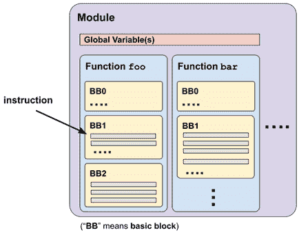
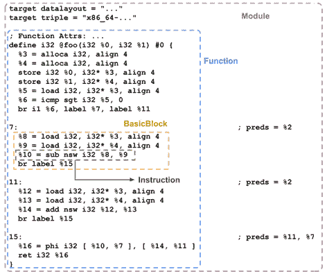
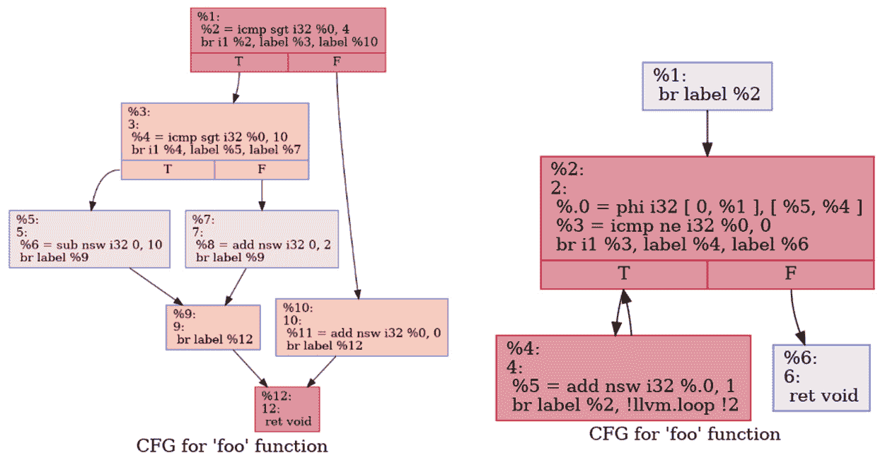
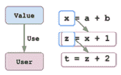
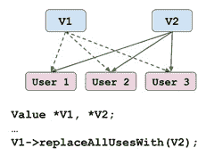
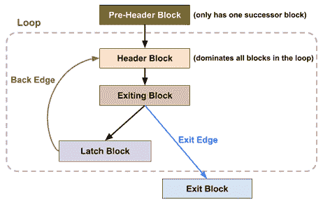
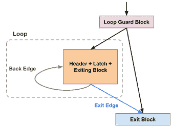

# 第十章：*第十章*：处理 LLVM IR

在上一章中，我们学习了 LLVM 中的 PassManager 和 AnalysisManager。我们回顾了一些关于开发 LLVM pass 以及如何通过 AnalysisManager 获取程序分析数据的教程。我们获得的知识和技能有助于为开发者构建代码转换和程序分析的可组合构建块的基础。

在本章中，我们将重点关注处理 **LLVM IR** 的方法。LLVM IR 是一个针对程序分析和编译转换的独立目标 **中间表示**。你可以将 LLVM IR 视为你想要优化和编译的代码的 *替代* 形式。然而，与您熟悉的 C/C++ 代码不同，LLVM IR 以不同的方式描述程序——我们稍后会给你一个更具体的概念。LLVM 在编译过程中对 LLVM IR 执行的操作中，大部分 *魔法* 都是为了使输入程序在编译后更快或更小。回想一下，在上一章中，*第九章*，*与 PassManager 和 AnalysisManager 一起工作*，我们描述了如何以管道方式组织不同的 pass——那是 LLVM 转换输入代码的高级结构。在本章中，我们将向您展示如何以高效的方式修改 LLVM IR 的详细细节。

尽管通过文本表示查看 LLVM IR 是最直接和直观的方式，但 LLVM 提供了包含一组强大现代 C++ API 的库，用于与 IR 接口。这些 API 可以检查 LLVM IR 的内存表示，并帮助我们操作它，这实际上改变了我们要编译的目标程序。这些 LLVM IR 库可以嵌入到各种应用中，使开发者能够轻松地转换和分析他们的目标源代码。

不同编程语言的 LLVM API

正式来说，LLVM 只支持两种语言的 API：C 和 C++。在这两者之间，C++ 是功能最完整且更新到最新的，但它也拥有最 *不稳定* 的接口——它可能在任何时候更改，而不具备向后兼容性。另一方面，C API 拥有稳定的接口，但代价是落后于新功能更新，甚至某些功能可能缺失。OCaml、Go 和 Python 的 API 绑定作为社区驱动的项目存在于源代码树中。

我们将尝试通过通常适用的学习块，由常见主题和任务驱动，这些主题和任务由许多现实世界的示例支持来引导您。以下是本章我们将涵盖的主题列表：

+   学习 LLVM IR 基础

+   与值和指令一起工作

+   与循环一起工作

我们将首先介绍 LLVM IR。然后，我们将学习 LLVM IR 中最基本的两个元素——值和指令。最后，我们将通过查看 LLVM 中的循环来结束本章，这是一个更高级的话题，对于处理性能敏感的应用至关重要。

# 技术要求

本章中我们需要使用的工具是`opt`命令行实用程序和`clang`。请使用以下命令构建它们：

```cpp
$ ninja opt clang
```

本章中的大部分代码都可以实现在 LLVM pass 和 pass 插件中，如第九章中介绍的*第九章*，*与 PassManager 和 AnalysisManager 一起工作*。

此外，请安装**Graphviz**工具。您可以通过以下页面了解您系统的安装指南：[`graphviz.org/download`](https://graphviz.org/download)。例如，在 Ubuntu 上，您可以使用以下命令安装该软件包：

```cpp
$ sudo apt install graphviz
```

我们将使用 Graphviz 提供的命令行工具`dot`来可视化函数的控制流。

本章中提到的代码示例可以实现在 LLVM pass 中，除非另有说明。

# 学习 LLVM IR 基础知识

LLVM IR 是您想要优化和编译的程序的一种替代形式。然而，它与 C/C++等常规编程语言的结构不同。LLVM IR 以分层的方式组织。这个层次结构的级别（从顶部开始计数）是**模块**、**函数**、**基本块**和**指令**。以下图表显示了它们的结构：



图 10.1 – LLVM IR 的层次结构

**模块**代表一个翻译单元——通常是一个源文件。每个模块可以包含多个**函数**（或全局变量）。每个函数包含一个**基本块**列表，其中每个基本块包含一个**指令**列表。

快速回顾——基本块

基本块代表一系列指令，只有一个入口和一个出口点。换句话说，如果一个基本块被执行，控制流将保证遍历该块中的每个指令。

了解 LLVM IR 的高级结构后，让我们看看一个 LLVM IR 的示例。假设我们有以下 C 代码，`foo.c`：

```cpp
int foo(int a, int b) {
  return a > 0? a – b : a + b;
}
```

我们可以使用以下`clang`命令生成其*文本*形式的 LLVM IR 对应物：

```cpp
$ clang -emit-llvm -S foo.c
```

结果将被放入`foo.ll`文件中。以下图表显示了其内容的一部分，并带有对相应 IR 单元的注释：



图 10.2 – foo.ll 中的部分内容，带有相应的 IR 单元注释

在文本形式中，指令通常以以下格式呈现：

```cpp
<result> = <operator / op-code> <type>, [operand1, operand2, …]
```

例如，假设我们有以下指令：

```cpp
%12 = load i32, i32* %3
```

在这里，`%12` 是结果值，`load` 是操作码，`i32` 是此指令的数据类型，而 `%3` 是唯一的操作数。

除了文本表示之外，LLVM IR 中几乎每个组件都有一个与同名字符相同的 C++ 类对应。例如，函数和基本块分别简单地表示为 `Function` 和 `BasicBlock` C++ 类。

不同的指令类型由从 `Instruction` 类派生出的类表示。例如，`BinaryOperator` 类表示二元运算指令，而 `ReturnInst` 类表示返回语句。我们将在稍后更详细地探讨 `Instruction` 及其子类。

*图 10.1* 中所示的结构是 LLVM IR 的**具体**结构。也就是说，这就是它们在内存中的存储方式。除此之外，LLVM 还提供了其他*逻辑*结构来查看不同 IR 单元之间的关系。它们通常从具体结构评估并存储为辅助数据结构或作为分析结果。以下是 LLVM 中一些最重要的结构：

+   **控制流图**（**CFG**）：这是一种组织成基本块的图结构，用于显示它们的控制流关系。该图中的顶点代表基本块，而边代表单个控制流转移。

+   **循环**：这代表我们熟悉的循环，由至少有一个回边（控制流边回到其父节点或祖先节点）的多个基本块组成。我们将在本章的最后部分，即“与循环一起工作”部分中更详细地探讨这一点。

+   **调用图**：与 CFG 类似，调用图也显示了控制流转移，但顶点变为单个函数，边变为函数调用关系。

在下一节中，我们将学习如何在具体和逻辑结构中遍历不同的 IR 单元。

## 遍历不同的 IR 单元

遍历 IR 单元（如基本块或指令）对于 LLVM IR 开发至关重要。这通常是我们在许多转换或分析算法中必须首先完成的步骤之一——扫描整个代码并找到一个有趣区域，以便应用某些测量。在本节中，我们将学习遍历不同 IR 单元的实际方面。我们将涵盖以下主题：

+   遍历指令

+   遍历基本块

+   遍历调用图

+   学习 GraphTraits

让我们从讨论如何遍历指令开始。

## 遍历指令

指令是 LLVM IR 中最基本元素之一。它通常代表程序中的单个操作，例如算术运算或函数调用。遍历单个基本块或函数中的所有指令是大多数程序分析和编译器优化的基石。

要遍历基本块中的所有指令，你只需要使用一个简单的 for-each 循环即可：

```cpp
// `BB` has the type of `BasicBlock&`
for (Instruction &I : BB) {
  // Work on `I`
}
```

我们可以通过两种方式遍历函数中的所有指令。首先，我们可以在访问指令之前遍历函数中的所有基本块。以下是一个例子：

```cpp
// `F` has the type of `Function&`
for (BasicBlock &BB : F) {
  for (Instruction &I : BB) {
    // Work on `I`
  }
}
```

第二种方式是利用一个名为`inst_iterator`的实用工具。以下是一个例子：

```cpp
#include "llvm/IR/InstIterator.h"
…
// `F` has the type of `Function&`
for (Instruction &I : instructions(F)) {
  // Work on `I`
}
```

使用前面的代码，你可以检索此函数中的所有指令。

### 指令访问者

在许多情况下，我们希望对一个基本块或函数中的不同类型的指令应用不同的处理方式。例如，假设我们有以下代码：

```cpp
for (Instruction &I : instructions(F)) {
  switch (I.getOpcode()) {
  case Instruction::BinaryOperator:
  // this instruction is a binary operator like `add` or `sub`
    break;
  case Instruction::Return:
    // this is a return instruction
    break;
  …
  }
}
```

回想一下，不同类型的指令是通过从`Instruction`派生出的（不同的）类来建模的。因此，一个`Instruction`实例可以代表它们中的任何一个。前面代码片段中显示的`getOpcode`方法可以给你一个唯一的令牌——即给定代码中的`Instruction::BinaryOperator`和`Instruction::Return`——这告诉你关于底层类的信息。然而，如果我们想对派生类（在这种情况下是`ReturnInst`）实例而不是“原始”的`Instruction`进行操作，我们需要进行一些类型转换。

LLVM 提供了一种更好的方式来实现这种访问模式——`InstVisitor`。`InstVisitor`是一个类，其中每个成员方法都是特定指令类型的回调函数。你可以在从`InstVisitor`类继承后定义自己的回调。例如，查看以下代码片段：

```cpp
#include "llvm/IR/InstVisitor.h"
class MyInstVisitor : public InstVisitor<MyInstVisitor> {
  void visitBinaryOperator(BinaryOperator &BOp) {
    // Work on binary operator instruction
    …
  }
  void visitReturnInst(ReturnInst &RI) {
    // Work on return instruction
    …
  }
};
```

这里显示的每个`visitXXX`方法都是特定指令类型的回调函数。请注意，我们并没有覆盖这些方法（方法上没有附加`override`关键字）。此外，`InstVisitor`允许你只定义我们感兴趣的回调，而不是为所有指令类型定义回调。

一旦定义了`MyInstVisitor`，我们就可以简单地创建其实例并调用`visit`方法来启动访问过程。以下代码作为例子：

```cpp
// `F` has the type of `Function&`
MyInstVisitor Visitor;
Visitor.visit(F);
```

对于`Instruction`、`BasicBlock`和`Module`也有`visit`方法。

基本块和指令的排序

本节中我们介绍的所有技能都假设`Function`不会以特定的*线性*顺序存储或迭代其封装的`BasicBlock`实例。我们将在不久的将来向你展示如何以各种有意义的顺序遍历所有基本块。

通过这样，你已经学会了从基本块或函数中迭代指令的几种方法。现在，让我们学习如何在函数中迭代基本块。

## 迭代基本块

在上一节中，我们学习了如何使用简单的 for 循环迭代函数的基本块。然而，开发者只能以*任意*顺序接收基本块，这种方式并没有给你提供块的执行顺序或块之间的控制流信息。在本节中，我们将向您展示如何以更有意义的方式迭代基本块。

基本块是表达函数控制流的重要元素，可以用有向图表示，即`opt`工具。假设你有一个 LLVM IR 文件，`foo.ll`，你可以使用以下命令以 Graphviz 格式打印出每个函数的 CFG：

```cpp
$ opt -dot-cfg -disable-output foo.ll
```

此命令将为`foo.ll`中的每个函数生成一个`.dot`文件。

`.dot`文件可能被隐藏

每个函数的控制流图（CFG）`.dot`文件的文件名通常以点字符（`'.'`）开头。在 Linux/Unix 系统中，这实际上*隐藏*了文件，使其不被正常的`ls`命令所显示。因此，请使用`ls -a`命令来显示这些文件。

每个`.dot`文件都包含该函数 CFG 的 Graphviz 表示。Graphviz 是一种用于表示图的通用文本格式。人们在研究之前通常将`.dot`文件转换为其他（图像）格式。例如，使用以下命令，你可以将`.dot`文件转换为 PNG 图像文件，该文件可以直观地显示图形：

```cpp
$ dot -Tpng foo.cfg.dot > foo.cfg.png
```

以下图表显示了两个示例：



图 10.3 – 左：包含分支的函数的 CFG；右：包含循环的函数的 CFG

上述图表的左侧显示了包含多个分支的函数的 CFG；右侧显示了包含单个循环的函数的 CFG。

现在，我们知道基本块是以有向图的形式组织的，即 CFG。我们能否迭代这个 CFG，使其遵循边和节点？LLVM 通过提供四种不同方式迭代图的功能来回答这个问题：拓扑排序、深度优先（本质上做**DFS**）、广度优先（本质上做**BFS**）和**强连通分量**（**SCCs**）。我们将在以下小节中学习如何使用这些实用工具中的每一个。

让我们从拓扑排序遍历开始。

### 拓扑排序遍历

拓扑排序是一种简单的线性排序，它保证了对于图中的每个节点，我们只有在访问了所有父节点（前驱节点）之后才会访问它。LLVM 提供了`po_iterator`和其他一些实用函数，以在控制流图（CFG）上实现*逆序*拓扑排序（逆序拓扑排序更容易实现）。以下代码片段给出了使用`po_iterator`的示例：

```cpp
#include "llvm/ADT/PostOrderIterator.h"
#include "llvm/IR/CFG.h"
// `F` has the type of `Function*`
for (BasicBlock *BB : post_order(F)) {
  BB->printAsOperand(errs());
  errs() << "\n";
}
```

`post_order` 函数只是一个辅助函数，用于创建 `po_iterator` 的迭代范围。请注意，`llvm/IR/CFG.h` 头文件对于使 `po_iterator` 在 `Function` 和 `BasicBlock` 上工作是必要的。

如果我们将前面的代码应用于前面图中包含分支的函数，我们将得到以下命令行输出：

```cpp
label %12
label %9
label %5
label %7
label %3
label %10
label %1
```

或者，你可以使用几乎相同的语法从特定的基本块开始遍历；例如：

```cpp
// `F` has the type of `Function*`
BasicBlock &EntryBB = F->getEntryBlock();
for (BasicBlock *BB : post_order(&EntryBB)) {
  BB->printAsOperand(errs());
  errs() << "\n";
}
```

前面的代码片段将给出与上一个相同的结果，因为它是从入口块开始的。尽管如此，你也可以从任意块开始遍历。

### 深度优先和广度优先遍历

**DFS** 和 **BFS** 是访问拓扑结构（如图或树）中最著名和标志性的算法之二。对于树或图中的每个节点，DFS 总是会尝试在访问具有相同父节点的其他节点（即 *兄弟* 节点）之前访问其子节点。另一方面，BFS 会遍历所有兄弟节点，然后再移动到其子节点。

LLVM 提供了 `df_iterator` 和 `bf_iterator`（以及一些其他实用函数）来实现深度优先和广度优先排序。由于它们的用法几乎相同，我们在这里只演示 `df_iterator`：

```cpp
#include "llvm/ADT/DepthFirstIterator.h"
#include "llvm/IR/CFG.h"
// `F` has the type of `Function*`
for (BasicBlock *BB : depth_first(F)) {
  BB->printAsOperand(errs());
  errs() << "\n";
}
```

与 `po_iterator` 和 `post_order` 类似，`depth_first` 只是一个用于创建 `df_iterator` 迭代范围的实用函数。要使用 `bf_iterator`，只需将 `depth_first` 替换为 `breadth_first`。如果你将前面的代码应用于前面图中的包含分支，它将给出以下命令行输出：

```cpp
label %1
label %3
label %5
label %9
label %12
label %7
label %10
```

当使用 `bf_iterator`/`breadth_first` 时，对于相同的示例，我们将得到以下命令行输出：

```cpp
label %1
label %3
label %10
label %5
label %7
label %12
label %9
```

`df_iterator` 和 `bf_iterator` 也可以与 `BasicBlock` 一起使用，就像前面展示的 `po_iterator` 一样。

### SSC 遍历

**SCC** 表示一个子图，其中每个包围节点都可以从其他任何节点到达。在 CFG 的上下文中，使用循环遍历 CFG 是很有用的。

我们之前介绍的基本块遍历方法是有用的工具，可以用来推理函数中的控制流。对于一个无循环的函数，这些方法为你提供了一个线性视图，该视图与包围基本块的执行顺序紧密相关。然而，对于一个包含循环的函数，这些（线性）遍历方法无法显示由循环创建的循环执行流。

重复控制流

循环并不是在函数内部创建重复控制流的唯一编程结构。一些其他指令——例如 C/C++ 中的 `goto` 语法——也会引入重复控制流。然而，这些特殊情况会使分析控制流变得更加困难（这也是你不应该在代码中使用 `goto` 的原因之一），因此当我们谈论重复控制流时，我们仅指代循环。

在 LLVM 中使用`scc_iterator`，我们可以遍历 CFG 中的强连通基本块。有了这些信息，我们可以快速找到重复的控制流，这对于某些分析和程序转换任务至关重要。例如，为了准确地在控制流边沿传播分支概率数据，我们需要知道回边和重复的基本块。

这里是一个使用`scc_iterator`的示例：

```cpp
#include "llvm/ADT/SCCIterator.h"
#include "llvm/IR/CFG.h"
// `F` has the type of `Function*`
for (auto SCCI = scc_begin(&F); !SCCI.isAtEnd(); ++SCCI) {
  const std::vector<BasicBlock*> &SCC = *SCCI;
  for (auto *BB : SCC) {
    BB->printAsOperand(errs());
    errs() << "\n";
  }
  errs() << "====\n";
}
```

与之前的遍历方法不同，`scc_iterator`不提供方便的范围式迭代。相反，你需要使用`scc_begin`创建一个`scc_iterator`实例，并进行手动递增。更重要的是，你应该使用`isAtEnd`方法来检查退出条件，而不是像我们通常与 C++ STL 容器进行比较那样与“end”迭代器进行比较。可以从单个`scc_iterator`解引用一个`BasicBlock`向量。这些`BasicBlock`实例是 SCC 内的基本块。这些 SCC 实例的顺序大致与反转拓扑顺序相同——即我们之前看到的后序。

如果你运行前面的代码在包含前面图中循环的函数上，它将给出以下命令行输出：

```cpp
label %6
====
label %4
label %2
====
label %1
====
```

这表明基本块`%4`和`%2`位于同一个强连通分量（SCC）中。

通过这样，你已经学会了以不同的方式遍历函数中的基本块。在下一节中，我们将学习如何通过遵循调用图来遍历模块内的函数。

## 遍历调用图

调用图是一个直接图，它表示模块中函数之间的调用关系。它在**跨过程**代码转换和分析中扮演着重要角色，即分析或优化跨多个函数的代码。一个著名的优化称为**函数内联**，就是这种情况的一个例子。

在我们深入到调用图中节点迭代的细节之前，让我们看看如何构建一个调用图。LLVM 使用`CallGraph`类来表示单个`Module`的调用图。以下示例代码使用一个 pass 模块来构建`CallGraph`：

```cpp
#include "llvm/Analysis/CallGraph.h"
struct SimpleIPO : public PassInfoMixin<SimpleIPO> {
  PreservedAnalyses run(Module &M, ModuleAnalysisManager &MAM) {
    CallGraph CG(M);
    for (auto &Node : CG) {
      // Print function name
      if (Node.first)
        errs() << Node.first->getName() << "\n";
    }
    return PreservedAnalysis::all();
  }
};
```

这个片段在遍历所有封装函数并打印它们的名称之前构建了一个`CallGraph`实例。

就像`Module`和`Function`一样，`CallGraph`只提供了一种最基本的方式来枚举其所有封装组件。那么，我们如何以不同的方式遍历`CallGraph`——例如，使用 SCC——就像我们在上一节中看到的那样？这个答案出人意料地简单：确实是以相同的方式——使用相同的 API 集合和用法。

这背后的秘密是一个叫做`GraphTraits`的东西。

## 学习关于 GraphTraits

`GraphTraits`是一个旨在为 LLVM 中各种不同的图提供抽象接口的类——例如 CFG 和调用图。它允许其他 LLVM 组件——分析、转换或迭代器实用工具，正如我们在上一节中看到的——独立于底层图构建它们的工作。`GraphTraits`不是要求 LLVM 中的每个图都从`GraphTraits`继承并实现所需函数，而是采取了一种相当不同的方法，即使用**模板特化**。

假设你已经编写了一个简单的 C++类，它有一个接受任意类型的模板参数，如下所示：

```cpp
template <typename T>
struct Distance {
  static T compute(T &PointA, T &PointB) {
    return PointA – PointB;
  }
};
```

这个 C++类在调用`Distance::compute`方法时会计算两点之间的距离。这些点的类型由`T`模板参数参数化。

如果`T`是如`int`或`float`这样的数值类型，一切都会正常。然而，如果`T`是一个结构体或类，如这里所示，那么默认的`compute`方法实现将无法编译：

```cpp
Distance<int>::compute(94, 87); // Success
…
struct SimplePoint {
  float X, Y;
};
SimplePoint A, B;
Distance<SimplePoint>::compute(A, B); // Compilation Error
```

为了解决这个问题，你可以为`SimplePoint`实现一个减法运算符，或者你可以使用模板特化，如下所示：

```cpp
// After the original declaration of struct Distance…
template<>
struct Distance<SimplePoint> {
  SimplePoint compute(SimplePoint &A, SimplePoint &B) {
    return std::sqrt(std::pow(A.X – B.X, 2),…);
  }
};
…
SimplePoint A, B;
Distance<SimplePoint>::compute(A, B); // Success
```

之前代码中的`Distance<SimplePoint>`描述了当`T`等于`SimplePoint`时`Distance<T>`的样子。你可以将原始的`Distance<T>`视为某种`Distance<SimplePoint>`，其中`Distance<SimplePoint>`中的`compute`方法不是原始`Distance<T>`中`compute`的覆盖方法。这与正常的类继承（和虚方法）不同。

LLVM 中的`GraphTraits`是一个模板类，它为各种图算法提供了一个接口，例如我们之前看到的`df_iterator`和`scc_iterator`。在 LLVM 中的每个图都会通过模板特化来实现这个接口。例如，以下`GraphTraits`特化用于模拟函数的**CFG**：

```cpp
template<>
struct GraphTraits<Function*> {…}
```

在`GraphTraits<Function*>`的主体中，有几个（静态）方法和`typedef`语句实现了所需接口。例如，`nodes_iterator`是用于遍历 CFG 中所有顶点的类型，而`nodes_begin`为你提供了这个 CFG 的入口/起始节点：

```cpp
template<>
struct GraphTraits<Function*> {
  typedef pointer_iterator<Function::iterator> nodes_iterator;
  static node_iterator nodes_begin(Function *F) {
    return nodes_iterator(F->begin());
  }
  …
};
```

在这种情况下，`nodes_iterator`基本上是`Function::iterator`。`nodes_begin`简单地返回函数中的第一个基本块（通过一个迭代器）。如果我们查看`CallGraph`的`GraphTraits`，它对`nodes_iterator`和`nodes_begin`有完全不同的实现：

```cpp
template<>
struct GraphTraits<CallGraph*> {
  typedef mapped_iterator<CallGraph::iterator, 
  decltype(&CGGetValuePtr)> nodes_iterator;
  static node_iterator nodes_begin(CallGraph *CG) {
    return nodes_iterator(CG->begin(), &CGGetValuePtr);
  }
};
```

当开发者实现一个新的图算法时，他们不必为 LLVM 中的每种图硬编码它，而是可以通过使用`GraphTraits`作为接口来访问任意图的关键属性来构建他们的算法。

例如，假设我们想要创建一个新的图算法，`find_tail`，它找到图中没有子节点的第一个节点。以下是`find_tail`的框架：

```cpp
template<class GraphTy,
         typename GT = GraphTraits<GraphTy>>
  auto find_tail(GraphTy G) {
  for(auto NI = GT::nodes_begin(G); NI != GT::nodes_end(G);    ++NI) {
    // A node in this graph
    auto Node = *NI;
    // Child iterator for this particular node
    auto ChildIt = GT::child_begin(Node);
    auto ChildItEnd = GT::child_end(Node);
    if (ChildIt == ChildItEnd)
      // No child nodes
      return Node;
  }
  …
}
```

在这个模板和`GraphTraits`的帮助下，我们可以在`Function`、`CallGraph`或 LLVM 中的任何类型的图上*重用*这个函数；例如：

```cpp
// `F` has the type of `Function*`
BasicBlock *TailBB = find_tail(F);
// `CG` has the type of `CallGraph*`
CallGraphNode *TailCGN = find_tail(CG);
```

简而言之，`GraphTraits`通过模板特化技术将 LLVM 中的算法（如我们之前看到的`df_iterator`和`scc_iterator`）泛化到*任意*图中。这是一种干净且高效的方式来定义可重用组件的接口。

在本节中，我们学习了 LLVM IR 的层次结构以及如何迭代不同的 IR 单元——无论是具体的还是逻辑单元，如 CFGs。我们还学习了`GraphTraits`在封装不同图（例如 CFGs 和调用图）中的重要作用，并暴露了 LLVM 中各种算法的通用接口，从而使这些算法更加简洁和可重用。

在下一节中，我们将学习如何在 LLVM 中表示值，这描述了不同 LLVM IR 组件之间关联的图景。此外，我们还将学习在 LLVM 中正确且高效地操作和更新值的方法。

# 与值和指令一起工作

在 LLVM 中，一个**值**是一个独特的结构——它不仅代表存储在变量中的值，还模拟了从常量、全局变量、单个指令甚至基本块等广泛的概念。换句话说，它是 LLVM IR 的*基础*之一。

价值的概念对于指令来说尤为重要，因为它直接与 IR 中的值进行交互。因此，在本节中，我们将它们纳入相同的讨论。我们将探讨在 LLVM IR 中值是如何工作的，以及值是如何与指令关联的。在此基础上，我们还将学习如何创建和插入新的指令，以及如何更新它们。

要了解如何在 LLVM IR 中使用值，我们必须理解支撑这个系统的关键理论，它决定了 LLVM 指令的行为和格式——**单静态赋值**（**SSA**）形式。

## 理解 SSA

SSA 是一种对 IR 进行结构和设计的方式，使得程序分析和编译器转换更容易执行。在 SSA 中，一个变量（在 IR 中）将只被赋值一次。这意味着我们不能像这样操作变量：

```cpp
// the following code is NOT in SSA form
x = 94;
x = 87; // `x` is assigned the second time, not SSA!
```

尽管一个变量只能被赋值一次，但它可以在任意指令中被*使用*多次。例如，看看以下代码：

```cpp
x = 94;
y = x + 4; // first time `x` is used
z = x + 2; // second time `x` is used
```

你可能想知道普通的 C/C++代码——显然不是 SSA 形式——是如何转换成 LLVM 这样的 SSA 形式 IR 的。虽然有一类不同的算法和研究论文回答了这个问题，我们在这里不会涉及，但大多数简单的 C/C++代码可以通过诸如重命名等简单技术进行转换。例如，假设我们有以下（非 SSA）的 C 代码：

```cpp
x = 94;
x = x * y; // `x` is assigned more than once, not SSA!
x = x + 5;
```

在这里，我们可以将第一个赋值中的 `x` 重命名为 `x0`，并将第二个和第三个赋值左侧的 `x` 分别用 `x1` 和 `x2` 这样的替代名称替换：

```cpp
x0 = 94;
x1 = x0 * y;
x2 = x1 + 5;
```

通过这些简单的测量，我们可以获得具有相同行为的原始代码的 SSA 形式。

为了更全面地理解 SSA，我们必须改变我们对程序中指令*外观*的思考方式。在 `x`"中，第二行表示“使用 `x` 和 `y` 进行一些乘法运算，然后将结果存储在 `x` 变量中”：

![图 10.4 – 将指令视为“动作”]

![img/B14590_Figure_10.4.jpg]

图 10.4 – 将指令视为“动作”

这些解释听起来直观。然而，当我们对这些指令进行一些*转换*——这当然是编译器中常见的事情——时，事情就变得复杂了。在前面的图表中，在右侧，当第一个指令变为 `x = 87` 时，我们不知道这个修改是否会影响右侧的 `x` 变量。在这里，我们别无选择，只能列出所有左侧有 `x` 的指令（即使用 `x` 作为目标），这相当低效。

我们可以不关注指令的*动作*方面，而是关注由指令生成的*数据*，从而清楚地了解每个指令的来源——即其结果值可以到达的区域。此外，我们还可以轻松地找出任意变量/值的来源。以下图表说明了这一优势：

![图 10.5 – SSA 突出显示指令之间的数据流]

![img/B14590_Figure_10.5.jpg]

图 10.5 – SSA 突出显示指令之间的数据流

换句话说，SSA 突出了程序中的**数据流**，以便编译器更容易跟踪、分析和修改指令。

LLVM 中的指令以 SSA 形式组织。这意味着我们更感兴趣的是指令产生的值，或数据流，而不是它将结果存储在哪个变量中。由于 LLVM IR 中的每个指令只能产生单个结果值，因此 `Instruction` 对象——回想一下 `Instruction` 是表示 LLVM IR 中指令的 C++ 类——也代表其 `Value`。`Instruction` 是其子类之一。这意味着给定一个 `Instruction` 对象，我们当然可以将它转换为 `Value` 对象。那个特定的 `Value` 对象实际上是那个 `Instruction` 的结果：

```cpp
// let's say `I` represents an instruction `x = a + b`
Instruction *I = …;
Value *V = I; // `V` effectively represents the value `x`
```

这是了解如何使用 LLVM IR 的重要事项之一，尤其是要使用其大多数 API。

虽然 `Instruction` 对象代表其自身的结果值，但它也有作为指令输入的*操作数*。猜猜看？我们也在使用 `Value` 对象作为操作数。例如，假设我们有以下代码：

```cpp
Instruction *BinI = BinaryOperator::Create(Instruction::Add,…);
Instruction *RetI = ReturnInst::Create(…, BinI, …);
```

前面的代码片段基本上创建了一个算术加法指令（由 `BinaryOperator` 表示），其 *结果* 值将成为另一个返回指令的 *操作数*。生成的 IR 等价于以下 C/C++ 代码：

```cpp
x = a + b;
return x;
```

除了 `Instruction`、`Constant`（表示不同类型常量的 C++ 类）、`GlobalVariable`（表示全局变量的 C++ 类）和 `BasicBlock` 之外，它们都是 `Value` 的子类。这意味着它们也以 SSA 形式组织，并且你可以将它们用作 `Instruction` 的操作数。

现在，你已经了解了 SSA 是什么以及它对 LLVM IR 设计的影响。在下一节中，我们将讨论如何修改和更新 LLVM IR 中的值。

## 与值一起工作

SSA 让我们关注指令之间的 *数据流*。由于我们对值如何从一个指令流向另一个指令有清晰的了解，因此很容易替换指令中某些值的用法。但在 LLVM 中，“值使用”的概念是如何表示的呢？以下图表显示了两个重要的 C++ 类，它们回答了这个问题 – `User` 和 `Use`：



图 10.6 – Value、User 和 Use 之间的关系

如我们所见，`User` 代表了 IR 实例（例如，一个 `Instruction`）使用某个 `Value` 的概念。此外，LLVM 使用另一个类 `Use` 来模拟 `Value` 和 `User` 之间的边。回想一下，`Instruction` 是 `Value` 的子类 – 它代表由该指令生成的结果。实际上，`Instruction` 也是从 `User` 继承而来的，因为几乎所有的指令至少需要一个操作数。

一个 `User` 可能会被多个 `Use` 实例指向，这意味着它使用了多个 `Value` 实例。你可以使用 `User` 提供的 `value_op_iterator` 来检查这些 `Value` 实例中的每一个；例如：

```cpp
// `Usr` has the type of `User*`
for (Value *V : Usr->operand_values()) {
  // Working with `V`
}
```

再次强调，`operand_values` 只是一个生成 `value_op_iterator` 范围的实用函数。

这里是为什么要遍历一个 `Value` 的所有 `User` 实例的一个例子：想象我们正在分析一个程序，其中它的一个 `Function` 实例将返回敏感信息 – 假设是一个 `get_password` 函数。我们的目标是确保在 `Function` 中调用 `get_password` 时，其返回值（敏感信息）不会通过另一个函数调用泄露。例如，我们希望检测以下模式并发出警报：

```cpp
void vulnerable() {
  v = get_password();
  …
  bar(v); // WARNING: sensitive information leak to `bar`!
}
```

实现这种分析的最简单方法之一是检查敏感 `Value` 的所有 `User` 实例。以下是一些示例代码：

```cpp
User *find_leakage(CallInst *GetPWDCall) {
  for (auto *Usr : GetPWDCall->users()) {
    if (isa<CallInst>(Usr)) {
      return Usr;
    }
  }
  …
}
```

`find_leackage` 函数接受一个 `CallInst` 参数 – 它代表一个 `get_password` 函数调用 – 并返回任何使用从该 `get_password` 调用返回的 `Value` 实例的 `User` 实例。

一个 `Value` 实例可以被多个不同的 `User` 实例使用。因此，同样地，我们可以使用以下代码片段遍历它们：

```cpp
// `V` has the type of `Value*`
for (User *Usr : V->users()) {
  // Working with `Usr`
}
```

通过这样，你已经学会了如何检查 `Value` 的 `User` 实例，或者当前 `User` 使用的 `Value` 实例。此外，在开发编译器转换时，改变 `User` 使用的 `Value` 实例为另一个实例是非常常见的。LLVM 提供了一些方便的实用工具来完成这项工作。

首先，`Value::replaceAllUsesWith` 方法，正如其名称所暗示的，可以告诉其所有 `User` 实例使用另一个 `Value` 而不是它。以下图表说明了其影响：



图 10.7 – Value::replaceAllUsesWith 的影响

当你需要用另一个 `Instruction` 替换 `Instruction` 时，这个方法非常有用。使用前面的图表来解释这一点，`V1` 是原始的 `Instruction`，而 `V2` 是新的。

另一个执行类似操作的实用函数是 `User::replaceUsesOfWith(From,To)`。此方法有效地扫描此 `User` 中的所有操作数，并将特定 `Value`（*From* 参数）的使用替换为另一个 `Value`（*To* 参数）。

在本节中你学到的技能是开发 LLVM 程序转换的最基本工具之一。在下一节中，我们将讨论如何创建和修改指令。

## 与指令一起工作

之前，我们学习了 `Value` 的基础知识——包括它与 `Instruction` 的关系——以及如何在 SSA 框架下更新 `Value` 实例。在本节中，我们将学习一些更基本的知识和技能，这些知识和技能将帮助你更好地理解 `Instruction`，并帮助你以正确和高效的方式修改 `Instruction` 实例，这是开发成功的编译器优化的关键。

在本节中，我们将介绍以下主题列表：

+   不同指令类型之间的转换

+   插入新的指令

+   替换指令

+   批量处理指令

让我们先看看不同的指令类型。

### 不同指令类型之间的转换

在前一节中，我们学习了一个有用的实用工具 `InstVisitor`。`InstVisitor` 类帮助你确定 `Instruction` 实例的底层类。它还节省了你进行不同指令类型之间转换的努力。然而，我们并不能总是依赖 `InstVisitor` 来完成涉及 `Instruction` 及其派生类之间类型转换的每一项任务。更普遍地说，我们希望有一个更简单的解决方案来进行父类和子类之间的类型转换。

现在，你可能想知道，但 C++ 已经通过 `dynamic_cast` 指令提供了这种机制，对吧？以下是一个 `dynamic_cast` 的例子：

```cpp
class Parent {…};
class Child1 : public Parent {…};
class Child2 : public Parent {…};
void foo() {
  Parent *P = new Child1();
  Child1 *C = dynamic_cast<Child1*>(P); // OK
  Child2 *O = dynamic_cast<Child2*>(P); // Error: bails out at                                         // runtime
}
```

在前面代码中使用的 `foo` 函数中，我们可以看到在其第二行，我们可以将 `P` 转换为 `Child1` 实例，因为那是它的底层类型。另一方面，我们不能将 `P` 转换为 `Child2` – 如果我们这样做，程序将在运行时崩溃。

事实上，`dynamic_cast` 具有我们需要的精确功能 – 更正式地说，是 **运行时类型信息** （**RTTI**）功能 – 但它也带来了运行时性能方面的高开销。更糟糕的是，C++ 中 RTTI 的默认实现相当复杂，使得生成的程序难以优化。因此，LLVM 默认 **禁用** RTTI。由于这个原因，LLVM 提出了一种自己的运行时类型转换系统，它更加简单和高效。在本节中，我们将讨论如何使用它。

LLVM 的类型转换框架提供了三个用于动态类型转换的函数：

+   `isa<T>(val)`

+   `cast<T>(val)`

+   `dyn_cast<T>(val)`

第一个函数，`isa<T>` – 发音为 "is-a" – 检查 `val` 指针类型是否可以转换成 `T` 类型的指针。以下是一个例子：

```cpp
// `I` has the type of `Instruction*`
if (isa<BinaryOperator>(I)) {
  // `I` can be casted to `BinaryOperator*`
}
```

注意，与 `dynamic_cast` 不同，在这种情况下，你不需要将 `BinaryOperator*` 作为模板参数 – 只需一个没有指针修饰符的类型。

`cast<T>` 函数执行从（指针类型）`val` 到 `T` 类型指针的实际类型转换。以下是一个例子：

```cpp
// `I` has the type of `Instruction*`
if (isa<BinaryOperator>(I)) {
  BinaryOperator *BinOp = cast<BinaryOperator>(I);
}
```

同样，你不需要将 `BinaryOperator*` 作为模板参数。注意，如果你在调用 `cast<T>` 之前没有使用 `isa<T>` 进行类型检查，程序将在运行时崩溃。

最后一个函数，`dyn_cast<T>`，是 `isa<T>` 和 `cast<T>` 的组合；也就是说，如果适用，你将执行类型转换。否则，它返回一个空值。以下是一个例子：

```cpp
// `I` has the type of `Instruction*`
if (BinaryOperator *BinOp = dyn_cast<BinaryOperator>(I)) {
  // Work with `BinOp`
}
```

在这里，我们可以看到一些将变量声明（`BinOp`）与 `if` 语句结合的整洁语法。

注意，这些 API 都不能接受空值作为参数。相反，`dyn_cast_or_null<T>` 没有这个限制。它基本上是一个接受空值作为输入的 `dyn_cast<T>` API。

现在，你已经知道了如何从一个任意的 `Instruction` 实例检查和转换到其底层指令类型。从下一节开始，我们终于要创建和修改一些指令了。

### 插入一个新的指令

在上一节 *理解 SSA* 的代码示例中，我们看到了一个类似的片段：

```cpp
Instruction *BinI = BinaryOperator::Create(…);
Instruction *RetI = ReturnInst::Create(…, BinI, …);
```

如方法名所暗示的 – `Create` – 我们可以推断出这两行代码创建了一个 `BinaryOperator` 和一个 `ReturnInst` 指令。

大多数的 LLVM 指令类都提供了工厂方法 – 例如这里的 `Create` – 来构建一个新的实例。人们被鼓励使用这些工厂方法，而不是通过 `new` 关键字或 `malloc` 函数手动分配指令对象。LLVM 将为你管理指令对象的内存 – 一旦它被插入到 `BasicBlock` 中。有几种方法可以将新的指令插入到 `BasicBlock` 中：

+   一些指令类中的工厂方法提供了一种在创建后立即插入指令的选项。例如，`BinaryOperator`中的`Create`方法变体之一允许你在创建后将其插入到另一个指令之前。以下是一个示例：

    ```cpp
    Instruction *BinOp will be placed before the one represented by BeforeI. This method, however, can't be ported across different instruction classes. Not every instruction class has factory methods that provide this feature and even if they do provide them, the API might not be the same.
    ```

+   我们可以使用`Instruction`类提供的`insertBefore`/`insertAfter`方法来插入一个新的指令。由于所有指令类都是`Instruction`的子类，我们可以使用`insertBefore`或`insertAfter`来在另一个`Instruction`之前或之后插入新创建的指令实例。

+   我们还可以使用`IRBuilder`类。`IRBuilder`是一个强大的工具，可以自动化一些指令创建和插入步骤。它实现了构建者设计模式，可以在开发者调用其创建方法之一时依次插入新指令。以下是一个示例：

    ```cpp
    // `BB` has the type of `BasicBlock*`
    IRBuilder instance, we need to designate an *insertion point* as one of the constructor arguments. This insertion point argument can be a BasicBlock, which means we want to insert a new instruction at the end of BasicBlock; it can also be an Instruction instance, which means that new instructions are going to be inserted *before* that specific Instruction. You are encouraged to use `IRBuilder` over other mechanisms if possible whenever you need to create and insert new instructions in sequential order.
    ```

通过这样，你已经学会了如何创建和插入新的指令。现在，让我们看看如何用其他指令来*替换*现有的指令。

### 替换指令

在许多情况下，我们可能需要替换现有的指令。例如，一个简单的优化器可能会在乘法的一个操作数是 2 的幂次整数常量时，将算术乘法指令替换为左移指令。在这种情况下，似乎简单直接的方法是通过简单地更改*运算符*（操作码）和原始`Instruction`中的一个操作数来实现这一点。然而，这并不是推荐的做法。

要在 LLVM 中替换`Instruction`，你需要创建一个新的`Instruction`（作为替换）并将所有从原始`Instruction`到替换实例的 SSA 定义和引用重新路由。让我们以我们刚才看到的 2 的幂次乘法为例：

1.  我们将要实现的函数名为`replacePow2Mul`，其参数是要处理的乘法指令（假设我们已经确保乘法有一个常数，2 的幂次整数操作数）。首先，我们将检索常数整数操作数——由`ConstantInt`类表示——并将其转换为它的 2 的底数对数值（通过`getLog2`实用函数；`getLog2`的确切实现留作你的练习）：

    ```cpp
    void replacePow2Mul(BinaryOperator &Mul) {
      // Find the operand that is a power-of-2 integer   // constant
      int ConstIdx = isa<ConstantInt>(Mul.getOperand(0))? 0    : 1;
      ConstantInt *ShiftAmount = getLog2(Mul.   getOperand(ConstIdx));
    }
    ```

1.  接下来，我们将创建一个新的左移指令——由`ShlOperator`类表示：

    ```cpp
    void replacePow2Mul(BinaryOperator &Mul) {
      …
      // Get the other operand from the original instruction
      auto *Base = Mul.getOperand(ConstIdx? 0 : 1);
      // Create an instruction representing left-shifting
      IRBuilder<> Builder(&Mul);
      auto *Shl = Builder.CreateShl(Base, ShiftAmount);
    }
    ```

1.  最后，在我们删除`Mul`指令之前，我们需要通知所有原始`Mul`的使用者使用我们新创建的`Shl`：

    ```cpp
    void replacePow2Mul(BinaryOperator &Mul) {
      …
      // Using `replaceAllUsesWith` to update users of `Mul`
      Mul.Mul are using Shl instead. Thus, we can safely remove Mul from the program.
    ```

通过这样，你已经学会了如何正确地替换现有的`Instruction`。在最后一小节中，我们将讨论在`BasicBlock`或`Function`中处理多个指令的一些技巧。

### 批量处理指令的技巧

到目前为止，我们一直在学习如何插入、删除和替换单个 `Instruction`。然而，在现实世界的案例中，我们通常会对一系列 `Instruction` 实例（例如在 `BasicBlock` 中）执行此类操作。让我们通过将所学知识应用到遍历 `BasicBlock` 中所有指令的 `for` 循环中来尝试这样做；例如：

```cpp
// `BB` has the type of `BasicBlock&`
for (Instruction &I : BB) {
  if (auto *BinOp = dyn_cast<BinaryOperator>(&I)) {
    if (isMulWithPowerOf2(BinOp))
      replacePow2Mul(BinOp);
  }
}
```

之前使用的代码使用了我们在上一节中看到的 `replacePow2Mul` 函数来替换 `BasicBlock` 中的乘法运算，如果乘法满足某些条件，则用左移指令替换。 (这是通过 `isMulWithPowerOf2` 函数来检查的。同样，这个函数的细节已经留作你的练习。)

这段代码看起来相当简单，但不幸的是，在运行这个转换时会发生崩溃。这里发生的事情是，在运行我们的 `replacePow2Mul` 之后，`BasicBlock` 中的 `Instruction` 实例变得*过时*。`Instruction` 迭代器无法跟上对 `BasicBlock` 中 `Instruction` 实例应用的变化。换句话说，在迭代的同时更改 `Instruction` 实例真的很困难。

解决这个问题的最简单方法是将更改**推迟**：

```cpp
// `BB` has the type of `BasicBlock&`
std::vector<BinaryOperator*> Worklist;
// Only perform the feasibility check
for (auto &I : BB) {
  if (auto *BinOp = dyn_cast<BinaryOperator>(&I)) {
    if (isMulWithPowerOf2(BinOp)) Worklist.push_back(BinOp);
  }
}
// Replace the target instructions at once
for (auto *BinOp : Worklist) {
  replacePow2Mul(BinOp);
}
```

之前的代码将之前的代码示例分为两部分（作为两个单独的 `for` 循环）。第一个 `for` 循环仍然遍历 `BasicBlock` 中的所有 `Instruction` 实例。但这次，它只执行检查（即调用 `isMulWithPowerOf2`），如果通过检查则不会立即替换 `Instruction` 实例。相反，这个 `for` 循环将候选 `Instruction` 推送到数组存储中 - 第二个 `for` 循环检查工作列表并通过对每个工作列表项调用 `replacePow2Mul` 来执行实际的替换。由于第二个 `for` 循环中的替换不会使任何迭代器失效，我们最终可以无崩溃地转换代码。

当然，还有其他方法可以绕过上述迭代器问题，但它们通常比较复杂且可读性较差。使用工作列表是批量修改指令最安全且最表达性的方式。

`Value` 是 LLVM 中的第一级构造，概述了不同实体（如指令）之间的数据流。在本节中，我们介绍了在 LLVM IR 中如何表示值以及使分析和管理它更容易的 SSA 模型。我们还学习了如何以高效的方式更新值以及一些操作指令的有用技巧。这将帮助你建立使用 LLVM 构建更复杂和高级编译器优化的基础。

在下一节中，我们将查看一个稍微复杂一点的 IR 单元 - 循环。我们将学习如何在 LLVM IR 中表示循环以及如何与它们一起工作。

# 处理循环

到目前为止，我们已经学习了几个 IR 单元，如模块、函数、基本块和指令。我们还学习了关于一些 *逻辑* 单元，如 CFG 和调用图。在本节中，我们将探讨一个更逻辑的 IR 单元：循环。

循环是程序员广泛使用的构造，几乎所有编程语言都包含这个概念。循环会重复执行一定数量的指令多次，这当然可以节省程序员自己重复代码的大量工作。然而，如果循环中包含任何 *低效* 的代码——例如，总是返回相同值的耗时内存加载——性能下降也将被迭代次数 *放大*。

因此，编译器的任务是尽可能多地消除循环中的缺陷。除了从循环中移除次优代码外，由于循环是运行时性能的关键路径，人们一直在尝试通过特殊的基于硬件的加速来进一步优化它们；例如，用向量指令替换循环，这些指令可以在几个周期内处理多个标量值。简而言之，循环优化是生成更快、更有效程序的关键。这在高性能和科学计算社区尤为重要。

在本节中，我们将学习如何使用 LLVM 处理循环。我们将尝试将这个主题分为两部分：

+   学习关于 LLVM 中循环表示的知识

+   学习关于 LLVM 中循环基础设施的知识

在 LLVM 中，循环比其他（逻辑）IR 单元稍微复杂一些。因此，我们首先将学习 LLVM 中循环的高级概念及其 *术语*。然后，在第二部分，我们将了解用于在 LLVM 中处理循环的基础设施和工具。

让我们从第一部分开始。

## 学习关于 LLVM 中循环表示的知识

在 LLVM 中，循环是通过 `Loop` 类来表示的。这个类捕捉了任何从其前驱块中的一个基本块到包围基本块的 *回边* 的控制流结构。在我们深入其细节之前，让我们学习如何检索一个 `Loop` 实例。

如我们之前提到的，循环是 LLVM IR 中的一个逻辑 IR 单元。也就是说，它是从物理 IR 单元派生（或计算）出来的。在这种情况下，我们需要从 `AnalysisManager` 中检索计算出的 `Loop` 实例——该实例首次在 *第九章*，*与 PassManager 和 AnalysisManager 一起工作* 中介绍。以下是一个示例，展示了如何在 `Pass` 函数中检索它：

```cpp
#include "llvm/Analysis/LoopInfo.h"
…
PreservedAnalyses run(Function &F, FunctionAnalysisManager &FAM) {
  LoopInfo &LI = FAM.getResult<LoopAnalysis>(F);
  // `LI` contains ALL `Loop` instances in `F`
  for (Loop *LP : LI) {
    // Working with one of the loops, `LP`
  }
  …
}
```

`LoopAnalysis` 是一个 LLVM 分析类，它为我们提供了一个 `LoopInfo` 实例，该实例包含 `Function` 中所有的 `Loop` 实例。我们可以遍历一个 `LoopInfo` 实例来获取一个单独的 `Loop` 实例，如前述代码所示。

现在，让我们看看一个 `Loop` 实例。

### 学习循环术语

`Loop`实例包含特定循环的多个`BasicBlock`实例。LLVM 为其中一些块以及它们之间的（控制流）边赋予了特殊含义/名称。以下图表显示了这些术语：



图 10.8 – 循环中使用的结构和术语

在这里，每个矩形都是一个`BasicBlock`实例。然而，只有位于虚线区域内的块才包含在`Loop`实例中。前面的图表还显示了两个重要的控制流边。让我们详细解释每个术语：

+   `Loop`，它表示具有头块作为唯一后继者的块。换句话说，它是头块的唯一前驱。

    存在预头块使得编写一些循环转换变得更容易。例如，当我们想要将指令**提升**到循环外部，以便在进入循环之前只执行一次时，预头块可以是一个放置该指令的好地方。如果我们没有预头块，我们需要为头块**每个**前驱重复此指令。

+   **回边**：这是从循环中的某个块到头块的控制流边。一个循环可能包含多个回边。

+   ** latch 块**：这是位于回边源处的块。

+   **退出块**和**出口块**：这两个名称有些令人困惑：退出块是具有控制流边界的块——即**出口边**——该边界**离开**循环。出口边的另一端，即不属于循环的部分，是出口块。一个循环可以包含多个出口块（和退出块）。

这些是`Loop`实例中块的重要术语。除了控制流结构之外，编译器工程师还对循环中可能存在的一个特殊值感兴趣：`i`变量是归纳变量：

```cpp
for (int i = 0; i < 87; ++i){…}
```

一个循环可能不包含归纳变量——例如，许多 C/C++中的`while`循环都没有。此外，找到归纳变量及其**边界**——起始值、结束值和停止值——并不总是容易。我们将在下一节中展示一些工具，以帮助您完成这项任务。但在那之前，我们将讨论一个关于循环**规范**形式的有趣话题。

### 理解规范循环

在上一节中，我们学习了 LLVM 中循环的几个术语，包括预头块。回想一下，预头块的存在使得开发循环转换更容易，因为它创建了一个更简单的循环结构。在此讨论之后，还有其他一些属性使得我们更容易编写循环转换。如果一个 `Loop` 实例具有这些良好的属性，我们通常称它为**规范循环**。LLVM 中的优化管道将尝试在将其发送到任何循环转换之前将循环“按摩”成这种规范形式。

目前，LLVM 为 `Loop` 有两种规范形式：一种**简化**形式和一种**旋转**形式。简化形式具有以下属性：

+   预头块。

+   单个后继边（因此只有一个锁存块）。

+   退出块的前驱来自循环。换句话说，头块支配所有退出块。

要获得简化的循环，您可以在原始循环上运行 `LoopSimplfyPass`。此外，您还可以使用 `Loop::isLoopSimplifyForm` 方法来检查一个 `Loop` 是否处于这种形式。

单个后继边的好处在于我们可以更容易地分析递归数据流——例如，归纳变量。对于最后一个属性，如果每个退出块都受循环支配，我们可以在没有其他控制流路径干扰的情况下更容易地将指令“下沉”到循环下面。

让我们看看旋转规范形式。最初，旋转形式在 LLVM 的循环优化管道中不是一个正式的规范形式。但随着越来越多的循环传递依赖于它，它已经成为了“事实上的”规范形式。以下图表显示了这种形式的外观：



图 10.9 – 旋转循环的结构和术语

要获得旋转循环，您可以在原始循环上运行 `LoopRotationPass`。要检查循环是否旋转，您可以使用 `Loop::isRotatedForm` 方法。

这种旋转形式基本上是将任意循环转换为一个带有一些额外检查的 `do{…}while(…)` 循环（在 C/C++ 中）。更具体地说，假设我们有一个以下的 `for` 循环：

```cpp
// `N` is not a constant
for (int i = 0; i < N; ++i){…}
```

循环旋转有效地将其转换为以下代码：

```cpp
if (i < N) {
  do {
    …
    ++i;
  } while(i < N);
}
```

在前面的代码中突出显示的边界检查用于确保如果 `i` 变量在最开始就超出范围，则循环不会执行。我们也将这个检查称为**循环守卫**，如前图所示。

除了循环守卫之外，我们还发现旋转循环有一个组合的头、锁存和退出块。背后的理由是确保这个块中的每条指令都有相同的*执行计数*。这对于编译器优化，如循环向量化，是一个有用的属性。

通过这些，我们已经了解了各种循环术语和 LLVM 中规范循环的定义。在下一节中，我们将了解一些可以帮助你检查这些属性并以高效方式处理循环的 API。

## 在 LLVM 中了解循环基础设施

在 *在 LLVM 中了解循环表示* 部分，我们学习了 LLVM IR 中循环的高级构造和重要属性。在本节中，我们将了解可用于检查这些属性和进一步转换循环的 API。让我们从循环传递开始讨论——这是应用于 `Loop` 实例的 LLVM 传递。

在 *第九章*，*与 PassManager 和 AnalysisManager 一起工作* 中，我们了解到有不同种类的 LLVM 传递，它们在不同的 IR 单元上工作——例如，我们看到了针对 `Function` 和 `Module` 的传递。这两种类型的传递具有类似的 `run` 方法签名——LLVM 传递的主要入口点，如下所示：

```cpp
PreservedAnalyses run(<IR unit class> &Unit,
                      <IR unit>AnalysisManager &AM);
```

它们的 `run` 方法都接受两个参数——IR 单元实例的引用和 `AnalysisManager` 实例。

相比之下，循环传递的 `run` 方法签名稍微复杂一些，如下所示：

```cpp
PreservedAnalyses run(Loop &LP, LoopAnalysisManager &LAM,
                      LoopStandardAnalysisResults &LAR,
                      LPMUpdater &U);
```

`run` 方法接受四个参数，但我们已经了解了前两个。以下是其他两个参数的描述：

+   第三个参数，`LoopStandardAnalysisResults`，为你提供一些分析数据实例，例如 `AAResults`（别名分析数据）、`DominatorTree` 和 `LoopInfo`。这些分析被许多循环优化广泛使用。然而，大多数分析都由 `FunctionAnalysisManager` 或 `ModuleAnalysisManager` 管理。这意味着，最初，开发者需要实现更复杂的方法——例如，使用 `OuterAnalysisManagerProxy` 类——来检索它们。`LoopStandardAnalysisResults` 实例基本上帮助你提前检索这些分析数据。

+   最后一个参数用于通知 `PassManager` 任何新添加的循环，以便它可以在稍后处理之前将这些新循环放入队列中。它还可以告诉 `PassManager` 再次将当前循环放入队列中。

当我们编写传递时，我们希望使用 AnalysisManager 提供的分析数据——在这种情况下，它是 `LoopAnalysisManager` 实例。`LoopAnalysisManager` 的用法与其他版本的 AnalysisManager（例如，上一章中我们了解的 `FunctionAnalysisManager`）类似。唯一的区别是我们需要向 `getResult` 方法提供一个额外的参数。以下是一个示例：

```cpp
PreservedAnalyses run(Loop &LP, LoopAnalysisManager &LAM,
                      LoopStandardAnalysisResults &LAR,
                      LPMUpdater &U) {
  …
  LoopNest &LN = LAM.getResult<LoopNestAnalysis>(LP, LAR);
  …
}
```

`LoopNest` 是由 `LoopNestAnalysis` 生成的分析数据。（我们将在 *处理嵌套循环* 部分简要讨论这两个内容。）

如前所述，`LoopAnalysisManager::getResult` 除了接受一个 `LoopStandarAnalysisResults` 类型的参数外，还接受一个 `Loop` 实例。

除了具有不同的 `run` 方法签名和 `LoopAnalysisManager` 的略微不同用法外，开发者可以以与其他类型相同的方式构建他们的循环传递。现在我们已经了解了循环传递和 AnalysisManager 提供的基础，是时候看看一些专门的循环了。我们将首先介绍的是**嵌套**循环。

### 处理嵌套循环

到目前为止，我们一直在谈论只有一层的循环。然而，嵌套循环——包含其他循环的循环——在现实场景中也很常见。例如，大多数矩阵乘法实现至少需要两层循环。

嵌套循环通常被表示为树——称为**循环树**。在循环树中，每个节点代表一个循环。如果一个节点有父节点，这意味着相应的循环被父节点所建模的循环**包含**。以下图展示了这一例子：

![Figure 10.10 – 一个循环树示例

![img/B14590_Figure_10.10.jpg]

图 10.10 – 一个循环树示例

在前面的图中，循环 `j` 和 `g` 被包含在循环 `i` 内，因此它们都是循环树中循环 `i` 的子节点。同样，循环 `k` —— 最内层的循环 —— 被建模为树中循环 `j` 的子节点。

循环树的根也代表 `Function` 中的**顶层**循环。回想一下，之前我们学习了如何通过迭代 `LoopInfo` 对象来检索 `Function` 中的所有 `Loop` 实例——以这种方式检索到的每个 `Loop` 实例都是顶层循环。对于给定的 `Loop` 实例，我们可以以类似的方式检索其下一层的子循环。以下是一个示例：

```cpp
// `LP` has the type of `Loop&`
for (Loop *SubLP : LP) {
  // `SubLP` is one of the sub-loops at the next layer
}
```

注意，前面的代码片段仅遍历了下一级的子循环，而不是所有后代子循环。要遍历树中的所有后代子循环，你有两种选择：

+   通过使用 `Loop::getLoopsInPreorder()` 方法，你可以以预排序的方式遍历 `Loop` 实例的所有后代循环。

+   在 *迭代不同的 IR 单元* 部分，我们学习了 `GraphTraits` 是什么以及 LLVM 如何使用它进行图遍历。事实证明，LLVM 还为循环树提供了一个默认的 `GraphTraits` 实现。因此，你可以使用 LLVM 中现有的图迭代器遍历循环树，例如后序和深度优先，仅举几例。例如，以下代码尝试以深度优先的方式遍历以 `RootL` 为根的循环树：

    ```cpp
    #include "llvm/Analysis/LoopInfo.h"
    #include "llvm/ADT/DepthFirstIterator.h"
    …
    // `RootL` has the type of `Loop*`
    for (GraphTraits, we can have more flexibility when it comes to traversing a loop tree.
    ```

除了处理循环树中的单个循环外，LLVM 还提供了一个表示整个结构的包装类——`LoopNest`。

`LoopNest`是由`LoopNestAnalysis`生成的分析数据。它封装了给定`Loop`实例中的所有子循环，并为常用功能提供了几个“快捷”API。以下是一些重要的 API：

+   `getOutermostLoop()`/`getInnermostLoop()`: 这些实用工具检索最外层/最内层的`Loop`实例。这些工具非常实用，因为许多循环优化仅适用于内层或最外层循环。

+   `areAllLoopsSimplifyForm()`/`areAllLoopsRotatedForm()`: 这些有用的实用工具会告诉您所有包围的循环是否处于我们之前章节中提到的某种规范形式。

+   `getPerfectLoops(…)`: 您可以使用此方法获取当前循环层次结构中的所有**完美循环**。所谓完美循环，是指彼此嵌套在一起且之间没有“间隙”的循环。以下是一个完美循环和非完美循环的示例：

    ```cpp
    // Perfect loops
    for(int i=…) {
      for(int j=…){…}
    }
    // Non-perfect loops
    for(int x=…) {
      foo call site is the gap between the upper and lower loops.Perfect loops are preferrable in many loop optimizations. For example, it's easier to *unroll* perfectly nested loops – ideally, we only need to duplicate the body of the innermost loop.
    ```

通过这些，您已经学会了如何处理嵌套循环。在下一节中，我们将学习关于循环优化另一个重要主题：归纳变量。

### 获取归纳变量及其范围

归纳变量是在每次循环迭代中按照一定模式进步的变量。它是许多循环优化的关键。例如，为了将循环**向量化**，我们需要知道归纳变量在数组中是如何使用的 – 即我们想要放入向量的数据 – 在循环内部。归纳变量还可以帮助我们解决循环的**迭代次数** – 总迭代次数。在我们深入细节之前，以下图表显示了与归纳变量及其在循环中的位置相关的术语：


图 10.11 – 归纳变量的术语

现在，让我们介绍一些可以帮助您检索前面图表中显示的组件的 API。

首先，让我们谈谈归纳变量。`Loop`类已经提供了两个方便的方法来检索归纳变量：`getCanonicalInductionVariable`和`getInductionVariable`。这两个方法都返回一个`PHINode`实例作为归纳变量（如果有）。第一个方法只能在归纳变量从零开始且每次迭代只增加一的情况下使用。另一方面，第二个方法可以处理更复杂的情况，但需要一个`ScalarEvolution`实例作为参数。

`ScalarEvolution`是 LLVM 中一个有趣且强大的框架。简单来说，它试图跟踪值如何**变化** – 例如，通过算术运算 – 在程序路径上。将这个概念应用到循环优化中，它用于捕获循环中的递归值变化行为，这与归纳变量有很强的关联。

要了解循环中归纳变量的行为，你可以通过 `Loop::getInductionDescriptor` 获取一个 `InductionDescriptor` 实例。一个 `InductionDescriptor` 实例提供了诸如初始值、步长值以及在每个迭代中更新归纳变量的指令等信息。`Loop` 类还提供了一个类似的数据结构来实现归纳变量的边界：`Loop::LoopBounds` 类。`LoopBounds` 不仅提供了归纳变量的初始值和步长值，还提供了预期的结束值以及用于检查退出条件的谓词。你可以通过 `Loop::getBounds` 方法获取一个 `LoopBounds` 实例。

循环对于程序的运行时性能至关重要。在本节中，我们学习了循环在 LLVM IR 中的表示方式以及如何与之交互。我们还探讨了它们的高级概念和用于检索所需循环属性的多种实用 API。有了这些知识，你离创建更有效、更具侵略性的循环优化，并从目标应用程序中获得更高的性能又近了一步。

# 摘要

在本节中，我们学习了关于 LLVM IR 的内容——这是一个位于整个 LLVM 框架核心的目标无关中间表示。我们介绍了 LLVM IR 的高层结构，并提供了如何在它的层次结构中遍历不同单元的实用指南。我们还关注了指令、值和 SSA 形式，这些对于高效地使用 LLVM IR 至关重要。我们还就同一主题提供了几个实用的技能、技巧和示例。最后但同样重要的是，我们学习了如何在 LLVM IR 中处理循环——这是一个优化性能敏感型应用程序的重要技术。有了这些能力，你可以在 LLVM IR 上执行更广泛的程序分析和代码优化任务。

在下一章中，我们将学习关于一组 LLVM 工具 API 的集合，这些 API 可以在开发、诊断和调试使用 LLVM 时提高你的生产力。
