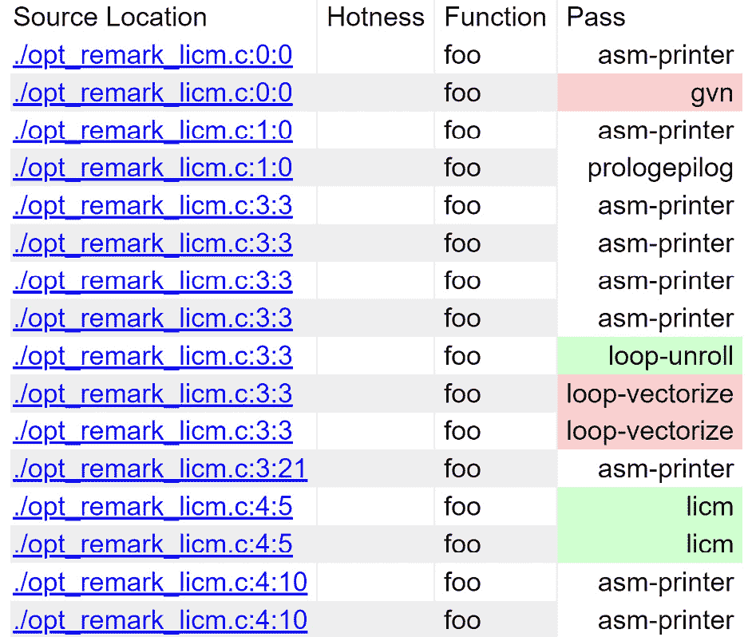
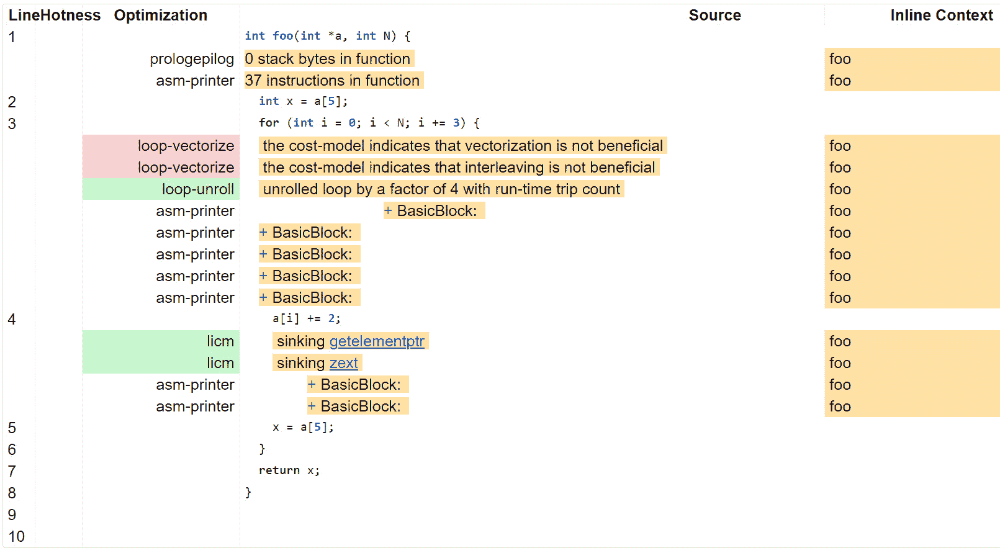
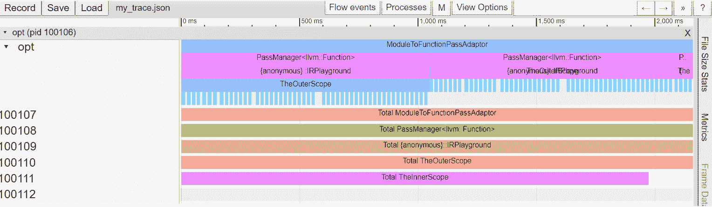
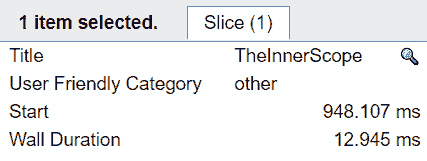

# *第十一章*：使用支持实用工具准备就绪

在上一章中，我们学习了**低级虚拟机**（**LLVM**）**中间表示**（**IR**）的基础知识——LLVM 中的目标无关中间表示，以及如何使用 C++ **应用程序编程接口**（**API**）来检查和操作它。这些是进行程序分析和转换在 LLVM 中的核心技术。除了这些技能集之外，LLVM 还提供了许多支持实用工具，以提高编译器开发者在处理 LLVM IR 时的生产力。我们将在本章中涵盖这些主题。

编译器是一块复杂的软件。它不仅需要处理数千种不同的案例——包括不同形状的输入程序和广泛的目标架构——而且编译器的**正确性**也是一个重要的话题：也就是说，编译后的代码需要与原始代码具有相同的行为。LLVM，一个大规模的编译器框架（可能是最大的之一），也不例外。

为了应对这些复杂性，LLVM 提供了一系列的实用工具来改善开发体验。在本章中，我们将向您展示如何准备使用这些工具。这里涵盖的实用工具可以帮助您诊断您正在开发的 LLVM 代码中出现的问题。这包括更高效的调试、错误处理和性能分析能力；例如，其中一个工具可以收集关键组件（如特定 Pass 处理的基本块数量）的统计数据，并自动生成总结报告。另一个例子是 LLVM 自身的错误处理框架，它可以尽可能防止未处理的错误（一种常见的编程错误）。

在本章中，我们将讨论以下主题：

+   打印诊断信息

+   收集统计数据

+   添加时间测量

+   LLVM 中的错误处理实用工具

+   了解 `Expected` 和 `ErrorOr` 类

通过这些实用工具的帮助，您将能够更好地调试和诊断 LLVM 代码，让您能够专注于使用 LLVM 实现的核心逻辑。

# 技术要求

在本节中，我们还将使用 LLVM Pass 作为平台来展示不同的 API 使用方法。因此，请确保您已经构建了`opt`命令行工具，如下所示：

```cpp
$ ninja opt
```

注意，本章中的一些内容仅适用于 LLVM 的**调试构建**版本。请查阅第一章节，*第一章*，*构建 LLVM 时的资源节约*，以回顾如何在调试模式下构建 LLVM。

如果您不确定如何创建新的 LLVM Pass，也可以回到*第九章*，*使用 PassManager 和 AnalysisManager 工作时*。

本章的示例代码可以在以下位置找到：

[`github.com/PacktPublishing/LLVM-Techniques-Tips-and-Best-Practices-Clang-and-Middle-End-Libraries/tree/main/Chapter11`](https://github.com/PacktPublishing/LLVM-Techniques-Tips-and-Best-Practices-Clang-and-Middle-End-Libraries/tree/main/Chapter11)

# 打印诊断消息

在软件开发中，有许多方法可以诊断错误——例如，使用调试器，将清理器插入到你的程序中（例如，捕获无效的内存访问），或者简单地使用最简单但最有效的方法之一：添加 *打印语句*。虽然最后一个选项听起来并不十分聪明，但实际上在许多情况下非常有用，在其他选项无法发挥全部潜力的情况下（例如，调试信息质量较差的发布模式二进制文件或多线程程序）。

LLVM 提供了一个小工具，它不仅可以帮助你打印调试信息，还可以*过滤*要显示的消息。假设我们有一个 LLVM Pass，名为 `SimpleMulOpt`，它将乘以 2 的幂的常数替换为左移操作（这正是我们在上一章的最后一节中做的，*处理 LLVM IR*）。以下是它的 `run` 方法的一部分：

```cpp
PreservedAnalyses
SimpleMulOpt::run(Function &F, FunctionAnalysisManager &FAM) {
  for (auto &I : instructions(F)) {
    if (auto *BinOp = dyn_cast<BinaryOperator>(&I) &&
        BinOp->getOpcode() == Instruction::Mul) {
      auto *LHS = BinOp->getOperand(0),
           *RHS = BinOp->getOperand(1);
      // `BinOp` is a multiplication, `LHS` and `RHS` are its
      // operands, now trying to optimize this instruction…
      …
    }
  }
  …
}
```

之前的代码在寻找表示算术乘法的指令之前，会遍历给定函数中的所有指令。如果存在这样的指令，Pass 将会与 `LHS` 和 `RHS` 操作数（这些操作数出现在代码的其余部分中——这里没有展示）一起工作。

假设我们想在开发过程中打印出操作数变量。最简单的方法就是使用我们老朋友 `errs()`，它将任意消息流到 `stderr`，如下面的代码片段所示：

```cpp
// (extracted from the previous snippet)
…
auto *LHS = BinOp->getOperand(0),
     *RHS = BinOp->getOperand(1);
errs() << "Found a multiplication with operands ";
LHS->printAsOperand(errs());
errs() << " and ";
RHS->printAsOperand(errs());
…
```

在之前的代码片段中使用的 `printAsOperand` 将 `Value` 的文本表示打印到给定的流中（在这个例子中是 `errs()`）。

除了这些消息即使在生产环境中也会被打印出来之外，一切看起来都很正常，这不是我们想要的。我们可以在发布产品之前删除这些代码，在这些代码周围添加一些宏保护（例如，`#ifndef NDEBUG`），或者我们可以使用 LLVM 提供的调试工具。以下是一个例子：

```cpp
#include "llvm/Support/Debug.h"
#define DEBUG_TYPE "simple-mul-opt"
…
auto *LHS = BinOp->getOperand(0),
     *RHS = BinOp->getOperand(1);
LLVM_DEBUG(dbgs() << "Found a multiplication with operands ");
LLVM_DEBUG(LHS->printAsOperand(dbgs()));
LLVM_DEBUG(dbgs() << " and ");
LLVM_DEBUG(RHS->printAsOperand(dbgs()));
…
```

之前的代码基本上做了以下三件事：

+   将 `errs()` 的任何使用替换为 `dbgs()`。这两个流基本上做的是同一件事，但后者会在输出消息中添加一个漂亮的横幅（`Debug Log Output`）。

+   使用 `LLVM_DEBUG(…)` 宏函数将所有与调试打印相关的行包装起来。使用此宏确保包含的行仅在开发模式下编译。它还编码了调试消息类别，我们将在稍后介绍。

+   在使用任何 `LLVM_DEBUG(…)` 宏函数之前，请确保将 `DEBUG_TYPE` 定义为所需的调试类别字符串（在这个例子中是 `simple-mul-opt`）。

除了上述代码修改之外，我们还需要使用额外的命令行标志`-debug`与`opt`一起打印这些调试信息。以下是一个示例：

```cpp
$ opt -O3 -debug -load-pass-plugin=… …
```

但然后，你会发现输出相当嘈杂。有来自*其他* LLVM Pass 的大量调试信息。在这种情况下，我们只对来自我们 Pass 的消息感兴趣。

为了过滤掉无关的消息，我们可以使用`-debug-only`命令行标志。以下是一个示例：

```cpp
$ opt -O3 -debug-only=simple-mul-opt -load-pass-plugin=… …
```

`-debug-only`后面的值是我们之前代码片段中定义的`DEBUG_TYPE`值。换句话说，我们可以使用每个 Pass 定义的`DEBUG_TYPE`来过滤所需的调试信息。我们还可以选择*多个*调试类别来打印。例如，查看以下命令：

```cpp
$ opt -O3 -debug-only=sroa,simple-mul-opt -load-pass-plugin=… …
```

此命令不仅打印来自我们的`SimpleMulOpt` Pass 的调试信息，还打印来自`SROA` Pass 的调试信息——这是包含在`O3`优化管道中的 LLVM Pass。

除了为 LLVM Pass 定义单个调试类别（`DEBUG_TYPE`）之外，实际上你可以在 Pass 内部使用尽可能多的类别。这在例如你想为 Pass 的不同部分使用不同的调试类别时很有用。例如，我们可以在我们的`SimpleMulOpt` Pass 的每个操作数上使用不同的类别。以下是我们可以这样做的方法：

```cpp
…
#define DEBUG_TYPE "simple-mul-opt"
auto *LHS = BinOp->getOperand(0),
     *RHS = BinOp->getOperand(1);
LLVM_DEBUG(dbgs() << "Found a multiplication instruction");
DEBUG_WITH_TYPE("simple-mul-opt-lhs",
               LHS->printAsOperand(dbgs() << "LHS operand: "));
DEBUG_WITH_TYPE("simple-mul-opt-rhs",
               RHS->printAsOperand(dbgs() << "RHS operand: "));
…
```

`DEBUG_WITH_TYPE`是`LLVM_DEBUG`的一个特殊版本。它使用第二个参数执行代码，第一个参数作为调试类别，可以不同于当前定义的`DEBUG_TYPE`值。在前面的代码片段中，除了使用原始的`simple-mul-opt`类别打印`Found a multiplication instruction`之外，我们还使用`simple-mul-opt-lhs`来打印与`simple-mul-opt-rhs`相关的消息，以打印其他操作数的消息。有了这个特性，我们可以通过`opt`命令更精细地选择调试信息类别。

你现在已经学会了如何使用 LLVM 提供的工具在开发环境中打印调试信息，以及如何在需要时过滤它们。在下一节中，我们将学习如何在运行 LLVM Pass 时收集关键统计数据。

# 收集统计数据

如前文所述，编译器是一块复杂的软件。收集**统计数字**——例如，特定优化处理的基本块数量——是快速了解编译器运行时行为的最简单和最有效的方法之一。

在 LLVM 中有几种收集统计数据的方法。在本节中，我们将学习三种最常见和有用的选项，这些方法在此概述：

+   使用`Statistic`类

+   使用优化注释

+   添加时间测量

第一个选项是一个通用工具，通过简单的计数器收集统计信息；第二个选项专门设计用于分析*编译器优化*；最后一个选项用于在编译器中收集时间信息。

让我们从第一个选项开始。

## 使用 Statistic 类

在本节中，我们将通过将新功能添加到上一节中的 `SimpleMulOpt` LLVM Pass 来展示新功能。首先，让我们假设我们不仅想要打印出乘法指令的运算符 `Value`，而且还想*计数*我们的 Pass 处理了多少条乘法指令。首先，让我们尝试使用我们刚刚学到的 `LLVM_DEBUG` 基础设施来实现这个功能，如下所示：

```cpp
#define DEBUG_TYPE "simple-mul-opt"
PreservedAnalyses
SimpleMulOpt::run(Function &F, FunctionAnalysisManager &FAM) {
  unsigned NumMul = 0;
  for (auto &I : instructions(F)) {
    if (auto *BinOp = dyn_cast<BinaryOperator>(&I) &&
        BinOp->getOpcode() == Instruction::Mul) {
      ++NumMul;
      …
    }
  }
  LLVM_DEBUG(dbgs() << "Number of multiplication: " << NumMul);
  …
}
```

这种方法看起来相当直接。但它的缺点是我们感兴趣的统计数字与其他调试信息混合在一起。我们需要采取额外的措施来解析或过滤我们想要的值，因为尽管你可以争辩说这些问题可以通过为每个计数器变量使用单独的 `DEBUG_TYPE` 标签来解决，但当计数器变量的数量增加时，你可能会发现自己创建了大量的冗余代码。

一个优雅的解决方案是使用 LLVM 提供的 `Statistic` 类（和相关工具）。以下是使用此解决方案重写的版本：

```cpp
#include "llvm/ADT/Statistic.h"
#define DEBUG_TYPE "simple-mul-opt"
STATISTIC(NumMul, "Number of multiplications processed");
PreservedAnalyses
SimpleMulOpt::run(Function &F, FunctionAnalysisManager &FAM) {
  for (auto &I : instructions(F)) {
    if (auto *BinOp = dyn_cast<BinaryOperator>(&I) &&
        BinOp->getOpcode() == Instruction::Mul) {
      ++NumMul;
      …
    }
  }
  …
}
```

上述代码片段显示了 `Statistic` 的用法，通过调用 `STATISTIC` 宏函数创建一个 `Statistic` 类型变量（带有文本描述）并像正常整数计数器变量一样使用它。

这个解决方案只需要修改原始代码中的几行，并且它收集所有计数器值，并在优化的最后以表格视图的形式打印出来。例如，如果你使用带有 `-stats` 标志的 `opt` 运行 `SimpleMulOpt` Pass，你会得到以下输出：

```cpp
$ opt -stats –load-pass-plugin=… …
===-------------------------------===
      … Statistics Collected …
===-------------------------------===
87 simple-mul-opt - Number of multiplications processed
$
```

`87` 是在 `SimpleMulOpt` 中处理的乘法指令的数量。当然，你可以自由地添加尽可能多的 `Statistic` 计数器来收集不同的统计信息。如果你在管道中运行多个 Pass，所有统计数字都会在同一张表中展示。例如，如果我们向 `SimpleMulOpt` 中添加另一个 `Statistic` 计数器来收集乘法指令中的 `none-power-of-two constant operands` 的数量，并使用 **聚合替换标量**（**SROA**）运行 Pass，我们可以得到类似于下面所示的输出：

```cpp
$ opt -stats –load-pass-plugin=… --passes="sroa,simple-mult-opt" …
===-------------------------------===
      … Statistics Collected …
===-------------------------------===
94  simple-mul-opt - Number of multiplications processed
87  simple-mul-opt - Number of none-power-of-two constant operands
100 sroa           - Number of alloca partition uses rewritten
34  sroa           - Number of instructions deleted
…
$
```

上述代码片段的第二列是原始 Pass 的名称，该名称由在调用 `STATISTIC` 之前定义的 `DEBUG_TYPE` 值指定。

或者，你可以将结果输出到 `-stats-json` 标志的 `opt` 中。例如，看看下面的代码片段：

```cpp
$ opt -stats -stats-json –load-pass-plugin=… …
{
        "simple-mul-opt.NumMul": 87
}
$
```

在这种 JSON 格式下，我们不是用文本描述来打印统计值，而是使用统计条目字段的名称，其格式为：`"<Pass name>.<Statistic variable name>"`（这里的 Pass name 同时也是 `DEBUG_TYPE` 的值）。此外，您可以使用 `-info-output-file=<文件名>` 命令行选项将统计结果（无论是默认格式还是 JSON 格式）打印到文件中。以下代码片段展示了这一示例：

```cpp
$ opt -stats -stats-json -info-output-file=my_stats.json …
$ cat my_stats.json
{
        "simple-mul-opt.NumMul": 87
}
$
```

现在，你已经学会了如何使用 `Statistic` 类收集简单的统计值。在下一节中，我们将学习一种独特的编译器优化统计收集方法。

## 使用优化注释

典型的编译器优化通常包括两个阶段：*搜索*从输入代码中寻找所需的模式，然后是*修改*代码。以我们的 `SimpleMulOpt` Pass 为例：第一阶段是寻找乘法指令（`BinaryOperator` 与 `Instruction::Mul` 和 `IRBuilder::CreateShl(…)`），并将所有旧的乘法指令用法替换为这些。

然而，在许多情况下，优化算法在第一阶段由于*不可行*的输入代码而简单地“退出”。例如，在 `SimpleMulOpt` 中，我们正在寻找乘法指令，但如果传入的指令不是 `BinaryOperator`，Pass 将不会进入第二阶段（并继续到下一个指令）。有时，我们想知道这种退出的*原因*，这有助于我们改进优化算法或诊断不正确/次优的编译器优化。LLVM 提供了一个很好的工具，称为**优化注释**，用于收集和报告在优化 Pass 中发生的这种退出（或任何其他信息）。

例如，假设我们有以下输入代码：

```cpp
int foo(int *a, int N) {
  int x = a[5];
  for (int i = 0; i < N; i += 3) {
    a[i] += 2;
    x = a[5];
  }
  return x;
}
```

理论上，我们可以使用 **循环不变代码移动**（**LICM**）来优化这段代码到一个等效的代码库，如下所示：

```cpp
int foo(int *a, int N) {
  for (int i = 0; i < N; i += 3) {
    a[i] += 2;
  }
  return a[5];
}
```

我们可以将这个作为第五个数组元素 `a[5]`，在循环内部从未改变其值。然而，如果我们运行 LLVM 的 LICM Pass 对原始代码进行优化，它将无法执行预期的优化。

为了诊断这个问题，我们可以使用带有附加选项的 `opt` 命令：`--pass-remarks-output=<filename>`。该文件名将是一个 **YAML Ain't Markup Language**（**YAML**）文件，其中优化注释将打印出 LICM 未能优化的可能原因。以下是一个示例：

```cpp
$ opt -licm input.ll –pass-remarks-output=licm_remarks.yaml …
$ cat licm_remarks.yaml
…
--- !Missed
Pass:            licm
Name:            LoadWithLoopInvariantAddressInvalidated
Function:        foo
Args:
  - String:          failed to move load with loop-invariant address because the loop may invalidate its value
...
$
```

前面的输出中的`cat`命令显示了`licm_remarks.yaml`中的优化注释条目之一。这个条目告诉我们，在处理`foo`函数时，LICM Pass 中发生了一个*遗漏*的优化。它还告诉我们原因：LICM 不确定特定的内存地址是否被循环无效化。虽然这个消息没有提供详细的细节，但我们仍然可以推断出，与 LICM 相关的有问题内存地址可能是`a[5]`。LICM 不确定`a[i] += 2`语句是否修改了`a[5]`的内容。

借助这些知识，编译器开发者可以亲自动手改进 LICM——例如，教 LICM 识别步长值大于 1 的归纳变量（即，这个循环中的`i`变量，在这个例子中是 3，因为`i += 3`）。

要生成如前输出中所示的那种优化注释，编译器开发者需要将特定的实用 API 集成到他们的优化 Pass 中。为了向您展示如何在您的 Pass 中实现这一点，我们将重用我们的`SimpleMulOpt` Pass 作为示例。以下是`SimpleMulOpt`中执行第一阶段——*搜索具有 2 的幂次常量操作数的乘法*——的部分代码：

```cpp
…
for (auto &I : instructions(F)) {
  if (auto *BinOp = dyn_cast<BinaryOperator>(&I))
    if (BinOp->getOpcode() == Instruction::Mul) {
      auto *LHS = BinOp->getOperand(0),
           *RHS = BinOp->getOperand(1);
      // Has no constant operand
      if (!isa<Constant>(RHS)) continue;
      const APInt &Const = cast<ConstantInt>(RHS)->getValue();
      // Constant operand is not power of two
      if (!Const.isPowerOf2()) continue;
      …
    }
}
```

上述代码在确保操作数是 2 的幂次操作数之前，会检查操作数是否为常量。如果这两个检查中的任何一个失败，算法将通过继续执行函数中的下一个指令来退出。

我们故意在这个代码中插入了一个小缺陷，使其功能减弱，我们将通过使用优化注释向您展示如何找到这个问题。以下是执行此操作的步骤：

1.  首先，我们需要有一个`OptimizationRemarkEmitter`实例，它可以帮助您发出注释消息。这可以通过其父分析器`OptimizationRemarkEmitterAnalysis`获得。以下是如何在`SimpleMulOpt::run`方法开始时包含它的方法：

    ```cpp
    #include "llvm/Analysis/OptimizationRemarkEmitter.h"
    PreservedAnalyses
    SimpleMulOpt::run(Function &F, FunctionAnalysisManager &FAM) {
      OptimizationRemarkEmitter &ORE
        = FAM.getResult<OptimizationRemarkEmitterAnalysis>(F);
      …
    }
    ```

1.  然后，我们将使用这个`OptimizationRemarkEmitter`实例来发出一个优化注释，如果乘法指令缺少常量操作数，如下所示：

    ```cpp
    #include "OptimizationRemarkEmitter::emit method takes a lambda function as the argument. This lambda function will be invoked to emit an optimization remark object if the optimization remark feature is turned on (via the –pass-remarks-output command-line option we've seen previously, for example).
    ```

1.  `OptimizationRemarkMissed`类（请注意，它没有在`OptimizationRemarkEmitter.h`中声明，而是在`DiagnosticInfo.h`头文件中）表示一个遗漏的`I`没有任何常量操作数的注释。`OptimizationRemarkMissed`的构造函数接受三个参数：Pass 的名称、遗漏的优化机会的名称以及封装的 IR 单元（在这种情况下，我们使用封装的`Function`）。除了构建`OptimizationRemarkMissed`对象外，我们还通过流操作符（`<<`）在末尾连接几个对象。这些对象最终将被放入我们之前看到的 YAML 文件中每个优化注释条目的`Args`部分。

    除了使用`OptimizationRemarkMissed`来通知您错过优化机会外，您还可以使用从`DiagnosticInfoOptimizationBase`派生的其他类来呈现不同类型的信息——例如，使用`OptimizationRemark`来找出哪些优化已被*成功*应用，并使用`OptimizationRemarkAnalysis`来记录分析数据/事实。

1.  在流操作符连接的对象中，`ore::NV(…)`似乎是一个特殊情况。回想一下，在优化备注 YAML 文件中，`Args`部分下的每一行都是一个键值对（例如，`String: failed to move load with….`，其中`String`是键）。`ore::NV`对象允许您自定义键值对。在这种情况下，我们使用`Inst`作为键，`SS.str()`作为值。此功能为解析优化备注 YAML 文件提供了更多灵活性——例如，如果您想编写一个小工具来可视化优化备注，自定义`Args`键可以在解析阶段更容易地区分关键数据和其他字符串。

1.  现在您已经插入了生成优化备注的代码，是时候对其进行测试了。这次，我们将使用以下`IR`函数作为输入代码：

    ```cpp
    define i32 @bar(i32 %0) {
      %2 = mul nsw i32 %0, 3
      %3 = mul nsw i32 8, %3
      ret %3
    }
    ```

    您可以重新构建`SimpleMulOpt` Pass，并使用如下命令运行它：

    ```cpp
    $ opt –load-pass-plugin=… –passes="simple-mul-opt" \
          SimpleMulOpt bailed out because it couldn't find a constant operand on one of the (multiplication) instructions. The Args section shows a detailed reason for this.With this information, we realize that `SimpleMulOpt` is unable to optimize a multiplication whose *first* operand (LHS operand) is a power-of-two constant, albeit a proper optimization opportunity. Thus, we can now fix the implementation of `SimpleMulOpt` to check if *either* of the operands is constant, as follows:

    ```

    …

    if (BinOp->getOpcode() == Instruction::Mul) {

    auto *LHS = BinOp->getOperand(0),

    *RHS = BinOp->getOperand(1);

    // 没有常数操作数

    if (!isa<ConstantInt>(RHS) && !isa<ConstantInt>(LHS)) {

    ORE.emit([&]() {

    return …

    });

    continue;

    }

    …

    }

    …

    ```cpp

    You have now learned how to emit optimization remarks in an LLVM Pass and how to use the generated report to discover potential optimization opportunities.
    ```

到目前为止，我们只研究了生成的优化备注 YAML 文件。虽然它提供了有价值的诊断信息，但如果我们能获得更多细粒度和直观的位置信息，以了解这些备注的确切发生位置，那就太好了。幸运的是，Clang 和 LLVM 提供了一种实现这一目标的方法。

在 Clang 的帮助下，我们实际上可以生成带有**源位置**（即原始源文件中的行和列号）的优化备注。此外，LLVM 为您提供了一个小型实用工具，可以将优化备注与其对应源位置关联，并在网页上可视化结果。以下是这样做的方法：

1.  让我们重用以下代码作为输入：

    ```cpp
    int foo(int *a, int N) {
      for (int i = 0; i < N; i += 3) {
        a[i] += 2;
      }
      return a[5];
    }
    ```

    首先，让我们使用以下`clang`命令生成优化备注：

    ```cpp
    $ clang -O3 -foptimization-record-file is the command-line option used to generate an optimization remark file with the given filename.
    ```

1.  在生成`licm.remark.yaml`之后，让我们使用一个名为`opt-viewer.py`的工具来可视化备注。`opt-viewer.py`脚本默认不是安装在典型位置——它不是放在`<install path>/bin`（例如`/usr/bin`）中，而是安装在`<install path>/share/opt-viewer`（`/usr/share/opt-viewer`）。我们将使用以下命令行选项调用此脚本：

    ```cpp
    $ opt-viewer.py --source-dir=$PWD \ 
    --target-dir=licm_remark licm.remark.yaml
    ```

    （请注意，`opt-viewer.py`依赖于几个 Python 包，如`pyyaml`和`pygments`。请在使用`opt-viewer.py`之前安装它们。）

1.  在`licm_remark`文件夹内将生成一个 HTML 文件——`index.html`。在您打开网页之前，请将原始源代码——`opt_remark_licm.c`——也复制到该文件夹中。之后，您将能够看到如下网页：

图 11.1 – 优化注释与源文件结合的网页

我们特别关注其中的两列：分别以红色、绿色和白色渲染的`Missed`、`Passed`或`Analyzed`——分别附加在“源位置”列中显示的给定行上。

如果我们点击“源位置”列中的链接，这将带您到一个看起来像这样的页面：



图 11.2 – 优化注释的详细信息

这个页面为您提供了一个优化注释细节的清晰视图，与原始源代码行交织在一起。例如，在*第 3 行*，`loop-vectorize` Pass 表示它无法向量化这个循环，因为它的成本模型认为这样做没有好处。

你现在已经学会了如何使用优化注释来深入了解优化 Pass，这在调试缺失的优化机会或修复误编译错误时特别有用。

在下一节中，我们将学习一些有用的技能来分析 LLVM 的执行时间。

# 添加时间测量

LLVM 是一个庞大的软件，有成百上千的组件紧密协作。其不断增长的运行时间正逐渐成为一个问题。这影响了众多对编译时间敏感的使用场景——例如，**即时编译器**（**JIT**）。为了系统地诊断这个问题，LLVM 提供了一些有用的工具来**分析**执行时间。

时间分析一直是软件开发中的重要主题。通过从单个软件组件收集运行时间，我们可以更容易地发现性能瓶颈。在本节中，我们将学习 LLVM 提供的两个工具：`Timer`类和`TimeTraceScope`类。让我们首先从`Timer`类开始。

## 使用 Timer 类

如其名所示，`Timer`类可以测量代码区域的执行时间。以下是一个例子：

```cpp
#include "llvm/Support/Timer.h"
…
Timer T("MyTimer", "A simple timer");
T.startTimer();
// Do some time-consuming works…
T.stopTimer();
```

在前面的代码片段中，`Timer`实例`T`通过`startTimer`和`stopTimer`方法调用测量的区域时间。

现在我们已经收集了时间数据，让我们尝试将其打印出来。以下是一个例子：

```cpp
Timer T(…);
…
TimeRecord TR = T.getTotalTime();
TR.print(TR, errs());
```

在前面的代码片段中，一个`TimeRecord`实例封装了`Timer`类收集的数据。然后我们可以使用`TimeRecord::print`将其打印到一个流中——在这种情况下，是`errs()`流。此外，我们还通过`print`的第一个参数分配了另一个`TimeRecord`实例——作为我们想要比较的*总*时间间隔。让我们看看此代码的输出，如下所示：

```cpp
===---------------------------------------------------------===
                     Miscellaneous Ungrouped Timers
===---------------------------------------------------------===
   ---User Time---   --User+System--   ---Wall Time---  --- Name ---
   0.0002 (100.0%)   0.0002 (100.0%)   0.0002 (100.0%)  A simple timer
   0.0002 (100.0%)   0.0002 (100.0%)   0.0002 (100.0%)  Total
   0.0002 (100.0%)   0.0002 (100.0%)   0.0002 (100.0%)
```

在前面的输出中，第一行显示了从我们之前的`Timer`实例收集的`TimeRecord`实例，而第二行显示了总时间——`TimeRecord::print`的第一个参数。

现在我们知道了如何打印单个`Timer`实例收集的时间数据，但多个计时器怎么办？LLVM 为`Timer`类提供了另一个支持工具：`TimerGroup`类。以下是一个`TimerGroup`类的使用示例：

```cpp
TimerGroup TG("MyTimerGroup", "My collection of timers");
Timer T("MyTimer", "A simple timer", TG);
T.startTimer();
// Do some time-consuming works…
T.stopTimer();
Timer T2("MyTimer2", "Yet another simple timer", TG);
T2.startTimer();
// Do some time-consuming works…
T2.stopTimer();
TG.print(errs());
```

在前面的代码片段中，我们声明了一个`TimerGroup`实例，`TG`，并将其用作我们创建的每个`Timer`实例的第三个构造函数参数。最后，我们使用`TimerGroup::print`来打印它们。以下是此代码的输出：

```cpp
===---------------------------------------------------------===
                    My collection of timers
===---------------------------------------------------------===
  Total Execution Time: 0.0004 seconds (0.0004 wall clock)
   ---User Time---   --User+System--   ---Wall Time---  --- Name ---
   0.0002 ( 62.8%)   0.0002 ( 62.8%)   0.0002 ( 62.8%)  A simple timer
   0.0001 ( 37.2%)   0.0001 ( 37.2%)   0.0001 ( 37.2%)  Yet another simple timer
   0.0004 (100.0%)   0.0004 (100.0%)   0.0004 (100.0%)  Total
```

输出中的每一行（除了最后一行）都是该组中每个`Timer`实例的`TimeRecord`实例。

到目前为止，我们一直在使用`Timer::startTimer`和`Timer::stopTimer`来切换计时器。为了在不需要手动调用这两个方法的情况下，更容易地测量代码块内的时间间隔——即花括号`{}`包围的区域——LLVM 提供了一个自动在进入代码块时启动计时器并在退出时关闭计时器的工具。让我们看看如何使用`TimeRegion`类，以下是一个示例代码：

```cpp
TimerGroup TG("MyTimerGroup", "My collection of timers");
{
  Timer T("MyTimer", "A simple timer", TG);
  TimeRegion TR(T);
  // Do some time-consuming works…
}
{
  Timer T("MyTimer2", "Yet another simple timer", TG);
  TimeRegion TR(T);
  // Do some time-consuming works…
}
TG.print(errs());
```

如前述代码片段所示，我们不是调用`startTimer`/`stopTimer`，而是将待测代码放入一个单独的代码块中，并使用`TimeRegion`变量自动切换计时器。此代码将打印出与上一个示例相同的内容。借助`TimeRegion`，我们可以拥有更简洁的语法，并避免任何由于*忘记*关闭计时器而犯的错误。

你现在已经学会了如何使用`Timer`及其支持工具来测量特定代码区域的执行时间。在下一节中，我们将学习一种更高级的时间测量形式，它可以捕获程序的层次结构。

## 收集时间跟踪

在上一节中，我们学习了如何使用`Timer`来收集一小段代码区域的执行时间。尽管这给了我们编译器运行时性能的轮廓，但我们有时需要更*结构化*的时间统计信息，以便完全理解任何系统性问题。

`TimeTraceScope`是 LLVM 提供的一个用于执行全局范围时间分析的类。它的用法很简单：类似于我们在上一节中看到的`TimeRegion`，`TimeTraceScope`实例在进入和退出代码块时会自动打开和关闭时间分析器。以下是一个示例：

```cpp
TimeTraceScope OuterTimeScope("TheOuterScope");
for (int i = 0; i < 50; ++i) {
  {
    TimeTraceScope InnerTimeScope("TheInnerScope");
    foo();
  }
  bar();
}
```

在前面的代码片段中，我们创建了两个 `TimeTraceScope` 实例：`OuterTimeScope` 和 `InnerTimeScope`。这些尝试分析整个区域的执行时间和函数 `foo` 上的时间。

通常，如果我们使用 `Timer` 而不是 `TimeTraceScope`，它只能给我们每个计时器收集的聚合持续时间。然而，在这种情况下，我们更感兴趣的是代码的不同部分如何在 *时间线* 上分配自己。例如，`foo` 函数是否在每次循环迭代中花费相同的时间？如果不是这样，哪些迭代花费的时间比其他迭代多？

要查看结果，我们需要在运行 Pass 时向 `opt` 命令添加额外的命令行选项（假设您在 Pass 中使用 `TimeTraceScope`）。以下是一个例子：

```cpp
$ opt –passes="…" -time-trace -time-trace-file=my_trace.json …
```

额外的 `-time-trace` 标志是要求 `opt` 将 `TimeTraceScope` 收集的所有跟踪导出到由 `-time-trace-file` 选项指定的文件中。

运行此命令后，您将得到一个新的文件，`my_trace.json`。该文件的内容基本上是不可读的，但你知道吗？您可以使用 **Chrome** 网络浏览器来可视化它。以下是操作的步骤：

1.  打开您的 Chrome 网络浏览器，并在 **统一资源定位符** (**URL**) 栏中输入 `chrome://tracing`。您将看到一个类似这样的界面：

    图 11.3 – Chrome 中的跟踪可视化器

1.  点击 `my_trace.json` 文件。您将看到一个类似这样的页面：

    图 11.4 – 打开 my_trace.json 后的视图

    每个颜色块代表一个由 `TimeTraceScope` 实例收集的时间间隔。

1.  让我们更仔细地看看：请按数字键 *3* 切换到缩放模式。之后，您应该可以通过点击并上下拖动鼠标来放大或缩小。同时，您可以使用箭头键左右滚动时间线。以下是缩放后的时间线的一部分：

    图 11.5 – 跟踪时间线的一部分

    如我们从 *图 11.5* 中所见，有多个层叠在一起。这种布局反映了不同的 `TimeTraceScope` 实例在 `opt`（以及在我们的 Pass 中）是如何组织的。例如，我们的 `TimeTraceScope` 实例名为 `TheOuterScope` 是堆叠在多个 `TheInnerScope` 块之上的。每个 `TheInnerScope` 块代表我们在之前看到的每个循环迭代中 `foo` 函数所花费的时间。

1.  我们可以通过点击来进一步检查一个块的性质。例如，如果我们点击一个 `TheInnerScope` 块，其时间属性将显示在屏幕的下半部分。以下是一个例子：



图 11.6 – 时间间隔块的详细信息

这为我们提供了诸如时间间隔和此时间线中的起始时间等信息。

通过这种可视化，我们可以将时间信息与编译器的结构相结合，这将帮助我们更快地找出性能瓶颈。

除了`opt`之外，`clang`还可以生成相同的跟踪 JSON 文件。请考虑添加`-ftime-trace`标志。以下是一个示例：

```cpp
$ clang -O3 -ftime-trace -c foo.c
```

这将生成一个与输入文件同名的 JSON 跟踪文件。在这种情况下，它将是`foo.json`。您可以使用我们刚刚学到的技能来可视化它。

在本节中，我们学习了一些有用的技能来收集 LLVM 的统计数据。`Statistic`类可以用作整数计数器来记录优化中发生的事件数量。另一方面，优化注释可以让我们深入了解优化 Pass 内部的一些决策过程，这使得编译器开发者更容易诊断遗漏的优化机会。通过`Timer`和`TimeTraceScope`，开发者可以以更可控的方式监控 LLVM 的执行时间，并自信地处理编译速度回归。这些技术可以提高 LLVM 开发者创建新发明或解决难题时的生产力。

在本章的下一节中，我们将学习如何使用 LLVM 提供的工具以高效的方式编写错误处理代码。

# LLVM 的错误处理工具

错误处理一直是软件开发中广泛讨论的话题。它可以像返回一个错误代码那样简单——例如，在许多 Linux API 中（例如，`open`函数）——或者使用像抛出异常这样的高级机制，这种机制已被许多现代编程语言（如 Java 和 C++）广泛采用。

尽管 C++具有内置的异常处理支持，但 LLVM 在其代码库中**并不**采用它。这一决策背后的理由是，尽管它方便且语法表达能力强，但 C++中的异常处理在性能方面代价高昂。简单来说，异常处理使原始代码更加复杂，并阻碍了编译器优化它的能力。此外，在运行时，程序通常需要花费更多时间从异常中恢复。因此，LLVM 默认禁用了其代码库中的异常处理，并回退到其他错误处理方式——例如，通过返回值携带错误或使用本节将要学习的工具。

在本节的上半部分，我们将讨论`Error`类，正如其名称所暗示的那样，它表示一个错误。这与传统的错误表示不同——例如，当使用整数作为错误代码时，如果不处理它，就无法*忽略*生成的`Error`实例。我们很快就会解释这一点。

除了`Error`类之外，开发者发现 LLVM 代码库中的错误处理代码存在一个共同的模式：一个 API 可能返回一个结果*或*一个错误，但不能同时返回两者。例如，当我们调用一个文件读取 API 时，我们期望得到该文件的内容（结果）或者当出现错误时（例如，没有这样的文件）返回一个错误。在本节的第二部分，我们将学习两个实现此模式的实用类。

让我们先从`Error`类的介绍开始。

## 介绍`Error`类

`Error`类所表示的概念相当简单：它是一个带有补充描述的错误，如错误消息或错误代码。它被设计为可以通过值（作为函数参数）或从函数返回。开发者也可以自由地创建他们自己的自定义`Error`实例。例如，如果我们想创建一个`FileNotFoundError`实例来告诉用户某个文件不存在，我们可以编写以下代码：

```cpp
#include "llvm/Support/Error.h"
#include <system_error>
// In the header file…
struct FileNotFoundError : public ErrorInfo<FileNoteFoundError> {
  StringRef FileName;
  explicit FileNotFoundError(StringRef Name) : FileName(Name)    {}
  static char ID;
  std::error_code convertToErrorCode() const override {
    return std::errc::no_such_file_or_directory;
  }
  void log(raw_ostream &OS) const override {
    OS << FileName << ": No such file";
  }
};
// In the CPP file…
char FileNotFoundError::ID = 0;
```

实现自定义`Error`实例有几个要求。以下列出了这些要求：

+   从`ErrorInfo<T>`类派生，其中`T`是您的自定义类。

+   声明一个唯一的`ID`变量。在这种情况下，我们使用一个静态类成员变量。

+   实现一个`convertToErrorCode`方法。此方法为这个`Error`实例指定一个`std::error_code`实例。`std::error_code`是 C++标准库中使用的错误类型（自 C++11 起）。请参阅 C++参考文档以获取可用的（预定义的）`std::error_code`实例。

+   实现一个`log`方法来打印错误信息。

要创建一个`Error`实例，我们可以利用一个`make_error`实用函数。以下是一个示例用法：

```cpp
Error NoSuchFileErr = make_error<FileNotFoundError>("foo.txt");
```

`make_error`函数接受一个错误类作为模板参数和函数参数（在这种情况下，`foo.txt`），如果有任何参数。然后这些参数将被传递给其构造函数。

如果您尝试在没有对`NoSuchFileErr`变量进行任何操作的情况下运行前面的代码（在调试构建中），程序将简单地崩溃并显示如下错误信息：

```cpp
Program aborted due to an unhandled Error:
foo.txt: No such file
```

结果表明，每个`Error`实例在其生命周期结束之前（即其析构方法被调用时）都必须**检查**和**处理**。

让我先解释一下什么是*检查一个*`Error`*实例*。除了表示一个真实错误之外，`Error`类还可以表示一个*成功*状态——即没有错误。为了给您一个更具体的概念，许多 LLVM API 都有以下错误处理结构：

```cpp
Error readFile(StringRef FileName) {
  if (openFile(FileName)) {
    // Success
    // Read the file content…
    return ErrorSuccess();
  } else
    return make_error<FileNotFoundError>(FileName);
}
```

换句话说，它们在成功的情况下返回一个`ErrorSuccess`实例，否则返回一个`ErrorInfo`实例。当程序从`readFile`返回时，我们需要通过将其视为布尔变量来检查返回的`Error`实例是否表示成功结果，如下所示：

```cpp
Error E = readFile(…);
if (E) {
  // TODO: Handle the error
} else {
  // Success!
}
```

注意，即使你 100%确信它处于`Success`状态，你也需要检查`Error`实例，否则程序仍然会中断。

前面的代码片段很好地引出了处理`Error`实例的话题。如果一个`Error`实例代表一个真正的错误，我们需要使用一个特殊的 API 来处理它：`handleErrors`。下面是如何使用它的示例：

```cpp
Error E = readFile(…);
if (E) {
  Error UnhandledErr = handleErrors(
    std::move(E),
    & {
      NotFound.log(errs() << "Error occurred: ");
      errs() << "\n";
    });
  …
}
```

`handleErrors`函数通过`std::move(E)`接管`Error`实例，并使用提供的 lambda 函数来处理错误。你可能注意到`handleErrors`返回另一个`Error`实例，它代表*未处理的*错误。这意味着什么？

在`readFile`函数的先前的例子中，返回的`Error`实例可以代表`Success`状态或`FileNotFoundError`状态。我们可以稍微修改这个函数，以便在打开的文件为空时返回`FileEmptyError`实例，如下所示：

```cpp
Error readFile(StringRef FileName) {
  if (openFile(FileName)) {
    // Success
    …
    if (Buffer.empty())
      return make_error<FileEmptyError>();
    else
      return ErrorSuccess();
  } else
    return make_error<FileNotFoundError>(FileName);
}
```

现在，从`readFile`返回的`Error`实例可以是`Success`状态，`FileNotFoundError`实例，*或者* `FileEmptyError`实例。然而，我们之前编写的`handleErrors`代码只处理了`FileNotFoundError`的情况。

因此，我们需要使用以下代码来处理`FileEmptyError`的情况：

```cpp
Error E = readFile(…);
if (E) {
  Error UnhandledErr = handleErrors(
    std::move(E),
    & {…});
  UnhandledErr = handleErrors(
    std::move(UnhandledErr),
    & {…});
  …
}
```

注意，在使用`handleErrors`时，你始终需要接管`Error`实例的所有权。

或者，你可以通过为每种错误类型使用多个 lambda 函数参数，将两个`handleErrors`函数调用合并为一个，如下所示：

```cpp
Error E = readFile(…);
if (E) {
  Error UnhandledErr = handleErrors(
    std::move(E),
    & {…},
    & {…});
  …
}
```

换句话说，`handleErrors`函数就像一个`Error`实例的 switch-case 语句。它实际上工作如下面的伪代码所示：

```cpp
Error E = readFile(…);
if (E) {
  switch (E) {
  case FileNotFoundError: …
  case FileEmptyError: …
  default:
    // generate the UnhandledError
  }
}
```

现在，你可能想知道：*由于* `handleErrors` *总是返回一个*代表*未处理的*错误的`Error`，我不能简单地忽略返回的实例，否则程序将中断，我们应该如何结束这个“错误处理链”呢？* 有两种方法可以做到这一点，让我们看看每种方法，如下所示：

+   如果你 100%确信你已经处理了所有可能的错误类型——这意味着未处理的`Error`变量处于`Success`状态——你可以调用`cantFail`函数来进行断言，如下面的代码片段所示：

    ```cpp
    if (E) {
      Error UnhandledErr = handleErrors(
        std::move(E),
        & {…},
        & {…});
      UnhandledErr still contains an error, the cantFail function will abort the program execution and print an error message.
    ```

+   一个更优雅的解决方案是使用`handleAllErrors`函数，如下所示：

    ```cpp
    if (E) {
      handleAllErrors will still abort the program execution, just like what we have seen previously.
    ```

现在，你已经学会了如何使用`Error`类以及如何正确处理错误。尽管`Error`的设计一开始看起来有点令人烦恼（也就是说，我们需要处理*所有*可能错误类型，否则执行将半途而废），但这些限制可以减少程序员犯的错误数量，并创建一个更**健壮**的程序。

接下来，我们将介绍另外两个可以进一步改进 LLVM 中错误处理表达式的实用类。

# 了解 Expected 和 ErrorOr 类

正如我们在本节引言中简要提到的，在 LLVM 的代码库中，看到 API 想要返回结果或错误（如果出现错误）的编码模式相当常见。LLVM 通过创建将结果和错误*多路复用*到单个对象中的实用工具来尝试使这种模式更容易访问——它们是 `Expected` 和 `ErrorOr` 类。让我们从第一个开始。

## Expected 类

`Expected` 类携带一个 `Success` 结果或一个错误——例如，LLVM 中的 JSON 库使用它来表示解析传入字符串的结果，如下所示：

```cpp
#include "llvm/Support/JSON.h"
 using namespace llvm;
…
// `InputStr` has the type of `StringRef`
Expected<json::Value> JsonOrErr = json::parse(InputStr);
if (JsonOrErr) {
  // Success!
  json::Value &Json = *JsonOrErr;
  …
} else {
  // Something goes wrong…
  Error Err = JsonOrErr.takeError();
  // Start to handle `Err`…
}
```

前面的 `JsonOrErr` 类具有 `Expected<json::Value>` 类型。这意味着这个 `Expected` 变量要么携带一个 `json::Value` 类型的 `Success` 结果，要么是一个错误，由我们在上一节中刚刚学习到的 `Error` 类表示。

正如与 `Error` 类一样，每个 `Expected` 实例都需要被*检查*。如果它表示一个错误，那么这个 `Error` 实例也需要被*处理*。为了检查 `Expected` 实例的状态，我们也可以将其转换为布尔类型。然而，与 `Error` 不同，如果 `Expected` 实例包含一个 `Success` 结果，在转换为布尔类型后它将是 `true`。

如果 `Expected` 实例表示一个 `Success` 结果，你可以使用 `*` 操作符（如前述代码片段所示）、`->` 操作符或 `get` 方法来获取结果。否则，在处理 `Error` 实例之前，你可以通过调用 `takeError` 方法来检索错误，使用我们在上一节中学到的技能。

可选地，如果你确定一个 `Expected` 实例处于 `Error` 状态，你可以通过调用 `errorIsA` 方法来检查底层错误类型，而无需首先检索底层的 `Error` 实例。例如，以下代码检查一个错误是否是 `FileNotFoundError` 实例，这是我们上一节中创建的：

```cpp
if (JsonOrErr) {
  // Success!
  …
} else {
  // Something goes wrong…
  if (JsonOrErr.errorIsA<FileNotFoundError>()) {
    …
  }
}
```

这些是消费 `Expected` 变量的技巧。要创建一个 `Expected` 实例，最常见的方式是利用到 `Expected` 的*隐式*类型转换。以下是一个例子：

```cpp
Expected<std::string> readFile(StringRef FileName) {
  if (openFile(FileName)) {
    std::string Content;
    // Reading the file…
    return Content;
  } else
    return make_error<FileNotFoundError>(FileName);
}
```

上述代码显示，在出现错误的情况下，我们可以简单地返回一个 `Error` 实例，它将被隐式转换为表示该错误的 `Expected` 实例。同样地，如果一切进行得相当顺利，`Success` 结果——在这个例子中，是 `std::string` 类型的变量 `Content`——也将被隐式转换为具有 `Success` 状态的 `Expected` 实例。

你现在已经学会了如何使用 `Expected` 类。本节的最后一部分将向你展示如何使用其兄弟类之一：`ErrorOr`。

## ErrorOr 类

`ErrorOr`类使用与`Expected`类几乎相同的模型——它要么是`Success`结果，要么是错误。与`Expected`类不同，`ErrorOr`使用`std::error_code`来表示错误。以下是一个使用`MemoryBuffer` API 读取文件——`foo.txt`——并将其内容存储到`MemoryBuffer`对象中的示例：

```cpp
#include "llvm/Support/MemoryBuffer.h"
…
ErrorOr<std::unique_ptr<MemoryBuffer>> ErrOrBuffer
  = MemoryBuffer::getFile("foo.txt");
if (ErrOrBuffer) {
  // Success!
  std::unique_ptr<MemoryBuffer> &MB = *ErrOrBuffer;
} else {
  // Something goes wrong…
  std::error_code EC = ErrOrBuffer.getError();
  …
}
```

之前的代码片段显示了类似的结构，其中包含了之前看到的`Expected`的示例代码：这里的`std::unique_ptr<MemoryBuffer>`实例是成功结果的类型。我们也可以在检查`ErrOrBuffer`的状态后使用`*`运算符来检索它。

这里的唯一区别是，如果`ErrOrBuffer`处于`Error`状态，错误将由一个`std::error_code`实例表示，而不是`Error`。开发者不是*必须*处理`std::error_code`实例——换句话说，他们可以忽略该错误，这可能会增加其他开发者犯错的几率。尽管如此，使用`ErrorOr`类可以为您提供更好的与 C++标准库 API 的*互操作性*，因为其中许多使用`std::error_code`来表示错误。有关如何使用`std::error_code`的详细信息，请参阅 C++参考文档。

最后，为了创建一个`ErrorOr`实例，我们使用了与`Expected`类相同的技巧——利用隐式转换，如下面的代码片段所示：

```cpp
#include <system_error>
ErrorOr<std::string> readFile(StringRef FileName) {
  if (openFile(FileName)) {
    std::string Content;
    // Reading the file…
    return Content;
  } else
    return std::errc::no_such_file_or_directory;
}
```

`std::errc::no_such_file_or_directory`对象是来自`system_error`头文件中预定义的`std::error_code`对象之一。

在本节中，我们学习了如何使用 LLVM 提供的某些错误处理实用工具——重要的`Error`类，它对未处理的错误施加严格规则，以及`Expected`和`ErrorOr`类，它们为您提供了在单个对象中多路复用程序结果和错误状态的手边工具。这些工具可以帮助您在 LLVM 开发中编写表达性强且健壮的错误处理代码。

# 摘要

在本章中，我们学习了大量的实用工具，这些工具可以提高我们使用 LLVM 进行开发时的生产力。其中一些——例如优化注释或计时器——有助于诊断 LLVM 提出的问题，而其他一些——例如`Error`类——则帮助您构建更健壮的代码，这些代码可以很好地适应您自己的编译器的复杂性。

在本书的最后一章中，我们将学习关于**基于配置文件优化**（**PGO**）和**sanitizer**开发的内容，这些都是您不容错过的先进主题。
