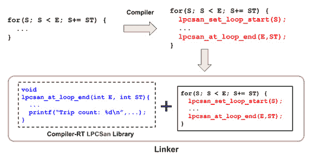
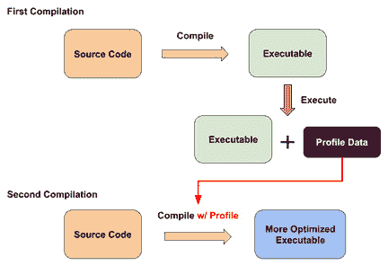

# *第十二章*：学习 LLVM IR 仪器

在上一章中，我们学习了如何利用各种工具来提高使用 LLVM 进行开发时的生产力。这些技能可以在诊断由 LLVM 引发的问题时给我们带来更流畅的体验。其中一些工具甚至可以减少编译工程师可能犯的错误数量。在本章中，我们将学习 LLVM IR 中的仪器是如何工作的。

我们在这里提到的**仪器**是一种技术，它将一些*探针*插入我们正在编译的代码中，以便收集运行时信息。例如，我们可以收集有关某个函数被调用多少次的信息——这只有在目标程序执行后才能获得。这种技术的优点是它提供了关于目标程序行为的极其准确的信息。这些信息可以用几种不同的方式使用。例如，我们可以使用收集到的值再次编译和优化相同的代码——但这次，由于我们有准确的数据，我们可以执行之前无法进行的更激进的优化。这种技术也称为**基于配置文件指导的优化**（**PGO**）。在另一个例子中，我们将使用插入的探针来捕捉运行时发生的不希望的事件——缓冲区溢出、竞态条件和双重释放内存，仅举几例。用于此目的的探针也称为**清理器**。

要在 LLVM 中实现仪器，我们不仅需要 LLVM 传递的帮助，还需要 LLVM 中多个子项目之间的协同作用——**Clang**、**LLVM IR 转换**和**Compiler-RT**。我们已经从前面的章节中了解了前两个。在本章中，我们将介绍 Compiler-RT，更重要的是，我们将介绍如何*结合*这些子系统以实现仪器的目的。

下面是我们将要涵盖的主题列表：

+   开发一个清理器

+   与 PGO 一起工作

在本章的第一部分，我们将看到清理器如何在 Clang 和 LLVM 中实现，然后我们将自己创建一个简单的清理器。本章的后半部分将向您展示如何使用 LLVM 中的 PGO 框架，以及我们如何*扩展*它。

# 技术要求

在本章中，我们将处理多个子项目。其中之一——Compiler-RT——需要通过我们修改 CMake 配置来包含在你的构建中。请打开构建文件夹中的`CMakeCache.txt`文件，并将`compiler-rt`字符串添加到`LLVM_ENABLE_PROJECTS`变量的值中。以下是一个示例：

```cpp
//Semicolon-separated list of projects to build…
LLVM_ENABLE_PROJECTS:STRING="clang;compiler-rt"
```

编辑文件后，使用任何构建目标启动构建。CMake 将尝试重新配置自己。

一切准备就绪后，我们可以构建本章所需的组件。以下是一个示例命令：

```cpp
$ ninja clang compiler-rt opt llvm-profdata
```

这将构建我们所有人都熟悉的`clang`工具和一组 Compiler-RT 库，我们将在稍后介绍。

你可以在同一个 GitHub 仓库中找到本章的示例代码：[`github.com/PacktPublishing/LLVM-Techniques-Tips-and-Best-Practices-Clang-and-Middle-End-Libraries/tree/main/Chapter12`](https://github.com/PacktPublishing/LLVM-Techniques-Tips-and-Best-Practices-Clang-and-Middle-End-Libraries/tree/main/Chapter12)。

# 开发清理器

清理器是一种检查由编译器插入的代码（`probe`）的某些运行时属性的技巧。人们通常使用清理器来确保程序的正确性或强制执行安全策略。为了让你了解清理器是如何工作的，让我们以 Clang 中最受欢迎的清理器之一为例——**地址清理器**。

## 使用地址清理器的示例

假设我们有一些简单的 C 代码，如下所示：

```cpp
int main(int argc, char **argv) {
  int buffer[3];
  for (int i = 1; i < argc; ++i)
    buffer[i-1] = atoi(argv[i]);
  for (int i = 1; i < argc; ++i)
    printf("%d ", buffer[i-1]);
  printf("\n");
  return 0;
}
```

前面的代码将命令行参数转换为整数并将它们存储在大小为 3 的缓冲区中。然后，我们打印它们。

你应该能够轻松地发现一个突出的问题：当`argc`的值大于`buffer`的大小（即 3）时，它可以任意大。在这里，我们将值存储在一个`*invalid*`内存位置。然而，当我们编译这段代码时，编译器不会说任何话。以下是一个例子：

```cpp
$ clang -Wall buffer_overflow.c -o buffer_overflow
$ # No error or warning
```

在前面的命令中，即使我们通过`-Wall`标志启用了所有编译器警告，`clang`也不会对潜在的错误提出异议。

如果我们尝试执行`buffer_overflow`程序，程序将在我们传递超过三个命令行参数给它后的某个时间点崩溃；例如：

```cpp
$ ./buffer_overflow 1 2 3
1 2 3
$ ./buffer_overflow 1 2 3 4
Segmentation fault (core dumped)
$
```

更糟糕的是，导致`buffer_overflow`崩溃的命令行参数数量实际上在每台机器上都是不同的。如果这里展示的例子是一个现实世界的错误，那么这将使得调试变得更加困难。总结一下，我们在这里遇到的问题是由`buffer_overflow`仅在`*some*`输入上变得异常，而编译器未能捕捉到这个问题所引起的。

现在，让我们尝试使用地址清理器来捕捉这个错误。以下命令要求`clang`使用地址清理器编译相同的代码：

```cpp
$ clang -fsanitize=address buffer_overflow.c -o san_buffer_overflow
```

让我们再次执行程序。以下是输出：

```cpp
$ ./san_buffer_overflow 1 2 3
1 2 3
$ ./san_buffer_overflow 1 2 3 4
=================================================================
==137791==ERROR: AddressSanitizer: stack-buffer-overflow on address 0x7ffea06bccac at pc 0x0000004f96df bp 0x7ffea06bcc70…
WRITE of size 4 at 0x7ffea06bccac thread T0
…
  This frame has 1 object(s):
    32, 44) 'buffer' <== Memory access at offset 44 overflows this variable
…
==137791==ABORTING
$
```

而不是仅仅崩溃，地址清理器给我们提供了关于在运行时引发的问题的许多详细信息：清理器告诉我们它检测到堆上的`*buffer overflow*`，这可能是`buffer`变量。

这些信息非常有用。想象一下，你正在处理一个更复杂的软件项目。当出现奇怪的内存错误时，地址清理器可以立即指出问题区域——具有高精度——而不是仅仅崩溃或静默地改变程序的逻辑。

要更深入地了解其机制，以下图表说明了地址清理器如何检测缓冲区溢出：

![图 12.1 – 地址清理器插入的仪器代码

![图片

图 12.1 – 地址清理器插入的仪器代码

在这里，我们可以看到地址清理器有效地在用于访问`buffer`的数组索引中插入了一个边界检查。有了这个额外的检查——它将在运行时执行——目标程序可以在违反内存访问之前退出并带有错误详情。更普遍地说，在编译期间，清理器会插入一些仪器代码（到目标程序中），这些代码最终将在运行时执行以检查或**保护**某些属性。

使用地址清理器检测溢出

上述图表显示了地址清理器工作原理的简化版本。实际上，地址清理器将利用多种策略来监控程序中的内存访问。例如，地址清理器可以使用一个特殊的内存分配器，该分配器在无效内存区域放置`陷阱`来分配内存。

虽然地址清理器擅长捕获非法内存访问，但**ThreadSanitizer**可以用来捕获数据竞争条件；即，对同一数据块的多线程无效访问。Clang 中其他清理器的例子还包括**LeakSanitizer**，它用于检测敏感数据（如密码）泄露，以及**MemorySanitizer**，它用于检测对未初始化内存的读取。

当然，使用清理器也有一些缺点。最突出的问题是性能影响：以 Clang 中的线程清理器为例，使用它的程序比原始版本慢**5~15 倍**。此外，由于清理器将额外的代码插入到程序中，它可能会阻碍一些优化机会，甚至影响原始程序的逻辑！换句话说，这是目标程序**健壮性**和**性能**之间的权衡。

通过这样，你已经了解了清理器的高级概念。让我们尝试自己创建一个，以了解 Clang 和 LLVM 如何实现清理器。接下来的部分包含比前几章中任何示例都多的代码，更不用说这些更改分散在 LLVM 的不同子项目中。为了专注于最重要的知识，我们不会深入一些**支持性**代码的细节——例如，对 CMake 构建脚本的更改。相反，我们将通过提供简要介绍并指出在哪里可以找到这本书的 GitHub 仓库中的相关内容来简要介绍它们。

让我们先概述一下我们将要创建的项目。

## 创建循环计数器清理器

为了（稍微）简化我们的任务，我们将创建的清理器——一个循环计数器清理器，简称**LPCSan**——看起来就像一个清理器，只不过它不会检查任何严重的程序属性。相反，我们希望用它来打印出实际的、具体的**迭代计数**——循环的迭代次数，这在运行时才可用。

例如，让我们假设我们有以下输入代码：

```cpp
void foo(int S, int E, int ST, int *a) {
  for (int i = S; i < E; i += ST) {
    a[i] = a[i + 1];
  }
}
int main(int argc, char **argv) {
  int start = atoi(argv[1]),
      end = atoi(argv[2]),
      step = atoi(argv[3]);
  int a[100];
  foo(start, end, step, a);
  return 0;
}
```

我们可以使用以下命令使用 LPCSan 进行编译：

```cpp
$ clang -O1 -fsanitize=loop-counter test_lpcsan.c -o test_lpcsan
```

注意，使用大于 `-O0` 的优化编译是必要的；我们将在稍后解释原因。

当我们执行 `test_lpcsan`（带有一些命令行参数）时，我们可以在 `foo` 函数中打印出循环的确切遍历次数。例如，看看以下代码：

```cpp
$ ./test_lpcsan 0 100 1
==143813==INFO: Found a loop with trip count 100
$ ./test_lpcsan 0 50 2
==143814==INFO: Found a loop with trip count 25
$
```

上述代码中高亮显示的消息是由我们的检查器代码打印的。

现在，让我们深入了解创建 LPCSan 的步骤。我们将把这个教程分为三个部分：

+   开发 IR 转换

+   添加 Compiler-RT 组件

+   将 LPCSan 添加到 Clang

我们将从这个检查器的 IR 转换部分开始。

### 开发 IR 转换

之前，我们了解到地址检查器——或者更一般地说——通常会在目标程序中插入代码来检查某些运行时属性或收集数据。在 *第九章* *与 PassManager 和 AnalysisManager 一起工作* 和 *第十章* *处理 LLVM IR* 中，我们学习了如何修改/转换 LLVM IR，包括向其中插入新代码，因此这似乎是构建我们的 LPCSan 的好起点。

在本节中，我们将开发一个名为 `LoopCounterSanitizer` 的 LLVM 传递，该传递会插入特殊函数调用来收集 `Module` 中每个循环的确切遍历次数。以下是详细步骤：

1.  首先，让我们创建两个文件：`LoopCounterSanitizer.cpp` 位于 `llvm/lib/Transforms/Instrumentation` 文件夹下，以及其对应的头文件位于 `llvm/include/llvm/Transforms/Instrumentation` 文件夹内。在头文件中，我们将放置此传递的声明，如下所示：

    ```cpp
    struct LoopCounterSanitizer
      : public PassInfoMixin<LoopCounterSanitizer> {
      PreservedAnalyses run(Loop&, LoopAnalysisManager&,
                            LoopStandardAnalysisResults&, 
                            LPMUpdater&);
    private:
      // Sanitizer functions
      LPCSetStartFn and LPCAtEndFn memory variables – they will store the Function instances that collect loop trip counts (FunctionCallee is a thin wrapper around Function that provides additional function signature information).
    ```

1.  最后，在 `LoopCounterSanitizer.cpp` 中，我们放置了我们传递的骨架代码，如下所示：

    ```cpp
    PreservedAnalyses
    LoopCounterSanitizer::run(Loop &LP, LoopAnalysisManager &LAM, LoopStandardAnalysisResults &LSR, LPMUpdater &U) {
      initializeSanitizerFuncs method in the preceding code will populate LPCSetStartFn and LPCAtEndFn. Before we go into the details of initializeSanitizerFuncs, let's talk more about LPCSetStartFn and LPCAtEndFn.
    ```

1.  为了确定确切的遍历次数，将使用存储在 `LPCSetStartFn` 中的 `Function` 实例来收集循环的 *初始* 归纳变量值。另一方面，存储在 `LPCAtEndFn` 中的 `Function` 实例将用于收集循环的 *最终* 归纳变量值和步长值。为了给您一个具体的概念，了解这两个 `Function` 实例是如何一起工作的，让我们假设以下伪代码作为我们的输入程序：

    ```cpp
    void foo(int S, int E, int ST) {
      for (int i = S; i < E; i += ST) {
        …
      }
    }
    ```

    在前面的代码中，`S`、`E` 和 `ST` 变量分别代表循环的初始、最终和步长值。`LoopCounterSanitizer` 传递的目标是以以下方式插入 `LPCSetStartFn` 和 `LPCAtEndFn`：

    ```cpp
    void foo(int S, int E, int ST) {
      for (int i = S; i < E; i += ST) {
        lpc_set_start and lpc_at_end in the preceding code are Function instances that are stored in LPCSetStartFn and LPCAtEndFn, respectively. Here is one of the possible (pseudo) implementations of these two functions:

    ```

    static int CurrentStartVal = 0;

    void lpc_set_start(int start) {

    LPCSetStartFn 和 LPCAtEndFn，现在是时候看看 `initializeSanitizerFuncs` 是如何初始化它们的了。

    ```cpp

    ```

1.  这里是 `initializeSanitizerFuncs` 中的代码：

    ```cpp
    void LoopCounterSanitizer::initializeSanitizerFuncs(Loop &LP) {
      Module &M = *LP.getHeader()->getModule();
      auto &Ctx = M.getContext();
      Type *VoidTy = Type::__lpcsan_set_loop_start and __lpcsan_at_loop_end, from the module and storing their Function instances in LPCSetStartFn and LPCAtEndFn, respectively.The `Module::getOrInsertFunction` method either grabs the `Function` instance of the given function name from the module or creates one if it doesn't exist. If it's a newly created instance, it has an empty function body; in other words, it only has a function *declaration*.It is also worth noting that the second argument of `Module::getOrInsertFunction` is the return type of the `Function` inquiry. The rest (the arguments for `getOrInsertFunction`) represent the argument types of that `Function`.With `LPCSetStartFn` and `LPCAtEndFn` set up, let's see how we can insert them into the right place in IR.
    ```

1.  回想一下，在 *第十章* 中，我们学习了关于与 `Loop` 一起工作的几个实用类，即 *处理 LLVM IR*。其中之一 – `LoopBounds` – 可以给我们提供 `Loop` 的边界。我们可以通过包含一个归纳变量的起始、结束和步长值来实现这一点，这正是我们所寻找的信息。以下是尝试检索 `LoopBounds` 实例的代码：

    ```cpp
    PreservedAnalyses
    LoopCounterSanitizer::run(Loop &LP, LoopAnalysisManager &LAM, LoopStandardAnalysisResults &LSR, LPMUpdater &U) {
      initializeSanitizerFuncs(LP);
      Loop::getBounds from the preceding code returned an Optional<LoopBounds> instance. The Optional<T> class is a useful container that either stores an instance of the T type or is *empty*. You can think of it as a replacement for the T* to represent a computation result where a null pointer means an empty value. However, this has the risk of dereferencing a null pointer if the programmer forgets to check the pointer first. The Optional<T> class doesn't have this problem.With a `LoopBounds` instance, we can retrieve the induction variable's range and store it in the `StartVal`, `EndVal`, and `StepVal` variables.
    ```

1.  `StartVal` 是 `Value` 实例，它将被 `__lpcsan_set_loop_start` 收集，而 `__lpcsan_at_loop_end` 将在运行时收集 `EndVal` 和 `StepVal`。现在，问题是，我们应该在哪里插入 `__lpcsan_set_loop_start` 和 `__lpcsan_at_loop_end` 的函数调用，以正确收集这些值？

    通常的规则是，我们需要在那些值的 *定义* 之后插入那些函数调用。虽然我们可以找到那些值被定义的确切位置，但让我们通过在某个固定位置插入仪器化函数调用来简化问题 – 这些位置是我们目标值 *总是* 可用的位置。

    对于 `__lpcsan_set_loop_start`，我们在 `getTerminator` 的末尾插入它，以获取头块中的最后一个 `Instruction`。然后，我们使用 `IRBuilder<>` – 以最后一个指令作为插入点 – 来插入新的 `Instruction` 实例。

    在我们能够将 `StartVal` 作为参数传递给新的 `__lpcsan_set_loop_start` 函数调用之前，我们需要将其 IR 类型（由 `Type` 类表示）转换为兼容的类型。`IRBuilder::CreateInstCast` 是一个方便的实用工具，它可以自动生成一个指令来 *扩展* 整数位宽或生成一个指令来 *截断* 位宽，具体取决于给定的 `Value` 和 `Type` 实例。

    最后，我们可以通过 `IRBuilder::CreateCall` 创建一个 `__lpcsan_set_loop_start` 的函数调用，并将 `StartVal` 作为函数调用参数。

1.  对于 `__lpcsan_at_loop_end`，我们使用相同的技巧来收集 `EndVal` 和 `StepVal` 的运行时值。以下是代码：

    ```cpp
    BasicBlock *ExitBlock = LP.__lpcsan_at_loop_end at the beginning of the *exit block*. This is because we can always expect the end value and the step value of the induction variable being defined before we leave the loop.These are all the implementation details for the `LoopCounterSanitizer` pass.
    ```

1.  在我们结束这一节之前，我们需要编辑几个更多文件以确保一切正常。请查看本章示例代码文件夹中的 `Changes-LLVM.diff` 文件。以下是其他支持文件中进行的更改的摘要：

    i. 在 `llvm/lib/Transforms/Instrumentation/CMakeLists.txt` 中的更改：将我们的新过滤器源文件添加到构建中。

    ii. 在 `llvm/lib/Passes/PassRegistry.def` 中的更改：将我们的过滤器添加到可用过滤器的列表中，这样我们就可以使用我们的老朋友 `opt` 来测试它。

这样，我们终于完成了对 LLVM 部分的所有必要修改。

在我们进入下一节之前，让我们测试我们新创建的 `LoopCounterSanitizer` 过滤器。我们将使用本节前面看到的相同 C 代码。以下是包含我们想要进行仪器化的循环的函数：

```cpp
void foo(int S, int E, int ST, int *a) {
  for (int i = S; i < E; i += ST) {
    a[i] = a[i + 1];
  }
}
```

注意，尽管我们没有在我们的过滤器中明确检查循环形式，但过滤器中使用的某些 API 实际上要求循环要被 *旋转*，所以请使用 O1 优化级别生成 LLVM IR 代码，以确保循环旋转的过滤器已经启动：

这里是 `foo` 函数的简化后的 LLVM IR：

```cpp
define void @foo(i32 %S, i32 %E, i32 %ST, i32* %a) {
  %cmp9 = icmp slt i32 %S, %E
  br i1 %cmp9, label %for.body.preheader, label %for.cond.   cleanup
for.body.preheader:  
  %0 = sext i32 %S to i64
  %1 = sext i32 %ST to i64
  %2 = sext i32 %E to i64
  br label %for.body
…
for.body:                                         
  %indvars.iv = phi i64 [ %0, %for.body.preheader ], [   %indvars.iv.next, %for.body ]
  …
  %indvars.iv.next = add i64 %indvars.iv, %1
  %cmp = icmp slt i64 %indvars.iv.next, %2
  br i1 %cmp, label %for.body, label %for.cond.cleanup
}
```

突出的标签是此循环的预头块和循环体块。由于这个循环已经被旋转，`for.body` 块既是此循环的头块，也是 latch 和退出块。

现在，让我们使用以下命令使用 `opt` 转换这个 IR：

```cpp
$ opt -S –passes="loop(lpcsan)" input.ll -o -
```

在 `–passes` 命令行选项中，我们要求 `opt` 运行我们的 `LoopCounterSanitizer` 过滤器（名称为 `lpcsan`，已在 `PassRegistry.def` 文件中注册）。包围的 `loop(…)` 字符串只是简单地告诉 `opt`，`lpcsan` 是一个循环过滤器（实际上你可以省略这个装饰，因为 `opt` 大多数时候都能找到正确的过滤器）。

这里是简化后的结果：

```cpp
declare void @__lpcsan_set_loop_start(i32)
declare void @__lpcsan_at_loop_end(i32, i32)
define void @foo(i32 %S, i32 %E, i32* %a) {
  %cmp8 = icmp slt i32 %S, %E
  br i1 %cmp8, label %for.body.preheader, label %for.cond.cleanup
for.body.preheader: 
  %0 = sext i32 %S to i64
  %wide.trip.count = sext i32 %E to i64
  br label %for.body
for.cond.cleanup.loopexit:                        
  %1 = trunc i64 %wide.trip.count to i32
  call void @__lpcsan_at_loop_end(i32 %1, i32 1)
  br label %for.cond.cleanup
for.body:
  …
  %3 = trunc i64 %0 to i32
  call void @__lpcsan_set_loop_start(i32 %3)
  br i1 %exitcond.not, label %for.cond.cleanup.loopexit, label    %for.body
}
```

如您所见，`__lpcsan_set_loop_start` 和 `__lpcsan_at_loop_end` 已经分别正确地插入到头块和退出块中。它们也在收集与循环迭代次数相关的所需值。

现在，最大的问题是：`__lpcsan_set_loop_start` 和 `__lpcsan_at_loop_end` 的函数体在哪里？这两个函数在之前的 IR 代码中只有声明。

在下一节中，我们将使用 Compiler-RT 来回答这个问题。

### 添加 Compiler-RT 组件

**Compiler-RT** 的名称代表 **Compiler RunTime**。在这里，*runtime* 的使用有一点模糊，因为在正常的编译管道中，太多东西都可以被称为 runtime。但事实是，Compiler-RT *确实*包含了一组用于完全不同任务的库。这些库的共同之处在于，它们为目标程序提供 *补充* 代码，以实现增强功能或原本缺失的功能。重要的是要记住，Compiler-RT 库不是用于构建编译器或相关工具的——它们应该与我们要编译的程序链接。

Compiler-RT 中最常用的功能之一是 **内建函数**。正如您可能听说的，现在越来越多的计算机架构原生支持 *向量操作*。也就是说，您可以在硬件的支持下同时处理多个数据元素。以下是一些使用向量操作的 C 语言示例代码：

```cpp
typedef int v4si __attribute__((__vector_size__(16)));
v4si v1 = (v4si){1, 2, 3, 4};
v4si v2 = (v4si){5, 6, 7, 8};
v4si v3 = v1 + v2; // = {6, 8, 10, 12}
```

之前的代码使用了非标准化的（目前，你只能在 Clang 和 GCC 中使用这种语法）C/C++ 向量扩展来声明两个向量，`v1` 和 `v2`，然后在将它们相加以生成第三个向量之前。

在 X86-64 平台上，此代码将被编译为使用向量指令集之一，例如使用`for-loop`来替换此例中的向量求和。更具体地说，每当我们在编译时看到向量求和，我们就用包含使用`for-loop`的合成实现的函数调用来替换它。函数体可以放在任何地方，只要它最终与程序链接即可。以下图表说明了这个过程：

![图 12.2 – Compiler-RT 内置的流程]


图 12.2 – Compiler-RT 内置的流程

如您所注意到的，这里显示的流程与我们在 LPCSan 中的要求相似：在前一节中，我们开发了一个 LLVM pass，它插入额外的函数调用来收集循环迭代次数，但我们仍然需要实现这些收集函数。如果我们利用前面图表中显示的流程，我们可以提出一个设计，如下面的图表所示：

![图 12.3 – Compiler-RT LPCSan 组件的流程]



![图 12.3 – Compiler-RT LPCSan 组件的流程]

之前的图表显示，`__lpcsan_set_loop_start`和`__lpcsan_at_loop_end`函数的函数体被放入一个最终将与最终二进制文件链接的 Compiler-RT 库中。在这两个函数内部，我们使用输入参数计算迭代次数并打印结果。在本节的其余部分，我们将向您展示如何为 LPCSan 创建这样的 Compiler-RT 库。让我们开始吧：

1.  首先，将文件夹切换到`llvm-project/compiler-rt`，这是 Compiler-RT 的根目录。在这个子项目中，我们必须在将新的`lpcsan.cpp`文件放入其中之前，先创建一个名为`lib/lpcsan`的新文件夹。在这个文件中，让我们为我们的仪器函数创建一个骨架。以下是代码：

    ```cpp
    #include "sanitizer_common/sanitizer_common.h"
    #include "sanitizer_common/sanitizer_internal_defs.h"
    using namespace __sanitizer;
    extern "C" SANITIZER_INTERFACE_ATTRIBUTE
    void s32 – available under the __sanitizer namespace – for a signed 32-bit integer rather than the normal int. The rationale behind this is that we might need to build Compiler-RT libraries for different hardware architectures or platforms, and the width of int might not be 32 bits on some of them.Second, although we are using C++ to implement our instrumentation functions, we need to expose them as C functions because C functions have a more stable `extern "C"` to functions you want to export. The `SANITIZER_INTERFACE_ATTRIBUTE` macro also ensures that the function will be exposed at the library interface correctly, so please add this as well.
    ```

1.  接下来，我们将向这两个函数添加必要的代码。以下是我们的做法：

    ```cpp
    static CurLoopStart is a global variable that memorizes the *initial* induction variable value of the current loop. This is updated by __lpcsan_set_loop_start.Recall that when a loop is complete, `__lpcsan_at_loop_end` will be invoked. When that happens, we use the value stored in `CurLoopStart` and the `end` and `step` arguments to calculate the exact trip count of the current loop, before printing the result.
    ```

1.  现在我们已经实现了核心逻辑，是时候构建这个库了。在`lib/lpcsan`文件夹内，创建一个新的`CMakeLists.txt`文件并插入以下代码：

    ```cpp
    …
    set(LPCSAN_RTL_SOURCES
        lpcsan.cpp)
    CMakeLists.txt. Here are some highlights:i. Compiler-RT creates its own set of CMake macros/functions. Here, we are using two of them, `add_compiler_rt_component` and `add_compiler_rt_runtime`, to create a pseudo build target for the entire LPCSan and the real library build target, respectively.ii. Different from a conventional build target, if a sanitizer wants to use supporting/utility libraries in Compiler-RT – for example, `RTSanitizerCommon` in the preceding code – we usually link against their *object files* rather than their library files. More specifically, we can use the `$<TARGET_OBJECTS:…>` directive to import supporting/utility components as one of the input sources.iii. A sanitizer library can support multiple architectures and platforms. In Compiler-RT, we are enumerating all the supported architectures and creating a sanitizer library for each of them.Again, the preceding snippet is just a small part of our build script. Please refer to our sample code folder for the complete `CMakeLists.txt` file.
    ```

1.  要成功构建 LPCSan，我们仍然需要在 Compiler-RT 中进行一些更改。同一代码文件夹中的`Base-CompilerRT.diff`补丁提供了构建我们的 sanitizer 所需的其余更改。将其应用到 Compiler-RT 的源代码树上。以下是此补丁的摘要：

    i. `compiler-rt/cmake/config-ix.cmake`中的更改基本上指定了 LPCSan 支持的架构和操作系统。我们之前在代码片段中看到的`LPCSAN_SUPPORTED_ARCH` CMake 变量就来自这里。

    ii. 整个`compiler-rt/test/lpcsan`文件夹实际上是一个占位符。由于某种原因，在 Compiler-RT 中，每个 sanitizer 都需要测试 – 这与 LLVM 不同。因此，我们在这里放置一个空的测试文件夹以满足由构建基础设施强加的要求。

这些都是为我们的 LPCSan 生成 Compiler-RT 组件的步骤。

要仅构建我们的 LPCSan 库，请执行以下命令：

```cpp
$ ninja lpcsan
```

不幸的是，在我们修改 Clang 的编译管道之前，我们无法测试这个 LPCSan 库。在本节的最后部分，我们将学习如何完成这个任务。

### 将 LPCSan 添加到 Clang

在上一节中，我们学习了 Compiler-RT 库如何为目标程序提供补充功能或协助特殊工具，例如我们刚刚创建的清理器。在本节中，我们将把所有这些内容整合起来，这样我们就可以通过向 `clang` 传递 `-fsanitize=loop-counter` 标志来简单地使用我们的 LPCSan。

回想一下，在 *图 12.3* 中，Compiler-RT 库需要与我们要编译的程序链接。同样，回想一下，为了将工具代码插入到目标程序中，我们必须运行我们的 `LoopCounterSanitizer` 过滤器。在本节中，我们将修改 Clang 的编译管道，以便在特定时间运行我们的 LLVM 过滤器，并为我们的 Compiler-RT 库设置正确的配置。更具体地说，以下图显示了每个组件需要完成的任务以运行我们的 LPCSan：

![图 12.4 – 管道中每个组件的任务]

![img/B14590_12.4.jpg]

图 12.4 – 管道中每个组件的任务

以下是前图中每个数字（用圆圈圈出）的描述：

1.  驱动程序需要识别 `-fsanitize=loop-counter` 标志。

1.  当前端即将从 `LoopCounterSanitizer` 过滤器生成 LLVM IR 时。

1.  LLVM 过滤器管道需要运行我们的 `LoopCounterSanitizer`（如果前面的任务完成正确，我们不需要担心这个任务）。

1.  链接器需要将我们的 Compiler-RT 库链接到目标程序。

虽然这个工作流程看起来有点吓人，但不要被预期的任务量所压倒——只要提供足够的信息，Clang 实际上可以为你完成大部分这些任务。在本节的其余部分，我们将向您展示如何实现前图中显示的任务，以将我们的 LPCSan 完全集成到 Clang 编译管道中（以下教程在 `llvm-project/clang` 文件夹内进行）。让我们开始吧：

1.  首先，我们必须修改 `include/clang/Basic/Sanitizers.def` 以添加我们的清理器：

    ```cpp
    …
    // Shadow Call Stack
    SANITIZER("shadow-call-stack", ShadowCallStack)
    // Loop Counter Sanitizer
    LoopCounter, to the SanitizerKind class.It turns out that the driver will parse the `-fsanitize` command-line option and *automatically* translate `loop-counter` into `SanitizerKind::LoopCounter` based on the information we provided in `Sanitizers.def`.
    ```

1.  接下来，让我们处理驱动程序部分。打开 `include/clang/Driver/SanitizerArgs.h` 并向 `SanitizerArgs` 类中添加一个新的实用方法，`needsLpcsanRt`。以下是代码：

    ```cpp
    bool needsLsanRt() const {…}
    bool needsLpcsanRt() const {
      return Sanitizers.has(SanitizerKind::LoopCounter);
    }
    ```

    我们在这里创建的实用方法可以在驱动程序的其它地方使用，以检查我们的清理器是否需要 Compiler-RT 组件。

1.  现在，让我们导航到 `lib/Driver/ToolChains/CommonArgs.cpp` 文件。在这里，我们向 `collectSanitizerRuntimes` 函数中添加了几行代码。以下是代码：

    ```cpp
    …
    if (SanArgs.needsLsanRt() && SanArgs.linkRuntimes())
      StaticRuntimes.push_back("lsan");
    if (SanArgs.needsLpcsanRt() && SanArgs.linkRuntimes())
      StaticRuntimes.push_back("lpcsan");
    …
    ```

    前面的代码片段有效地使链接器将正确的 Compiler-RT 库链接到目标二进制文件。

1.  我们将对驱动程序进行的最后一个修改是在`lib/Driver/ToolChains/Linux.cpp`文件中。在这里，我们将以下行添加到`Linux::getSupportedSanitizers`方法中：

    ```cpp
    SanitizerMask Res = ToolChain::getSupportedSanitizers();
    …
    Res |= SanitizerKind::LoopCounter;
    …
    ```

    之前的代码基本上是在告诉驱动程序，我们支持当前工具链中的 LPCSan——Linux 的工具链。请注意，为了简化我们的示例，我们只支持 Linux 中的 LPCSan。如果您想在其他平台和架构上支持这个自定义清理器，请修改其他工具链实现。如果需要，请参阅*第八章*，*使用编译器标志和工具链*，以获取更多详细信息。

1.  最后，我们将把我们的`LoopCounterSanitizer`传递插入到 LLVM 传递管道中。打开`lib/CodeGen/BackendUtil.cpp`文件，并将以下行添加到`addSanitizers`函数中：

    ```cpp
    …
    // `PB` has the type of `CodeGen, is a place where the Clang and LLVM libraries meet. Therefore, we will see several LLVM APIs appear in this place. There are primarily two tasks for this CodeGen component:a. Converting the Clang AST into its equivalent LLVM IR `module`b. Constructing an LLVM pass pipeline to optimize the IR and generate machine codeThe previous snippet was trying to customize the second task – that is, customizing the LLVM Pass pipeline. The specific function – `addSanitizers` – we are modifying here is responsible for putting sanitizer passes into the pass pipeline. To have a better understanding of this code, let's focus on two of its components:i. `PassBuilder`: This class provides predefined pass pipeline configurations for each optimization level – that is, the O0 ~ O3 notations (as well as Os and Oz for size optimization) we are familiar with. In addition to these predefined layouts, developers are free to customize the pipeline by leveraging the `PassBuilder` supports several EPs, such as at the *beginning* of the pipeline, at the *end* of the pipeline, or at the end of the vectorization process, to name a few. An example of using EP can be found in the preceding code, where we used the `PassBuilder::registerOptimizerLastEPCallback` method and a lambda function to customize the EP located at the *end* of the Pass pipeline. The lambda function has two arguments: `ModulePassManager` – which represents the pass pipeline – and the current optimization level. Developers can use `ModulePassManager::addPass` to insert arbitrary LLVM passes into this EP.ii. `ModulePassManager`: This class represents a Pass pipeline – or, more specifically, the pipeline for `Module`. There are, of course, other PassManager classes for different IR units, such as `FunctionPassManager` for `Function`. In the preceding code, we were trying to use the `ModulePassManager` instance to insert our `LoopCounterSanitizer` pass whenever `SanitizerKind::LoopCounter` was one of the sanitizers that had been designated by the user. Since `LoopCounterSanitizer` is a loop pass rather than a module pass, we need to add some *adaptors* between the pass and PassManager. The `createFunctionToLoopPassAdaptor` and `createModuleToFunctionPassAdaptor` functions we were using here created a special instance that adapts a pass to a PassManager of a different IR unit.This is all the program logic that supports our LPCSan in the Clang compilation pipeline.
    ```

1.  最后但同样重要的是，我们必须对构建系统进行一些小的修改。打开`runtime/CMakeLists.txt`文件，并更改以下 CMake 变量：

    ```cpp
    …
    set(COMPILER_RT_RUNTIMES effectively imports our LPCSan Compiler-RT libraries into the build.
    ```

这些都是在 Clang 中支持 LPCSan 所需的所有步骤。现在，我们最终可以使用 LPCSan，就像我们在本节开始时向您展示的那样：

```cpp
$ clang -O1 -fsanitize=loop-counter input.c -o input
```

在本节中，我们学习了如何创建清理器。清理器是一个有用的工具，可以在不修改原始程序代码的情况下捕获运行时行为。创建清理器的能力增加了编译器开发者创建针对他们自己用例定制的诊断工具的灵活性。开发清理器需要全面了解 Clang、LLVM 和 Compiler-RT：创建一个新的 LLVM 传递、创建一个新的 Compiler-RT 组件，并自定义 Clang 的编译管道。您可以使用本节的内容，来巩固您在本本书的前几章中学到的知识。

在本章的最后部分，我们将探讨另一种仪器技术：**PGO**。

# 使用 PGO

在上一节中，我们学习了如何使用仅在运行时才可用的数据，通过清理器帮助开发者进行更精确的合理性检查。我们还学习了如何创建一个自定义清理器。在本节中，我们将继续探讨利用运行时数据的思想。我们将学习这种信息的另一种用途——用于编译器优化。

PGO 是一种使用在运行时收集的统计信息来启用更激进的编译器优化的技术。其名称中的*profile*指的是收集到的运行时数据。为了给您一个这样的数据如何增强优化的概念，让我们假设我们有以下 C 代码：

```cpp
void foo(int N) {
  if (N > 100)
    bar();
  else
    zoo();
}
```

在此代码中，我们有三个函数：`foo`、`bar`和`zoo`。第一个函数有条件地调用后两个函数。

当我们尝试优化此代码时，优化器通常会尝试将调用者函数**内联**到被调用者中。在这种情况下，`bar`或`zoo`可能会被内联到`foo`中。然而，如果`bar`或`zoo`有一个大的函数体，内联**两者**可能会膨胀最终二进制文件的大小。理想情况下，如果我们只能内联执行频率最高的那个将是非常好的。遗憾的是，从统计学的角度来看，我们没有关于哪个函数有最高执行频率的线索，因为`foo`函数根据一个（非常量）变量有条件地调用它们中的任何一个。

使用 PGO，我们可以在运行时收集`bar`和`zoo`的执行频率，并使用这些数据再次编译（和优化）相同的代码。以下图表展示了这一想法的高级概述：



图 12.5 – PGO 工作流程

在这里，第一次编译阶段正常编译和优化了代码。在我们执行编译后的程序（任意次数）之后，我们能够收集到分析数据文件。在第二次编译阶段，我们不仅像之前那样优化了代码，而且还把分析数据集成到优化中，使它们更加积极。

PGO 收集运行时分析数据主要有两种方式：插入**仪器**代码或利用**采样**数据。让我们来介绍这两种方法。

## 基于仪器的 PGO 简介

基于仪器的 PGO 在第一次编译阶段将仪器代码插入到目标程序中。此代码测量我们感兴趣的程序结构的执行频率——例如，基本块和函数——并将结果写入文件。这与清理器的工作方式类似。

基于仪器的 PGO 通常生成的分析数据精度更高。这是因为编译器可以以提供最大优化利益的方式插入仪器代码。然而，就像清理器一样，基于仪器的 PGO 改变了目标程序的执行流程，这增加了性能退化的风险（对于从第一次编译阶段生成的二进制文件）。

## 基于采样的 PGO 简介

基于采样的 PGO 使用**外部**工具来收集分析数据。开发者使用`perf`或`valgrind`等分析器来诊断性能问题。这些工具通常利用高级系统功能甚至硬件功能来收集程序的运行时行为。例如，`perf`可以让你了解分支预测和缓存行缺失。

由于我们正在利用其他工具的数据，因此无需修改原始代码来收集配置文件。因此，基于采样的 PGO 通常具有极低的运行时开销（通常，这不到 1%）。此外，我们不需要重新编译代码以进行配置文件收集。然而，以这种方式生成的配置文件通常不太精确。在第二个编译阶段，将配置文件映射回原始代码也更加困难。

在本节的其余部分，我们将重点关注基于插装的 PGO。我们将学习如何利用 LLVM IR。然而，正如我们很快将看到的，LLVM 中的这两种 PGO 策略共享许多共同的基础设施，因此代码是可移植的。以下是我们要涵盖的主题列表：

+   处理配置文件数据

+   了解访问配置文件数据的 API

第一部分将向我们展示如何使用 Clang 创建和使用基于插装的 PGO 配置文件，以及一些可以帮助我们检查和修改配置文件数据的工具。第二部分将更详细地介绍如何使用 LLVM API 访问配置文件数据。如果你想要创建自己的 PGO 传递，这将很有用。

### 处理配置文件数据

在本节中，我们将学习如何使用生成、检查甚至修改基于插装的配置文件数据。让我们从以下示例开始：

```cpp
__attribute__((noinline))
void foo(int x) {
  if (get_random() > 5)
    printf("Hello %d\n", x * 3);
}
int main(int argc, char **argv) {
  for (int i = 0; i < argc + 10; ++i) {
    foo(i);
  }
  return 0;
}
```

在前面的代码中，`get_random` 是一个生成 1 到 10 之间随机数的函数，具有均匀分布。换句话说，`foo` 函数中高亮的 `if` 语句应该有 50% 的机会被执行。除了 `foo` 函数外，`main` 函数中 `for` 循环的遍历次数取决于命令行参数的数量。

现在，让我们尝试使用基于插装的 PGO 构建此代码。以下是步骤：

1.  我们将要做的第一件事是生成一个用于 PGO 分析的可执行文件。以下是命令：

    ```cpp
    $ clang -O1 -fprofile-generate option enables instrumentation-based PGO. The path that we added after this flag is the directory where profiling data will be stored.
    ```

1.  接下来，我们必须使用三个命令行参数运行 `pgo` 程序：

    ```cpp
    $ ./pgo `seq 1 3`
    Hello 0
    Hello 6
    …
    Hello 36
    Hello 39
    $
    ```

    你可能会得到完全不同的输出，因为打印字符串的概率只有 50%。

    之后，`pgo_prof.dir` 文件夹应该包含如这里所示的 `default_<hash>_<n>.profraw` 文件：

    ```cpp
    $ ls pgo_prof.dir
    default_10799426541722168222_0.profraw
    ```

    文件名中的 *hash* 是基于你的代码计算得出的哈希值。

1.  我们不能直接使用 `*.profraw` 文件进行我们的第二个编译阶段。相反，我们必须使用 `llvm-profdata` 工具将其转换为另一种二进制形式。以下是命令：

    ```cpp
    $ llvm-profdata llvm-profdata is a powerful tool for inspecting, converting, and merging profiling data files. We will look at it in more detail later. In the preceding command, we are merging and converting all the data files under pgo_prof.dir into a *single* *.profdata file.
    ```

1.  最后，我们可以使用我们刚刚合并的文件进行编译的第二阶段。以下是命令：

    ```cpp
    $ clang -O1 -fprofile-use=pgo_prof.profdata pgo.cpp \
            -emit-llvm -S -o pgo.after.ll
    ```

这里，`-fprofile-use` 选项告诉 `clang` 使用存储在 `pgo_prof.profdata` 中的配置文件数据来优化代码。我们将在完成此优化后查看 LLVM IR 代码。

打开 `pgo.after.ll` 并导航到 `foo` 函数。以下是 `foo` 的简化版本：

```cpp
define void @foo(i32 %x) !prof !71 {
entry:
  %call = call i32 @get_random()
  %cmp = icmp sgt i32 %call, 5
  br i1 %cmp, label %if.then, label %if.end, !prof !72
if.then:                                          
  %mul = mul nsw i32 %x, 3
  …
}
```

在前面的 LLVM IR 代码中，有两个地方与原始 IR 不同；那就是在函数头部和分支指令之后跟随的`!prof`标签，这对应于我们之前看到的`if(get_random() > 5)`代码。

在 LLVM IR 中，我们可以在文本 LLVM IR 中附加`'!'`，如前面的代码中的`!prof`、`!71`和`!72`是表示我们收集到的分析数据的元数据标签。更具体地说，如果我们有一个与 IR 单元关联的分析数据，它总是以`!prof`开头，后面跟着另一个包含所需值的元数据标签。这些元数据值放在 IR 文件的底部。如果我们导航到那里，我们将看到`!71`和`!72`的内容。以下是代码：

```cpp
!71 = !{!"function_entry_count", i64 110}
!72 = !{!"branch_weights", i32 57, i32 54}
```

这两个元数据是包含两个和三个元素的元组。`!71`，如其第一个元素所暗示的，表示`foo`函数被调用的次数（在这种情况下，它被调用了 110 次）。

另一方面，`!72`标记了`if(get_random() > 5)`语句中每个分支被取的次数。在这种情况下，真分支被取了 57 次，假分支被取了 54 次。我们得到这些数字是因为我们使用了均匀分布的随机数生成（即每个分支有 50%的机会）。

在本节的第二部分，我们将学习如何访问这些值，以便开发更激进的编译器优化。在我们这样做之前，让我们更深入地看看我们刚刚收集到的分析数据文件。

我们刚刚使用的`llvm-profdata`工具不仅可以帮助我们转换分析数据的格式，还可以快速预览其内容。以下命令打印出`pgo_prof.profdata`的摘要，包括从每个函数收集到的分析值：

```cpp
$ llvm-profdata show –-all-functions –-counts pgo_prof.profdata
…
  foo:
    Hash: 0x0ae15a44542b0f02
    Counters: 2
    Block counts: [54, 57]
  main:
    Hash: 0x0209aa3e1d398548
    Counters: 2
    Block counts: [110, 1]
…
Instrumentation level: IR  entry_first = 0
Functions shown: 9
Total functions: 9
Maximum function count: …
Maximum internal block count: …
```

在这里，我们可以看到每个函数的分析数据条目。每个条目都有一个数字列表，表示所有包围的基本块的*执行频率*。

或者，您可以通过首先将其转换为文本文件来检查相同的数据文件。以下是命令：

```cpp
$ llvm-profdata merge –-text pgo_prof.profdata -o pgo_prof.proftext
$ cat pgo_prof.proftext
# IR level Instrumentation Flag
:ir
…
foo
# Func Hash:
784007059655560962
# Num Counters:
2
# Counter Values:
54
57
…
```

`*.proftext` 文件是一种人类可读的文本格式，其中所有分析数据都简单地放在自己的行上。

这种文本表示实际上可以使用类似的命令转换回`*.profdata`格式。以下是一个示例：

```cpp
$ llvm-profdata merge –-binary pgo_prof.proftext -o pgo_prof.profdata
```

因此，`*.proftext`在您想手动*编辑*分析数据时特别有用。

在我们深入探讨 PGO 的 API 之前，还有一个概念我们需要了解：即插装级别。

### 理解插装级别

到目前为止，我们已经了解到基于仪器的 PGO 可以插入用于收集运行时分析数据的仪器代码。在此基础上，我们插入此仪器代码的位置及其粒度也很重要。这个特性被称为基于仪器的 PGO 中的**仪器级别**。LLVM 目前支持三种不同的仪器级别。以下是每个级别的描述：

+   我们之前介绍的 `-fprofile-generate` 命令行选项将使用此仪器级别生成分析数据。例如，假设我们有以下 C 代码：

    ```cpp
    void foo(int x) {
      if (x > 10)
        puts("hello");
      else
        puts("world");
    }
    ```

    相应的 IR – 不启用基于仪器的 PGO – 如下所示：

    ```cpp
    define void @foo(i32 %0) {
      …
      %4 = icmp sgt i32 %3, 10
      %5 or %7. Now, let's generate the IR with instrumentation-based PGO enabled with the following command:

    ```

    `$ clang @__profc_foo.0` 或 `$ clang @__profc_foo.1` – 单独使用。这两个变量中的值最终将被导出为分支的分析数据，表示每个分支被取用的次数。这种仪器级别提供了相当高的精度，但受编译器变化的影响。更具体地说，如果 Clang 改变了它生成 LLVM IR 的方式，仪器代码将被插入的位置也会不同。这实际上意味着对于相同的输入代码，使用较旧版本的 LLVM 生成的分析数据可能与使用较新 LLVM 生成的分析数据不兼容。

    ```cpp

    ```

+   `Stmt` AST 节点在`IfStmt`（一个 AST 节点）内部。使用这种方法，仪器代码几乎不受编译器变化的影响，并且我们可以跨不同编译器版本拥有更稳定的分析数据格式。这种仪器级别的缺点是它的精度低于 IR 仪器级别。

    您可以通过在调用 `clang` 进行第一次编译时用 `-fprofile-instr-generate` 命令行选项替换 `-fprofile-generate` 来采用这种仪器级别。尽管如此，您不需要更改第二次编译的命令。

+   使用两个 PGO 命令行选项 `clang`，`-fprofile-use` 和 `-fcs-profile-generate`，分别指定上一步骤中的分析文件路径和预期的输出路径。当我们使用 `llvm-profdata` 进行后处理时，我们正在合并我们拥有的所有分析数据文件：

    ```cpp
    $ clang -fprofile-use=combined_prof.profdata \
            foo.c -o optimized_foo
    ```

    最后，将合并后的分析文件输入到 Clang 中，以便它可以使用这种上下文相关的分析数据来获取程序运行行为的更准确描述。

注意，不同的仪器级别只会影响分析数据的准确性；它们不会影响我们如何*检索*这些数据，我们将在下一节中讨论这一点。

在本节的最后部分，我们将学习如何通过 LLVM 提供的 API 在 LLVM 传递中访问此分析数据。

### 了解访问分析数据的 API

在上一节中，我们学习了如何使用 Clang 运行基于插桩的 PGO 并使用`llvm-profdata`查看分析数据文件。在本节中，我们将学习如何在 LLVM pass 中访问这些数据，以帮助我们开发自己的 PGO。

在我们深入开发细节之前，让我们学习如何将那些分析数据文件导入`opt`，因为这样更容易使用它来测试单个 LLVM pass。以下是一个示例命令：

```cpp
$ opt -pgo-test-profile-file=pgo_prof.profdata \
      --passes="pgo-instr-use,my-pass…" pgo.ll …
```

在前面的命令中，有两个关键点：

+   使用`-pgo-test-profile-file`来指定您想要放入的配置文件。

+   字符串"`pgo-instr-use`"代表`PGOInstrumentaitonUse` pass，它读取（基于插桩的）分析文件并在 LLVM IR 上对数据进行注释。然而，它默认情况下并不运行，即使在预定义的优化级别（即 O0 ~ O3，Os 和 Oz）中也是如此。如果没有这个 pass 在 Pass 管道中提前运行，我们就无法访问任何分析数据。因此，我们需要明确将其添加到优化管道中。前面的示例命令演示了如何在管道中在自定义 LLVM pass `my-pass`之前运行它。如果您想在任何预定义的优化管道之前运行它——例如，O1——您必须指定`--passes="pgo-instr-use,default<O1>"`命令行选项。

现在，你可能想知道，在将分析数据读入`opt`之后会发生什么？事实证明，由第二个编译阶段生成的 LLVM IR 文件——`pgo.after.ll`——为我们提供了对这个问题的答案。

在`pgo.after.ll`中，我们看到一些分支被**元数据**装饰，指定了它们被取的次数。类似的元数据也出现在函数中，表示这些函数被调用的总次数。

更普遍地说，LLVM 直接通过**元数据**将分析数据（从文件中读取）与其相关的 IR 构造结合起来。这种策略的最大优点是我们不需要在整个优化管道中携带原始分析数据——IR 本身包含这些分析信息。

现在，问题变成了，我们如何访问附加到 IR 上的元数据？LLVM 的元数据可以附加到许多种 IR 单元上。让我们首先看看最常见的一种：访问附加到`Instruction`上的元数据。以下代码展示了我们如何读取之前看到的附加到分支指令上的分析元数据`!prof !71`：

```cpp
// `BB` has the type of `BasicBlock&`
Instruction *BranchInst = BB.getTerminator();
MDNode *BrWeightMD = BranchInst->getMetadata(LLVMContext::MD_prof);
```

在前面的代码片段中，我们使用`BasicBlock::getTerminator`来获取基本块中的最后一个指令，这通常是分支指令。然后，我们尝试使用`MD_prof`元数据检索分析元数据。`BrWeightMD`是我们正在寻找的结果。

`BrWeightMD`、`MDNode`类型的表示单个元数据节点。不同的`MDNode`实例可以*组合*在一起。更具体地说，一个`MDNode`实例可以使用其他`MDNode`实例作为其操作数——类似于我们在*第十章*中看到的`Value`和`User`实例，*处理 LLVM IR*。复合`MDNode`可以表达更复杂的概念。

例如，在这种情况下，`BrWeightMD`中的每个操作数代表每个分支被取用的次数。以下是访问它们的代码：

```cpp
if (BrWeightMD->getNumOperands() > 2) {
  // Taken counts for true branch
  MDNode *TrueBranchMD = BrWeightMD->getOperand(1);
  // Taken counts for false branch
  MDNode *FalseBranchMD = BrWeightMD->getOperand(2);
}
```

如您所见，取用计数也以`MDNode`的形式表示。

两个分支的操作数索引

注意，两个分支的数据都放置在索引从 1 开始的操作数中，而不是索引 0。

如果我们要将这些分支`MDNode`实例转换为常量，我们可以利用`mdconst`命名空间提供的小工具。以下是一个示例：

```cpp
if (BrWeightMD->getNumOperands() > 2) {
  // Taken counts for true branch
  MDNode *TrueBranchMD = BrWeightMD->getOperand(1);
  ConstantInt *NumTrueBrTaken
    = mdconst::dyn_extract<ConstantInt>(TrueBranchMD);
  …
}
```

之前的代码*展开*了一个`MDNode`实例并提取了底层的`ConstantInt`实例。

对于`Function`，我们可以以更简单的方式获取其被调用的次数。以下是代码：

```cpp
// `F` has the type of `Function&`
Function::ProfileCount EntryCount = F.getEntryCount();
uint64_t EntryCountVal = EntryCount.getCount();
```

`Function`使用一种稍微不同的方式来表示其调用频率。但是，检索数值配置文件值仍然非常简单，如前所述。

值得注意的是，尽管我们在这里只关注基于**采样**的 PGO，但对于基于**采样**的 PGO，LLVM 也使用相同的编程接口来公开其数据。换句话说，即使你使用的是通过不同的`opt`命令收集的采样工具的配置文件数据，配置文件数据也会标注在 IR 单元上，你仍然可以使用上述方法访问它。实际上，我们将在本节后面介绍的工具和 API 大多与配置文件数据源无关。

到目前为止，我们一直在处理从配置文件数据中检索到的实数值。然而，这些低级值不能帮助我们深入开发编译器优化或程序分析算法——通常，我们更感兴趣的是高级概念，如“执行*最频繁*的函数”或“*最少被取用*的分支”。为了满足这些需求，LLVM 在配置文件数据之上构建了几个分析，以提供此类高级、结构化的信息。

在下一节中，我们将介绍其中一些分析及其在 LLVM Pass 中的用法。

## 使用配置文件数据分析

在本节中，我们将学习三个分析类，它们可以帮助我们在运行时推理基本块和函数的执行频率。它们如下：

+   `BranchProbabilityInfo`

+   `BlockFrequencyInfo`

+   `ProfileSummaryInfo`

此列表按其在 IR 中的分析范围排序——从局部到全局。让我们从前两个开始。

### 使用 BranchProbabilityInfo 和 BlockFrequencyInfo

在上一节中，我们学习了如何访问附加到每个分支指令的配置元数据——`BranchProbabilityInfo`类。以下是一些示例代码，展示了如何在（函数）Pass 中使用它：

```cpp
#include "llvm/Analysis/BranchProbabilityInfo.h"
PreservedAnalyses run(Function &F, FunctionAnalysisManager &FAM) {
  BranchProbabilityInfo &BPI
    = FAM.getResult<BranchProbabilityAnalysis>(F);
  BasicBlock *Entry = F.getEntryBlock();
  BranchProbability BP = BPI.getEdgeProbability(Entry, 0);
  …
}
```

之前的代码检索了一个`BranchProbabilityInfo`实例，这是`BranchProbabilityAnalysis`的结果，并试图从入口块获取到其第一个后继块的权重。

返回值，一个`BranchProbability`实例，以百分比的形式给出分支的概率。你可以使用`BranchProbability::getNumerator`来获取值（默认情况下，“分母”是 100）。`BranchProbability`类还提供了一些方便的实用方法，用于执行两个分支概率之间的算术运算或按特定因子缩放概率。尽管我们可以很容易地通过`BranchProbabilityInfo`来判断哪个分支更有可能被选中，但没有额外的数据，我们无法知道整个函数中分支的概率（被选中的概率）。例如，假设我们有一个以下的 CFG：

![图 12.6 – 嵌套分支

![img/B14590_12.6.jpg]

图 12.6 – 嵌套分支的 CFG

对于前面的图，我们有以下基本块的配置计数器值：

+   **if.then4**: 2

+   **if.else**: 10

+   **if.else7**: 20

如果我们**只**查看指向`if.then4`和`if.else`块的分支权重元数据——即`if.then`的真分支和假分支——我们可能会产生一种**错觉**，认为`if.else`块有大约 83%的概率被选中。但事实是，它只有大约 31%的概率，因为控制流在进入`if.then`区域之前更有可能进入`if.else7`。当然，在这种情况下，我们可以通过简单的数学计算来找出正确答案，但当 CFG 变得更大、更复杂时，我们可能很难自己完成这项工作。

`BlockFrequencyInfo`类为这个问题提供了一个快捷方式。它可以在其封装函数的上下文中告诉我们每个基本块被选中的频率。以下是在 Pass 中使用它的一个示例：

```cpp
#include "llvm/Analysis/BlockFrequencyInfo.h"
PreservedAnalyses run(Function &F, FunctionAnalysisManager &FAM) {
  BlockFrequencyInfo &BFI
    = FAM.getResult<BlockFrequencyAnalysis>(F);
  for (BasicBlock *BB : F) {
    BlockFrequency BF = BFI.getBlockFreq(BB);
  }
  …
}
```

之前的代码检索了一个`BlockFrequencyInfo`实例，这是`BlockFrequencyAnalysis`的结果，并试图评估函数中每个基本块的块频率。

与`BranchProbability`类类似，`BlockFrequency`也提供了计算其他`BlockFrequency`实例的便捷实用方法。但与`BranchProbability`不同，从`BlockFrequency`检索的数值不是以百分比的形式呈现的。更具体地说，`BlockFrequency::getFrequency`返回一个整数，它是相对于当前函数入口块的频率。换句话说，要获取基于百分比的频率，我们可以使用以下代码片段：

```cpp
// `BB` has the type of `BasicBlock*`
// `Entry` has the type of `BasicBlock*` and represents entry // block
BlockFrequency BBFreq = BFI.getBlockFreq(BB),
               EntryFreq = BFI.getBlockFreq(Entry);
auto FreqInPercent
  = (BBFreq.getFrequency() / EntryFreq.getFrequency()) * 100;
```

突出的`FreqInPercent`是`BB`的块频率，以百分比表示。

`BlockFrequencyInfo` 计算在函数上下文中特定基本块的频率——但整个 *模块* 呢？更具体地说，如果我们引入一个 `ProfileSummaryInfo`。

### 使用 ProfileSummaryInfo

`ProfileSummaryInfo` 类为你提供了一个全局视图，展示了 `Module` 中所有分析数据。以下是在模块 Pass 中检索其实例的一个示例：

```cpp
#include "llvm/Analysis/ProfileSummaryInfo.h"
PreservedAnalyses run(Module &M, ModuleAnalysisManager &MAM) {
  ProfileSummaryInfo &PSI = MAM.  getResult<ProfileSummaryAnalysis>(M);
  …
}
```

`ProfileSummaryInfo` 提供了各种各样的功能。让我们看看它最有趣的三个方法：

+   `isFunctionEntryCold/Hot(Function*)`: 这两个方法比较一个 `Function` 的入口计数——这实际上反映了函数被调用的次数——与同一模块中其他函数的入口计数，并告诉我们查询函数在这个指标中是排名靠前还是靠后。

+   `isHot/ColdBlock(BasicBlock*, BlockFrequencyInfo&)`: 这两个方法与前面的要点类似，但比较 `BasicBlock` 的执行频率与模块中 *所有* 其他块的执行频率。

+   `isFunctionCold/HotInCallGraph(Function*, BlockFrequencyInfo&)`: 这两个方法结合了前面两个要点，它们可以告诉你一个函数是否被认为是“热”或“冷”，基于其入口计数或其封装基本块的执行频率。这在函数入口计数较低——即它没有被经常调用——但包含一个执行频率极高的 *循环* 时非常有用。在这种情况下，`isFunctionHotInCallGraph` 方法可以给我们一个更准确的评估。

这些 API 也有变体，你可以指定截止点为“热”或“冷”。请参阅 API 文档以获取更多信息。

很长一段时间以来，编译器只能以静态视图分析并优化源代码。对于程序内部的动态因素——例如，分支计数——编译器只能做出近似。PGO 开辟了一条替代路径，为编译器提供额外的信息，以便编译器可以窥视目标程序的运行时行为，从而做出更明确、更激进的决策。在本节中，我们学习了如何使用 LLVM 收集和使用运行时分析信息——PGO 的关键——我们学习了如何使用 LLVM 中的相关基础设施来收集和生成此类分析数据。我们还了解了我们可以使用的编程接口来访问这些数据——以及在此基础上构建的一些高级分析——以协助我们在 LLVM Pass 中的开发。有了这些能力，LLVM 开发者可以将这些运行时信息插入，以进一步提高他们现有优化 Pass 的质量和精度。

# 摘要

在本章中，我们通过处理静态源代码和捕获程序的运行时行为来*增强*了编译器的工作空间。在本章的第一部分，我们学习了如何使用 LLVM 提供的框架来创建一个检查器——一种将检测代码插入目标程序的技术，目的是检查某些运行时属性。通过使用检查器，软件工程师可以轻松且精确地提高他们的开发质量。在本章的第二部分，我们将此类运行时数据的用途扩展到了编译器优化的领域；PGO 是一种使用动态信息（如基本块或函数的执行频率）来做出更激进决策的技术，以优化代码。最后，我们学习了如何使用 LLVM Pass 访问此类数据，这使得我们能够将 PGO 增强功能添加到现有的优化中。

恭喜你，你已经完成了最后一章！非常感谢你阅读这本书。编译器开发在计算机科学中从来都不是一个容易的主题——如果不是一个晦涩难懂的主题。在过去十年中，LLVM 通过提供强大而灵活的模块，从根本上改变了人们对于编译器的看法，从而显著降低了这一主题的难度。编译器不再只是一个单一的执行文件，如`gcc`或`clang`，而是一系列构建块，为开发者提供了*无数*种创建工具的方法，以处理编程语言领域的难题。

然而，选择如此之多，当我刚开始接触 LLVM 时，我常常感到迷茫和困惑。这个项目中每个 API 都有文档，但我不知道如何将它们组合起来。我希望能有一本书能指出 LLVM 中每个重要组件的大致方向，告诉我它是**什么**，以及我**如何**利用它。现在这本书就在这里，就是我一直在梦想的，在我开始 LLVM 生涯之初就能拥有的那本书——你刚刚读完的那本书——现在变成了现实。我希望你在读完这本书后不会停止你对 LLVM 的探索。为了进一步提高你的技能并巩固你从这本书中学到的知识，我建议你查看官方文档页面([`llvm.org/docs`](https://llvm.org/docs))，以补充这本书的内容。更重要的是，我鼓励你通过他们的邮件列表([`lists.llvm.org/cgi-bin/mailman/listinfo/llvm-dev`](https://lists.llvm.org/cgi-bin/mailman/listinfo/llvm-dev))或 Discourse 论坛(https://llvm.discourse.group/)参与 LLVM 社区，尤其是第一个——虽然邮件列表可能听起来有些过时，但那里有很多愿意回答你的问题并提供有用学习资源的才华横溢的人。最后但同样重要的是，年度 LLVM 开发者会议([`llvm.org/devmtg/`](https://llvm.org/devmtg/))，在美国和欧洲举行，是一些你可以学习新的 LLVM 技能并与实际构建 LLVM 的人面对面交流的绝佳活动。

我希望这本书能照亮你在掌握 LLVM 的道路上，并帮助你从编译器的构建中找到乐趣。
