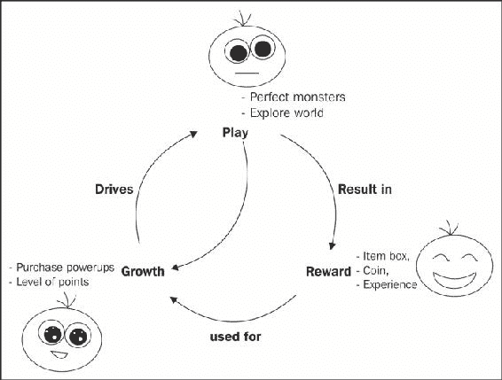

# 前言

所以，你想使用虚幻引擎 4（UE4）自己编写游戏。你有很多理由这样做：

+   UE4 功能强大：UE4 提供了一些最先进、最美丽、最逼真的光照和物理效果，这类效果被 AAA 工作室所使用。

+   UE4 不依赖于特定设备：为 UE4 编写的代码将在 Windows 桌面机器、Mac 桌面机器、Android 设备和 iOS 设备上运行（撰写本书时——未来可能还会支持更多设备）。

因此，你可以使用 UE4 一次性编写游戏的主要部分，之后就可以无缝地部署到 iOS 和 Android 市场。当然，可能会有一些小问题：iOS 和 Android 的应用内购买将需要单独编程。

# 游戏引擎究竟是什么呢？

游戏引擎类似于汽车引擎：游戏引擎是驱动游戏运行的核心。你将告诉引擎你想要什么，然后（使用 C++代码和 UE4 编辑器），引擎将负责实际实现这些功能。

你将围绕 UE4 游戏引擎构建你的游戏，就像车身和车轮围绕实际汽车引擎构建一样。当你使用 UE4 发布游戏时，你基本上是在定制 UE4 引擎，并为其添加你自己的游戏图形、声音和代码。

# 使用 UE4 会花费我多少费用？

简而言之，答案是 19 美元和销售额的 5%。

“什么？”你说。19 美元？

没错。只需 19 美元，你就能获得一个世界级的 AAA 引擎的完全访问权限，包括源代码。考虑到其他引擎仅一个许可证就可能从 500 美元到 1000 美元不等，这真是一个大优惠。

# 我为什么不自己编写引擎并节省 5%的费用呢？

听我的，如果你想在一个合理的时间内创建游戏，而你又没有一支庞大的专业引擎程序员团队来帮助你，你将需要专注于你销售的东西（你的游戏）。

不必专注于编写游戏引擎，这让你有自由去思考如何制作实际的游戏。不必维护和修复你自己的引擎，这也能让你减轻心理负担。

# 游戏概览 – 玩-奖励-增长循环

我现在想展示这张图，因为它包含了一个许多新手开发者可能在编写他们的第一个游戏时可能会错过的核心概念。一个游戏可以包含音效、图形、逼真的物理效果，但仍然感觉不像一个游戏。为什么？



从循环的顶部开始，游戏中进行的 Play 行动（如击败怪物）会给玩家带来奖励（如金币或经验）。这些奖励反过来可以用于游戏内的 Growth（如属性提升或新的世界探索）。这种 Growth 然后以新的和有趣的方式推动游戏玩法。例如，一把新武器可以改变战斗的基本机制，新的咒语让你能够以完全不同的方式对抗一群怪物，或者新的交通方式让你能够到达之前无法到达的区域。

这是创建有趣游戏玩法的基本核心循环。关键是 Play 必须导致某种形式的 Reward——想想那些从讨厌的敌人中跳出来的闪闪发光的金币。为了使奖励有意义，它必须在游戏玩法中导致某种形式的 Growth。想想 *The Legend of Zelda* 中的钩锁解锁了多少新地点。

只有 Play（没有 Rewards 或 Growth）的游戏不会感觉像游戏：它只会感觉像一个非常基础的游戏原型。例如，想象一个只有开放世界、没有目标或任务，以及没有升级飞机或武器能力的飞行模拟器。这不会是一个很好的游戏。

只有 Play 和 Rewards（但没有 Growth）的游戏会感觉原始而简单。如果这些奖励不能用于任何目的，它们将不会满足玩家。

只有 Play 和 Growth（没有 Rewards）的游戏将仅仅被视为一个无意义的增加挑战，不会给玩家带来成就感。

具备所有三个要素的游戏将使玩家在有趣的 Play 中保持参与度。Play 有奖励的结果（掉落物品和故事进展），这导致游戏世界的 Growth。在构思你的游戏时考虑到这一点，将真正帮助你设计一个完整的游戏。

### 小贴士

原型是游戏概念证明。比如说，你想创建自己独特的 *Blackjack* 版本。你可能首先会编写一个原型来展示游戏将如何进行。

## 盈利模式

在你的游戏开发早期需要考虑的是你的盈利策略。你的游戏将如何赚钱？如果你试图创办一家公司，你必须从一开始就考虑你的收入来源。

你是否打算从购买价格中赚钱，例如 *Jamestown*、*The Banner Saga*、*Castle Crashers* 或 *Crypt of the Necrodancer*？或者，你将专注于分发带有内购的免费游戏，例如 *Clash of Clans*、*Candy Crush Saga* 或 *Subway Surfers*？

一类移动设备游戏（例如，iOS 上的建造类游戏）通过允许用户付费跳过 Play，直接进入循环中的奖励和 Growth 部分，赚取了大量收入。这种诱惑可能非常强大；许多人为了一个游戏就花费了数百美元。

## 为什么选择 C++

UE4 是用 C++编写的。要为 UE4 编写代码，你必须了解 C++。

C++是游戏程序员的一个常见选择，因为它提供了非常好的性能与面向对象编程特性的结合。它是一种非常强大且灵活的语言。

# 本书涵盖的内容

第一章，*用 C++编码*，讲述了如何启动并运行你的第一个 C++程序。

第二章，*变量和内存*，讲述了如何从计算机内存中创建、读取和写入变量。

第三章，*If，Else 和 Switch*，讲述了代码的分支：即根据程序条件允许不同的代码部分执行。

第四章，*循环*，讨论了如何重复执行特定的代码块，直到满足所需次数。

第五章，*函数和宏*，讲述了函数，它们是一组可以被多次调用的代码块，你可以按需多次调用。

第六章，*对象、类和继承*，讲述了类定义以及根据类定义实例化一些对象。

第七章，*动态内存分配*，讨论了堆分配的对象以及低级 C 和 C++风格的数组。

第八章，*演员和棋子*，是我们真正深入 UE4 代码的第一章。我们首先创建一个游戏世界来放置演员，并从一个自定义演员中派生出一个`Avatar`类。

第九章，*模板和常用容器*，探讨了 UE4 和 C++ STL 家族的数据集合，称为容器。通常，通过选择正确的容器类型，可以多次简化编程问题。

第十章，*库存系统和拾取物品*，讨论了创建具有拾取新物品能力的库存系统。

第十一章，*怪物*，讲述了如何创建追逐玩家并使用武器攻击的怪物。

第十二章，“魔法书”，教授如何在我们的游戏中创建和施展咒语。

# 您需要为这本书准备什么

要使用此文本，您需要两个程序。第一个是您的集成开发环境，或 IDE。第二个软件当然是 Unreal Engine 本身。

如果您使用的是 Microsoft Windows，那么您将需要 Microsoft Visual Studio 2013 Express Edition for Windows Desktop。如果您使用的是 Mac，那么您将需要 Xcode。可以从[`www.unrealengine.com/`](https://www.unrealengine.com/)下载 Unreal Engine。

# 本书面向对象

这本书是为任何想要编写 Unreal Engine 应用程序的人准备的。文本首先会告诉您如何编译和运行您的第一个 C++应用程序，随后是描述 C++编程语言规则的章节。在介绍性的 C++章节之后，您就可以开始使用 C++构建自己的游戏应用程序了。

# 术语

在这本书中，您将找到许多不同风格的文本，以区分不同类型的信息。以下是一些这些风格的示例及其含义的解释。

文本中的代码单词、数据库表名、文件夹名、文件名、文件扩展名、路径名、虚拟 URL、用户输入和 Twitter 昵称如下所示：“`variableType`将告诉您我们将要存储在变量中的数据类型。`variableName`是我们将用来读取或写入该内存片段的符号”。

代码块设置为如下：

```cpp
struct Player
{
  string name;
  int hp;
  // A member function that reduces player hp by some amount
  void damage( int amount ) {
    hp -= amount;
  }
  void recover( int amount ) {
    hp += amount;
  }
};
```

**新术语**和**重要词汇**以粗体显示。屏幕上出现的文本如下所示：从**文件**菜单中选择**新建项目...**

### 注意

一些相关但有点像旁注的额外信息，出现在这样的框中。

### 提示

技巧和窍门看起来像这样。

# 读者反馈

读者反馈始终欢迎。请告诉我们您对这本书的看法——您喜欢什么或可能不喜欢什么。读者反馈对我们开发您真正从中受益的标题非常重要。

要向我们发送一般反馈，只需发送一封电子邮件到`<feedback@packtpub.com>`，并在邮件主题中提及书名。

如果您在某个领域有专业知识，并且您对撰写或参与一本书感兴趣，请参阅我们的作者指南[www.packtpub.com/authors](http://www.packtpub.com/authors)。

# 客户支持

现在，您已经成为 Packt 书籍的骄傲拥有者，我们有一些事情可以帮助您从您的购买中获得最大收益。

## 下载示例代码

您可以从[`www.packtpub.com`](http://www.packtpub.com)的账户下载您购买的所有 Packt 书籍的示例代码文件。如果您在其他地方购买了这本书，您可以访问[`www.packtpub.com/support`](http://www.packtpub.com/support)并注册，以便将文件直接通过电子邮件发送给您。

## 下载本书的颜色图像

我们还为您提供了一个包含本书中使用的截图/图表的颜色图像的 PDF 文件。这些颜色图像将帮助您更好地理解输出的变化。您可以从 [`www.packtpub.com/sites/default/files/downloads/6572OT_ColoredImages.pdf`](https://www.packtpub.com/sites/default/files/downloads/6572OT_ColoredImages.pdf) 下载此文件。

## 错误

尽管我们已经尽一切努力确保我们内容的准确性，但错误仍然可能发生。如果您在我们的书中发现错误——可能是文本或代码中的错误——如果您能向我们报告这一点，我们将不胜感激。通过这样做，您可以节省其他读者的挫败感，并帮助我们改进本书的后续版本。如果您发现任何错误，请通过访问 [`www.packtpub.com/submit-errata`](http://www.packtpub.com/submit-errata)，选择您的书籍，点击**错误提交表单**链接，并输入您的错误详情来报告它们。一旦您的错误得到验证，您的提交将被接受，错误将被上传到我们的网站，或添加到该标题的“错误”部分下的现有错误列表中。任何现有错误都可以通过从 [`www.packtpub.com/support`](http://www.packtpub.com/support) 选择您的标题来查看。

## 侵权

互联网上版权材料的侵权是一个跨所有媒体的持续问题。在 Packt，我们非常重视我们版权和许可证的保护。如果您在互联网上发现我们作品的任何非法副本，无论形式如何，请立即提供位置地址或网站名称，以便我们可以追究补救措施。

请通过 `<copyright@packtpub.com>` 与我们联系，并提供涉嫌侵权材料的链接。

我们感谢您在保护我们作者和我们提供有价值内容的能力方面的帮助。

## 问题

如果您在本书的任何方面遇到问题，可以通过 `<questions@packtpub.com>` 联系我们，我们将尽力解决。
