# 第一章. 使用 C++ 编程

您是第一次编程。您有很多东西要学！

学术界通常在理论上描述编程概念，但喜欢将实现留给别人，最好是来自行业的人。在这本书中，我们不会这样做——在这本书中，我们将描述 C++ 概念背后的理论，并实现我们自己的游戏。

我首先建议您做练习。您不能仅仅通过阅读来学习编程。您必须通过练习与理论相结合。

我们将首先通过编写非常简单的 C++ 程序来开始编程。我知道您现在就想开始玩您完成的游戏。然而，您必须从开始的地方开始，才能达到那个终点（如果您真的想，可以跳到第十二章，“魔法书”，或者打开一些示例来了解我们将要走向何方）。

在本章中，我们将涵盖以下主题：

+   在 Visual Studio 和 Xcode 中设置新项目

+   您的第一个 C++ 项目

+   如何处理错误

+   什么是构建和编译？

# 设置我们的项目

我们的第一 C++ 程序将在 UE4 之外编写。首先，我将提供 Xcode 和 Visual Studio 2013 的步骤，但在此章之后，我将尝试只谈论 C++ 代码，而不提及您是否使用 Microsoft Windows 或 Mac OS。

## 在 Windows 上使用 Microsoft Visual C++

在本节中，我们将为 Windows 安装一个代码编辑器，即微软的 Visual Studio。如果您使用的是 Mac，请跳到下一节。

### 小贴士

Visual Studio 的 Express 版本是微软在其网站上提供的免费版本。请访问[`www.visualstudio.com/en-us/products/visual-studio-express-vs.aspx`](http://www.visualstudio.com/en-us/products/visual-studio-express-vs.aspx)开始安装过程。

首先，您必须下载并安装**Windows 桌面 Microsoft Visual Studio Express 2013**。这是该软件的图标：

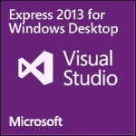

### 小贴士

不要安装**Express 2013 for Windows**。这是一个不同的包，它用于与我们在这里做的事情不同的事情。

一旦您安装了 Visual Studio 2013 Express，请打开它。按照以下步骤操作，以便您可以真正地输入代码：

1.  从**文件**菜单中选择**新建项目...**，如图所示：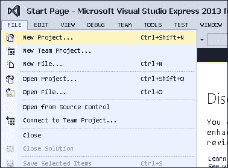

1.  您将看到以下对话框：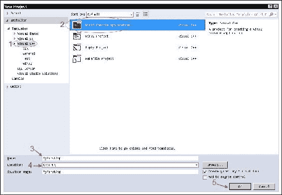

    ### 小贴士

    注意，底部有一个带有文本**解决方案名称**的小框。通常，**Visual Studio 解决方案**可能包含许多项目。然而，本书只与一个项目一起使用，但有时您可能会发现将许多项目集成到同一个解决方案中很有用。

1.  现在，有五件事情需要处理，如下所示：

    1.  从左侧面板中选择**Visual C++**。

    1.  从右侧面板中选择**Win32 控制台应用程序**。

    1.  为你的应用命名（我使用了`MyFirstApp`）。

    1.  选择一个文件夹以保存你的代码。

    1.  点击**确定**按钮。

1.  此后，将打开一个**应用程序向导**对话框，如图所示：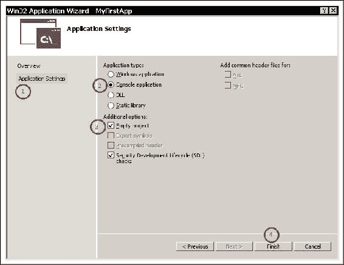

1.  在此对话框中，我们需要注意四件事情，如下所述：

    1.  在左侧面板中点击**应用程序设置**。

    1.  确保已选择**控制台应用程序**。

    1.  选择**空项目**。

    1.  点击**完成**。

现在，你处于 Visual Studio 2013 环境中。这是你将进行所有工作和编写代码的地方。

然而，我们需要一个文件来写入我们的代码。因此，我们将向项目中添加一个 C++代码文件，如图所示：

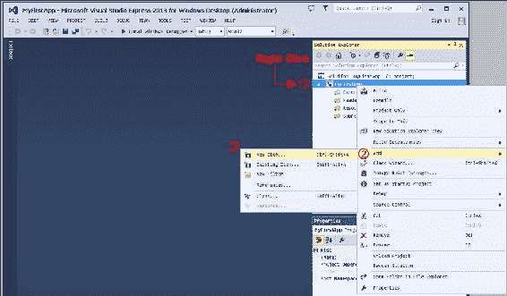

按照以下截图所示添加你的新源代码文件：

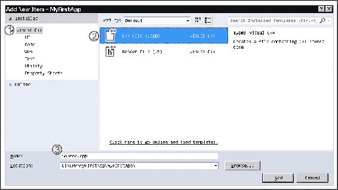

现在，你将编辑`Source.cpp`。跳转到“你的第一个 C++程序”部分并输入你的代码。

## 在 Mac 上使用 XCode

在本节中，我们将讨论如何在 Mac 上安装 Xcode。如果你使用 Windows，请跳到下一节。

Xcode 适用于所有 Mac 机器。你可以通过 Apple App Store 获取 Xcode（它是免费的），如图所示：

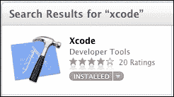

1.  在 Xcode 安装完成后，打开它。然后，从屏幕顶部的系统菜单栏中选择**文件** | **新建** | **项目...**，如图所示：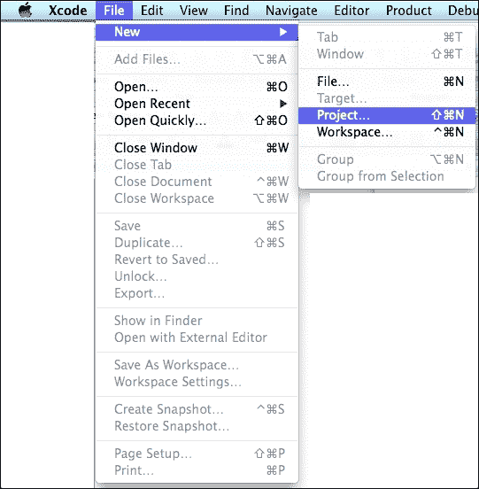

1.  在新建项目对话框中，在屏幕左侧选择**OS X**下的**应用程序**，然后在右侧面板中选择**命令行工具**。然后点击**下一步**：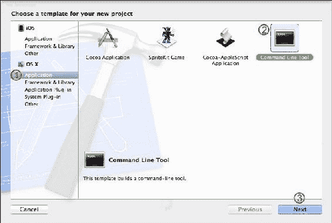

    ### 注意

    你可能会想点击**SpriteKit Game**图标，但不要点击它。

1.  在下一个对话框中，为你的项目命名。确保填写所有字段，否则 Xcode 不会让你继续。确保项目的**类型**设置为**C++**，然后点击**下一步**按钮，如图所示：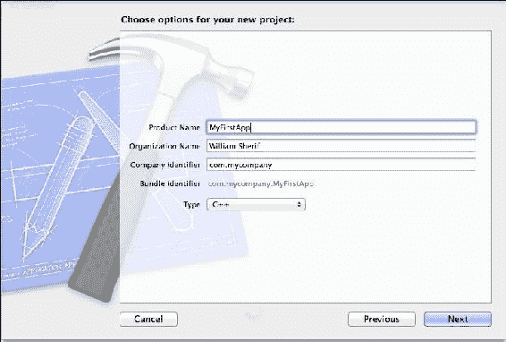

1.  下一个弹出窗口将要求你选择一个位置以保存你的项目。在你的硬盘上选择一个位置并将其保存那里。Xcode 默认为每个创建的项目创建一个 Git 仓库。你可以取消选择**创建 git 仓库**——在本章中我们将不涉及 Git——如图所示：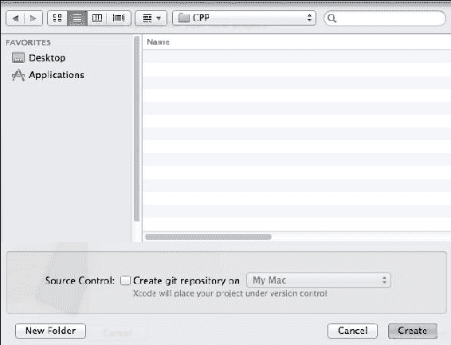

### 小贴士

Git 是一个**版本控制系统**。这基本上意味着 Git 会定期（每次你向仓库*提交*时）保存你项目中所有代码的快照。其他流行的**源代码管理**工具（**scm**）有 Mercurial、Perforce 和 Subversion。当多个人在同一项目上协作时，scm 工具具有自动合并和从仓库复制其他人的更改到本地代码库的能力。

好吧！你已经设置好了。点击 Xcode 左侧面板中的**main.cpp**文件。如果文件没有出现，请确保首先选中左侧面板顶部的文件夹图标，如图所示：

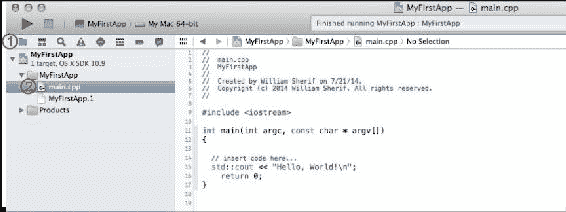

# 创建你的第一个 C++程序

我们现在将要编写一些 C++源代码。之所以称之为源代码，有一个非常好的原因：它是我们构建二进制可执行代码的源头。相同的 C++源代码可以在不同的平台上构建，例如 Mac、Windows 和 iOS，从理论上讲，在每个相应平台上执行相同操作的可执行代码应该会产生相同的结果。

在不久的过去，在 C 和 C++引入之前，程序员为每个他们针对的特定机器单独编写代码。他们用汇编语言编写代码。但现在，有了 C 和 C++，程序员只需编写一次代码，就可以通过将相同的代码发送到不同的编译器来部署到多个不同的机器上。

### 提示

实际上，Visual Studio 的 C++版本和 Xcode 的 C++版本之间有一些差异，但这些差异主要出现在处理高级 C++概念，如模板时。

使用 UE4 的一个主要好处是 UE4 将消除 Windows 和 Mac 之间的许多差异。UE4 团队做了很多魔法，以便相同的代码可以在 Windows 和 Mac 上运行。

### 注意

**一个实用的技巧**

代码在所有机器上以相同的方式运行非常重要，特别是对于网络游戏或允许分享重放等功能的游戏。这可以通过使用标准来实现。例如，IEEE 浮点标准用于在所有 C++编译器上实现十进制数学。这意味着计算结果如`200 * 3.14159`应该在所有机器上相同。

在 Microsoft Visual Studio 或 Xcode 中编写以下代码：

```cpp
#include <iostream>  // Import the input-output library
using namespace std; // allows us to write cout
                     // instead of std::cout
int main()
{
  cout << "Hello, world" << endl;
  cout << "I am now a C++ programmer." << endl;
  return 0;      // "return" to the operating sys
}
```

按*Ctrl* + *F5*在 Visual Studio 中运行前面的代码，或者在 Xcode 中按 + *R* 运行。

你第一次在 Visual Studio 中按*Ctrl* + *F5*时，你会看到这个对话框：

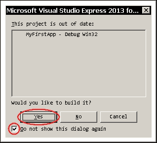

选择**是**和**不再显示此对话框**——相信我，这将避免未来的问题。

你可能首先想到的是，“哇！一大堆乱七八糟的东西！”

的确，你很少在正常的英语文本中看到哈希符号（#）的使用（除非你在使用 Twitter）和花括号对`{}`。然而，在 C++代码中，这些奇怪的符号到处都是。你只需要习惯它们。

因此，让我们从第一行开始解释这个程序。

这是程序的第一行：

```cpp
#include <iostream>  // Import the input-output library
```

这一行有两个需要注意的重要点：

1.  我们看到的第一件事是`#include`语句。我们要求 C++复制并粘贴另一个名为`<iostream>`的 C++源文件的内容，直接到我们的代码文件中。《iostream》是一个标准的 C++库，它处理所有让我们能够打印文本到屏幕的粘性代码。

1.  我们注意到的第二件事是`//`注释。C++会忽略双斜杠(`//`)之后直到该行结束的任何文本。注释非常有用，可以添加对某些代码的纯文本解释。你可能在源代码中看到`/* */`风格的 C 风格注释。在 C 或 C++中将任何文本用反斜杠星号`/*`和星号反斜杠`*/`包围，会给编译器一个指令，让这段代码被移除。

这是下一行代码：

```cpp
using namespace std; // allows us to write cout
                     // instead of std::cout
```

这行旁边的注释解释了`using`语句的作用：它只是让你可以使用缩写（例如，`cout`），而不是使用完全限定的名称（在这个例子中，将是`std::cout`）来代替我们许多 C++代码命令。有些人不喜欢`using namespace std;`语句；他们更喜欢每次想要使用`cout`时都写`std::cout`。你可能会因为这类事情而陷入长篇大论。在本节文本中，我们更喜欢`using namespace` `std;`语句带来的简洁性。

这是下一行：

```cpp
int main()
```

这是应用程序的起点。你可以把`main`看作是比赛中的起点线。`int main()`语句是 C++程序知道从哪里开始的方式；看看下面的图：


如果你没有`int main()`程序标记，或者`main`拼写错误，那么你的程序将无法工作，因为程序将不知道从哪里开始。

下一行是一个你不太常见的字符：

```cpp
{
```

这个`{`字符不是一个侧面的胡须。它被称为花括号，它表示你程序的起点。

接下来的两行将文本打印到屏幕上：

```cpp
cout << "Hello, world" << endl;
cout << "I am now a C++ programmer." << endl;
```

`cout`语句代表控制台输出。双引号之间的文本将以与引号内完全相同的方式输出到控制台。你可以在双引号之间写任何你想要的内容，除了双引号本身，它仍然会是有效的代码。

### 提示

要在双引号之间输入一个双引号，你需要在你想放在字符串中的双引号字符前面加上一个反斜杠(`\`)，如下所示：

```cpp
cout << "John shouted into the cave \"Hello!\" The cave echoed."
```

反斜杠(`\`)符号是一个转义序列的例子。还有其他你可以使用的转义序列；你将最常找到的转义序列是`\n`，它用于将文本输出跳转到下一行。

程序的最后一行是`return`语句：

```cpp
return 0;
```

这行代码表示 C++程序正在退出。你可以把`return`语句看作是返回到操作系统。

最后，你的程序结束的标志是闭合的花括号，它是一个反向的侧脸八字胡：

```cpp
}
```

## 分号

分号（;）在 C++编程中很重要。注意在前面的代码示例中，大多数代码行都以分号结束。如果你不每行都加上分号，你的代码将无法编译，如果发生这种情况，你可能会被解雇。

## 处理错误

如果你输入代码时出错，那么你将会有语法错误。面对语法错误，C++会发出惨叫，你的程序甚至无法编译；同样，它也无法运行。

让我们尝试在我们的早期 C++代码中插入几个错误：

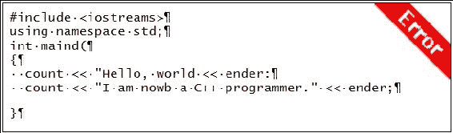

警告！此代码列表包含错误。找出所有错误并修复它们是一个很好的练习！

作为练习，尝试找出并修复这个程序中的所有错误。

### 注意

注意，如果你对 C++非常不熟悉，这个练习可能很难。然而，这将向你展示在编写 C++代码时你需要多么小心。

修复编译错误可能是一件棘手的事情。然而，如果你将这个程序的文本输入到你的代码编辑器中并尝试编译它，它将导致编译器向你报告所有错误。一次修复一个错误，然后尝试重新编译。新的错误将出现，或者程序将正常工作，如以下截图所示：

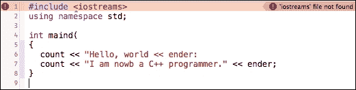

Xcode 在你尝试编译代码时显示你的代码中的错误

我向你展示这个示例程序是为了鼓励以下工作流程，只要你对 C++不熟悉：

1.  总是从一个工作的 C++代码示例开始。你可以从“你的第一个 C++程序”部分分叉出许多新的 C++程序。

1.  逐步修改你的代码。当你刚开始时，每写完一行新代码就编译一次。不要连续编码一两个小时，然后一次性编译所有新代码。

1.  你可能需要几个月的时间才能写出第一次编写时就能按预期运行的代码。不要气馁。学习编码是件有趣的事情。

## 警告

编译器会标记出它认为可能是错误的地方。这些都是另一类编译器通知，被称为警告。警告是代码中的问题，你不必修复它们代码就能运行，但编译器建议修复。警告通常是代码不够完美的指示，修复代码中的警告通常被认为是良好的实践。

然而，并非所有的警告都会导致你的代码出现问题。一些程序员更喜欢禁用他们认为不是问题的警告（例如，警告 4018 警告有符号/无符号不匹配，你很可能稍后看到）。

# 什么是构建和编译？

您可能听说过一个计算机术语叫做编译。编译是将您的 C++ 程序转换成可以在 CPU 上运行的代码的过程。构建您的源代码与编译它意味着同一件事。

看看，您的源代码文件 `code.cpp` 实际上不能在计算机上运行。它必须先编译，才能运行。

这正是使用 Microsoft Visual Studio Express 或 Xcode 的全部意义。Visual Studio 和 Xcode 都是编译器。您可以在任何文本编辑程序中编写 C++ 源代码——甚至可以在记事本中。但您需要一个编译器才能在您的机器上运行它。

每个操作系统通常都有一个或多个可以编译 C++ 代码以在该平台上运行的 C++ 编译器。在 Windows 上，您有 Visual Studio 和 Intel C++ Studio 编译器。在 Mac 上，有 Xcode，在所有 Windows、Mac 和 Linux 上，有 **GNU 编译器集合**（**GCC**）。

我们编写的相同 C++ 代码（源代码）可以使用不同操作系统的不同编译器进行编译，理论上，它们应该产生相同的结果。能够在不同平台上编译相同代码的能力称为可移植性。一般来说，可移植性是好事。

## 脚本语言

另有一类编程语言称为脚本语言。这些包括 PHP、Python 和 ActionScript 等语言。脚本语言不进行编译——对于 JavaScript、PHP 和 ActionScript，没有编译步骤。相反，它们在程序运行时从源代码进行解释。脚本语言的好处是，它们通常一开始就是平台无关的，因为解释器被精心设计成平台无关的。

### 练习 – ASCII 艺术字

游戏程序员喜欢 ASCII 艺术字。你可以只用字符来绘制一幅图画。以下是一个 ASCII 艺术字迷宫的例子：

```cpp
cout << "****************" << endl;
cout << "*............*.*" << endl;
cout << "*.*.*******..*.*" << endl;
cout << "*.*.*..........*" << endl;
cout << "*.*.*.**********" << endl;
cout << "***.***........*" << endl;
```

使用 C++ 代码构建您自己的迷宫，或者用字符绘制一幅图画。

# 总结

总结一下，我们在我们的集成开发环境（IDE，Visual Studio 或 Xcode）中学习了如何编写我们的第一个 C++ 程序。这是一个简单的程序，但您应该把第一次让程序编译并运行视为您的第一个胜利。在接下来的章节中，我们将构建更复杂的程序，并开始为我们的游戏使用 Unreal Engine。

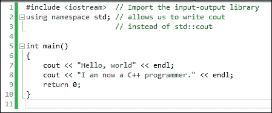

上述截图是您的第一个 C++ 程序，下方的截图是它的输出，您的第一个胜利：

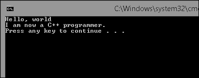
