# 第二章。变量和内存

要编写你的 C++游戏程序，你的计算机需要记住很多事情。比如玩家在世界中的位置、他的生命值、剩余的弹药量、世界中的物品位置、它们提供的升级以及组成玩家屏幕名称的字母。

你所拥有的计算机内部实际上有一个称为*内存*或 RAM 的电子草图板。从物理上看，计算机内存是由硅制成的，其外观与以下截图所示类似：

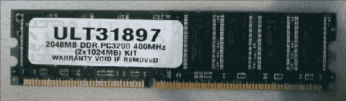

这 RAM 看起来像停车场吗？因为这就是我们要用的比喻

RAM 是随机访问内存的缩写。它被称为随机访问，因为你可以随时访问它的任何部分。如果你还留着一些 CD，它们是非随机访问的例子。CD 的设计是按顺序读取和播放的。我还记得在 CD 切换曲目需要花费很多时间的时候，在迈克尔·杰克逊的*危险*专辑上跳转曲目！然而，在 RAM 的不同单元格之间跳转并不需要花费太多时间。RAM 是一种快速内存访问类型，称为闪存。

RAM 被称为易失性闪存，因为当计算机关闭时，RAM 的内容会被清除，除非它们之前被保存到硬盘上，否则 RAM 的旧内容会丢失。

对于永久存储，你必须将你的数据保存到硬盘上。主要有两种硬盘类型，基于盘片的**硬盘驱动器**（**HDDs**）和**固态驱动器**（**SSDs**）。与基于盘片的 HDDs 相比，SSDs 更现代，因为它们使用 RAM 的快速访问（闪存）原理。然而，与 RAM 不同的是，SSD 上的数据在计算机关闭后仍然存在。如果你能获得 SSD，我强烈建议你使用它！基于盘片的驱动器已经过时了。我们需要一种方法在 RAM 上预留空间并从中读取和写入。幸运的是，C++使这变得很容易。

# 变量

计算机内存中可以读取或写入的保存位置被称为*变量*。

变量是一个其值可以变化的组件。在计算机程序中，你可以将变量视为一个容器，你可以将一些数据存储在其中。在 C++中，这些数据容器（变量）有类型。你必须使用正确的数据容器类型来保存你的程序中的数据。

如果你想要保存一个整数，比如 1、0 或 20，你将使用`int`类型的容器。你可以使用浮点类型容器来携带浮点（小数）值，比如 38.87，你也可以使用字符串变量来携带字母字符串（可以将其视为“珍珠串”，其中每个字母都是一个珍珠）。

你可以将你的预留 RAM 空间想象成在停车场预留停车位：一旦我们声明了变量并为其获取了一个位置，操作系统就不会将那块 RAM 分配给其他人（甚至不是在同一台机器上运行的另一个程序）。你的变量的 RAM 旁边可能未被使用，或者可能被其他程序使用。

### 小贴士

操作系统存在是为了防止程序相互干扰，同时访问相同的计算机硬件位。一般来说，公民计算机程序不应该读取或写入彼此的内存。然而，一些类型的作弊程序（例如，地图作弊）秘密访问您的程序内存。为了防止在线游戏中的作弊，引入了像 PunkBuster 这样的程序。

## 声明变量 – 触摸硅

使用 C++在计算机内存中预留位置很容易。我们希望用一个好的、描述性的名称来命名我们将存储数据的内存块。

例如，假设我们知道玩家的**生命值**（**hp**）将是一个整数（整体）数，例如 1、2、3 或 100。为了在内存中存储玩家的 hp，我们将声明以下代码行：

```cpp
int hp;     // declare variable to store the player's hp
```

这行代码为存储整数（`int`代表整数）的内存块预留了一小块 RAM，称为 hp。以下是我们用于存储玩家 hp 的 RAM 块示例。这在我们内存中的所有停车位中为我们预留了一个停车位，我们可以通过其标签（hp）来引用这个内存空间。

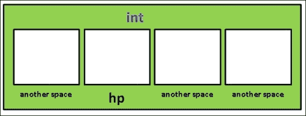

在内存中的所有其他空间中，我们得到一个位置来存储我们的 hp 数据

注意，在这个图中变量空间被标记为**int**：如果它是一个用于 double 或其他类型变量的空间。C++不仅通过名称，还通过变量的类型来记住您在内存中为程序预留的空间。

注意，我们还没有在 hp 的框中放入任何东西！我们稍后会做这件事——现在，hp 变量的值尚未设置，因此它将保留前一个占用者（可能是另一个程序留下的值）在该停车位上的值。告诉 C++变量的类型很重要！稍后，我们将声明一个变量来存储小数值，例如 3.75。

### 在内存中读取和写入您的预留位置

将值写入内存很容易！一旦你有一个`hp`变量，你只需使用`=`符号写入它：

```cpp
hp = 500;
```

哇！玩家有 500 hp。

读取变量同样简单。要打印变量的值，只需这样做：

```cpp
cout << hp << endl;
```

这将打印出存储在 hp 变量中的值。如果你更改了 hp 的值，然后再次使用`cout`，将打印出最新的值，如下所示：

```cpp
hp = 1200;
cout << hp << endl; // now shows 1200
```

## 数字是一切

当你开始学习计算机编程时，你需要习惯的是，许多东西都可以以数字的形式存储在计算机内存中。玩家的 hp？正如我们在上一节中看到的，hp 可以只是一个整数。如果玩家受伤，我们就减少这个数字。如果玩家恢复健康，我们就增加这个数字。

颜色也可以存储为数字！如果你使用过标准的图像编辑程序，通常会有表示颜色的滑块，指示使用多少红色、绿色和蓝色，例如 Pixelmator 的颜色滑块。颜色由三个数字表示。以下屏幕截图显示的紫色颜色是（R=127，G=34，B=203）：

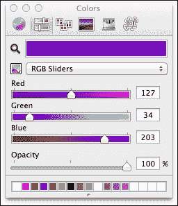

那么，关于世界几何呢？这些也只是数字：我们只需要存储一个包含 3D 空间点（x、y 和 z 坐标）的列表，然后存储另一个解释这些点如何连接形成三角形的点的列表。在下面的屏幕截图中，我们可以看到如何使用 3D 空间点来表示世界几何：

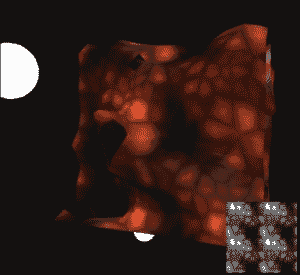

颜色和 3D 空间点的数字组合将让你在你的游戏世界中绘制出大型的彩色景观。

前面示例中的技巧在于我们如何解释存储的数字，以便我们可以让它们代表我们想要它们代表的意义。

## 更多关于变量的内容

你可以把变量想象成动物携带的箱子。猫携带箱可以用来携带猫，但不能用来携带狗。同样，你应该使用浮点型变量来携带带有小数点的数字。如果你在`int`变量中存储小数值，它将不会适合：

```cpp
int x = 38.87f;
cout << x << endl; // prints 38, not 38.87
```

实际上这里发生的事情是 C++对 38.87 进行自动类型转换，*将其转换为一个整数以适应`int`存储空间。它丢弃小数点，将 38.87 转换为整数值 38。

例如，我们可以修改代码以包含三种类型变量的使用，如下面的代码所示：

```cpp
#include <iostream>
#include <string>  // need this to use string variables!
using namespace std;
int main()
{
  string name;
  int goldPieces;
  float hp;
  name = "William"; // That's my name
  goldPieces = 322; // start with this much gold 
  hp = 75.5f;       // hit points are decimal valued
  cout << "Character " << name << " has " 
           << hp << " hp and " 
           << goldPieces << " gold.";
}
```

在前三行中，我们声明了三个盒子来存储我们的数据部分，如下所示：

```cpp
string name;
int goldPieces;
float hp;
```

这三行在内存中预留了三个位置（就像停车位一样）。接下来的三行将变量填充为我们想要的值，如下所示：

```cpp
name = "William";
goldPieces = 322;
hp = 75.5f;
```

在计算机内存中，这看起来如下面的图所示：

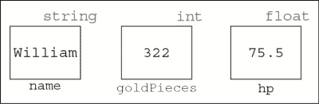

你可以随时更改变量的内容。你可以使用`=`赋值运算符来写入变量，如下所示：

```cpp
goldPieces = 522;// = is called the "assignment operator"
```

你也可以在任何时候读取变量的内容。这就是下面三行代码所做的事情，如下所示：

```cpp
cout << "Character " << name << " has " 
     << hp << " hp and " 
     << goldPieces << " gold.";
```

看看这一行：

```cpp
cout << "I have " << hp << " hp." << endl;
```

在这一行中，`hp`一词有两种用法。一种是在双引号之间，另一种则不是。双引号之间的单词总是按照你输入的方式精确输出。当不使用双引号时（例如，`<< hp <`），将执行变量查找。如果变量不存在，则你会得到编译器错误（未声明的标识符）。

内存中有一个为名称分配的空间，一个为玩家拥有的`goldPieces`数量分配的空间，以及一个为玩家生命值`hp`分配的空间。

### 提示

通常，你应该始终尝试在正确的变量中存储正确的数据类型。如果你不小心存储了错误的数据类型，你的代码可能会出现异常行为。

## C++中的数学

C++中的数学运算很容易；+ (加)，- (减)，* (乘)，/ (除)都是常见的 C++操作，并且将遵循正确的 BEDMAS 顺序（括号，指数，除法，乘法，加法，减法）。例如，我们可以像以下代码所示进行操作：

```cpp
int answer = 277 + 5 * 4 / 2 + 20;
```

你可能还不熟悉另一个运算符：% (取模)。取模（例如，10 % 3）找到当`x`除以`y`时的余数。以下表格中有示例：

| 运算符（名称） | 示例 | 答案 |
| --- | --- | --- |
| + (加) | 7 + 3 | 10 |
| - (减) | 8 - 5 | 3 |
| * (乘) | 5*6 | 30 |
| / (除) | 12/6 | 2 |
| % (取模) | 10 % 3 | 1 (因为 10 除以 3 等于 3，余数=1)。 |

然而，我们通常不希望以这种方式进行数学运算。相反，我们通常希望通过一定的计算量来改变变量的值。这是一个较难理解的概念。比如说，玩家遇到了一个恶魔并受到了 15 点伤害。

以下代码行将用于减少玩家的生命值 15 点（信不信由你）：

```cpp
hp = hp - 15;                  // probably confusing :)
```

你可能会问为什么。因为在右侧，我们正在计算 hp 的新值（hp-15）。在找到 hp 的新值（比之前少 15）后，新值将被写入 hp 变量。

### 提示

**陷阱**

一个未初始化的变量具有它在内存中之前所持有的位模式。声明一个变量不会清除内存。所以，假设我们使用了以下代码行：

```cpp
int hp;
hp = hp - 15;
```

第二行代码从其之前的值中减少了 15 点生命值。如果我们从未设置 hp = 100 或类似值，它的前一个值是多少？它可能是 0，但并不总是这样。

最常见的错误之一是在未初始化变量之前就使用它。

以下是一个进行此操作的缩写语法：

```cpp
hp -= 15;
```

除了`-=`之外，您还可以使用`+=`向变量添加一些量，使用`*=`将变量乘以一个量，使用`/=`将变量除以一个量。

### 练习

执行以下操作后，写下`x`的值；然后，与您的编译器进行核对：

| 练习 | 答案 |
| --- | --- | --- |
| `int x = 4; x += 4;` | 8 |
| `int x = 9; x-=2;` | 7 |
| `int x = 900; x/=2;` | 450 |
| `int x = 50; x*=2;` | 100 |
| `int x = 1; x += 1;` | 2 |
| `int x = 2; x -= 200;` | -198 |
| `int x = 5; x*=5;` | 25 |

## 通用变量语法

在上一节中，你学习了在 C++中保存的每份数据都有一个类型。所有变量都是以相同的方式创建的；在 C++中，变量声明形式如下：

```cpp
variableType variableName;
```

`variableType`告诉我们我们将要存储在变量中的数据类型。`variableName`是我们将用于读取或写入该内存块的符号。

## 原始类型

我们之前讨论了计算机内部的所有数据最终都将是数字。你的计算机代码负责正确解释这个数字。

据说 C++ 只定义了几个基本数据类型，如下表所示：

| `Char` | 一个单独的字母，例如 'a'、'b' 或 '+' |
| --- | --- |
| `Short` | 从 -32,767 到 +32,768 的整数 |
| `Int` | 从 -2,147,483,647 到 +2,147,483,648 的整数 |
| `Float` | 从约 -1x10³⁸ 到 1x10³⁸ 的任何十进制值 |
| `Double` | 从约 -1x10³⁰⁸ 到 1x10³⁰⁸ 的任何十进制值 |
| `Bool` | true 或 false |

前表中所提到的每种变量类型都有无符号版本。无符号变量可以包含自然数，包括 0（x >= 0）。例如，无符号 `short` 可能的值在 0 到 65535 之间。

### 注意

如果你进一步对 float 和 double 之间的区别感兴趣，请随时在互联网上查找。我将只解释最重要的用于游戏的 C++ 概念。如果你对这个文本中涵盖的某件事感到好奇，请随时查找。

结果表明，这些简单的数据类型本身就可以用来构建任意复杂的程序。“怎么做到的？”你可能会问。仅使用浮点数和整数构建 3D 游戏难道不难吗？

从浮点数和整数构建游戏并不真的很难，但更复杂的数据类型会有帮助。如果我们使用松散的浮点数来表示玩家的位置，编程将会变得繁琐且混乱。

## 对象类型

C++ 提供了结构来将变量分组在一起，这将使你的生活更加轻松。以下是一段代码示例：

```cpp
#include <iostream>
using namespace std;
struct Vector        // BEGIN Vector OBJECT DEFINITION
{
  float x, y, z;     // x, y and z positions all floats
};                   // END Vector OBJECT DEFINITION.
// The computer now knows what a Vector is
// So we can create one.
int main()
{
  Vector v; // Create a Vector instance called v
  v.x=20, v.y=30, v.z=40; // assign some values
  cout << "A 3-space vector at " << v.x << ", " << v.y << ", " <<  v.z << endl;
}
```

这在内存中的样子非常直观；Vector 只是一个包含三个浮点数的内存块，如图所示。

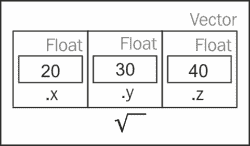

### 提示

不要混淆前一个截图中的 struct Vector 与 STL 的 `std::vector`。上面的 Vector 对象旨在表示一个三维向量，而 STL 的 `std::vector` 类型表示一个值的固定大小集合。

这里有一些关于前面代码列表的复习笔记：

首先，甚至在我们在使用我们的 Vector 对象类型之前，我们必须定义它。C++ 并没有内置的数学向量类型（它只支持标量数，他们认为这已经足够了！）。因此，C++ 允许你构建自己的对象结构，使你的生活更轻松。我们首先有以下定义：

```cpp
struct Vector        // BEGIN Vector OBJECT DEFINITION
{
  float x, y, z;     // x, y, and z positions all floats
};                   // END Vector OBJECT DEFINITION.
```

这告诉计算机什么是 Vector（它是 3 个浮点数，所有这些都被声明为在内存中相邻）。Vector 在内存中的样子如图所示。

接下来，我们使用我们的 Vector 对象定义来创建一个名为 `v` 的 Vector 实例：

```cpp
Vector v; // Create a Vector instance called v
```

`struct` Vector 定义实际上并没有创建一个 Vector 对象。你不能做`Vector.x = 1`。"你在谈论哪个对象实例？" C++编译器会问。你需要首先创建一个 Vector 实例，例如 Vector v1; 然后，你可以在 v1 实例上执行赋值，例如 v1.x = 0。

我们然后使用这个实例将值写入`v`：

```cpp
v.x=20, v.y=30, v.z=40; // assign some values
```

### 小贴士

在前面的代码中，我们使用了逗号来初始化同一行上的多个变量。这在 C++中是可以的。虽然你可以将每个变量单独放在一行上，但这里展示的方法也是可以的。

这使得`v`看起来像前面的截图。然后，我们打印它们：

```cpp
cout << "A 3-space vector at " << v.x << ", " << v.y << ", " <<  v.z << endl;
```

在这里的两行代码中，我们通过简单地使用点（`.`）访问对象内的单个数据成员。`v.x`指的是对象`v`内的`x`成员。每个 Vector 对象将正好包含三个浮点数：一个叫`x`，一个叫`y`，一个叫`z`。

### 练习 – Player

定义一个用于 Player 对象的 C++数据结构。然后，创建你的 Player 类的一个实例，并填充每个数据成员的值。

#### 解决方案

让我们声明我们的 Player 对象。我们希望将所有与玩家相关的代码组合到 Player 对象中。我们这样做是为了使代码整洁有序。你在 Unreal Engine 中看到的代码将到处使用这样的对象；所以，请注意：

```cpp
struct Player
{
  string name;
  int hp;
  Vector position;
}; // Don't forget this semicolon at the end!
int main()
{
  // create an object of type Player,
  Player me; // instance named 'me'
  me.name = "William";
  me.hp = 100.0f;
  me.position.x = me.position.y = me.position.z=0;
}
```

结构 Player 定义告诉计算机 Player 对象在内存中的布局方式。

### 小贴士

我希望你们注意到了结构声明末尾的强制分号。结构对象声明需要在末尾有一个分号，但函数不需要。这只是你必须记住的 C++规则。

在 Player 对象内部，我们声明了一个用于玩家名称的字符串，一个用于 hp 的浮点数，以及一个用于玩家完整 xyz 位置的 Vector 对象。

当我说对象时，我指的是 C++结构（或者稍后，我们将介绍术语类）。

等等！我们在 Player 对象中放了一个 Vector 对象！是的，你可以这样做。

在定义了 Player 对象内部有什么之后，我们实际上创建了一个名为 me 的 Player 对象实例，并给它赋了一些值。

在赋值之后，me 对象看起来如下所示：

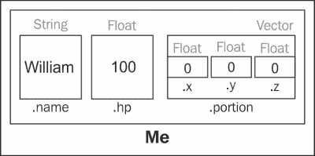

## 指针

一个特别难以理解的概念是指针的概念。指针并不难理解，但可能需要一段时间才能牢固掌握。

假设我们之前已经在内存中声明了一个类型为 Player 的变量：

```cpp
Player me;
me.name = "William";
me.hp = 100.0f;
```

我们现在声明一个指向 Player 的指针：

```cpp
Player* ptrMe;               // Declaring a pointer
```

`*`字符通常使事物变得特殊。在这种情况下，`*`使`ptrMe`变得特殊。`*`是使`ptrMe`成为指针类型的原因。

我们现在想将`ptrMe`链接到 me：

```cpp
ptrMe = &me;                  // LINKAGE
```

### 小贴士

这个链接步骤非常重要。如果你在使用指针之前没有将指针链接到对象，你将得到一个内存访问违规。

`ptrMe`现在指向与 me 相同的对象。改变`ptrMe`将改变 me，如下面的图所示：

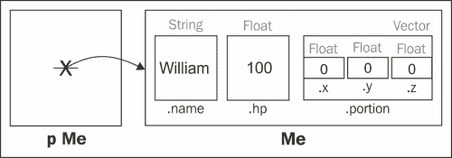

## 指针能做什么？

当我们设置指针变量和它所指向的内容之间的链接时，我们可以通过指针来操作所指向的变量。

指针的一个用途是从代码的几个不同位置引用同一个对象。`Player` 对象是很好的候选对象。你可以为同一个对象创建任意数量的指针。被指向的对象不一定知道它们被指向，但可以通过指针对对象进行更改。

例如，假设玩家受到了攻击。他的 hp 会减少，这个减少将通过指针来完成，如图所示代码：

```cpp
ptrMe->hp -= 33;      // reduced the player's hp by 33
ptrMe->name = "John";// changed his name to John
```

现在看看 `Player` 对象的当前样子：

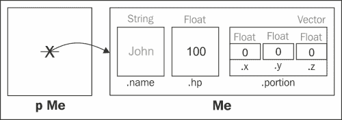

因此，我们通过改变 `ptrMe->name` 来改变 `me.name`。因为 `ptrMe` 指向 `me`，通过 `ptrMe` 的更改会直接影响 `me`。

除了有趣的箭头语法（当变量是指针时使用 `->`），这个概念并不难理解。

## 地址运算符 &

注意前面代码示例中 `&` 符号的使用。`&` 运算符获取变量的内存地址。变量的内存地址是它在计算机内存空间中的位置。C++ 能够获取程序内存中任何对象的内存地址。变量的地址是唯一的，也是随机的。

假设我们打印一个整型变量 `x` 的地址，如下所示：

```cpp
int x = 22;
cout << &x << endl; // print the address of x
```

在程序第一次运行时，我的电脑打印了以下内容：

```cpp
0023F744
```

这个数字（`&x` 的值）只是变量 `x` 存储的内存单元。这意味着在这个特定的程序启动中，变量 `x` 位于内存单元编号 0023F744，如图所示：

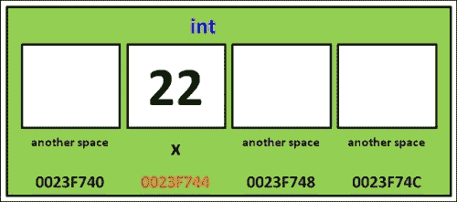

现在，创建并分配一个指针变量到 `x` 的地址：

```cpp
int *px;
px = &x;
```

我们在这里做的是将变量 `x` 的内存地址存储在变量 `px` 中。所以，我们用另一个叫做 `px` 的不同变量来隐喻地指向变量 `x`。这看起来可能和下面图示的类似：

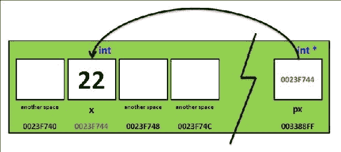

在这里，变量 `px` 包含了变量 `x` 的地址。换句话说，变量 `px` 是另一个变量的引用。对 `px` 进行求差（即访问 `px` 所引用的变量）是通过使用 `*` 符号来完成的：

```cpp
cout << *px << endl;
```

### 空指针

空指针是一个值为 `0` 的指针变量。一般来说，大多数程序员喜欢在创建新的指针变量时将其初始化为空（`0`）。计算机程序通常不能访问内存地址 `0`（它是保留的），所以如果你尝试引用空指针，你的程序将会崩溃，如图所示：

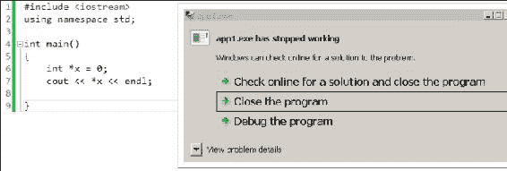

### 提示

Pointer Fun with Binky 是一个关于指针的有趣视频。看看 [`www.youtube.com/watch?v=i49_SNt4yfk`](http://www.youtube.com/watch?v=i49_SNt4yfk)。

## cin

`cin` 是 C++ 传统的从用户输入到程序的方式。`cin` 很容易使用，因为它在放置值时会查看将要放入的变量的类型。例如，如果我们想询问用户的年龄并将其存储在一个 `int` 变量中，我们可以这样做：

```cpp
cout << "What is your age?" << endl;
int age;
cin >> age;
```

## printf()

虽然我们到目前为止已经使用了 `cout` 来打印变量，但你需要了解另一个常用的用于打印到控制台的功能。这个功能被称为 `printf` 函数。`printf` 函数包含在 `<iostream>` 库中，所以你不需要额外 `#include` 任何内容来使用它。游戏行业的一些人更喜欢使用 `printf` 而不是 `cout`（我知道我就是这样），所以让我们来介绍它。

让我们继续了解 `printf()` 的工作原理，如下面的代码所示：

```cpp
#include <iostream>
#include <string>
using namespace std;
int main()
{
  char character = 'A';
  int integer = 1;
  printf( "integer %d, character %c\n", integer, character );
}
```

### 小贴士

**下载示例代码**

你可以从你购买的所有 Packt 出版物书籍的账户中下载示例代码文件 [`www.packtpub.com`](http://www.packtpub.com)。如果你在其他地方购买了这本书，你可以访问 [`www.packtpub.com/support`](http://www.packtpub.com/support) 并注册以直接将文件通过电子邮件发送给你。

我们从一个格式字符串开始。格式字符串就像一个画框，变量将会被插入到格式字符串中 `%` 的位置。然后，整个内容会被输出到控制台。在上面的例子中，整数变量将被插入到第一个 `%` (`%d`) 的位置，字符将被插入到第二个 `%` (`%c`) 的位置，如下面的截图所示：

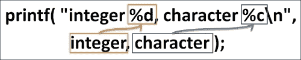

你必须使用正确的格式代码才能正确地格式化输出；请查看以下表格：

| 数据类型 | 格式代码 |
| --- | --- |
| 整数 | %d |
| 字符 | %c |
| 字符串 | %s |

要打印 C++ 字符串，你必须使用 `string.c_str()` 函数：

```cpp
string s = "Hello";
printf( "string %s\n", s.c_str() );
```

`s.c_str()` 函数访问 `printf` 所需的 C 字符串指针。

如果你使用错误的格式代码，输出可能不会正确显示，或者程序可能会崩溃。

### 练习

询问用户的姓名和年龄，并使用 `cin` 读取它们。然后，使用 `printf()`（而不是 `cout`）在控制台为他发出问候。

### 解决方案

这就是程序的外观：

```cpp
#include <iostream>
#include <string>
using namespace std;
int main()
{
  cout << "Name?" << endl;
  string name;
  cin >> name;
  cout << "Age?" << endl; 
  int age;
  cin >> age;
  cout << "Hello " << name << " I see you have attained " << age  << " years. Congratulations." << endl;
}
```

### 小贴士

字符串实际上是一种对象类型。里面只是一堆字符！

# 摘要

在本章中，我们讨论了变量和内存。我们讨论了变量上的数学运算以及它们在 C++ 中的简单性。

我们还讨论了如何使用这些更简单的数据类型（如浮点数、整数和字符）的组合来构建任意复杂的数据类型。这种构建称为对象。
