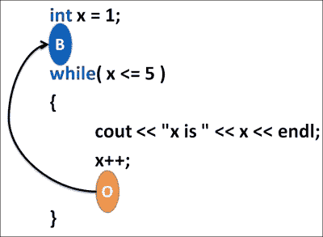
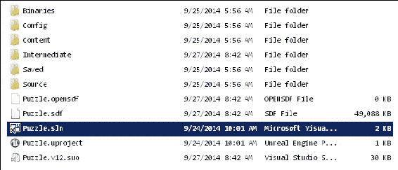
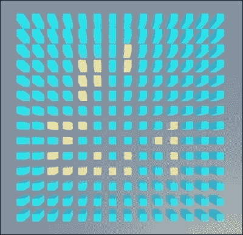

# 第四章：循环

在上一章中，我们讨论了`if`语句。`if`语句允许你在代码块的执行上设置条件。

在本章中，我们将探讨循环，这是一种代码结构，它允许你在满足某些条件下重复执行一段代码。一旦条件变为假，我们就停止重复执行该代码块。

在本章中，我们将探讨以下主题：

+   当循环

+   Do/while 循环

+   For 循环

+   Unreal Engine 中一个实用的循环示例

# While 循环

`while`循环用于重复执行代码的一部分。如果你有一系列必须重复执行以实现某个目标的操作，这非常有用。例如，以下代码中的`while`循环会重复打印变量`x`的值，随着`x`从 1 增加到 5：

```cpp
int x = 1;
while( x <= 5 ) // may only enter the body of the while when x<=5
{
  cout << "x is " << x << endl;
  x++;
}
cout << "Finished" << endl;
```

这是前面程序的输出：

```cpp
x is 1
x is 2
x is 3
x is 4
x is 5
Finished
```

在代码的第一行，创建了一个整数变量`x`并将其设置为 1。然后，我们进入`while`条件。`while`条件表示，只要`x`小于或等于 5，就必须停留在随后的代码块中。

循环的每次迭代（迭代意味着绕循环走一圈）都会从任务中完成更多的工作（打印数字 1 到 5）。我们编程循环，一旦任务完成（当`x <= 5`不再为真时），就自动退出。

与上一章的`if`语句类似，只有当你满足`while`循环括号内的条件时，才允许进入`while`循环下面的代码块（在先前的例子中，`x <= 5`）。你可以尝试在`while`循环的位置用心理解一个`if`循环，如下面的代码所示：

```cpp
int x = 1;
if( x <= 5 ) // you may only enter the block below when x<=5
{
  cout << "x is " << x << endl;
  x++;
}
cout << "End of program" << endl;
```

前面的代码示例只会打印`x is 1`。所以，`while`循环就像一个`if`语句，只是它具有这种特殊的自动重复属性，直到`while`循环括号中的条件变为`false`。

### 注意

我想用一个视频游戏来解释`while`循环的重复。如果你不知道 Valve 的《传送门》，你应该玩一玩，至少为了理解循环。查看[`www.youtube.com/watch?v=TluRVBhmf8w`](https://www.youtube.com/watch?v=TluRVBhmf8w)获取演示视频。

`while`循环在底部有一个类似魔法的传送门，这会导致循环重复。以下截图说明了我的意思：



在`while`循环的末尾有一个传送门，它会带你回到开始的地方

在前面的截图中，我们从橙色传送门（标记为**O**）回到蓝色传送门（标记为**B**）。这是我们第一次在代码中返回。这就像时间旅行，只是对于代码来说。多么令人兴奋！

通过 `while` 循环块的唯一方法是不满足入口条件。在前面的例子中，一旦 `x` 的值变为 6（因此，`x <= 5` 变为 `false`），我们就不会再次进入 `while` 循环。由于橙色门户在循环体内，一旦 `x` 变为 6，我们就能到达完成状态。

## 无限循环

你可能会永远被困在同一个循环中。考虑以下代码块中修改后的程序（你认为输出会是什么？）：

```cpp
int x = 1;
while( x <= 5 ) // may only enter the body of the while when x<=5
{
  cout << "x is " << x << endl;
}
cout << "End of program" << endl;
```

这就是输出将看起来像这样：

```cpp
x is 1
x is 1
x is 1
.
.
.
(repeats forever)
```

循环会无限重复，因为我们移除了改变 `x` 值的代码行。如果 `x` 的值保持不变且不允许增加，我们将被困在 `while` 循环体内。这是因为如果 `x` 在循环体内没有改变，循环的退出条件（`x` 的值变为 6）将无法满足。

以下练习将使用前几章的所有概念，例如 `+=` 和递减操作。如果你忘记了什么，请返回并重新阅读前面的部分。

## 练习

1.  编写一个 `while` 循环，该循环将打印从 1 到 10 的数字。

1.  编写一个 `while` 循环，该循环将打印从 10 到 1 的数字（反向）。

1.  编写一个 `while` 循环，该循环将打印数字 2 到 20，每次增加 2（例如 2、4、6 和 8）。

1.  编写一个 `while` 循环，该循环将打印从 1 到 16 的数字及其旁边的平方。

以下是一个练习 4 的程序输出示例：

| 1 | 1 |
| --- | --- |
| 2 | 4 |
| 3 | 9 |
| 4 | 16 |
| 5 | 25 |

## 解决方案

前面练习的代码解决方案如下：

1.  打印从 1 到 10 的数字的 `while` 循环的解决方案如下：

    ```cpp
    int x = 1;
    while( x <= 10 )
    {
      cout << x << endl;
      x++;
    }
    ```

1.  打印从 10 到 1 的反向数字的 `while` 循环的解决方案如下：

    ```cpp
    int x = 10; // start x high
    while( x >= 1 ) // go until x becomes 0 or less
    {
      cout << x << endl;
      x--; // take x down by 1
    }
    ```

1.  打印从 2 到 20 的数字，每次增加 2 的 `while` 循环的解决方案如下：

    ```cpp
    int x = 2;
    while( x <= 20 )
    {
      cout << x << endl;
      x+=2; // increase x by 2's
    }
    ```

1.  打印从 1 到 16 并显示其平方的 `while` 循环的解决方案如下：

    ```cpp
    int x = 1;
    while( x <= 16 )
    {
      cout << x << "   " << x*x << endl; // print x and it's  square
      x++;
    }
    ```

# `do/while` 循环

`do/while` 循环几乎与 `while` 循环相同。以下是一个 `do/while` 循环的例子，它与第一个我们检查的 `while` 循环等效：

```cpp
int x = 1;
do
{
  cout << "x is " << x << endl;
  x++;
} while( x <= 5 ); // may only loop back when x<=5
cout << "End of program" << endl;
```

这里的唯一区别是，我们不需要在我们的第一次进入循环时检查 `while` 条件。这意味着 `do/while` 循环的体总是至少执行一次（而 `while` 循环可以在第一次遇到时完全跳过，如果进入 `while` 循环的条件是 `false`）。

# `for` 循环

`for` 循环的结构与 `while` 循环略有不同，但两者非常相似。

让我们比较 `for` 循环与等效的 `while` 循环的解剖结构。以下是一些代码片段的例子：

| The for loop | An equivalent while loop |
| --- | --- |

|

```cpp
for( int x = 1; x <= 5; x++ )
{
  cout << x << endl;
}
```

|

```cpp
int x = 1;
while( x <= 5 )
{
  cout << x << endl;
  x++;
}
```

|

`for` 循环在其括号内有三个语句。让我们按顺序检查它们。

`for`循环的第一个语句（`int x = 1`；）只执行一次，当我们第一次进入`for`循环的主体时。它通常用于初始化循环计数器的值（在这种情况下，变量`x`）。`for`循环内部的第二个语句（`x <= 5`；）是循环的重复条件。只要`x <= 5`，我们就必须继续停留在`for`循环的主体内部。`for`循环括号内的最后一个语句（`x++`；）在每次完成`for`循环的主体后执行。

以下序列图解释了`for`循环的进展：


## 练习

1.  编写一个`for`循环，用于计算从 1 到 10 的数字之和。

1.  编写一个`for`循环，用于打印 6 的倍数，从 6 到 30（6、12、18、24 和 30）。

1.  编写一个`for`循环，用于打印 2 到 100 的 2 的倍数（例如，2、4、6、8 等等）。

1.  编写一个`for`循环，用于打印 1 到 16 的数字及其旁边的平方。

## 解决方案

以下是前面练习的解决方案：

1.  打印从 1 到 10 的数字之和的`for`循环的解决方案如下：

    ```cpp
    int sum = 0;
    for( int x = 1; x <= 10; x++ )
    {
      sum += x;
      cout << x << endl;
    }
    ```

1.  从 30 开始打印 6 的倍数的`for`循环的解决方案如下：

    ```cpp
    for( int x = 6; x <= 30; x += 6 )
    {
      cout << x << endl;
    }
    ```

1.  打印从 2 到 100 的 2 的倍数的`for`循环的解决方案如下：

    ```cpp
    for( int x = 2; x <= 100; x += 2 )
    {
      cout << x << endl;
    }
    ```

1.  打印从 1 到 16 的数字及其平方的`for`循环的解决方案如下：

    ```cpp
    for( int x = 1; x <= 16; x++ )
    {
      cout << x << " " << x*x << endl;
    }
    ```

# 使用 Unreal Engine 进行循环

在你的代码编辑器中，从第三章打开你的 Unreal Puzzle 项目，*If, Else, 和 Switch*。

打开你的 Unreal 项目有几种方法。最简单的方法可能是导航到`Unreal Projects`文件夹（在 Windows 默认情况下，该文件夹位于你的用户`Documents`文件夹中）并在**Windows 资源管理器**中双击`.sln`文件，如下面的截图所示：



在 Windows 上，打开.sln 文件以编辑项目代码

现在，打开`PuzzleBlockGrid.cpp`文件。在这个文件中，向下滚动到以下语句开始的段落：

```cpp
void APuzzleBlockGrid::BeginPlay()
```

注意，这里有一个`for`循环来生成最初的九个方块，如下面的代码所示：

```cpp
// Loop to spawn each block
for( int32 BlockIndex=0; BlockIndex < NumBlocks; BlockIndex++ )
{
  // ...
}
```

由于`NumBlocks`（用于确定何时停止循环）被计算为`Size*Size`，我们可以通过改变`Size`变量的值来轻松地改变生成的方块数量。转到`PuzzleBlockGrid.cpp`的第 23 行，并将`Size`变量的值更改为四或五。然后再次运行代码。

你应该看到屏幕上的方块数量增加，如下面的截图所示：



将大小设置为 14 会创建更多的方块

# 摘要

在本章中，你学习了如何通过循环代码来重复执行代码行，这让你可以返回到它。这可以用来重复使用相同的代码行以完成一项任务。想象一下，在不使用循环的情况下打印从 1 到 10 的数字。

在下一章中，我们将探讨函数，它们是可重用代码的基本单元。
