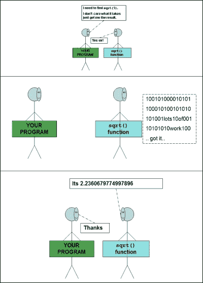
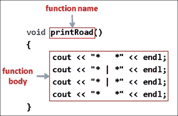
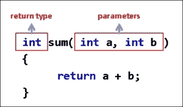
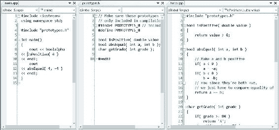

# 第五章。函数和宏

# 函数

有些事情需要重复。代码不是其中之一。函数是一组可以多次调用的代码，你可以按需多次调用。

类比是好的。让我们探讨一个涉及服务员、厨师、披萨和函数的类比。在英语中，当我们说一个人有一个函数时，我们的意思是这个人执行一些非常具体（通常，非常重要）的任务。他们可以一次又一次地做这项任务，并且每当他们被要求这样做时。

下面的漫画展示了服务员（调用者）和厨师（被调用者）之间的交互。服务员想要为他的餐桌提供食物，所以他要求厨师准备等待餐桌所需的食物。

厨师准备食物，然后将结果返回给服务员。


在这里，厨师执行他的烹饪食物的功能。厨师接受了关于要烹饪什么类型食物的参数（三个辣味披萨）。然后厨师离开，做了一些工作，并带着三个披萨回来。请注意，服务员不知道也不关心厨师是如何烹饪披萨的。厨师为服务员抽象掉了烹饪披萨的过程，所以对服务员来说，烹饪披萨只是一个简单的一行命令。服务员只想完成他的请求，并得到披萨。

当一个函数（厨师）被调用并带有一些参数（要准备的披萨类型）时，该函数执行一些操作（准备披萨）并可选择返回一个结果（实际完成的披萨）。

# 一个 `<cmath>` 库函数的例子 – sqrt()

现在，让我们讨论一个更实际的例子，并将其与披萨例子联系起来。

`<cmath>` 库中有一个名为 `sqrt()` 的函数。让我快速展示它的用法，如下面的代码所示：

```cpp
#include <iostream>
#include <cmath>
using namespace std;
int main()
{
  double rootOf5 = sqrt( 5 ); // function call to the sqrt  function
  cout << rootOf5  << endl;
}
```

因此，`sqrt()` 可以找到任何给定的数字的数学平方根。

你知道如何找到像 5 这样的困难数字的平方根吗？这并不简单。一个聪明的人坐下来编写了一个函数，可以找到所有类型的数字的平方根。你必须要理解 5 的平方根是如何找到的才能使用 `sqrt(5)` 函数调用吗？当然不需要！所以，就像服务员不需要理解如何烹饪披萨就能得到披萨作为结果一样，调用 C++库函数的人不需要完全理解该库函数内部的工作原理就能有效地使用它。

使用函数的优势如下：

1.  函数将复杂任务抽象成一个简单可调用的例程。这使得调用者（通常是你的程序）所需的代码，例如“烹饪披萨”，只是一个单行命令。

1.  函数避免了不必要的代码重复。假设我们有 20 或更多行代码可以找到双精度值的平方根。我们将这些代码行包装成一个可调用的函数；而不是反复复制粘贴这些 20 行代码，我们只需在需要求根时调用 `sqrt` 函数（带有要开方的数字）。

以下插图展示了寻找平方根的过程：



# 编写我们自己的函数

假设我们想要编写一些代码来打印一段道路，如下所示：

```cpp
cout << "*   *" << endl;
cout << "* | *" << endl;
cout << "* | *" << endl;
cout << "*   *" << endl;
```

现在，假设我们想要打印两条道路，一行一行地打印，或者打印三条道路。或者，假设我们想要打印任意数量的道路。我们将不得不为每条我们试图打印的道路重复一次产生第一条道路的四个代码行。

假设我们引入了自己的 C++ 命令，当调用该命令时可以打印一段道路。下面是它的样子：

```cpp
void printRoad()
{
  cout << "*   *" << endl;
  cout << "* | *" << endl;
  cout << "* | *" << endl;
  cout << "*   *" << endl;
}
```

这是函数的定义。C++ 函数具有以下结构：



使用函数很简单：我们只需通过名称调用我们想要执行的功能，然后跟随着两个圆括号 ()。例如，调用 `printRoad()` 函数将导致 `printRoad()` 函数运行。让我们跟踪一个示例程序来完全理解这意味着什么。

## 一个示例程序跟踪

下面是一个函数调用的完整示例：

```cpp
#include <iostream>
using namespace std;
void printRoad()
{
  cout << "*   *" << endl;
  cout << "* | *" << endl;
  cout << "* | *" << endl;
  cout << "*   *" << endl;
}
int main()
{
  cout << "Program begin!" << endl;
  printRoad();
  cout << "Program end" << endl;
  return 0;
}
```

让我们从开始到结束跟踪程序的执行。记住，对于所有 C++ 程序，执行都是从 `main()` 的第一行开始的。

### 注意

`main()` 也是一个函数。它负责整个程序的执行。一旦 `main()` 执行了 `return` 语句，你的程序就结束了。

当达到 `main()` 函数的最后一行时，程序结束。

以下是对前面程序执行逐行跟踪的展示：

```cpp
void printRoad()
{
  cout << "*   *" << endl;          // 3: then we jump up here
  cout << "* | *" << endl;          // 4: run this
  cout << "* | *" << endl;          // 5: and this
  cout << "*   *" << endl;          // 6: and this
}
int main()
{
  cout << "Program begin!" << endl; // 1: first line to execute
  printRoad();                      // 2: second line..
  cout << "Program end" << endl;    // 7: finally, last line
  return 0;                         // 8: and return to o/s
}
```

这就是这个程序的输出将看起来像这样：

```cpp
Program begin!
*   *
* | *
* | *
*   *
Program end
```

下面是对前面代码逐行的解释：

1.  程序的执行从 `main()` 的第一行开始，输出 `program begin!`。

1.  下一条要执行的代码是调用 `printRoad()`。这样做会将程序计数器跳转到 `printRoad()` 的第一行。然后按照顺序执行 `printRoad()` 的所有行（步骤 3–6）。

1.  最后，在 `printRoad()` 函数调用完成后，控制权返回到 `main()` 语句。然后我们看到打印出 `Program end`。

### 提示

不要忘记在调用 `printRoad()` 函数后加上括号。函数调用必须始终跟随着圆括号 ()，否则函数调用将不会工作，并且你会得到编译器错误。

以下代码用于打印四条道路：

```cpp
int main()
{
	printRoad();
	printRoad();
	printRoad();
	printRoad();
}
```

或者，你也可以使用以下代码：

```cpp
for( int i = 0; i < 4; i++ )
printRoad();
```

因此，我们不必每次打印一个框时都重复四行`cout`，我们只需调用`printRoad()`函数来让它打印。此外，如果我们想改变打印的路的形状，我们只需简单地修改`printRoad()`函数的实现。

调用一个函数意味着逐行运行该函数的整个主体。函数调用完成后，程序的控制权随后恢复到函数调用的点。

## 练习

作为练习，找出以下代码中存在的问题：

```cpp
#include <iostream>
using namespace std;
void myFunction()
{
   cout << "You called?" << endl;
}
int main()
{
   cout << "I'm going to call myFunction now." << endl;
   myFunction;
}
```

## 解决方案

这个问题的正确答案是，在`main()`的最后一行对`myFunction`的调用后面没有圆括号。所有函数调用都必须跟圆括号。`main()`的最后一行应该是`myFunction();`，而不是仅仅`myFunction`。

# 带有参数的函数

我们如何扩展`printRoad()`函数以打印具有特定路段数的路？答案是简单的。我们可以让`printRoad()`函数接受一个参数，称为`numSegments`，以打印一定数量的路段。

以下代码片段显示了它的样子：

```cpp
void printRoad(int numSegments)
{
  // use a for loop to print numSegments road segments
  for( int i = 0; i < numSegments; i++)
  {
    cout << "*   *" << endl;
    cout << "* | *" << endl;
    cout << "* | *" << endl;
    cout << "*   *" << endl;
  }
}
```

以下截图展示了接受一个参数的函数的解剖结构：


调用这个新的`printRoad()`版本，要求它打印四个路段，如下所示：

```cpp
printRoad( 4 );    // function call
```

在前一个语句的`function call`括号中的 4 被分配给`printRoad(int numSegments)`函数的`numSegments`变量。这就是值 4 如何传递给`numSegments`的：


以下是如何将值 4 赋给`numSegments`变量的`printRoad(4)`函数的示例

因此，`numSegments`被分配了在`printRoad()`调用中括号内传递的值。

# 返回值的函数

返回值的函数的一个例子是`sqrt()`函数。`sqrt()`函数接受一个括号内的单个参数（要开方的数字）并返回该数字的实际根。

下面是`sqrt`函数的一个示例用法：

```cpp
cout << sqrt( 4 ) << endl;
```

`sqrt()`函数所做的与厨师在准备披萨时所做的类似。

作为函数的调用者，你不需要关心`sqrt()`函数体内的内容；这个信息是不相关的，因为你想要的只是你传递的数字的平方根的结果。

让我们声明自己的简单函数，该函数返回一个值，如下面的代码所示：

```cpp
int sum(int a, int b)
{
  return a + b;
}
```

以下截图展示了具有参数和返回值的函数的解剖结构：



`sum`函数非常基础。它所做的只是取两个`int`数字`a`和`b`，将它们相加，并返回一个结果。你可能会说，我们甚至不需要一个完整的函数来加两个数字。你说得对，但请稍等片刻。我们将使用这个简单的函数来解释返回值的概念。

你将这样使用 `sum` 函数（从 `main()` 中）：

```cpp
int sum( int a, int b )
{
  return a + b;
}
int main()
{
  cout << "The sum of 5 and 6 is " << sum( 5,6 ) << endl; 
}
```

为了使 `cout` 命令完成，必须评估 `sum( 5,6 )` 函数调用。在 `sum( 5,6 )` 函数调用发生的地方，`sum( 5,6 )` 返回的值就被放在那里。

换句话说，这是 `cout` 在评估 `sum( 5,6 )` 函数调用后实际看到的代码行：

```cpp
cout << "The sum of 5 and 6 is " << 11 << endl;	
```

从 `sum( 5,6 )` 返回的值实际上是在函数调用点剪切和粘贴的。

函数承诺返回值时，必须始终返回一个值（如果函数的返回类型不是 `void`）。

## 练习

1.  编写一个 `isPositive` 函数，当传递给它的 `double` 类型的参数确实是正数时返回 `true`。

1.  完成以下函数定义：

    ```cpp
    // function returns true when the magnitude of 'a'
    // is equal to the magnitude of 'b' (absolute value)
    bool absEqual(int a, int b){
        // to complete this exercise, try to not use
        // cmath library functions
    }
    ```

1.  编写一个 `getGrade()` 函数，该函数接受一个整数参数（满分 100 分）并返回成绩（A、B、C、D 或 F）。

1.  一个数学函数的形式为 `f(x) = 3x + 4`。请编写一个 C++ 函数，该函数返回 `f(x)` 的值。

## 解答

1.  `isPositive` 函数接受一个 `double` 类型的参数并返回一个布尔值：

    ```cpp
    bool isPositive( double value )
    {
      return value > 0;
    }
    ```

1.  以下为完成的 `absEqual` 函数：

    ```cpp
    bool absEqual( int a, int b )
    {
      // Make a and b positive
    if( a < 0 )
        a = -a;
      if( b < 0 )
        b = -b;
      // now since they're both +ve,
      // we just have to compare equality of a and b together
      return a == b;
    }
    ```

1.  以下代码给出了 `getGrade()` 函数：

    ```cpp
    char getGrade( int grade )
    {
      if( grade >= 80 )
        return 'A';
      else if( grade >= 70 )
        return 'B';
      else if( grade >= 60 )
        return 'C';
      else if( grade >= 50 )
        return 'D';
      else
        return 'F';
    }
    ```

1.  这个程序是一个简单的程序，应该能让你感到愉快。C++ 中 `name` 函数的起源实际上来自数学世界，如下面的代码所示：

    ```cpp
    double f( double x )
    {
      return 3*x + 4;
    }
    ```

# 变量，重新审视

现在你对 C++ 编码有了更深入的理解，现在重新回顾你之前学过的主题总是很愉快。

## 全局变量

现在我们已经介绍了函数的概念，可以引入全局变量的概念。

什么是全局变量？全局变量是指任何可以被程序中所有函数访问的变量。我们如何使一个变量可以被程序中所有函数访问？我们只需在代码文件顶部声明全局变量，通常在 `#include` 语句之后或附近。

下面是一个包含一些全局变量的示例程序：

```cpp
#include <iostream>
#include <string>
using namespace std;

string g_string;	// global string variable,
// accessible to all functions within the program
// (because it is declared before any of the functions
// below!)

void addA(){ g_string += "A"; }
void addB(){ g_string += "B"; }
void addC(){ g_string += "C"; }

int main()
{
  addA();
  addB();
  cout << g_string << endl;
  addC();
  cout << g_string << endl;
}
```

在这里，相同的 `g_string` 全局变量可以访问程序中的所有四个函数（`addA()`、`addB()`、`addC()` 和 `main()`）。全局变量在程序运行期间持续存在。

### 小贴士

人们有时更喜欢在全局变量前加上 `g_` 前缀，但给变量名加上 `g_` 前缀并不是使变量成为全局变量的要求。

## 局部变量

局部变量是在代码块内定义的变量。局部变量在其声明块的末尾超出作用域。下一节将提供一些示例，*变量的作用域*。

## 变量的作用域

变量的作用域是指变量可以被使用的代码区域。任何变量的作用域基本上是其定义的块。我们可以通过以下示例来演示变量的作用域：

```cpp
int g_int; // global int, has scope until end of file
void func( int arg )
{
  int fx;
} // </fx> dies, </arg> dies

int main()
{
  int x; // variable <x> has scope starting here..
         // until the end of main()
  if( x == 0 )
  {
    int y;  // variable <y> has scope starting here,
            // until closing brace below
  } // </y> dies
  if( int x2 = x ) // variable <x2> created and set equal to <x>
  {
    // enter here if x2 was nonzero
  } // </x2> dies

for( int c = 0; c < 5; c++ ) // c is created and has
  { // scope inside the curly braces of the for loop
    cout << c << endl;
  } // </c> dies only when we exit the loop
} // </x> dies
```

定义变量作用域的主要因素是块。让我们讨论一下前面代码示例中定义的一些变量的作用域：

+   `g_int`：这是一个全局整数，其作用域从声明点开始，直到代码文件的末尾。也就是说，`g_int`可以在`func()`和`main()`中使用，但不能在其他代码文件中使用。如果你需要一个在多个代码文件中使用的单个全局变量，你需要一个外部变量。

+   `arg`（`func()`的参数）：这可以从`func()`的第一行（在开括号`{`之后）使用到`func()`的最后一行（直到闭括号`}`）。

+   `fx`：这可以在`func()`内部的任何地方使用，直到`func()`的闭合花括号`}`。

+   `main()`（`main()`内部的变量）：这可以按照注释中的标记使用。

注意，函数参数列表中的变量只能在函数声明下面的块中使用。例如，传递给`func()`的`arg`变量：

```cpp
void func( int arg )
{
  int fx;
} // </fx> dies, </arg> dies
```

`arg`变量将在`func()`函数的闭合花括号（`}`）之后消失。这看起来有些反直觉，因为圆括号在技术上是在定义`{}`块的闭合花括号之外。

对于在`for`循环圆括号内声明的变量也是同样的情况。以下是一个`for`循环的例子：

```cpp
for( int c = 0; c < 5; c++ )
{
  cout << c << endl;
} // c dies here
```

`int c`变量可以在`for`循环声明圆括号内或在其声明下面的块中使用。`c`变量将在其声明的`for`循环的闭合花括号之后消失。如果你想使`c`变量在`for`循环的括号之外继续存在，你需要在`for`循环之前声明`c`变量，如下所示：

```cpp
int c;
for( c = 0; c < 5; c++ )
{
  cout << c << endl;
} // c does not die here
```

## 静态局部变量

静态局部变量与全局变量非常相似，只是它们具有局部作用域，如下面的代码所示：

```cpp
void testFunc()
{
  static int runCount = 0; // this only runs ONCE, even on
  // subsequent calls to testFunc()!
  cout << "Ran this function " << ++runCount << " times" << endl;
} // runCount stops being in scope, but does not die here

int main()
{
  testFunc();  // says 1 time
  testFunc();  // says 2 times!
}
```

在`testFunc()`函数内部使用`static`关键字，`runCount`变量会在`testFunc()`函数调用之间记住其值。因此，`testFunc()`的前两次单独运行输出如下：

```cpp
Ran this function 1 times
Ran this function 2 times
```

这是因为静态变量只创建和初始化一次（在它们声明的函数第一次运行时），之后静态变量会保留其旧值。比如说，我们将`runCount`声明为一个常规的、局部的、非静态变量：

```cpp
int runCount = 0; // if declared this way, runCount is local
```

然后，输出将看起来是这样的：

```cpp
Ran this function 1 times
Ran this function 1 times
```

这里，我们看到`testFunc`两次都说了“运行了此函数 1 次”。作为一个局部变量，`runCount`的值在函数调用之间不会保留。

你不应该过度使用静态局部变量。一般来说，只有在绝对必要时才应该使用静态局部变量。

## 常量变量

`const`变量是一个你承诺编译器在第一次初始化后不会改变的值的变量。我们可以简单地声明一个，例如，用于`pi`的值：

```cpp
const double pi = 3.14159;
```

由于 `pi` 是一个通用常数（你唯一可以依赖的保持不变的东西之一），因此在初始化后不应需要更改 `pi`。实际上，编译器应该禁止对 `pi` 的更改。例如，尝试给 `pi` 赋予新的值：

```cpp
pi *= 2;
```

我们将得到以下编译器错误：

```cpp
error C3892: 'pi' : you cannot assign to a variable that is const
```

这个错误完全合理，因为除了初始初始化之外，我们不应该能够更改 `pi` 的值——这是一个常量变量。

## 函数原型

函数原型是函数的签名，不包括函数体。例如，让我们从以下练习中原型化 `isPositive`、`absEqual` 和 `getGrade` 函数：

```cpp
bool isPositive( double value );
bool absEqual( int a, int b );
char getGrade( int grade );
```

注意函数原型只是函数所需的返回类型、函数名和参数列表。函数原型不包含函数体。函数体通常放在 `.cpp` 文件中。

## .h 和 .cpp 文件

通常，将你的函数原型放在 `.h` 文件中，将函数体放在 `.cpp` 文件中。这样做的原因是你可以将你的 `.h` 文件包含在多个 `.cpp` 文件中，而不会出现多重定义错误。

以下截图为您清晰地展示了 `.h` 和 `.cpp` 文件：



在这个 Visual C++ 项目中，我们有三个文件：


## prototypes.h 包含

```cpp
// Make sure these prototypes are
// only included in compilation ONCE
#pragma once
extern int superglobal; // extern: variable "prototype"
// function prototypes
bool isPositive( double value );
bool absEqual( int a, int b );
char getGrade( int grade );
```

`prototypes.h` 文件包含函数原型。我们将在几段中解释 `extern` 关键字的作用。

## funcs.cpp 包含

```cpp
#include "prototypes.h" // every file that uses isPositive,
// absEqual or getGrade must #include "prototypes.h"
int superglobal; // variable "implementation"
// The actual function definitions are here, in the .cpp file
bool isPositive( double value )
{
  return value > 0;
}
bool absEqual( int a, int b )
{
  // Make a and b positive
  if( a < 0 )
    a = -a;
  if( b < 0 )
    b = -b;
  // now since they're both +ve,
  // we just have to compare equality of a and b together
  return a == b;
}
char getGrade( int grade )
{
  if( grade >= 80 )
    return 'A';
  else if( grade >= 70 )
    return 'B';
  else if( grade >= 60 )
    return 'C';
  else if( grade >= 50 )
    return 'D';
  else
    return 'F';
}
```

## main.cpp 包含

```cpp
#include <iostream>
using namespace std;
#include "prototypes.h" // for use of isPositive, absEqual 
// functions
int main()
{
  cout << boolalpha << isPositive( 4 ) << endl;
  cout << absEqual( 4, -4 ) << endl;
}
```

当你将代码拆分为 `.h` 和 `.cpp` 文件时，`.h` 文件（头文件）被称为接口，而 `.cpp` 文件（包含实际函数的文件）被称为实现。

对于一些程序员来说，最初令人困惑的部分是，如果我们只包含原型，C++ 如何知道 `isPositive` 和 `getGrade` 函数体的位置？我们不应该也将 `funcs.cpp` 文件包含到 `main.cpp` 中吗？

答案是“魔法”。你只需要在 `main.cpp` 和 `funcs.cpp` 中包含 `prototypes.h` 头文件。只要两个 `.cpp` 文件都包含在你的 C++ **集成开发环境**（**IDE**）项目中（即它们出现在左侧的 **解决方案资源管理器**树视图中），编译器会自动完成原型到函数体的链接。

## 外部变量

`extern` 声明与函数原型类似，但它用于变量。你可以在 `.h` 文件中放置一个 `extern` 全局变量声明，并将此 `.h` 文件包含在许多其他文件中。这样，你可以有一个在多个源文件之间共享的单个全局变量，而不会出现链接器错误中找到的多重定义符号。你将在 `.cpp` 文件中放置实际的变量声明，这样变量就只声明一次。在上一个示例中，`prototypes.h` 文件中有一个 `extern` 变量。

# 宏

C++ 宏属于一类称为预处理器指令的 C++ 命令。预处理器指令是在编译之前执行的。

宏以 `#define` 开头。例如，假设我们有以下宏：

```cpp
#define PI 3.14159
```

在最低级别上，宏仅仅是编译前发生的复制粘贴操作。在先前的宏语句中，字面量 `3.14159` 将被复制并粘贴到程序中 `PI` 符号出现的所有地方。

以以下代码为例：

```cpp
#include <iostream>
using namespace std;
#define PI 3.14159
int main()
{
  double r = 4;
  cout << "Circumference is " << 2*PI*r << endl;
}
```

C++ 预处理器将首先遍历代码，寻找对 `PI` 符号的任何使用。它会在这一行找到这样一个用法：

```cpp
cout << "Circumference is " << 2*PI*r << endl;
```

在编译之前，前面的行将转换为以下内容：

```cpp
cout << "Circumference is " << 2*3.14159*r << endl;
```

因此，`#define` 语句所发生的一切就是，在编译发生之前，所有使用的符号（例如，`PI`）的出现都将被字面数字 `3.14159` 替换。使用宏的这种方式的目的是避免将数字硬编码到代码中。符号通常比大而长的数字更容易阅读。

## 建议——尽可能使用 const 变量

你可以使用宏来定义常量变量。你也可以使用 `const` 变量表达式。所以，假设我们有以下一行代码：

```cpp
#define PI 3.14159
```

我们将鼓励使用以下内容代替：

```cpp
const double PI = 3.14159;
```

使用 `const` 变量将被鼓励，因为它将你的值存储在一个实际的变量中。变量是有类型的，有类型的数据是好事。

# 带参数的宏

我们也可以编写接受参数的宏。以下是一个带有参数的宏的示例：

```cpp
#define println(X) cout << X << endl;
```

这个宏将做的是，每当在代码中遇到 `println("Some value")` 时，右侧的代码（`cout << "Some value" << endl`）将被复制并粘贴到控制台上。注意括号中的参数是如何被复制到 `X` 的位置的。假设我们有以下一行代码：

```cpp
println( "Hello there" )
```

这将被替换为以下语句：

```cpp
cout << "Hello there" << endl;
```

带参数的宏与非常短的功能完全一样。宏不能包含任何换行符。

## 建议——使用内联函数而不是带参数的宏

你必须了解关于带参数的宏的工作方式，因为你在 C++ 代码中会遇到很多。然而，尽可能的情况下，许多 C++ 程序员更喜欢使用内联函数而不是带参数的宏。

一个正常的函数调用执行涉及一个跳转到函数的指令，然后执行函数。内联函数是指其代码行被复制到函数调用点，并且不会发出跳转指令的函数。通常，使用内联函数对于非常小、简单的函数来说是有意义的，这些函数没有很多代码行。例如，我们可能会内联一个简单的函数 `max`，该函数找出两个值中的较大值：

```cpp
inline int max( int a, int b )
{
  if( a > b ) return a;
  else return b;
}
```

在这个`max`函数被使用的任何地方，函数体的代码都会在函数调用的位置被复制和粘贴。不需要`跳转`到函数中可以节省执行时间，使得内联函数在效果上类似于宏。

使用内联函数有一个陷阱。内联函数必须将其主体完全包含在`.h`头文件中。这样编译器才能进行优化，并在使用函数的任何地方实际内联该函数。通常将函数内联是为了速度（因为你不需要跳转到代码的另一个部分来执行函数），但代价是代码膨胀。

以下是一些为什么内联函数比宏更受欢迎的原因：

1.  宏容易出错：宏的参数没有类型。

1.  宏必须写在一行中，否则你会看到它们使用转义字符

    ```cpp
    \
    newline characters \
    like this \
    which is hard to read
    ```

1.  如果宏没有仔细编写，会导致难以修复的编译器错误。例如，如果你没有正确地括号化你的参数，你的代码就会出错。

1.  大型宏很难调试。

应该指出的是，宏确实允许你执行一些预处理器编译器的魔法。UE4 大量使用了带参数的宏，你稍后会看到。

# 总结

函数调用允许你重用基本代码。代码重用对于许多原因来说都很重要：主要是因为编程很困难，应该尽可能避免重复工作。编写`sqrt()`函数的程序员所付出的努力不需要被其他想要解决相同问题的程序员重复。
