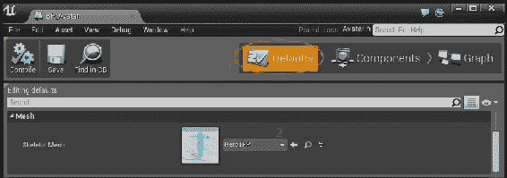
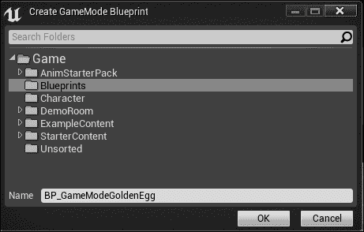
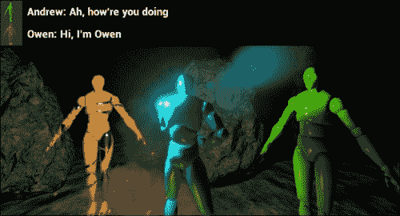

# 第八章。演员和棋子

现在，我们将真正深入到 UE4 代码中。一开始，它可能会看起来令人畏惧。UE4 类框架非常庞大，但别担心。框架虽然庞大，但你的代码不必如此。你会发现，你可以用相对较少的代码完成很多事情，并将很多内容显示在屏幕上。这是因为 UE4 引擎代码非常广泛且编程良好，以至于他们使得几乎任何与游戏相关的任务都能轻松完成。只需调用正确的函数，voila，你想要看到的内容就会出现在屏幕上。框架的整个概念就是它被设计成让你获得你想要的玩法，而不必花费大量时间在细节上费尽心思。

# 演员与棋子的区别

在本章中，我们将讨论演员和棋子。尽管听起来棋子似乎比演员更基础，但实际上情况正好相反。UE4 演员（`Actor`类）对象是可以在 UE4 游戏世界中放置的基本类型。为了在 UE4 世界中放置任何东西，你必须从`Actor`类派生。

`Pawn`是一个代表你可以或计算机的**人工智能**（**AI**）在屏幕上控制的对象。`Pawn`类从`Actor`类派生，并具有由玩家直接或由 AI 脚本控制的附加能力。当一个棋子或演员被控制器或 AI 控制时，它被称为被该控制器或 AI 所拥有。

将`Actor`类想象成戏剧中的角色。你的游戏世界将由许多*演员*组成，他们一起行动以使游戏玩法工作。游戏角色、**非玩家角色**（**NPC**）甚至宝箱都将作为演员。

# 创建一个世界来放置你的演员

在这里，我们将从头开始创建一个基本关卡，我们可以将游戏角色放入其中。

UE4 团队已经很好地展示了如何使用世界编辑器在 UE4 中创建世界。我希望你能花点时间创建自己的世界。

首先，创建一个新的、空白的 UE4 项目以开始。为此，在 Unreal 启动器中，点击你最近安装的引擎旁边的**启动**按钮，如图所示：


这将启动 Unreal 编辑器。Unreal 编辑器用于视觉编辑你的游戏世界。你将在 Unreal 编辑器中花费大量时间，所以请慢慢来，尝试并玩弄它。

我将只介绍如何使用 UE4 编辑器的基础知识。然而，你需要让创意的源泉流淌，并投入一些时间来熟悉编辑器。

### 小贴士

要了解更多关于 UE4 编辑器的信息，请查看*入门：UE4 编辑器简介*播放列表，该播放列表可在[`www.youtube.com/playlist?list=PLZlv_N0_O1gasd4IcOe9Cx9wHoBB7rxFl`](https://www.youtube.com/playlist?list=PLZlv_N0_O1gasd4IcOe9Cx9wHoBB7rxFl)找到。

启动 UE4 编辑器后，你将看到一个**项目**对话框。以下截图显示了需要执行的步骤，数字对应于它们需要执行的顺序：


执行以下步骤以创建项目：

1.  在屏幕顶部选择**新建项目**标签页。

1.  点击**C++**标签（第二个子标签）。

1.  然后从可用的项目列表中选择**基本代码**。

1.  设置你的项目所在目录（我的目录是**Y:\Unreal Projects\**）。选择一个空间充足的硬盘位置（最终项目大小约为 1.5 GB）。

1.  为你的项目命名。我将其命名为**GoldenEgg**。

1.  点击**创建项目**以完成项目创建。

完成此操作后，UE4 启动器将启动 Visual Studio。Visual Studio 中只有几个源文件，但现在我们不会触碰它们。确保从屏幕顶部的**配置管理器**下拉菜单中选择**开发编辑器**，如图所示：


现在，通过在 Visual Studio 中按*Ctrl* + *F5*启动你的项目。你将发现自己处于 Unreal Engine 4 编辑器中，如图所示：


# UE4 编辑器

我们将在这里探索 UE4 编辑器。我们将从控制开始，因为了解如何在 Unreal 中导航很重要。

## 编辑器控制

如果你以前从未使用过 3D 编辑器，那么控制可能会很难学。以下是在编辑模式下的基本导航控制：

+   使用箭头键在场景中移动

+   按*Page Up*或*Page Down*上下垂直移动

+   左键点击并拖动鼠标左右移动以改变面向的方向

+   左键点击并拖动鼠标上下移动以*推拉*（前进和后退相机，与按上/下箭头键相同）

+   右键点击并拖动以改变面向的方向

+   中键点击并拖动以平移视图

+   右键点击并使用*W*、*A*、*S*和*D*键在场景中移动

## 播放模式控制

在顶部栏中点击**播放**按钮，如图所示。这将启动播放模式。


点击**播放**按钮后，控制会改变。在播放模式下，控制如下：

+   *W*、*A*、*S*和*D*键用于移动

+   左右箭头键分别用于向左和向右看

+   鼠标移动以改变你观察的方向

+   按*Esc*键退出播放模式并返回到编辑模式

我建议你现在尝试向场景添加一些形状和对象，并尝试用不同的*材料*给它们上色。

## 向场景添加对象

向场景添加对象就像从**内容浏览器**选项卡拖放它们一样简单。默认情况下，**内容浏览器**选项卡停靠在窗口的左侧。如果看不到，请选择**窗口**并导航到**内容浏览器**以使其出现。


确保内容浏览器可见，以便将对象添加到你的级别中

接下来，在**内容浏览器**的左侧选择**道具**文件夹。


将内容浏览器中的内容拖放到你的游戏世界中

要调整对象大小，请按键盘上的*R*键。对象周围的操纵器将显示为框，表示调整大小模式。


按下键盘上的*R*键来调整对象大小

为了更改用于绘制对象的材料，只需从**内容浏览器**窗口内的**材料**文件夹中拖放一个新的材料。


从内容浏览器中的材料文件夹拖放一个材料到新颜色

材料就像油漆。你可以通过简单地拖放你想要的材料到你想涂覆的对象上，来给任何对象涂上你想要的材料。材料只是表面功夫：它们不会改变对象的其它属性（如重量）。

# 从头开始

如果你想要从头开始创建一个级别，只需点击**文件**并导航到**新建级别...**，如下所示：


你可以选择**默认**和**空级别**。我认为选择**空级别**是个好主意，原因将在后面提到。


新级别最初将完全为黑色。再次尝试从**内容浏览器**选项卡拖放一些对象。

这次，我为地面平面添加了一个调整大小的形状/盒子，并用苔藓纹理化，还添加了几样**道具**/ **SM_Rocks**，**粒子**/ **P_Fire**，最重要的是，一个光源。

一定要保存你的地图。这是我地图的快照（你的看起来怎么样？）：


如果你想更改启动编辑器时默认打开的级别，请转到**项目设置** | **地图和模式**；然后你将看到**游戏默认地图**和**编辑器启动地图**设置，如下面的截图所示：


## 添加光源

注意，如果你的场景完全为黑色，可能是因为你忘记在其中添加光源。

在上一个场景中，**P_Fire**粒子发射器充当光源，但它只发出少量的光。为了确保你的场景中的一切都看起来光线充足，你应该添加一个光源，如下所示：

1.  前往**窗口**然后点击**模式**以确保显示光源面板：

1.  然后，从**模式**面板中，将一个**灯光**对象拖入场景：

1.  选择灯泡和盒子图标（它看起来像蘑菇，但不是）。

1.  在左侧面板中点击**灯光**。

1.  选择你想要的灯光类型并将其拖入你的场景。

如果你没有光源，你的场景将完全变黑。

## 碰撞体积

你可能已经注意到，到目前为止，摄像机只是穿过场景中的所有几何形状，即使在播放模式中也是如此。这并不好。让我们让它变得这样，即玩家不能轻易穿过场景中的岩石。

有几种不同的碰撞体积类型。通常，在运行时进行完美的网格-网格碰撞成本太高。相反，我们使用一个近似值（边界体积）来猜测碰撞体积。

### 为对象编辑器添加碰撞检测

我们必须做的第一件事是将每个场景中的岩石与一个碰撞体积关联起来。

我们可以从 UE4 编辑器这样做：

1.  点击场景中你想添加碰撞体积的对象。

1.  在**场景大纲**标签（默认显示在屏幕右侧）中右键单击此对象，并选择编辑，如图下所示：

    ### 注意

    你会发现自己处于网格编辑器中。

1.  确保碰撞体积在屏幕顶部突出显示：

1.  前往**碰撞**菜单然后点击**添加胶囊简化碰撞**：

1.  当成功添加碰撞体积时，它将显示为围绕对象的一组线条，如图下所示：

    默认的碰撞胶囊（左侧）和手动调整大小的版本（右侧）

1.  你可以按需调整大小（*R*）、旋转（*E*）、移动（*W*）并更改碰撞体积，就像你在 UE4 编辑器中操纵对象一样。

1.  当你完成添加碰撞网格后，尝试点击**播放**；你会注意到你不能再穿过你的可碰撞对象。

# 向场景添加演员

现在我们已经设置了一个正在运行的场景，我们需要向场景添加一个演员。让我们首先为玩家添加一个带有碰撞体积的化身。为此，我们将必须从 UE4 的`GameFramework`类继承。

# 创建玩家实体

为了在屏幕上创建玩家的表示，我们需要从 Unreal 的`Character`类派生。

## 从 UE4 GameFramework 类继承

UE4 使得从基础框架类继承变得容易。你只需要执行以下步骤：

1.  在 UE4 编辑器中打开你的项目。

1.  前往**文件**然后选择**添加代码到项目...**。从 UE4 GameFramework 类继承

    通过导航到文件 | 添加代码到项目...，你可以从任何 UE4 GameFramework 类派生

1.  从这里，选择你想要从其派生的基类。你有**Character**、**Pawn**、**Actor**等等，但就目前而言，我们将从**Character**派生：从 UE4 GameFramework 类继承

    选择你想要从其派生的 UE4 类

1.  点击**下一步 >**以获取此对话框，在这里你命名类。我给我的玩家类命名为`Avatar`。从 UE4 GameFramework 类继承

1.  最后，点击**创建类**以在代码中创建类，如图中所示。

当 UE4 要求你刷新 Visual Studio 项目时，请让它刷新。从**解决方案资源管理器**打开新的`Avatar.h`文件。

UE4 生成的代码看起来可能有点奇怪。记住我在第五章“函数和宏”中建议你避免的宏。UE4 代码广泛使用了这些宏。这些宏用于复制和粘贴样板启动代码，使你的代码能够与 UE4 编辑器集成。

以下代码显示了`Avatar.h`文件的内容：

```cpp
#pragma once
// Avatar.h code file
#include "GameFramework/Character.h"
#include "Avatar.generated.h"
UCLASS()
class MYPROJECT_API AAvatar : public ACharacter
{
  GENERATED_UCLASS_BODY()
};
```

让我们暂时谈谈宏。

`UCLASS()`宏基本上使你的 C++代码类在 UE4 编辑器中可用。`GENERATED_UCLASS_BODY()`宏复制并粘贴 UE4 需要以 UE4 类正确工作的代码。

### 小贴士

对于`UCLASS()`和`GENERATED_UCLASS_BODY()`，你并不真正需要理解 UE4 是如何施展魔法的。你只需要确保它们出现在正确的位置（它们生成类时的位置）。

### 将模型与 Avatar 类关联

现在我们需要将一个模型与我们的角色对象关联起来。为了做到这一点，我们需要一个可以操作的模型。幸运的是，UE4 市场上有大量免费样本模型可供使用。

#### 下载免费模型

要创建玩家对象，我们将从**市场**标签下载**动画启动包**文件（这是免费的）。


在编写本书时，从 Unreal 启动器点击市场并搜索动画启动包，它是免费的。

下载**动画启动包**文件后，你将能够将其添加到之前创建的任何项目中，如图中所示：


当你在**动画起始包**下的**添加到项目**处点击时，你会看到一个弹出窗口，询问要将包添加到哪个项目中：


简单地选择你的项目，新的艺术品将出现在你的**内容浏览器**中。

## 加载网格

通常，将资产硬编码到游戏中被认为是一种不好的做法。硬编码意味着你编写了指定要加载的资产的 C++代码。然而，硬编码意味着加载的资产是最终可执行文件的一部分，这意味着更改加载的资产在运行时是不可修改的。这是一个不好的做法。能够在运行时更改加载的资产会更好。

因此，我们将使用 UE4 蓝图功能来设置我们的`Avatar`类的模型网格和碰撞胶囊。

### 从我们的 C++类创建蓝图

1.  这真的很简单。通过导航到**窗口**并点击**类查看器**来打开**类查看器**标签页，如图所示：

1.  在**类查看器**对话框中，开始输入你的 C++类的名字。如果你已经从 C++代码中正确创建并导出了这个类，它将显示出来，如图所示：

    ### 小贴士

    如果你的`Avatar`类没有显示出来，请关闭编辑器并再次编译/运行 C++项目。

1.  右键单击你想要创建蓝图的那个类（在我的例子中，是我的**Avatar**类）。

1.  给你的蓝图起一个独特的名字。我给我的蓝图命名为**BP_Avatar**。

1.  现在，通过双击**BP_Avatar**（添加后它将出现在**类查看器**标签页中，位于**Avatar**之下）来打开这个蓝图进行编辑，如图所示：

1.  你将看到你的新**BP_Avatar**对象的蓝图窗口，如图所示：

    ### 注意

    从这个窗口，你可以将模型可视地附加到`Avatar`类。再次强调，这是推荐的模式，因为艺术家通常会为游戏设计师设置他们的资产。

1.  要设置默认网格，请点击顶部的**默认值**按钮。向下滚动属性，直到你遇到**网格**。

1.  点击下拉菜单，并选择如图所示的**HeroTPP**作为你的网格。

1.  如果**HeroTPP**没有出现在下拉菜单中，请确保你已经下载并将**动画起始包**添加到你的项目中。或者，如果你在**视图** **选项**下选择**显示引擎内容**，你也可以将黄色的**教程 TPP**模型添加到你的项目中：

1.  关于碰撞体积？在蓝图编辑器中点击您的角色所在的**组件**标签：

    如果您的胶囊没有封装您的模型，调整模型使其适合

    ### 注意

    如果您的模型最终像我的一样，胶囊位置不正确！我们需要调整它。

1.  点击蓝色的角色模型并按*W*键。将他向下移动，直到他适合胶囊内。如果胶囊不够大，您可以在**细节**标签下的**胶囊高度**和**胶囊半径**中调整其大小，如下面的截图所示：

    您可以通过调整胶囊高度属性来拉伸胶囊

1.  现在，我们准备将这个角色添加到游戏世界中。在 UE4 编辑器中，从**类查看器**标签拖动您的**BP_Avatar**模型到场景中。

    场景中添加的我们的角色类，处于 T-pose

角色的姿态被称为 T-pose。动画师通常将角色留在这个默认姿态。可以通过应用动画来使角色改变这个默认姿态，使其更加有趣。您想要他动起来，对吧！这很简单。

在蓝图编辑器的**默认**选项卡中，在**网格**上方，有一个**动画**部分，您可以在其中选择**网格**上的活动动画。如果您想使用某个动画资产，只需点击下拉菜单并选择您想要的动画即可。

然而，更好的做法是使用动画蓝图。这样，艺术家可以根据角色的动作正确设置动画。如果您从**动画模式**中选择**使用动画蓝图**，然后从下拉菜单中选择**ASP_HeroTPP_AnimBlueprint**，角色在游戏中的表现将看起来更好，因为动画将由蓝图（由艺术家完成）根据角色的移动进行调整。


### 小贴士

这里无法涵盖所有内容。动画蓝图在第十一章 *怪物* 中有介绍。如果您对动画真的感兴趣，观看几节 Gnomon Workshop 关于逆运动学、动画和绑定教程也不会错，例如 Alex Alvarez 的 *Rigging 101* 课程，可在[`www.thegnomonworkshop.com/store/product/768/Rigging-101`](http://www.thegnomonworkshop.com/store/product/768/Rigging-101)找到。

还有一件事：让我们让角色的摄像机出现在它的后面。这将为您提供第三人称视角，让您可以看到整个角色，如下面的截图和相应的步骤所示：


1.  在**BP_Avatar**蓝图编辑器中，点击**组件**标签。

1.  点击 **添加组件**。

1.  选择添加一个 **摄像头**。

视口将出现一个摄像头。你可以点击摄像头并移动它。将摄像头定位在玩家后面某个位置。确保玩家上的蓝色箭头指向与摄像头相同的方向。如果不是，旋转 Avatar 模型网格，使其与蓝色箭头指向相同方向。


你模型网格上的蓝色箭头指示模型网格的前进方向。确保摄像头的开口方向与角色的前进向量相同。

# 编写控制游戏角色的 C++ 代码

当你启动你的 UE4 游戏，你可能会注意到摄像头是一个默认的、自由飞行的摄像头。我们现在要做的就是将起始角色设置为我们的 `Avatar` 类的实例，并使用键盘控制我们的角色。

## 将玩家设置为 Avatar 类的实例

在 Unreal 编辑器中，通过导航到 **文件** | **将代码添加到项目...** 并选择 **游戏模式** 来创建 **游戏模式** 的子类。我命名为 **GameModeGoldenEgg**。


UE4 的 **GameMode** 包含游戏的规则，并描述了游戏如何被引擎所执行。我们稍后会更多地使用我们的 `GameMode` 类。现在，我们需要创建它的子类。

从 Visual Studio 重新编译你的项目，以便你可以创建一个 **GameModeGoldenEgg** 蓝图。通过转到菜单栏顶部的 **蓝图** 图标，点击 **游戏模式**，然后选择 **+ 创建** | **GameModeGoldenEgg**（或你在第一步中为你的 **GameMode** 子类命名的任何名称）来创建 **GameMode** 蓝图。


1.  为你的蓝图命名；我命名为 **BP_GameModeGoldenEgg**，如图所示：

1.  你新创建的蓝图将在蓝图编辑器中打开。如果它没有打开，你可以从 **类查看器** 选项卡打开 **BP_GameModeGoldenEgg** 类。

1.  从 **默认角色类** 面板中选择你的 **BP_Avatar** 类，如图所示。**默认角色类** 面板是用于玩家的对象类型。

1.  现在，启动你的游戏。你可以看到背面视图，因为摄像头放置在后面，如图所示：

你会注意到你无法移动。这是为什么？答案是，我们还没有设置控制器输入。

## 设置控制器输入

1.  要设置控制器输入，转到 **设置** | **项目设置...**：

1.  接下来，在左侧面板中向下滚动，直到在 **引擎** 下方看到 **输入**。

1.  在右侧，你可以设置一些 **绑定**。点击 **轴映射** 旁边的箭头以展开它。开始时只需添加两个轴映射，一个称为 **Forward**（连接到键盘字母 *W*）和一个称为 **Strafe**（连接到键盘字母 *D*）。记住你设置的名称；我们将在稍后的 C++ 代码中查找它们。

1.  关闭 **项目设置** 对话框。现在，打开你的 C++ 代码。

在 `Avatar.h` 构造函数中，你需要添加三个成员函数声明，如下所示：

```cpp
UCLASS()
class GOLDENEGG_API AAvatar : public ACharacter
{
  GENERATED_UCLASS_BODY()

  // New! These 3 new member function declarations
  // they will be used to move our player around!
  void SetupPlayerInputComponent(class UInputComponent*  InputComponent) override;
  void MoveForward( float amount );
  void MoveRight( float amount );
};
```

注意我们添加的第一个成员函数（`SetupPlayerInputComponent`）是虚拟函数的一个重写。`SetupPlayerInputComponent` 是 `APawn` 基类中的一个虚拟函数。

在 `Avatar.cpp` 文件中，你需要放置函数体。添加以下成员函数定义：

```cpp
void AAvatar::SetupPlayerInputComponent(class UInputComponent* InputComponent)
{
  check(InputComponent);
  InputComponent->BindAxis("Forward", this,  &AAvatar::MoveForward);
  InputComponent->BindAxis("Strafe", this, &AAvatar::MoveRight);
}
```

这个成员函数查找我们在 Unreal 编辑器中创建的 **Forward** 和 **Strafe** 轴绑定，并将它们连接到 `this` 类内部的成员函数。我们应该连接到哪些成员函数呢？当然，我们应该连接到 `AAvatar::MoveForward` 和 `AAvatar::MoveRight`。以下是这两个函数的成员函数定义：

```cpp
void AAvatar::MoveForward( float amount )
{
  // Don't enter the body of this function if Controller is
  // not set up yet, or if the amount to move is equal to 0
  if( Controller && amount )
  {
    FVector fwd = GetActorForwardVector();
    // we call AddMovementInput to actually move the
    // player by `amount` in the `fwd` direction
    AddMovementInput(fwd, amount);
  }
}

void AAvatar::MoveRight( float amount )
{
  if( Controller && amount )
  {
    FVector right = GetActorRightVector();
    AddMovementInput(right, amount);
  }
}
```

### 小贴士

`Controller` 对象和 `AddMovementInput` 函数在 `APawn` 基类中定义。由于 `Avatar` 类从 `ACharacter` 继承，而 `ACharacter` 又从 `APawn` 继承，因此我们可以自由使用基类 `APawn` 中的所有成员函数。现在你看到继承和代码重用的美妙之处了吗？

### 练习

添加轴绑定和 C++ 函数以使玩家向左和向后移动。

### 注意

这里有一个提示：如果你意识到向后移动只是向前移动的负值，你只需要添加轴绑定。

### 解决方案

通过导航到 **设置** | **项目设置...** | **输入**，添加两个额外的轴绑定，如下截图所示：


将 **S** 和 **A** 输入的缩放比例设置为 -1.0。这将反转轴。因此，在游戏中按下 *S* 键将使玩家向前移动。试试看！

或者，你可以在你的 `AAvatar` 类中定义两个完全独立的成员函数，如下所示，并将 *A* 和 *S* 键分别绑定到 `AAvatar::MoveLeft` 和 `AAvatar::MoveBack`：

```cpp
void AAvatar::MoveLeft( float amount )
{
  if( Controller && amount )
  {
    FVector left = -GetActorRightVector();
    AddMovementInput(left, amount);
  }
}
void AAvatar::MoveBack( float amount )
{
  if( Controller && amount )
  {
    FVector back = -GetActorForwardVector();
    AddMovementInput(back, amount);
  }
}
```

## 偏航和俯仰

我们可以通过设置控制器的偏航和俯仰来改变玩家查看的方向。

在这里，我们只需添加鼠标的新轴绑定，如下截图所示：


从 C++ 中，你需要向 `AAvatar.h` 添加两个新的成员函数声明：

```cpp
void Yaw( float amount );
void Pitch( float amount );
```

这些成员函数的函数体将放在 `AAvatar.cpp` 文件中：

```cpp
void AAvatar::Yaw( float amount )
{
  AddControllerYawInput(200.f * amount * GetWorld()- >GetDeltaSeconds());
}
void AAvatar::Pitch( float amount )
{
  AddControllerPitchInput(200.f * amount * GetWorld()- >GetDeltaSeconds());
}
```

然后，向 `SetupPlayerInputComponent` 添加两行：

```cpp
void AAvatar::SetupPlayerInputComponent(class UInputComponent*  InputComponent)
{
  // .. as before, plus:
  InputComponent->BindAxis("Yaw", this, &AAvatar::Yaw);
  InputComponent->BindAxis("Pitch", this, &AAvatar::Pitch);
}
```

这里，请注意，我在 `Yaw` 和 `Pitch` 函数中将 `amount` 值乘以了 200。这个数字代表鼠标的灵敏度。你可以在 `AAvatar` 类中添加一个 `float` 成员，以避免硬编码这个灵敏度数字。

`GetWorld()->GetDeltaSeconds()`给你的是上一帧和这一帧之间经过的时间量。这并不多：`GetDeltaSeconds()`应该大约是 16 毫秒（0.016 秒），大多数时候（如果你的游戏以 60fps 运行）。

因此，现在我们有了玩家输入和控制。要为你的角色添加新功能，你只需做以下这些：

1.  通过转到**设置** | **项目设置** | **输入**来绑定你的键或鼠标操作。

1.  添加一个成员函数，当按下该键时运行。

1.  在`SetupPlayerInputComponent`中添加一行，将绑定的输入名称连接到当按下该键时要运行的成员函数。

# 创建非玩家角色实体

因此，我们需要创建一些**NPC**（不可玩角色）。NPC 是游戏中的角色，帮助玩家。一些提供特殊物品，一些是商店卖家，一些有信息要告诉玩家。在这个游戏中，它们会在玩家靠近时做出反应。让我们编写一些这种行为。

首先，创建另一个**Character**的子类。在 UE4 编辑器中，转到**文件** | **将代码添加到项目...**，然后从可以创建子类的**Character**类中选择。将你的子类命名为`NPC`。

现在，在 Visual Studio 中编辑你的代码。每个 NPC 都会有一个消息告诉玩家，因此我们在`NPC`类中添加了一个`UPROPERTY() FString`属性。

### 小贴士

`FString`是 UE4 版本的 C++ `<string>` 类型。在 UE4 中编程时，你应该使用`FString`对象而不是 C++ STL 的`string`对象。一般来说，你最好使用 UE4 的内置类型，因为它们保证了跨平台兼容性。

如何将`UPROPERTY() FString`属性添加到`NPC`类中，以下代码显示了：

```cpp
UCLASS()
class GOLDENEGG_API ANPC : public ACharacter
{
  GENERATED_UCLASS_BODY()
  UPROPERTY(VisibleAnywhere, BlueprintReadOnly, Category =  Collision)
  TSubobjectPtr<class USphereComponent> ProxSphere;
  // This is the NPC's message that he has to tell us.
  UPROPERTY(EditAnywhere, BlueprintReadWrite, Category =  NPCMessage)
  FString NpcMessage;
  // When you create a blueprint from this class, you want to be 
  // able to edit that message in blueprints,
  // that's why we have the EditAnywhere and BlueprintReadWrite 
  // properties.
}
```

注意，我们将`EditAnywhere`和`BlueprintReadWrite`属性放入了`UPROPERTY`宏中。这将使`NpcMessage`在蓝图中被编辑。

### 小贴士

所有 UE4 属性说明的完整描述可在[`docs.unrealengine.com/latest/INT/Programming/UnrealArchitecture/Reference/Properties/index.html`](https://docs.unrealengine.com/latest/INT/Programming/UnrealArchitecture/Reference/Properties/index.html)找到。

重新编译你的项目（就像我们对`Avatar`类所做的那样）。然后，转到**类查看器**，右键单击你的`NPC`类，并从它创建一个蓝图。

你想要创建的每个 NPC 角色都可以基于`NPC`类创建蓝图。为每个蓝图命名一个独特的名称，因为我们将为每个出现的 NPC 选择不同的模型网格和消息，如以下截图所示：


现在，打开蓝图，从**添加组件**中选择骨骼**网格**，并调整胶囊（就像我们对**BP_Avatar**所做的那样）。你还可以更改你新角色的材质，使其看起来与玩家不同。


在你的网格属性中更改角色的材质。在渲染选项卡下，点击+图标添加一个新的材质。然后，点击小胶囊形状的项来选择要渲染的材质。

在**默认**选项卡中，搜索`NpcMessage`属性。这是 C++代码和蓝图之间的连接：因为我们在一个`FString NpcMessage`变量上输入了`UPROPERTY()`函数，所以该属性在 UE4 中显示为可编辑，如下面的截图所示：


现在，将**BP_NPC_Owen**拖入场景。你也可以创建第二个或第三个角色，并确保给他们起独特的名字、外观和消息。


我基于 NPC 基类创建了两个蓝图，BP_NPC_Justin 和 BP_NPC_Owen。它们有不同的外观和为玩家提供不同的消息。


场景中的贾斯汀和欧文

# 显示每个 NPC 对话框中的引用

要显示对话框，我们需要一个自定义的（抬头显示）**HUD**。在 UE4 编辑器中，转到**文件** | **将代码添加到项目...** 并选择创建子类的`HUD`类。根据你的意愿命名你的子类；我把我命名为`MyHUD`。

在你创建了`MyHUD`类之后，让 Visual Studio 重新加载。我们将进行一些代码编辑。

## 在 HUD 上显示消息

在`AMyHUD`类内部，我们需要实现`DrawHUD()`函数，以便将我们的消息绘制到 HUD 上，并初始化一个用于绘制到 HUD 的字体，如下面的代码所示：

```cpp
UCLASS()
class GOLDENEGG_API AMyHUD : public AHUD
{
  GENERATED_UCLASS_BODY()
  // The font used to render the text in the HUD.
  UPROPERTY(EditAnywhere, BlueprintReadWrite, Category = HUDFont)
  UFont* hudFont;
  // Add this function to be able to draw to the HUD!
  virtual void DrawHUD() override;
};
```

HUD 字体将在`AMyHUD`类的蓝图版本中设置。`DrawHUD()`函数每帧运行一次。为了在帧内绘制，需要在`AMyHUD.cpp`文件中添加一个函数：

```cpp
void AMyHUD::DrawHUD()
{
  // call superclass DrawHUD() function first
  Super::DrawHUD();
  // then proceed to draw your stuff.
  // we can draw lines..
  DrawLine( 200, 300, 400, 500, FLinearColor::Blue );
  // and we can draw text!
  DrawText( "Greetings from Unreal!", FVector2D( 0, 0 ), hudFont,  FVector2D( 1, 1 ), FColor::White );
}
```

等等！我们还没有初始化我们的字体。为了做到这一点，我们需要在蓝图中进行设置。编译并运行你的 Visual Studio 项目。一旦你进入编辑器，转到顶部的**蓝图**菜单并导航到**游戏模式** | **HUD** | **+ 创建** | **MyHUD**。


创建 MyHUD 类的蓝图

我把它命名为`BP_MyHUD`。编辑`BP_MyHUD`并从**HUDFont**下的下拉菜单中选择一个字体：


我为我的 HUD 选择了 RobotoDistanceField 字体

接下来，编辑你的**游戏模式**蓝图（**BP_GameModeGoldenEgg**）并选择你的新`BP_MyHUD`（不是`MyHUD`类）用于**HUD 类**面板：


通过运行程序来测试你的程序！你应该会在屏幕上看到打印的文本。


## 使用 TArray<Message>

我们想要向玩家显示的每条消息都将有几个属性：

+   一个用于消息的`FString`变量

+   一个用于显示时间的`float`变量

+   一个用于消息颜色的`FColor`变量

因此，我们编写一个小的 `struct` 函数来包含所有这些信息是有意义的。

在 `MyHUD.h` 的顶部插入以下 `struct` 声明：

```cpp
struct Message
{
  FString message;
  float time;
  FColor color;
  Message()
  {
    // Set the default time.
    time = 5.f;
    color = FColor::White;
  }
  Message( FString iMessage, float iTime, FColor iColor )
  {
    message = iMessage;
    time = iTime;
    color = iColor;
  }
};
```

### 注意

本章代码包中有一个增强版的 `Message` 结构（带有背景颜色）。在这里我们使用了更简单的代码，以便更容易理解本章内容。

现在，在 `AMyHUD` 类中，我们想要添加一个这些消息的 `TArray`。`TArray` 是 UE4 定义的一种特殊类型的动态可增长 C++ 数组。我们将在下一章中详细介绍 `TArray` 的使用，但这个简单的 `TArray` 使用应该是一个很好的介绍，以激发你对游戏中使用数组的有用性的兴趣。这将被声明为 `TArray<Message>`：

```cpp
UCLASS()
class GOLDENEGG_API AMyHUD : public AHUD
{
  GENERATED_UCLASS_BODY()
  // The font used to render the text in the HUD.
  UPROPERTY(EditAnywhere, BlueprintReadWrite, Category = HUDFont)
  UFont* hudFont;
  // New! An array of messages for display
  TArray<Message> messages;
  virtual void DrawHUD() override;
  // New! A function to be able to add a message to display
  void addMessage( Message msg );
};
```

现在，每当 NPC 有消息要显示时，我们只需调用 `AMyHud::addMessage()` 并传入我们的消息。该消息将被添加到要显示的消息的 `TArray` 中。当消息过期（经过一定时间后），它将从 HUD 中移除。

在 `AMyHUD.cpp` 文件中，添加以下代码：

```cpp
void AMyHUD::DrawHUD()
{
  Super::DrawHUD();
  // iterate from back to front thru the list, so if we remove
  // an item while iterating, there won't be any problems
  for( int c = messages.Num() - 1; c >= 0; c-- )
  {
    // draw the background box the right size
    // for the message
    float outputWidth, outputHeight, pad=10.f;
    GetTextSize( messages[c].message, outputWidth, outputHeight,  hudFont, 1.f );

    float messageH = outputHeight + 2.f*pad;
    float x = 0.f, y = c*messageH;

    // black backing
    DrawRect( FLinearColor::Black, x, y, Canvas->SizeX, messageH  );
    // draw our message using the hudFont
    DrawText( messages[c].message, messages[c].color, x + pad, y +  pad, hudFont );

    // reduce lifetime by the time that passed since last 
    // frame.
    messages[c].time -= GetWorld()->GetDeltaSeconds();

    // if the message's time is up, remove it
    if( messages[c].time < 0 )
    {
      messages.RemoveAt( c );
    }
  }
}

void AMyHUD::addMessage( Message msg )
{
  messages.Add( msg );
}
```

`AMyHUD::DrawHUD()` 函数现在会绘制 `messages` 数组中的所有消息，并按照自上一帧以来经过的时间对 `messages` 数组中的每个消息进行排列。一旦消息的 `time` 值低于 0，过期的消息将从 `messages` 集合中移除。

### 练习

重构 `DrawHUD()` 函数，以便将绘制到屏幕上的消息代码放在一个名为 `DrawMessages()` 的单独函数中。

`Canvas` 变量仅在 `DrawHUD()` 中可用，因此您必须将 `Canvas->SizeX` 和 `Canvas->SizeY` 保存为类级别变量。

### 注意

重构意味着改变代码内部的工作方式，使其更加有序或更容易阅读，但仍然对运行程序的用户提供相同的外观结果。重构通常是一种良好的实践。重构发生的原因是因为一旦开始编写代码，没有人确切知道最终代码应该是什么样子。

### 解决方案

请参阅本章代码包中的 `AMyHUD::DrawMessages()` 函数。

## 在接近 NPC 时触发事件

要在 NPC 附近触发事件，我们需要设置一个额外的碰撞检测体积，该体积略大于默认的胶囊形状。额外的碰撞检测体积将是每个 NPC 周围的球体。当玩家进入 NPC 球体时，NPC 会做出反应并显示消息。


我们将向 NPC 添加一个深红色球体，以便他能够知道玩家是否在附近。

在你的 `NPC.h` 类文件中，添加以下代码以声明 `ProxSphere` 和名为 `Prox` 的 `UFUNCTION`：

```cpp
UCLASS()
class GOLDENEGG_API ANPC : public ACharacter
{
  GENERATED_UCLASS_BODY()
  // This is the NPC's message that he has to tell us.
  UPROPERTY(EditAnywhere, BlueprintReadWrite, Category =  NPCMessage)
  FString NpcMessage;
  // The sphere that the player can collide with to get item
  UPROPERTY(VisibleAnywhere, BlueprintReadOnly, Category =  Collision)
  TSubobjectPtr<class USphereComponent> ProxSphere;
  // The corresponding body of this function is 
  // ANPC::Prox_Implementation, __not__ ANPC::Prox()!
  // This is a bit weird and not what you'd expect,
  // but it happens because this is a BlueprintNativeEvent
  UFUNCTION(BlueprintNativeEvent, Category = "Collision")
  void Prox( AActor* OtherActor, UPrimitiveComponent* OtherComp,  int32 OtherBodyIndex, bool bFromSweep, const FHitResult &  SweepResult );
};
```

这看起来有点杂乱，但实际上并不复杂。在这里，我们声明了一个额外的边界球体体积 `ProxSphere`，用于检测玩家是否接近 NPC。

在 `NPC.cpp` 文件中，我们需要添加以下代码以完成近距离检测：

```cpp
ANPC::ANPC(const class FPostConstructInitializeProperties& PCIP) : Super(PCIP)
{
  ProxSphere = PCIP.CreateDefaultSubobject<USphereComponent>(this,  TEXT("Proximity Sphere"));
  ProxSphere->AttachTo( RootComponent );
  ProxSphere->SetSphereRadius( 32.f );
  // Code to make ANPC::Prox() run when this proximity sphere
  // overlaps another actor.
  ProxSphere->OnComponentBeginOverlap.AddDynamic( this,  &ANPC::Prox );
  NpcMessage = "Hi, I'm Owen";//default message, can be edited
  // in blueprints
}
// Note! Although this was declared ANPC::Prox() in the header,
// it is now ANPC::Prox_Implementation here.
void ANPC::Prox_Implementation( AActor* OtherActor,  UPrimitiveComponent* OtherComp, int32 OtherBodyIndex, bool  bFromSweep, const FHitResult & SweepResult )
{
  // This is where our code will go for what happens
  // when there is an intersection
}
```

### 当附近有东西时，让 NPC 向 HUD 显示某些内容

当玩家接近 NPC 的球体碰撞体积时，向 HUD 显示一条消息，提醒玩家 NPC 在说什么。

这是`ANPC::Prox_Implementation`的完整实现：

```cpp
void ANPC::Prox_Implementation( AActor* OtherActor, UPrimitiveComponent* OtherComp, int32 OtherBodyIndex, bool bFromSweep, const FHitResult & SweepResult )
{
  // if the overlapped actor is not the player,
  // you should just simply return from the function
  if( Cast<AAvatar>( OtherActor ) == nullptr )
  {
    return;
  }
  APlayerController* PController = GetWorld()- >GetFirstPlayerController();
  if( PController )
  {
    AMyHUD * hud = Cast<AMyHUD>( PController->GetHUD() );
    hud->addMessage( Message( NpcMessage, 5.f, FColor::White ) );
  }
}
```

在这个函数中，我们首先将`OtherActor`（靠近 NPC 的东西）强制转换为`AAvatar`。当`OtherActor`是一个`AAvatar`对象时，转换成功（并且不是`nullptr`）。我们获取 HUD 对象（它恰好附加到玩家控制器）并将 NPC 的消息传递给 HUD。当玩家在 NPC 周围的红色边界球体内时，会显示这条消息。


欧文的问候

### 练习

1.  为 NPC 的名称添加一个`UPROPERTY`函数名，以便在蓝图中对 NPC 的名称进行编辑，类似于 NPC 对玩家说的话。在输出中显示 NPC 的名称。

1.  为 NPC 的面部纹理添加一个`UPROPERTY`函数（类型`UTexture2D*`）。在输出中在其消息旁边绘制 NPC 的脸。

1.  以条形（填充矩形）的形式渲染玩家的 HP。

### 解决方案

将此属性添加到`ANPC`类中：

```cpp
// This is the NPC's name
UPROPERTY(EditAnywhere, BlueprintReadWrite, Category = NPCMessage)
FString name;
```

然后，在`ANPC::Prox_Implementation`中，将传递给 HUD 的字符串更改为：

```cpp
name + FString(": ") + message
```

这样，NPC 的名称就会附加到消息上。

将此属性添加到`ANPC`类中：

```cpp
UPROPERTY(EditAnywhere, BlueprintReadWrite, Category = NPCMessage)
UTexture2D* Face;
```

然后你可以在蓝图中选择要附加到 NPC 脸上的面部图标。

将纹理附加到你的`struct Message`：

```cpp
UTexture2D* tex;
```

要渲染这些图标，你需要添加一个调用`DrawTexture()`的调用，并将正确的纹理传递给它：

```cpp
DrawTexture( messages[c].tex, x, y, messageH, messageH, 0, 0, 1, 1  );
```

在渲染之前，务必检查纹理是否有效。图标应类似于屏幕顶部所示的内容：



这就是绘制玩家剩余健康度的条形函数的样子：

```cpp
void AMyHUD::DrawHealthbar()
{
  // Draw the healthbar.
  AAvatar *avatar = Cast<AAvatar>(  UGameplayStatics::GetPlayerPawn(GetWorld(), 0) );
  float barWidth=200, barHeight=50, barPad=12, barMargin=50;
  float percHp = avatar->Hp / avatar->MaxHp;
  DrawRect( FLinearColor( 0, 0, 0, 1 ), Canvas->SizeX - barWidth -  barPad - barMargin, Canvas->SizeY - barHeight - barPad -  barMargin, barWidth + 2*barPad, barHeight + 2*barPad );
  DrawRect( FLinearColor( 1-percHp, percHp, 0, 1 ), Canvas->SizeX  - barWidth - barMargin, Canvas->SizeY - barHeight - barMargin,  barWidth*percHp, barHeight );
}
```

# 摘要

在本章中，我们介绍了大量内容。我们向您展示了如何创建角色并在屏幕上显示它，如何使用轴绑定来控制角色，以及如何创建和显示可以发布消息到 HUD 的 NPC。

在接下来的章节中，我们将通过在第十章中添加*库存系统及拾取物品*以及相应的代码和概念来进一步开发我们的游戏。在此之前，我们将在第九章中深入探讨一些 UE4 容器类型，*模板和常用容器*。
