# 第十章. 背包系统和拾取物品

我们希望玩家能够从游戏世界中拾取物品。在本章中，我们将为玩家编写和设计一个背包来存储物品。当用户按下*I*键时，我们将显示背包中玩家所携带的物品。

作为数据表示，我们可以使用上一章中介绍的`TMap<FString, int>`物品映射来存储我们的物品。当玩家拾取一个物品时，我们将其添加到映射中。如果该物品已经在映射中，我们只需将其数量增加新拾取的物品的数量。

# 声明背包

我们可以将玩家的背包表示为一个简单的`TMap<FString, int>`物品映射。为了允许玩家从世界中收集物品，打开`Avatar.h`文件并添加以下`TMap`声明：

```cpp
class APickupItem; //  forward declare the APickupItem class,
                   // since it will be "mentioned" in a member  function decl below
UCLASS()
class GOLDENEGG_API AAvatar : public ACharacter
{
  GENERATED_UCLASS_BODY()

  // A map for the player's backpack
  TMap<FString, int> Backpack;

  // The icons for the items in the backpack, lookup by string
  TMap<FString, UTexture2D*> Icons;

  // A flag alerting us the UI is showing
  bool inventoryShowing;
  // member function for letting the avatar have an item
  void Pickup( APickupItem *item );
  // ... rest of Avatar.h same as before
};
```

## 前向声明

在`AAvatar`类之前，请注意我们有一个`class APickupItem`前向声明。当在代码文件中提及一个类时（例如，`APickupItem::Pickup(APickupItem *item);`函数原型），需要前向声明，但文件中实际上没有使用该类型的对象。由于`Avatar.h`头文件不包含使用`APickupItem`类型对象的可执行代码，因此我们需要前向声明。

如果没有前向声明，将会出现编译错误，因为编译器在编译`class AAvatar`中的代码之前没有听说过`class APickupItem`。编译错误将在`APickupItem::Pickup(APickupItem *item);`函数原型声明时出现。

我们在`AAvatar`类内部声明了两个`TMap`对象。这些对象的外观如下表所示：

| `FString`（名称） | `int`（数量） | `UTexture2D*`（图像） |
| --- | --- | --- |
| 金蛋 | 2 | 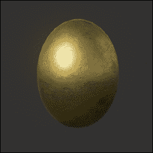 |
| 金属甜甜圈 | 1 | 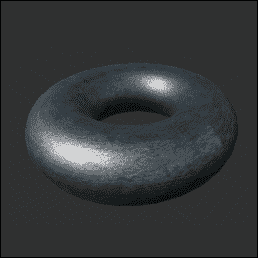 |
| 牛 | 2 | 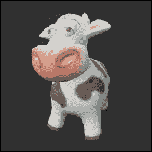 |

在`TMap`背包中，我们存储玩家持有的物品的`FString`变量。在`Icons`映射中，我们存储玩家持有的物品的图像的单个引用。

在渲染时，我们可以使用两个映射协同工作来查找玩家拥有的物品数量（在他的`Backpack`映射中）以及该物品的纹理资产引用（在`Icons`映射中）。以下截图显示了 HUD 渲染的外观：


### 注意

注意，我们也可以使用一个包含`FString`变量和`UTexture2D*`的`struct`数组来代替使用两个映射。

例如，我们可以保持`TArray<Item> Backpack;`与一个`struct`变量，如下面的代码所示：

```cpp
struct Item
{
  FString name;
  int qty;
  UTexture2D* tex;
};
```

然后，当我们拾取物品时，它们将被添加到线性数组中。然而，要计算背包中每种物品的数量，每次查看计数时都需要通过迭代数组中的物品进行重新评估。例如，要查看你有多少把梳子，你需要遍历整个数组。这不如使用映射高效。

## 导入资源

你可能已经注意到了前一个屏幕截图中的 **Cow** 资源，它不是 UE4 在新项目中提供的标准资源集的一部分。为了使用 **Cow** 资源，你需要从 **内容示例** 项目中导入牛。UE4 使用一个标准的导入过程。

在以下屏幕截图中，我概述了导入 **Cow** 资料的步骤。其他资源将以相同的方法从 UE4 的其他项目中导入。按照以下步骤导入 **Cow** 资料：

1.  下载并打开 UE4 的 **内容示例** 项目：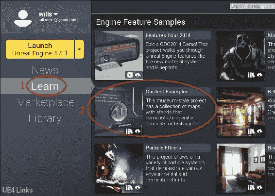

1.  下载完 **内容示例** 后，打开它并点击 **创建项目**：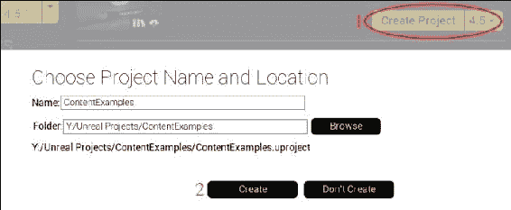

1.  接下来，命名你将放置 `ContentExamples` 的文件夹，然后点击 **创建**。

1.  从库中打开你的 `ContentExamples` 项目。浏览项目中的资源，直到找到一个你喜欢的。由于所有静态网格通常以 `SM_` 开头，所以搜索 `SM_` 会很有帮助。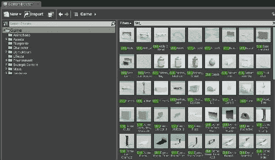

    以 SM_ 开头的静态网格列表

1.  当你找到一个你喜欢的资源时，通过右键单击资源然后点击 **迁移...** 将其导入到你的项目中：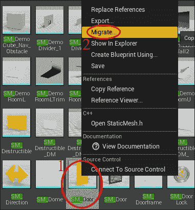

1.  在 **资源报告** 对话框中点击 **确定**：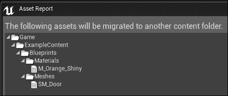

1.  从你的项目中选择你想要添加 **SM_Door** 文件的 **内容** 文件夹。对我来说，我想将其添加到 `Y:/Unreal Projects/GoldenEgg/Content`，如下截图所示：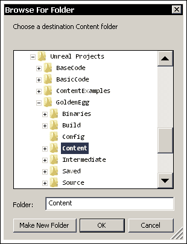

1.  如果导入成功，你将看到如下消息：

1.  导入你的资源后，你将看到它在你的项目资源浏览器中显示：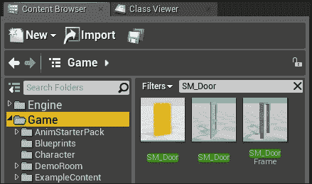

你可以在项目中正常使用该资源。

## 将动作映射附加到键上

我们需要将一个键附加到激活玩家库存显示的功能。在 UE4 编辑器中，添加一个名为 `Inventory` 的 **动作映射 +** 并将其分配给键盘键 *I*：

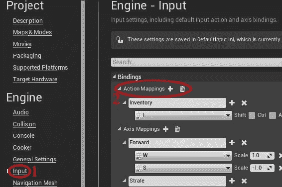

在 `Avatar.h` 文件中，添加一个成员函数，当玩家的库存需要显示时运行：

```cpp
void ToggleInventory();
```

在 `Avatar.cpp` 文件中，实现 `ToggleInventory()` 函数，如下代码所示：

```cpp
void AAvatar::ToggleInventory()
{
  if( GEngine )
  {
    GEngine->AddOnScreenDebugMessage( 0, 5.f, FColor::Red,  "Showing inventory..." );
  }
}
```

然后，在 `SetupPlayerInputComponent()` 中将 `"Inventory"` 动作连接到 `AAvatar::ToggleInventory()`:

```cpp
void AAvatar::SetupPlayerInputComponent(class UInputComponent*  InputComponent)
{
  InputComponent->BindAction( "Inventory", IE_Pressed, this,  &AAvatar::ToggleInventory );
  // rest of SetupPlayerInputComponent same as before
}
```

# 基类 PickupItem

我们需要在代码中定义拾取物品的外观。每个拾取物品都将从一个公共基类派生。现在让我们为 `PickupItem` 类构造一个基类。

`PickupItem` 基类应该继承自 `AActor` 类。类似于我们从基础 NPC 类创建多个 NPC 蓝图的方式，我们可以从一个单一的 `PickupItem` 基类创建多个 `PickupItem` 蓝图，如下面的截图所示：


一旦创建了 `PickupItem` 类，就在 Visual Studio 中打开其代码。

`APickupItem` 类将需要相当多的成员，如下所示：

+   用于表示拾取物品名称的 `FString` 变量

+   用于表示拾取物品数量的 `int32` 变量

+   用于与拾取物品发生碰撞的球体的 `USphereComponent` 变量

+   用于保存实际网格的 `UStaticMeshComponent` 变量

+   用于表示物品图标的 `UTexture2D` 变量

+   指向 HUD（我们将在稍后初始化）

这就是 `PickupItem.h` 中的代码看起来：

```cpp
UCLASS()
class GOLDENEGG_API APickupItem : public AActor
{
  GENERATED_UCLASS_BODY()

  // The name of the item you are getting
  UPROPERTY(EditAnywhere, BlueprintReadWrite, Category = Item)
  FString Name;

  // How much you are getting
  UPROPERTY(EditAnywhere, BlueprintReadWrite, Category = Item)
  int32 Quantity;

  // the sphere you collide with to pick item up
  UPROPERTY(VisibleDefaultsOnly, BlueprintReadOnly, Category =  Item)
  TSubobjectPtr<USphereComponent> ProxSphere;

  // The mesh of the item
  UPROPERTY(VisibleDefaultsOnly, BlueprintReadOnly, Category =  Item)
  TSubobjectPtr<UStaticMeshComponent> Mesh;

  // The icon that represents the object in UI/canvas
  UPROPERTY(EditAnywhere, BlueprintReadWrite, Category = Item)
  UTexture2D* Icon;

  // When something comes inside ProxSphere, this function runs
  UFUNCTION(BlueprintNativeEvent, Category = Collision)
  void Prox( AActor* OtherActor, UPrimitiveComponent* OtherComp,  int32 OtherBodyIndex, bool bFromSweep, const FHitResult &  SweepResult );
};
```

所有这些 `UPROPERTY()` 声明的目的是使 `APickupItem` 可以通过蓝图完全配置。例如，**拾取** 类别的物品在蓝图编辑器中将显示如下：


在 `PickupItem.cpp` 文件中，我们完成了 `APickupItem` 类的构造函数，如下面的代码所示：

```cpp
APickupItem::APickupItem(const class FPostConstructInitializeProperties& PCIP) : Super(PCIP)
{
  Name = "UNKNOWN ITEM";
  Quantity = 0;

  // initialize the unreal objects
  ProxSphere = PCIP.CreateDefaultSubobject<USphereComponent>(this,  TEXT("ProxSphere"));
  Mesh = PCIP.CreateDefaultSubobject<UStaticMeshComponent>(this,  TEXT("Mesh"));

  // make the root object the Mesh
  RootComponent = Mesh;
  Mesh->SetSimulatePhysics(true);

  // Code to make APickupItem::Prox() run when this
  // object's proximity sphere overlaps another actor.
  ProxSphere->OnComponentBeginOverlap.AddDynamic(this,  &APickupItem::Prox);
  ProxSphere->AttachTo( Mesh ); // very important!	
}
```

在前两行中，我们对 `Name` 和 `Quantity` 进行了初始化，这些值应该对游戏设计师来说显得未初始化。我使用了大写字母块，以便设计师可以清楚地看到变量之前从未被初始化过。

然后，我们使用 `PCIP.CreateDefaultSubobject` 初始化 `ProxSphere` 和 `Mesh` 组件。新初始化的对象可能有一些默认值被初始化，但 `Mesh` 将从空开始。你必须在蓝图内部稍后加载实际的网格。

对于网格，我们将其设置为模拟真实物理，以便拾取物品在掉落或移动时可以弹跳和滚动。特别注意 `ProxSphere->AttachTo( Mesh )` 这一行。这一行告诉你要确保拾取物品的 `ProxSphere` 组件附加到 `Mesh` 根组件上。这意味着当网格在级别中移动时，`ProxSphere` 会跟随。如果你忘记了这个步骤（或者如果你是反过来的），那么当 `ProxSphere` 弹跳时，它将不会跟随网格。

## 根组件

在前面的代码中，我们将 `APickupItem` 的 `RootComponent` 赋值给了 `Mesh` 对象。`RootComponent` 成员是 `AActor` 基类的一部分，因此每个 `AActor` 及其派生类都有一个根组件。根组件基本上是对象的核心，并定义了如何与对象碰撞。`RootComponent` 对象在 `Actor.h` 文件中定义，如下面的代码所示：

```cpp
/**
 * Collision primitive that defines the transform (location,  rotation, scale) of this Actor.
 */
UPROPERTY()
class USceneComponent* RootComponent;
```

因此，UE4 的创建者打算让`RootComponent`始终是碰撞原语的引用。有时碰撞原语可以是胶囊形状，有时可以是球形，甚至可以是箱形，或者可以是任意形状，就像我们的情况一样，使用网格。然而，一个角色应该有一个箱形的根组件是很少见的，因为箱子的角可能会卡在墙上。圆形形状通常更受欢迎。`RootComponent`属性出现在蓝图中，在那里你可以看到并操作它。

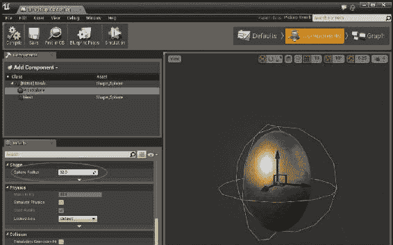

一旦基于 PickupItem 类创建蓝图，你就可以从其蓝图编辑 ProxSphere 根组件

最后，按照以下方式实现`Prox_Implementation`函数：

```cpp
void APickupItem::Prox_Implementation( AActor* OtherActor,  UPrimitiveComponent* OtherComp, int32 OtherBodyIndex, bool  bFromSweep, const FHitResult & SweepResult )
{
  // if the overlapped actor is NOT the player,
  // you simply should return
  if( Cast<AAvatar>( OtherActor ) == nullptr )
  {
    return;
  }

  // Get a reference to the player avatar, to give him
  // the item
  AAvatar *avatar = Cast<AAvatar>(  UGameplayStatics::GetPlayerPawn( GetWorld(), 0 ) );

  // Let the player pick up item
  // Notice use of keyword this!
  // That is how _this_ Pickup can refer to itself.
  avatar->Pickup( this );

  // Get a reference to the controller
  APlayerController* PController = GetWorld()- >GetFirstPlayerController();

  // Get a reference to the HUD from the controller
  AMyHUD* hud = Cast<AMyHUD>( PController->GetHUD() );
  hud->addMessage( Message( Icon, FString("Picked up ") + FString::FromInt(Quantity) + FString(" ") + Name, 5.f, FColor::White, FColor::Black ) );

  Destroy();
}
```

这里有一些相当重要的提示：首先，我们必须访问一些*全局变量*来获取我们需要的对象。我们将通过这些函数访问三个主要对象，这些函数用于操作 HUD：控制器（`APlayerController`）、HUD（`AMyHUD`）和玩家本人（`AAvatar`）。在游戏实例中，每种类型的对象只有一个。UE4 已经使查找它们变得容易。

### 获取头像

可以通过简单地调用以下代码在任何代码位置找到`player`类对象：

```cpp
AAvatar *avatar = Cast<AAvatar>(
  UGameplayStatics::GetPlayerPawn( GetWorld(), 0 ) );
```

我们通过调用之前定义的`AAvatar::Pickup()`函数将物品传递给他。

因为`PlayerPawn`对象实际上是一个`AAvatar`实例，我们使用`Cast<AAvatar>`命令将其结果转换为`AAvatar`类。`UGameplayStatics`函数族可以在代码的任何地方访问——它们是全局函数。

### 获取玩家控制器

从*超级全局变量*中检索玩家控制器：

```cpp
APlayerController* PController =
  GetWorld()->GetFirstPlayerController();
```

`GetWorld()`函数实际上是在`UObject`基类中定义的。由于所有 UE4 对象都从`UObject`派生，游戏中的任何对象实际上都可以访问`world`对象。

### 获取 HUD

虽然这个组织一开始可能看起来很奇怪，但实际上 HUD 是附着在玩家控制器上的。你可以按照以下方式检索 HUD：

```cpp
AMyHUD* hud = Cast<AMyHUD>( PController->GetHUD() );
```

由于我们之前在蓝图中将 HUD 设置为`AMyHUD`实例，我们可以将 HUD 对象转换为类型。由于我们经常使用 HUD，我们实际上可以在我们的`APickupItem`类中存储一个指向 HUD 的永久指针。我们将在稍后讨论这一点。

接下来，我们实现`AAvatar::Pickup`，它将`APickupItem`类型的对象添加到头像的背包中：

```cpp
void AAvatar::Pickup( APickupItem *item )
{
  if( Backpack.Find( item->Name ) )
  {
    // the item was already in the pack.. increase qty of it
    Backpack[ item->Name ] += item->Quantity;
  }
  else
  {
    // the item wasn't in the pack before, add it in now
    Backpack.Add(item->Name, item->Quantity);
    // record ref to the tex the first time it is picked up
    Icons.Add(item->Name, item->Icon);
  }
}
```

在前面的代码中，我们检查玩家刚刚获得的拾取物品是否已经在他的背包中。如果是，我们增加其数量。如果没有在他的背包中，我们将其添加到他的背包和`Icons`映射中。

要将拾取物品添加到背包中，请使用以下代码行：

```cpp
avatar->Pickup( this );
```

`APickupItem::Prox_Implementation`是这个成员函数将被调用的方式。

现在，当玩家按下*I*键时，我们需要在 HUD 中显示背包的内容。

# 绘制玩家库存

在像*Diablo*这样的游戏中，库存屏幕具有一个弹出窗口，过去捡到的物品图标以网格形式排列。我们可以在 UE4 中实现这种行为。

在 UE4 中绘制 UI 有几种方法。最基本的方法是简单地使用`HUD::DrawTexture()`调用。另一种方法是使用 Slate。还有另一种方法是使用最新的 UE4 UI 功能：**Unreal Motion Graphics**（**UMG**）设计器。

Slate 使用声明性语法在 C++中布局 UI 元素。Slate 最适合菜单等。UMG 是 UE 4.5 中引入的，它使用基于蓝图的工作流程。由于我们这里的重点是使用 C++代码的练习，我们将坚持使用`HUD::DrawTexture()`实现。这意味着我们将在代码中管理所有与库存相关的数据。

## 使用`HUD::DrawTexture()`

我们将分两步实现这一点。第一步是在用户按下*I*键时将我们的库存内容推送到 HUD。第二步是以网格状方式将图标实际渲染到 HUD 上。

为了保留有关如何渲染小部件的所有信息，我们声明一个简单的结构来保存有关它使用的图标、当前位置和当前大小的信息。

这就是`Icon`和`Widget`结构体的样子：

```cpp
struct Icon
{
  FString name;
  UTexture2D* tex;
  Icon(){ name = "UNKNOWN ICON"; tex = 0; }
  Icon( FString& iName, UTexture2D* iTex )
  {
    name = iName;
    tex = iTex;
  }
};

struct Widget
{
  Icon icon;
  FVector2D pos, size;
  Widget(Icon iicon)
  {
    icon = iicon;
  }
  float left(){ return pos.X; }
  float right(){ return pos.X + size.X; }
  float top(){ return pos.Y; }
  float bottom(){ return pos.Y + size.Y; }
};
```

您可以将这些结构声明添加到`MyHUD.h`的顶部，或者将它们添加到单独的文件中，并在使用这些结构的地方包含该文件。

注意`Widget`结构体上的四个成员函数，通过这些函数可以访问小部件的`left()`、`right()`、`top()`和`bottom()`函数。我们稍后会使用这些函数来确定点击点是否在框内。

接下来，我们在`AMyHUD`类中声明一个函数，该函数将在屏幕上渲染小部件：

```cpp
void AMyHUD::DrawWidgets()
{
  for( int c = 0; c < widgets.Num(); c++ )
  {
    DrawTexture( widgets[c].icon.tex, widgets[c].pos.X,  widgets[c].pos.Y, widgets[c].size.X, widgets[c].size.Y, 0, 0,  1, 1 );
    DrawText( widgets[c].icon.name, FLinearColor::Yellow,  widgets[c].pos.X, widgets[c].pos.Y, hudFont, .6f, false );
  }
}
```

应将`DrawWidgets()`函数的调用添加到`DrawHUD()`函数中：

```cpp
void AMyHUD::DrawHUD()
{
  Super::DrawHUD();
  // dims only exist here in stock variable Canvas
  // Update them so use in addWidget()
  dims.X = Canvas->SizeX;
  dims.Y = Canvas->SizeY;
  DrawMessages();
  DrawWidgets();
}
```

接下来，我们将填充`ToggleInventory()`函数。这是当用户按下*I*键时运行的函数：

```cpp
void AAvatar::ToggleInventory()
{
  // Get the controller & hud
  APlayerController* PController = GetWorld()- >GetFirstPlayerController();
  AMyHUD* hud = Cast<AMyHUD>( PController->GetHUD() );

  // If inventory is displayed, undisplay it.
  if( inventoryShowing )
  {
    hud->clearWidgets();
    inventoryShowing = false;
    PController->bShowMouseCursor = false;
    return;
  }

  // Otherwise, display the player's inventory
  inventoryShowing = true;
  PController->bShowMouseCursor = true;
  for( TMap<FString,int>::TIterator it =  Backpack.CreateIterator(); it; ++it )
  {
    // Combine string name of the item, with qty eg Cow x 5
    FString fs = it->Key + FString::Printf( TEXT(" x %d"), it- >Value );
    UTexture2D* tex;
    if( Icons.Find( it->Key ) )
      tex = Icons[it->Key];
    hud->addWidget( Widget( Icon( fs, tex ) ) );
  }
}
```

为了使前面的代码能够编译，我们需要在`AMyHUD`中添加一个函数：

```cpp
void AMyHUD::addWidget( Widget widget )
{
  // find the pos of the widget based on the grid.
  // draw the icons..
  FVector2D start( 200, 200 ), pad( 12, 12 );
  widget.size = FVector2D( 100, 100 );
  widget.pos = start;
  // compute the position here
  for( int c = 0; c < widgets.Num(); c++ )
  {
    // Move the position to the right a bit.
    widget.pos.X += widget.size.X + pad.X;
    // If there is no more room to the right then
    // jump to the next line
    if( widget.pos.X + widget.size.X > dims.X )
    {
      widget.pos.X = start.X;
      widget.pos.Y += widget.size.Y + pad.Y;
    }
  }
  widgets.Add( widget );
}
```

我们继续使用`Boolean`变量`inventoryShowing`来告诉我们库存是否当前显示。当库存显示时，我们也会显示鼠标，以便用户知道他在点击什么。此外，当库存显示时，玩家的自由移动被禁用。禁用玩家的自由移动的最简单方法是在实际移动之前从移动函数中返回。以下代码是一个示例：

```cpp
void AAvatar::Yaw( float amount )
{
  if( inventoryShowing )
  {
    return; // when my inventory is showing,
    // player can't move
  }
  AddControllerYawInput(200.f*amount * GetWorld()- >GetDeltaSeconds());
}
```

### 练习

使用`if( inventoryShowing ) { return; }`短路返回来检查每个移动函数。

## 检测库存物品点击

我们可以通过进行简单的点在框内碰撞检测来检测是否有人点击了我们的库存物品。点在框内测试是通过检查点击点与框内容的对比来完成的。

将以下成员函数添加到`struct Widget`中：

```cpp
struct Widget
{
  // .. rest of struct same as before ..
  bool hit( FVector2D p )
  {
    // +---+ top (0)
    // |   |
    // +---+ bottom (2) (bottom > top)
    // L   R
    return p.X > left() && p.X < right() && p.Y > top() && p.Y <  bottom();
  }
};
```

点在框内测试如下：

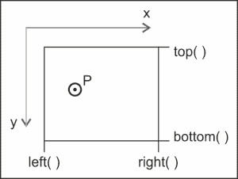

因此，如果 `p.X` 是以下所有情况，则视为命中：

+   右侧为 `left() (p.X > left())`

+   左侧为 `right() (p.X < right())`

+   以下 `top() (p.Y > top())`

+   上述 `bottom() (p.Y < bottom())`

记住，在 UE4（以及一般 UI 渲染）中，*y* 轴是反转的。换句话说，在 UE4 中 y 是向下的。这意味着 `top()` 小于 `bottom()`，因为原点（`(0, 0)` 点）位于屏幕的左上角。

### 拖动元素

我们可以轻松地拖动元素。启用拖动的第一步是响应左鼠标按钮点击。首先，我们将编写当左鼠标按钮被点击时执行的函数。在 `Avatar.h` 文件中，向类声明中添加以下原型：

```cpp
void MouseClicked();
```

在 `Avatar.cpp` 文件中，我们可以附加一个在鼠标点击时执行的函数，并将点击请求传递给 HUD，如下所示：

```cpp
void AAvatar::MouseClicked()
{
  APlayerController* PController = GetWorld()- >GetFirstPlayerController();
  AMyHUD* hud = Cast<AMyHUD>( PController->GetHUD() );
  hud->MouseClicked();
}
```

然后，在 `AAvatar::SetupPlayerInputComponent` 中，我们必须附加我们的响应者：

```cpp
InputComponent->BindAction( "MouseClickedLMB", IE_Pressed, this,  &AAvatar::MouseClicked );
```

以下截图显示了如何附加渲染：


向 `AMyHUD` 类添加一个成员：

```cpp
Widget* heldWidget;  // hold the last touched Widget in memory
```

接下来，在 `AMyHUD::MouseClicked()` 中，我们开始搜索被击中的 `Widget`：

```cpp
void AMyHUD::MouseClicked()
{
  FVector2D mouse;
  PController->GetMousePosition( mouse.X, mouse.Y );
  heldWidget = NULL; // clear handle on last held widget
  // go and see if mouse xy click pos hits any widgets
  for( int c = 0; c < widgets.Num(); c++ )
  {
    if( widgets[c].hit( mouse ) )
    {
      heldWidget = &widgets[c];// save widget
      return;                  // stop checking
    }
  }
}
```

在 `AMyHUD::MouseClicked` 函数中，我们遍历屏幕上的所有小部件，并检查与当前鼠标位置的碰撞。您可以通过简单地查找 `PController->GetMousePosition()` 在任何时间从控制器中获取当前鼠标位置。

每个小部件都会与当前鼠标位置进行比对，一旦鼠标拖动，被鼠标点击的小部件将会移动。一旦我们确定了哪个小部件被点击，我们就可以停止检查，因此我们从 `MouseClicked()` 函数中有一个 `return` 值。

虽然击中小部件是不够的。我们需要在鼠标移动时拖动被击中的小部件。为此，我们需要在 `AMyHUD` 中实现一个 `MouseMoved()` 函数：

```cpp
void AMyHUD::MouseMoved()
{
  static FVector2D lastMouse;
  FVector2D thisMouse, dMouse;
  PController->GetMousePosition( thisMouse.X, thisMouse.Y );
  dMouse = thisMouse - lastMouse;
  // See if the left mouse has been held down for
  // more than 0 seconds. if it has been held down,
  // then the drag can commence.
  float time = PController->GetInputKeyTimeDown(  EKeys::LeftMouseButton );
  if( time > 0.f && heldWidget )
  {
    // the mouse is being held down.
    // move the widget by displacement amt
    heldWidget->pos.X += dMouse.X;
    heldWidget->pos.Y += dMouse.Y; // y inverted
  }
  lastMouse = thisMouse;
}
```

不要忘记在 `MyHUD.h` 文件中包含声明。

拖动函数会查看鼠标位置在上一帧和当前帧之间的差异，并通过该量移动选定的小部件。一个 `static` 变量（具有局部作用域的全局变量）用于在 `MouseMoved()` 函数调用之间记住 `lastMouse` 位置。

我们如何将鼠标的运动与 `AMyHUD` 中的 `MouseMoved()` 函数运行联系起来？如果您记得，我们已经在 `Avatar` 类中连接了鼠标运动。我们使用的两个函数是 `AAvatar::Pitch()`（y 轴）和 `AAvatar::Yaw()`（x 轴）。扩展这些函数将使您能够将鼠标输入传递到 HUD。我现在将向您展示 `Yaw` 函数，然后您可以从那里推断出 `Pitch` 将如何工作：

```cpp
void AAvatar::Yaw( float amount )
{
  //x axis
  if( inventoryShowing )
  {
    // When the inventory is showing,
    // pass the input to the HUD
    APlayerController* PController = GetWorld()- >GetFirstPlayerController();
    AMyHUD* hud = Cast<AMyHUD>( PController->GetHUD() );
    hud->MouseMoved();
    return;
  }
  else
  {
    AddControllerYawInput(200.f*amount * GetWorld()- >GetDeltaSeconds());
  }
}
```

`AAvatar::Yaw()` 函数首先检查库存是否显示。如果显示，输入将直接路由到 HUD，而不会影响 `Avatar`。如果 HUD 不显示，输入仅发送到 `Avatar`。

### 练习

1.  完成`AAvatar::Pitch()`函数（y 轴）以将输入路由到 HUD 而不是`Avatar`。

1.  将第八章中的 NPC 角色“演员与棋子”，在玩家靠近时给予玩家一个物品（例如`GoldenEgg`）。

# 摘要

在本章中，我们介绍了如何为玩家设置多个可拾取物品，以便在关卡中显示并拾取。在下一章中，我们将介绍“怪物”，玩家将能够使用魔法咒语来防御怪物。
