# 第十一章。怪物

我们将为玩家添加一些对手。

在本章中，我所做的是给示例添加了一片风景。玩家将沿着为他雕刻出的路径行走，然后他将遇到一支军队。在他到达军队之前有一个 NPC 会提供建议。

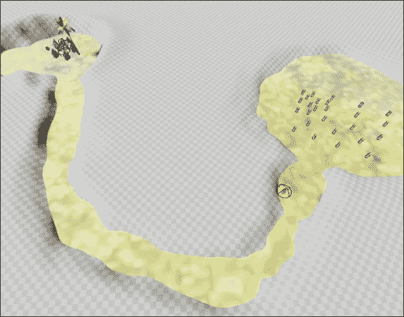

场景：开始看起来像一款游戏

# 景观

我们还没有在本书中介绍如何雕刻风景，但我们将在这里介绍。首先，你必须有一个可以工作的风景。通过导航到**文件** | **新建**来开始一个新文件。你可以选择一个空关卡或一个带有天空的关卡。在这个例子中，我选择了没有天空的那个。

要创建风景，我们必须从**模式**面板开始工作。确保通过导航到**窗口** | **模式**来显示**模式**面板：

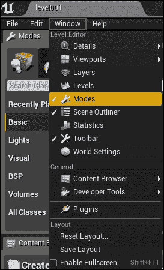

显示模式面板

创建风景可以分三步完成，如下面的屏幕截图所示，然后是相应的步骤：

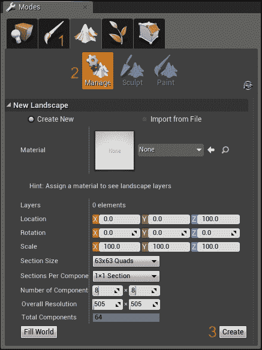

1.  点击**模式**面板中的景观图标（山脉的图片）。

1.  点击**管理**按钮。

1.  接下来，点击屏幕右下角的**创建**按钮。

现在，你应该有一个可以工作的风景。它将出现在主窗口中的灰色、拼贴区域：

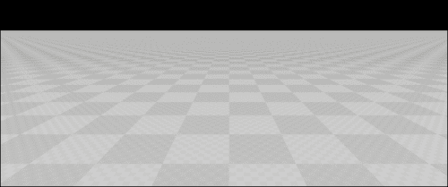

你首先想对你的风景场景做的事情是给它添加一些颜色。没有颜色的风景是什么？在你的灰色、拼贴的风景对象上右击。在右侧的**详细信息**面板中，你会看到它充满了信息，如下面的屏幕截图所示：

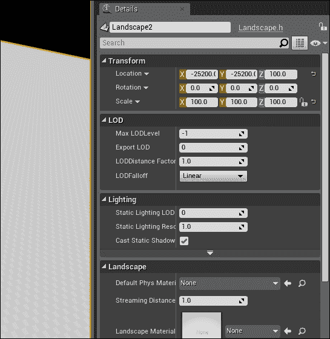

滚动直到你看到**景观材质**属性。你可以选择**M_Ground_Grass**材质来创建一个看起来逼真的地面。

接下来，向场景中添加一个光源。你可能想使用一个方向光源，这样所有的地面都会有一些光照。

## 雕刻风景

平坦的风景可能会很无聊。我们至少会给这个地方添加一些曲线和山丘。要做到这一点，请点击**模式**面板中的**雕刻**按钮：

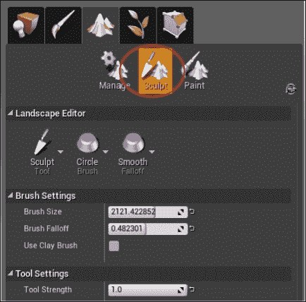

要更改风景，请点击**雕刻**按钮

您画笔的强度和大小由**模式**窗口中的**画笔大小**和**工具强度**参数决定。

点击您的风景并拖动鼠标以改变草地的海拔。一旦你对结果满意，点击**播放**按钮来尝试它。结果可以在以下屏幕截图中看到：

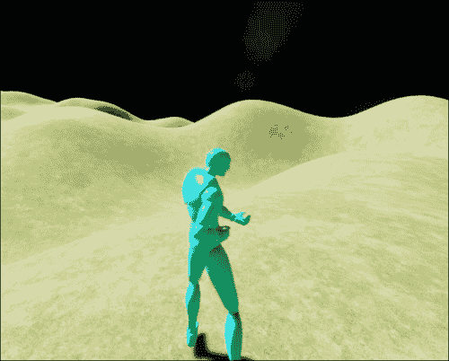

在你的风景上玩一玩，创建一个场景。我所做的是降低平坦地面周围的风景，这样玩家就有了一个定义明确的平坦区域可以行走，如下面的屏幕截图所示：

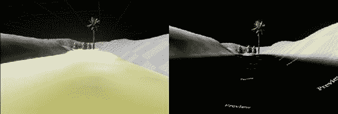

随意对你的景观进行任何你喜欢的操作。如果你喜欢，你可以用我在这里做的作为灵感。我建议你从**ContentExamples**或从**StrategyGame**导入资源，以便在游戏中使用。为此，请参考第十章中的*导入资源*部分，*库存系统和拾取物品*。当你完成资源导入后，我们可以继续将怪物引入你的世界。

# 怪物

我们将以与编程 NPC 和`PickupItem`相同的方式开始编程怪物。首先，我们将编写一个基类（通过从`Character`派生）来表示`Monster`类。然后，我们将为每种怪物类型派生许多蓝图。每个怪物都将有一些共同属性，这些属性决定了它的行为。这些是共同属性：

+   一个表示速度的`float`变量。

+   一个表示`HitPoints`值的`float`变量（我通常使用浮点数表示 HP，这样我们就可以轻松地模拟 HP 吸血效果，例如走过一池熔岩）。

+   一个表示击败怪物获得的经验值的`int32`变量。

+   一个用于怪物掉落物品的`UClass`函数。

+   每次攻击时对`BaseAttackDamage`进行的`float`变量。

+   一个表示攻击超时的`float`变量，即怪物在攻击之间的休息时间。

+   两个`USphereComponents`对象：其中一个为`SightSphere`——他能看到多远。另一个是`AttackRangeSphere`，表示他的攻击能到达多远。`AttackRangeSphere`对象总是小于`SightSphere`。

从`Character`类派生以创建你的`Monster`类。你可以在 UE4 中通过转到**文件** | **将代码添加到项目...**，然后从菜单中选择你的基类**Character**选项来完成此操作。

在`Monster`类中填写基础属性。确保声明`UPROPERTY(EditAnywhere, BlueprintReadWrite, Category = MonsterProperties)`，这样可以在蓝图上更改怪物的属性：

```cpp
UCLASS()
class GOLDENEGG_API AMonster : public ACharacter
{
  GENERATED_UCLASS_BODY()

  // How fast he is
  UPROPERTY(EditAnywhere, BlueprintReadWrite, Category =  MonsterProperties)
  float Speed;

  // The hitpoints the monster has
  UPROPERTY(EditAnywhere, BlueprintReadWrite, Category =  MonsterProperties)
  float HitPoints;

  // Experience gained for defeating
  UPROPERTY(EditAnywhere, BlueprintReadWrite, Category =  MonsterProperties)
  int32 Experience;

  // Blueprint of the type of item dropped by the monster
  UPROPERTY(EditAnywhere, BlueprintReadWrite, Category =  MonsterProperties)
  UClass* BPLoot;

  // The amount of damage attacks do
  UPROPERTY(EditAnywhere, BlueprintReadWrite, Category =  MonsterProperties)
  float BaseAttackDamage;

  // Amount of time the monster needs to rest in seconds
  // between attacking
  UPROPERTY(EditAnywhere, BlueprintReadWrite, Category =  MonsterProperties)
  float AttackTimeout;

  // Time since monster's last strike, readable in blueprints
  UPROPERTY(VisibleAnywhere, BlueprintReadOnly, Category =  MonsterProperties)
  float TimeSinceLastStrike;

  // Range for his sight
  UPROPERTY(VisibleDefaultsOnly, BlueprintReadOnly, Category =  Collision)
  USphereComponent* SightSphere;

  // Range for his attack. Visualizes as a sphere in editor,
  UPROPERTY(VisibleDefaultsOnly, BlueprintReadOnly, Category =  Collision)
  USphereComponent* AttackRangeSphere;
};
```

你需要在`Monster`构造函数中添加一些基本的代码来初始化怪物的属性。在`Monster.cpp`文件中使用以下代码：

```cpp
AMonster::AMonster(const class FObjectInitializer& PCIP) : Super(PCIP)
{
  Speed = 20;
  HitPoints = 20;
  Experience = 0;
  BPLoot = NULL;
  BaseAttackDamage = 1;
  AttackTimeout = 1.5f;
  TimeSinceLastStrike = 0;

  SightSphere = PCIP.CreateDefaultSubobject<USphereComponent> (this, TEXT("SightSphere"));
  SightSphere->AttachTo( RootComponent );

  AttackRangeSphere = PCIP.CreateDefaultSubobject <USphereComponent>(this, TEXT("AttackRangeSphere"));
  AttackRangeSphere->AttachTo( RootComponent );
}
```

编译并运行代码。打开 Unreal 编辑器，基于你的`Monster`类（命名为`BP_Monster`）创建一个蓝图。现在我们可以开始配置你的怪物属性。

对于骨骼网格，我们不会为怪物使用`HeroTPP`模型，因为我们需要怪物能够进行近战攻击，而`HeroTPP`模型并不包含近战攻击。然而，**Mixamo Animation Pack**文件中的一些模型包含近战攻击动画。因此，请从 UE4 市场下载**Mixamo Animation Pack**文件（免费）。


在包中有些相当令人厌恶的模型，我会避免使用，但也有一些相当不错

接下来，您应该将**Mixamo Animation Pack**文件添加到您的项目中，如下面的截图所示：

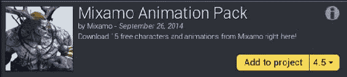

现在，基于您的`Monster`类创建一个名为`BP_Monster`的蓝图。编辑蓝图类属性并选择**Mixamo_Adam**（实际上在当前包的版本中写作**Maximo_Adam**）作为骨骼网格。同时，选择**MixamoAnimBP_Adam**作为动画蓝图。

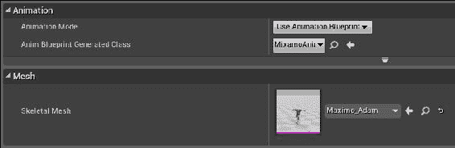

选择 Maximo_Adam 骨骼网格和 MixamoAnimBP_Adam 作为动画蓝图生成的类

我们将修改动画蓝图，以便正确地结合近战攻击动画。

当您编辑`BP_Monster`蓝图时，将`SightSphere`和`AttackRangeSphere`对象的大小调整为对您有意义的值。我将我的怪物的`AttackRangeSphere`对象设置得刚好足够接近手臂的长度（60 单位），而将`SightSphere`对象设置为大约是其 25 倍大（大约 1,500 单位）。

记住，一旦玩家进入怪物的`SightSphere`，怪物就会开始向玩家移动，一旦玩家在怪物的`AttackRangeSphere`对象内部，怪物就会开始攻击玩家。

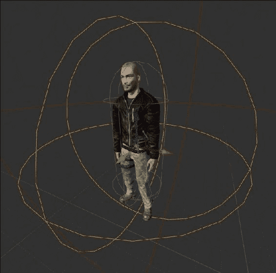

Mixamo Adam 及其 AttackRangeSphere 对象以橙色突出显示

在您的游戏中放置一些**BP_Monster**实例；编译并运行。如果没有代码来驱动`Monster`角色移动，您的怪物应该只是在那里无所事事地站立。

## 基本怪物智能

在我们的游戏中，我们将只向`Monster`角色添加基本智能。怪物将知道如何做两件基本的事情：

+   跟踪玩家并跟随他

+   攻击玩家

怪物不会做其他任何事情。您还可以让怪物在第一次看到玩家时挑衅玩家，但我们将把这个留作您的练习。

### 移动怪物 - 导航行为

在非常基本的游戏中，怪物通常不会有复杂的运动行为。通常它们只是走向目标并攻击它。我们将在这个游戏中编程这种类型的怪物，但请注意，您可以通过让怪物在战场上占据有利位置进行远程攻击等方式获得更有趣的游戏体验。我们不会在这里编程这些，但这是一个值得思考的问题。

为了让`Monster`角色向玩家移动，我们需要在每个帧中动态更新`Monster`角色移动的方向。为了更新怪物面对的方向，我们在`Monster::Tick()`方法中编写代码。

`Tick`函数在游戏的每一帧中运行。`Tick`函数的签名是：

```cpp
virtual void Tick(float DeltaSeconds) override;
```

您需要将此函数的原型添加到您的`Monster`类中，在您的`Monster.h`文件中。如果我们重写`Tick`，我们就可以在每个帧中放置`Monster`角色应该执行的自己的自定义行为。以下是一些基本的代码，它将在每个帧中将怪物移动到玩家附近：

```cpp
void AMonster::Tick(float DeltaSeconds)
{
  Super::Tick( DeltaSeconds );

  // basic intel: move the monster towards the player
  AAvatar *avatar = Cast<AAvatar>(  UGameplayStatics::GetPlayerPawn(GetWorld(), 0) );
  if( !avatar ) return;

  FVector toPlayer = avatar->GetActorLocation() -  GetActorLocation();
  toPlayer.Normalize();	// reduce to unit vector

  // Actually move the monster towards the player a bit
  AddMovementInput(toPlayer, Speed*DeltaSeconds);

  // At least face the target
  // Gets you the rotator to turn something
  // that looks in the `toPlayer` direction
  FRotator toPlayerRotation = toPlayer.Rotation();
  toPlayerRotation.Pitch = 0; // 0 off the pitch
  RootComponent->SetWorldRotation( toPlayerRotation );
}
```

要使`AddMovementInput`正常工作，你必须在蓝图中的**AIController Class**面板下选择一个控制器，如下面的截图所示：

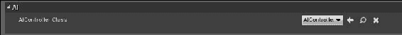

如果你选择了`None`，对`AddMovementInput`的调用将没有任何效果。为了避免这种情况，请选择`AIController`类或`PlayerController`类作为你的**AIController Class**。

上述代码非常简单。它构成了最基本形式的敌人智能：在每个帧中通过增量小量向玩家移动。

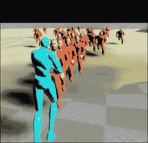

我们不那么聪明的怪物军队正在追逐玩家

在一系列帧的结果中，怪物将跟踪并跟随玩家在关卡中移动。要理解这是如何工作的，你必须记住`Tick`函数平均每秒大约被调用 60 次。这意味着在每个帧中，怪物都会向玩家靠近一小步。由于怪物以非常小的步伐移动，他的动作看起来很平滑和连续（而在现实中，他在每个帧中都在进行小跳跃和跳跃）。

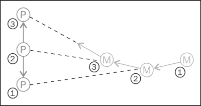

跟踪的离散性：怪物在三个叠加帧中的运动

### 小贴士

怪物每秒移动大约 60 次的原因是由于硬件限制。典型显示器的刷新率为 60 Hz，因此它实际上限制了每秒有多少次更新是有用的。以比刷新率更快的帧率更新是可能的，但对于游戏来说，这并不一定有用，因为在大多数硬件上，你每秒只能看到一次新的画面。一些高级的物理建模模拟每秒可以更新近 1,000 次，但可以说，对于游戏来说，你不需要那么高的分辨率，你应该将额外的 CPU 时间留给玩家会喜欢的功能，比如更好的 AI 算法。一些较新的硬件声称刷新率高达 120 Hz（查找游戏显示器，但不要告诉你的父母我让你花所有钱买一个）。

### 怪物运动的离散性

计算机游戏本质上是离散的。在前面的叠加序列帧的截图中，玩家被看到以微小的步伐直线向上移动屏幕。怪物的运动也是以小步伐进行的。在每个帧中，怪物都会向玩家迈出一小步。当怪物在每一帧直接向玩家所在的位置移动时，他似乎在沿着一条曲线路径移动。

要将怪物移动到玩家身边，我们首先需要获取玩家的位置。由于玩家可以通过全局函数 `UGameplayStatics::GetPlayerPawn` 访问，我们只需使用此函数检索我们的玩家指针。接下来，我们找到从 `Monster` (`GetActorLocation()`) 函数指向玩家 (`avatar->GetActorLocation()`) 的向量。我们需要找到从怪物指向玩家的向量。为此，你必须从怪物的位置减去玩家的位置，如下面的截图所示：

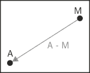

这是一个简单的数学规则，但很容易出错。要得到正确的向量，始终从目标（终点）向量中减去源（起点）向量。在我们的系统中，我们必须从 `Avatar` 向量中减去 `Monster` 向量。这是因为从系统中减去 `Monster` 向量将 `Monster` 向量移动到原点，而 `Avatar` 向量将位于 `Monster` 向量的左下角：

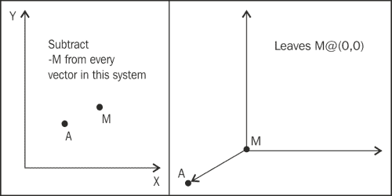

从系统中减去怪物向量将怪物向量移动到 (0,0)

一定要尝试运行你的代码。到目前为止，怪物将会朝向你的玩家跑来，并围绕他聚集。按照前面的代码，它们不会攻击；它们只是跟随他，如下面的截图所示：

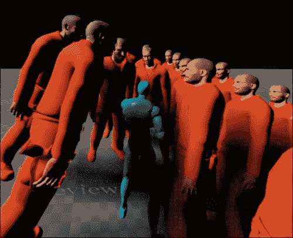

### 怪物视野球体

目前，怪物没有注意到 `SightSphere` 组件。也就是说，无论玩家在世界中的哪个位置，在当前设置下，怪物都会朝向他移动。我们现在想改变这一点。

要做到这一点，我们只需要让 `Monster` 尊重 `SightSphere` 限制。如果玩家位于怪物的 `SightSphere` 对象内，怪物将会追逐。否则，怪物将不会注意到玩家的位置，也不会追逐玩家。

检查一个对象是否在球体内很简单。在下面的截图中，如果点 **p** 与质心 **c** 之间的距离 **d** 小于球体半径 **r**，则 **p** 在球体内：

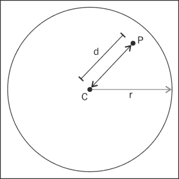

当 d 小于 r 时，P 在球体内

因此，在我们的代码中，上述截图转换为以下代码：

```cpp
void AMonster::Tick(float DeltaSeconds)
{
  Super::Tick( DeltaSeconds );
  AAvatar *avatar = Cast<AAvatar>(  UGameplayStatics::GetPlayerPawn(GetWorld(), 0) );
  if( !avatar ) return;
    FVector toPlayer = avatar->GetActorLocation() -  GetActorLocation();
  float distanceToPlayer = toPlayer.Size();
  // If the player is not in the SightSphere of the monster,
  // go back
  if( distanceToPlayer > SightSphere->GetScaledSphereRadius() )
  {
    // If the player is out of sight,
    // then the enemy cannot chase
    return;
  }

  toPlayer /= distanceToPlayer;  // normalizes the vector
  // Actually move the monster towards the player a bit
  AddMovementInput(toPlayer, Speed*DeltaSeconds);
  // (rest of function same as before (rotation))
}
```

上述代码为 `Monster` 角色添加了额外的智能。现在，如果玩家位于怪物的 `SightSphere` 对象之外，`Monster` 角色可以停止追逐玩家。结果将如下所示：

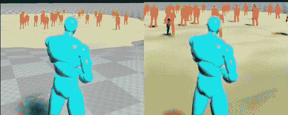

这里一个好的做法是将距离比较封装成一个简单的内联函数。我们可以在 `Monster` 头文件中提供这两个内联成员函数，如下所示：

```cpp
inline bool isInSightRange( float d )
{ return d < SightSphere->GetScaledSphereRadius(); }
inline bool isInAttackRange( float d )
{ return d < AttackRangeSphere->GetScaledSphereRadius(); }
```

这些函数在传递的参数 `d` 在所讨论的球体内时返回值 `true`。

### 小贴士

内联函数意味着这个函数更像是一个宏而不是一个函数。宏被复制粘贴到调用位置，而函数是通过 C++跳转到其位置并执行的。内联函数的好处是它们提供了良好的性能，同时保持了代码的易读性，并且是可重用的。

# 怪物对玩家的攻击

怪物可以执行几种不同的攻击类型。根据`Monster`角色的类型，怪物的攻击可能是近战（近距离）或远程（投射武器）。

当玩家在怪物的`AttackRangeSphere`内时，`Monster`角色会攻击玩家。如果玩家在怪物的`AttackRangeSphere`范围之外，但玩家在怪物的`SightSphere`对象内，那么怪物会移动到玩家附近，直到玩家进入怪物的`AttackRangeSphere`。

## 近战攻击

“近战”的字典定义是一群混乱的人群。近战攻击是在近距离进行的攻击。想象一下一群*zerglings*和一群*ultralisks*在战斗（如果你是《星际争霸》玩家，你会知道 zerglings 和 ultralisks 都是近战单位）。近战攻击基本上是近距离的肉搏战。要进行近战攻击，你需要一个在怪物开始近战攻击时启动的近战攻击动画。为此，你需要编辑*Persona*中的动画蓝图，这是 UE4 的动画编辑器。

### 小贴士

Zak Parrish 的*Persona*系列是一个很好的起点，可以用来在蓝图中进行动画编程：[`www.youtube.com/watch?v=AqYmC2wn7Cg&list=PL6VDVOqa_mdNW6JEu9UAS_s40OCD_u6yp&index=8`](https://www.youtube.com/watch?v=AqYmC2wn7Cg&list=PL6VDVOqa_mdNW6JEu9UAS_s40OCD_u6yp&index=8).

目前，我们只需编程近战攻击，然后稍后再修改蓝图中的动画。

### 定义近战武器

定义我们的近战武器将分为三个部分。第一部分是代表它的 C++代码。第二部分是模型，第三部分是使用 UE4 蓝图将代码和模型连接起来。

#### C++中的近战武器编程

我们将定义一个新的类，`AMeleeWeapon`（从`AActor`派生），来表示手持近战武器。我将在`AMeleeWeapon`类中附加一些蓝图可编辑的属性，`AMeleeWeapon`类将如下所示：

```cpp
class AMonster;

UCLASS()
class GOLDENEGG_API AMeleeWeapon : public AActor
{
  GENERATED_UCLASS_BODY()

  // The amount of damage attacks by this weapon do
  UPROPERTY(EditAnywhere, BlueprintReadWrite, Category =  MeleeWeapon)
  float AttackDamage;

  // A list of things the melee weapon already hit this swing
  // Ensures each thing sword passes thru only gets hit once
  TArray<AActor*> ThingsHit;

  // prevents damage from occurring in frames where
  // the sword is not swinging
  bool Swinging;

  // "Stop hitting yourself" - used to check if the 
  // actor holding the weapon is hitting himself
  AMonster *WeaponHolder;

  // bounding box that determines when melee weapon hit
  UPROPERTY(VisibleDefaultsOnly, BlueprintReadOnly, Category =  MeleeWeapon)
  UBoxComponent* ProxBox;

  UPROPERTY(VisibleDefaultsOnly, BlueprintReadOnly, Category =  MeleeWeapon)
  UStaticMeshComponent* Mesh;

  UFUNCTION(BlueprintNativeEvent, Category = Collision)
  void Prox( AActor* OtherActor, UPrimitiveComponent* OtherComp,  int32 OtherBodyIndex, bool bFromSweep, const FHitResult &  SweepResult );
  void Swing();
  void Rest();
};
```

注意我如何为`ProxBox`使用了一个边界框，而不是边界球体。这是因为剑和斧头更适合用边界框而不是球体来近似。这个类中有两个成员函数，`Rest()`和`Swing()`，它们让`MeleeWeapon`知道演员处于什么状态（休息或挥动）。在这个类内部还有一个`TArray<AActor*> ThingsHit`属性，它跟踪每次挥动时被这把近战武器击中的演员。我们正在编程，使得武器在每次挥动中只能击中每个东西一次。

`AMeleeWeapon.cpp` 文件将只包含一个基本的构造函数和一些简单的代码，用于当我们的剑击中敌人时向 `OtherActor` 发送伤害。我们还将实现 `Rest()` 和 `Swing()` 函数来清除被击中的物品列表。`MeleeWeapon.cpp` 文件有以下代码：

```cpp
AMeleeWeapon::AMeleeWeapon(const class FObjectInitializer& PCIP) :  Super(PCIP)
{
  AttackDamage = 1;
  Swinging = false;
  WeaponHolder = NULL;

  Mesh = PCIP.CreateDefaultSubobject<UStaticMeshComponent>(this,  TEXT("Mesh"));
  RootComponent = Mesh;

  ProxBox = PCIP.CreateDefaultSubobject<UBoxComponent>(this,  TEXT("ProxBox"));
  ProxBox->OnComponentBeginOverlap.AddDynamic( this,  &AMeleeWeapon::Prox );
  ProxBox->AttachTo( RootComponent );
}

void AMeleeWeapon::Prox_Implementation( AActor* OtherActor,  UPrimitiveComponent* OtherComp, int32 OtherBodyIndex, bool  bFromSweep, const FHitResult & SweepResult )
{
  // don't hit non root components
  if( OtherComp != OtherActor->GetRootComponent() )
  {
    return;
  }

  // avoid hitting things while sword isn't swinging,
  // avoid hitting yourself, and
  // avoid hitting the same OtherActor twice
  if( Swinging && OtherActor != WeaponHolder &&  !ThingsHit.Contains(OtherActor) )
  {
    OtherActor->TakeDamage( AttackDamage + WeaponHolder- >BaseAttackDamage, FDamageEvent(), NULL, this );
    ThingsHit.Add( OtherActor );
  }
}
void AMeleeWeapon::Swing()
{
  ThingsHit.Empty();  // empty the list
  Swinging = true;
}
void AMeleeWeapon::Rest()
{
  ThingsHit.Empty();
  Swinging = false;
}
```

#### 下载剑模型

要完成这个练习，我们需要一把剑放入模型的手中。我从 [`tf3dm.com/3d-model/sword-95782.html`](http://tf3dm.com/3d-model/sword-95782.html) 的 Kaan Gülhan 的项目中添加了一把名为 *Kilic* 的剑。以下是你将获得免费模型的其他地方列表：

+   [`www.turbosquid.com/`](http://www.turbosquid.com/)

+   [`tf3dm.com/`](http://tf3dm.com/)

+   [`archive3d.net/`](http://archive3d.net/)

+   [`www.3dtotal.com/`](http://www.3dtotal.com/)

### 提示

**秘密提示**

在 [TurboSquid.com](http://TurboSquid.com) 上，一开始可能看起来没有免费模型。实际上，秘密在于你必须搜索价格范围 $0-$0 来找到它们。$0 表示免费。

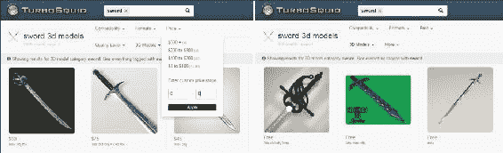

TurboSquid 搜索免费剑模型

我不得不稍微编辑一下 *kilic* 剑网格以修复初始尺寸和旋转。你可以将任何 **Filmbox** （**FBX**） 格式的网格导入到你的游戏中。kilic 剑模型位于第十一章（part0076_split_000.html#28FAO1-dd4a3f777fc247568443d5ffb917736d "第十一章. 怪物"）的示例代码包中，*怪物*。

要将你的剑导入到 UE4 编辑器中，右键单击你想要添加模型的任何文件夹。导航到 **新建资产** | **导入到** | **游戏** | **模型...**，然后从弹出的文件资源管理器中选择你想要导入的新资产。如果不存在 **模型** 文件夹，你可以通过在左侧的树视图中右键单击并选择 **内容浏览器** 选项卡左侧面板中的 **新建文件夹** 来创建一个。我选择了来自桌面的 `kilic.fbx` 资产。

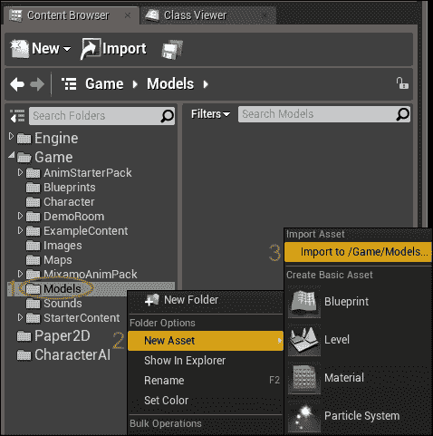

将模型导入到你的项目中

#### 为你的近战武器创建蓝图

在 UE4 编辑器内部，创建一个基于 `AMeleeWeapon` 的蓝图，命名为 `BP_MeleeSword`。配置 `BP_MeleeSword` 以使用 *kilic* 刀刃模型（或你选择的任何刀刃模型），如下面的截图所示：

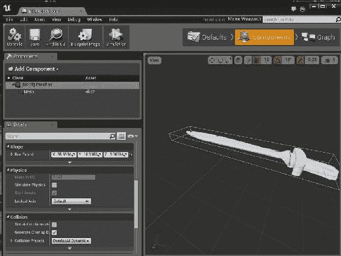

`ProxBox` 类将确定是否被武器击中，因此我们将修改 `ProxBox` 类，使其仅包围剑的刀刃，如下面的截图所示：

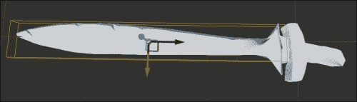

此外，在 **碰撞预设** 面板下，选择网格的 **无碰撞** 选项（而不是 **阻止所有**）非常重要。以下截图展示了这一点：

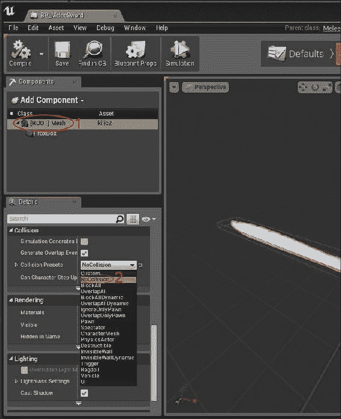

如果你选择**BlockAll**，那么游戏引擎将自动解决剑和角色之间的所有穿透问题，通过在挥剑时推开剑接触到的任何东西。结果是，每当挥剑时，你的角色看起来就像要飞起来一样。

## 插槽

在 UE4 中，插槽是一个骨骼网格上的用于另一个`Actor`的容器。你可以在骨骼网格身体上的任何位置放置插槽。在你正确放置插槽后，你可以在 UE4 代码中将另一个`Actor`附加到这个插槽上。

例如，如果我们想在怪物手中放置一把剑，我们只需在怪物手中创建一个插槽即可。我们可以在玩家头部创建一个插槽来为玩家戴上头盔。

### 在怪物手中创建骨骼网格插槽

要将插槽附加到怪物手中，我们必须编辑怪物使用的骨骼网格。由于我们为怪物使用了`Mixamo_Adam`骨骼网格，我们必须打开并编辑这个骨骼网格。

要这样做，在**内容浏览器**选项卡中双击**Mixamo_Adam**骨骼网格（这将显示为 T 姿势）以打开骨骼网格编辑器。如果你在**内容浏览器**选项卡中没有看到**Mixamo Adam**，请确保你已经从 Unreal Launcher 应用程序中将**Mixamo Animation Pack**文件导入到你的项目中。

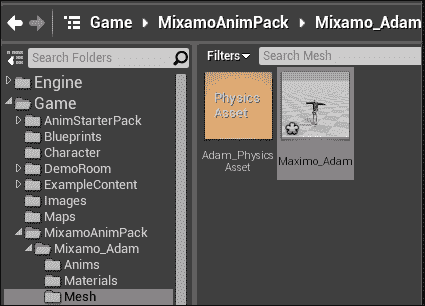

通过双击 Maximo_Adam 骨骼网格对象来编辑 Maximo_Adam 网格

点击屏幕右上角的**骨骼**。在左侧面板中的骨骼树中向下滚动，直到找到**RightHand**骨骼。我们将在这个骨骼上添加一个插槽。在**RightHand**骨骼上右键单击并选择**添加插槽**，如下面的截图所示：

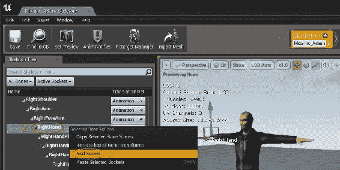

你可以保留默认名称（**RightHandSocket**）或者如果你喜欢的话，可以重命名插槽，如下面的截图所示：

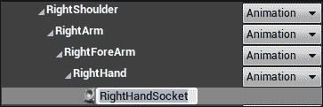

接下来，我们需要在演员的手中添加一把剑。

### 将剑附加到模型

在打开亚当骨骼网格后，在树视图中找到**RightHandSocket**选项。由于亚当用右手挥剑，你应该将剑附加到他的右手。将你的剑模型拖放到**RightHandSocket**选项中。你应该在以下截图右侧的模型图像中看到亚当握住剑：

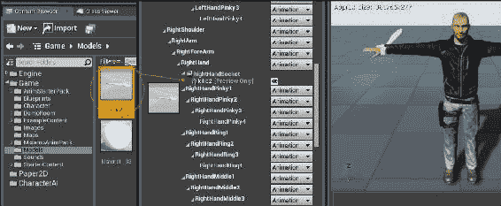

现在，点击**RightHandSocket**并放大亚当的手。我们需要调整预览中插槽的位置，以便剑能够正确地放入其中。使用移动和旋转操纵杆调整剑的位置，使其正确地放入他的手中。

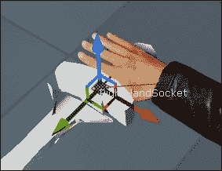

将插槽定位在右手，使剑正确放置

### **提示**

**现实世界技巧**

如果你想要在同一个**RightHandSocket**中切换多个剑模型，你需要确保这些剑之间有相当程度的统一性（没有异常）。

你可以通过转到屏幕右上角的**动画**选项卡来预览手持剑的动画。

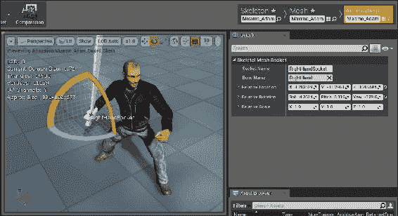

为模型装备剑

然而，如果你启动游戏，亚当将不会手持剑。这是因为将剑添加到*Persona*中的插槽只是为了预览。

### 为玩家装备剑的代码

要从代码中为玩家装备剑并将其永久绑定到 actor，实例化一个`AMeleeWeapon`实例，并在怪物实例初始化后将其附加到`RightHandSocket`。我们在`PostInitializeComponents()`中这样做，因为在这个函数中，`Mesh`对象已经完全初始化。

在`Monster.h`文件中，添加一个钩子来选择用于的近战武器的**蓝图**类名（`UClass`）。同时添加一个钩子来存储`MeleeWeapon`实例的变量，使用以下代码：

```cpp
// The MeleeWeapon class the monster uses
// If this is not set, he uses a melee attack
UPROPERTY(EditAnywhere, BlueprintReadWrite, Category =  MonsterProperties)
UClass* BPMeleeWeapon;

// The MeleeWeapon instance (set if the character is using
// a melee weapon)
AActor* MeleeWeapon;
```

现在，在你的怪物蓝图类中选择`BP_MeleeSword`蓝图。

在 C++代码中，你需要实例化这个武器。为此，我们需要为`Monster`类声明并实现一个`PostInitializeComponents`函数。在`Monster.h`文件中，添加一个原型声明：

```cpp
virtual void PostInitializeComponents() override;
```

`PostInitializeComponents`在怪物对象的构造函数完成后运行，并且所有对象组件都已初始化（包括蓝图构造）。因此，这是检查怪物是否附有`MeleeWeapon`蓝图以及实例化该武器的完美时机。以下代码添加到`Monster.cpp`实现中的`AMonster::PostInitializeComponents()`以实例化武器：

```cpp
void AMonster::PostInitializeComponents()
{
  Super::PostInitializeComponents();

  // instantiate the melee weapon if a bp was selected
  if( BPMeleeWeapon )
  {
    MeleeWeapon = GetWorld()->SpawnActor<AMeleeWeapon>(
      BPMeleeWeapon, FVector(), FRotator() );

    if( MeleeWeapon )
    {
      const USkeletalMeshSocket *socket = Mesh->GetSocketByName(  "RightHandSocket" ); // be sure to use correct
                           // socket name!
      socket->AttachActor( MeleeWeapon, Mesh );
    }
  }
}
```

如果为该怪物的蓝图选择了`BPMeleeWeapon`，那么怪物现在将手持剑开始。

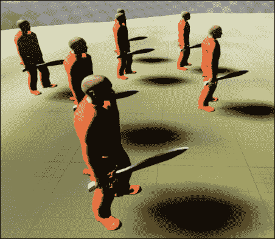

持有武器的怪物

### 触发攻击动画

默认情况下，我们的 C++ `Monster`类与触发攻击动画之间没有连接；换句话说，`MixamoAnimBP_Adam`类没有方法知道怪物是否处于攻击状态。

因此，我们需要更新亚当骨骼的动画蓝图（`MixamoAnimBP_Adam`），以包括在`Monster`类变量列表中的查询，并检查怪物是否处于攻击状态。我们在这本书中之前还没有处理过动画蓝图（或蓝图），但按照步骤一步一步来，你应该会看到它整合在一起。

### 小贴士

我在这里会温和地介绍蓝图术语，但我鼓励你查看 Zak Parrish 的教程系列，以了解蓝图的入门知识：[`www.youtube.com/playlist?list=PLZlv_N0_O1gbYMYfhhdzfW1tUV4jU0YxH`](https://www.youtube.com/playlist?list=PLZlv_N0_O1gbYMYfhhdzfW1tUV4jU0YxH)。

#### 蓝图基础

UE4 蓝图是代码的视觉实现（不要与人们有时所说的 C++类是类实例的隐喻性蓝图混淆）。在 UE4 蓝图中，你不需要实际编写代码，而是将元素拖放到图上，并将它们连接起来以实现所需的播放。通过将正确的节点连接到正确的元素，你可以在游戏中编程任何你想要的东西。

### 提示

本书不鼓励使用蓝图，因为我们正在努力鼓励你编写自己的代码。然而，动画最好用蓝图来完成，因为这是艺术家和设计师所熟悉的。

让我们编写一个示例蓝图，以了解它们是如何工作的。首先，点击顶部的蓝图菜单栏，然后选择**打开关卡蓝图**，如下面的截图所示：

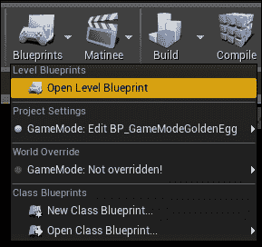

**关卡蓝图**选项在开始关卡时自动执行。一旦你打开这个窗口，你应该会看到一个空白画布，你可以在这里创建你的游戏玩法，如下所示：

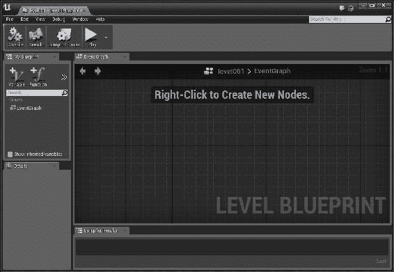

在图纸上任何地方右键单击。开始键入`begin`，然后从出现的下拉列表中选择**事件开始播放**选项。确保勾选了**上下文相关**复选框，如下面的截图所示：

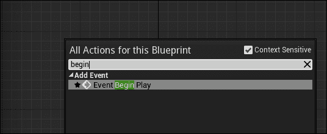

立即点击**事件开始播放**选项后，你的屏幕上会出现一个红色框。它右侧有一个单独的白色引脚。这被称为执行引脚，如下所示：

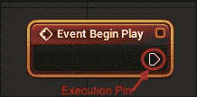

关于动画蓝图，你需要知道的第一件事是白色引脚执行路径（即白色线条）。如果你之前见过蓝图图，你一定注意到了一条穿过图的白色线条，如下面的图所示：

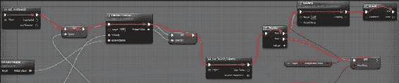

白色引脚执行路径基本上等同于有一行行代码依次运行。白色线条决定了哪些节点将被执行以及执行顺序。如果一个节点没有连接白色执行引脚，那么该节点将根本不会执行。

从**事件开始播放**拖出白色执行引脚。首先在**可执行动作**对话框中键入`draw debug box`。选择弹出的第一个选项（**f** **绘制调试框**），如下所示：

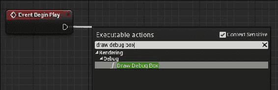

填写一些关于你想要盒子看起来怎样的细节。在这里，我选择了蓝色作为盒子的颜色，盒子的中心在 (0, 0, 100)，盒子的大小为 (200, 200, 200)，持续时间为 180 秒（务必输入足够长的时间以看到结果），如下面的截图所示：

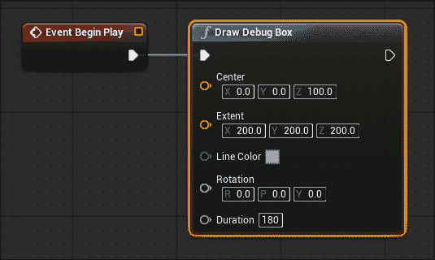

现在点击 **播放** 按钮以实现图表。记住，你必须找到世界原点才能看到调试框。

通过将一个金色鸡蛋放置在 (0, 0, (某个 z 值)) 来找到世界原点，如下面的截图所示：

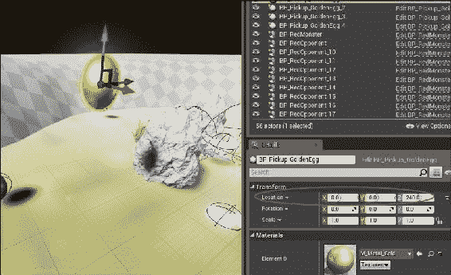

这就是盒子在关卡中的样子：

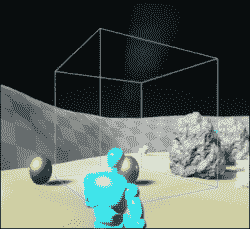

在原点渲染的调试框

#### 修改 Mixamo Adam 的动画蓝图

要集成我们的攻击动画，我们必须修改蓝图。在 **内容浏览器** 中打开 `MixamoAnimBP_Adam`。

你首先会注意到图表分为两个部分：一个顶部部分和一个底部部分。顶部部分标记为 "**基本角色移动**..."，而底部部分说 "**Mixamo 示例角色动画**...." 基本角色移动负责模型的行走和跑步动作。我们将工作在 **带有攻击和跳跃的 Mixamo 示例角色动画** 部分，该部分负责攻击动画。我们将工作在图表的后半部分，如下面的截图所示：

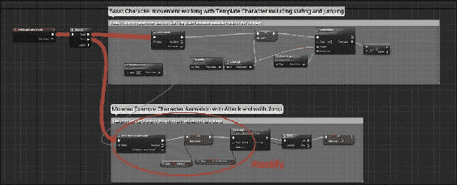

当你第一次打开图表时，它最初会放大靠近底部的某个部分。要向上滚动，右键单击鼠标并向上拖动。你还可以使用鼠标滚轮或按住 *Alt* 键和右鼠标按钮同时向上移动鼠标来缩小。

在继续之前，你可能想要复制 **MixamoAnimBP_Adam** 资源，以免损坏原始资源，以防你需要稍后返回并更改某些内容。这允许你在发现你在修改中犯了一个错误时，可以轻松返回并纠正，而无需在你的项目中重新安装整个动画包的新副本。

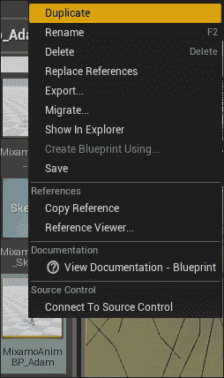

制作 MixamoAnimBP_Adam 资源的副本以避免损坏原始资产

### 小贴士

当从 Unreal Launcher 向项目中添加资产时，会创建原始资产的副本，因此你现在可以修改项目中的 **MixamoAnimBP_Adam**，并在稍后在新项目中获取原始资产的新副本。

我们将只做几件事情，让 Adam 在攻击时挥舞剑。让我们按顺序来做。

1.  删除标记为 **攻击？** 的节点：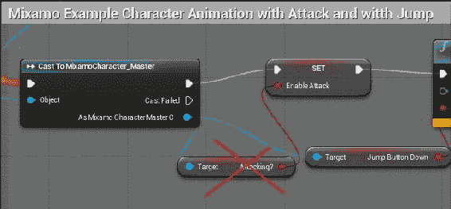

1.  重新排列节点，如下所示，将 **启用攻击** 节点单独放在底部：

1.  接下来，我们将处理这个动画所动画化的怪物。将图表向上滚动一点，并将**尝试获取 Pawn 所有者**对话框中标记为**返回值**的蓝色点拖动到您的图表中。当弹出菜单出现时，选择**投射到怪物**（确保已勾选**上下文相关**，否则**投射到怪物**选项将不会出现）。**尝试获取 Pawn 所有者**选项获取拥有动画的`Monster`实例，它只是`AMonster`类对象，如图所示：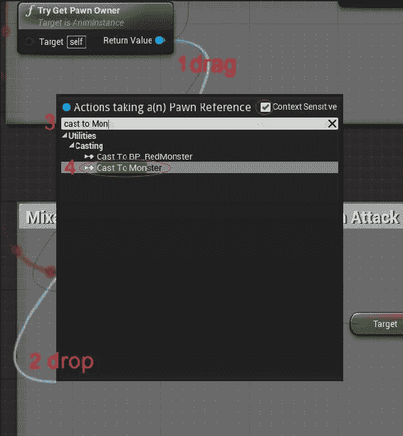

1.  在**序列**对话框中点击**+**，并将来自**序列**组的另一个执行引脚拖动到**投射到怪物**节点实例上，如图所示。这确保了**投射到怪物**实例实际上会被执行。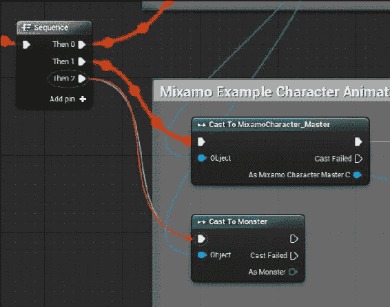

1.  下一步是从**投射到怪物**节点的**As Monster**端子拉出引脚，并查找**是否在玩家攻击范围内**属性：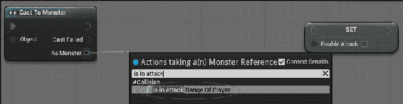

1.  将来自**投射到怪物**节点左侧的白色执行引脚拖放到右侧的**是否在玩家攻击范围内**节点上：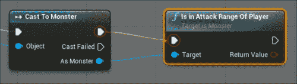

    这确保了从**投射到怪物**操作到**是否在玩家攻击范围内**节点的控制权转移。

1.  将白色和红色引脚拖到**SET**节点上，如图所示：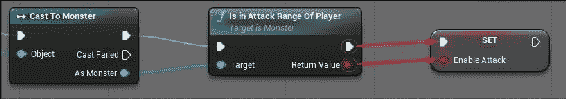

### 提示

上述蓝图的等效伪代码类似于以下内容：

```cpp
if( Monster.isInAttackRangeOfPlayer() )
{
  Monster.Animation = The Attack Animation;
}
```

测试您的动画。怪物应该只在玩家范围内挥剑。

#### 挥剑的代码

我们想在挥剑时添加一个动画通知事件。首先，在您的`Monster`类中声明并添加一个蓝图可调用的 C++函数：

```cpp
// in Monster.h:
UFUNCTION( BlueprintCallable, Category = Collision )
void SwordSwung();
```

`BlueprintCallable`语句意味着它将可以从蓝图中进行调用。换句话说，`SwordSwung()`将是一个我们可以从蓝图节点调用的 C++函数，如图所示：

```cpp
// in Monster.cpp
void AMonster::SwordSwung()
{
  if( MeleeWeapon )
  {
    MeleeWeapon->Swing();
  }
}
```

接下来，通过双击**内容浏览器**中的**Mixamo_Adam_Sword_Slash**动画来打开它（它应该在**MixamoAnimPack/Mixamo_Adam/Anims/Mixamo_Adam_Sword_Slash**）。将动画拖动到 Adam 开始挥剑的位置。右键单击动画栏，在**添加通知...**下选择**新建通知**，如图所示：

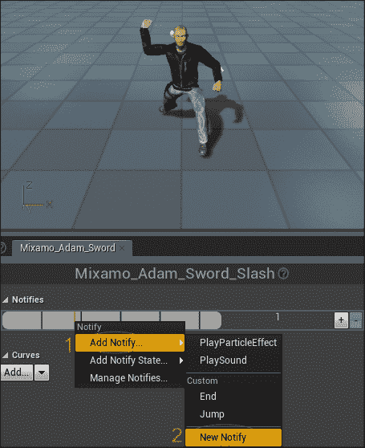

将通知命名为`SwordSwung`：

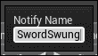

通知名称应出现在您的动画时间轴上，如下所示：


保存动画后，再次打开你的**MixamoAnimBP_Adam**版本。在**SET**节点组下方，创建以下图：


当你在图中右键单击（**上下文相关**已打开）并开始键入`SwordSwung`时，会出现**AnimNotify_SwordSwung**节点。**Cast To Monster**节点再次从**Try Get Pawn Owner**节点中输入，正如*修改 Mixamo Adam 动画蓝图*部分的第 2 步中所述。最后，**Sword Swung**是我们`AMonster`类中的蓝图可调用的 C++函数。

如果你现在开始游戏，你的怪物将在它们实际攻击时执行攻击动画。当剑的边界框与你接触时，你应该看到你的生命值条下降一点（回想一下，生命值条是在第八章，*演员和实体*部分作为练习添加的）。


怪物攻击玩家

## 弹射或远程攻击

远程攻击通常涉及某种弹射物。弹射物可以是子弹，也可以是闪电魔法攻击或火球攻击等。要编程弹射攻击，你应该生成一个新的对象，并且只有当弹射物到达玩家时才对玩家造成伤害。

要在 UE4 中实现基本的子弹，我们应该派生一个新的对象类型。我从`AActor`类派生了一个`ABullet`类，如下面的代码所示：

```cpp
UCLASS()
class GOLDENEGG_API ABullet : public AActor
{
  GENERATED_UCLASS_BODY()

  // How much damage the bullet does.
  UPROPERTY(EditAnywhere, BlueprintReadWrite, Category =  Properties)
  float Damage;

  // The visible Mesh for the component, so we can see
  // the shooting object
  UPROPERTY(VisibleDefaultsOnly, BlueprintReadOnly, Category =  Collision)
  UStaticMeshComponent* Mesh;

  // the sphere you collide with to do impact damage
  UPROPERTY(VisibleDefaultsOnly, BlueprintReadOnly, Category =  Collision)
  USphereComponent* ProxSphere;

  UFUNCTION(BlueprintNativeEvent, Category = Collision)
  void Prox( AActor* OtherActor, UPrimitiveComponent* OtherComp,  int32 OtherBodyIndex, bool bFromSweep, const FHitResult &  SweepResult );
};
```

`ABullet`类中有几个重要的成员，如下所示：

+   一个用于子弹接触时造成的伤害的`float`变量

+   子弹的`Mesh`变量

+   一个用于检测子弹最终击中某物的`ProxSphere`变量

+   当检测到`Prox`接近一个对象时要运行的功能

`ABullet`类的构造函数应该初始化`Mesh`和`ProxSphere`变量。在构造函数中，我们将`RootComponent`设置为`Mesh`变量，然后将`ProxSphere`变量附加到`Mesh`变量上。`ProxSphere`变量将用于碰撞检测，并且应该关闭`Mesh`变量的碰撞检测，如下面的代码所示：

```cpp
ABullet::ABullet(const class FObjectInitializer& PCIP) : Super(PCIP)
{
  Mesh = PCIP.CreateDefaultSubobject<UStaticMeshComponent>(this,  TEXT("Mesh"));
  RootComponent = Mesh;

  ProxSphere = PCIP.CreateDefaultSubobject<USphereComponent>(this,  TEXT("ProxSphere"));
  ProxSphere->AttachTo( RootComponent );

  ProxSphere->OnComponentBeginOverlap.AddDynamic( this,  &ABullet::Prox );
  Damage = 1;
}
```

我们在构造函数中将`Damage`变量初始化为`1`，但一旦我们从`ABullet`类创建蓝图，就可以在 UE4 编辑器中更改它。接下来，`ABullet::Prox_Implementation()`函数应该在我们与其他演员的`RootComponent`发生碰撞时对被击中的演员造成伤害，如下面的代码所示：

```cpp
void ABullet::Prox_Implementation( AActor* OtherActor, UPrimitiveComponent* OtherComp, int32 OtherBodyIndex, bool bFromSweep, const FHitResult & SweepResult )
{
  if( OtherComp != OtherActor->GetRootComponent() )
  {
    // don't collide w/ anything other than
    // the actor's root component
    return;
  }

  OtherActor->TakeDamage( Damage, FDamageEvent(), NULL, this );
  Destroy();
}
```

### 子弹物理

要让子弹在关卡中飞行，你可以使用 UE4 的物理引擎。

基于`ABullet`类创建一个蓝图。我选择了**Shape_Sphere**作为网格。子弹的网格不应该启用碰撞物理；相反，我们将启用子弹边界球的物理。

配置子弹以正确行为稍微有些棘手，所以我们将在以下四个步骤中介绍：

1.  在**组件**选项卡中选择**[ROOT] ProxSphere**。`ProxSphere`变量应该是根组件，并且应该出现在层次结构的顶部。

1.  在**详细信息**选项卡中，勾选**模拟物理**和**模拟生成碰撞事件**。

1.  从**碰撞预设**下拉菜单中选择**自定义…**。

1.  按照以下方式检查**碰撞响应**框；对于大多数类型（**WorldStatic**、**WorldDynamic**等）检查**Block**，仅对于**Pawn**检查**Overlap**：

**模拟物理**复选框使`ProxSphere`属性感受到重力和作用在其上的冲量力。冲量是一瞬间的力推，我们将用它来驱动子弹的射击。如果你不勾选**模拟生成碰撞事件**复选框，那么球体将掉落在地板上。**BlockAll Collision Preset**的作用是确保球体不能穿过任何东西。

如果你现在从**内容浏览器**选项卡直接拖放几个这些`BP_Bullet`对象到世界中，它们将简单地掉落到地板上。一旦它们在地板上，你可以踢它们一下。以下截图显示了地板上的球体对象：


然而，我们不想我们的子弹掉落在地板上。我们希望它们被射出。所以让我们把子弹放入`Monster`类中。

### 向怪物类添加子弹

向`Monster`类添加一个接收蓝图实例引用的成员。这就是`UClass`对象类型的作用。另外，添加一个蓝图可配置的浮点属性来调整射击子弹的力，如下面的代码所示：

```cpp
// The blueprint of the bullet class the monster uses
UPROPERTY(EditAnywhere, BlueprintReadWrite, Category =  MonsterProperties)
UClass* BPBullet;
// Thrust behind bullet launches
UPROPERTY(EditAnywhere, BlueprintReadWrite, Category =  MonsterProperties)
float BulletLaunchImpulse;
```

编译并运行 C++项目，打开你的`BP_Monster`蓝图。你现在可以在`BPBullet`下选择一个蓝图类，如下面的截图所示：


一旦你选择了怪物射击时要实例化的蓝图类类型，你必须编写代码使怪物在玩家在其范围内时射击。

怪物是从哪里射击的？实际上，他应该从骨骼中射击。如果你不熟悉术语，骨骼只是模型网格中的参考点。模型网格通常由许多“骨骼”组成。要查看一些骨骼，双击**内容浏览器**选项卡中的**Mixamo_Adam**网格，如下面的截图所示：


切换到**骨骼**选项卡，你将在左侧的树形视图列表中看到所有怪物的骨骼。我们想要做的是选择一个子弹将从中发射出来的骨骼。在这里，我选择了`LeftHand`选项。

### 小贴士

艺术家通常会向模型网格中插入一个额外的骨骼来发射粒子，这很可能是枪管尖端的粒子。

从基础模型网格开始，我们可以获取`Mesh`骨骼的位置，并在代码中让怪物从该骨骼发射`Bullet`实例。

可以使用以下代码获取完整的怪物`Tick`和`Attack`函数：

```cpp
void AMonster::Tick(float DeltaSeconds)
{
  Super::Tick( DeltaSeconds );

  // move the monster towards the player
  AAvatar *avatar = Cast<AAvatar>(  UGameplayStatics::GetPlayerPawn(GetWorld(), 0) );
  if( !avatar ) return;

  FVector playerPos = avatar->GetActorLocation();
  FVector toPlayer = playerPos - GetActorLocation();
  float distanceToPlayer = toPlayer.Size();

  // If the player is not the SightSphere of the monster,
  // go back
  if( distanceToPlayer > SightSphere->GetScaledSphereRadius() )
  {
    // If the player is OS, then the enemy cannot chase
    return;
  }

  toPlayer /= distanceToPlayer;  // normalizes the vector

  // At least face the target
  // Gets you the rotator to turn something
  // that looks in the `toPlayer` direction
  FRotator toPlayerRotation = toPlayer.Rotation();
  toPlayerRotation.Pitch = 0; // 0 off the pitch
  RootComponent->SetWorldRotation( toPlayerRotation );

  if( isInAttackRange(distanceToPlayer) )
  {
    // Perform the attack
    if( !TimeSinceLastStrike )
    {
      Attack(avatar);
    }

    TimeSinceLastStrike += DeltaSeconds;
    if( TimeSinceLastStrike > AttackTimeout )
    {
      TimeSinceLastStrike = 0;
    }

    return;  // nothing else to do
  }
  else
  {
    // not in attack range, so walk towards player
    AddMovementInput(toPlayer, Speed*DeltaSeconds);
  }
}
```

`AMonster::Attack`函数相对简单。当然，我们首先需要在`Monster.h`文件中添加原型声明，以便在`.cpp`文件中编写我们的函数：

```cpp
void AMonster::Attack(AActor* thing);
```

在`Monster.cpp`中，我们实现`Attack`函数，如下所示：

```cpp
void AMonster::Attack(AActor* thing)
{
  if( MeleeWeapon )
  {
    // code for the melee weapon swing, if 
    // a melee weapon is used
    MeleeWeapon->Swing();
  }
  else if( BPBullet )
  {
    // If a blueprint for a bullet to use was assigned,
    // then use that. Note we wouldn't execute this code
    // bullet firing code if a MeleeWeapon was equipped
    FVector fwd = GetActorForwardVector();
    FVector nozzle = GetMesh()->GetBoneLocation( "RightHand" );
    nozzle += fwd * 155;// move it fwd of the monster so it  doesn't
    // collide with the monster model
    FVector toOpponent = thing->GetActorLocation() - nozzle;
    toOpponent.Normalize();
    ABullet *bullet = GetWorld()->SpawnActor<ABullet>(  BPBullet, nozzle, RootComponent->GetComponentRotation());

    if( bullet )
    {
      bullet->Firer = this;
      bullet->ProxSphere->AddImpulse( 
        fwd*BulletLaunchImpulse );
    }
    else
    {
      GEngine->AddOnScreenDebugMessage( 0, 5.f, 
      FColor::Yellow, "monster: no bullet actor could be spawned.  is the bullet overlapping something?" );
    }
  }
}
```

我们保留实现近战攻击的代码不变。假设怪物没有持有近战武器，然后检查`BPBullet`成员是否已设置。如果`BPBullet`成员已设置，这意味着怪物将创建并发射`BPBullet`蓝图类的实例。

特别注意以下行：

```cpp
ABullet *bullet = GetWorld()->SpawnActor<ABullet>(BPBullet,  nozzle, RootComponent->GetComponentRotation() );
```

这就是我们向世界中添加新演员的方法。`SpawnActor()`函数将你传递的`UCLASS`实例放置在`spawnLoc`，并带有一些初始方向。

在我们生成子弹后，我们调用其`ProxSphere`变量的`AddImpulse()`函数以将其向前推进。

## 玩家击退

为了给玩家添加击退效果，我在`Avatar`类中添加了一个名为`knockback`的成员变量。每当角色受到伤害时，就会发生击退：

```cpp
FVector knockback; // in class AAvatar
```

为了确定玩家被击中时击退的方向，我们需要在`AAvatar::TakeDamage`中添加一些代码。计算攻击者指向玩家的方向向量，并将此向量存储在`knockback`变量中：

```cpp
float AAvatar::TakeDamage(float Damage, struct FDamageEvent const&  DamageEvent, AController* EventInstigator, AActor* DamageCauser)
{
  // add some knockback that gets applied over a few frames
  knockback = GetActorLocation() - DamageCauser- >GetActorLocation();
  knockback.Normalize();
  knockback *= Damage * 500; // knockback proportional to damage
}
```

在`AAvatar::Tick`中，我们将击退应用于角色的位置：

```cpp
void AAvatar::Tick( float DeltaSeconds )
{
  Super::Tick( DeltaSeconds );

  // apply knockback vector
  AddMovementInput( knockback, 1.f );

  // half the size of the knockback each frame
  knockback *= 0.5f;
}
```

由于击退向量的大小会随着每一帧的更新而减小，因此它会随着时间的推移而变弱，除非击退向量通过另一次击中而得到更新。

# 摘要

在本章中，我们探讨了如何在屏幕上实例化追逐玩家并攻击他的怪物。在下一章中，我们将赋予玩家自我防御的能力，允许他施展伤害怪物的法术。
