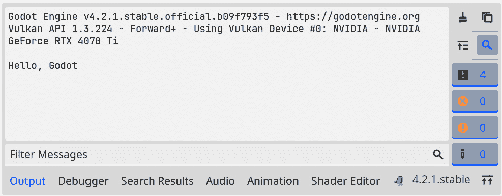

# 第一章：设置环境

随着游戏引擎变得越来越强大，游戏开发正变得越来越容易接近。以前只有大公司和富裕个人才能使用的工具和流程现在对任何拥有电脑的人都是免费的。任何人都可以体验到创建自己游戏并让他人玩游戏的满足感。

这正是本书要实现的目标。我们将从对编程或游戏开发一无所知，到创建我们的第一个游戏，甚至更远。

在本书的第一部分，我们将学习有关设置 Godot 和编程的所有知识。这可能有点抽象，但我将尝试提供清晰的示例，并通过您可以自己进行的练习和实验来保持您的参与度。

本书第二部分将更加实用，因为我们将会深入创建我们自己的视频游戏！我们将学习如何使用 Godot 编辑器创建有趣的游戏场景和情景。

在本书的最后部分，我们将把我们的编程技能提升到新的水平，并学习所有关于高级主题的知识，例如更强大的概念、编程模式、文件系统等等。

但在我们到达那里之前，没有什么比开始一个新的项目更令人满足的了！它代表了一块空白的画布，充满了无限的可能性。在本章结束时，我们将创建我们自己的空白画布，并写下我们的第一行代码。但首先，我想花些时间介绍 Godot 游戏引擎和开源软件。

在本章中，我们将涵盖以下主要主题：

+   Godot 引擎和开源软件

+   从官方网站下载引擎

+   创建我们的第一个项目

+   如何加入社区

# 技术要求

由于本书旨在帮助您从对编程和游戏开发一无所知到达到中级水平，因此没有技术要求。所以，我将引导您完成所有（或至少大多数）创建游戏所需的步骤。

示例项目和代码

您可以在本书的 GitHub 仓库中找到本书的示例项目和代码：[`github.com/PacktPublishing/Learning-GDScript-by-Developing-a-Game-with-Godot-4/tree/main/chapter01`](https://github.com/PacktPublishing/Learning-GDScript-by-Developing-a-Game-with-Godot-4/tree/main/chapter01).

# Godot 游戏引擎和开源软件

我们将使用 Godot 游戏引擎，我假设您已经知道它的存在，因为这是一本专门关于该引擎的书。但让我给您一些关于其历史和开源含义的更多见解。

## 关于引擎的一些背景信息

**Godot 引擎**是一款开源软件，让不同经验和背景的人都能创建游戏。该项目始于 2007 年，由 Juan Linietsky 和 Ariel Manzur 发起，作为几个阿根廷游戏工作室的内部引擎。到 2014 年底，该引擎被开源化，使每个人都能免费访问代码。从那时起，它获得了大量关注，并成为市场上最受欢迎的游戏引擎之一。许多商业游戏已经发布或正在使用该引擎开发。已发布的游戏示例包括 Brotato、Dome Keeper、Case of the Golden Idol 和 Cassette Beasts。

对于那些好奇的人，是的，这个引擎是以塞缪尔·贝克特的戏剧作品*等待戈多*命名的。选择这个名称是因为人们总是会等待下一个版本或新功能，从而形成一个无休止的等待循环。

在谈论引擎名称的话题时，让我们也把发音问题一并解决。简而言之，没有标准的发音方式来读 Godot。由于与法语剧本标题的关联，有些人说它应该读作“go-do”，不强调任何一个音节。但大多数英语使用者会说“GOH-doh”，并强调第一个音节。然后，还有一群人把它读作“go-DOT”，主要是因为它听起来与单词“robot”相似，而且引擎的标志是一个蓝色机器人。但我注意到我每次说的 Godot 都不一样。所以，长话短说，怎么读都行。只要大致使用相同的字母。

## 开源软件是什么？

如前所述，Godot 是开源的，这意味着引擎的源代码是免费可用的。由于每个人都有访问权限，人们可以按照自己的喜好修改这段代码。一旦他们调整了足够的参数或开发了新功能，他们可以向软件的创作者请求将这些调整或功能包含到原始项目中。创作者将审查其他人所做的工作，如果需要的话稍作修改，然后将它添加到原始软件的代码中。这个过程创造了一个良性循环，使每个人都受益：

+   *软件的创作者*可以更快地扩展代码，因为每个人都有所贡献

+   *有技术知识的人*可以添加他们缺少的功能，使其满足他们的需求

+   *最终用户*将获得更好、更稳定的最终产品

但并非每个开源项目都是平等的。每个**免费开源软件**（**FOSS**）都有自己的许可证。这个许可证规定了你可以或应该如何使用该软件。其中一些相当限制性，但在 Godot 引擎的情况下，我们很幸运：我们可以做任何事情，没有重大的限制。我们只需在我们的游戏信用页面中提及创作者。

好吧——我们已经知道了 Godot 引擎是什么，如何发音它的名字（或者不发音），以及为什么 FOSS 如此出色。让我们直接进入准备我们的开发环境吧！

# 获取和准备 Godot

在我们进行任何编程之前，我们需要设置开发环境。这就是我们将在本节中做的，从下载引擎和创建一个新项目开始。

## 下载引擎

获取引擎相对简单，只需要几个步骤：

1.  首先，我们需要下载软件的一个副本。我们可以在 [`godotengine.org/download`](https://godotengine.org/download) 做这件事。


图 1.1 – Windows 平台 Godot Engine 4.0 的下载页面

1.  通常，页面会自动将您带到浏览网站时使用的操作系统的下载页面，您可以在页面中间按下大蓝色按钮来下载引擎。如果它没有这样做，您需要在页面向下滚动时选择您的计算机平台（Windows、macOS、Linux 等）。


图 1.2 – 如果下载页面无法检测到您的计算机平台，请选择

1.  下载页面也应该检测您是否使用的是 64 位或 32 位系统。如果它没有正确检测，那么您可以在 **所有下载** 部分找到其他版本：


图 1.3 – 所有下载部分，您可以在这里找到不同版本的引擎

1.  我们下载的是一个 ZIP 文件。因此，解压它以获取实际的引擎。

    +   在 Windows 上：右键单击 zip 文件并选择 **解压到...**。现在按照弹出的提示选择一个位置。

    +   在 macOS 上：双击 zip 文件，文件将被解压到一个新的文件夹中。

    +   在 Linux 上：在终端中运行以下命令：

        ```cpp
        unzip Godot_v4.2.1-stable_linux.x86_64.zip -d Godot
        ```

1.  将解压的文件放在您电脑上的一个安全位置，例如桌面、应用程序或任何除了 `下载` 文件夹之外的位置。否则，如果您像我一样，您可能会在清理 `下载` 文件夹的狂潮中不小心删除它。

对于这本书，我们将使用 4.0.0 版本，因为它刚刚发布。但任何以 4 开头的版本都应该可以正常工作。不幸的是，这并不能保证。我们将尽力保持这本书的内容更新，但开源软件的发展速度很快。

Godot Engine 的下载大小很小，大约 30 到 100 MB，具体取决于您的平台。这个小巧的包就足够我们创建令人惊叹的游戏了。与 Unity 的 10 GB 和 Unreal Engine 的 34 GB 相比！当然，这些都没有包含任何资产，如视觉效果或音频。

获取引擎的过程就到这里。您不需要安装任何其他东西来使用它。

引擎的其他版本

由于 Godot 引擎是开源的，因此也有很多开源的完整游戏项目。如果你想在你的机器上运行这些游戏项目之一，请确保你使用正确的 Godot 版本；否则，游戏可能会崩溃，出现一些奇怪的事情。你可以从 [`godotengine.org/download/`](https://godotengine.org/download/) 找到并下载所有官方版本的 Godot。

## 创建新项目

现在，让我们继续创建我们的第一个 Godot 引擎项目，希望未来会有更多！

1.  首先，通过双击在**下载引擎**部分下载的文件来打开引擎。屏幕将出现如下画面：


图 1.4 – 通过点击“新建”按钮创建新项目

1.  选择**+新建**；将弹出一个新窗口：


图 1.5 – 设置新项目

1.  将项目命名为`Hello World`。

1.  选择一个**项目路径**区域来放置项目。通过使用**创建文件夹**按钮创建一个新的文件夹，或者使用现有的一个，但请注意，这个文件夹最好是空的。虽然你选择的文件夹可以包含文件，但从一个干净的目录开始将使我们所做的一切更加有序。

1.  在**渲染器**类别下选择**兼容性**。兼容性渲染器是为了确保我们的游戏可以在各种硬件上运行，并支持旧版显卡和网页导出。Forward+渲染器用于尖端图形，但需要更好的显卡，而移动渲染器针对移动设备进行了优化。对于我们正在做的事情，兼容性渲染器已经足够强大，并确保我们可以导出到尽可能多的平台。

1.  最后，按**创建 & 编辑**！

现在，Godot 将在所选文件夹内设置我们项目的基结构，几秒钟后，将显示编辑器：


图 1.6 – Godot 引擎 4.0 编辑器

初看可能会觉得相当令人畏惧——到处都是小窗口，这里那里有多个控件，中间有一个巨大的 3D 空间。别担心。到这本书的结尾，你将几乎了解你面前几乎所有东西的来龙去脉。你正在掌握良好的手艺。

有趣的事实

Godot 开发者使用 Godot 引擎创建了编辑器本身。试着让你的大脑围绕这一点转转！他们这样做是为了更容易地扩展和维护编辑器。

## 亮色模式

由于印刷媒体的局限性，暗色截图可能会看起来有颗粒感且不清晰。这就是为什么，从现在开始，我们将切换到 Godot 的亮色版本。没有区别，只是编辑器的外观不同。

如果你还想在亮色模式下跟进，请执行以下可选步骤：

1.  在屏幕顶部，转到**编辑器** | **编辑器设置…**：


图 1.7 – 编辑器菜单中的“编辑器设置…”选项

1.  查找**主题**设置。

1.  在**预设**下拉菜单中选择**浅色**主题：


图 1.8 – 在主题设置中选择浅色主题预设

现在，编辑器将看起来像*图 1.9*中所示：


图 1.9 – 应用了浅色主题的 Godot 引擎编辑器

在完成这些之后，让我们通过学习如何创建场景来创建一个游戏。

## 创建主场景

让我们继续设置我们的第一个场景：

1.  在*图 1.10*的最左侧面板中，显示**场景**面板，选择**2D 场景**。这个按钮将为 2D 游戏设置场景，如图所示：


图 1.10 – 在左侧面板中选择 2D 场景

你会看到在**场景**面板中有一个名为**Node2D**的节点，并且中间窗口中的 3D 空间被一个 2D 平面所取代。

1.  右键点击名为`Main`的节点。这个节点将是我们目前要工作的主节点：


图 1.11 – 将 Node2D 节点重命名为 Main

1.  通过转到**场景** | **保存场景**或按*Ctrl*/*Cmd* + *S*来保存场景：


图 1.12 – 保存场景

1.  我们会被询问希望将场景保存到何处。选择项目的根文件夹，并将文件命名为`main.tscn`：


图 1.13 – 选择根文件夹以保存场景并命名为 main.tscn

首个场景的创建就到这里。我们刚刚添加的是一个节点。这些节点代表 Godot 中的所有内容。图像、声音、菜单、特殊效果——一切都是一个节点。你可以把它们看作是游戏对象，每个在游戏中都有其独立的功能。玩家可以是一个节点，就像敌人或金币一样。

另一方面，场景是由节点或游戏对象的集合组成的。目前，你可以将场景视为关卡。对于一个关卡，你需要一个玩家节点，一些敌人节点，以及一大堆金币节点；这些节点的集合就是一个场景。这就像节点是颜料，场景是我们的画布。

我们将在整本书中回顾节点和场景。

## 简要的 UI 概述

现在是时候回顾编辑器 UI 的一些更突出的功能了。正如我们之前看到的，它看起来就像这样：


图 1.14 – 编辑器的概述

编辑器中的突出元素如下：

1.  **场景树**区域显示了当前场景中的所有节点。目前只有一个。

1.  **文件系统** 区域提供了对项目文件夹内文件的访问。

1.  中间窗口是 **当前活动的主要编辑器**。目前，我们可以看到 2D 编辑器，它将允许我们在场景中 2D 空间内放置节点。

1.  **检查器**区域完全位于右侧，显示当前选中节点的属性。如果你打开一些手风琴菜单，例如 **变换** 部分，你将找到与选中节点相关联的多个设置。

单独的节点本身并没有什么作用。它们为我们提供了特定的功能，例如显示图像、播放声音等，但它们仍然需要一些高级逻辑来将它们绑定到实际的游戏中。这就是为什么我们可以通过脚本扩展它们的功能和行为。

## 编写我们的第一个脚本

**脚本** 是一段代码，它为节点添加逻辑，例如移动图像或决定何时播放声音。

我们现在将创建我们的第一个脚本。再次右键点击 `Main` 节点并选择 **附加脚本**：


图 1.15 – 将脚本附加到主节点

将会出现一个弹出窗口。保持一切原样。需要注意的是，选中的语言是 **GDScript**，这是我们将在本书的整个过程中学习的编程语言。其他内容目前并不很重要。它甚至预先填充了脚本名称，该名称将附加到节点上。按下 **创建**：


图 1.16 – 点击创建以创建脚本

中间面板，之前是 2D 平面所在的位置，被一个新的窗口所取代：


图 1.17 – 一个新的脚本

这是 **脚本** 编辑器。我们将在本书的第一部分的大部分时间里在这里学习如何编程。

如你所注意到的，中间窗口是上下文相关的。它可以是一个 **2D**、**3D** 或 **脚本** 编辑器：


图 1.18 – 不同的主要窗口

要在这些不同的编辑器之间切换，请使用屏幕顶部的按钮。

AssetLib

最后一个标签页，**AssetLib**，用于从 Godot 的资产库中获取预制的资产。这个库可以直接在 Godot 编辑器内为你的项目提供自定义节点、脚本或其他任何资产。我们不会涵盖 3D 编辑器或 AssetLib，但了解它们的存在是好的。

**AssetLib** 上的所有资产都是开源的，因此可以完全免费使用！为自由开源软件欢呼！

如果你尝试切换到不同的编辑器，请返回到 **脚本** 编辑器，这样我们就可以创建我们的第一个脚本并确保一切准备就绪。脚本中的代码目前看起来是这样的：

```cpp
extends Node2D
# Called when the node enters the scene tree for the first time.
func _ready():
   pass # Replace with function body.
# Called every frame. 'delta' is the elapsed time since the previous frame.
func _process(delta):
   pass
```

再次提醒，不要担心这里的所有不同命令和特定语法。我们将在适当的时候覆盖所有内容。现在，知道这是一个用 GDScript 编写的脚本就足够了，GDScript 是 Godot 的脚本语言。

为了创建经典的 `pass # Replace with function body.`，将其替换为以下内容：

```cpp
   print("Hello, World")
```

这行代码将显示文本 `"Hello, World;"`，它不会使用打印机打印任何内容。我们也可以丢弃一些不需要的代码。整个脚本现在应该看起来像这样：

```cpp
extends Node2D
func _ready():
print statement we added. We add this *tab* because it shows that the line of code belongs to the _ready function. We call the practice of adding *tabs* in front of lines indentation.
			Important note
			Throughout this book, we haven’t used tabs in the text due to editorial reasons. We will use three spaces to represent one tab. This is why you’re better off not copying and pasting code from this book into the editor. The complete code for this book can be accessed and copied from this book’s GitHub repository (link in the *Technical* *requirements* section).
			All the lines within the `_ready` function will run when the node is ready, we’ll see what this means in more detail later. For now, it suffices to know that this function gets executed when the node is ready to be used.
			

			Figure 1.19 – A function contains a code block
			Functions are small groups of code a computer can execute. A function is always introduced by the `func` keyword, followed by the name of the function.
			You can see that the pre-filled script also provided us with a `_process` function, which we will not use for now, so we deleted it. We’ll return to functions in *Chapter 4*. Remember that every line of code within the `_ready` function will execute from the moment our game runs and that a *tab* must precede these lines.
			Use the *Tab* key to insert these tabs. The symbol on your keyboard looks like this: ↹
			The last line of interest in the script says `extends Node2D`. This simply says that we are using **Node2D**, the type of node we added to the scene, as a base for the script to start from. Everything in the script is an extension of the functionality that **Node2D** completes. We’ll learn more about extending scripts and classes in *Chapter 4*.
			Now, press the play button in the top right to run our project:
			

			Figure 1.20 – The play button is used to run the project
			A popup will ask us which scene we want to use as the main scene. Choose **Select Current** to set the current scene as the main one:
			

			Figure 1.21 – Godot Editor will ask us to define a main scene. We can just select the current one
			An empty, gray screen will pop up. We did not add anything visually to our game yet. Later, there will be a sprawling and exciting game here. But this gray screen is what we should expect for now:
			

			Figure 1.22 – An empty game window
			The actual exciting part is happening in the editor window itself. You’ll see a new little window unfolding from the bottom where the text **Hello, World** is printed out:
			

			Figure 1.23 – The output of the game shows Hello, World
			Success! We wrote our first script!
			As an experiment, try changing the text within the double quotes of *step 4* and rerun the program. You should see the new text printed in the output window:
			

			Figure 1.24 – The output of the game after changing the printed text
			Those were our first steps in creating a scene and script within the Godot game engine. Throughout this book, we’ll learn everything we need to know to create a whole game from scratch, but we’ll leave it here for now. Next, we’ll take a quick look at joining the game development community.
			The Godot Engine Documentation
			If you ever feel lost, there is also the official **Godot Engine Documentation**. This is a very exhaustive source of information on all the different classes and nodes and contains manuals on all the different subsystems related to the engine.
			You can access the documentation here: [`docs.godotengine.org/`](https://docs.godotengine.org/).
			Whenever you are searching how to use a certain part of the engine or something in the book is not 100% clear, you could consult the documentation.
			Join our community!
			As the last part of this chapter, I invite you to join our community! If you need any help, encounter a bug, or just want to chat with other game developers, come and find us on any of the platforms mentioned at [`godotengine.org/community`](https://godotengine.org/community).
			I also encourage you to post your progress on 𝕏, Facebook, Instagram, Mastodon, or any other social media platform. Getting feedback and extra eyes on your projects is always fun! If you decide to do so, don’t forget to use these hashtags: `#GodotEngine`, `#indiedev`, and `#gamedev`.
			Want to reach out to me personally? Check out my site for the most up-to-date contact information: [www.sandervanhove.com](http://www.sandervanhove.com).
			In the last part of this book, I’ll go into more detail about the community and how you can join and maybe even help. But for now, let’s focus on learning the trade ourselves!
			Summary
			In this chapter, we learned about Godot Engine, which is a FOSS. Then, we downloaded the engine for ourselves and created our first project. Lastly, we saw that the built-in programming language is GDScript and made our first `"Hello,` `World"` script.
			In the next chapter, we’ll start our journey of learning how to program. See you there!
			Quiz time

				*   What does the acronym FOSS mean and where is it used?
				*   Is the Godot engine an open-source project?
				*   What line of code did we add to show *“Hello, World”* in the Output? Why did we add a *tab* at the beginning of this line?
				*   What are *nodes* in Godot Engine and how do they relate to *scenes*?

```
