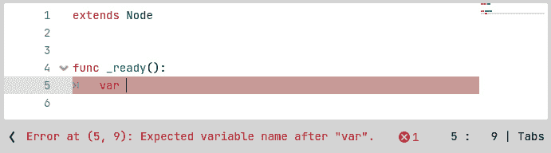
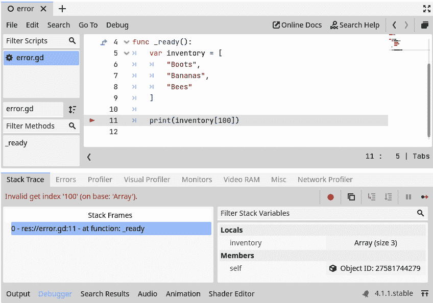
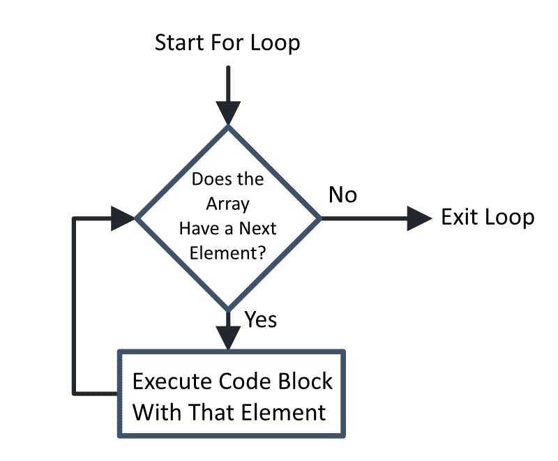
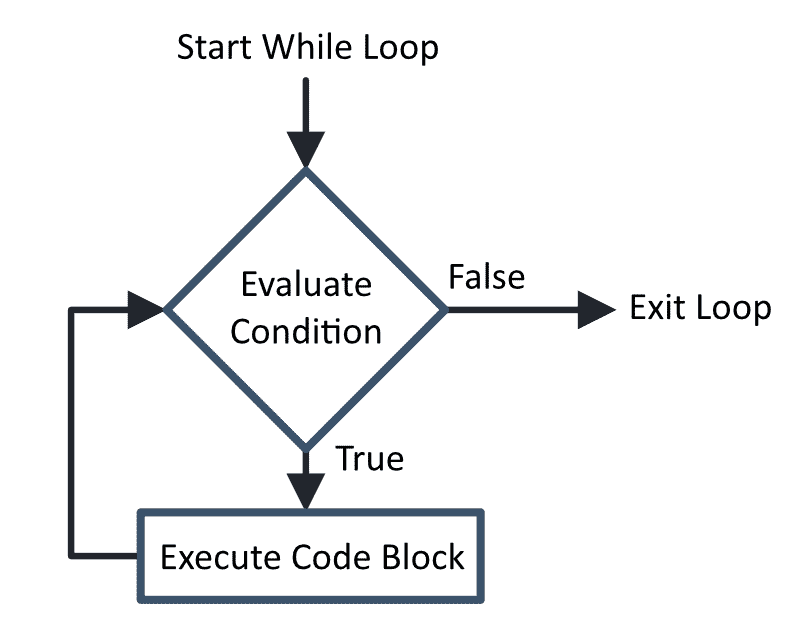
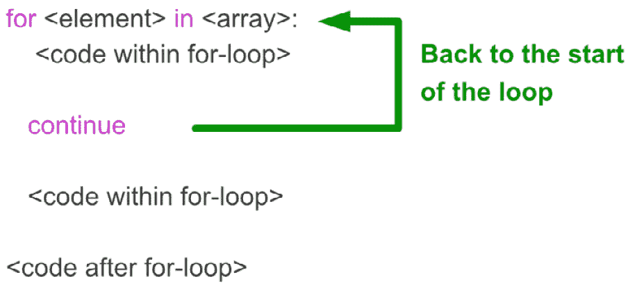
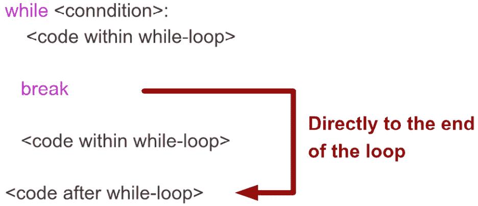
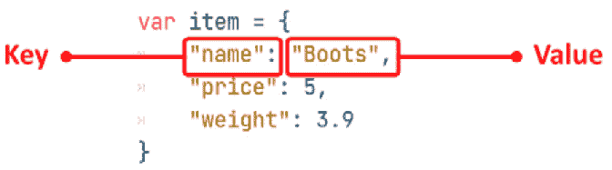

# 第二章：在数组、循环和字典中组织信息

在*第二章*中，我们学习了编程的所有重要基础知识：变量和控制流。尽管这些构建块可能看起来基础且有限，但它们已经是图灵完备的，这意味着你可以用它们创建你曾经使用过的任何程序。我并不是说你应该这样做，或者这会很容易，但你可以做到。

在本章中，我们将学习新的数据结构和更高级的控制流，以便在处理大量数据时使我们的生活更加轻松。首先，我们将了解数组如何帮助我们创建数据列表。然后，我们将学习所有关于循环的知识，循环是一个非常强大的控制流结构，可以多次执行代码块而不是只执行一次。最后，我们将学习字典，这是一种帮助我们以小包的形式组织其他数据的结构。

在本章中，我们将涵盖以下主要主题：

+   数组

+   循环

+   字典

+   调试

+   空白

# 技术要求

如果你遇到任何困难，别忘了你可以在存储库的`chapter03`文件夹中找到本章中我们做的所有示例。你可以在这里找到存储库：[`github.com/PacktPublishing/Learning-GDScript-by-Developing-a-Game-with-Godot-4/tree/main/chapter03`](https://github.com/PacktPublishing/Learning-GDScript-by-Developing-a-Game-with-Godot-4/tree/main/chapter03)。

# 数组

通常，我们想要处理数据列表，例如玩家拥有的物品列表。**数组**正是我们想要用于此类场合的数据结构：它是一个可以包含来自其他数据类型元素的列表；它是一种容器类型。

容器

我们称数组为**容器**，因为我们可以在其中存储和检索其他数据类型的片段，例如整数、字符串、布尔值等。数组包含其他数据。

容器结构其他数据，使其更容易处理。

让我们看看在代码中数组是什么，以及我们如何创建一个数组并访问其元素。

## 创建一个数组

创建一个数组看起来是这样的：

```cpp
var inventory = ["Key", "Potion", "Red Flower", "Boots"]
```

在这里，我们创建了一个数组——一个包含四个字符串的列表——并将其放入`inventory`变量中。注意，数组的所有元素都包含在方括号`[]`内，并且每个元素之间由一个*逗号*分隔。

就像我们刚才做的那样，一行创建一个数组通常是可行的。但有时，它可能会使代码行太长。幸运的是，我们也可以将每个元素放在单独的一行上；这有助于提高可读性，并在我们想要添加或删除元素时更容易地编辑数组：

```cpp
var inventory = [
   "Key",
   "Potion",
   "Red Flower",
   "Boots"
]
```

这段代码将创建与本章开头相同的数组，但每个元素都格式化在新的一行上，因此更容易阅读。

重要提示

注意，我们不需要用制表符缩进数组的元素，但一般的惯例是这样做，我强烈建议你也这样做。这是清洁代码哲学的一部分，使得这些元素是数组的一部分变得格外清晰。我们将在*第五章*中更多地讨论编写清洁代码。

作为实验，尝试打印出一个包含数组的变量。

## 访问值

现在我们有了我们的列表——数组——我们希望能够访问它的元素。为此，我们必须在变量的名称后面，方括号内指定我们想要检索的元素编号。例如，要获取我们数组的第一个元素，我们必须写下以下内容：

```cpp
print( inventory[0] )
# Prints out: Key
```

但这是什么？我告诉你我们正在检索数组中的第一个元素，但我使用了数字 0 来这样做。这是因为，与人类的计数不同，数组是 0 基的，这意味着它们从 0 开始计数。由此扩展，第二个元素可以通过使用`1`来访问，依此类推：

| 库存**内容** |
| --- |
| **索引** | **值** |
| `0` | 钥匙 |
| `1` | 药水 |
| `2` | 红花 |
| `3` | 靴子 |

表 3.1 – 库存数组的内 容

零基计数在数学概念和计算机算法的背景下非常有意义，所以我们最好习惯它。

我们称数组中元素的位置为**索引**。

作为实验，而不是直接使用数字来检索元素，尝试在方括号中放置一个包含数字的变量，如下所示：

```cpp
var index = 3
print(inventory[index])
```

你也可以尝试访问数组中不存在的元素，例如元素`1000`，看看会出现什么错误。也尝试使用负数。

## 向后访问元素

如果你尝试了之前实验中我要求你使用负数访问数组元素的情况，你可能已经注意到了一些奇怪的事情。虽然负数并不总是导致错误，但它们会从数组中返回一些元素。

这是因为如果你使用负数，你会从数组的末尾访问数组内的元素！所以，索引为-1 的元素是最后一个，-2 是倒数第二个，依此类推：

```cpp
var inventory = ["Key", "Potion"]
prints("The last item in your inventory is a: ", inventory[-1])
# Prints out: Potion
```

这个索引技巧将证明非常有用。

## 修改数组元素

数组的一个有趣特性是我们可以将每个元素视为一个常规变量。例如，要给一个元素赋新值，我们只需给它赋新值：

```cpp
inventory[3] = "Helmet"
```

我们还可以使用我们之前在*第二章*中学到的特殊赋值运算符，如`+=`或`-=`，直接更改数组中的某个值：

```cpp
var array_of_numbers = [1, 4, -74, 0]
array_of_numbers[3] 4 to the third element in our array_of_numbers, 0, so that the value is now 4.
			Using the assignment operator (`=`) makes it easy to change the elements in an array.
			Data types in arrays
			Arrays can hold any data type. You can even put multiple different data types in the same array, like so:

```

var an_array = [

5,          # 一个整数

"seven"，    # 一个字符串

8.9,        # 一个浮点数

True        # 一个布尔值

]

```cpp

			This is bad practice because when you want to access one of the elements, you don’t know what you are dealing with. That is why I advise you to always use one data type for all the elements in an array.
			Strings are secretly arrays
			If you think back to *Chapter 2*, when I said that strings are called that way because they are *strings of characters*, then this might not seem like a big surprise. But a string can be thought of as an array of characters. So, we can get one specific character, just like we would get one particular element in an array:

```

var player_name = "Eric"

print(player_name[0])

# 打印出：E

```cpp

			In practice, we use this less often, but it is good to know how strings work under the hood.
			Manipulating arrays
			So far, we have created arrays, accessed their elements, and even changed those elements. But there are so many more things that arrays can do. Unlike the standard data types we’ve already encountered, arrays provide functions to us that we could use. Functions are little pieces of code, just like the `_ready()` function we have been writing for each scene, that provides functionality and can do things for us.
			For example, one of these functions can append an extra element at the end of an array:

```

var inventory = ["钥匙", "药水"]

inventory.append("剑")

```cpp

			Try printing out this variable; it will show `[Key, Potion, Sword]`. Cool, right?
			As you can see, to call a function of an array, add a point (`.`), followed by the name of that function, to the name of that array. This also applies to other data types.
			But what if we want to append one array to another one? Well, there is a function for that too:

```

var loot = ["金币", "匕首"]

inventory.append_array(loot)

```cpp

			Now, the whole `loot` array will be appended at the end of the inventory.
			But wait, there’s more! What if you need to remove an element? You use the `remove_at()` function. This function removes an element of the array at a certain index:

```

inventory.remove_at(1)

```cpp

			This will remove the element at index 1\. But what if you don’t know the position the element is at? You can always find it!

```

var index_of_sword = inventory.find("剑")

inventory.remove_at(index_of_sword)

```cpp

			The `find()` function will return the index of the element we were looking for. If it finds nothing, it will return the number `-1`. So, it’s best to check if the number it returns is equal to or larger than 0; otherwise, you might remove the wrong element.
			The `remove_at()` and `find()` functions are very useful in their own right, but there is also a function that combines the two into one! This is the `erase()` function, and it can be used like this:

```

inventory.erase("剑")

```cpp

			This last line of code will give the same result as the snippet of the two lines before because it removes the first instance of `"Sword"` it finds within the array.
			Arrays are an important concept in programming. They dynamically hold an arbitrary number of elements.
			After a small detour into debugging in the next section, we’ll learn how we can loop over these elements and run code for each of them separately using the `for` and `while` keywords.
			Don’t be scared of errors or warnings
			We’ve encountered errors here and there while writing code, especially during some of the experiments. These errors often contain valuable information about the problem and how to solve it. Let’s examine the following piece of code:
			

			Figure 3.1 – An error tells us that the var keyword should be followed by the new variable’s name
			Here, I stopped typing halfway while defining a variable. The code editor immediately gave me an error. As shown at the bottom, it is telling me it expected a variable’s name. Thanks for the hint, engine!
			Let’s look at an error that the engine can’t predict before running the code:

```

func _ready():

var inventory = [

"靴子",

"香蕉",

"蜜蜂"

]

print(inventory[100])

```cpp

			At first glance, this code might look okay, but if you put it in a script and run it, you’ll see the following error pop up:
			

			Figure 3.2 – After running this code, the interpreter warns us that the inventory array does not have a 101st element
			The **Debugger** panel opened up, clearly stating that there was an *Invalid get index ‘100’ (on base: ‘Array’)* error. This means we used an invalid index to retrieve an element from an array. We can also see a yellow arrow showing the exact line where the error occurred. From this, we can conclude that the inventory array does not have a 101st element and thus, we should not try to print it out.
			Some errors and warnings already pop up while writing the code, such as the first one we saw in this section. This makes it easy to ensure what we write will run. Unfortunately, writing code that does not contain errors or warnings at this stage does not guarantee that executing this code will be error and warning-free. This is because, from the moment we run a piece of code, it can encounter scenarios the code parser could never have considered.
			These runtime errors and warnings occur because GDScript is a weakly typed language, meaning that any variable can have any type and could even switch types mid-execution. Here’s a simple example:

```

var my_vairable = 5

my_variable = "Hello, World"

```cpp

			But this means that during execution, a piece of code could crash. In *Chapter 4*, you’ll learn how to deal with this uncertainty in an elegant way that keeps the flexibility of loosely typed variables.
			It is good to appreciate warnings and errors. The engine does not show these to bully us but to nudge us in the right direction to create a better, more solid piece of software. If the engine didn’t care and didn’t crash the game when an error occurred, for example, then we might ship a half-broken game. This is not what we want! We want the best experience for our players with the lowest number of bugs!
			Bugs
			When a game is broken in some way, be it a crash or a logical error, we say it has **bugs**. This terminology comes from one of the first times a computer malfunctioned and the culprit turned out to be a literal bug that crawled into the machinery. But the term was even used before that by the likes of Thomas Edison to describe “little faults and difficulties” in a piece of hardware.
			In the next section, we’ll learn about loops.
			Loops
			We’ve been putting lines of code one after the other and Godot Engine executed them nicely from top to bottom. But there comes a time when we want to repeat one or multiple lines of code. For example, what if we want to print out every item in the player’s inventory in a nice way?
			We could do something like that with the following code:

```

var inventory = ["靴子", "香蕉", "绷带"]

for item in inventory:

print("你拥有 ", item)

```cpp

			This is called a **loop**; this specific one is a **for loop**. We’ll have a look at the two kinds of loops that are present in GDScript in the next few sections.
			For loops
			 A `for` loop called **item**. Of course, we can use the same structure for other arrays and call the temporary variable differently. I chose the name *items* because that is what an inventory contains. Another suitable name could be *item_name*.
			We can visualize the `for` loop with the following flow chart:
			

			Figure 3.3 – The flow of a for loop during the execution of the code
			As shown in *Figure 3**.3*, we start the loop from the top. If there is a first element, we follow the *Yes* and execute the code block within the loop for that element. Then, we check if there is a next element. If so, we execute the code block again, now for that element, and so on until there are no more elements left.
			The `for` loop looks like this:

```

for <temporary_variable_name> in <array>:

<code_block>

```cpp

			Syntax
			The preceding structure is also called the syntax of the language. It captures the rules of what is possible and how things should be specified in the language.
			A `for` loop is a very powerful control flow structure. Let’s have a look at some other use cases in which we can use it.
			Range function
			Sometimes, you will want to iterate over all indexes within an array. To do so, you can use the `range()` function, which is built into the engine. This function returns an array from `0` to a specified number. Here’s an example:

```

var numbers_from_0_to_5 = range(6)

print(numbers_from_0_to_5 )

```cpp

			This code will print out `[0, 1, 2, 3,` `4, 5]`.
			Notice that we gave the number `6` to the function but that the array stops at the number 5.
			We can use the `range()` function like so:

```

var inventory = ["靴子", "香蕉", "绷带"]

for index in range(inventory.size()):

print("索引为 ", index, " 的物品是 ", inventory[index])

```cpp

			Here, I called the `size()` function on the `inventory` array; this returns the size of the array, which we then can plug right into the `range()` function.
			The `range()` function can even do more than this. If you provide it with two numbers, it will create an array that starts from the first number and goes up to the second one, excluding it again. Try this:

```

for number in range(10, 20):

print(number)

```cpp

			As an experiment, try constructing a `for` loop with the preceding `range()` function and print the result – that is, `range(16,` `26, 2)`.
			You’ll see that we go from `16` to `26` as expected. But this time, the interval between each number is `2`. So, we should get the numbers `16`, `18`, `20`, `22` and `24`.
			The third argument that’s given to a range command defines the size of the step we take between numbers.
			Now that we have the `for` loop and `range()` function under our belt, let’s take a look at the while loop.
			While loops
			The second kind of loop in GDScript is the `if` statement – we give it a condition and repeat its code block, so long as the condition evaluates to `true`. Here’s an example:

```

var inventory = ["靴子", "香蕉", "绷带", "保暖手套", "护目镜"]

while inventory.size() > 3:

inventory.remove_at(0)

```cpp

			Here, we remove the first element of the inventory array as long, so the array has a length of more than three elements.
			The syntax of a `while` loop looks as follows:

```

while <condition>:

<code_block>

```cpp

			When Godot encounters a `while` statement, it follows these steps:

				1.  First, it evaluates the condition statement. If it is true, it will go to *step 2*; otherwise. it will skip the code block completely and go to *step 4*.
				2.  Second, the code block will be executed.
				3.  Third, it will go back to *step 1* to evaluate the condition again and see if it has changed.
				4.  Finally, it will execute the rest of the code.

			So `while` loops will loop so long as the condition we defined returns a `true` value.
			We can visualize a `while` loop with the following flow chart:
			

			Figure 3.4 – The flow of a while loop during the execution of the code
			 In *Figure 3**.4*, we start the loop by evaluating the condition we specified. If it results in a `true` value, we execute the code block of the loop. If this value is not evaluated to be `true`, we exit the loop.
			Infinite loops
			The code block within a `while` statement must work toward getting the condition to evaluate false. Otherwise, this will result in an **infinite loop**. Luckily, Godot ensures this does not crash our computer, but it could freeze up your game and make that crash instead!
			So far, we have learned about the two basic loops within GDScript. Now, let’s have a look at how we can have more control over these loops with some special keywords that we can only use within these loops.
			Continuing or breaking a loop
			Two keywords can only be used within a loop: **continue** and **break**. Using them excessively or abusing them is not a best practice; you can avoid both if you construct your loop correctly. But they are still essential to know.
			The continue keyword
			The `for` loop, this means we go to the next element in the array. In a `while` loop, this means we go back to evaluating the condition:
			

			Figure 3.5 – The continue keyword will skip all subsequent code and go back to the start of the loop for the next element in the array
			For example, the following code will print out all items in the inventory but skip `Banana`:

```

var inventory = ["靴子", "香蕉", "绷带"]

for item in inventory.size():

if item == "香蕉":

continue

print(item)

```cpp

			The result of this loop will be as follows:

```

靴子

绷带

```cpp

			The `continue` keyword is quite useful when you want to skip elements, but what if you want to halt the execution of the loop altogether? That is where the `break` keyword comes in. Let’s look at that now.
			The break keyword
			Sometimes, you’ll want to stop the execution of a loop prematurely. In such a case, we can use the **break** keyword:
			

			Figure 3.6 – The break keyword will skip all subsequent code and stop executing the loop
			The interpreter will drop everything it was doing within the loop and go to the code after it. Here’s an example:

```

var inventory = ["靴子", "绷带", "香蕉", "保暖手套", "护目镜"]

while inventory.size() > 3:

if inventory[0] == "香蕉":

break

prints("移除：", inventory[0])

inventory.remove_at(0)

```cpp

			This snippet will print out the following:

```

移除靴子

移除绷带

```cpp

			Then, it will see that the first item in the inventory is `Bananas`, so the `if` statement evaluates to `true` and we break the loop, stopping it completely.
			With that, we’ve seen how to use `continue` and `break`, but as I said earlier, it is possible to write the same loop without these keywords. As an experiment, try rewriting both examples using the **continue** and **break** keywords so that they have the same behavior, but don’t use the **continue** or **break** keywords.
			Loops allow us to run code for an undefined number of elements, making our code more flexible and dynamic. We will use them throughout this book. Now, let’s take a look at another container data type: dictionaries.
			Dictionaries
			A **dictionary** is another data container, just like an array. But unlike arrays, which store data in a certain order, dictionaries store data using a **key-value pair**. Instead of associating each element with a predetermined number, like in an array, we associate them with a key that we define ourselves. Because we must define our own keys, there is a more rigid structure in a dictionary than in an array.
			Creating a dictionary
			Let’s say that we want to store the name, price, and weight of an item in our game. We can do this using a dictionary:

```

var item = {

"名称": "靴子",

"价格": 5,

"重量": 3.9

}

```cpp

			Here, we use curly brackets, `{}`, to define a dictionary. Then, we define a key and its associated value within the curly brackets. For example, the `"name"` key is associated with the `"Boots"` value. Each key-value pair must be separated by a comma:
			

			Figure 3.7 – Dictionaries consist of one or more key-value pairs
			As an experiment, try printing the preceding dictionary like so:

```

print({

"名称": "靴子",

"价格": 5,

"重量": 3.9

})

```cpp

			Dictionaries help us in organizing the data together in a more structured form. Now, let’s have a look at what data we can put in a dictionary.
			Data types in dictionaries
			What data types can we use for keys and values?
			The values within a dictionary can be any data type we like, even arrays or other dictionaries!
			The keys, on the other hand, cannot. We can only use simple data types as keys in a dictionary. Strings, floats and integers are valid. More complex data types, such as arrays or dictionaries, are not allowed.
			It’s good to note that the type of the keys and values don’t need to be the same over the whole dictionary. You can use different data types throughout:

```

var a_mess_dictionary = {

"字符串键": [4, 6, 9],

3.14: "π",

123: {

"子键": "这是一个子字典"

}

}

```cpp

			As you can see, dictionaries are very powerful structures for organizing data.
			Accessing and changing values
			Accessing and changing a dictionary’s values is very similar to how we access the values of an array. Instead of specifying the index of the element within the square brackets, we specify the key of the value we want:

```

var item = {

"名称": "靴子",

"价格": 5,

"重量": 3.9

}

print(item["name"])

item["价格"] += 10

```cpp

			We can even use a stored key from within a variable:

```

var key_variable = "name"

print(item[key_variable])

```cpp

			Lastly, if the key you are trying to access is a string, you can also get to its value using the following syntax:

```

print(item.name)

```cpp

			Just use a dot behind the dictionary’s name and then the key. This will not work if the key is anything other than a string, like a number.
			Creating a new key-value pair
			A remarkable feature of dictionaries is that we can easily add new key-value pairs after the dictionary is created. We can simply do this by assigning a value to a non-existing key:

```

item["颜色"] = "蓝色"

```cpp

			Here, we added a new key-value pair to the item dictionary with `"color"` as the key and `"blue"` as the value.
			Useful functions
			Just like arrays, dictionaries have some useful functions that come in handy occasionally.
			has
			Sometimes, we need to know if a dictionary contains a certain key. In such a case, we can count on the `has()` function:

```

var item = { "名称": "香蕉" }

if item.has("name"):

print(item.name)

```cpp

			Because the `item` dictionary has a key called *name*, this code will print that name.
			erase
			We only saw how to add key-value pairs to a dictionary. But with `erase()`, we can also remove a pair:

```

var item = { "名称": "香蕉" }

item.erase("name")

```cpp

			The item dictionary will be empty at the end of this snippet.
			As an experiment, try printing out the item dictionary after you erase all keys.
			Looping through dictionaries
			It might be surprising, but you can loop through dictionaries, just like arrays. For example, if we want to print out all the information in an item dictionary, we could do something like this:

```

var item = {

"名称": "靴子",

"价格": 5,

"重量": 3.9

}

for key in item:

prints(key, "是", item[key])

```cpp

			As you can see, the temporary variable, `key`, carries the keys of the dictionary one for one.
			We can also directly iterate over all the values of a dictionary instead of first having to get the keys:

```

for value in item.values():

print(value)

```cpp

			This loop will print out all the values within the dictionary.
			Important note
			Looping over an array or other data structure can also be called *iterating* over it.
			As an experiment, try printing out the values of a dictionary with `item.values()`:  `print(item.values())`
			Nested loops
			If you want to have more fun with loops, you can also nest them. By this, we mean you can use a loop within another loop. For example, let’s say we have an inventory that is an array of item dictionaries and we want to print out the information of each item in a nice way. We could do something like this:

```

var inventory = [

{

"名称": "靴子",

"价格": 5,

},

{

"名称": "魔法手套",

"价格": 10

},

{

"名称": "酷镜",

"价格": 58

}

]

for item_index in inventory.size():

print("物品 ", item_index, " 的统计数据：")

var item = inventory[item_index]

for key in item:

printt(key, item[key])

```cpp

			First, we iterate over all the elements of the array, which gives us each item dictionary. Then, we iterate on all the keys of that item and print the key and its value.
			Of course, you can also combine `while` and `for` loops freely. There are no limits!
			With that, we’ve learned all about the two main looping control flows and the two main container data types in GDScript. In the next section, we’ll learn about a new data type: `null`.
			Null
			Lastly, let me introduce you to a new data type: `null`. It carries no information, cannot be changed, and has no functions you can call. So, what is it good for? It is a variable’s value when we don’t give it one from the start. Try out the following snippet of code:

```

var inventory

print(inventory)

```cpp

			You’ll see that it will print out `null`. Sometimes, you’ll want to do this to ensure a variable exists but don’t want to initiate it with a value yet. In the filing cabinet metaphor from *Chapter 2*, this would mean that we reserved a drawer and a name for the variable but haven’t filled it with data yet.
			Using a variable in any way while it is null will result in an error. For example, the next two operations will result in an error while running the code:

```

var inventory

inventory.append("靴子")

var number_of_lives

number_of_lives -= 2

```cpp

			So, it is best to check whether a variable is `null` if you are not sure that the variable is initialized:

```

var number_of_lives

if number_of_lives != null:

number_of_lives -= 2

```cpp

			Some operators or functions return `null` when they cannot complete their task as expected. For example, if you access a key in a dictionary that doesn’t exist, it will return the `null` value:

```

var item = {

"名称": "靴子",

"价格": 5,

"重量": 3.9

}

print(item["高度"])

```cpp

			The preceding example will print out `null`.
			Additional exercises – Sharpening the axe

				1.  Write a script that finds and prints out the name of the most expensive item in the following array using a `for` loop. You will need to keep two variables `most_expensive_item` and `max_price`. The `max_price` variable starts out at 0\. Now, every time you come across a more expensive item you save that item in the `most_expensive_item` variable and update the new `max_price`. The most expensive item in the following array should be the *Ring* *of Might*:

    ```

    var inventory = [

    { "名称": "香蕉", "价格": 5 },

    { "名称": "力量戒指", "价格": 100 },

    { "名称": "治疗药水", "价格": 58 },

    { "名称": "头盔", "价格": 44 },

    ]

    ```cpp

    				2.  Write a script that checks whether a specific string is a palindrome; this means that the string should look the same whether you’re reading it forward or backward. For example, *rotator* is a palindrome, while *bee* is not. To do this, you’ll have to iterate over the string in two directions simultaneously.

			Summary
			In this chapter, we looked at two new container types, arrays and dictionaries, and two types of loops, `for` and `while` loops. We also learned about useful functions in the string data type and got acquainted with the `null` value.
			In the next chapter, we’ll learn all about classes, which are custom data types that we can define ourselves.
			Quiz time

				*   What are two container types we learned about in this chapter?
				*   What is the difference between arrays and dictionaries?
				*   How do you access the 4th value in the following array?

    ```

    var grocery list = ["苹果", "面粉", "生菜", "果冻", "肥皂"]

    ```cpp

    				*   How do you access the value of the height in the following dictionary?

    ```

    var person = {

    "名称": "迈克",

    "眼睛颜色": "棕色",

    "头发颜色": "金色",

    "高度": 184,

    }

    ```cpp

    				*   What does `range(2,` `9)` return?
				*   What is the difference between a `for` and a `while` loop?
				*   When we use one loop inside of another loop, do we call this a nested loop?
				*   What value does the following variable have?

    ```

    var number_of_lives

    ```cpp

```
