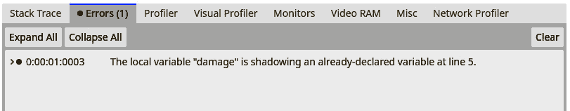
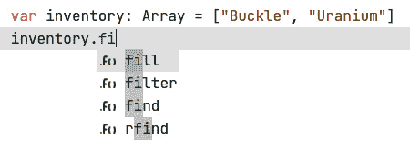
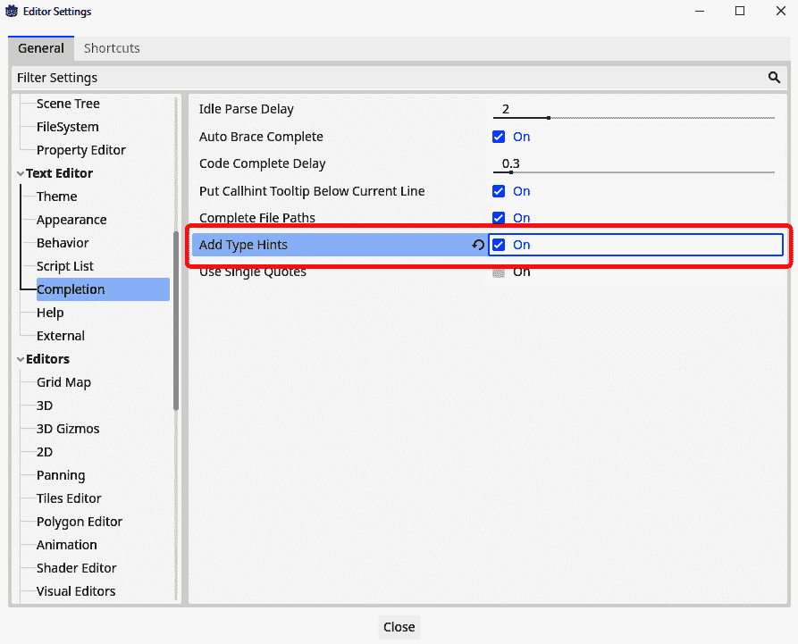
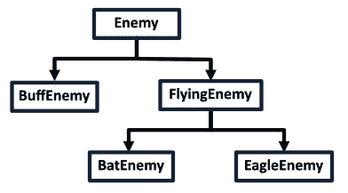
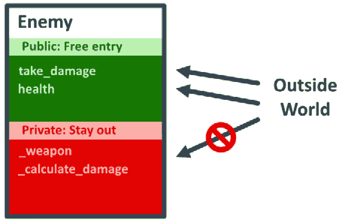
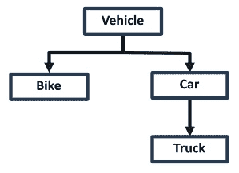

# 通过方法和类引入结构

在*第三章*中，我们学习了集合类型和循环。这些强大的概念帮助我们结构化我们的数据并多次运行代码。

能够在循环中重用代码是很好的，但如果我们想在任何任意时刻重用这段代码呢？如果我们想重用整个代码和数据结构，比如——例如——敌人或车辆呢？

方法和类正是帮助我们达到这种重用水平的概念！

在本章的剩余部分，我们将看到编程的几个基本概念。到结束时，我们将学会所有成为真正的程序员所需的技能。

在本章中，我们将涵盖以下主要主题：

+   函数

+   类

+   类型提示

+   面向对象编程（OOP）

# 技术要求

如果你遇到任何困难，不要忘记你可以在存储库的`chapter04`文件夹中找到我们在这个章节中做的所有示例。你可以在这里找到存储库：[`github.com/PacktPublishing/Learning-GDScript-by-Developing-a-Game-with-Godot-4/tree/main/chapter04`](https://github.com/PacktPublishing/Learning-GDScript-by-Developing-a-Game-with-Godot-4/tree/main/chapter04)。

# 方法是可重用的代码块

在*第一章*中，我们学习了如何使用节点的`_ready()`方法编写代码。我们看到了这个函数中的代码将从我们的游戏开始运行的那一刻起执行。现在，让我们更详细地看看函数是什么以及我们如何使用它们。

方法与函数的区别

术语*方法*和*函数*经常被互换使用。它们表示两个非常相似的概念，但应用方式不同。在这本书中，我们将两者互换使用。

# 函数是什么？

一个`find()`函数：

```cpp
var inventory = ["Amulet", "Bananas", "Candles"]
print(inventory.find("Bananas"))
```

在底层，解释器查找与`find`函数关联的代码块，使用`Bananas`字符串作为输入执行它，然后将结果返回给我们。

在前面的例子中，我们会打印出结果。请注意，我们在这段代码中使用的`print`语句也是一个函数！

我们提供给函数的输入数据被称为**参数**。

为了简化技术细节，函数只是我们的程序从其正常执行路径中做出的一个绕行——通过另一个代码块的旁路。

## 定义一个函数

让我们看看一个降低玩家生命值的函数：

```cpp
func lower_player_health(amount):
   player_health -= amount
```

如你所见，要定义一个函数，我们需要以下部分：

+   `func`关键字。这表示 GDScript 我们即将定义一个新的函数，就像`var`关键字用于变量一样。

+   一个名称。这是我们用来调用函数的名称，例如在这个例子中是`lower_player_health()`。确保你选择一个描述性的名称，就像变量名一样。

+   一系列用逗号分隔并括在括号中的参数；在这种情况下，我们只有一个参数：`amount`。这些是我们希望函数用户提供给我们的数据。不一定需要任何参数。

+   当我们调用函数时执行的代码块。在这个代码块中，我们可以将函数的参数用作普通变量。

参数和参数

仔细的读者可能会注意到，当我们调用函数时，输入数据被称为**参数**，而在函数内部，我们称它们为**参数**。参数基本上是函数的输入变量，而参数是我们用来调用函数的具体值。

但不用担心术语的混淆；几乎每个程序员都会这样做，每个人都会知道你在说什么。

函数的基本语法如下所示：

```cpp
func <function_name>(<parameter1>, <parameter2>):
   <code_block>
```

值得注意的是，定义的参数数量可以变化。在语法示例中，我们定义了两个参数，但我们可以定义零个甚至一百个。

例如，这里有一个简单的函数，它只是打印出`Hello, World`：

```cpp
func say_hello():
   print("Hello, World")
```

## 函数命名

函数名称有与变量名称相同的约束：

+   它们只包含字母数字字符。

+   不应该有空格。

+   它们不能以数字开头。

+   它们不应该以现有关键字命名。

但与变量名不同，一个函数的名称应该反映函数内部代码的功能。这样，当你运行一个函数时，你就知道可以期待什么。

下面是一些好的函数名称示例：

```cpp
calculate_player_health()
apply_velocity()
prepare_race()
```

下面是一些不好的函数名称示例：

```cpp
do_the_thing()
calculate()
a()
```

命名函数，就像编程时命名任何事物一样，虽然困难但很重要。但有必要给一切清晰描述性的名称。

## 返回关键字

在`for`和`while`循环中，我们使用`break`关键字提前退出循环。在函数中，我们有一个非常相似的关键字：`return`。这个关键字将使执行立即退出函数。而且公平地说，如果你在循环中放置一个`return`语句，它也会停止该循环，因为我们不再在一般情况下执行函数。

你可以在函数的任何地方放置它，我们就可以返回到调用函数的地方，即使这意味着某些代码永远不会被执行：

```cpp
func a_cool_function():
   print("This piece of code will be executed")
   return
   print("This piece of code will NEVER EVER be executed")
```

函数也可以返回值，就像我们看到的数组`find()`函数一样，它返回了我们正在搜索的值的索引。要返回一个值，我们再次使用`return`关键字，但这次，我们在它后面指定我们想要返回的值：

```cpp
func minimum(number1, number2):
   if number1 < number2:
      return number1
   else:
      minimum() function to get the smallest of the two values:

```

print(minimum(5, 2))

var lowest_number = minimum(1, 300)

```cpp

			Running this snippet of code will print the number `2` and will populate the `lowest_number` variable with the number `1`.
			In this section, we implemented our own `minimum()` function, but this function actually already exists in the engine, called `min()`. So, from now on, you can use the one that the engine provides to find the smallest number.
			The pass keyword
			When creating a new script, we’ve already seen the `_ready()` function structured like this:

```

func _ready():

`pass`关键字出现。这是一行什么也不做的代码。因此，我们可以用它创建一个不包含逻辑的代码块。这样，我们可以创建空函数。

            在面向对象编程（OOP）中，空函数非常有用，我们将在*第五章*中讨论。 

            可选参数

            要使函数更灵活，你可以决定将一些参数指定为可选的。这样，你以后可以选择是否提供参数。为此，我们必须为该参数提供一个默认值。

            如果你调用函数时没有为这些参数提供值，GDScript 将使用我们指定的默认值。

            我们可以使用这种技术来扩展我们之前关于从玩家生命值中移除生命的方法：

```cpp
extends Node
var player_health = 2
func lower_player_health(amount = 1):
   player_health -= amount
```

            在前面的例子中，`lower_player_health()` 函数有一个参数，`amount`，它是可选的。我们知道它是可选的，因为我们使用等号在定义中给它提供了一个默认值。如果我们调用这个函数并传递一个参数，它将使用该参数来填充数量。如果我们不传递任何参数，它将默认为`1`作为数量的值。我们可以这样使用这个函数：

```cpp
lower_player_health(5) # Will subtract 5 from the player's health
lower_player_health(2) # Will subtract 2 from the player's health
lower_player_health() # Will subtract 1 from the player's health
```

            如果一个函数有多个参数，其中一个是或多个是可选的，那么可选参数应该始终在定义中放在最后。这是因为如果你省略了一个参数，GDScript 无法猜测它是哪一个，只会假设它是最后一个。如果我们不小心错误地排列了参数，代码编辑器会给出错误提示，让我们正确地排列它们。

            假设我们必须编写一个函数，该函数以特定角度、以特定速度移动玩家，并且我们还需要指定玩家是否在跑步以及是否可以与世界中的物体碰撞：

```cpp
func move_player(angle, is_running, speed = 20, can_collide = true):
   # function body
```

            这个`move_player()`函数比`lower_player_health()`函数有更多样化的使用方式：

```cpp
move_player(.5, true) # Fill none of the optional parameters
move_player(.5, true, 100) # Fill one of the optional parameters
move_player(.5, true, 1, false) # Fill two of the optional parameters
```

            如你所见，我们可以选择填写哪些可选参数，只要我们始终按照函数定义中指定的顺序提供它们。

            函数是所有编程的基础。许多程序只使用我们至今所学的数据类型和函数。但让我们更进一步，学习如何使用类将数据和函数组合成一个统一的单元。

            类将代码和数据组合在一起

            最后，我们来到了计算机科学中最重要的一次革命之一，这是在 20 世纪 60 年代中期震撼了编程语言世界的事情：**类**。

            一些聪明的计算机工程师思考了我们是怎样使用数据和函数的，并发现我们经常在特定的数据集上使用一组特定的函数。这促使他们将这两个概念结合起来，使它们紧密地联系在一起。这样的组合被称为类。

            在游戏中，类通常模拟特定的独立实体。我们可以为以下内容创建一个类：

                +   玩家

                +   敌人

                +   可收集物品

                +   障碍物

            每个这些类都包含并管理自己的数据。玩家类可以管理玩家的生命值和库存，而可收集物品类则管理它们是什么类型的可收集物品以及它们对玩家有什么影响。

            从本质上讲，每个类都是一个自定义的数据类型，就像我们之前看到的那样。但现在，我们亲自放入数据和函数！这是一个非常强大的概念，所以让我们开始吧！

            定义一个类

            要创建一个简单的类，我们只需使用`class`关键字并指定我们希望类拥有的名称。之后，我们可以通过定义它包含的变量和方法来开始构建类：

```cpp
class Enemy:
   var damage = 5
   var health = 10
   func take_damage(amount):
      health -= amount
      if health <= 0:
         die()
   func die():
      print("Aaargh I died!")
```

            在这里，我们看到一个名为`Enemy`的类；它有两个成员变量，`damage`和`health`，以及两个成员方法，`take_damage()`和`die()`。

            实例化一个类

            你可以将类视为我们自定义数据类型的蓝图或模板。因此，一旦我们定义了具有成员变量和函数的类，我们就可以从中创建一个新的实例。我们称这个实例为`.new()`函数：

```cpp
var enemy = Enemy.new()
```

            现在，这个变量包含我们自己的`Enemy`类的对象！有了这个对象，我们可以访问其成员变量并调用其函数：

```cpp
print(enemy.damage)
enemy.take_damage(20)
```

            我们还可以将这个对象用于容器类型，如数组和字典，并将其作为参数传递给函数：

```cpp
var list_of_enemies = [
   Enemy.new(),
   Enemy.new(),
]
var dict_of_enemies = {
   "Enemy1": Enemy.new(),
}

var enemy = Enemy.new()
any_function(enemy)
```

            你可以看到类的实例可以像任何其他类型的变量一样使用。

            命名一个类

            类需要名称，就像变量和方法一样。尽管类的名称与变量的名称有相同的限制，但惯例是将名称中的单词粘合在一起，并将每个单词的首字母大写。我们称这种格式为**Pascal case**或**PascalCase**，因为它在 1970 年代的 Pascal 编程语言中变得流行。以下是一些示例：

```cpp
Enemy
HealthTracker
InventoryItem
```

            这些都是很好的类名。在*第五章*中，我们将讨论更多关于命名类的技巧。

            扩展一个类

            我们也可以通过扩展一个已经存在的类来创建一个新的类。这被称为**继承**，因为我们从父类继承所有数据和逻辑到子类，并在此基础上添加新的数据和逻辑。

            例如，要创建基于上一个类的新的敌人，我们可以遵循以下结构：

```cpp
class BuffEnemy extends Enemy:
   func _init():
      health = 100
   func die():
      print("How did you defeat me?!?")
```

            你可以看到我们在新类的名称后面跟随着`extends`关键字，然后是我们想要继承的类。为了覆盖原始类的变量，我们必须在`_init()`函数中设置它们。这是一个特殊函数，当创建`BuffEnemy`类时被调用。构造函数应该初始化对象，使其准备好使用。

            你也可以看到我们可以重新定义方法，因为我覆盖了`die`函数以打印出不同的字符串。当`BuffEnemy`类受到伤害并死亡时，它将调用继承类的`die`函数而不是父类的`die`函数。

            如果我们创建`BuffEnemy`类的对象，我们可以看到其健康值确实是`100`，并且它不会因为`20`点的伤害而死亡，当敌人死亡时，它将打印出覆盖函数中的新字符串：

```cpp
var buff_enemy = BuffEnemy.new()
print(buff_enemy.damage)
buff_enemy.take_damage(20)
print(buff_enemy.health)
buff_enemy.take_damage(80)
```

            作为实验，尝试通过自己扩展`Enemy`类来创建一个新的敌人。

            每个脚本都是一个类！

            我会向你透露一个小秘密。我们至今为止所编写的每个脚本已经是一个类了！你可能已经在阅读了*扩展类*部分之后意识到了这一点，因为我们所编写的每个脚本的第一个命令都是扩展`Node`类！这个类是 Godot 引擎中每种类型节点的基类。

            这个`Node`类包含了一些 Godot 在游戏过程中使用时需要的基本数据和代码。其中大部分对我们目前来说并不感兴趣。但一些感兴趣的内容包括以下：

                +   **生命周期方法**：这些是在节点生命周期中的特定时间执行的方法——例如，当节点被创建、销毁或更新时。

                +   **子节点和父节点**：在 Godot 中，节点遵循层次结构，每个节点都有一个对其子节点和父节点的引用。在处理给定的层次结构时，访问这些节点非常有帮助。

            我们附加脚本的节点将与该脚本配对，以及脚本的数据和逻辑，基本上是脚本的实例化对象。

            在*第七章*中，我们还将学习扩展更具体的节点，例如`Node2D`或`Sprite`。

            虽然常规类需要有一个名称，但由脚本派生的类不需要，尽管这样做是可能的。只需在脚本顶部使用`class_name`关键字即可：

```cpp
class_name MyCustomNode
extends Node
# Rest of the class
```

            Godot 使我们很容易开始一个新的类。

            何时某些变量可用？

            你可能已经注意到了，但我们定义的变量并非在所有地方都可以访问。每个变量都有一个特定的域，在这个域内你可以使用它。让我们更仔细地看看以下这段代码：

```cpp
func _ready():
   var player_health = 5
   if player_health > 2:
      var damage = 2
   player_health -= damage
```

            如果你在这段代码在脚本编辑器中输入，我鼓励你这样做，你会在最后一行看到一个错误弹出，说变量`damage`不在作用域内。这意味着该变量对我们不可用，我们无法使用它。

            通常，有五种情况变量对我们是可用的：

                +   变量是在我们使用变量的同一代码块中定义的，如下所示：

    ```cpp
    var player_health = 2
    print(player_health)
    ```

                    +   变量是在当前代码块的父代码块中定义的，如下所示：

    ```cpp
    var player_health = 2
    if player_health > 1:
       print(player_health)
    ```

                    +   变量是在当前类内部定义的，如下所示：

    ```cpp
    extends Node
    var player_health = 2
    func _ready():
       print(player_health)
    ```

                    +   变量被全局定义。我们将在*第十章*中了解更多关于这类变量的内容。但可以简单地说，这类变量在任何时间、任何脚本中都是可用的，甚至在编辑器本身中也是如此。这类变量对于存储被许多不同进程使用的信息非常有用。我们称之为**自动加载**。

                +   变量是内置于引擎中的。这些变量在全局级别上对我们是可见的；我们并没有自己定义它们。你可以在这里找到这些全局常量和函数的列表：[`docs.godotengine.org/en/stable/classes/class_%40globalscope.html`](https://docs.godotengine.org/en/stable/classes/class_%40globalscope.html)。

            这里有一些例子：

```cpp
PI # Carries the constant of pi, about 3.1415
Time
OS
```

            变量可访问的域称为其**作用域**。

            虽然在同一个作用域内不可能定义两个具有相同名称的变量，但可以在一个变量在当前函数外部而另一个在函数内部时定义两个具有相同名称的变量。我们称这为**阴影**，因为一个变量生活在另一个的阴影中。例如，一个变量在类中作为成员变量定义，另一个在函数中定义，如下所示：

```cpp
extends Node
var damage = 3
func a_function():
   var damage = 100
   print(damage)
```

            如果你运行前面的代码，你会看到它打印出`100`，因为当不确定时，GDScript 总是选择最近定义的变量：

            

            图 4.1 – 一个警告，告诉我们损坏变量在脚本和函数中定义

            然而，如图*图 4**.1*所示，你也会看到引擎抛出一个警告，告诉我们变量名的双重使用，这可能会让我们作为开发者感到困惑。

            函数的作用域

            函数也有一定的作用域，尽管比变量的作用域要小一些。你可以在以下场景中使用函数：

                +   函数是在我们使用的类中定义的。

                +   函数是在我们类继承的任何父类中定义的。

                +   函数是内置于引擎中的；这些函数在任何地方都可以使用。以下是一个例子：

```cpp
print("Hey")
max(5, 3) # Returns the highest of the two numbers
sin(PI) # Returns the sinus value for an angle
```

            但，正如我们之前看到的，我们也可以调用对象的类函数。这样，该函数的作用域就与对象的作用域一样大。

            类型帮助我们了解如何使用变量

            我们看到了不同的数据类型，甚至知道如何创建我们自己的。但有一个大问题！变量在执行过程中可能会改变类型。这尤其令人烦恼，因为如果我们在一个特定情况下使用了错误的数据类型，游戏就会崩溃！

```cpp
var number_of_lives = 5
number_of_lives += 1
number_of_lives = {
   player_lives = 5,
   enemie_lives = 1,
}
1 to the value 5, another number, while in the second instance, we try to add 1 to a whole dictionary. This operation is not supported and thus crashes the game.
			Luckily, there is a way we can leverage our knowledge of what data type we expect for certain operations or functions. This is what we will learn over the course of this section.
			What is type hinting?
			Other popular languages such as C++, C#, Java, Golang, and Rust solve the problem of not knowing what data type a variable is by implicitly specifying what type it will carry from the moment it is defined. There is (almost) no way of defining a variable without locking it to a certain type. Also, the type of a variable, unlike in GDScript, cannot be changed over the course of a program in those other languages.
			In GDScript, there is a system to do something such as this too, but less restrictive. This system is called **type hinting** because we give a hint of what type we would like a variable to be in. This helps GDScript to determine beforehand if an operation will work or is going to crash the game.
			Let’s have a look at different ways to type hint in GDScript.
			Type hinting variables
			For example, if we want to specify that the player’s number of lives will always be a whole number, aka an *integer*, we can give a hint of this variable’s type, like so:

```

`var number_of_lives: int = 5`

```cpp

			We can do the same for different data types as well:

```

`var player_name: String = "Erik"`

`var inventory: Array = ["Cool glasses", "Drinks"]`

```cpp

			If we try to assign a value of a different type to a type-hinted variable, as in the following example, the code editor will give us a warning before we run the game and an error while running it:

```

`var inventory: Array = ["Cool glasses", "Drinks"]`

`inventory = 100`

```cpp

			Note that we can only type hint a variable while defining it. After the definition, we can freely use the variable, and the engine needs to know if it is a specific type. That is why we cannot just add a type or change it later on.
			Type hinting helps us to catch bugs before they happen!
			Type hinting arrays
			On top of specifying that a certain variable is an `Array` type, we can also specify the type of values we can find within this array. This is very useful and makes it easy for us to know what kind of data to expect within an array.
			To specify what data types can be found within an array, just mention this type within square brackets after the `Array` type, like so:

```

`var cool_numbers: Arraycool_numbers`是一个浮点数数组，因此这个数组的每个元素都应该被视为浮点数。

            作为实验，尝试以下代码行。它将出错；为什么？

```cpp
var inventory: Array[String] = ["Cool glasses", "Drinks", 100]
```

            如果你尝试运行它，你会看到这会出错，因为我们暗示`inventory`变量是一个填充着字符串的数组。但数组中的一个值是数字。引擎会看到这一点并给出错误。

            了解 Variant 类型

            在后台，GDScript 将使用 `Variant` 作为几乎所有变量的类型。`Variant` 类可以存储几乎任何其他数据类型；这就是为什么我们可以在不指定创建时的类型的情况下，在执行过程中切换变量的类型。

            此外，我们类型提示的变量是 `Variant` 类型。但它们附加了额外的类型要求，例如它们的值应该是整数或字典。

            在 GDScript 中，我们从不直接处理 `Variant` 类的功能。GDScript 将其很好地包装在我们分配给它的任何值周围，因此我们不必担心 `Variant` 类型。我们只需考虑存储在变量中的数据类型。

            函数参数的类型提示

            除了提示变量的类型外，我们还可以以相同的方式提示函数参数的类型：

```cpp
func take_damage(amount: int):
   player_health -= amount
```

            现在，如果你尝试使用非整数的参数调用此函数，编辑器会警告你正在犯错误。例如，看看以下使用上一段代码中 `take_damage()` 函数的代码行：

```cpp
take_damage("Two")
```

            在这里，引擎将抛出一个错误，因为 `take_damage()` 函数期望一个整数值，而字符串与整数值不兼容。

            变量的自动转换

            当你尝试 `take_damage(1.5)` 时，你会看到编辑器不会显示警告或抛出错误。这是因为 GDScript 会自动将某些变量从一种类型转换为另一种类型。这被称为 **隐式转换**。

            其中一种转换发生在浮点数和整数之间。在这种情况下，GDScript 将浮点数向下舍入到最接近的整数值。对于本调用开头的小例子，这意味着 `1.5` 将被舍入到整数值 `1`。

            类型提示也可以与参数的默认值结合使用；只需将类型提示放在前面，然后指定默认值：

```cpp
func take_damage(amount: int = 1):
   player_health -= amount
```

            现在的 `take_damage()` 函数接受一个参数，名为 `amount`，它被提示为整数类型，默认值为 `1`。

            函数返回值的类型提示

            我们还可以提示函数将返回的值。这非常有用，因为它为我们提供了很多关于该函数预期内容的信息。要这样做的方式如下：

```cpp
func minimum(number_1: float, number_2: float) -> float:
   if number_1 < number_2:
      return number_1
   else:
      return number_2
```

            这个 `minimum()` 函数将始终返回一个浮点数，无论哪个 `return` 语句执行。

            作为实验，尝试在一个被提示为返回浮点数的函数中返回空值；你会看到引擎会向我们抛出一个错误。

            使用 `void` 作为函数返回值

            有时，一个函数根本不返回任何值。在这种情况下，我们可以使用 `void` 类型来提示该函数的返回值。`void` 不能用于变量，只能用于函数定义。因此，`void` 表示该函数不返回任何内容：

```cpp
var player_health: int = 5
func subtract_amount_from_health(amount: int) -> void:
   player_health -= amount
```

            然而，当函数不返回任何内容时，大多数人会省略`void`类型提示，并且只在函数实际返回内容时才对函数进行类型提示。当你遇到它时，了解`void`类型提示的存在是很好的。

            推断类型

            另一种在不显式给出类型的情况下为变量添加类型的方法是利用引擎自身的类型识别。我们可以使用分配给变量的第一个值的类型作为该变量在其余执行中的类型。我们可以这样做：

```cpp
var number_of_lives := 5
```

            这看起来与常规的无类型变量定义非常相似。但这次，我们在等号之前放了一个冒号。这将锁定变量的类型为我们分配给它的值的类型。

            这种技术被称为**类型推断**，因为 GDScript 只是在赋值时获取我们传递给它的值的类型。

            注意，就像正常的变量类型提示一样，我们只能在定义变量时推断变量类型。因此，以下代码将无法工作：

```cpp
var number_of_lives
number_of_lives := 5 # This will error
```

            类型推断可以使我们在不事先考虑实际类型的情况下更容易地为变量添加类型提示。

            `null`可以是任何类型

            知道一个变量携带的类型并不意味着我们不需要注意那些是`null`的变量。`null`可以被分配给任何不是基本类型（`int`、`float`、`String`等）的变量。因此，数组、字典、自定义类等，如果它们没有被初始化，仍然可以是`null`：

```cpp
var inventory: Array[String] = ["Bananas", "Cinder", "Drake"]
inventory = null # This is legal
inventory.find("Drake") # This will crash the game
```

            `null`常用于将变量重置为空状态。

            自动补全

            另一个打字变量的好处是，当我们要通过自动补全调用一个函数或访问一个类的成员变量时，文本编辑器会帮助我们。例如，如果我们有一个字符串并且开始打字来调用它上面的函数，一个小弹出窗口将显示我们试图访问的所有可能的函数。然后我们只需继续打字或使用箭头键选择正确的函数，然后按*Enter*键选择一个。如果你知道你想做什么但不确定函数的名称，或者只是想加快打字长函数名的速度，这非常有帮助：

            

            图 4.2 – 当使用类型提示时，代码编辑器将帮助我们进行自动补全

            自动补全通常是我们的朋友，因此使自动补全更加完整只会从长远来看帮助我们。

            使用类型提示为命名类

            除了内置类型外，我们还可以为自定义类添加类型提示。但为此，我们首先必须为类的类型注册一个名称。要注册名称，我们可以在文件顶部使用`class_name`关键字后跟我们希望数据类型具有的名称，如下所示：

```cpp
class_name Player
extends Node
var player_health = 2
func _ready():
   print(player_health)
```

            在这里，我们看到我们命名我们的类为`Player`。现在我们可以使用这个类型来为`Player`类的变量添加类型提示，甚至可以用它来初始化一个新实例，如下所示：

```cpp
var player: Player = Player.new()
player.player_health += 1
```

            命名类是使用我们自定义类的实例来为变量添加类型提示的简单方法。

            性能

            除了在发生之前捕获错误和自动补全之外，类型提示还有一个很大的优势。如果你在游戏中输入变量，引擎将能够更容易地与它们一起工作，从而提高性能。

            由于引擎不需要检查变量是否能够执行某些操作，它可以每秒执行更多的这些操作。在某些情况下，这会使你的代码速度提高一倍！

            编辑器添加类型提示

            关于类型提示的最后一个小贴士，我想向大家展示编辑器也能帮上忙！如果你进入**编辑器设置** | **文本编辑器** | **完成**，你会看到一个名为**添加类型提示**的设置。这个设置会让编辑器自动用类型提示来补全你的代码的某些部分。我建议你开启它：

            

            图 4.3 – 添加类型提示设置

            启用此设置后，编辑器将自动在需要为我们生成任何代码时填充类型提示——例如，在生成空脚本时。

            在本节中，我们学习了大量的类型提示知识，并看到了它如何增强我们的编码体验。接下来，让我们看看编程中一个非常重要的概念：面向对象编程（OOP）。

            面向对象编程入门

            到目前为止，在本章中，我们已经学习了函数、类和对象。这些概念非常强大：它们为我们提供了完全不同的处理数据和伴随逻辑的方式。

            在编程中，有多个不同的代码和数据结构化范式，其中之一是**面向对象编程**（**OOP**）。GDScript 是一种**面向对象**（**OO**）和**命令式**编程语言，这意味着我们将数据和伴随的逻辑分组在类和对象中。我们编写的逻辑由告诉计算机如何为我们执行特定任务的语句组成。每个语句都会改变程序的内部状态。大多数游戏引擎及其伴随的编程语言都是面向对象和命令式的。

            面向对象编程（OOP）建立在四个关键原则之上：继承、抽象、封装和多态。让我们来看看这些。

            继承

            面向对象编程允许类相互继承。这意味着我们可以免费获得父类所有的功能，并可以通过额外的逻辑来扩展它。这使得代码重用变得非常容易。

            例如，虽然一个游戏中可能会有很多不同的敌人，但其中大部分都会共享一些相当常见的代码，而更常见的代码则会将它们区分开来。路径查找、造成伤害、健康管理、库存管理等几乎任何敌人都会共享。因此，我们可以定义一个类，`Enemy`，它封装了所有这些功能，并且所有其他敌人都可以从它继承。

            从这里，我们可以定义执行以下操作的敌人：

                1.  走到玩家面前并使用近战攻击。

                1.  与玩家保持距离，并向玩家射击投射物。

                1.  在很多地方移动，并治愈其他敌人。

                1.  以此类推…

            这个列表不是详尽的，它表明我们可以基于相同的基类 `Enemy` 建立一个多样化的敌人阵容。

            我们可以用继承树来直观地表示这种继承，就像我们用人类及其家庭一样：

            

            图 4.4 – 不同类型的敌人可以很容易地从基础敌人类派生而来

            *图 4**.4* 清楚地显示了某些类是如何相互关联和/或不同的。

            抽象

            一个类隐藏了其内部实现，仅通过暴露高级函数来抽象其功能。类的用户不关心某些结果是如何实现的；对于外部世界来说，获取某些结果的实际过程可能是纯粹的魔法。

            对于之前提到的 `Enemy` 类示例，这意味着我们可以要求敌人向世界中的某个点移动，但不能指定如何移动。我们无权过问敌人如何进行路径查找或在世界中移动。这是敌人的事：

            

            图 4.5 – 公共和私有成员变量和方法告诉外部世界如何与类交互

            在大多数编程语言中，抽象以公共和私有成员函数和变量的形式出现。它们是这样工作的：

                +   `public` 用于与对象交互。

                +   `private` 对外部世界不可访问，只能由类本身使用。这些支持类的内部功能。

            在 GDScript 中，然而，没有方法可以明确地将变量或函数标记为公共或私有。默认情况下，所有内容都是公共的，并且对外部世界是可访问的。但有一个 GDScript 开发者从 Python 开发者那里继承的约定：我们在应该为私有的变量和函数名前加上一个下划线（`_`）。这样，我们可以表明一个变量或方法应该是私有的，并且不应该被类外部的任何东西使用：

```cpp
extends Node
var health: int = 2 # Public variable
var _weapon: String = "Sword" # Private variable
func take_damage(amount: float): # Public function
   # Take damage in some way
func _calculate_damage() -> float: # Private function
   # Calculate damage in some way
```

            引擎不会强制执行这样的私有成员，所以你仍然可以调用它们，但这是一种非常不好的做法。你可以在我们已编写的脚本中看到这种公共和私有成员之间的区别，例如节点中已经存在的函数，如`_ready()`和`_update()`。

            抽象具有多个优点：

                +   **安全性**：因为类的使用者只知道使用公共方法和变量，所以它们意外误用类的可能性较低。

                +   **可维护性**：因为类的功能隐藏在几个公共函数后面，所以如果需要，我们可以轻松地重写该功能，而不会破坏其他代码。

    这可以防止其他类或代码片段过多地干涉一个类的内部实现。因为如果我们重写敌人的寻路算法呢？如果我们正确地封装这段代码，那就没问题，但如果其他代码片段直接调用敌人的寻路算法，我们就必须重写所有这些代码。

                +   **隐藏复杂性**：某些代码可能非常复杂，但通过使用类，我们可以将这些复杂性隐藏在易于使用的函数和成员变量后面。

            现在我们已经了解了抽象，让我们来看看最后一个原则：封装。

            封装

            一个编写良好的类应该将所有重要信息封装在自身内部，这样类的使用者就不必担心细节问题。这意味着类应该只向外界暴露选择的信息。

            封装是抽象的扩展，但专注于类的数据。外部世界直接处理类的成员变量的程度越少，而通过成员函数处理的程度越多，就越好。

            多态

            面向对象编程的最后一个原则是多态，它表示对象和方法可以转变为多种不同的形式。在 GDScript 中，这以两种不同的方式发生：通过对象和通过方法。

            对象多态

            假设我们有一个类似于前面示例中的类结构：一个基类敌人，其他敌人从中继承。代码可能看起来像这样：

```cpp
class Enemy:
   var damage: float
   var health: float
class BuffEnemy extends Enemy:
   var attack_distance: float = 50
   func _ready():
      damage = 2
      health = 10
class StrongEnemy extends Enemy:
   func _ready():
      damage = 10
      health = 1
```

            现在，当我们创建`BuffEnemy`和`StrongEnemy`类的实例时，我们可以将它们类型提示为这样的类型，但也可以将它们类型提示为它们的基类`Enemy`：

```cpp
var buff_enemy: BuffEnemy = BuffEnemy.new()
print(buff_enemy.damage)
var enemy: Enemy = buff_enemy
print(enemy.damage)
```

            这之所以有效，是因为从`Enemy`类继承的所有内容都应该在其核心具有相同的成员变量和函数，因此它可以放入父类的变量中。

            但是你不能将`Enemy`类型的对象分配给类型为它的子类之一的变量。所以，下一行也会出错：

```cpp
var buff_enemy: BuffEnemy = Enemy.new()
```

            这两个子类也不兼容。所以，下一行也会出错：

```cpp
var buff_enemy: BuffEnemy = StrongEnemy.new()
```

            前两个例子不工作，因为你不能保证 `Enemy` 和 `StrongEnemy` 类中的成员变量和函数与 `BuffEnemy` 类中的相同。实际上，我们可以看到 `BuffEnemy` 类有一个 `attack_distance` 成员变量，而 `Enemy` 和 `StrongEnemy` 类没有。

            多态概念的一个很好的类比是现实世界中的车辆。假设我们有三种车辆：

                +   汽车

                +   自行车

                +   卡车

            尽管所有三种车辆都能将你从一个地点移动到另一个地点，都有一定数量的轮子，并且由金属制成，但它们之间存在一定的层次结构：

            

            图 4.6 – 简单车辆的类结构

            自行车需要有人来提供动力，而汽车和卡车有发动机。此外，我们可以将汽车作为卡车的模板，并说卡车是一种长而大的汽车。

            卡车也因其可以运输更大货物的地方而与汽车不同。这使得我们可以说卡车是汽车，但汽车不是卡车。

            方法覆盖

            然后，还有覆盖父类方法的可能性。这将完全用新的函数替换原始函数，但仅限于给定的子类。这在子类需要与父类略有不同甚至截然不同的逻辑时非常有用。要在 GDScript 中做到这一点，子类中的方法应遵循以下约定：

                +   名称必须相同

                +   参数数量必须相同

                +   如果参数被输入，它们应该具有相同的类型

                +   如果有任何默认值，它们必须完全相同

            你会看到当我们想要覆盖一个方法时，我们需要非常精确。如果我们不是这样做的，引擎会将其识别为单独的函数或错误，因为覆盖操作执行不正确。

            让我们看看两个演示这一点的类。一个基类 `Enemy` 有一个名为 `die()` 的函数，该函数打印出 `"Aaargh!"`。这个 `die` 函数只是在敌人死亡时打印出一个感叹号。然后，我们从基类继承 `BuffEnemy` 类并覆盖 `die()` 函数以打印出 `"How did you` `defeat me?!?"`：

```cpp
class Enemy:
   func die():
      print("Aaargh!")
class BuffEnemy extends Enemy:
   func die():
      print("How did you defeat me?!?")
```

            如果你调用每种敌人的 `die()` 函数，你会看到它们各自都有自己函数的实现：

```cpp
var enemy: Enemy = Enemy.new()
enemy.die()
```

            前面的代码将按预期打印出 `"Aaargh!"`。现在对于 `BuffEnemy` 类：

```cpp
var buff_enemy: BuffEnemy = BuffEnemy.new()
buff_enemy.die()
```

            现在，我们执行覆盖的 `die()` 函数，打印输出将显示 `"How did you` `defeat me?!?"`。

            即使将 `BuffEnemy` 对象放入 `Enemy` 变量中，它仍然会使用来自 `BuffEnemy` 类的覆盖函数：

```cpp
var enemy: Enemy = BuffEnemy.new()
enemy.die()
```

            再次，我们会看到打印出 `"How did you defeat me?!?"`。这是因为 `BuffEnemy` 类从 `Enemy` 类继承，因此它是 `Enemy` 类型，但其函数的实现仍然可以被覆盖。

            我们对面向对象编程（OOP）及其原则有了很多了解。这是一个非常有趣但复杂的主题。不必过于担心一开始就能完全掌握所有原则。知道它们的存在已经完成了一半的工作。让我们在下一节通过一些额外的练习来结束本章。

            额外练习 - 锋利斧头

                1.  编写一个名为 `limit_inventory()` 的函数，它接受一个表示库存的数组和整数。该函数检查数组是否比提供的整数长；如果是，它应该删除所有过多的项目。最后，该函数返回结果数组：

    ```cpp
    var inventory: Array = ["Boots", "Sword", "Grapes", "Cuffs", "Potion"]
    var limited_inventory: Array = limit_inventory(inventory, 2)
    print(limited_inventory)
    ```

    这个例子应该会打印出 `["``Boots", "Sword"]`。

                    1.  重新编写之前的函数，使其接受的整数具有默认值 3，以便以下代码能够正常工作：

    ```cpp
    var inventory: Array = ["Boots", "Sword", "Grapes", "Cuffs", "Potion"]
    var limited_inventory: Array = limit_inventory(inventory)
    print(limited_inventory)
    ```

    这应该会打印出 `["Boots", "``Sword", "Grapes"]`。

                    1.  重新编写此代码，使其不再出错：

    ```cpp
    func _ready():
       var player_health = 5
       if player_health > 2:
          var damage = 2
       player_health -= damage
    ```

                    1.  编写 `Player` 和 `Enemy` 类，使以下代码能够工作。在这段代码中，玩家和敌人将互相伤害，直到其中一方的生命值等于或低于零。将其视为一场原始的战斗：

    ```cpp
    var player: Player = Player.new()
    var enemy: Enemy = Enemy.new()
    while player.health > 0 and enemy.health > 0:
       enemy.take_damage(player.damage)
       player.take_damage(enemy.damage)
    ```

                    1.  将之前的练习中的 `Player` 和 `Enemy` 类重写为从同一个基类继承。

            概述

            在我们的工具箱中有了函数、类和类型提示后，我们终于学会了编程的所有基本构建块！从现在开始，可能性是无限的！

            在下一章中，我们将学习如何以干净的方式编写和结构化我们的代码，以便其他人容易使用和理解。

            测验时间

                +   为什么我们使用函数和类？

                +   在函数中，`return` 关键字可以用于哪两个目的？

                +   变量的作用域是什么？有哪些不同的层级？

                +   函数的作用域是什么？

                +   类是一组变量和函数的组合吗？

                +   给定以下代码，我们如何创建 `Enemy` 类的新实例？

    ```cpp
    class Enemy:
       var damage: int = 5
       # Rest of the class
    var new_enemy: Enemy = ...
    ```

                    +   我们如何调用类的实例？

                +   类型提示是什么？

                +   为以下变量添加类型提示：

    +   `var player_health = 5`

    +   `var can_take_damage =` `true`

    +   `var sword = { "damage_type": "fire", "damage":` `6 }`

                +   除了自动完成和性能提升之外，使用类型提示的最终好处是什么？

```cpp

```

```cpp

```
