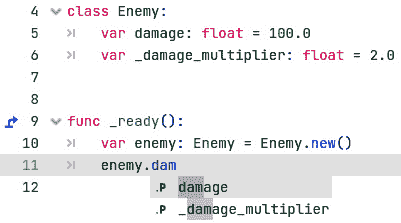
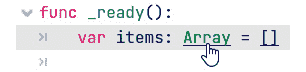
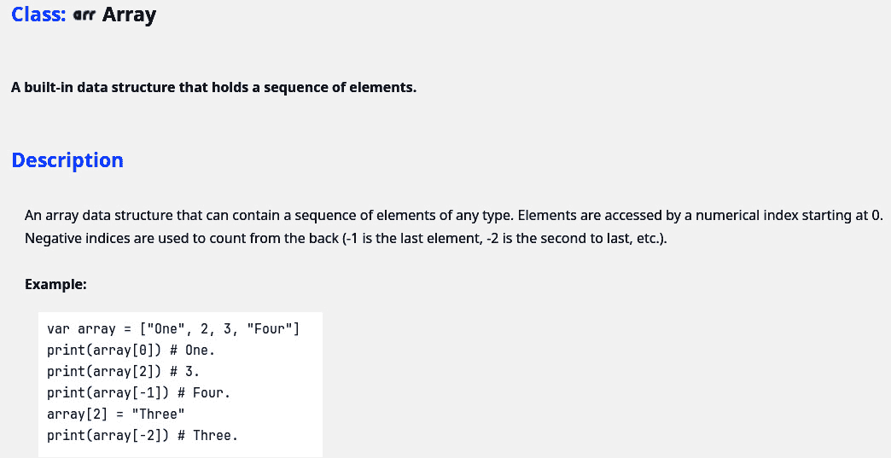
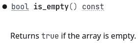
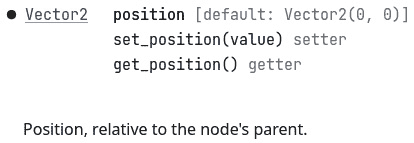
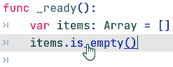
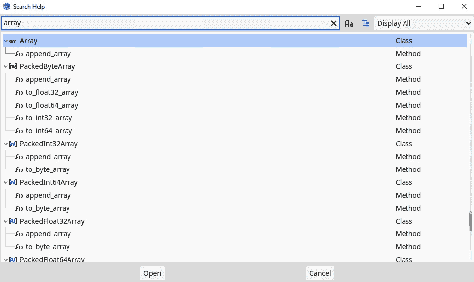
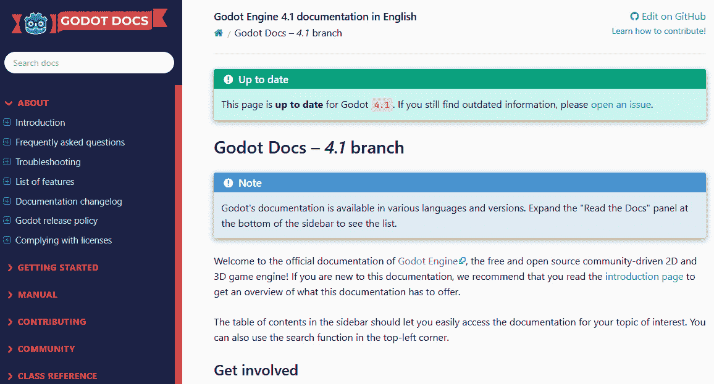

# 如何以及为什么保持代码整洁

在 *第 1* 到 *4* 章，我们学习了编程的所有基础知识，即将深入开发我们自己的游戏。

但在我们这样做之前，我们必须意识到游戏代码库可以变得非常大。这意味着我们今天编写的代码和系统可能会被其他代码和系统埋没。因此，返回到我们之前的工作可能会很麻烦，因为我们忘记了我们为什么以及如何以某种方式编写某些代码。

正因如此，现在是停下来思考如何保持我们的代码即使在编写后数月仍然干净和可理解的理想时刻。本章中的大多数内容都是通过我自己犯错误并在书籍和文章中寻找解决方案学到的。

尽管大多数技巧可能感觉像是一种批判性思维，并将你带到同一个点（它们可能确实如此），但总是说出它们并解释为什么程序员会采用它们总是有帮助的。

在编程时将其牢记在心，这将使你比其他初学者程序员迈出更大的步伐。

在本章中，我们将涵盖以下主要内容：

+   再次讨论命名问题

+   编写好的函数

+   为什么使用私有变量和函数

+   不要重复自己 (DRY)

+   防御性编程

+   编码风格指南

# 技术要求

如果你在代码示例仓库中的任何地方遇到困难，请查看 `chapter05` 文件夹。你可以在这里找到仓库：[`github.com/PacktPublishing/Learning-GDScript-by-Developing-a-Game-with-Godot-4/tree/main/chapter05`](https://github.com/PacktPublishing/Learning-GDScript-by-Developing-a-Game-with-Godot-4/tree/main/chapter05)。

# 回到命名问题

让我们再次看看如何命名变量、函数和类。为这些中的任何一个选择正确的名称非常重要，因为它会使理解代码变得容易得多。

## 命名约定

正如我们在 *第 3* 和 *4* 章中看到的，变量、函数和类名有不同的约束。我们使用了特定的规则来命名每个。这些方法被称为 **命名约定**。它们为我们想要约束名称形成的方式提供了一个术语。GDScript 风格指南中推荐的三种主要命名约定如下：

+   `player_health`, `movement_speed`, 和 `weekly_highscore`.

+   `BUTTON_SIZE`, `PI`, 和 `TEAM_A_COLOR`.

+   `BackgroundColor`, `PlayerWeapon`, 和 `GameStartTimer`.

还有许多其他更独特的约定，如下所示：**kebab-case**, **camelCase**, **flatcase** 等。但在 GDScript 中并不使用这些。

## 命名的一般技巧

现在，让我明确一点：命名事物并不容易。实际上，这是编程中最困难的事情之一。所以，如果你命名正确，你将始终能够快速返回到任何代码。

这里有一些技巧可以帮助你成为命名大师。

### 使用有意义的描述性名称

在早期，程序员必须与计算能力和内存都不多的计算机一起工作，他们还以创建最短的脚本来解决问题而自豪。这导致了变量被赋予一个或两个字母的名称，如`a`或`c5`。将代码优化得尽可能短是非常令人满意的。然而，这些代码片段非常难以理解。即使是编写脚本的人，在过了一段时间后也无法再阅读它。

这就是为什么描述性变量名是一个很大的加分项。当然，它们需要多花几秒钟来输入，但这与花费几分钟甚至几个小时来弄清楚变量为什么存在以及应该如何使用相比，微不足道；而且，自动完成功能总是会帮助我们。

甚至有些人说，短的变量名会导致游戏性能更好。这根本不是真的。编程语言会在代码中将变量标记化，使得任何变量名执行速度都一样快，无论其长度如何。

技巧是使变量、方法或类的名称具有意义和描述性。为此，你可以针对不同类型提出以下问题：

+   **变量**：

    +   变量将包含什么类型的数据？

    +   这类数据应该如何使用？

+   **函数**：

    +   函数做什么？

    +   函数返回什么数据？

    +   函数需要什么类型的参数才能工作？

+   **类**：

    +   这个类将用于什么？

    +   这个类负责哪些数据？

使用这些问题将指导你在为变量、函数和类命名时的决策。

### 避免使用填充词

虽然长描述性名称是最佳选择，但我们也不希望用填充词或不必要的词（如下所示）来模糊名称：

+   The

+   A

+   对象

这些词只是让名称变得冗长，而没有任何额外的意义。

### 保持名称可发音

好的代码应该是易于阅读的。这意味着你应该能够像读一本书一样阅读它，而且它应该在你不需要查看函数的内容或变量的数据类型时就有意义。

这也意味着我们应该保持名称的可发音性。如果我们决定缩写，可以使用完整的单词或非常常见的缩写。

### 保持一致性

现在，最重要的提示是：在命名上保持一致性。这样，你可以依赖自己的命名风格，并对你编写的变量、函数和类做出假设。如果你违反了任何规则，至少要一致地违反，不要每次都做不同的事情。

## 公共和私有类成员

在*第四章*中，我们了解到**抽象**和**封装**是**面向对象编程**的两个关键组成部分。这意味着类外的代码不需要担心该类如何得到结果。对于外界来说，它可能是魔法，甚至更糟，是手工劳动。

为了表示某个特定的变量或方法仅由类本身内部使用，GDScript 采用了在 Python 中流行的约定：在该变量或函数名称前加上下划线。



图 5.1 – 自动完成仍建议私有变量

然而，如*图 5**.1*所示，你会注意到自动完成仍然建议私有类成员。指明哪些类成员是私有的且不应被访问仍然非常重要。这将帮助你或任何其他使用该类的程序员。

## 编写简短函数

函数尝试做的事情越多，该函数内部的代码就越多，理解它所做的事情就越困难。因此，为了使函数易于理解，一个很好的经验法则是将行数保持在 20 行以下。这样你可以快速理解正在发生的事情以及如何有效地使用该函数。

当然，你可以调用不同的函数。将长函数拆分成多个具有良好描述性的小函数，将节省你许多时间来弄清楚代码的功能。

# DRY

几乎每个编程学生都会听说两个缩写。第一个是 DRY。这个缩写敦促我们只写一次代码，然后尽可能多地重用它。如果我们创建小的通用函数，我们就可以防止在整个代码库中复制粘贴相同的几行代码。

但我也应该警告你不要过度使用。有时，有一点点适合特定场景的重复代码是可以接受的，而不是将多个场景强行塞入一段代码中。使用你的最佳判断。

# 做一件事（KISS）

每个人都知道的第二个缩写是**KISS**，代表**keep it simple, stupid**。这可以有两种解释：

+   将解决方案保持至最简，这意味着你不解决尚未存在的问题。这样，你不会开发不需要的功能，也不会浪费时间创建无人使用的东西。

+   不要让你的代码复杂。复杂的代码众所周知难以维护和理解。这就是为什么最好保持任何解决方案简单，这样你总是知道正在发生什么。

简单的代码总是更容易阅读、理解和维护。所以，保持简单，傻瓜！

# 防御性编程

我想要展示的最后一个原则是**防御性编程**。在这个范例中，您通过尽可能检查代码中的各种事项和边缘情况来确保安全。例如，在一个函数中，您可以在函数开始时检查参数是否正确。这样，您将防止在长期运行中发生很多崩溃。

例如，如果您有一个函数应该返回库存中某个索引处的项目，您可以非防御性地和防御性地这样编写：

```cpp
func get_inventory_item(index: int):
   return inventory[index]
func  get_inventory_item (index: int):
   if index < 0 or index >= inventory.size():
      return
   return inventory[index]
```

函数的第二版是防御性的，因为它首先检查我们想要的项目索引是否在库存的范围之内。我们这样做是因为如果索引超出这个范围，游戏就会崩溃。

# 编程风格指南

最后，我想介绍一下编程风格指南是什么。这些指南会告诉您如何组织您的代码。这些指南从不涉及代码的内容，而是更多地关于如何进行样式化。

您可以将这些指南与本书的风格进行比较。我可以将所有句子放在一行中，不进行样式化、标题或图像。但最终，这会使内容非常难以理解。

除了使代码更易于阅读之外，这些风格指南还使整个团队的编码风格保持一致，因此每个人的代码看起来更相似，人们在尝试理解项目的代码库时不需要在不同编码风格之间切换。

大多数公司都有自己的内部风格指南，是的，确实有一个官方的 GDScript 风格指南！您可以在这里阅读：[`docs.godotengine.org/en/stable/tutorials/scripting/gdscript/gdscript_styleguide.html`](https://docs.godotengine.org/en/stable/tutorials/scripting/gdscript/gdscript_styleguide.html)。

我不推荐您一次性阅读整个指南并尝试一次性应用所有内容。相反，您可以在这里和那里阅读一些片段，一旦您掌握了这些指南，再阅读更多，并尝试将其融入您自己的编码风格中。

不要误解。即使有这些风格指南，在编码时仍然可以保留个人风格。这些指南将只是在一个框架内，使您的代码更美观，更容易被使用相同编程语言和框架的其他程序员理解。

在本章的剩余部分，我想回顾一下官方 GDScript 风格指南中的一些提示。特别是以下几点：

+   空白

+   空行

+   行长度

因此，让我们直接深入到 Godot 引擎开发者自己的这些风格建议中。

## 空白

除了我们在*第二章*中讨论的缩进之外，GDScript 不关心代码行内的空白。下面两行在功能上是相同的：

```cpp
var total_damage:float=100+get_damage()*0.5
var total_damage: float = 100 + get_damage() * 0.5
```

然而，第二行对人类来说更易读，因为每个部分都有足够的空间呼吸。这就是为什么始终在数字、函数调用和运算符之间使用空格是至关重要的。这样，一行代码就不会仅仅变成字符的混乱。

在数组中，我们还想在元素之间添加空格，以清楚地显示每个元素都是一个单独的实体：

```cpp
inventory = ["Boots","Sword","Potion"]
inventory = ["Boots", "Sword", "Potion"]
```

反过来也可能成立。插入不必要的空格可能会掩盖某些运算符，例如，访问字典中的键：

```cpp
dictionary ["key"] = 100
dictionary["key"] = 100
```

在前面的例子中，很明显方括号是用来从字典中访问键，而不是用来定义数组。

在以下两个例子中，没有空格显示了元素之间的明确关系：函数名及其参数列表：

```cpp
print ("Hello")
print("Hello")
```

此外，我们还可以在访问对象中的成员变量或函数时看到这一点：

```cpp
object . function()
object.function()
```

通常，在代码行中使用空白空间来显示事物是分离的实体还是属于一起，这一点非常重要。这将极大地提高可读性。

## 空白行

我们还可以使用另一种空白空间来使代码更易读，那就是空白行。空白行简单地就是一行什么都没有的行。风格指南建议使用两个空白行来分隔函数和类定义。这样，就可以清楚地知道哪些文本属于同一个函数：

```cpp
func deal_damage(amount: float) -> void:
   player_health -= amount
func heal(amount: float) -> void:
   player_health += amount
```

除了用两个空白行分隔函数和类之外，指南还建议我们使用一个空白行来分隔逻辑上分组的一行代码。例如，如果我们有计算攻击造成的损害并将其应用到所有敌人身上的代码，我们可以将这个逻辑很好地组合如下：

+   确定损害

+   计算总损害

+   应用到所有敌人的损害

我们可以在以下代码中看到这一点：

```cpp
var weapon_damage: float = 10
var damage_type: String = "Fire"
var total_damage: float = weapon_damage
if damage_type == "Electricity":
   total_damage *= 2
for enemy in enemies:
   enemy.deal_damage(total_damage)
```

你会在本书的各个地方看到我违反空白行指南规则。我这样做主要是为了让代码更紧凑，以便适应页面，但这并不意味着规则不那么重要！

## 行长度

在早期，计算机显示器很小。它们通常在一行文本滚动到末尾或换行之前，无法容纳 70 到 90 个字符。这就是为什么代码最好写成最多这个长度的行。如今，我的超宽计算机显示器可以一行显示超过 500 个字符而不会出现问题。好吧，至少不是技术问题。处理这么宽的文本对人类来说非常难以阅读！

这就是为什么人们在编程时仍然会限制行长度，以保持一切整洁且易于阅读。当然，并不是每个人都同意完美的行长度，GDScript 的默认值是 80 个字符作为软限制，`100`个字符作为硬限制。

建议将您的行长度控制在以下数量。如果您确实遇到了这种情况，您可以通过将中间结果存储在单独的变量中来始终细分您的行。例如，下面的代码片段检查玩家的健康值是否在 `0` 到 `100` 之间，以及玩家是否在其存货中有药水：

```cpp
if player_health > 0 and player_health < 100 and inventory.has("Potion"):
   # Take potion
```

从技术上讲，这并不算太长，但为了展示我们如何可以缩短行长度，甚至使 `if` 语句中的条件更加易读，让我们将此代码片段重写如下：

```cpp
var can_heal: bool = player_health > 0 and player_health < 100
var has_potion: bool = inventory.has("Potion")
if can_heal and has_potion:
   # Take potion
```

如您所见，现在没有多余的行，`if` 语句的易读性也大大提高。

# 利用文档

有时，很难预测 Godot 引擎的内置类、函数或变量的工作方式。幸运的是，该引擎拥有详尽的文档，详细解释了所有内容。

## 访问类的文档

我们可以通过简单地使用 *Ctrl* + 点击类的名称来访问任何内部类的文档。这将带您到该类的特定文档页面。



图 5.2 – 在内部类名上 Ctrl + 点击，例如 Array 类

如 *图 5.3* 所示，文档页面以对类用途的简单描述开始，有时这部分会给出使用示例。



图 5.3 – Array 类的文档页面

然后是类的成员函数、变量、信号和运算符的概述。我们将在 *第九章* 中了解更多关于信号的内容。请注意，您可以轻松地点击函数或变量名称直接转到它们的解释。

重要提示

请记住，函数也可以称为方法，变量也可以称为属性。这是因为绑定到类的函数被称为方法，绑定到类的变量被称为属性。

在概述部分之后，对每个函数和变量都有详细的描述。对于函数，我们得到关于函数做什么，函数接受哪些参数，以及返回什么数据类型的解释。



图 5.4 – 函数的文档部分

对于变量，我们也会得到关于这个变量用途和值的数据类型的描述。



图 5.5 – 变量的文档部分

如果我们想要对类的功能有一个大致的了解，这种方式访问文档非常有效。

## 直接访问函数或变量的文档

要直接转到函数或变量的文档，您只需按 *Ctrl* + 点击该函数或变量，您就会直接转到相关部分。



图 5.6 – 按住 Ctrl + 点击函数或变量将直接带您到文档中的正确部分

点击链接后，我们直接进入 *图 5**.4* 的部分。

## 跳转到函数或变量的定义

这个快捷键也适用于我们自己的代码：如果您在 Windows 或 Linux 上按住 *Ctrl* + 点击或在 Mac 上按 *option* + 点击，那么编辑器将显示我们定义的函数或变量在代码中的位置。

作为实验，尝试使用这个快捷键在我们在 *第四章* 中创建的 `Enemy` 类定义的不同函数上。

## 搜索文档

您也可以搜索所有类、函数和变量。只需按照以下步骤操作：

1.  按 *F1* 键，搜索栏将弹出。

1.  输入您想要搜索的任何类、函数或变量。

1.  选择正确的搜索结果。

结果显示在 *图 5**.6* 中：



图 5.7 – 您也可以通过按键盘上的 F11 键搜索所有文档

如果您无法在 Windows 和 Linux 上按住 *Ctrl + 点击* 或在 Mac 上按 *Option + 点击*，那么这个快捷键可以方便地找到文档中的正确部分，尤其是在类、函数或变量内部。

## 访问在线文档

所有这些文档也都在线托管。在线版本中有些页面和教程在离线版本中无法访问。它还更容易打开在线版本中的多个文档页面。

只需导航到：[`docs.godotengine.org/`](https://docs.godotengine.org/)。



图 5.8 – 在线文档

在左侧菜单栏中，您可以查看所有可用的不同文章，并导航到您感兴趣的部分。

# 摘要

好了！在本书 *第一部分* 中，我们学习了如何编程，并在本章中提供了一些成为优秀程序员的额外技巧。记住，本章中的所有建议都不是一成不变的，也不会被引擎强制执行。因此，您可以在需要的地方打破它们。但它们在这里是为了您的利益，许多程序员已经将它们作为日常实践。

在下一章，也就是本书下一部分的开始，我们终于开始着手制作我们的游戏了！我希望您和我一样兴奋！

# 测验时间

+   在 Godot 引擎和 GDScript 中使用了哪三种命名约定？

+   这些函数的命名是否得当？

    +   `CalculateLifePoints()`

    +   `stop_moving()`

    +   `do_a_thing()`

    +   `drawcircles()`

+   以下类的命名是否得当？

    +   `Player`

    +   `normal_enemy`

    +   `MOTORCYCLE`

+   DRY 和 KISS 这两个缩写分别代表什么？

# 第二部分：在 Godot 引擎中制作游戏

在掌握编程基础之后，我们最终将从零开始制作我们自己的游戏。在本部分，我们将了解 Godot 引擎灵活的基于节点的系统，并创建一个类似 *Vampire* *Survivors* 的游戏。

到本部分结束时，你将使用不同的节点和游戏开发技术创建一个完整的游戏。你甚至可以和你的朋友们一起玩这个游戏，因为我们将以一个关于制作多人游戏章节结束本部分。

本部分包含以下章节：

+   *第六章*，*在 Godot 中创建自己的世界*

+   *第七章*，*制作角色移动*

+   *第八章*，*分割和重用场景*

+   *第九章*，*摄像机、碰撞和可收集物品*

+   *第十章*，*创建菜单、制作敌人和使用自动加载*

+   *第十一章*，*多人联机游戏*
