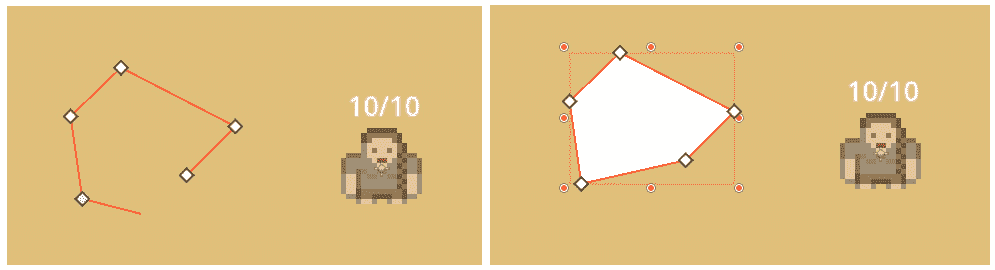

# 在 Godot 中创建自己的世界

在本书的*第一部分*中，你学习了编程的基础！如果问我，这可不是一件小事情。所以，恭喜你达到这个里程碑！现在，是时候将所有这些知识串联起来，开始制作我们的游戏了。

在游戏开发的早期，所有的事情都是通过代码完成的。计算机巫师必须编写所有代码，从系统、功能到关卡和资产放置。近年来，创建游戏的工具已经变得非常好用，而且是免费的，非常用户友好。

Godot，像大多数现代游戏引擎（Unity、Unreal Engine、Construct 等）一样，有一个图形界面，这使得我们可以轻松地将游戏元素拖放到关卡或其他场景中。在本章中，我们将通过创建一个基本的玩家角色和它们的小世界来学习如何使用这个图形界面。

我们还将学习一些技巧，将代码和图形编辑器通过节点引用和变量导出结合起来。

本章将涵盖以下主要内容：

+   Godot 的基于节点的系统

+   创建玩家角色

+   在脚本中引用节点

+   导出变量

+   制作基本的形状

# 技术要求

由于我们将从头开始创建游戏，我自作主张地为你提供了一个项目的基础。你可以在本章的文件夹下的`/start`中找到这个基础项目。该项目提供了一些资产，如图片和声音。创建这些资产超出了本书的范围。本章的结果项目文件可以在本章文件夹的`/result`下找到。

在随后的章节中，你将在该章节的`root`文件夹中找到最终的项目。假设你使用上一章的结果作为起点。

因此，获取起始项目，让我们深入探讨：[`github.com/PacktPublishing/Learning-GDScript-by-Developing-a-Game-with-Godot-4/tree/main/chapter06/start`](https://github.com/PacktPublishing/Learning-GDScript-by-Developing-a-Game-with-Godot-4/tree/main/chapter06/start)。

# 游戏设计

在盲目地创建游戏之前，让我们规划一下我们想要制作的游戏类型。这将结构化我们的思想，并确保我们朝着我们想要制作的游戏前进，而不会走不必要的弯路。最好的方式是通过**游戏设计文档**（**GDD**）。尽管这种文档没有固定的格式，但它最终应该回答一些关于游戏的基本问题：

+   游戏属于哪个类型？

+   游戏将包含哪些机制？

+   故事是什么？

一些游戏设计文档长达数百页。但鉴于这不是一本游戏设计书籍，让我们就以下三个问题来定义我们的游戏，然后在我们前进的过程中详细规划。

## 类型

最近，我们见证了名为 **吸血鬼生存类** 的新类型的诞生，也称为 **VS** 游戏。在这种类型的游戏中，你控制一个角色在 2D 俯视世界中。这个角色必须通过射击来击败追击他们的怪物波次。玩家可以通过移动角色来控制角色，但射击是自动发生的。它不需要输入。

这种类型的游戏拥有庞大的玩家基础，基础游戏相对简单易实现，同时玩起来也令人满意。因此，它将是以下章节中重新创建的理想游戏类型。

## 机制

生存类游戏有一些基本的机制，这些机制非常重要，需要正确实现：

+   **2D 世界**：游戏场是一个 2D 平面，我们在其中有一个俯视视角。其中一些确实是 3D 的，但机制在 2D 中仍然很出色。

+   **角色的移动**：我们需要能够在世界中移动角色。

+   **敌人波次**：我们需要威胁到玩家生命的敌人，并且我们需要生成它们，以便它们构成适当的挑战。

+   **自动射击**：玩家角色将自动射击针对敌人的投射物。

现在我们已经整理了游戏类型和基本机制，让我们来制定我们的游戏将基于的故事。

## 故事

我们不要在编写整个故事上给自己太多压力。在游戏中，故事也可以通过游戏的外观和感觉来讲述。因此，我们可以指定一个将整个体验联系在一起的一般设置。

我们的设定如何：你是一位中世纪骑士，在国王的锦标赛中战斗，以寻找整个土地上最强的士兵。你将不得不在多轮比赛中与多个敌人战斗，如兽人和巨魔，每一轮都比上一轮更难。你唯一得到的武器是一把弓，你可以用它向你的对手射箭。

现在我们对我们正在创建的游戏类型有了想法，让我们开始吧！

# 创建玩家角色

我们将首先为我们的游戏创建一个基本的玩家角色：

1.  打开我在项目基础上提供的 `main.tscn` 文件。

1.  选择名为 `Main` 的 `root` 节点，然后按 **添加子节点** **Node** 按钮：


图 6.1 – 在树中为所选节点添加新子节点的按钮

1.  然后，查找并添加一个 **Node2D** 节点。您可以使用顶部的搜索栏来简化节点的搜索。这是一个在 2D 空间中具有位置的节点：


图 6.2 – 查找和选择 Node2D 节点

1.  接下来，通过右键单击节点并选择 **重命名**，将此 Node2D 重命名为 `Player`，就像我们在 *第二章* 中做的那样。

`Player` 将是我们玩家角色的基础节点。从这里，我们将添加构成 `Player` 节点的所有其他节点。这些节点中的第一个将是一个精灵。

## 添加精灵

我们可以做的第一件事是为我们的玩家角色添加一个视觉元素，一些玩家可以将其与主要角色联系起来的东西。再次按照 *步骤 1* 到 *3* 在 *创建玩家角色* 部分中操作，将一个名为 `Sprite2D` 的节点添加到 `Player` 节点中，以便场景树看起来像这样：


图 6.3 – 到目前为止的场景树

`Sprite2D` 节点是一个可以显示图像的节点，也称为 `Sprite2D`，你将看到右侧的 **检查器** 视图会填充有关该节点的信息：


图 6.4 – Sprite2D 节点的检查器视图

有 **纹理**、**偏移**、**动画**、**区域** 等设置。你可以浏览它们，以了解所有可用的设置。不同的选项卡是 **属性组**，而设置本身被称为 **属性**。

我们只对 **纹理** 属性感兴趣，因为这是我们可以设置该节点显示的图像的地方。所以，让我们为我们的角色添加一个精灵！

1.  在 `assets/sprites/character`。

    这里，你可以找到一些预制的角色精灵。

Kenney 资产

本书使用的所有资产都来自 Kenney，并且可以在你想要的任何项目中免费使用。你可以在 [`kenney.nl/`](https://kenney.nl/) 找到他更多优秀的资产。

1.  将它们中的任何一个拖放到 `Sprite2D` 节点上。我正在使用 `character01.png` 纹理。

1.  `Sprite2D` 节点现在应该看起来像这样：


图 6.5 – 向精灵节点添加纹理

精灵也应该出现在编辑器的 2D 视图中。然而，它看起来非常小。这是因为图像的大小只有 `16` × `16` 像素。让我们稍微放大一下。在 `3` 之下。你可以分别设置 X 轴和 Y 轴的缩放比例，但我们希望它们都相等，这样精灵在缩放时不会拉伸：


图 6.6 – 精灵节点的变换属性

哦不——这是怎么回事？


图 6.7 – 一个模糊的像素艺术精灵

这个精灵看起来模糊！这是因为我们正在使用 **像素艺术** 资产，这种风格以其方块像素而闻名。当放大时，Godot 引擎使用一个算法来模糊这些像素。这对于其他艺术风格，如手绘或矢量艺术，非常棒，但对于像素艺术来说则不然。幸运的是，有一个解决方案。按照以下步骤操作：

1.  导航到 **项目** | **项目设置...**：


图 6.8 – 前往项目设置...

1.  在 **渲染** | **纹理** 下，将 **默认纹理过滤器** 设置为 **最近**：


图 6.9 – 设置默认纹理过滤器为最近邻

这些设置将以更适合像素艺术的方式缩放图像。现在，我们的精灵看起来好多了！


图 6.10 – 清晰的像素艺术精灵

现在我们可以看到我们的玩家，让我们看看如何显示健康 UI。

## 显示健康信息

接下来，让我们添加一些东西来显示玩家健康信息在角色上方。当然，我们还没有为玩家创建跟踪健康的脚本，但我们可以放置视觉效果。我们将使用 `Label` 节点，它可以在游戏中显示文本：

1.  在 `Player` 节点中查找并添加一个 `Label` 节点。

1.  将节点命名为 `HealthLabel`：


图 6.11 - 添加了 HealthLabel 节点的场景树

1.  当选择 `Label` 节点时，将其中的 `10/10` 放入其中，就像玩家有 10 条生命中的 10 条一样：


图 6.12 – 文本设置为 10/10 的 Label 节点的检查器视图

1.  接下来，将标签拖到玩家上方，使其远离精灵：


图 6.13 – 将 HealthLabel 节点重新定位在玩家角色上方

太好了！在 `HealthLabel` 标签就位后，我们可以在稍后通过脚本更新它（见 *创建玩家脚本* 部分）。这就是我们在场景树中设置节点所需的所有内容。

现在，让我们看看我们如何可以操作我们添加的节点。

## 在编辑器中操作节点

现在我们已经建立了一个小场景树，让我们看看我们有哪些工具可以用来操作节点。如果你看看 2D 编辑器的右上角，你会看到一些这些工具：


图 6.14 – 2D 编辑器视图中的工具栏

工具栏中有很多有趣的工具，但就目前而言，前四个是最重要的：

+   **选择模式**：这是默认模式，是一个多工具。您可以在场景中选择节点并将它们拖动。

+   **移动模式**：在此模式下，您可以移动选定的节点。

+   **旋转模式**：在此模式下，您可以旋转选定的节点。

+   **缩放模式**：在此模式下，您可以缩放选定的节点。

通过选择 `Player` 节点并进行一些操作来尝试这些模式。这可能会导致以下结果：


图 6.15 – 多次变换操作后的 Player 节点

你还会注意到，当你移动、旋转或缩放一个节点时，其子节点将以相同的方式被操作。这种变换的继承是层次节点系统的优势。

如果你查看 `Player` 节点，你会看到你对其所做的确切修改。如果你更改这些值中的任何一个，你也会在 2D 编辑器中看到它们的变化：


图 6.16 – 多次变换操作后的变换参数

作为实验，尝试从 **检查器** 视图中更改 `Skew` 的值。

在继续以下部分之前，别忘了将 `Player` 节点中的所有这些操作重置。你可以通过简单地按每个属性旁边的 ↺ 符号来完成此操作。此按钮将属性重置为其默认值。让我们也将 `Player` 节点的位置设置为玩家角色大致位于屏幕中心：


图 6.17 – 将玩家角色定位在屏幕中间

到此为止，我们已经完成了玩家角色的基础创建，并学习了如何在编辑器中操作节点。接下来，我们将关注玩家角色的脚本，并学习如何通过代码操作节点。

# 创建玩家脚本

这是我们一直在训练的时刻。我们已经知道如何做到这一点！所以，首先创建一个新的脚本，并将其附加到 `Player` 节点：

1.  右键点击 `Player` 节点并选择 **附加脚本**：


图 6.18 – 将脚本附加到 Player 节点

1.  在弹出的对话框中，将脚本命名为 `player.gd`：


图 6.19 – 调用脚本 player.gd

1.  我们现在保持简单，只添加一些代码来管理玩家的健康：

    ```cpp
    extends Node2D
    const MAX_HEALTH: int = 10
    var health: int = 10
    func add__health_points(difference: int):
       health += difference
       health = clamp(health, 0, MAX_HEALTH)
    ```

    我们在 `add_health_points()` 函数中使用的 `clamp()` 函数将一个数值作为第一个参数，并将其保持在第二个和第三个数值参数之间。

这样，健康值始终在 `0` 和 `MAX_HEALTH` 之间，最大值为 `10`。

重要提示

记住，在 Windows 和 Linux 上，你可以 *Ctrl* 和点击任何函数以转到文档并查看其功能；在 Mac 上，你可以 *Option* 和点击。

这样一来，我们就可以更改玩家的健康值了。现在，让我们看看如何更新我们之前创建的 `HealthLabel` 节点以反映这个值。

## 在脚本中引用节点

我们希望根据玩家剩余的健康量更新玩家角色的 `HealthLabel` 节点。为了在脚本中更改场景中的节点，我们需要能够引用它们。幸运的是，在 Godot 4 中这相当简单。

获取节点引用有多种方法，但最简单的是美元符号表示法。这种表示法看起来是这样的：

```cpp
$HealthLabel
```

该表示法以美元符号 (`$`) 开头，后跟通过场景树到我们想要引用的节点的路径。在这里，我们引用了之前创建的健康标签。

注意，此路径相对于提及此路径的脚本所在的节点。因此，如果主节点有一个脚本，我们想要引用玩家的健康标签，表示法将如下所示：

```cpp
$Player/HealthLabel
```

因此，既然我们已经知道了如何获取节点的引用，让我们创建一个小的函数来更新玩家的健康标签，并在`add_health_points()`函数中调用它：

```cpp
func update_health_label():
   update_health_label() function, we take the HealthLabel node and directly change its text variable. This will change whatever text the label is showing on the screen.
			Here, we use a new function named `str()` in `update_health_label()`. This function takes any parameter and converts it into a string. We need to do this because the `health` and `MAX_HEALTH` values, which are integers, we’ll have to convert them into a string.
			Now, we can use this `update_health_label()` function whenever we change the `health` value:

```

func add_health_points(difference: int):

health += difference

health = clamp(health, 0, MAX_HEALTH)

HealthLabel 节点正在显示。但有一种更好的方法来访问或引用场景树中的节点：通过缓存它们。我们将在下一节中查看这一点。

            缓存节点引用

            虽然美元符号非常方便，但有时你需要经常访问某个节点。在这种情况下，使用美元符号将会很慢，因为引擎将不得不在树中不断搜索节点，并在每次访问时都这样做。

            缓存

            在计算机术语中，缓存意味着为了以后使用而存储某些数据，这样你就不必每次需要时都加载它。

            为了每次停止搜索节点，我们可以在变量中保存节点的引用。例如，我们可以这样更改玩家脚本：

```cpp
extends Node2D
@onready var _health_label: Label = $HealthLabel
func update_health_label():
   HealthLabel node in a variable called _health_label. Later on, we can use this reference.
			The upside is, of course, that we only have to change the path to the node at one point: the line where the reference gets stored in a variable. Another upside is that we can type-hint the variable with the type of the node. So, we are making it even safer than the previous way of referencing the node.
			You’ll also notice that I use the `@onready` annotation. We call commands that start with an `@` annotation, like the one shown previously. This annotation executes that line of code when the node is ready and has entered the scene tree. This is right before the `_ready()` function of that node is called. In Godot, the `_ready()` function of each node gets called after each of its children are ready, meaning that their `_ready()` functions get called before the parent node’s `_ready()` function. We need to wait for this moment to get any nodes in the tree because otherwise, there is a possibility for them not to exist yet!
			Annotations
			There are more annotations. We’ll return to them when they are applicable. But it’s already good to know that all of these annotations affect how external tools will treat the script and don’t change any logic within the script itself.
			I advise that you always cache variables as described here because it will keep your code clean and fast.
			Trying out the player script
			To try out what we have created so far, we can run a quick test by adding the `_ready()` function to the player script:

```

func _ready():

add_health_points(-2)

```cpp

			Now, when you run the scene, you should see that the health label says **8/10**, like so:
			

			Figure 6.20 – The player’s health label has been updated to 8/10
			After testing the script, remove the preceding lines again so that they don’t interfere with the rest of our coding.
			In this section, we learned how to reference nodes from the scene tree within our code and how to update the values of these nodes. We also set up a basic script for tracking the health of our player. In the following section, we’ll learn about exporting variables.
			Exporting variables to the editor
			We have always defined variables within code and every time we wanted to change them, we had to change the code too. But in Godot, it is straightforward to expose variables to the editor so that we can change them without even opening the code editor. This is extremely useful when you want to test things out and tweak variables on the fly. An exported variable pops up in the **Inspector** view of that node, just like the transformation and text properties we saw in the *Manipulating nodes in the* *editor* section.
			Important note
			An exported variable is also useful for people who don’t know how to code, such as level designers, but still want to change the behavior of specific nodes.
			To export a variable to the editor, we can use the `@export` annotation. Let’s change the line where we define the `health` variable, like so:

```

@export var health: int = 10

```cpp

			Make sure you save the script. Go to the 2D editor using the button at the top of the editor.
			

			Figure 6.21 – Click 2D to go back to the 2D editor
			Click on our `Player` node, and see the `health` variable in the **Inspector** view. This is our exported variable. Changing it will change the variable’s value at the start of the game, not directly in the script itself:
			

			Figure 6.22 – The health variable as an exported variable in the Inspector view of the Player node
			Now, when you change the player’s health value through the `health` label in the `_ready()` function, like so:

```

func _ready():

update_health_label()

```cpp

			This will ensure that the health label is updated from the moment the `Player` node enters the scene tree.
			More information
			If you want to learn more about export variables, you can check out the official documentation: [`docs.godotengine.org/en/stable/tutorials/scripting/gdscript/gdscript_exports.html`](https://docs.godotengine.org/en/stable/tutorials/scripting/gdscript/gdscript_exports.html).
			Now, we start the game with the correct amount of health displayed on the health label. But there is a better way of updating this health label: using setters and getters.
			Setters and getters
			When you change the player’s health value through the `_ready()` function, like so:

```

func _ready():

print(health)

```cpp

			That is because the `update_health_label()` function is not being called when we change the value!
			Luckily, we can fix this. In programming, **getter** and **setter** functions exist. These functions are called when you get or set the value of a variable. With these getter or setter functions, we can execute all the logic needed to handle a new value. We can define a getter and setter for our health variable like so:

```

@export var health: int = 10:

get:

return health

设置(new_value):

health = clamp(new_value, 0, MAX_HEALTH)

update_health_label()

```cpp

			So, the getter is defined by `get:`, followed by the code block that defines the getter logic, and the setter by `set(new_value):`, followed by its code block. `new_value` is the new value that is assigned to the variable. Within the setter, we get the opportunity to process this value if needed or set other processes in motion. In our case, we don’t want to process the new value, but we do want to update the health label.
			The getter does nothing special – it just returns the health value. On the other hand, the setter clamps the new value so that it is valid and then updates the health label.
			When we get or set the `health` value, the interpreter will execute these functions first. Here’s an example:

```

print(health) # 执行获取器

health = 100 # 执行设置器

```cpp

			This also simplifies the `add_health_points()` function because we no longer have to clamp the new health value as this already gets done in the setter. So, let’s update the `add_health_points()` function to the following:

```

func add_health_points(difference: int):

health += difference

```cpp

			But what is this? The project errors when we run it now!
			

			Figure 6.23 – An error showing that the health label is non-existing
			The setter function gets executed before the `_health_label` reference is created. So, we must make sure that the `_health_label` is filled in before we update its text. If it isn’t, we can just return from the function:

```

func update_health_label():

if not is_instance_valid(_health_label):

return

_health_label.text = str(health) + "/" + str(MAX_HEALTH)

```cpp

			The `is_instance_valid()` function checks if the reference to a node is valid. It returns `true` if it is and `false` otherwise.
			Checking if a node reference exists
			Your first instinct might be to check if the reference to the node is not `null` by running `_health_label != null`. However, this does not guarantee that the node is available. When the node is deleted, for example, this check for `null` will still return `true` because the reference still exists within the variable. `is_instance_valid(_health_label)` will check more than just whether the variable is `null` – it will also make sure that the node still exists and is in use within the scene tree.
			At this point, the code for the player should look like this:

```

extends Node2D

const MAX_HEALTH: int = 10

@onready var _health_label: Label = $HealthLabel

@export var health: int = 10:

获取：

return health

set(new_value):

health = clamp(new_value, 0, MAX_HEALTH)

update_health_label()

func _ready():

update_health_label()

func update_health_label():

if not is_instance_valid(_health_label):

return

_health_label.text = str(health) + "/" + str(MAX_HEALTH)

func add_health_points(difference: int):

health += difference

```cpp

			Setters and getters help us encapsulate behavior related to updating variables, as we saw in *Chapter 5*. It abstracts the logic behind what needs to happen when updating this variable so that the user of the class doesn’t have to worry about it.
			With this code set up, the health of our player can easily be updated using the regular or special assignment operators and the health label will update accordingly.
			Changing values while the game is running
			Another cool thing about these exported variables, now that we have a setter and a getter defined for them, is that we can change them while the game runs! So, if you run the game and change the `health` parameter in the **Inspector** view while it is running, you will see that change reflected in the health label instantaneously.
			This (mostly) works with all built-in parameters too! If you keep the game open and change the player’s **Transformation** parameters, for example, you’ll see them change in real time.
			This will be useful later on so that we don’t always have to re-launch the game when working on it.
			Different types of exported variables
			When exporting a variable that we type hinted, Godot will choose the right input field type for that type. It will have a numerical input field with up and down arrows for integers, while it will use a normal text input for strings, like so:

```

@export var health: int = 10

@export var damage: float = 0.0

@export var player_name: String = "Erika"

```cpp

			These three lines will each export a variable to the editor, but each with a different data type: integer, floating-point number, and string, respectively. The result is that we get a different kind of input field for each of the variables:
			

			Figure 6.24 – Different variable types that get exported
			There are also other export annotations to be even more specific. One of those is the `@export_range` annotation, which specifies a number range the value should be in, like so:

```

@export_range(0, 10) health: int = 10

```cpp

			In the preceding code excerpt, we export the `health` variable and specify that it should be a number between 0 and 10, including the outer values of 0 and 20\. When you try out this ranged export, you’ll see that you cannot input values that fall outside of this range.
			To make it more dynamic, we can use the `MAX_HEALTH` variable we defined earlier within the player’s script:

```

@export_range(0, MAX_HEALTH) health: int = 10

```cpp

			Exporting variables is a very important technique to keep in our toolkit for tweaking variables and values when testing out the game. Now, let’s direct our attention to the arena and world the player will be walking around in.
			Creating a little world
			Now that we have a little player character, let’s create a world for them to inhabit! In this section, we’ll flesh out the arena in which the player has to battle challenging foes.
			Changing the background color
			Let’s start simple by changing the background color for our arena. We can easily do this from the project settings:

				1.  Navigate to **Rendering** | **Environment** in the project settings:

			

			Figure 6.25 – Finding Default Clear Color under Rendering > Environment in the project settings

				1.  Set the `#e0bf7b` because it looks like sand or dried-up mud:

			

			Figure 6.26 – Picking a color using the color selection tool
			With this nice color in place, let’s add some features, such as boulders and walls, to our arena.
			Adding Polygon2D boulders
			Now that we have a ground for the player character to stand on, let’s add some boulders that will serve as obstacles in the arena. To do this, we will be using the `Polygon2D` node. This node can draw any polygon shape on the screen in any color we want:

				1.  Add a `Arena` to the root node of our `Main` scene.
				2.  Now, drag the `Arena` node we just created above the `Player` node. This will ensure everything within the `Arena` node will be drawn beneath the `Player` node. See the *Node drawing order* section to learn more about this.
				3.  We will put all our arena elements, such as boulders and walls, into this node. This way, we’ll keep the tree structure nice and tidy.
				4.  Now, add a `Polygon2D` node under the `Arena` node and call it `Boulder`:

			

			Figure 6.27 – The scene tree with the Arena node and a Boulder node

				1.  You can add points to the polygon by left-clicking anywhere on the screen while the `Boulder` node is selected. Right-clicking will remove a point. You can also drag earlier placed points around. Place some points and close the shape by clicking on the first point you put down:

			

			Figure 6.28 – Drawing a boulder using a Polygon2D node

				1.  Set the `Boulder` node’s color property to something that resembles a stone. I chose `#504f51`.

			These boulders might look simple, but they will serve our purpose.
			Node drawing order
			So, why did we drag the `Arena` node above the `Player` node? By default, the nodes get drawn in the order they’re in within the tree. The nodes closest to their parents get drawn first and the ones further away from the parent node within the tree structure are drawn on top of the ones below.
			There are ways to circumvent this, but that’s out of the scope of this book. So, for now, we must structure our node tree correctly:
			

			Figure 6.29 – Nodes get drawn in the order they are in within the scene tree
			A well-structured tree will draw all nodes in the exact order we want them to be.
			Creating an outer wall
			For the outer wall of the arena, we’ll use a `Polygon2D` node again, but in a different way this time:

				1.  Add a `Polygon2D` node under the `Arena` node and call it `OuterWall`.
				2.  Draw a rough rectangle that will be the inside of the arena. It’s okay if this rectangle is not perfect. This will make the arena look extra medieval:

			

			Figure 6.30 – Drawing an arena outer wall using a Polygon2D node

				1.  Now, with `OuterWall` selected, find and enable the **Invert** parameter in the **Inspector** view. This option inverts the shape and makes it look like the outer walls of the arena:

			

			Figure 6.31 – Inverting the shape of a Polygon2D node

				1.  Set the `1000px`, so that the walls expand very far.
				2.  Give the wall a fitting color. I chose `#2d2c2e`, which is a little darker than the boulders, so that the player sees the difference:

			

			Figure 6.32 – The resulting arena
			Inverting a polygon makes it very easy to create the internals of an arena or room. The natural next step is to let our imagination loose and make a visually nice arena.
			Getting creative
			With these simple tools, get creative and create some interesting terrain to serve as an arena.
			For instance, you can add some more boulders to your arena. You can do this by creating an entirely new `Polygon2D` node or by duplicating your earlier boulder and altering them a bit by dragging points around and using the **Transform** tools we learned about.
			You can also add more walls and change the outer boundaries of the arena some more.
			I came up with this arena:
			

			Figure 6.33 – My arena after spending some more time refining it
			Now that we can create our little worlds and arenas using colored rectangles and polygons, we have everything to create the basic visual structure of our game. Next, we’ll do some extra exercises and summarize this chapter.
			Additional exercises – Sharpening the axe

				1.  Start by making more boulders and walls based on what we learned in the previous section so that you can populate your arena.
				2.  Based on what you learned about the `health` value of the player, add an exported variable that tracks the number of coins the player has, called `number_of_coins`, to the player script.
				3.  Add a setter and getter for the `number_of_coins` variable.
				4.  Lastly, make a label that shows the coins above the player’s head. Make sure that everything gets handled and updated correctly so that we can update the variable from the editor and the code while the label always stays up to date when running the game.

			Summary
			In this chapter, we created our first real scene. We saw how different nodes do different things for us and we extended **Node2D** with a script that will manage the player’s health. We also created the area in which all the action will take place.
			In the next chapter, we’ll make it possible for the player to move around and we’ll also refresh our vector math. Don’t worry – it won’t be painful, but a bit of math will be useful.
			Quiz time

				*   Why did we start by making a Game Design Document (GDD) instead of jumping right into creating the game?
				*   How do you reference nodes within a script?
				*   What keyword can we use to make a variable, such as the amount of health, available in the **Inspector** view?
				*   What are setter and getter functions used for?

```

```cpp

```
