# 9

# 相机、碰撞和收藏品

在玩游戏时，玩家不希望必须考虑相机及其位置。相机应该始终跟随玩家的角色，并预测玩家想要实现的目标，以免阻碍玩家的视线。

在更大的游戏中，整个团队的任务是制作最平滑的相机。在本章中，我们将尝试使用一些 Godot 引擎节点来完成同样的工作。

之后，我们将阻止玩家穿过墙壁，并查看在竞技场周围撒播收集品，如健康和金钱。

在本章中，我们将涵盖以下主要主题：

+   制作跟随玩家的相机

+   与巨石和墙壁的碰撞

+   碰撞掩码

+   创建继承场景

+   连接到信号

# 技术要求

就像每个章节一样，你可以在 GitHub 仓库的子文件夹中找到本章的最终代码，该文件夹位于 [`github.com/PacktPublishing/Learning-GDScript-by-Developing-a-Game-with-Godot-4/tree/main/chapter9`](https://github.com/PacktPublishing/Learning-GDScript-by-Developing-a-Game-with-Godot-4/tree/main/chapter9)。

# 制作跟随玩家的相机

目前，我们的角色可以四处奔跑，但迟早它会跑出屏幕并永远消失。我们的游戏内相机应该跟随它们，以便玩家知道它们在哪里。

幸运的是，Godot 引擎有一个相当不错的相机系统，我们可以使用。它可能有点基础，但这是我们需要的所有功能，并且通过一些额外的节点，我们将能够实现一个非常平滑移动的相机。

## 设置基本相机

对于 2D 游戏，Godot 提供了 **Camera2D** 节点。

打开 `player.tscn` 场景并添加一个 `Player` 节点。这就是我们制作一个基本的跟随玩家相机的所有所需：

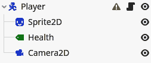

图 9.1 – 添加了 Camera2D 节点的玩家场景

但这个基本的相机感觉有点僵硬；它开始和停止移动的时间与角色完全一致。这感觉不太自然。让我们看看如何解决这个问题。

## 添加拖动边距

为了使相机移动看起来自然，我们将使用 **拖动边距**。在相机的检查器中找到并启用**水平**和**垂直**拖动：

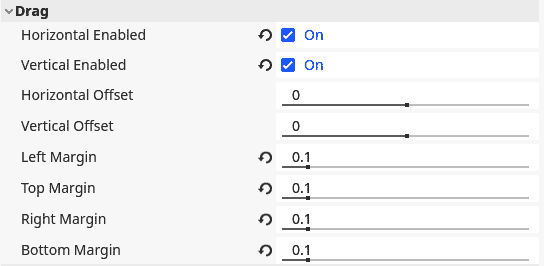

图 9.2 – 在检查器中设置 Camera2D 节点的拖动边距设置

现在，相机只有在玩家退出屏幕中间的某个区域时才会移动。这是没有任何事情发生的边距。如果你在相机的检查器中启用**绘制拖动边距**，你可以看到拖动边距的视觉表示：

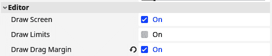

图 9.3 – 通过在 Camera2D 检查器中启用它们来在编辑器中显示拖动边距

当启用**Draw Drag Margin**时，你应该能够看到表示相机即将开始移动的蓝色矩形：

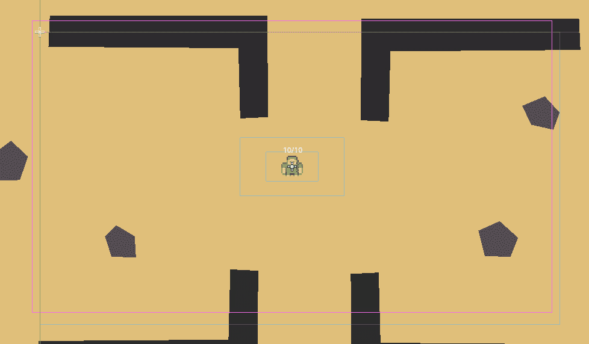

图 9.4 – 编辑器现在以浅蓝色显示拖动边距

你可以在检查器中稍微调整左、上、右和下边距。我选择将它们都设置为`0.1`，如之前在*图* *9**.2*中看到的。

很好，拖动边距已经感觉很好了。但是，相机的移动仍然开始和停止非常突然，似乎落后于玩家。让我们接下来修复这个问题。

## 让相机向前看

现在相机的移动感觉很好。但是，有些地方不对劲；我们需要比平滑运动更基本的东西。当玩家移动时，相机拖在后面，显示玩家已经去过的位置，而不是玩家将要去的位置。

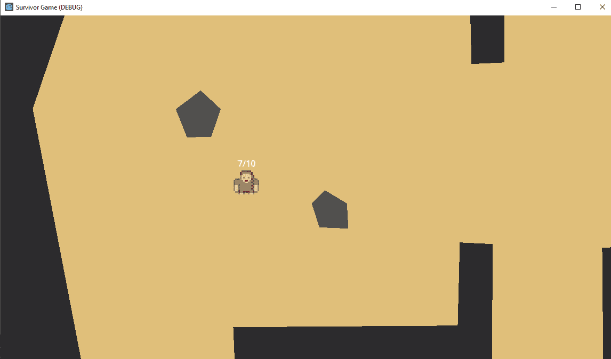

图 9.5 – 相机落后于玩家，没有显示玩家将要去哪里

这并不理想；想象一下跑在某处，只能向后看。我们实际上想要的是相机向前看，朝向玩家移动的方向。我们可以通过跟踪玩家前方的一个点来做到这一点，而不是跟踪玩家本身。基本上，就像玩家角色拿着自拍杆一样。所以，按照以下步骤操作：

1.  添加一个新的`Player`并命名为`CameraPosition`。这将变成我们要跟踪的点，而不是玩家本身。

1.  现在将我们已创建的相机拖动到这个`CameraPosition`上，使其成为新节点的子节点：

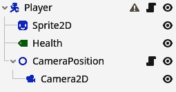

图 9.6 – 将 Camera2D 节点放在一个名为 CameraPosition 的单独节点下

1.  确保在检查器中`CameraPosition`的位置设置为`(0, 0)`：

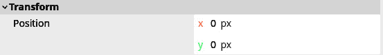

图 9.7 – 确保 Camera2D 和 CameraPosition 节点位于位置(0, 0)

1.  向`CameraPosition`添加一个名为`camera_position.gd`的脚本。

此脚本将保持相机前的位置。我们可以根据玩家角色的`velocity`来实现这一点。

完整的脚本如下：

```cpp
extends Node2D
@export var camera_distance: float = 200
@onready var _player: CharacterBody2D = get_parent()
func _process(_delta):
   var move_direction: Vector2 = _player.velocity.normalized()
   position = move_direction * camera_distance
```

首先，我们定义一个可以操作的导出变量，称为`camera_distance`。这将是在玩家移动时，我们将保持相机距离玩家前方的距离。

通过 `_physics_process()`，它在游戏的每个物理帧上执行，我们计算摄像机点的位置。记住，这个位置相对于 `Player` 节点，所以 `(0, 0)` 的位置就在玩家那里。想法是取玩家移动的方向并将其乘以 `camera_distance`。玩家移动的方向可以通过玩家的 `velocity` 得到。因此，首先，我们使用 `get_parent` 函数获取玩家节点并将其缓存到 `_player` 变量中。这个函数返回一个节点的父节点，在这种情况下，是 `Player` 节点，因为 `CameraPosition` 是该节点的直接子节点。

然后，为了获取玩家移动的方向，我们将这个 `velocity` 向量标准化。正如我们在 *第七章* 中看到的，标准化一个向量意味着你取整个向量并使其长度为 `1`。因此，整个向量长度为 `1` 像素。这将使我们得到 `velocity` 的方向，而不包括其长度。现在我们可以通过将其与 `camera_distance` 相乘来轻松地将这个方向缩放到我们想要的任何长度，以定义 `CameraPosition` 的 `position`。如果你现在运行游戏，你会看到 `CameraPosition` 正如你想要的那样工作，使摄像机朝向角色移动的方向看去。但它仍然有点不稳定，所以让我们最后一次将其平滑化。

## 平滑前瞻

现在的问题是，摄像机开始非常突然地移动，然后又突然停止。这是因为我们创建的 `CameraPosition` 移动得相当快。为了解决这个问题，我们应该使 `CameraPosition` 的移动本身更加平滑。

首先，添加一个新的导出变量，如下所示：

```cpp
@export var position_interpolation_speed: float = 1.0
```

现在，让我们将 `camera_position.gd` 脚本的 `_process()` 函数更改为以下内容：

```cpp
func _physics_process(delta):
   var move_direction: Vector2 = _player.velocity.normalized()
   var target_position: Vector2 = move_direction * camera_distance
   position = CameraPosition to have as a target_position. Then, in the next line, we calculate the actual position.
			To calculate the position, we use a new function, `lerp()`. This is short for `move_towards()`, which we used in *Chapter 7*. However, while `move_towards()` moves the position a certain number of pixels toward the target position, `lerp` moves the position toward the `target_position` according to a percentage between the two, which is the last argument in the function. This percentage is expressed in a value from `0.0` to `1.0`, where `0.0` is `0%` and `1.0` is `100%`.
			So, let’s say we want to move `50%` between the position and its target, then the resulting position will be right in the middle between the two points.
			This process is called **linear interpolation** because we interpolate between two values linearly. The way we use linear interpolation in our camera position script is to move toward the target position a little bit every frame.
			The percentage of the linear interpolation that I chose was `5.0 * delta`. I put this value in an exported variable so we can easily tweak it from the editor. Because delta is the time between two frames, the result of this product is very small and should result in an interpolation of around `10%` per frame. We multiply by `delta` because, just like for the movement speed of the player, we want the speed of the camera not to change on faster or slower computers that run at a higher or lower framerate. We talked about frame rate independent calculations in *Chapter 7* too when making the character move.
			You can play around with the speed of the interpolation by changing the `position_interpolation_speed` to anything else through the inspector.
			In this section, we learned a great deal about creating a smooth and useful camera that frames where the player is moving toward. As mentioned in the introduction of this chapter, big-budget games have whole teams that work on nothing else but the camera. But using some smart tricks, we achieved a fairly nice camera for our little game. Now, we’ll shift gears and make sure the player stops running through walls by adding collision detection.
			Collisions
			With our brand-new camera in place, let’s take a look at collisions. For now, we have the visuals of a nice arena, including walls and rocks, but they don’t really act like them. The player character is able to just run through them as if they were made out of air instead of solid matter.
			Just like with the movement of the player, we can solve this using the built-in physics engine. Let’s start by taking a look at the different physics bodies at our disposal.
			The different physics bodies
			For the player character, we used the **CharacterBody2D** physics body. But this is not the only kind that comes with the physics engine Godot. There are a few other ones:
			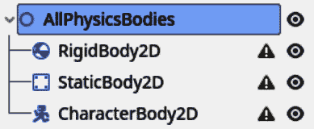

			Figure 9.8 – The three different physics bodies as displayed in the scene tree
			For 2D games, there are three different kinds of physics bodies available. Each has its own uses within a game or physics simulation. Let’s take a look at each.
			RigidBody2D
			A rigid body is a physics object that is fully simulated. Rigid bodies are completely dependent on outside physical forces and collisions. You are not supposed to control them directly.
			Important note
			These bodies are called rigid because the body itself does not deform. So, it gets used for simulating solid objects from cars to bones to walls. The **StaticBody2D** and **CharacterBody2D** can also not deform and are therefore also rigid bodies, but more in the mathematical sense of the word and not in how they are implemented within the engine.
			We cannot directly control a rigid body; they are fully managed by the physics engine, which resolves how it moves and how the velocities and forces get applied. The only way to control a rigid body is by applying external forces to it. This is like hitting a golf ball with a stick. With enough practice and fine-tuning, you can get the ball in the general direction of the hole, but picking it up and dropping it in there, though easier, is not an option.
			Simulating non-rigid, bodies, also known as soft bodies, is generally harder to do mathematically and performantly within a game. Soft bodies could be sponges, rubber objects that deform, jelly, and so on. There are ways to simulate these within a rigid body simulation, but it’s not advised to do this. In 3D, there is a **Softbody3D** node, but it is not for 2D.
			StaticBody2D
			A static body is a physics body that stays static, meaning it does not move around and also cannot be pushed by external forces. This is the simplest of physics bodies to deal with and will be ideal for making our walls and rocks out of.
			CharacterBody2D
			A character body is a physics body that we are able to control through code. A **RigidBody2D**, as we saw earlier, is fully managed by the physics engine. This makes it hard to control to get it to do what you want it to.
			A character body, on the other hand, gives us a good middle ground. Like in the `player.gd` script, we have to calculate the `velocity` ourselves and call `move_and_slide()`. But the physics engine still helps us out with collisions and calculating where the body is supposed to move based on the velocity.
			More information
			The Godot documentation also has a great write-up of the different physics bodies and how they can be used: [`docs.godotengine.org/en/stable/tutorials/physics/physics_introduction.html#collision-objects`](https://docs.godotengine.org/en/stable/tutorials/physics/physics_introduction.html#collision-objects).
			These were the three types of physics bodies available in Godot. But there is actually a fourth physics object, which is not a body. Let’s take a look at the **Area2D** node.
			The Area2D node
			The three physics bodies we just saw all collide with each other and react to this collision or make other bodies react to it. In essence, their movements get processed by the physics engine.
			The last physics object, **Area2D**, only detects and influences other physics objects. It is not subjected to physics calculation, like for movement. But it can detect if another physics object is overlapping it and throws a signal when these other physics objects enter or leave.
			We will use this functionality near the end of this chapter to make the player pick up health potions when they come near them.
			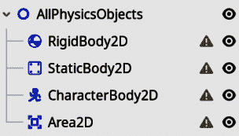

			Figure 9.9 – The four different physics objects as they are displayed in the scene tree
			Now that you know about the three types of physics bodies currently available, we can start utilizing them to create proper collisions.
			Adding a collision shape to the player node
			Since we created the player node all the way back in *Chapter 6*, there has been this little orange triangle next to it. When we hover over it, the tool tip explains to us that this node is missing a shape. This makes sense, how can the physics engine detect collisions if it doesn’t know what shape a physics body is?
			Let’s solve this little warning:

				1.  Find and add the `Player` node:

			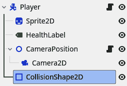

			Figure 9.10 – Add a CollisionShape2D to the player scene

				1.  Select this newly created **CollisionShape2D** node and click on the empty **Shape** field to reveal a drop-down menu with different shapes.
				2.  Select the **CapsuleShape2D** option.

			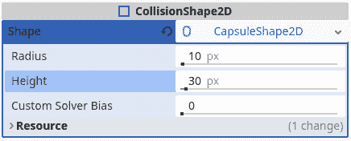

			Figure 9.11 – Select a CapsuleShape2D as the CollisionShape2D’s shape

				1.  A capsule-like blue shape will appear on the screen. This is the shape of the physics body. Use the orange circles on the periphery of the shape to change its size and try to cover most of the player sprite:

			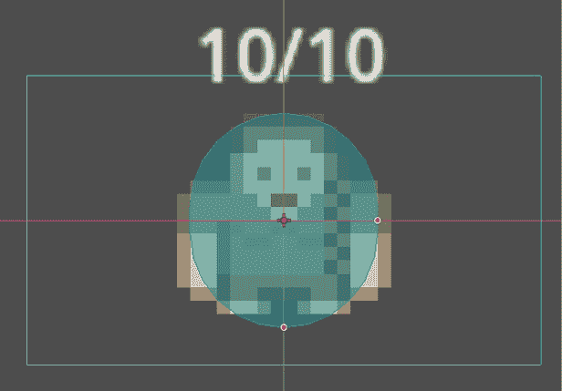

			Figure 9.12 – Make sure the CapsuleShape2D covers the player sprite
			The **CollisionShape2D** node in itself does not have a shape, but it will hold one for us. That is why we had to add one to the **Shape** property.
			Other shapes that are interesting as collision shapes are **RectangleShape2D** and **CircleShape2D**. The others are used in specialized situations, such as for very thin or disjointed objects, so don’t worry too much about them just yet.
			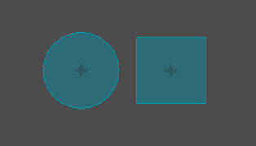

			Figure 9.13 – The CircleShape2D and RectangleShape2D
			Running the game now will not result in the player colliding with the boulders or walls, simply because first, we’ll also need to add physics bodies and shapes to the scenes of these two.
			Creating static bodies for the boulders
			In the *The different physics bodies* section, we learned that **StaticBody2D** nodes don’t move; that sounds ideal for a boulder. So, let’s make them solid:

				1.  Go into our `boulder.tscn` scene.
				2.  Add a **StaticBody2D** node under the root node:

			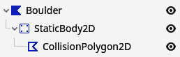

			Figure 9.14 – Adding a StaticBody2D with a CollisionPolygon2D as a child of the boulder scene

				1.  Add a `CollisionPolygon2D` node under this newly created static body.
				2.  Now add points to the collision polygon by clicking within the 2D editor. Try to cover the boulder completely:

			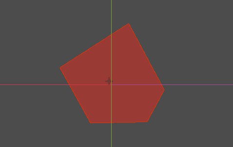

			Figure 9.15 – Cover the boulder with the PolygonShape2D
			Note that we use a different kind of collision shape. Now we use `CollisionPolygon2D`. This shape lets us define our own arbitrary shape. The advantage is that we can create any shape we like. The disadvantage is that arbitrary polygons are a bit slower for the physics engine to handle. But this should not be a big problem in our game because we will not have thousands of objects that require complex physics calculations.
			Now that we know how to create static bodies, we can do the same for other static objects in our game, such as walls.
			Creating static bodies for the walls
			Let’s do something similar by adding collision to the walls within the game:

				1.  Open up `wall.tscn`.
				2.  Add a **StaticBody2D** node.

			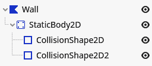

			Figure 9.16 – The wall’s StaticBody2D has two CollisioniShape2D children

				1.  Instead of using a **CollisionPolygon2D**, add two **CollisionShape2D** nodes.
				2.  Give them each a **RectangleShape2D** in their **Shape** property.
				3.  Now make sure that the combination of these two shapes covers the wall:

			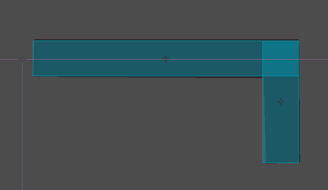

			Figure 9.17 – Covering the wall using the two RectangleShape2Ds
			From this example, you can see that a single physics body can actually contain multiple collision shapes. This is very useful when constructing complex shapes without having to resort to a **CollisionPolygon2D**. Although we used two rectangle shapes, we could have used two different shapes if we wanted to, even combining regular shapes and polygons. We can add as many shapes under one physics body as we desire.
			In this section, we learned how to use different physics bodies to do collision detection and make sure the player doesn’t walk through walls and boulders. In the next section, we’ll extend this knowledge to also use the physics engine to detect whether the player is within a certain region or not.
			Creating collectibles
			Now, let’s create some collectibles for our hero to pick up. We’ll create two different collectibles:

				*   A health potion, which will replenish the health of the character
				*   A coin, which will add one gold to the player’s money

			We’ll start off by creating a base collectible, from which we can easily implement the two different behaviors we want the two collectibles to have.
			Creating the base collectible scene
			The base scene and class that we will build to inherit each specific collectible is very important; it should cover the use case of all other collectibles that we want to create. So let’s start:

				1.  Create a new scene called `collectible.tscn` in a new folder, `parts/collectibles`.
				2.  Set up the scene as shown in *Figure 9**.18*:
    1.  Make the root node a `Collectible`.
    2.  Add an **Area2D** node and a **Sprite2D** as direct children.
    3.  Add a **CollisionShape2D** to the area.

			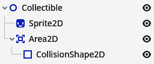

			Figure 9.18 – The base scene structure for our collectibles

				1.  Fill the **Shape** property of the **CollisionShape2D** with a **CircleShape2D**.
				2.  Update the radius of the circle shape to be `25` pixels.

			We use a new node type, **Area2D**. An **Area2D** node can detect collisions when another physics body or area enters its shape. As we are using this physics object, the **Area2D** node will not act out any physics, nor will it influence the physics of the other physics body. **Area2D** nodes are used to detect whether other bodies or areas overlap their collision shape. We will use this functionality to detect if the player character overlaps the collectible because when this happens, we have to execute the code associated with the collectible.
			With the base collectible scene ready, we can easily inherit from it in the next section.
			Inheriting from a base scene
			If you were wondering why we didn’t add a texture to the collectible scene yet, that’s because we want to do that for specific collectibles, such as the health potion and coin, and not for the base.
			So let’s create a specific collectible:

				1.  Right-click on the `collectible.tscn` scene in the file manager and select **New** **Inherited Scene**.

			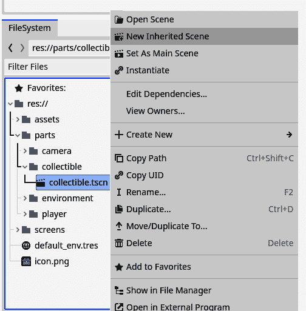

			Figure 9.19 - Right-clicking the collectible.tscn file and choosing New Inherited Scene

				1.  A new scene will open up. Rename the root node to `HealthPotion`:

			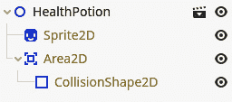

			Figure 9.20 – The inherited nodes are greyed out

				1.  Save the inherited scene as `health_potion.tscn` in the same folder as the `collectible.tscn`, which is `parts/collectibles`.
				2.  Now add the `HealthPotion.png`, from `assets/visual/collectibles`, as a texture to the **Sprite2D** node.
				3.  The sprite is a little small, so set the scale to `(2, 2)`, as we did for the player’s sprite in *Chapter 6*:

			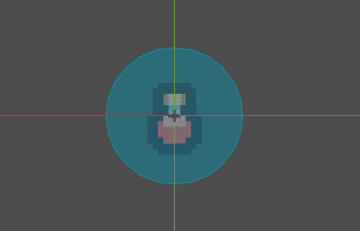

			Figure 9.21 – This is how our health potion collectible should look in the editor
			You can see that all the nodes, except for the root node, are greyed out, as in *Figure 9**.22*. That is because these nodes are managed by the scene we are inheriting from, the `collectible.tscn` scene in this case.
			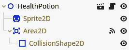

			Figure 9.22 – When inheriting a scene, the inherited nodes are greyed out
			Try it yourself
			Just as an experiment, go back to the `collectible.tscn` scene, put the sprite node in a different location, and save. If you have a look in the `health_potion.tscn` scene, you’ll see that the sprite moved to the same location too!
			With the technique of inheriting scenes, we can easily build out the functionality of collectibles without having to alter each collectible’s scene separately or copy-pasting. We can just define the base structure and functionality once.
			With our base health potion scene done, we can now add its logic. First, we need to know when the player is actually close enough to pick up the collectible. We’ll learn how to do this in the next section.
			Connecting to a signal
			In the *Creating the base collectible scene* section, I told you that we were going to use an **Area2D** node to detect when the player’s physics shape enters and thus when we know the collectible should be collected.
			To do this, we’ll learn about a new concept in Godot Engine: **signals**. All nodes can throw signals; a signal could be something such as *“a physics body entered my shape”*. We could listen, or connect, to this signal and run a piece of code whenever it happens.
			We will now do this for the signal that the **Area2D** node throws when a physics body enters its collision shape:

				1.  Go to the `collectible.tscn` scene.
				2.  Add an empty script to the root node. To connect to a signal, we first need a script. Make sure to delete all the code within the script except for the first one that says it extends the `collectible.gb`.
				3.  Now select the **Area2D** node. In the right panel, where we normally see the Inspector for a node, there is also a tab called **Node**. Click it.

			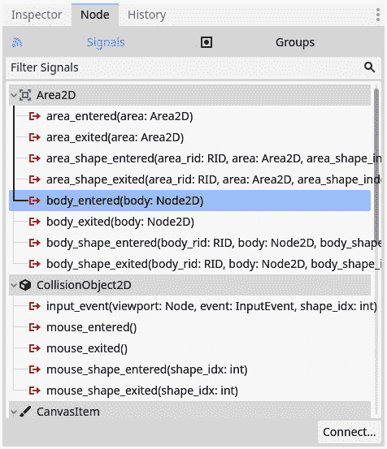

			Figure 9.23 – The list of signals an Area2D node can throw; body_entered is the one we need

				1.  This tab shows us the different signals a node can throw. The one we want to connect to is called `body_entered` because it gets thrown from the moment a physics body enters the **Area2D** node. Select this signal and press the **Connect** button in the bottom right.
				2.  A modal pops up asking us to which node in the current scene we want to connect this signal. The root `Collectible` node should already be selected, so just press the **Connect** button.

			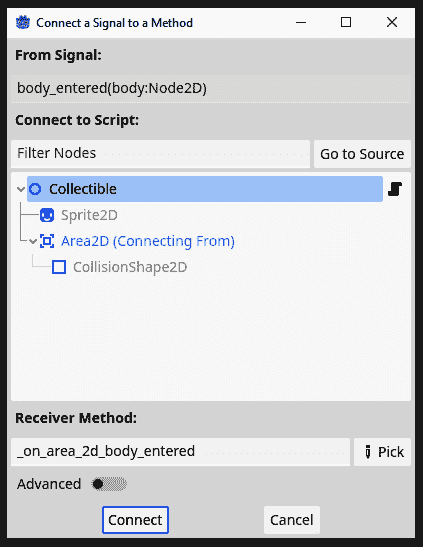

			Figure 9.24 – Selecting the node we want to connect the signal with, the Collectible node in our case

				1.  We will now directly be taken to the `collectible.gb` script and you can see that a new function, `_on_area_2d_body_entered`, got added for us:

			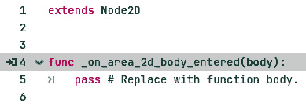

			Figure 9.25 – A new function will automatically be created for us after connecting the signal
			The connection of the signal is done; now, every time the `body_entered` signal is thrown by the `_on_area_2d_body_entered` function of that collectible will be executed.
			Also notice that the generated function has a parameter called `body`. This is the body object that overlapped the **Area2D**; for example, the player. Signals can give some context when they are being throw in the form of these parameters. Different signals have different parameters, and most have no parameters at all.
			Writing the code for collectibles
			Now we’ll finally write some real code to give the player some new health points when picking up the health potion, though it will not be that much, to be honest. Let’s write the code necessary to make our health potion functional:

				1.  First, go back to the `collectible.gd` script. We’ll make this script a named class by adding a line defining the class name at the top:

    ```

    类名 Collectible

    ```cpp

			Important note
			Creating a named class with `class_name` is not 100% necessary here, but it is good practice to name classes that you are going to inherit from.

				1.  Now in the `health_potion.tscn` scene, right-click on the root node, and select **Extend Script**.
				2.  Save the new script as `health_potion.gd` in the same folder as `health_potion.tscn`. This will create a script that inherits from the `Collectible` class and assigns it to the **HealthPotion** node for us.

			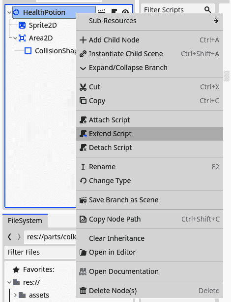

			Figure 9.26 – Right-clicking the HealthPotion node and selecting Extend Script

				1.  Next, override the `_on_area_2d_body_entered()` function by defining a new one, like so:

    ```

    func _on_area_2d_body_entered(body):

    body.health += 5

    queue_free()

    ```cpp

			This function is used in the `Collectible` class to connect to the `body_entered` signal. By overriding it here, we effectively replace the function that will be executed.
			You can see that we take the body that is provided as an argument and simply update its health value by adding `5`.
			The last line introduces a new function that we can call on nodes: `queue_free()`. This function will queue the node for deletion so that the engine knows it can be removed from the scene tree. The engine will delete the node at the end of the current frame.
			Let’s try this out! Go back to the main scene and add a health potion somewhere by dragging and dropping the scene anywhere in the arena:
			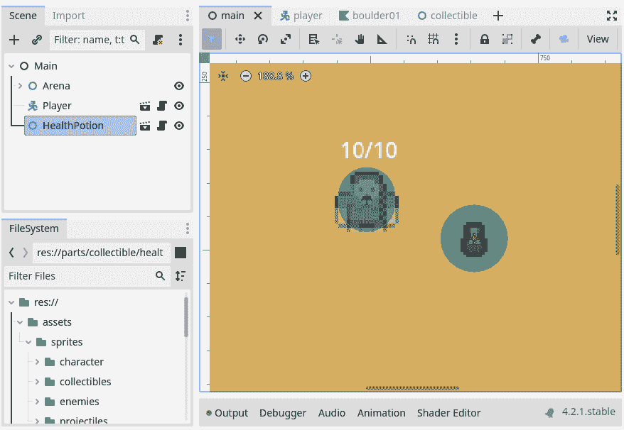

			Figure 9.27 – Adding a HealthPotion in the main scene
			If you put the health potion somewhere without boulders or walls, you will be able to walk over there with the player character and pick it up. But if you put the health potion too close to a boulder or wall, you’ll get an error! Oh no! Let’s learn how to solve this next.
			Using collision layers and masks
			There is one problem! The signal will now be thrown for every physics body that enters the **Area2D** of the collectible, so even for boulders and walls. But we only want to trigger the functionality when our player enters the area.
			Luckily, we can only trigger the overlap detection for certain bodies using collision layers and masks.
			Introducing collision layers and masks
			If you select the `collectible.tscn` scene, you’ll see the **Collision Layer** and **Collision Mask** properties in the inspector. These two dictate what other physics bodies and areas can interact with the area.

				*   **Collision Layers** dictates what layer the physics object is in and can be detected by other physics objects.
				*   **Collision Mask** dictates what layers this physics object is looking at for collision detection.

			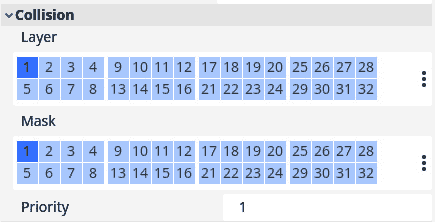

			Figure 9.28 – There are 32 separate collision layers and masks
			This means that the collision layers are used to tell other bodies and areas that you exist, while the collision mask is used to detect other bodies and areas. Note that these don’t need to be the same. The layers could be different from the mask, and that one body or area can be active in multiple layers and can look at multiple masks.
			Each collision layer has a number associated with it, but we can actually give them a name that is easier to read for humans. We’ll do that in the next section.
			Naming collision layers
			What we are going to do is use one layer, `layer number 1`, as the layer for wall collisions and another layer, `layer number 2`, for collectible detection. Because it is difficult and non-descriptive to talk about `layer number 1` and `layer number 2`, we can name layers within the Godot Editor. This will help us in the long run:

				1.  Open up the **Project Settings**.
				2.  Navigate to **Layer Names** | **2D Physics**:

			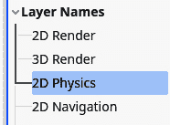

			Figure 9.29 – Naming collision layers under the 2D Physics category
			Here, you can see the different collision layers and their names. None of them have a name yet.

				1.  Give `Collision` and `Collectible`:

			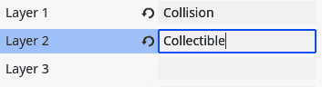

			Figure 9.30 – Naming two of the layers

				1.  If we now select the **Area2D** node from the collectible scene again and hover over the layer numbers, we’ll see the name pop up:

			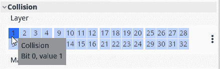

			Figure 9.31 – Hovering over a collision layer number shows us its name

				1.  We can also click on the ellipses next to the layers for easier layer selection to see our names there.

			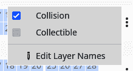

			Figure 9.32 – Pressing the ellipses makes it easy to select named collision layers
			With these collision layers having a name, it will be easier to assign them in the future. So let’s do that in the next section.
			Assigning the right layers
			Now that we understand collision layers and masks and know how to name them, let’s use them so that only the player can trigger collectibles.
			We’ll have to adjust the collision layers and masks of all physics bodies in the game. Luckily, we made separate scenes for all of them, so this will go fast and, in the future, we can take these layers into account while making the scenes.
			For the `player.tscn` root node, configure the layers and mask as follows:
			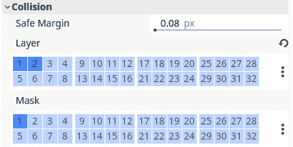

			Figure 9.33 – The collision layer and mask configuration for the player
			For the `boulder.tscn` and `wall.tscn`, we want the following configuration:
			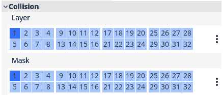

			Figure 9.34 – The collision layer and mask configuration for boulders and walls
			Lastly, for the `collectible.tscn` scene, set the configuration as follows:
			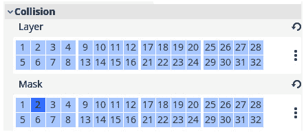

			Figure 9.35 – The collision layer and mask configuration for collectibles
			You can see that the player, boulders, and wall are in both the collision layer and collision mask. This is because they need to be able to interact with each other. On the other hand, the player is in the collectible layer and not the collectible mask, while the collectible scene does the opposite. We define the layer and mask for collectibles this way because the player doesn’t directly need to interact with collectibles and doesn’t need to detect them; the collectible scene does all the work for us.
			Your turn!
			Great, we created our health potion! Now you can implement the coin so the player can collect gold. Here are some of the steps you could take:

				1.  Make a new inherited scene from the `collectible.tscn` scene as we saw in the *Inheriting from a base* *scene* section.
				2.  Extend the collectible script, as we did in the *Writing the collectible* *code* section.
				3.  Track the amount of gold the player owns using a variable.
				4.  Show how many coins the player owns on the screen using a label.

			I’ll leave a possible implementation of all this in the repository of the project.
			We learned a lot in this section. We discovered what **Area2D** nodes are, and collision layers and masks are no longer a mystery but a useful tool for defining what bodies and areas we want to interact with. Let’s do some last exercises before summarizing and ending the chapter.
			Additional exercises – Sharpening the axe

				1.  Oh no! We added collisions to the boulders and inner walls of the arena, but not to the outer walls. Add a **StaticBody2D** that stops the player from escaping the arena.
				2.  Create a base scene for the boulders, inherit two boulders from that, and make their shapes different. Also, make sure you update the collision shape so that the player collides correctly with them.

			Summary
			We started this chapter learning all about the **Camera2D** node and making it smooth and usable for the player so that they don’t have to think about it while navigating around the playing field.
			After, we added colliders to the player and all solid objects within the game. We even used collision shapes to create little collectible items, such as a health potion.
			Along the way, we saw what signals are and how we can connect them to functions in a node’s script.
			In the next chapter, we’ll flesh out our game with enemies and menus so that we have a full game loop.
			Quiz time

				*   Why did we use a point in front of the player to position the camera?
				*   What does the last parameter of a `Vector2`’s `lerp` function represent? Here is an example:

    ```

    var position: Vector2 = Vector2(1, 1)

    var target_position: Vector2 = Vector2(3, 5)

    position.lerp(target_position, 0.5)

    ```cpp

    				*   Why did we use a **CharacterBody2D** for the player character and not a **RigidBody2D**?
				*   What are **Area2D** nodes used for?
				*   We have two objects: an **Area2D** node and a **CharacterBody2D** node. We want to be able to detect the **CharacterBody2D** with the **Area2D** node. How do we need to configure their collision layers and masks?
				*   The **Area2D** and **CharacterBody2D** nodes should be in the same collision layer.
				*   The **Area2D** node should be in the same collision mask as the **CharacterBody2D** node’s collision layer.
				*   The **Area2D** and the **CharacterBody2D** nodes should be in the same collision mask.
				*   Signals notify us of certain actions that happen in a node. To what signal did we connect to detect if a player entered the **Area2D** node of a collectible?

```
