# 10

# 创建菜单、制作敌人和使用自动加载

虽然设置所有当前系统很有趣，但游戏本身还是有点无聊。没有真正的对手，没有阻止玩家捡起他们想要的全部金币。让我们通过创建攻击玩家并试图阻止他们通往荣耀和名声之路的敌人来增加一些挑战吧！

此外，我们还将创建一个小菜单，从那里开始我们的游戏。我们将使用 Godot 的**用户界面**（**UI**）系统来完成这项工作，该系统使用**控制**节点。在本章中，我们将讨论以下主题：

+   创建菜单

+   制作敌人

+   射击弹体

+   在自动加载中得分

# 技术要求

对于每一章，你都可以在 GitHub 仓库的子文件夹中找到本章的最终代码：[`github.com/PacktPublishing/Learning-GDScript-by-Developing-a-Game-with-Godot-4/tree/main/chapter10`](https://github.com/PacktPublishing/Learning-GDScript-by-Developing-a-Game-with-Godot-4/tree/main/chapter10)。

# 创建菜单

开发游戏最激动人心的部分当然是制作游戏本身！让事物移动、战斗、跳跃、射击、交互等等。但还有另一个同样重要的部分：用户界面（UI）。UI 将一切联系在一起。它向玩家告知正在发生的事情，并让他们轻松地在菜单之间导航，而无需思考如何从一个界面切换到另一个界面。

良好的用户体验、UI 或人机交互设计很难！但一切始于学习如何首先制作 UI。所以，让我们看看我们如何创建菜单和界面。

## 控制节点

Godot 引擎附带了一个广泛的界面节点库。我们已经在*第六章*中使用了一个，那就是**标签**节点。这些节点被称为**控制节点**，并以绿色进行标记：

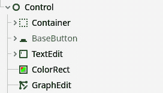

图 10.1 – 一些控制节点可以通过其绿色颜色识别

如果你打开**创建新节点**菜单，你会看到有很多这些**控制**节点。我们可以将这些节点分为三个不同的组。让我们来看看一些节点以及它们在每个组中能为我们做什么。

### 显示信息的节点

第一组节点显示信息。在这个组中，你会找到我们在*第六章*中使用的**标签**节点，还有**ColorRect**和**TextureRect**节点：

+   **Label**：显示一段简短的文本字符串。

+   **RichTextLabel**：显示一段较长的文本，可以以特定的方式格式化。

+   **ColorRect**：显示一个单色的矩形。

+   **TextureRect**：在一个矩形中显示纹理。这个节点与**Sprite2D**节点类似，它们都用于显示纹理，但在不同的上下文中使用。

在下面的图中，你可以看到这些节点在编辑器中的样子：

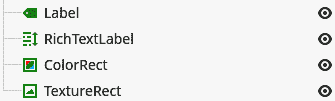

图 10.2 – 显示信息的控制节点示例

这些节点都向用户显示某些内容。

### 接收输入的节点

任何好的 UI 都可以接收输入，例如按钮。以下是一些 Godot 引擎 UI 节点提供的输入节点：

+   **按钮**：一个可以点击的简单按钮。

+   **复选框**：一个可以打开和关闭的复选框。

+   **复选框按钮**：与复选框相同，但外观不同。

+   **文本输入框**：一个简单的节点，可以接收单行文本输入并将其作为字符串提供。

+   **水平滑块**和**垂直滑块**：用于输入数字的滑块。**水平滑块**水平滑动，而**垂直滑块**垂直滑动。

在下面的图中，你可以看到这些节点在编辑器中的样子：

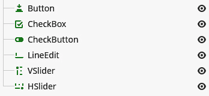

图 10.3 – 接收输入的控制节点示例

这些节点都以某种方式接收输入。

### 包含其他节点的节点

最后，还有一些你看不见但非常重要的节点，因为它们确保了所有其他 UI 元素都被正确放置。这些节点构成了一个骨架，其他**控制**节点可以在其中找到它们的位置。

**容器**节点帮助我们以我们想要的方式布局 UI。这种类型的节点可以很好地显示相邻的元素，在节点之间添加一些间距，等等。

这些容器还可以帮助我们保持界面在调整屏幕大小时仍然可用且美观。这种情况并不常见，但如今的游戏可以在许多不同的屏幕尺寸和宽高比下运行。只需想想电脑屏幕和手机屏幕之间的区别。

一些有趣的容器节点如下：

+   **VBox 容器**和**HBox 容器**：垂直或水平地很好地组织所有子节点

+   **居中容器**：居中其子节点

+   **网格容器**：以整洁的网格组织所有子节点

+   **边距容器**：在其子节点周围添加间距，以便它们有足够的空间呼吸

+   **面板**：提供一个背景，显示这部分 UI 逻辑上属于一起

在下面的图中，你可以看到这些节点在编辑器中的样子：


图 10.4 – 可以包含其他节点的控制节点示例

**容器**节点都以特定的方式包含和放置它们的子节点。

本节中的节点列表并不全面；在添加节点时快速查看**控制**节点类别，这很明显。但这些都是你可能会首先使用的重要节点。其他节点更为专业。

惊人的是，完整的 Godot 编辑器本身也是由这些 Control 节点构建的，这只是为了展示它们在构建 UI 时的灵活性和强大功能。

现在我们对不同的**控制**节点有了基本了解，我们可以开始使用它们制作菜单。

## 创建一个基本的启动菜单

让我们创建一个在启动游戏时显示的启动菜单。这个菜单应简单地显示游戏名称、一个开始播放的按钮、一个退出游戏的按钮，最后，我们还可以添加一些关于谁创建了游戏的信息：

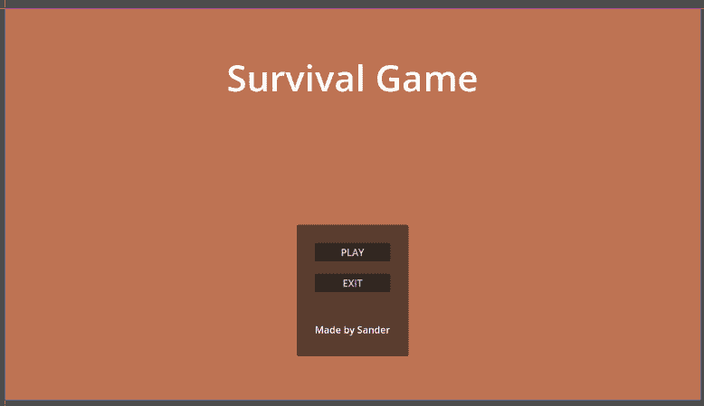

图 10.5 – 这就是我们的启动菜单将看起来

让我们回顾一下创建启动菜单的步骤，如图*图 10.5*所示：

1.  在新的`screens/ui`文件夹下创建一个名为`menu.tscn`的新场景。

1.  选择**用户界面**作为根节点类型：

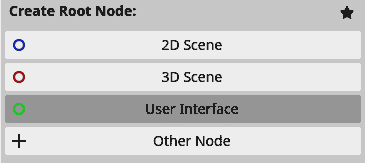

图 10.6 – 将用户界面作为菜单的根节点

1.  将根节点重命名为`Menu`。

1.  让我们从向菜单添加一个**ColorRect**节点开始；这将是我们背景颜色。

1.  现在，为了将**ColorRect**节点拉伸以覆盖整个屏幕，**控制**节点在顶部栏中有一个方便的小菜单。在场景树中选择**ColorRect**节点，并从**锚点****预设**列表中选择**全矩形**：

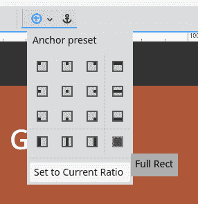

图 10.7 – 选择全矩形以使 ColorRect 节点覆盖整个屏幕

1.  现在，添加一个`MainUIContainer`。

1.  现在，添加一个`TitleLabel`。这个标签将显示我们游戏的标题：

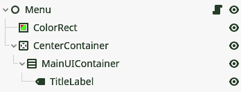

图 10.8 – 我们菜单到目前为止的场景树

1.  为游戏想一个合适的标题，并将其放入**TitleLabel**节点的文本字段中。

1.  现在，将`60` px 移动到：

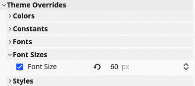

图 10.9 – 您可以在主题覆盖中更改标签的字体大小

这只是为了为我们的游戏 UI 创建一个标题标签。这可能看起来步骤很多，但我们使用的某些节点将使在接下来的几个步骤中扩展 UI 变得容易。

让我们添加一个带有按钮和信用行的面板：

1.  将一个**PanelContainer**节点添加到**MainUIContainer**节点中。

1.  现在，在这个面板容器中创建以下结构：

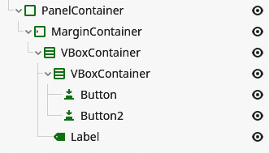

图 10.10 – 从 PanelContainer 节点查看的场景树结构

1.  将第一个按钮重命名为`PLAY`。

1.  将第二个按钮重命名为`EXIT`。

1.  将标签**CreditLabel**重命名，并将其文本更改为您希望显示的内容！

1.  现在，进入第一个`50` px。

1.  将`20` px 更改为。

1.  最后，将`200` px 设置。

干得好 – UI 布局已完成。完整的场景树应如下所示：

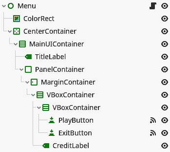

图 10.11 – 我们菜单的完整场景树

剩下的唯一事情就是让按钮变得可用！让我们快速完成它：

1.  将一个空脚本添加到根`menu.gd`。

1.  现在，将**PlayButton**节点的按下信号连接到这个节点。

    连接的函数体相当简单：

    ```cpp
    func _on_play_button_pressed():
       get_tree().change_scene_to_file("res://screens/game/main.tscn")
    ```

1.  此外，连接**ExitButton**节点的按下信号。

    这个函数体甚至更简单：

    ```cpp
    func _on_exit_button_pressed():
       get_tree().quit()
    ```

在前面的代码片段中，我们使用`get_tree()`函数到达场景树的根。这个函数返回`SceneTree`对象，它在游戏运行时管理整个节点层次结构。

在连接到`change_scene_to_file()`函数的该对象上的函数中，该函数将当前运行的场景切换到我们提供给函数的路径指定的场景。因此，要启动主游戏场景，我们只需给它从项目根目录开始的路径，到`main.tscn`场景。

重要提示

值得注意的是，从它被调用的那一刻起，`change_scene_to file()`也会加载它应该切换到的场景文件。这意味着游戏将在加载这段时间内阻塞或冻结。当我们切换到大型场景时，这并不是很好，幸运的是，在我们的案例中我们没有这样做。

在连接到`quit()`函数的函数中，该函数简单地关闭运行时。

你现在可以通过运行它来尝试菜单！

## 设置主场景

为了确保我们的菜单是启动游戏的主体场景，我们很快需要进入项目设置来声明这一点。在项目设置中，`menu.tscn`下是主场景：


图 10.12 – 在项目设置中设置主场景

这将确保当我们运行游戏时，使用`menu.tscn`场景是默认启动的场景。

重要提示

记住，如果没有设置主场景，并且我们通过上述方法运行游戏，Godot 会询问我们是否想使用当前打开的场景作为主场景。

我们学到了很多关于**控制**节点以及如何快速构建 UI 的知识。让我们去制作一些敌人。

# 制作敌人

在现实生活中，制造敌人从来不是一个好主意。但在视频游戏开发的情况下，这通常是一种挑战玩家并让他们面对一些反对派的极好方式。

我们将要创建的敌人相当简单直接。但我们在过程中仍然会学到很多——例如，如何让敌人向玩家导航以攻击他们。

正如我说的，我们将保持敌人简单。我们将制作一个在竞技场随机位置随机时间生成的敌人，并开始向玩家冲锋。从敌人接触到玩家的那一刻起，我们将从玩家的生命值中扣除一个健康点，并将敌人从游戏中移除。这样，玩家有一些对手，但不应被一群敌人所淹没。

在下一节“射击弹丸”中，我们将开发一种让玩家进行防御的方法。但到目前为止，我们将只关注敌人和它的行为。

## 构建基础场景

就像我们的游戏中的任何新部分一样，让我们首先在场景树中为敌人创建基础结构，然后在后面的章节中添加代码和其他有趣的东西：

1.  创建一个`parts/enemy`文件夹，并在其中创建一个名为`enemy.tscn`的新场景。

1.  重新创建以下场景树。注意，根节点是一个**CharacterBody**节点：

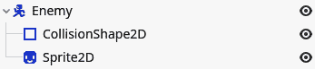

图 10.13 – 我们敌人场景的场景树

1.  从`assets/sprites/enemies`文件夹中选择一个精灵作为**Sprite2D**节点的纹理：

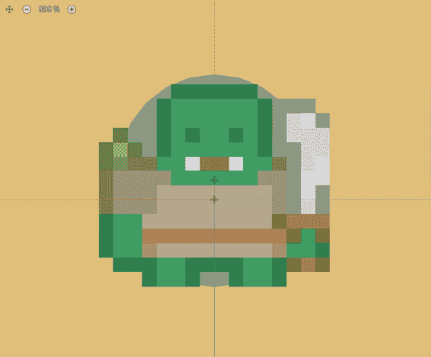

图 10.14 – 2D 编辑器中的敌人场景

1.  确保您已将精灵节点的比例设置为`(``3, 3)`.

目前，`Enemy`场景非常简单。让我们看看我们如何进行导航来稍微复杂化它。

## 导航敌人

我们可以轻松地让敌人直接向玩家移动。问题是它们会卡在墙壁后面，撞到巨石，这感觉很不自然，也让它们看起来相当愚蠢。

幸运的是，Godot 引擎自带一个**NavigationServer**属性，它可以计算绕过所有这些障碍物的路径，使敌人移动更加自然流畅。

为了实现这一点，我们将查看两个新的节点：`NavigationRegion2D`和`NavigationAgent2D`。

### 创建一个 NavigationRegion2D 节点

首先，我们需要定义敌人可以在关卡中的哪个区域移动，然后我们希望从这个区域中移除墙壁或巨石所在的位置。这正是`NavigationRegion2D`节点所做的事情！让我们定义一个：

1.  前往`main.tscn`游戏场景。

1.  在名为`Main`的根节点中添加一个`NavigationRegion2D`节点。

1.  点击空的**Navigation Polygon**属性并选择**New NavigationPolygon**：

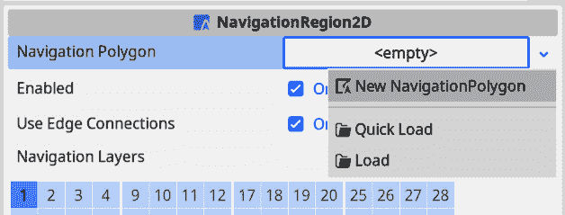

图 10.15 – 点击新建导航多边形

1.  现在，我们将首先定义敌人可以移动的外部边界。在编辑器中点击绘制多边形形状。尽量紧密地追踪竞技场的边缘。别忘了通过点击放置的第一个点来闭合形状：

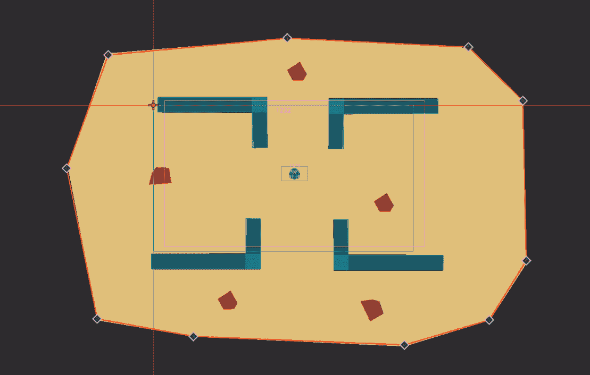

图 10.16 – 创建 NavigationRegion2D 节点的边界

1.  在窗口顶部点击**烘焙 NavigationPolygon**以创建导航多边形：

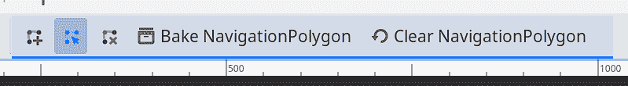

图 10.17 – 点击 Bake NavigationPolygon

按照这些步骤操作后，`NavigationRegion2D`节点应该看起来像这样：

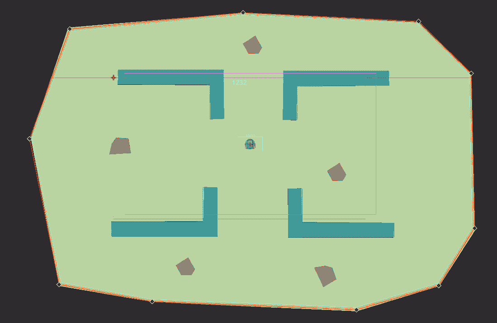

图 10.18 – 首次烘焙多边形后的 NavigationRegion2D 节点

蓝绿色区域是敌人能够导航和移动的区域。但你已经可以看到一个问题——这个区域也跨越了我们的墙壁和巨石。我们不希望敌人认为他们可以穿过它们，因为，嗯，他们不能；它们是静态物理体。幸运的是，Godot 具有自动检测这些并以考虑它们的方式烘焙`NavigationPolygon`属性的功能。

通过单击`NavigationRegion2D`节点来展开它，并按以下方式配置：

1.  将**几何** | **解析几何类型**设置为**静态碰撞体**。我们这样做是为了在自动生成时只考虑静态碰撞体。

1.  将**几何** | **源几何模式**设置为**与子节点组合**。这样，自动生成将扫描节点的子节点以查找静态碰撞体。

1.  设置`40` px。通过这种方式，我们定义了在`NavigationRegion2D`节点中要使用的代理的半径，并且自动生成可以考虑到这一点，以便代理不会撞到它们应该能够避免的障碍物：

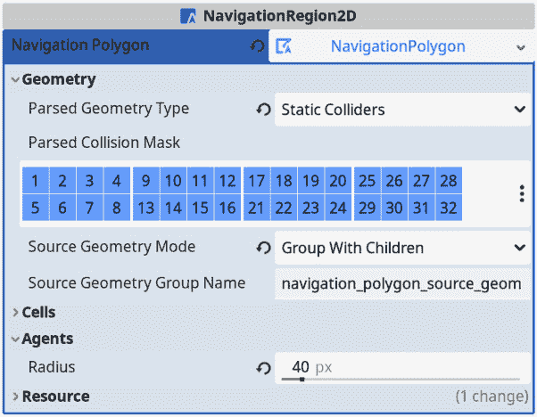

图 10.19 – 配置 NavigationPolygon 属性

1.  选择`Arena`节点并切换到**节点**标签页，它位于**检查器**标签页旁边：

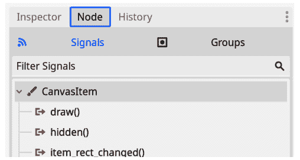

图 10.20 – 转到节点标签页

1.  切换到**组**标签页，它位于**信号**标签页旁边：

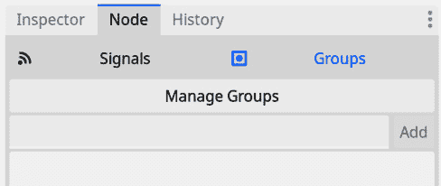

图 10.21 – 切换到组标签页

1.  将`navigation_polygon_source_geometry_group`粘贴到文本框中并按**添加**：

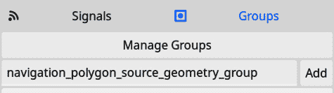

图 10.22 – 添加 navigation_polygon_source_geometry_group 组

1.  现在，再次选择`NavigationRegion2D`节点并再次按**烘焙** **NavigationPolygon**。

当你完成时，导航区域应该看起来像这样：


图 10.23 – 生成的 NavigationRegion2D 节点

现在的蓝绿色区域很好地避开了墙壁和巨石。你还可以看到障碍物和区域开始处之间有一些空白。这是我们定义代理的**半径**属性时设置的。这个空白确保路径查找不会太靠近障碍物，使敌人避免与之碰撞。

在**步骤 2**到**步骤 4**中，我们将`Arena`节点添加到`navigation_polygon_source_geometry_group`节点组中，并考虑其中的静态物体。让我们稍微偏离一下，来谈谈节点组。

### 什么是节点组？

在 Godot 引擎中，**组**或**节点组**就像其他软件中的标签。您可以为节点添加任意数量的组。我们可以通过**组**选项卡简单地做到这一点，就像我们在上一节步骤中所做的那样。

组非常有用，因为例如，您可以执行以下操作：

+   检查一个节点是否属于一个组。

+   从树中获取组内的所有节点。

+   在组内调用所有节点的函数。

我们稍后会再次使用组。

`NavigationRegion2D`节点已经准备好了，所以现在，让我们看看将`NavigationAgent2D`节点添加到`Enemy`场景的过程。

### 将 NavigationAgent2D 节点添加到敌人场景

在开始编写代码之前，我们需要在编辑器中添加一个`NavigationAgent2D`节点到`enemy.tscn`场景中。这个节点处理`NavigationRegion2D`节点内的路径查找和导航，这是我们上一节中创建的。

只需在根`Enemy`节点中添加一个`NavigationAgent2D`节点。我们不需要进行任何其他设置：

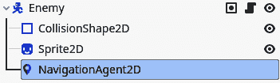

图 10.24 – 将 NavigationAgent2D 节点添加到敌人场景

现在，我们可以开始编写我们的敌人代码了！

## 编写敌人脚本

我们敌人的代码将非常类似于我们玩家的代码。他们都是根据加速速度的物理特性移动。唯一的区别是，对于敌人，它想要移动的位置由`NavigationServer`属性定义。这个服务器查看`NavigationRegion2D`节点和`NavigationAgent2D`节点的当前位置，以计算到达地图上我们选择去的目的地的最佳路线。

让我们从编写一些样板代码开始，这些代码定义了我们敌人的一些移动：

```cpp
class_name Enemy extends CharacterBody2D
@onready var _navigation_agent_2d: NavigationAgent2D = $NavigationAgent2D
@export var max_speed: float = 400.0
@export var acceleration: float = 1500.0
@export var deceleration: float = 1500.0
var player: Player
func _physics_process(delta: float):
   _navigation_agent_2d.target_position = player.global_position
   if _navigation_agent_2d.is_navigation_finished():
      velocity = velocity.move_toward(Vector2.ZERO, deceleration * delta)
   else:
      var next_position: Vector2 = _navigation_agent_2d.get_next_path_position()
      var direction_to_next_position: Vector2 = global_position.direction_to(next_position)
      velocity = velocity.move_toward(direction_to_next_position * max_speed, acceleration * delta)
   move_and_slide()
```

通常，这段代码与我们为`player.gd`脚本编写的移动代码非常相似。唯一的区别是，我们现在使用`NavigationAgent2D`节点来说明我们需要去哪里：

```cpp
_navigation_agent_2d.target_position = target.global_position
```

如您所见，我们正朝着`player`变量的全局位置前进。我们将在稍后定义这个`player`变量。

位置和 global_position

另一方面，`global_position`变量的`position`属性是节点在世界空间中的位置，相对于场景树根。当节点在 2D 空间中移动时，两者都会自动更新；这基本上是相同的数据，但参考点不同。

我们需要在这里使用`global_position`变量，因为`NavigationAgent2D`节点的目标位置必须是一个全局位置。

然后，我们需要检查是否需要移动：

```cpp
if _navigation_agent_2d.is_navigation_finished():
```

如果我们需要移动，我们会询问`NavigationAgent2D`节点下一个我们应该移动到的位置：

```cpp
var next_position: Vector2 = _navigation_agent_2d.get_next_path_position()
```

然后，我们只需要计算从当前位置到下一个位置的方向，其余的代码与 *第七章* 中的 `Player` 场景的代码完全相同。

为了选择 `Player` 节点，我们将使用节点组，通过添加这个 `_ready()` 函数来实现：

```cpp
func _ready():
   var player_nodes: Array = get_tree().get_nodes_in_group("player")
   if not player_nodes.is_empty():
      target = player_nodes[0]
```

要从场景树中获取玩家，我们做了一些新的操作。我们要求当前场景树返回所有在 `player` 组中的节点。此函数将返回一个包含属于此组的节点的数组。所以，如果有的话，我们将取第一个元素。

重要提示

当场景中只有一个玩家节点时，要求所有玩家节点可能看起来有些奇怪。我们这样做是为了在下一章处理多个玩家时，可以使用大致相同的代码来针对更多玩家。

这些节点组是 Godot 引擎的一个有用特性，因为引擎会跟踪组内所有节点，这样我们就可以轻松查询它们或检查一个节点是否属于某个组。

现在，这段代码还不能工作，因为，嗯，玩家实际上还没有被添加到 `player` 组中！为了将它们添加到这个组中，我们需要稍微修改一下 `Player` 场景：

1.  进入 `player.tscn` 场景。

1.  选择根节点。

1.  在包含节点信号的窗口中，有一个名为 **Groups** 的按钮。按下它，你会看到 **Groups** 窗口：

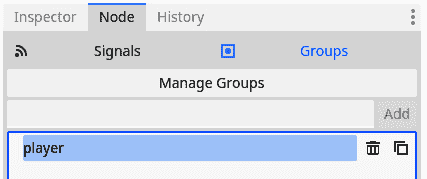

图 10.25 – 将玩家的根节点添加到名为 player 的节点组中

1.  在这里，在行输入中输入 `player` 并按下 **Add**。

在主场景中放置一个敌人，你会看到它开始向玩家移动！这很棒。但是敌人应该能够伤害玩家，所以让我们接下来处理这个问题。

## 在碰撞中伤害玩家

为了检测敌人是否足够接近玩家以造成伤害，我们将使用一个 **Area2D** 节点，就像我们在 *第九章* 中为可收集物品所做的那样：

1.  让我们从向 `player.gd` 脚本中添加一个 `get_hit()` 函数开始。当玩家被敌人击中时，此函数将被调用，并降低玩家的生命值：

    ```cpp
    func hit():
       health -= 1
    ```

1.  添加一个名为 `enemy.tscn` 的场景，并将其命名为 `PlayerDetectionArea`。

1.  在这个区域下添加一个 **CollisionShape2D** 节点：

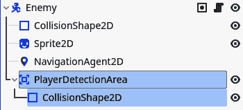

图 10.26 – 将 Area2D 节点添加到敌人场景中

1.  将这个碰撞形状设置为比敌人精灵稍大的 **CircleShape2D** 节点：

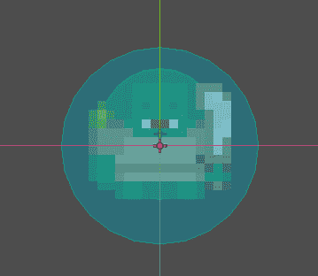

图 10.27 – 使用 CollisionShape2D 节点覆盖整个敌人及其周围一些空间

1.  将 `body_entered` 信号连接到敌人的根节点。

1.  现在，使用下一个代码片段作为敌人脚本中连接函数的主体：

    ```cpp
    func _on_player_detection_area_body_entered(body: Node2D):
       if not body.is_in_group("player"):
          return
       body.get_hit()
       queue_free()
    ```

这个函数的代码很简单。首先，我们检查进入该区域的身体是否确实是玩家。我们可以简单地通过以下检查来完成：

```cpp
body.is_in_group("player")
```

这样，我们就可以检查某个节点是否属于某个组。如果这个身体不在`player`组中，我们就从函数中返回。

但如果身体是一个玩家节点，那么我们就从它的健康值中减去一点，并释放与之接触的敌人。

太好了 – 我们现在可以让敌人在我们足够接近时伤害玩家。只有一个问题：敌人的数量只有我们能够拖放到场景中的数量。敌人应该能够自动且持续地生成！否则，游戏会很快结束。让我们创建一个自动生成器，它可以生成敌人，还可以生成健康药水。

## 生成敌人和可收集物品

在我们的游戏场中自动生成敌人或可收集物品实际上比乍一看要难。我们可以随机选择一个位置并在那里生成一些东西。然而，这样做可能会在墙壁或巨石内生成敌人或可收集物品。更糟糕的是，敌人或可收集物品可能会在竞技场和导航区域数英里之外生成，使它们变得无用。

我们可以用许多聪明和抽象的方法解决这个问题，但通常，最简单的方法是最好的起点。这就是为什么我们将构建自己的实体生成器，它可以生成不同类型的实体，敌人、可收集物品或任何其他东西。

### 创建场景结构

解决敌人生成位置问题的更简单的方法是在竞技场内定义某些点，在这些点上我们可以确保敌人可以安全生成。所以，这就是我们在以下步骤中要做的：

1.  创建一个新的场景，它从`EntitySpawner`派生。

1.  将此场景保存为`entity_spawner.tscn`，位于`parts/entity_spawner`下。

1.  在`EntitySpawner`下添加另一个`Positions`。在这里，我们稍后会定义所有可以生成东西的位置：

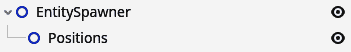

图 10.28 – 我们 EntitySpawner 场景的结构

1.  将`EntitySpawner`的一个实例拖放到`main.tscn`场景中，并将其重命名为`EnemySpawner`。

1.  现在，右键单击`EnemySpawner`并选择**可编辑子项**：

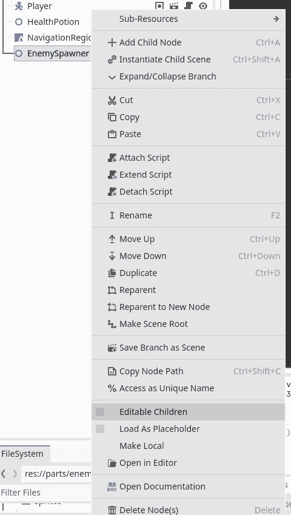

图 10.29 – 启用可编辑子项以直接编辑实例化场景的子项

你将看到`EnemySpawner`场景：

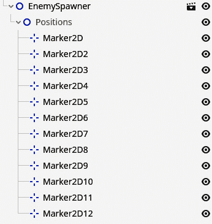

图 10.30 – 添加用于定位敌人的 Marker2D 节点

1.  现在，在**位置**节点下，添加多个**Marker2D**节点，并将它们放置在你想要敌人能够生成的地方：

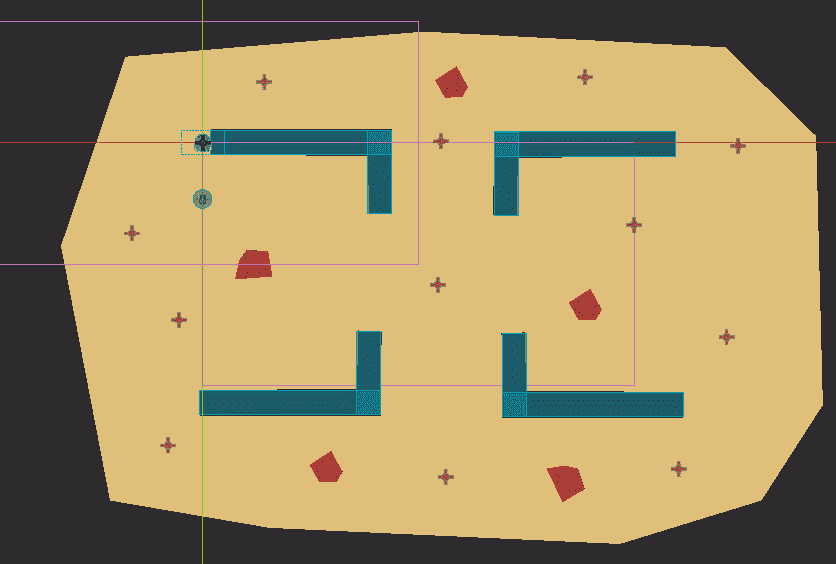

图 10.31 – 我想要敌人生成的不同位置

到目前为止，`EnemySpawner` 节点的设置相当简单，但我们确实使用了一些新事物。首先，我们在一个完整的场景节点上启用了 **可编辑子节点**。这使我们能够访问整个场景的结构，并使我们能够轻松地编辑其中的单个节点。这对于直接重用场景非常有用。

注意，`EnemySpawner` 节点下的节点被灰色显示。这意味着我们可以编辑它们，移动它们，等等，就像我们从收集场景继承来制作生命药水时一样，但我们不能删除这些灰色节点。

在编辑子节点旁边，我们使用了一种新的节点类型：**Marker2D**。这是一个在游戏过程中实际上并不做任何特殊操作的节点，但在编辑器中，它将显示一个小十字来标记其位置。当你需要标记一个位置，就像我们在这里做的那样时，会使用这个节点。

### 编写基础代码

对于代码，我们将做一些相当简单的事情，提供一个 `spawn_entity()` 函数，该函数在定义的位置之一生成一个新实体，无论是敌人还是生命药水：

```cpp
extends Node2D
@export var entity_scene: PackedScene
@onready var _positions: Node2D = $Positions
func spawn_entity():
   var random_position: Marker2D = _positions.get_children().pick_random()
   var new_entity: Node2D = entity_scene.instantiate()
   new_entity.position = random_position.position
   add_child(new_entity)
```

我们遇到的第一件新事物是 `PackedScene` 类型的导出变量。这个 `PackedScene` 变量基本上是任何场景的定义——一个场景文件。任何场景文件都可以填充这个变量。

`PackedScene` 变量和 `Node` 变量的区别

`PackedScene` 变量代表一个场景文件，例如 `enemy.tscn` 文件。它是一个模板，我们可以用它来创建新的节点。

与此相反，`Node` 变量是场景树的构建块，可以是 `PackedScene` 变量的实例。

你可以将 `PackedScene` 变量视为一个类，而 `Node` 变量是这个类的实例化对象。

然后，稍后，我们可以使用这个打包的场景来实例化一个新的实体：

```cpp
var new_entity: Node2D = entity_scene.instantiate()
```

为了使这个新实例化的实体成为场景树的一部分，我们需要将其添加到树中的现有节点上，因为如果我们不在场景树中添加它，它就不会在游戏中或其执行中使用。

我们可以通过在树中的任何节点上调用 `add_child()` 函数并将这个新实体节点作为参数来将一个新节点作为另一个节点的子节点添加。实体随后将被添加为该节点的子节点。在这里，我们将实体节点添加到 `EntitySpawner`：

```cpp
add_child(new_entity)
```

现在，实体真正地被放入了树中，因此也位于游戏中。

为了选择一个随机位置，我们也做了一些新的操作。首先，我们从 `get_children()` 获取一个子节点数组，这是一个位置标记的数组。然后，为了从这个数组中随机选择一个元素，我们可以使用 `pick_random()` 函数轻松地选择一个随机位置标记：

```cpp
var random_position: Marker2D = _positions.get_children().pick_random()
```

这将为我们提供一个随机的 **Marker2D** 节点，我们可以用它来生成敌人。

要使位于 `main.tscn` 场景中的 `EnemySpawner` 节点生成敌人，我们只需将 `enemy.tscn` 场景拖放到 `EnemySpawner` 节点上即可：


图 10.32 – 将 enemy.tscn 文件拖放到实体场景属性中

使用这个设置，我们可以以固定的时间间隔开始生成实体。

### 自动生成实体

现在我们有一个可以生成实体的函数，我们仍然需要在某个时刻触发它。为此，我们将利用定时器耗尽时的`timeout`信号。

让我们添加一个`EntitySpawner`场景：

1.  添加一个名为`entity_spawner.tscn`的场景文件，并将其命名为`SpawnTimer`。

1.  现在，将超时信号连接到`EntitySpawner`根节点。

1.  在连接函数中，只需调用`spawn_entity()`函数：

    ```cpp
    func _on_spawn_timer_timeout():
       spawn_entity()
    ```

1.  在脚本顶部添加对`SpawnTimer`节点和一个表示我们将要生成实体的间隔的`export`变量的引用：

    ```cpp
    @onready var _spawn_timer: Timer = $SpawnTimer
    @export var spawn_interval: float = 1.5
    ```

1.  现在，我们可以添加两个额外的函数来帮助我们开始和停止定时器：

    ```cpp
    func start_timer():
       _spawn_timer.start(spawn_interval)
    func stop_timer():
       _spawn_timer.stop()
    ```

1.  最后，为了在游戏开始时自动启动定时器，将此`_ready()`函数添加到`EntitySpawner`脚本中：

    ```cpp
    func _ready():
       start_timer()
    ```

重要提示

记住——当我们谈论一个场景时，我们是在谈论一个整个场景文件，例如`entity_spawner.tscn`文件。当我们谈论一个节点时，我们是在谈论场景文件中的特定节点，例如`EntitySpawner`节点。

开始和停止函数将有助于我们在玩家死亡时停止生成敌人，例如。在主体中，它们只是直接开始和停止`_spawn_timer`。你可以看到，当启动定时器时，我们可以给出一个以秒为单位的时间，这将作为定时器耗尽前的时间量。

现在运行游戏，我们每 1.5 秒就会得到一个新的敌人。太棒了！现在我们有一连串的敌人进入，让我们生成一些药水，以便玩家可以治疗自己。

### 生成生命药水

要生成生命药水收集品，我们可以轻松地使用我们刚刚构建的相同的`EntitySpawner`节点！下面是如何做的：

1.  在`main.tscn`场景中添加一个新的`EntitySpawner`节点，并将其命名为`HealthPotionSpawner`。

1.  使这个生成器的子节点可编辑，并在你想要生成生命药水的**Positions**节点上添加**Marker2D**节点：

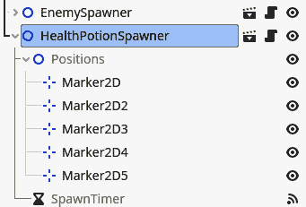

图 10.33 – 在我想生成生命药水的地方添加 Marker2D 节点

1.  将`health_potion.tscn`场景拖放到生成器的`Entity Scene`属性中。

1.  将生成器的**Spawn Interval**值设置为更大的数字，例如 20，这样我们就不会生成太多的生命药水：

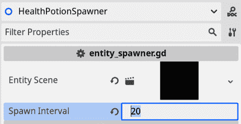

图 10.34 – 将 Spawn Interval 值设置为 20 秒

就这样！如果我们创建一个场景，`EntitySpawner`，它很容易被重复使用，生成新事物就变得简单了，不是吗？

## 制作一个游戏结束屏幕

现在敌人可以伤害玩家，玩家的生命值下降，我们需要考虑玩家生命值达到 0 的情况。这意味着游戏的结束。我们将添加一个“游戏结束”屏幕，玩家在死亡后可以选择重试或返回主菜单。

### 创建基本场景

和往常一样，我们将从创建场景结构开始：

1.  创建一个新的场景，其中包含`GameOverMenu`，并将场景保存为`parts/game_over_scene`中的`game_over_menu.tscn`。

1.  重新创建以下场景结构：

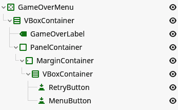

图 10.35 – 游戏结束菜单的场景树

1.  将每个元素填充为正确的文本，放大`GameOverLabel`节点，并为包含两个按钮的`VBoxContainer`节点添加一些间隔。使 UI 看起来像这样：

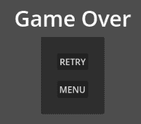

图 10.36 – 游戏结束菜单的外观

1.  现在，选择`GameOverMenu`根节点并将其**锚点预设**类型设置为**全矩形**：

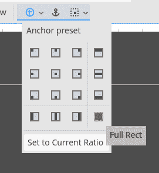

图 10.37 – 从锚点预设列表中选择全矩形

现在我们有一个小菜单，让我们将其添加到`main.tscn`场景中：

1.  在`main.tscn`场景中，添加一个`CanvasLayer`节点。

1.  在此`CanvasLayer`节点下，添加我们刚刚创建的`GameOverMenu`节点：

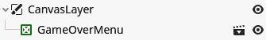

图 10.38 – 已添加到场景树中的 GameOverMenu 节点

1.  现在，通过点击节点名称旁边的眼睛符号隐藏`GameOverMenu`节点。我们只想在玩家死亡时显示此菜单：

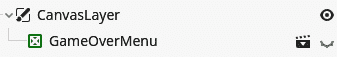

图 10.39 – 通过点击节点名称旁边的眼睛符号隐藏 GameOverMenu 节点

我们使用`CanvasLayer`节点来显示我们的菜单，因为这个节点确保其所有子节点都显示在其他所有内容之上。`CanvasLayer`节点不遵循由节点在场景树中的顺序确定的显示顺序。在`CanvasLayer`节点内部，其子节点再次遵循此顺序。这使得`CanvasLayer`节点非常适合游戏内的 UI。

基本场景结构已经完成；现在，我们应该向菜单添加一些逻辑。

### 添加游戏结束菜单的逻辑

`GameOverMenu`节点的脚本非常简单。我们只想在按钮被按下时添加功能。当**播放**按钮被按下时，我们重新加载主游戏场景，当菜单按钮被按下时，我们返回主菜单。

因此，连接两个按钮，并在它们连接的函数中加载正确的场景：

```cpp
extends CenterContainer
func _on_retry_button_pressed() -> void:
   get_tree().reload_current_scene()
func _on_menu_button_pressed() -> void:
   get_tree().change_scene_to_file("res://screens/ui/menu.tscn")
```

重要提示

注意，我们在树上使用了一个新函数`reload_current_scene()`。这个函数与`change_scene_to_file()`非常相似，但它只会切换到我们当前所在的场景，我们不需要加载场景文件，因为它显然已经加载了。

**游戏结束**菜单已经准备好了；现在，我们只需要在游戏中使用它。

### 当玩家死亡时显示游戏结束菜单

我们已经看到了如何连接到节点抛出的信号。但我们可以创建并抛出自己的信号！我们将利用这一点来检测玩家何时死亡：

1.  在`player.gd`脚本中，在包含`extends`关键字的行下面添加我们新的信号：

    ```cpp
    class_name Player extends CharacterBody2D
    health setter when health equals 0:

    ```

    set(new_value):

    var new_health: int = clamp(new_value, 0, MAX_HEALTH)

    if health > 0 and new_health == 0:

    died.emit()

    set_physics_process(false)

    health = new_health

    update_health_label()

    ```cpp

    ```

你可以看到，要定义一个新的信号，我们只需要使用`signal`关键字，后跟信号名称。

然后，稍后，我们只需通过在它上面调用`emit()`函数来发出这个信号。从某种意义上说，信号也是一个变量。

要检查玩家是否死亡，我们检查当前的`health`值是否大于 0，以及`new_health`值是否为 0。这样，我们就可以确保我们只在玩家从活着的状态变为死亡状态时触发一次`died`信号。我们不希望这个信号被多次抛出，因为这会向游戏发出信号，表明玩家死亡了不止一次，并产生不希望出现的副作用。

然后，我们还使用`set_physics_process()`函数，并给它`false`作为唯一参数。这告诉节点是否应该停止执行`_physics_process()`函数，并将有效地阻止玩家移动，因为所有我们的移动代码都生活在这里。

现在当`Player`节点在死亡时抛出信号，我们可以通过`main.tscn`场景来连接到这个信号：

1.  在`main.tscn`场景中，选择`Player`节点。你会看到出现了一个新的信号——我们在`player.gd`脚本中定义的`died`信号：

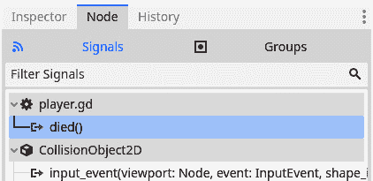

图 10.40 – 我们在玩家脚本中定义的信号也出现在信号菜单中

1.  在`main.tscn`场景的`Main`节点中添加一个空的脚本，并将`died`信号连接到它。

1.  在连接函数中，我们应该显示`GameOverMenu`节点并停止`EnemySpawner`节点和`HealthPotionSpawner`：

    ```cpp
    extends Node2D
    @onready var _game_over_menu: CenterContainer = $CanvasLayer/GameOverMenu
    @onready var _enemy_spawner: Node2D = $EnemySpawner
    @onready var _health_potion_spawner: Node2D = $HealthPotionSpawner
    func _on_player_died() -> void:
       _game_over_menu.show()
       _enemy_spawner.stop()
       _health_potion_spawner.stop()
    ```

这个脚本相当简单，因为它只需要处理菜单并停止一些生成器。

在本节中，我们覆盖了大量的内容。我们学习了如何使用`NavigationRegion2D`和`NavigationAgent2D`节点使敌人向玩家角色导航。我们使用`PackedScene`变量在代码中实例化场景。我们使用`CanvasLayer`节点在游戏上方显示**游戏结束**菜单。我们创建了一个自定义信号并连接到它。我们玩得很开心，现在是玩家学习如何自卫的时候了！

# 射击投射物

我们向玩家发送了足够的敌人，但他们无法自卫。让我们在本节中改变这一点！我们将创建玩家角色自动向敌人射击以将其消灭的投射物。为了保持简单，我们将使投射物专注于我们试图击中的目标；这样，它永远不会错过。

## 创建基本场景

在我们可以射击投射物之前，我们必须构建我们将从中工作的基本场景。让我们现在按照以下步骤进行：

1.  创建一个新的场景，其中包含一个`Projectile`。

1.  创建如图所示的场景结构：

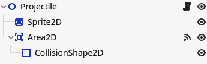

图 10.41 – 投射物场景的场景树

1.  使用`assets/sprites/projectils/`中的一个纹理作为精灵的纹理。请记住将精灵的缩放设置为`(``3, 3)`：

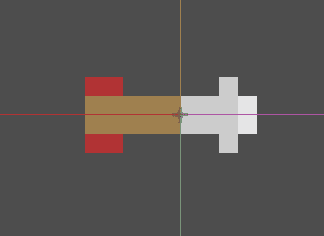

图 10.42 – 投射物

1.  现在，使用`CapsuleShape2D`节点作为`CollisionShape2D`节点的形状，并确保它覆盖了精灵：

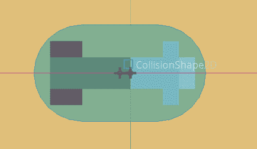

图 10.43 – 使用 CollisionShape2D 节点覆盖投射物的精灵

1.  我们将使用`EnemyDetectionArea`。

1.  为了检测`Enemy`节点进入`EnemyDetectionArea`区域节点，将第三个**2D 物理**层命名为**投射物**。

1.  将`EnemyDetectionArea`区域节点的**碰撞掩码**属性设置为检测**投射物**层：

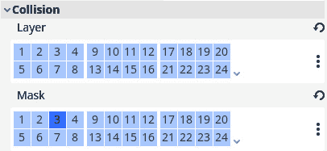

图 10.44 – EnemyDetectionArea 区域节点的碰撞层配置

1.  在`enemy.tscn`场景中，将`Enemy`节点的**碰撞层**属性设置为与**投射物**层相同：

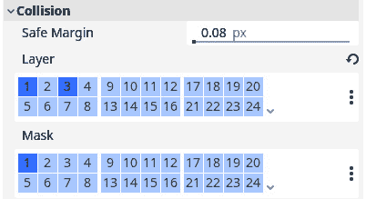

图 10.45 – 敌人的碰撞层配置

在场景结构方面，我们只需要这些，所以让我们开始编写投射物的行为。

## 编写投射物的逻辑

接下来是引导投射物向目标移动、在碰撞时销毁它并通知敌人它已被击中的代码。我们将使投射物始终直奔其目标；这使得我们在代码上更容易实现：

1.  将名为`projectile.gd`的脚本附加到`Projectile`根节点，并填充以下代码以移动它：

    ```cpp
    class_name Projectile
    extends Node2D
    @export var speed: float = 600.0
    var target: Node2D
    func _physics_process(delta: float):
       global_position = global_position.move_toward(target.global_position, speed * delta)
       look_at(target.global_position)
    ```

    我们已经看到了大部分代码，除了`look_at()`函数。这个函数将一个节点旋转到我们提供的空间点，使其朝向该点。所以在这里，它将弹丸节点旋转到目标位置。

1.  现在，将`EnemyDetectionArea`节点的`body_entered`信号连接到弹丸的脚本。在连接的函数中，我们只需要通知敌人它被击中，并销毁弹丸本身：

    ```cpp
    func _on_enemy_detection_area_body_entered(body: Node2D):
       body.get_hit()
       queue_free()
    ```

1.  最后，在`enemy.gd`脚本中，添加我们希望在弹丸击中敌人时使用的`get_hit()`函数：

    ```cpp
    func get_hit():
       queue_free()
    ```

在弹丸本身这一侧，我们需要的代码就这些。

## 生成弹丸

我们希望弹丸能够每隔一段时间自动发射。为了实现这一点，我们需要在`Player`和`Enemy`场景中做一些修改：

1.  在`Player`场景中添加一个`Timer`节点，并将其命名为`ShootTimer`。

1.  将这个`ShootTimer`节点的时间设置为`0.5`并启用**自动启动**：

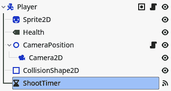

图 10.46 – 将名为 ShootTimer 的 Timer 节点添加到 Player 场景

1.  接下来，在玩家脚本中，在顶部预加载弹丸场景：

    ```cpp
    @export var projectile_scene: PackedScene = preload("res://parts/projectile/projectile.tscn")
    ```

1.  当选择`Player`节点时，将`projectile.tscn`文件拖放到**Inspector**选项卡中的**Projectile Scene**属性。

就像`EntitySpawner`节点一样，我们导出一个`PackedScene`类型的变量，我们可以从编辑器中填充它，并在需要时实例化它。这次，我们直接用`projectile.tscn`场景填充它。`preload()`函数加载这个场景并将其放入`projectile_scene`变量中，以便使用。但这个变量也是导出的，这意味着如果有一天我们想让玩家发射不同类型的弹丸，我们可以在玩家的**Inspector**选项卡中拖放这个场景。

我们现在将添加实际生成弹丸的逻辑：

1.  在`enemy.tscn`场景中，将根节点添加到`enemy`组中，就像我们对玩家所做的那样。这将确保我们以后可以访问所有敌人节点：

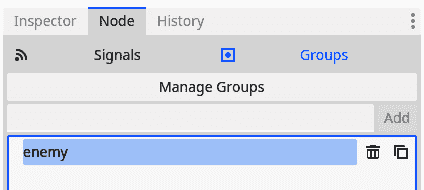

图 10.47 – 将敌人节点添加到敌人组

1.  在`player.gd`脚本顶部添加一个新的`export`变量。这个变量将代表玩家可以射击多远的像素：

    ```cpp
    @export var shoot_distance: float = 400.0
    ```

1.  现在，将`ShootTimer`节点的超时信号连接到`Player`节点的脚本。

    这应该是连接信号的代码体：

    ```cpp
    func _on_shoot_timer_timeout():
       var closest_enemy: Enemy
       var smallest_distance: float = INF
       var all_enemies: Array = get_tree().get_nodes_in_group("enemy")
       for enemy in all_enemies:
          var distance_to_enemy: float = global_position.distance_to(enemy.global_position)
          if distance_to_enemy < smallest_distance:
             closest_enemy = enemy
             smallest_distance = distance_to_enemy
       if not closest_enemy:
          return
       if smallest_distance > shoot_distance:
          return
       var new_projectile: Projectile = ProjectileScene.instantiate()
       new_projectile.target = closest_enemy
       get_parent().add_child(new_projectile)
       new_projectile.global_position = global_position
    ```

1.  我们还应该在玩家死亡时停止`ShootTimer`节点，在玩家脚本顶部缓存`ShootTimer`节点，并在玩家的生命值达到 0 时停止它：

    ```cpp
    @onready var _shoot_timer = $ShootTimer
    @export_range(0, MAX_HEALTH) var health: int = 10:
       set(new_value):
          # Code to update the health
          if health > 0 and new_health == 0:
             # Code when player dies
             shoot_timer.stop()
    ```

这个函数体的高级解释是，我们首先使用分组功能获取所有敌人的列表。然后，我们逐一检查它们与玩家之间的距离。在执行这个循环的过程中，我们始终保留距离最近的敌人及其距离。这样，我们就知道最终会得到距离玩家角色最近的敌人。

这个算法的结果可能导致没有敌人被选中。这就是为什么我们需要确保`closest_enemy`不会意外为空，并且如果它是空的，我们需要从函数中返回。

在完成所有这些之后，我们创建一个新的投射物，设置其目标，将其添加到场景树中，并将其位置设置为玩家的位置。

投射物的创建就到这里了！你现在可以运行游戏，并开始尝试尽可能长时间地生存。我们还看到了一些更复杂的代码，包括一个从任何其他节点找到最近节点的算法，以及如何在脚本中预加载场景。

# 在自动加载节点中存储高分

现在玩家可以反击并生存下来，我们可能需要给玩家一个目标去实现——这会让他们一次又一次地玩游戏。我们可以添加一个高分——例如，玩家能够生存的时间。然后，玩家可以尝试改善自己的时间或与朋友比较时间。

为了实现这一点，我们将使用一个自动加载节点。这是一个在游戏开始时初始化并在整个游戏执行过程中存在的节点。

## 使用自动加载

生存时间应该存储在某个地方，这样就可以在游戏中的任何地方轻松访问。这样，我们可以在玩家死亡后更改它，也可以在主菜单上显示分数，例如。

正常节点和场景必须由我们程序员来管理。但还有一种我们可能使用的节点：自动加载节点。自动加载节点是指始终被加载的场景或脚本。Godot 引擎在我们运行游戏时，会为我们初始化这个场景。

一个被自动加载的节点或脚本将存在于游戏运行期间。之前，当使用`get_tree().change_scene_to_file()`来更改场景时，当前场景的所有内容都会从场景树中移除，并替换为新的场景。然而，自动加载节点并不共享相同的命运；它们保持原位，并保留所有变量的值。

重要提示

虽然自动加载节点很棒，但不应该误用或过度使用。它们应该仅用于真正全局的系统，例如我们将在本节中创建的`HighscoreManager`自动加载节点。

我们现在不会将高分自动加载节点存储在文件中；我们将在*第十五章*中这样做。现在，我们只想在游戏运行时保存和加载高分自动加载节点。

## 创建 HighscoreManager 自动加载节点

要创建一个自动加载，我们首先需要创建一个正常的场景或脚本。因为我们实际上不需要一个完整的场景来跟踪分数，分数基本上只是一个数字，我们将编写一个脚本。当 Godot 引擎初始化我们的游戏时，它将创建一个节点并将我们的脚本附加到它上。以下步骤说明了创建自动加载的过程：

1.  在项目的根目录下创建一个新的 `autoloads/` 文件夹。

1.  在此文件夹中添加一个名为 `highscore_manager.gd` 的新脚本。

    `HighscoreManager` 脚本将会非常简单直接：

    ```cpp
    extends Node
    var highscore: int = 0
    func set_new_highscore(value: int):
       if value > highscore:
          highscore = value
    ```

上述代码定义了一个 `highscore` 变量和一个 `set_new_highscore()` 函数。此函数检查新分数是否大于当前最高分。如果是，我们保存这个新的更高分数；否则，我们不需要麻烦。

现在，让我们将此脚本设置为自动加载：

1.  打开项目设置并导航到 **自动加载** 选项卡。

1.  点击文件图标按钮以搜索文件：

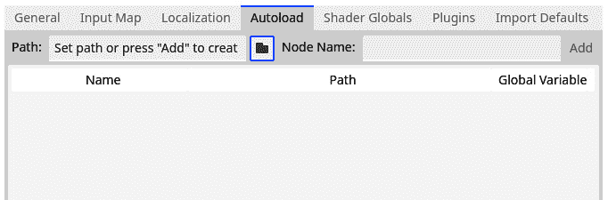

图 10.48 – 点击文件夹图标以选择要作为自动加载加载的文件

1.  导航到 `autoloads/highscore_manager.gd` 脚本。

1.  选择它并按 **打开**。

1.  现在，回到项目设置中的 **自动加载** 面板，点击 **添加** 按钮。

设置我们的自动加载就到这里了。你会看到 **Highscore** 自动加载现在显示在自动加载列表中：


图 10.49 – highscore_manager.gd 脚本作为自动加载被加载

除了在自动加载列表中看到脚本外，我们还有另一种方法可以检查自动加载是否存在。

使用场景作为自动加载

脚本和完整场景都可以作为自动加载。要使用场景，就像我们现在为脚本做的那样加载场景。

## 远程树中的自动加载

如前所述，自动加载在游戏开始运行时由 Godot 引擎实例化。因此，我们无法在单独的场景中看到它们，但当我们运行游戏时，它们应该在远程树中。

使用 **运行项目** 按钮或使用 **运行当前场景** 按钮运行游戏。打开远程树，你会看到一个名为 **HighscoreManager** 的节点。这是我们 **HighscoreManager** 自动加载！

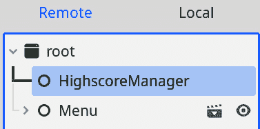

图 10.50 – 我们可以在远程树中看到 HighscoreManager 节点

现在我们已经设置了 **HighscoreManager** 自动加载，让我们在游戏中使用它并保存一些高分吧！

## 在主菜单和游戏场景中添加 UI

首先，我们需要确保玩家在玩游戏时知道他们的分数。因为我们说分数将是玩家能够生存的时间，我们将通过在屏幕上添加计时器来显示这个分数：

1.  在`main.tscn`场景中，在现有的`CanvasLayer`节点下添加一个`TimerUI`。

1.  对于`TimerUI`节点，选择**顶部宽**锚点，以便它保持在屏幕顶部：

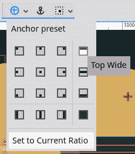

图 10.51 – 从锚点预设列表中选择“顶部宽”选项

1.  添加一个`TimerUI`并命名为`TimeLabel`：

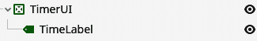

图 10.52 – 我们计时器的场景结构

1.  让我们用假时间`"123"`填充这个标签，这样我们就可以看到当它被填充时分数会看起来怎样。

1.  将这个标签的字体大小改为更大，例如`30` px。

现在，我们需要在`main.gd`游戏脚本中考虑计时器：

1.  首先，缓存脚本顶部的`TimeLabel`节点引用，并添加一个变量来保存当前已过时间：

    ```cpp
    @onready var _time_label: Label = $ CanvasLayer/TimerUI/TimeLabel
    var _time: float = 0.0:
       set(value):
          _time = value
          _time_label.text = str(floor(_time))
    ```

1.  现在，我们只需要更新这个`_time`变量的值。我们将在`_process()`函数中通过添加 delta 到当前时间来完成这个操作：

    ```cpp
    func _process(delta: float):
       _time += delta
    ```

1.  最后，每当玩家死亡时，我们需要提交这次时间并停止游戏计时。因此，更改与玩家`died`信号连接的函数，包括以下两行：

    ```cpp
    func _on_player_died() -> void:
       _game_over_menu.show()
       _enemy_spawner.stop()
       _health_potion_spawner.stop()
       set_process(false)
       HighscoreManager.set_new_highscore(_time)
    ```

这就是将高分链接到游戏本身的方法。现在，我们将解决在主菜单中显示高分的问题。

## 在主菜单中使用高分

现在我们能够创建新的高分，让我们在菜单中显示最高分：

1.  打开`menu.tscn`场景。

1.  添加一个新的`HighscoreLabel`。

1.  现在，在`menu.gd`脚本中添加以下代码：

    ```cpp
    @onready var highscore_label: Label = $CenterContainer/VBoxContainer/PanelContainer/MarginContainer/VBoxContainer/VBoxContainer/HighscoreLabel
    func _ready():
       highscore_label.text = "Highscore: " + str(HighscoreManager.highscore)
    ```

结果是，菜单现在将显示当前最高分：

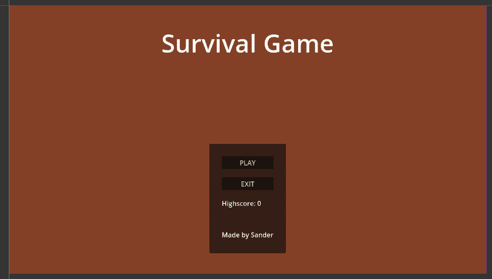

图 10.53 – 添加了 Highscore 标签的主菜单

我们对这段代码并不陌生。首先，我们保存`highscore_label`。接下来，当菜单场景准备就绪时，我们用包含当前最高分的字符串填充**HighscoreLabe**l。

这就是我们对自动加载的探索。我们看到了如何轻松地将脚本或场景作为节点添加，这个节点在游戏开始时总是被加载，而不需要我们自行管理这个节点。然后，我们通过其全局变量使用这个自动加载来在不同场景之间保存信息。

# 额外练习 – 锋利斧头

1.  敌人以缓慢、固定的速率生成。这可能会有些无聊，因为难度从未真正增加。让敌人在每一轮之后更快地生成。为了简单起见，你可以按照以下步骤操作：

    1.  将`start_interval`、`end_interval`和`time_delta`作为导出变量添加到`EntitySpawner`节点。`start_interval`变量将是游戏开始时生成实体之间使用的时间，`end_interval`将是最终值，而`time_delta`是我们将从`start_interval`变量增加到`end_interval`变量的增量：

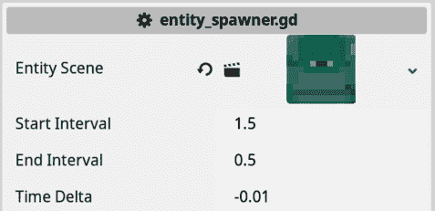

图 10.54 – EntitySpawner 节点的新的导出变量

1.  现在，在单独的变量 `_current_spawn_interval` 中跟踪下一个敌人生成的间隔时间。在游戏开始时将 `_current_spawn_interval` 设置为 `start_interval` 变量。此变量取代了旧的 `spawn_interval` 变量。

1.  每次我们在 `spawn_entity` 函数中生成实体时，都将 `time_delta` 变量添加到 `_current_spawn_interva` 变量中。不过，请确保不要超过 `end_interval` 变量。

1.  然后，仍然在 `spawn_entity()` 函数中，重新启动 `_spawn_timer`，但使用新的 `_current_spawn_interval` 变量：再次调用 `start_timer()`。对于 `HealthPotionSpawner` 节点，您需要将 `time_delta` 设置为 `0.0`。

1.  当玩家死亡时出现的菜单信息相当匮乏。添加一个漂亮的标签来显示玩家刚刚获得的分数。

# 摘要

在本章中，我们学习和创建了如此多的不同事物。首先，我们学习了有关 `NavigationServer` 属性的所有内容。为了给玩家提供自卫的机会，我们创建了自动定时发射的弹体。最后，我们添加了一个小的得分系统，将当前最高分存储在自动加载中，这样玩家就有动力重玩游戏并尝试打破自己的最佳成绩。

在下一章中，我们将做一些非常有趣的事情：使我们的游戏成为多人游戏！

# 测验时间

+   **控制**节点用于创建菜单等 UI。对于以下每个场景，给出一个可以完成任务的**控制**节点：

+   显示一段长文本

+   将其他**控制**节点组合到屏幕中心

+   显示一个按钮以开始游戏

+   我们在 `Enemy` 场景中添加了哪个节点来使其找到玩家的路径？

+   假设我们有一段代码，其中定义了一个名为 `shot` 的信号，用来指示我们发射了一个弹体：

    ```cpp
    signal shot
    ```

    编写发出此信号的所需代码行。

+   你如何在代码中从场景加载到变量中？

+   我们如何使脚本全局可用？
