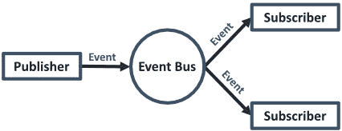
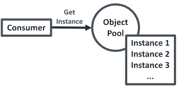
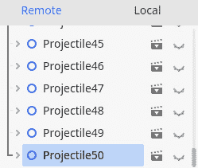
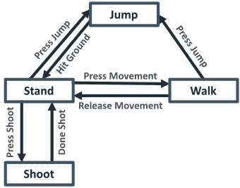
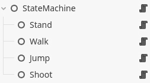

# 高级编程模式

虽然计算机科学作为一个科学领域相对较新，不到 80 年历史，但许多聪明的人已经研究过它。这意味着大多数编程问题已经在某种程度上被遇到。这些问题包括如何在不硬编码的情况下连接程序的一部分，或者如何创建和销毁成千上万的对象，例如子弹，而不会减慢游戏速度。

这些聪明人，通常被称为软件架构师，提出了聪明的解决方案，以优雅的方式解决了这些问题。然后，他们意识到他们可以将这些解决方案概括成一种食谱，一种模板，其他人也可以使用。这就是我们所说的编程模式。在本章中，我们将学习编程模式究竟是什么，并查看游戏开发中最常用的三种模式。

你的编程模式词汇量越大，你解决自己问题的能力就越强，向他人传达你的想法也就越容易。

在本章中，我们将涵盖以下主要内容：

+   编程模式的基础

+   事件总线

+   对象池

+   状态机

# 技术要求

与每一章一样，您可以在 GitHub 仓库的子文件夹中找到本章的最终代码：[`github.com/PacktPublishing/Learning-GDScript-by-Developing-a-Game-with-Godot-4/tree/main/chapter14`](https://github.com/PacktPublishing/Learning-GDScript-by-Developing-a-Game-with-Godot-4/tree/main/chapter14).

您可以在我们游戏中实现对象池所需的代码在这里找到：[`github.com/PacktPublishing/Learning-GDScript-by-Developing-a-Game-with-Godot-4/tree/main/chapter14-objectpool`](https://github.com/PacktPublishing/Learning-GDScript-by-Developing-a-Game-with-Godot-4/tree/main/chapter14-objectpool).

# 什么是编程模式？

我得坦白——我们并不是第一个创造游戏的人，或者更确切地说，并不是第一个编写软件的人。但事实上，这是一个好事；这意味着在我们之前，许多人已经遇到了我们可能遇到的问题。他们以某种方式想出了这些问题的解决方案，现在我们可以将这些解决方案用于我们自己的游戏和软件中。

**编程模式**，或软件设计模式，是描述或模板，告诉我们如何在编程时解决某些问题。它们不是完全实现的解决方案；它们只是给我们提供了如何应对我们试图解决的问题的指导。编程模式告诉我们如何组织我们的代码以实现不同的结果。

为了表达这些模式，有一些重要的部分：

+   **名称**：这个模式是如何被称呼的。

+   **问题**：这个模式试图解决什么。

+   **解决方案**：这个模式将如何工作。

除了提供解决方案之外，编程模式还给我们提供了谈论我们软件的手段。当像软件开发一样，每个问题都可以用多种不同的方式解决时，沟通我们所做的工作可能会很困难。设计模式给我们提供了一种谈论解决方案的方式，而无需深入到实际的实现中。

最后，如果我们根据一个或多个模式来组织我们的代码，我们就知道可以期待什么。我们知道代码将如何对新变化做出反应，以及如何与其他程序的各个部分进行通信。这有助于我们理解我们如何进行更改，无论是解决一个错误、添加新功能还是重构旧代码。

重构旧代码

有时候，你会发现你解决问题的方法可能不够快，不够可扩展，或者不足以满足需求。在这种情况下，你可以选择重写一些代码。我们称之为重构代码。

信不信由你，任何事物都可以是一个模式，即使你没有意识到，你可能已经在使用现有的模式了。

然而，这并不像挑选任何模式并将其强制应用到我们的游戏代码中那么简单。我们应该仔细考虑是否使用某种模式。当我们使用某种不适合我们试图解决的问题的模式，并且实际上使我们的软件变得更差时，我们称之为**反模式**。

为了不使本章内容过于冗长，代码示例将更多地作为介绍和演示如何使用模式。我们不会在我们的游戏中实现所有模式，因为这需要太多的文字。本章的真正目标是让你意识到最有用的编程模式。

让我们开始我们的第一个模式——事件总线。

# 探索事件总线

我们将要探讨的第一个编程模式是**事件总线**。它将帮助我们解耦代码，这意味着两段代码不需要过度依赖对方，同时仍然能够进行通信。

让我们看看事件总线模式试图解决的问题是什么。

## 问题

如果我们将代码的不同类和部分解耦，它们在以后重用时会更容易。例如，我们在*第九章*中就做了这件事，使用了 Godot 引擎提供的可连接的信号。发布信号的代码并不关心谁在监听或者谁想要接收这个信号。

但信号只能在非常局部的地方工作，而全球范围内使用它们可能会成为一个挑战。一个经典的例子是成就系统。成就是一些玩家在游戏中完成某些任务后获得的微小奖励。这些甚至可以与 Steam 或 PlayStation Network 等外部成就系统相链接。解锁这些成就所需的任务通常与游戏中的非常不同的系统相关联——“*击败最终 Boss,*” “*跳 250 次,*” “*倒放 2 分钟,*”等等。由于不同成就的这种变化，成就系统需要从代码的许多不同部分获取信息。然而，我们不想直接从每个系统的代码中访问成就系统，反之亦然，因为这会为成就系统创建一个硬依赖，使得成就系统必须始终存在。例如，在 Nintendo Switch 上，就没有成就系统，所以所有这些成就代码都将毫无用处。

既然我们已经知道了我们正在试图解决的问题类型，让我们深入探讨解决方案，即事件总线。

## 解决方案

这就是事件总线模式发挥作用的地方。它是一个我们自动加载的类，其他代码片段可以订阅或发布事件。基本结构看起来像这样：



图 14.1 – 事件总线的基本结构

这与信号非常相似，但这次是在全球范围内。让我们看看一个非常简单的例子：

```cpp
extends Node
var _observers: Dictionary = {}
func subscribe(event_name: String, callback: Callable):
   if not event_name in _observers:
      _observers[event_name] = []
   _observers[event_name].append(callback)
func publish(event_name: String):
   if not event_name in _observers:
      return
   for callable: Callable in _observers[event_name]:
      callable.call()
```

将此脚本添加到项目的自动加载中，就像我们在*第十章*中为高分管理器所做的那样，这样我们就可以全局访问它。

假设一个非常简单的 Boss 战例子，其中我们有一个节点，它的脚本看起来像这样：

```cpp
extends Node
func _ready():
   while randf() < 0.99:
      print("You're still fighting the boss!")
   print("The boss dies x.x")
   killed_boss.
			Now, we can create a little achievement system and subscribe to this event, to be notified when the boss battle is over:

```

extends Node

func _ready():

EventBus.subscribe("killed_boss", on_boss_killed)

func on_boss_killed():

print("成就解锁：击败 Boss")

```cpp

			Add this script as an autoload, named `AchievementSystem`, and then you can run the project. In the console, you’ll see that it works perfectly:

```

你正在与 Boss 战斗！

...

你正在与 Boss 战斗！

老大已死 x.x

成就解锁：击败 Boss

```cpp

			The signals, which are default in Godot, and the Event Bus patterns are both close cousins of the Observer pattern. The big difference between signals and the Event Bus is that with signals, you can only subscribe to one specific entity, such as when we subscribe to one enemy’s `died` signal to signify that the enemy died, whereas an Event Bus is global. It doesn’t matter what node or object threw the event; everyone who is subscribed to the event will get notified, such as when any node (it doesn’t matter which) throws the `game_over` event to signify that the game ended. The Observer pattern and all its different forms are widely known.
			Learn more
			Learn more about the Observer pattern here: [`gameprogrammingpatterns.com/observer.html`](https://gameprogrammingpatterns.com/observer.html).
			The Event Bus programming pattern is ideal for decoupling your code. Let’s now explore a pattern that has a completely different purpose, namely optimizing load times.
			Understanding Object Pooling
			The second programming pattern we’ll see is Object Pooling. The purpose of this pattern is to keep up the frame rate of our game while still being able to create and destroy many objects or nodes. Let’s take a deeper dive into what we are trying to solve – that is, the problem.
			The problem
			In some games, we want to be able to spawn and remove objects really quickly. In the little game that we have constructed over the course of the book, for example, we want to be able to spawn and remove projectiles and arrows fast and reliably. With the rates our arrows are being shot at now, this is not a big issue, but it could become one if we increased this rate, especially in multiplayer. Creating new nodes – for example, by using the `instantiate()` function we saw in *Chapter 10* and adding them to the scene tree – is pretty slow. The game needs to load the scene file from disk and then allocate new memory every time we create a new node. Then, when the node gets freed, the game has to free up that memory again.
			To optimize this process, we can use an Object Pool, which we will discuss in the next section.
			The solution
			Theses loading problems can be solved by the Object Pooling pattern. Object Pooling basically means that we keep a list, also called a pool, of already initialized nodes somewhere. For example, with a bunch of arrows, when we need an arrow, we can simple take one from this list. When it is not needed anymore, we return it to that list so that it can be reused later on.
			

			Figure 14.2 – Any class that wants an instance can ask the Object Pool
			Because we do not actually delete or remove the arrow node from the scene tree, we will need to make sure, through code, that the node stops working in the background when it is supposed to be stored away in the Object Pool. When an object is in use, we say it is alive because it lives within the game. When it is in the Object Pool, it is dead because it is not in use anymore. When we want to return a live object to the pool, we say that it gets killed.
			

			Figure 14.3 – The Object Pool sets an instance as alive. When the instance is dead, it returns to the pool
			Here is an example of what an Object Pool’s script could look like:

```

class_name ObjectPool extends Object

var _pool: Array

func _init(scene: PackedScene, pool_size: int, root_node: Node):

for _i in pool_size:

var new_node: Node = scene.instantiate()

_pool.append(new_node)

new_node.died.connect(kill_node.bind(new_node))

root_node.add_child(new_node)

func kill_node(node: Node):

node.set_dead()

_pool.append(node)

func get_dead_node() -> Node:

if _pool.is_empty():

return null

var node: Node = _pool.pop_back()

node.set_alive()

return node

func free_nodes():

for node in _pool:

node.queue_free()

```cpp

			You can see that we keep an array, called `_pool`, which will contain all of our dead nodes. First, we create a number of objects within the `_init()` function of type `scene` and add these new objects as children to `root_node`, which we can pass to this `_init()` function. The number of objects we populate the pool with is defined by `pool_size`.
			In the `_init()` function, we also connect to the `died` signal of each node using the `kill_node()` function. This means that the node, when it dies, needs to emit the `died` signal. The `kill_node()` function, in turn, will call the `set_dead()` function on that node. This function should disable the node and will be different for each kind of node, so we need to implement that later on in the definition of the node script itself. After this, the node is returned to the `_pool`.
			You can also see that I called a function called `bind()` on the `kill_node` callable – `kill_node.bind(new_node)`. This binds arguments to `Callable`, which means that if the signal is emitted and this `Callable` gets called, the arguments we bind here are given to the `kill_node()` function. This way, we know what object is being killed in the `set_dead()` function.
			When we need an instance from the pool, we call the `get_dead_node()` function, which will first check whether there are still objects in the pool; if not, we return nothing. If there are still objects in the pool, we remove the first element from e `_pool`, set it as alive, and then return it.
			Lastly, we implemented a `free_nodes()` function that frees all the nodes that are present in the pool. This way, we can free them all conveniently when we stop the game.
			Implementing the Object Pool in our game
			Let’s implement the Object Pool in our own game! The obvious nodes to pool from our Vampire Survivor like game are the projectile and the enemy. We’ll use a pool to deal with the projectiles here. You can always take a stab at making an Object Pool that deals with the enemies:
			Create a script, `object_pool.gd`, that has the exact content of the script from the previous section. Save it under a new folder, `parts/object_pool`.
			Let’s prepare the `projectile.gd` script so that it can be in a pool:

				1.  At the top, add a new custom signal, `died`. This will be called when the projectile can go back into the pool.

    ```

    信号已消失

    ```cpp

    				2.  Then, add two functions, `set_alive()` and `set_dead()`, which we call from the Object Pool:

    ```

    func set_alive():

    if multiplayer.is_server():

    set_physics_process(true)

    _enemy_detection_area.monitoring = true

    show()

    func set_dead():

    set_physics_process(false)

    _enemy_detection_area.set_deferred("monitoring", false)

    hide()

    ```cpp

    The `set_alive` function turns on the `_physics_process` and the collision detection for the projectile, but only if this code is run from the server. Then it shows the projectile, no matter if we are running from the server or not so that everyone can see it. The `set_dead` function undoes all these changes to make sure the projectile is unusable while dead.

			Important note
			We use the `set_deferred()` function on the `_enemy_detection_area` to set `monitoring` to `true` or `false` because this change has to be incorporated by the physics engine and we need to wait until all physics calculations for that frame are executed. The `set_deferred()` function sets the value to our desired value at the end of the current frame.

				1.  Now, replace the original `_ready()` function with the one in the next code snipper which makes sure new instances don’t start acting when they are created and put into the scene tree:

    ```

    func _ready():

    set_dead()

    ```cpp

    				2.  Lastly, replace the mentions of `queue_free()` with `died.emit()` because the Object Pool will manage how the node gets created:

    ```

    func _physics_process(delta: float):

    if not is_instance_valid(target):

    died.emit()

    return

    # Rest of _physics_process

    func _on_enemy_detection_area_body_entered(body: Node2D) -> void:

    body.get_hit()

    main.gd script to have an Object Pool of projectiles.At the top, add a `projectile_pool` variable and preload the `projectile.tscn` scene:

    ```cpp
    var projectile_pool: ObjectPool
    var projectile_scene: PackedScene = preload("res://parts/projectile/projectile.tscn")
    ```

    ```cpp

    				3.  Now, we only want to initialize this variable when we run from the server. The server will manage all the projectiles. Add the following line to `_ready()`:

    ```

    Func _ready():

    # ...

    if multiplayer.is_server():

    # Code for server setup

    _exit_tree() function of the main script:

    ```cpp
    func _exit_tree():
       if projectile_pool:
          projectile_pool.free_nodes()
          projectile_pool.free()
    ```

    ```cpp

			Important note
			Nodes in the scene tree will be freed automatically when we close the game. But objects that are not inside of the tree, like our `projectile_pool` or nodes we take out of the scene tree, are not managed by the same process. So, we need to manage when to delete them ourselves.

				1.  Lastly, we’ll need to update the `player.gd` script to access the Object Pool for a projectile and set its target and position. Replace the original way we created a new projectile with this code:

    ```

    func _on_shoot_timer_timeout():

    # Shooting code to select a target enemy

    var new_projectile: Projectile = get_parent().projectile_pool.get_dead_node()

    if new_ projectile:

    new_projectile.target = closest_enemy

    new_projectile.position = global_position

    ```cpp

			This is all we need to do to implement our Object Pool in our multiplayer game. When you look at the **Remote Tree** while running the game, you’ll see that 50 projectiles have been created at the start, ready to be launched by the players.
			

			Figure 14.4 – 50 projectiles are created, ready to be used
			That’s it for the Object Pool pattern. It is very useful to keep frame rates in check when you need lots of objects to spawn and disappear often. Let’s look at yet another completely different pattern in the next section.
			Working with State Machines
			Games are massive pieces of code that can get quite complex. To lower the complexity of code, we can try to separate different pieces so that they only perform one action very well. That is exactly what we are going to do with a State Machine. Let’s first start with a better problem statement.
			The problem
			Agents, such as the player or enemies, often have to operate in very different scenarios. In a platformer game, such as **Super Mario Bros** for example, the character needs to be able to walk, run, jump, dive, wall slide, fly, and so on. This is a lot of different kinds of code. If we try to fit this into one big class for the player, we’ll end up with a jumble of code that is very hard to understand, debug, or extend.
			Ultimately, we want our game’s code to be easily understood and maintained. That’s why we will learn about the State Machine in the next section.
			The solution
			A great way to combat this complexity is by separating the behavior for each of these wanted behaviors (walking, jumping, etc.) into different files and classes. This is exactly what the State Machine pattern does. The State Machine swaps out part or the complete behavior of an object with a different behavior, depending on the state it is in.
			Each of the behaviors we identified earlier (walking, jumping, etc.) is defined as a totally independent state that alters the behavior of the agent and is saved in a separate file.
			

			Figure 14.5 – An example of how states could connect with each other
			The State Machine can only have one active state at one time. This rule makes sure that we don’t mix up behaviors or code.
			Each of these states knows which other states it can transition to. This transition gets triggered from the code of that state by asking the State Machine directly to transition.
			Now that we have a surface-level idea of what a State Machine can do, let’s quickly list all the things it should do. The State Machine should do the following:

				*   Have a list of all possible states
				*   Designate one active state
				*   Be able to transition from one state to another
				*   Update the current active state and provide it with direct input

			With that in mind, let’s take a look at the code for the actual State Machine itself:

```

class_name StateMachine extends Node

@export var starting_state: String

var states: Dictionary

var current_state: State

func _ready():

for child in get_children():

states[child.name] = child

child.state_machine = self

if not starting_state.is_empty:

transition_to(starting_state)

func transition(state_name: String):

if current_state:

current_state.exit()

current_state = states[state_name]

current_state.enter()

func _physics_process(delta: float):

if not current_state: return

current_state.process(delta)

func _input(event: InputEvent):

if not current_state: return

current_state.input(event)

```cpp

			You can see that in the `_ready()` function, we scan all the children of the State Machine and add it to a dictionary of `states`. This dictionary will help us to quickly look up states when we need them in the `transition()` function. This also means that we will add each state as a child node to the State Machine itself, like so:
			

			Figure 14.6 – The State Machine with each state as a child node
			At the end of the `_ready()` function, we transition to `starting_state`, which is an export variable that we can use to set the initial state of the State Machine.
			In the `transition()` function that is used to transition to a new state, we first check whether we have `current_state`; if we do, we’ll first have to call the `exit()` function on it to make sure it can clean itself up. After that, we use  `state_name`, which is provided as an argument to look up the next state, assign it as `current_state`, and call the `enter()` function on it.
			The `_physics_process()` and `_input()` methods are used to directly feed into the `process()` and `input()` functions of `current_state`, if there is a current state.
			Now, let’s have a look at the `state` class itself:

```

class_name State extends Node

var _state_machine: StateMachine

func enter():

pass

func exit():

pass

func process(delta: float):

pass

func input(event: InputEvent):

pass

```cpp

			The state class is a simple skeleton with functions that we have to implement when we inherit from it. This means that if we have a jump state, for example, we’ll need to make sure that the `enter()`, `exit()`, `input()` and `process()` functions all work as they should during the jumping behavior of our character.
			If we want to go from one state to another, we can simply use `_state_machine.transition()` from within the state and provide the name of the state we want to transition to.
			We can now create specialized states and connect them through code, by calling the `transition()` function on the `_state_machine` object.
			An example state
			Let’s take a quick look at an example state, `Walk`, for the player. This is the state when the player moves freely around:

```

extends State

var _player: Player = owner

@export var max_speed: float = 500.0

@export var acceleration: float = 2500.0

@export var deceleration: float = 1500.0

func process(delta: float):

var input_direction: Vector2 = Input.get_vector("move_left", "move_right", "move_up", "move_down")

if input_direction != Vector2.ZERO:

_player.velocity = _player.velocity.move_toward(input_direction * max_speed, acceleration * delta)

else:

_player.velocity = _player.velocity.move_toward(Vector2.ZERO, deceleration * delta)

_player.move_and_slide()

func input(event: InputEvent):

if event.is_action_pressed("jump"):

_state_machine.transition("Jump")

```cpp

			You can see we extend the `State` script from earlier. Then, we implement the `process()` function to do our movement calculations, which are specific to walking around, and the `input()` function to detect when we want to transition from this state to the `Jump` state.
			We don’t need to override every function from the `State` script, just the ones that we need, which in this case are the `process()` and `input()` functions.
			State Machines, in one way or another, are used in almost every game you ever played. It is a very important concept to understand. They abstract complex behavior into separate classes that are easy to understand and maintain.
			Let’s conclude the chapter with some additional exercises.
			Additional exercises – Sharpening the axe

				1.  The implementation of our Event Bus makes it possible to subscribe to an event, but not to unsubscribe when the receiver doesn’t want to be subscribed anymore. Implement an `unsubscribe()` function that unsubscribes a `Callable` from an event:

    ```

    func unsubscribe(event_name: String, callback: Callable):

    # Your code

    ```cpp

    				2.  The Object Pool we have implemented returns nothing when we try to call `get_dead_node()` while the pool is empty. A smarter way of dealing with this would be to create a new object, basically extending the Object Pool on the fly. Create a new function, `get_dead_node_or_create_new()`, in such a way that when the pool is empty, it creates a new object that is correctly connected and returned to the pool when it dies.

			Summary
			After learning how to program and make a game, we finally took a step back and learned about higher-level patterns that help us structure our project and code nicely. First, we learned about what programming patterns are in general. Then, we learned about the Event Bus, Object Pool, and State Machine patterns that can help us in different ways. These three are some of the widely used patterns in gaming and are applied outside of game development too.
			From here, you can start to investigate more niche programming patterns, such as the following:

				*   **Components, also known as** **Composition**: [`gameprogrammingpatterns.com/component.html`](https://gameprogrammingpatterns.com/component.html)
				*   **Commands**: [`gameprogrammingpatterns.com/command.html`](https://gameprogrammingpatterns.com/command.html)
				*   **Service** **Locators**: [`gameprogrammingpatterns.com/service-locator.html`](https://gameprogrammingpatterns.com/service-locator.html)

			In the next chapter, we’ll look at the filesystem and learn how to save the state of our game so that our players can start a game from where they left off.
			Quiz time

				*   Programming patterns are standardized ways of solving problems in a program or game. What is the advantage of knowing them?
				*   Any piece of code can be considered as a pattern. But when we call something an anti-pattern, does this mean that it works in our favor?
				*   The Signals and Event Bus patterns are very similar because, in both, we subscribe to events, but what is their fundamental difference?
				*   Why would we use an Object Pool pattern in our game?
				*   What is the line of code with which we can transition from one state to another using the State Machine pattern?

```
