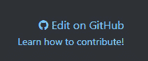
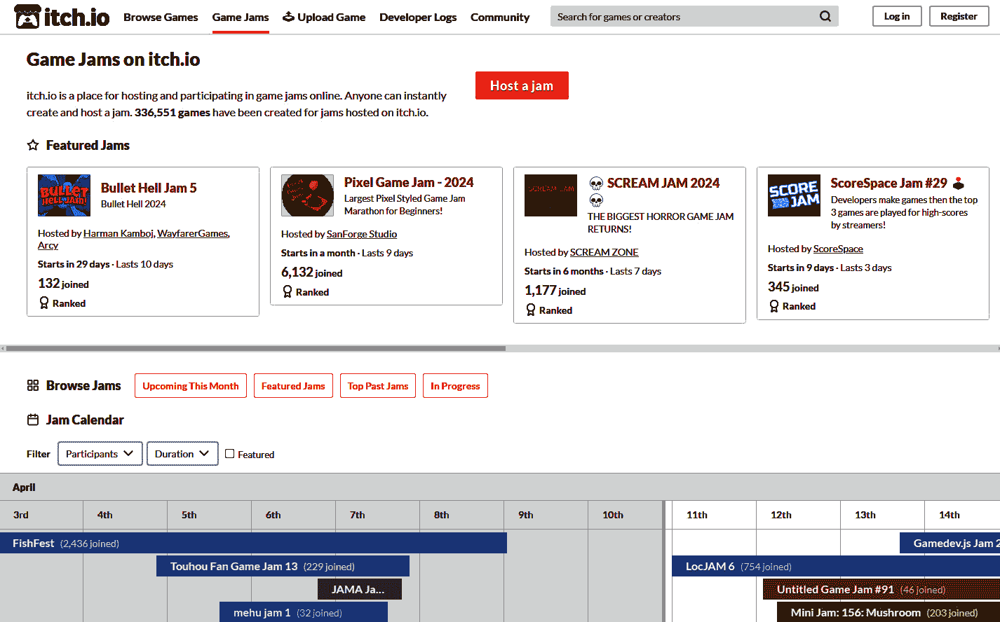

# 16

# 接下来是什么？

真是一次难忘的旅程！我们从对编程一无所知，到在书中获得中级理解，并从头开始创建了一个完整游戏。我知道并不是每次都能轻易地理解所有内容，但这就是我们学习的方式。我们必须在某件事上失败，然后一次又一次地尝试——每次都会在我们试图学习的事情上变得更好。

开始一个新项目总是充满挑战。它就像画家的空白画布或作家的空白纸张。开始新事物总是很难。这就是为什么我喜欢提供一些想法来帮助你开始。而且不用担心哪个项目是理想的。从现在开始，任何你感兴趣的项目都是值得一试的。只需确保它们小巧并完成它们，这样人们就可以玩你所制作的。

在本章中，我们将涵盖以下主要主题：

+   你下一个项目的想法

+   学习新主题

+   加入社区

# 你下一个项目的想法

如本章引言中所述，对空项目的恐惧是真实存在的。从哪里开始，要做什么，总是充满挑战。让我们更深入地看看这两个问题。

## 开始一个新项目

这里有一些我通过艰难的方式学到的关于开始新项目的建议，这将帮助你专注于创建你想要创建的游戏：

+   **从创建主要游戏循环开始**：你应该做的第一件事是创建游戏的基础游戏玩法。如果你在制作一个平台游戏，确保在开始添加更复杂的系统之前，移动和跳跃本身就是有趣的。

+   **先让它变得实用，再让它变得美观**：很容易陷入制作游戏过于美观的陷阱，但这会显著减缓游戏的生产进度。更糟糕的是，如果游戏不好玩，你需要重做很多系统，你还需要重做所有让你游戏变得美观的事情。

+   **专注于你想要学习的东西**：如果你想要学习某个特定主题，比如菜单和用户界面，那么就把它作为你项目的重点。有一些以 UI 为重点的游戏类型，比如视觉小说或策略游戏，你可以制作。

+   **保持小巧**：大多数人更喜欢玩一个小巧有趣的游戏，而不是一个漫长而半成品体验。这也会确保你能够完成游戏。你玩过的任何游戏都是完成的（或者被认为足够完成），而未完成的游戏从未被任何人玩过。

+   **制作一个 GDD**：在项目开始时，创建一个简短的游戏设计文档。这可能是一页纸，只是为了说明项目的总体意图。它将在开发过程中引导你，并帮助你在以后做出决策。

这些是一些关于如何应对任何新项目的宏观建议。很容易陷入细节，所以最重要的是开始。毕竟，学习发生在我们犯错之后。现在，我们将转向更具体下一步要做什么的想法。

## 扩展生存类游戏

合理的下一步是将我们在这本书中创建的游戏进行扩展。以下是一些想法：

+   **引入新的敌人类型**：可能是一个移动缓慢但造成大量伤害的敌人，或者一个停留在原地并在 5 秒后爆炸的炸弹。

+   **创建不同类型的投射物**：可能是一把射程较短但能对敌人造成更多伤害的匕首。

+   **添加更多可拾取物品**：可能是一个能保护玩家五秒钟的盾牌，或者能让玩家移动速度加快的靴子。

然而，我要给你一个警告，那就是你不应该在一个项目上花费太多时间。在学习创建和设计游戏时，最好保持项目小，不要过度打磨单个游戏。通常，将某个项目视为完成，让人们来玩，然后转到下一个项目会更好——直到你对自己的技能足够自信，可以处理更大的游戏。

视频游戏中的打磨

在视频游戏开发中，我们将任何不是游戏核心体验的东西称为**打磨**——那些不是体验核心但能让体验看起来更美观或感觉更流畅的东西。打磨对游戏的最终体验非常重要。

在创建许多小型游戏的话题上，让我们看看你可以接下来工作的游戏想法。

## 创建另一款游戏

在游戏开发者社区中，我们经常说“你的前 10 个游戏会很糟糕”，这是一种严厉的说法，意思是你在创建的前 10 个项目可能不会很出色。但这没关系。我们都有过这样的经历。但每个你完成的项目都会教会你一些东西。

你可能会在一个项目中专注于创建引人入胜的游戏循环，而在另一个项目中则专注于创建清晰的菜单。

尝试制作许多小项目，每个项目都能教会你一些有用的东西；这样，你就能在展示成果的同时提升自己的技能。

你可以尝试解决以下一些游戏想法：

+   **平台游戏**：学习如何在二维物理中工作，其中重力将玩家向下拉。

+   **回合制策略游戏**：学习如何将游戏玩法分成离散的步骤。

+   **卡牌游戏**：学习如何处理更复杂的用户界面以及如何抽象卡牌能力。

+   **解谜游戏**：学习如何设计既不太难也不太容易的有趣谜题。

+   **视觉小说**：了解所有关于菜单以及如何将对话集成到游戏中的知识。

+   **无尽跑酷游戏**：学习如何即时生成随机关卡。

在进行这些项目时，查找你不知道如何做或不理解的部分。这本书中的信息是一个很好的起点，但它不足以解决所有问题。试图做到这一点的书会非常冗长。

## 免费游戏资源

如果你不是视觉艺术家或音乐家，那么为你的游戏创建资源可能会很困难。幸运的是，周围有很多免费选项；查看以下链接：

+   **Kenney**: 荷兰制作的出色免费 2D、3D 和音频资源。本书中使用的精灵来自 Kenney：[`kenney.nl/assets`](https://kenney.nl/assets)。

+   **OpenGameArt**: 一个由游戏开发者和艺术家组成的社区，提供免费和开源资源：[`opengameart.org/`](https://opengameart.org/)。

+   **Itch.io**: 我们发布游戏所使用的平台也是一个提供各种免费资源的优秀资源库：[`itch.io/game-assets/free`](https://itch.io/game-assets/free)。

使用这些资源，你将能够迅速制作出美丽的游戏。

尽管这些资源是免费的，但通常需要在游戏或游戏的商店页面上某处提及资源的创作者。所以，别忘了这样做；这样，你就能获得免费资源，同时他们也能得到曝光。对每个人都是双赢！

知道要学习什么是最重要的一步，你希望在这个过程中识别出来。从那里开始，问题是如何学习这些内容？让我们在下一节中探讨这个问题。

# 学习新主题

在学习更多关于编程和游戏设计方面有许多优秀的资源。在本节中，我们将介绍一些可能对你有帮助的不同类型的资源。

## 跟随特定的教程

当你知道你想学习什么时，肯定会有关于该主题的视频或文字教程。你所需要做的就是使用你喜欢的搜索引擎，比如 Google 或 YouTube，搜索你想要的主题。以下是我最喜欢的几个 Godot 引擎教程来源：

+   **GDQuest**: 提供了关于广泛主题的精彩视频教程，甚至提供完整的课程：[`www.youtube.com/@Gdquest`](https://www.youtube.com/@Gdquest)。

+   **Hearbeast**: 一个 YouTube 频道，提供完整的游戏项目，以及关于不同 Godot 引擎相关主题的简短教程：[`www.youtube.com/@uheartbeast`](https://www.youtube.com/@uheartbeast)。

+   **The Godot Engine docs**: 文档中有一个专门介绍不同第三方教程的页面：[`docs.godotengine.org/en/stable/community/tutorials.html`](https://docs.godotengine.org/en/stable/community/tutorials.html)。

+   **KidsCanCode**: 在 Godot 相关的多个主题上有很多优秀的文章：[`kidscancode.org/godot_recipes/4.x/`](https://kidscancode.org/godot_recipes/4.x/)。

+   **Game Maker’s Toolkit**: 一个关于游戏设计的优秀视频论文频道：[`www.youtube.com/@GMTK`](https://www.youtube.com/@GMTK)。

关于 Godot 引擎的在线教程并不缺乏。

## 阅读更多书籍

另一种加深知识的方法是阅读更多关于更专业和高级主题的书籍。以下是我最喜欢的几本书：

+   *《游戏设计艺术：视角之书》*，作者 Jesse Schell。这本书对游戏设计相关的所有内容进行了非常全面的介绍。

+   《*游戏编程模式*》，作者 Robert Nystrom。想了解更多关于游戏中应用到的编程模式？那么这本书就是为你准备的。

+   《*游戏设计中的乐趣理论*》，作者 Raph Koster。一本关于什么使游戏有趣以及它们文化重要性的简短书籍。

+   《*Godot 4 游戏开发项目*》，作者 Chris Bradfield。

+   《*GAMEDEV：制作你的第一个成功游戏 10 步*》，作者 Wlad Marhulets。

任何这些都能帮助你成为游戏开发者和设计师的道路上。

## 阅读 Godot 引擎文档

除了第三方资源外，当然还有官方的 **Godot 引擎文档**。这是一个关于所有不同类和节点以及包含与引擎相关的所有不同子系统的手册的非常详尽的信息来源。

你可以在这里访问文档：[`docs.godotengine.org/`](https://docs.godotengine.org/)。

每当你搜索如何使用引擎的某个部分时，你应该首先查阅文档。

## 查看他人的游戏项目代码

通过查看他人的游戏项目和代码是一种极好的学习方法。因为 Godot 引擎是一个开源项目，许多使用该引擎的游戏也是开源的。这意味着整个项目都可以在线上供任何人查看和尝试。

一些优秀的项目包括以下内容：

+   **Godot 引擎演示项目**：这些是完全开源的小项目，从技术演示到完整游戏不等：[`github.com/godotengine/godot-demo-projects`](https://github.com/godotengine/godot-demo-projects)。

+   **GDQuest 的开放 RPG**：一个 2D、开放世界 RPG 游戏的演示：[`github.com/gdquest-demos/godot-open-rpg`](https://github.com/gdquest-demos/godot-open-rpg)。

注意，这些项目通常仍在开发中，或者可能是用较旧的 Godot 引擎版本制作的，但看看人们是如何解决某些问题总没有坏处。

学习新主题是提高你的游戏开发技能的绝佳方式；它将使你能够更快地完成更多任务。然而，另一种重要但常被忽视的提高方式是通过加入一个喜欢分享、提供反馈和支持彼此的志同道合的人的社区。让我们看看我们如何加入这样的社区。

# 加入社区

最后，我想鼓励你加入游戏开发社区。一般来说，这是一个非常友好和热情的人群，他们喜欢听到你的想法和你的游戏。不要犹豫，去接近他们并询问问题。大多数人都会非常乐于助人，并鼓励你在旅程中前进。

## 加入论坛、Discord、Reddit 或任何其他平台

有许多不同的社区与在多个平台上创建游戏相关联而兴起。无论你在哪个社交媒体上最活跃，那里很可能有一个充满活力的游戏开发者社区。以下是一些你可以加入的渠道：

+   **官方 Godot 引擎论坛**：这是提问、帮助他人和展示你项目的完美场所：[`forum.godotengine.org/`](https://forum.godotengine.org/).

+   **官方 Godot 引擎 Discord**：在这里，你可以遇到使用 Godot 的志同道合的游戏开发者：[`discord.com/invite/4JBkykG`](https://discord.com/invite/4JBkykG).

+   **Godot 引擎 Reddit**：在这里，你可以分享你的项目并查看其他人的进度：[`www.reddit.com/r/godot/`](https://www.reddit.com/r/godot/).

+   你可以查看的 `Godot` 标签：[`www.twitch.tv/directory/all/tags/godot`](https://www.twitch.tv/directory/all/tags/godot).

+   `#GodotEngine`、`#IndieDev` 和 `#GameDev` 标签。

分享你的进度，看到其他人的进度，并与他人讨论游戏开发，这可以是非常有动力和令人满足的建立你周围的小社区的方式。

## 为 Godot 引擎项目做出贡献

因为 Godot 引擎是开源的，而且你现在已经知道如何使用它，所以如果你想帮忙的话，可以这样做。以下是一些你可以参与的方式：

+   **记录问题**：Godot 引擎，像任何软件一样，不幸的是并非没有错误，但很多人正在解决这些问题。如果你在引擎中发现了错误，你总是可以在引擎的 GitHub 页面上打开一个问题：[`github.com/godotengine/godot/issues`](https://github.com/godotengine/godot/issues).

+   **编写文档**：无论何时你在阅读文档，如果你觉得你所在的页面有点不足，请不要犹豫，添加你自己的改进并帮助任何其他新接触 Godot 引擎的人。每个文档页面都有一个链接，可以直接带你到可以编辑页面的地方。

图 16.1 - 点击 GitHub 上的“编辑”来提议更改 Godot 文档页面

+   **翻译引擎的部分内容**：想要帮助将引擎或其文档本地化到其他语言，以便更多的人能够访问这个伟大的工具吗？如果是这样，你将在这里找到你需要知道的一切：[`docs.godotengine.org/en/latest/contributing/documentation/editor_and_docs_localization.html#doc-editor-and-docs-localization`](https://docs.godotengine.org/en/latest/contributing/documentation/editor_and_docs_localization.html#doc-editor-and-docs-localization).

+   **直接向引擎贡献代码**：一旦你在编程能力上足够自信，你就可以尝试直接在引擎的核心进行编码。你可以在这里找到更多信息：[`docs.godotengine.org/en/latest/contributing/development/index.html`](https://docs.godotengine.org/en/latest/contributing/development/index.html).

这些是你可以为 Godot 项目和社区做出贡献的最大方式之一。现在让我们回到下一节，继续创建游戏。

## 参加游戏马拉松

成为游戏开发者的一大部分当然是开发游戏。没有什么比与他人一起开发游戏更有趣了。这正是**游戏马拉松**的目的所在。游戏马拉松是一些活动，你可以在短时间内从头开始创建一个游戏，通常是一个周末，但也可以长达一个月或更长时间。

目标是创建一个小游戏，然后由马拉松的其他参与者来玩。这是获取大量反馈并在此期间玩许多其他人的游戏的好方法。更重要的是，你可以以团队的形式参加这些马拉松。这样，你可以在游戏开发世界中建立联系，并学会与多个人合作。然而，你也可以单独参加。

提供游戏马拉松的最大平台之一是[itch.io](http://itch.io)，我们曾用它上传我们的游戏在*第十二章*。只需访问[`itch.io/jams`](https://itch.io/jams)，寻找你感兴趣的游戏马拉松。在任何给定的时间点，总有无数的游戏马拉松在进行。

图 16.2 - Itch.io 上的游戏马拉松页面

你可以加入的一些优秀的游戏马拉松如下：

+   **Godot Wild Jam**：专门为 Godot 游戏开发者举办的每月一次的游戏马拉松：[`godotwildjam.com/`](https://godotwildjam.com/)。

+   **全球游戏马拉松**：全球范围内组织的实体游戏马拉松。查看网站以找到您附近的地点：[`globalgamejam.org/`](https://globalgamejam.org/)。

+   **GMTK 游戏马拉松**：由**游戏开发者工具包**YouTube 频道组织的年度游戏马拉松。这个活动没有稳定的网站链接，但总是在 YouTube 频道上宣布：`www.youtube.com/@GMTK`。

现在，你已经知道了如何融入游戏开发者社区，并开始与成千上万的志同道合的人分享你的精彩游戏。

# 再见

在本章中，我们通过向您展示您在创建优秀游戏旅程中的下一步是什么来结束本书。我们看到了我们可以工作的可能项目，如何学习新事物，以及如何加入社区。

整本书的目的是让新人们开始使用 Godot 引擎创建游戏。我们从对编程或游戏开发一无所知，发展到对两者都有非常扎实和中级理解。

在开始时，我们学习了如何使用 GDScript 作为我们的首选语言，了解了基本概念，如变量和循环，并逐步过渡到更中级的话题，如类和正确的编程指南。我们最终进入了高级话题，如 super 关键字和编程模式。

在这本书中，我们还开发了自己的游戏，一款模仿 *Vampire Survivors* 的小型生存游戏。我们了解了节点是什么，以及在各种不同情况下应该使用哪些节点。我们甚至让游戏支持多人模式，并在 **Itch.io** 上发布，供任何想玩的人游玩！

我希望你在学习如何编程和使用 Godot 引擎的过程中玩得开心，并且我衷心感谢你坚持到最后。现在，去创造一些令人惊叹的游戏吧！
