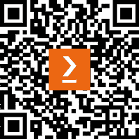

# 前言

构建编译器是一项复杂而有趣的任务。LLVM 项目为您提供了可重用的组件，LLVM 核心库实现了一个世界级的优化代码生成器，它将所有流行 CPU 架构的机器代码的源语言无关的中间表示翻译成源代码。许多编程语言的编译器已经利用了 LLVM 技术。

本书教您如何实现自己的编译器以及如何使用 LLVM 来实现它。您将学习编译器的前端如何将源代码转换为抽象语法树，以及如何从中生成**中间表示**（**IR**）。此外，您还将探索向编译器添加优化管道，这允许您将 IR 编译成高效的机器代码。

LLVM 框架可以通过多种方式扩展，您将学习如何添加新的传递，甚至为 LLVM 添加一个全新的后端。本书还涵盖了高级主题，例如为不同的 CPU 架构编译以及使用您自己的插件和检查器扩展 clang 和 clang 静态分析器。本书采用实用方法，并包含大量示例源代码，这使得将所学知识应用于自己的项目变得容易。

# 本版新增内容

*学习 LLVM 17* 现在新增了一章，专门介绍在 LLVM 中使用的 TableGen 语言的概要和语法，读者可以利用它来定义类、记录以及整个 LLVM 后端。此外，本书还强调了后端开发，讨论了可以用于 LLVM 后端实现的各种新后端概念，例如实现 GlobalISel 指令框架和开发机器函数传递。

# 本书面向的对象

本书面向编译器开发者、爱好者以及有兴趣了解 LLVM 框架的工程师。对于希望使用基于编译器的工具进行代码分析和改进的 C++ 软件工程师，以及希望深入了解 LLVM 核心知识的 LLVM 库的普通用户来说，本书也非常有用。为了更有效地理解本书中涵盖的概念，需要具备中级 C++ 编程经验。

# 本书涵盖的内容

*第一章*，*安装 LLVM*，解释了如何设置和使用您的开发环境。在章节末尾，您将编译 LLVM 库并学习如何自定义构建过程。

*第二章*，*编译器的结构*，为您提供了编译器组件的概述。在章节末尾，您将实现您的第一个编译器，生成 LLVM IR。

*第三章*, *将源文件转换为抽象语法树*，详细介绍了如何实现编译器的前端。你将为一个小型编程语言创建自己的前端，最终构建一个抽象语法树。

*第四章*, *IR 代码生成基础*，展示了如何从抽象语法树生成 LLVM IR。本章结束时，你将实现一个示例语言的编译器，生成汇编文本或目标代码文件作为结果。

*第五章*, *高级语言构造的 IR 生成*，说明了如何将源语言中常见于高级编程语言的功能翻译成 LLVM IR。你将了解聚合数据类型的翻译，实现类继承和虚函数的各种选项，以及如何遵守系统的应用程序二进制接口。

*第六章*, *高级 IR 生成*，展示了如何生成源语言中异常处理语句的 LLVM IR。你还将学习如何为基于类型的别名分析添加元数据，以及如何将调试信息添加到生成的 LLVM IR 中，并扩展你的编译器生成的元数据。

*第七章*, *优化 IR*，解释了 LLVM 的 Pass 管理器。你将实现自己的 Pass，既作为 LLVM 的一部分，也作为插件，并学习如何将你的新 Pass 添加到优化 Pass 管道中。

*第八章*, *TableGen 语言*，介绍了 LLVM 自己的领域特定语言 TableGen。这种语言用于减少开发者的编码工作量，你将了解在 TableGen 语言中定义数据的不同方式，以及它如何在后端得到利用。

*第九章*, *即时编译*，讨论了如何使用 LLVM 实现**即时**（**JIT**）编译器。到本章结束时，你将以两种不同的方式实现了自己的 LLVM IR 即时编译器。

*第十章*, *使用 LLVM 工具进行调试*，探讨了 LLVM 的各种库和组件的细节，这有助于你识别应用程序中的错误。你将使用 sanitizers 来识别缓冲区溢出和其他错误。使用 libFuzzer 库，你可以用随机数据作为输入测试函数，XRay 将帮助你找到性能瓶颈。你将使用 clang 静态分析器在源级别识别错误，并了解你可以向分析器添加自己的检查器。你还将学习如何通过自己的插件扩展 clang。

*第十一章**，* *目标描述*，解释了您如何添加对新 CPU 架构的支持。本章讨论了必要的和可选的步骤，如定义寄存器和指令、开发指令选择以及支持汇编器和反汇编器。

*第十二章*，*指令选择*，展示了两种不同的指令选择方法，具体解释了 SelectionDAG 和 GlobalISel 的工作原理，并展示了如何根据上一章的示例在目标中实现这些功能。此外，您还将学习如何调试和测试指令选择。

*第十三章*，*超越指令选择*，解释了您如何通过探索指令选择以外的概念来完成后端实现。这包括添加新的机器遍历来实现特定目标任务，并指导您了解一些高级主题，这些主题对于简单的后端不是必需的，但对于高度优化的后端可能很有趣，例如跨编译到另一个 CPU 架构。

# 要充分利用本书

您需要一个运行 Linux、Windows、Mac OS X 或 FreeBSD 的计算机，并已安装操作系统所需的开发工具链。请参阅表格了解所需的工具。所有工具都应位于您的 shell 的搜索路径中。

| **本书涵盖的软件/硬件** | **操作系统要求** |
| --- | --- |
| 一个 C/C++ 编译器：gcc 7.1.0 或更高版本，clang 5.0 或更高版本，Apple clang 10.0 或更高版本，Visual Studio 2019 16.7 或更高版本 | Linux（任何版本），Windows，Mac OS X 或 FreeBSD |
| CMake 3.20.0 或更高版本 |  |
| Ninja 1.11.1 |  |
| Python 3.6 或更高版本 |  |
| Git 2.39.1 或更高版本 |  |

要在 *第十章*，*使用 LLVM 工具进行调试* 中创建火焰图，您需要安装来自 [`github.com/brendangregg/FlameGraph`](https://github.com/brendangregg/FlameGraph) 的脚本。要运行脚本，您还需要安装最新的 Perl 版本，并且要查看图表，您需要一个能够显示 SVG 文件的网页浏览器，所有现代浏览器都可以做到。要查看同一章中的 Chrome 跟踪查看器可视化，您需要安装 Chrome 浏览器。

**如果您正在使用本书的数字版，我们建议您亲自输入代码或通过 GitHub 仓库（下一节中提供链接）访问代码。这样做将帮助您避免与代码的复制和粘贴相关的任何潜在错误。**

# 下载示例代码文件

您可以从 GitHub 下载本书的示例代码文件：[`github.com/PacktPublishing/Learn-LLVM-17`](https://github.com/PacktPublishing/Learn-LLVM-17)。如果代码有更新，它将在现有的 GitHub 仓库中更新。

我们还有其他来自我们丰富的图书和视频目录的代码包可供下载，请访问[`github.com/PacktPublishing/`](https://github.com/PacktPublishing/)。查看它们！

# 使用的约定

本书使用了多种文本约定。

`文本中的代码`：表示文本中的代码单词、数据库表名、文件夹名、文件名、文件扩展名、路径名、虚拟 URL、用户输入和 Twitter 昵称。以下是一个示例：“您可以在代码中观察到正在定义一个量子电路操作，并定义了一个名为`numOnes`的变量。”

代码块设置如下：

```cpp

#include "llvm/IR/IRPrintingPasses.h"
#include "llvm/IR/LegacyPassManager.h"
#include "llvm/Support/ToolOutputFile.h"
```

当我们希望您注意代码块中的特定部分时，相关的行或项目将以粗体显示：

```cpp

  switch (Kind) {
// Many more cases
  case m88k:           return "m88k";
  }
```

**粗体**：表示新术语、重要单词或您在屏幕上看到的单词。例如，菜单或对话框中的单词在文本中显示如下。以下是一个示例：“在 OS X 上的开发中，最好从 Apple 商店安装**Xcode**。”

小贴士或重要注意事项

看起来像这样。

# 联系我们

我们欢迎读者的反馈。

**一般反馈**：如果您对本书的任何方面有疑问，请在邮件主题中提及书名，并通过 mailto:customercare@packtpub.com 与我们联系。

**勘误**：尽管我们已经尽一切努力确保内容的准确性，但错误仍然可能发生。如果您在这本书中发现了错误，我们将不胜感激，如果您能向我们报告，我们将不胜感激。请访问[www.packtpub.com/support/errata](http://www.packtpub.com/support/errata)，选择您的书籍，点击勘误提交表单链接，并输入详细信息。

**盗版**：如果您在互联网上以任何形式发现我们作品的非法副本，如果您能提供位置地址或网站名称，我们将不胜感激。请通过 mailto:copyright@packt.com 与我们联系，并提供材料的链接。

**如果您有兴趣成为作者**：如果您在某个主题上具有专业知识，并且您有兴趣撰写或为本书做出贡献，请访问[authors.packtpub.com](http://authors.packtpub.com)。

# 分享您的想法

一旦您阅读了*Learn LLVM 17*，我们很乐意听到您的想法！请[点击此处直接转到本书的亚马逊评论页面](https://packt.link/r/1837631344)并分享您的反馈。

您的评论对我们和科技社区都很重要，并将帮助我们确保我们提供高质量的内容。

# 下载本书的免费 PDF 副本

感谢您购买本书！

您喜欢在路上阅读，但无法携带您的印刷书籍到处走？

您的电子书购买是否与您选择的设备不兼容？

别担心，现在每购买一本 Packt 图书，您都可以免费获得该书的 DRM 免费 PDF 版本。

在任何地方、任何设备上阅读。直接从您最喜欢的技术书籍中搜索、复制和粘贴代码到您的应用程序中。

优惠远不止这些，您还可以获得独家折扣、时事通讯和每日邮箱中的优质免费内容

按照以下简单步骤获取好处：

1.  扫描下面的二维码或访问以下链接



https://packt.link/free-ebook/9781837631346

1.  提交您的购买证明

1.  就这么简单！我们将直接将您的免费 PDF 和其他好处发送到您的邮箱
