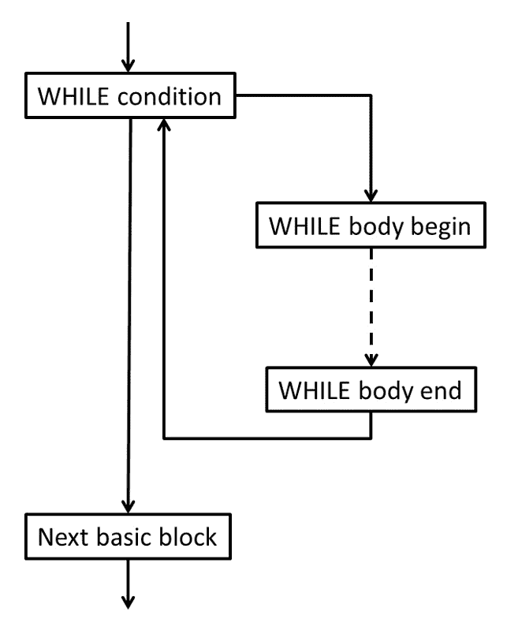

# IR 代码生成基础

在为您的编程语言创建了一个装饰过的**抽象语法树**（**AST**）之后，接下来的任务是从它生成 LLVM IR 代码。LLVM IR 代码类似于具有人类可读表示的三地址代码。因此，我们需要一种系统性的方法来将诸如控制结构等语言概念转换为 LLVM IR 的低级形式。

在本章中，您将了解 LLVM IR 的基础知识以及如何从 AST 生成控制流结构的 IR。您还将学习如何使用现代算法生成 **静态单赋值**（**SSA**）形式的 LLVM IR。最后，您将学习如何生成汇编文本和目标代码。

本章将涵盖以下主题：

+   从 AST 生成 IR

+   使用 AST 编号生成 SSA 形式的 IR 代码

+   设置模块和驱动程序

到本章结束时，您将了解如何为您的编程语言创建代码生成器以及如何将其集成到您的编译器中。

# 从 AST 生成 IR

LLVM 代码生成器接受一个以 LLVM IR 表示的模块作为输入，并将其转换为目标代码或汇编文本。我们需要将 AST 表示转换为 IR。为了实现 IR 代码生成器，我们首先将查看一个简单的示例，然后开发代码生成器所需的类。完整的实现将分为三个类：

+   `CodeGenerator`

+   `CGModule`

+   `CGProcedure`

`CodeGenerator` 类是编译器驱动程序使用的通用接口。`CGModule` 和 `CGProcedure` 类包含生成编译单元和单个函数的 IR 代码所需的状态。

我们将首先查看 Clang 生成的 IR。

## 理解 IR 代码

在生成 IR 代码之前，了解 IR 语言的主要元素是很有帮助的。在 *第二章*，*编译器的结构*中，我们简要地了解了 IR。了解 IR 的一个简单方法是通过研究 `clang` 的输出。例如，将实现计算两个数最大公约数的欧几里得算法的 C 源代码保存为 `gcd.c`：

```cpp

unsigned gcd(unsigned a, unsigned b) {
  if (b == 0)
    return a;
  while (b != 0) {
    unsigned t = a % b;
    a = b;
    b = t;
  }
  return a;
}
```

然后，您可以使用 `clang` 和以下命令创建 `gcd.ll` IR 文件：

```cpp

$ clang --target=aarch64-linux-gnu -O1 -S -emit-llvm gcd.c
```

IR 代码不是目标无关的，尽管它通常看起来是这样。前面的命令编译了 Linux 上 ARM 64 位 CPU 的源文件。`-S` 选项指示 `clang` 输出一个汇编文件，通过添加 `-emit-llvm` 的额外指定，创建了一个 IR 文件。使用 `-O1` 优化级别可以得到易于阅读的 IR 代码。Clang 有许多其他选项，所有这些都在 [`clang.llvm.org/docs/ClangCommandLineReference.html`](https://clang.llvm.org/docs/ClangCommandLineReference.html) 的命令行参数参考中有记录。让我们看一下生成的文件，并了解 C 源代码如何映射到 LLVM IR。

C 文件被翻译成 `i`，后面跟着位数。例如，64 位整数类型写作 `i64`。最基本的浮点类型是 `float` 和 `double`，分别表示 32 位和 64 位的 IEEE 浮点类型。还可以创建聚合类型，如向量、数组和结构体。

这里是 LLVM IR 的样子。在文件顶部，定义了一些基本属性：

```cpp

; ModuleID = 'gcd.c'
source_filename = "gcd.c"
target datalayout = "e-m:e-i8:8:32-i16:16:32-i64:64-i128:128-n32:64-S128"
target triple = "aarch64-unknown-linux-gnu"
```

第一行是一个注释，告诉你使用了哪个模块标识符。在下一行中，指定了源文件的文件名。使用 `clang` 时，两者相同。

`target datalayout` 字符串建立了一些基本属性。不同的部分由 `-` 分隔。以下信息包括：

+   小写的 `e` 表示内存中的字节使用小端模式存储。要指定大端模式，必须使用大写的 `E`。

+   `M:` 指定了应用于符号的名称修饰。在这里，`m:e` 表示使用 ELF 名称修饰。

+   `iN:A:P` 形式的条目，如 `i8:8:32`，指定了数据对齐方式，以位为单位。第一个数字是 ABI 所需的对齐方式，第二个数字是首选对齐方式。对于字节（`i8`），ABI 对齐是 1 字节（`8`），首选对齐是 4 字节（`32`）。

+   `n` 指定了哪些本地寄存器大小可用。`n32:64` 表示原生支持 32 位和 64 位宽整数。

+   `S` 指定了栈的对齐方式，再次以位为单位。`S128` 表示栈保持 16 字节对齐。

注意

提供的目标数据布局必须与后端期望的相匹配。它的目的是将捕获的信息传达给与目标无关的优化过程。例如，优化过程可以查询数据布局以获取指针的大小和对齐方式。然而，在数据布局中更改指针的大小不会改变后端的代码生成。

目标数据布局提供了更多信息。你可以在参考手册中找到更多信息，手册地址为 [`llvm.org/docs/LangRef.html#data-layout`](https://llvm.org/docs/LangRef.html#data-layout)。

最后，`target triple` 字符串指定了我们正在为其编译的架构。这反映了我们在命令行上给出的信息。三元组是一个配置字符串，通常由 CPU 架构、供应商和操作系统组成。经常还会添加更多关于环境的信息。例如，`x86_64-pc-win32` 三元组用于在 64 位 X86 CPU 上运行的 Windows 系统。`x86_64` 是 CPU 架构，`pc` 是一个通用的供应商，`win32` 是操作系统。这些部分由连字符连接。在 ARMv8 CPU 上运行的 Linux 系统使用 `aarch64-unknown-linux-gnu` 作为其三元组。`aarch64` 是 CPU 架构，操作系统是运行在 `gnu` 环境下的 `linux`。对于基于 Linux 的系统，实际上没有真正的供应商，所以这部分是 `unknown`。对于特定目的不重要或不为人知的部分通常会被省略：`aarch64-linux-gnu` 三元组描述了相同的 Linux 系统。

接下来，在 IR 文件中定义了 `gcd` 函数：

```cpp

define i32 @gcd(i32 %a, i32 %b) {
```

这与 C 文件中的函数签名相似。`unsigned` 数据类型被转换为 32 位整数类型，`i32`。函数名前缀为 `@`，参数名前缀为 `%`。函数体被大括号包围。函数体的代码如下：

```cpp

entry:
  %cmp = icmp eq i32 %b, 0
  br i1 %cmp, label %return, label %while.body
```

IR 代码被组织成所谓的 `entry`。该块中的代码很简单：第一条指令比较 `%b` 参数与 `0`。第二条指令在条件为 `true` 时跳转到 `return` 标签，在条件为 `false` 时跳转到 `while.body` 标签。

IR 代码的另一个特点是它位于 `%cmp` 中。然后使用这个寄存器，但从未再次写入。常量传播和公共子表达式消除等优化与 SSA 形式配合得很好，并且所有现代编译器都在使用它。

SSA

SSA 形式是在 1980 年代末开发的。从那时起，它被广泛用于编译器，因为它简化了数据流分析和优化。例如，如果 IR 是 SSA 形式，那么在循环内识别公共子表达式会变得容易得多。SSA 的一个基本特性是它建立了 `def-use` 和 `use-def` 链：对于单个定义，你知道所有的使用（`def-use`），对于每个使用，你知道唯一的定义（`use-def`）。这种知识被大量使用，例如在常量传播中：如果一个定义被确定为常量，那么这个值的所有使用都可以轻松地替换为那个常量值。

为了构建 SSA 形式，Cytron 等人于 1989 年提出的算法非常流行，并且也被用于 LLVM 实现。也开发出了其他算法。一个早期的观察是，如果源语言没有 `goto` 语句，这些算法会变得更简单。

在 F. Rastello 和 F. B. Tichadou 所著的《基于 SSA 的编译器设计》一书中可以找到对 SSA 的深入探讨，Springer 2022 年出版。

下一个基本块是 `while` 循环的主体：

```cpp

while.body:
  %b.loop = phi i32 [ %rem, %while.body ],
                       [ %b, %entry ]
  %a.loop = phi i32 [ %b.loop, %while.body ],
                       [ %a, %entry ]
  %rem = urem i32 %a.loop, %b.loop
  %cmp1 = icmp eq i32 %rem, 0
  br i1 %cmp1, label %return, label %while.body
```

在 `gcd` 循环内部，`a` 和 `b` 参数被分配了新的值。如果寄存器只能写入一次，那么这是不可能的。解决方案是使用特殊的 `phi` 指令。`phi` 指令有一个基本块列表和值作为参数。基本块表示从该基本块进入的边，值是来自该基本块的值。在运行时，`phi` 指令将之前执行的基本块的标签与参数列表中的标签进行比较。

指令的值是与标签关联的值。对于第一个 `phi` 指令，如果之前执行的基本块是 `while.body`，则值是 `%rem` 寄存器。如果 `entry` 是之前执行的基本块，则值是 `%b`。值是基本块开始时的值。`%b.loop` 寄存器从第一个 `phi` 指令获取值。在第二个 `phi` 指令的参数列表中使用相同的寄存器，但假设的值是它通过第一个 `phi` 指令更改之前的值。

在循环主体之后，必须选择返回值：

```cpp

return:
  %retval = phi i32 [ %a, %entry ],
                    [ %b.loop, %while.body ]
  ret i32 %retval
}
```

再次，使用 `phi` 指令来选择所需的值。`ret` 指令不仅结束这个基本块，而且在运行时也标志着这个函数的结束。它将返回值作为参数。

对 `phi` 指令的使用有一些限制。它们必须是基本块的第一条指令。第一个基本块是特殊的：它没有之前执行过的块。因此，它不能以 `phi` 指令开始。

LLVM IR 参考

我们只接触了 LLVM IR 的基础知识。请访问 [`llvm.org/docs/LangRef.html`](https://llvm.org/docs/LangRef.html) 中的 LLVM 语言参考手册以查找所有详细信息。

IR 代码本身看起来很像 C 和汇编语言的混合体。尽管这种风格很熟悉，但我们并不清楚如何轻松地从 AST 生成 IR 代码。特别是 `phi` 指令看起来很难生成。但别害怕——在下一节中，我们将实现一个简单的算法来完成这项工作！

## 了解加载和存储方法

LLVM 中所有的本地优化都基于这里显示的 SSA 形式。对于全局变量，使用内存引用。IR 语言知道加载和存储指令，用于获取和存储这些值。您也可以为局部变量使用此方法。这些指令不属于 SSA 形式，LLVM 知道如何将它们转换为所需的 SSA 形式。因此，您可以为每个局部变量分配内存槽，并使用加载和存储指令来更改它们的值。您只需要记住变量存储的内存槽的指针。`clang` 编译器使用这种方法。

让我们看看加载和存储的 IR 代码。再次编译 `gcd.c`，但这次不启用优化：

```cpp

$ clang --target=aarch64-linux-gnu -S -emit-llvm gcd.c
```

`gcd` 函数现在看起来不同了。这是第一个基本块：

```cpp

define i32 @gcd(i32, i32) {
  %3 = alloca i32, align 4
  %4 = alloca i32, align 4
  %5 = alloca i32, align 4
  %6 = alloca i32, align 4
  store i32 %0, ptr %4, align 4
  store i32 %1, ptr %5, align 4
  %7 = load i32, ptr %5, align 4
  %8 = icmp eq i32 %7, 0
  br i1 %8, label %9, label %11
```

现在的 IR 代码依赖于寄存器和标签的自动编号。参数的名称没有指定。隐含地，它们是 `%0` 和 `%1`。基本块没有标签，因此分配了 `2`。前几条指令为四个 32 位值分配内存。之后，`%0` 和 `%1` 参数存储在由寄存器 `%4` 和 `%5` 指向的内存槽中。为了比较 `%1` 与 `0`，显式地从内存槽中加载了值。使用这种方法，你不需要使用 `phi` 指令！相反，你从内存槽中加载一个值，对其进行计算，然后将新值存储回内存槽。下次你读取内存槽时，你会得到最后计算出的值。`gcd` 函数的所有其他基本块都遵循这个模式。

以这种方式使用加载和存储指令的优点是生成 IR 代码相对容易。缺点是你会生成大量的 IR 指令，LLVM 将在将基本块转换为 SSA 形式后的第一个优化步骤中通过 `mem2reg` 过滤器删除这些指令。因此，我们直接以 SSA 形式生成 IR 代码。

我们将开始通过将控制流映射到基本块来开发 IR 代码生成。

## 将控制流映射到基本块

基本块的概念是它是一个 *按顺序执行的线性指令序列*。基本块在开始处恰好有一个入口，并以一个终止指令结束，这是一个将控制流转移到另一个基本块的指令，例如分支指令、切换指令或返回指令。有关终止指令的完整列表，请参阅 [`llvm.org/docs/LangRef.html#terminator-instructions`](https://llvm.org/docs/LangRef.html#terminator-instructions)。基本块可以以 `phi` 指令开始，但在基本块内部不允许 `phi` 或分支指令。换句话说，你只能从第一个指令进入基本块，你只能从最后一个指令离开基本块，即终止指令。不可能从基本块内部的指令分支，也不可能从基本块中间分支到另一个基本块。请注意，使用 `call` 指令的简单函数调用可以在基本块内部发生。每个基本块恰好有一个标签，标记基本块的第一条指令。标签是分支指令的目标。你可以将分支视为两个基本块之间的有向边，从而形成 **控制流图**（**CFG**）。基本块可以有 **前驱** 和 **后继**。函数的第一个基本块在意义上是特殊的，不允许有前驱。

由于这些限制，源语言的控制语句，如 `WHILE` 和 `IF`，会产生多个基块。让我们看看 `WHILE` 语句。`WHILE` 语句的条件控制循环体或下一个语句是否执行。条件必须在它自己的基块中生成，因为它有两个前驱：

+   由 `WHILE` 语句前的语句产生的基块

+   从循环体末尾返回到条件的分支

同时也有两个后继：

+   循环体的开始

+   由 `WHILE` 语句后的语句产生的基块

循环体本身至少有一个基块：



图 4.1 – WHILE 语句的基块

IR 代码生成遵循这个结构。我们在 `CGProcedure` 类中存储当前基块的指针，并使用 `llvm::IRBuilder<>` 实例将指令插入到基块中。首先，我们创建基本块：

```cpp

void emitStmt(WhileStatement *Stmt) {
  llvm::BasicBlock *WhileCondBB = llvm::BasicBlock::Create(
      CGM.getLLVMCtx(), "while.cond", Fn);
  llvm::BasicBlock *WhileBodyBB = llvm::BasicBlock::Create(
      CGM.getLLVMCtx(), "while.body", Fn);
  llvm::BasicBlock *AfterWhileBB = llvm::BasicBlock::Create(
      CGM.getLLVMCtx(), "after.while", Fn);
```

`Fn` 变量表示当前函数，`getLLVMCtx()` 返回 LLVM 上下文。这两个都是在之后设置的。我们通过一个分支结束当前基块，该分支将持有条件：

```cpp

  Builder.CreateBr(WhileCondBB);
```

条件的基块变为新的当前基块。我们生成条件，并以条件分支结束该块：

```cpp

  setCurr(WhileCondBB);
  llvm::Value *Cond = emitExpr(Stmt->getCond());
  Builder.CreateCondBr(Cond, WhileBodyBB, AfterWhileBB);
```

接下来，我们生成循环体。最后，我们添加一个返回到条件基块的分支：

```cpp

  setCurr(WhileBodyBB);
  emit(Stmt->getWhileStmts());
  Builder.CreateBr(WhileCondBB);
```

这样，我们就生成了 `WHILE` 语句。现在我们已经生成了 `WhileCondBB` 和 `Curr` 基块，我们可以将它们封闭：

```cpp

  sealBlock(WhileCondBB);
  sealBlock(Curr);
```

`WHILE` 语句后的语句的空基块变为新的当前基块：

```cpp

  setCurr(AfterWhileBB);
}
```

按照这个模式，你可以为源语言中的每个语句创建一个 `emit()` 方法。

# 使用 AST 编号生成 SSA 形式的 IR 代码

要从 AST 生成 SSA 形式的 IR 代码，我们可以使用一种称为 **AST 编号** 的方法。基本思想是，对于每个基本块，我们存储在此基本块中写入的局部变量的当前值。

注意

实现基于 Braun 等人撰写的论文《简单且高效的静态单赋值形式构建》，发表于 2013 年国际编译器构造会议（CC 2013），Springer（见 http://individual.utoronto.ca/dfr/ece467/braun13.pdf）。在其呈现的形式中，它仅适用于具有结构化控制流的 IR 代码。该论文还描述了如果需要支持任意控制流（例如，`goto` 语句）所需的必要扩展。

虽然它很简单，但我们仍然需要几个步骤。我们首先介绍所需的数据结构，然后我们将学习如何读取和写入基本块本地的值。然后，我们将处理在多个基本块中使用的值，并通过优化创建的 `phi` 指令来结束。

## 定义用于存储值的数结构

我们使用 `BasicBlockDef` 结构体来保存单个块的信息：

```cpp

struct BasicBlockDef {
  llvm::DenseMap<Decl *, llvm::TrackingVH<llvm::Value>> Defs;
  // ...
};
```

`llvm::Value` 类表示 SSA 形式中的值。`Value` 类类似于计算结果的标签。它一旦创建，通常通过 IR 指令创建，然后使用。在优化过程中可能会发生各种变化。例如，如果优化器检测到 `%1` 和 `%2` 值始终相同，那么它可以替换 `%2` 的使用为 `%1`。这改变了标签，但没有改变计算。

为了意识到这样的变化，我们不能直接使用 `Value` 类。相反，我们需要一个值句柄。有不同的功能值句柄。为了跟踪替换，我们可以使用 `llvm::TrackingVH<>` 类。结果，`Defs` 成员将 AST（变量或形式参数）的声明映射到其当前值。现在，我们需要为每个基本块存储这些信息：

```cpp

llvm::DenseMap<llvm::BasicBlock *, BasicBlockDef> CurrentDef;
```

使用这种数据结构，我们现在能够处理局部值。

## 读取和写入基本块内的局部值

要在基本块中存储局部变量的当前值，我们将在映射中创建一个条目：

```cpp

void writeLocalVariable(llvm::BasicBlock *BB, Decl *Decl,
                        llvm::Value *Val) {
  CurrentDef[BB].Defs[Decl] = Val;
}
```

查找变量的值稍微复杂一些，因为值可能不在基本块中。在这种情况下，我们需要通过可能的递归搜索扩展搜索到前驱：

```cpp

llvm::Value *
readLocalVariable(llvm::BasicBlock *BB, Decl *Decl) {
  auto Val = CurrentDef[BB].Defs.find(Decl);
  if (Val != CurrentDef[BB].Defs.end())
    return Val->second;
  return readLocalVariableRecursive(BB, Decl);
}
```

真正的工作是搜索前驱，我们将在下一节中实现它。

## 在前驱块中搜索值

如果我们正在查看的当前基本块只有一个前驱，那么我们将在那里搜索变量的值。如果一个基本块有多个前驱，那么我们需要在这些所有块中搜索值并组合结果。为了说明这种情况，你可以查看上一节中 `WHILE` 语句条件的那个基本块。

这个基本块有两个前驱 - 一个是由 `WHILE` 语句之前的语句产生的，另一个是由 `WHILE` 循环体结束的分支产生的。在条件中使用的变量应该有一些初始值，并且很可能会在循环体中被更改。因此，我们需要收集这些定义并从中创建一个 `phi` 指令。由 `WHILE` 语句创建的基本块包含一个循环。

因为我们会递归地搜索前驱块，我们必须打破这个循环。为此，我们可以使用一个简单的技巧：我们可以插入一个空的 `phi` 指令，并将其记录为变量的当前值。如果我们再次在搜索中看到这个基本块，那么我们会看到变量有一个我们可以使用的值。搜索在这里停止。一旦我们收集了所有值，我们必须更新 `phi` 指令。

然而，我们仍然会面临一个问题。在查找时，基本块的所有前驱可能并不都是已知的。这怎么可能发生呢？看看`WHILE`语句的基本块的创建。循环条件的 IR 首先生成。然而，从体尾返回包含条件的那个基本块的分支只能在体 IR 生成后添加。这是因为这个基本块在之前是未知的。如果我们需要读取条件中变量的值，那么我们就陷入了困境，因为并非所有前驱都是已知的。

为了解决这个问题，我们必须做更多一点：

1.  首先，我们必须给基本块附加一个`Sealed`标志。

1.  然后，如果我们知道基本块的所有前驱，我们必须定义基本块为密封的。如果基本块未密封并且我们需要查找在此基本块中尚未定义的变量的值，那么我们必须插入一个空的`phi`指令并使用它作为值。

1.  我们还需要记住这个指令。如果块后来被密封，那么我们需要更新指令以使用真实值。为了实现这一点，我们必须向`struct BasicBlockDef`添加两个额外的成员：`IncompletePhis`映射，它记录了我们稍后需要更新的`phi`指令，以及`Sealed`标志，它表示基本块是否被密封：

    ```cpp

    llvm::DenseMap<llvm::PHINode *, Decl *> IncompletePhis;
    unsigned Sealed : 1;
    ```

1.  然后，可以按照本节开头讨论的方法实现该方法：

    ```cpp

    llvm::Value *CGProcedure::readLocalVariableRecursive(
        llvm::BasicBlock *BB, Decl *Decl) {
      llvm::Value *Val = nullptr;
      if (!CurrentDef[BB].Sealed) {
        llvm::PHINode *Phi = addEmptyPhi(BB, Decl);
        CurrentDef[BB].IncompletePhis[Phi] = Decl;
        Val = Phi;
      } else if (auto *PredBB = BB->getSinglePredecessor()) {
        Val = readLocalVariable(PredBB, Decl);
      } else {
        llvm::PHINode *Phi = addEmptyPhi(BB, Decl);
        writeLocalVariable(BB, Decl, Phi);
        Val = addPhiOperands(BB, Decl, Phi);
      }
      writeLocalVariable(BB, Decl, Val);
      return Val;
    }
    ```

1.  `addEmptyPhi()`方法在基本块的开头插入一个空的`phi`指令：

    ```cpp

    llvm::PHINode *
    CGProcedure::addEmptyPhi(llvm::BasicBlock *BB,
                             Decl *Decl) {
      return BB->empty()
                 ? llvm::PHINode::Create(mapType(Decl), 0,
                                         "", BB)
                 : llvm::PHINode::Create(mapType(Decl), 0,
                                         "", &BB->front());
    }
    ```

1.  要向`phi`指令添加缺失的操作数，首先，我们必须搜索基本块的所有前驱，并将操作数对值和基本块添加到`phi`指令中。然后，我们必须尝试优化指令：

    ```cpp

    llvm::Value *
    CGProcedure::addPhiOperands(llvm::BasicBlock *BB,
                                Decl *Decl,
                                llvm::PHINode *Phi) {
      for (auto *PredBB : llvm::predecessors(BB))
        Phi->addIncoming(readLocalVariable(PredBB, Decl),
                         PredBB);
      return optimizePhi(Phi);
    }
    ```

这个算法可能会生成不必要的`phi`指令。在下一节中，我们将实现一种优化这些指令的方法。

## 优化生成的`phi`指令

我们如何优化`phi`指令，为什么我们应该这样做？尽管 SSA 形式对许多优化有利，但`phi`指令通常不被算法解释，从而阻碍了整体的优化。因此，我们生成的`phi`指令越少，越好。让我们更仔细地看看：

1.  如果指令只有一个操作数或者所有操作数都有相同的值，那么我们用这个值替换指令。如果指令没有操作数，那么我们用特殊的`Undef`值替换指令。只有当指令有两个或更多不同的操作数时，我们才必须保留指令：

    ```cpp

    llvm::Value *
    CGProcedure::optimizePhi(llvm::PHINode *Phi) {
      llvm::Value *Same = nullptr;
      for (llvm::Value *V : Phi->incoming_values()) {
        if (V == Same || V == Phi)
          continue;
        if (Same && V != Same)
          return Phi;
        Same = V;
      }
      if (Same == nullptr)
        Same = llvm::UndefValue::get(Phi->getType());
    ```

1.  移除`phi`指令可能会导致其他`phi`指令中的优化机会。幸运的是，LLVM 跟踪用户和值的用法（这是在 SSA 定义中提到的`use-def`链）。我们必须搜索其他`phi`指令中值的所有用法，并尝试优化这些指令：

    ```cpp

      llvm::SmallVector<llvm::PHINode *, 8> CandidatePhis;
      for (llvm::Use &U : Phi->uses()) {
        if (auto *P =
                llvm::dyn_cast<llvm::PHINode>(U.getUser()))
          if (P != Phi)
            CandidatePhis.push_back(P);
      }
      Phi->replaceAllUsesWith(Same);
      Phi->eraseFromParent();
      for (auto *P : CandidatePhis)
        optimizePhi(P);
      return Same;
    }
    ```

如果我们愿意，我们可以进一步改进这个算法。我们不必总是迭代每个 `phi` 指令的值列表，我们可以选择并记住两个不同的值。然后，在 `optimizePhi` 函数中，我们可以检查这两个值是否仍然在 `phi` 指令的列表中。如果是这样，那么我们就知道没有什么可以优化的。但即使没有这个优化，这个算法运行得非常快，所以我们现在不会实现它。

我们几乎完成了。我们还没有做的事情是实现封闭基本块的运算。我们将在下一节中这样做。

## 封闭一个块

一旦我们知道一个块的所有前驱都已知，我们就可以封闭这个块。如果源语言只包含结构化语句，如 `tinylang`，那么确定可以封闭块的位置很容易。再次看看为 `WHILE` 语句生成的基块。

包含条件的基块在从主体末尾添加分支后可以封闭，因为这是最后一个缺失的前驱。要封闭一个块，我们可以简单地向不完整的 `phi` 指令添加缺失的操作数并设置标志：

```cpp

void CGProcedure::sealBlock(llvm::BasicBlock *BB) {
  for (auto PhiDecl : CurrentDef[BB].IncompletePhis) {
    addPhiOperands(BB, PhiDecl.second, PhiDecl.first);
  }
  CurrentDef[BB].IncompletePhis.clear();
  CurrentDef[BB].Sealed = true;
}
```

使用这些方法，我们现在可以生成表达式的 IR 代码。

## 为表达式创建 IR 代码

通常，你翻译表达式，如*第二章*《编译器的结构》中所示。唯一有趣的部分是如何访问变量。上一节处理了局部变量，但还有其他类型的变量我们可以考虑。让我们讨论我们需要做什么：

+   对于过程中的局部变量，我们使用上一节中的 `readLocalVariable()` 和 `writeLocalVariable()` 方法。

+   对于封装过程中的局部变量，我们需要指向封装过程框架的指针。这将在本章的后面处理。

+   对于全局变量，我们生成加载和存储指令。

+   对于形式参数，我们必须区分按值传递和按引用传递（`tinylang` 中的 `VAR` 参数）。按值传递的参数被视为局部变量，而按引用传递的参数被视为全局变量。

将所有这些放在一起，我们得到以下读取变量或形式参数的代码：

```cpp

llvm::Value *CGProcedure::readVariable(llvm::BasicBlock *BB,
                                       Decl *D) {
  if (auto *V = llvm::dyn_cast<VariableDeclaration>(D)) {
    if (V->getEnclosingDecl() == Proc)
      return readLocalVariable(BB, D);
    else if (V->getEnclosingDecl() ==
             CGM.getModuleDeclaration()) {
      return Builder.CreateLoad(mapType(D),
                                CGM.getGlobal(D));
    } else
      llvm::report_fatal_error(
          "Nested procedures not yet supported");
  } else if (auto *FP =
                 llvm::dyn_cast<FormalParameterDeclaration>(
                     D)) {
    if (FP->isVar()) {
      return Builder.CreateLoad(mapType(FP, false),
                                FormalParams[FP]);
    } else
      return readLocalVariable(BB, D);
  } else
    llvm::report_fatal_error("Unsupported declaration");
}
```

向变量或形式参数写入是对称的——我们只需要交换读取方法和写入方法，并使用 `store` 指令而不是 `load` 指令。

接下来，在为函数生成 IR 代码时应用这些函数。

## 生成函数的 IR 代码

大多数 IR 代码将存在于一个函数中。IR 代码中的函数类似于 C 语言中的函数。它在名称中指定了参数类型、返回值和其他属性。要调用不同编译单元中的函数，你需要声明该函数。这类似于 C 语言中的原型。如果你向函数中添加基本块，那么你就定义了该函数。我们将在接下来的几节中做所有这些，但首先，我们将讨论符号名称的可见性。

## 使用链接和名称混淆控制可见性

函数（以及全局变量）附有一个链接样式。通过链接样式，我们定义了符号名称的可见性以及当多个符号具有相同名称时应该发生什么。最基本的链接样式是 `private` 和 `external`。具有 `private` 链接的符号仅在当前编译单元中可见，而具有 `external` 链接的符号在全局范围内可用。

对于没有适当模块概念的编程语言，如 C，这已经足够了。有了模块，我们需要做更多。假设我们有一个名为 `Square` 的模块，它提供了一个 `Root()` 函数和一个 `Cube` 模块，它也提供了一个 `Root()` 函数。如果函数是私有的，那么就没有问题。函数获得名称 `Root` 和私有链接。如果函数是导出的，以便可以从其他模块调用它，那么情况就不同了。仅使用函数名称是不够的，因为这个名称不是唯一的。

解决方案是调整名称以使其全局唯一。这被称为名称 `Square.Root`，因为名称看起来像是一个明显的解决方案，但它可能导致汇编器出现问题，因为点号可能有特殊含义。我们可以在名称组件之间使用分隔符，而不是使用名称组件的长度作为前缀：`6Square4Root`。这不是 LLVM 的有效标识符，但我们可以通过在名称前加上 `_t`（代表 `tinylang`）来修复这个问题：`_t6Square4Root`。这样，我们可以为导出符号创建唯一的名称：

```cpp

std::string CGModule::mangleName(Decl *D) {
  std::string Mangled("_t");
  llvm::SmallVector<llvm::StringRef, 4> List;
  for (; D; D = D->getEnclosingDecl())
    List.push_back(D->getName());
  while (!List.empty()) {
    llvm::StringRef Name = List.pop_back_val();
    Mangled.append(
        llvm::Twine(Name.size()).concat(Name).str());
  }
  return Mangled;
}
```

如果你的源语言支持类型重载，那么你需要通过类型名称扩展此方案。例如，为了区分 `int root(int)` 和 `double root(double)` C++ 函数，必须将参数类型和返回值类型添加到函数名称中。

你还需要考虑生成的名称长度，因为一些链接器对长度有限制。在 C++中，嵌套命名空间和类可能导致名称变得相当长。在那里，C++定义了一种压缩方案，以避免重复名称组件。

接下来，我们将探讨如何处理参数。

## 将类型从 AST 描述转换为 LLVM 类型

函数的参数也需要考虑。首先，我们需要将源语言的类型映射到 LLVM 类型。由于 `tinylang` 目前只有两种类型，这很容易：

```cpp

llvm::Type *CGModule::convertType(TypeDeclaration *Ty) {
  if (Ty->getName() == "INTEGER")
    return Int64Ty;
  if (Ty->getName() == "BOOLEAN")
    return Int1Ty;
  llvm::report_fatal_error("Unsupported type");
}
```

`Int64Ty`、`Int1Ty`和`VoidTy`是类成员，它们持有`i64`、`i1`和`void` LLVM 类型的类型表示。

对于按引用传递的形式参数，这还不够。此参数的 LLVM 类型是指针。然而，当我们想要使用形式参数的值时，我们需要知道其底层类型。这由`HonorReference`标志控制，其默认值为`true`。我们泛化函数并考虑形式参数：

```cpp

llvm::Type *CGProcedure::mapType(Decl *Decl,
                                 bool HonorReference) {
  if (auto *FP = llvm::dyn_cast<FormalParameterDeclaration>(
          Decl)) {
    if (FP->isVar() && HonorReference)
      return llvm::PointerType::get(CGM.getLLVMCtx(),
                                    /*AddressSpace=*/0);
    return CGM.convertType(FP->getType());
  }
  if (auto *V = llvm::dyn_cast<VariableDeclaration>(Decl))
    return CGM.convertType(V->getType());
  return CGM.convertType(llvm::cast<TypeDeclaration>(Decl));
}
```

使用这些辅助工具，我们可以创建 LLVM IR 函数。

## 创建 LLVM IR 函数

要在 LLVM IR 中发射一个函数，需要一个函数类型，这类似于 C 中的原型。创建函数类型涉及映射类型，然后调用工厂方法创建函数类型：

```cpp

llvm::FunctionType *CGProcedure::createFunctionType(
    ProcedureDeclaration *Proc) {
  llvm::Type *ResultTy = CGM.VoidTy;
  if (Proc->getRetType()) {
    ResultTy = mapType(Proc->getRetType());
  }
  auto FormalParams = Proc->getFormalParams();
  llvm::SmallVector<llvm::Type *, 8> ParamTypes;
  for (auto FP : FormalParams) {
    llvm::Type *Ty = mapType(FP);
    ParamTypes.push_back(Ty);
  }
  return llvm::FunctionType::get(ResultTy, ParamTypes,
                                 /*IsVarArgs=*/false);
}
```

基于函数类型，我们也创建 LLVM 函数。这将函数类型与链接和混淆名称关联：

```cpp

llvm::Function *
CGProcedure::createFunction(ProcedureDeclaration *Proc,
                            llvm::FunctionType *FTy) {
  llvm::Function *Fn = llvm::Function::Create(
      Fty, llvm::GlobalValue::ExternalLinkage,
      CGM.mangleName(Proc), CGM.getModule());
```

`getModule()`方法返回当前 LLVM 模块，我们将在稍后设置它。

函数创建后，我们可以添加一些关于它的更多信息：

+   首先，我们可以给出参数的名称。这使得 IR 更易于阅读。

+   其次，我们可以向函数及其参数添加属性以指定一些特性。作为一个例子，我们将为按引用传递的参数执行此操作。

在 LLVM 级别，这些参数是指针。但从源语言设计来看，这些是非常受限的指针。类似于 C++中的引用，我们始终需要为`VAR`参数指定一个变量。因此，按照设计，我们知道这个指针永远不会为空，并且总是可解引用的，这意味着我们可以读取被指向的值而不会冒着引发一般保护故障的风险。此外，按照设计，这个指针不能被传递——特别是没有超出函数调用的指针副本。因此，这个指针被认为是未被捕获的。

`llvm::AttributeBuilder`类用于构建形式参数的属性集。要获取参数类型的存储大小，我们可以简单地查询数据布局对象：

```cpp

  for (auto [Idx, Arg] : llvm::enumerate(Fn->args())) {
    FormalParameterDeclaration *FP =
        Proc->getFormalParams()[Idx];
    if (FP->isVar()) {
      llvm::AttrBuilder Attr(CGM.getLLVMCtx());
      llvm::TypeSize Sz =
          CGM.getModule()->getDataLayout().getTypeStoreSize(
              CGM.convertType(FP->getType()));
      Attr.addDereferenceableAttr(Sz);
      Attr.addAttribute(llvm::Attribute::NoCapture);
      Arg.addAttrs(Attr);
    }
    Arg.setName(FP->getName());
  }
  return Fn;
}
```

这样，我们已经创建了 IR 函数。在下一节中，我们将函数主体的基本块添加到函数中。

## 发射函数体

几乎完成了函数 IR 代码的发射！我们只需要将这些部分组合起来以发射一个函数，包括其主体：

1.  给定`tinylang`中的过程声明，首先，我们将创建函数类型和函数：

    ```cpp

    void CGProcedure::run(ProcedureDeclaration *Proc) {
      this->Proc = Proc;
      Fty = createFunctionType(Proc);
      Fn = createFunction(Proc, Fty);
    ```

1.  接下来，我们将创建函数的第一个基本块并将其设置为当前块：

    ```cpp

      llvm::BasicBlock *BB = llvm::BasicBlock::Create(
          CGM.getLLVMCtx(), "entry", Fn);
      setCurr(BB);
    ```

1.  然后，我们必须遍历所有形式参数。为了正确处理 VAR 参数，我们需要初始化`FormalParams`成员（在`readVariable()`中使用）。与局部变量不同，形式参数在第一个基本块中有一个值，因此我们必须使这些值已知：

    ```cpp

      for (auto [Idx, Arg] : llvm::enumerate(Fn->args())) {
        FormalParameterDeclaration *FP =
            Proc->getFormalParams()[Idx];
        FormalParams[FP] = &Arg;
        writeLocalVariable(Curr, FP, &Arg);
      }
    ```

1.  在此设置之后，我们可以调用 `emit()` 方法来开始生成语句的 IR 代码：

    ```cpp

      auto Block = Proc->getStmts();
      emit(Proc->getStmts());
    ```

1.  在生成 IR 代码后的最后一个块可能尚未密封，因此我们现在必须调用 `sealBlock()`。`tinylang` 中的过程可能有一个隐式的返回值，因此我们还需要检查最后一个基本块是否有适当的终止符，如果没有，则添加一个：

    ```cpp

      if (!Curr->getTerminator()) {
        Builder.CreateRetVoid();
      }
      sealBlock(Curr);
    }
    ```

这样，我们就完成了函数的 IR 代码生成。然而，我们仍然需要创建一个 LLVM 模块，它将所有 IR 代码组合在一起。我们将在下一节中这样做。

# 设置模块和驱动程序

我们在一个 LLVM 模块中收集编译单元的所有函数和全局变量。为了简化 IR 生成过程，我们可以将前几节中的所有函数包装到一个代码生成器类中。为了得到一个可工作的编译器，我们还需要定义我们想要为其生成代码的目标架构，并添加生成代码的传递。我们将在本章和接下来的几章中实现这一点，从代码生成器开始。

## 将所有内容包装在代码生成器中

IR 模块是我们为编译单元生成的所有元素的括号。在全局级别，我们遍历模块级别的声明，创建全局变量，并调用过程的代码生成。`tinylang` 中的全局变量映射到 `llvm::GlobalValue` 类的实例。这种映射保存在 `Globals` 中，并可供过程的代码生成使用：

```cpp

void CGModule::run(ModuleDeclaration *Mod) {
  for (auto *Decl : Mod->getDecls()) {
    if (auto *Var =
            llvm::dyn_cast<VariableDeclaration>(Decl)) {
      // Create global variables
      auto *V = new llvm::GlobalVariable(
          *M, convertType(Var->getType()),
          /*isConstant=*/false,
          llvm::GlobalValue::PrivateLinkage, nullptr,
          mangleName(Var));
      Globals[Var] = V;
    } else if (auto *Proc =
                   llvm::dyn_cast<ProcedureDeclaration>(
                       Decl)) {
      CGProcedure CGP(*this);
      CGP.run(Proc);
    }
  }
}
```

该模块还持有 `LLVMContext` 类，并缓存最常用的 LLVM 类型。后者需要初始化，例如，对于 64 位整数类型：

```cpp

Int64Ty = llvm::Type::getInt64Ty(getLLVMCtx());
```

`CodeGenerator` 类初始化 LLVM IR 模块并调用模块的代码生成。最重要的是，这个类必须知道我们想要为哪个目标架构生成代码。这个信息通过 `llvm::TargetMachine` 类传递，该类在驱动程序中设置：

```cpp

std::unique_ptr<llvm::Module>
CodeGenerator::run(ModuleDeclaration *Mod,
                   std::string FileName) {
  std::unique_ptr<llvm::Module> M =
      std::make_unique<llvm::Module>(FileName, Ctx);
  M->setTargetTriple(TM->getTargetTriple().getTriple());
  M->setDataLayout(TM->createDataLayout());
  CGModule CGM(M.get());
  CGM.run(Mod);
  return M;
}
```

为了便于使用，我们还必须引入一个代码生成器的工厂方法：

```cpp

CodeGenerator *
CodeGenerator::create(llvm::LLVMContext &Ctx,
                      llvm::TargetMachine *TM) {
  return new CodeGenerator(Ctx, TM);
}
```

`CodeGenerator` 类提供了一个小的接口来创建 IR 代码，这对于在编译器驱动程序中使用是理想的。在我们将其集成之前，我们需要实现机器代码生成的支持。

## 初始化目标机器类

现在，只缺少目标机器。有了目标机器，我们定义了我们想要为其生成代码的 CPU 架构。对于每个 CPU，都有可用于影响代码生成过程的功能。例如，一个 CPU 架构家族的新 CPU 可以支持向量指令。通过功能，我们可以打开或关闭向量指令的使用。为了支持从命令行设置所有这些选项，LLVM 提供了一些支持代码。在 `Driver` 类中，我们可以添加以下 `include` 变量：

```cpp

#include "llvm/CodeGen/CommandFlags.h"
```

这个`include`变量将常见的命令行选项添加到我们的编译器驱动程序中。许多 LLVM 工具也使用这些命令行选项，这有利于为用户提供一个统一的接口。唯一缺少的是指定目标三元组的选项。由于这非常有用，我们将自己添加它：

```cpp

static llvm::cl::opt<std::string> MTriple(
    "mtriple",
    llvm::cl::desc("Override target triple for module"));
```

让我们创建目标机器：

1.  要显示错误消息，必须将应用程序的名称传递给函数：

    ```cpp

    llvm::TargetMachine *
    createTargetMachine(const char *Argv0) {
    ```

1.  首先，我们必须收集命令行提供的所有信息。这些是代码生成器的选项——即 CPU 的名称以及应该激活或禁用的可能特性，以及目标的三元组：

    ```cpp

      llvm::Triple Triple = llvm::Triple(
          !MTriple.empty()
              ? llvm::Triple::normalize(MTriple)
              : llvm::sys::getDefaultTargetTriple());
      llvm::TargetOptions TargetOptions =
          codegen::InitTargetOptionsFromCodeGenFlags(Triple);
      std::string CPUStr = codegen::getCPUStr();
      std::string FeatureStr = codegen::getFeaturesStr();
    ```

1.  然后，我们必须在目标注册表中查找目标。如果发生错误，我们将显示错误消息并退出。一个可能错误是用户指定的不支持的三元组：

    ```cpp

      std::string Error;
      const llvm::Target *Target =
          llvm::TargetRegistry::lookupTarget(
              codegen::getMArch(), Triple, Error);
      if (!Target) {
        llvm::WithColor::error(llvm::errs(), Argv0) << Error;
        return nullptr;
      }
    ```

1.  在`Target`类的帮助下，我们可以使用用户请求的所有已知选项来配置目标机器：

    ```cpp

      llvm::TargetMachine *TM = Target->createTargetMachine(
          Triple.getTriple(), CPUStr, FeatureStr,
          TargetOptions, std::optional<llvm::Reloc::Model>(
              codegen::getRelocModel()));
      return TM;
    }
    ```

使用目标机器实例，我们可以生成针对我们选择的 CPU 架构的 IR 代码。缺少的是将其翻译成汇编文本或生成目标代码文件。我们将在下一节中添加此支持。

## 输出汇编文本和目标代码

在 LLVM 中，IR 代码通过一系列的遍历运行。每个遍历执行单个任务，例如删除死代码。我们将在*第七章*，*优化 IR*中了解更多关于遍历的内容。输出汇编代码或目标文件也被实现为一个遍历。让我们添加基本支持它！

我们需要包含更多的 LLVM 头文件。首先，我们需要`llvm::legacy::PassManager`类来保存要输出到文件的代码的遍历。我们还想能够输出 LLVM IR 代码，因此我们还需要一个遍历来输出这些代码。最后，我们将使用`llvm:: ToolOutputFile`类来进行文件操作：

```cpp

#include "llvm/IR/IRPrintingPasses.h"
#include "llvm/IR/LegacyPassManager.h"
#include "llvm/MC/TargetRegistry.h"
#include "llvm/Pass.h"
#include "llvm/Support/ToolOutputFile.h"
```

还需要另一个命令行选项来输出 LLVM IR：

```cpp

static llvm::cl::opt<bool> EmitLLVM(
    "emit-llvm",
    llvm::cl::desc("Emit IR code instead of assembler"),
    llvm::cl::init(false));
```

最后，我们希望能够给输出文件命名：

```cpp

static llvm::cl::opt<std::string>
    OutputFilename("o",
                   llvm::cl::desc("Output filename"),
                   llvm::cl::value_desc("filename"));
```

新的`emit()`方法中的第一个任务是处理输出文件名，如果用户没有在命令行中提供。如果输入是从`stdin`读取的，表示使用减号`-`，则我们将结果输出到`stdout`。`ToolOutputFile`类知道如何处理特殊文件名`-`：

```cpp

bool emit(StringRef Argv0, llvm::Module *M,
          llvm::TargetMachine *TM,
          StringRef InputFilename) {
  CodeGenFileType FileType = codegen::getFileType();
  if (OutputFilename.empty()) {
    if (InputFilename == "-") {
      OutputFilename = "-";
    }
```

否则，我们将丢弃输入文件名的可能扩展名，并根据用户提供的命令行选项添加`.ll`、`.s`或`.o`作为扩展名。`FileType`选项在`llvm/CodeGen/CommandFlags.inc`头文件中定义，我们之前已经包含它。此选项不支持输出 IR 代码，因此我们添加了新的`–emit-llvm`选项，该选项仅在与其一起使用汇编文件类型时才有效：

```cpp

    else {
      if (InputFilename.endswith(".mod"))
        OutputFilename =
            InputFilename.drop_back(4).str();
      else
        OutputFilename = InputFilename.str();
      switch (FileType) {
      case CGFT_AssemblyFile:
        OutputFilename.append(EmitLLVM ? ".ll" : ".s");
        break;
      case CGFT_ObjectFile:
        OutputFilename.append(".o");
        break;
      case CGFT_Null:
        OutputFilename.append(".null");
        break;
      }
    }
  }
```

一些平台区分文本文件和二进制文件，因此我们必须在打开输出文件时提供正确的打开标志：

```cpp

  std::error_code EC;
  sys::fs::OpenFlags OpenFlags = sys::fs::OF_None;
  if (FileType == CGFT_AssemblyFile)
    OpenFlags |= sys::fs::OF_TextWithCRLF;
  auto Out = std::make_unique<llvm::ToolOutputFile>(
      OutputFilename, EC, OpenFlags);
  if (EC) {
    WithColor::error(llvm::errs(), Argv0)
        << EC.message() << '\n';
    return false;
  }
```

现在，我们可以向 `PassManager` 添加所需的传递。`TargetMachine` 类有一个实用方法，可以添加请求的类。因此，我们只需要检查用户是否请求输出 LLVM IR 代码：

```cpp

  legacy::PassManager PM;
  if (FileType == CGFT_AssemblyFile && EmitLLVM) {
    PM.add(createPrintModulePass(Out->os()));
  } else {
    if (TM->addPassesToEmitFile(PM, Out->os(), nullptr,
                                FileType)) {
      WithColor::error(llvm::errs(), Argv0)
          << "No support for file type\n";
      return false;
    }
  }
```

在完成所有这些准备工作后，生成文件简化为单个函数调用：

```cpp

  PM.run(*M);
```

`ToolOutputFile` 类会自动删除文件，除非我们明确请求保留它。这使得错误处理变得更容易，因为可能有很多地方需要处理错误，而如果一切顺利，只有一个地方会被访问。我们成功生成了代码，因此我们希望保留文件：

```cpp

  Out->keep();
```

最后，我们必须向调用者报告成功：

```cpp

  return true;
}
```

使用 `llvm::Module` 调用 `emit()` 方法，这是我们通过调用 `CodeGenerator` 类创建的，按照要求生成代码。

假设你将 `tinylang` 中的最大公约数算法存储在 `Gcd.mod` 文件中：

```cpp

MODULE Gcd;
PROCEDURE GCD(a, b: INTEGER) : INTEGER;
VAR t: INTEGER;
BEGIN
  IF b = 0 THEN
    RETURN a;
  END;
  WHILE b # 0 DO
    t := a MOD b;
    a := b;
    b := t;
  END;
  RETURN a;
END GCD;
END Gcd.
```

要将此转换为 `Gcd.o` 目标文件，请输入以下内容：

```cpp

$ tinylang --filetype=obj Gcd.mod
```

如果你想要直接在屏幕上检查生成的 IR 代码，请输入以下内容：

```cpp

$ tinylang --filetype=asm --emit-llvm -o - Gcd.mod
```

根据当前实现的状况，在 `tinylang` 中创建一个完整的程序是不可能的。然而，你可以使用一个名为 `callgcd.c` 的小型 C 程序来测试生成的目标文件。注意使用混淆名称来调用 `GCD` 函数：

```cpp

#include <stdio.h>
extern long _t3Gcd3GCD(long, long);
int main(int argc, char *argv[]) {
  printf(„gcd(25, 20) = %ld\n", _t3Gcd3GCD(25, 20));
  printf(„gcd(3, 5) = %ld\n", _t3Gcd3GCD(3, 5));
  printf(„gcd(21, 28) = %ld\n", _t3Gcd3GCD(21, 28));
  return 0;
}
```

要使用 `clang` 编译和运行整个应用程序，请输入以下内容：

```cpp

$ tinylang --filetype=obj Gcd.mod
$ clang callgcd.c Gcd.o -o gcd
$ gcd
```

让我们庆祝！在这个阶段，我们已经通过读取源语言并生成汇编代码或目标文件创建了一个完整的编译器。

# 摘要

在本章中，你学习了如何实现 LLVM IR 代码的代码生成器。基本块是重要的数据结构，它包含所有指令并表达分支。你学习了如何为源语言的控制语句创建基本块以及如何向基本块添加指令。你应用了一种现代算法来处理函数中的局部变量，从而减少了 IR 代码。编译器的目标是为目标生成汇编文本或目标文件，因此你也添加了一个简单的编译管道。有了这些知识，你将能够为你自己的语言编译器生成 LLVM IR 代码、汇编文本或目标代码。

在下一章中，你将学习如何处理聚合数据结构以及如何确保函数调用符合平台规则。
