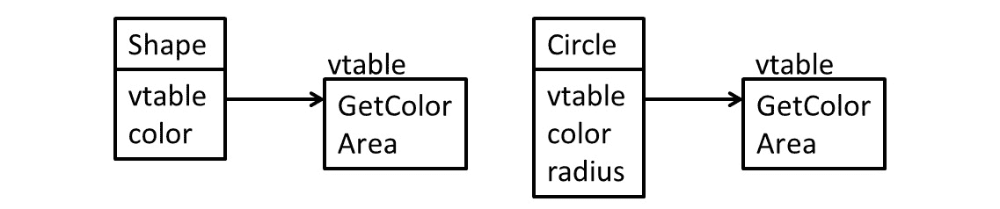
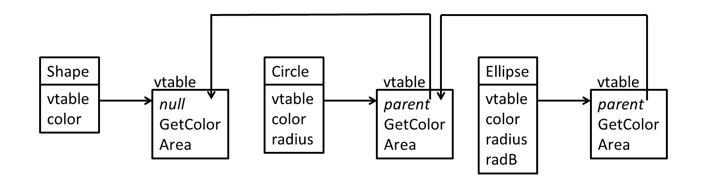
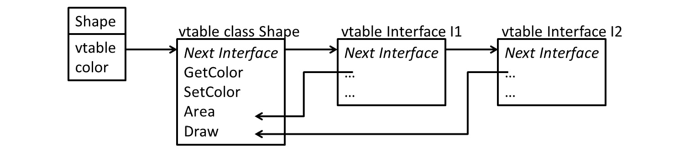
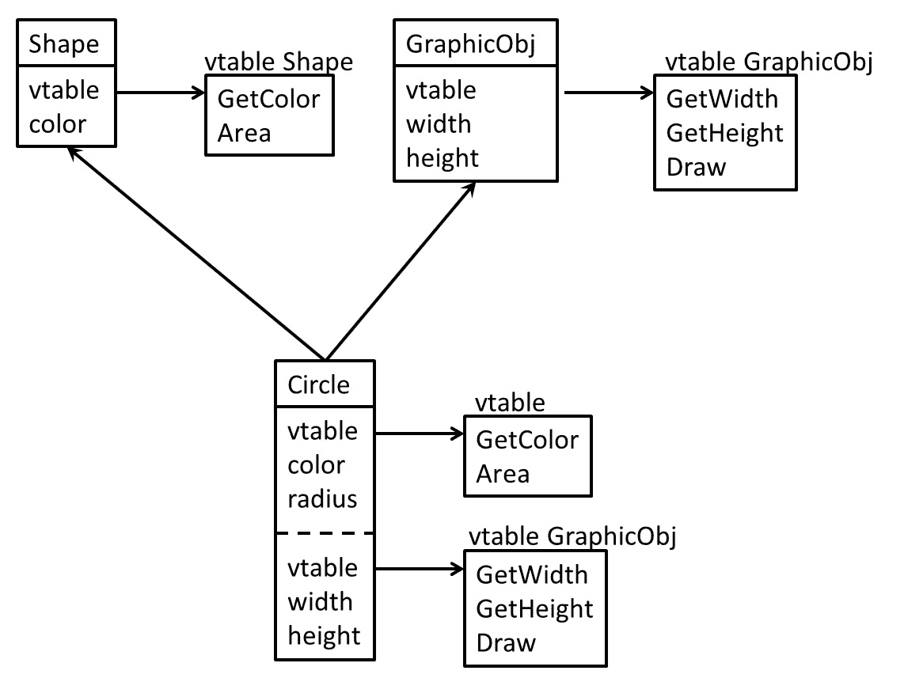
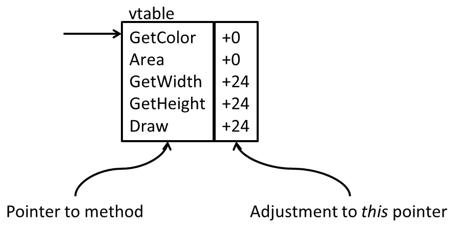

# 5

# 高级语言构造的 IR 生成

当前的高级语言通常使用聚合数据类型和 **面向对象编程** （**OOP**） 构造。LLVM IR 对聚合数据类型有一些支持，并且必须自行实现类等 OOP 构造。添加聚合类型会引发聚合类型参数如何传递的问题。不同的平台有不同的规则，这也在 IR 中得到体现。遵守调用约定也确保了可以调用系统函数。

在本章中，您将学习如何将聚合数据类型和指针转换为 LLVM IR，以及如何以系统兼容的方式向函数传递参数。您还将学习如何在 LLVM IR 中实现类和虚函数。

本章将涵盖以下主题：

+   使用数组、结构和指针

+   正确获取 **应用程序二进制接口** **(ABI)** 

+   为类和虚函数创建 IR 代码

到本章结束时，您将掌握创建 LLVM IR 用于聚合数据类型和面向对象（OOP）构造的知识。您还将了解如何根据平台的规则传递聚合数据类型。

# 技术要求

本章中使用的代码可以在 [`github.com/PacktPublishing/Learn-LLVM-17/tree/main/Chapter05`](https://github.com/PacktPublishing/Learn-LLVM-17/tree/main/Chapter05) 找到。

# 使用数组、结构和指针

对于几乎所有应用程序，基本类型如 `INTEGER` 是不够的。例如，为了表示数学对象，如矩阵或复数，您必须基于现有类型构造新的数据类型。这些新数据类型通常被称为 **聚合** 或 **复合**。

`tinylang` 类型 `ARRAY [10] OF INTEGER` 或 C 类型 `long[10]` 在 IR 中的表示如下：

```cpp

[10 x i64]
```

结构是不同类型的组合。在编程语言中，它们通常使用命名成员表示。例如，在 `tinylang` 中，结构被写成 `RECORD x: REAL; color: INTEGER; y: REAL; END;`，而在 C 中相同的结构是 `struct { float x; long color; float y; };`。在 LLVM IR 中，只列出类型名称：

```cpp

{ float, i64, float }
```

要访问成员，使用数值索引。就像数组一样，第一个元素的索引号为 `0`。

该结构的成员根据数据布局字符串中的规范在内存中排列。有关 LLVM 中数据布局字符串的更多信息，请参阅 *第四章*，*IR 代码生成基础*，其中描述了这些细节。

此外，如果需要，可以插入未使用的填充字节。如果您需要控制内存布局，则可以使用所有元素具有 1 字节对齐的打包结构。在 C 中，我们使用以下方式在结构中利用 `__packed__` 属性：

`struct __attribute__((__packed__)) { float x; long long color; float y; }`

同样，LLVM IR 中的语法略有不同，如下所示：

```cpp

<{ float, i64, float }>
```

将数组、结构和寄存器加载为单元。不可能像`%x[3]`那样引用数组值寄存器`%x`的单个元素。这是由于 SSA 形式，因为无法判断`%x[i]`和`%x[j]`是否引用相同的元素。相反，我们需要特殊的指令来提取和插入数组中的单个元素值。要读取第二个元素，我们使用以下指令：

```cpp

%el2 = extractvalue [10 x i64] %x, 1
```

我们也可以更新一个元素，例如第一个元素：

```cpp

%xnew = insertvalue [10 x i64] %x, i64 %el2, 0
```

这两条指令也适用于结构体。例如，要从寄存器`%pt`访问`color`成员，你可以编写以下内容：

```cpp

%color = extractvalue { float, float, i64 } %pt, 2
```

这两条指令都存在一个重要的限制：索引必须是常量。对于结构体，这很容易解释。索引数字只是名称的替代品，像 C 这样的语言没有动态计算结构体成员名称的概念。对于数组，这仅仅是因为它无法高效实现。当元素数量小且已知时，这两条指令在特定情况下都有价值。例如，复数可以被建模为一个包含两个浮点数的数组。传递这个数组是合理的，并且在计算过程中始终可以清楚地知道必须访问数组的哪个部分。

在前端的一般使用中，我们必须求助于内存指针。LLVM 中的所有全局值都表示为指针。让我们声明一个名为`@arr`的全局变量，它是一个包含八个`i64`元素的数组。这相当于 C 语言中的`long arr[8]`声明：

```cpp

@arr = common global [8 x i64] zeroinitializer
```

要访问数组的第二个元素，必须执行地址计算以确定索引元素的地址。然后可以从该地址加载值并将其放入一个名为`@second`的函数中，这看起来是这样的：

```cpp

define i64 @second() {
  %1 = load i64, ptr getelementptr inbounds ([8 x i64], ptr @arr, i64 0, i64 1)
  ret i64 %1
}
```

`getelementptr`指令是地址计算的工作马。因此，它需要更多的解释。第一个操作数`[8 x i64]`是指令操作的基类型。第二个操作数`ptr @arr`指定了基指针。请注意这里的微妙区别：我们声明了一个包含八个元素的数组，但由于所有全局值都被视为指针，所以我们有一个指向数组的指针。在 C 语法中，我们实际上与`long (*arr)[8]`一起工作！结果是，我们必须先取消引用指针，然后才能索引元素，例如 C 中的`arr[0][1]`。第三个操作数`i64 0`取消引用指针，第四个操作数`i64 1`是元素索引。这个计算的结果是索引元素的地址。请注意，此指令不会触及任何内存。

除了结构体之外，索引参数不需要是常量。因此，可以使用`getelementptr`指令在循环中检索数组的元素。在这里，结构体的处理方式不同：只能使用常量，并且类型必须是`i32`。

带着这些知识，数组可以很容易地从*第四章*，*IR 代码生成基础*中集成到代码生成器中。必须扩展`convertType()`方法来创建类型。如果`Arr`变量持有数组的类型表示符，并且假设数组中的元素数量是一个整数字面量，那么我们就可以在`convertType()`方法中添加以下内容来处理数组：

```cpp

 if (auto *ArrayTy =
                 llvm::dyn_cast<ArrayTypeDeclaration>(Ty)) {
    llvm::Type *Component =
        convertType(ArrayTy->getType());
    Expr *Nums = ArrayTy->getNums();
    uint64_t NumElements =
        llvm::cast<IntegerLiteral>(Nums)
            ->getValue()
            .getZExtValue();
    llvm::Type *T =
        llvm::ArrayType::get(Component, NumElements);
    // TypeCache is a mapping between the original
    // TypeDeclaration (Ty) and the current Type (T).
    return TypeCache[Ty] = T;
}
```

这种类型可以用来声明全局变量。对于局部变量，我们需要为数组分配内存。我们在过程的第一个基本块中这样做：

```cpp

  for (auto *D : Proc->getDecls()) {
    if (auto *Var =
            llvm::dyn_cast<VariableDeclaration>(D)) {
      llvm::Type *Ty = mapType(Var);
      if (Ty->isAggregateType()) {
        llvm::Value *Val = Builder.CreateAlloca(Ty);
        // The following method requires a BasicBlock (Curr),
        // a VariableDeclation (Var), and an llvm::Value (Val)
        writeLocalVariable(Curr, Var, Val);
      }
    }
  }
```

要读取和写入一个元素，我们必须生成`getelementptr`指令。这个指令被添加到`emitExpr()`（读取值）和`emitStmt()`（写入值）方法中。为了读取数组中的一个元素，首先读取变量的值。然后，处理变量的选择器。对于每个索引，计算表达式并存储值。基于这个列表，计算引用元素的地址并加载值：

```cpp

    auto &Selectors = Var->getSelectors();
    for (auto I = Selectors.begin(), E = Selectors.end();
         I != E; ) {
      if (auto *IdxSel =
              llvm::dyn_cast<IndexSelector>(*I)) {
        llvm::SmallVector<llvm::Value *, 4> IdxList;
        while (I != E) {
          if (auto *Sel =
                  llvm::dyn_cast<IndexSelector>(*I)) {
            IdxList.push_back(emitExpr(Sel->getIndex()));
            ++I;
          } else
            break;
        }
        Val = Builder.CreateInBoundsGEP(Val->getType(), Val, IdxList);
        Val = Builder.CreateLoad(
            Val->getType(), Val);
      }
      // . . . Check for additional selectors and handle
      // appropriately by generating getelementptr and load.
      else {
        llvm::report_fatal_error("Unsupported selector");
      }
    }
```

向数组元素写入使用相同的代码，只是不生成`load`指令。相反，你使用指针作为`store`指令的目标。对于记录，使用类似的方法。记录成员的选择器包含常量字段索引，命名为`Idx`。你将这个常量转换为常量 LLVM 值：

```cpp

llvm::Value *FieldIdx = llvm::ConstantInt::get(Int32Ty, Idx);
```

然后，你可以在`Builder.CreateGEP()`方法中使用值，就像数组一样。

现在，你应该知道如何将聚合数据类型转换为 LLVM IR。以系统兼容的方式传递这些类型的值需要一些注意，你将在下一节中学习如何正确实现它。

# 正确获取应用程序二进制接口

在将数组和记录添加到代码生成器后，你可以注意到有时生成的代码并不像预期那样执行。原因是到目前为止，我们已经忽略了平台的调用约定。每个平台都定义了自己的一套规则，即一个函数如何在同一个程序或库中调用另一个函数。这些规则总结在 ABI 文档中。典型信息包括以下内容：

+   是否使用机器寄存器进行参数传递？如果是，是哪些？

+   如何将聚合类型（如数组和结构体）传递给函数？

+   如何处理返回值？

在使用上存在很大的差异。在某些平台上，聚合类型总是间接传递，这意味着聚合类型的一个副本被放置在栈上，并且只传递副本的指针作为参数。在其他平台上，小聚合类型（例如 128 位或 256 位宽）在寄存器中传递，并且只有超过这个阈值才使用间接参数传递。一些平台还使用浮点数和向量寄存器进行参数传递，而其他平台则要求浮点值在整数寄存器中传递。

当然，这些都是有趣的底层内容。不幸的是，它们会泄露到 LLVM IR 中。起初，这让人惊讶。毕竟，我们在 LLVM IR 中定义了函数所有参数的类型！结果证明这还不够。为了理解这一点，让我们考虑复数。一些语言有内置的复数数据类型。例如，C99 有 `float _Complex`（以及其他类型）。较老的 C 版本没有复数类型，但你可以轻松地定义 `struct Complex { float re, im; }` 并在这个类型上创建算术运算。这两种类型都可以映射到 `{ float, float }` LLVM IR 类型。

如果 ABI 现在声明内置复数类型的值是通过两个浮点寄存器传递的，但用户定义的聚合类型总是通过间接方式传递，那么函数中给出的信息对于 LLVM 来说不足以决定如何传递这个特定的参数。不幸的后果是我们需要向 LLVM 提供更多信息，并且这些信息高度依赖于 ABI。 

有两种方式可以将此信息指定给 LLVM：参数属性和类型重写。你需要使用哪种方式取决于目标平台和代码生成器。最常用的参数属性如下：

+   `inreg` 指定参数是通过寄存器传递的

+   `byval` 指定参数是通过值传递的。参数必须是指针类型。对指向的数据创建一个隐藏的副本，并将这个指针传递给被调用的函数。

+   `zeroext` 和 `signext` 指定传递的整数值应该是零扩展或符号扩展。

+   `sret` 指定此参数包含指向内存的指针，该内存用于从函数返回聚合类型。

虽然所有代码生成器都支持 `zeroext`、`signext` 和 `sret` 属性，但只有一些支持 `inreg` 和 `byval`。可以使用 `addAttr()` 方法将属性添加到函数的参数上。例如，要将 `inreg` 属性设置在参数 `Arg` 上，你可以调用以下代码：

```cpp

Arg->addAttr(llvm::Attribute::InReg);
```

要设置多个属性，可以使用 `llvm::AttrBuilder` 类。

提供额外信息的另一种方式是使用类型重写。使用这种方法，你可以伪装原始类型。你可以做以下操作：

1.  分割参数。例如，你不必传递一个复数参数，而是可以传递两个浮点参数。

1.  将参数转换为不同的表示，例如通过整数寄存器传递浮点值。

要在不改变值位的情况下在类型之间进行转换，你使用 `bitcast` 指令。`bitcast` 指令可以操作简单数据类型，如整数和浮点值。当浮点值通过整数寄存器传递时，浮点值必须转换为整数。在 LLVM 中，32 位浮点值表示为 `float`，32 位位整数表示为 `i32`。浮点值可以按以下方式转换为整数：

```cpp

%intconv = bitcast float %fp to i32
```

此外，`bitcast` 指令要求两种类型具有相同的大小。

向参数添加属性或更改类型并不复杂。但你怎么知道你需要实现什么？首先，你应该了解目标平台使用的调用约定。例如，Linux 上的 ELF ABI 为每个支持的 CPU 平台进行了文档记录，因此你可以查阅文档并让自己熟悉它。

还有一些关于 LLVM 代码生成器要求的文档。信息来源是 clang 实现，你可以在 [`github.com/llvm/llvm-project/blob/main/clang/lib/CodeGen/TargetInfo.cpp`](https://github.com/llvm/llvm-project/blob/main/clang/lib/CodeGen/TargetInfo.cpp) 找到。这个单独的文件包含了所有支持平台的所有 ABI 特定操作，并且也是收集所有信息的地方。

在本节中，你学习了如何生成符合平台 ABI 的函数调用 IR。下一节将介绍创建类和虚拟函数 IR 的不同方法。

# 为类和虚拟函数创建 IR 代码

许多现代编程语言通过类支持面向对象。**类**是一种高级语言构造，在本节中，我们将探讨如何将类构造映射到 LLVM IR。

## 实现单继承

类是数据和方法的集合。一个类可以继承自另一个类，可能添加更多的数据字段和方法，或者覆盖现有的虚拟方法。让我们用 Oberon-2 中的类来举例说明，Oberon-2 也是一个很好的 `tinylang` 模型。一个 `Shape` 类定义了一个具有颜色和面积的抽象形状：

```cpp

TYPE Shape = RECORD
               color: INTEGER;
               PROCEDURE (VAR s: Shape) GetColor(): INTEGER;
               PROCEDURE (VAR s: Shape) Area(): REAL;
             END;
```

`GetColor` 方法只返回颜色编号：

```cpp

PROCEDURE (VAR s: Shape) GetColor(): INTEGER;
BEGIN RETURN s.color; END GetColor;
```

抽象形状的面积无法计算，因此这是一个抽象方法：

```cpp

PROCEDURE (VAR s: Shape) Area(): REAL;
BEGIN HALT; END;
```

`Shape` 类型可以扩展以表示 `Circle` 类：

```cpp

TYPE Circle = RECORD (Shape)
                radius: REAL;
                PROCEDURE (VAR s: Circle) Area(): REAL;
              END;
```

对于圆形，面积可以计算：

```cpp

PROCEDURE (VAR s: Circle) Area(): REAL;
BEGIN RETURN 2 * radius * radius; END;
```

类型也可以在运行时查询。如果形状是类型为 `Shape` 的变量，那么我们可以这样进行类型测试：

```cpp

IF shape IS Circle THEN (* … *) END;
```

除了不同的语法之外，这和 C++ 中的用法非常相似。与 C++ 的一个显著区别是，Oberon-2 语法使隐式的 `this` 指针显式化，称其为方法的接收者。

需要解决的基本问题是如何在内存中布局一个类以及如何实现方法的动态调用和运行时类型检查。对于内存布局来说，这相当简单。`Shape`类只有一个数据成员，我们可以将其映射到相应的 LLVM 结构类型：

```cpp

@Shape = type { i64 }
```

`Circle`类添加了另一个数据成员。解决方案是在末尾追加新的数据成员：

```cpp

@Circle = type { i64, float }
```

原因在于一个类可以有多个子类。采用这种策略，公共基类的数据成员总是具有相同的内存偏移量，并且使用相同的索引通过`getelementptr`指令访问字段。

为了实现方法的动态调用，我们必须进一步扩展 LLVM 结构。如果在一个`Shape`对象上调用`Area()`函数，则调用抽象方法，导致应用程序停止。如果在一个`Circle`对象上调用，则调用相应的计算圆面积的函数。另一方面，`GetColor()`函数可以用于两个类的对象。

实现这一点的基本思路是将一个与函数指针关联的表与每个对象关联起来。在这里，表将有两个条目：一个用于`GetColor()`方法，一个用于`Area()`函数。`Shape`类和`Circle`类各自都有一个这样的表。这些表在`Area()`函数的条目上有所不同，它根据对象的类型调用不同的代码。这个表被称为**虚方法表**，通常缩写为**vtable**。

vtable 本身并没有什么用处。我们必须将其与一个对象连接起来。为此，我们总是在结构中添加一个指向 vtable 的指针作为第一个数据成员。在 LLVM 级别，这就是`@Shape`类型变成的样子：

```cpp

@Shape = type { ptr, i64 }
```

`@Circle`类型也被相应地扩展。

结果的内存结构如*图 5.1*所示。1*：



图 5.1 – 类和虚方法表的内存布局

在 LLVM IR 方面，`Shape`类的 vtable 可以表示如下，其中两个指针分别对应于*图 5.1*中表示的`GetColor()`和`GetArea()`方法。1*：

`@ShapeVTable = constant { ptr, ptr } { GetColor(), Area() }`

此外，LLVM 没有空指针。而是使用字节指针。随着隐藏的`vtable`字段的引入，现在还需要有一种初始化它的方法。在 C++中，这是调用构造函数的一部分。在 Oberon-2 中，字段在内存分配时自动初始化。

方法动态调用的执行步骤如下：

1.  通过`getelementptr`指令计算 vtable 指针的偏移量。

1.  加载 vtable 的指针。

1.  计算 vtable 中函数的偏移量。

1.  加载函数指针。

1.  通过`call`指令通过指针间接调用函数。

我们也可以在 LLVM IR 中可视化对虚拟方法的动态调用，例如`Area()`。首先，我们从`Shape`类的指定位置加载一个指针。下面的加载表示加载`Shape`的实际 vtable 的指针：

```cpp

  // Load a pointer from the corresponding location.
  %ptrToShapeObj = load ptr, ...
  // Load the first element of the Shape class.
  %vtable = load ptr, ptr %ptrToShapeObj, align 8
```

然后，使用`getelementptr`获取调用`Area()`方法的偏移量：

```cpp

%offsetToArea = getelementptr inbounds ptr, ptr %vtable, i64 1
```

然后，我们加载`Area()`函数的指针：

```cpp

%ptrToAreaFunction = load ptr, ptr %offsetToArea, align 8
```

最后，通过指针调用`Area()`函数，与之前突出显示的一般步骤相似：

```cpp

  %funcCall = call noundef float %ptrToAreaFunction(ptr noundef nonnull align 8 dereferenceable(12) %ptrToShapeObj)
```

如我们所见，即使在单继承的情况下，生成的 LLVM IR 看起来也可能非常冗长。尽管生成动态方法调用的通用过程听起来不是很高效，但大多数 CPU 架构只需两条指令就可以执行这个动态调用。

此外，要将函数转换为方法，需要对象的引用。这是通过将数据指针作为方法的第一个参数传递来实现的。在 Oberon-2 中，这是显式的接收者。在类似于 C++的语言中，这是隐式的`this`指针。

使用 vtable，我们为每个类在内存中有一个唯一的地址。这也有助于*运行时类型测试*吗？答案是，它只以有限的方式有帮助。为了说明问题，让我们通过一个继承自`Circle`类的`Ellipse`类扩展类层次结构。这在数学意义上不是经典的概念。

如果我们有一个`shape`变量，其类型为`Shape`，那么我们可以将`shape IS Circle`类型测试实现为比较存储在`shape`变量中的 vtable 指针与`Circle`类的 vtable 指针。这种比较只有在`shape`具有确切的`Circle`类型时才会返回 true。然而，如果`shape`确实是`Ellipse`类型，那么即使`Ellipse`类型的对象可以在只需要`Circle`类型对象的所有地方使用，比较也会返回 false。

显然，我们需要做更多。解决方案是扩展虚拟方法表以包含运行时类型信息。你需要存储多少信息取决于源语言。为了支持运行时类型检查，存储基类 vtable 的指针就足够了，它看起来就像*图 5.2*所示：



图 5.2 – 支持简单类型测试的类和 vtable 布局

如果测试如前所述失败，则测试会使用基类的 vtable 指针重复进行。这会一直重复，直到测试返回 true，或者如果没有基类，则返回 false。与调用动态函数相比，类型测试是一个昂贵的操作，因为在最坏的情况下，继承层次结构会遍历到根类。

如果你知道整个类层次结构，那么可以采取一种有效的方法：以深度优先的顺序给类层次结构中的每个成员编号。然后，类型测试变成与数字或区间的比较，这可以在常数时间内完成。实际上，这正是我们在上一章中学到的 LLVM 自己的运行时类型测试的方法。

将运行时类型信息与虚表结合是一个设计决策，要么是由源语言强制规定的，要么只是作为一个实现细节。例如，如果你需要详细的运行时类型信息，因为源语言支持运行时反射，并且你有没有虚表的数据类型，那么将两者结合不是一个好主意。在 C++中，这种结合导致了一个事实，即具有虚函数（因此没有虚表）的类没有附加的运行时类型数据。

通常，编程语言支持接口，这些接口是一系列虚拟方法。接口很重要，因为它们增加了一个有用的抽象。我们将在下一节中探讨接口的可能实现。

## 使用接口扩展单继承

类似于**Java**这样的语言支持接口。接口是一系列抽象方法的集合，相当于一个没有数据成员且只定义了抽象方法的基本类。接口提出了一个有趣的问题，因为每个实现接口的类都可以在虚表中的不同位置有相应的方法。原因很简单，虚表中的函数指针顺序是从源语言中类定义中函数的顺序派生出来的。接口的定义独立于这一点，不同的顺序是常态。

由于接口中定义的方法可以有不同的顺序，我们将每个实现的接口的表附加到类上。对于接口的每个方法，这个表可以指定方法在虚表中的索引或虚表中存储的函数指针的副本。如果在接口上调用一个方法，那么将搜索接口的相应虚表，获取函数指针，并调用该方法。将两个`I1`和`I2`接口添加到`Shape`类中会导致以下布局：



图 5.3 – 接口虚表的布局

注意之处在于我们必须找到正确的虚表。我们可以使用类似于运行时类型测试的方法：我们可以通过接口虚表的列表进行线性搜索。我们可以给每个接口分配一个唯一的数字（例如，一个内存地址），并使用这个数字来识别这个虚表。这种方案的缺点很明显：通过接口调用方法比在类上调用相同的方法花费更多的时间。这个问题没有简单的缓解方法。

一个好的方法是使用哈希表来替换线性搜索。在编译时，一个类实现的接口是已知的。因此，我们可以构造一个完美的哈希函数，将接口编号映射到接口的虚函数表。构建接口的唯一标识符可能需要一个已知的唯一数字，因此内存无法帮助，但还有其他方法来计算一个唯一数字。如果源代码中的符号名称是唯一的，那么总是可以计算符号的加密哈希，如`MD5`，并使用哈希作为数字。这个计算发生在编译时，因此没有运行时成本。

结果比线性搜索快得多，并且只需要常数时间。尽管如此，它涉及到对数字的几个算术运算，并且比类类型的方法调用慢。

通常，接口也参与运行时类型测试，这使得列表搜索更长。当然，如果实现了哈希表方法，那么它也可以用于运行时类型测试。

一些语言允许有多个父类。这给实现带来了一些有趣的挑战，我们将在下一节中掌握这一点。

## 添加多重继承支持

多重继承增加了另一个挑战。如果一个类从两个或更多基类继承，那么我们需要以这种方式组合数据成员，使得它们仍然可以从方法中访问。就像在单继承的情况下，解决方案是附加所有数据成员，包括隐藏的虚函数表指针。

`Circle`类不仅是一个几何形状，也是一个图形对象。为了建模这一点，我们让`Circle`类继承自`Shape`类和`GraphicObj`类。在类布局中，`Shape`类的字段首先出现。然后，我们附加`GraphicObj`类的所有字段，包括隐藏的虚函数表指针。之后，我们添加`Circle`类的新数据成员，从而形成如*图 5.4*所示的总体结构。4*：



图 5.4 - 多重继承的类和虚函数表布局

这种方法有几个影响。现在可以有指向对象的多个指针。指向`Shape`或`Circle`类的指针指向对象的顶部，而指向`GraphicObj`类的指针指向这个对象的内部，指向嵌入的`GraphicObj`对象的开始。在比较指针时必须考虑到这一点。

调用虚方法也会受到影响。如果方法在 `GraphicObj` 类中定义，那么这个方法期望 `GraphicObj` 类的类布局。如果这个方法在 `Circle` 类中没有重写，那么有两种可能性。简单的情况是如果使用指向 `GraphicObj` 实例的指针进行方法调用：在这种情况下，你在 `GraphicObj` 类的 vtable 中查找方法的地址并调用该函数。更复杂的情况是如果你使用指向 `Circle` 类的指针调用该方法。同样，你可以在 `Circle` 类的 vtable 中查找方法的地址。被调用的方法期望 `this` 指针是一个 `GraphicObj` 类的实例，因此我们也必须调整该指针。我们可以这样做，因为我们知道 `GraphicObj` 类在 `Circle` 类中的偏移量。

如果在 `Circle` 类中重写了 `GrapicObj` 方法，那么如果通过 `Circle` 类的指针调用该方法，则不需要做任何特殊处理。然而，如果通过 `GraphicObj` 实例的指针调用该方法，那么我们需要进行另一个调整，因为该方法需要一个指向 `Circle` 实例的 `this` 指针。在编译时，我们无法计算这个调整，因为我们不知道这个 `GraphicObj` 实例是否是多重继承层次结构的一部分。为了解决这个问题，我们在调用方法之前，将需要调整的 `this` 指针与 vtable 中的每个函数指针一起存储，如图 *5**.5* 所示：



图 5.5 – 调整 this 指针的 vtable

现在的方法调用变为以下：

1.  在 vtable 中查找函数指针。

1.  调整 `this` 指针。

1.  调用方法。

这种方法也可以用于实现接口。由于接口只有方法，每个实现的接口都会为对象添加一个新的 vtable 指针。这更容易实现，并且可能更快，但它为每个对象实例增加了开销。

在最坏的情况下，如果你的类有一个 64 位数据字段，但实现了 10 个接口，那么你的对象在内存中需要 96 字节：8 字节用于类本身的 vtable 指针，8 字节用于数据成员，以及 10 * 8 字节用于每个接口的 vtable 指针。

为了支持对对象的有意义比较以及执行运行时类型测试，我们首先需要将对象指针规范化。如果我们向 vtable 添加一个额外的字段，包含对象顶部的偏移量，那么我们总能调整指针以指向实际的对象。在 `Circle` 类的 vtable 中，这个偏移量是 0，但在内嵌的 `GraphicObj` 类的 vtable 中不是。当然，是否需要实现这取决于源语言的语义。

LLVM 本身并不倾向于特殊实现面向对象特性。正如本节所示，我们可以使用可用的 LLVM 数据类型实现所有方法。此外，正如我们已经看到的单继承的 LLVM IR 示例，当涉及多重继承时，IR 可能会变得更加冗长。如果你想尝试一种新的方法，那么一个好的方式是首先用 C 语言做一个原型。所需的指针操作可以快速转换为 LLVM IR，但在高级语言中推理功能更容易。

通过本节获得的知识，你可以在自己的代码生成器中实现将编程语言中常见的所有面向对象构造转换为 LLVM IR。你有了如何表示单继承、具有接口的单继承或内存中的多重继承的食谱，以及如何实现类型测试和查找虚函数的方法，这些都是面向对象语言的核心概念。

# 摘要

在本章中，你学习了如何将聚合数据类型和指针转换为 LLVM IR 代码。你还了解了应用程序二进制接口的复杂性。最后，你学习了将类和虚函数转换为 LLVM IR 的不同方法。通过本章的知识，你将能够为大多数真实编程语言创建一个 LLVM IR 代码生成器。

在下一章中，你将学习一些关于 IR 生成的先进技术。异常处理在现代编程语言中相当常见，LLVM 对此也有一些支持。将类型信息附加到指针可以帮助进行某些优化，因此我们也会添加这一点。最后但同样重要的是，调试应用程序的能力对于许多开发者来说至关重要，因此我们还将添加调试元数据的生成到我们的代码生成器中。
