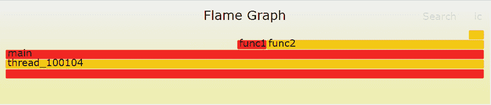
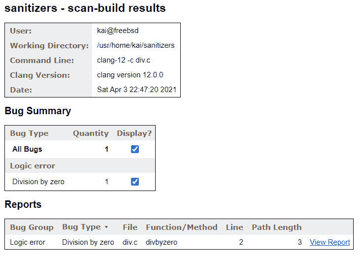
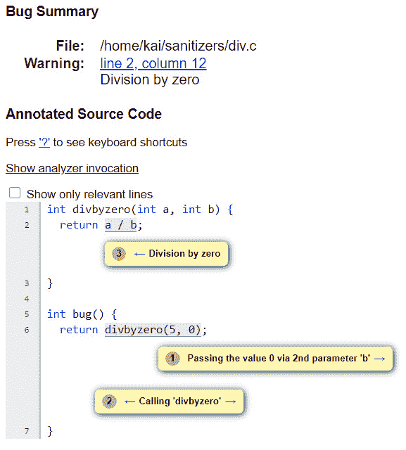

# 10

# 使用 LLVM 工具进行调试

LLVM 附带了一套工具，可以帮助您识别应用程序中的某些错误。所有这些工具都使用了 LLVM 和**clang**库。

在本章中，您将学习如何使用**清理器**对应用程序进行检测，以及如何使用最常用的清理器来识别广泛的各种错误，之后您将为应用程序实现模糊测试。这将帮助您识别通常在单元测试中找不到的错误。您还将学习如何识别应用程序中的性能瓶颈，运行**静态分析器**来识别编译器通常找不到的问题，并创建自己的基于 clang 的工具，在其中您可以扩展 clang 以添加新功能。

本章将涵盖以下主题：

+   使用清理器对应用程序进行检测

+   使用**libFuzzer**查找错误

+   使用**XRay**进行性能分析

+   使用**Clang** **静态分析器**检查源代码

+   创建自己的 clang 工具

到本章结束时，您将了解如何使用各种 LLVM 和 clang 工具来识别应用程序中的大量错误。您还将获得扩展 clang 以添加新功能的知识，例如强制命名约定或添加新的源分析。

# 技术要求

要在*使用 XRay 进行性能分析*部分创建**火焰图**，您需要安装来自[`github.com/brendangregg/FlameGraph`](https://github.com/brendangregg/FlameGraph)的脚本。某些系统，如**Fedora**和**FreeBSD**，提供了这些脚本的软件包，您也可以使用。

要在同一部分查看**Chrome 可视化**，您需要安装**Chrome**浏览器。您可以从[`www.google.com/chrome/`](https://www.google.com/chrome/)下载浏览器或使用系统的包管理器安装**Chrome**浏览器。

此外，为了通过`scan-build`脚本来运行静态分析器，您需要在**Fedora**和**Ubuntu**上安装`perl-core`软件包。

# 使用清理器对应用程序进行检测

LLVM 附带了一些`compiler-rt`项目。可以在 clang 中启用清理器，这使得它们非常易于使用。要构建`compiler-rt`项目，我们可以在构建 LLVM 时，简单地将`-DLLVM_ENABLE_RUNTIMES=compiler-rt` CMake 变量添加到初始 CMake 配置步骤。

在以下章节中，我们将查看`address`、`memory`和`thread`清理器。首先，我们将查看`address`清理器。

## 使用地址清理器检测内存访问问题

您可以使用`address`清理器来检测应用程序中不同类型的内存访问错误。这包括常见的错误，例如在释放动态分配的内存后使用它或在分配内存边界之外写入动态分配的内存。

当启用时，`address` sanitizers 会替换对`malloc()`和`free()`函数的调用，并使用自己的版本，并使用检查保护器对所有的内存访问进行仪器化。当然，这会给应用程序添加很多开销，你将在应用程序的测试阶段使用`address` sanitizers。如果你对实现细节感兴趣，你可以在`llvm/lib/Transforms/Instrumentation/AddressSanitizer.cpp`文件中找到 pass 的源代码，并在[`github.com/google/sanitizers/wiki/AddressSanitizerAlgorithm`](https://github.com/google/sanitizers/wiki/AddressSanitizerAlgorithm)找到实现的算法描述。

让我们运行一个简短的示例来展示`address` sanitizers 的能力！

以下示例应用程序，`outofbounds.c`，分配了`12`字节的内存，但初始化了`14`字节：

```cpp

#include <stdlib.h>
#include <string.h>
int main(int argc, char *argv[]) {
  char *p = malloc(12);
  memset(p, 0, 14);
  return (int)*p;
}
```

你可以编译并运行这个应用程序而不会注意到问题，因为这种行为是这类错误的典型表现。即使在更大的应用程序中，这类错误也可能长时间不被发现。然而，如果你使用`-fsanitize=address`选项启用`address` sanitizers，那么应用程序在检测到错误后会停止。

也有必要使用`-g`选项启用调试符号，因为它有助于识别源代码中错误的地点。以下代码是使用`address` sanitizers 和启用调试符号编译源文件的示例：

```cpp

$ clang -fsanitize=address -g outofbounds.c -o outofbounds
```

现在，当你运行应用程序时，你会得到一个冗长的错误报告：

```cpp

$ ./outofbounds
==============================================================
==1067==ERROR: AddressSanitizer: heap-buffer-overflow on address 0x60200000001c at pc 0x00000023a6ef bp 0x7fffffffeb10 sp 0x7fffffffe2d8
WRITE of size 14 at 0x60200000001c thread T0
    #0 0x23a6ee in __asan_memset /usr/src/contrib/llvm-project/compiler-rt/lib/asan/asan_interceptors_memintrinsics.cpp:26:3
    #1 0x2b2a03 in main /home/kai/sanitizers/outofbounds.c:6:3
    #2 0x23331f in _start /usr/src/lib/csu/amd64/crt1.c:76:7
```

报告还包含了关于内存内容的详细信息。重要信息是错误的类型 – `outofbounds.c`文件，这是包含对`memset()`调用的行。这正是缓冲区溢出的确切位置。

如果你在`outofbounds.c`文件中将包含`memset(p, 0, 14);`的行替换为以下代码，那么一旦释放了内存，你就可以引入对内存的访问。你需要将源代码存储在`useafterfree.c`文件中：

```cpp

  memset(p, 0, 12);
  free(p);
```

再次强调，如果你编译并运行它，sanitizer 会检测到在内存释放后使用指针的情况：

```cpp

$ clang -fsanitize=address -g useafterfree.c -o useafterfree
$ ./useafterfree
==============================================================
==1118==ERROR: AddressSanitizer: heap-use-after-free on address 0x602000000010 at pc 0x0000002b2a5c bp 0x7fffffffeb00 sp 0x7fffffffeaf8
READ of size 1 at 0x602000000010 thread T0
    #0 0x2b2a5b in main /home/kai/sanitizers/useafterfree.c:8:15
    #1 0x23331f in _start /usr/src/lib/csu/amd64/crt1.c:76:7
```

这次，报告指向*第 8 行*，其中包含对`p`指针的解引用。

在运行应用程序之前，将`ASAN_OPTIONS`环境变量设置为`detect_leaks=1`，那么你也会得到关于内存泄漏的报告。

在命令行上，你可以这样做：

```cpp

$ ASAN_OPTIONS=detect_leaks=1 ./useafterfree
```

`address` sanitizers 非常有用，因为它可以捕获一类其他情况下难以检测到的错误。`memory` sanitizers 执行类似的任务。我们将在下一节中检查其用例。

## 使用内存 sanitizer 查找未初始化的内存访问

使用未初始化的内存是另一类难以找到的错误。在**C**和**C++**中，一般的内存分配例程不会用默认值初始化内存缓冲区。对于堆栈上的自动变量也是如此。

存在许多错误的机会，内存 sanitizer 有助于找到这些错误。如果你对实现细节感兴趣，可以在`llvm/lib/Transforms/Instrumentation/MemorySanitizer.cpp`文件中找到内存 sanitizer pass 的源代码。文件顶部的注释解释了实现背后的思想。

让我们运行一个小示例，并将以下源代码保存为`memory.c`文件。注意，`x`变量未初始化，并被用作`return`值：

```cpp

int main(int argc, char *argv[]) {
  int x;
  return x;
}
```

没有使用 sanitizer 时，应用程序将正常运行。然而，如果你使用`-fsanitize=memory`选项，你会得到一个错误报告：

```cpp

$ clang -fsanitize=memory -g memory.c -o memory
$ ./memory
==1206==WARNING: MemorySanitizer: use-of-uninitialized-value
    #0 0x10a8f49 in main /home/kai/sanitizers/memory.c:3:3
    #1 0x1053481 in _start /usr/src/lib/csu/amd64/crt1.c:76:7
SUMMARY: MemorySanitizer: use-of-uninitialized-value /home/kai/sanitizers/memory.c:3:3 in main
Exiting
```

与`address` sanitizer 类似，内存 sanitizer 会在找到的第一个错误处停止应用程序。如这里所示，内存 sanitizer 提供了**已初始化**的**值**警告。

最后，在下一节中，我们将探讨如何使用`thread` sanitizer 来检测多线程应用程序中的数据竞争。

## 使用 thread sanitizer 指出数据竞争

为了利用现代 CPU 的强大功能，应用程序现在使用多个线程。这是一个强大的技术，但也引入了新的错误来源。在多线程应用程序中一个非常常见的问题是全局数据的访问没有得到保护，例如，使用`thread` sanitizer 可以在`llvm/lib/Transforms/Instrumentation/ThreadSanitizer.cpp`文件中检测数据竞争。

为了演示`thread` sanitizer 的功能，我们将创建一个非常简单的生产者-消费者风格的程序。生产者线程增加一个全局变量，而消费者线程减少相同的变量。对全局变量的访问没有得到保护，因此这是一个数据竞争。

你需要将以下源代码保存到`thread.c`文件中：

```cpp

#include <pthread.h>
int data = 0;
void *producer(void *x) {
  for (int i = 0; i < 10000; ++i) ++data;
  return x;
}
void *consumer(void *x) {
  for (int i = 0; i < 10000; ++i) --data;
  return x;
}
int main() {
  pthread_t t1, t2;
  pthread_create(&t1, NULL, producer, NULL);
  pthread_create(&t2, NULL, consumer, NULL);
  pthread_join(t1, NULL);
  pthread_join(t2, NULL);
  return data;
}
```

在前面的代码中，`data`变量在两个线程之间共享。这里，它被声明为`int`类型，以使示例简单，因为通常，会使用类似`std::vector`类这样的数据结构。此外，这两个线程运行`producer()`和`consumer()`函数。

`producer()`函数只增加`data`变量，而`consumer()`函数减少它。没有实现访问保护，因此这构成了数据竞争。`main()`函数使用`pthread_create()`函数启动两个线程，使用`pthread_join()`函数等待线程结束，并返回`data`变量的当前值。

如果你编译并运行这个应用程序，你将不会注意到任何错误——也就是说，返回值总是零。如果执行的循环数量增加 100 倍，则会显示错误——在这种情况下，返回值不等于零。此时，你将开始注意到其他值出现。

我们可以使用`thread`检查器来识别程序中的数据竞争。要启用`thread`检查器进行编译，你需要将`-fsanitize=thread`选项传递给 clang。使用`–g`选项添加调试符号会在报告中提供行号，这也有帮助。请注意，你还需要链接`pthread`库：

```cpp

$ clang -fsanitize=thread -g thread.c -o thread -lpthread
$ ./thread
==================
WARNING: ThreadSanitizer: data race (pid=1474)
  Write of size 4 at 0x000000cdf8f8 by thread T2:
    #0 consumer /home/kai/sanitizers/thread.c:11:35 (thread+0x2b0fb2)
  Previous write of size 4 at 0x000000cdf8f8 by thread T1:
    #0 producer /home/kai/sanitizers/thread.c:6:35 (thread+0x2b0f22)
  Location is global 'data' of size 4 at 0x000000cdf8f8 (thread+0x000000cdf8f8)
  Thread T2 (tid=100437, running) created by main thread at:
    #0 pthread_create /usr/src/contrib/llvm-project/compiler-rt/lib/tsan/rtl/tsan_interceptors_posix.cpp:962:3 (thread+0x271703)
    #1 main /home/kai/sanitizers/thread.c:18:3 (thread+0x2b1040)
  Thread T1 (tid=100436, finished) created by main thread at:
    #0 pthread_create /usr/src/contrib/llvm-project/compiler-rt/lib/tsan/rtl/tsan_interceptors_posix.cpp:962:3 (thread+0x271703)
    #1 main /home/kai/sanitizers/thread.c:17:3 (thread+0x2b1021)
SUMMARY: ThreadSanitizer: data race /home/kai/sanitizers/thread.c:11:35 in consumer
==================
ThreadSanitizer: reported 1 warnings
```

报告指向源文件的*第 6 行*和*第 11 行*，其中访问了全局变量。它还显示两个名为*T1*和*T2*的线程访问了该变量，以及`pthread_create()`函数相应调用的文件和行号。

通过这样，我们已经学会了如何使用三种不同类型的检查器来识别应用程序中的常见问题。`address`检查器帮助我们识别常见的内存访问错误，例如越界访问或使用已释放的内存。使用`memory`检查器，我们可以找到对未初始化内存的访问，而`thread`检查器帮助我们识别数据竞争。

在下一节中，我们将尝试通过在随机数据上运行我们的应用程序来触发检查器，这个过程被称为**模糊测试**。

# 使用 libFuzzer 查找错误

为了测试你的应用程序，你需要编写**单元测试**。这是一种确保你的软件按预期正确运行的好方法。然而，由于可能的输入数量呈指数级增长，你可能会错过某些奇怪的输入，也可能会有一些错误。

**模糊测试**可以在这里提供帮助。其思路是向你的应用程序提供随机生成数据，或者基于有效输入但带有随机变化的数据。这个过程会重复进行，因此你的应用程序会使用大量输入进行测试，这就是为什么模糊测试可以是一种强大的测试方法。据记录，模糊测试已帮助在网页浏览器和其他软件中找到数百个错误。

有趣的是，LLVM 自带了自己的模糊测试库。最初是 LLVM 核心库的一部分，即`compiler-rt`。该库旨在测试小型且快速的函数。

让我们运行一个小示例来看看 libFuzzer 是如何工作的。首先，你需要提供`LLVMFuzzerTestOneInput()`函数。这个函数由**模糊测试驱动程序**调用，并提供一些输入。以下函数计算输入中的连续 ASCII 数字。完成这个操作后，我们将随机输入喂给它。

你需要将示例保存到`fuzzer.c`文件中：

```cpp

#include <stdint.h>
#include <stdlib.h>
int count(const uint8_t *Data, size_t Size) {
  int cnt = 0;
  if (Size)
    while (Data[cnt] >= '0' && Data[cnt] <= '9') ++cnt;
  return cnt;
}
int LLVMFuzzerTestOneInput(const uint8_t *Data, size_t Size) {
  count(Data, Size);
  return 0;
}
```

在前面的代码中，`count()`函数计算`Data`变量指向的内存中的数字数量。数据的大小仅用于确定是否有可用的字节。在`while`循环内部，不检查大小。

使用正常的`0`字节。`LLVMFuzzerTestOneInput()`函数被称为`0`，目前是唯一允许的值。

要使用 libFuzzer 编译文件，必须添加`-fsanitize=fuzzer`选项。建议同时启用`address`检查器和调试符号的生成。我们可以使用以下命令来编译`fuzzer.c`文件：

```cpp

$ clang -fsanitize=fuzzer,address -g fuzzer.c -o fuzzer
```

当你运行测试时，它会生成一个冗长的报告。报告包含的信息比堆栈跟踪更多，所以让我们更仔细地看看它：

1.  第一行告诉你用于初始化随机数生成器的种子。你可以使用`–seed=`选项来重复此执行：

    ```cpp

    INFO: Seed: 1297394926
    ```

1.  默认情况下，libFuzzer 将输入限制在最多`4096`字节。你可以通过使用`–max_len=`选项来更改默认值：

    ```cpp

    INFO: -max_len is not provided; libFuzzer will not generate inputs larger than 4096 bytes
    ```

1.  现在，我们可以不提供样本输入来运行测试。所有样本输入的集合称为`corpus`，对于这次运行它是空的：

    ```cpp

    INFO: A corpus is not provided, starting from an empty corpus
    ```

1.  以下将展示关于生成测试数据的详细信息。它显示你尝试了`28`个输入，并找到了`6`个输入，这些输入的总长度为`19`字节，它们共同覆盖了`6`个覆盖率点或基本块：

    ```cpp

    #28     NEW    cov: 6 ft: 9 corp: 6/19b lim: 4 exec/s: 0 rss: 29Mb L: 4/4 MS: 4 CopyPart-PersAutoDict-CopyPart-ChangeByte- DE: "1\x00"-
    ```

1.  之后，检测到缓冲区溢出，并跟随`address`检查器提供的信息。最后，报告告诉你导致缓冲区溢出的输入被保存的位置：

    ```cpp

    artifact_prefix='./'; Test unit written to ./crash-17ba0791499db908433b80f37c5fbc89b870084b
    ```

使用保存的输入，可以再次使用相同的崩溃输入来执行测试用例：

```cpp

$ ./fuzzer crash-17ba0791499db908433b80f37c5fbc89b870084b
```

这有助于识别问题，因为我们可以使用保存的输入作为直接重现器来修复可能出现的任何问题。然而，仅使用随机数据在每种情况下通常并不很有帮助。如果你尝试模糊测试`tinylang`词法分析器或解析器，那么纯随机数据会导致立即拒绝输入，因为找不到任何有效令牌。

在这种情况下，提供一小组有效输入，称为 corpus，更有用。在这种情况下，corpus 的文件会被随机变异并用作输入。你可以认为输入主要是有效的，只有少数位被翻转。这也非常适合其他必须具有特定格式的输入。例如，对于一个处理`corpus`的库：

提供 corpus 的一个例子如下。你可以将 corpus 文件保存到一个或多个目录中，并且你可以使用`printf`命令帮助我们创建一个简单的 corpus 用于我们的模糊测试：

```cpp

$ mkdir corpus
$ printf "012345\0" >corpus/12345.txt
$ printf "987\0" >corpus/987.txt
```

在运行测试时，必须在命令行上提供目录：

```cpp

$ ./fuzzer corpus/
```

然后 corpus 被用作生成随机输入的基础，正如报告所告知的：

```cpp

INFO: seed corpus: files: 2 min: 4b max: 7b total: 11b rss: 29Mb
```

此外，如果你正在测试一个处理令牌或其他魔法值（如编程语言）的函数，那么通过提供一个包含令牌的字典可以加快这个过程。对于编程语言，字典将包含语言中使用的所有关键字和特殊符号。此外，字典定义遵循简单的键值风格。例如，要在字典中定义`if`关键字，你可以添加以下内容：

```cpp

kw1="if"
```

然而，密钥是可选的，您可以省略它。现在，您可以使用 `–dict=` 选项在命令行上指定字典文件。

现在我们已经介绍了如何使用 libFuzzer 来查找错误，让我们来看看 libFuzzer 实现的局限性和替代方案。

## 局限性和替代方案

libFuzzer 的实现速度快，但对测试目标施加了几个限制。它们如下：

+   在 `test` 下的函数必须接受内存中的数组作为输入。一些库函数需要数据的文件路径，并且不能使用 libFuzzer 进行测试。

+   不应调用 `exit()` 函数。

+   全局状态不应被修改。

+   不应使用硬件随机数生成器。

前两个限制是 libFuzzer 作为库实现的推论。后两个限制是为了避免评估算法中的混淆。如果这些限制中的任何一个没有得到满足，那么对模糊目标进行两次相同的调用可能会得到不同的结果。

最著名的模糊测试替代工具是 **AFL**，可以在 [`github.com/google/AFL`](https://github.com/google/AFL) 找到。AFL 需要一个已插入的二进制文件（提供了一个用于插入的 LLVM 插件）并且需要应用程序将输入作为命令行上的文件路径。AFL 和 libFuzzer 可以共享相同的语料库和相同的字典文件。因此，可以使用这两个工具测试应用程序。此外，当 libFuzzer 不适用时，AFL 可能是一个不错的选择。

有许多其他方法可以影响 libFuzzer 的工作方式。您可以阅读 [`llvm.org/docs/LibFuzzer.html`](https://llvm.org/docs/LibFuzzer.html) 上的参考页面以获取更多详细信息。

在下一节中，我们将探讨应用程序可能遇到的不同问题——我们将尝试使用 XRay 工具来识别性能瓶颈。

# 使用 XRay 进行性能分析

如果您的应用程序似乎运行缓慢，那么您可能想知道代码中的时间是如何花费的。在这里，使用 `llvm/lib/XRay/` 目录对代码进行插入。运行时部分是 `compiler-rt` 的一部分。

在以下示例源代码中，通过调用 `usleep()` 函数来模拟实际工作。`func1()` 函数休眠 10 µs。`func2()` 函数根据 `n` 参数是奇数还是偶数来调用 `func1()` 或休眠 100 µs。在 `main()` 函数内部，这两个函数都在循环中被调用。这已经足够获取有趣的信息。您需要将以下源代码保存到 `xraydemo.c` 文件中：

```cpp

#include <unistd.h>
void func1() { usleep(10); }
void func2(int n) {
  if (n % 2) func1();
  else usleep(100);
}
int main(int argc, char *argv[]) {
  for (int i = 0; i < 100; i++) { func1(); func2(i); }
  return 0;
}
```

要在编译期间启用 XRay 代码插桩，您需要指定 `-fxray-instrument` 选项。值得注意的是，指令数少于 200 的函数不会进行代码插桩。这是因为这是一个由开发者定义的任意阈值，在我们的情况下，这些函数不会进行代码插桩。阈值可以使用 `-fxray-instruction-threshold=` 选项指定。

或者，我们可以添加一个函数属性来控制是否应该对函数进行代码插桩。例如，添加以下原型将导致我们始终对函数进行代码插桩：

```cpp

void func1() __attribute__((xray_always_instrument));
```

同样，通过使用 `xray_never_instrument` 属性，您可以关闭对函数的代码插桩。

我们现在将使用命令行选项并编译 `xraydemo.c` 文件，如下所示：

```cpp

$ clang -fxray-instrument -fxray-instruction-threshold=1 -g\
  xraydemo.c -o xraydemo
```

在生成的二进制文件中，代码插桩默认是关闭的。如果您运行这个二进制文件，您将注意到与未进行代码插桩的二进制文件相比没有区别。`XRAY_OPTIONS` 环境变量用于控制运行时数据的记录。要启用数据收集，您可以按如下方式运行应用程序：

```cpp

$ XRAY_OPTIONS="patch_premain=true xray_mode=xray-basic"\
  ./xraydemo
```

`xray_mode=xray-basic` 选项告知运行时我们想要使用基本模式。在这种模式下，所有运行时数据都会被收集，这可能导致日志文件变得很大。当提供 `patch_premain=true` 选项时，也会对在 `main()` 函数之前运行的函数进行代码插桩。

运行此命令后，在目录中会创建一个新文件，其中存储了收集的数据。您需要使用 **llvm-xray** 工具从该文件中提取任何可读信息。

llvm-xray 工具支持各种子命令。首先，您可以使用 `account` 子命令提取一些基本统计信息。例如，要获取前 10 个最常调用的函数，您可以添加 `-top=10` 选项来限制输出，并添加 `-sort=count` 选项来指定函数调用次数作为排序标准。您还可以使用 `-sortorder=` 选项来影响排序顺序。

可以运行以下命令来从我们的程序中获取统计信息：

```cpp

$ llvm-xray account xray-log.xraydemo.xVsWiE --sort=count\
  --sortorder=dsc --instr_map ./xraydemo
Functions with latencies: 3
   funcid      count        sum  function
        1        150   0.166002  demo.c:4:0: func1
        2        100   0.543103  demo.c:9:0: func2
        3          1   0.655643  demo.c:17:0: main
```

如您所见，`func1()` 函数被调用得最频繁；您还可以看到在这个函数中花费的累积时间。这个例子只有三个函数，所以 `–top=` 选项在这里没有可见效果，但对于实际应用来说，它非常有用。

从收集的数据中，可以重建运行时发生的所有堆栈帧。您可以使用 `stack` 子命令查看前 10 个堆栈。这里显示的输出已被缩减以节省篇幅：

```cpp

$ llvm-xray stack xray-log.xraydemo.xVsWiE –instr_map\
  ./xraydemo
Unique Stacks: 3
Top 10 Stacks by leaf sum:
Sum: 1325516912
lvl   function              count              sum
#0    main                      1       1777862705
#1    func2                    50       1325516912
Top 10 Stacks by leaf count:
Count: 100
lvl   function              count              sum
#0    main                      1       1777862705
#1    func1                   100        303596276
```

`main()` 函数调用了 `func2()` 函数，这是累积时间最长的堆栈帧。深度取决于调用了多少个函数，堆栈帧通常较大。

此子命令还可以用于创建 `flamegraph.pl` 脚本，您可以将数据转换为可在浏览器中查看的 **可缩放矢量图形**（**SVG**）文件。

使用以下命令，您指示 `llvm-xray` 使用 `–all-stacks` 选项输出所有堆栈帧。使用 `–stack-format=flame` 选项，输出格式符合 `flamegraph.pl` 脚本预期的格式。此外，使用 `–aggregation-type` 选项，您可以选择堆栈帧是按总时间还是按调用次数聚合。`llvm-xray` 的输出通过管道传递到 `flamegraph.pl` 脚本，并将结果输出保存到 `flame.svg` 文件中：

```cpp

$ llvm-xray stack xray-log.xraydemo.xVsWiE --all-stacks\
  --stack-format=flame --aggregation-type=time\
  --instr_map ./xraydemo | flamegraph.pl >flame.svg
```

运行命令并生成新的火焰图后，您可以在浏览器中打开生成的 `flame.svg` 文件。图形如下所示：



图 10.1 – 由 llvm-xray 生成的火焰图

火焰图一开始可能会让人感到困惑，因为 *X* 轴并没有表示经过时间的通常意义。相反，函数只是按名称字母顺序排序。此外，火焰图的 *Y* 轴显示堆栈深度，底部从零开始计数。颜色选择是为了有良好的对比度，没有其他含义。从前面的图中，您可以轻松地确定调用层次结构和函数中花费的时间。

只有在将鼠标光标移至表示帧的矩形上时，才会显示堆栈帧的信息。通过单击帧，您可以放大此堆栈帧。如果您想识别值得优化的函数，火焰图非常有帮助。要了解更多关于火焰图的信息，请访问火焰图的发明者布伦丹·格雷格的网站：[`www.brendangregg.com/flamegraphs.html`](http://www.brendangregg.com/flamegraphs.html)。

此外，您可以使用 `convert` 子命令将数据转换为 `.yaml` 格式或 `xray.evt` 文件使用的格式，您可以运行以下命令：

```cpp

$ llvm-xray convert --output-format=trace_event\
  --output=xray.evt --symbolize --sort\
  --instr_map=./xraydemo xray-log.xraydemo.xVsWiE
```

如果您没有指定 `–symbolize` 选项，则结果图中不会显示函数名称。

完成这些操作后，打开 Chrome 并输入 `chrome:///tracing`。然后，单击 `xray.evt` 文件。您将看到以下数据可视化：


图 10.2 – 由 llvm-xray 生成的 Chrome 跟踪查看器可视化

在此视图中，堆栈帧按函数调用发生的时间排序。为了进一步解释可视化结果，请阅读位于 [`www.chromium.org/developers/how-tos/trace-event-profiling-tool`](https://www.chromium.org/developers/how-tos/trace-event-profiling-tool) 的教程。

小贴士

llvm-xray 工具有更多适用于性能分析的功能。您可以在 LLVM 网站上阅读有关信息：[`llvm.org/docs/XRay.html`](https://llvm.org/docs/XRay.html) 和 [`llvm.org/docs/XRayExample.html`](https://llvm.org/docs/XRayExample.html)。

在本节中，我们学习了如何使用 XRay 对应用程序进行仪器化，如何收集运行时信息，以及如何可视化这些数据。我们可以使用这些知识来查找应用程序中的性能瓶颈。

识别应用程序中的错误的另一种方法是分析源代码，这可以通过 clang 静态分析器来完成。

# 使用 clang 静态分析器检查源代码

**clang 静态分析器**是一个对 C、C++和**Objective C**源代码执行额外检查的工具。静态分析器执行的检查比编译器执行的检查更彻底。它们在时间和所需资源方面也更具成本。静态分析器有一套检查器，用于检查特定的错误。

工具对源代码进行符号解释，它检查应用程序的所有代码路径，并从中推导出应用于应用程序的值的约束。**符号解释**是一种在编译器中常用的技术，例如，用于识别常量值。在静态分析器的上下文中，检查器应用于推导出的值。

例如，如果除法的除数为零，则静态分析器会警告我们。我们可以通过以下存储在`div.c`文件中的示例来检查这一点：

```cpp

int divbyzero(int a, int b) { return a / b; }
int bug() { return divbyzero(5, 0); }
```

在这个例子中，静态分析器将警告除以`0`。然而，当使用`clang -Wall -c div.c`命令编译文件时，将不会显示任何警告。

从命令行调用静态分析器有两种方法。较老的工具是`scan-build`工具，这是最简单的解决方案。你只需将`compile`命令传递给工具；其他所有操作都会自动完成：

```cpp

$ scan-build clang -c div.c
scan-build: Using '/usr/home/kai/LLVM/llvm-17/bin/clang-17' for static analysis
div.c:2:12: warning: Division by zero [core.DivideZero]
  return a / b;
         ~~^~~
1 warning generated.
scan-build: Analysis run complete.
scan-build: 1 bug found.
scan-build: Run 'scan-view /tmp/scan-build-2021-03-01-023401-8721-1' to examine bug reports.
```

屏幕上的输出已经告诉你已经发现了一个问题——也就是说，触发了`core.DivideZero`检查器。然而，这还不是全部。你将在`/tmp`目录的指定子目录中找到一个完整的 HTML 报告。然后你可以使用`scan-view`命令来查看报告或在浏览器中打开子目录中找到的`index.html`文件。

报告的第一页显示了发现的错误摘要：



图 10.3 – 摘要页面

对于发现的每个错误，摘要页面都会显示错误的类型、源代码中的位置以及分析器找到错误后的路径长度。还会提供一个错误详细报告的链接。

以下截图显示了错误的详细报告：



图 10.4 – 详细报告

通过这份详细的报告，你可以通过跟随编号的气泡来验证错误。我们的简单示例展示了将`0`作为参数值传递会导致除以零错误。

因此，需要人工验证。如果派生的约束对于某个检查器来说不够精确，则可能出现假阳性 – 即，对于完全正常的代码报告了错误。根据报告，您可以使用它们来识别假阳性。

您不仅限于使用工具提供的检查器 – 您还可以添加新的检查器。下一节将演示如何做到这一点。

## 将新的检查器添加到 clang 静态分析器

许多 C 库提供了必须成对使用的函数。例如，C 标准库提供了 `malloc()` 和 `free()` 函数。由 `malloc()` 函数分配的内存必须由 `free()` 函数精确释放一次。不调用 `free()` 函数，或者多次调用它，是编程错误。这种编码模式还有很多实例，静态分析器为其中一些提供了检查器。

`iconv_open()` 和 `iconv_close()` 函数，必须成对使用，类似于内存管理函数。尚未为这些函数实现检查器，所以让我们来实现一个。

要将新的检查器添加到 clang 静态分析器，您必须创建 `Checker` 类的新子类。静态分析器尝试代码的所有可能路径。分析器引擎在特定点生成事件 – 例如，在函数调用之前或之后。此外，如果需要处理这些事件，您的类必须提供回调。`Checker` 类和事件的注册在 `clang/include/clang/StaticAnalyzer/Core/Checker.h` 头文件中提供。

通常，检查器需要跟踪一些符号。然而，检查器无法管理状态，因为它不知道分析器引擎当前尝试哪个代码路径。因此，跟踪的状态必须注册到引擎中，并且只能使用 `ProgramStateRef` 实例来更改。

为了检测错误，检查器需要跟踪从 `iconv_open()` 函数返回的描述符。分析器引擎为 `iconv_open()` 函数的返回值返回一个 `SymbolRef` 实例。我们将此符号与一个状态关联，以反映是否调用了 `iconv_close()`。对于状态，我们创建了 `IconvState` 类，它封装了一个 `bool` 值。

新的 `IconvChecker` 类需要处理四种类型的事件：

+   `PostCall`，发生在函数调用之后。在调用 `iconv_open()` 函数之后，我们检索了返回值的符号，并将其记住为处于“打开”状态。

+   `PreCall`，发生在函数调用之前。在调用 `iconv_close()` 函数之前，我们检查描述符的符号是否处于“打开”状态。如果不是，那么对于该描述符已经调用了 `iconv_close()` 函数，并且我们已经检测到该函数的双重调用。

+   当未使用的符号被清理时，会发生 `DeadSymbols`。我们检查描述符的未使用符号是否仍然处于“打开”状态。如果是，那么我们就检测到了对 `iconv_close()` 的缺失调用，这是一个资源泄露。

+   当符号无法被分析器跟踪时，会调用 `PointerEscape`。在这种情况下，我们从状态中删除符号，因为我们无法再推断描述符是否已关闭。

我们可以创建一个新的目录来实现新的检查器作为 clang 插件，并在 `IconvChecker.cpp` 文件中添加实现：

1.  对于实现，我们需要包含几个头文件。`include` 文件 `BugType.h` 是用于生成报告所必需的。头文件 `Checker.h` 提供了 `Checker` 类的声明以及事件的回调，这些事件在 `CallEvent` 文件中声明。此外，`CallDescription.h` 文件有助于匹配函数和方法。最后，`CheckerContext.h` 文件是声明 `CheckerContext` 类所必需的，这是一个提供对分析器状态访问的中心类：

    ```cpp

    #include "clang/StaticAnalyzer/Core/BugReporter/BugType.h"
    #include "clang/StaticAnalyzer/Core/Checker.h"
    #include "clang/StaticAnalyzer/Core/PathSensitive/CallDescription.h"
    #include "clang/StaticAnalyzer/Core/PathSensitive/CallEvent.h"
    #include "clang/StaticAnalyzer/Core/PathSensitive/CheckerContext.h"
    #include "clang/StaticAnalyzer/Frontend/CheckerRegistry.h"
    #include <optional>
    ```

1.  为了避免输入命名空间名称，我们可以使用 `clang` 和 `ento` 命名空间：

    ```cpp

    using namespace clang;
    using namespace ento;
    ```

1.  我们将一个状态与表示 iconv 描述符的每个符号关联起来。状态可以是打开或关闭的，我们使用一个 `bool` 类型的变量，对于打开状态使用 `true` 值。状态值封装在 `IconvState` 结构体中。这个结构体与 `FoldingSet` 数据结构一起使用，这是一个过滤重复条目的哈希集合。为了与这个数据结构实现兼容，这里添加了 `Profile()` 方法，它设置这个结构体的唯一位。我们将结构体放入匿名命名空间中，以避免污染全局命名空间。而不是暴露 `bool` 值，类提供了 `getOpened()` 和 `getClosed()` 工厂方法以及 `isOpen()` 查询方法：

    ```cpp

    namespace {
    class IconvState {
      const bool IsOpen;
      IconvState(bool IsOpen) : IsOpen(IsOpen) {}
    public:
      bool isOpen() const { return IsOpen; }
      static IconvState getOpened() {
        return IconvState(true);
      }
      static IconvState getClosed() {
        return IconvState(false);
      }
      bool operator==(const IconvState &O) const {
        return IsOpen == O.IsOpen;
      }
      void Profile(llvm::FoldingSetNodeID &ID) const {
        ID.AddInteger(IsOpen);
      }
    };
    } // namespace
    ```

1.  `IconvState` 结构体表示 iconv 描述符的状态，描述符由 `SymbolRef` 类的符号表示。这最好通过一个映射来实现，其中符号作为键，状态作为值。如前所述，检查器无法保持状态。相反，状态必须与全局程序状态注册，这通过 `REGISTER_MAP_WITH_PROGRAMSTATE` 宏来完成。此宏引入了 `IconvStateMap` 名称，我们将在稍后使用它来访问映射：

    ```cpp

    REGISTER_MAP_WITH_PROGRAMSTATE(IconvStateMap, SymbolRef,
                                   IconvState)
    ```

1.  我们还在匿名命名空间中实现了 `IconvChecker` 类。请求的 `PostCall`、`PreCall`、`DeadSymbols` 和 `PointerEscape` 事件是 `Checker` 基类模板参数：

    ```cpp

    namespace {
    class IconvChecker
        : public Checker<check::PostCall, check::PreCall,
                         check::DeadSymbols,
                         check::PointerEscape> {
    ```

1.  `IconvChecker` 类具有 `CallDescription` 类型的字段，这些字段用于识别程序中对 `iconv_open()`、`iconv()` 和 `iconv_close()` 的函数调用：

    ```cpp

      CallDescription IconvOpenFn, IconvFn, IconvCloseFn;
    ```

1.  类还持有检测到的错误类型的引用：

    ```cpp

      std::unique_ptr<BugType> DoubleCloseBugType;
      std::unique_ptr<BugType> LeakBugType;
    ```

1.  最后，这个类有几个方法。除了构造函数和调用事件的方法之外，我们还需要一个方法来发出错误报告：

    ```cpp

      void report(ArrayRef<SymbolRef> Syms,
                  const BugType &Bug, StringRef Desc,
                  CheckerContext &C, ExplodedNode *ErrNode,
                  std::optional<SourceRange> Range =
                      std::nullopt) const;
    public:
      IconvChecker();
      void checkPostCall(const CallEvent &Call,
                         CheckerContext &C) const;
      void checkPreCall(const CallEvent &Call,
                        CheckerContext &C) const;
      void checkDeadSymbols(SymbolReaper &SymReaper,
                            CheckerContext &C) const;
      ProgramStateRef
      checkPointerEscape(ProgramStateRef State,
                         const InvalidatedSymbols &Escaped,
                         const CallEvent *Call,
                         PointerEscapeKind Kind) const;
    };
    } // namespace
    ```

1.  `IconvChecker`类的构造函数的实现使用函数的名称初始化`CallDescription`字段，并创建代表错误类型的对象：

    ```cpp

    IconvChecker::IconvChecker()
        : IconvOpenFn({"iconv_open"}), IconvFn({"iconv"}),
          IconvCloseFn({"iconv_close"}, 1) {
      DoubleCloseBugType.reset(new BugType(
          this, "Double iconv_close", "Iconv API Error"));
      LeakBugType.reset(new BugType(
          this, "Resource Leak", "Iconv API Error",
          /*SuppressOnSink=*/true));
    }
    ```

1.  现在，我们可以实现第一个调用事件方法，`checkPostCall()`。这个方法在分析器执行函数调用后被调用。如果执行的函数不是全局 C 函数也不是名为`iconv_open`的函数，那么就没有什么要做的：

    ```cpp

    void IconvChecker::checkPostCall(
        const CallEvent &Call, CheckerContext &C) const {
      if (!Call.isGlobalCFunction())
        return;
      if (!IconvOpenFn.matches(Call))
        return;
    ```

1.  否则，我们可以尝试将函数的返回值作为一个符号。为了将符号以打开状态存储在全局程序状态中，我们需要从`CheckerContext`实例中获取一个`ProgramStateRef`实例。状态是不可变的，因此将符号添加到状态会导致一个新的状态。最后，通过调用`addTransition()`方法通知分析器引擎新的状态：

    ```cpp

      if (SymbolRef Handle =
              Call.getReturnValue().getAsSymbol()) {
        ProgramStateRef State = C.getState();
        State = State->set<IconvStateMap>(
            Handle, IconvState::getOpened());
        C.addTransition(State);
      }
    }
    ```

1.  同样，在分析器执行函数之前调用`checkPreCall()`方法。只有名为`iconv_close`的全局 C 函数对我们感兴趣：

    ```cpp

    void IconvChecker::checkPreCall(
        const CallEvent &Call, CheckerContext &C) const {
      if (!Call.isGlobalCFunction()) {
        return;
      }
      if (!IconvCloseFn.matches(Call)) {
        return;
      }
    ```

1.  如果函数的第一个参数的符号（即 iconv 描述符）是已知的，那么我们可以从程序状态中检索符号的状态：

    ```cpp

      if (SymbolRef Handle =
              Call.getArgSVal(0).getAsSymbol()) {
        ProgramStateRef State = C.getState();
        if (const IconvState *St =
                State->get<IconvStateMap>(Handle)) {
    ```

1.  如果状态表示关闭状态，那么我们检测到了双重关闭错误，并且可以为此生成一个错误报告。如果已经为该路径生成了错误报告，`generateErrorNode()`的调用可以返回一个`nullptr`值，因此我们必须检查这种情况：

    ```cpp

          if (!St->isOpen()) {
            if (ExplodedNode *N = C.generateErrorNode()) {
              report(Handle, *DoubleCloseBugType,
                     "Closing a previous closed iconv "
                     "descriptor",
                     C, N, Call.getSourceRange());
            }
            return;
          }
        }
    ```

1.  否则，我们必须将符号的状态设置为“关闭”状态：

    ```cpp

        State = State->set<IconvStateMap>(
            Handle, IconvState::getClosed());
        C.addTransition(State);
      }
    }
    ```

1.  调用`checkDeadSymbols()`方法来清理未使用的符号。我们遍历所有我们跟踪的符号，并询问`SymbolReaper`实例当前符号是否无效：

    ```cpp

    void IconvChecker::checkDeadSymbols(
        SymbolReaper &SymReaper, CheckerContext &C) const {
      ProgramStateRef State = C.getState();
      SmallVector<SymbolRef, 8> LeakedSyms;
      for (auto [Sym, St] : State->get<IconvStateMap>()) {
        if (SymReaper.isDead(Sym)) {
    ```

1.  如果符号是无效的，那么我们需要检查状态。如果状态仍然是打开的，那么这是一个潜在的资源泄露。有一个例外：`iconv_open()`在出错时返回`-1`。如果分析器在一个处理这个错误的代码路径中，那么假设资源泄露是错误的，因为函数调用失败了。我们尝试从`ConstraintManager`实例中获取符号的值，并且如果这个值是`-1`，我们不将符号视为资源泄露。我们将泄露的符号添加到一个`SmallVector`实例中，以便稍后生成错误报告。最后，我们将无效的符号从程序状态中移除：

    ```cpp

          if (St.isOpen()) {
            bool IsLeaked = true;
            if (const llvm::APSInt *Val =
                    State->getConstraintManager().getSymVal(
                        State, Sym))
              IsLeaked = Val->getExtValue() != -1;
            if (IsLeaked)
              LeakedSyms.push_back(Sym);
          }
          State = State->remove<IconvStateMap>(Sym);
        }
      }
    ```

1.  循环结束后，我们调用`generateNonFatalErrorNode()`方法。这个方法过渡到新的程序状态，如果没有为该路径生成错误节点，则返回一个错误节点。`LeakedSyms`容器持有（可能为空）的泄露符号列表，我们调用`report()`方法来生成错误报告：

    ```cpp

      if (ExplodedNode *N =
              C.generateNonFatalErrorNode(State)) {
        report(LeakedSyms, *LeakBugType,
               "Opened iconv descriptor not closed", C, N);
      }
    }
    ```

1.  当分析器检测到一个无法跟踪参数的函数调用时，会调用`checkPointerEscape()`函数。在这种情况下，我们必须假设我们不知道 iconv 描述符是否会在函数内部关闭。例外情况是调用`iconv()`，它执行转换并且已知不会调用`iconv_close()`函数，以及`iconv_close()`函数本身，我们在`checkPreCall()`方法中处理它。我们也不会改变调用在系统头文件内部的状态，如果我们知道参数不会在调用函数中逃逸。在所有其他情况下，我们从状态中删除符号：

    ```cpp

    ProgramStateRef IconvChecker::checkPointerEscape(
        ProgramStateRef State,
        const InvalidatedSymbols &Escaped,
        const CallEvent *Call,
        PointerEscapeKind Kind) const {
      if (Kind == PSK_DirectEscapeOnCall) {
        if (IconvFn.matches(*Call) ||
            IconvCloseFn.matches(*Call))
          return State;
        if (Call->isInSystemHeader() ||
            !Call->argumentsMayEscape())
          return State;
      }
      for (SymbolRef Sym : Escaped)
        State = State->remove<IconvStateMap>(Sym);
      return State;
    }
    ```

1.  `report()`方法生成错误报告。该方法的重要参数是一个符号数组、错误类型和错误描述。在方法内部，为每个符号创建一个错误报告，并将符号标记为对错误感兴趣的。如果提供了源范围作为参数，那么它也会添加到报告中。最后，报告被发出：

    ```cpp

    void IconvChecker::report(
        ArrayRef<SymbolRef> Syms, const BugType &Bug,
        StringRef Desc, CheckerContext &C,
        ExplodedNode *ErrNode,
        std::optional<SourceRange> Range) const {
      for (SymbolRef Sym : Syms) {
        auto R = std::make_unique<PathSensitiveBugReport>(
            Bug, Desc, ErrNode);
        R->markInteresting(Sym);
        if (Range)
          R->addRange(*Range);
        C.emitReport(std::move(R));
      }
    }
    ```

1.  现在，新的检查器需要在`CheckerRegistry`实例中进行注册。当我们的插件被加载时，使用`clang_registerCheckers()`函数，在其中进行注册。每个检查器都有一个名称，并属于一个包。我们调用`IconvChecker`检查器，并将其放入`unix`包中，因为 iconv 库是一个标准的 POSIX 接口。这是`addChecker()`方法的第一个参数。第二个参数是对功能功能的简要说明，第三个参数可以是一个指向提供有关检查器更多信息文档的 URI：

    ```cpp

    extern "C" void
    clang_registerCheckers(CheckerRegistry &registry) {
      registry.addChecker<IconvChecker>(
          "unix.IconvChecker",
          "Check handling of iconv functions", "");
    }
    ```

1.  最后，我们需要声明我们使用的静态分析器 API 的版本，这使系统能够确定插件是否兼容：

    ```cpp

    extern "C" const char clang_analyzerAPIVersionString[] =
        CLANG_ANALYZER_API_VERSION_STRING;
    ```

    这完成了新检查器的实现。为了构建插件，我们还需要在`CMakeLists.txt`文件中创建一个构建描述，该文件位于`IconvChecker.cpp`相同的目录中：

1.  首先定义所需的**CMake**版本和项目名称：

    ```cpp

    cmake_minimum_required(VERSION 3.20.0)
    project(iconvchecker)
    ```

1.  接下来，包含 LLVM 文件。如果 CMake 无法自动找到文件，那么你必须设置`LLVM_DIR`变量，使其指向包含 CMake 文件的 LLVM 目录：

    ```cpp

    find_package(LLVM REQUIRED CONFIG)
    ```

1.  将包含 CMake 文件的 LLVM 目录添加到搜索路径中，并从 LLVM 包含所需的模块：

    ```cpp

    list(APPEND CMAKE_MODULE_PATH ${LLVM_DIR})
    include(AddLLVM)
    include(HandleLLVMOptions)
    ```

1.  然后，加载 clang 的 CMake 定义。如果 CMake 无法自动找到文件，那么你必须设置`Clang_DIR`变量，使其指向包含 CMake 文件的 clang 目录：

    ```cpp

    find_package(Clang REQUIRED)
    ```

1.  接下来，将包含 CMake 文件的 Clang 目录添加到搜索路径中，并从 Clang 包含所需的模块：

    ```cpp

    list(APPEND CMAKE_MODULE_PATH ${Clang_DIR})
    include(AddClang)
    ```

1.  然后，定义头文件和库文件的位置，以及要使用的定义：

    ```cpp

    include_directories("${LLVM_INCLUDE_DIR}"
                        "${CLANG_INCLUDE_DIRS}")
    add_definitions("${LLVM_DEFINITIONS}")
    link_directories("${LLVM_LIBRARY_DIR}")
    ```

1.  之前的定义设置了构建环境。插入以下命令，该命令定义了你的插件名称、插件的源文件以及它是一个 clang 插件：

    ```cpp

    add_llvm_library(IconvChecker MODULE IconvChecker.cpp
                     PLUGIN_TOOL clang)
    ```

1.  在 **Windows** 上，插件支持与 **Unix** 不同，必须链接所需的 LLVM 和 clang 库。以下代码确保了这一点：

    ```cpp

    if(WIN32 OR CYGWIN)
      set(LLVM_LINK_COMPONENTS Support)
      clang_target_link_libraries(IconvChecker PRIVATE
        clangAnalysis
        clangAST
        clangStaticAnalyzerCore
        clangStaticAnalyzerFrontend)
    endif()
    ```

现在，我们可以配置和构建插件，假设 `CMAKE_GENERATOR` 和 `CMAKE_BUILD_TYPE` 环境变量已设置：

```cpp

$ cmake -DLLVM_DIR=~/LLVM/llvm-17/lib/cmake/llvm \
        -DClang_DIR=~/LLVM/llvm-17/lib/cmake/clang \
        -B build
$ cmake --build build
```

你可以使用以下源代码在 `conv.c` 文件中测试新的检查器，该文件有两个对 `iconv_close()` 函数的调用：

```cpp

#include <iconv.h>
void doconv() {
  iconv_t id = iconv_open("Latin1", "UTF-16");
  iconv_close(id);
  iconv_close(id);
}
```

要使用 `scan-build` 脚本与插件一起使用，你需要通过 `-load-plugin` 选项指定插件的路径。使用 `conv.c` 文件的一个运行示例如下：

```cpp

$ scan-build -load-plugin build/IconvChecker.so clang-17 \
             -c conv.c
scan-build: Using '/home/kai/LLVM/llvm-17/bin/clang-17' for static analysis
conv.c:6:3: warning: Closing a previous closed iconv descriptor [unix.IconvChecker]
    6 |   iconv_close(id);
      |   ^~~~~~~~~~~~~~~
1 warning generated.
scan-build: Analysis run complete.
scan-build: 1 bug found.
scan-build: Run 'scan-view /tmp/scan-build-2023-08-08-114154-12451-1' to examine bug reports.
```

通过这样，你已经学会了如何使用自己的检查器扩展 clang 静态分析器。你可以使用这些知识来创建新的通用检查器并将其贡献给社区，或者创建专门为你的需求定制的检查器，以提高你产品的质量。

静态分析器是通过利用 clang 基础设施构建的。下一节将介绍如何构建自己的插件以扩展 clang。

# 创建自己的基于 clang 的工具

静态分析器是利用 clang 基础设施所能做到的令人印象深刻的例子。也有可能通过插件扩展 clang，以便你可以在 clang 中添加自己的功能。这种技术非常类似于向 LLVM 添加一个 pass 插件。

让我们通过一个简单的插件来探索功能。LLVM 编码标准要求函数名以小写字母开头。然而，编码标准已经发展，有许多函数以大写字母开头的情况。一个警告关于命名规则违规的插件可以帮助解决这个问题，所以让我们试试看。

因为你想在 AST 上运行用户定义的操作，你需要定义 `PluginASTAction` 类的子类。如果你使用 clang 库编写自己的工具，那么你可以为你的操作定义 `ASTFrontendAction` 类的子类。`PluginASTAction` 类是 `ASTFrontendAction` 类的子类，具有解析命令行选项的附加功能。

你还需要一个 `ASTConsumer` 类的子类。AST 消费者是一个你可以使用它来在 AST 上运行操作的类，无论 AST 的来源如何。对于我们的第一个插件，不需要更多。你可以在 `NamingPlugin.cpp` 文件中创建实现，如下所示：

1.  开始时，包括所需的头文件。除了提到的 `ASTConsumer` 类之外，你还需要编译器和插件注册表的实例：

    ```cpp

    #include "clang/AST/ASTConsumer.h"
    #include "clang/Frontend/CompilerInstance.h"
    #include "clang/Frontend/FrontendPluginRegistry.h"
    ```

1.  使用 `clang` 命名空间，并将你的实现放入一个匿名 `namespace` 中，以避免名称冲突：

    ```cpp

    using namespace clang;
    namespace {
    ```

1.  接下来，定义你的 `ASTConsumer` 类的子类。稍后，如果你检测到命名规则的违规，你将想要发出警告。为此，你需要一个 `DiagnosticsEngine` 实例的引用。

1.  你需要在类中存储一个 `CompilerInstance` 实例，之后你可以请求一个 `DiagnosticsEngine` 实例：

    ```cpp

    class NamingASTConsumer : public ASTConsumer {
      CompilerInstance &CI;
    public:
      NamingASTConsumer(CompilerInstance &CI) : CI(CI) {}
    ```

1.  `ASTConsumer`实例有几个入口方法。`HandleTopLevelDecl()`方法符合我们的目的。该方法为顶级声明调用。这包括不仅仅是函数——例如，变量。因此，你必须使用 LLVM RTTI `dyn_cast<>()`函数来确定声明是否为函数声明。`HandleTopLevelDecl()`方法有一个声明组作为参数，它可以包含多个声明。这需要遍历声明。以下代码显示了`HandleTopLevelDecl()`方法：

    ```cpp

      bool HandleTopLevelDecl(DeclGroupRef DG) override {
        for (DeclGroupRef::iterator I = DG.begin(),
                                    E = DG.end();
             I != E; ++I) {
          const Decl *D = *I;
          if (const FunctionDecl *FD =
                  dyn_cast<FunctionDecl>(D)) {
    ```

1.  在找到函数声明后，你需要检索函数名称。同时，你还需要确保名称不为空：

    ```cpp

            std::string Name =
                FD->getNameInfo().getName().getAsString();
            assert(Name.length() > 0 &&
                   "Unexpected empty identifier");
    ```

    如果函数名称不以小写字母开头，那么你将违反找到的命名规则：

    ```cpp
            char &First = Name.at(0);
            if (!(First >= 'a' && First <= 'z')) {
    ```

1.  要发出警告，你需要一个`DiagnosticsEngine`实例。此外，你还需要一个消息 ID。在 clang 中，消息 ID 被定义为枚举。因为你的插件不是 clang 的一部分，你需要创建一个自定义 ID，然后你可以使用它来发出警告：

    ```cpp

              DiagnosticsEngine &Diag = CI.getDiagnostics();
              unsigned ID = Diag.getCustomDiagID(
                  DiagnosticsEngine::Warning,
                  "Function name should start with "
                  "lowercase letter");
              Diag.Report(FD->getLocation(), ID);
    ```

1.  除了关闭所有未闭合的大括号外，你需要从这个函数返回`true`以指示处理可以继续：

    ```cpp

            }
          }
        }
        return true;
      }
    };
    ```

1.  接下来，你需要创建实现 clang 调用的`PluginASTAction`子类：

    ```cpp

    class PluginNamingAction : public PluginASTAction {
    public:
    ```

    你必须实现的第一种方法是`CreateASTConsumer()`方法，它返回你的`NamingASTConsumer`类的实例。该方法由 clang 调用，传递的`CompilerInstance`实例为你提供了访问编译器所有重要类的权限。以下代码演示了这一点：

    ```cpp
      std::unique_ptr<ASTConsumer>
      CreateASTConsumer(CompilerInstance &CI,
                        StringRef file) override {
        return std::make_unique<NamingASTConsumer>(CI);
      }
    ```

1.  插件还可以访问命令行选项。你的插件没有命令行参数，你将只返回`true`以指示成功：

    ```cpp

      bool ParseArgs(const CompilerInstance &CI,
                     const std::vector<std::string> &args)
                                                   override {
        return true;
      }
    ```

1.  插件的动作类型描述了动作何时被调用。默认值是`Cmdline`，这意味着插件必须在命令行上指定才能被调用。你需要重写该方法并将值更改为`AddAfterMainAction`，这将自动运行动作：

    ```cpp

      PluginASTAction::ActionType getActionType() override {
        return AddAfterMainAction;
      }
    ```

1.  你的`PluginNamingAction`类的实现已完成；只缺少类和匿名命名空间的闭合大括号。将它们添加到代码中，如下所示：

    ```cpp

    };
    }
    ```

1.  最后，你需要注册插件。第一个参数是插件名称，第二个参数是帮助文本：

    ```cpp

    static FrontendPluginRegistry::Add<PluginNamingAction>
        X("naming-plugin", "naming plugin");
    ```

这完成了插件的实现。要编译插件，请在`CMakeLists.txt`文件中创建一个构建描述。由于插件位于 clang 源树之外，因此你需要设置一个完整的项目。你可以通过以下步骤来完成：

1.  开始时，定义所需的**CMake**版本和项目名称：

    ```cpp

    cmake_minimum_required(VERSION 3.20.0)
    project(naminglugin)
    ```

1.  接下来，包含 LLVM 文件。如果 CMake 无法自动找到文件，那么你必须设置`LLVM_DIR`变量，使其指向包含 CMake 文件的 LLVM 目录：

    ```cpp

    find_package(LLVM REQUIRED CONFIG)
    ```

1.  将 LLVM 目录和 CMake 文件夹添加到搜索路径中，并包含一些必需的模块：

    ```cpp

    list(APPEND CMAKE_MODULE_PATH ${LLVM_DIR})
    include(AddLLVM)
    include(HandleLLVMOptions)
    ```

1.  然后，加载 clang 的 CMake 定义。如果 CMake 无法自动找到文件，那么你必须设置 `Clang_DIR` 变量，使其指向包含 CMake 文件的 clang 目录：

    ```cpp

    find_package(Clang REQUIRED)
    ```

1.  接下来，定义头文件和库文件的位置以及要使用的定义：

    ```cpp

    include_directories("${LLVM_INCLUDE_DIR}"
                        "${CLANG_INCLUDE_DIRS}")
    add_definitions("${LLVM_DEFINITIONS}")
    link_directories("${LLVM_LIBRARY_DIR}")
    ```

1.  之前的定义设置了构建环境。插入以下命令，它定义了你的插件名称、插件源文件以及它是一个 clang 插件：

    ```cpp

    add_llvm_library(NamingPlugin MODULE NamingPlugin.cpp
                     PLUGIN_TOOL clang)
    ```

    在 **Windows** 上，插件支持与 **Unix** 不同，必须链接所需的 LLVM 和 clang 库。以下代码确保了这一点：

    ```cpp
    if(WIN32 OR CYGWIN)
      set(LLVM_LINK_COMPONENTS Support)
      clang_target_link_libraries(NamingPlugin PRIVATE
        clangAST clangBasic clangFrontend clangLex)
    endif()
    ```

现在，我们可以配置和构建插件，假设 `CMAKE_GENERATOR` 和 `CMAKE_BUILD_TYPE` 环境变量已设置：

```cpp

$ cmake -DLLVM_DIR=~/LLVM/llvm-17/lib/cmake/llvm \
        -DClang_DIR=~/LLVM/llvm-17/lib/cmake/clang \
        -B build
$ cmake --build build
```

这些步骤在 `build` 目录中创建了 `NamingPlugin.so` 共享库。

要测试插件，将以下源代码保存为 `naming.c` 文件。函数名 `Func1` 违反了命名规则，但 `main` 名称没有：

```cpp

int Func1() { return 0; }
int main() { return Func1(); }
```

要调用插件，你需要指定 `–fplugin=` 选项：

```cpp

$ clang -fplugin=build/NamingPlugin.so naming.c
naming.c:1:5: warning: Function name should start with lowercase letter
int Func1() { return 0; }
    ^
1 warning generated.
```

这种调用需要你重写 `PluginASTAction` 类的 `getActionType()` 方法，并返回一个不同于 `Cmdline` 默认值的值。

如果你没有这样做 - 例如，因为你想要对插件动作的调用有更多的控制 - 那么你可以从编译器命令行运行插件：

```cpp

$ clang -cc1 -load ./NamingPlugin.so -plugin naming-plugin\
  naming.c
```

恭喜你 - 你已经构建了你的第一个 clang 插件！

这种方法的缺点是它有一定的局限性。`ASTConsumer` 类有不同的入口方法，但它们都是粗粒度的。这可以通过使用 `RecursiveASTVisitor` 类来解决。这个类遍历所有 AST 节点，你可以重写你感兴趣的 `VisitXXX()` 方法。你可以按照以下步骤重写插件，使其使用访问者：

1.  你需要额外的 `include` 来定义 `RecursiveASTVisitor` 类。按照以下方式插入它：

    ```cpp

    #include "clang/AST/RecursiveASTVisitor.h"
    ```

1.  然后，将访问者定义为匿名命名空间中的第一个类。你将只存储对 AST 上下文的引用，这将为你提供访问所有重要的 AST 操作方法，包括用于发出警告的 `DiagnosticsEngine` 实例：

    ```cpp

    class NamingVisitor
        : public RecursiveASTVisitor<NamingVisitor> {
    private:
      ASTContext &ASTCtx;
    public:
      explicit NamingVisitor(CompilerInstance &CI)
          : ASTCtx(CI.getASTContext()) {}
    ```

1.  在遍历过程中，每当发现函数声明时，都会调用 `VisitFunctionDecl()` 方法。将内循环的体复制到 `HandleTopLevelDecl()` 函数中：

    ```cpp

      virtual bool VisitFunctionDecl(FunctionDecl *FD) {
        std::string Name =
            FD->getNameInfo().getName().getAsString();
        assert(Name.length() > 0 &&
               "Unexpected empty identifier");
        char &First = Name.at(0);
        if (!(First >= 'a' && First <= 'z')) {
          DiagnosticsEngine &Diag = ASTCtx.getDiagnostics();
          unsigned ID = Diag.getCustomDiagID(
              DiagnosticsEngine::Warning,
              "Function name should start with "
              "lowercase letter");
          Diag.Report(FD->getLocation(), ID);
        }
        return true;
      }
    };
    ```

1.  这完成了访问者的实现。在你的 `NamingASTConsumer` 类中，你现在将只存储一个访问者实例：

    ```cpp

      std::unique_ptr<NamingVisitor> Visitor;
    public:
      NamingASTConsumer(CompilerInstance &CI)
          : Visitor(std::make_unique<NamingVisitor>(CI)) {}
    ```

1.  删除 `HandleTopLevelDecl()` 方法 - 功能现在在访问者类中，所以你需要重写 `HandleTranslationUnit()` 方法。这个类对每个翻译单元调用一次。你将在这里开始 AST 遍历：

    ```cpp

      void
      HandleTranslationUnit(ASTContext &ASTCtx) override {
        Visitor->TraverseDecl(
            ASTCtx.getTranslationUnitDecl());
      }
    ```

这种新的实现具有相同的功能。优点是它更容易扩展。例如，如果您想检查变量声明，那么您必须实现`VisitVarDecl()`方法。或者，如果您想处理一个语句，那么您必须实现`VisitStmt()`方法。采用这种方法，您为 C、C++和 Objective-C 语言的每个实体都有一个访问者方法。

能够访问 AST 允许您构建执行复杂任务的插件。如本节所述，强制执行命名约定是 clang 的一个有用补充。您还可以通过插件实现另一个有用的补充，例如计算软件度量，如**循环复杂度**。您还可以添加或替换 AST 节点，例如，允许您添加运行时仪表。添加插件允许您以您所需的方式扩展 clang。

# 摘要

在本章中，您学习了如何应用各种清理器。您使用`address`清理器检测指针错误，使用`memory`清理器检测未初始化的内存访问，并使用`thread`清理器执行数据竞争。应用程序错误通常由格式不正确的输入触发，并且您实现了模糊测试来使用随机数据测试您的应用程序。

您还使用 XRay 对您的应用程序进行仪表化，以识别性能瓶颈，并且您还学习了各种可视化数据的方法。本章还教您如何利用 clang 静态分析器通过解释源代码来识别潜在错误，以及如何创建您自己的 clang 插件。

这些技能将帮助您提高您构建的应用程序的质量，因为在你应用程序的用户抱怨之前发现运行时错误无疑是件好事。应用本章所获得的知识，您不仅可以找到各种常见错误，还可以扩展 clang 以添加新功能。

在下一章中，您将学习如何向 LLVM 添加新的后端。
