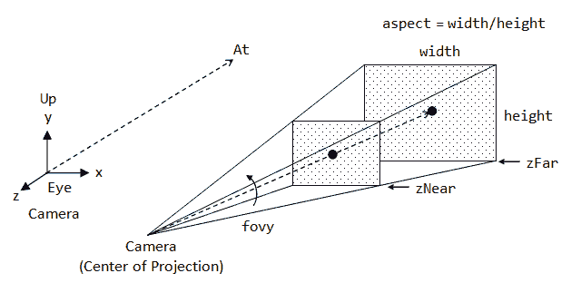
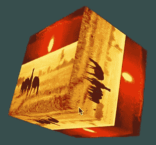
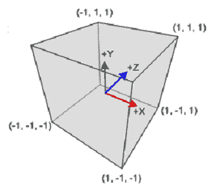
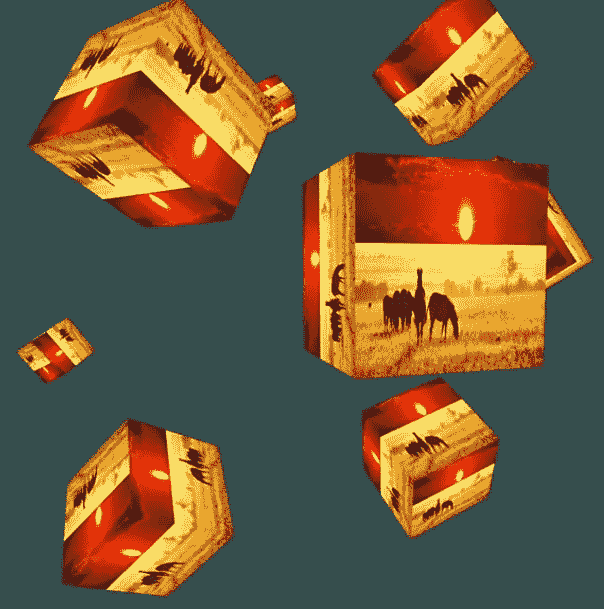

# 第三章：变换、投影和相机

在前一章中，我们讨论了如何使用我们的库在 OpenGL 中创建形状。我们学习了如何给形状添加颜色，并讨论了如何给形状添加纹理。本章将是前一章的延续，我们将讨论如何将旋转或平移等变换应用到我们的形状上。我们还将讨论投影和坐标系统，并尝试在我们的游戏世界中实现它们。您还将了解相机类，我们将使用它来观察和导航我们在本章中创建的多个对象。

本章将涵盖以下主题：

+   将旋转和平移等变换应用到我们的形状上

+   游戏世界中投影和坐标系统的实现

+   将多个对象添加到我们的游戏世界中

+   创建和使用相机类以更好地观察对象

那么，让我们开始吧...

您可以在 GitHub 的 `Chapter03` 文件夹中找到本章的所有代码文件。GitHub 链接可以在书的序言中找到。

# 使用 GLM 进行变换

我们将探讨如何对我们的形状及其应用的纹理进行变换。为了进行变换，我们将使用 OpenGL 数学库 GLM。对于变换，我们需要使用向量和矩阵，GLM 在后台为我们处理了很多。我们只需要调用正确的方法（例如，平移或旋转），它就会为我们执行适当的矩阵和向量变换。

建议您访问 [learnopengl.com](https://learnopengl.com/) 和 [open.gl](https://www.opengl.org/)。这些网站提供了一些非常棒的资源，展示了所有不同的向量和矩阵以及如何使用它们，并且深入探讨了背后的数学原理。所以，如果您感兴趣，您绝对应该访问这些网站。

# 在 Windows / Mac 上设置使用 GLM 的项目

首先，我们需要在我们的系统上下载并安装 GLM 库。这与其他我们在前几章中学到的安装框架非常相似，无论是 GLFW、SDL 还是 SFML。但如果你希望复习这部分内容，请参考第二章中“在 Windows 或 Mac 上设置项目以使用 SOIL”部分，*绘制形状和应用纹理*。GLM 的设置过程将与该部分讨论的内容非常相似。对于后续章节，我们将假设你已经安装了 GLM 库并设置了项目。

现在 GLM 库已经安装，我们的项目也已设置好，接下来让我们对代码进行一些修改，以便我们可以变换应用到形状上的形状和纹理。在后续章节中，我们将对前一章的代码进行修改，以变换我们的形状。

因此，首先，我们需要更新我们的着色器文件。

# 更新着色器文件

让我们遵循以下步骤来更新着色器文件：

1.  我们将转到我们的顶点着色器，即`core.vs`文件，并对代码进行以下高亮显示的修改：

```cpp
#version 330 core
layout (location = 0) in vec3 position;
layout (location = 1) in vec3 color;
layout (location = 2) in vec2 texCoord;
out vec3 ourColor;
out vec2 TexCoord; 

uniform mat4 transform;

void main()
{
 gl_Position = transform * vec4(position, 1.0f);
 ourColor = color;
 TexCoord = vec2(texCoord.x, 1.0 - texCoord.y);
}
```

1.  对于片段着色器，我们不需要做任何事情，因为我们将会以原样要求这段代码。

现在，我们可以转到`main.cpp`并修改我们的主代码，以将变换应用于我们的对象。

# 将变换应用于对象

请查看以下步骤，以了解我们需要在我们的主代码中实现哪些修改以包含变换：

1.  要修改我们的主代码，我们首先需要在代码中包含`GLM`头文件，所以请在您的代码中添加以下高亮显示的包含项：

```cpp
#include <glm/glm.hpp>
#include <glm/gtc/matrix_transform.hpp>
#include <glm/gtc/type_ptr.hpp>
```

1.  我们接下来要做的事情是创建我们想要应用的变换矩阵。为此，进入 while 循环，并在定义着色器和激活纹理之间的循环中，我们需要添加以下描述的代码：

    1.  首先，我们将只创建变换矩阵。因此，我们将开始输入`glm::mat4`，并将其命名为`transform`。

    1.  然后，我们将添加变换的类型。对于平移变换，我们将定义为`transform = glm::translate();`。对于`translate()`函数，我们需要指定的第一个参数是我们将要使用的 4x4 矩阵。接下来，我们将指定向量，它是`glm::vec3()`。这需要三个参数——x、y 和 z 坐标——对于这些，我们将传递值`0.5f`、`-0.5f`和`0.0f`。记住，这些值应该在-1 和 1 之间，目前是这样的。

    1.  接下来，我们将定义旋转变换，`transform = glm::rotate()`，对于`rotate()`函数，我们将传递参数：对于`matrix`，我们将再次指定`transform`。对于`angle`，我们需要说明我们希望它旋转多少，因为我们不希望它只旋转一次。我们希望它持续旋转。因此，我们将添加`glfwGetTime()`并将其转换为`GLfloat`。`glfwGetTime()`函数将是从 GLFW 初始化以来经过的时间量，我们将使用它来旋转我们的对象。

关于**时间方法**的更多信息，您可以访问以下链接：

对于 GLFW 时间输入，请访问[`www.glfw.org/docs/3.0/group__time.html`](https://www.glfw.org/docs/3.0/group__time.html)；

对于 SDL 时间输入，您可以使用`SDL_GetTicks`方法，并在[`wiki.libsdl.org/SDL_GetTicks`](https://wiki.libsdl.org/SDL_GetTicks)上读取信息；对于 SFML，您可以使用`getElapsedTime`方法，并且有关更多信息，您可以访问[`www.sfml-dev.org/tutorials/2.5/system-time.php`](https://www.sfml-dev.org/tutorials/2.5/system-time.php)。

我们需要调整方法的时间，以便纹理以一定的速度旋转。所以，我们将方法 `glfwGetTime( )` 乘以 `-5.0f`。这将使物体以一个方向旋转。如果你添加一个正数，它将以另一个方向旋转。尝试调整这个值。通过增加值，你会使它旋转得更快，而通过减少值，你会使它旋转得更慢。

我们需要传递的第三个参数是 `glm::vec3()`，对于这个向量，你必须指定形状要围绕哪个轴旋转。所以，你可以使用 `1.0f` 或 `0.0f`。添加 `0.0f` 表示你不想围绕该特定轴旋转。因此，我们将它定义为 `0.0f, 0.0f, 1.0f`。这意味着我们的纹理将围绕 z 轴旋转。我们选择 z 的原因是因为，目前我们并没有在 3D 中做任何事情。所以，通过围绕 z 轴旋转，它看起来就像是一个 2D 变换。

查看以下代码以获得对先前描述的清晰理解：

```cpp
// Create transformations
 glm::mat4 transform;
 transform = glm::translate( transform, glm::vec3( 0.5f, -0.5f, 0.0f ) );
transform = glm::rotate( transform, ( GLfloat)glfwGetTime( ) * -5.0f, glm::vec3( 0.0f, 0.0f, 1.0f ) );   
```

1.  现在我们已经创建了变换矩阵，我们可以开始应用它。因此，我们需要获取矩阵的统一位置，并设置矩阵以便我们的着色器可以使用。所以我们需要创建一个 `GLint` 变量 `transformLocation`，并将其分配给 `glGetUniformLocation()` 的值，并将此函数传递给 `ourShader.Program` 和我们的变换矩阵 `"transform"`。接下来，我们需要在我们的代码中定义统一矩阵，所以将 `glUniformMatrix4fv()` 函数添加到我们的代码中，这个函数需要一些参数。首先，是 `transformLocation`，然后是 `1`，然后是 `GL_FALSE` 和 `glm::value_ptr()`，并在此函数中指定我们使用的变换矩阵：

```cpp
// Get matrix's uniform location and set matrix
 GLint transformLocation = glGetUniformLocation( ourShader.Program, "transform" );
 glUniformMatrix4fv( transformLocation, 1, GL_FALSE, glm::value_ptr( transform ) );
```

如果你想了解更多关于这些参数的作用，建议你查看 [learnopengl.com](http://learnopengl.com) 和 [open.gl](http://open.gl)，因为这些网站对这些内容进行了更深入的讲解。

现在我们已经设置完毕，准备运行。如果我们运行这个程序，我们的图像应该会在右上角旋转，如下面的截图所示：


本章中使用的插图仅用于说明目的。我们不推荐你以任何方式误用这些内容。如需更多信息，请参阅本书免责声明部分中提到的出版商的条款和条件。

建议你尝试使用以下代码行来改变旋转的位置和速度：

```cpp
transform = glm::rotate( transform, ( GLfloat)glfwGetTime( ) * -5.0f, glm::vec3( 0.0f, 0.0f, 1.0f ) );
```

# 投影和坐标系

在本节中，我们将探讨投影和坐标系。所以，让我们首先了解坐标系是什么？有两种类型的坐标系：左手坐标系和右手坐标系。可视化它们最好的方法是举起你的双手，如下面的图片所示：


如上图所示，你双手的食指应该指向上方。你的中指应该指向你，你的拇指应该分别指向左右方向。一旦你这样做，你的手指和拇指所指的方向就是该轴的正方向。所以，食指所指的方向（向上）是正 y 轴。中指所指的方向是正 z 轴，而拇指指向正 x 轴的方向。OpenGL 使用右手坐标系，而 DirectX 使用左手坐标系。

关于坐标系统的更多信息，你可以查看以下链接：

[`learnopengl.com/`](https://learnopengl.com/) 和 [`open.gl./`](https://open.gl./)

既然我们已经讨论了坐标系，让我们了解 OpenGL 中不同的投影类型。我们有透视投影和正交投影。透视投影考虑深度，一般来说，每个正在制作的游戏都会考虑这一点，而正交投影则不考虑深度。所以，在正交投影中，离你更远的物体或物体的部分看起来仍然是同样的大小。如果你有两个相同的物体，其中一个离你更远，它看起来仍然是同样的大小。然而，在透视投影中，就像在现实生活中一样，离你更远的物体会看起来更小。你可能想知道，正交投影在什么情况下会有用？一个例子是建筑，当你创建一个布局设计，你想要有物体在其它物体后面，但是，因为你提供了测量数据，你不想它们的大小发生变化。

# 代码修改

在本节中，我们将对我们的纹理代码进行一些修改，以整合投影和坐标系到我们的游戏世界中。

我们将从更新着色器文件开始我们的修改。

# 修改着色器文件

查看下一步骤以了解我们需要对着色器文件进行哪些修改：

1.  我们想要做的第一件事是进入我们的顶点着色器，并对代码进行以下突出显示的更改：

```cpp
#version 330 core
layout (location = 0) in vec3 position;
layout (location = 2) in vec2 texCoord;
out vec2 TexCoord;
uniform mat4 model;
uniform mat4 view;
uniform mat4 projection;
void main()
{
 gl_Position = projection * view * model * vec4(position, 1.0f);
 TexCoord = vec2(texCoord.x, 1.0 - texCoord.y);
}
```

在前面的代码中，我们移除了所有的颜色值，因为我们现在只使用纹理。其次，我们也删除了统一矩阵变换，因为我们将要使用几种不同的变换方式。第三，我们创建了一个 4x4 的统一矩阵，它将成为模型矩阵。第四，我们创建了一个 4x4 的统一矩阵，它是视图矩阵，还有一个 4x4 的统一矩阵，它是投影矩阵。这三种不同类型的矩阵执行非常重要的任务。模型矩阵将局部对象坐标转换为相机坐标。投影矩阵将相机坐标转换为归一化坐标，因此坐标在 0 到 1 之间，视图矩阵将归一化坐标转换为窗口坐标。最后，我们将矩阵乘积的值赋给`gl_position`以实现它。

1.  接下来，我们将转向核心片段着色器，在这里我们将移除`vec3 ourColor`；其余的将保持不变。删除颜色参数的原因与上一步描述的相同。

# 对主代码的修改

既然我们已经更新了我们的着色器文件，我们将继续对主代码进行一些修改以实现投影和坐标系。请按照以下步骤操作：

1.  首先，我们将移除 EBO，因为我们不再使用元素缓冲对象；我们将移除任何其他元素缓冲对象的实例，并且也将移除`glDeleteBuffers( 1, &EBO )`。然后，我们将删除颜色属性。

1.  现在我们已经清理了我们的项目，我们将在代码中启用深度；我们需要启用它的原因是，如果我们有 3D 对象或者离我们更远或更近的对象，我们需要考虑深度。所以，让我们进入我们的代码，在`glViewport`下面添加`glEnable()`函数；为此，我们将传递`GL_DEPTH_TEST`。然后，我们将进入 while 循环，在`glClear()`函数中我们需要指定深度以清除深度缓冲区，所以向其中添加`| GL_DEPTH_BUFFER_BIT`。

1.  现在我们已经在我们的应用程序中实现了深度，我们将更新代码中的索引和顶点。在本节中，我们将实现一个 3D 立方体来帮助说明透视投影和正交投影。因此，我们需要修改我们的顶点并删除我们的索引。要将更新的顶点添加到你的代码中，请参考`Projections and Coordinate Systems`文件夹中的`main.cpp`。你会观察到有两种类型的投影的顶点：正交投影和透视投影。我们将在这两者之间切换，以了解两种投影之间的区别。在更新的顶点中，我们定义了六组顶点和纹理坐标，每组对应立方体的一个面。为了参考，请查看以下提到的立方体一侧的顶点集，并尝试理解它定义的内容：

```cpp
 // Positions            //Texture Coordinates    
-0.5f, -0.5f, -0.5f,     0.0f, 0.0f,
 0.5f, -0.5f, -0.5f,     1.0f, 0.0f,
 0.5f,  0.5f, -0.5f,     1.0f, 1.0f,
 0.5f,  0.5f, -0.5f,     1.0f, 1.0f,
-0.5f,  0.5f, -0.5f,     0.0f, 1.0f,
-0.5f, -0.5f, -0.5f,     0.0f, 0.0f,
```

在前面的代码中，每行前三个值是 x、y 和 z 位置，接下来的两个是归一化纹理坐标。我们已经在上一节中详细介绍了这些内容。建议你查看每一组值，并尝试找出它们与立方体的哪个面相关联。

1.  接下来，一旦我们更新了顶点，我们需要对我们的属性做一些修改，所以请查看以下更新的属性，并按照我们的代码进行类似修改：

```cpp
// Position attribute
 glVertexAttribPointer( 0, 3, GL_FLOAT , GL_FALSE, 5 * sizeof( GLfloat ), ( GLvoid * )0 );
 glEnableVertexAttribArray( 0 );

// TexCoord attribute
 glVertexAttribPointer( 2, 2, GL_FLOAT, GL_FALSE, 5 * sizeof( GLfloat ), ( GLvoid * )( 3 * sizeof( GLfloat ) ) );
 glEnableVertexAttribArray( 2 );
```

在前面的代码中，我们已将乘以顶点大小的因子更新为`5`，因为我们的更新顶点中每行有五个不同的信息。

1.  在纹理加载方面，我们不会触及任何代码，因为那已经完美定义了我们的纹理。

1.  因此，在我们解绑纹理并清理完毕之后，在`while`循环开始之前，我们将定义投影矩阵`glm::mat4 projection;`。我们首先要讨论的是透视投影，因为那通常是你会用得最多的。因此，我们将添加`projection = glm::perspective();`，`perspective()`函数需要几个值：

    +   第一个值是视野，我们将使用 45 度。这在视频游戏中是一个非常常见的值。

    +   第二个值是宽高比，我们将添加`screenWidth / screenHeight`。这使其保持动态。我们将每个值转换为`GLfloat`。

    +   对于第三个值（近裁剪面），我们只需添加`0.1f`。

    +   对于第四个值（远裁剪面），我们将使用`1000.0f`。

请查看以下突出显示的代码，以了解前面的描述：

```cpp
// Unbind texture when done,so we won't accidentily mess up our texture.
glBindTexture( GL_TEXTURE_2D, 0 ); 

 glm::mat4 projection;
 projection = glm::perspective( 45.0f, ( GLfloat )screenWidth / ( GLfloat )screenHeight, 0.1f, 100.0f );
```

# 视锥体

让我们借助以下简单的视锥体图像来理解前面的代码描述：



投影中心是虚拟摄像机放置的位置。**zNear**是近裁剪面，我们在代码中将其定义为`0.1f`。`1000.0f`值指的是远裁剪面，即**zFar**。这两个值意味着任何比近裁剪面近的物体都不会在屏幕上为你绘制，任何比远裁剪面远的物体也不会为你绘制，而且任何在视图视锥体之外的物体也不会为你绘制。纵横比是**宽度**除以**高度**，视场基本上是它的高度。

# 对 while 循环的修改

现在我们已经创建了投影矩阵，我们实际上可以开始创建模型和视图矩阵了，你需要在 while 循环中完成这个操作。让我们看看以下步骤：

1.  因此，首先，我们将移除定义变换矩阵的代码，因为我们不再使用它。我们将把`glActiveTexture()`代码移动到激活着色器之前。

1.  之后，我们将创建模型和视图矩阵，为此，在激活着色器后，我们将在 while 循环中添加以下代码。我们将从添加`glm::mat4 model`和`glm::mat4 view`矩阵开始。模型将是`model = glm::rotate()`，我们将在`rotate()`中添加一个初始的旋转。对于`rotate()`，我们将传递以下参数：

    +   首先，我们将传递`model`，它指的是模型矩阵

```cpp
// Activate shader
 ourShader.Use( );

 // Create transformations
 glm::mat4 model;
 glm::mat4 view;
 model = glm::rotate( model, ( GLfloat)glfwGetTime( ) * 1.0f, glm::vec3( 0.5f, 1.0f, 0.0f ) ); // use with perspective projection

//model = glm::rotate( model, 0.5f, glm::vec3( 1.0f, 0.0f, 0.0f ) ); // use to compare orthographic and perspective projection
 //view = glm::translate( view, glm::vec3( screenWidth / 2, screenHeight / 2, -700.0f ) ); // use with orthographic projection

view = glm::translate( view, glm::vec3( 0.0f, 0.0f, -3.0f ) ); // use with perspective projection
```

+   第二，对于旋转角度，我们只需传递`glfwGetTime()`，这将获取从开始 GLFW 到现在的时间。这显然只会不断增加，因此我们可以用这种方式提供旋转。我们将此函数转换为`GLfloat`，然后将其乘以`1.0f`。这是一个增加和减少速度的好方法，因为你只需要改变值。

关于旋转角度的更多信息，请参阅之前提供的带有 SFML、SDL 和 GLFW 链接的信息框。

+   接下来，我们将提供的是向量 3 矩阵`glm::vec3()`，对于`vec3()`，我们将在 x 轴上使用`0.5f`，在 y 轴上使用`1.0f`，而在 z 轴上则没有旋转。这将给我们的立方体添加一个很好的效果。

1.  接下来，我们将输入`view = glm::translate()`。在这里，我们将稍微移动视图。因此，在`translate()`中，我们首先传递我们的视图矩阵；然后我们指定我们想要的移动类型，所以我们将输入`glm::vec3()`；然后我们将`vec3()`传递给`0.0f`、`0.0f`、`-3.0f`轴。因此，我们将移动摄像机，这实际上是为了我们可以真正看到正在发生的事情。否则，我们基本上会处于立方体内部。

查看以下代码以了解前面的描述：

```cpp
// Create transformations
view = glm::translate( view, glm::vec3( 0.0f, 0.0f, -3.0f ) ); // use with perspective projection
```

现在我们已经整理好了，你可能想知道为什么我们要添加旋转和变换矩阵。这只是为了这个特定的部分，以便更好地查看投影。你可能不希望在后续部分添加旋转或变换矩阵。

1.  接下来，为了获取统一的位置，我们将添加以下突出显示的代码行：

```cpp
// Get their uniform location
 GLint modelLoc = glGetUniformLocation( ourShader.Program, "model" );
 GLint viewLoc = glGetUniformLocation( ourShader.Program, "view" );
 GLint projLoc = glGetUniformLocation( ourShader.Program, "projection" );
 // Pass them to the shaders
 glUniformMatrix4fv( modelLoc, 1, GL_FALSE, glm::value_ptr( model ) );
 glUniformMatrix4fv( viewLoc, 1, GL_FALSE, glm::value_ptr( view ) );
 glUniformMatrix4fv( projLoc, 1, GL_FALSE, glm::value_ptr( projection ) );
```

1.  接下来，我们需要绘制我们的对象，所以我们将添加 `glBindVertexArray()`，并将传递顶点数组对象 `VAO`。

1.  然后，我们将添加 `glDrawArrays ()`，首先，我们将传递：

    +   首先 `GL_TRIANGLES`。

    +   其次，第一个顶点将从 `0` 开始

    +   对于计数，我们将传递 `36`，因为每个面有两个三角形，每个三角形有三个坐标。两个三角形产生六个坐标，所以 6 x 6 = 36。

1.  接下来，我们将解绑它，所以我们将添加 `glBindVertexArray()` 并传递 `0`。

```cpp
 // Draw container
 glBindVertexArray( VAO );
 glDrawArrays( GL_TRIANGLES, 0, 36 );
 glBindVertexArray( 0 );
```

现在我们已经整理好了，让我们再次检查代码，然后运行它。如果你没有遇到任何错误，你将在屏幕上看到一个类似的旋转立方体，如下所示：



# 正交投影

现在我们来看看正交投影的形状，并理解正交投影和透视投影之间的区别。所以，我们将注释掉透视投影坐标，并从“投影和坐标系”文件夹中的 `main.cpp` 添加正交投影坐标。

然后，我们将转到 `glm::mat4 projection;` 并注释掉透视投影，并添加以下突出显示的代码行用于正交投影：

```cpp
projection = glm::ortho(0.0f, ( GLfloat )screenWidth, 0.0f, ( GLfloat )screenHeight, 0.1f, 1000.0f);
```

你可能想知道视场和比例在哪里。我们不需要那些，因为立方体更像是以下图像中显示的盒子：



现在我们只剩下两件事需要更改，那就是模型和视图矩阵，因为这将有助于展示我们试图展示的内容。所以，注释掉透视投影模型和视图定义，并添加以下代码行：

```cpp
model = glm::rotate( model, 0.5f, glm::vec3( 1.0f, 0.0f, 0.0f ) ); 
// use to compare orthographic and perspective projection

view = glm::translate( view, glm::vec3( screenWidth / 2, screenHeight / 2, -700.0f ) ); 
// use with orthographic projection
```

现在，让我们运行这段代码，看看我们的立方体是什么样子：


所以我们得到了我们的立方体，但看起来有点奇怪。它看起来就像一个又长又大的矩形。但实际上，面对我们的图像是立方体的前面，顶部矩形图像是立方体的顶部。我们已经旋转了立方体，但没有透视，很难判断哪个面是哪个。但让我们做一个实验，看看当我们注释掉正交的 `view` 并取消注释透视的 `view` 时会发生什么。让我们再次引入透视投影，取消注释透视数组，并注释掉正交数组。现在如果我们用透视投影运行代码，你将看到正交投影和透视投影之间的一个关键区别；看看以下图像：


现在看看前面的图像，它明显更像是一个立方体。显然，我们看不到侧面、底部或背面，但根据我们在这里看到的情况，它看起来比之前更像一个立方体。

# 将`Camera`类添加到项目中

在上一节中，我们学习了如何将对象添加到屏幕上，以及如何将纹理、变换和投影应用到对象上。随着我们在本书中继续前进，我们将向屏幕添加各种对象，但当我们向其中添加更多对象，并且希望从不同的角度观察它们时，我们不希望有特定的代码来实现这一点或自由地在对象周围移动。因此，在本章中，我们将探讨实现一个`Camera`类，这将帮助我们自由地在我们的世界中移动，使用键盘，并从不同的角度观察这些对象。实现这个类将帮助我们改进移动风格，并借助鼠标查看玩家周围的虚拟世界。正如我们在上一章所学，我们目前拥有的只是一个我们创建的单个立方体。由于我们本章的目标是实现多个对象，我们将基本上删除描述单个立方体的顶点，并使用一个简单的顶点数组和循环来绘制多个立方体。我们不仅会看到单个立方体的移动，还会看到多个立方体，这将非常棒。

在本节中，我们将涵盖以下内容：

+   学习如何绘制多个立方体

+   创建`Camera`类并在我们的当前应用程序中实现它

在我们开始之前，只有几个先决条件。我们将使用上一章的源代码，该章是关于投影和坐标系。如果您没有源代码，您可以从本书前言中提供的 GitHub 链接下载。此外，在本章中，我们将使用 GLFW 作为框架。这意味着我们将在这里使用一些 GLFW 编码，但这实际上只是为了输入我们所做的操作。您可以自由地查看其他库的输入指南，尝试用其他库交换代码，并尝试实验。我们将在本章中定义的`Camera`类不会受到您实验的影响，因为它不会包含任何框架特定的代码。只有主代码会受到影響，因为它将被用来检测输入。

让我们开始吧。

# 创建一个 Camera.h 头文件

我们将首先为我们的`Camera`类创建一个头文件，因此我们将在项目中创建一个空的头文件并将其添加到我们的目标中。我们将将其命名为`Camera.h`。我们只会有一个头文件，因为我们将要实现的方法非常简单。但如果你想的话，也可以将其提取到一个单独的 CPP 文件中。建议你也尝试这种方式进行实验，因为这将是一个很好的学习方法。让我们开始编写我们的摄像机头文件。按照以下步骤进行：

1.  首先，让我们删除文件中已经存在的默认代码。然后，当代码是一个更简单的版本时，添加`#pragma`。这并不是所有编译器都支持，但大多数编译器都会支持这一点。

1.  然后，我们将添加`#include`向量。我们将使用`vector`类来处理诸如定位之类的操作。接下来，让我们添加`#define GLEW_STATIC`，因为我们将在其中使用 GLEW，它已经链接到我们的项目中。然后，我们将添加`#include GL/glew.h`。我们还将包含一些 OpenGL 数学库，所以让我们添加`glm/glm.hpp`和`#include glm/gtc/matrix_transform.hpp`。

1.  接下来，我们将创建一个枚举来定义摄像机移动的几个可能选项。让我们添加`enum Camera_Movements`。这将包含`FORWARD`、`BACKWARD`、`LEFT`和`RIGHT`，我们需要使用这些来找出用户想要将摄像机移动到哪个方向——本质上，是为了确定用户想要向哪个方向行走。

1.  现在，我们将为摄像机的偏航、俯仰和移动速度创建一些常量值，以及灵敏度和缩放。除了缩放之外，我们不会为这些值提供方法，但你可以为其他所有值创建方法。你可以创建获取器和设置器；建议你将此作为一个额外任务来完成。这是一个很好的学习方法，你以后也能使用它们。

1.  因此，我们将添加`const`。显然，目前因为我们使用了一个常量，所以你不能修改它，但如果你想要修改，那不是问题。但这些是默认值，所以你不会特别操作这个变量。你会操作 Camera 类中的变量，我们将在不久的将来创建它。所以，添加`const GLfloat YAW = -90.0f;`。然后添加`const GLfloat PITCH = 0.0f`和`const GLfloat SPEED = 6.0f`。这是与相机和屏幕配合得很好的速度值；你可以根据需要调整它，使其变慢或变快。值越高，速度越快，值越低，速度越慢。接下来，添加`const GLfloat SENSITIVITY = 0.25f`。这定义了鼠标移动的灵敏度。同样，值越高，鼠标移动越快，值越低，鼠标移动越慢。现在我们将包括`const GLfloat ZOOM`。缩放值是视野，所以 45 度的值非常常见。值越高，屏幕就越高。这基本上是老游戏所用的，你可以尝试一下。查看以下代码以了解前面的描述：

```cpp
#pragma once
// Std. Includes
#include <vector>
// GL Includes
#define GLEW_STATIC
#include <GL/glew.h>

#include <glm/glm.hpp>
#include <glm/gtc/matrix_transform.hpp>

// Defines several possible options for camera movement. Used as abstraction to stay away from window-system specific input methods
enum Camera_Movement
{
    FORWARD,
    BACKWARD,
    LEFT,
    RIGHT
};

// Default camera values
const GLfloat YAW        = -90.0f;
const GLfloat PITCH      =  0.0f;
const GLfloat SPEED      =  6.0f;
const GLfloat SENSITIVTY =  0.25f;  
const GLfloat ZOOM       =  45.0f;
```

1.  接下来，我们将创建一个 Camera 类，然后输入`public`。我们将首先创建一个带有向量的构造函数，然后是一个带有标量值的构造函数。让我们从添加`Camera()`开始，它将接受以下代码中显示的参数：

```cpp
//Constructor with vectors
Camera( glm::vec3 position = glm::vec3( 0.0f, 0.0f, 0.0f ), glm::vec3 up = glm::vec3( 0.0f, 1.0f, 0.0f ), GLfloat yaw = YAW, GLfloat pitch = PITCH ) : front( glm::vec3( 0.0f, 0.0f, -1.0f ) ), movementSpeed( SPEED ), mouseSensitivity( SENSITIVTY ), zoom( ZOOM )
```

1.  然后，我们将快速实现我们的相机构造函数，所以为构造函数添加以下行：

```cpp
{
     this->position = position;
     this->worldUp = up;
     this->yaw = yaw;
     this->pitch = pitch;
     this->updateCameraVectors( );
}
```

1.  现在我们已经完成了这个特定的构造函数，我们将添加带有标量值的构造函数到我们的代码中。向你的代码中添加以下行：

```cpp
// Constructor with scalar values
    Camera( GLfloat posX, GLfloat posY, GLfloat posZ, GLfloat upX, GLfloat upY, GLfloat upZ, GLfloat yaw, GLfloat pitch ) : front( glm::vec3( 0.0f, 0.0f, -1.0f ) ), movementSpeed( SPEED ), mouseSensitivity( SENSITIVTY ), zoom( ZOOM )
    {
        this->position = glm::vec3( posX, posY, posZ );
        this->worldUp = glm::vec3( upX, upY, upZ );
        this->yaw = yaw;
        this->pitch = pitch;
        this->updateCameraVectors( );
    }
```

1.  现在我们将实现一个获取视图矩阵的 getter，因为这个将会返回使用欧拉角和`lookAt`矩阵计算出的视图矩阵。我们将添加`glm::mat4`，并将其命名为`GetViewMatrix()`。我们将在`main.cpp`中使用它，并添加以下高亮显示的代码行到这个类中：

```cpp
// Returns the view matrix calculated using Eular Angles and the LookAt Matrix
    glm::mat4 GetViewMatrix( )
    {
        return glm::lookAt( this->position, this->position + this->front, this->up );
    }
```

这基本上就是声明我们想要看的地方；显然，我们想要向前看；并且我们想要使用向上向量，所以我们使其相对。

1.  现在我们将处理一些键盘输入；使用这个键盘输入，我们将检测我们是在前进、后退、左转还是右转，然后我们将朝那个方向移动。所以让我们添加以下代码行：

```cpp
void ProcessKeyboard( Camera_Movement direction, GLfloat deltaTime )     {
```

这个`Camera_Movement`是我们之前步骤中创建的`enum`。`GLfloat deltaTime`是帧之间的时间，因此我们可以创建与帧无关的运动，因为你最不希望看到的是每秒 60 帧，突然降到 30 帧，这只有一半的速度。你显然希望它保持相同的速度。它可能看起来不那么平滑，但你仍然会得到一致的运动，这才是最重要的。

1.  接下来，在代码文件中，我们将添加以下代码行：

```cpp
// Processes input received from any keyboard-like input system. Accepts input parameter in the form of camera defined ENUM (to abstract it from windowing systems)
    void ProcessKeyboard( Camera_Movement direction, GLfloat deltaTime )
    {
        GLfloat velocity = this->movementSpeed * deltaTime;

        if ( direction == FORWARD )
        {
            this->position += this->front * velocity;
        }

        if ( direction == BACKWARD )
        {
            this->position -= this->front * velocity;
        }

        if ( direction == LEFT )
        {
            this->position -= this->right * velocity;
        }

        if ( direction == RIGHT )
        {
            this->position += this->right * velocity;
        }
    }
```

在前面的代码行中，我们添加了`GLfloat velocity`并将其赋值为`movementSpeed * deltaTime`。假设`movementSpeed`是`5`，例如，而`deltaTime`是`0.1`，那么`GLfloat velocity`将是`0.5`。因此，如果 delta time 更高，移动速度也会更高。如果 delta time 更低，移动速度也会更低。这仅仅保持了所有帧率独立。接下来，我们添加了`if`语句来检查用户移动的方向。如果用户向任何特定方向移动，那么`position += this front * velocity`，其中`velocity`等于我们之前计算出的值。

你可能想知道为什么我们不使用开关语句，或者为什么不使用`if else/if else`系列。首先，假设你同时按下了前进键和左键，那么你希望能够向西北方向移动。忽略我们朝向的方向——让我们假设我们正朝北看——你希望能够向西北方向移动。你不想需要先按下一个键，然后松开，再按另一个键。同样地，如果你正在前进，然后点击后退，你会停止。你不想需要释放按键；这就是我们使用单独的`if`语句的原因。

1.  接下来，我们将处理鼠标移动。这将处理从我们的鼠标系统接收到的输入，无论是 GLFW、SDL 还是 SFML，并且它将使用偏移值来调整 x 和 y 方向。因此，我们将添加`void ProcessMouseMovement()`函数，并将`GLfloat xOffset`传递给它。这实际上是鼠标移动之间的差异，因为否则我们怎么知道我们要移动到哪里呢？我们实际上需要考虑速度。然后添加`GLfloat yOffset, GLboolean constrainPitch`来约束俯仰角，并将其设置为 true。现在我们将计算偏移量，并使用我们的`mouseSensitivity`来调整它。我们将添加以下代码行：

```cpp
       xOffset *= this->mouseSensitivity;
       yOffset *= this->mouseSensitivity;

        this->yaw   += xOffset;
        this->pitch += yOffset;
```

1.  现在，我们将使用 if 语句检查俯仰角是否受到限制。我们希望防止用户超出范围，这样当我们的鼠标移动时，屏幕就不会翻转，或者实际上是我们看左和看右的方式；如果我们向左移动时间过长，我们会回到起点。同样的情况也适用于右方向（即逆时针和顺时针。当你向上或向下看时，你通常只能向上看大约 90 度，这大约是头部能做的，然后向下看大约 90 度到你的脚，这又是头部能做的。你不希望能够不断地循环回到起点，因为这会导致各种各样的问题，比如陀螺仪锁定。但是，一般来说，这种运动在游戏中是不存在的，因为游戏是基于现实生活和人体限制的。所以我们将检查俯仰角。如果`pitch > 89.0f`，我们将俯仰角设置为`89.0f`。如果`pitch < -89.0f`，我们将俯仰角设置为`-89.0f`。最后，我们将通过添加`this->updateCameraVectors();`来更新相机向量。这将使用我们在这里定义的欧拉角更新前、右和上向量。请查看以下代码以了解前面的描述：

```cpp
// Processes input received from a mouse input system. Expects the offset value in both the x and y direction.
    void ProcessMouseMovement( GLfloat xOffset, GLfloat yOffset, GLboolean constrainPitch = true )
    {
        xOffset *= this->mouseSensitivity;
        yOffset *= this->mouseSensitivity;

        this->yaw   += xOffset;
        this->pitch += yOffset;

        // Make sure that when pitch is out of bounds, screen doesn't get flipped
        if ( constrainPitch )
        {
            if ( this->pitch > 89.0f )
            {
                this->pitch = 89.0f;
            }
            if ( this->pitch < -89.0f )
            {
                this->pitch = -89.0f;
            }
        }

        // Update Front, Right and Up Vectors using the updated Eular angles
        this->updateCameraVectors( );
    }
```

1.  现在我们已经处理了鼠标移动，接下来我们将处理鼠标滚轮操作，因此我们将添加`void ProcessMouseScroll()`函数，并将`GLfloat yOffset`传递给它。

    如果你想要能够检测水平滚动，可以使用`xOffset`。许多鼠标没有水平滚动功能，但相当多的新型鼠标，尤其是游戏鼠标和生产力鼠标，都有。但是，一般来说，你可能只想检测 y 轴上的移动——也就是说，垂直滚动。但是你可以轻松扩展这个方法和这个类，以满足你的需求。

    在你的代码中添加以下`if`语句：

```cpp
if ( this->zoom >= 1.0f && this->zoom <= 45.0f )
        {

            this->zoom -= yOffset;
        }

        if ( this->zoom <= 1.0f )
        {
            this->zoom = 1.0f;
        }

        if ( this->zoom >= 45.0f )
        {
            this->zoom = 45.0f;
        }
```

现在，我们将创建一个获取缩放的 getter，因为缩放变量将是私有的。实际上，这个类中的所有变量都是私有的。我们真正创建缩放 getter 的原因仅仅是因为它是我们现在在类外使用的唯一一个。但是，如果你需要使用诸如上向量、偏航、俯仰或其他我们创建的任何变量，请随意创建适当的 getter 和 setter。因此，我们接下来将添加以下代码：

```cpp
GLfloat GetZoom( )
    {
        return this->zoom;
    }
```

1.  现在，我们将定义相机属性，因此我们将向我们的相机类添加以下代码行：

```cpp
private:
    // Camera Attributes
    glm::vec3 position;
    glm::vec3 front;
    glm::vec3 up;
    glm::vec3 right;
    glm::vec3 worldUp;
```

欢迎访问[learnopengl.com](http://learnopengl.com)和[open.gl](http://open.gl)，并查看这些网站以获取更深入的书面信息和一些关于我们本章讨论的所有不同变量和方法的优秀图表。

1.  然后，我们将向我们的类中添加一些欧拉角：

```cpp
// Eular Angles
    GLfloat yaw;
    GLfloat pitch;
```

1.  我们一直在使用的所有这些参数最终都被创建出来了。接下来，我们将在我们的代码中添加一些摄像机选项：

```cpp
// Camera options
    GLfloat movementSpeed;
    GLfloat mouseSensitivity;
    GLfloat zoom;
```

1.  我们需要添加到这个类中的最后一件事是 `void updateCameraVectors`，当我们更新摄像机向量时，我们需要计算新的前向量，因此我们将添加 `glm::vec3 front`，这是它的临时存储。然后我们将添加 `front.x`，并将 `cos ( glm::radians( this->yaw ))` 乘以 `cos( glm::radians( this->pitch ) )` 的值分配给它。再次强调，这里的数学计算显然非常复杂且深入，所以我们建议您查看上述链接。查看以下代码以了解将添加到 `updateCameraVectors` 的其他元素：

```cpp
void updateCameraVectors( )
    {
        // Calculate the new Front vector
        glm::vec3 front;
        front.x = cos( glm::radians( this->yaw ) ) * cos( glm::radians( this->pitch ) );
        front.y = sin( glm::radians( this->pitch ) );
        front.z = sin( glm::radians( this->yaw ) ) * cos( glm::radians( this->pitch ) );
        this->front = glm::normalize( front );
        // Also re-calculate the Right and Up vector        this->right = glm::normalize( glm::cross( this->front, this->worldUp ) );  // Normalize the vectors, because their length gets closer to 0 the more you look up or down which results in slower movement.
        this->up = glm::normalize( glm::cross( this->right, this->front ) );
    }
```

通过这一行代码，我们最终完成了 `Camera` 类。请查看 `camera.h` 文件以获取完整的代码。此文件位于 `Getting started` 文件夹中的 `camera` 文件夹内。

# 对 main.cpp 进行修改

现在我们已经创建了我们的 `Camera` 类，让我们回到 `main.cpp` 并对其进行一些修改，例如在我们的屏幕上实现多个立方体，添加一个摄像机类，并在多个对象之间移动。

在我们的 `main.cpp` 中，我们将开始实现我们一直在做的输入部分。因此，我们将使用 GLFW 作为我们的输入系统，但，再次提醒，您可以自由查看之前的链接以获取有关 GLFW、SFML 和 SDL 输入系统的更多信息。

1.  我们将从在我们的代码中包含 `Camera` 类开始。在代码的开始处添加 `#include Camera.h`，

1.  然后，在定义我们的屏幕尺寸的部分，我们将进行以下修改：

```cpp
const GLuint WIDTH = 800, HEIGHT = 600;
int SCREEN_WIDTH, SCREEN_HEIGHT;
```

1.  现在，让我们将所有使用的 `screenWidth` 和 `screenHeight` 替换为 `SCREEN_WIDTH` 和 `SCREEN_HEIGHT`。

1.  由于我们将使用透视投影，我们需要删除所有正交投影代码，因为我们不再使用它了。

1.  现在，在我们开始 `int main` 之前，我们将创建一些函数原型。将以下代码行添加到您的 `main.cpp` 文件中：

```cpp
// Function prototypes
void KeyCallback( GLFWwindow *window, int key, int scancode, int action, int mode );
void ScrollCallback( GLFWwindow *window, double xOffset, double yOffset );
void MouseCallback( GLFWwindow *window, double xPos, double yPos );
void DoMovement( );
```

在前面的代码中，我们首先添加了 `void KeyCallback( )`; 这是从这里开始框架特定代码的地方。我们将 `GLFWwindow *window` 传递给这个函数，然后我们需要检查哪个键被按下，因此添加了 `int key`、`scancode`、`action` 和 `mode`。然后我们添加了其余的函数。在 `MouseCallback( )` 中，我们传递了 `double xPos` 和 `double yPos`。这些是我们鼠标在窗口中的 x 和 y 位置。我们实际上将隐藏鼠标光标以提供更沉浸式的体验。然后，我们在前面的代码中添加了一个最终的方法原型：`void DoMovement`。这个方法将在每一帧中被调用，并将移动我们的摄像机。即使我们没有进行任何移动，它仍然会被调用，但不会明显移动我们的摄像机。

1.  现在，我们只需要为我们的相机初始化一些值，所以我们将添加`Camera`，创建一个`camera()`对象，并将`glm::vec3()`传递给它。对于`vec3()`，我们将传递`0.0f`、`0.0f`、`3.0f`。这些只是初始值。接下来，我们将添加`GLfloat lastX`，这是相机的最后位置，初始时。我们将使其等于屏幕中心，这将是我们鼠标移动的位置。我们将添加`WIDTH / 2.0`和`GLfloat lastY = WIDTH / 2.0f;`。查看以下内容以了解此描述：

```cpp
// Camera
Camera  camera(glm::vec3( 0.0f, 0.0f, 3.0f ) );
GLfloat lastX = WIDTH / 2.0;
GLfloat lastY = HEIGHT / 2.0;
```

在此之下将是一个`bool`类型的键数组，它将包含 1,024 种不同类型的键。我们将添加`bool firstMouse = true`，因为我们正在处理一种鼠标类型：

```cpp
bool keys[1024];
bool firstMouse = true;
```

接下来，我们将添加`deltatime`和`lastframe`，它们将在代码中用于确定帧之间的时间：

```cpp
GLfloat deltaTime = 0.0f;
GLfloat lastFrame = 0.0f;
```

1.  现在，在我们的`int main`中，在`glfwMakeContextCurrent(window);`之后，我们将添加`glfwSetKeyCallback();`，并将`window`作为参数传递给它。我们将提供我们使用的方法，即`KeyCallback`；然后我们将重复此行代码三次，并对其进行以下突出显示的修改：

```cpp
// Set the required callback functions
glfwSetKeyCallback( window, KeyCallback );
glfwSetCursorPosCallback( window, MouseCallback );
glfwSetScrollCallback( window, ScrollCallback );
```

在这里，我们正在调用之前定义的函数原型。

1.  接下来，我们想要将鼠标固定在屏幕中心，在窗口内部，所以我们将添加`glfwSetInputMode();`并将`window`传递给它。由于我们正在更改的模式是光标，我们将传递`GLFW_CURSOR`与值`GLFW_CURSOR_DISABLED`，因为我们不希望光标完全禁用。

```cpp
// Options, removes the mouse cursor for a more immersive experience     glfwSetInputMode( window, GLFW_CURSOR, GLFW_CURSOR_DISABLED );
```

1.  由于我们将在代码中渲染多个立方体，我们将创建一个向量数组，该数组将包含立方体的位置。这些位置只是任意位置，所以你可以稍后更改它们以进行实验。前往`Camera`文件夹中的`main.cpp`文件，并将向量数组`glm::vec3 cubePositions[]`复制并粘贴到你的代码中。

    接下来，我们将移动投影代码到 while 循环内部，因为我们将通过鼠标滚轮更改视场，所以如果我们实际上正在更改视场值，我们希望能够在每一帧更新投影。因此，在激活我们的着色器代码并使用纹理单元绑定纹理之后，添加投影代码并对其进行以下更改：

```cpp
// Draw our first triangle

   ourShader.Use( );

   // Bind Textures using texture units
   glActiveTexture( GL_TEXTURE0 );
   glBindTexture( GL_TEXTURE_2D, texture );
   glUniform1i( glGetUniformLocation( ourShader.Program, "ourTexture1" ), 0 );

   glm::mat4 projection;
   projection = glm::perspective(camera.GetZoom( ), (GLfloat)SCREEN_WIDTH/(GLfloat)SCREEN_HEIGHT, 0.1f, 1000.0f);
```

1.  在 while 循环开始后，我们将设置帧时间，所以我们将添加`GLfloat currentFrame = glfwGetTime()`。然后我们将添加`deltaTime = currentFrame - lastFrame`。这是我们检测帧间时间的方式。比如说，如果我们的当前帧在时间 100，而我们的上一帧在时间 80，那么上一帧和当前帧之间的时间将是 20——尽管它通常是一秒或毫秒。然后我们将添加`lastFrame = the currentFrame`，因为当我们在下一次迭代中重新启动这个 while 循环时，最后一帧将是当前帧，因为我们将在那个特定时刻有一个不同的帧。请参考以下代码来理解描述：

```cpp
while( !glfwWindowShouldClose( window ) )
    {

        // Set frame time        
        GLfloat currentFrame = glfwGetTime( );
        deltaTime = currentFrame - lastFrame;
        lastFrame = currentFrame;  
```

1.  在处理完所有事件后，我们将实际处理移动，所以添加`DoMovement()`。

1.  现在，我们将进入代码中定义`view`和模型矩阵的部分，并进行以下修改：

```cpp
// Create camera transformation
        glm::mat4 view;
        view = camera.GetViewMatrix( );
```

在前面的代码中，你可能已经注意到我们移除了模型矩阵代码，这是因为我们将把它放在一个 for 循环中，该循环将遍历我们的立方体位置数组，在不同的位置绘制对象，并使用模型生成一种随机的旋转。

1.  在将顶点数组绑定到顶点数组对象和解除绑定之间，我们实际上将添加一个 for 循环，我们将传递一个参数作为`GLuint i = 0; i < 10; i++`。建议你尝试使其动态化，这样你就可以添加更多的立方体位置，并绘制更多的立方体。那将是你另一个很好的任务。我们将在 for 循环中添加以下突出显示的语句。首先，我们将为每个对象计算模型矩阵，然后在我们开始绘制之前将其传递给我们的着色器：

```cpp
for( GLuint i = 0; i < 10; i++ )
        {
            // Calculate the model matrix for each object and pass it to shader before drawing
 glm::mat4 model;
 model = glm::translate( model, cubePositions[i] );
 GLfloat angle = 20.0f * i;
 model = glm::rotate(model, angle, glm::vec3( 1.0f, 0.3f, 0.5f ) );
 glUniformMatrix4fv( modelLoc, 1, GL_FALSE, glm::value_ptr( model ) );

 glDrawArrays( GL_TRIANGLES, 0, 36 );
        }
```

我们在前面代码中使用了一个值为`20.0`，因为这只是一个计算值。尝试改变这个值并看看会发生什么。你可能会找到一个更好的值。我们已经从 while 循环中复制并粘贴了`glUniformMatrix4fv();`。现在我们已经完成了我们的 while 循环。

1.  现在，我们可以开始实现那些函数原型，这是在我们能够运行代码并观察输出之前要做的最后一件事。在 while 循环结束后，我们将添加`void DoMovement()`，这将处理我们的移动并调用 Camera 类中的适当键盘方法。所以，这个函数不会接受任何参数，但我们将添加一些 if 语句。我们想要使用*W, A, S, D*和箭头键，所以我们将条件作为`keys[GLFW_KEY_W] || keys[GLFW_KEY_UP]`传递。在 if 语句中，我们将添加`camera.ProcessKeyboard(FORWARD, deltaTime);`因为我们正在向前移动，并且我们将添加`deltaTime`，这是我们已经在 while 循环中计算过的。这是向前移动的代码。同样，我们还将为所有其他方向添加语句；请查看以下突出显示的代码：

```cpp
// Moves/alters the camera positions based on user input
void DoMovement( )
{
    // Camera controls
    if( keys[GLFW_KEY_W] || keys[GLFW_KEY_UP] )
    {
        camera.ProcessKeyboard( FORWARD, deltaTime );
    }

    if( keys[GLFW_KEY_S] || keys[GLFW_KEY_DOWN] )
 {
 camera.ProcessKeyboard( BACKWARD, deltaTime );
 }

 if( keys[GLFW_KEY_A] || keys[GLFW_KEY_LEFT] )
 {
 camera.ProcessKeyboard( LEFT, deltaTime );
 }
 if( keys[GLFW_KEY_D] || keys[GLFW_KEY_RIGHT] ) 
 {
 camera.ProcessKeyboard( RIGHT, deltaTime );
 }
}
```

1.  然后，我们将进行一个回调，所以我们将添加以下代码：

```cpp
// Is called whenever a key is pressed/released via GLFW
void KeyCallback( GLFWwindow *window, int key, int scancode, int action, int mode )
{
    if( key == GLFW_KEY_ESCAPE && action == GLFW_PRESS )
    {
        glfwSetWindowShouldClose(window, GL_TRUE);
    }
    if ( key >= 0 && key < 1024 )
    {
        if( action == GLFW_PRESS )
        {
            keys[key] = true;
        }
        else if( action == GLFW_RELEASE )
        {
            keys[key] = false;
        }
    }
}
```

1.  现在，我们可以添加`MouseCallback`：

```cpp
void MouseCallback( GLFWwindow *window, double xPos, double yPos )
{
    if( firstMouse )
    {
        lastX = xPos;
        lastY = yPos;
        firstMouse = false;
    }
    GLfloat xOffset = xPos - lastX;
    GLfloat yOffset = lastY - yPos;  // Reversed since y-coordinates go from bottom to left

    lastX = xPos;
    lastY = yPos;

    camera.ProcessMouseMovement( xOffset, yOffset );
} 
```

1.  然后，我们将添加 `void ScrollCallback()`，并将以下参数传递给它：`GLFWwindow *window, double xOffset, double yOffset`

在那个方法中，我们将添加以下代码：

```cpp
camera.ProcessMouseScroll( yOffset );
```

现在，我们已经准备好查看这个是否工作，所以运行它。一旦编译无误，你将看到以下输出：



我们已经创建了多个立方体，并且可以四处查看和移动。我们可以使用 *W*、*A*、*S* 和 *D* 键以及箭头键来移动。因此，我们不仅可以向前和向后移动，还可以向前和向右、向前和向左、向后和向右、向后和向左移动。这个相机系统的优点是向前移动是相对于我们观察的方向的。所以，如果我们看一个特定的立方体，然后按向前键，它就会移动到我们的立方体方向。如果我们试图穿过立方体，我们会穿过它，并且可以看到纹理的逆面。我们可以穿过它的原因很简单，那就是没有碰撞检测。

# 摘要

在本章中，我们学习了如何应用变换，如旋转到我们的形状上，并学会了如何绘制一个立方体并将其纹理化。然后，我们探讨了投影的概念，包括透视和正交投影，并在我们的游戏世界中实现了这些概念。

在下一章中，我们将讨论光照、其效果以及我们在 OpenGL 中拥有的光源。
