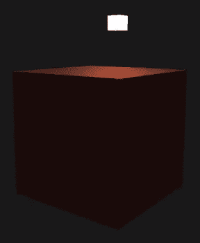

# 光照、材质和光照贴图的效果

在上一章中，我们讨论了如何将变换和投影应用于对象。我们还创建了多个立方体和一个`Camera`类，以便清晰地查看并导航这些对象。在本章中，我们将探讨光照。首先，我们将讨论与我们的对象和光源相关的颜色基础知识。我们还将讨论创建顶点着色器和片段着色器，就像我们在上一章为对象箱所做的那样。我们将为实际的光源，如灯具，创建着色器。你还将学习如何将材质应用于你的对象立方体，并观察光照对这些材质的影响。

在本章中，我们将涵盖以下主题：

+   光照中颜色的基础知识以及光照对对象的影响

+   光对某类材料的影响

+   探索光照贴图以实现不同材料上光照的真实世界效果

光……摄像机……开拍！！

你可以参考 GitHub 上`Chapter04`文件夹中的所有本章代码文件。GitHub 链接可以在书的序言中找到。

# 添加对象和光源

在本节中，我们将讨论如何将颜色应用于你的立方体对象。我们还将学习如何为光和灯具等光源创建着色器文件。然后我们将学习如何将立方体和光源添加到我们的游戏世界中。

因此，让我们首先创建光和灯具的新着色器文件。

# 创建光照和灯具着色器文件

在这里，我们将学习如何为光源和灯具创建着色器文件，并探索将进入顶点着色器和片段着色器的代码。执行以下步骤以学习如何创建这些着色器文件：

1.  首先，将上一章中的`core.vs`和`core.frag`重命名为`lighting.vs`和`lighting.core`。

1.  现在，让我们开始修改这些新命名的文件的代码。首先，我们将修改`lighting.vs`。我们在这里要做的就是移除纹理坐标，因为我们在这里不会渲染纹理，我们还将移除`out texture`变量。查看以下代码以了解对光照顶点着色器所做的更改：

```cpp
#version 330 core
layout (location = 0) in vec3 position;

uniform mat4 model;
uniform mat4 view;
uniform mat4 projection;

void main()
{
 gl_Position = projection * view * model * vec4(position, 1.0f);
}
```

1.  接下来，我们将转到`lighting.frag`并按照以下代码进行修改：

```cpp
#version 330 core
out vec4 color;

uniform vec3 objectColor;
uniform vec3 lightColor;

void main()
{
    color = vec4(lightColor * objectColor, 1.0f);
}
```

在前面的代码中，我们添加的变量`objectColor`将包含对象本身的颜色，在我们的例子中是立方体。

1.  保存这两个文件，现在我们将为我们的灯具创建着色器文件。

# 为灯具创建着色器文件

查看以下步骤，了解如何创建灯具着色器：

1.  复制我们在前面步骤中更新的文件，并将它们重命名为`lamp.vs`和`lamp.frag`，我们还需要在这些新文件中修改一些代码以创建我们的光源。

1.  我们不会对`lamp.vs`进行任何修改，因为我们需要当前的更新代码。

1.  我们需要对`lamp.frag`进行一些修改，所以请查看以下代码中突出显示的术语：

```cpp
#version 330 core
out vec4 color;

void main()
{
    color = vec4(1.0f); // Set all 4 vector values to 1.0f
}
```

我们将值传递给`vec4`作为`1.0f`的原因是，所有矢量值都应该设置为`1.0f`，这是高强度的红色、绿色、蓝色和 alpha。所以，它将完全开启。如果你有全红、全绿和全蓝，你得到白色。因此，我们的灯将发出白光。

你可能在高中做过一个实验，将彩虹的所有不同颜色放在一个圆圈上，如果你足够快地旋转它，组合的颜色看起来是白色的。这是一个相当酷的实验，你很可能在家里也能做到。总的来说，这是一件有趣的事情，值得尝试。

因此，现在我们已经为光照和灯设置了所有着色器文件，我们将继续在`main.cpp`文件中的主代码，向游戏世界中添加一个对象和光源。

# 修改主代码以实现立方体和光源

现在我们已经为我们的项目创建了新的着色器文件，接下来我们将着手于我们的主代码，并在游戏世界中添加一个彩色立方体和光源。在本节中，我们还将查看如何在代码中引用我们新创建的着色器文件。在这里，我们将对上一章的代码进行修改。执行以下步骤以了解对代码所做的更改：

1.  在我们的`int main()`之前，我们将首先添加`glm::vec3 lightPos();`。所以，这将是我们世界中光源的位置。我们将向`lightpos()`函数传递以下坐标：`1.2f`、`1.0f`和`2.0f`。这样工作的方式是，你有一个从特定位置发出的光源，例如，如果你加载一个灯泡作为光源并将其放置在定义的位置。灯泡本身是我们世界中的光源。

1.  接下来，我们将进入定义了我们的着色器的部分。随着我们向项目中添加新的着色器，我们将在代码中引用它们。

1.  现在我们已经创建了一些着色器，我们将复制我们代码中现有的`Shader ourShader( );`函数，并将其重命名为`lightingShader`和`lampShader`。显然，我们需要更新提到的路径，以便引用我们的光照和灯着色器文件。请查看以下突出显示的代码：

```cpp
  Shader lightingShader( "res/shaders/lighting.vs",
  "res/shaders/lighting.frag" );
  Shader lampShader( "res/shaders/lamp.vs", "res/shaders/lamp.frag" );
```

1.  接下来，对于顶点，我们将做的是移除我们数组中存在的所有纹理坐标。因为我们在这个代码中不会渲染任何纹理，我们只需要 x、y 和 z 坐标来描述我们的立方体。你可以参考位于`Chapter04`文件夹中`colours`文件夹内的`main.cpp`文件中更新的顶点。

1.  然后，我们将移除`cubePositions []`数组，因为我们将在我们的世界中渲染单个立方体。这将使我们更容易理解光线对我们对象的影响。

1.  接下来，在代码中，我们定义了顶点缓冲对象和顶点数组对象的地方，我们将对其进行以下修改：

```cpp
 // First, set the container's VAO (and VBO)
    GLuint VBO, boxVAO;
    glGenVertexArrays( 1, &boxVAO );
    glGenBuffers( 1, &VBO );
```

我们进行这次修改的原因是我们将有一个要重复使用的顶点缓冲对象，但对于顶点数组对象，每个单独的着色器和盒子将会有一个不同的对象。

1.  现在，在位置属性中，我们将更新`5 * sizeof()`到`3 * size of()`，因为我们不再在顶点数组中有一行五条信息，这些信息是 3 个坐标：*x*、*y*和*z*以及两个纹理坐标。现在，由于我们不再使用纹理坐标，数组中只有*x*、*y*和*z*坐标。

1.  接下来，我们将删除纹理坐标属性，因为我们不再在代码中加载纹理。

1.  接下来，我们将复制顶点定义代码、顶点绑定代码和位置属性代码，并将其粘贴在位置属性代码下方。在这些复制的代码行中，我们将进行以下突出显示的更改，以将光顶点数组对象添加到我们的主代码中：

```cpp
// Then, we set the light's VAO (VBO stays the same. After all, the vertices are the same for the light object (also a 3D cube))

GLuint lightVAO;
glGenVertexArrays( 1, &lightVAO );
glBindVertexArray( lightVAO );

 // We only need to bind to the VBO (to link it with glVertexAttribPointer), no need to fill it; the VBO's data already contains all we need.

 glBindBuffer( GL_ARRAY_BUFFER, VBO );

// Set the vertex attributes (only position data for the lamp)

glVertexAttribPointer( 0, 3, GL_FLOAT, GL_FALSE, 3 * sizeof( GLfloat ), ( GLvoid * )0 );
glEnableVertexAttribArray( 0 );
glBindVertexArray( 0 );
```

1.  下一步，我们将删除整个创建和加载纹理的代码。

1.  在上一章中，我们在循环内添加了投影矩阵，并且每次循环运行时都会声明。现在，由于我们使用 GetZoom 获取视场，我们不能在循环中放置投影矩阵。因此，我们最好将投影矩阵代码从循环中提取出来，并将其粘贴在 while 循环的开始处。

# 对 while 循环的修改

在 while 循环内部，我们需要更改一些内容，让我们看看：

1.  首先，我们将更改背景颜色，使其更暗，这样我们尝试实现的照明将对我们的对象有更大的影响。因此，我们将对`glClearColor()`函数进行以下修改：

```cpp
glClearColor( 0.1f, 0.1f, 0.1f, 1.0f  );
```

1.  接下来，我们将从定义我们的绑定纹理代码的位置开始，删除所有代码，直到定义我们的绘制容器代码的位置，并添加新的代码。

1.  因此，我们将使用相应的着色器设置统一对象并绘制对象的代码。首先，我们将添加`lightingShader.Use();`，因为我们正在处理盒子的照明着色器。然后我们将创建一个`GLuint`变量`objectColorLoc`，并将函数`glGetUniformLocation()`的值分配给它，该函数将包含参数，如`lightingShader.Program`和`"objectColor"`。

如同往常，如果您想了解更多关于我们讨论的细节，可以查看[learnopengl.com](http://learnopengl.com)和[open.gl](http://open.gl)。那里有一些写得很好的教程，并且有图像伴随这些教程，这是在这些章节之上学习的好方法。

1.  接下来，我们将复制前面的一行代码，并对它进行以下高亮修改：

```cpp
lightingShader.Use( );
GLint objectColorLoc = glGetUniformLocation( lightingShader.Program, "objectColor" );
GLint lightColorLoc  = glGetUniformLocation( lightingShader.Program, "lightColor" );
```

1.  然后，我们将添加函数`glUniform3f()`，并为其设置对象颜色位置。因此，我们将参数传递为`objectColorLoc`和`1.0f`、`0.5f`、`0.31f`。

    这些显然只是我们确定的任意值，并且它们实际上工作得很好。显然，在你未来的项目中，当你不遵循本章内容时，你可以尝试对这些值进行实验。我们只需复制前面的一行代码，并对它进行以下高亮修改：

```cpp
glUniform3f( objectColorLoc, 1.0f, 0.5f, 0.31f );
glUniform3f( lightColorLoc, 1.0f, 0.5f, 1.0f );
```

1.  现在我们将创建一个相机变换。因此，我们将视图矩阵`glm::mat4 view;`添加到我们的代码中，然后输入`view = camera.GetViewMatrix`。

1.  接下来，我们将获取模型、视图和投影矩阵的统一位置。因此，我们将输入`GLint modelLoc = glGetUniformLocation();`。在那里，我们将传递`lightingShader.Program`和`model`。

    我们将复制前面的一小部分代码，并对它进行以下高亮修改，如下所示：

```cpp
// Create camera transformations
glm::mat4 view;
view = camera.GetViewMatrix( );

// Get the uniform locations
GLint modelLoc = glGetUniformLocation( lightingShader.Program,"model");
GLint viewLoc = glGetUniformLocation( lightingShader.Program,"view");
GLint projLoc = glGetUniformLocation( lightingShader.Program, "projection" );
```

1.  现在我们将传递矩阵到着色器中。所以现在，我们只需要添加`glUniformMatrix4fv();`。我们将向这个函数传递`viewLoc`、`1`、`GL_FALSE`、`glm::value_ptr()`，而对于值指针函数，你只需指定我们的 4x4 视图矩阵。

1.  复制前面的一行代码，因为我们还需要对投影矩阵做同样的操作。查看以下代码及其中的高亮部分：

```cpp
// Pass the matrices to the shader
glUniformMatrix4fv( viewLoc, 1, GL_FALSE, glm::value_ptr( view ) );
glUniformMatrix4fv( projLoc, 1, GL_FALSE, glm::value_ptr( projection ) );
```

1.  现在我们将使用容器的顶点属性来绘制容器，这是简单的事情，我们已经在之前的章节中讨论过。如果你想复习，请随意。查看以下代码：

```cpp
// Draw the container (using container's vertex attributes)
glBindVertexArray( boxVAO );
glm::mat4 model;
glUniformMatrix4fv( modelLoc, 1, GL_FALSE, glm::value_ptr( model ) );
glDrawArrays( GL_TRIANGLES, 0, 36 );
glBindVertexArray( 0 );
```

在前面的代码中，我们输入了 36。这样做的原因是，总共有 36 个顶点，每边 6 个，一个立方体有 6 个面，所以我们在`glDrawArrays()`函数中传递了 36。

1.  接下来，我们将复制我们在上一步中描述的代码，并将其粘贴在前面代码的下方。然后，我们将对灯的着色器执行以下高亮修改：

```cpp
// Also draw the lamp object, again binding the appropriate shader
lampShader.Use( );

// Get location objects for the matrices on the lamp shader (these could be different on a different shader)
modelLoc = glGetUniformLocation( lampShader.Program, "model" );
viewLoc = glGetUniformLocation( lampShader.Program, "view" );
projLoc = glGetUniformLocation( lampShader.Program, "projection" );

// Set matrices
glUniformMatrix4fv( viewLoc, 1, GL_FALSE, glm::value_ptr( view ) );
glUniformMatrix4fv( projLoc, 1, GL_FALSE, glm::value_ptr( projection ) );
model = glm::mat4( );
model = glm::translate( model, lightPos );
model = glm::scale( model, glm::vec3( 0.2f ) ); // Make it a smaller cube
glUniformMatrix4fv( modelLoc, 1, GL_FALSE, glm::value_ptr( model ) );

// Draw the light object (using light's vertex attributes)
glBindVertexArray( lightVAO );
glDrawArrays( GL_TRIANGLES, 0, 36 );
glBindVertexArray( 0 );
```

在前面的代码中，在`glm::vec3( 0.2f )`中，我们添加了 0.2f，因为我们想要在每个轴向上以`0.2f`的比例缩放它。我们这样做的原因是我们不希望我们的光源，我们的灯，与我们的立方体大小相同。这只是我们感知世界的方式。一般来说，灯泡比我们感知的房间里的大多数东西都要小。

1.  现在，我们唯一需要做的就是更新`glDeleteVertexArrays()`。我们将按以下方式更新：

```cpp
glDeleteVertexArrays( 1, &boxVAO );
glDeleteVertexArrays( 1, &lightVAO );
glDeleteBuffers( 1, &VBO );
```

我们现在可以运行并查看我们的杰作了。检查你窗口上的输出：


我们有一个类似红色的盒子，并且我们有我们的白色光源。它看起来并没有真正发出任何光，但这只是基础。但这是一个很好的前奏，为未来的章节和创建真正酷炫的光照效果的未来。

在下一节中，我们将探讨一些非常酷的基本光照，这将使效果看起来好得多。因此，我们建议你在代码中额外完成一个任务：找出你可以改变我们的物体和发射光源颜色的地方。这就是现代 OpenGL 中光照的基本颜色所涉及的全部内容。

# 照明物体

在本节中，我们将探讨光照的基础知识，因为到目前为止，如果你查看我们上一节的结果，该节仅讨论了颜色，我们所得到的是立方体和光源。目前，立方体输出的整个颜色看起来非常均匀。它几乎不像一个立方体，一个六边形的形状，而且光照看起来也不太真实。因为在现实中，在我们的例子中，光源并没有向我们的立方体发射光线，立方体上也没有光和影的效果。所以，在本节中，我们将讨论光照的基础知识及其对立方体的影响。我们将专注于改进光照系统，以便我们可以获得更真实的效果。

那么，让我们开始吧。像往常一样，我们将开始修改我们的着色器文件。

# 更新着色器

查看以下步骤以了解对着色器所做的更改：

1.  我们不会在灯具着色器文件中进行任何更改，因为我们对于实际发出的光线感到满意。

1.  接下来，你想要做的是进入你的光照顶点着色器，本质上改变我们的立方体感知光线的方式，这将使物体看起来不同。所以，如果你进入我们的光照顶点着色器，这不需要很多更改。看看以下突出显示的代码：

```cpp
#version 330 core
layout (location = 0) in vec3 position;
layout (location = 1) in vec3 normal;

out vec3 Normal;
out vec3 FragPos;

uniform mat4 model;
uniform mat4 view;
uniform mat4 projection;

void main()
{
    gl_Position = projection * view *  model * vec4(position,
    1.0f);
    FragPos = vec3(model * vec4(position, 1.0f));
    Normal = mat3(transpose(inverse(model))) * normal;
}
```

# 什么是法线？

首先，让我们了解什么是法线。法线基本上是一个方向，它们垂直于特定的表面：


所以，正如你可以在前面的图中看到的，法线与表面成 90 度角，这在计算光照时很有用，因为它决定了光线如何从表面反射，表面如何对光线做出反应，因此，它看起来是某种特定的样子。一种强大的技术是改变法线的方向，你可以在后面的章节中了解到这一点）并允许你改变光线对它的反应方式，这使得物体看起来不同。我们甚至可以做到，比如说，一个平面物体，或者一个相对平面的物体，具有非常低的多边形计数，通过改变法线，我们可以给它添加深度错觉。这就是为什么当你玩游戏时，有时你会看到某种物体，尤其是在墙上时，它相对平坦，但它看起来有点深度。如果你离它很远，它看起来有深度。当你靠近，尤其是当你从某个角度观察它时，它不再有深度，或者深度非常小。这就是这个系统的局限性。显然，如果你想克服这一点，你需要使用某种类型的细分技术，它实际上具有真实的几何形状。这显然在处理能力方面要昂贵得多。这在处理能力方面要便宜得多，所以在游戏行业中，这真的是首选，因为你不仅仅是在画一个简单的形状。你是在画一大堆多边形，这种技术将允许你保留一些处理能力。

# 更新 lighting.frag 着色器

让我们按照以下步骤进行：

1.  现在我们已经完成了这个步骤，接下来我们进入光照片段着色器，并对它进行以下高亮显示的修改：

```cpp
#version 330 core
out vec4 color;
in vec3 FragPos;
in vec3 Normal;
```

在前面的代码中，我们添加了 `FragPos`，因为那些是我们从顶点着色器发送出去的片段位置。

1.  然后我们创建了如下所示的统一向量变量：

```cpp
uniform vec3 lightPos;
uniform vec3 viewPos;
uniform vec3 lightColor;
uniform vec3 objectColor;
```

在前面的代码中，我们添加了 `lightPos`，因为我们需要一个表示光位置的向量，因为我们正在考虑光的位置，光照将根据你所看的表面部分而变化。

在我们的主函数中，我们将使用三种光照技术作为着色技术，它们将是环境光、漫反射光和镜面光。我们将详细讨论它们，并了解如何在我们的代码中定义它们。

# 环境光照

第一种，即环境光照，就像场景中的普通光照一样。它不像太阳光，而是一直在房间中反弹的普通光。它没有特定的起源、位置或方向。因此，它可以为你的物体提供一些基本的颜色，一些基本属性。在此基础上，你还可以添加漫反射光照和镜面光照，使物体成为一个独特且有趣的物体，使其看起来更接近现实世界。

我们将首先添加`float ambientStrength`，并将其设置为`0.1f`。您可以随意更改该值并观察结果，同时也要了解变量的限制。然后我们将添加`vec3`用于环境照明。该变量将等于`ambientStrength * lightColor`：

```cpp
void main()
{
 // Ambient
 float ambientStrength = 0.1f;
 vec3 ambient = ambientStrength * lightColor;
```

# 漫反射照明

现在我们将进行漫反射照明。漫反射照明考虑了光的方向和法线。例如，想象我们的立方体，靠近光源的角会比远离光源的角更亮。本质上，漫反射照明是什么？它调整了实际的位置和角度。这也与角度有关，所以如果你有一个 90 度的光源，它发出的光会比 5 度的光源多，90 度的光源会更亮。这就是漫反射的本质。你通常不会只有环境、漫反射或镜面反射照明。你会有这三种光结合在一起，以不同的强度和强度，这允许你创建一个称为组合照明的真实效果，这种效果通常被称为 Phong 着色。你可以在互联网上了解它。看看以下关于漫反射照明的代码：

```cpp
// Diffuse
 vec3 norm = normalize(Normal);
 vec3 lightDir = normalize(lightPos - FragPos);
 float diff = max(dot(norm, lightDir), 0.0);
 vec3 diffuse = diff * lightColor;
```

在前面的代码中，我们添加了`lightPos - FragPos`。这两个值之间的差异将告诉你光线指向的方向。在代码的末尾，我们总是要考虑`lightColor`，因为最终，如果我们有一种白光照射在某个物体上，我们不想它变成蓝色或红色。它必须保持光的本色。显然，这会根据实际应用的材料和该物体的性质而变化，但实际的光本身应该是光的颜色。

现在我们已经完成了漫反射照明，我们可以继续进行镜面反射照明。

# 镜面反射照明

要谈论镜面反射照明，想象一个斯诺克球或台球，例如，它上面有一个小圆圈的光照在上面，它总是那个小亮光在物体上。让我们看看以下代码：

```cpp
     // Specular 
     float specularStrength = 0.5f;
     vec3 viewDir = normalize(viewPos - FragPos);
     vec3 reflectDir = reflect(-lightDir, norm);
     float spec = pow(max(dot(viewDir, reflectDir), 0.0), 32);
     vec3 specular = specularStrength * spec * lightColor;

     vec3 result = (ambient + diffuse + specular) * objectColor;
     color = vec4(result, 1.0f);
}
```

现在我们已经更新了着色器文件，我们需要在`Camera.h`文件中进行细微的更改。

# 在`Camera.h`文件中进行了细微的更改

在`Camera.h`文件中，我们没有获取相机位置的方法。所以，我们将做的是，在`glfloat GetZoom()`下面添加`glm::vec3 GetPosition ()`方法，它将简单地返回位置。看看以下代码：

```cpp
glm::vec3 GetPosition ()
{
    return this ->position
}
```

# 修改主代码

现在我们只需要去我们的`main.cpp`文件，并修改我们的代码。看看以下步骤：

1.  在那里，我们需要修改的第一件事是顶点数组。目前，我们为每个顶点都有 x、y 和 z 值，我们还需要包含法线。你可以参考`Basic Lighting`文件夹中`main.cpp`文件中更新的顶点。为了参考，只需看看立方体一面的顶点：

```cpp
     //Position             //Normal    
     -0.5f, -0.5f, -0.5f,   0.0f, 0.0f, -1.0f,
      0.5f, -0.5f, -0.5f,   0.0f, 0.0f, -1.0f,
      0.5f, 0.5f, -0.5f,    0.0f, 0.0f, -1.0f,
      0.5f, 0.5f, -0.5f,    0.0f, 0.0f, -1.0f,
     -0.5f, 0.5f, -0.5f,    0.0f, 0.0f, -1.0f,
     -0.5f, -0.5f, -0.5f,   0.0f, 0.0f, -1.0f,
```

在前面数组中我们得到的三个额外值是法线的方向。每个面的法线都将保持不变。

额外任务：试着找出这些法线中的每一个适用于哪个面，一旦你渲染了它，方向是什么。修改它们，看看会发生什么。更改一些这些值，但保留一些不变。看看会发生什么。

1.  一旦我们整理好所有这些，我们只需要更改我们在定义我们的`VBO`和`boxVAO`时的一些地方。无论我们提到`boxVAO`的地方，我们都会将其替换为`containerVAO`：

```cpp
 GLuint VBO, containerVAO;
 glGenVertexArrays( 1, &containerVAO );
 glGenBuffers( 1, &VBO );

 glBindBuffer( GL_ARRAY_BUFFER, VBO );
 glBufferData( GL_ARRAY_BUFFER, sizeof( vertices ), vertices, GL_STATIC_DRAW );

 glBindVertexArray( containerVAO );
```

1.  在位置属性中，我们将进行以下突出显示的更改，并且类似地，我们还将创建我们的法线属性。看看以下突出显示的代码：

```cpp
// Position attribute
 glVertexAttribPointer( 0, 3, GL_FLOAT, GL_FALSE, 6 * sizeof( GLfloat ), ( GLvoid * )0 );
 glEnableVertexAttribArray( 0 );

 // Normal attribute
 glVertexAttribPointer( 1, 3, GL_FLOAT, GL_FALSE, 6 * sizeof( GLfloat ), ( GLvoid * )( 3 * sizeof( GLfloat ) ) );
 glEnableVertexAttribArray( 1 );
 glBindVertexArray( 0 );   
```

由于顶点数组的每一行都有六个不同的值，这就是我们在代码中更新 6 的原因。你还需要在`lightVAO`的位置属性中更新类似的`6`值。

1.  在代码中定义我们的光照着色器时，我们使用对象颜色位置和光照颜色位置。现在，我们还需要做的是添加光照位置位置并将其分配给我们的着色器程序，并添加视图位置位置。所以，我们将复制整个`GLint lightColorLoc`代码两次，并添加以下更新以添加光照位置位置和视图位置位置。我们还需要为`gluniform3f();`做类似的事情。看看以下突出显示的代码：

```cpp
lightingShader.Use( );
 GLint objectColorLoc = glGetUniformLocation( lightingShader.Program, "objectColor" );
 GLint lightColorLoc = glGetUniformLocation( lightingShader.Program, "lightColor" );
 GLint lightPosLoc = glGetUniformLocation( lightingShader.Program, "lightPos" );
 GLint viewPosLoc = glGetUniformLocation( lightingShader.Program, "viewPos" );
 glUniform3f( objectColorLoc, 1.0f, 0.5f, 0.31f );
 glUniform3f( lightColorLoc, 1.0f, 1.0f, 1.0f );
 glUniform3f( lightPosLoc, lightPos.x, lightPos.y, lightPos.z );
 glUniform3f( viewPosLoc, camera.GetPosition( ).x, camera.GetPosition( ).y, camera.GetPosition( ).z )
```

一旦我们更新了所有这些内容，我们就会保留其余的代码不变。因为我们不需要对其进行任何修改。

我们实际上应该准备好运行代码了，但记住上一节中的样子。你屏幕上得到的输出应该看起来有些类似于此：


如你可能在前面图像中注意到的，左上角，靠近左上角，看起来比左下角亮一些，这是因为那里是光源所在。在其他立方体的侧面和顶部上这一点非常明显。只需比较顶部与其他侧面。这些侧面较暗，因为它们的表面上几乎没有光照。你可以在以下屏幕截图中查看：



只是，它比以前更真实。你也会注意到，当你移动到它上面时，你将看到我们立方体上的美丽动态着色。

所以我们现在要做的就是进入光照片段着色器，将`specularStrength`改为`2.0f`。只需修改这些内容，并观察将产生的输出，看看下面的截图：


你已经可以看到代码中值的变化对光强度的影响了。看看那个光泽。那是在台球上得到的那种光泽。尝试调整这个值。如果你将`ambientStrength`的值改为`0.5f`，你会看到一个更亮的立方体：


现在看起来几乎像是一种均匀的颜色了，但看起来也很酷。尝试通过更改着色器文件和主代码中的值来实验。

我们最后要尝试的事情是移动光源的位置，这样你就可以看到它对我们物体的影响。所以，在我们的主代码中，while 循环的开始处，我们将添加`lightPos.x -= 0.01f`，并且我们也将对 z 位置做同样的操作：

```cpp
lightPos.x -= 0.01f
lightPos.z -= 0.01f
```

我们不会修改 y 位置，因为我们只希望光源沿着地平线移动。你也可以让它沿着 y 轴移动；我们建议你这样做。尝试围绕它画一个圆。保存更改并运行代码。你会在屏幕上观察到以下输出：


如你所见，我们有一个光源，并且随着它越来越远，顶部变得越来越暗，因为它处于一个非常隐蔽的角度。随着它越来越远，你会观察到顶部变得越来越暗：


作为额外任务，我们建议你尝试将光源移动到尽可能远的位置，并观察效果。如果能让它围绕物体本身旋转，并尝试添加多个光源，那将会产生一个很棒的效果。

# 材料信息

我们将在本节中讨论材质。因此，让我们首先了解什么是材质以及为什么你会使用它。在现实世界中，你有一些由不同材质制成的物体。有些物体是由金属、木材、塑料和其他材料制成的。因此，这些材质、这些物体根据它们的材质对光有不同的反应。一般来说，由金属制成的物体会比由木材制成的物体更亮。木材通常不发光。显然，如果你在上面涂上某种清漆，它就会发光，但再次强调，那将是物体上除木材之外的一个额外层。它将是某种比木材更多，并施加在其上以提供某种光泽的东西。你有光泽材料，还有一些更哑光的材料。简单来说，OpenGL 中的材质将允许我们创建对光有不同的反应的物体，从而在我们的游戏或应用程序中创建更真实和多样的效果。这就是你为什么要使用它的原因，以获得你试图创建的物体的更多样化和真实的表现。

那么，让我们开始吧...

几乎没有先决条件。本节使用上一节中的源代码，该节介绍了基本光照。如果你没有那个代码，请随意查看前言中的 GitHub 链接以获取代码文件。我们还想提到的是，这些章节基于 learnopengl.com 和 open.gl 的工作。他们使用精彩的插图来解释我们在做什么。你也可以随意查看他们的页面，因为那里有大量信息。他们深入探讨了我们在所有章节中讨论的代码。所以，这是一种增强你已知知识的好方法。

在本节中，我们将使立方体循环通过各种不同的材质。我们将首先更新着色器文件。

# 更新材质的着色器文件

看看以下步骤

1.  我们不会对顶点着色器进行任何修改，即`lighting.vs`。

1.  接下来，我们将转向光照片段着色器，在这里，在最上面，我们将创建一个名为`Material`的数据类型`struct`。在那里，我们将有三个变量`vec3`，它们将是`ambient`、`diffuse`、`specular`，以及一个`shininess`浮点数，这样我们就可以轻松地改变镜面光的强度。请看以下代码：

```cpp
struct Material
{
 vec3 ambient;
 vec3 diffuse;
 vec3 specular;
 float shininess;
};
```

1.  接下来，我们将为光创建一个数据类型`struct`。这将有一个位置`vec3`，还将有三个额外的`vec3`用于环境光、漫反射和镜面光：

```cpp
struct Light
{
 vec3 position;

 vec3 ambient;
 vec3 diffuse;
 vec3 specular;
};
```

如果你想知道更多关于环境光、漫反射和镜面光是什么的信息，请随意查看前面的章节。或者，你也可以去 learnopengl.com 和 open.gl。这些网站提供了大量信息。

1.  然后，我们将去掉`lightPos`，因为我们已经在前面的结构体中有它。我们不需要`objectColor`，也不需要`lightColor`，因为我们再次在结构体中拥有它们。然后我们将添加`uniform Material material`和`uniform Light light`：

```cpp
uniform vec3 viewPos;
uniform Material material;
uniform Light light;
```

1.  现在，在`void main()`中，我们将做什么？对于环境光，我们将去掉`ambientStrength`，并将其修改为`Vec3 ambient = light.ambient * material.ambient`。

1.  对于漫反射光，`vec3 lightDir`，我们需要稍作修改。看看下面高亮显示的术语：

```cpp
vec3 lightDir = normalize(light.position - FragPos);
```

1.  对于最终的漫反射计算，我们只需要稍作修改。我们需要添加`light.diffuse`乘以`diff`，这是在这里用浮点变量计算的，以及`diff`乘以`material.diffuse`。我们在我们的光照、着色中的每一个部分都考虑了材质，因为这很重要。这就是我们的实际物体或物体的一部分将呈现的样子，因为我们应用了不同的材质。

1.  在镜面反射中，我们可以去掉`specularStrength`，因为我们已经在前面的代码中有它。然后我们将更新`float spec`用于光泽度；我们将添加`material.shininess`。对于`vec3 specular`，我们稍作修改。我们将添加`light.specular * (spec * material.specular)`。对于结果，我们将按照以下代码中的高亮显示进行修改：

```cpp
void main()
{
 // Ambient
 vec3 ambient = light.ambient * material.ambient;

 // Diffuse
 vec3 norm = normalize(Normal);
 vec3 lightDir = normalize(light.position - FragPos);
 float diff = max(dot(norm, lightDir), 0.0);
 vec3 diffuse = light.diffuse * (diff * material.diffuse);

 // Specular
 vec3 viewDir = normalize(viewPos - FragPos);
 vec3 reflectDir = reflect(-lightDir, norm);
 float spec = pow(max(dot(viewDir, reflectDir), 0.0), material.shininess);
 vec3 specular = light.specular * (spec * material.specular);

 vec3 result = ambient + diffuse + specular;
 color = vec4(result, 1.0f);
}
```

保存这些更改，现在我们已经完成了片段着色器的更新。

# 修改主代码以添加材质到我们的物体

按照以下步骤添加材质到我们的物体并观察光照对其的影响：

1.  如果你打开`main.cpp`，你实际上想要做的是直接进入 while 循环，因为循环之外的所有内容都应该保持原样，不需要任何修改。

1.  因此，在`lightingShader.Use();`下面的代码行中，我们将去掉`objectColorLoc`和`lightColorLoc`。我们想要`lightPosLoc`，但其中的一个参数需要更改为`light.position`，因为我们已经在片段着色器中更新了它。

1.  在`gluniform3f`中，你可以去掉`objectColorLoc`和`lightColorLoc`。

1.  现在我们还需要设置光源的属性。为此，我们将添加`glm::vec3 lightColor;`，并添加`lightColor.r = sin();`，对于`sin()`，这是我们将在框架特定的代码中处理的地方。我们只需传递`glfwGetTime()`，这会获取自 GLFW 初始化以来经过的时间量。我们将将其乘以`2.0f`。我们将复制这一行代码，将其粘贴在下面，并对其进行以下高亮显示的修改：

```cpp
// Set lights properties
 glm::vec3 lightColor;
 lightColor.r = sin( glfwGetTime( ) * 2.0f );
 lightColor.g = sin( glfwGetTime( ) * 0.7f );
 lightColor.b = sin( glfwGetTime( ) * 1.3f );
```

1.  因此，现在我们已经设置了光源的属性，我们需要实际设置漫反射颜色和环境颜色。所以，我们将添加`glm::vec3 diffuseColor = lightColor * glm::vec3();`。对于`ver3()`，我们只需提供一个值为`0.5f`的值。这将减少漫反射颜色的影响。

1.  接下来，我们将添加 `glm::vec3 ambientColor = diffuseColor * glm::vec3();` 并且在这里，`vec3` 将会是 `0.2f`，因为这只是一个低强度的。所以尝试通过修改这些值进行一些实验，看看你得到什么结果。

1.  然后，我们需要添加的是 `glUniform3f()` 函数，我们将传递 `glGetUniformLocation()` 函数，对于这个函数，我们现在将指定 `lightingShader.Program` 和 `"light.ambient"`。然后我们将传递 `ambientColor.r`，同样地，我们将传递 `ambientColor.g` 和 `ambientColor.b`。

1.  接下来，我们将重复之前描述的代码，并对其进行以下突出显示的更改：

```cpp
glm::vec3 diffuseColor = lightColor * glm::vec3( 0.5f ); // Decrease the influence
glm::vec3 ambientColor = diffuseColor * glm::vec3( 0.2f ); // Low influence
glUniform3f( glGetUniformLocation( lightingShader.Program, "light.ambient" ), ambientColor.r, ambientColor.g, ambientColor.b );
glUniform3f( glGetUniformLocation( lightingShader.Program, "light.diffuse" ), diffuseColor.r, diffuseColor.g, diffuseColor.b);
glUniform3f( glGetUniformLocation( lightingShader.Program, "light.specular" ), 1.0f, 1.0f, 1.0f );
```

1.  现在我们将设置材质属性，为此，我们将进行环境光、漫反射、镜面反射和光泽度的设置。所以，你想要添加 `glUniform3f();` 并将 `glGetUniformLocation()` 传递给它，然后我们将指定 `lightingShader.Program` 和选定的 `material.ambient`。然后我们将传递一些值。我们将只放入一些显式的值，如 `1.0f`、`0.5f` 和 `0.31f`。

1.  只需将前面的代码复制粘贴几次，并按照以下代码中突出显示的进行修改：

```cpp
// Set material properties
 glUniform3f( glGetUniformLocation( lightingShader.Program, "material.ambient" ), 1.0f, 0.5f, 0.31f );
 glUniform3f( glGetUniformLocation( lightingShader.Program, "material.diffuse"), 1.0f, 0.5f, 0.31f );
 glUniform3f(glGetUniformLocation( lightingShader.Program, "material.specular" ), 0.5f, 0.5f, 0.5f ); // Specular doesn't have full effect on this object's material
 glUniform1f(glGetUniformLocation( lightingShader.Program, "material.shininess" ), 32.0f );
```

在前面的代码中，当我们定义光泽度时，我们在 `glUniform1f()` 中只添加了一个浮点值，因为光泽度不是一个向量或数组，或其他类似的东西。

现在我们已经准备好了代码。所以让我们运行这段代码，并检查我们在屏幕上得到的输出。你可能在你的窗口中得到一个类似的结果：


你会在屏幕上观察到颜色变化的立方体。它看起来正好是我们想要的，非常漂亮。尝试移动光源，并观察立方体表面的阴影效果：


这样就可以在 OpenGL 中使用材质为我们的对象添加效果。

# 光照贴图

让我们在本节中讨论光照贴图。但首先，让我们尝试理解什么是光照贴图。好吧，在现实世界中，如果你有一个，比如说，部分是金属部分是木材的箱子，类似于以下截图：


与金属部分相比，它的木质部分对光线的反应将不同。这听起来可能很明显，但 OpenGL（或任何其他类型的 3D 图形 API）没有木材、金属、塑料或其他任何概念，因此我们需要在程序中实现它。我们需要使用其他技术来帮助在视觉上说明这一点，因为木材应该比箱子的金属部分更不反光。如果你搜索光照贴图，你会得到很多信息。你可以在各种工具中创建它们。你可以使用 Maya 或 Photoshop 来创建它们。所以，不再拖延，让我们开始编码。

# 修改着色器文件

按照以下步骤进行操作：

1.  因此，您需要做的是转到光照顶点着色器。我们需要对其进行一些修改，因为我们移除了应用纹理的能力，而且在之前的几个部分中我们没有这样做。所以，我们需要再次添加它。查看以下修改以了解代码的更改：

```cpp
#version 330 core
layout (location = 0) in vec3 position;
layout (location = 1) in vec3 normal;
layout (location = 2) in vec2 texCoords; 
out vec3 Normal;
out vec3 FragPos;
out vec2 TexCoords; 
uniform mat4 model;
uniform mat4 view;
uniform mat4 projection;

void main() 
{
     gl_Position = projection * view * model * vec4(position,
     1.0f);
     FragPos = vec3(model * vec4(position, 1.0f));
     Normal = mat3(transpose(inverse(model))) * normal;
     TexCoords = texCoords;
}
```

保存这些更改，现在我们需要对片段着色器进行修改。

1.  在 `lighting. frag` 中，我们将对代码进行以下修改：我们将从结构体 material 中移除所有代码并添加新的代码。我们将添加 `sampler2D diffuse` 和 `sampler2D specular`，这就是那个带有亮部和暗部的镜面光图。然后我们将添加 `float shininess`。光泽度始终很重要：

```cpp
struct Material
{
     sampler2D diffuse;
     sampler2D specular;
     float shininess;
};  
```

1.  对于输入，我们还需要纹理坐标。因此，我们将添加 `in vec2 TexCoords`:

```cpp
struct Light
{
     vec3 position;

     vec3 ambient;
     vec3 diffuse;
     vec3 specular;
};

in vec3 FragPos;
in vec3 Normal;
in vec2 TexCoords; out vec4 color;

uniform vec3 viewPos;
uniform Material material;
uniform Light light;
```

1.  现在，`void main ()` 中的 `vec3 ambient` 需要稍作修改，因为我们正在使用纹理。所以，我们需要做的就是移除 `material.ambient` 并添加 `vec3()`，在其中，我们想要指定 `texture()`。在这个方法中，我们将传递 `material.diffuse` 和 `TexCoords`。

1.  现在，对于最终计算中的漫反射光，`(diff * material.diffuse)` 需要稍作修改，因为我们现在正在使用纹理。所以，我们将移除前面的项并添加 `light.diffuse * diff * vec3()`。我们将传递 `texture()`，并在其中指定 `material.diffuse` 和 `TexCoords`。其余的都是好的。现在让我们转到镜面光。在最后一步，我们只需要以类似的方式修改它，因为我们现在正在使用纹理。查看以下代码以了解描述：

```cpp
void main()
{
     // Ambient
     vec3 ambient = light.ambient * vec3(texture(material.diffuse,
    TexCoords));

     // Diffuse
     vec3 norm = normalize(Normal);
     vec3 lightDir = normalize(light.position - FragPos);
     float diff = max(dot(norm, lightDir), 0.0);
     vec3 diffuse = light.diffuse * diff *
     vec3(texture(material.diffuse, TexCoords));

     // Specular
     vec3 viewDir = normalize(viewPos - FragPos);
     vec3 reflectDir = reflect(-lightDir, norm);
     float spec = pow(max(dot(viewDir, reflectDir), 0.0),
     material.shininess);
     vec3 specular = light.specular * spec * 
     vec3(texture(material.specular, TexCoords));

     color = vec4(ambient + diffuse + specular, 1.0f);
}
```

因此，我们现在已经完成了着色器的所有工作。我们可以实际上转到 `main.cpp`。

# 实现光照图的代码更改

让我们按照以下步骤实现光照图：

1.  在主代码中，您需要更改的第一件事是顶点，因为我们目前有位置和法线。我们还需要指定纹理坐标，因为我们现在正在使用纹理。您可以参考 `Lighting Maps` 文件夹中的 `main.cpp` 文件中的更新后的顶点。将更新后的顶点复制并粘贴到我们的主代码中。

1.  接下来，转到我们绑定顶点和创建顶点指针的位置。由于我们向代码中添加了纹理系统，我们需要稍微修改顶点指针和法线属性。由于我们的顶点数组中有八个信息，我们将用 8 替换 6。我们还需要复制法线属性代码，粘贴它，并修改它以用于纹理属性。查看以下代码以了解所做的修改：

```cpp
 glBindVertexArray( containerVAO );
 glVertexAttribPointer( 0, 3, GL_FLOAT, GL_FALSE, 8 * sizeof(
 GLfloat ), ( GLvoid * )0 );
 glEnableVertexAttribArray( 0 );
 glVertexAttribPointer( 1, 3, GL_FLOAT, GL_FALSE, 8 * sizeof(
 GLfloat ), ( GLvoid * )( 3 * sizeof( GLfloat ) ) );
 glEnableVertexAttribArray( 1 );
 glVertexAttribPointer( 2, 2, GL_FLOAT, GL_FALSE, 8 * sizeof(
 GLfloat ), ( GLvoid * )( 6 * sizeof( GLfloat ) ) );
 glEnableVertexAttribArray( 2 );
```

1.  现在，让我们看看光照数组。在位置属性中，将 6 改为 8，原因与之前代码中提到的类似。

1.  你不必在我们进行投影之前做这件事，但我们会的。我们只是在定义投影矩阵之前加载纹理。我们还将创建漫反射和镜面反射图，因为你只加载了两个不同的纹理。我们之前已经讨论过这个问题。所以，我们将添加 `GLuint`，`diffuseMap` 和 `specularMap`。然后我们添加 `glGenTextures();`。我们将传递参数 `size` 为 `1`，对于 `pointer`，我们将添加 `&diffuseMap` 并复制粘贴此代码以节省时间。我们将对复制的代码进行以下更改：

```cpp
// Load textures
 GLuint diffuseMap, specularMap;
 glGenTextures( 1, &diffuseMap );
 glGenTextures( 1, &specularMap );
```

1.  现在，我们需要创建一个用于纹理宽度和高度的整型变量。

1.  然后我们将添加 `unsigned char *image`。这本质上将是我们的图像数据，因为如果你尝试在某种文本编辑器中打开图像，你只会得到一串字符。这正是它将要存储的内容：

```cpp
int textureWidth, textureHeight;
unsigned char *image;
```

1.  因此，现在我们将添加漫反射图。我们首先添加 `image = SOIL_LOAD_IMAGE();`。对于这个，首先我们需要指定图像的文件路径，它是 `res/images/container2.png`。对于宽度和高度参数，我们只需指定我们之前创建的 `&textureWidth` 和 `&textureHeight`，因为这是以引用的形式传递的，它实际上会修改这里的原始变量。对于通道，输入 0。对于 `force_channels`，只需输入 `SOIL_LOAD_RGB`。

1.  在下一行，我们需要添加 `glBindTexture();`。我们将传递的目标参数是 `GL_TEXTURE_2D`，对于纹理，我们只需指定 `diffuseMap`，因为我们目前正在使用它。

1.  现在，在下一行我们需要添加 `glTexImage2D();`。我们将传递的目标参数是 `GL_TEXTURE_2D`。对于级别，输入 `0`。对于内部格式，这是 `Gl_RGB`，因为它没有 alpha 通道。对于宽度，你只需输入 `textureWidth` 然后输入 `textureHeight`。对于边框，输入 `0`。对于格式，输入 `GL_RGB`。对于类型，我们将输入 `GL_UNSIGNED_BYTE`。对于 `pixels`，只需指定图像数据，即 `image`。

1.  接下来，我们只需生成米普图，所以添加 `glGenerateMipmap();`，并且我们将传递 `GL_TEXTURE_2D`。

1.  然后添加 `SOIL_free_image_data()`。在这里，我们将指定我们想要释放的图像。

1.  接下来，我们只需指定纹理参数，包括包装和过滤。因此，我们将添加 `glTextParameteri();`。为此，我们将传递目标参数为 `GL_TEXTURE_2D`。对于 `name`，我们现在修改的是包装，所以传递 `GL_TEXTURE_WRAP_S a` 然后传递 `GL_REPEAT`。

1.  让我们复制这段代码并将其粘贴在下面。查看以下代码以了解我们需要进行的修改：

```cpp
 // Diffuse map
 image = SOIL_load_image( "res/images/container2.png", &textureWidth, &textureHeight, 0, SOIL_LOAD_RGB );
 glBindTexture( GL_TEXTURE_2D, diffuseMap );
 glTexImage2D( GL_TEXTURE_2D, 0, GL_RGB, textureWidth, textureHeight, 0, GL_RGB, GL_UNSIGNED_BYTE, image );
 glGenerateMipmap( GL_TEXTURE_2D );
 SOIL_free_image_data( image );
 glTexParameteri( GL_TEXTURE_2D, GL_TEXTURE_WRAP_S, GL_REPEAT );
 glTexParameteri( GL_TEXTURE_2D, GL_TEXTURE_WRAP_T, GL_REPEAT );
 glTexParameteri( GL_TEXTURE_2D, GL_TEXTURE_MIN_FILTER, GL_LINEAR_MIPMAP_LINEAR );
 glTexParameteri( GL_TEXTURE_2D, GL_TEXTURE_MAG_FILTER, GL_NEAREST_MIPMAP_NEAREST );
```

1.  现在我们已经完成了漫反射图的定义。接下来我们要做的是实际上复制所有这些代码用于镜面图，因为它会容易得多，而且其中很多都将保持不变。看看以下突出显示的术语，以了解变化：

```cpp
// Specular map
 image = SOIL_load_image( "res/images/container2_specular.png", &textureWidth, &textureHeight, 0, SOIL_LOAD_RGB );
 glBindTexture( GL_TEXTURE_2D, specularMap );
 glTexImage2D( GL_TEXTURE_2D, 0, GL_RGB, textureWidth, textureHeight, 0, GL_RGB, GL_UNSIGNED_BYTE, image );
 glGenerateMipmap( GL_TEXTURE_2D );
 SOIL_free_image_data( image );
 glTexParameteri( GL_TEXTURE_2D, GL_TEXTURE_WRAP_S, GL_REPEAT );
 glTexParameteri( GL_TEXTURE_2D, GL_TEXTURE_WRAP_T, GL_REPEAT );
 glTexParameteri( GL_TEXTURE_2D, GL_TEXTURE_MIN_FILTER, GL_LINEAR_MIPMAP_LINEAR );
 glTexParameteri( GL_TEXTURE_2D, GL_TEXTURE_MAG_FILTER, GL_NEAREST_MIPMAP_NEAREST );
 glBindTexture( GL_TEXTURE_2D, 0 ); 
```

在前面的代码中，我们在最后通过定义`glBindTexture( GL_TEXTURE_2D, 0 );`来解绑纹理。

1.  现在，我们只需要设置光照着色器的纹理单元。所以，我们将添加`lightingShader.Use();`并在下一行添加`glUniform1i`，我们将指定`glGetUniformLocation lightingShader.Program`。我们只需要传递`material.diffuse`和`o`。这些都是我们在着色器中做的，所以如果你只是需要快速提醒，可以再次查看。我们现在一切都准备好了：

```cpp
// Set texture units
 lightingShader.Use( );
 glUniform1i( glGetUniformLocation( lightingShader.Program, "material.diffuse" ), 0 );
 glUniform1i( glGetUniformLocation( lightingShader.Program, "material.specular" ), 1 );
```

# 修改 while 循环

我们实际上可以在 while 循环中开始编写代码：

1.  我们将设置光源的属性。所以，我们要做的是删除所有的`lightColor`代码，并添加`glUniform3f();`。我们将传递`glGetUniformLocation()`，并指定`lightingShader.Program`，我们只需要指定我们正在修改的第一个方面，即`light. ambient`，我们只是在这里放入一些硬编码的值：`0.2f`、`0.2f`和`0.2f`。

1.  让我们复制这个，这样我们就有了三个实例，并对它进行以下修改：

```cpp
 // Set lights properties
 glUniform3f( glGetUniformLocation( lightingShader.Program, "light.ambient" ), 0.2f, 0.2f, 0.2f );
 glUniform3f( glGetUniformLocation( lightingShader.Program, "light.diffuse" ), 0.5f, 0.5f, 0.5f );
 glUniform3f( glGetUniformLocation( lightingShader.Program, "light.specular" ), 1.0f, 1.0f, 1.0f );
```

1.  所以现在，让我们按照以下方式设置材质属性：

```cpp
 // Set material properties
 glUniform1f( glGetUniformLocation( lightingShader.Program, "material.shininess"), 32.0f );
```

1.  现在我们需要真正激活我们的纹理，并将它们绑定。所以，在`glUniformMatrix4fv();`下面，我们将添加以下代码：

```cpp
// Bind diffuse map
    glActiveTexture( GL_TEXTURE0 );
    glBindTexture( GL_TEXTURE_2D, diffuseMap );
```

1.  你可以复制并粘贴以下内容用于绑定镜面纹理图：

```cpp
// Bind specular map
     glActiveTexture( GL_TEXTURE1 );
     glBindTexture( GL_TEXTURE_2D, specularMap ); 
```

现在我们已经准备好运行它了。你可能会在屏幕上观察到以下输出：


移动立方体；你会看到，当我们移动时，光照以不同的方式影响形状，因为我们正面看它时，几乎没有光泽。在右上角有一点；那就是我们移动的时候。它以逼真的方式影响我们的物体。当你移动光源时，你可以看到，只有金属部分在发光：


显然，这取决于你从哪个角度观察这个物体，因为在现实生活中就是这样。所以，这就是灯光图的全部内容。

# 摘要

在本章中，我们学习了如何给我们的物体着色，并在游戏世界中创建一个光源，比如灯。然后我们研究了光线对材料的影响。我们还了解了不同的光照技术：环境光、漫反射、镜面光照。我们探讨了各种材料，并观察了光线对材料的影响。我们通过学习本章中的光照图来结束。

在下一章中，我们将讨论不同光源的种类，例如方向光、点光源和聚光灯，以及如何在我们的游戏世界中将这些光源结合起来。
