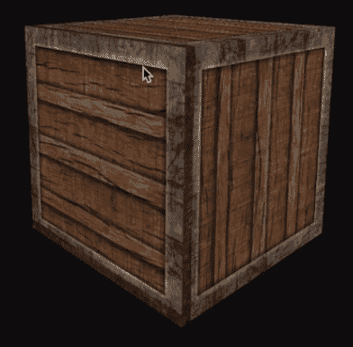
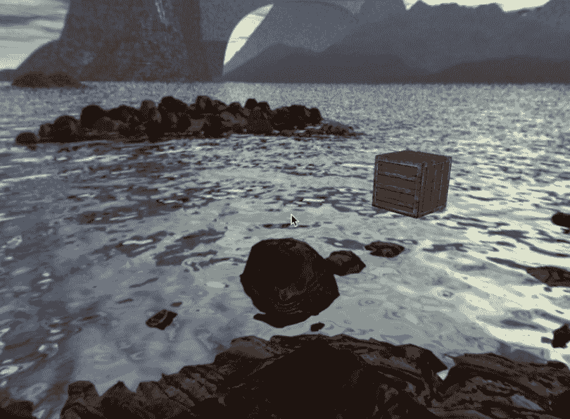

# 使用立方体贴图实现天空盒

在本章中，我们将使用立方体贴图创建一个天空盒。因此，让我们首先了解什么是立方体贴图。它是由多个纹理组合成单个纹理，形成一个立方体。它基本上是一系列六个单独的 2D 纹理，它们被映射到一个立方体上。它们通常会有某种图案，以这种方式从一侧流动到另一侧。天空盒本质上是一个立方体贴图，但非常大。玩家和游戏世界基本上位于这个大立方体内部。它包含整个场景的六个游戏环境图像；如果你作为一个玩家，身处天空盒中并试图环顾四周，你会感觉周围有一个高分辨率的宇宙。而且，如果你试图触摸立方体的边缘，你将无法做到，因为它离你无限远。在本章中，我们将学习如何使用立方体贴图实现天空盒，以在你的游戏中创建令人惊叹的世界。

我们将首先为我们的天空盒创建着色器。

你可以在 GitHub 的 `Chapter06` 文件夹中找到本章的所有代码文件。GitHub 链接可以在书的序言中找到。

# 为天空盒创建着色器

如往常一样，我们将从创建我们的着色器开始。我们将复制我们的着色器文件 `core.vs` 和 `core.frag`，并将这些复制的文件命名为 `skybox.vs` 和 `skybox.frag`。现在，我们将对这些着色器文件进行一些修改；看看以下步骤，以了解将要进行的更改：

1.  我们将从修改我们的 `skybox.vs` 着色器开始。看看以下代码，并在你的着色器文件中实现以下修改：

```cpp
#version 330 core 

layout (location = 0) in vec3 position; 

out vec3 TexCoords; 
uniform mat4 projection; 
uniform mat4 view; 
void main() 

{ 
    vec4 pos = projection * view * vec4(position, 1.0); 
    gl_Position = pos.xyww; 
    TexCoords = position; 
} 
```

修改完成后，保存文件。

1.  接下来，我们将转到 `Skybox.frag` 并对代码进行以下突出显示的更改：

```cpp
#version 330 core 
in vec3 TexCoords; 
out vec4 color; 
uniform samplerCube skybox; 
void main() 
{ 
    color = texture(skybox, TexCoords); 
} 
```

将这些更改保存到你的着色器中。

现在我们已经修改了着色器文件以实现天空盒，我们将继续修改 `main.cpp` 文件并创建我们的天空盒。

# 对 main.cpp 文件的修改

在 `main.cpp` 文件中，我们需要做一些修改。遵循以下步骤：

1.  首先，我们需要创建一个新的着色器对象，因此在我们定义 `GLfloat cubeVertices[]` 之前，我们需要添加 `Shader skyboxShader()`。我们将向其中传递着色器文件的路径：`"res/shaders/skybox.vs"` 和 `"res/shaders/skybox.frag"`。

1.  接下来，我们需要为天空盒添加更多的顶点。幸运的是，你可以参考位于 `advanced_opengl` 文件夹内的 `main.cpp` 文件中的那些顶点。将这些顶点添加到我们的代码中。

1.  一旦你设置了天空盒的顶点，你将需要为天空盒创建一个顶点数组对象和顶点缓冲区对象。所以，让我们现在就做吧。

1.  在我们定义了 `glBindVertexArray(0)` 之后，我们将添加 `GLuint skyboxVAO` 和 `skyboxVBO;`。

1.  然后，我们将添加 `glGenVertexArrays();`，顶点数组将接受参数 `1`，然后是一个天空盒顶点数组对象，`skyboxVAO`。接下来，我们将生成缓冲区到天空盒顶点缓冲对象中。

1.  因此，我们将添加 `glGenBuffers();` 并传递参数 `1` 和 `&skyboxVBO`。

1.  然后添加 `glBindVertexArray()`，我们将传递 `skyboxVAO` 给它。

1.  接下来，我们添加 `glBindBuffer()`，我们将传递 `GL_ARRAY_BUFFER` 和 `skyboxVBO`。这与我们在前几章中已经做过的非常相似，所以所有这些都应该非常熟悉。

1.  添加 `glBufferData()`，这里它将接受的第一个参数是 `GL_ARRAY_BUFFER`，以及天空盒顶点数组的尺寸。接下来，我们需要实际传递 `skyboxVertices`，最后，我们将它设置为 `GL_STATIC_DRAW`。

1.  然后，我们将添加 `GLEnableVertexAttribArray()`。我们将将其设置为 `0`。接下来，我们将添加 `glVertexAttribPointer()`。这将接受 `0`，`3`，`GL_FLOAT`，`GL_FALSE`，`3 * sizeof( GLfloat)`，`( GLvoid * ) 0`。请查看以下代码以了解描述：

```cpp
// Setup skybox VAO 

    GLuint skyboxVAO, skyboxVBO; 
    glGenVertexArrays( 1, &skyboxVAO ); 
    glGenBuffers( 1, &skyboxVBO ); 
    glBindVertexArray( skyboxVAO ); 
    glBindBuffer( GL_ARRAY_BUFFER, skyboxVBO ); 
    glBufferData( GL_ARRAY_BUFFER, sizeof( skyboxVertices ),
    &skyboxVertices, GL_STATIC_DRAW ); 
    glEnableVertexAttribArray( 0 ); 
    glVertexAttribPointer( 0, 3, GL_FLOAT, GL_FALSE, 3 * sizeof(
    GLfloat ), ( GLvoid * ) 0 ); 
    glBindVertexArray(0);  
```

# 创建 Texture.h 文件

接下来，我们将实际加载纹理，所以我们将创建一个单独的纹理文件，我们将有一个用于加载纹理的方法，还有一个用于加载立方体纹理的单独方法。这样做的原因是我们将经常使用此代码，而且我们每次都必须重写这些代码。如果我们想处理多个对象，尤其是，我们不希望每次都重写这些代码。让我们看看以下步骤来创建 `Texture.h` 文件：

1.  首先，我们将创建一个空的头文件，并将其命名为 `Texture.h`，然后将其添加到我们的项目中。

1.  然后，在 `Texture.h` 中，我们将添加以下代码：

```cpp
#pragma once 
```

1.  然后，我们将添加一些头文件，例如 `#define GLEW_STATIC`（如果你没有静态链接 GLEW，那么你不需要在这里放置此行），`#include <GL/glew.h>` 和 `#include <vector>`。

1.  接下来，我们将创建一个名为 `TextureLoading` 的类，并将所有代码添加到其中。

1.  我们将输入 `public`，我们将拥有的第一个方法是 `static GLuint LoadTexture()`，我们将传递 `GLchar *path` 给它。

1.  现在，我们将转到我们的 `main.cpp` 文件，并将所有加载和创建纹理以及纹理加载相关的代码剪切并粘贴到我们在上一步创建的 `LoadTextureMethod` 中。

1.  现在，让我们看看这里需要更改的内容；查看以下突出显示的代码以了解更改：

```cpp
static GLuint LoadTexture( GLchar *path ) 
    { 
        //Generate texture ID and load texture data 
        GLuint textureID; 
        glGenTextures( 1, &textureID );   
        int imageWidth, imageHeight; 
        unsigned char *image = SOIL_load_image( path, &imageWidth, 
        &imageHeight, 0, SOIL_LOAD_RGB ); 

        // Assign texture to ID 
        glBindTexture( GL_TEXTURE_2D, textureID ); 
        glTexImage2D( GL_TEXTURE_2D, 0, GL_RGB, imageWidth,
        imageHeight, 0, GL_RGB, GL_UNSIGNED_BYTE, image ); 
        glGenerateMipmap( GL_TEXTURE_2D );  

        // Parameters 
        glTexParameteri( GL_TEXTURE_2D, GL_TEXTURE_WRAP_S, 
        GL_REPEAT ); 
        glTexParameteri( GL_TEXTURE_2D, GL_TEXTURE_WRAP_T,
        GL_REPEAT ); 
        glTexParameteri( GL_TEXTURE_2D, GL_TEXTURE_MIN_FILTER,
        GL_LINEAR_MIPMAP_LINEAR ); 
        glTexParameteri( GL_TEXTURE_2D, GL_TEXTURE_MAG_FILTER,
        GL_LINEAR ); 
        glBindTexture( GL_TEXTURE_2D,  0); 
        SOIL_free_image_data( image );          
        return textureID; 
    } 

    static GLuint LoadCubemap( vector<const GLchar * > faces) 
    { 
        GLuint textureID; 
        glGenTextures( 1, &textureID );  
        int imageWidth, imageHeight; 
        unsigned char *image; 
            glBindTexture( GL_TEXTURE_CUBE_MAP, textureID ); 

      for ( GLuint i = 0; i < faces.size( ); i++ ) 
        { 
            image = SOIL_load_image( faces[i], &imageWidth,
            &imageHeight, 0, SOIL_LOAD_RGB ); 
            glTexImage2D( GL_TEXTURE_CUBE_MAP_POSITIVE_X + i, 0,
            GL_RGB, imageWidth, imageHeight, 0, GL_RGB,
            GL_UNSIGNED_BYTE, image ); 
            SOIL_free_image_data( image ); 
        } 

glTexParameteri( GL_TEXTURE_CUBE_MAP, GL_TEXTURE_MAG_FILTER, GL_LINEAR ); 
glTexParameteri( GL_TEXTURE_CUBE_MAP, GL_TEXTURE_MIN_FILTER, GL_LINEAR ); 
glTexParameteri( GL_TEXTURE_CUBE_MAP, GL_TEXTURE_WRAP_S, GL_CLAMP_TO_EDGE ); 
glTexParameteri( GL_TEXTURE_CUBE_MAP, GL_TEXTURE_WRAP_T, GL_CLAMP_TO_EDGE ); 
glTexParameteri( GL_TEXTURE_CUBE_MAP, GL_TEXTURE_WRAP_R, GL_CLAMP_TO_EDGE ); 
glBindTexture( GL_TEXTURE_CUBE_MAP, 0); 
return textureID; 

} 
```

1.  现在，我们回到 `main.cpp`，添加 `#include Texture.h`，然后来到代码中我们想要加载纹理的位置，在那里我们将添加以下代码来加载我们的纹理：`GLuint cubeTexture = TextureLoading::LoadTexture( "res/images/container2.png" )`，并且更新绑定的纹理代码，如这里所示：

```cpp
glBindTexture( GL_TEXTURE_2D, cubeTexture );   
```

现在，让我们运行它并检查我们的 `Texture.h` 代码是否成功构建，并且编译时没有错误。你应该在屏幕上看到以下输出：



目前这还不是立方体贴图，因为我们只是整理了纹理，但创建一个单独的纹理将使我们能够轻松地重用纹理加载。

# 将立方体贴图代码添加到 Texture.h

因此，我们现在实际上想要做的过程基本上与我们处理纹理文件时的过程相似，但针对立方体贴图。代码将非常相似，所以首先我们要做的是复制纹理加载代码并将其粘贴在下面。然后，我们将对代码进行以下突出显示的更改：

```cpp
static GLuint LoadCubemap( vector<const GLchar * > faces) 
    { 
        GLuint textureID; 
        glGenTextures( 1, &textureID );      
        int imageWidth, imageHeight; 
        unsigned char *image;
        glBindTexture( GL_TEXTURE_CUBE_MAP, textureID ); 
        for ( GLuint i = 0; i < faces.size( ); i++ ) 
        { 
            image = SOIL_load_image( faces[i], &imageWidth, &imageHeight,
            0, SOIL_LOAD_RGB );  
            glTexImage2D( GL_TEXTURE_CUBE_MAP_POSITIVE_X + i, 0, GL_RGB,
            imageWidth, imageHeight, 0, GL_RGB, GL_UNSIGNED_BYTE, image ); 
            SOIL_free_image_data( image ); 
        } 

        glTexParameteri( GL_TEXTURE_CUBE_MAP, GL_TEXTURE_MAG_FILTER,
        GL_LINEAR ); 

        glTexParameteri( GL_TEXTURE_CUBE_MAP, GL_TEXTURE_MIN_FILTER,
        GL_LINEAR ); 

        glTexParameteri( GL_TEXTURE_CUBE_MAP, GL_TEXTURE_WRAP_S,
        GL_CLAMP_TO_EDGE ); 

        glTexParameteri( GL_TEXTURE_CUBE_MAP, GL_TEXTURE_WRAP_T,
        GL_CLAMP_TO_EDGE ); 

        glTexParameteri( GL_TEXTURE_CUBE_MAP, GL_TEXTURE_WRAP_R,
        GL_CLAMP_TO_EDGE ); 

        glBindTexture( GL_TEXTURE_CUBE_MAP, 0); 
        return textureID; 
    }
```

在前面的代码中，我们添加了 `GLchars`，因为我们没有一条路径；记住，我们将会拥有六条不同的路径。然后，我们创建了 `for` 循环，因为我们想要轻松地遍历我们的六张不同图像，而且我们也不想重复代码，这正是我们这样做的主要目的。

因此，如果我们回到我们的主文件，它位于我们的 `main.cpp` 中，我们实际上可以完成我们正在做的事情。转到我们加载纹理文件的段落，并在该代码之后添加以下突出显示的代码：

```cpp
// Cubemap (Skybox) 

    vector<const GLchar*> faces; 
    faces.push_back( "res/images/skybox/right.tga" ); 
    faces.push_back( "res/images/skybox/left.tga" ); 
    faces.push_back( "res/images/skybox/top.tga" ); 
    faces.push_back( "res/images/skybox/bottom.tga" ); 
    faces.push_back( "res/images/skybox/back.tga" ); 
    faces.push_back( "res/images/skybox/front.tga" ); 
    GLuint cubemapTexture = TextureLoading::LoadCubemap( faces ) 
```

在前面的代码中，我们添加了立方体贴图纹理。这里的顺序很重要，所以你不能随意放置它。如果你从网站上下载了其他图像，你可能需要正确地重新排列它。

# 绘制天空盒

现在，我们实际上需要做的是，嗯，绘制天空盒，所以让我们开始按照这里显示的步骤进行：

1.  前往我们的代码中处理完所有模型矩阵的地方，我们将添加 `glDepthFunc()`；在那里，我们需要传递 `GL_LEQUAL`。这改变了深度函数，所以当值等于深度缓冲区的内容时，深度测试通过。

1.  接下来，我们将添加 `skyboxShader.Use()`。

1.  然后，添加 `view = glmm::mat4()`。在这里，我们将传递 `glm::mat3()`，并且我们将传递 `camera.GetViewMatrix()`。

1.  接下来，添加 `glUniformMatrix4fv()`。为此，我们将传递以下内容：

    `glGetUniformLocation( skyboxShader.Program, "view" ), 1, GL_FALSE, glm::value_ptr( view )`。

1.  我们还需要对投影矩阵做类似的事情。所以，我们将添加以下代码：`glUniformMatrix4fv( glGetUniformLocation( skyboxShader.Program, "projection" ), 1, GL_FALSE, glm::value_ptr( projection ) );`。

1.  现在我们需要做的是添加天空盒立方体。所以，添加 `glBindVertexArray();` 函数，并将 `skyboxVAO` 传递给它，然后添加 `glBindTexture()`。对于绑定纹理函数，它将是 `GL_TEXTURE_CUBE_MAP`。然后，添加我们通过 `LoadCubemap` 方法调用的 `cubemapTexture`。

1.  然后，添加 `glDrawArrays();`。我们将传递的参数如下：`GL_TRIANGLES`，`0`，`36`。再次强调，这只是一个立方体，所以这只是一个非常简单的事情。

1.  接下来，添加`glBindVertexArray()`。为此，传递`0`，就像我们通常做的那样。

1.  现在，我们只需要将`glDepthFunc()`设置回默认值，我们将传递`GL_LESS`；这仅仅是将它设置回默认状态。

现在，我们应该准备好运行了，让我们运行这个程序并检查屏幕上显示的输出。我们应该看到以下场景：



它确实看起来我们已经创建了一个 3D 世界。如果你尝试远离，你会看到立方体变得越来越小。但是，其他一切保持不变，因为我们将会无限远地远离所有侧面。

# 摘要

在本章中，我们使用立方体贴图生成了一个 Skybox，并学习了如何将其应用于各种纹理。我们还学习了如何在代码中创建单独的纹理文件来加载我们的纹理。此外，我们还学习了如何绘制 Skybox，并使用它创建我们的游戏世界。

在以下链接中有一个关于模型加载的附加章节：[`www.packtpub.com/sites/default/files/downloads/ModelLoading.pdf`](https://www.packtpub.com/sites/default/files/downloads/ModelLoading.pdf)

在本章中，你将学习如何在 Windows 上使用 CMake 设置 Assimp（Open Asset Import Library），以满足我们所有的模型加载需求。你还将学习如何创建网格类和模型类来处理我们的模型加载。
