# 第二章：创建你的第一个关卡

在本章中，你将在逐步说明的帮助下创建和运行一个简单的关卡。由于本书的目的是让你掌握使用 Unreal Engine 4 自信地创建自己的游戏技能，而不是简单地遵循一系列步骤来创建一个固定的示例，因此我将尽可能提供额外的信息，这些信息可以帮助你在学习基本技术的同时创建自己的游戏关卡。

在本章中，我们将介绍以下主题：

+   如何控制视图和视口

+   如何在关卡中移动、缩放和旋转对象

+   如何使用 BSP 盒子刷的**添加模式**创建地面和墙壁

+   如何使用 BSP 盒子刷的**减去模式**在墙上挖洞

+   如何向关卡中添加简单的**方向光**以模拟阳光

+   如何使用**玩家开始**在地图上生成面向正确方向的玩家

+   如何使用大气雾在你的地图中创建天空

+   如何保存你创建的地图并将其设置为项目的默认加载地图

+   如何将材质添加到你创建的几何体上，使其看起来更真实

+   如何复制 BSP 刷子以快速创建事物

+   如何将道具（也称为**静态网格**）添加到房间中

+   如何使用**光子重要性体积**将光线集中在地图的重要部分

# 探索预配置关卡

在我们创建关卡之前，了解 Unreal Engine 4 中的关卡外观是很有帮助的。Unreal Engine 4 提供了加载各种类型游戏关卡的可能性，包括一个默认的可玩关卡，该关卡直接来自**项目浏览器**菜单选项（在启动 Unreal 编辑器后立即弹出）。我个人非常喜欢 Unreal Engine 4 的这个新特性，因为它让我能快速了解可用的预设类型，并且我可以轻松选择一个作为我想要创建的游戏关卡的基础。

我们将使用预设项目类型之一作为基础，创建一个新的地图，作为我们第一个关卡。

### 小贴士

**如何快速探索不同的项目类型**

通常，在项目加载默认关卡后，我会点击工具栏上的**播放**按钮。播放功能允许你进入游戏，你可以看到在关卡中预先为你创建的内容。

# 创建新项目

在本章中，我们将使用**蓝图第一人称**模板来创建我们的第一个游戏项目。

创建新的**蓝图第一人称项目**的步骤如下：

1.  启动 Unreal Engine 4。

1.  选择**新建项目**选项卡。

1.  选择**蓝图**然后**第一人称**。

1.  选择项目的名称和路径（或保留默认的`MyProject`）。

1.  点击**创建项目**。

    确保已选中**包含启动内容**选项。

    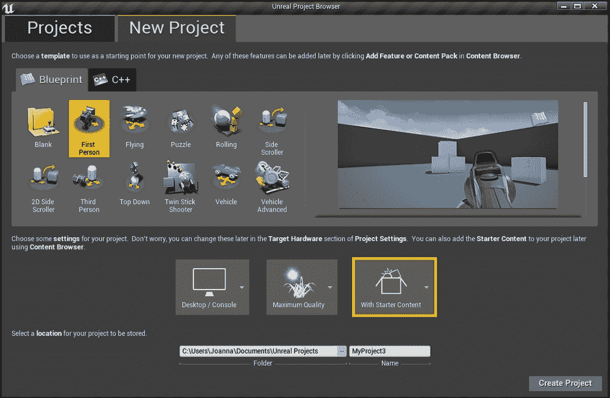

在创建项目时，蓝图第一人称的默认示例级别将加载。以下截图显示了默认级别的样子：

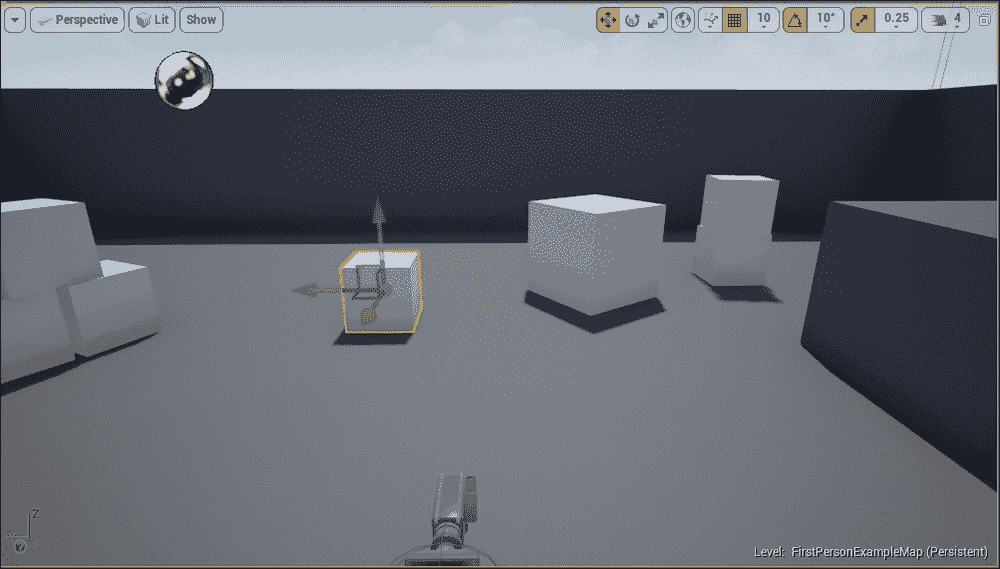

使用带有示例级别的预设项目类型，您可能首先想要运行级别并查看默认游戏级别包含的内容。

# 视口导航

使用加载的示例级别，您应该熟悉鼠标和键盘控制以便在视口中导航。您可能需要将此部分添加到书签中，直到您可以轻松地缩放或从所有角度查看任何对象。

## 视图

这里有一些关于 3D 建模创建中不同视图的快速信息：示例地图默认加载在 **透视** 视图中。除了在 **透视** 视图中显示地图外，您还可以分别更改在顶部、侧面或前视图中的视图内容。切换到这些视图之一的选项位于视口的左上角。以下截图显示了要按下的按钮位置，以便您切换视图：

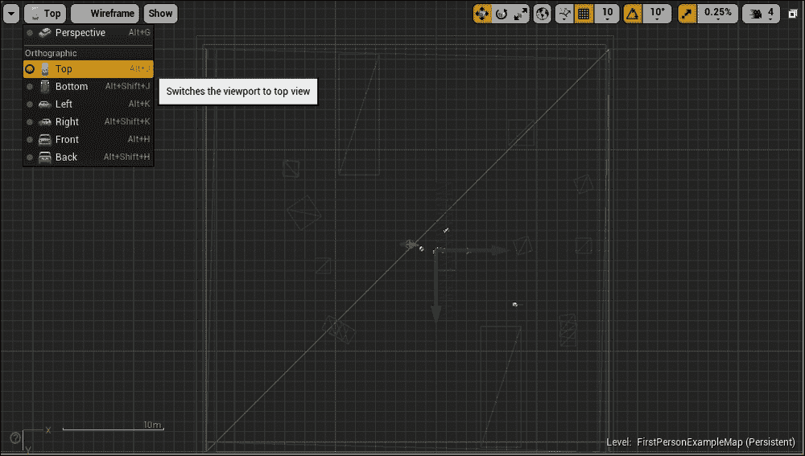

如果您想同时看到多个视图，请导航到 **Windows** | **视口** 并选择任何视口（默认视口使用 **视口 1**）。

选定的视口编号将弹出。您可以拖动并停靠此 **视口** 窗口并将其添加到默认的 **视口 1**。以下截图显示了同时显示 **视口 1** 和 **视口 2** 的样子（一个在 **透视** 视图中，另一个在 **顶** 视图中）：

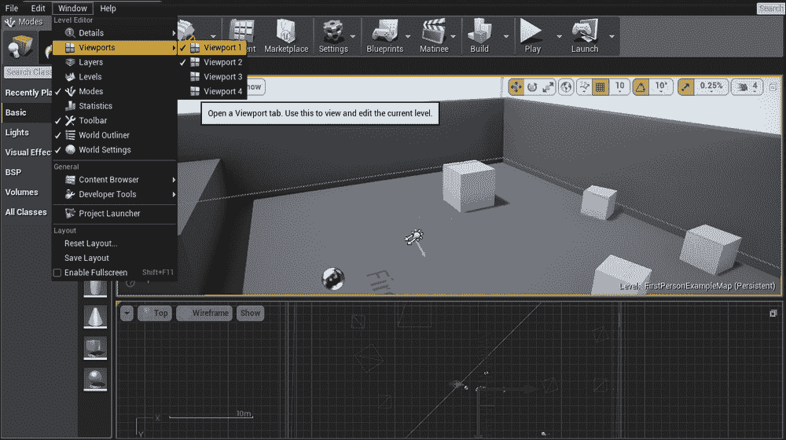

## 控制键

这里有一些按键可以帮助您移动和查看对象：

在 **透视** 视图中：

| 快捷操作 | 描述 |
| --- | --- |
| 左键点击 + 拖动 | 这将使摄像机前后移动并从左向右旋转 |
| 右键点击 + 拖动 | 这将旋转视口摄像机 |
| 左键点击 + 右键点击 + 拖动 | 这将使物体上下移动 |

在 **正交** （**顶**、**前** 和 **侧**） 视图中：

| 快捷键 | 描述 |
| --- | --- |
| 左键点击 + 拖动 | 这将创建一个选择框 |
| 右键点击 + 拖动 | 这将平移视口摄像机 |
| 左键点击 + 右键点击 + 拖动 | 这将缩放视口摄像机 |

对于熟悉游戏的您，您也可以在编辑器中使用 WASD 来导航摄像机。

**透视** 视图中的 WASD 控制：

| 快捷操作 | 描述 |
| --- | --- |
| 任意鼠标点击 + *W* | 这将使摄像机向前移动 |
| 任意鼠标点击 + *A* | 这将使摄像机向左移动 |
| 任意鼠标点击 + *S* | 这将使摄像机向后移动 |
| 任意鼠标点击 + *D* | 这将使摄像机向右移动 |

在选择对象时：

| 快捷操作 | 描述 |
| --- | --- |
| *W* | 这将显示 **平移** 工具 |
| *E* | 这将显示 **旋转** 工具 |
| *R* | 这显示的是**缩放**工具 |
| *F* | 这将相机聚焦到选定的对象上 |
| *Alt* + *Shift* + 沿着 *x*/*y*/*z* 轴拖动 | 这会复制一个对象并将其沿 *x*/*y*/*z* 轴移动 |

# 从新空白地图创建关卡

现在你已经熟悉了控制方式，你可以自己创建地图了。在本章中，我们将介绍如何从头开始构建一个基本房间。要为你的第一人称游戏创建一个新的地图，请转到**文件** | **新建关卡…**。以下截图显示了如何创建一个新的关卡：

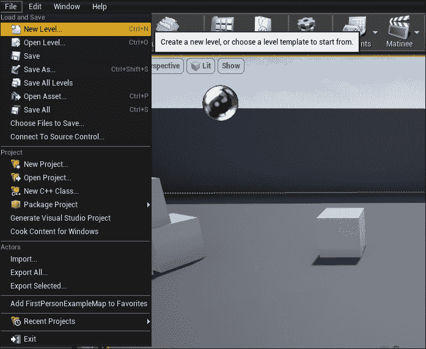

创建新关卡时有两个选项：**默认**和**空关卡**。选择**空关卡**以创建一个完全空白的地图。以下截图显示了创建新关卡时可以使用的选项：

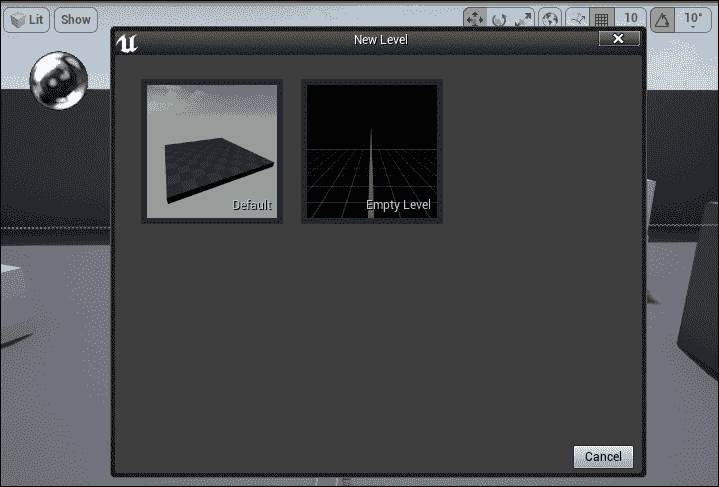

当视图中没有内容时，请不要感到惊讶。在接下来的几节中，我们将向关卡中添加对象。以下截图显示了在**透视**视图中空关卡的样子：

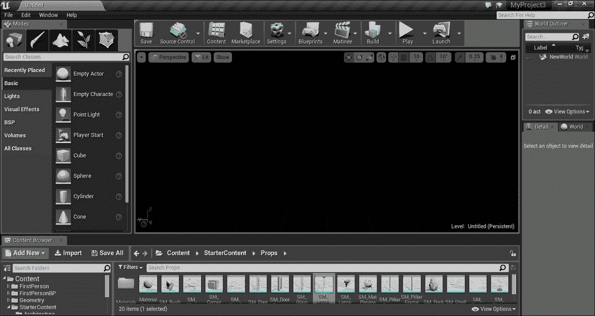

# 使用 BSP Box 刷子创建地面

BSP Box 刷子可以用来在地图中创建矩形对象。创建关卡的第一件事就是有一个可以站立的地面。

在我们开始之前，请确保视图中是**透视**视图。除非明确指定，否则我们将主要使用这个视图来创建大多数关卡。

前往**模式**窗口，点击**BSP**，然后点击并拖动**Box**到视图中。这就是你可以找到 Box 刷子的地方：

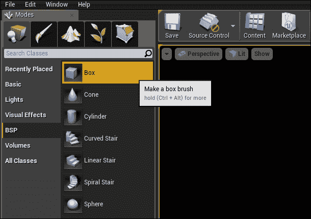

在这里，一个 Box 刷子已经被成功添加到视图中：

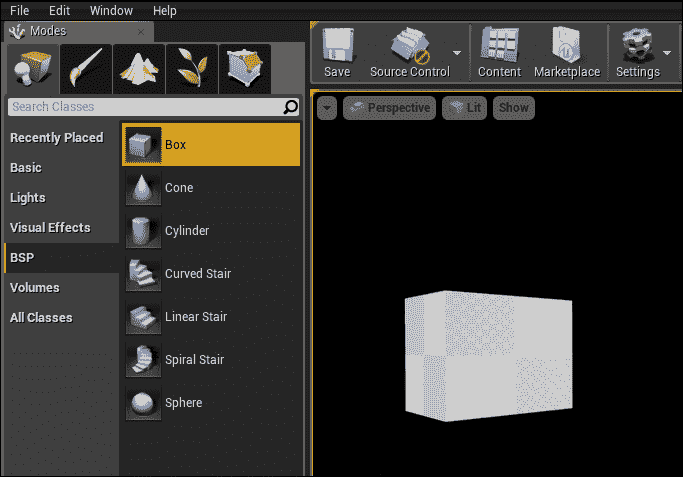

你现在已经在关卡中成功创建了第一个对象。接下来，我们将改变这个盒子的尺寸，使其成为一个合适的尺寸，以便它可以作为关卡的地面。

选择刚刚创建的盒子，转到**细节** | **刷子设置**。为**X**、**Y**和**Z**填写以下值。以下截图显示了需要设置的值：

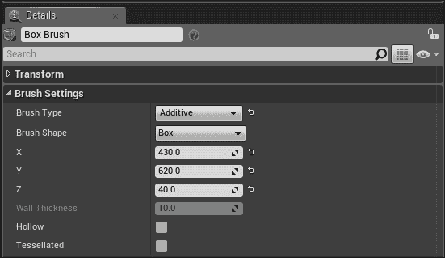

当你正确设置了值后，盒子应该看起来像这样：

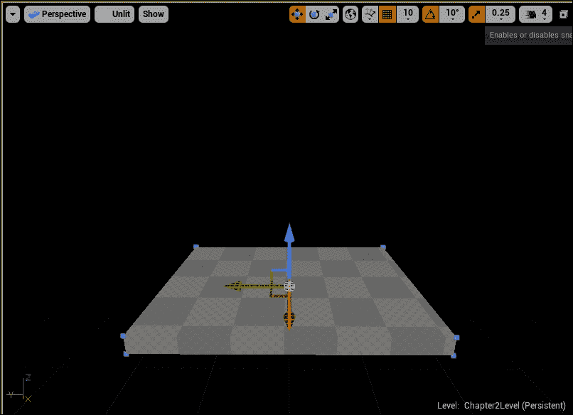

## 有用提示 - 轻松选择对象

为了帮助您更容易地在级别中选择对象，您可以转到**世界大纲**（其默认位置位于编辑器的右上角），您将看到级别中所有对象的完整列表。点击对象的名称以选择它，其详细信息也将显示出来。这是一种非常有用的方式，可以帮助您在级别中有许多对象时选择对象。以下截图显示了如何使用**世界大纲**在级别中选择 Box 刷子（我们刚刚创建的）：

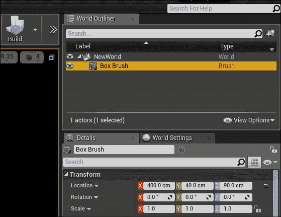

## 有用提示 - 更改视图模式以辅助视觉效果

如果你难以看到盒子，你可以将**视图模式**更改为**未照明**（按钮位于与**透视**按钮相邻的视图中）。以下截图显示了如何将**视图模式**更改为**未照明**：

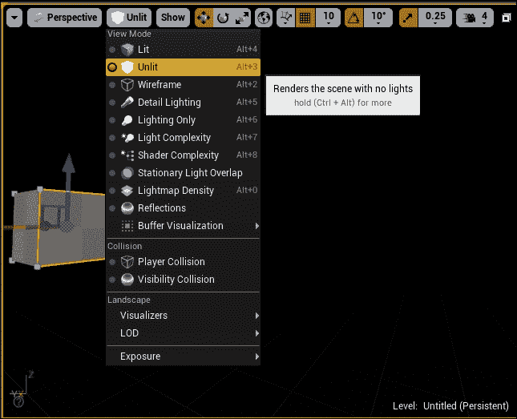

# 向级别添加灯光

为了帮助我们更好地看到级别，现在是时候学习如何照亮级别了。为了模仿来自太阳的环境光，我们将为级别使用**方向光**。

与添加 BSP Box 刷子的方式相同，我们将转到**模式窗口** | **灯光** | **方向光**。点击并拖动**方向光**到**视口**窗口中。以下截图放大了**模式**窗口，显示**方向光**项可以通过拖动到视图中来创建：

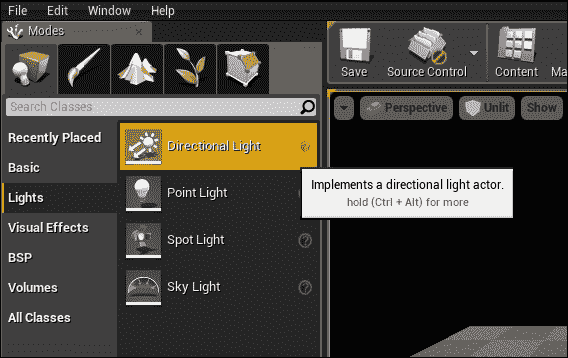

目前，让我们将灯光放置在 BSP Box 刷子略微上方，如图下所示：

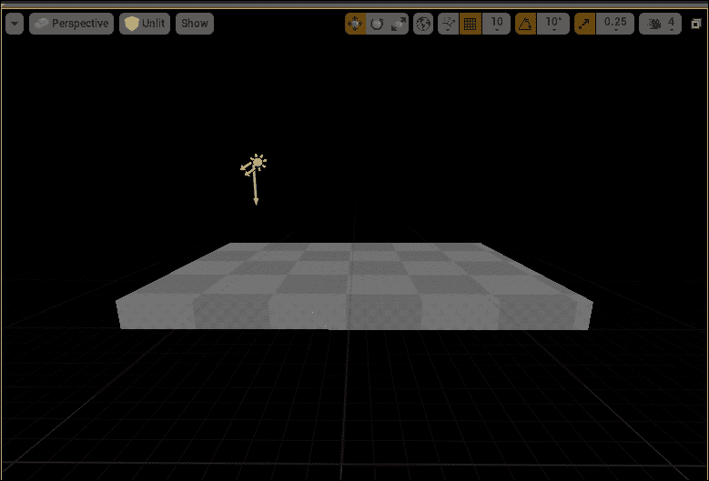

## 有用提示 - 在级别中定位对象

要在级别中定位对象，我们使用**变换**工具在 x、y 和 z 方向上移动对象。选择对象并按*W*键显示**变换**工具。将出现三个箭头，从对象中伸出。点击并按住红色箭头以沿*x*轴移动对象，绿色箭头以沿*y*轴移动它，蓝色箭头以沿*z*轴移动它。

为了帮助您更准确地定位对象，您也可以在移动对象时切换到**顶视图**，以在 x 和 y 方向上移动对象，**侧视图**用于 y 和 z 方向的调整，以及**前视图**以调整 x 和 z 方向。 

对于那些想要精确位置控制的人来说，你可以使用**细节**。选择要显示详细信息的对象。转到**变换** | **位置**。通过点击**位置**旁边的箭头，你可以选择**相对**或**世界位置**。更改**X**、**Y**和**Z**值以更精确地移动对象。

# 向级别添加天空

在为关卡添加光照之后，我们将继续添加天空到关卡中。点击**模式** | **视觉** | **大气雾**。以添加光照和添加 Box BSP 相似的方式，点击、按住并拖动它到视图中。我们几乎准备好查看我们刚刚创建的内容了。请耐心等待。

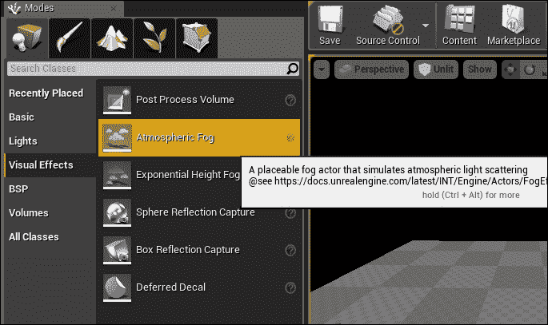

# 添加玩家起始点

对于每个游戏，您需要设置玩家将出生的位置。转到**模式** | **基本** | **玩家起始点**。点击、按住并拖动**玩家起始点**到视图中。

这张截图显示了带有**玩家起始点**的**模式**窗口：

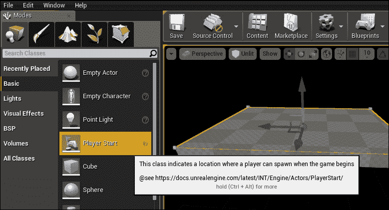

将**玩家起始点**放置在地面中心或略高于地面，如图所示：

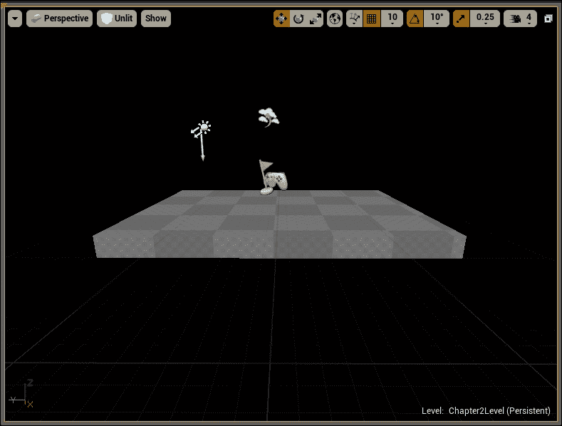

通过按*Esc*键取消选择`Player Start`。从`Player Start`发出的浅蓝色箭头指示玩家开始游戏时将出生的方向。要调整玩家出生时面对的方向，旋转`Player Start`直到浅蓝色箭头指向这个方向。查看以下关于如何旋转对象的提示。

## 有用的提示 – 在关卡中旋转对象

要在关卡中旋转对象，我们使用**旋转**工具围绕 x（行）、y（俯仰）和 z（偏航）方向旋转对象。选择对象并按*E*键以显示**旋转**工具。将出现三条带有方框尖端的线从对象中延伸出来。点击并按住红色箭头以围绕*x*轴旋转对象，绿色箭头以围绕*y*轴旋转对象，蓝色箭头以围绕*z*轴旋转对象。

另一种更精确地旋转对象的方法是通过控制在**详细信息**下找到的实际旋转值。 (选择要旋转的对象以显示其详细信息)。在**变换**选项卡中，转到**旋转**，并将**X**、**Y**和**Z**值设置为旋转对象。**旋转**旁边有一个箭头，您可以点击以选择是否要调整**相对**或**世界**的旋转值。当您选择使用**相对**设置旋转对象时，对象将相对于其当前位置旋转。当对象使用**世界**设置旋转时，它将相对于世界的位置。

如果您想让玩家控制器（如前一张截图所示）的浅蓝色箭头朝内并远离您，您需要将玩家控制器绕*y*轴旋转 180 度。在**相对**设置下输入**Y**为`180`。玩家控制器将以本截图所示的方式旋转：

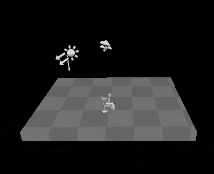

# 查看已创建的关卡

现在，我们已经准备好查看我们刚刚创建的简单关卡。

在查看关卡之前，点击以下截图所示的**构建**按钮，以构建此关卡所需的光、材质等。这一步确保光线在关卡中正确渲染。

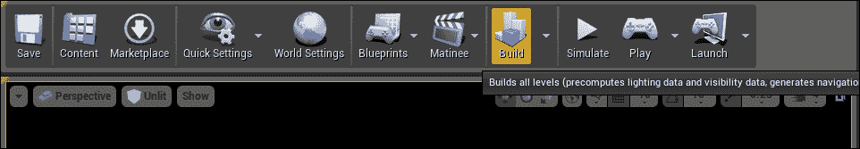

在构建完关卡后，点击此截图所示的**播放**按钮，以查看关卡：

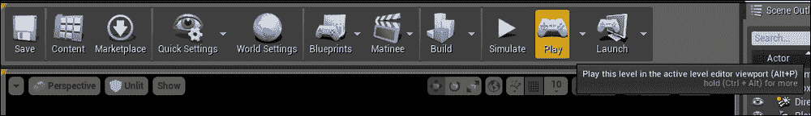

以下截图显示了关卡的外观。上下左右移动鼠标以查看关卡。使用*W*、*A*、*S*和*D*在关卡中移动角色。要返回编辑器，请按*ESC*。

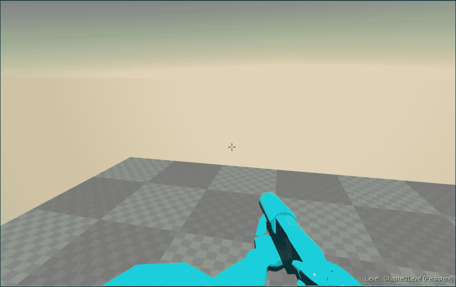

# 保存关卡

导航到**文件** | **另存为…**，并给您刚刚创建的地图起一个名字。在我们的例子中，我已经将其保存为`Chapter2Level`，在`…/UnrealProjects/MyProject/Content/Maps`路径下，其中`MyProject`是项目的名称。

# 将地图配置为起始关卡

保存您的新地图后，您可能还想将此项目设置为默认加载此地图。您可以为此项目链接多个地图，并在游戏中的特定点加载它们。目前，我们想用我们新创建的地图替换当前的`Example_Map`。为此，请转到**编辑** | **项目设置**。这会打开一个包含项目可配置值的页面。转到**游戏** | **地图与模式**。参考以下截图，看看如何选择**地图与模式**。

在**默认地图**下，更改您刚刚保存的地图中的**游戏默认地图**和**编辑器默认地图**。在我的情况下，它将是`Chapter2Level`。然后，关闭项目设置。当您下次启动编辑器和运行游戏时，您的新的地图将默认加载。

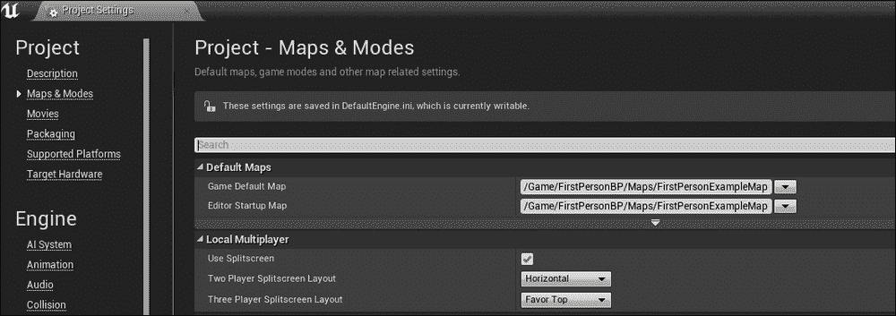

# 向地面添加材质

现在我们已经创建了地面，让我们通过应用材质使地面看起来更逼真。

转到**内容浏览器** | **内容** | **起始内容** | **材质**。在**过滤器**框中输入`wood`。以下截图显示了我们要用于地面材质的核桃抛光材质：

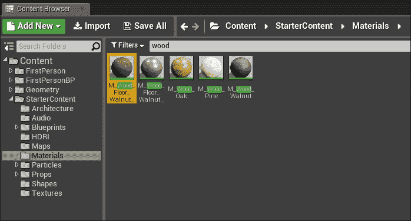

点击、按住并拖动**M_Wood_Floor_Walnut_Polished**到视口区域，并将其放置在地面的顶部表面。产生的效果应该看起来像这样：

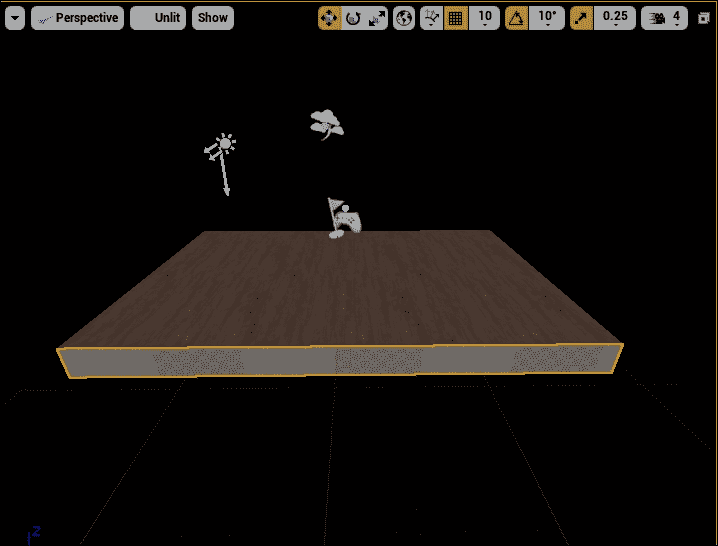

# 添加墙壁

现在我们已经准备好添加墙壁以防止玩家从地图上掉落。为了创建墙壁，我们将使用相同的 BSP Box 刷来创建墙壁。由于我们在上一步中添加了材质，您需要通过在**内容浏览器**中点击任何东西来清除此材质选择。这将防止使用相同材质创建新的几何形状。

与创建地面类似，转到**模式** | **BSP** | **盒子**。点击、按住并拖动到视图中。设置 BSP 盒子的尺寸为 X = 30，Y = 620，Z = 280。为了帮助我们查看和定位墙壁，使用控制来旋转视图。你也可以使用不同的视图来帮助将墙壁定位到地面上。在这里，你可以看到墙壁应该如何定位（注意，我已经将相机平移以从不同的角度查看级别）：

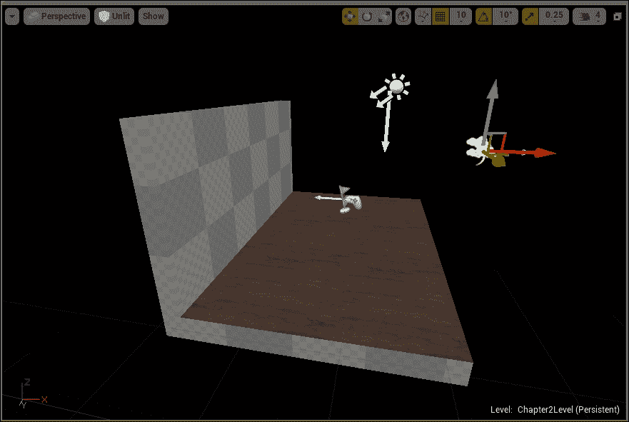

# 复制墙壁

现在首先选择在前面步骤中创建的墙壁，以复制墙壁。确保**变换**工具是显示的（如果不是，当对象被选中时按 *W* 键一次）。

按住 *Alt* + *Shift* 键的同时，点击并拖动一个坐标轴（例如前一个示例中的 *x* 轴），你会注意到在这个方向上还有一个墙壁的副本在移动。当墙壁处于正确的位置时，释放按键。使用正常的平移控制来将墙壁定位到如下所示的位置：

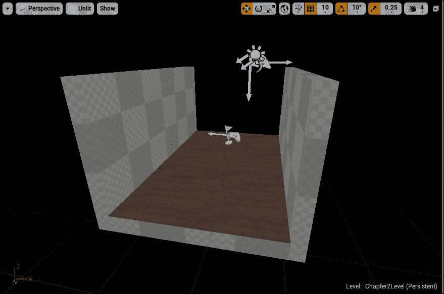

# 为门创建开口

房间现在几乎完成了。我们将学习如何雕刻 BSP 盒子刷子以创建门的开口。

将一个新的 BSP 盒子刷子拖放到地图中：X = 370，Y = 30，Z = 280。将这个墙壁定位到如下截图所示的位置，以封闭房间的一侧：

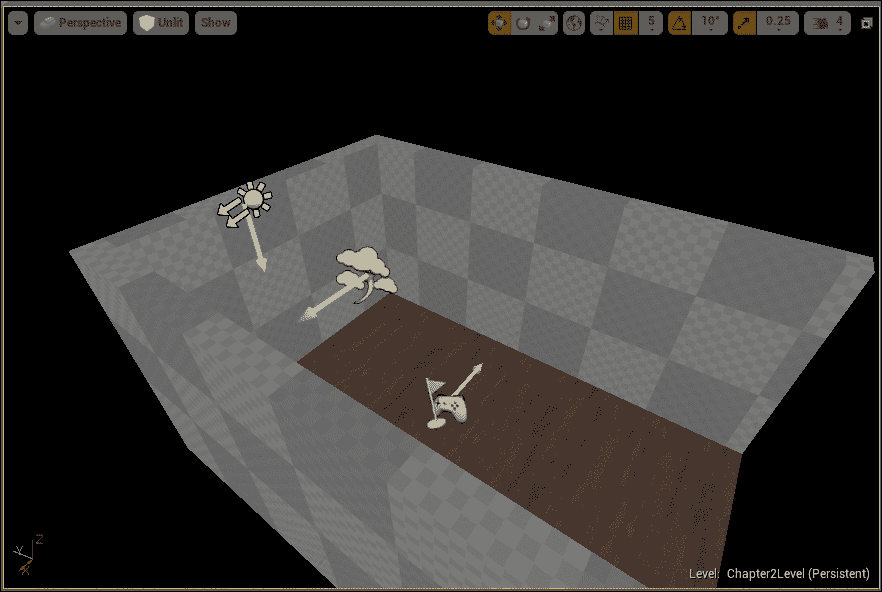

到目前为止，我们一直在使用**加法**模式（选择已选中的单选按钮）来创建 BSP 盒子刷子。为了在墙上创建一个开口，我们将使用**减法**模式创建另一个 BSP 盒子刷子。确保你已经按照以下截图所示选择了它。以前面的方式将 BSP 盒子刷子拖放到视图中。至于这个刷子的尺寸，我们将将其近似到门的尺寸，其中 X = 115，Y = 30，Z = 212。

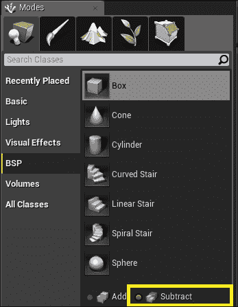

当**减法**BSP 盒子刷子放置正确时，它看起来会像这样：

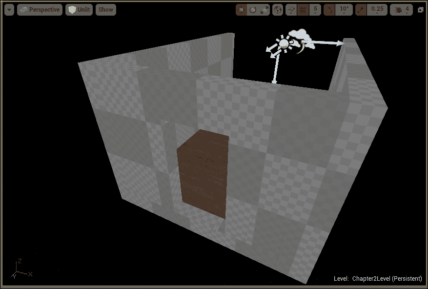

为了帮助你定位**减法**BSP 盒子刷子，你可以切换到**前视图**以将门放置在中心附近。以下截图显示了**前视图**和选中的**减法**BSP 盒子刷子：

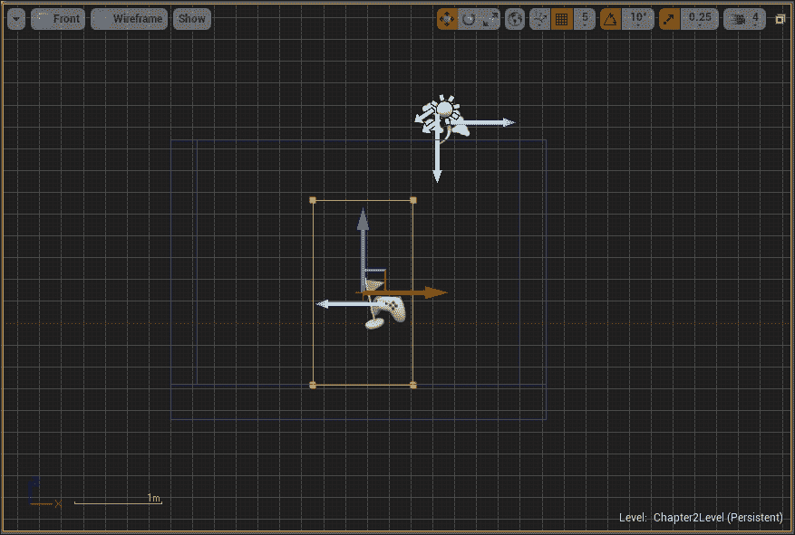

# 添加材质到墙壁

为了使地面看起来更逼真，我们将给它应用一种材质。转到**内容浏览器** | **内容** | **起始内容** | **材质**。在**过滤器**框中输入`Wall`。选择**M_Basic_Wall**并将其拖放到带有门的墙壁表面上。然后，我们将使用不同的材质。在**过滤器**框中输入`Brick`。选择**M_Brick_Clay_New**并将其应用到另外两面墙壁的内表面。

在这里，你可以看看在应用之前提到的材质后，关卡在**未照明**模式下的样子：

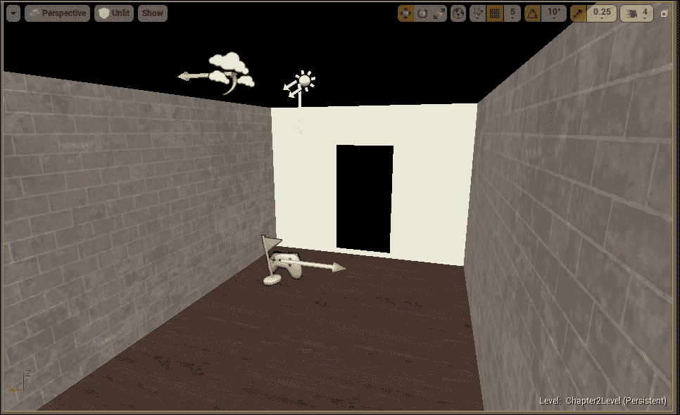

在再次运行关卡之前建立灯光，以查看关卡现在的样子。

# 封闭房间

现在，让我们复制带有门的墙来封闭房间。单击墙，按住*Alt* + *Shift*，并将其拖到房间的另一侧。以下屏幕截图显示了房间封闭后的样子：

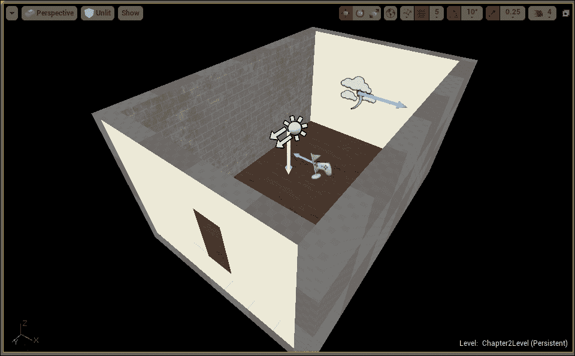

# 将道具或静态网格添加到房间中

现在让我们向空房间添加一些物体。转到**内容浏览器** | **内容** | **起始内容** | **道具**。找到**SM_Lamp_Ceiling**并将其拖放到房间中。

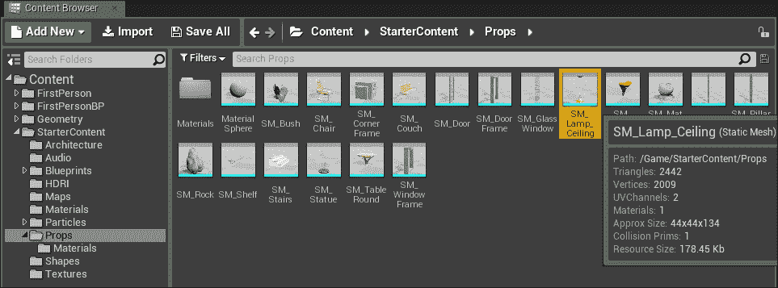

由于我们想要使用天花板灯道具作为地板灯，你需要通过围绕*x*轴旋转 180 度来旋转灯。使用**相对**模式将 X 设置为 180 度。以下屏幕截图显示了旋转后的灯位于房间一端的位置。注意，我已经建立了灯光并更改了视图模式为**照明**模式。你可以随意放置灯，看看它看起来如何。

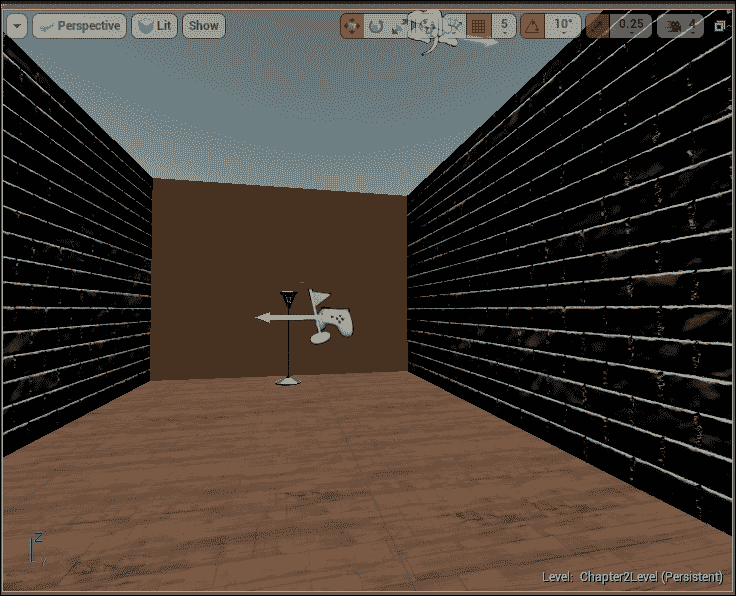

# 添加光质量重要性体积

由于我们的房间在地图上只占据一小部分，我们可以通过在地图中添加一个名为**光质量重要性体积**的项目来集中光线在一个小区域内。**光质量重要性体积**的边界框告诉引擎在地图中需要光的地方，因此它应该包括地图上所有物体的整个区域。将**光质量重要性体积**拖放到地图中。在这里，你可以看到如何找到**光质量重要性体积**：

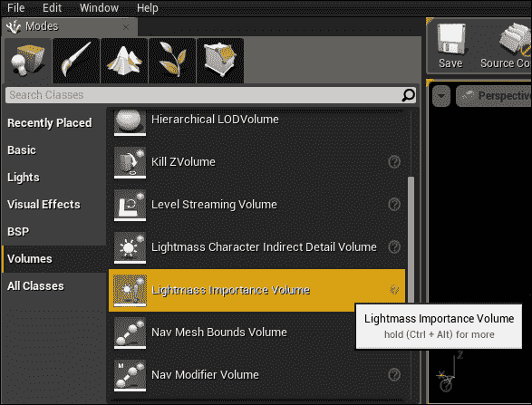

默认情况下，放置的线框盒（即**光质量重要性体积**）是一个立方体。你需要将其缩放以适应你的房间。选择**光质量重要性体积**后，按*R*键显示**缩放**工具。使用*x*、*y*和*z*轴调整盒子的大小，直到它适合关卡。以下屏幕截图显示了使用**缩放**工具缩放盒子：

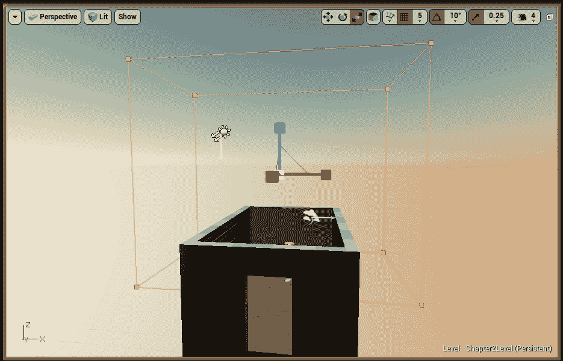

在将盒子缩放并平移以适应关卡后，**光质量重要性体积**应该看起来像以下屏幕截图所示，其中线框盒足够大，可以容纳房间内部。**光质量重要性体积**的线框大小可以大于地图。

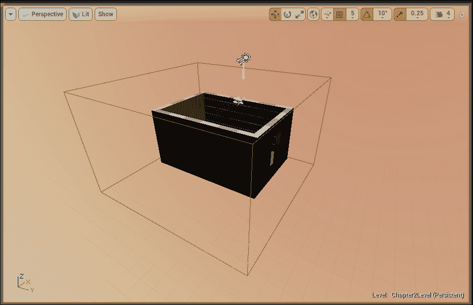

# 为房间添加完成细节

我们的房间几乎完成了。你可能会注意到门现在只是墙上的一个洞。为了使其看起来像门，我们需要添加门框和门，如下所示：

1.  前往**内容浏览器** | **内容** | **StarterContent** | **Props**。

1.  点击并放下**SM_DoorFrame**到视口中。

1.  调整它以适应墙壁。

完成后，它应该看起来像以下截图所示。

我已经使用了不同的视角，如顶部、侧面和正面，来调整框架，使其完美地适应门。你可以调整**Snap Sizes**进行微调。

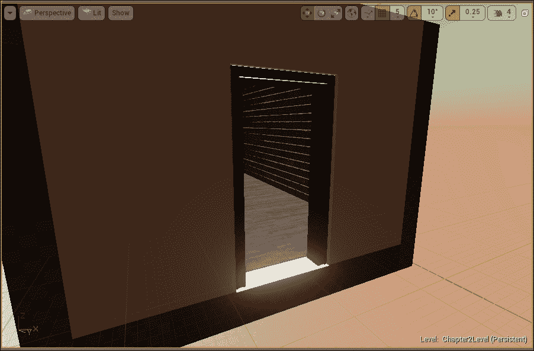

## 实用技巧 - 使用拖动捕捉网格

为了帮助你更准确地移动对象到位置，你可以使用视口顶部的捕捉网格按钮，如下截图所示。开启拖动捕捉网格允许你根据所选的网格大小移动对象。点击网格状的符号来切换捕捉网格的开启/关闭。右侧显示的数字是对象移动时的最小网格大小。

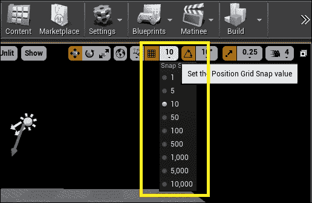

我还注意到地板的一部分还没有上纹理。使用你之前使用的相同木纹纹理，确保地面使用**M_Wood_Floor_Walnut_Polished**完全上纹理。

然后，点击并拖动**SM_Door**到视口中。以与之前相同的方式旋转门，使其适应门框。在这里，你可以看到门已经就位：

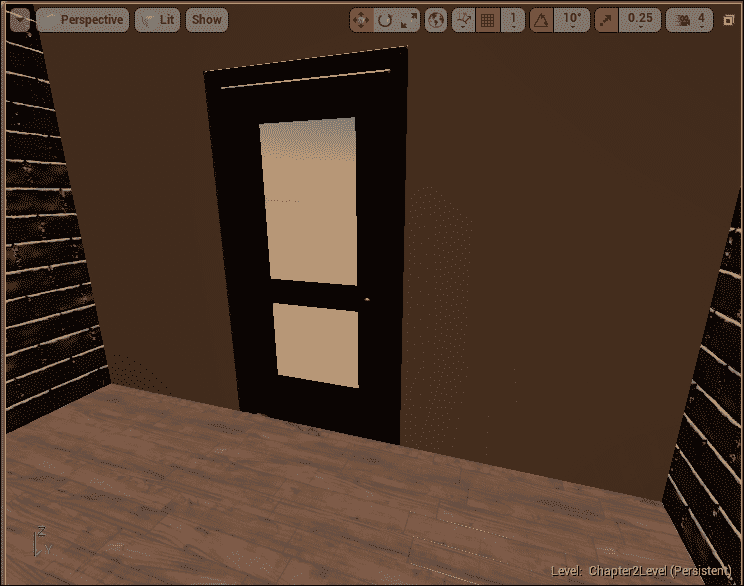

# 摘要

我们已经学习了如何在新的项目中导航视口并设置/保存新地图。我们还使用 BSP Box 刷子创建了第一个带有门的房间，为墙壁和地板添加了材质，并学会了放置静态对象以增强房间的外观。尽管现在它仍然有点空旷，我们将在接下来的几章中继续对其进行工作，并扩展这个地图。在下一章中，我们将通过添加一些可以与之交互的对象来为关卡增添活力。
