# 第三章. 游戏对象 – 更多和移动

我们在第二章 *创建你的第一个关卡*中在虚幻编辑器中创建了我们的第一个房间。在本章中，我们将介绍一些关于我们用于在第二章 *创建你的第一个关卡*中原型化关卡的结构的信息。这是为了确保你在继续前进之前对一些重要核心概念有坚实的基础。然后，我们将逐步介绍各种概念，使对象在玩家的交互下移动。

在本章中，我们将涵盖以下主题：

+   BSP 刷子

+   静态网格

+   纹理和材质

+   碰撞

+   体积

+   蓝图

# BSP 刷子

我们在第二章 *创建你的第一个关卡*中广泛使用了 BSP 盒刷来创建地面和墙壁。

BSP 刷子是游戏开发中关卡创建的主要构建块。它们被用来快速原型化关卡，就像我们在第二章 *创建你的第一个关卡*中使用的那样。

在虚幻引擎中，BSP 刷子以原语（盒子、球体等）和预定义/自定义形状的形式出现。

## 背景

BSP 代表**二叉空间划分**。BSP 树的结构允许快速访问空间信息以进行渲染，尤其是在由多边形组成的 3D 场景中。场景递归地分为两个部分，直到 BSP 树的每个节点只包含可以任意顺序渲染的多边形。场景通过从给定节点（视点）向下遍历 BSP 树来渲染。

由于场景是使用 BSP 原则划分的，因此在关卡中放置对象可以看作是在场景的 BSP 分区中进行切割。几何刷子使用**构造实体几何**（**CSG**）技术来创建多边形表面。CSG 通过使用布尔运算符（如并集、减法和交集）组合简单的原语/自定义形状，以在关卡中创建复杂形状。

因此，CSG 技术用于创建关卡中对象的表面，而渲染关卡则是基于使用 BSP 树对这些表面进行处理。这种关系导致几何刷子也被称为 BSP 刷子，但更准确地说，是 CSG 表面。

## 刷子类型

BSP 刷子可以是加法或减法性质。加法刷子就像填充空间的体积。在第二章 *创建你的第一个关卡*中，我们使用了加法刷子来制作地图的地面和墙壁。

减法刷子可以用来形成空心空间。这些在第二章 *创建你的第一个关卡*中用来在墙上开洞放置门及其框架。

## 刷子坚固性

对于加法刷子，它可能处于以下各种状态：实心、半实心或非实心。

由于减法笔刷创建空隙，玩家可以在其中自由移动。减法笔刷只能是实体笔刷。

请参考以下表格比较它们的属性：

| 笔刷实体性 | 笔刷类型 | 阻挡程度 | BSP 切割 |
| --- | --- | --- | --- |
| 实体 | 添加和减去 | 阻挡玩家和弹体 | 对周围世界几何体造成 BSP 切割 |
| 半实体 | 仅添加 | 阻挡玩家和弹体 | 不会对周围世界几何体造成 BSP 切割 |
| 非实体 | 仅添加 | 不阻挡玩家或弹体 | 不会对周围世界几何体造成 BSP 切割 |

# 静态网格

静态网格是由多边形组成的几何形状。更微观地看，一个网格是由连接顶点的线条组成的。

静态网格的顶点不能被动画化。这意味着你不能对网格的一部分进行动画处理，并使该部分相对于自身移动。但整个网格可以被平移、旋转和缩放。我们在第二章“创建您的第一个关卡”中添加的灯和门就是静态网格的例子。

与低分辨率网格相比，高分辨率网格具有更多的多边形。这也意味着高分辨率网格具有更多的顶点。高分辨率网格需要更多的时间来渲染，但能够提供更多的细节。

静态网格通常首先在外部软件程序中创建，例如 Maya 或 3ds Max，然后导入 Unreal 以放置在游戏地图中。

我们在第二章“创建您的第一个关卡”中添加的门、其框架和灯都是静态网格。请注意，这些对象不是简单的几何形状。

# BSP 笔刷与静态网格

在游戏开发中，游戏中的许多对象都是静态网格。为什么是这样呢？静态网格被认为更高效，特别是对于具有许多顶点的复杂对象，因为它们可以被缓存到视频内存中，并由计算机的显卡绘制。因此，在创建对象时，静态网格更受欢迎，因为它们具有更好的渲染性能，即使是复杂对象也是如此。然而，这并不意味着 BSP 笔刷在创建游戏时没有作用。

当 BSP 刷子简单时，它仍然可以用来而不会对性能造成太大的影响。BSP 刷子可以在 Unreal 编辑器中轻松创建，因此它对于游戏/关卡设计师的快速原型设计非常有用。简单的 BSP 刷子可以在建模艺术家正在创建实际的静态网格时作为临时占位符对象创建和使用。创建静态网格需要时间，对于高度详细的静态网格来说更是如此。我们将在本章后面简要介绍静态网格创建流程，以便我们了解将静态网格放入游戏所需完成的工作量。因此，BSP 刷子非常适合在没有等待所有静态网格创建的情况下进行早期游戏测试。

# 使静态网格可移动

让我们打开我们在第二章，*创建您的第一个关卡*中创建的已保存地图，并首先将其保存为新的`Chapter3Level`。

1.  进入**内容浏览器** | **内容** | **启动内容** | **道具**，搜索**SM_Chair**，这是一个标准的静态网格道具。点击并拖动它到我们的地图中。

1.  现在关卡中的椅子是不可移动的。您可以快速构建和运行关卡来检查它。要使其可移动，我们需要在椅子的详细信息下更改一些设置。

1.  首先，确保**SM_Chair**被选中，转到**详细信息**选项卡。转到**变换** | **移动性**，将其从**静态**更改为**可移动**。看看以下截图，它描述了如何使椅子可移动：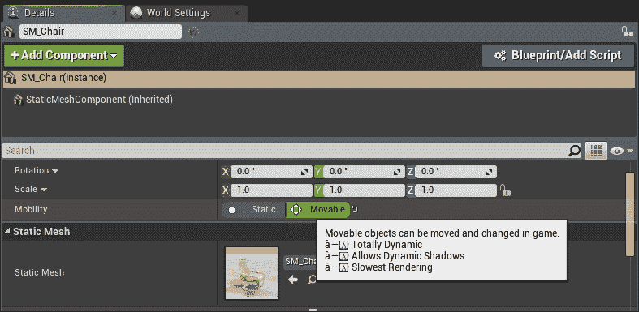

1.  接下来，我们想让椅子能够响应我们。在**详细信息**选项卡中向下滚动一点，更改椅子的**物理**设置。转到**详细信息** | **物理**。确保**模拟物理**复选框被勾选。当此复选框被勾选时，自动链接设置将**碰撞**设置为**物理 Actor**。以下截图显示了椅子的**物理**设置：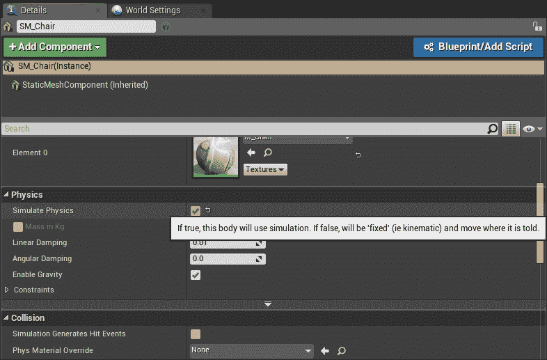

让我们现在构建并玩这个关卡。当你走进椅子时，你将能够推动它。只是要注意，椅子仍然被称为静态网格，但现在它是可移动的。

# 材质

在第二章，*创建您的第一个关卡*中，我们选择了一款核桃抛光材质并将其应用于地面。这改变了简单暗淡的地面，变成了棕色抛光木地板。使用材质，我们能够改变物体的外观和感觉。

这里对材质的简要介绍是因为这是一个在我们能够构建静态网格之前需要了解的概念。我们已经知道在游戏中我们需要静态网格，我们不能仅仅依赖于默认地图包中有限的选项。我们需要知道如何创建自己的静态网格，并且我们高度依赖于材质来赋予静态网格外观和感觉。

因此，在创建自定义静态网格时，我们何时应用材质？材质是在编辑器外部的创建过程中应用于静态网格的，我们将在本章后面的部分进行介绍。现在，让我们首先学习如何在编辑器中构建材质。

## 在 Unreal 中创建材质

为了完全理解材质的概念，我们需要将其分解为其基本组成部分。一个表面的外观是由许多因素决定的，包括颜色、图案/图案/设计的存在、反射性、透明度等等。这些因素结合在一起赋予表面其独特的样子。

在 Unreal Engine 中，我们可以通过使用材质编辑器来创建我们自己的材质。根据前面的解释，材质是由许多因素决定的，所有这些因素结合在一起赋予材质其独特的外观和感觉。

Unreal Engine 提供了一个基础材质节点，它包含一系列可定制的因素，我们可以利用这些因素来设计我们的材质。通过为不同的因素赋予不同的值，我们可以创造出我们自己的材质。让我们来看看我们在第二章中使用的材质背后是什么，*创建你的第一个关卡*。

打开**内容浏览器** | **内容** | **入门内容** | **材质**，双击**M_Brick_Clay_New**。这会打开材质编辑器。以下截图显示了砖泥材质的基础材质节点的放大版本。你可能注意到**基础颜色**、**粗糙度**、**法线**和**环境遮蔽**都有输入到基础**M_Brick_Clay_New**材质节点中。这些输入使砖墙看起来像砖墙。

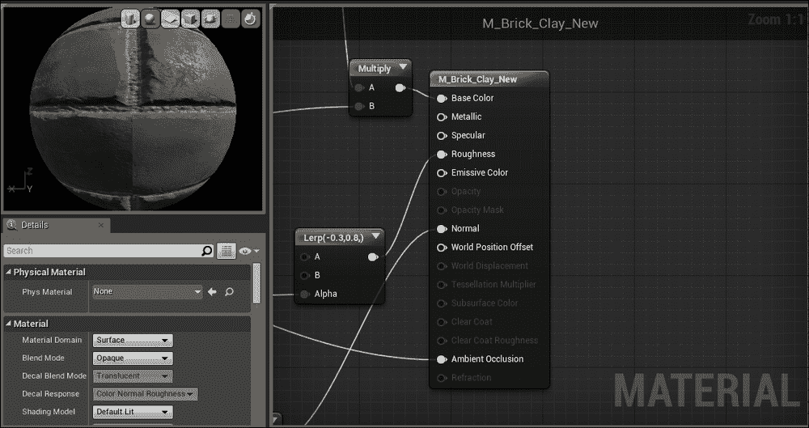

这些节点的输入可以来自各种来源。以**基础颜色**为例，我们可以使用 RGB 值定义颜色，或者从纹理输入中获取颜色。纹理是以`.bmp`、`.jpg`、`.png`等格式存在的图像，我们可以使用 Photoshop 或 ZBrush 等工具创建它们。

我们将在本书稍后更详细地讨论材质的构建。现在，让我们记住，材质应用于表面，纹理是我们可以用作组合来赋予材质整体视觉外观的东西。

## 材质与纹理的比较

注意到我在上一节中同时使用了材料和纹理。这对于游戏开发的新手来说常常会引起相当多的困惑。材料是我们应用到表面上的东西，它们由不同纹理的组合构成。材料根据指定的属性从纹理中获取属性，包括颜色、透明度等等。

如前所述，纹理是简单的图像，格式如`.tga`、`.bmp`、`.jpg`、`.png`等。

## 纹理/UV 映射

现在，我们了解到自定义材料是由纹理和材料的组合构成的，材料被应用到表面上，以赋予多边形网格其身份和真实感。下一个问题是，我们如何将这些与材料一起提供的众多纹理应用到表面上？我们只是简单地将其粘贴到 3D 对象上吗？我们必须有一种可预测的方式来将这些纹理绘制到表面上。所使用的方法被称为**纹理映射**，它由 Edwin Catmull 在 1974 年首创。

纹理映射将纹理图像的像素分配到多边形表面的一个点上。这个纹理图像被称为**UV 纹理图**。我们使用 UV 作为 XY 坐标的替代品的原因是因为我们已经在使用 XY 来描述对象的几何空间。因此，UV 坐标是纹理的 XY 坐标，它仅用于确定如何绘制 3D 表面。

### 如何创建和使用纹理图

我们首先需要将网格在其接缝处展开，并在 2D 中平铺。然后在这个 2D 表面上绘制以创建纹理。这个绘制的纹理（也称为**纹理图**）然后通过为网格的每个面分配纹理的 UV 坐标将其包裹回网格。为了更好地帮助您可视化，请查看以下插图：

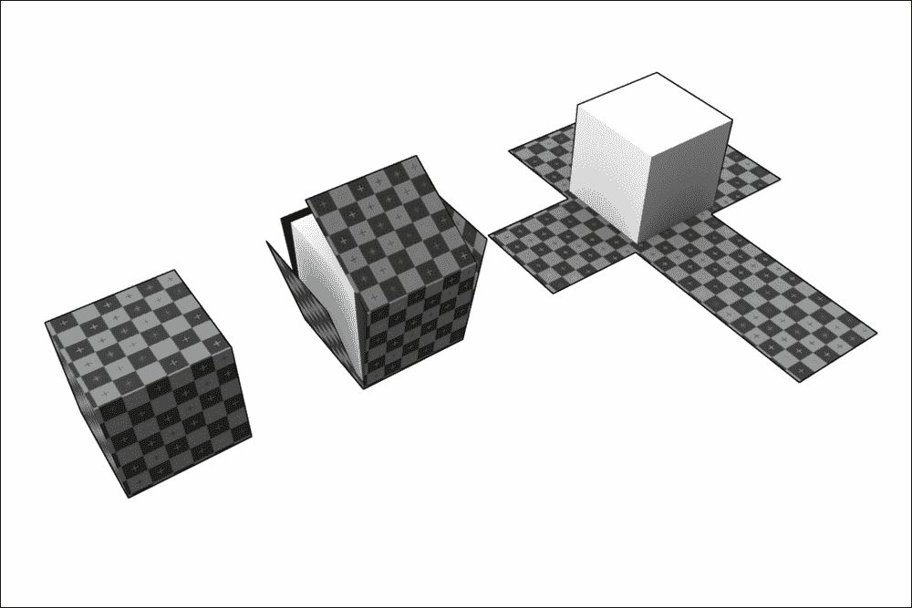

来源：维基百科 ([`en.wikipedia.org/wiki/UV_mapping`](https://en.wikipedia.org/wiki/UV_mapping))

因此，共享的顶点可以分配多个 UV 坐标集。

### 多纹理

为了在表面上获得更好的外观，我们可以使用多个纹理来创建最终所需的结果。这种分层技术允许使用不同纹理的组合创建许多不同的纹理。更重要的是，它为艺术家提供了对表面细节和/或光照的更好控制。

### 一种特殊的纹理映射形式——法线图

法线图是一种纹理图。它们给表面带来小凹凸和凹坑。法线图在不增加多边形数量的情况下为表面添加细节。法线图的一个非常有效的用途是从高多边形 3D 模型生成法线图，并使用它来纹理低多边形模型，这被称为**烘焙**。我们将在下一节讨论为什么我们需要具有不同多边形数量的相同 3D 模型。

法线贴图通常存储为常规 RGB 图像，其中 RGB 分量分别对应于表面法线的 X、Y 和 Z 坐标。以下图像显示了从[`www.bricksntiles.com/textures/`](http://www.bricksntiles.com/textures/)获取的法线贴图示例：

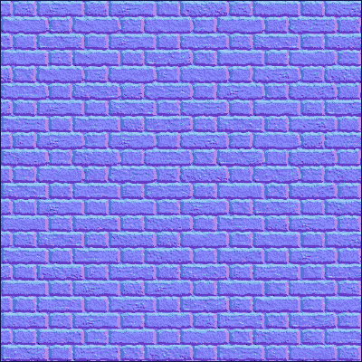

# 细节级别

我们创建具有不同**细节级别**（**LODs**）的对象，以提高渲染效率。对于靠近玩家的对象，渲染高 LOD 对象。具有更高 LOD 的对象具有更多的多边形。对于远离玩家的对象，则渲染对象的简化版本。

艺术家可以使用自动化的 LOD 算法，通过软件部署或手动减少 3D 模型中的顶点、法线和边数，来创建不同 LOD 版本的 3D 对象，从而创建一个多边形数量更少的模型。在创建不同 LOD 的模型时，请注意，我们总是先创建具有最多多边形的最详细模型，然后相应地减少以创建其他 LOD 版本。反过来工作模型要困难得多。务必记住，在处理不同 LOD 的对象时保持 UV 一致性。目前，不同的 LOD 需要分别进行光照贴图。

以下图像来自[`renderman.pixar.com/view/level-of-detail`](http://renderman.pixar.com/view/level-of-detail)，非常清楚地显示了基于距离相机距离的多边形数量：

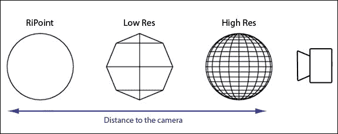

# 碰撞

Unreal Engine 中的对象具有可以修改的碰撞属性，以设计对象与其他对象碰撞时的行为。

在现实生活中，碰撞发生在两个物体移动并在接触点相遇时。它们的个别对象属性将决定我们得到什么样的碰撞，它们如何响应碰撞，以及碰撞后的路径。这就是我们在游戏世界中试图实现的内容。

以下截图显示了 Unreal Engine 4 中对象可用的碰撞属性：

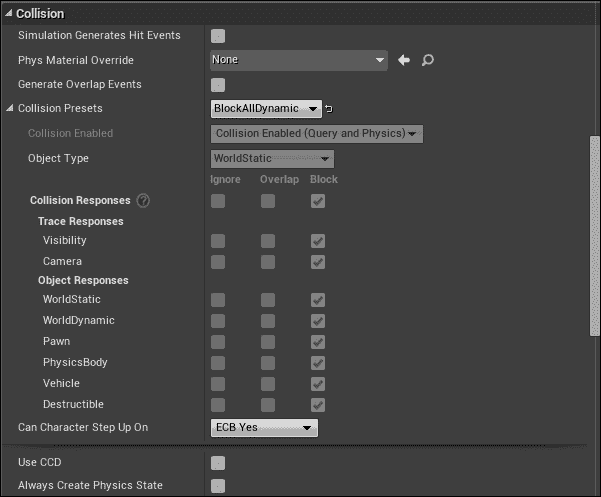

如果你仍然对碰撞的概念感到困惑，想象一下静态网格为对象提供形状（它有多大，有多宽等等），而对象的碰撞能够确定当放置在桌子上时该对象的行为——该对象是否能够在关卡中穿过桌子，或者静止地放在桌子上。

## 碰撞配置属性

让我们来看看 Unreal 的**碰撞**属性中的一些可能配置，这些是我们应该熟悉的。

### 模拟生成碰撞事件

当对象具有**模拟生成击中事件**标志被勾选时，当对象发生碰撞时，会发出警报。此警报通知可用于根据此碰撞触发其他游戏动作。

### 生成重叠事件

**生成重叠事件**标志与**模拟生成击中事件**标志类似，但当此标志被勾选时，为了生成一个事件，所有对象需要的只是与另一个对象重叠。

### 碰撞预设

**碰撞预设**属性包含一些预配置的常用设置。如果您希望创建自己的自定义碰撞属性，请将其设置为**自定义**。

### 碰撞启用

**碰撞启用**属性允许三种不同的设置：**无碰撞**、**无物理碰撞**和**碰撞启用**。当此对象仅用于非物理类型的碰撞，如射线投射、扫掠和重叠时，选择**无物理碰撞**。当需要物理碰撞时，选择**碰撞启用**。当绝对不需要碰撞时，选择**无碰撞**。

### 对象类型

对象可以被分类到几个组中：**WorldStatic**、**WorldDynamic**、**Pawn**、**PhysicsBody**、**Vehicle**、**Destructible**和**Projectile**。所选类型决定了它在移动时采取的交互。

### 碰撞响应

**碰撞响应**选项设置所有随附的**追踪**和**对象响应**的属性值。当**碰撞响应**选择**阻止**时，**追踪**和**对象响应**下的所有属性也设置为**阻止**。

#### 追踪响应

**追踪响应**选项影响对象与追踪的交互方式。**可见性**和**相机**是您可以选择的两种追踪类型，您可以选择阻止、重叠或忽略。

#### 对象响应

**对象响应**选项影响此对象与其他对象类型的交互方式。记得之前提到的**对象类型**选择吗？**对象类型**属性确定对象的类型，在此类别下，您可以配置此对象与不同类型对象的碰撞响应。

### 碰撞外壳

在虚幻引擎中，要发生碰撞，使用外壳。要查看静态网格的碰撞外壳示例，请查看以下截图中的围绕立方体的浅蓝色线条；它是一个盒式碰撞外壳：

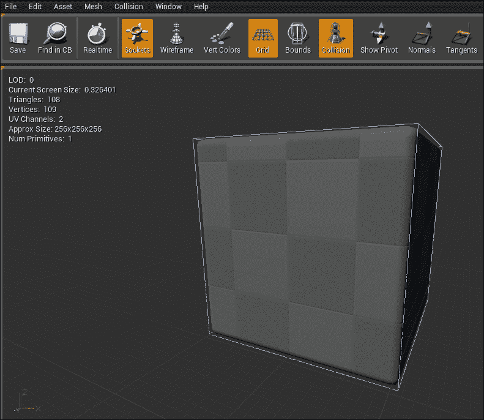

外壳可以在静态网格编辑器中为静态网格生成。以下截图显示了在静态网格编辑器中创建自动生成的碰撞外壳的可用菜单选项：

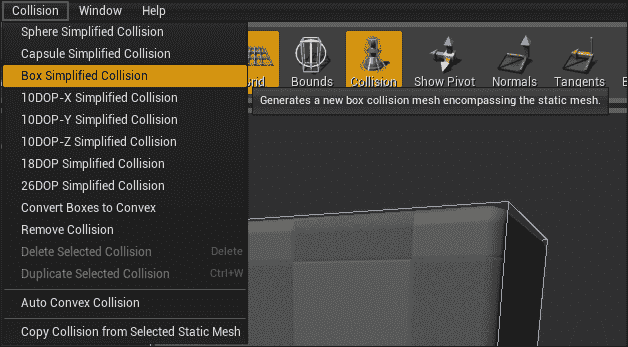

简单的几何对象可以组合并重叠以形成一个简单的船体。一个简单的船体/边界框可以减少碰撞时的计算量。因此，对于复杂对象，可以使用通用边界框来包围对象。当创建具有复杂形状的静态网格，而不是简单几何类型的对象时，你需要参考本章后面的*静态网格创建流程*部分，以了解如何为它创建合适的碰撞边界框。

## 交互

当设计碰撞时，你还需要决定对象有哪些交互类型以及它会与什么交互。

阻挡意味着它们将发生碰撞，而重叠可能意味着不会发生碰撞。当发生阻挡或重叠时，可以标记事件，以便可以采取由此交互产生的其他操作。这是为了允许自定义事件，你可以在游戏中实现。

注意，为了实际发生碰撞，两个对象都必须设置为**Block**，并且它们必须设置为能够阻挡正确类型的对象。如果一个设置为阻挡而另一个设置为重叠，则将发生重叠但不会发生阻挡。当对象以高速移动时，可能会同时发生阻挡和重叠，但事件只能在重叠或阻挡中触发，不能同时触发。你还可以设置阻挡以忽略特定类型的对象，例如，**Pawn**，即玩家。

# 静态网格创建流程

静态网格创建流程是在编辑器外使用 3D 建模工具（如 Autodesk 的 Maya 和 3D 的 Max）完成的。Unreal Engine 4 兼容导入 FBX 2013 版本的文件。

此创建流程主要被艺术家用来为项目创建游戏对象。

将静态网格导入编辑器的实际步骤和命名约定在 Unreal 4 文档网站上都有很好的记录。你可以参考[`docs.unrealengine.com/latest/INT/Engine/Content/FBX/StaticMeshes/index.html`](https://docs.unrealengine.com/latest/INT/Engine/Content/FBX/StaticMeshes/index.html)获取更多详细信息。

# 介绍体积

体积是无形的区域，创建它们是为了帮助游戏开发者执行特定功能。它们与关卡中的对象一起使用，以执行特定目的。体积通常用于设置边界，目的是防止玩家进入游戏中的触发事件，或使用 Lightmass 重要性体积来改变地图中某个区域的灯光计算方式，如第二章，*创建你的第一个关卡*中所述。

这里列出了可以在虚幻引擎 4 中自定义和使用的不同类型的体积。但现在您可以快速浏览每个体积，稍后当我们开始学习如何在书中使用它们时再回来查看。对于本章，您可能首先关注触发体积，因为我们将在此章的后续示例中使用它。

## 阻挡体积

阻挡体积可以用来防止玩家/角色/游戏对象进入地图的某个区域。它与我们在前面描述的碰撞外壳非常相似，可以用作静态网格碰撞外壳的替代品，因为它们的形状更简单（块状），因此更容易计算碰撞响应。这些体积还具有快速检测哪些对象与其自身重叠的能力。

阻挡体积的一个使用示例是防止玩家穿越一排低矮的灌木丛。在这种情况下，由于灌木丛形状相当不规则，但大致形成一条直线，就像树篱一样，一个不可见的阻挡体积将是非常好的防止玩家穿越灌木丛的方法。

下面的截图显示了阻挡体积的属性。我们可以在**刷子设置**下更改体积的形状和大小。使用蓝图更改碰撞事件和触发其他事件。这基本上是我们将获得的所有其他体积的基本配置。

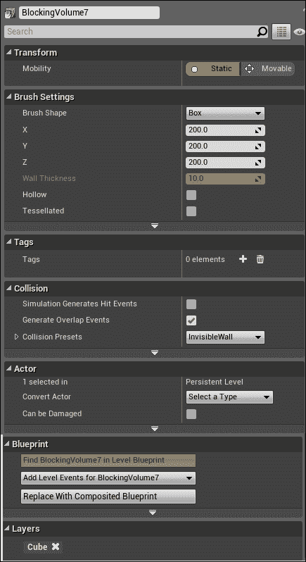

## 摄像头阻挡体积

摄像头阻挡体积的工作方式与阻挡体积相同，但它专门用于阻挡摄像头。当您想限制玩家使用摄像头探索超过一定范围时，这很有用。

## 触发体积

触发体积可能是最常用的体积之一。这也是我们将用来为我们在游戏中正在工作的关卡创建事件的体积。正如其名所示，进入这个体积后，我们可以触发事件，并且通过蓝图，我们可以为我们的游戏创建各种事件，例如移动电梯或生成 NPC。

## 导航网格边界体积

导航网格边界体积用于指示 NPC 能够自由导航的空间。NPC 可能是游戏中的敌人，他们需要某种路径寻找方法来独自在关卡中移动。这个导航网格边界体积将设置游戏中他们能够穿过的区域。这很重要，因为可能会有障碍物，如桥梁，他们需要使用这些障碍物才能到达另一边（而不是直接走进河流并可能溺水）。

## 物理体积

物理体积用于创建玩家/级别中的玩家/对象的物理属性发生变化的区域。一个例子是在太空船达到轨道时仅改变太空船内的重力。在这些区域内改变重力时，玩家开始移动得更慢，并在太空船中漂浮。然后，当飞船返回地球时，我们可以关闭这个体积。以下截图显示了从物理体积获得的附加设置：

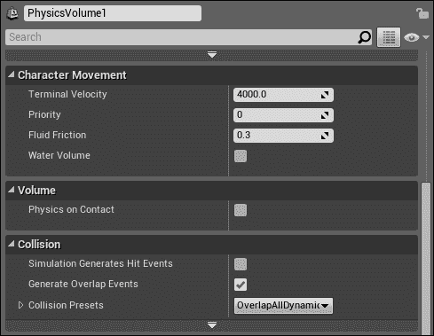

### 疼痛造成体积

疼痛造成体积是一个非常专业的体积，用于在玩家进入时对其造成伤害。它是杀戮体积的“较轻”版本。健康值的减少和每秒造成的伤害量可以根据您的游戏需求进行自定义。以下截图显示了您可以调整的属性，以控制对玩家施加的疼痛程度：

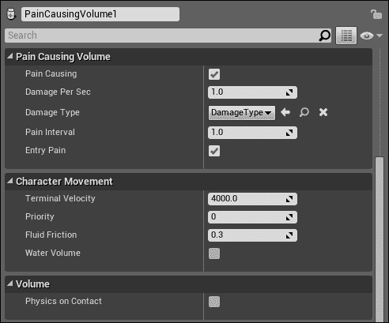

### 杀戮体积

当玩家进入杀戮体积时，我们会将其消灭。这是一个非常剧烈的体积，会立即消灭玩家。其用法的一个例子是当玩家从高楼坠落时立即将其消灭。以下截图显示了杀戮体积的属性，以确定玩家被消灭的点：

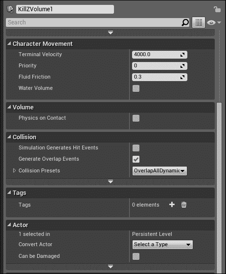

### 级别流体积

级别流体积用于在您处于体积内时显示级别。它通常填充您希望加载级别的整个空间。我们需要流式传输级别的理由是为了给玩家一种我们有一个大型开放游戏级别的错觉，而实际上级别被分割成块以实现更高效的渲染。以下截图显示了可以为级别流体积配置的属性：

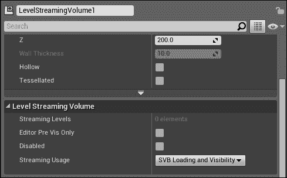

### 清除距离体积

清除距离体积允许在体积内清除对象。清除的定义是从一组中选择。清除距离体积用于根据与摄像机的距离选择需要消失（或未渲染）的对象。远离摄像机的微小对象无法被肉眼看到。如果摄像机距离这些对象太远，则可以清除这些对象。使用清除距离体积，您可以决定在固定空间内要清除的对象的距离和大小。如果有效使用，这可以大大提高您游戏的表现。

这可能看起来与遮挡的概念非常相似。遮挡是通过选择对象并逐个实现，当它不在屏幕上渲染时。这些通常用于场景中的大型对象。清除距离体积可以在大范围的空间中使用，并使用条件来指定对象是否渲染。

以下截图显示了清除距离体积可用的配置设置：

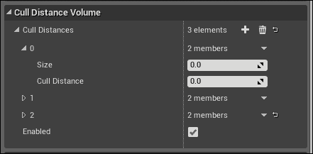

### 音量

音量用于模拟从一个地方过渡到另一个地方时真实的环绕声音变化，尤其是在从一个地方过渡到另一个非常不同的环境时，例如从繁忙的街道走进钟表店，或者从有现场乐队演奏的餐厅进进出出。

音量放置在某个区域的边界周围，创建一个人工边界，将空间分为内部和外部。有了这个人工创建的边界和与这个音量相关的设置，声音艺术家能够配置在过渡期间如何播放声音。

### 后处理体积

后处理体积使用后处理技术影响整个场景。后处理效果包括光晕效果、抗锯齿和景深。

### 光线重要性体积

我们在第二章“创建你的第一个关卡”中使用了光线重要性体积，以聚焦于地图上有物体的部分。体积的大小应该包括你的整个关卡。

# 介绍蓝图

虚幻编辑器通过一个可视化脚本系统提供了为游戏关卡创建自定义事件的能力。在虚幻引擎 4 之前，它被称为**Kismet 系统**。在虚幻引擎 4 中，这个系统经过改进，增加了更多功能和能力。改进后的系统以新的名称“蓝图”推出。

蓝图有几种类型：类蓝图、仅数据蓝图和关卡蓝图。这些大致相当于我们以前所知道的 Kismet，现在被称为关卡蓝图。

为什么我需要蓝图？简单的答案是，通过蓝图，我们能够在不深入实际编码的情况下控制游戏玩法。这使得非程序员能够方便地设计和修改游戏玩法。因此，它主要受益于能够通过蓝图编辑器配置游戏的游戏设计师/艺术家。

那么，我们如何使用蓝图？我能用蓝图做什么？蓝图就像通过界面进行编码。你可以选择、拖放功能节点到编辑器中，并将它们逻辑上连接起来，以触发游戏中特定场景的期望响应。对于程序员来说，他们能够很快地掌握它，因为蓝图实际上是一种编码，但通过一个可视化界面进行。

为了让所有刚开始接触虚幻引擎 4 以及可能编程的新手受益，我们将在这里通过一个基本示例来讲解关卡蓝图的工作原理，并以此为例同时介绍一些基本的编程概念。

我们将如何使用蓝图？蓝图具有原型设计、实施或修改几乎任何游戏元素的能力。游戏元素影响游戏对象如何生成、生成什么、在哪里生成以及它们在什么条件下生成。游戏对象可以包括灯光、摄像机、玩家的输入、触发器、网格和角色模型。蓝图可以动态控制这些游戏对象的属性，以创建无数的游戏场景。使用的例子包括在游戏中进入房间时改变灯光的颜色、进入房间后触发门关闭并在关闭时播放门关闭的声音效果、在地图中的三个可能位置随机生成武器等等。

在本章中，我们将首先关注级别蓝图，因为它是最常用的蓝图形式。

## 级别蓝图

级别蓝图是一种影响级别发生事件的蓝图类型。在此蓝图创建的事件会影响级别中发生的事情，并通过指定目标特定对象来使事件具体化。

随意跳到下一节，我们将通过一个蓝图示例来了解，这样我们就能更好地理解级别蓝图。

以下截图显示了一个空白的级别蓝图。最常用的窗口是**事件图**，位于中央。使用**事件图**中的不同节点类型并适当地连接它们，可以在游戏中创建响应式交互。节点包含变量、值和其他在编程中用于控制游戏事件图形（不写一行脚本或代码）的类似属性。

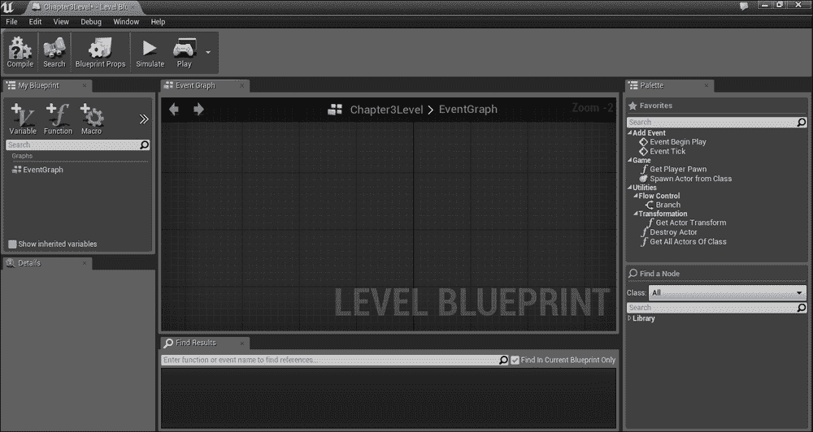

# 使用触发体积来打开/关闭灯光

我们现在可以使用所学知识来构建我们游戏的下一个房间。我们将复制我们创建的第一个房间以创建第二个房间。

1.  打开我们在第二章中创建的级别，*创建您的第一个关卡*（`Chapter2_Level`），并将其保存为名为`Chapter3_Level`的新级别。

1.  选择所有墙壁、地板、门和门框。

1.  按住*Alt* + *Shift*并拖动以复制房间。

1.  将复制的房间与复制的门对齐到第一个房间的墙上。参考以下截图以了解从**顶部**视角墙壁是如何对齐的：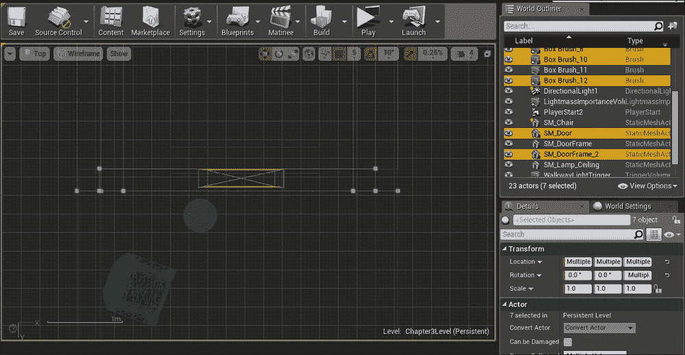

1.  删除第一个房间的后墙以连接两个房间。

1.  删除所有门以方便进入第二个房间。

1.  将立式台灯和椅子移到旁边。查看以下截图以了解此时房间的样子：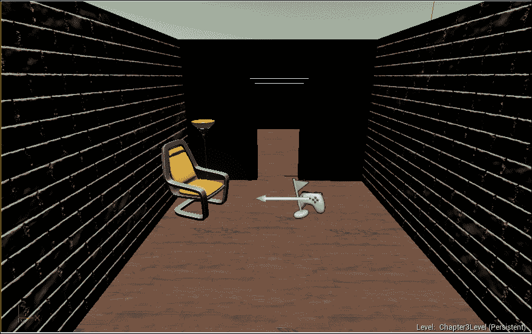

1.  重建灯光。以下截图显示了在建立灯光后房间被正确照亮的情景：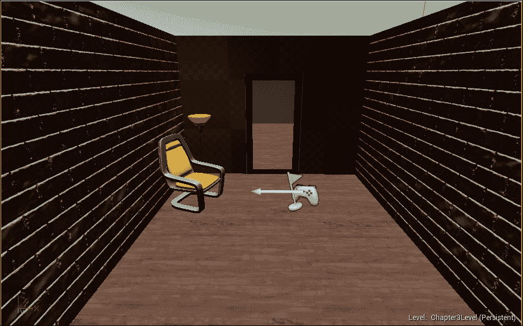

1.  现在，让我们专注于第二个房间的制作。我们将使用刚刚创建的第二个房间来创建一个更窄的通道。

1.  将侧墙向彼此靠近——大约从之前的侧墙向中心方向 30 厘米。参考以下两个截图了解移动侧墙后的**顶视图**和**透视视图**：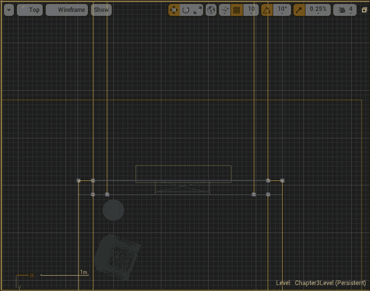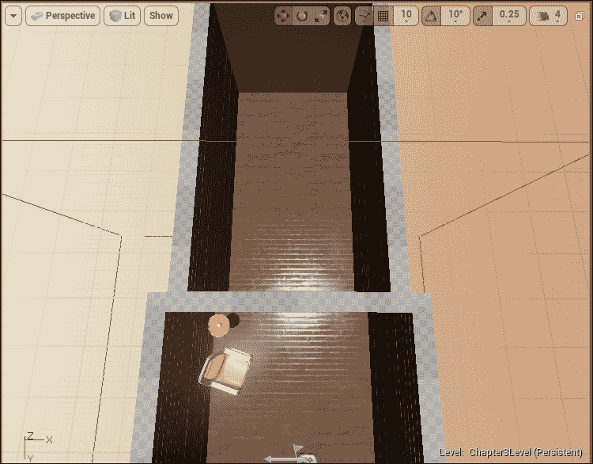

1.  注意，LightMass 重要性体积现在并没有覆盖整个楼层。增加体积的大小以覆盖整个楼层。查看以下截图以了解如何正确地扩展体积的大小：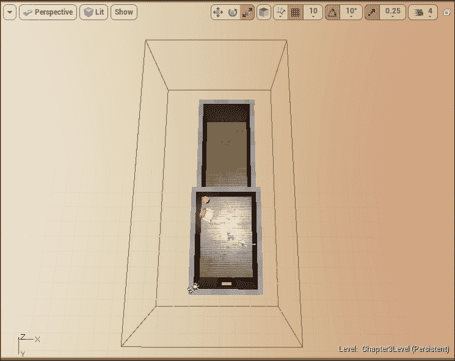

1.  转到**内容浏览器** | **道具**。点击并将**SM_Lamp_Wall**拖放到楼层中。如果需要，旋转灯具，使其平稳地放置在侧墙上。

1.  转到**模式** | **灯光**。点击并将点光源拖放到第二个房间中。将其放置在之前步骤中添加的墙灯上的光源正上方。查看以下截图以了解我们刚刚添加的灯具和点光源的放置位置：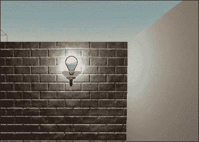

1.  调整点光源的设置：强度 = 1700.0。这大约是灯泡发出的光强度。以下截图显示了点光源的设置：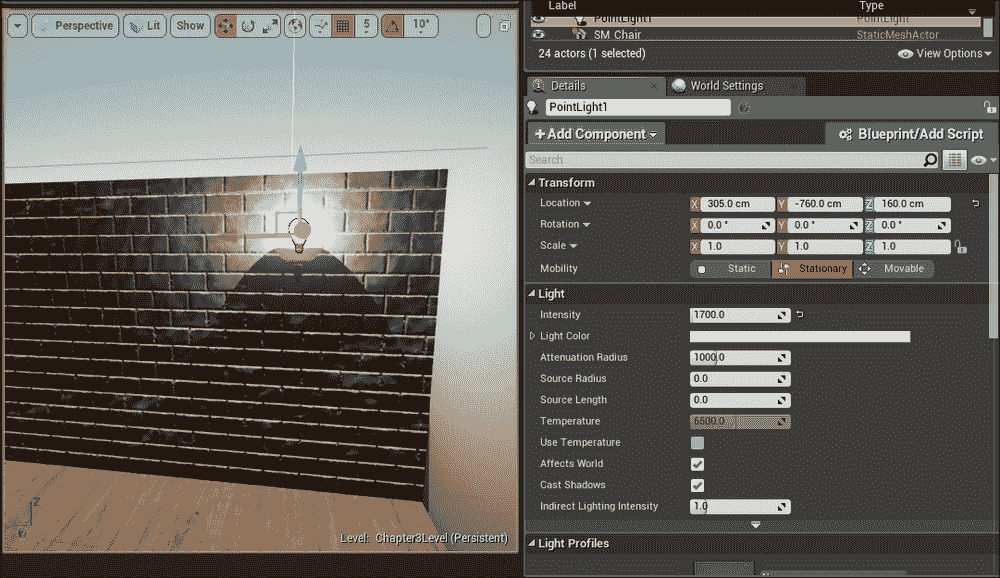

1.  接下来，转到**灯光颜色**并调整灯光颜色为**#FF9084FF**，以调整楼层的氛围。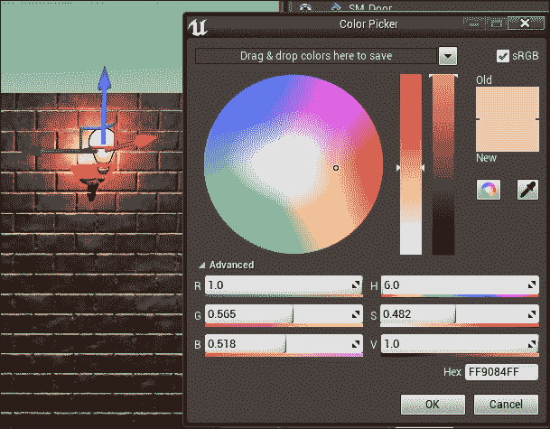

1.  现在，让我们将点光源重命名为`WalkwayLight`，并将**壁灯道具**重命名为`WallLamp`。

1.  选择点光源，右键点击以显示上下文菜单。转到**附加到**并选择**WallLamp**。这样就将灯光附加到道具上，以便当我们移动道具时，灯光也会一起移动。以下截图显示了**WalkwayLight**与**WallLamp**的链接：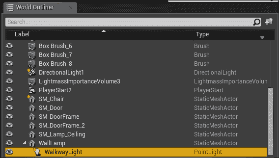

1.  现在，让我们创建一个触发体积。转到**模式** | **体积**。点击并拖动触发体积到楼层中。

1.  调整体积的大小以覆盖分隔两个房间的门入口。参考以下两个截图了解如何定位体积（**透视**视图和**顶视图**）。确保体积覆盖了门的整个空间。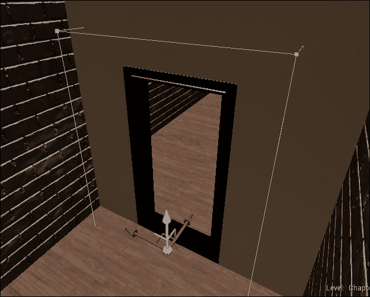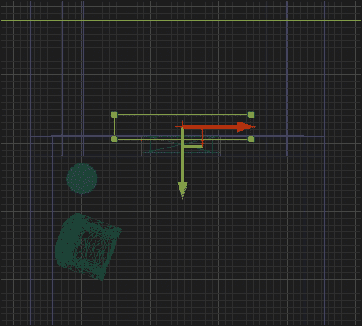

1.  将**触发体积**重命名为`WalkwayLightTrigger`。

1.  为了使用触发体积来打开和关闭灯光，我们需要找出点光源中哪个属性控制这个功能。点击点光源（**WalkwayLight**）以显示灯光的属性。向下滚动到**渲染**并取消勾选**可见**属性框。注意，灯光现在已关闭。我们希望在触发之前保持灯光关闭。

1.  因此，下一步是链接事件序列。这是通过**级别蓝图**完成的。我们需要使用我们创建的触发体积来触发属性变化，并将灯光重新打开。

1.  在选择点光源的情况下，转到顶部工具栏并选择**蓝图**|**打开级别蓝图**。这会打开**级别蓝图**窗口。确保点光源（**WalkwayLight**）仍然被选中，如以下截图所示：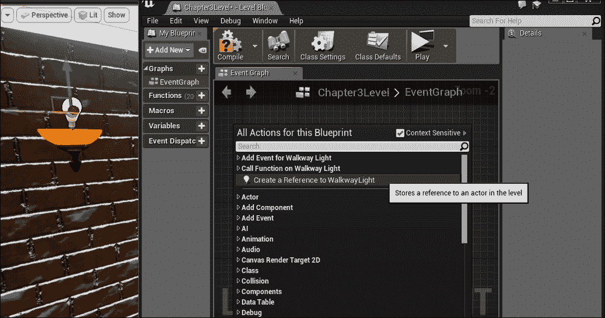

1.  在**级别蓝图**窗口的**事件图**中右键单击以显示可以添加到**级别蓝图**中的操作。

1.  由于级别蓝图能够指导可能执行的操作，我们可以简单地选择**添加 WalkwayLight 引用**。这将在**级别蓝图**中创建**WalkwayLight**演员。以下截图显示了**WalkwayLight**演员正确添加到**蓝图**中：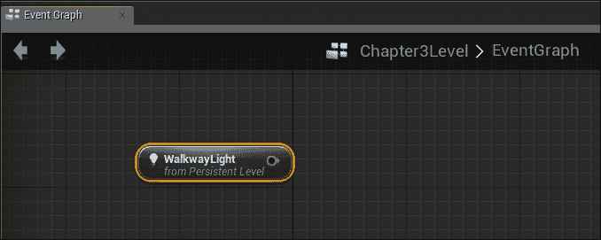

1.  您可以保持**级别蓝图**窗口打开，并转到我们在级别中创建的触发体积。

1.  选择触发体积（**WalkwayLightTrigger**），右键单击并选择**添加事件**然后**OnActorBeginOverlap**。以下截图显示了如何在**级别蓝图**中添加**OnActorBeginOverlap**：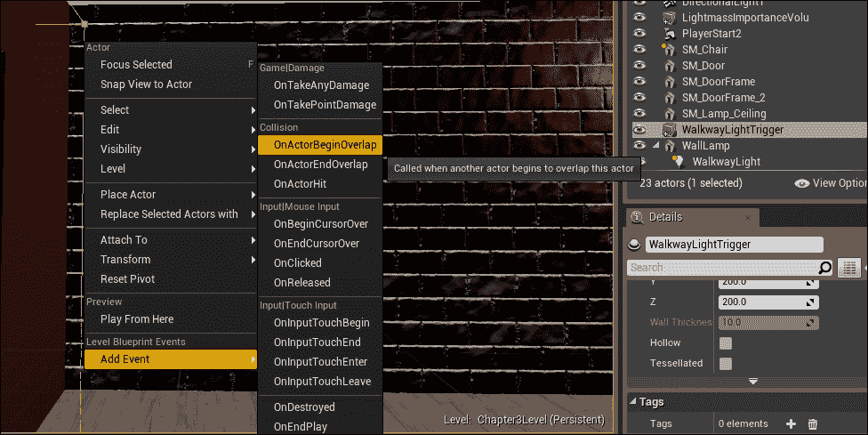

1.  要控制点光源中的变量，我们将在添加的**WalkwayLight**节点上的小蓝色圆圈上点击并拖动。这会在小蓝色圆圈处创建一条蓝色线条。这还会打开一个菜单，我们可以看到可以对点光源执行哪些操作。在搜索栏中输入`visi`以显示选项。点击**设置可见性**。以下截图显示了如何将**设置可见性**功能添加到点光源（**WalkwayLight**）中：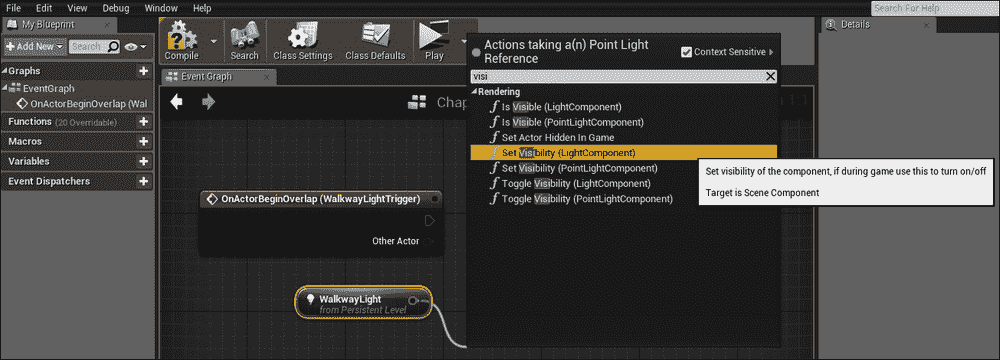

1.  在**设置可见性**函数中勾选**新可见性**复选框。以下截图显示了我们要配置的设置：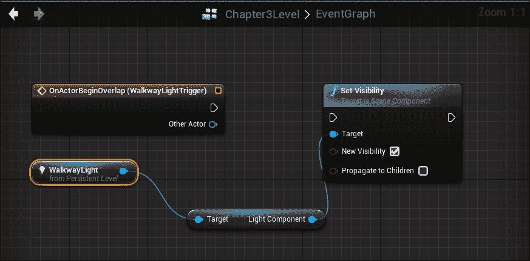

1.  现在，我们已准备好将**OnActorBeginOverlap**事件链接到**设置可见性**函数。从**OnActorBeginOverlap**点击并拖动白色三角形框，并将其放置在**设置可见性**函数的白色三角形框上。以下截图显示了事件正确链接：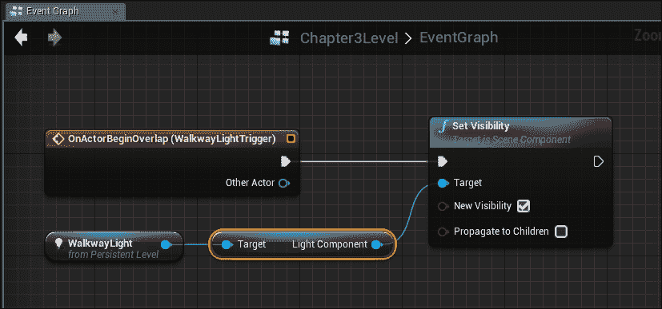

1.  现在，构建关卡并播放。从第一个房间穿过门进入第二个房间。灯光应该被触发开启。

但当你走回第一个房间时会发生什么？灯光保持开启状态，当你走回第二个房间时没有任何反应。在下一个示例中，我们将介绍如何在你进出房间时切换灯光的开和关。这是一种实现灯光控制的替代方法，我将将其作为可选内容供您尝试。

# 使用触发体积切换灯光开/关（可选）

以下步骤可用于触发体积以切换灯光的开和关：

1.  我们需要在**事件图**中替换**设置可见性**节点。点击并拖动来自点光源（**WalkwayLight**）的蓝色点，并将其拖放到任何空白空间。这会打开上下文菜单。以下截图显示了放置新节点从**WalkwayLight**的上下文菜单：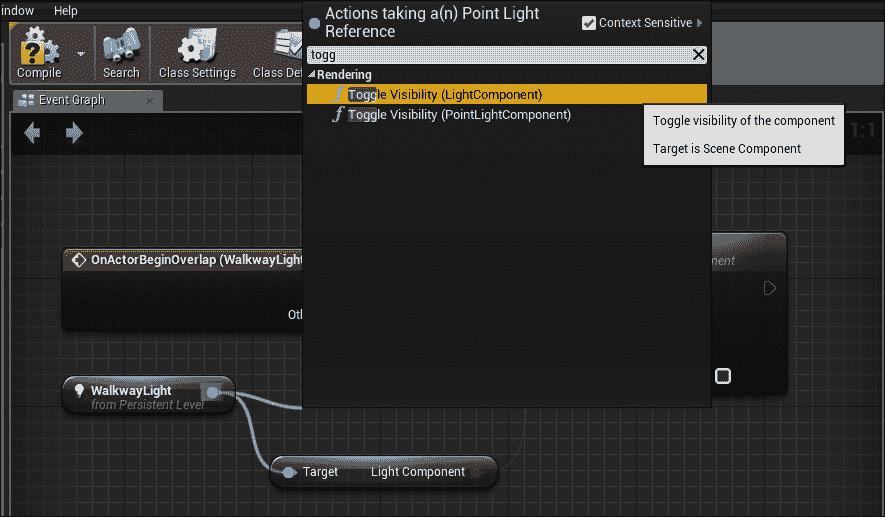

1.  选择**切换可见性**。这将在**事件图**中创建一个额外的新的节点；我们需要根据以下截图重新连接链接，以便将**OnActorBeginOverlap**链接到**切换可见性**：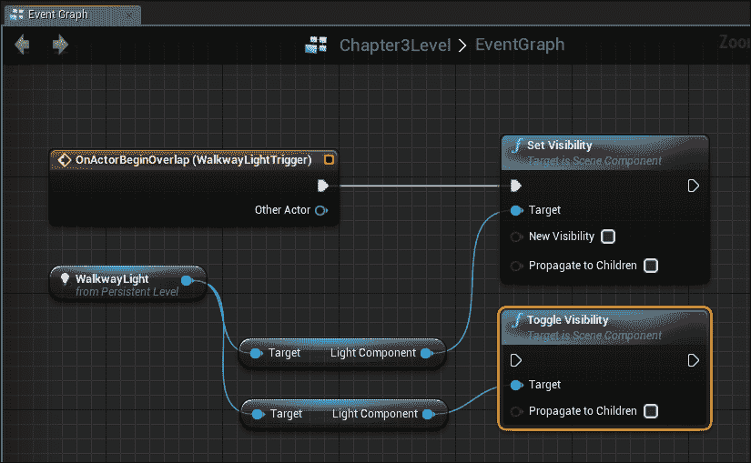

1.  最后一步是删除**设置可见性**节点，然后我们就可以在进入和离开房间时切换灯光的开和关。以下截图显示了我们想要的最终**事件图**。编译并播放关卡以查看如何切换灯光的开和关。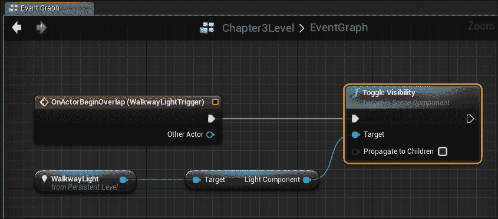

# 摘要

我们已经介绍了一些关于我们在虚幻引擎 4 中用于构建游戏世界的对象的重要概念。我们将最常见的游戏对象类型之一，静态网格，分解为其最基本的组件，以便理解其结构。我们还比较了两种游戏对象类型（静态网格和 BSP），它们之间的区别以及它们在游戏中的位置。这将帮助您决定需要创建哪种类型的对象以及如何为您的游戏关卡创建它们。

本章还简要介绍了纹理和材质，它们的创建方式以及如何应用到网格上。我们将在下一章更详细地介绍材质。因此，您可能想先阅读第四章，*材质和灯光*，然后再创建/应用材质到您新创建的游戏对象上。为了帮助您优化游戏，本章还涵盖了网格创建流程和 LOD 的概念。为了进行交互，我们还需要学习在虚幻中对象如何相互交互和碰撞，以及哪些对象属性可以配置以允许不同的物理交互。

本章还介绍了我们对蓝图的第一印象，即 Unreal Engine 4 的图形脚本。通过一个简单的蓝图示例，我们学习了如何使用 Unreal 中众多有用的体积之一——触发体积（Trigger Volume），来为我们的关卡打开和关闭灯光。在下一章中，我们将继续使用更多令人兴奋的材料和灯光来构建我们已创建的关卡。
