# 第四章 材质与照明

在本章中，我们将详细了解虚幻引擎 4 中的材质和灯光。我们将材质和灯光一起放在本章中，因为一个对象的外观很大程度上是由这两者——材质和照明——决定的。

材质是我们应用到对象表面的东西，它影响对象在游戏中的外观。材质/着色器编程是一个热门的研究课题，因为我们总是努力提高纹理性能——在有限的 CPU/GPU 渲染能力下寻求更高的图形细节/真实感/质量。该领域的学者需要找到方法，使我们在游戏中拥有的模型尽可能真实，同时尽可能减少计算/数据量。

照明也是世界创建中的一个非常强大的工具。照明有许多用途。照明可以创造一个关卡的氛围。当有效地使用时，它可以用来聚焦关卡中的对象，并引导玩家通过你的关卡。照明也创造阴影。在游戏关卡中，阴影需要人工创建。因此，我们还将学习如何适当地渲染我们的游戏中的阴影。

# 材质

在上一章中，我们简要介绍了材质和纹理是什么。纹理就像一个简单的`.png`/`.tga`格式的图像文件。材质是由不同元素组合而成的，包括纹理，以创建我们应用到游戏对象上的表面属性。我们还简要介绍了 UV 坐标是什么以及我们如何使用它们将 2D 纹理应用到 3D 对象的表面上。

到目前为止，我们只学习了如何应用虚幻引擎默认提供的材质。在本章中，我们将深入探讨如何在虚幻引擎 4 中实际创建我们自己的自定义材质。从根本上说，对象的材质创建属于艺术家的范畴。对于特殊的定制纹理，它们有时由 2D 艺术家使用 Photoshop 等工具手工绘制，或者从我们想要的精确对象的纹理照片中获取，或者从类似对象中获取。纹理也可以从现有的纹理集合中进行调整，以创建所需的用于 3D 模型的定制材质。由于需要大量的真实纹理，程序员有时也会通过算法生成纹理，以便更好地控制其最终外观。这也是计算机图形学中材料进步的一个重要研究领域。

这里的材质操作属于被称为**图形程序员**的专门程序员群体的范畴。他们有时也是研究人员，研究如何更好地压缩纹理、提高渲染性能以及创建特殊的动态材质操作。

# 材质编辑器

在虚幻引擎 4 中，可以通过材质编辑器来实现材质操作。这个编辑器提供的是创建材质表达式的功能。材质表达式协同工作，为材质创建一个整体表面属性。你可以把它们看作是数学公式，通过相加/相乘来影响材质的属性。材质编辑器使得编辑/制定材质表达式变得容易，以创建定制的材质，并提供快速预览游戏中的更改的能力。通过虚幻的蓝图功能和编程，我们还可以根据游戏需求动态地操作材质。

## 渲染系统

虚幻引擎 4 中的渲染系统使用 DirectX 11 管线，包括延迟着色、全局照明、自发光透明度和后期处理。虚幻引擎 4 也开始分支以支持最新的 DirectX 12 管线，适用于 Windows 10，DirectX 12 功能将对所有用户可用。

## 基于物理的着色模型

虚幻引擎 4 使用**基于物理的着色模型**（**PBSP**）。这是一个在许多现代游戏引擎中使用的概念。它使用对光的行为的近似来赋予物体属性。使用这个概念，我们给这四个属性赋予值（0 到 1）：**基础颜色**、**粗糙度**、**金属度**和**高光**，以近似视觉属性。

例如，树干的树皮通常是棕色、粗糙且不太反光的。根据我们对树皮外观的了解，我们可能会将金属值设置为低值，粗糙度设置为高值，并将基础颜色设置为显示棕色，具有低高光值。

这改善了创建材质的过程，因为它更直观，因为视觉属性是由光如何反应来控制的，而不是像旧方法那样，我们根据光应该如何行为来近似视觉属性。

对于熟悉描述材质属性的老术语的人来说，你可以把它看作是**漫反射颜色**和**高光强度**被**基础颜色**、**金属度**和**粗糙度**所取代。

使用 PBSP 的优势在于我们可以更准确地近似材质属性。

## 高级着色语言

材质编辑器允许使用节点网络和连接进行高级着色语言（**HLSL**）的可视化脚本。对于那些对着色器或 HLSL 概念完全陌生的人来说，应该先阅读下一节关于着色器、DirectX 和 HLSL 的内容，以便您对计算机如何在屏幕上渲染材质信息有基本了解。HLSL 是由微软开发的一种专有着色语言。OpenGL 有自己的版本，称为 GLSL。HLSL 是用于编程图形管道中各个阶段的编程语言。它使用与 C 编程类似的变量，并有许多已编写和可供使用的内置函数。HLSL 着色器可以在作者时间或运行时编译，并在运行时设置到适当的管道阶段。

## 入门

在虚幻引擎 4 中打开材质编辑器，请转到**内容浏览器** | **材质**，然后双击任何材质资产。或者，您可以选择一个材质资产，右键单击以打开上下文菜单，并选择**编辑**来在材质编辑器中查看该资产。

如果您想学习如何创建新的材质，您可以在即将到来的部分中尝试示例。

## 创建简单的自定义材质

我们将继续使用我们创建的关卡。打开`Chapter3Level.umap`并将其重命名为`Chapter4Level.umap`，以防止覆盖前一章结尾处我们已完成的内容。

要在我们的游戏包中创建新的材质资产，请转到**内容浏览器** | **材质**。选择**材质**后，右键单击以打开上下文菜单，导航到**新资产** | **材质**。这将在`材质`文件夹中创建新的材质（我们希望将资产放在逻辑文件夹中，以便我们能够轻松找到游戏资产）。或者，您也可以转到**内容浏览器** | **新** | **材质**。

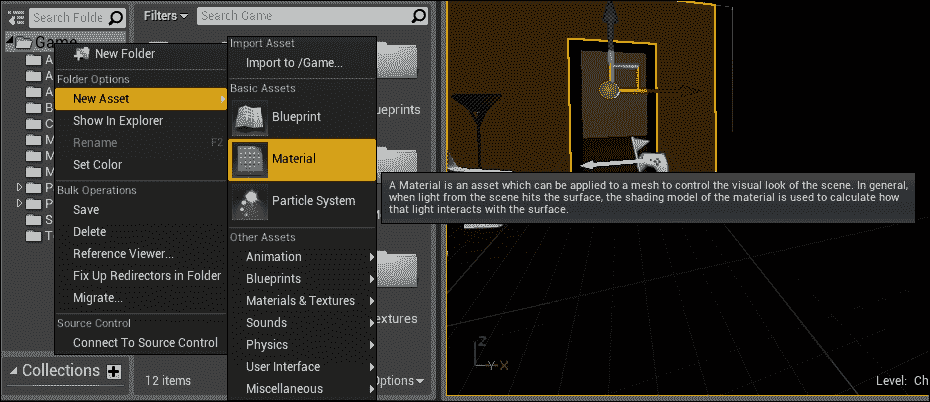

将新材质重命名为`MyMaterial`。以下截图显示了正确创建的新的**MyMaterial**：

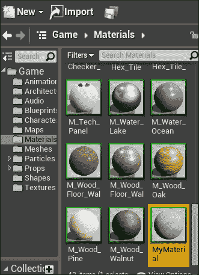

注意，新**MyMaterial**的缩略图显示为灰色的棋盘图案材质。这是未应用任何材质时的默认材质。

要打开材质编辑器开始设计我们的材质，双击**MyMaterial**。以下截图显示了带有空白新材质的材质编辑器。由于尚未定义任何属性，材质的球形预览显示为黑色。

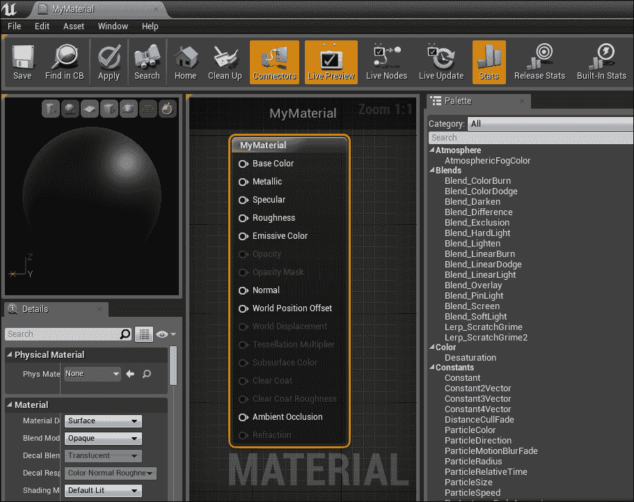

让我们开始为**MyMaterial**节点定义一些属性，以创建我们自己的独特材质。"基础颜色"、"金属"和"粗糙度"是我们将首先学习的三个值。

**基础颜色**由红、绿、蓝的向量形式定义。为此，我们将从右侧的**MyPalette**拖放**Constant3Vector**到主窗口中，其中包含**MyMaterial**节点。或者，您也可以右键单击以打开上下文菜单，并在搜索框中输入`vector`以过滤列表。点击并选择**Constant3Vector**以创建节点。双击**Constant3Vector**以显示**颜色选择器**窗口。以下截图显示了我们要用于创建红色墙面材质的**Constant3Vector**设置。（**R** = **0.4**，**G** = **0.0**，**B** = **0.0**，**H** = **0.0**，**S** = **1.0**，**V** = **0.4**）：

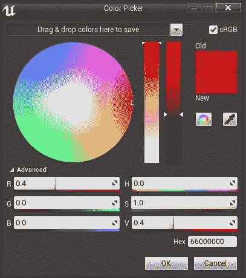

按照以下截图所示，通过点击并拖动从**Constant3Vector**节点的小圆圈到**MyMaterial**节点旁边**基础颜色**属性的小圆圈来将**Constant3Vector**连接到**MyMaterial**节点。这个**Constant3Vector**节点现在为材质提供基础颜色。注意左边的球形预览如何更新以显示新的颜色。如果颜色没有自动更新，请确保顶部的工具栏上的**实时预览**设置被选中。

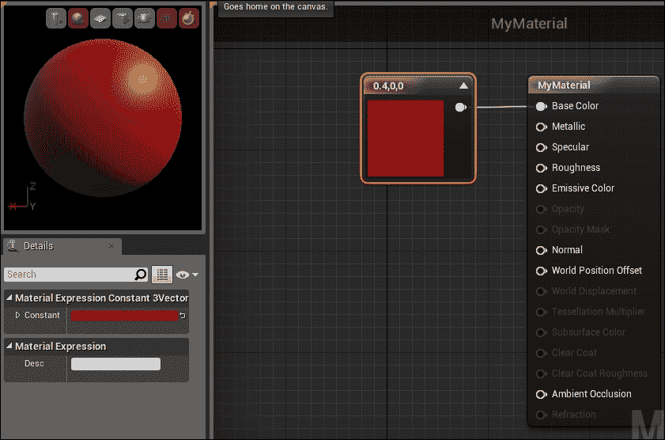

现在，让我们设置材质的**金属度**值。这个属性接受从 0 到 1 的数值，其中 1 代表 100%的金属。要为值创建输入，请从**MyPalette**点击并拖动**Constant**，或者在材质编辑器中右键单击以打开菜单；在搜索框中输入`Constant`以过滤并从过滤列表中选择**Constant**。要编辑常量中的值，请单击**Constant**节点以显示**详细信息**窗口并填写值。以下截图显示了如果**金属度**设置为 1 时材质的外观：

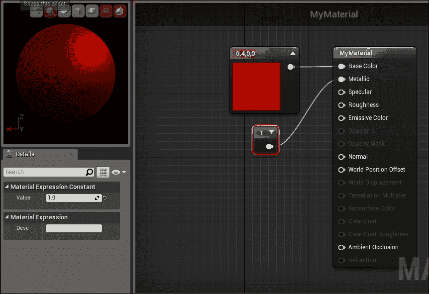

在看到**金属度**值如何影响材质后，让我们看看**粗糙度**会做什么。**粗糙度**也接受从 0 到 1 的**Constant**值，其中 0 是完全光滑的，使表面非常反光。左侧的截图显示了当**粗糙度**设置为 0 时材质的外观，而右侧的截图显示了当**粗糙度**设置为 1 时材质的外观：

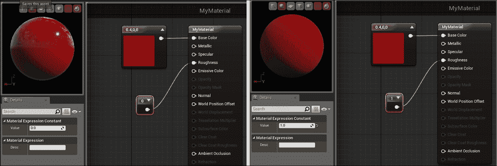

我们希望使用这种新材料来纹理墙面。因此，我们将**金属度**设置为**0.3**，将**粗糙度**设置为**0.7**。以下截图显示了我们对第一个自定义材质的最终设置：

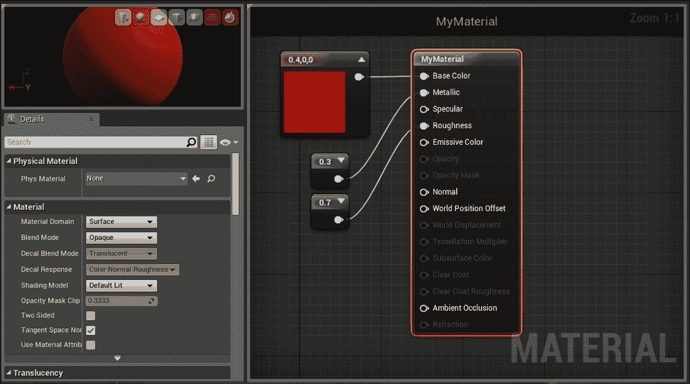

前往**内容浏览器**中的**MyMaterial**并复制**MyMaterial**。将其重命名为`MyWall_Grey`。使用以下值将基础颜色更改为灰色，如选择器节点中所示，用于**Base Color**的**Constant3Vector**值。（**R** = **0.185**, **G** = **0.185**, **B** = **0.185**, **H** = **0.0**, **S** = **0.0**, **V** = **0.185**）:

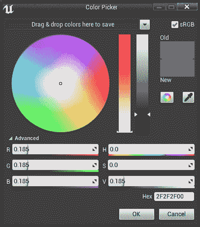

以下截图显示了**MyWall_Grey**节点的链接。（**Metallic** = **0.3**, **Roughness** = **0.7**）:

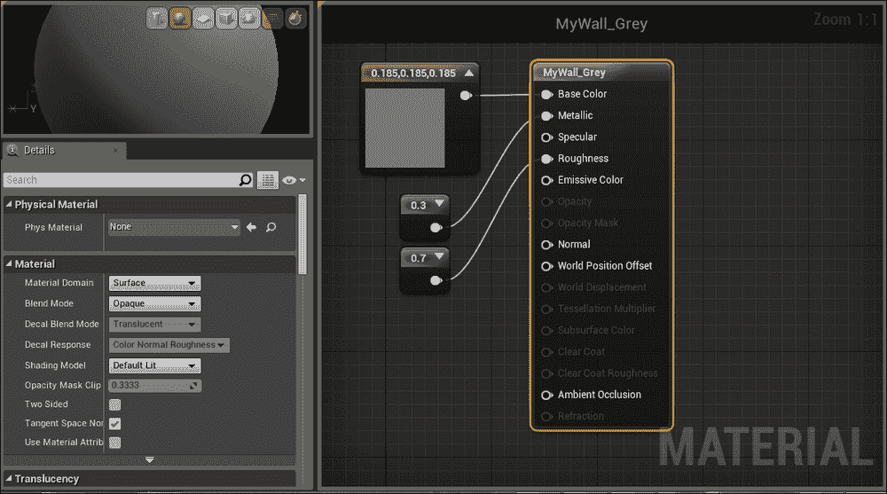

## 使用简单纹理创建自定义材质

要使用纹理创建材质，我们必须首先选择一个合适的纹理。纹理可以由艺术家创建或从材料的照片中获取。为了学习目的，你可以从网络中找到合适的免费源图像，例如[www.textures.com](http://www.textures.com)，并使用它们。如果你计划在游戏中发布，请记住检查使用条件和其他与许可证相关的条款。

我们需要一个简单的纹理来创建自定义材质。首先，我们需要使用的实际纹理。目前，让我们保持这个选择简单直接。根据颜色选择这个纹理，它应该具有你希望材质看起来具有的整体属性。接下来，我们需要一个法线纹理。如果你还记得什么是法线图，它控制着表面的凹凸。法线图给出了材质中的凹槽。这两种纹理将共同工作，为你提供一个看起来逼真的材质，你可以在游戏中使用。

在这个例子中，我们将创建另一个木纹纹理，我们将用它来替换房间中已经应用的自定义包中的木纹。

在这里，我们将首先导入在 Unreal Engine 中需要的纹理。前往**内容浏览器** | **纹理**。然后点击顶部的**导入**按钮。这会打开一个窗口，用于浏览纹理的位置。导航到保存纹理的文件夹位置，选择纹理并点击**打开**。注意，如果你导入的不是 2 的幂（256 x 256、1024 x 1024 等）的纹理，你会收到一个警告消息。由于内存使用效率低下，应避免使用不是 2 的幂的纹理。如果你导入的是我使用的示例图像，它们已经转换为 2 的幂，因此你不会在屏幕上收到此警告消息。

导入**T_Wood_Light**和**T_Wood_Light_N**。**T_Wood_Light**将用作我们想要的主体纹理，而**T_Wood_Light_N**是法线图纹理，我们将用它来处理这种木材。

接下来，我们按照前面的步骤创建一个新的材料，如前例所示。转到**内容浏览器** | **材料**。选择**材料**文件夹，打开上下文菜单，导航到**新资产** | **材料**。将新材料重命名为`MyWood`。

现在，我们不再选择**Constant3Vector**来提供基础颜色的值，而是使用**TextureSample**。转到**MyPalette**并输入`Texture`以过滤列表。选择**TextureSample**，将其拖放到材质编辑器中。单击**TextureSample**节点以显示**详细信息**面板，如图所示。在**详细信息**面板中，转到**材质表达式纹理基础**并单击其旁边的小箭头。这会弹出一个包含所有可用的合适资产的弹出窗口。向下滚动以选择**T_Wood_Light**。

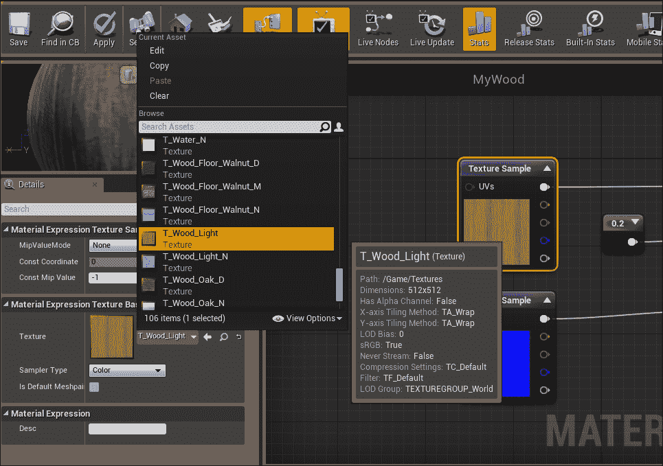

现在，我们已经配置了**TextureSample**，使用的是我们之前导入到编辑器中的木纹。通过单击白色空心圆连接器，将其拖动并放置在**MyWood**节点的**Base Color**连接器上。

重复相同的步骤创建一个用于**T_Wood_Light_N**法线贴图纹理的**TextureSample**节点，并将其连接到**MyWood**的**Normal**输入。

以下截图显示了我们要为**MyWood**设置的参数。为了使我们的木纹有一点光泽感，使用**Constant**节点将**Roughness**设置为**0.2**。（回顾：从**MyPalette**拖放一个**Constant**节点并将其值设置为**0.2**，连接到**MyWood**的**Roughness**输入。）

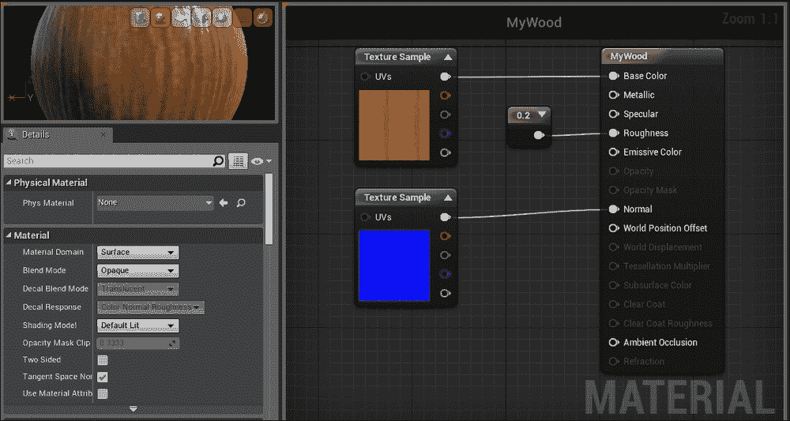

## 使用自定义材料来转换级别

使用我们在前两个示例中创建的自定义材料，我们将替换当前使用的材料。

以下截图显示了第一个房间的前后对比。注意新自定义材料如何将房间转换成现代风格的房间。

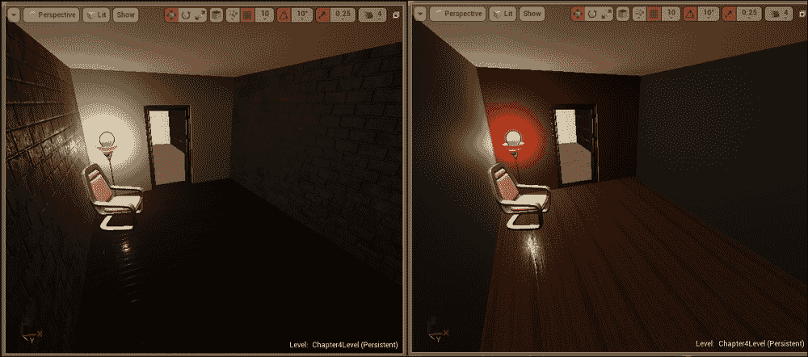

从前面的截图，我们还添加了一个点光源并将其放置在灯具道具上，使其看起来像是在发光。以下截图显示了我们所使用的点光源设置（**Light Intensity** = **1000.0**，**Attenuation Radius** = **1000.0**）：

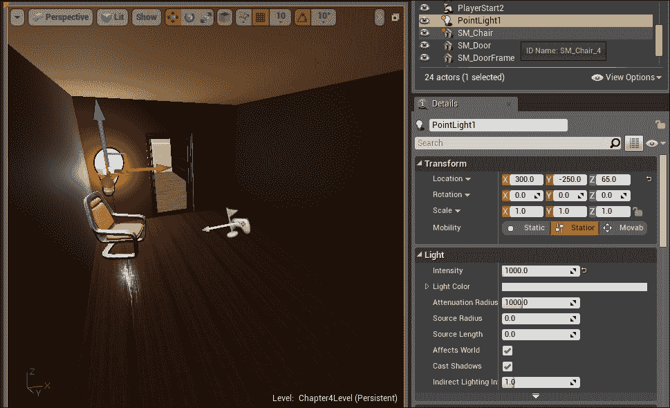

接下来，我们添加了一个天花板来覆盖房间。墙壁的天花板使用与墙壁相同的盒子几何形状。我们已将**M_Basic_Wall**材料应用到其上。

然后，我们使用红色墙壁材料（**MyMaterial**）来替换带有门框的墙壁上的材料。灰色墙壁材料（**MyWall_Grey**）用于替换侧面墙壁的砖材料。光泽木材料（**MyWood**）用于替换木地板材料。

# 渲染管线

为了使图像出现在屏幕上，计算机必须在屏幕上绘制图像以显示它。通过使用 2D 和 3D 数据信息创建场景的 2D 表示的步骤序列被称为图形或渲染管线。计算机硬件，如**中央处理器**（**CPU**）和**图形处理器**（**GPU**），用于计算和操纵绘制 3D 场景所需的输入数据。

由于游戏是交互式的，并且高度依赖于实时渲染，因此渲染移动场景所需的数据量很大。需要计算三角形多边形的每个顶点的坐标位置、颜色以及所有显示信息，同时考虑到在它们正确显示在屏幕上之前重叠多边形的影响。因此，优化 CPU 和 GPU 的能力以处理这些数据并及时在屏幕上显示它们至关重要。多年来，这一领域一直在不断改进，以允许以更高的帧率渲染出更高品质的图像，从而获得更好的视觉效果。在此阶段，游戏应至少以 30fps 的帧率运行，以便玩家获得合理的游戏体验。

当前的渲染管线使用一系列可编程着色器来操纵图像信息，在屏幕上显示图像之前。我们将在下一节中更详细地介绍着色器和 Direct3D 11 图形管线。

# 着色器

着色器可以被视为一系列编程代码的序列，它告诉计算机如何绘制图像。不同的着色器控制图像的不同属性。例如，顶点着色器为单个顶点提供诸如位置、颜色和 UV 坐标等属性。顶点着色器的另一个重要目的是将具有 3D 坐标的顶点转换成 2D 屏幕空间以便显示。像素着色器处理像素以提供颜色、z 深度和 alpha 值信息。几何着色器负责处理原始数据（三角形、线和顶点）级别的数据。

图像的数据信息从一个个着色器传递到下一个着色器进行处理，最终通过帧缓冲区输出。

着色器还用于结合后处理效果，如体积光照、HDR 和光晕效果，以增强游戏中的图像。

着色器编程所使用的语言取决于目标环境。对于 Direct3D，官方语言是 HLSL。对于 OpenGL，官方的着色语言是**OpenGL 着色语言**（**GLSL**）。

由于大多数着色器是为 GPU 编写的，因此主要的 GPU 制造商 Nvidia 和 AMD 也尝试开发自己的语言，以便为 OpenGL 和 Direct3D 着色器输出。Nvidia 开发了 Cg（在 2012 年 3.1 版本后已弃用）和 AMD 开发了 Mantle（用于 2014 年发布的某些游戏，如*战场 4*，似乎在开发者中越来越受欢迎）。苹果公司也于 2014 年 9 月为其 iOS 8 发布了名为**Metal 着色语言**的自己的着色语言，以提高 iOS 的性能优势。Kronos 还于 2015 年初宣布了一种基于 OpenGL 的下一代图形 API，称为**Vulkan**，这似乎得到了 Valve Corporation 等成员公司的强烈支持。

以下图像来自 MSDN 上的 Direct3D 11 图形流水线（[`msdn.microsoft.com/en-us/library/windows/desktop/ff476882(v=vs.85).aspx`](http://msdn.microsoft.com/en-us/library/windows/desktop/ff476882(v=vs.85).aspx)）。它显示了可编程阶段，数据可以通过这些阶段生成用于我们游戏的实时图形，称为渲染流水线状态表示。

这里提供的信息来自 Microsoft MSDN 页面。您可以使用 Direct3D 11API 配置所有阶段。如顶点、Hull、Domain、几何和像素着色器（那些有圆形矩形块的）等阶段，可以使用 HLSL 进行编程。能够以编程方式配置此流水线使其在游戏图形渲染方面具有灵活性。

以下是对每个阶段功能的解释：

| 阶段 | 功能 |
| --- | --- |
| 输入汇编器 | 此阶段向流水线提供数据（以三角形、线和点等形式） |
| 顶点着色器 | 此阶段处理顶点，如变换、蒙皮和光照。经过此阶段后，顶点的数量不会改变。 |
| 几何着色器 | 此阶段处理整个几何原语，如三角形、线和点。 |
| 流输出 | 此阶段在数据流向光栅化器的同时，将原始数据从流水线传输到内存。 |
| 光栅化器 | 此阶段剪辑原始数据，并为像素着色器准备原始数据。 |
| 像素着色器 | 在这里进行像素操作。每个原始像素都在这里进行处理，例如像素颜色。 |
| 输出合并 | 此阶段将各种输出数据（像素着色器值、深度和模板信息）与渲染目标的内容以及深度/模板缓冲区的内容合并，以生成最终的流水线结果。 |
| Hull 着色器、细分器和域着色器 | 这些细分阶段将高阶表面转换为三角形，为渲染做准备。 |

为了帮助您更好地可视化每个阶段发生的情况，以下图像展示了一个仅针对顶点的简化渲染管道的非常好的插图。图像来自一个旧的 Cg 教程。请注意，不同的 API 有不同的管道，但它们在渲染的基本概念上依赖于相似性（来源：[`goanna.cs.rmit.edu.au/~gl/teaching/rtr&3dgp/notes/pipeline.html`](http://goanna.cs.rmit.edu.au/~gl/teaching/rtr&3dgp/notes/pipeline.html))。

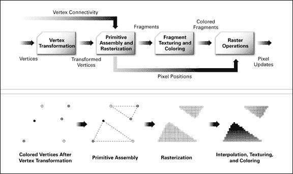

图形显示的示例流程：

+   CPU 将指令（编译的着色语言程序）和几何数据发送到位于显卡上的图形处理单元。

+   数据传递到顶点着色器，在那里顶点被转换。

+   如果 GPU 中启用了几何着色器，则在场景中执行几何形状的变化。

+   如果 GPU 中启用了细分着色器，场景中的几何形状可以被细分。计算出的几何形状被三角化（细分为三角形）。

+   三角形被分解成片段。根据片段着色器修改片段四边形。

+   为了创建深度感，为片段设置 z 缓冲区值，然后将其发送到帧缓冲区进行显示。

# APIs – DirectX 和 OpenGL

DirectX 和 OpenGL 都是用于在计算机中处理多媒体信息的应用程序编程接口（API）集合。它们是目前用于视频卡的最常见的两种 API。

DirectX 是由微软创建的，以便多媒体相关硬件，如 GPU，能与 Windows 系统通信。OpenGL 是开源版本，可以在包括 Mac OS 在内的许多操作系统上使用。

使用 DirectX 或 OpenGL API 编程的决定取决于目标机器的操作系统。

## DirectX

Unreal Engine 4 首次使用 DirectX11 发布。在宣布 DirectX 12 与 Windows 10 一起发布后，Unreal 从 4.4 版本开始创建了一个 DirectX 12 分支，以便开发者可以开始使用这个新的 DirectX 12 来创建游戏。

识别属于 DirectX 的 API 的一个简单方法就是它们的名称都以 Direct 开头。对于电脑游戏来说，我们最关心的 API 是 Direct3D，它是用于在游戏中绘制高性能 3D 图形的图形 API，以及 DirectSound3D，它是用于声音播放的。

DirectX API 对于创建 Windows 操作系统的高性能 2D 和 3D 图形至关重要。例如，DirectX11 支持在 Windows Vista、Windows 7 和 Windows 8.1 上。最新的 DirectX 版本可以通过服务包更新进行更新。已知 DirectX 12 是与 Windows 10 一起发布的。

### DirectX12

Direct3D 12 于 2014 年发布，从 Direct3D 11 进行了大幅改进，以提供显著的性能提升。这是一个非常好的链接，指向 MSDN 博客上发布的一段视频，展示了 DirectX 12 的技术演示：[`channel9.msdn.com/Blogs/DirectX-Developer-Blog/DirectX-Techdemo`](http://channel9.msdn.com/Blogs/DirectX-Developer-Blog/DirectX-Techdemo)。

（如果你对 Direct3D 11 不熟悉，或者之前没有阅读*着色器*部分，请在继续阅读 DirectX 部分之前先阅读该部分。）

#### 管道状态表示

如果你能从*着色器*部分回忆起，我们曾查看 Direct3D 11 的可编程管道。以下图像与*着色器*部分相同（来自 MSDN），它显示了一系列可编程着色器：

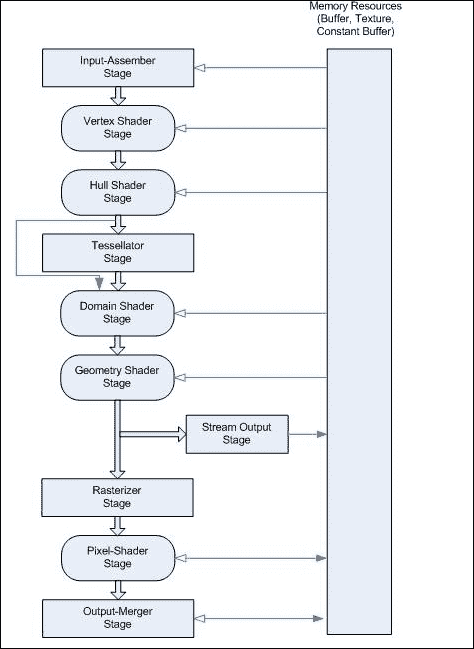

在 Direct3D 11 中，每个阶段都可以独立配置，并且每个阶段都会独立地在硬件上设置状态。由于许多阶段由于相互依赖而具有设置相同硬件状态的能力，这导致了硬件不匹配的开销。以下图像是硬件不匹配开销如何发生的极好说明：

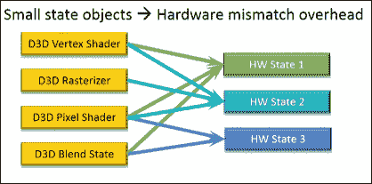

驱动程序通常会首先从应用程序（游戏）中记录这些状态，并等待直到绘制时间，当它准备好将其发送到显示监视器时。在绘制时间，这些状态在它们被转换为用于硬件的 GPU 代码以渲染游戏正确场景之前，在一个控制循环中进行查询。这为在绘制时间记录和查询所有状态创建了一个额外的开销。

在 Direct3D 12 中，一些可编程阶段被组合成一个称为**管道状态对象**（**PSO**）的单个对象，以便整个组只设置一次每个硬件状态，从而防止硬件不匹配的开销。现在可以直接使用这些状态，而不是在绘制调用之前计算结果硬件状态所需的资源。这减少了绘制调用的开销，允许每帧进行更多的绘制调用。正在使用的 PSO 可以根据所需的任何硬件原生指令和状态动态更改。

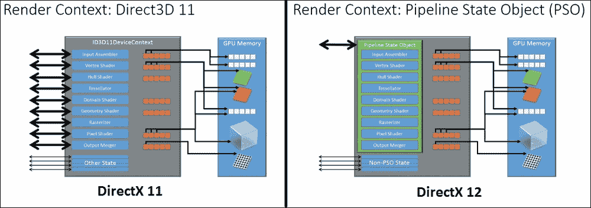

#### 工作提交

在 Direct3D 11 中，向 GPU 的工作提交是立即的。Direct3D 12 的新特性是它使用包含执行特定工作负载所需全部信息的命令列表和包。

在 Direct3D 11 中，立即工作提交意味着信息以单个命令流的形式传递给 GPU，由于缺少完整信息，这些命令通常会被延迟，直到实际工作可以完成。

当工作提交被分组在自包含的命令列表中时，驱动程序可以预先计算所有必要的 GPU 命令，然后将该列表发送到 GPU，使 Direct3D 12 的工作提交过程更加高效。此外，使用包可以被视为一组创建特定对象的命令的小列表。当这个对象需要在屏幕上重复时，这个命令包可以被“回放”以创建重复的对象。这进一步减少了 Direct3D 12 所需的计算时间。

#### 资源访问

在 Direct3D 11 中，游戏创建资源视图，将这些视图绑定到着色器中的插槽。这些着色器然后在绘制调用期间从这些显式绑定的插槽中读取数据。如果游戏想要使用不同的资源进行绘制，它将在下一个绘制调用中使用不同的视图进行。

在 Direct3D 12 中，您可以通过使用描述符堆来创建各种资源视图。每个描述符堆都可以定制以链接到特定的着色器，使用特定的资源。这种设计描述符堆的灵活性允许您完全控制资源使用模式，充分利用现代硬件的能力。您还可以描述多个索引的描述符堆，这允许轻松地交换堆，以完成单个绘制调用。

# 灯光

我们在第一章中简要介绍了灯光的类型，*Unreal 引擎概述*。让我们先快速回顾一下。方向光发射平行光束。点光源像灯泡一样发光（从单个点以径向向外所有方向）。聚光灯以锥形形状向外发射光，而天空光则模仿天空向下照射关卡中的对象。

在本章中，我们将学习如何使用这些基本灯光照亮室内区域。我们已经在第二章中放置了一个点光源，*创建您的第一个关卡*，并学习了如何将其强度调整为 1700。在本章中，我们将学习更多关于我们可以调整的每个类型灯光的参数，以创建我们想要的照明效果。

让我们先查看使用这些 Unreal 灯光照亮的关卡。加载`Chapter4Level_Prebuilt.umap`，构建并播放关卡以四处查看。点击关卡中放置的灯光，你会注意到大多数使用的灯光是点光源或聚光灯。这两种形式的灯光在室内照明中相当常见。

下一节将指导您自己扩展关卡。或者，您可以使用`Chapter4Level_Prebuilt`关卡来帮助您创建自己的关卡，因为创建整个关卡确实需要相当多的时间。如果您想跳到下一节，可以直接使用提供的预建地图版本，并使用预建地图作为参考来浏览本章的其他示例。然而，这将是一个很好的机会来复习您在前几章学到的内容，并自己扩展关卡。

在我们开始扩展关卡的选做练习之前，让我们通过几个教程示例来了解我们如何放置和配置不同类型的灯光。

## 配置具有更多设置的点光源

打开`Chapter4Level.umap`并将其重命名为`Chapter4Level_PointLight.umap`。

前往**模式** | **灯光**，将一个点光源拖放到关卡中。由于点光源从单个点向所有方向均匀发射光线，**衰减半径**、**强度**和**颜色**是配置点光源时最常见的三个值。

### 衰减半径

以下截图显示了点光源具有默认的**衰减半径**为**1000**的情况。三个蓝色圆圈的半径基于点光源的衰减半径，用于显示其对环境的影响区域。

以下截图显示了衰减半径减少到 500 的情况。在这种情况下，由于半径仍然大于房间本身，您可能看不到任何光照上的差异：

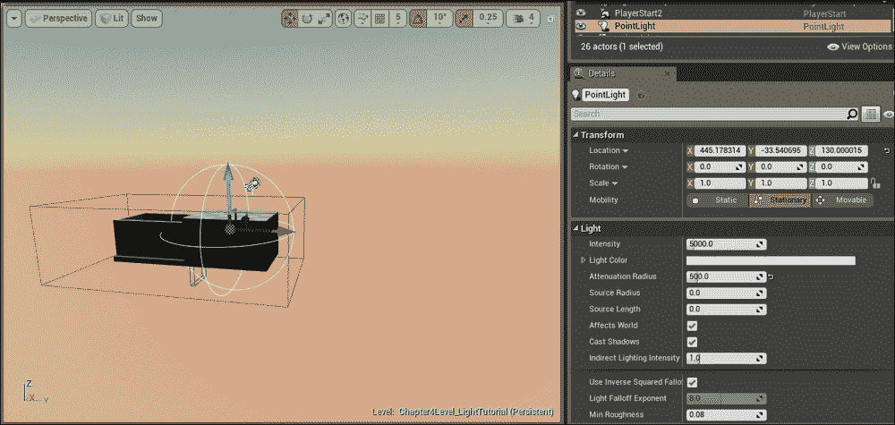

现在，让我们看看当我们调整半径变得非常小时会发生什么。以下截图显示了当半径变化时光线亮度的差异。左边的图像是衰减半径设置为 500 时的情况，右边的图像是衰减半径设置为 10 时的情况。

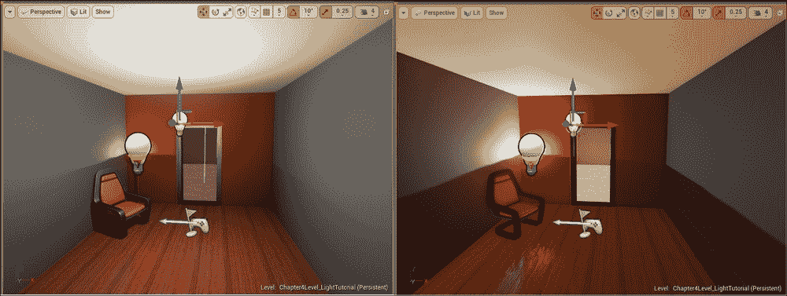

### 强度

点光源的另一个设置是**强度**。强度影响光线的亮度。您可以调整强度值来调整光线的亮度。在我们确定这个字段应该使用什么值以及我们希望光线有多亮之前，您应该了解另一个设置，**使用逆平方衰减**。

#### 使用逆平方衰减

点光源和聚光灯默认启用了基于物理的逆平方衰减。此设置可配置为在**高级**下的**灯光**详情中找到的复选框。以下截图显示了在**详情**面板中找到此属性的位置：

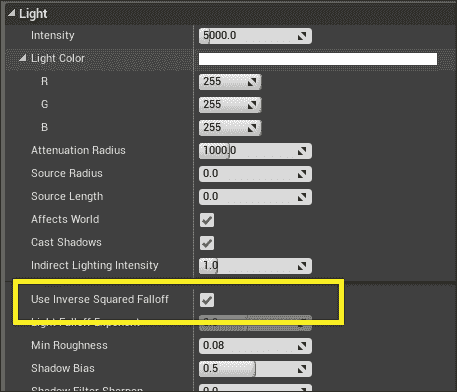

平方反比衰减是一种物理定律，描述了光强度如何随距离自然衰减。当我们有这个设置时，强度的单位与我们在现实世界中的灯光相同的单位，即流明。当不使用平方反比距离衰减时，强度只是一个值。

在上一章中，我们添加了第一个点光源，并将强度设置为 1700。这相当于一个 1700 流明的灯泡的亮度，因为使用了平方反比距离衰减。

### 颜色

要调整点光源的颜色，转到**灯光** | **颜色**。以下截图显示了如何通过指定 RGB 值或使用颜色选择器选择所需颜色来调整灯光的颜色：

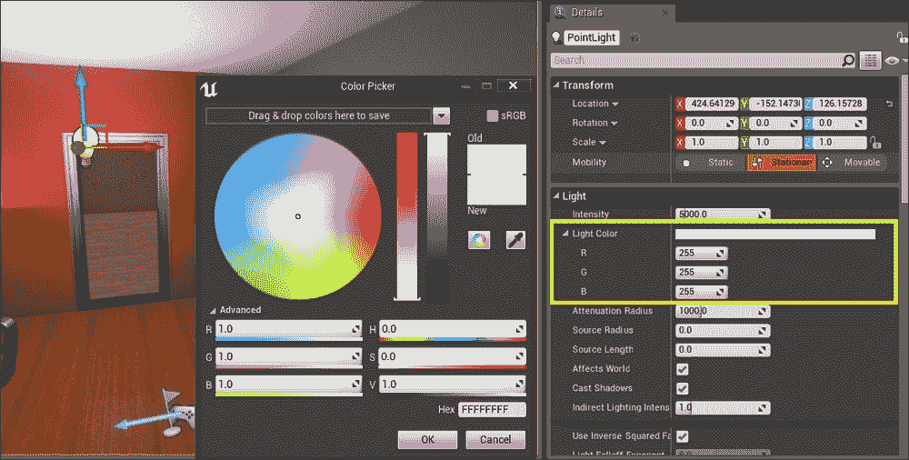

## 添加和配置聚光灯

打开`Chapter4Level.umap`并将其重命名为`Chapter4Level_SpotLight.umap`。转到**模式** | **灯光**，将聚光灯拖放到场景中。

聚光灯的亮度、可见影响半径和颜色可以通过**强度**、**衰减半径**和**颜色**的值以与点光源相同的方式进行配置。

由于点光源向所有方向发射光线，而聚光灯则从单个点向外以锥形形状发射光线，具有方向，因此聚光灯具有额外的属性，如内锥角和外锥角，这些是可以配置的。

### 内锥角和外锥角

外锥角和内锥角的单位是度。以下截图显示了当外锥角 = 20（左侧）和外锥角 = 15（右侧）时聚光灯的光半径。内锥角值在截图中没有产生太多可见结果，因此通常值为 0。然而，内锥角可以用来在锥形中心提供光线。对于扩散较宽的灯光和某些 IES 轮廓，这将更加明显。

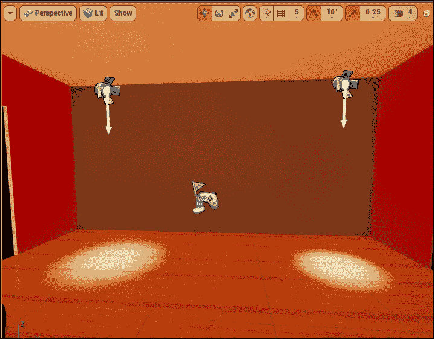

## 使用 IES 轮廓

打开`Chapter4Level_PointLight.umap`并将其重命名为`Chapter4Level_IESProfile.umap`。

IES 光线轮廓是一个包含描述光线外观信息的文件。这是由灯光制造商创建的，可以从制造商的网站上下载。这些配置文件可以在建筑模型中使用，以渲染具有逼真照明的场景。同样，IES 轮廓信息也可以在虚幻引擎 4 中使用，以渲染更逼真的灯光。IES 光线轮廓可以应用于点光源或聚光灯。

### 下载 IES 光线轮廓

IES 光线轮廓可以从灯光制造商的网站上下载。以下是一些您可以使用的轮廓：

+   **库伯工业公司**：[`www.cooperindustries.com/content/public/en/lighting/resources/design_center_tools/photometric_tool_box.html`](http://www.cooperindustries.com/content/public/en/lighting/resources/design_center_tools/photometric_tool_box.html)

+   **Philips**: [`www.usa.lighting.philips.com/connect/tools_literature/photometric_data_1.wpd`](http://www.usa.lighting.philips.com/connect/tools_literature/photometric_data_1.wpd)

+   **Lithonia**: [`www.lithonia.com/photometrics.aspx`](http://www.lithonia.com/photometrics.aspx)

### 将 IES 配置文件导入 Unreal Engine 编辑器

从**内容浏览器**中，点击**导入**，如下面的屏幕截图所示：

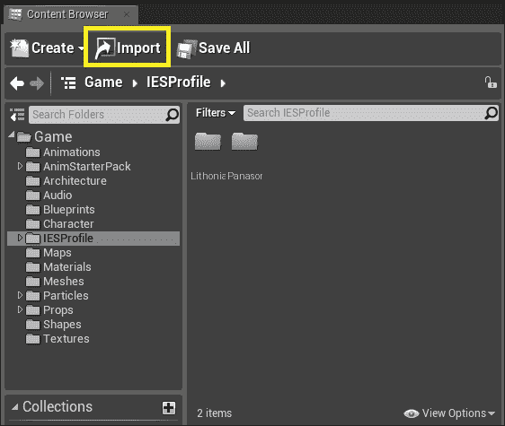

我更喜欢我的文件按照一定的顺序排列，因此我创建了一个名为`IESProfile`的新文件夹，并创建了以制造商命名的子文件夹，以更好地分类所有导入的灯光配置文件。

### 使用 IES 配置文件

在上一个示例的基础上继续，选择场景中正确的聚光灯并确保它被选中。转到**详细信息**面板并向下滚动以显示灯光的灯光配置文件。

然后转到**内容浏览器**并进入`IESProfile`文件夹，我们将灯光配置文件导入到该文件夹中。点击你想要的配置文件之一，将其拖放到聚光灯的 IES 纹理上。或者，你可以选择配置文件，然后返回到**灯光**的**详细信息**面板，点击**IES 纹理**旁边的箭头以将配置文件应用到聚光灯上。在下面的屏幕截图中，我应用了从松下网站下载的标记为**144907**的配置文件之一。

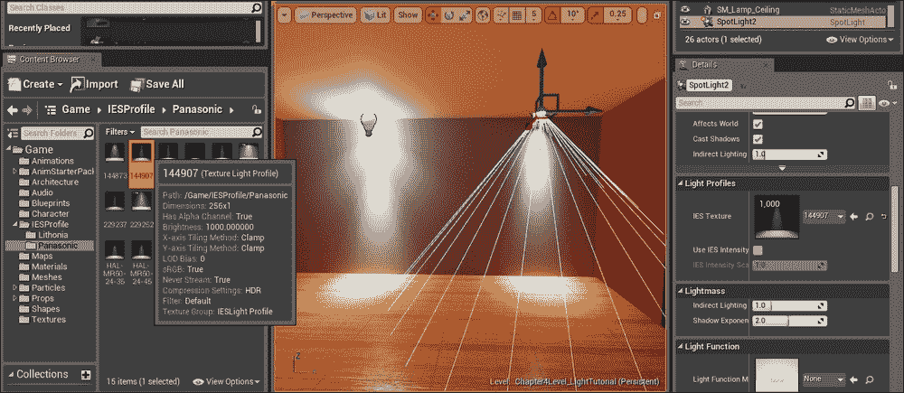

我重新配置了聚光灯，设置**强度**= **1000**，**衰减半径**= **1000**，**外锥角**= **40**，和**内锥角**= **0**。

接下来，我删除了另一个聚光灯，并用一个设置**强度**= **1000**和**衰减半径**= **1000**的点光源替换它。我还设置了**旋转-Y**= **-90**，并将其相同的 IES 配置文件应用到它上。下面的屏幕截图显示了当相同的灯光配置文件应用到聚光灯和点光源时产生的差异。请注意，聚光灯中光的扩散减少了。这加强了聚光灯提供从点光源向外扩散的锥形光的概念。外锥角决定了这种扩散。点光源向所有方向发射光，并且均匀地发射，因此它没有衰减灯光配置文件设置，允许在屏幕上完全显示此灯光配置文件的设计。这是在使用 IES 灯光配置文件时需要注意的一件事，以及它们适用于哪些类型的灯光。

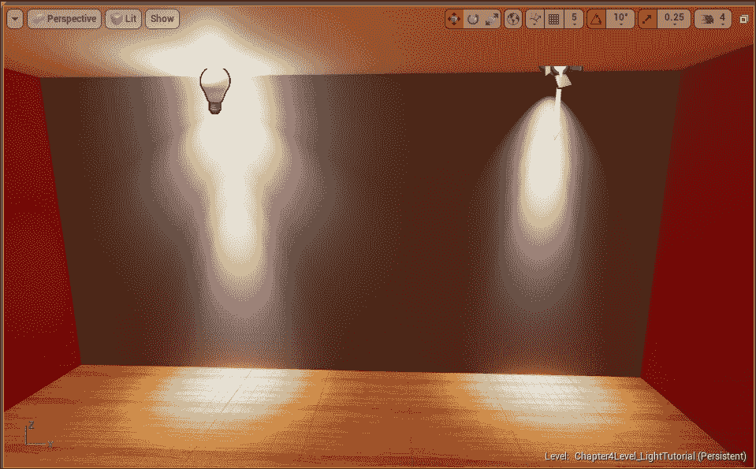

## 添加和配置方向光

打开`Chapter4Level.umap`并将其重命名为`Chapter4Level_DirectionalLight.umap`。

我们已经在第二章“创建您的第一个关卡”中添加了方向光到我们的关卡中，它向关卡提供平行光束。

轮向光也可以通过控制太阳的方向来照亮场景。左边的截图显示了当**大气阳光**复选框未选中时的轮向光。右边的截图显示了当**大气阳光**复选框选中时的轮向光。当**大气阳光**复选框选中时，你可以通过调整轮向光的旋转来控制阳光的方向。

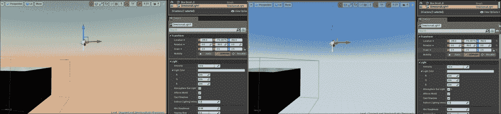

以下截图显示了当**旋转-Y** = **0**时的样子。这看起来像是一个早上的日落场景：

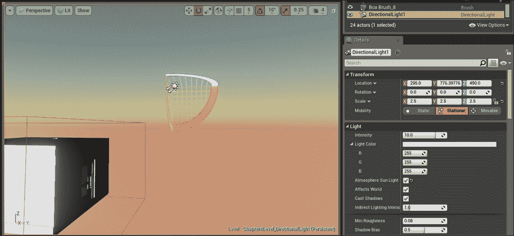

### 示例 – 添加和配置天空光

打开`Chapter4Level_DirectionalLight.umap`并将其重命名为`Chapter4Level_Skylight.umap`。

在上一个例子中，我们在轮向光中添加了阳光控制。构建和编译以查看场景现在的样子。

现在，让我们通过转到**模式** | **灯光**，然后点击并拖动天空光到场景中来向场景中添加天空光。在向场景添加天空光时，始终记得先构建和编译，以便看到天空光的效果。

天空光有什么作用？天空光模拟天空的颜色/光线，用于照亮场景的外部区域。因此，外部区域看起来更真实，因为颜色/光线是反射在表面上的（而不是使用简单的白色/彩色光）。

以下截图显示了天空光的效果。左边的图像显示了天空光不在场景中。右边的图像显示了天空光。注意，墙壁现在带有天空的颜色。

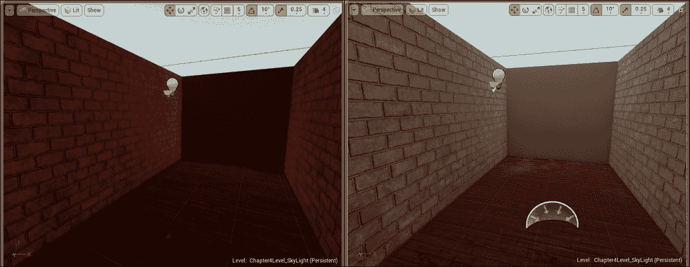

## 静态、固定或可移动灯光

在学习了如何放置和配置不同的灯光后，我们需要考虑在场景中需要哪种类型的灯光。如果你对灯光的概念不熟悉，你可能想简要地浏览一下有用的灯光术语部分，以帮助你的理解。

以下截图显示了可以更改灯光为静态、固定或可移动的**详细信息**面板。

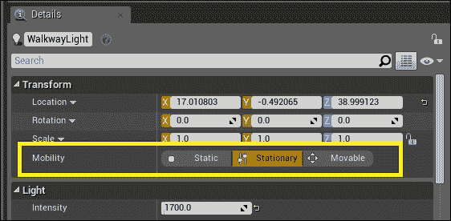

**静态**和**固定**灯光听起来非常相似。它们有什么区别？你什么时候想使用**静态**灯光，什么时候想使用**固定**灯光？

### 常见的灯光/阴影定义

常见的灯光/阴影定义如下：

+   **直接光**：这是由于光源直接存在于场景中的光。

+   **间接光**：这是场景中不是直接来自光源的光。这是反射光在周围弹跳，并来自各个方向。

+   **光照图**：这是一个存储对象关于光/亮度信息的数据结构。这使得对象的渲染速度更快，因为我们已经提前知道了它的颜色/亮度信息，并且在运行时不需要计算这些信息。

+   **阴影图**：这是一个创建动态阴影的过程。它基本上由两个步骤组成以创建阴影。可以添加更多步骤以渲染更漂亮的阴影。

### 静态光

在游戏中，我们总是希望有最佳的性能，静态光将是一个极好的选择，因为静态光只需要预先计算一次到光照图中。因此，对于静态光，我们有最低的性能成本，但作为交换，我们无法改变光的外观，移动光，以及将此光的效果与移动对象（这意味着它无法在光的影响范围内移动时为移动对象创建阴影）集成到游戏环境中的效果。然而，静态光可以在其影响半径内的现有静止对象上投射阴影。影响半径基于光源的源半径。作为对低性能成本的回报，静态光有一些限制。因此，静态光通常用于针对计算能力较低的设备创建场景。

### 静态光

静态光可以用于在游戏过程中我们不需要移动、旋转或改变光的影响半径的情况下，但允许光有改变颜色和亮度的能力。间接光和阴影与静态光一样，在光照图中预先烘焙。直接光阴影存储在阴影图中。

静态光在性能成本上是中等的，因为它能够通过使用距离场阴影图在静态对象上创建静态阴影。完全动态的光和阴影通常比静态光和阴影多 20 倍以上。

### 可移动光

可移动光用于为场景投射动态光和阴影。除非绝对必要，否则在级别中应谨慎使用。

## 练习 – 扩展你的游戏级别（可选）

这里是我为了将当前的**Level4**扩展到我们目前拥有的预构建版本所采取的步骤。这绝对不是唯一的方法。我只是简单地使用了一个几何刷来简化这一级别的扩展。以下截图显示了扩展级别的一部分：

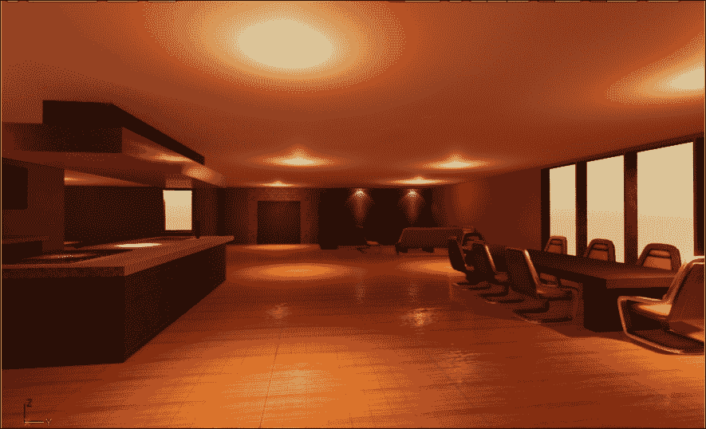

### 有用提示

当可能时，将同一区域内的项目分组在一起，并重命名实体以帮助您更快地识别级别的各个部分。这些简单的额外步骤在编辑器中创建游戏级别原型时可以节省时间。

### 指南

如果你计划自己扩展游戏关卡，请打开并加载 `Level4.umap`。然后保存地图为 `Level4_MyPreBuilt.umap`。你也可以打开扩展后的关卡副本以复制资源或作为快速参考。

#### 面积扩展

我们将首先延长这一层的地面区域。

##### 第一部分 – 延长现有通道

短通道被延长形成了一个 L 形通道。延长部分的尺寸为 X1200 x Y340 x Z40。

| 需要的 BSP 数量 | X | Y | Z |
| --- | --- | --- | --- |
| 天花板 | 1200 | 400 | 40 |
| 地面 | 1200 | 400 | 40 |
| 左墙 | 1570 | 30 | 280 |
| 右墙 | 1260 | 30 | 280 |

##### 第二部分 – 创建大房间（居住和厨房区域）

通道通向末尾的大房间，这是主要的居住和厨房区域。

| 需要的 BSP 数量 | X | Y | Z |
| --- | --- | --- | --- |
| 天花板 | 2000 | 1600 | 40 |
| 地面 | 2000 | 1600 | 40 |
| 将大房间和通道分开的左侧墙（从通道进入大房间时离你最近的墙） | 30 | 600 | 340 |
| 将大房间和通道分开的灯光墙（从通道进入大房间时离你最近的墙） | 30 | 600 | 340 |
| 大房间（厨房区域）的左侧墙 | 1200 | 30 | 340 |
| 大房间（餐厅区域）的右侧墙 | 2000 | 30 | 340 |
| 从通道进入房间左侧的墙（进入房间时，窗户座位所在的位置的墙） | 30 | 350 | 340 |
| 从通道进入房间右侧的墙（进入房间时，长长长凳所在的位置的墙） | 30 | 590 | 340 |
| 门区域（包括砖墙、门框和门） |
| 左侧墙填充物 | 30 | 130 | 340 |
| 右侧墙填充物 | 30 | 126 | 340 |
| 门 x 2 | 20 | 116 | 250 |
| 侧门框 x 2 | 25 | 4 | 250 |
| 水平门框 | 25 | 242 | 5 |
| 侧砖墙 x 2 | 30 | 52 | 340 |
| 水平砖墙 | 30 | 242 | 74 |

##### 第三部分 – 沿通道创建一个小房间

为了创建通往小房间的通道，复制我们在第一个房间中创建的相同门框。

| 需要的 BSP 数量 | X | Y | Z |
| --- | --- | --- | --- |
| 天花板 | 800 | 600 | 40 |
| 地面 | 800 | 600 | 40 |
| 侧墙 x 2 | 30 | 570 | 340 |
| 对面墙（有窗户的墙） | 740 | 30 | 340 |

##### 第四部分 – 在大房间中创建一个娱乐区

| 需要的 BSP 数量 | X | Y | Z |
| --- | --- | --- | --- |
| 侧墙 x 2 | 30 | 620 | 340 |
| 带有书架的墙 | 740 | 30 | 340 |

#### 创建窗户和门

现在我们完成了房间的制作，我们可以开始制作门和窗户。

##### 第一部分 – 为餐厅区域创建大玻璃窗户

为了创建窗户，我们使用减法几何笔刷在墙上创建洞口。首先，创建一个尺寸为 X144 x Y30 x Z300 的洞口，并将其放置在天花板和地面之间的正中间。复制这个洞口并将其转换为加法笔刷；调整尺寸为 X142 x Y4 x Z298。

使用 **M_Metal_Copper** 为框架，并使用 **M_Glass** 为刚刚创建的附加刷子。现在，将它们分组，并将两个刷子各复制四次以创建五个窗户。餐厅区域窗户的截图如下所示：

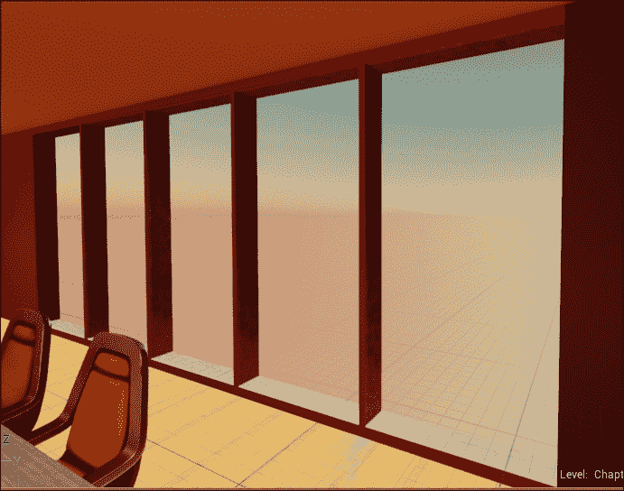

##### 第二部分 – 为窗座创建开放式窗户

要创建窗座区域的窗户，创建一个尺寸为 X50 x Y280 x Z220 的减法几何刷子。对于这个窗户，我们在窗户底部有一个 X50 x Y280 x Z5 的突出边缘。然后对于玻璃，我们复制尺寸为 X4 x Y278 x Z216 的减法刷子，将其转换为添加刷子并调整以适应。

使用 **M_Metal_Brushed** 为框架，并使用 **M_Glass** 为刚刚创建的附加刷子。

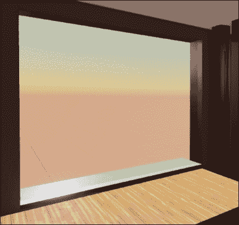

##### 第三部分 – 创建房间窗户

对于房间窗户，创建一个尺寸为 X144 x Y40 x Z94 的减法刷子。这是为了在墙上创建一个用于道具框架 **SM_WindowFrame** 的空洞：。复制减法刷子和道具以创建房间的两个窗户。

##### 第四部分 – 创建主门区域

对于主门区域，我们首先创建门及其框架，然后是门周围的砖墙，最后是剩余的混凝土平面墙。

我们有两个带框架的门和一些砖墙需要增加，然后再回到通常的平滑墙。以下是创建这个门区域的尺寸：

| 需要的 BSPs | X | Y | Z |
| --- | --- | --- | --- |
| 实际门 x 2 | 20 | 116 | 250 |
| 侧框 x 2 | 25 | 4 | 250 |
| 顶部框架 | 25 | 242 | 5 |

这里是创建门周围区域的尺寸：

| 需要的 BSPs | X | Y | Z |
| --- | --- | --- | --- |
| 砖墙侧面 x 2 | 30 | 52 | 340 |
| 砖墙顶部 | 30 | 242 | 74 |
| 左侧平滑墙 | 30 | 126 | 340 |
| 右侧平滑墙 | 30 | 130 | 360 |

#### 创建基本家具

让我们分部分开始，如下所述。

##### 第一部分 – 创建餐桌并放置椅子

对于餐桌，我们将定制一个尺寸为 X480 x Y160 x Z12 的木质餐桌，并在餐桌边缘 40 厘米处放置两个尺寸为 X20 x Y120 x Z70 的腿。用于纹理的材料是 **M_Wood_Walnut**。

然后使用 `Props` 文件夹中的 **SM_Chair** 在桌子周围安排八张椅子。

##### 第二部分 – 装饰休息区

中间有两个低桌子，墙边有一个低长桌子。使用 `Props` 文件夹中的三个 **SM_Couch** 围绕低桌子放置。以下是大型桌子的尺寸：

| 需要的 BSPs | X | Y | Z |
| --- | --- | --- | --- |
| 平面顶部 | 140 | 140 | 8 |
| 腿 x 2 | 120 | 12 | 36 |

这里是小型餐桌的尺寸：

| 需要的 BSPs | X | Y | Z |
| --- | --- | --- | --- |
| 腿 x 2 | 120 | 12 | 36 |

这里是墙边低长桌的尺寸：

| 需要的 BSPs | X | Y | Z |
| --- | --- | --- | --- |
| 块 | 100 | 550 | 100 |

##### 第三部分 – 创建窗户座位区

在打开的窗户旁边放置一个尺寸为 X120 x Y310 x Z100 的几何盒子。这是为了在窗户旁边创建一个简化的座位。

##### 第四部分 – 创建日本座位区

表面尺寸为 X200 x Y200 x Z8，并带有 4 条短腿（每条腿尺寸为 X20 x Y20 x Z36）的日本方形桌子放置在桌子角落附近。

为了在桌子下创造一个腿部空间，我使用了一个减法刷子（X140 x Y140 x Z40），并将其放置在桌子下面的地面上。我使用这个减法刷子的角落作为放置桌子短腿的指南。

##### 第五部分 – 创建厨房柜子区

这是一个厨房柜子区的简化块原型。以下 L 形区域的尺寸：

| 需要的 BSPs | 材质 | X | Y | Z |
| --- | --- | --- | --- | --- |
| 较短的 L：桌面下的柜子 | **M_Wood_Walnut** | 140 | 450 | 100 |
| 较长的 L：桌面下的柜子 | **M_Wood_Walnut** | 890 | 140 | 100 |
| 较短的 L：桌面 | **M_Metal_Brushed_Nickel** | 150 | 450 | 10 |
| 较长的 L：桌面 | **M_Metal_Brushed_Nickel** | 900 | 150 | 10 |
| 较短的 L：悬挂柜子 | **M_Wood_Walnut** | 100 | 500 | 100 |
| 较长的 L：悬挂柜子 | **M_Wood_Walnut** | 900 | 100 | 100 |

以下是小岛区域（风扇）的尺寸：

| 需要的 BSPs | 材质 | X | Y | Z |
| --- | --- | --- | --- | --- |
| 风扇（木质区域） | **M_Wood_Walnut** | 400 | 75 | 60 |
| 风扇（金属区域） | **M_Metal_Chrome** | 500 | 150 | 30 |

以下是小岛区域（桌子）的尺寸：

| 需要的 BSPs | 材质 | X | Y | Z |
| --- | --- | --- | --- | --- |
| 桌下柜子 | **M_Wood_Walnut** | 500 | 150 | 100 |
| 桌面 | **M_Metal_Chrome** | 550 | 180 | 10 |
| 水槽（使用减法刷子） | **M_Metal_Chrome** | 100 | 80 | 40 |
| 炉灶台面 | **M_Metal_Burnished_Steel** | 140 | 100 | 5 |

# 概述

在本章中，我们深入了解了材料和灯光的信息。我们学习了渲染系统的工作原理以及底层图形管道/技术，如 Directx 11、Directx 12 和 OpenGL/Vulkan。我们还学习了如何使用 Unreal 4 材质编辑器创建自定义材质并将其应用到你的级别中。

我们还探讨了不同类型的灯光，以及调整**强度**、**衰减半径**和其他设置来自定义级别的灯光。我们还学习了如何从灯光制造商的网站上导入 IES 灯光配置文件，以创建级别的真实灯光。我们还了解了**静态**、**固定**和**可移动**灯光之间的区别以及不同灯光如何为级别投射阴影。

在下一章中，我们将学习游戏中的动画和人工智能。敬请期待更多内容！
