# 第五章。动画和 AI

本章是关于动画和**人工智能**（**AI**）的。

动画是我们为了让游戏中的事物移动所需要的东西。人工智能（AI）是角色（除了玩家）在游戏中知道如何行为和反应所必需的。

在本章中，我们将涵盖以下主题：

+   动画的定义

+   3D 动画

+   在 Unreal Engine 4 中进行动画所需的工具

+   学习如何将动画添加到你的游戏中

+   使用动画蓝图

+   了解混合动画

+   游戏中的 AI

+   设计一个**行为树**（**BT**）

+   使用蓝图在你的游戏中实现 AI

# 什么是动画？

动画是通过一系列图像或帧来模拟运动。

在计算机出现之前，动画是通过传统的技术创造的，如手绘动画和定格动画（或模型动画）。正如其名所示，手绘动画涉及在纸上绘制场景。每个场景都在下一张纸上重复，场景略有变化。所有纸张按顺序排列，页面快速翻动，就像翻页书一样。纸张上的细微变化创造了 2D 动画，这可以被拍摄成运动电影。这种技术在迪士尼卡通和电影中经常使用。正如你可以想象的，这是一种非常耗时的方式来制作动画，因为你需要成千上万的绘画来创造几秒钟的电影。

定格动画涉及创建模型，在每一帧中稍微移动它们以模拟运动，并拍摄这个序列来构建整个场景。捕捉无数片段的繁琐过程限制了这种方法的使用，如今更主流的动画技术得到了青睐。

计算机动画与定格动画非常相似，因为计算机图形在每一帧中都会稍微移动；然后这些帧被渲染到屏幕上。对于计算机游戏，我们通过使用 Maya 和 3ds Max 等工具创建 3D 模型来进行计算机动画。然后，我们为这些模型添加动画以模拟游戏中的逼真行为和动作。为了使物体移动，动画是必需的。角色需要被动画化，这样它们看起来才真实——它们可以处于空闲状态、行走、奔跑或执行游戏中需要执行的其他任何动作。

动作捕捉也是目前非常流行的一种角色动画方式。这项技术基本上是利用记录的人类动作来创建计算机图形角色的行为。如果你看过电影《阿凡达》，那些蓝色的阿凡达角色实际上是由人类演员扮演的，然后通过计算机图形技术进行了增强，以呈现出那样的外观。为了拍摄这部电影，他们把动作捕捉技术推进到了现在所说的**表演捕捉**。这项技术的进步赋予了电影和游戏制作者捕捉动画细节的能力，使得 CG 角色能够脱颖而出。

# 理解如何动画化 3D 模型

虽然这本书的目标不是教你如何动画化模型，但了解动画是如何制作的对于你更好地理解如何在游戏中让游戏角色根据设计移动和表现是非常重要的。

如前所述，我们可以使用工具如 Maya 或 3ds Max 来动画化 3D 模型。然后我们可以记录它们的变化，并在需要时在屏幕上渲染这些动画。

## 动画前的准备工作

在游戏开发中，动画的制作责任属于动画师。在动画首先被创建之前，我们需要首先有一个由 3D 模型师创建的 3D 模型。3D 模型师负责赋予物体形状并进行纹理处理。根据我们处理的对象类型，获取物体正确绑定的具体过程可能会有所不同。绑定需要在将物体交给动画师创建特定动画之前完成。有时，动画师还需要对绑定进行微调，以便更好地控制动画。

布料绑定是一个将骨骼放置在网格中并为骨骼创建关节的过程。这些骨骼/关节的集合被称为**绑定**。绑定提供了控制点，动画师可以使用这些控制点来移动对象，从而创建所需的动画。在这里，我将使用一个人类角色模型来解释，以便你能够轻松理解这个概念。

3D 或角色建模师首先展示模型的头部和身体是如何塑造的。然后确定模型的高度，通过向模型添加原语来创建所有必需的特征，并对其进行纹理处理，为其眼睛、头发等上色。现在模型已经准备好了，但内部仍然像果冻一样柔软，因为我们还没有给它任何内部结构。绑定是将骨骼添加到身体中的过程，以支撑它。手臂可以旋转，因为我们已经给它一个肩胛骨（肩胛骨）、上臂骨（肱骨）和一个可以模仿球窝关节的关节。我们用于绑定的关节由一组限制组成，这些限制限制了在不同平面和角度上的运动。还将层次结构应用于骨骼结构，以帮助骨骼相互连接。手指连接到手，手连接到手臂。可以建立这样的关系，以便当一个部分移动时，其余部分也会自然地一起移动，从而使动作看起来更真实。

Maya 和 3ds Max 等工具为绑定过程提供了一些简化，因为您可以使用标准绑定作为基础，并根据模型的需求调整这个基础。一些模型更高，需要更长的骨骼。一个 3D 模型必须有一个简单的骨骼结构，紧密遵循 3D 模型的形状和大小。相似大小的 3D 模型可以共享相同的骨骼结构。

为了更好地理解我们如何将动画添加到游戏关卡中，让我们学习计算机动画是如何创建的，以及我们如何使这些模型移动。

## 动画是如何创建的？

动画基本上模仿了现实世界中生命活动的样子。许多公司为了使计算机动画尽可能准确，会不遗余力地使用动作捕捉技术。他们拍摄现实生活中的实际动作，然后使用计算机 3D 模型来重现这些动作。

在创建动画时，动画师利用绑定过程中创建的骨骼和关节，并尽可能详细地调整它们的位置，以模仿它们的自然运动。骨骼和关节共同作用，影响身体姿势。这些动作随后被记录为简短的动画剪辑，称为动画序列。动画序列构成了动画的最基本块，可以播放一次或多次以创建动作。例如，一个行走动画只有 1.8 秒长，但可以反复播放来模拟行走。当这个序列再次重复时，通常被称为动画循环。

动画序列也可以相互链接，形成一个动作链。在从一个序列过渡到另一个序列时，可能需要一些混合，以便使动作看起来更自然。

# Unreal Engine 4 为游戏动画提供的功能

在 Unreal Engine 4 中，动画主要是在 Persona 编辑器中完成的。这个编辑器提供了四种不同的模式：**骨骼**、**网格**、**动画**和**图表**。这些模式主要存在是为了让您可以直接跳入其中之一，以更有效地编辑/创建动画。因此，它们只是一组松散的功能，可以用来控制动画的不同方面。我们将学习如何使用 Persona 中的功能为我们的关卡添加动画。

为了帮助提高团队协作，Unreal Engine 4 还发布了一个之前仅限内部使用的工具集，这是一个 Maya（兼容 Maya 2013 及以上版本）的插件，称为**动画和绑定工具集**（**ART**）。此工具集提供了一个用户界面，允许在 Maya 本身内创建骨骼、放置骨骼和创建绑定。我们不会深入探讨这个工具集的细节，但您可以在 Unreal 的在线文档中找到更多关于此的信息，网址为[`docs.unrealengine.com/latest/INT/Engine/Content/Tools/MayaRiggingTool/index.html`](https://docs.unrealengine.com/latest/INT/Engine/Content/Tools/MayaRiggingTool/index.html)。

## 从 Maya/3ds Max 导入动画

由于许多艺术家使用 Maya 和 3ds Max 来创建 3D 模型和动画，Unreal Engine 4 拥有一个出色的 FBX 导入管道，允许您成功导入骨骼模型、动画序列和变形目标。这使得将资产传输到 Unreal 编辑器并将其放入游戏变得容易。Unreal 还试图稳定从其他软件（如 Blender 和 MODO）导入艺术资产。

### 教程 – 从 Marketplace 导入动画包

由于 3D 模型和动画最初是在 Unreal Engine 之外创建的，为了了解动画的工作原理，我们首先导入一个包含 3D 模型和多个动画序列的动画包，然后我们将学习如何使用 Unreal 编辑器中的不同工具进行动画制作。

Unreal Engine 在 Marketplace 提供了许多可下载的包。Marketplace 位于启动菜单屏幕下，位于**启动**按钮下方。以下截图显示了具有**Marketplace**标签选中的启动屏幕，该标签用于可下载的包。在**角色和动画**下 Marketplace 中搜索**动画入门包**。这个特定的包可以免费下载。点击**动画入门包**进行下载。

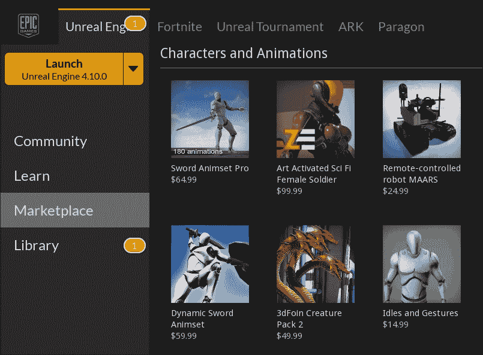

在包下载后，您会发现包已添加到**库**中。以下截图显示了**Animator Starter Pack**在**库**下的**保险库**中的位置：

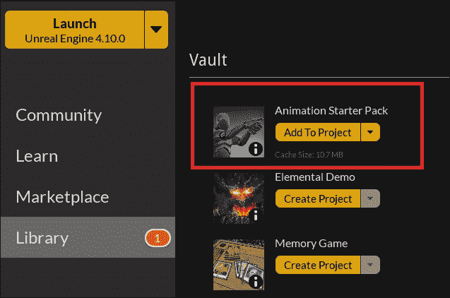

现在我们已经将**动画入门包**添加到我们的**库**中，我们可以将其添加到当前项目中并开始尝试动画。

点击**添加到项目**，将出现一个弹出窗口，显示 Unreal Engine 中所有当前项目的名称。选择你为所有各种级别和教程示例创建的项目名称。如果你遵循与我相同的项目和级别命名约定，它将是`MyProject`。我已将上一章的`Chapter4Level`打开并重命名为`Chapter5Level`。以下屏幕截图显示了在项目中加载的`AnimStarterPack`：

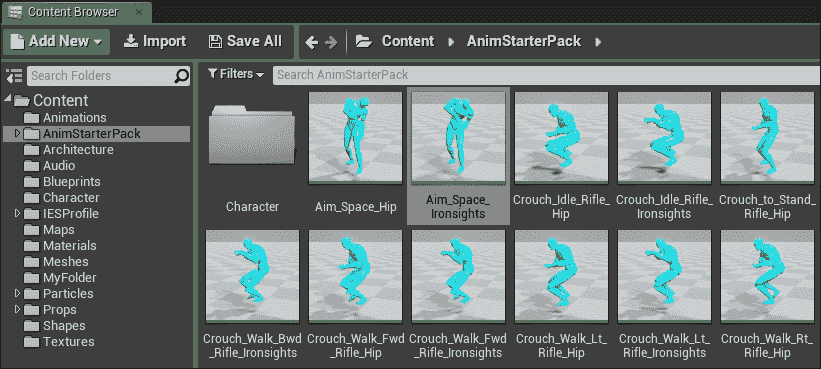

## 你可以用 Persona 做什么？

Persona 为游戏开发者提供了播放和预览动画序列的能力，通过混合将动画序列合并成单个动画，创建蒙太奇，编辑骨骼/插座，以及使用蓝图控制动画。我希望你仍然记得在第三章“游戏对象 – 更多和移动”中关于蓝图所学的内容。

### 教程 – 将现有动画分配给 Pawn

在上一个练习中将免费动画包添加到你的项目中后，现在是时候向级别添加一些动画了。首先，打开`Chapter4Level`，将其重命名为`Chapter5Level`，然后使用**内容浏览器**导航到`AnimStarterPack`文件夹。转到`Character`子文件夹，点击并拖动**HeroTPP**到级别中。

此屏幕截图显示了如何将**HeroTPP**添加到级别中：

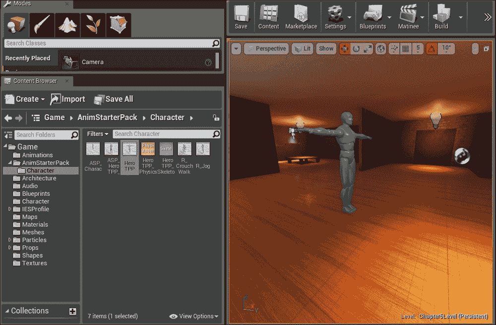

**HeroTPP**看起来很假，对吧？现在，让我们给他一个更好的姿势。点击**HeroTPP**以显示详细信息。在**详细信息**下的**动画**选项卡中输入**动画模式**设置。使用**动画资产**，在**内容浏览器**中导航并点击**Jog_Fwd_Rifle**（在`AnimStarterPack`中），然后点击**Anim to Play**旁边的箭头。

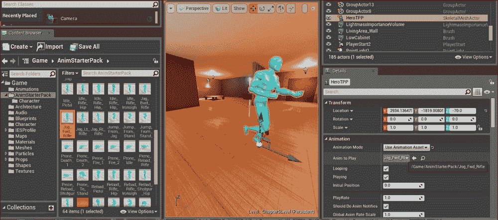

这里是**动画**设置的放大视图：

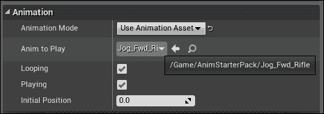

现在，构建并播放级别。你会看到你刚刚添加到级别中的角色正在慢跑。

这是动画角色的直接方法。然而，无论周围发生什么，角色都会继续循环这个动画。我们可能希望角色能够对环境和游戏条件做出反应。那么，我们该如何做到这一点？

## 我们为什么需要混合动画？

在上一个练习中，我们学习了如何使骨骼网格采用单个动画。但我们可以让骨骼网格开始沿直线奔跑吗？接下来的几个动画练习部分将解释我们如何做到这一点，并随后添加更多基本动画。

首先，你需要记住，当告诉它们播放时，动画序列/姿势才会播放。在为角色动画时，你需要关注细节，以便角色看起来正常。

现在，让我们快速回顾一下在之前的练习中我们做了什么：骨骼网格角色是一个没有附加动画的僵尸。当我们链接跑步动画并设置它播放时，角色立即看起来像是在跑步。所以，如果我们想让角色停止跑步，我们可以移除跑步动画。角色会回到看起来像是没有动画的僵尸。如果我们在一个游戏中这样做，你可能会认为动画有什么非常不正常的地方。僵尸->跑步->僵尸。这没有任何现实感。

我们如何改进它？我们从为角色设置空闲姿势开始；空闲姿势是角色站在固定位置并呼吸的状态。呼吸也是动画的一部分。它使角色看起来像是有生命的。接下来，我们设置它播放跑步动画。要停止这个动画，我们允许角色再次回到空闲位置。对于这个迭代来说，这不是一个糟糕的尝试。角色现在看起来不再像僵尸，而是看起来和感觉都很真实。

我们还能做些什么来让它更好？让我们用一个正常驾驶汽车的人（不是赛车手）的类比。当你从起始位置移动时，你会从 0 速度加速到舒适的巡航速度。当你想要停车时，你会通过踩刹车来降低巡航速度，然后逐渐回到 0（以避免突然停车并给你的乘客带来向前抛的不好体验）。同样，我们可以用这个来帮助我们设计角色的从静止状态过渡。我们将使用一个名为**混合动画**的工具来创建这个过渡，这样我们就可以让角色的动作更加逼真。

混合动画，正如其名所示，通过变量混合各种类型的动画。它可以是一个简单的一维关系，其中我们使用速度作为一个轴来混合动画，或者是一个二维关系，其中我们使用速度和方向来混合动画。虚幻引擎的混合动画工具能够以不同的方式设置动画的混合。

### 教程 – 创建混合动画

在这个例子中，我们将使用速度作为参数来混合动画。在我们列出在虚幻编辑器中实现此目的的步骤之前，让我们先简要概述一下这里的思考过程。这将有助于你理解这个过程是如何工作的，而不仅仅是简单地遵循过程来让某件事情发生。

当速度为 0 时，我们分配空闲姿势。随着速度的增加，我们应该将动画从空闲状态切换到行走动画。当速度进一步增加时，动画从行走切换到慢跑，然后是跑步。以下是混合动画效果的示意图：

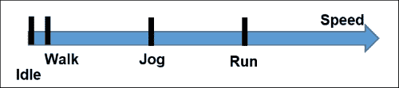

接下来，让我们确定动画包中哪些动画序列适合每个阶段：

+   **Idle_Rifle_Hip**

+   **Walk_Fwd_Rifle_Ironsights**

+   **Jog_Fwd_Rifle**

+   **Sprint_Fwd_Rifle**

要创建一个简单的 1D 混合空间，我们可以右键单击`Character`文件夹，并转到**创建资产** | **动画** | **混合空间 1D**。或者，您可以在**内容浏览器**中选择`Character`文件夹，点击顶部的**创建**按钮，转到**动画**，然后选择**混合空间 1D**。

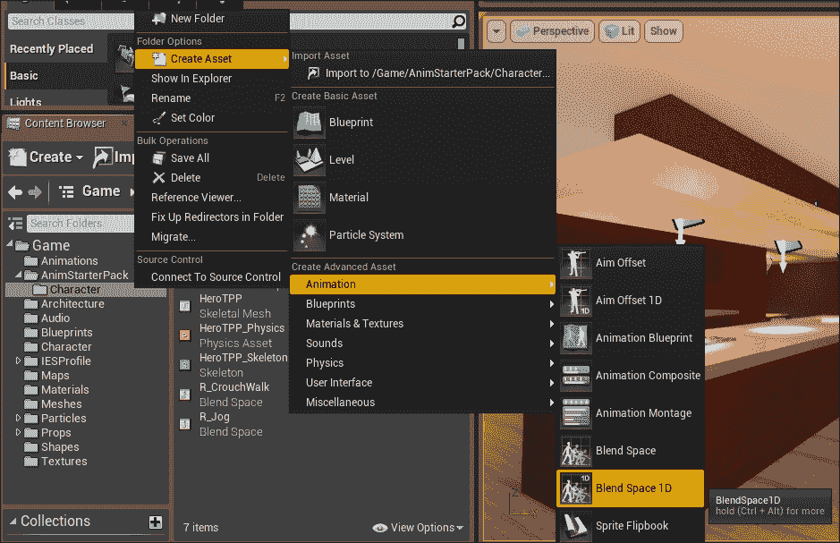

选择**HeroTPP_Skeleton**；点击此选项将创建一个新的 1D 混合空间。将**newblendspace1d**重命名为`WalkJogRun`。双击新创建的**WalkJogRun**以打开编辑器。这将直接将您带到编辑器的**动画**选项卡。注意以下截图中的这部分被突出显示。在**骨骼网格**字段中，我们有**HeroTPP_Skeleton**，这是我们之前创建混合空间时选择的。

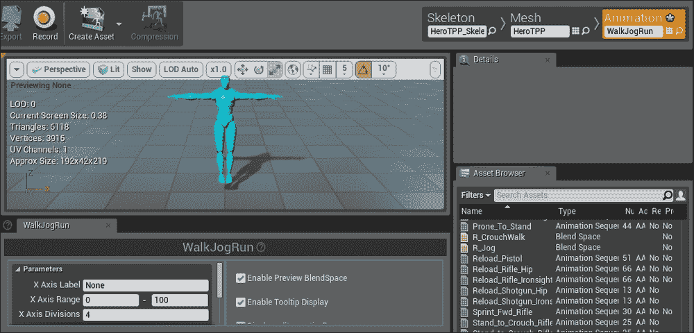

在**动画**编辑器中，您可以使用**资产浏览器**（默认位于屏幕的右下角）。点击动画资产可以预览动画的外观。

让我们先设置**X 轴标签**为`速度`。**X 轴范围**从`0`到`375`。将**X 轴分区**保留为**4**。

在速度图中，分区的数量创建了我们所拥有的段。基于我们之前为空闲、步行、慢跑和跑步状态选择的设置，使用**资产浏览器**找到动画，点击并拖动动画到**WalkJogRun**标签页中的适当部分，如图所示：

**Idle_Rifle_Hip**在速度=0 时。在第一分区行中设置**Walk_Fwd_Rifle_Ironsights**。当您将动画拖动到图中时，它会在分区线之一处创建一个节点并自动对齐。在第二分区行中设置**Jog_Fwd_Rifle**，并在速度=375 时设置**Sprint_Fwd_Rifle**。要预览动画的混合效果，将鼠标沿垂直轴移动到图中。

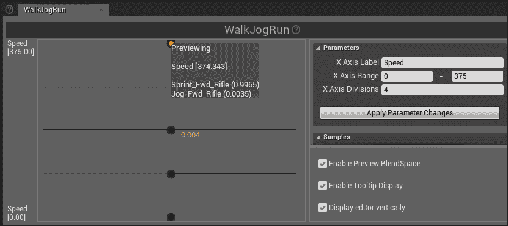

### 教程 – 设置动画蓝图以使用混合动画

现在我们已经创建了一个使用速度作为参数的混合动画。我们如何让 NPC 改变速度，然后将此动画链接到它，以便随着速度的变化，播放的动画也发生变化？

对于简单的速度和动画变化实现，我们将设置动画蓝图。转到**内容浏览器**。导航到**动画** | **角色**；然后，导航并点击**创建资产** | **动画** | **动画蓝图**：

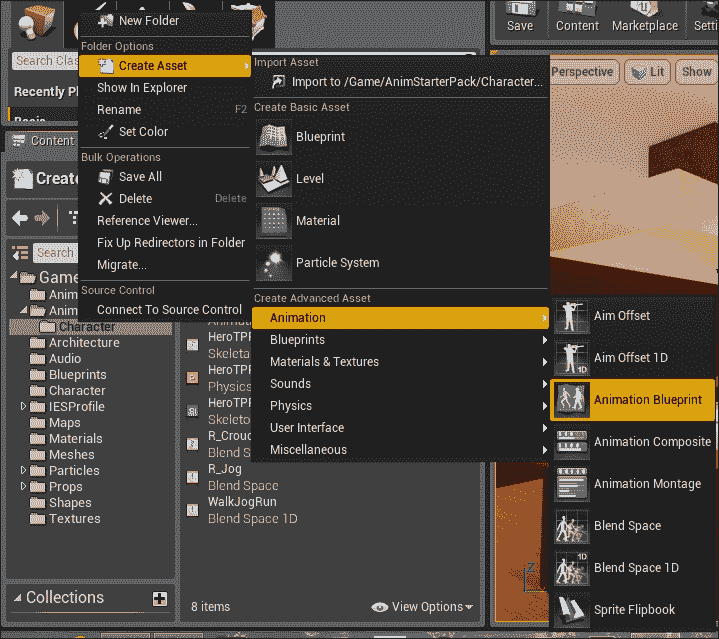

选择**动画蓝图**后，编辑器会提示你想要在哪个基类中创建动画蓝图。以下截图显示了可用的选择选项：

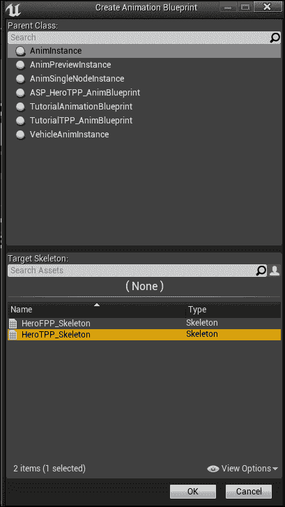

在这个例子中，我们将选择最基础的通用类`AnimInstance`来构建我们的动画蓝图。将**HeroTPP_Skeleton**作为此蓝图的目标骨骼网格。将此动画蓝图命名为`MyNPC_Blueprint`。

要检查你是否选择了正确的目标骨骼网格，请查看**蓝图**窗口中的**骨骼**标签，如图下截图所示。你应该在框中看到**HeroTPP_Skeleton**。截图还显示了已选择的**图**标签，显示了一个空的默认 AnimGraph。我们将使用**图**标签继续这个练习，除非另有说明。

#### AnimGraph

以下截图显示了默认的空白 AnimGraph。**最终动画姿态**将接收已指定骨骼网格的输出：

首先，我们想要通过在 AnimGraph 内部右键点击并导航到**状态机** | **添加新状态机…**来添加一个状态机，如图下截图所示：

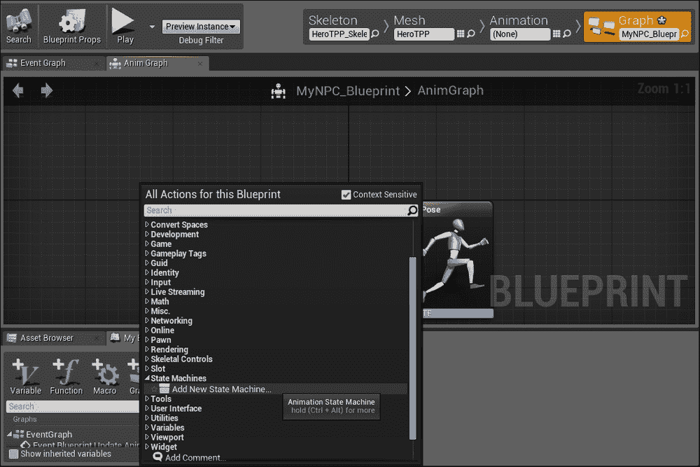

重命名新创建的状态机**Movement**：

双击**Movement**。创建一个名为**WalkJogRun**的新状态：

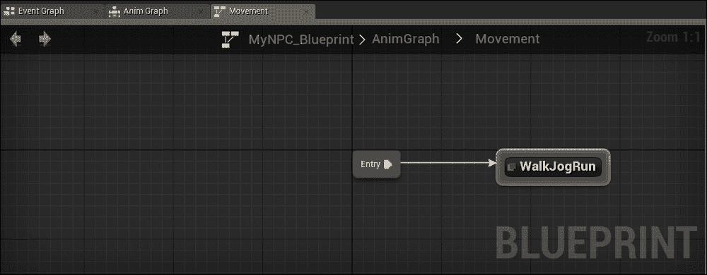

双击新创建的**WalkJogRun**状态，在新标签页中修改状态。转到**资产浏览器**标签页，查找我们在上一个练习中创建的**WalkJogRun** blendspace，将其拖动到编辑器中。将**WalkJogRun** blendspace 链接到最终动画，如图下截图所示。注意，在 blendspace 节点中指定了速度=0.00；这是我们之前在早期练习中创建 blendspace 时定义的变量，用于控制动画变化。

接下来，我们需要创建一个变量，以便我们可以将值传递给**WalkJogRun** blendspace 的速度变量。要做到这一点，我们需要点击并拖动 blendspace 节点旁边**Speed**旁边的绿色点以打开上下文菜单，查找**提升为变量**，然后点击它。这将在 blendspace 节点中将速度提升为浮点变量，我们将设置它来控制播放动画的速度和类型。将这个新变量重命名为**Speed**。以下截图显示了如何创建和连接一个**Speed**变量到**WalkJogRun** blendspace，它链接到**最终动画姿态**：

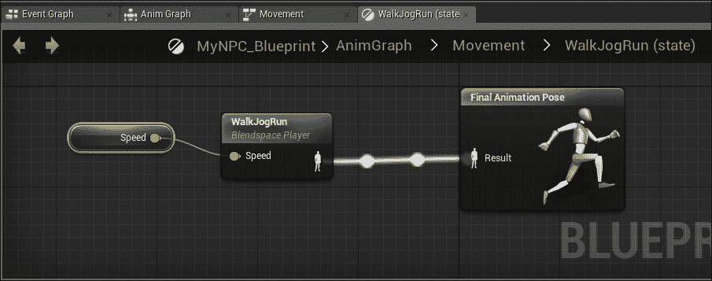

现在，回到将**Movement**链接到**最终动画姿态**：

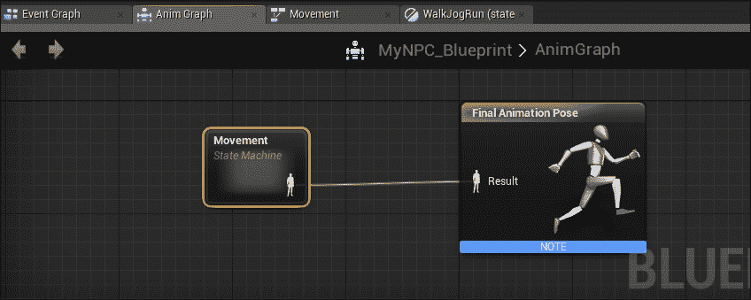

现在，整个 AnimGraph 已经连接起来。点击**Compile**，你会看到角色模型的预览更新，如以下截图所示。白色移动的圆点显示了数据如何通过系统流动。这里的速度是 0。

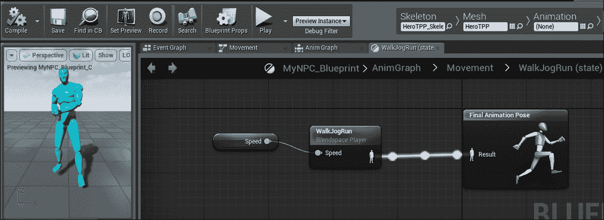

我们也可以使用此选项卡来查看当我们更改**Speed**的值时的实时预览。以下截图显示了速度为 50 时的情况。角色模型采取了一个行走姿态。

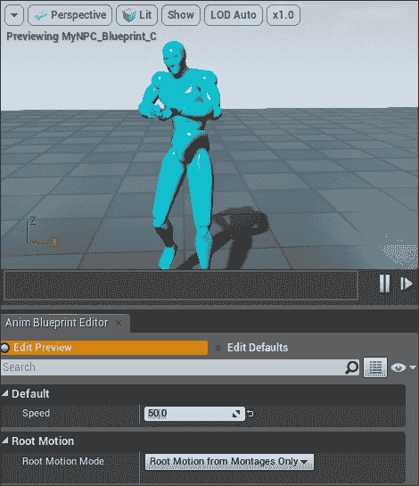

通过 AnimGraph，我们能够将**Speed**设置为变量，并将其链接到**WalkJogRun**混合空间，这反过来控制以何种速度播放哪种动画。我们现在需要考虑如何提供一些逻辑来确定 NPC 的速度如何变化。

#### EventGraph

EventGraph 用于将逻辑编程到蓝图之中。

在此示例中，我们将使用 EventGraph 创建逻辑来更改速度值，这将反过来影响 NPC 的动画控制。

要创建一个更复杂的智能决策过程，这被称为 AI，我们需要在 EventGraph 中使用一组与 AI 相关的节点。我们将在下一节中了解更多关于创建 AI 的内容。

以下截图显示了动画蓝图中的默认新**EventGraph**选项卡。

**Event Blueprint Update Animation**节点可以被视为在 EventGraph 网络中发送脉冲的源。随着这个脉冲通过网络传播，它会经过你设计的多个问题，以确定播放哪种动画。

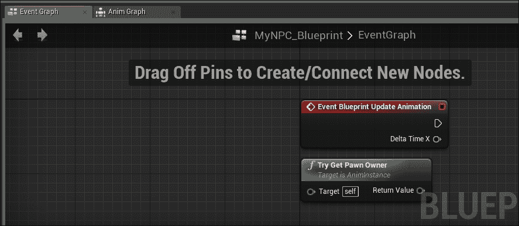

**Try Get Pawn Owner**用于获取动画蓝图分配的所有者。这通常与另一个节点**IsValid**结合使用，以确保在设置值以更改动画之前有一个有效的所有者。

要使**MyNPC_Blueprint**在级别中为我们拥有的**Hero_TPP**网格上工作，我们首先需要删除**Try Get Pawn Owner**节点并将其替换为**Get Owning Component**。在 EventGraph 上右键点击并输入`Get`。在打开的上下文菜单中向下滚动以找到**Get Owning Component**。此截图显示了**Get Owning Component**节点所在的位置：

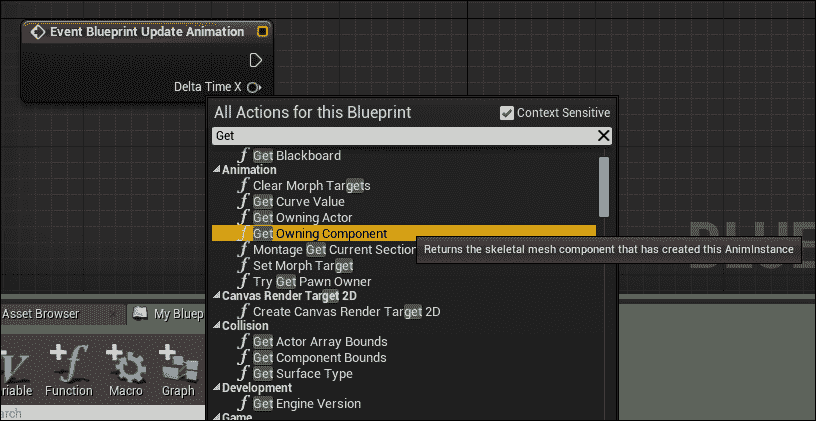

同样地，在编辑器中右键点击并输入`IsValid`以查找节点。此截图显示了获取**IsValid**节点的地方：

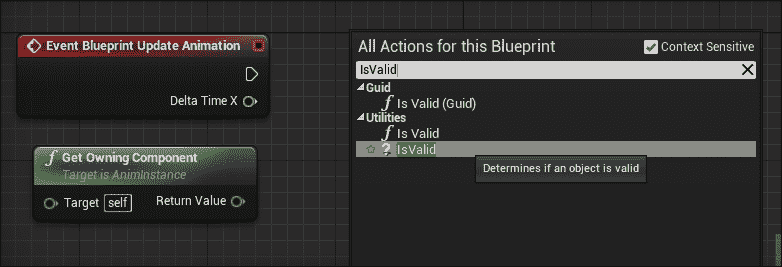

现在，将**Event Blueprint Update Animation**的三角形输出链接到**IsValid**节点的**Exec**输入（这也是一个三角形输入）。将**Get Owning Component**的**Return Value**输出（旁边有一个蓝色圆圈）链接到**IsValid**节点的**Input Object**（旁边也有一个蓝色圆圈）。以下截图显示了三个节点的连接。

解释是这样的，在每一个 tick 时，我们需要检查目标骨骼网格是否有效。

目前，如果目标骨骼网格有效，我们只需将 NPC 的速度设置为 100。因此，在事件图区域右键单击，并输入`SetSpeed`以过滤选项。点击并选择**设置速度**，如图所示：

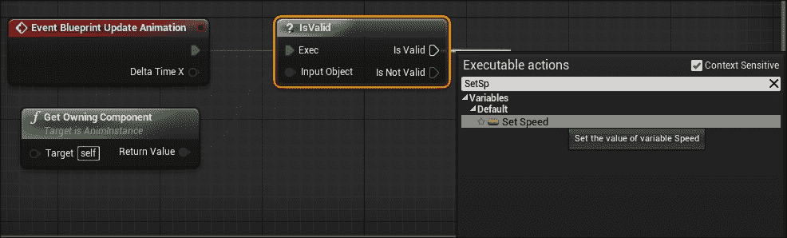

将**IsValid**节点的**Is Valid**输出链接到**SET Speed**节点的输入（这有一个三角形符号）。然后，点击**速度**旁边的框，并输入`100`以设置速度：

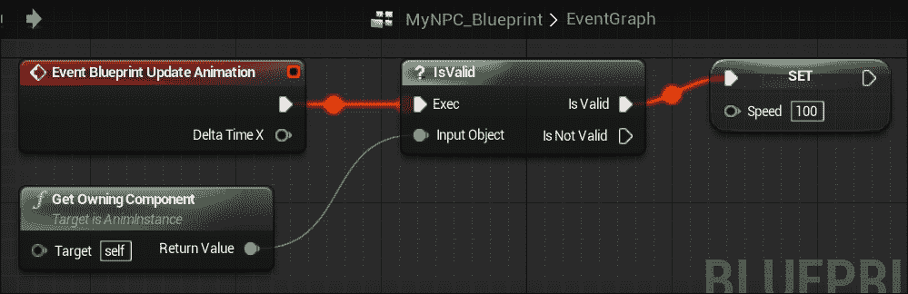

保存并重新编译现在，以查看预览模型如何变化。以下截图显示了当速度设置为 100 时，模型正在播放行走动画：

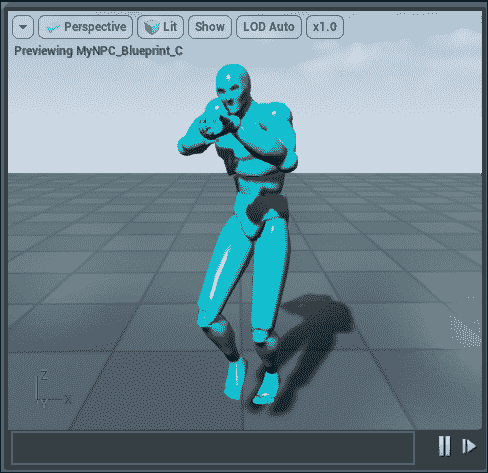

现在，动画蓝图已经准备好在游戏关卡中使用。我们需要将这个动画蓝图分配给游戏中的一个角色。保存并关闭动画蓝图编辑器以返回主编辑器。

要将蓝图分配给骨骼网格，我们将点击现有的**HeroTPP**以显示详细信息面板。关注面板的动画部分；以下截图显示了当没有动画序列链接到骨骼网格且不使用动画蓝图时的原始设置。将**动画模式**设置为**使用动画资产**，将**Anim to Play**设置为**无**：

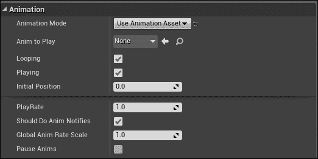

要使用**MyNPC_Blueprint**为此骨骼网格，将**动画模式**设置为**使用动画蓝图**。选择**MyNPC_Blueprint**作为**Anim Blueprint Generated Class**：

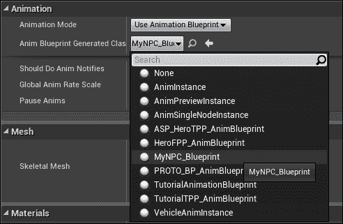

现在，编译并运行游戏；你会看到 NPC 以 100 的速度在同一地点行走。

# 人工智能

AI 是一个决策过程，它将 NPC 添加到游戏中。AI 是 NPC 的可编程决策过程，用于控制他们在游戏中的响应和行为。一个不由人类玩家控制的游戏角色没有智能形式，当这些角色需要更高形式的决策过程时，我们将其应用于它们。

多年来，游戏中的 AI 取得了巨大的进步，NPC 可以被编程以以某种方式行为，有时，带有某种形式的随机性，使其几乎不可预测，这样玩家就没有简单的、直接的策略来赢得关卡。

决策过程，也是 NPC 的逻辑，存储在称为行为树的数据结构中。我们将首先学习如何设计一个简单的行为树，然后学习如何在虚幻引擎 4 中实现它。

## 理解行为树

学习如何设计一个好的决策树非常重要。这是程序员或脚本编写者依赖的基础，以创建游戏中的角色行为。行为树是建筑师为设计你的房子而设计的建筑蓝图。

行为树有根节点，这些根节点分支成多个子节点层，这些子节点从左到右排序（这意味着在遍历子节点时，你总是从最左边的节点开始）。这些节点描述了决策过程。构成行为树的节点主要分为三类：组合节点、装饰器节点或叶节点。一旦你熟悉了这三类中每种常见节点类型，你就可以准备创建自己的复杂行为：

|   | 组合节点 | 装饰器节点 | 叶节点 |
| --- | --- | --- | --- |
| **子节点** | 可能有一个或多个子节点。 | 这只能有一个子节点。 | 这根本不能有任何子节点。 |
| **功能** | 根据特定类型的组合节点处理子节点。 | 根据特定类型的装饰器，这可能转换来自子节点的状态结果、终止子节点或重复子节点的处理。 | 执行特定的游戏动作/任务或测试。 |
| **节点示例** | **序列**节点按顺序处理从最左边的子节点开始的子节点，收集每个子节点的结果，并将整体成功或失败结果传递给父节点（注意，即使只有一个子节点失败而其余子节点成功，整体结果也是失败）。这可以被视为一个**AND**节点。 | **反转器**节点将成功转换为失败，并将这个反转的结果传递回父节点。它也可以相反工作。 | **射击一次叶节点**显示 NPC 将射击一次，并返回成功或失败，具体取决于结果。 |

## 练习 - 设计行为树的逻辑

这是对如何构建行为树的一个简单概述。以下图例将帮助您识别行为树的不同组件：

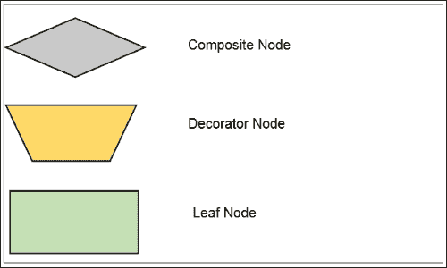

## 示例 - 创建一个简单的行为树

下图显示了一个敌人 NPC 的简单响应。敌人只有在战争开始时才会开始攻击。

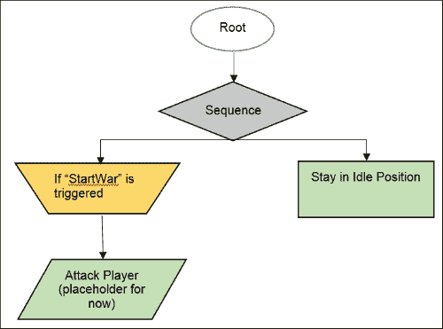

下图在先前的行为树基础上进行了扩展。它更详细地描述了敌人 NPC 应该如何接近目标。NPC 将朝向目标（在这个例子中是玩家角色）奔跑，如果足够接近，它就开始射击玩家。

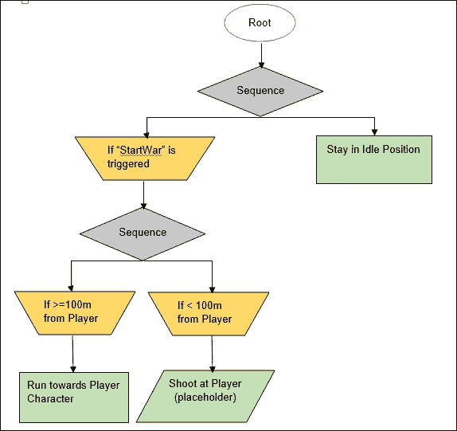

接下来，我们设置更多行为来展示 NPC 将如何射击玩家。我们给敌人 NPC 一点智慧：如果有人射击它就隐藏，如果没有人射击它就开始射击；如果玩家开始朝它移动，NPC 就开始向后移动到一个更好的位置，或者进行死亡比赛（在近距离射击玩家）。

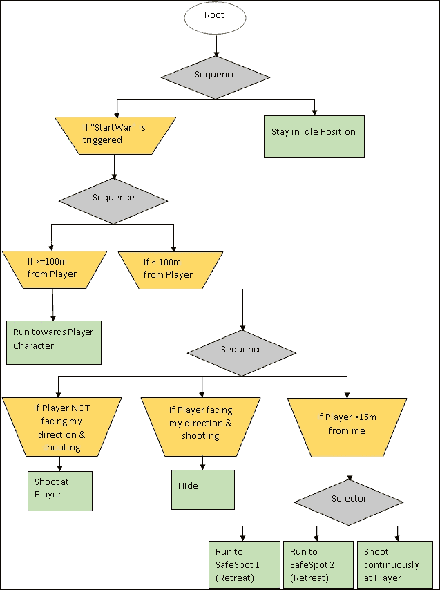

## 如何在虚幻引擎 4 中实现行为树

Unreal 编辑器允许使用视觉脚本蓝图以及几个 AI 组件来设计复杂的行为树。

在 Unreal Engine 4 中，也有一个选项，可以以传统方式或与蓝图视觉脚本结合的方式编程非常复杂的 AI 行为。

UE4 中的 BT 节点大致分为五类。为了回顾，我们在上一节中已经对前四个有所了解；**服务节点**是这里唯一的新类别：

+   **根节点**：行为树的起始节点，每个行为树只有一个根节点。

+   **复合节点**：这些节点定义了分支的根以及如何执行此分支的基本规则。

+   **装饰器**：这也被称为**条件**。它们附着到另一个节点上，并决定树中的分支，甚至单个节点是否可以执行。

+   **任务节点**：这也可以称为典型的 BT 中的叶节点。这些是树的叶子，即执行“操作”的节点。

+   **服务节点**：这些是复合节点的附件。只要它们的分支正在执行，就会以定义的频率执行。这些通常用于进行检查和更新**黑板**。它们取代了其他行为树系统中传统的并行节点。

## 导航网格

为了让 AI 角色在游戏关卡中移动，我们需要特别告诉 AI 角色地图中哪些区域是可访问的。

Unreal Engine 实现了名为**导航网格**的类似网格的组件。导航网格基本上就像一个体积块；你可以调整网格的大小以覆盖游戏关卡中 AI 角色可以移动的特定区域。这限制了 AI 可以移动的区域，并使角色的移动更加可预测。

### 教程 – 创建导航网格

前往**模式** | **体积**。将**导航网格边界体积**拖放到你的游戏关卡中。以下截图显示了在编辑器中可以找到**导航网格边界体积**的位置：

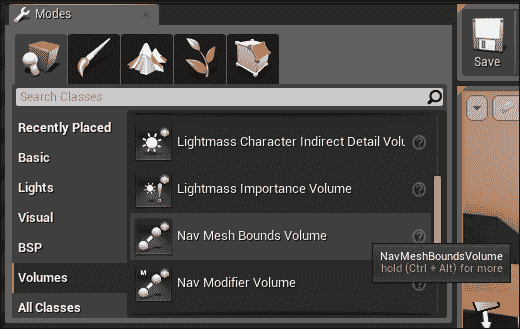

如果你无法在你的地图中看到**导航网格边界体积**，请转到编辑器中的**显示**设置，如下截图所示。确保**导航**旁边的复选框被勾选：

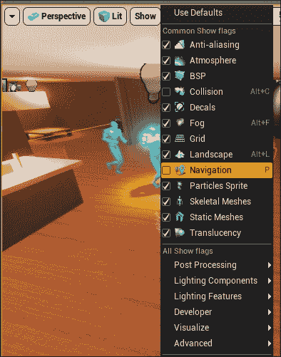

调整导航网格的大小和位置，使其覆盖你希望 AI 角色能够访问的地面区域。以下截图显示的是我将网格调整到适合我 AI 角色行走的地面区域。将网格向上和向下移动，使其略微高于实际的地面网格。导航网格应该大致包围地面网格。此截图显示了网格可见时的样子：

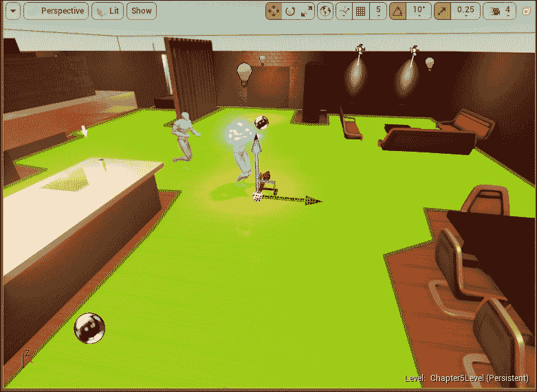

## 教程 – 设置 AI 逻辑

下面是本教程中我们将创建的组件概述：

+   蓝图 AIController（**MyNPC_AIController**）

+   蓝图角色（**MyNPC_Character**）

+   黑板（**MyNPC_Brain**）

+   行为树（**MyNPC_BT**）

+   蓝图行为树任务（**Task_PickTargetLocation**）

本教程的重要收获是学习组件如何相互连接以协同工作以创建逻辑；我们利用这种逻辑来控制 NPC 的行为。

在**内容浏览器**中针对这些不同文件类型的文件结构，您可以将不同的组件分组到不同的文件夹中。对于这个例子，因为我们只创建一个具有逻辑的 NPC 角色，所以我会将这些组件全部放入一个文件夹中以便简化。为此，我在主目录下创建了`MyFolder`。

我们从 AIController 和 Character 开始创建 NPC 的 AI 逻辑。角色蓝图是包含网格链接的对象，我们将在进行一些初始配置后将其拖放到关卡地图中。AIController 是赋予 NPC 角色逻辑的组件。

我们将在后续讨论其他三个组件。

### 创建蓝图 AIController

转到**创建** | **蓝图**。在文本框中输入`AIController`以按类过滤，如图所示。选择**AIController**作为父类。

将此 AIController 蓝图重命名为`MyNPC_AIController`：

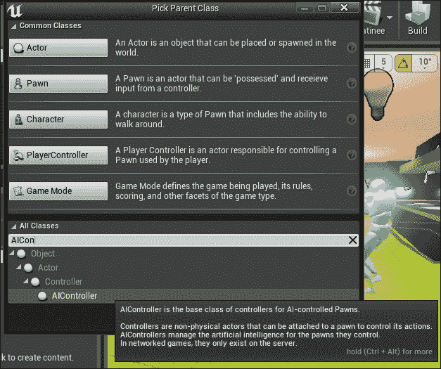

我们稍后会回来配置这个。

### 创建蓝图角色

转到**创建** | **蓝图**，并在文本框中输入`Character`以按类过滤。选择蓝图中的**Character**作为父类，如图所示。将此蓝图重命名为`MyNPC_Character`。

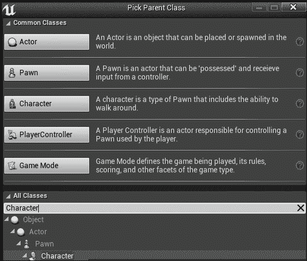

### 将网格添加到角色蓝图并配置

双击**MyNPC_Character**在**内容浏览器**中打开角色蓝图编辑器。转到**组件**选项卡。

在**视角**空间视图中，您将看到一个空白的线框-胶囊形状的对象，如图所示。在蓝图编辑器的**细节**面板中，滚动到**网格**部分，我们将通过选择现有的网格来向此蓝图添加网格。您可以转到**内容浏览器**，选择**HeroTPP**，然后点击其旁边的箭头。或者，您也可以点击框旁边的搜索按钮并找到**HeroTPP**：

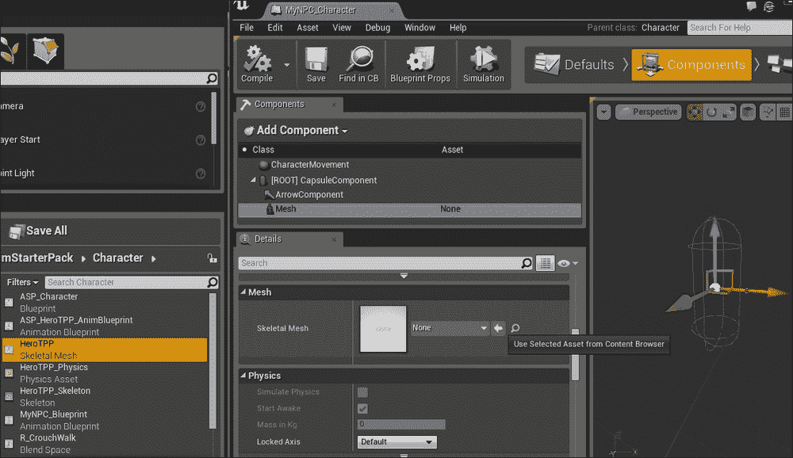

在选择 **HeroTPP** 作为骨骼网格后，您将看到网格出现在线框胶囊中。请注意，**HeroTPP** 骨骼网格比胶囊线框大得多，如以下截图所示。我们希望能够调整线框的大小，使其尽可能紧密地包围骨骼网格的高度和宽度。这将定义角色的碰撞体积。

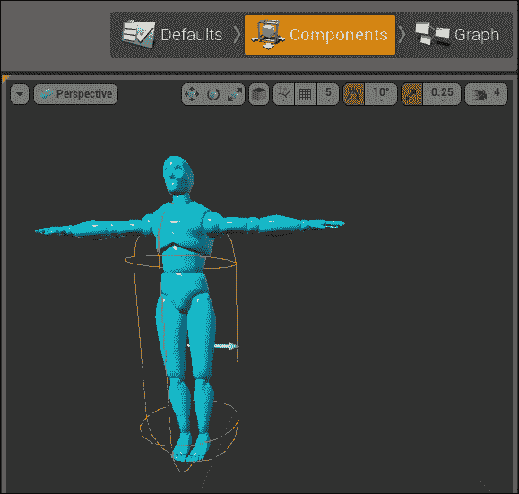

此图显示了当骨骼网格的线框高度正确时的情况：

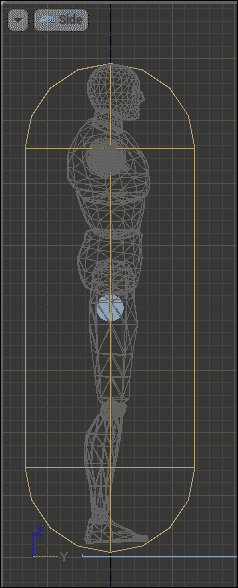

### 将 AIController 链接到角色蓝图

前往 **MyNPC_Character** 的 **默认** 选项卡，滚动到 AI 部分，并单击滚动框以显示可用于 AIController 的选项。选择 **MyNPC_AIController** 以将角色分配给使用此 AIController，如截图所示。编译、保存并暂时关闭 **MyNPC_Character**。

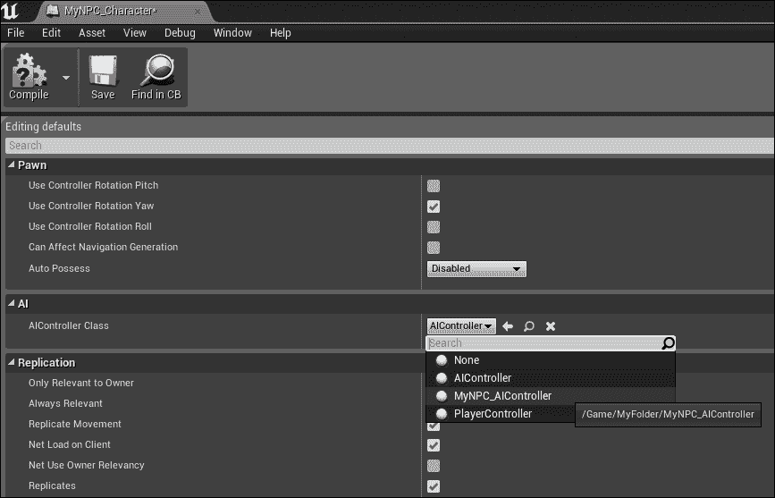

前往 **内容浏览器**，将 **MyNPC_Character** 拖放到关卡地图中。编译并播放关卡。您将看到角色出现在关卡中，但它处于静态状态。

### 添加基本动画

与早期将动画分配给网格的实现类似，我们将为 **MyNPC_Character** 添加动画。双击 **MyNPC_Character** 以打开编辑器。转到 **默认** 选项卡，滚动到 **动画** 部分，并分配我们之前为该角色蓝图创建的动画蓝图（**MyNPC_Blueprint**）。以下截图显示了我们可以如何将动画分配给角色。编译并保存 **MyNPC_Character**：

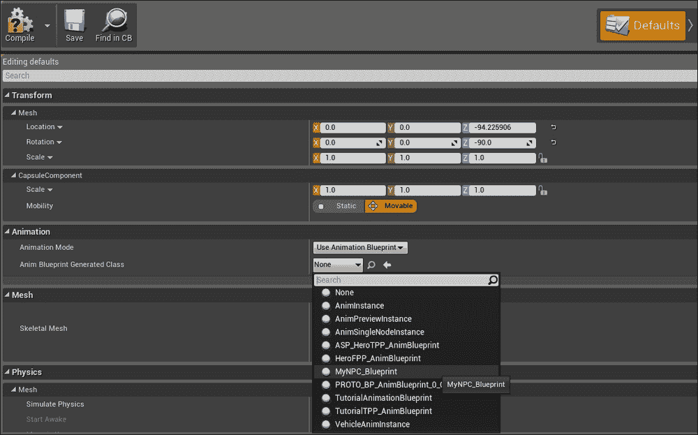

现在，再次播放关卡，您将看到角色现在原地踏步（因为我们已在动画蓝图 **MyNPC_Blueprint** 中将速度设置为 100）。

### 配置 AIController

前往 **内容浏览器**。然后，转到 **MyFolder** 并双击 **MyNPC_AIController** 以打开编辑器。我们现在将在 EventGraph 中添加节点以设计逻辑。

我们的首要任务是让角色向前移动（而不仅仅是原地踏步）。

#### 在 EventGraph 中添加的节点

以下是在 EventGraph 中需要添加的节点：

+   **事件刻度**：这用于在每次刻度时触发循环

+   **获取受控单位**：这返回 AIController 的单位（这将将是 **HeroTPP** 的单位）

+   **获取演员前向向量**：这获取前向向量

+   **添加移动输入**：这将目标链接到 **获取受控单位**，并将 **链接世界方向** 链接到 **获取演员前向向量** 的输出

+   **IsValid**：这是为了确保在实际上更改单位值之前单位首先存在

以下截图显示了我们要创建的最终 EventGraph：

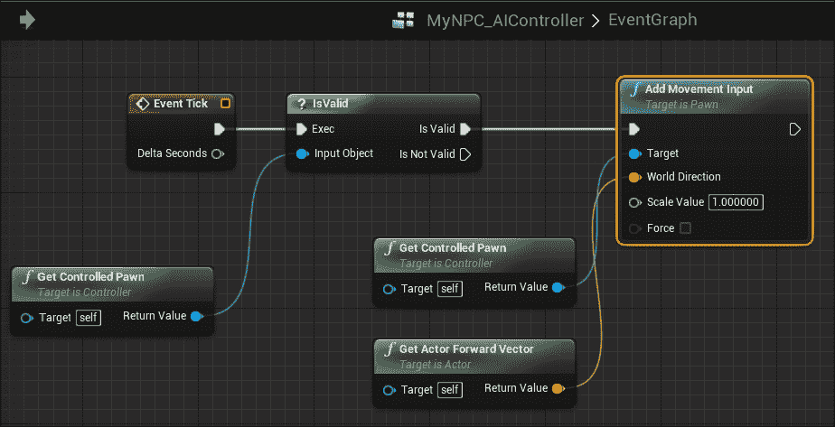

现在，再次播放关卡，您将看到角色现在正在向前走。但它走得有点太快。我们想要调整角色移动的最大速度。

### 调整移动速度

双击**MyNPC_Character**以打开编辑器。转到**默认**选项卡，滚动到**角色移动**部分，并将**最大行走速度**设置为**100**，如图所示：

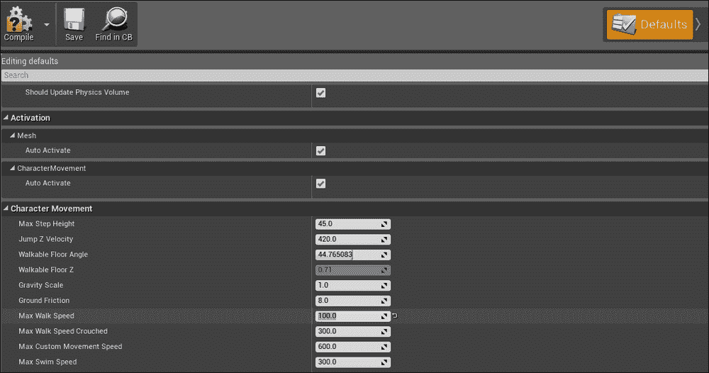

### 创建 BlackBoardData

BlackBoardData 充当 NPC 大脑的内存单元。这是您存储和检索用于控制 NPC 行为的数据的地方。转到**内容浏览器**，导航到**创建** | **杂项** | **黑板**。将其重命名为`MyNPC_Brain`。

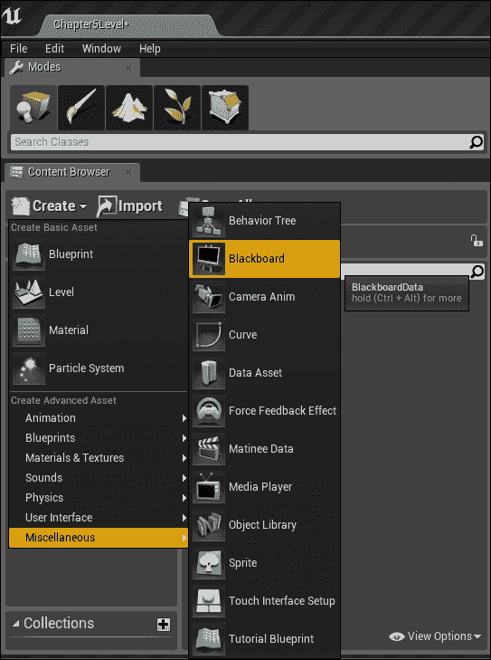

#### 将变量添加到 BlackBoardData 中

双击**MyNPC_Brain**以打开 BlackBoardData 编辑器。单击**新建键**，选择**键类型**为**向量**，并将其命名为`TargetLocation`。此截图显示**TargetLocation**已正确创建。保存并关闭编辑器。

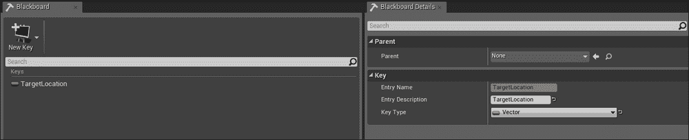

### 创建行为树

行为树是 NPC 通过它来确定采取何种行动的逻辑路径。

要在虚幻引擎中创建行为树，请转到**内容浏览器** | **创建** | **杂项**，然后单击**行为树**。将其重命名为`MyNPC_BT`。

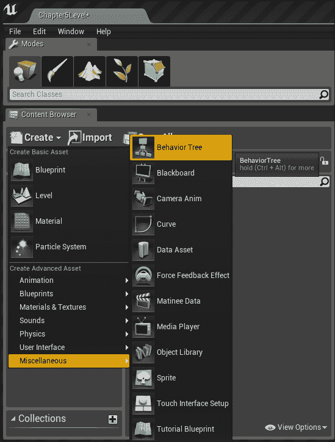

双击**MyNPC_BT**以打开行为树编辑器。以下截图显示了我们对**MyNPC_BT**想要的设置。它应该将**MyNPC_Brain**设置为黑板资产。如果没有，搜索**MyNPC_Brain**并将其分配为黑板资产。

如果您已经完成了前面的练习并且熟悉行为树，您会注意到在这个编辑器中有一个**根**节点，您可以使用它来开始构建 NPC 的行为。

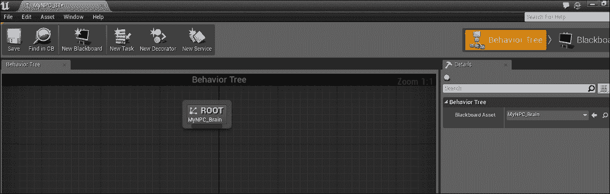

### 使用等待任务创建简单的 BT

此处的下一步是添加一个组合节点（可以是**序列**、**选择器**或**简单并行**）。在这个例子中，我们将选择并使用**序列**节点来扩展这里的行为树。您可以点击并拖动从**根**节点以打开上下文菜单，如图所示。或者，只需右键单击打开菜单并选择您想要创建的节点。

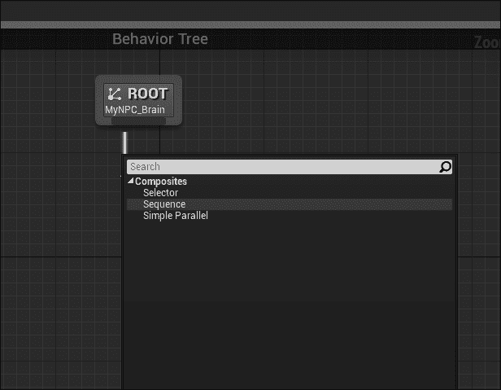

我们将从**序列**节点添加一个**等待**任务。点击并拖动以从**序列**节点创建一个新的连接。从上下文菜单中选择**等待**。将**等待**设置为**15.0s**，如图所示。保存并编译**MyNPC_BT**。

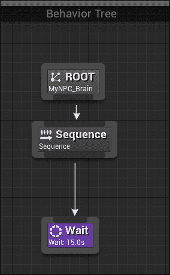

编译后，在行为树编辑器中点击**播放**。你会看到光线通过链接移动，特别是从**序列**节点到等待 15 秒的**等待**任务。

### 使用行为树

现在我们已经有一个简单的行为树实现，我们想让我们的 NPC 角色开始使用它。我们该如何做？前往**内容浏览器** | **我的文件夹**，双击**MyNPC_AIController**以打开编辑器。前往我们最初创建简单向前移动实现的**事件图**选项卡。断开**IsValid**节点和**添加移动输入**之间的初始链接。根据以下截图重新布线，将**IsValid**节点链接到一个新的**运行**行为树节点。在**运行**行为树节点中，将**BTAsset**分配给**MyNPC_BT**。接下来，将**事件计时器**替换为**事件开始播放**（因为 BT 现在将替换这里的思考功能）。保存并编译。

### 为行为树创建自定义任务

我们现在想让 NPC 在地图上选择一个位置并朝它走去。

这需要创建一个自定义任务，其中 NPC 必须选择一个目标位置。我们已经在 BlackBoardData 中创建了一个条目来存储矢量值。然而，我们还没有创建一种方法来分配数据值。这将通过创建一个自定义行为树任务来完成。

前往**内容浏览器** | **创建** | **蓝图**。对于父类，搜索**BTNode**并选择**BTTask_BlueprintBase**，如图所示。将此任务重命名为`Task_PickTargetLocation`。

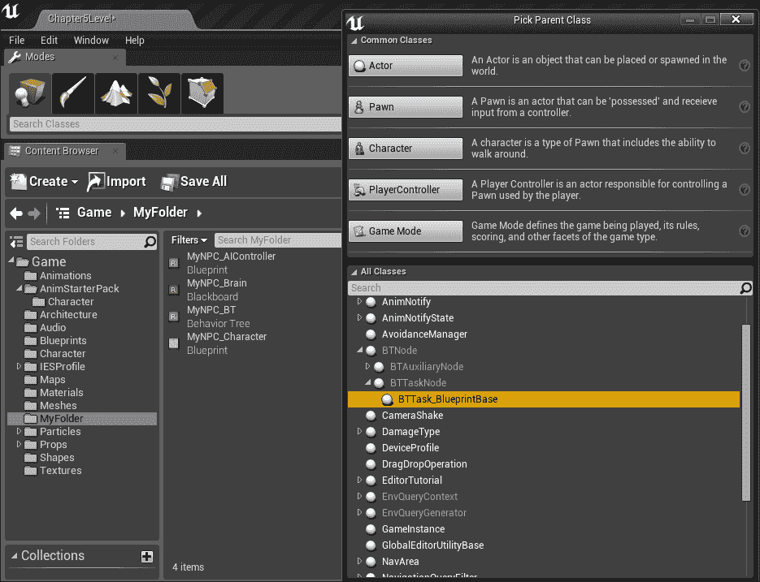

双击新创建的**Task_PickTargetLocation**。前往**事件图**，创建以下节点，并将这些节点链接起来：

+   **事件接收执行**：将**拥有者演员**链接到**获取演员位置**的目标。当**PickTargetLocation**执行时，**事件接收执行**开始。

+   **获取演员位置**：将**返回值**链接到**半径**节点中的**获取随机点**的**原点**。

+   **设置黑板值为矢量**：将**事件接收执行**链接到**设置黑板值为矢量**的执行箭头。

+   **在半径内获取随机点**：将**返回值**链接到**设置黑板值为矢量**的**值**输入。

+   **执行完成**：将**设置黑板值为矢量**链接到**执行完成**的输入。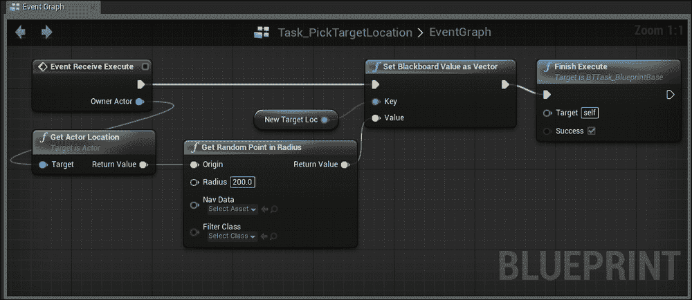

注意到有一个**新目标位置**变量链接到**设置黑板值为矢量**的**键**。我们需要为这个创建一个新的变量。点击**+变量**，如图所示，以创建一个新的变量。将新变量命名为`New Target Loc`。

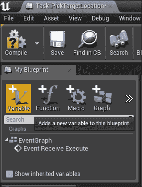

点击新创建的 **New Target Loc** 以显示变量的详细信息。选择 **BlackBoardKeySelector** 作为变量类型，如图所示：

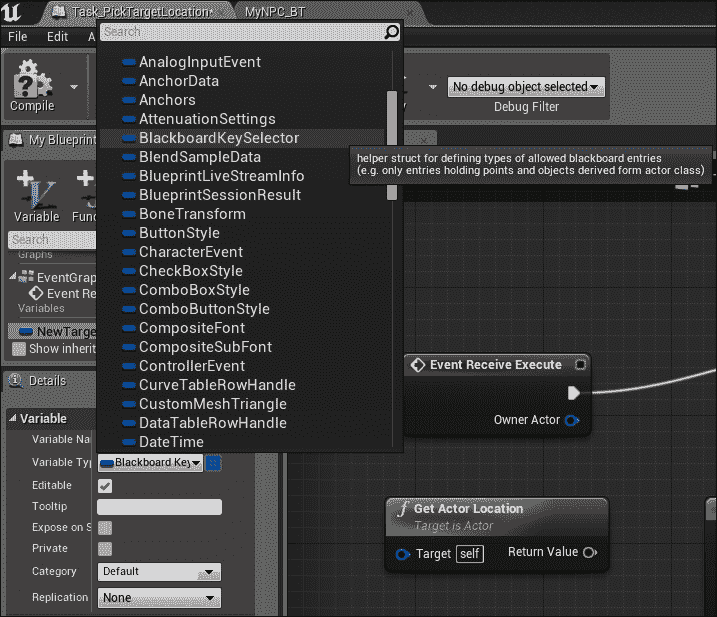

保存并编译自定义任务。

### 在 BT 中使用 PickTargetLocation 自定义任务

从当前的 **Sequence** 组合节点添加一个新的链接。将 **Task_PickTargetLocation** 节点放置在 **Sequence** 节点的左侧，以便它首先执行，如图所示。确保将 **New Target Loc** 设置为 **TargetLocation**：

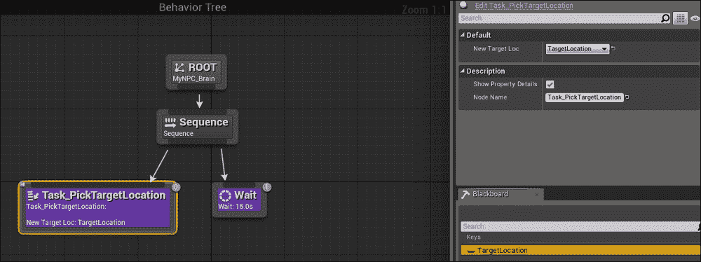

### 用 Move To 替换 Wait 任务

删除 **Wait** 节点，并在其位置添加 **Move To** 节点。确保将 **Move To** 的 **Blackboard Key** 设置为 **TargetLocation**，如图所示：

编译后，点击 **Play** 运行游戏。双击 **MyNPC_BT** 打开行为树编辑器。你会看到光线穿过链接，以及黑板上 **TargetLocation** 值的变化，如图所示：

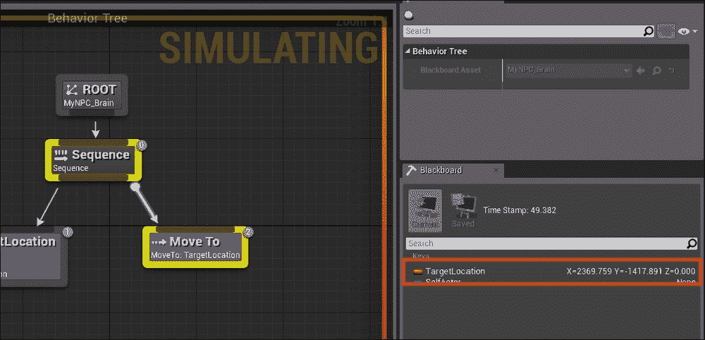

记得回到地图级别，看看 NPC 现在的行为。NPC 现在会选择一个目标位置，然后移动到目标位置。然后，它会选择一个新的目标位置并移动到另一个地方。

通过这个示例，你已经详细了解了如何设置 AI 行为以及让 AI 在你的关卡中工作。挑战自己，利用本节中获得的知识创建更复杂的行为。

## 游戏中的 AI 实现

我相信你已经注意到，我们确实需要创建更复杂的行为来使游戏更有趣。在实现方面，通常通过编程和利用编辑器功能结合使用，可以更容易地实现更复杂的 AI，并将这一过程进一步推进。因此，了解如何通过编辑器触发 AI 以及如何为你的游戏自定义 AI 非常重要。

# 摘要

本章涵盖了动画和人工智能，这两个主题在游戏开发中都是非常重要的，肯定还有更多关于它们的内容可以学习。我希望通过本章，你现在对这些两个主题有了深入的理解，并将你的技能用于进一步探索 Unreal 编辑器中的更多功能，以创建更酷的内容。

我们简要了解了动画的历史，以及今天如何通过各种 3D 建模软件在 3D 计算机游戏中创建动画，最后是如何将此动画导入 Unreal Engine 以在游戏中使用。动画序列是动画在 Unreal 中存储/播放的格式，你已经了解了一种简单的混合技术来组合不同的动画序列。

个人而言，我非常喜欢人工智能对游戏做出的贡献。在本章中，你学习了构成人工智能逻辑的不同组件。主要的人工智能逻辑是通过行为树来执行的，我们也学习了如何从逻辑角度构建行为树，以及如何通过使用黑板数据、任务、组合和其他节点将这些逻辑复制到虚幻引擎编辑器中。

本章的结尾，我们已经涵盖了创建游戏所需的大部分内容。在下一章中，你将学习如何将声音和粒子效果添加到游戏中。
