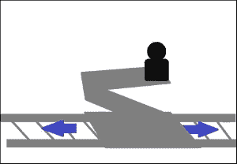
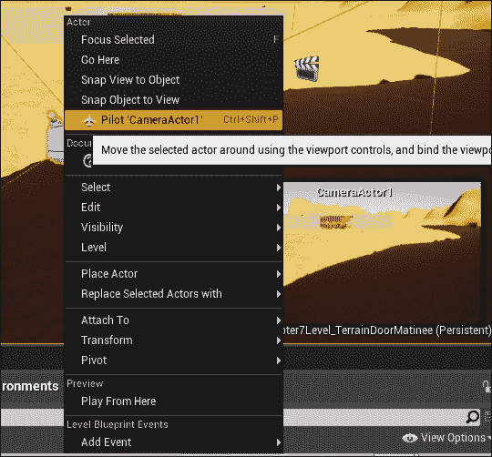

# 第七章. 地形和电影

在本章中，我们将介绍一些增强级别的功能。我们将为我们的级别创建一些户外地形，并在游戏级别的开始处添加一个简短的电影序列。

在本章中，我们将探讨以下主题：

+   创建户外地形

+   在同一级别的开始处添加一个电影序列的快捷方式

# 介绍地形操作

当你想创建大型自然景观区域时，例如覆盖有植被的山地或山谷区域，就需要进行地形操作。这可能包括树木/草地、被岩石或雪覆盖的湖泊和河流等。Unreal Engine 4 中的景观工具允许你轻松地为游戏地图设计各种地形，同时允许游戏以合理的帧率运行。

当在具有大型户外地形的地图上游戏时，例如，拥有大量树木或许多海拔的地图，如山脉，由于需要在屏幕上渲染的多边形数量增加，预期的有效帧率可能会降低。因此，熟练掌握景观设计，以保持多边形数量在可控范围内，对于确保地图实际上可玩非常重要。同时，也要记住使用优化技术，如 LOD 和雾效来掩盖远处的地方，这可以给你一种无尽开阔地的感觉。如果你计划创建一个开放世界，你也可以使用 Procedural Foliage 工具（在 Unreal 4.8 及以上版本中可用）为你生成这些特征。

让我们熟悉 Unreal Landscaping 工具，并开始为我们的游戏级别创建一些户外环境。我们将学习如何使用低矮的山丘、草地和树木对户外空间进行简单的等高线绘制。然后，我们将在该区域创建一个小池塘。为了更精确的景观设计，我们可以导入高度图来帮助我们创建景观。

## 练习 - 使用景观工具创建山丘

让我们执行以下步骤，使用景观工具创建山丘：

1.  打开`Chapter6.umap`并将其保存为`Chapter7_Terrain.umap`。

1.  转到**模式**，点击景观工具（图标看起来像一座山），然后点击**管理**。

1.  选择**创建新**（这里的另一个选项是使用高度图，我们将在本章后面介绍）。

1.  要选择材质，您可以点击搜索图标并输入`M_Ground_Grass`，或者转到**内容浏览器** | **内容** | **材质**，选择**M_Ground_Grass**，然后点击**景观材质**旁边的箭头以分配材质。

1.  对于这个例子，我们将保留所有景观设置在其默认值，如下所示。下一节将更详细地解释其余值的选项：

    +   **比例**：X = 100 Y = 100 Z = 100

    +   **区域大小**：63 x 63 四边形

    +   **组件大小**：1 x 1 区域

    +   **组件数量**：8 x 8

    +   **整体分辨率**：505 x 505

以下截图显示了我们所创建的草地景观的俯视图。注意 64 个绿色方块。您需要切换到**顶视图**才能查看它。

现在，我们将切换到**视角**视图。草地景观看起来像覆盖了房子的半边。请看下面的截图：

注意，如果我们是在一个空地图上创建景观，我们就不会遇到这个问题，因为我们会在景观草地上建造房子。所以，在这里我们需要执行一个额外的步骤，将景观草地移动到房子下面，这样我们就不会有一个被草地淹没的房子。您需要从**世界大纲**中选择**景观**和**景观 GizmoActiveActor**，如图以下截图的右侧所示。记得将**模式**切换回**放置**，而不是我们用来创建草地的**景观**模式。**放置**模式允许选择对象的平移/旋转。将草地移动到房子下方，如图以下截图所示：

### 注意

注意，这一步骤是因为我们在建造房子之后添加了景观草地。

现在，我们准备好将这块平坦的土地雕刻成地形。再次转到**模式** | **景观** | **雕刻**。使用雕刻工具、**圆形画笔**和**平滑衰减**的组合，如图即将出现的截图所示。默认设置应如下：

+   **画笔大小**：**2048**

+   **画笔衰减**：**0.5**

+   **工具强度**：**0.3**

为了说明 2048 画笔的大小，我切换到了**顶视图**：

当**画笔大小**设置为**1000**时，画笔半径会减小，如图以下截图所示：

现在我们对半径的差异有了概念，我们将切换回**视角**视图。将您的操作屏幕调整到略微倾斜的顶视角视图，如图以下截图所示。将**画笔大小**设置为**1000**，**工具强度**设置为**0.4**：

首先，通过点击房子周围的区域来创建房子周围的低山丘。我使用了 1000 和 2048 画笔大小的混合。

以下截图显示了我在稍作处理后该区域的外观。注意，我在宽窗户前方创建了一个凹陷区域。这是通过按住*Ctrl*然后点击该区域实现的。这个凹陷将以餐厅前湖的形式出现。

创建两个盒子 BSP 来填充低洼区域。将湖面材质应用到盒子 BSP 上。以下截图显示了放置盒子 BSP 后的相同区域。使用平移工具确保两个 BSP 区域在低洼位置处于同一地面水平。

接下来，我润色了房屋的外部区域。使用**不发光**模式帮助你更好地看到房屋。以下截图显示了使用**MyGreyWall**材质润色后的房屋及其周围区域的外观：

返回**光照**模式，构建关卡，然后查看。调整地图中的任何光照，使其得到适当的照明。重建直到你对结果满意。

添加树木和植物，使该区域更加逼真。我已经从市场下载了一个包含一些叶子的包，以帮助我完成这项工作。

前往虚幻启动页面上的市场。在**环境**下，寻找名为**开放世界演示集合**的免费可下载内容。以下截图显示了市场中的免费**开放世界演示集合**。下载包后，将其添加到你正在工作的项目中。

现在我们已经为地图创建了一个基本的户外地形。

## 景观创建选项

在完成前面的练习后，你现在对虚幻引擎 4 中的景观设计的基本功能有了很好的了解。在本节中，我们将补充我们迄今为止获得的技能，并学习如何调整或利用我们可用的景观工具的功能/功能。

### 多个景观

在同一地图中可以有多个景观。这允许你将创建过程分成不同的层。如果你在地图中有多个景观，在修改之前你需要选择一个层。

### 使用自定义材质

你可以导入任何你想要用于景观的材质；你可以制作自己的草地、农作物、沙子纹理等。由于自定义材质主要用于地图的大面积，因此请记住你需要保持材质可重复使用和优化。

### 导入高度图和图层

为什么我们在景观设计中使用高度图？这些允许在虚幻编辑器中以更快、更精确的方式创建高程/凹槽。例如，我们可以使用高度图来存储高度为 3000 米、直径一定的山脉的高程信息。当我们导入高度图时，地形会自动根据它进行塑造。这绝对是一种节省时间的方法，帮助我们创建更精确的景观特征，而无需点击、点击、点击来雕刻。

高度图和层最初可以由艺术家使用常见的工具在外部创建，例如 Photoshop、World Machine、ZBrush 和 Mudbox。需要遵循详细说明以确保成功导入高度图。这可以在 Unreal Engine 4 文档中找到：[`docs.unrealengine.com/latest/INT/Engine/Landscape/Custom/index.html`](https://docs.unrealengine.com/latest/INT/Engine/Landscape/Custom/index.html)。

### 缩放

**缩放**设置确定景观的缩放。我们使用了 X: 100 和 Y: 100 来给出这个景观将覆盖的土地面积。Z 值保持为 100，以提供一些高度来创建地形高差。

### 组件的数量

组件是渲染和剔除的基本单元。与组件的总数相关联有一个固定成本；因此，它被限制在 32 x 32。超过这个值会影响您游戏级别的性能。

### 部分大小

**部分大小**确定每个部分的大小。它决定了景观如何划分。较大的部分意味着整体组件更少，因为饼被分成更大的块。管理块更少意味着整体 CPU 成本更低。

然而，与较小的部分相比，较大的部分在管理 LOD 方面并不那么有效。当有较小的部分时，我们也会得到较小的组件大小（当饼的大小相同时，将其切割成更小的块意味着如果你拿一块，你的负担会更轻）。由于组件是用于剔除和渲染的基本单元，这意味着对 LOD 变化的响应会更快，因为面积减少了。LOD 确定需要计算的顶点数量。如果 LOD 更有效，我们就有更少的计算要做，并且通过较小的部分，CPU 成本更加优化。

这里的关键是平衡部分的大小，以避免有太多的组件需要处理，而组件过少可能会导致 LOD 管理不佳。

### 注意

**每个组件的部分**

您可以选择每个组件的 1 x 1 或 2 x 2 部分。这意味着您在每个组件中可以选择有一个或四个部分。由于组件是渲染和剔除的最基本单元，对于 1 x 1 部分，您可以同时渲染一个部分。对于每个组件的 2 x 2 部分，您可以同时渲染四个部分。为了限制渲染组件所需的计算数量，每个部分的大小不应太大。

# 引入电影

**电影**、电影和电影的发展很大程度上是为了电影。今天，我们应用电影技术到非交互式的游戏序列，称为**过场动画**，以增强游戏体验。整体游戏体验必须考虑到**过场动画**，因为它们通常满足某些游戏设计目标。这些目标通常在游戏玩法之间安排，以丰富游戏中的叙事体验。

非常类似于拍摄电影，我们需要决定需要拍摄什么样的镜头，从哪个角度拍摄，需要多少缩放，需要使用多少个摄像机，以及摄像机需要采取的路径，以便发展出我们关注对象/对象的运动画面序列。用于创建此剪辑的技术被称为**电影技术**。

因此，在本章中，我们将首先探讨几个关键目标，解释为什么游戏需要电影，并学习一些简单的电影技术，我们可以使用。你还将了解虚幻引擎 4 提供的工具，以便应用我们学到的技术，为你的游戏创建适当的电影序列。

**电影技术**是由专注于为你的游戏创建**过场动画**的电影专家创造的。或者，你也可以聘请一个电影制作承包公司来为你专业地完成这项工作。

# 为什么我们需要**过场动画**？

当设计游戏时，相当一部分游戏设计时间被用于设计玩家如何与游戏中的对象互动，以及如何使这种互动变得有趣。游戏中的互动部分需要补充，而**过场动画**可以帮助填补这些空白。

在游戏中，可以使用**过场动画**来帮助设计师在玩家玩游戏时讲述故事。这种技巧可以在游戏开始之前使用，以吸引玩家进入任务本身，并解释为什么任务对玩家来说必须完成。这有助于玩家理解剧情，为他们的行为赋予意义，并将玩家吸引到游戏中。

**过场动画**的另一个目标可能是突出游戏中的关键区域，以便让玩家一瞥可以期待的内容，并给出成功赢得游戏的微妙提示。这些信息在难以击败的游戏关卡或玩家遇到游戏中的主要怪物时尤其有用。

游戏设计师有时也会使用**过场动画**在一场艰难的战斗后奖励玩家。它们放大了成功的效应，并演绎他们胜利的欢乐结局，以在玩家中创造积极的情绪。我相信，在游戏中利用**过场动画**的方法是无穷无尽的，并且我们可以以积极的方式将它们融入以增强游戏体验。

然而，确保使用剪辑场景是合理的是很必要的，因为剪辑场景实际上将游戏的控制权从玩家手中夺走。游戏应该是互动的，我们不希望当有太多剪辑场景时，将其转化为被动的多媒体体验。

在记住这些基本游戏设计目标的同时，现在让我们探讨一些技术电影基础，这将为你提供设计自己游戏电影的基础。

# 电影技巧

相机是用于创建电影效果的主要工具。通过调整相机功能并找到/移动相机到一个好的位置来捕捉感兴趣的关键对象，您可以实现各种电影效果。本节将提供一些技术术语，您可以用这些术语向您的同事/承包商描述如何录制特定的电影序列。

## 调整相机功能

这里有一些常用的功能，您可以在相机上调整以捕捉场景。

### 放大

对物体进行放大可以让你更接近地观察物体；提供更多关于它的细节。缩小视图将你的视角从物体移开；它提供了物体与其周围环境的关系视角。

放大是通过调整相机镜头的焦距来实现的；相机本身保持在同一位置。

### 视场

**视场**（**FOV**）是从空间中的特定位置和方向可见的区域。相机的视场取决于镜头，可以表示为 *FOV = 2 arctan(SensorSize/2f)，* 其中 *f* 是焦距。

对于人类来说，视场是我们无需移动头部就能看到的空间区域。水平视场在眼睛的外角处结束，如下面的图像所示，左右两侧大约是 62 度（来源：[`buildmedia.com/what-are-survey-accurate-visual-simulations/`](http://buildmedia.com/what-are-survey-accurate-visual-simulations/))）：

这意味着在这个视场（FOV）之外的所有事物对实体来说都是不可见的。

### 景深

**景深**（**DOF**）最好用照片来表示，如下面的一张，其中只有感兴趣的对象非常清晰，而其后的所有事物都是模糊的。在下面的图像中（来源：[`vegnews.com/articles/page.do?catId=2&pageId=2125`](http://vegnews.com/articles/page.do?catId=2&pageId=2125))，饺子/馄饨看起来很清晰，而在这之外，碗/瓶子是模糊的。照片中的小景深允许前景（饺子）被强调，背景被弱化。这是一种非常好的技术，可以在摄影和电影中吸引对感兴趣对象的视觉注意力。

深度场（DOF）也被称为有效的聚焦范围。确定此范围的方法是测量场景中看似清晰的最近物体和最远物体之间的距离。尽管镜头一次只能聚焦一个距离，但在正常观看条件下，清晰度的逐渐降低很难察觉。

## 摄像机运动

在拍摄过程中，摄像机位于不同的角度和位置，并且随着演员/车辆等移动。这种摄像机运动可以使用这里的一些术语来描述。

### 倾斜

摄像机的移动方式类似于你点头的方式。摄像机在固定点旋转，向上/向下转动称为倾斜。以下图显示了摄像机的侧面视图，箭头说明了倾斜：

### 旋转

摄像机的移动方式类似于你转动头部向左或向右看。摄像机在固定点旋转，向左或向右转动称为**旋转**。此图显示了摄像机的俯视图，箭头展示了旋转的工作原理：

### Dolly/track/truck

拉车（Dolly）将整个摄像机向物体靠近或远离。这相当类似于拉近/推远，因为你也在靠近/远离物体，但拉车是沿着路径向物体靠近或远离，而不是像拉近/推远那样。

拖移（Trucking）是摄像机沿着轨道左右移动，即向左或向右移动。拖移常与旋转（Panning）混淆。在拖移中，整个摄像机移动，而在旋转中，摄像机保持在固定位置，只有镜头向左或向右扫动。跟踪（Tracking）是拖移的一种特定形式，它平行跟随感兴趣的物体。以下图显示了摄像机沿着路径拖移的背面视图：

### 脚架

脚架是摄像机在垂直轨道上上下移动。以下图展示了摄像机在垂直轨道上上下移动的情况：

## 捕捉场景

在捕捉场景时，整体场景最为重要。你需要考虑一些事情，比如场景的构成和照明；你选择的内容决定了剪辑场景的影响力。以下是组成良好剪辑场景时需要考虑的几个因素。

### 照明

光线影响场景在照片/剪辑场景中的呈现方式。我们需要设置正确的照明来捕捉场景的氛围。

### 构图

构图决定了拍摄方式。构图中的一切都很重要，你应该注意构图中的一切。在创建剪辑场景时，还需要考虑每个镜头如何过渡到下一个镜头。

#### 一些构图规则

构图规则如下：

+   确保画面中的水平线是水平的，垂直线是垂直的。

+   三分法规则。这个规则将画面分为九个部分。兴趣点应该出现在画面上三分之一或三分之二的位置，而不是中心位置。例如，天空占据了画面的大约三分之二。

+   在主题的前方、上方或后方提供战略性的空白空间，以便为主题移动或观察提供空间。

+   避免半个物体被捕捉在画面中。

#### 镜头类型

这里有一些术语用于描述可以用于画面的镜头：

+   **极端广角镜头 (EWS) /** **极端长镜头 (ELS)**: 这种镜头将主题置于环境中。镜头从远处拍摄，以便可以看到主题周围的环境。这种镜头经常用于建立场景。

+   **广角镜头 (WS) / 长镜头 (LS)**: 在广角或长镜头中，主题占据整个画面。主题完全在画面中，周围空间很小。

+   **中景镜头 (MS)**: 中景镜头中主题占据的画面更多，环境占据的画面更少。

+   **特写镜头 (CU)**: 主题占据大约一半的画面。这增加了对主题的聚焦。

+   **极端特写镜头 (ECU)**: 摄像机聚焦于主题的重要部分。

### 镜头计划

这是一个描述场景如何被捕捉的计划。它还描述了需要使用多少台摄像机，摄像机启动的顺序，以及为了实现场景所需的效果需要拍摄哪种类型的镜头。

# 熟悉 Unreal Matinee 编辑器

Unreal Matinee 编辑器类似于非线性视频编辑器，因此如果你已经使用过 Adobe Flash 等软件，那么它相当容易上手。通过为摄像机创建关键帧并将它们沿着路径移动，同时修改摄像机属性，可以创建游戏中的 matinee/cut scene。此外，你还可以使用这个 Matinee 编辑器创建或转换静态对象，使其变得动态，然后对其进行动画处理。

# 练习 – 创建简单的 matinee 序列

现在，让我们动手创建一个简单的 matinee 序列，用于你的游戏。计划是展示游戏开始时创建的区域。我们将从房屋的前面开始拍摄极端广角镜头。我们将使用轨道车将摄像机推向餐厅的大窗户，进入厨房区域，然后是壁炉。然后，使用第二台摄像机，从房间的角落移动到奔跑的人，并聚焦于他的脸部。

从菜单栏创建一个新的 matinee 序列，如下面的截图所示。点击 **Matinee** 并选择 **Add Matinee**：

这将打开 Matinee 编辑器，如下面的截图所示：

要创建第一个摄像机，我们将右键单击**轨道**区域并选择**添加新摄像机组**：

返回到地图，您可以在地图的角落看到一个显示摄像机正在看什么的小窗口。此截图显示了我们的第一个镜头开始的位置：

要创建下一个关键帧，下一个镜头需要拍摄的位置，回到**Camera1**轨道，点击**运动**行中 0.0 处的红色小箭头，然后按*Enter*。这会复制关键帧。按*Ctrl*并点击并拖动红色箭头到 2.00。此截图显示了如何正确操作：

现在，点击 2.00 处的红色箭头，回到地图中的**Camera1**。右键单击它并选择**飞行员 'Camera Actor1'**，如图所示：

将视口移动到您想要第二个关键帧的位置。此截图显示了第二个关键帧摄像机的位置：

当视口定位，如前一个截图所示，点击视口左上角的小图标以停止飞行员模式，以便在此处固定关键帧。图标的定位如下所示：

按照我们决定的拍摄计划，我已经将**Camera1**沿着路径移动到壁炉处。要添加第二个摄像机，重复创建新摄像机组的步骤，并将新摄像机命名为`Camera2`。

现在，将第一个关键帧移动到 Camera1 最终关键帧时间轴的末尾。对我来说，这是设置为**8.50 秒**；我将摄像机移动到房间的角落，如下面的截图所示：

重复步骤为**Camera2**创建关键帧，将其沿着路径移动到跑步者处，然后聚焦于跑步者的脸部。

现在，我们有两台摄像机需要指定它们在时间轴上的播放部分。为此，我们需要创建一个新的导演组。导演组将决定哪个摄像机正在播出以及屏幕上显示什么。回到 Matinee 编辑器的**轨道**。右键单击并选择**添加新导演组**，如图所示：

这在摄像机轨道上方创建了一个**导演**轨道。选择 0.00 处的刚添加的**导演**轨道，转到顶部的功能区，并选择**添加关键帧**，如图所示：

上下文菜单将要求您选择**Camera1**或**Camera2**。在这种情况下，请选择**Camera1**。这将填充整个电影时长。要创建一个在 8.50 秒处**Camera1**和**Camera2**重叠的关键帧，请再次点击**Director**轨道并选择**添加关键帧**。这次，请选择**Camera2**。将此关键帧移动到**8.50**。此截图显示了摄像机设置的位置，以便它们可以正确播放：

最后，我们准备好播放剪辑场景。要告诉游戏在游戏开始时播放剪辑场景，我们需要使用蓝图。我希望您还记得如何使用蓝图编辑器。点击并打开关卡蓝图。添加**Event BeginPlay**节点，然后右键单击并搜索**播放**。选择**播放电影演员**选项，并将节点链接起来，如图所示。现在，保存并播放关卡。您将看到整个电影在您控制关卡中的玩家之前播放。

# 摘要

我们在本章中涵盖了地形创建和电影创建。我希望您能够利用我们探索的新技能来提升游戏关卡。

地形操作覆盖了地图的大部分区域；因此，我们还讨论了影响地图可玩性的因素。我们还进行了一个简单的练习，用一些山丘和湖泊创建我们地图的户外地形。

在开始使用编辑器之前，电影创建涉及更多的技术规划。编辑器的使用相当简单，因为它与市场上的当前视频编辑器类似。我们涵盖了创建良好电影的技术，以帮助您更好地理解它们的背景。

这是本书的最后一章和最终的总结。我真诚地希望您喜欢阅读这本书，并在 Unreal Engine 4 中玩耍。最后，我衷心祝愿您在创建自己的游戏时一切顺利。请继续努力；总有更多东西要学习，还有其他新工具可以帮助您创建您想要的东西。我相信您喜欢创建游戏；如果不，您就不会在这本无聊的书中坚持到最后。这本书仅用于向您介绍游戏开发的世界，并展示了使用 Unreal Engine 创建游戏的基本工具。剩下的旅程现在留给了您去创建一个有趣的游戏。祝您好运！别忘了给我发个消息，让我知道您未来创建的游戏。我在等待您的消息。
