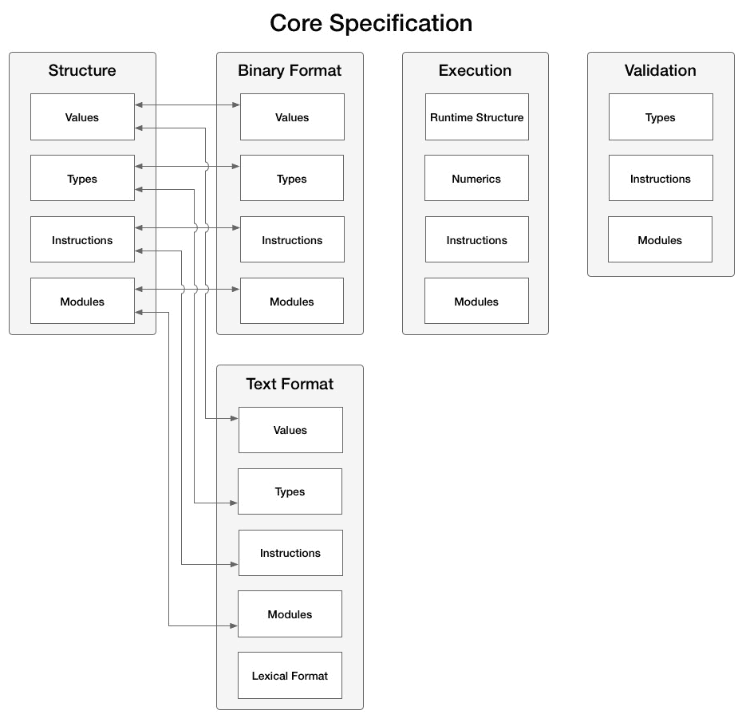
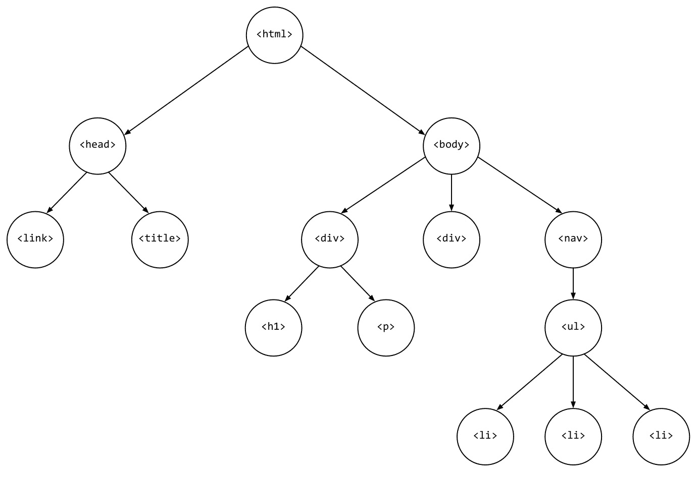
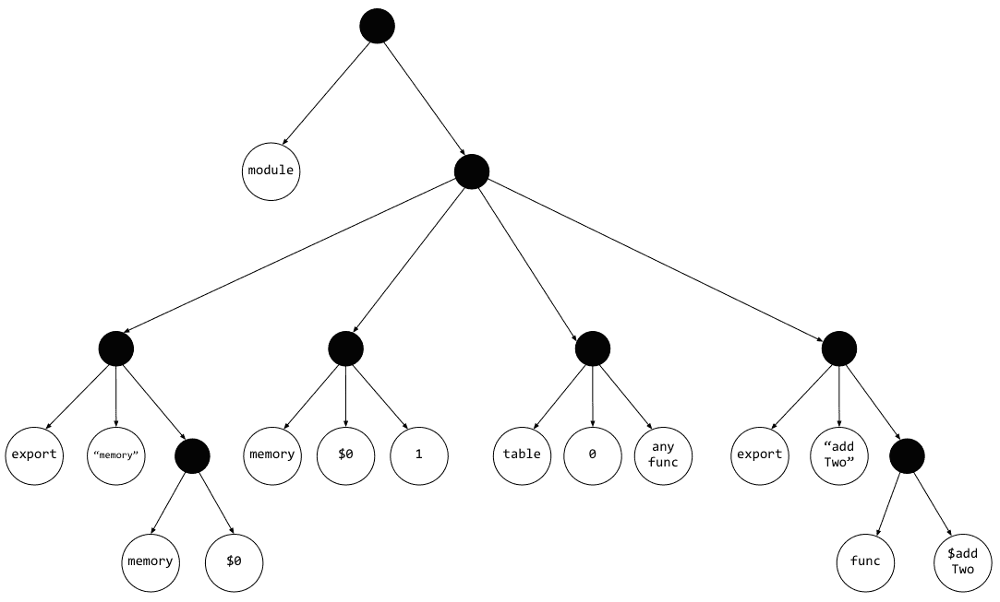
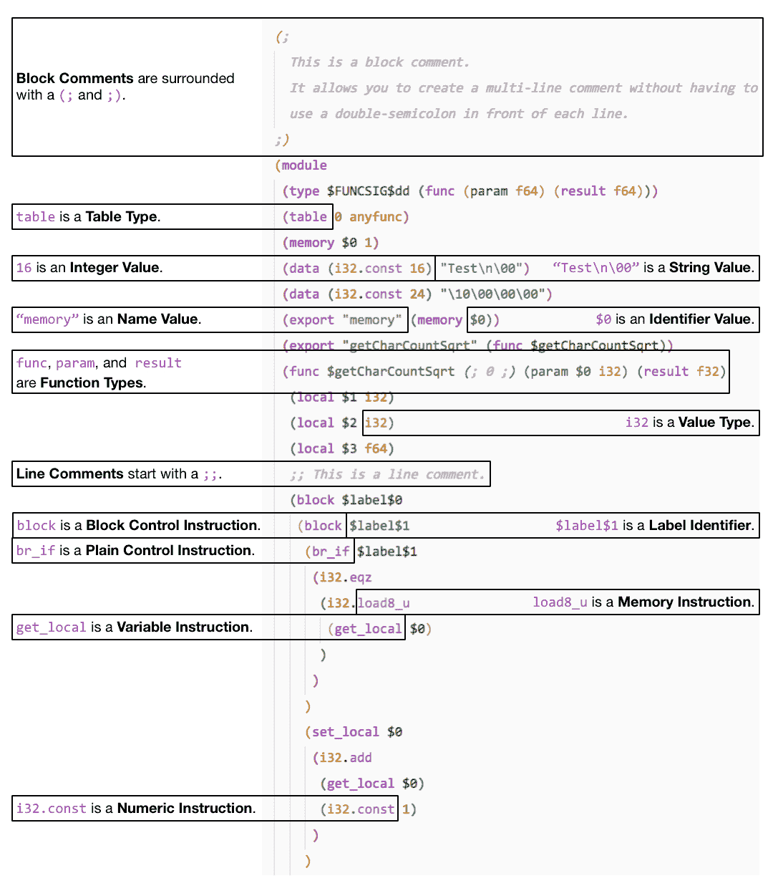
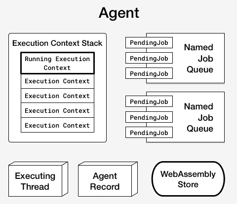
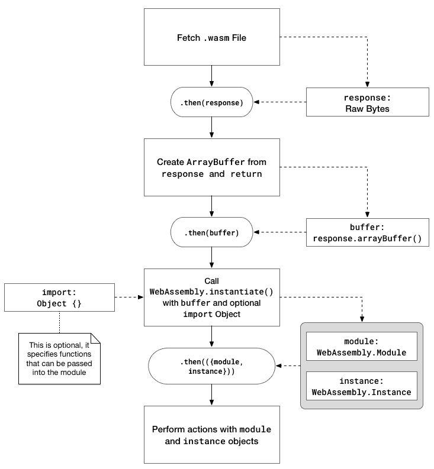
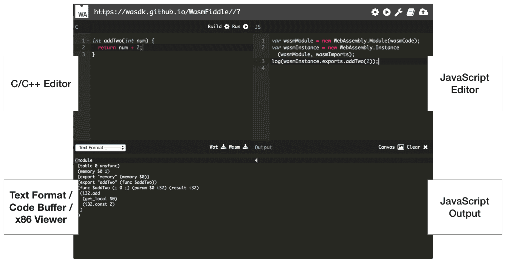
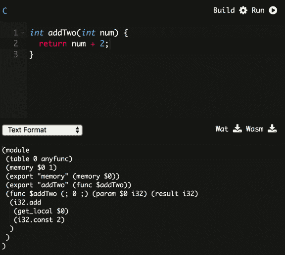
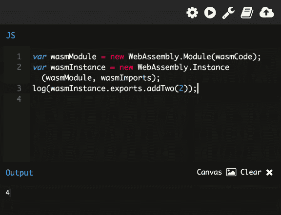

# WebAssembly 的元素 - Wat、Wasm 和 JavaScript API

第一章，*什么是 WebAssembly？*，描述了 WebAssembly 的历史，并提供了该技术的概述以及潜在的使用案例和限制。WebAssembly 被描述为由多个元素组成，而不仅仅是官方定义中指定的二进制指令格式。

在本章中，我们将深入探讨与 WebAssembly 工作组创建的官方规范相对应的元素。我们将更详细地研究 Wat 和二进制格式，以更好地理解它们与模块的关系。我们将回顾*JavaScript API*和*Web API*，以确保您能够有效地在浏览器中使用 WebAssembly。

本章的目标是理解以下内容：

+   文本格式和二进制格式之间的关系

+   Wat 是什么以及它在开发过程中的位置

+   二进制格式和模块（Wasm）文件

+   JavaScript 和 Web API 的组成部分以及它们与 Wasm 模块的关系

+   如何利用 WasmFiddle 评估 WebAssembly（C/C++ > Wat > Wasm）的阶段

# 常见结构和抽象语法

在第一章，*什么是 WebAssembly？*中，我们讨论了 WebAssembly 的二进制和文本格式如何映射到以抽象语法形式存在的共同结构。在深入探讨这些格式的细节之前，值得提及的是它们在*核心规范*中的关系。以下图表是目录的视觉表示（为了清晰起见，省略了一些部分）：

*核心规范*目录

如您所见，**文本格式**和**二进制格式**部分包含与**结构**部分相对应的**值**、**类型**、**指令**和**模块**的子部分。因此，我们在下一节中涵盖的文本格式的大部分内容与二进制格式有直接对应关系。考虑到这一点，让我们深入文本格式。

# Wat

*核心规范*的*文本格式*部分提供了对常见语言概念（如值、类型和指令）的技术描述。如果您计划为 WebAssembly 构建工具，了解这些概念很重要，但如果您只是计划在应用程序中使用它，则不是必需的。尽管如此，文本格式是 WebAssembly 的重要组成部分，因此您应该了解一些概念。在本节中，我们将深入研究文本格式的某些细节，并突出*核心规范*中的重要观点。

# 定义和 S 表达式

要理解 Wat，让我们从 WebAssembly *核心规范*的描述中的第一句话开始：

"WebAssembly 模块的文本格式是将它们的抽象语法渲染成 S 表达式。"

那么什么是**符号表达式**（**S-expressions**）？S-expressions 是嵌套列表（树结构）数据的表示法。本质上，它们提供了一种简单而优雅的方式来以文本形式表示基于列表的数据。为了理解嵌套列表的文本表示如何映射到树结构，让我们从一个 HTML 页面中提取树结构。以下示例包含一个简单的 HTML 页面和相应的树结构图。

一个简单的 HTML 页面：

```cpp
<html>
<head>
  <link rel="icon" href="favicon.ico">
  <title>Page Title</title>
</head>
<body>
  <div>
    <h1>Header</h1>
    <p>This is a paragraph.</p>
  </div>
  <div>Some content</div>
  <nav>
    <ul>
      <li>Item 1</li>
      <li>Item 2</li>
      <li>Item 3</li>
    </ul>
  </nav>
</body>
</html>
```

对应的树结构是：



HTML 页面的树结构图

即使你以前从未见过树结构，仍然可以清楚地看到 HTML 在结构和层次方面如何映射到树。映射 HTML 元素相对简单，因为它是一种具有明确定义标签而没有实际逻辑的标记语言。

Wat 表示可以具有多个具有不同参数的模块。为了演示源代码、Wat 和相应的树结构之间的关系，让我们从一个简单的 C 函数开始，该函数将 2 加到作为参数传入的数字上：

这里是一个 C 函数，它将`2`加到传入的`num`参数上并返回结果：

```cpp
int addTwo(int num) {
    return num + 2;
}
```

将`addTwo`函数转换为有效的 Wat 得到以下结果：

```cpp
(module
  (table 0 anyfunc)
  (memory $0 1)
  (export "memory" (memory $0))
  (export "addTwo" (func $addTwo))
  (func $addTwo (; 0 ;) (param $0 i32) (result i32)
    (i32.add
      (get_local $0)
      (i32.const 2)
    )
  )
)
```

在第一章，“什么是 WebAssembly？”中，我们讨论了与*核心规范*相关的语言概念（*函数*、*线性内存*、*表*等）。在该规范中，*结构*部分在抽象语法的上下文中定义了这些概念。规范的*文本格式*部分也与这些概念相对应，你可以在前面的代码片段（`func`、`memory`、`table`）中看到它们的定义。

树结构：



Wat 的树结构图

整个树结构太大，无法在一页上显示，因此此图仅限于 Wat 源文本的前五行。每个填充的点代表一个列表节点（或一组括号的内容）。正如你所见，用 s-expressions 编写的代码可以清晰地以树结构简洁地表达，这也是为什么 s-expressions 被选为 WebAssembly 的文本格式。

# 值、类型和指令

尽管对*核心规范*中*文本格式*部分的详细说明超出了本文的范围，但展示一些语言概念如何映射到相应的 Wat 仍然很有价值。以下图表通过一个 Wat 代码片段展示了这些映射。从编译此代码的 C 语言代码表示一个函数，该函数接受一个单词作为参数并返回字符计数的平方根：



包含语言概念细节的 Wat 示例

如果您打算编写或编辑 Wat，请注意它支持块和行注释。指令被分成块，包括设置和获取与变量相关联的内存，这些变量具有有效的类型。您可以使用 `if` 语句控制逻辑流程，并使用 `loop` 关键字支持循环。

# 在开发过程中的作用

文本格式允许以文本形式表示二进制 Wasm 模块。这在开发调试的易用性方面具有深远的影响。拥有 WebAssembly 模块的文本表示允许开发者在一个浏览器中查看加载模块的源代码，这消除了阻碍 NaCl 采用的黑盒问题。它还允许围绕模块故障排除构建工具。官方网站描述了推动文本格式设计的用例：

在 WebAssembly 模块上查看源代码，从而以自然的方式融入 Web（在 Web 中，可以查看每个源）。

在浏览器开发工具中呈现时没有源映射（这在最小可行产品（MVP）的情况下是必然的）。

•   直接编写 WebAssembly 代码，原因包括教学、实验、调试、优化和规范本身的测试。

列表中的最后一项反映了文本格式并不是在正常开发过程中手动编写的，而是从 Emscripten 等工具生成。在生成模块时，您可能不会看到或操作任何 `.wat` 文件，但在调试环境中可能会查看它们。

不仅文本格式在调试方面有价值，而且拥有这种中间格式减少了对于单一编译工具的依赖。目前存在多种不同的工具可以消费和生成这种 s-expression 语法，其中一些被 Emscripten 用于将您的代码编译成 `.wasm` 文件。

# 二进制格式和模块文件（Wasm）

核心规范中的 *二进制格式* 部分提供了与 *文本格式* 部分相同级别的语言概念细节。在本节中，我们将简要介绍二进制格式的某些高级细节，并讨论构成 Wasm 模块的各个部分。

# 定义和模块概述

二进制格式被定义为抽象语法的密集线性编码。不深入技术细节的话，这基本上意味着它是一种高效的二进制形式，允许快速解码、小文件大小和减少内存使用。二进制格式的文件表示形式是 `.wasm` 文件，这是我们使用 Emscripten 编译并用于示例的输出。

二进制格式的*核心规范*的*值*、*类型*和*指令*子部分直接对应于*文本格式*部分。每个概念都在编码的上下文中进行了介绍。例如，根据规范，整数类型使用 LEB128 可变长度整数编码进行编码，可以是无符号或带符号的变体。如果您希望为 WebAssembly 开发工具，这些是重要的细节，但如果您只是计划在网站上使用它，则不是必需的。

*核心规范*的*结构*、*二进制格式*和*文本格式*（wat）部分有一个*模块*子部分。我们之所以在上一个部分中没有涵盖模块的方面，是因为在二进制上下文中描述它们更为谨慎。官方 WebAssembly 网站为模块提供了以下描述：

“在 WebAssembly 中，可分发、可加载和可执行的代码单元称为**模块**。在运行时，可以使用一组导入值**实例化**一个模块，生成一个**实例**，它是一个不可变的元组，引用了运行模块可访问的所有状态。”

我们将在本章后面讨论如何使用 JavaScript 和 Web API 与模块交互，因此让我们先建立一些背景知识，以便理解模块元素如何映射到 API 方法。

# 模块部分

模块由几个部分组成，其中一些部分您将通过 JavaScript API 与之交互：

+   导入（`import`）是模块内可以访问的元素，可以是以下之一：

    +   函数，可以使用`call`操作符在模块内调用

    +   全局（`global`），可以通过模块内的`global`操作符访问

    +   线性内存，可以通过模块内的`memory`操作符访问

    +   表，可以使用`call_indirect`在模块内访问

+   导出（`export`）是可以由消费 API（即由 JavaScript 函数调用）访问的元素

+   模块启动函数（`start`）在模块实例初始化后调用

+   全局（`global`）包含全局变量的内部定义

+   线性内存（`memory`）包含具有初始内存大小和可选最大大小的线性内存的内部定义

+   数据（`data`）包含数据段数组，指定给定内存固定范围的初始内容

+   表（`table`）是一个线性内存，其元素是特定表元素类型的不可见值：

    +   在 MVP 中，其主要目的是在 C/C++中实现间接函数调用

+   元素（`elements`）是一个部分，允许模块使用模块中的任何其他定义初始化任何导入或内部定义的表元素

+   函数和代码：

    +   函数部分声明了模块中定义的每个内部函数的签名

    +   代码部分包含函数部分声明的每个函数的函数体

一些关键字（如 `import`、`export` 等）应该看起来很熟悉；它们出现在前一个章节 Wat 文件的内容中。WebAssembly 的组件遵循一种逻辑映射，直接对应于 API（例如，你将 `memory` 和 `table` 实例传递给 JavaScript 的 `WebAssembly.instantiate()` 函数）。你与二进制格式模块的主要交互将通过这些 API 进行。

# JavaScript 和 Web API

除了 *WebAssembly 核心规范* 之外，还有两个 API 规范用于与 WebAssembly 模块交互：*WebAssembly JavaScript 接口*（JavaScript API）和 *WebAssembly Web API*。在前面的章节中，我们介绍了 *核心规范* 的相关方面，以便熟悉底层技术。如果你从未阅读过 *核心规范*（或者如果你跳过了本章的前几节），这不会妨碍你在应用程序中使用 WebAssembly。对于 API 来说并非如此，因为它们描述了实例化和与编译的 Wasm 模块交互所需的方法和接口。在本节中，我们将回顾 Web 和 JavaScript API，并描述如何使用 JavaScript 加载和与 Wasm 模块通信。

# WebAssembly 存储和对象缓存

在深入交互之前，让我们讨论在执行上下文中 JavaScript 和 WebAssembly 之间的关系。*核心规范* 在 *执行* 部分包含以下描述：

"当实例化模块或在生成的模块实例上调用导出的函数时执行 WebAssembly 代码。

执行行为是用一个抽象机器来定义的，该机器模拟程序状态。它包括一个栈，用于记录操作数值和控制结构，以及包含全局状态的抽象存储。

在底层，JavaScript 使用称为 **代理** 的东西来管理执行。定义中提到的 *存储* 包含在一个代理中。以下图表示一个 JavaScript 代理：



JavaScript 代理元素

存储表示抽象机器的状态。WebAssembly 操作接受一个存储并返回一个更新后的存储。每个代理都与映射 JavaScript 对象到 WebAssembly 地址的缓存相关联。那么这为什么很重要呢？它代表了 WebAssembly 模块与 JavaScript 之间的底层交互方法。JavaScript 对象对应于 *JavaScript API* 中的 WebAssembly 命名空间。考虑到这一点，让我们深入了解接口。

# 加载模块和 WebAssembly 命名空间方法

*JavaScript API* 覆盖了浏览器中全局 `WebAssembly` 对象上可用的各种对象。在我们讨论这些之前，我们将从 `WebAssembly` 对象上可用的方法开始，简要概述它们的预期用途：

+   `instantiate()` 是编译和实例化 WebAssembly 代码的主要 API。

+   `instantiateStreaming()` 执行与 `instantiate()` 相同的功能，但它使用流式处理来编译和实例化模块，从而消除了一个中间步骤。

+   `compile()` 仅编译 WebAssembly 模块，但不实例化它。

+   `compileStreaming()` 也仅编译 WebAssembly 模块，但使用类似于 `instantiateStreaming()` 的流式处理。

+   `validate()` 检查 WebAssembly 二进制代码以确保字节有效，如果有效则返回 true，否则返回 false。

`instantiateStreaming()` 和 `compileStreaming()` 方法目前仅在 *Web API* 中存在。实际上，这两个方法构成了整个规范。`WebAssembly` 对象上的方法主要关注编译和实例化模块。考虑到这一点，让我们讨论如何获取和实例化 Wasm 模块。

当你执行获取模块的 fetch 调用时，它返回一个 Promise，该 Promise 解决为该模块的原始字节，这些字节需要被加载到 `ArrayBuffer` 中并实例化。从现在开始，我们将此过程称为加载模块。

以下图表展示了此过程：



获取和加载 WebAssembly 模块

使用 Promise，这个过程实际上相当简单。以下代码演示了如何加载模块。`importObj` 参数传递任何数据或函数到 Wasm 模块。现在你可以忽略它，因为我们将在第五章（51201d69-0a8e-45f3-bb4f-03ded5bbeb6c.xhtml）中更详细地讨论它，*创建和加载 WebAssembly 模块*：

```cpp
fetch('example.wasm')
  .then(response => response.arrayBuffer())
  .then(buffer => WebAssembly.instantiate(buffer, importObj))
  .then(({ module, instance }) => {
    // Do something with module or instance
  });
```

上述示例说明了使用 `instantiate()` 方法加载模块的方法。`instantiateStreaming()` 方法略有不同，通过单一步骤获取、编译和实例化模块，进一步简化了过程。以下代码使用此方法（加载模块）达到相同的目的：

```cpp
WebAssembly.instantiateStreaming(fetch('example.wasm'), importObj)
  .then(({ module, instance }) => {
    // Do something with module or instance
  });
```

实例化方法返回一个 Promise，该 Promise 解决为一个包含编译后的 `WebAssembly.Module`（`module`）和 `WebAssembly.Instance`（`instance`）的对象，这两个对象将在本节稍后讨论。在大多数情况下，你将使用这些方法之一在你的网站上加载 Wasm 模块。实例包含所有可以从你的 JavaScript 代码中调用的导出 WebAssembly 函数。

`compile()` 和 `compileStreaming()` 方法返回一个仅当编译成功时才解决的 Promise，它包含一个编译后的 `WebAssembly.Module`。如果你想在稍后时间编译一个模块并实例化它，这非常有用。**Mozilla 开发者网络**（**MDN**），由 Mozilla 管理的网站，提供了一个示例，其中编译后的模块被传递给一个 Web Worker。

就 `validate()` 方法而言，它的唯一目的是测试作为参数传入的类型数组或 `ArrayBuffer` 是否有效。这将在响应的原始字节被加载到 `ArrayBuffer` 之后调用。由于尝试实例化或编译无效的 Wasm 模块将抛出 `TypeError` 或 `WebAssembly` 对象上存在的 `Error` 对象之一，因此此方法未包含在代码示例中。我们将在本节稍后讨论这些 `Error` 对象。

# WebAssembly 对象

除了在 *加载模块和 WebAssembly 命名空间方法* 部分中介绍的方法之外，全局 `WebAssembly` 对象还有子对象，用于与 WebAssembly 交互和故障排除。这些对象直接对应于我们在 WebAssembly 二进制和文本格式部分讨论的概念。以下列表包含这些对象以及从 MDN 夺取的定义：

+   `WebAssembly.Module` 对象包含无状态的 WebAssembly 代码，这些代码已经被浏览器编译，并且可以高效地与工作线程共享，存储在 `IndexedDB` 中，并且可以被实例化多次。

+   `WebAssembly.Instance` 对象是一个有状态的、可执行的 `WebAssembly.Module` 实例，它包含了所有导出的 WebAssembly 函数，这些函数允许从 JavaScript 调用 WebAssembly 代码。

+   当使用构造函数调用 `WebAssembly.Memory` 时，会创建一个新的 `Memory` 对象，它是一个可调整大小的 `ArrayBuffer`，用于存储 WebAssembly `Instance` 访问的原始内存字节。

+   当使用构造函数调用 `WebAssembly.Table` 时，会创建一个新的 `Table` 对象，该对象具有给定的大小和元素类型，代表一个 WebAssembly `Table`（存储函数引用）。

+   当使用构造函数调用 `WebAssembly.CompileError` 时，会创建一个错误，该错误指示在 WebAssembly 解码或验证过程中发生了问题。

+   当使用构造函数调用 `WebAssembly.LinkError` 时，会创建一个错误，该错误指示在模块实例化过程中发生了问题。

+   当使用构造函数调用 `WebAssembly.RuntimeError` 时，会创建一个错误，该错误指示 WebAssembly 指定了一个陷阱（例如，发生了栈溢出）。

让我们逐一深入了解，从 `WebAssembly.Module` 对象开始。

# WebAssembly.Module

`WebAssembly.Module` 对象位于 `ArrayBuffer` 和实例化模块之间的中间步骤。`compile()` 和 `instantiate()` 方法（以及它们的流式处理对应方法）返回一个解析为模块的 Promise（小写的模块表示编译后的 `Module`）。模块也可以通过直接将类型数组或 `ArrayBuffer` 传递给构造函数来同步创建，但对于大型模块来说，这不被推荐。

`Module` 对象也有三个静态方法：`exports()`、`imports()` 和 `customSections()`。这三个方法都接受一个模块作为参数，但 `customSections()` 方法接受一个表示部分名称的字符串作为其第二个参数。自定义部分在 *核心规范* 的 *二进制格式* 部分中描述，旨在用于调试信息或第三方扩展。在大多数情况下，你不需要定义这些。如果你正在使用一个你未创建的 Wasm 模块，`exports()` 函数非常有用，尽管你只能看到每个导出的名称和类型（例如，`function`）。

对于简单的用例，你不会直接处理 `Module` 对象或编译后的模块。大部分交互将发生在 `Instance` 对象上。

# WebAssembly.Instance

`WebAssembly.Instance` 对象是实例化的 WebAssembly 模块，这意味着你可以从中调用导出的 WebAssembly 函数。调用 `instantiate()` 或 `instantiateStreaming()` 返回一个解析为包含实例的对象的 Promise。你通过引用实例的 `export` 属性上的函数名称来调用 WebAssembly 函数。例如，如果一个模块包含一个名为 `sayHello()` 的导出函数，你会使用 `instance.exports.sayHello()` 来调用该函数。

# WebAssembly.Memory

`WebAssembly.Memory` 对象持有 WebAssembly `Instance` 访问的内存。此内存可以从 JavaScript 和 WebAssembly 中访问和更改。要创建 `Memory` 的新实例，你需要将一个包含 `initial` 和（可选的）`maximum` 值的对象传递给 `WebAssembly.Memory()` 构造函数。这些值以 WebAssembly 页为单位，其中一页是 64 KB。你可以通过调用 `grow()` 函数并传递一个表示要增加的 WebAssembly 页数的单个参数来增加内存实例的大小。你还可以通过其 `buffer` 属性访问内存实例中包含的当前缓冲区。

MDN 描述了两种获取 `WebAssembly.Memory` 对象的方法。第一种方法是从 JavaScript 中构建它（`var memory = new WebAssembly.Memory(...)`），而第二种方法是由 WebAssembly 模块导出。重要的是要记住，内存可以在 JavaScript 和 WebAssembly 之间轻松传递。

# WebAssembly.Table

`WebAssembly.Table` 对象是一个类似数组的结构，用于存储函数引用。就像 `WebAssembly.Memory` 一样，`Table` 可以从 JavaScript 和 WebAssembly 中访问和更改。截至编写本文时，表只能存储函数引用，但随着技术的演变，很可能会在表中存储其他实体。

要创建一个新的 `Table` 实例，你需要传递一个包含 `element`、`initial` 和（可选的）`maximum` 值的对象。`element` 成员是一个表示表中存储的值类型的字符串；目前唯一有效的值是 `"anyfunc"`（用于函数）。`initial` 和 `maximum` 值表示 WebAssembly `Table` 中的元素数量。

你可以使用 `length` 属性访问 `Table` 实例中的元素数量。该实例还包括用于操作和查询表中元素的方法。`get()` 方法允许你访问作为参数传入的给定索引处的元素。`set()` 方法允许你将第一个参数指定的索引处的元素设置为第二个参数指定的值（根据前面的说明，只支持函数）。最后，`grow()` 允许你通过传入作为参数的数字来增加 `Table` 实例（元素数量）的大小。

# WebAssembly 错误（CompileError、LinkError、RuntimeError）

JavaScript API 提供了创建特定于 WebAssembly 的 `Error` 对象实例的构造函数，但我们不会花太多时间介绍这些对象。本节开头对象定义列表描述了每个错误的性质，这些错误可能在满足指定条件时被引发。所有三个错误都可以使用消息、文件名和行号参数（所有这些都是可选的）来构建，并且具有与标准 JavaScript `Error` 对象相同的属性和方法。

# 使用 WasmFiddle 连接点

我们在本章回顾了 WebAssembly 的各种元素以及相应的 JavaScript 和 Web API，但理解这些部分如何组合在一起仍然可能令人困惑。随着我们在这本书中的例子中前进，并且你能够看到 C/C++、WebAssembly 和 JavaScript 之间的交互，这些概念将会变得更加清晰。

话虽如此，这种交互的演示可能有助于消除一些困惑。在本节中，我们将使用一个名为 WasmFiddle 的在线工具来演示这些元素之间的关系，以便你可以看到 WebAssembly 的实际应用，并获得开发工作流程的高级概述。

# 什么是 WasmFiddle？

WasmFiddle 位于 [`wasdk.github.io/WasmFiddle/`](https://wasdk.github.io/WasmFiddle/)，是一个在线代码编辑工具，允许你编写一些 C 或 C++ 代码，并将其转换为 Wat，编译为 Wasm，或直接使用 JavaScript 与其交互。C/C++ 和 JavaScript 编辑器非常简单，并不打算用作你的主要开发环境，但它为 Wasm 编译器提供了有价值的服务。在 第三章，*设置开发环境*，你会发现从零开始生成 Wasm 文件需要一点工作——能够将你的 C 代码粘贴到浏览器中并点击几个按钮会使事情变得更加方便。以下图表提供了界面的快速概述：



WasmFiddle 用户界面的组件

如您所见，界面相对简单。让我们尝试一些代码！

# C 代码转换为 Wat

在以下截图的左上角面板中包含了一个简单的 C 函数，该函数将参数指定的数字加 2。左下角面板包含相应的 Wat：



C 函数和相应的 Wat

如果这看起来很熟悉，那是因为这段相同的代码在本书开头解释 Wat 的 s-expressions 时已经使用过了。深入挖掘，你可以看到 C 代码是如何对应 Wat 输出的。`addTwo()` 函数作为字符串在行 `5` 中导出模块。行 `5` 也包含 `(func $addTwo)`，它引用了行 `6` 中的 `$addTwo` 函数。行 `6` 指定可以传递一个类型为 `i32`（整数）的单个参数，返回的结果也是 `i32`。在右上角（或 C/C++ 编辑器上方）按下构建按钮（或构建按钮）将编译 C 代码为 Wasm 文件。构建完成后，Wasm 将可用于下载或与 JavaScript 交互。

# Wasm 转换为 JavaScript

在以下截图的右上角面板中包含了一些用于编译上一步骤生成的 Wasm 的 JavaScript 代码。`wasmCode` 在构建完成后生成，因此应该可以自动获取。而不是使用 `instantiate()` 方法，WasmFiddle 创建了一个编译后的 `WebAssembly.Module` 实例，并将其传递给新的 `WebAssembly.Instance` 构造函数。`wasmImports` 对象目前为空，尽管如果我们想的话，可以传递一个 `WebAssembly.Memory` 和 `WebAssembly.Table` 实例：



调用编译后的 Wasm 模块中 C 函数的 JavaScript 代码

JavaScript 的最后一行将 `addTwo()` 函数的结果打印到右下角的输出面板中，当传入数字 `2` 时。`log()` 方法是一个自定义函数，确保输出被打印到右下角面板（数字 `4`）。注意 JavaScript 代码如何与 `wasmInstance` 交互。`addTwo()` 函数是从实例的 `exports` 对象中调用的。尽管这是一个虚构的例子，但它演示了 C 或 C++ 代码在可以作为 Wasm 模块被 JavaScript 使用之前需要经历的步骤。

# 摘要

在本章中，我们讨论了 WebAssembly 的元素及其关系。使用 *核心规范* 的结构来描述文本和二进制格式映射到公共抽象语法。我们强调了文本格式（Wat）在调试和开发环境中的有用方面，以及为什么 s-表达式非常适合抽象语法的文本表示。我们还回顾了与二进制格式相关的细节以及构成模块的各种元素。JavaScript 和 Web API 中的方法和对象被定义为描述它们与 WebAssembly 交互的角色。最后，使用 WasmFiddle 工具展示了源代码、Wat 和 JavaScript 之间关系的一个简单示例。

在第三章，*设置开发环境*，我们将安装我们将用于有效工作与 WebAssembly 一起使用的开发工具。

# 问题

1.  s-表达式擅长表示哪种类型的数据？

1.  二进制和文本格式之间共享的四个语言概念是什么？

1.  文本格式的一个用例是什么？

1.  可以存储在 WebAssembly `Table` 中的唯一元素类型是什么？

1.  JavaScript 引擎使用什么来管理执行？

1.  实例化模块时哪种方法需要更少的代码，`instantiate()` 还是 `instantiateStreaming()`？

1.  在 `WebAssembly` JavaScript 对象上可用的错误对象有哪些？以及什么事件导致每个错误？

# 进一步阅读

+   WebAssembly 在 MDN：[`developer.mozilla.org/en-US/docs/WebAssembly`](https://developer.mozilla.org/en-US/docs/WebAssembly)

+   WasmFiddle: [`wasdk.github.io/WasmFiddle`](https://wasdk.github.io/WasmFiddle)

+   Wikipedia 上的 s-表达式：[`en.wikipedia.org/wiki/S-expression`](https://en.wikipedia.org/wiki/S-expression)

+   树的示例：[`interactivepython.org/runestone/static/pythonds/Trees/ExamplesofTrees.html`](http://interactivepython.org/runestone/static/pythonds/Trees/ExamplesofTrees.html)
