# 设置开发环境

现在，您已经熟悉了 WebAssembly 的元素，是时候设置一个合适的开发环境了。使用 WebAssembly 进行开发与使用 C 或 C++ 进行开发相似。区别在于构建过程和输出。在本章中，我们将介绍开发工具，以及如何在您的系统上安装和配置它们。

我们本章的目标是理解以下内容：

+   如何安装所需的开发工具（Git、Node.js 和 Visual Studio Code）

+   如何使用扩展配置 Visual Studio Code 以支持 C/C++ 和 WebAssembly

+   如何设置本地 HTTP 服务器以提供 HTML、JavaScript 和 `.wasm` 文件

+   检查您的浏览器是否支持 WebAssembly

+   有哪些有用的工具可以简化并改进开发过程？

# 安装开发工具

您需要安装一些应用程序和工具才能开始开发 WebAssembly。我们将使用 Visual Studio Code，一个文本编辑器，来编写我们的 C/C++、JavaScript、HTML 和 Wat。我们还将使用 Node.js 来提供文件服务，并使用 Git 来管理我们的代码。我们将使用包管理器来安装这些工具，这使得安装过程比手动下载和安装要简单得多。在本节中，我们将介绍操作系统以及每个平台的包管理器。我们还将简要回顾每个应用程序，概述它们在开发过程中的作用。

# 操作系统和硬件

为了确保安装和配置过程顺利进行，了解我在本书中使用的示例操作系统非常重要。如果您遇到问题，可能是由于您使用的平台与我使用的平台不兼容。在大多数情况下，您不应该遇到问题。为了消除操作系统版本作为潜在问题原因的可能性，我在以下列表中提供了我使用的操作系统的详细信息：

# macOS

+   High Sierra，版本 10.13.x

+   2.2 GHz Intel i7 处理器

+   16 GB 的 RAM

# Ubuntu

+   在 VMware Fusion 中运行的 Ubuntu 16.04 LTS

+   2.2 GHz Intel i7 处理器

+   4 GB 的 RAM

# Windows

+   在 VMware Fusion 中运行的 Windows 10 Pro

+   2.2 GHz Intel i7 处理器

+   8 GB 的 RAM

# 包管理器

包管理器是简化软件安装过程的工具。它们允许我们从命令行升级、配置、卸载和搜索可用的软件，而无需访问网站下载和运行安装程序。它们还简化了可能具有多个依赖项或在使用前需要手动配置的软件的安装过程。在本节中，我将介绍每个平台的包管理器。

# Homebrew for macOS

Homebrew 是 macOS 上的一个优秀包管理器，它允许我们直接安装我们将要使用的多数工具。Homebrew 的使用方法很简单，只需在终端粘贴以下命令并运行即可：

```cpp
/usr/bin/ruby -e "$(curl -fsSL https://raw.githubusercontent.com/Homebrew/install/master/install)"
```

您将在终端中看到消息，这些消息将引导您完成安装过程。一旦完成，您需要安装一个名为 **Homebrew-Cask** 的 Homebrew 扩展，它允许您在不下载安装程序、挂载它并将应用程序拖到 `Applications` 文件夹的情况下安装 macOS 应用程序。您可以通过运行以下命令来安装它：

```cpp
brew tap caskroom/cask
```

就这样！现在您可以通过运行以下任一命令来安装应用程序：

```cpp
# For command line tools: brew install <Tool Name> 
# For desktop applications:
brew cask install <Application Name>
```

# Ubuntu 的 Apt

Apt 是 Ubuntu 提供的包管理器；无需安装它。它允许您直接安装命令行工具和应用程序。如果应用程序不在 Apt 的存储库中，您可以使用以下命令添加存储库：

```cpp
add-apt-repository 
```

# Windows 的 Chocolatey

Chocolatey 是 Windows 的包管理器。它与 Apt 类似，允许您安装命令行工具和应用程序。要安装 Chocolatey，您需要以管理员身份运行命令提示符（`cmd.exe`）。您可以通过按开始菜单按钮，输入 cmd，然后右键单击命令提示符应用程序并选择“以管理员身份运行”来完成此操作：

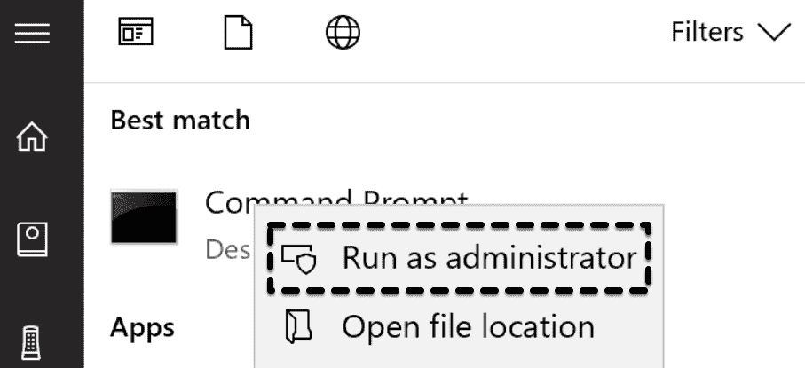

以管理员身份运行命令提示符

然后只需运行以下命令：

```cpp
@"%SystemRoot%\System32\WindowsPowerShell\v1.0\powershell.exe" -NoProfile -InputFormat None -ExecutionPolicy Bypass -Command "iex ((New-Object System.Net.WebClient).DownloadString('https://chocolatey.org/install.ps1'))" &amp;&amp; SET "PATH=%PATH%;%ALLUSERSPROFILE%\chocolatey\bin"
```

获取命令文本的最简单方法是通过 Chocolatey 的安装页面 [`chocolatey.org/install`](https://chocolatey.org/install)。在“*使用* *cmd.exe* 安装”部分下方有一个按钮，可以将文本复制到您的剪贴板。您也可以通过安装页面上的步骤使用 PowerShell 安装应用程序。

# Git

Git 是一个 **版本控制系统**（**VCS**），允许您跟踪文件更改并管理多个开发者之间对同一代码库的贡献。Git 是 GitHub 和 GitLab 所使用的 VCS，同样也适用于 Bitbucket（他们还提供 Mercurial，另一种 VCS）。Git 允许我们从 GitHub 克隆仓库，并且是 EMSDK 的先决条件，我们将在下一章中介绍。在本节中，我们将介绍 Git 的安装过程。

# 在 macOS 上安装 Git

如果您使用 macOS，Git 可能已经可用。macOS 随带 Apple Git，这可能会比最新版本落后几个版本。为了本书的目的，您已安装的版本应该足够。如果您希望升级，您可以通过在终端中运行以下命令来安装 Git 的最新版本：

```cpp
# Install Git to the Homebrew installation folder (/usr/local/bin/git):
brew install git

# Ensure the default Git is pointing to the Homebrew installation:
sudo mv /usr/bin/git /usr/bin/git-apple
```

如果您运行此命令，您应该看到 `/usr/local/bin/git`：

```cpp
which git
```

您可以通过运行以下命令来检查安装是否成功：

```cpp
git --version
```

# 在 Ubuntu 上安装 Git

您可以使用 `apt` 安装 Git；只需在终端中运行以下命令即可：

```cpp
sudo apt install git
```

您可以通过运行以下命令来检查安装是否成功：

```cpp
git --version
```

# 在 Windows 上安装 Git

您可以使用 Chocolatey 安装 Git。打开命令提示符或 PowerShell，并运行以下命令：

```cpp
choco install git
```

您可以通过运行以下命令来检查安装是否成功：

```cpp
git --version
```

您可以通过在安装命令的末尾添加 `-y` 来绕过确认消息（例如，`choco install git -y`）。您还可以选择始终跳过确认，通过输入

**`choco feature enable -n allowGlobalConfirmation`** 命令。

# Node.js

Node.js 的官方网站将其描述为一个异步事件驱动的 JavaScript 运行时。Node 是设计用来构建可扩展的网络应用程序的。我们将在这本书中使用它来提供文件服务并在浏览器中处理它们。Node.js 随 `npm` 一起打包，`npm` 是 JavaScript 的包管理器，它将允许我们全局安装包并通过命令行访问它们。在本节中，我们将使用 **Node 版本管理器**（**nvm**）来介绍每个平台的安装过程。

# nvm

我们将使用 Node.js 的**长期稳定版**（**LTS**）（版本 8）来确保我们使用的是平台的最稳定版本。我们将使用 `nvm` 来管理 Node.js 版本。如果您已经在计算机上安装了更高（或更低）版本的 Node.js，这将防止冲突。`nvm` 允许您安装多个版本的 Node.js，您可以在单个终端窗口中快速切换并隔离它们。

# 在 macOS 上安装 nvm

在终端中运行以下命令：

```cpp
brew install nvm
```

按照 Homebrew 指定的安装后步骤进行操作，以确保您可以使用它（您可能需要重新启动终端会话）。如果您在执行步骤之前清除了终端内容，您可以运行以下命令再次查看安装步骤：

```cpp
brew info nvm
```

您可以通过运行以下命令来检查安装是否成功：

```cpp
nvm --version
```

# 在 Ubuntu 上安装 nvm

Ubuntu 预装了 `wget`，它可以使用 HTTP/S 和 FTP/S 协议检索文件。`nvm` 的 GitHub 页面（[`github.com/creationix/nvm`](https://github.com/creationix/nvm)）包含以下命令，用于使用 `wget` 安装它：

```cpp
wget -qO- https://raw.githubusercontent.com/creationix/nvm/v0.33.11/install.sh | bash
```

安装完成后，重新启动终端以完成安装。您可以通过运行以下命令来检查安装是否成功：

```cpp
nvm --version
```

# 在 Windows 上安装 nvm

`nvm` 目前不支持 Windows，因此您实际上是在安装一个名为 `nvm`-windows 的不同应用程序。`nvm`-windows 的 GitHub 页面可在 [`github.com/coreybutler/nvm-windows`](https://github.com/coreybutler/nvm-windows) 找到。一些命令略有不同，但我们将运行的安装命令将是相同的。要安装 `nvm`-windows，打开命令提示符或 PowerShell，并运行以下命令：

```cpp
choco install nvm
```

您可以通过运行以下命令来检查安装是否成功：

```cpp
nvm --version
```

# 使用 nvm 安装 Node.js

安装 `nvm` 后，您需要安装本书中将要使用的 Node.js 版本：版本 8.11.1。要安装它，请运行此命令：

```cpp
nvm install 8.11.1
```

如果您之前没有安装 Node.js 或 `nvm`，它将自动将其设置为您的默认 Node.js 安装，因此此命令的输出应该是 `v8.11.1`：

```cpp
node --version
```

如果您已经安装了现有的 Node.js 版本，您可以选择将 v8.11.1 设置为默认版本，或者确保在本书的示例中工作时运行以下命令以使用 v8.11.1：

```cpp
nvm use 8.11.1
```

您可以在包含您的代码的文件夹中创建一个名为 `.nvmrc` 的文件，并填写内容 `v8.11.1`。您可以在该目录中运行 `nvm use`，它将版本设置为 `8.11.1`，而无需指定它。

# GNU make 和 rimraf

在 `learn-webassembly` 仓库中，代码示例使用 GNU Make 和 VS Code 的任务功能（我们将在 第五章，*创建和加载 WebAssembly 模块*）来执行本书中定义的构建任务。GNU Make 是一个出色的跨平台工具，用于自动化构建过程。您可以在 [`www.gnu.org/software/make`](https://www.gnu.org/software/make) 上了解更多关于 GNU Make 的信息。让我们回顾每个平台的安装步骤。

# macOS 和 Ubuntu 上的 GNU Make

如果您使用 macOS 或 Linux，GNU `make` 应该已经安装。为了验证这一点，请在终端中运行以下命令：

```cpp
make -v
```

如果您看到版本信息，您就可以继续了。跳转到 *安装 rimraf* 部分。否则，请按照您平台的 GNU Make 安装说明进行操作。

# 在 macOS 上安装 GNU Make

要在 macOS 上安装 GNU Make，请在终端中运行以下命令：

```cpp
brew install make
```

您可以通过运行以下命令来检查安装是否成功：

```cpp
make -v
```

如果您看到版本信息，请跳转到 *安装 rimraf* 部分。

# 在 Ubuntu 上安装 GNU Make

要在 Ubuntu 上安装 GNU Make，请在终端中运行以下命令：

```cpp
sudo apt-get install make
```

您可以通过运行以下命令来检查安装是否成功：

```cpp
make -v
```

如果您看到版本信息，请跳转到 *安装 rimraf* 部分。

# 在 Windows 上安装 GNU make

您可以使用 Chocolatey 在 Windows 上安装 GNU `make`。打开命令提示符或 PowerShell 并运行以下命令：

```cpp
choco install make
```

您可能需要重新启动 CLI 以使用 `make` 命令。重启后，运行以下命令以验证安装：

```cpp
make -v
```

如果您看到版本信息，请继续到下一节。如果您遇到问题，您可能需要下载并安装设置包 [`gnuwin32.sourceforge.net/packages/make.htm`](http://gnuwin32.sourceforge.net/packages/make.htm)。

# 安装 rimraf

在 Makefiles 或 VS Code Tasks 中定义的一些构建步骤会删除文件或目录。删除文件或文件夹所需的命令取决于您的平台和 shell。为了解决这个问题，我们将使用 `rimraf npm` 包（[`www.npmjs.com/package/rimraf`](https://www.npmjs.com/package/rimraf)）。全局安装此包提供了一个 `rimraf` 命令，该命令执行操作系统和 shell 的正确删除操作。

要安装 `rimraf`，请确保已安装 Node.js，然后从 CLI 运行以下命令：

```cpp
npm install -g rimraf
```

为了确保安装成功，请运行以下命令：

```cpp
rimraf --help
```

您应该看到使用说明和命令行标志列表。让我们继续到 VS Code 的安装部分。

# VS Code

VS Code 是一个跨平台文本编辑器，支持多种语言，并拥有丰富的扩展生态系统。内置的调试和 Git 支持是内置的，并且不断添加新功能。我们能够在本书的整个过程中使用它来完成 WebAssembly 开发过程。在本节中，我们将介绍每个平台的安装步骤：

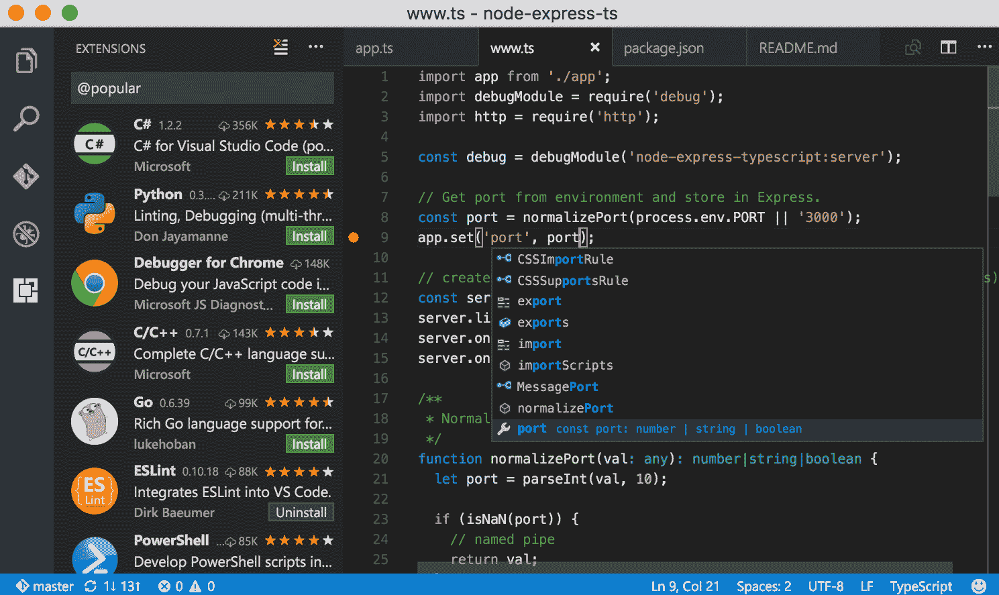

Visual Studio Code 网站的截图

# 在 macOS 上安装 Visual Studio Code

使用 Homebrew-Cask 安装 VS Code。在终端中运行以下命令进行安装：

```cpp
brew cask install visual-studio-code
```

一旦安装完成，您应该可以从“应用程序”文件夹或启动盘启动它。

# 在 Ubuntu 上安装 Visual Studio Code

在 Ubuntu 上安装 VS Code 的过程有几个额外的步骤，但仍然相对简单。首先，从 VS Code 的下载页面下载 `.deb` 文件（[`code.visualstudio.com/Download`](https://code.visualstudio.com/Download)）。下载完成后，运行以下命令以完成安装：

```cpp
# Change directories to the Downloads folder
cd ~/Downloads

# Replace <file> with the name of the downloaded file
sudo dpkg -i <file>.deb

# Complete installation
sudo apt-get install -f
```

如果您遇到缺少依赖项的错误，您可以在运行 `sudo dpkg` 之前运行以下命令来修复它：

```cpp
sudo apt-get install libgconf-2-4
sudo apt --fix-broken install
```

现在，您应该可以从启动器打开 VS Code。

# 在 Windows 上安装 Visual Studio Code

您可以使用 Chocolatey 安装 VS Code。从命令提示符或 PowerShell 运行以下命令：

```cpp
choco install visualstudiocode
```

安装完成后，您可以从开始菜单访问它。

您可以通过在 CLI 中运行 `code .` 来以当前工作目录作为项目打开 VS Code。

# 配置 VS Code

默认情况下，VS Code 是一个功能强大的文本编辑器，拥有许多出色的功能。除了高度可配置和可定制外，它还拥有一个极其丰富的扩展生态系统。我们需要安装其中的一些扩展，这样我们就不需要为不同的编程语言使用不同的编辑器。在本节中，我们将介绍如何配置 VS Code 以及需要安装哪些扩展以简化 WebAssembly 开发过程。

# 管理设置和自定义

个性化配置 VS Code 简单直观。您可以通过选择 Code | Preferences | Settings 在 macOS 上或 File | Preferences | Settings 在 Windows 上来管理自定义设置，如编辑器字体和选项卡大小。用户和工作区设置在 JSON 文件中分别管理，并提供自动完成功能，以防您记不起设置的准确名称。您还可以通过在首选项菜单中选择适当的选项来更改主题或键盘快捷键。设置文件也是您可以为安装的任何扩展设置自定义设置的地方。一些设置在安装扩展时默认添加，因此更改它们就像更新和保存此文件一样简单。

# 扩展概述

在配置过程中，我们需要安装一些扩展。在 VS Code 中查找和安装扩展有多种方式。我更喜欢点击左侧编辑器活动栏上从顶部数起的第四个按钮（扩展按钮），在搜索框中输入我想要的内容，然后为我想安装的扩展按下绿色的安装按钮。您也可以访问 VS Code 市场 place [`marketplace.visualstudio.com/vscode`](https://marketplace.visualstudio.com/vscode)，搜索并选择您想要安装的扩展，然后在扩展页面上点击绿色的安装按钮。您还可以通过命令行管理扩展。有关更多信息，请访问 [`code.visualstudio.com/docs/editor/extension-gallery`](https://code.visualstudio.com/docs/editor/extension-gallery)：

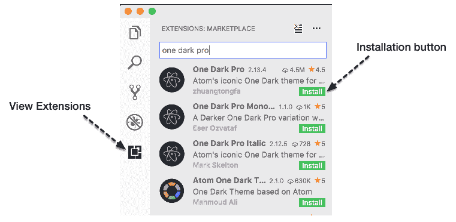

在 VS Code 中安装扩展

# C/C++ 和 WebAssembly 的配置

VS Code 默认不支持 C 和 C++，但有一个出色的扩展允许您使用这些语言。它也不支持 WebAssembly 文本格式的语法高亮，但有一个扩展可以添加此功能。在本节中，我们将介绍 *C/C++ for VS Code* 和 *WebAssembly Toolkit for VSCode* 扩展的安装和配置。

# 安装 VS Code 的 C/C++

VS Code 的 C/C++ 扩展包括用于编写和调试 C 和 C++ 代码的多个功能，例如自动完成、符号搜索、类/方法导航、逐行代码单步执行，以及其他许多功能。要安装此扩展，请在扩展中搜索 C/C++，然后安装名为 C/C++（由微软创建）的扩展，或者导航到扩展的官方页面 [`marketplace.visualstudio.com/items?itemName=ms-vscode.cpptools`](https://marketplace.visualstudio.com/items?itemName=ms-vscode.cpptools) 并点击绿色的安装按钮。

安装完成后，您可以通过在 VS Code 的扩展列表中选择扩展并选择“贡献”选项卡来查看扩展的配置详情。此选项卡包含各种设置、命令和调试器详情：

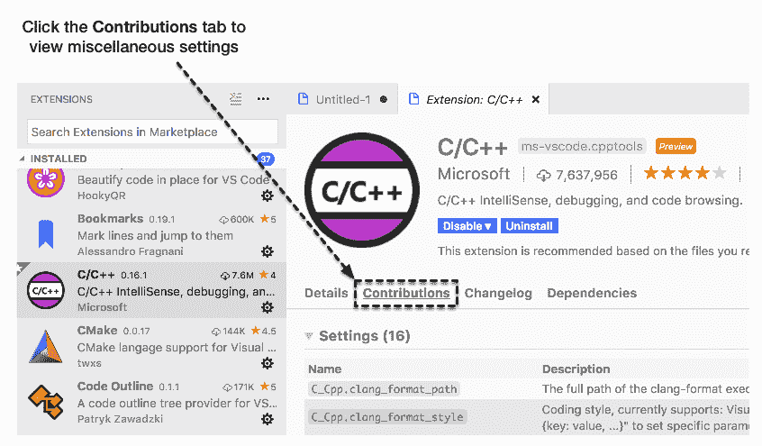

C/C++ 扩展的 *贡献* 选项卡

# 配置 VS Code 的 C/C++

微软为该扩展提供了一个官方页面，您可以在 [`code.visualstudio.com/docs/languages/cpp`](https://code.visualstudio.com/docs/languages/cpp) 上查看。该页面描述了如何使用 JSON 文件进行配置等内容。让我们先创建一个新的配置文件来管理我们的 C/C++ 环境。您可以通过按 *F1* 键，输入 C/C，然后选择 C/Cpp: 编辑配置…来生成一个新的配置文件：

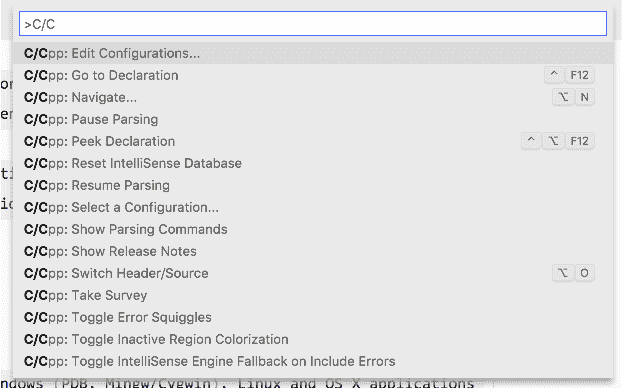

带有 C/C++ 扩展选项的命令面板

这将在您当前项目的 `.vscode` 文件夹中生成一个新的 `c_cpp_properties.json` 文件。该文件将包含基于您的平台、要使用的 C 和 C++ 标准以及头文件包含路径的配置选项。生成后，您可以关闭此文件。我们将在配置 EMSDK 时再次访问它。

# VSCode 的 WebAssembly 工具包

目前 VS Code 有几个不同的 WebAssembly 扩展可用。我使用的是 VSCode WebAssembly 工具包扩展，因为它允许您右键单击一个 `.wasm` 文件并选择显示 WebAssembly，这将显示文件的 Wat 表示形式。您可以通过扩展面板（搜索 WebAssembly）或从 VS Code 市场中的官方扩展页面（[`marketplace.visualstudio.com/items?itemName=dtsvet.vscode-wasm`](https://marketplace.visualstudio.com/items?itemName=dtsvet.vscode-wasm)）安装此扩展：

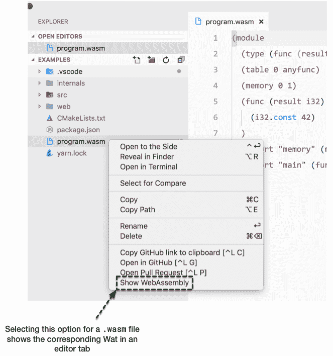

使用 VS Code 扩展的 WebAssembly 工具包查看 `.wasm` 文件

安装完成后，您就可以开始使用了！现在您已经安装了所有必需的扩展，让我们评估一些可选扩展，这些扩展可以简化常见任务。

# 其他有用的扩展

VS Code 有一些很棒的扩展可以提高效率和自定义界面。在本节中，我将介绍我安装的一些扩展，这些扩展可以简化常见任务以及用户界面/图标主题。您不需要为本书中的示例安装这些扩展，但您可能会发现其中一些很有用。

# 自动重命名标签

当使用 HTML 时，这个扩展非常有帮助。如果你更改了标签类型，它会自动更改关闭标签的名称。例如，如果你有一个 `<div>` 元素，并想将其改为 `<span>`，将打开元素的文本改为 `span` 将会更新关闭元素的文本（`</div>` 更改为 `</span>`）：

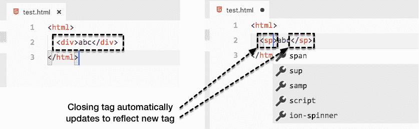

自动重命名标签重命名 HTML 标签

# 括号对着色器

此扩展程序会为你的代码中的括号、花括号和括号着色，这样你可以快速识别开闭括号。WebAssembly 的文本格式广泛使用括号，因此能够确定哪些元素被包含在哪些列表中，使得调试和评估变得简单得多：

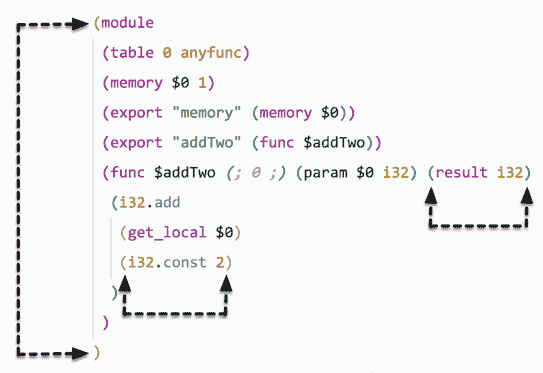

Wat 文件中括号对的颜色与括号匹配

# 材料图标主题和 Atom One Light 主题

VS Code 市场上有超过 1,000 个图标和界面主题可供选择。我在本节中包括了材料图标主题和 Atom One Light 主题，因为它们被用于本书的截图。材料图标主题非常受欢迎，下载量超过 200 万次，而 Atom One Light 主题的下载量超过 70,000 次：

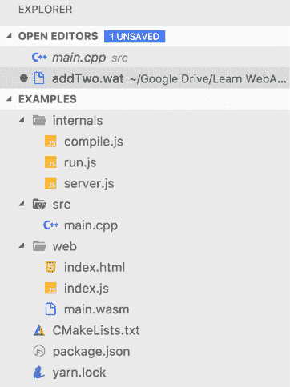

材料图标主题中的图标

# 为 Web 设置

与 Wasm 模块交互和调试将在浏览器中完成，这意味着我们需要一种方式来提供包含示例文件文件夹的服务。正如我们在第二章，“WebAssembly 元素 - Wat、Wasm 和 JavaScript API”中讨论的那样，WebAssembly 已集成到浏览器的 JavaScript 引擎中，但你需要确保你使用的是支持它的浏览器。在本节中，我们将提供克隆书籍示例仓库的说明。我们还将回顾如何快速设置本地 Web 服务器以进行测试，并评估浏览器选项以确保你能够本地开发。

# 克隆书籍示例仓库

你现在可能想要克隆包含本书所有示例的 GitHub 仓库。你肯定需要为第七章，“从头创建应用程序”准备代码，因为应用程序的代码库太大，无法放入单个章节中。在你的硬盘上选择一个文件夹，并运行以下命令以克隆仓库：

```cpp
git clone https://github.com/mikerourke/learn-webassembly
```

克隆过程完成后，你会发现示例按章节组织。如果一个章节中有多个示例，它们将按子文件夹在章节文件夹内拆分。

如果你正在使用 Windows，请不要将仓库克隆到`\Windows`文件夹或任何权限受限的文件夹中。否则，在尝试编译示例时可能会遇到问题。

# 安装本地服务器

我们将使用一个`npm`包，`serve`，来提供文件服务。要安装，只需运行以下命令：

```cpp
npm install -g serve
```

安装完成后，你可以在任何文件夹中提供文件服务。为了确保它正常工作，让我们尝试提供本地文件夹服务。本节代码位于`learn-webassembly`仓库的`/chapter-03-dev-env`文件夹中。按照以下说明验证你的服务器安装：

1.  首先，让我们创建一个文件夹，该文件夹将包含我们在本书剩余部分将要处理的代码示例（示例使用名称 `book-examples`）。

1.  启动 VS Code 并从菜单栏选择文件 | 打开...（macOS/Linux），或者选择文件 | 打开文件夹...（Windows）。

1.  接下来，选择文件夹 `book-examples` 并按打开（或选择文件夹）按钮。

1.  一旦 VS Code 加载完成，在 VS Code 文件资源管理器中右键单击，从菜单中选择新建文件夹，并将文件夹命名为 `chapter-03-dev-env`。

1.  选择 `chapter-03-dev-env` 文件夹，然后按新建文件按钮（或 *Cmd*/*Ctrl* + *N*）来创建一个新文件。将文件命名为 `index.html` 并填充以下内容：

```cpp
<!doctype html>
<html lang="en-us">
  <title>Test Server</title>
</head>
<body>
  <h1>Test</h1>
  <div>
    This is some text on the main page. Click <a href="stuff.html">here</a>
    to check out the stuff page.
  </div>
</body>
</html>
```

1.  在 `chapter-03-dev-env` 文件夹中创建另一个文件，命名为 `stuff.html` 并填充以下内容：

```cpp
<!doctype html>
<html lang="en-us">
<head>
  <title>Test Server</title>
</head>
<body>
  <h1>Stuff</h1>
  <div>
    This is some text on the stuff page. Click <a href="index.html">here</a>
    to go back to the index page.
  </div>
</body>
</html>
```

1.  我们将使用 VS Code 的集成终端来提供文件。您可以通过选择视图 | 集成终端，或者使用键盘快捷键 *Ctrl* + *`*（*`* 是 *Esc* 键下面的背引号键）来访问它。一旦加载，运行以下命令来提供工作文件夹：

```cpp
serve -l 8080 chapter-03-dev-env
```

您应该看到以下内容：

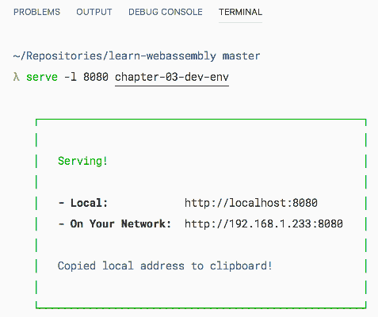

终端中运行 serve 命令的结果

`-l 8080` 标志告诉 `serve` 在端口 `8080` 上提供文件夹。第一个链接（`http://127.0.0.1:8080`）只能在您的计算机上访问。以下链接可以用来从本地网络上的另一台计算机访问页面。如果您在浏览器中导航到第一个链接（`http://127.0.0.1:8080/index.html`），您应该看到以下内容：

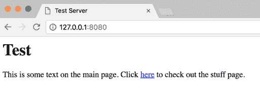

在 Google Chrome 中提供的测试页面

点击此处链接应将您带到 Stuff 页面（地址栏将显示 `127.0.0.1:8080/stuff.html`。如果一切正常，那么是时候验证您的浏览器了。

# 验证您的浏览器

为了确保您能够在浏览器中测试示例，您需要确保有一个全局的 `WebAssembly` 对象可用。为了避免任何与浏览器兼容性相关的问题，我建议您安装 Google Chrome 或 Mozilla Firefox 进行开发。如果您之前安装了这些浏览器中的任何一个，那么您的浏览器很可能已经有效。为了彻底起见，我们仍将介绍验证过程。在本节中，我将回顾您可以采取的步骤以确保您的浏览器支持 WebAssembly。

# 验证 Google Chrome

验证 Chrome 的过程非常直接。选择看起来像三个垂直点的按钮（位于地址栏旁边），然后选择 **更多工具** | **开发者工具**，或者使用键盘快捷键 *Cmd*/*Ctrl* + *Shift* + *I*：

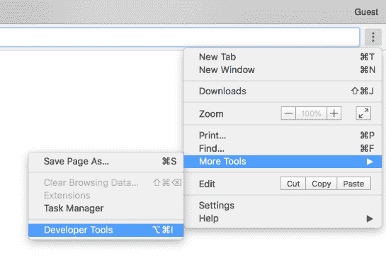

在 Google Chrome 中访问开发者工具

一旦开发者工具窗口出现，选择控制台选项卡，输入 `WebAssembly` 并按 *Enter*。如果您看到以下内容，则您的浏览器是有效的：

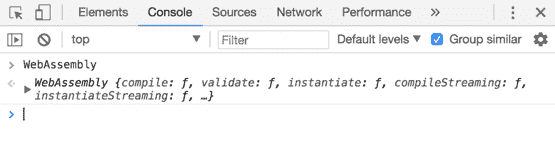

Google Chrome 开发者工具控制台中 WebAssembly 验证的结果

# 验证 Mozilla Firefox

验证 Firefox 的过程几乎与 Google Chrome 相同。从菜单栏选择**工具** | **Web 开发者** | **切换工具**，或使用键盘快捷键*Cmd*/*Ctrl* + *Shift* + *I*：

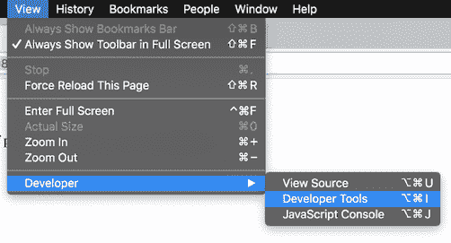

访问 Mozilla Firefox 的开发者工具

选择控制台标签，点击命令输入框内，输入`WebAssembly`并按*Enter*。如果您使用的 Firefox 版本有效，您将看到以下内容：

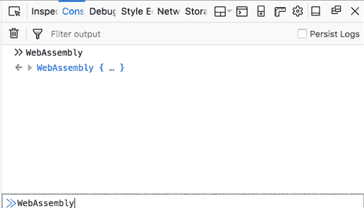

Mozilla Firefox 开发者工具控制台中 WebAssembly 验证的结果

# 验证其他浏览器

验证其他浏览器的过程基本上是相同的；验证的唯一不同之处在于如何访问开发者工具。如果通过您使用的浏览器控制台可以访问`WebAssembly`对象，您可以使用该浏览器进行 WebAssembly 开发。

# 其他工具

除了上一节中提到的应用程序和工具之外，还有一些免费且功能丰富的工具可以极大地提高您的开发过程。我没有时间涵盖所有这些工具，但我想要强调我经常使用的那些。在本节中，我将简要回顾每个平台可用的流行工具和应用程序。

# macOS 的 iTerm2

默认的 macOS 安装包括 Terminal 应用程序，Terminal，这对于本书的使用是足够的。如果您需要一个功能更全面的终端，iTerm2 是一个很好的选择。它提供了分割窗口、广泛的自定义、多个配置文件以及一个可以显示笔记、正在运行的任务、命令历史等功能带的 Toolbelt。您可以从官方网站([`www.iterm2.com/`](https://www.iterm2.com/))下载图像文件并手动安装，或者使用 Homebrew-Cask 命令安装 iTerm：

```cpp
brew cask install iterm2
```

这是运行 Toolbelt 打开和多个编辑器窗口的 iTerm2：

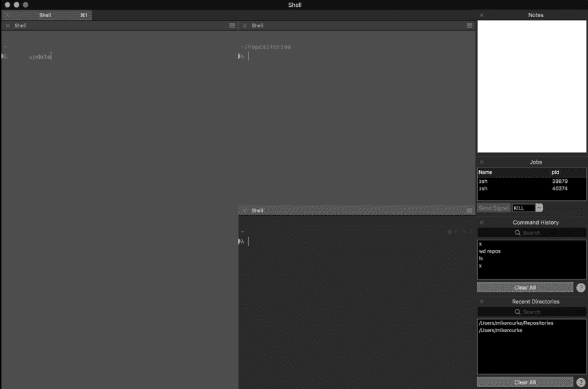

带有多个面板和 Toolbelt 的 ITerm 实例

# Ubuntu 的 Terminator

Terminator 是 Ubuntu 的 iTerm 和`cmder`，是一个允许在单个窗口内进行多标签和面板的终端模拟器。Terminator 还提供了拖放、查找功能以及一系列插件和主题。您可以通过`apt`安装 Terminator。为确保您使用的是最新版本，请在终端中运行以下命令：

```cpp
sudo add-apt-repository ppa:gnome-terminator
sudo apt-get update
sudo apt-get install terminator 
```

参考截图：

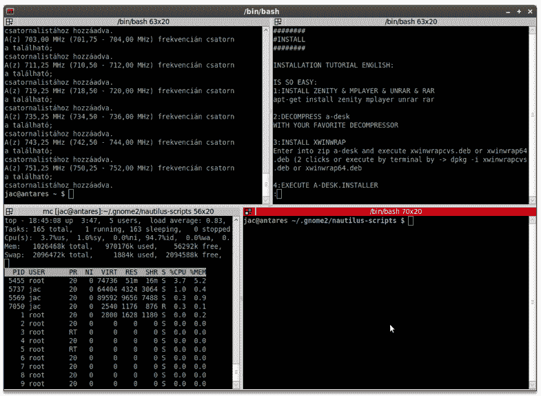

来自 http://technicalworldforyou.blogspot.com 的 Terminator 截图

B09984_03_17

# Windows 的 cmder

`cmder` 是一个 Windows 的控制台模拟器，它为标准的命令提示符或 PowerShell 添加了许多功能和特性。它提供了多标签页和可定制性等功能。它允许你在同一个程序中打开不同 shell 的实例。你可以从官方网站([cmder.net](https://cmder.net))下载并安装它，或者使用以下命令通过 Chocolatey 安装：

```cpp
choco install cmder
```

这就是它的样子：

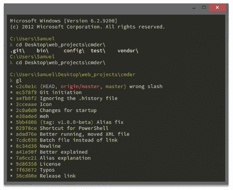

cmder 官方网站截图

# Zsh 和 Oh-My-Zsh

Zsh 是一个改进 Bash 的交互式 shell。Oh-My-Zsh 是 Zsh 的配置管理器，它拥有许多有用的插件。你可以在他们的网站上看到完整的列表([`github.com/robbyrussell/oh-my-zsh`](https://github.com/robbyrussell/oh-my-zsh))。例如，如果你想在你的 CLI 中获得强大的自动完成和语法高亮功能，有如 zsh-autosuggestion 和 zsh-syntax-highlighting 这样的插件。你可以在 macOS、Linux 和 Windows 上安装和配置 Zsh 和 Oh-My-Zsh。Oh-My-Zsh 页面上有安装说明以及主题和插件的列表。

# 摘要

在本章中，我们介绍了我们将用于开始使用 WebAssembly 的开发工具的安装和配置过程。我们讨论了如何使用操作系统的包管理器（例如，macOS 的 Homebrew）快速轻松地安装 Git、Node.js 和 VS Code。我们还展示了配置 VS Code 的步骤，以及你可以添加以增强开发体验的必需和可选扩展。我们讨论了如何安装本地 Web 服务器进行测试，以及如何验证你的浏览器以确保支持 WebAssembly。最后，我们简要回顾了一些你可以为你的平台安装的辅助开发工具。

在第四章“安装所需依赖”中，我们将安装所需的依赖项并测试工具链。

# 问题

1.  你应该为你的操作系统使用哪个包管理器？

1.  BitBucket 是否支持 Git？

1.  为什么我们使用 Node.js 的版本 8 而不是最新版本？

1.  你如何在 Visual Studio Code 中更改颜色主题？

1.  你如何在 Visual Studio Code 中访问命令面板？

1.  你如何检查你的浏览器是否支持 WebAssembly？

1.  在“其他工具”部分中，哪些工具在所有三个操作系统上得到支持？

# 进一步阅读

+   Homebrew: [`brew.sh`](https://brew.sh)

+   `apt` 文档：[`help.ubuntu.com/lts/serverguide/apt.html.en`](https://help.ubuntu.com/lts/serverguide/apt.html.en)

+   Chocolatey: [`chocolatey.org`](https://chocolatey.org)

+   Git: [`git-scm.com`](https://git-scm.com)

+   Node.js: [`nodejs.org/en`](https://nodejs.org/en)

+   GNU Make: [`www.gnu.org/software/make`](https://www.gnu.org/software/make)

+   VS Code: [`code.visualstudio.com`](https://code.visualstudio.com)
