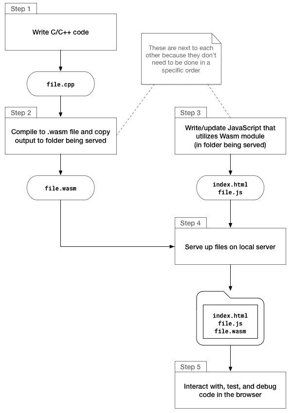
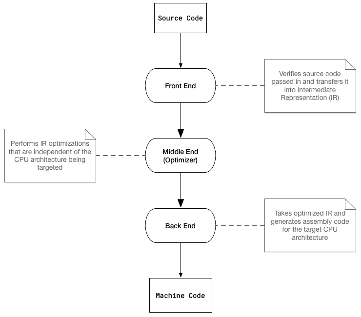
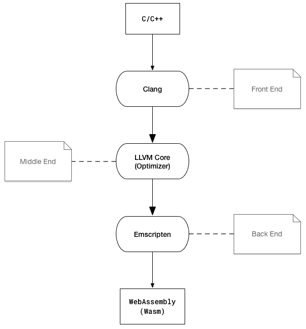
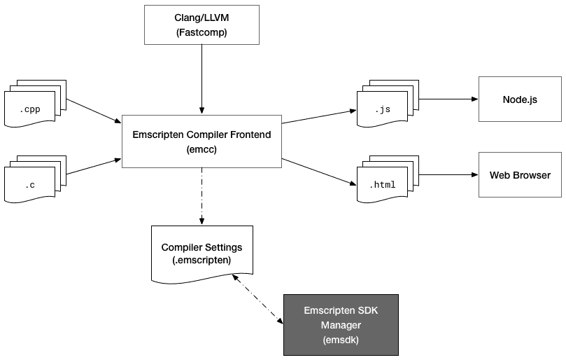
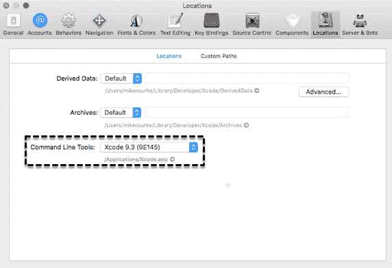

# 第四章：安装所需的依赖项

现在你已经设置了开发环境，并且准备开始编写 C、C++ 和 JavaScript 代码，是时候添加拼图中的最后一部分了。为了从我们的 C/C++ 代码生成 `.wasm` 文件，我们需要安装和配置 Emscripten SDK（EMSDK）。

在本章中，我们将讨论开发工作流程，并讨论 EMSDK 如何融入开发过程。将提供详细的说明，说明如何在每个平台上安装和配置 EMSDK 以及任何先决条件。一旦安装和配置过程完成，你将通过编写和编译一些 C 代码来测试它。

本章的目标是理解以下内容：

+   与 WebAssembly 一起工作时整体开发工作流程

+   EMSDK 如何与 Emscripten 和 WebAssembly 相关以及为什么需要它

+   如何安装 EMSDK 的先决条件

+   如何安装和配置 EMSDK

+   如何测试 EMSDK 以确保其正确工作

# 开发工作流程

WebAssembly 的开发工作流程与其他需要编译和构建过程的编程语言类似。在进入工具设置之前，我们将介绍开发周期。在本节中，我们将为我们将在此章的其余部分安装和配置的工具建立一些背景。

# 工作流程中的步骤

对于这本书，我们将编写 C 和 C++ 代码并将其编译成 Wasm 模块，但这个工作流程适用于任何可以编译成 `.wasm` 文件的编程语言。以下图表概述了该过程：



开发工作流程中的步骤

这个过程将在本书的示例中贯穿使用，这样你就可以了解项目结构如何与工作流程相对应。我们将使用一些可用的工具来加速和简化过程，但步骤仍然是相同的。

# 将工具集成到工作流程中

有许多编辑器和工具可供使用，以简化开发过程。幸运的是，C/C++ 和 JavaScript 已经存在了相当长的时间，因此你可以利用最适合你的选项。考虑到这项技术存在的时间较短，WebAssembly 的工具列表相对较短，但它们确实存在。

我们将主要使用的工具，VS Code，提供了一些优秀且实用的功能，用于简化构建和开发过程。除了用它来编写我们的代码外，我们还将利用 VS Code 的内置任务功能，从 C/C++构建`.wasm`文件。通过在项目根目录中创建一个`.vscode/tasks.json`文件，我们可以指定与构建步骤相关的所有参数，并使用快捷键快速运行它。除了执行构建外，我们还可以启动和停止一个运行的 Node.js 进程（即在工作流程图中的本地服务器）。我们将在下一章中介绍如何添加和配置这些功能。

# Emscripten 和 EMSDK

我们将使用 Emscripten 将我们的 C/C++代码编译成`.wasm`文件。到目前为止，Emscripten 只在一般背景下被简要提及。由于我们将在构建过程中使用这个工具以及相应的 Emscripten SDK（EMSDK），了解每种技术及其在开发工作流程中所扮演的角色非常重要。在本节中，我们将描述 Emscripten 的目的，并讨论它与 EMSDK 的关系。

# Emscripten 概述

那 Emscripten 究竟是什么呢？维基百科提供了以下定义：

“Emscripten 是一个源到源编译器，作为 LLVM 编译器的后端运行，并生成 asm.js 这一 JavaScript 子集。它还可以生成 WebAssembly。”

我们在第一章中讨论了源到源编译器（或转译器），并以 TypeScript 为例。转译器将一种编程语言的源代码转换为另一种编程语言的等效源代码。为了详细说明 Emscripten 作为 LLVM 编译器的后端运行，我们需要提供一些关于 LLVM 的额外细节。

LLVM 的官方网站([`llvm.org`](https://llvm.org))将 LLVM 定义为*一套模块化和可重用的编译器和工具链技术集合*。LLVM 由几个子项目组成，但我们将重点关注 Emscripten 使用的两个：Clang 和 LLVM 核心库。为了理解这些组件如何协同工作，让我们回顾一下三阶段编译器的结构：



一般三阶段编译器的结构

该过程相对简单：三个独立阶段或*端*处理编译过程。这种设计允许为各种编程语言和目标架构提供不同的前端和后端，并通过使用中间表示法完全解耦机器代码和源代码。现在让我们将每个编译阶段与我们将用于生成 WebAssembly 的工具链组件关联起来：



使用 LLVM、Clang 和 Emscripten 的三阶段编译

Clang 用于将 C/C++ 编译成 LLVM 的**中间表示**（**IR**），Emscripten 将其编译成 Wasm 模块（二进制格式）。两个图表还展示了 Wasm 和机器代码之间的关系。你可以将 WebAssembly 视为浏览器中的 CPU，Wasm 是其运行的机器代码。

# EMSDK 在哪里？

Emscripten 指的是用于将 C 和 C++ 编译成 `asm.js` 或 WebAssembly 的工具链。EMSDK 用于管理工具链中的工具和相应的配置。这消除了复杂的环境设置需求，并防止了工具版本不兼容的问题。通过安装 EMSDK，我们就拥有了使用 Emscripten 编译器所需的所有工具（除了先决条件之外）。以下图表是 Emscripten 工具链的视觉表示（EMSDK 以深灰色显示）：



Emscripten 工具链（从 emscripten.org 稍作修改）

既然你对 Emscripten 和 EMSDK 有更好的理解，让我们继续进行先决条件的安装过程。

# 安装先决条件

在安装和配置 EMSDK 之前，我们需要安装一些先决条件。你在第三章，*设置开发环境*：Node.js 和 Git 中安装了两个先决条件。每个平台都有略微不同的安装过程和工具需求。在本节中，我们涵盖了每个平台的先决条件工具的安装过程。

# 常见先决条件

有可能你已经安装了所有先决条件。以下是你无论在哪个平台都需要安装的三个工具：

+   Git

+   Node.js

+   Python 2.7

注意 Python 版本；这很重要，因为安装错误的版本可能会导致安装过程失败。如果你在第二章，*WebAssembly 元素 - Wat、Wasm 和 JavaScript API* 中跟随，并安装了 Node.js 和 Git，那么剩下的就是安装 Python 2.7 和为你平台指定的任何其他先决条件。每个平台的 Python 安装过程将在以下子节中指定。

Python 是一种用于通用编程的高级编程语言。如果你想了解更多，请访问官方网站 [`www.python.org/`](https://www.python.org/)。

# 在 macOS 上安装先决条件

在安装 EMSDK 之前，你需要安装三个额外的工具：

+   Xcode

+   Xcode 命令行工具

+   CMake

你可以从 macOS App Store 安装 Xcode。如果你已经安装了 Xcode，你可以通过转到 Xcode | Preferences | Locations 并检查命令行工具选项是否有值来检查是否已安装命令行工具。如果你安装了 Homebrew 包管理器，命令行工具应该已经安装了：



检查 Xcode 命令行工具的当前版本

如果没有看到，请打开终端并运行以下命令：

```cpp
xcode-select --install
```

完成后，你可以通过运行以下命令来安装 CMake：

```cpp
brew install cmake
```

在安装 Python 之前，请运行以下命令：

```cpp
python --version
```

如果你看到 `Python 2.7.xx`（其中 `xx` 是补丁版本，可以是任何数字），你就可以安装 EMSDK 了。如果你收到错误信息说找不到 python 命令，或者你看到 `Python 3.x.xx`，我建议你安装 `pyenv`，一个 Python 版本管理器。要安装 `pyenv`，运行以下命令：

```cpp
brew install pyenv
```

为了完成安装，你需要进行一些额外的配置步骤。按照 Homebrew 的安装说明进行操作，请参阅 [`github.com/pyenv/pyenv#homebrew-on-mac-os-x`](https://github.com/pyenv/pyenv#homebrew-on-mac-os-x)。安装和配置 `pyenv` 后，运行以下命令来安装 Python 2.7：

```cpp
pyenv install 2.7.15
```

安装完成后，运行以下命令：

```cpp
pyenv global 2.7.15
```

为了确保你使用的是正确的 Python 版本，运行以下命令：

```cpp
python --version
```

你应该会看到 Python `2.7.xx`，其中 `xx` 是补丁版本（我看到了 `2.7.10`，这将正常工作）。

# 在 Ubuntu 上安装先决条件

Ubuntu 应该已经安装了 Python 2.7。你可以通过运行以下命令来确认：

```cpp
python --version
```

如果你看到 Python `2.7.xx`（其中 `xx` 是补丁版本，可以是任何数字），你就可以安装 EMSDK 了。如果你收到错误信息说找不到 python 命令，或者你看到 `Python 3.x.xx`，我建议你安装 `pyenv`，一个 Python 版本管理器。在安装 `pyenv` 之前，检查你是否已经安装了 `curl`。你可以通过运行以下命令来做到这一点：

```cpp
curl --version
```

如果你看到了版本号和其他信息，`curl` 已经安装了。如果没有，你可以通过运行以下命令来安装 `curl`：

```cpp
sudo apt-get install curl
```

一旦 `curl` 安装完成，运行以下命令来安装 `pyenv`：

```cpp
curl -L https://github.com/pyenv/pyenv-installer/raw/master/bin/pyenv-installer | bash
```

在安装和配置 pyenv 后，运行以下命令来安装 Python 2.7：

```cpp
pyenv install 2.7.15
```

如果遇到构建问题，请导航到 [`github.com/pyenv/pyenv/wiki/common-build-problems`](https://github.com/pyenv/pyenv/wiki/common-build-problems) 上的“常见构建问题”页面。安装完成后，运行以下命令：

```cpp
pyenv global 2.7.15
```

为了确保你使用的是正确的 Python 版本，运行以下命令：

```cpp
python --version
```

你应该会看到 `Python 2.7.xx`，其中 `xx` 是补丁版本（我看到了 `2.7.10`，这将正常工作）。

# 在 Windows 上安装先决条件

Windows 的唯一附加先决条件是 Python 2.7。在尝试安装之前，运行以下命令：

```cpp
python --version
```

如果您看到 `Python 2.7.xx`（其中 `xx` 是补丁版本，可以是任何数字），您就可以安装 EMSDK。如果您收到错误消息说找不到 Python 命令，或者您看到 `Python 3.x.xx` 而且您的系统上没有安装 Python 2.7，请运行此命令安装 Python 2.7：

```cpp
choco install python2 -y
```

如果在安装 Python 2.7 之前您看到了 `Python 3.x.xx`，您应该能够通过更新您的路径来更改当前的 Python 版本。在尝试安装 EMSDK 之前，运行此命令将 Python 设置为 2.7：

```cpp
SET PATH=C:\Python27\python.exe
```

# 安装和配置 EMSDK

如果您已安装所有先决条件，您就可以安装 EMSDK。将 EMSDK 设置起来并运行的过程相对简单。在本节中，我们介绍了 EMSDK 的安装过程，并演示了如何更新您的 VS Code C/C++ 配置以适应 Emscripten。

# 所有平台上的安装过程

首先，选择一个文件夹来安装 EMSDK。我在 `~/Tooling`（或在 Windows 上为 `C:\Users\Mike\Tooling`）创建了一个文件夹。在终端中，使用 `cd` 进入您刚刚创建的文件夹并运行此命令：

```cpp
git clone https://github.com/juj/emsdk.git
```

一旦克隆过程完成，按照以下部分中对应您平台的说明完成安装。

# 在 macOS 和 Ubuntu 上的安装

一旦克隆过程完成，运行以下代码片段中的每个命令。如果您看到一条消息建议您运行 `git pull` 而不是 `./emsdk update`，请在运行 `./emsdk install latest` 命令之前使用 `git pull` 命令：

```cpp
# Change directory into the EMSDK installation folder
cd emsdk

# Fetch the latest registry of available tools
./emsdk update

# Download and install the latest SDK tools
./emsdk install latest

# Make the latest SDK active for the current user (writes ~/.emscripten file)
./emsdk activate latest

# Activate PATH and other environment variables in the current Terminal
source ./emsdk_env.sh
```

`source ./emsdk_env.sh` 命令将激活当前终端中的环境变量，这意味着每次您创建一个新的终端实例时，您都需要重新运行它。为了避免需要执行此步骤，您可以将以下行添加到您的 Bash 或 Zsh 配置文件中（即 `~/.bash_profile` 或 `~/.zshrc`）：

```cpp
source ~/Tooling/emsdk/emsdk_env.sh > /dev/null
```

如果您在安装 EMSDK 到不同位置，请确保更新路径以反映这一点。将此行添加到您的配置文件中将自动运行该环境更新命令，这样您就可以立即开始使用 EMSDK。为了确保您可以使用 Emscripten 编译器，运行此命令：

```cpp
emcc --version
```

如果您看到带有版本信息的消息，则设置成功。如果您看到一条错误消息说命令未找到，请检查您的配置。您可能在 Bash 或 Zsh 配置文件中指定了无效的 `emsdk_env.sh` 路径。

# 在 Windows 上的安装和配置

在完成安装之前，我建议您今后使用 **PowerShell**。本书中的示例将在 `cmder` 中使用 PowerShell。一旦克隆过程完成，运行以下代码片段中给出的每个命令。如果您看到一条消息建议您运行 `git pull` 而不是 `./emsdk update`，请在运行 `./emsdk install latest` 命令之前使用 `git pull` 命令：

```cpp
# Change directory into the EMSDK installation folder
cd emsdk

# Fetch the latest registry of available tools
.\emsdk update

# Download and install the latest SDK tools
.\emsdk install latest

# Make the latest SDK active for the current user (writes ~/.emscripten file)
.\emsdk activate --global latest
```

`.\emsdk activate` 命令中的 `--global` 标志允许您在不需要为每个会话运行脚本来设置环境变量的情况下运行 `emcc`。为了确保您可以使用 Emscripten 编译器，重新启动您的 CLI 并运行此命令：

```cpp
emcc --version
```

如果您看到带有版本信息的消息，则设置成功。

# VS Code 中的配置

如果您还没有这样做，创建一个将包含我们将要处理的代码示例的文件夹（示例使用名称 `book-examples`）。在 VS Code 中打开此文件夹，按 *F1* 键，然后选择 C/Cpp: Edit Configurations… 以在您的项目根目录中创建一个 `.vscode/c_cpp_properties.json` 文件。它应该会自动打开文件。将以下行添加到 `browse.path` 数组中：`"${env:EMSCRIPTEN}/system/include"`。这将防止在包含 `emscripten.h` 头文件时抛出错误。如果您没有自动生成 `browse` 对象，您可能需要手动创建具有 `path` 条目的 `browse` 对象。以下片段表示在 Ubuntu 上的更新配置文件：

```cpp
{
  "name": "Linux",
  "includePath": [
    "/usr/include",
    "/usr/local/include",
    "${workspaceFolder}",
    "${env:EMSCRIPTEN}/system/include"
  ],
  "defines": [],
  "intelliSenseMode": "clang-x64",
  "browse": {
    "path": [
      "/usr/include",
      "/usr/local/include",
      "${workspaceFolder}"
      ],
    "limitSymbolsToIncludedHeaders": true,
    "databaseFilename": ""
  }
}
```

# 测试编译器

在安装和配置 EMSDK 之后，您需要测试它以确保您能够从 C/C++ 代码生成 Wasm 模块。测试的最简单方法是使用 `emcc` 命令编译一些代码，并在浏览器中尝试运行它。在本节中，我们将通过编写和编译一些简单的 C 代码以及评估与 `.wasm` 输出相关的 Wat 来验证 EMSDK 的安装。

# C 代码

我们将使用一些非常简单的 C 代码来测试我们的编译器安装。我们不需要导入任何头文件或外部库。我们不会使用 C++ 进行此测试，因为我们需要执行一个额外的步骤来防止名称修饰，我们将在第六章 交互 JavaScript 和调试中更详细地描述。本节的代码位于 `learn-webassembly` 存储库的 `/chapter-04-installing-deps` 文件夹中。按照此处列出的说明来测试 EMSDK。

在您的 `/book-examples` 文件夹中创建一个名为 `/chapter-04-installing-deps` 的子文件夹。接下来，在此文件夹中创建一个名为 `main.c` 的新文件，并填充以下内容：

```cpp
int addTwoNumbers(int leftValue, int rightValue) {
    return leftValue + rightValue;
}
```

# 编译 C 代码

为了使用 Emscripten 编译 C/C++ 文件，我们将使用 `emcc` 命令。我们需要向编译器传递一些参数以确保我们得到一个有效的输出，我们可以在浏览器中使用它。要从 C/C++ 文件生成 Wasm 文件，命令遵循以下格式：

```cpp
emcc <file.c> -Os -s WASM=1 -s SIDE_MODULE=1 -s BINARYEN_ASYNC_COMPILATION=0 -o <file.wasm>
```

这里是 `emcc` 命令的每个参数的分解：

| **参数** | **描述** |
| --- | --- |
| `<file.c>` | 将被编译为 Wasm 模块的 C 或 C++ 输入文件的路径；当我们运行命令时，我们将用实际的文件路径替换它。 |
| `-Os` | 编译器优化级别。此优化标志允许模块实例化而不需要 Emscripten 的粘合代码。 |
| `-s WASM=1` | 告诉编译器将代码编译为 WebAssembly。 |
| `-s SIDE_MODULE=1` | 确保只输出 `WebAssembly` 模块（没有粘合代码）。 |
| `-s BINARYEN_ASYNC_COMPILATION=0` | 来自官方文档：是否异步编译 wasm，这更高效且不会阻塞主线程。目前，除了最小的模块外，所有模块都需要此设置才能在 V8 中运行。 |
| `-o <file.wasm>` | 输出文件的 `.wasm` 路径。当我们运行命令时，我们将用所需的输出路径替换此路径。 |

要测试 Emscripten 是否正常工作，请打开 VS Code 中的集成终端并运行以下命令：

```cpp
# Ensure you're in the /chapter-04-installing-deps folder:
cd chapter-04-installing-deps

# Compile the main.c file to main.wasm:
emcc main.c -Os -s WASM=1 -s SIDE_MODULE=1 -s BINARYEN_ASYNC_COMPILATION=0 -o main.wasm
```

首次编译文件可能需要一分钟，但后续构建将快得多。如果编译成功，您应该在 `/chapter-04-installing-deps` 文件夹中看到一个 `main.wasm` 文件。如果您遇到错误，Emscripten 的错误信息应该足够详细，以帮助您纠正问题。

如果一切顺利完成，您可以通过在 VS Code 的文件资源管理器中右键单击 `main.wasm` 并从上下文菜单中选择“显示 WebAssembly”来查看与 `main.wasm` 文件关联的 Wat。输出应如下所示：

```cpp
(module
  (type $t0 (func (param i32)))
  (type $t1 (func (param i32 i32) (result i32)))
  (type $t2 (func))
  (type $t3 (func (result f64)))
  (import "env" "table" (table $env.table 2 anyfunc))
  (import "env" "memoryBase" (global $env.memoryBase i32))
  (import "env" "tableBase" (global $env.tableBase i32))
  (import "env" "abort" (func $env.abort (type $t0)))
  (func $_addTwoNumbers (type $t1) (param $p0 i32) (param $p1 i32) (result i32)
    get_local $p1
    get_local $p0
    i32.add)
  (func $runPostSets (type $t2)
    nop)
  (func $__post_instantiate (type $t2)
     get_global $env.memoryBase
    set_global $g2
    get_global $g2
    i32.const 5242880
    i32.add
    set_global $g3)
  (func $f4 (type $t3) (result f64)
    i32.const 0
    call $env.abort
    f64.const 0x0p+0 (;=0;))
  (global $g2 (mut i32) (i32.const 0))
  (global $g3 (mut i32) (i32.const 0))
  (global $fp$_addTwoNumbers i32 (i32.const 1))
  (export "__post_instantiate" (func $__post_instantiate))
  (export "_addTwoNumbers" (func $_addTwoNumbers))
  (export "runPostSets" (func $runPostSets))
  (export "fp$_addTwoNumbers" (global 4))
  (elem (get_global $env.tableBase) $f4 $_addTwoNumbers))
```

如果编译器运行成功，您就可以进入下一步，编写 JavaScript 代码与模块交互，这将在下一章中介绍。

# 摘要

在本章中，我们介绍了与 WebAssembly 一起工作的整体开发工作流程。为了生成我们的 `.wasm` 文件，我们使用 Emscripten，这需要安装 EMSDK。在审查任何安装细节之前，我们讨论了底层的科技，并描述了它们如何相互关联以及与 WebAssembly 的关系。我们涵盖了在您的计算机上本地运行 EMDSK 所需的每个步骤。每个平台的 EMSDK 安装过程都得到了展示，以及 EMSDK 的安装和配置说明。在安装 EMSDK 之后，我们测试了编译器（no to）。这就是我们在上一节中运行的 `emcc` 命令。使用 `emcc` 命令在简单的 C 代码文件上运行以确保 Emscripten 正常工作。在下一章中，我们将逐步介绍创建和加载您的第一个模块的过程！

# 问题

1.  开发工作流程中的五个步骤是什么？

1.  Emscripten 在编译过程中代表哪个阶段或终点？

1.  IR 代表什么（LLVM 的输出）？

1.  EMSDK 在 Emscripten 中扮演什么角色？

1.  在所有三个平台（macOS、Windows 和 Linux）上需要哪些 EMSDK 先决条件？

1.  为什么在使用 Emscripten 编译器之前需要运行 `emsdk_env` 脚本？

1.  为什么需要将 `"${env:EMSCRIPTEN}/system/include"` 路径添加到 C/Cpp 配置文件中？

1.  编译 C/C++ 到 Wasm 模块的命令是什么？

1.  `-Os` 编译器标志代表什么？

# 进一步阅读

+   Emscripten：[`emscripten.org`](http://emscripten.org)

+   LLVM 编译器基础设施项目：[`llvm.org`](https://llvm.org)

+   使用 Visual Studio Code 进行 C++ 编程：[`code.visualstudio.com/docs/languages/cpp`](https://code.visualstudio.com/docs/languages/cpp)
