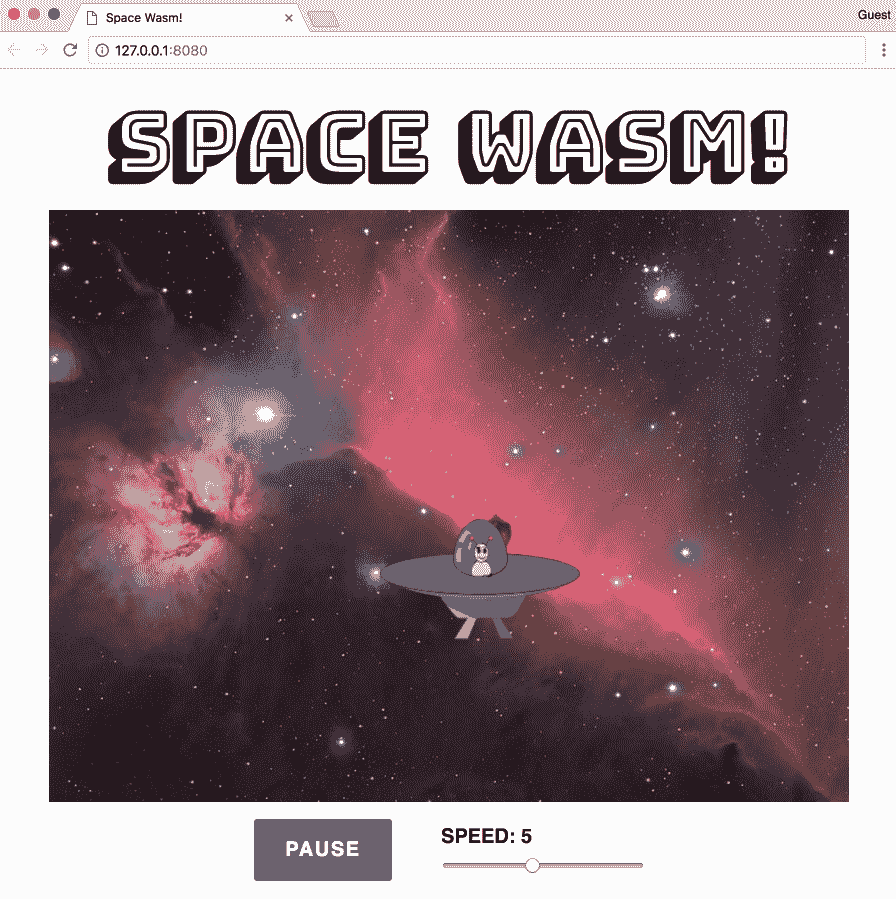

# 第九章：集成 Node.js

现代网络在开发和服务器端管理方面都严重依赖 Node.js。随着越来越复杂的浏览器应用程序执行计算密集型操作的出现，性能提升可以带来极大的好处。在本章中，我们将通过各种示例描述你可以通过使用各种方法将 WebAssembly 集成到 Node.js 中的各种方式。

我们本章的目标是理解以下内容：

+   将 WebAssembly 与 Node.js 集成的优势

+   如何与 Node.js WebAssembly API 交互

+   如何在使用 Webpack 的项目中利用 Wasm 模块

+   如何使用 `npm` 库为 WebAssembly 模块编写单元测试

# 为什么选择 Node.js？

在 第三章，“设置开发环境”中，Node.js 被描述为异步事件驱动的 JavaScript 运行时，这是从官方网站上摘取的定义。然而，Node.js 所代表的，是我们构建和管理网络应用方式的深刻转变。在本节中，我们将讨论 WebAssembly 和 Node.js 之间的关系，以及为什么这两种技术如此完美地互补。

# 无缝集成

Node.js 运行在 Google 的 V8 JavaScript 引擎上，该引擎为 Google Chrome 提供动力。由于 V8 的 WebAssembly 实现遵循 *核心规范*，你可以使用与浏览器相同的 API 与 WebAssembly 模块交互。你不需要为 `.wasm` 文件执行 fetch 调用，而是可以使用 Node.js 的 `fs` 模块将内容读取到缓冲区中，然后在结果上调用 `instantiate()`。

# 补充技术

JavaScript 在服务器端也存在局限性。使用 WebAssembly 的卓越性能可以优化昂贵的计算或处理大量数据。作为一个脚本语言，JavaScript 在自动化简单任务方面表现出色。如果你使用像 `Browsersync` 这样的工具，你可以编写一个脚本来将 C/C++ 编译成 Wasm 文件，将其复制到 `build` 文件夹，并在浏览器中查看更改。

# 使用 npm 进行开发

Node.js 拥有庞大的工具和库生态系统，形式为 `npm`。Sven Sauleau 和开源社区的其它成员创建了 `webassemblyjs`，这是一个用 Node.js 构建的针对 WebAssembly 的工具套件。`webassemblyjs` 网站在 [`webassembly.js.org`](https://webassembly.js.org) 上的标语是 *WebAssembly 工具链*。目前有超过 20 个 `npm` 包用于执行各种任务并辅助开发，例如 ESLint 插件、AST 验证器和格式化工具。AssemblyScript，一个 TypeScript 到 WebAssembly 编译器，允许你编写编译成 Wasm 模块的性能代码，而无需学习 C 或 C++。Node.js 社区显然对 WebAssembly 的成功寄予厚望。

# 服务器端 WebAssembly 与 Express

Node.js 可以以多种方式用于为 WebAssembly 项目增加价值。在本节中，我们将通过一个示例 Node.js 应用程序来展示如何集成 WebAssembly。该应用程序使用 Express 和一些简单的路由来调用编译的 Wasm 模块中的函数。

# 项目概述

该项目重用了我们在 第七章，*从头创建应用程序* (*Cook the Books*) 中构建的应用程序的一些代码，以展示 Node.js 如何与 WebAssembly 一起使用。本节代码位于 `learn-webassembly` 存储库的 `/chapter-09-node/server-example` 文件夹中。我们将直接审查适用于 Node.js 的应用程序的部分。以下结构表示项目的文件结构：

```cpp
├── /lib
│    └── main.c
├── /src
|    ├── Transaction.js
|    ├── /assets
|    │   ├── db.json
|    │   ├── main.wasm
|    │   └── memory.wasm
|    ├── assign-routes.js
|    ├── index.js
|    └── load-assets.js
├── package.json
├── package-lock.json
└── requests.js
```

关于依赖项，应用程序使用 `express` 和 `body-parser` 库来设置路由并解析请求体的 JSON。对于数据管理，它使用 `lowdb`，这是一个提供读取和更新 JSON 文件方法的库。JSON 文件位于 `/src/assets/db.json`，包含从 Cook the Books 数据集略微修改后的数据。我们使用 `nodemon` 来监视 `/src` 文件夹中的更改并自动重新加载应用程序。我们使用 `rimraf` 来管理文件删除。如果未全局安装，该库作为依赖项包含在 第三章，*设置开发环境* 中。最后，`node-fetch` 库允许我们在测试应用程序时使用 fetch API 发送 HTTP 请求。

为了简化 JavaScript 和 C 文件中的功能，将 `rawAmount` 和 `cookedAmount` 字段替换为单个 `amount` 字段，而 `category` 字段现在是 `categoryId`，它映射到 `db.json` 中的 `categories` 数组。

# Express 配置

应用程序加载在 `/src/index.js` 中。此文件的如下所示：

```cpp
const express = require('express');
const bodyParser = require('body-parser');
const loadAssets = require('./load-assets');
const assignRoutes = require('./assign-routes');

// If you preface the npm start command with PORT=[Your Port] on
// macOS/Ubuntu or set PORT=[Your Port] on Windows, it will change the port
// that the server is running on, so PORT=3001 will run the app on
// port 3001:
const PORT = process.env.PORT || 3000;

const startApp = async () => {
  const app = express();

  // Use body-parser for parsing JSON in the body of a request:
  app.use(bodyParser.urlencoded({ extended: true }));
  app.use(bodyParser.json());

  // Instantiate the Wasm module and local database:
  const assets = await loadAssets();

  // Setup routes that can interact with Wasm and the database:
  assignRoutes(app, assets);

  // Start the server with the specified port:
  app.listen(PORT, (err) => {
    if (err) return Promise.reject(err);
    return Promise.resolve();
  });
};

startApp()
  .then(() => console.log(`Server is running on port ${PORT}`))
  .catch(err => console.error(`An error occurred: ${err}`));
```

此文件设置了一个新的 Express 应用程序，添加了 `body-parser` 中间件，加载了模拟数据库和 Wasm 实例，并分配了路由。让我们继续讨论在浏览器和 Node.js 中实例化 Wasm 模块的差异。

# 使用 Node.js 实例化 Wasm 模块

Wasm 文件在 `/src/load-assets.js` 中实例化。我们使用 Cook the Books 的 `memory.wasm` 文件，但 `/assets/main.wasm` 文件是从位于 `/lib` 文件夹中的 `main.c` 的一个略微不同的版本编译的。`loadWasm()` 函数执行与 Cook the Books 中的 Wasm 初始化代码相同的操作，但将 `bufferSource` 传递给 `WebAssembly.instantiate()` 的方法不同。让我们通过审查 `load-assets.js` 文件中的 `loadWasm()` 函数的一部分来进一步探讨这一点：

```cpp
const fs = require('fs');
const path = require('path');

const assetsPath = path.resolve(__dirname, 'assets');

const getBufferSource = fileName => {
  const filePath = path.resolve(assetsPath, fileName);
  return fs.readFileSync(filePath); // <- Replaces the fetch() and .arrayBuffer()
};

// We're using async/await because it simplifies the Promise syntax
const loadWasm = async () => {
  const wasmMemory = new WebAssembly.Memory({ initial: 1024 });
  const memoryBuffer = getBufferSource('memory.wasm');
  const memoryInstance = await WebAssembly.instantiate(memoryBuffer, {
    env: {
      memory: wasmMemory
    }
  });
  ...
```

为了阐述差异，以下是一些使用 `fetch` 实例化模块的代码：

```cpp
fetch('main.wasm')
  .then(response => {
    if (response.ok) return response.arrayBuffer();
    throw new Error('Unable to fetch WebAssembly file');
  })
  .then(bytes => WebAssembly.instantiate(bytes, importObj));
```

当使用 Node.js 时，fetch 调用被`fs.readFileSync()`函数替换，并且不再需要`arrayBuffer()`函数，因为`fs.readFileSync()`返回一个可以直接传递给`instantiate()`函数的缓冲区。一旦 Wasm 模块被实例化，我们就可以开始与实例交互。

# 创建模拟数据库

`load-assets.js`文件还包含创建模拟数据库实例的方法：

```cpp
const loadDb = () => {
  const dbPath = path.resolve(assetsPath, 'db.json');
  const adapter = new FileSync(dbPath);
  return low(adapter);
};
```

`loadDb()`函数将`/assets/db.json`的内容加载到`lowdb`的一个实例中。从`load-assets.js`导出的默认函数调用`loadWasm()`和`loadDb()`函数，并返回一个包含模拟数据库和 Wasm 实例的对象：

```cpp
module.exports = async function loadAssets() {
  const db = loadDb();
  const wasmInstance = await loadWasm();
  return {
    db,
    wasmInstance
  };
};
```

今后，我将使用“数据库”一词来指代访问`db.json`文件的`lowdb`实例。现在资产已加载，让我们回顾应用程序如何与它们交互。

# 与 WebAssembly 模块的交互

与数据库和 Wasm 实例的交互发生在`/src`文件夹中的两个文件中：`Transaction.js`和`assign-routes.js`。在我们的示例应用程序中，所有与 API 的通信都是通过 HTTP 请求完成的。向特定端点发送请求将触发服务器上数据库/Wasm 实例的一些交互。让我们首先回顾`Transaction.js`，它直接与数据库和 Wasm 实例交互。

# 在 Transaction.js 中封装交互

就像 Cook the Books 一样，有一个类封装了 Wasm 交互代码，并提供了一个干净的接口。`Transaction.js`的内容与 Cook the Books 中的`/src/store/WasmTransactions.js`的内容非常相似。大部分更改都是为了适应事务记录中存在的`categoryId`和一个单独的`amount`字段（不再有生和熟的数量）。还添加了与数据库交互的功能。例如，这里有一个编辑现有事务的函数，既在数据库中，也在 Wasm 实例的链表中：

```cpp
getValidAmount(transaction) {
  const { amount, type } = transaction;
  return type === 'Withdrawal' ? -Math.abs(amount) : amount;
}

edit(transactionId, contents) {
  const updatedTransaction = this.db.get('transactions')
    .find({ id: transactionId })
    .assign(contents)
    .write();

  const { categoryId, ...transaction } = updatedTransaction;
  const amount = this.getValidAmount(transaction);
  this.wasmInstance._editTransaction(transactionId, categoryId, amount);

  return updatedTransaction;
}
```

`edit()`函数使用`contents`参数中的值更新与`transactionId`参数对应的数据库记录。`this.db`是在`load-assets.js`文件中创建的数据库实例。由于`categoryId`字段在`updatedTransaction`记录中可用，我们可以直接将其传递给`this.wasmInstance._editTransaction()`。它是在创建`Transaction`的新实例时传递给构造函数的。

# assign-routes.js 中的事务操作

`assign-routes.js` 文件定义了路由并将其添加到在 `index.js` 中创建的 `express` 实例（`app`）。在 Express 中，路由可以直接在 `app` 上定义（例如，`app.get()`），或者通过使用 `Router`。在这种情况下，使用 `Router` 向相同的路由路径添加了多个方法。以下代码来自 `assign-routes.js` 文件，创建了一个 `Router` 实例并添加了两个路由：一个返回所有交易的 `GET` 路由，以及一个创建新交易的 `POST` 路由：

```cpp
module.exports = function assignRoutes(app, assets) {
  const { db, wasmInstance } = assets;
  const transaction = new Transaction(db, wasmInstance);
  const transactionsRouter = express.Router();

  transactionsRouter
    .route('/')
    .get((req, res) => {
      const transactions = transaction.findAll();
      res.status(200).send(transactions);
    })
    .post((req, res) => {
      const { body } = req;
      if (!body) {
        return res.status(400).send('Body of request is empty');
      }
      const newRecord = transaction.add(body);
      res.status(200).send(newRecord);
    });

  ...

  // Set the base path for all routes on transactionsRouter:
  app.use('/api/transactions', transactionsRouter);
}
```

摘要中的 `app.use()` 函数指定了所有定义在 `transactionsRouter` 实例上的路由都以前缀 `/api/transactions` 开头。如果你在本地端口 `3000` 上运行应用，你可以在浏览器中导航到 `http://localhost:3000/api/transactions` 并看到所有交易的 JSON 格式数组。

如您从 `get()` 和 `post()` 函数的主体中看到的，与任何交易记录的交互都被委派给了第 `3` 行创建的 `Transaction` 实例。这完成了我们对代码库相关部分的审查。每个文件都包含描述文件功能及目的的注释，因此你可能想在继续下一部分之前先查看这些注释。在下一部分，我们将构建、运行并交互应用。

# 构建和运行应用

在我们构建和测试项目之前，你需要安装 `npm` 依赖。在 `/server-example` 文件夹内打开终端，并运行以下命令：

```cpp
npm install
```

完成这些后，你就可以继续构建步骤了。

# 构建应用

对于这个应用，构建指的是使用 `emcc` 命令将 `lib/main.c` 编译成 `.wasm` 文件。由于这是一个 Node.js 项目，我们可以在 `package.json` 文件中的 `scripts` 键下定义任务。你仍然可以使用 VS Code 的任务功能，因为它会自动检测 `package.json` 文件中的脚本，并在你从菜单中选择任务 | 运行任务...时，在任务列表中显示它们。以下代码包含此项目 `package.json` 文件中 `scripts` 部分的内容：

```cpp
"scripts": {
  "prebuild": "rimraf src/assets/main.wasm",
  "build": "emcc lib/main.c -Os -s WASM=1 -s SIDE_MODULE=1
           -s BINARYEN_ASYNC_COMPILATION=0 -s ALLOW_MEMORY_GROWTH=1
           -o src/assets/main.wasm",
  "start": "node src/index.js",
  "watch": "nodemon src/* --exec 'npm start'"
},
```

为了显示目的，`build` 脚本被拆分成了多行，所以你需要将这些行合并以生成有效的 JSON。`prebuild` 脚本会移除现有的 Wasm 文件，而 `build` 脚本会使用所需的标志运行 `emcc` 命令来编译 `lib/main.c` 并将结果输出到 `src/assets/main.wasm`。要运行脚本，请在 `/server-example` 文件夹内打开终端，并运行以下命令：

```cpp
npm run build
```

如果 `/src/assets` 文件夹中包含名为 `main.wasm` 的文件，则构建成功完成。如果发生错误，终端应提供错误描述以及堆栈跟踪。

你可以创建 `npm` 脚本来在特定脚本之前或之后运行，通过创建具有相同名称的条目，并在其前缀中添加 `pre` 或 `post`。例如，如果你想在一个名为 `build` 的脚本完成后运行一个脚本，你可以创建一个名为 `"postbuild"` 的脚本，并指定你想要运行的命令。

# 启动并测试应用程序

如果你正在修改应用程序或尝试修复错误，可以使用 `watch` 脚本来监视 `/src` 文件夹内容的变化，并在有更改时自动重启应用程序。由于我们只是运行和测试应用程序，我们可以使用 `start` 命令。在终端中，确保你位于 `/server-example` 文件夹内，并运行以下命令：

```cpp
npm start
```

你应该会看到一个消息说“服务器正在端口 3000 上运行”。你现在可以向服务器发送 HTTP 请求。为了测试应用程序，在 `server-example` 目录内打开一个新的终端实例，并运行以下命令：

```cpp
node ./requests.js 1
```

这应该会记录 `/api/transactions` 端点的 `GET` 调用的响应体。`requests.js` 文件包含允许你向所有可用路由发出请求的功能。`getFetchActionForId()` 函数返回一个包含端点和选项值的对象，这与 `assign-routes.js` 文件中的一个路由相对应。`actionId` 是一个任意数字，用于简化测试并减少运行命令时的输入量。例如，你可以运行以下命令：

```cpp
node ./requests.js 5
```

它将记录 *计算机与互联网* 类别所有交易的总额。如果你想获取不同类别的总额，可以向 `node` 命令传递额外的参数。要获取 *保险* 类别所有交易的总额，运行此命令：

```cpp
node ./requests.js 5 3
```

尝试遍历每个请求（总共有八个）。如果你发出一个添加、删除或编辑交易的请求，你应该能在 `/src/assets/db.json` 文件中看到更改。这就是 Node.js 示例项目的全部内容。在下一节中，我们将利用 Webpack 来加载和交互 Wasm 模块。

# 使用 Webpack 的客户端 WebAssembly

Web 应用程序在复杂性和大小上持续增长。仅仅提供一些手写的 HTML、CSS 和 JavaScript 文件对于大型应用程序来说是不切实际的。为了管理这种复杂性，Web 开发者使用打包器来实现模块化、确保浏览器兼容性并减小 JavaScript 文件的大小。在本节中，我们将使用流行的打包器 Webpack，以不使用 `emcc` 的方式利用 Wasm。

# 项目概述

示例 Webpack 应用程序扩展了我们在第五章“编译 C 语言而无需胶水代码”部分中编写的 C 代码的功能，即*创建和加载 WebAssembly 模块*。我们不会展示一个蓝色矩形在红色背景中弹跳，而是展示一个在飞船中弹跳的异形在马头星云中。碰撞检测功能已被修改以适应矩形内的弹跳，因此飞船的运动将是随机的。本节代码位于`learn-webassembly`仓库中的`/chapter-09-node/webpack-example`文件夹中。以下代码显示了项目的文件结构：

```cpp
├── /src
│    ├── /assets
│    │    ├── background.jpg
│    │    └── spaceship.svg
│    ├── App.js
│    ├── index.html
│    ├── index.js
│    ├── main.c
│    └── styles.css
├── package.json
├── package-lock.json
└── webpack.config.js
```

我们将在稍后的部分中回顾 Webpack 配置文件。现在，让我们花点时间更详细地讨论 Webpack。

# 什么是 Webpack？

在过去的几年中，JavaScript 生态系统一直在快速发展，导致新的框架和库不断涌现。打包器作为一种方式出现，使开发者能够将 JavaScript 应用程序拆分为多个文件，而无需担心管理全局命名空间、脚本加载顺序或在 HTML 文件中的极其长的`<script>`标签列表。打包器将所有文件合并为一个，并解决任何命名冲突。

在撰写本文时，Webpack 是前端开发中最受欢迎的打包器之一。然而，它做的不仅仅是合并 JavaScript 文件。它还执行复杂的任务，如代码拆分和树摇（死代码消除）。Webpack 的设计采用了插件架构，这导致了大量社区开发的插件。在`npm`上搜索 Webpack 目前返回超过 12,000 个包！这个插件列表的详尽性，加上其强大的内置功能集，使 Webpack 成为一个完整的构建工具。

# 安装和配置 Webpack

在开始应用程序演示之前，请在`/webpack-example`文件夹中打开一个终端，并运行以下命令：

```cpp
npm install 
```

# 依赖概述

该应用程序使用 Webpack 的版本 4（撰写本文时的最新版本）来构建我们的应用程序。我们需要使用 Webpack 插件来加载应用程序中使用的各种文件类型，并使用 Babel 来利用更新的 JavaScript 功能。以下代码片段列出了我们在项目中使用的`devDependencies`（从`package.json`中获取）：

```cpp
...
"devDependencies": {
  "@babel/core": "⁷.0.0-rc.1",
  "@babel/preset-env": "⁷.0.0-rc.1",
  "babel-loader": "⁸.0.0-beta.4",
  "cpp-wasm-loader": "0.7.7",
  "css-loader": "1.0.0",
  "file-loader": "1.1.11",
  "html-loader": "0.5.5",
  "html-webpack-plugin": "3.2.0",
  "mini-css-extract-plugin": "0.4.1",
  "rimraf": "2.6.2",
  "webpack": "4.16.5",
  "webpack-cli": "3.1.0",
  "webpack-dev-server": "3.1.5"
},
...
```

我为一些库指定了精确的版本，以确保应用程序能够成功构建和运行。任何以`-loader`或`-plugin`结尾的库都是与 Webpack 一起使用的。`cpp-wasm-loader`库允许我们直接导入 C 或 C++文件，而无需先将其编译成 Wasm。Webpack 4 内置了对`.wasm`文件的支持，但你不能指定`importObj`参数，这对于使用 Emscripten 生成的模块是必需的。

# 在 webpack.config.js 中配置加载器和插件

除了 JavaScript 之外，我们还在应用程序中使用了多种不同的文件类型：CSS、SVG、HTML 等。安装 `-loader` 依赖项只是方程的一部分——你还需要告诉 Webpack 如何加载它们。你还需要为安装的任何插件指定配置细节。你可以在项目根目录中的 `webpack.config.js` 文件中指定加载和配置细节。以下片段包含 `/webpack-example/webpack.config.js` 的内容：

```cpp
const HtmlWebpackPlugin = require('html-webpack-plugin');
const MiniCssExtractPlugin = require('mini-css-extract-plugin');

module.exports = {
  module: {
    rules: [
      {
        test: /\.js$/,
        exclude: /node_modules/,
        use: {
          loader: 'babel-loader',
          options: {
            // We need this to use async/await:
            presets: [
              [
                '@babel/preset-env', {
                  targets: { node: '10' }
                }
              ]
            ]
          }
        }
      },
      {
        test: /\.html$/,
        use: {
          loader: 'html-loader',
          options: { minimize: true }
        }
      },
      {
        test: /\.css$/,
        use: [MiniCssExtractPlugin.loader, 'css-loader']
      },
      {
        test: /\.(c|cpp)$/,
        use: {
          loader: 'cpp-wasm-loader',
          options: {
            emitWasm: true
          }
        }
      },
      {
        test: /\.(png|jpg|gif|svg)$/,
        use: {
          loader: 'file-loader',
          options: {
            name: 'assets/[name].[ext]'
          }
        }
      }
    ]
  },
  plugins: [
    new HtmlWebpackPlugin({
      template: './src/index.html',
      filename: './index.html'
    }),
    // This is used for bundling (building for production):
    new MiniCssExtractPlugin({
      filename: '[name].css',
      chunkFilename: '[id].css'
    })
  ]
};
```

`rules` 部分告诉 Webpack 为文件扩展名使用哪个加载器。数组中的第四项处理 C/C++ 文件（注意 `test` 字段值包含 `c|cpp`）。`HtmlWebpackPlugin` 从 `/src/index.html` 中获取内容，添加任何必需的 `<script>` 标签，压缩它，并在 `build` 文件夹中创建一个 `index.html` 文件，默认为 `/dist`。`MiniCssExtractPlugin` 将任何导入的 CSS 复制到 `/dist` 文件夹中的一个单独的 CSS 文件中。我们将在后面的部分中回顾如何构建项目，所以让我们继续到应用程序代码，从 C 文件开始。

# C 语言代码

由于我们可以直接导入 C 和 C++ 文件，C 文件位于 `/src` 文件夹中。这个文件，`main.c`，包含管理碰撞检测和在 `<canvas>` 中移动宇宙飞船的逻辑。代码基于我们在 第五章，“创建和加载 WebAssembly 模块”中创建的 `without-glue.c` 文件。我们不会审查整个文件，只审查已更改且需要解释的部分。让我们从定义和声明部分开始，其中包含一个新的 `struct`：`Bounds`。

# 定义和声明

包含定义和声明部分的代码如下所示：

```cpp
typedef struct Bounds {
  int width;
  int height;
} Bounds;

// We're using the term "Rect" to represent the rectangle the
// image occupies:
typedef struct Rect {
  int x;
  int y;
  int width;
  int height;
  // Horizontal direction of travel (L/R):
  char horizDir;
  // Vertical direction of travel (U/D):
  char vertDir;
} Rect;

struct Bounds bounds;
struct Rect rect;
```

为了适应灵活的大小和跟踪在 *x* 和 *y* 方向上的移动，现有 `Rect` 定义中添加了新属性。我们定义了一个新的 `struct`，`Bounds`，并移除了现有的 `#define` 语句，因为 `<canvas>` 元素不再是具有静态维度的正方形。当模块加载时，这两个元素都会声明一个新的实例。这些实例的尺寸属性在 `start()` 函数中分配，我们将在下一部分介绍。 

# `start()` 函数

更新的 `start()` 函数，它作为模块的入口点，如下所示：

```cpp
EMSCRIPTEN_KEEPALIVE
void start(int boundsWidth, int boundsHeight, int rectWidth,
           int rectHeight) {
    rect.x = 0;
    rect.y = 0;
    rect.horizDir = 'R';
    rect.vertDir = 'D';
    rect.width = rectWidth;
    rect.height = rectHeight;
    bounds.width = boundsWidth;
    bounds.height = boundsHeight;
    setIsRunning(true);
}
```

从 JavaScript 中调用的任何函数都带有 `EMSCRIPTEN_KEEPALIVE` 声明。我们现在将 `Bounds` 和 `Rect` 元素的宽度和高度作为参数传递给 `start()` 函数，并将其分配给局部的 `bounds` 和 `rect` 变量。这使得我们能够轻松地更改任一元素的尺寸，而无需对碰撞检测逻辑进行任何修改。在这个应用程序的上下文中，`rect` 代表飞船图像所在的矩形。我们为 `rect` 设置了默认的水平方向和垂直方向，使得图像最初向右下方移动。接下来，让我们继续查看 `rect` 移动/碰撞检测代码。

# `updateRectLocation()` 函数

与碰撞检测和 `Rect` 移动相关的代码在 `updateRectLocation()` 函数中处理，如下所示：

```cpp
/**
 * Updates the rectangle location by +/- 1px in the x or y based on
 * the current location.
 */
void updateRectLocation() {
    // Determine if the bounding rectangle has "bumped" into either
    // the left/right side or top/bottom side. Depending on which side,
    // flip the direction:
    int xBouncePoint = bounds.width - rect.width;
    if (rect.x == xBouncePoint) rect.horizDir = 'L';
    if (rect.x == 0) rect.horizDir = 'R';

    int yBouncePoint = bounds.height - rect.height;
    if (rect.y == yBouncePoint) rect.vertDir = 'U';
    if (rect.y == 0) rect.vertDir = 'D';

    // If the direction has changed based on the x and y
    // coordinates, ensure the x and y points update
    // accordingly:
    int horizIncrement = 1;
    if (rect.horizDir == 'L') horizIncrement = -1;
    rect.x = rect.x + horizIncrement;

    int vertIncrement = 1;
    if (rect.vertDir == 'U') vertIncrement = -1;
    rect.y = rect.y + vertIncrement;
}
```

与我们在第五章 创建和加载 WebAssembly 模块中编写的代码相比，主要区别在于碰撞检测逻辑。现在，函数不仅跟踪 `rect` 实例的水平位置，并在碰撞到右边界时改变方向，而是跟踪水平和垂直方向，并分别管理它们。虽然这不是最高效的算法，但它确实实现了确保飞船在遇到 `<canvas>` 边缘时改变方向的目标。

# JavaScript 代码

我们在应用程序中使用的唯一生产依赖项是 Vue。尽管应用程序由单个组件组成，但 Vue 使得管理数据、函数和组件生命周期比手动操作要简单得多。`index.js` 文件包含 Vue 初始化代码，而渲染和应用程序逻辑在 `/src/App.js` 中。这个文件有很多部分，所以我们将像上一节那样分块审查代码。让我们从 `import` 语句开始。

# 导入语句

以下代码演示了 Webpack 加载器的实际应用：

```cpp
// This is loaded using the css-loader dependency:
import './styles.css';

// This is loaded using the cpp-wasm-loader dependency:
import wasm from './main.c';

// These are loaded using the file-loader dependency:
import backgroundImage from './assets/background.jpg';
import spaceshipImage from './assets/spaceship.svg';
```

在 `webpack.config.js` 文件中配置的加载器了解如何处理 CSS、C 和图像文件。现在我们已经有了所需的资源，我们可以开始定义我们的组件状态。

# 组件状态

以下代码初始化了组件的 `data()` 函数中的本地状态：

```cpp
export default {
  data() {
    return {
      instance: null,
      bounds: { width: 800, height: 592 },
      rect: { width: 200, height: 120 },
      speed: 5
    };
  },
  ...
```

虽然 `bounds` 和 `rect` 属性从未改变，但我们还是在本地状态中定义了它们，以保持组件使用的所有数据在单个位置。`speed` 属性决定了飞船在 `<canvas>` 中移动的速度，其范围是 `1` 到 `10`。`instance` 属性初始化为 null，但将用于访问编译后的 Wasm 模块的导出函数。接下来，让我们继续查看编译 Wasm 文件并填充 `<canvas>` 的 Wasm 初始化代码。

# Wasm 初始化

编译 Wasm 文件并填充`<canvas>`元素的代码如下所示：

```cpp
methods: {
  // Create a new Image instance to pass into the drawImage function
  // for the <canvas> element's context:
  loadImage(imageSrc) {
    const loadedImage = new Image();
    loadedImage.src = imageSrc;
    return new Promise((resolve, reject) => {
      loadedImage.onload = () => resolve(loadedImage);
      loadedImage.onerror = () => reject();
    });
  },

  // Compile/load the contents of main.c and assign the resulting
  // Wasm module instance to the components this.instance property:
  async initializeWasm() {
    const ctx = this.$refs.canvas.getContext('2d');

    // Create Image instances of the background and spaceship.
    // These are required to pass into the ctx.drawImage() function:
    const [bouncer, background] = await Promise.all([
      this.loadImage(spaceshipImage),
      this.loadImage(backgroundImage)
    ]);

    // Compile the C code to Wasm and assign the resulting
    // module.exports to this.instance:
    const { width, height } = this.bounds;
    return wasm
      .init(imports => ({
        ...imports,
        _jsFillRect(x, y, w, h) {
          ctx.drawImage(bouncer, x, y, w, h);
        },
        _jsClearRect() {
          ctx.drawImage(background, 0, 0, width, height);
        }
      }))
        .then(module => {
          this.instance = module.exports;
          return Promise.resolve();
        });
  },
  ...
```

组件的`methods`键中定义了额外的函数，但目前为止我们将关注将导入的 C 文件编译为 Wasm 的代码。在为飞船和背景图像创建`Image`实例之后，`main.c`文件（以`.wasm`导入）被编译为一个 Wasm 模块，生成的`exports`被分配给`this.instance`。一旦这些操作完成，就可以从导出的 Wasm 模块中调用`start()`函数。由于`initializeWasm()`函数调用`<canvas>`元素的`getContext()`函数，因此组件必须在调用此函数之前挂载。让我们回顾一下`methods`定义的其余部分和`mounted()`事件处理器。

# 组件挂载

剩余的`methods`定义和`mounted()`事件处理器函数如下所示：

```cpp
  ...
  // Looping function to move the spaceship across the canvas.
  loopRectMotion() {
    setTimeout(() => {
      this.instance.moveRect();
      if (this.instance.getIsRunning()) this.loopRectMotion();
    }, 15 - this.speed);
  },
  // Pauses/resumes the spaceship's movement when the button is
  // clicked:
  onActionClick(event) {
    const newIsRunning = !this.instance.getIsRunning();
    this.instance.setIsRunning(newIsRunning);
    event.target.innerHTML = newIsRunning ? 'Pause' : 'Resume';
    if (newIsRunning) this.loopRectMotion();
  }
},
mounted() {
  this.initializeWasm().then(() => {
    this.instance.start(
      this.bounds.width,
      this.bounds.height,
      this.rect.width,
      this.rect.height
    );
    this.loopRectMotion();
  });
},
```

一旦 Wasm 模块编译完成，`start()`函数在`this.instance`上可访问。将`bounds`和`rect`维度传递给`start()`函数，然后调用`loopRectFunction()`以开始移动飞船。`onActionClick()`事件处理器函数根据飞船是否正在移动暂停或恢复其运动。

`loopRectMotion()`函数与第五章中的示例代码相同，即*创建和加载 WebAssembly 模块*，但速度现在是可调节的。决定超时长度的`15 - this.speed`计算可能看起来有点奇怪。由于图像的运动速度基于函数调用之间经过的时间量，增加这个数字实际上会减慢飞船的速度。因此，`this.speed`从`15`中减去，因为`15`略大于`10`，但如果`this.speed`增加到最大值，它不会使飞船变成模糊。这就是组件逻辑的全部内容；让我们继续到代码的渲染部分，其中定义了`template`。

# 组件渲染

决定渲染内容的`template`属性的值如下所示：

```cpp
template: `
  <div class="flex column">
   <h1>SPACE WASM!</h1>
    <canvas
      ref="canvas"
      :height="bounds.height"
      :width="bounds.width">
    </canvas>
    <div class="flex controls">
      <div>
        <button class="defaultText" @click="onActionClick">
          Pause
        </button>
      </div>
    <div class="flex column">
      <label class="defaultText" for="speed">Speed: {{speed}}</label>
      <input
        v-model="speed"
        id="speed"
        type="range"
        min="1"
        max="10"
        step="1">
    </div>
  </div>
</div>

```

由于我们使用 Vue，我们可以将 HTML 元素的属性和事件处理器绑定到我们在组件中定义的属性和方法。除了暂停/恢复按钮外，还有一个范围`<input>`允许你更改速度。通过将其向左或向右滑动，你可以减慢或加快飞船的速度，并立即看到变化。这就完成了我们的回顾；让我们看看 Webpack 如何被用来构建或运行应用程序。

# 构建和运行应用程序

使用`cpp-wasm-loader`库消除了生成 Wasm 模块的构建步骤的需求，但我们仍然需要打包我们的应用以进行分发。在`package.json`的`scripts`部分中，有一个`build`和`start`脚本。运行`build`脚本将执行生成捆绑包的`webpack`命令。为了确保其正常工作，在`/webpack-example`文件夹中打开一个终端实例并运行以下命令：

```cpp
npm run build
```

第一次运行项目时，构建可能需要一分钟。这可以归因于 Wasm 编译步骤。然而，后续的构建应该会快得多。如果构建成功，你应该会看到一个新创建的`/dist`文件夹，其中包含以下内容：

```cpp
├── /assets
│    ├── background.jpg
│    └── spaceship.svg
├── index.html
├── main.css
├── main.js
└── main.wasm
```

# 测试构建

让我们尝试构建以确保一切正常工作。在你的终端实例中运行以下命令以启动应用：

```cpp
serve -l 8080 dist
```

如果你通过浏览器导航到`http://127.0.0.1:8080/index.html`，你应该看到以下内容：



在浏览器中运行的 Webpack 应用

来自[`commons.wikimedia.org/wiki/File:Alien_Spaceship_-_SVG_Vector.svg`](https://commons.wikimedia.org/wiki/File:Alien_Spaceship_-_SVG_Vector.svg)的太空船图像在马头星云背景图像（来自[`commons.wikimedia.org/wiki/File:Horsehead_Nebula_Christmas_2017_Deography.jpg`](https://commons.wikimedia.org/wiki/File:Horsehead_Nebula_Christmas_2017_Deography.jpg)）的范围内弹跳。当按下 PAUSE 按钮时，按钮的标签会变为 RESUME，飞船停止移动。再次按下按钮会将标签变回 PAUSE，飞船将再次开始移动。调整 SPEED 滑块可以增加或减少飞船的速度。

# 运行启动脚本

该应用已安装了`webpack-dev-server`库，它的工作方式类似于`Browsersync`。该库使用 LiveReloading，当你对`/src`目录中的文件进行任何更改时，它会自动更新应用。由于我们使用 Webpack 加载器处理 C 和 C++文件，因此当你更改 C 文件时，也会触发自动更新事件。运行以下命令以启动应用并监视更改：

```cpp
npm start
```

构建完成后，浏览器窗口应自动打开，并直接导向运行中的应用。要查看实时重新加载功能，尝试将`main.c`中的`setIsRunning()`函数中的`isRunning`变量的值设置为 false 而不是`newIsRunning`：

```cpp
EMSCRIPTEN_KEEPALIVE
void setIsRunning(bool newIsRunning) {
    // isRunning = newIsRunning;

    // Set the value to always false:
    isRunning = false;
}
```

飞船应该被卡在左上角。如果你将其改回，飞船将再次开始移动。在下一节中，我们将用 JavaScript 编写单元测试来测试 WebAssembly 模块。

# 使用 Jest 测试 WebAssembly 模块

经过良好测试的代码可以防止回归错误，简化重构，并减轻添加新功能时的一些挫折感。一旦编译了 Wasm 模块，你应该编写测试来确保它按预期工作，即使你为从 C、C++ 或 Rust 编译的代码编写了测试。在本节中，我们将使用 **Jest**，一个 JavaScript 测试框架，来测试编译后的 Wasm 模块中的函数。

# 正在测试的代码

本例中使用的所有代码都位于 `/chapter-09-node/testing-example` 文件夹中。代码和相应的测试非常简单，并不代表真实世界的应用，但它们旨在演示如何使用 Jest 进行测试。以下代码表示 `/testing-example` 文件夹的文件结构：

```cpp
├── /src
|    ├── /__tests__
|    │    └── main.test.js
|    └── main.c
├── package.json
└── package-lock.json
```

我们将要测试的 C 文件的内容，`/src/main.c`，如下所示：

```cpp
int addTwoNumbers(int leftValue, int rightValue) {
    return leftValue + rightValue;
}

float divideTwoNumbers(float leftValue, float rightValue) {
    return leftValue / rightValue;
}

double findFactorial(float value) {
    int i;
    double factorial = 1;

    for (i = 1; i <= value; i++) {
        factorial = factorial * i;
    }
    return factorial;
}
```

文件中的三个函数都在执行简单的数学运算。`package.json` 文件包含一个脚本来编译 C 文件到 Wasm 文件以进行测试。运行以下命令来编译 C 文件：

```cpp
npm run build
```

`/src` 目录中应该有一个名为 `main.wasm` 的文件。让我们继续描述测试配置步骤。

# 测试配置

本例中我们将使用的唯一依赖项是 Jest，这是一个由 Facebook 构建的 JavaScript 测试框架。Jest 是一个出色的测试选择，因为它包含了大多数你需要的开箱即用的功能，如覆盖率、断言和模拟。在大多数情况下，你可以根据应用程序的复杂度进行零配置使用它。如果你有兴趣了解更多，请访问 Jest 的网站 [`jestjs.io`](https://jestjs.io)。在 `/chapter-09-node/testing-example` 文件夹中打开一个终端实例，并运行以下命令来安装 Jest：

```cpp
npm install
```

在 `package.json` 文件中，`scripts` 部分有三个条目：`build`、`pretest` 和 `test`。`build` 脚本使用所需的标志执行 `emcc` 命令，将 `/src/main.c` 编译为 `/src/main.wasm`。`test` 脚本使用 `--verbose` 标志执行 `jest` 命令，为每个测试套件提供额外的详细信息。`pretest` 脚本简单地运行 `build` 脚本，以确保在运行任何测试之前 `/src/main.wasm` 存在。

# 测试文件回顾

让我们遍历位于 `/src/__tests__/main.test.js` 的测试文件，并回顾代码每个部分的用途。测试文件的第一部分实例化了 `main.wasm` 文件，并将结果赋值给局部变量 `wasmInstance`：

```cpp
const fs = require('fs');
const path = require('path');

describe('main.wasm Tests', () => {
  let wasmInstance;

  beforeAll(async () => {
    const wasmPath = path.resolve(__dirname, '..', 'main.wasm');
    const buffer = fs.readFileSync(wasmPath);
    const results = await WebAssembly.instantiate(buffer, {
      env: {
        memoryBase: 0,
        tableBase: 0,
        memory: new WebAssembly.Memory({ initial: 1024 }),
        table: new WebAssembly.Table({ initial: 16, element: 'anyfunc' }),
        abort: console.log
      }
    });
    wasmInstance = results.instance.exports;
  });
 ...
```

Jest 提供了生命周期方法，在运行测试之前执行任何设置或清理操作。你可以指定在所有测试之前或之后运行的功能（`beforeAll()`/`afterAll()`），或者在每次测试之前或之后运行的功能（`beforeEach()`/`afterEach()`）。我们需要一个 Wasm 模块的编译实例，我们可以从中调用导出函数，因此我们将实例化代码放在`beforeAll()`函数中。

我们将整个测试套件包裹在一个`describe()`块中，用于该文件。Jest 使用`describe()`函数来封装一系列相关的测试，使用`test()`或`it()`来表示单个测试。以下是一个简单示例来展示这个概念：

```cpp
const add = (a, b) => a + b;

describe('the add function', () => {
  test('returns 6 when 4 and 2 are passed in', () => {
    const result = add(4, 2);
    expect(result).toEqual(6);
  });

  test('returns 20 when 12 and 8 are passed in', () => {
    const result = add(12, 8);
    expect(result).toEqual(20);
  });
});
```

下一个代码部分包含了所有导出函数的测试套件和测试：

```cpp
...
  describe('the _addTwoNumbers function', () => {
    test('returns 300 when 100 and 200 are passed in', () => {
      const result = wasmInstance._addTwoNumbers(100, 200);
      expect(result).toEqual(300);
    });

    test('returns -20 when -10 and -10 are passed in', () => {
      const result = wasmInstance._addTwoNumbers(-10, -10);
      expect(result).toEqual(-20);
    });
  });

  describe('the _divideTwoNumbers function', () => {
    test.each([
      [10, 100, 10],
      [-2, -10, 5],
    ])('returns %f when %f and %f are passed in', (expected, a, b) => {
      const result = wasmInstance._divideTwoNumbers(a, b);
      expect(result).toEqual(expected);
    });

    test('returns ~3.77 when 20.75 and 5.5 are passed in', () => {
      const result = wasmInstance._divideTwoNumbers(20.75, 5.5);
      expect(result).toBeCloseTo(3.77, 2);
    });
  });

  describe('the _findFactorial function', () => {
    test.each([
      [120, 5],
      [362880, 9.2],
    ])('returns %p when %p is passed in', (expected, input) => {
      const result = wasmInstance._findFactorial(input);
      expect(result).toEqual(expected);
    });
  });
});
```

第一个`describe()`块是为`_addTwoNumbers()`函数设计的，包含两个`test()`实例，以确保该函数返回传入参数的两个数的和。接下来的两个`describe()`块是为`_divideTwoNumbers()`和`_findFactorial()`函数设计的，使用了 Jest 的`.each`功能，允许你使用不同的数据运行相同的测试。`expect()`函数允许你对传入的参数值进行断言。最后一个`_divideTwoNumbers()`测试中的`.toBeCloseTo()`断言检查结果是否在`3.77`的两位小数范围内。其余的则使用`.toEqual()`断言来检查相等性。

使用 Jest 编写测试相对简单，运行它们甚至更简单！让我们尝试运行我们的测试并回顾 Jest 提供的某些 CLI 标志。

# 运行测试

要运行测试，请在`/chapter-09-node/testing-example`文件夹中打开一个终端实例，并运行以下命令：

```cpp
npm test
```

你应该在终端中看到以下输出：

```cpp
main.wasm Tests
  the _addTwoNumbers function
    ✓ returns 300 when 100 and 200 are passed in (4ms)
    ✓ returns -20 when -10 and -10 are passed in
  the _divideTwoNumbers function
    ✓ returns 10 when 100 and 10 are passed in
    ✓ returns -2 when -10 and 5 are passed in (1ms)
    ✓ returns ~3.77 when 20.75 and 5.5 are passed in
  the _findFactorial function
    ✓ returns 120 when 5 is passed in (1ms)
    ✓ returns 362880 when 9.2 is passed in

Test Suites: 1 passed, 1 total
Tests: 7 passed, 7 total
Snapshots: 0 total
Time: 1.008s
Ran all test suites.
```

如果你有很多测试，你可以从`package.json`中的`test`脚本中移除`--verbose`标志，并在需要时才将标志传递给`npm test`命令。你可以将几个其他 CLI 标志传递给`jest`命令。以下列表包含了一些更常用的标志：

+   `--bail`：在第一个失败的测试套件后立即退出测试套件

+   `--coverage`：收集测试覆盖率，并在测试运行后显示在终端中

+   `--watch`：监视文件的变化，并在相关文件更改时重新运行测试

你可以通过在`--`之后添加这些标志来将它们传递给`npm`测试命令。例如，如果你想使用`--bail`标志，你会运行以下命令：

```cpp
npm test -- --bail
```

你可以在官方网站上查看完整的 CLI 选项列表：[`jestjs.io/docs/en/cli`](https://jestjs.io/docs/en/cli)。

# 摘要

在本章中，我们讨论了将 WebAssembly 与 Node.js 集成的优势，并展示了如何在使用服务器和客户端时使用 Node.js。我们评估了一个使用 Wasm 模块对会计交易进行计算的表达式应用。然后，我们回顾了一个基于浏览器的应用，该应用利用 Webpack 从 C 文件中导入和调用函数，而无需编写任何 Wasm 实例化代码。最后，我们看到了如何利用 Jest 测试框架来测试编译后的模块，并确保其正确运行。在第十章，*高级工具和即将推出的功能*中，我们将介绍高级工具并讨论 WebAssembly 即将推出的功能。

# 问题

1.  将 WebAssembly 与 Node.js 集成的一个优点是什么？

1.  Express 应用程序使用哪个库来读取和写入 JSON 文件的数据？

1.  在浏览器和 Node.js 中加载模块有什么区别？

1.  你可以使用什么技术来在现有的 `npm` 脚本之前或之后运行一个 `npm` 脚本？

1.  Webpack 执行的消除死代码的任务叫什么名字？

1.  Webpack 中的加载器有什么作用？

1.  Jest 中的 `describe()` 和 `test()` 函数有什么区别？

1.  你如何向 `npm test` 命令传递额外的 CLI 标志？

# 进一步阅读

+   Express: [`expressjs.com`](https://expressjs.com)

+   Webpack: [`webpack.js.org`](https://webpack.js.org)

+   Jest API: [`jestjs.io/docs/en/api`](https://jestjs.io/docs/en/api)
