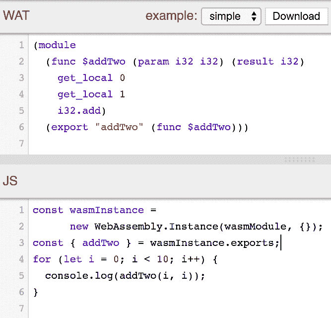
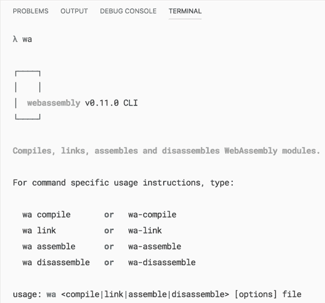
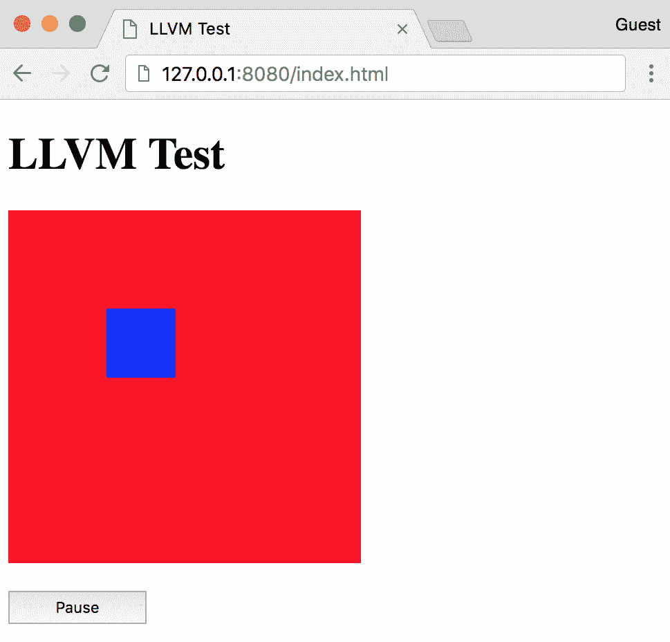
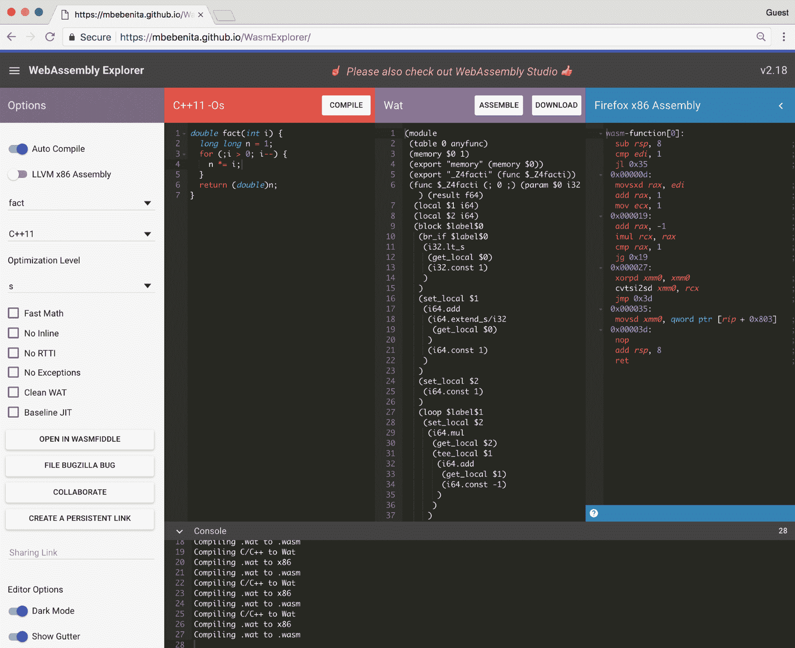
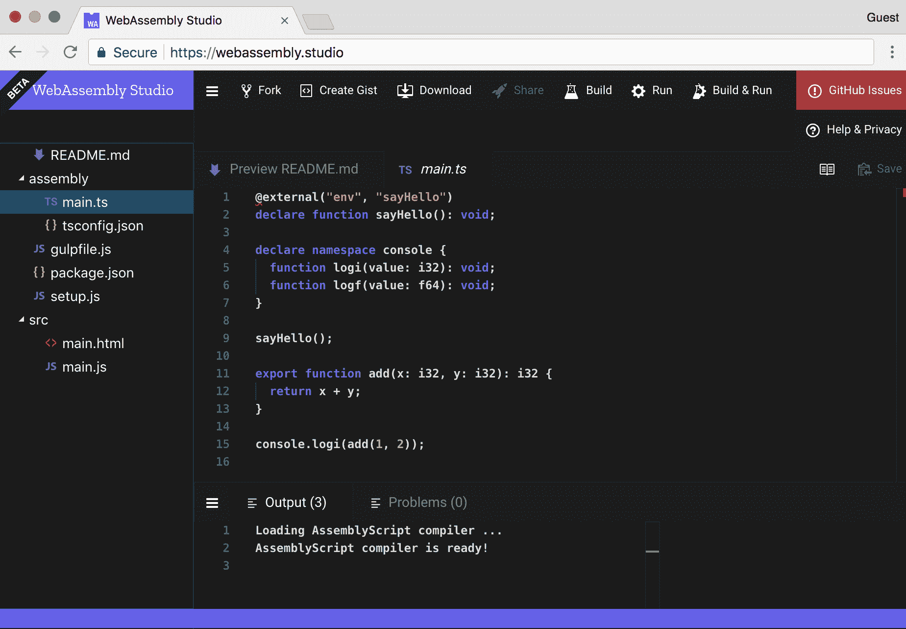
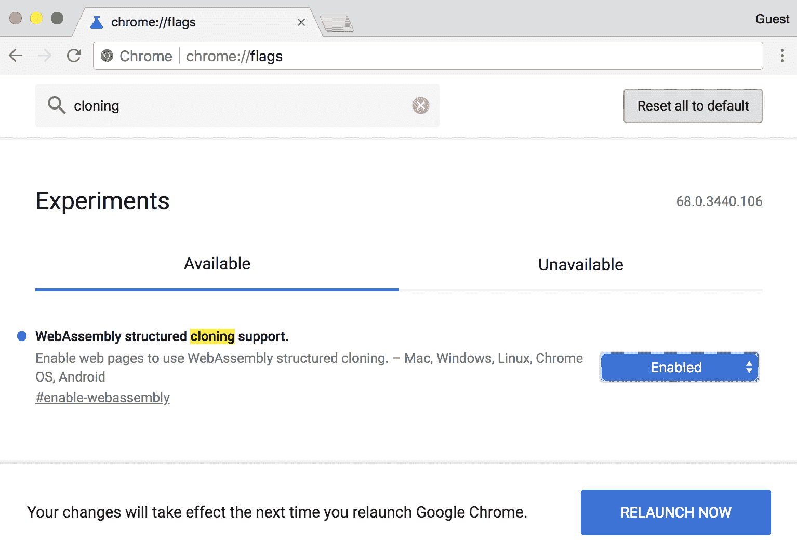
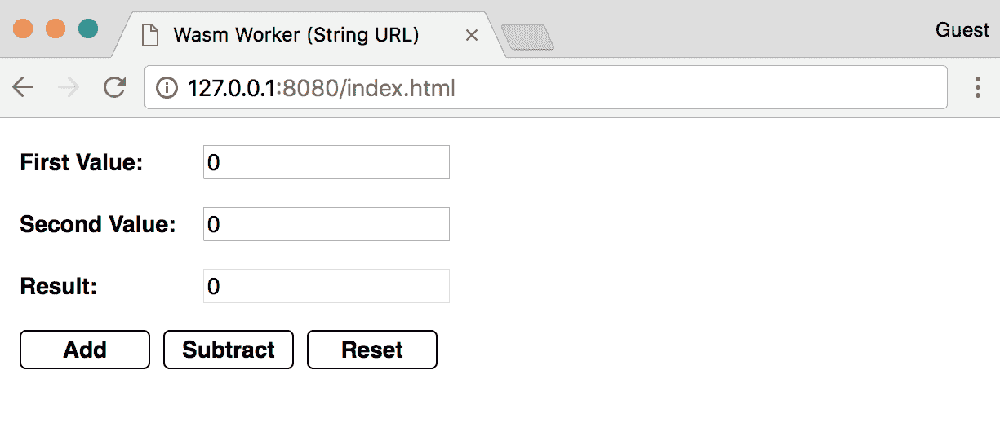
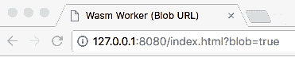
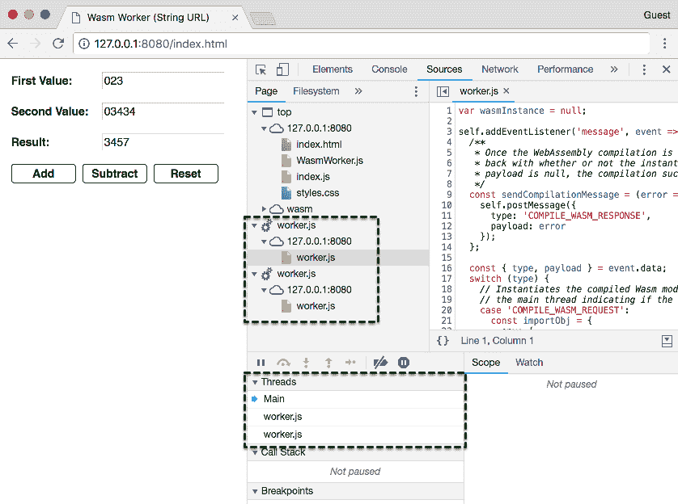
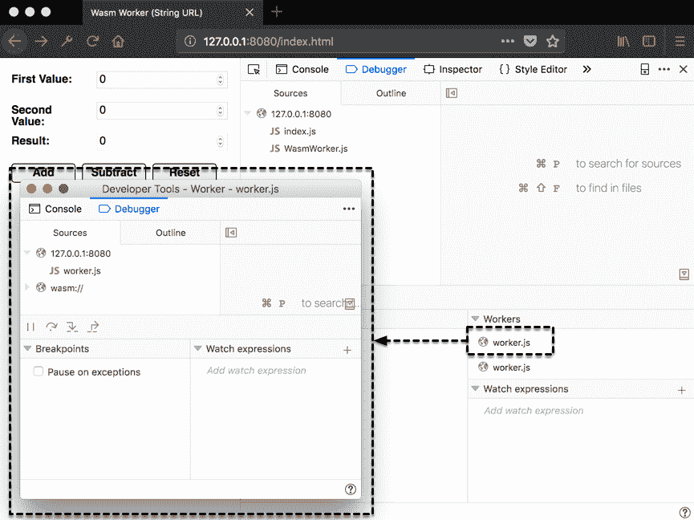

# 第十章：高级工具和即将推出的功能

WebAssembly 的生态系统正在不断增长和演变。开发者们已经看到了 WebAssembly 的潜力。他们构建工具来改善开发体验或从他们选择的语言（尽管存在一些限制）中输出 Wasm 模块。

在本章中，我们将评估使 WebAssembly 运行的底层技术。我们还将回顾您可以在浏览器中使用的工具，并涵盖一个利用 Web Workers 的高级用例。最后，我们将快速回顾 WebAssembly 路线图上的即将推出的功能和提案。

我们本章的目标是理解以下内容：

+   WABT 和 Binaryen 如何融入构建过程以及它们可以用于什么

+   如何使用 LLVM（而不是 Emscripten）编译 WebAssembly 模块

+   在线工具，如 WasmFiddle 和其他在线实用工具

+   如何利用 Web Workers 并行运行 WebAssembly

+   即将集成到 WebAssembly 中的功能（已提出和正在进行）

# WABT 和 Binaryen

WABT 和 Binaryen 允许开发者处理源文件并为 WebAssembly 开发工具。如果您对在较低级别上与 WebAssembly 一起工作感兴趣，这些工具提供了实现这一目标的方法。在本节中，我们将更详细地评估这些工具，并回顾每个工具的目的和能力。

# WABT – WebAssembly 二进制工具包

WABT 的重点是操作 WebAssembly 二进制（`.wasm`）文件和文本（`.wat`）文件，以及两种格式之间的转换。WABT 提供了将 **Wat 转换为 Wasm**（**wat2wasm**）和相反（**wasm2wat**）的工具，以及将 Wasm 文件转换为 C 源文件和头文件的工具（**wasm2c**）。您可以在 WABT GitHub 仓库的 README 文件中查看所有工具的完整列表，网址为 [`github.com/WebAssembly/wabt`](https://github.com/WebAssembly/wabt)。

WABT 的一个示例用例是我们在 第三章 中安装的 *WebAssembly Toolkit for VS Code* 扩展，*设置开发环境*。该扩展依赖于 WABT 来查看与 `.wasm` 文件关联的文本格式。仓库提供了 wat2wasm 和 wasm2wat 演示的链接，您可以使用这些链接来测试 Wat 程序的有效性或使用 JavaScript 与编译后的二进制文件交互。以下截图包含 wat2wasm 演示中的 Wat 和 JavaScript 实例化代码：



从 wat2wasm 的 "simple" 示例中加载 Wat 和 JavaScript 代码

在 JS 面板的第 `3` 行，你可能已经注意到从 `wasmInstance.exports` 中来的 `addTwo()` 函数没有以 `_` 开头。Emscripten 在编译过程中会自动添加 `_`。你可以通过将 `.wasm` 文件转换为 `.wat`，更新函数名称，然后使用 WABT 将其转换回 `.wasm` 来省略 `_`，尽管这不太实用。WABT 简化了将文本格式转换为二进制格式以及相反的过程。如果你想为 WebAssembly 构建编译工具，你会使用 Binaryen，我们将在下一节中介绍。

# Binaryen

Binaryen 的 GitHub 页面 [`github.com/WebAssembly/binaryen`](https://github.com/WebAssembly/binaryen) 将 Binaryen 描述为用 C++ 编写的 WebAssembly 编译器和工具链基础设施库。它的目标是使编译到 WebAssembly 变得简单、快速和有效。它通过提供简单的 C API、内部 IR 和优化器来实现这些目标。就像 WABT 一样，Binaryen 为开发 WebAssembly 工具提供了一套广泛的工具。以下列表描述了 Binaryen 提供的工具子集：

+   **wasm-shell**：能够加载和解释 WebAssembly 的工具

+   **asm2wasm**：将 asm.js 代码编译为 Wasm 模块

+   **wasm2js**：将 Wasm 模块编译为 JavaScript

+   **wasm-merge**：将多个 Wasm 文件合并为一个

+   **wasm.js**：包含 Binaryen 解释器、asm2wasm、Wat 解析器和其他 Binaryen 工具的 JavaScript 库

+   **binaryen.js**：提供 Binaryen 工具链 JavaScript 接口的 JavaScript 库

对于对构建 WebAssembly 工具感兴趣的 JavaScript 开发者来说，wasm.js 和 binaryen.js 工具特别有趣。`binaryen.js` 库作为一个 `npm` 包([`www.npmjs.com/package/binaryen`](https://www.npmjs.com/package/binaryen))提供。

`binaryen.js` 的一个优秀示例是 AssemblyScript ([`github.com/AssemblyScript/assemblyscript`](https://github.com/AssemblyScript/assemblyscript))。AssemblyScript 是 TypeScript 的严格类型子集，可以生成 WebAssembly 模块。该库附带了一个 CLI，可以快速搭建新项目并管理构建步骤。在 *使用 LLVM 编译* 部分中，我们将介绍如何使用 LLVM 编译 Wasm 模块。

# 使用 LLVM 编译

在 第一章，*什么是 WebAssembly？* 中，我们讨论了 Emscripten 的 EMSDK 和 LLVM 之间的关系。Emscripten 使用 LLVM 和 Clang 将 C/C++ 编译成 LLVM 位码。Emscripten 编译器 (`emcc`) 将该位码编译成 asm.js，然后传递给 Binaryen 生成 Wasm 文件。如果你对使用 LLVM 感兴趣，你可以编译 C/C++ 到 Wasm 而不必安装 EMSDK。在本节中，我们将回顾启用 Wasm 编译使用 LLVM 的过程。在将一些示例 C++ 代码编译为 Wasm 文件后，我们将在浏览器中尝试运行它。

# 安装过程

如果你想要使用 LLVM 编译 WebAssembly 模块，需要安装和配置几个工具。将这些工具正确地协同工作可能是一个既困难又耗时的过程。幸运的是，有人费心使这个过程变得更加简单。Daniel Wirtz 创建了一个名为`webassembly`的`npm`包（[`www.npmjs.com/package/webassembly`](https://www.npmjs.com/package/webassembly)），它可以执行以下操作（对应相应的 CLI 命令）：

+   将 C/C++代码编译成 WebAssembly 模块（`wa compile`）

+   将多个 WebAssembly 模块链接成一个（`wa link`）

+   将 WebAssembly 模块反汇编成文本格式（`wa disassemble`）

+   将 WebAssembly 文本格式汇编成模块（`wa assemble`）

库在幕后使用 Binaryen、Clang、LLVM 和额外的 LLVM 工具。我们将全局安装此包以确保我们可以访问`wa`命令。安装时，打开一个终端实例并运行以下命令：

```cpp
npm install -g webassembly
```

安装任何所需的依赖可能需要几分钟时间。一旦完成，运行以下命令以验证安装：

```cpp
wa
```

你应该在终端中看到以下内容：



wa 命令的输出

你应该准备好开始编译 Wasm 模块了。让我们继续到示例代码。

# 示例代码

为了测试编译器，我们将使用第五章“创建和加载 WebAssembly 模块”中“无需胶水代码与 JavaScript 交互”部分的`without-glue.c`文件的略微修改版本。此部分的代码位于`learn-webassembly`仓库的`/chapter-10-advanced-tools/compile-with-llvm`目录中。按照以下说明创建编译器测试所需的文件。让我们从 C++文件开始。

# C++文件

在你的`/book-examples`目录中创建一个名为`/compile-with-llvm`的新目录。在`/compile-with-llvm`目录中创建一个名为`main.cpp`的新文件，并填充以下内容：

```cpp
#include <stdbool.h>

#define BOUNDS 255
#define RECT_SIDE 50
#define BOUNCE_POINT (BOUNDS - RECT_SIDE)

bool isRunning = true;

typedef struct Rect {
  int x;
  int y;
  char direction;
} Rect;

struct Rect rect;

void updateRectLocation() {
    if (rect.x == BOUNCE_POINT) rect.direction = 'L';
    if (rect.x == 0) rect.direction = 'R';
    int incrementer = 1;
    if (rect.direction == 'L') incrementer = -1;
    rect.x = rect.x + incrementer;
    rect.y = rect.y + incrementer;
}

extern "C" {
extern int jsClearRect();
extern int jsFillRect(int x, int y, int width, int height);

__attribute__((visibility("default")))
void moveRect() {
    jsClearRect();
    updateRectLocation();
    jsFillRect(rect.x, rect.y, RECT_SIDE, RECT_SIDE);
}

__attribute__((visibility("default")))
bool getIsRunning() {
    return isRunning;
}

__attribute__((visibility("default")))
void setIsRunning(bool newIsRunning) {
    isRunning = newIsRunning;
}

__attribute__((visibility("default")))
void init() {
    rect.x = 0;
    rect.y = 0;
    rect.direction = 'R';
    setIsRunning(true);
}
}
```

此文件中的代码几乎与第五章“创建和加载 WebAssembly 模块”中`without-glue.c`的内容相同。文件中的注释已被移除，导入/导出函数被包裹在一个`extern "C"`块中。`__attribute__((visibility("default")))`行是宏语句（类似于`EMSCRIPTEN_KEEPALIVE`），确保在死代码消除步骤中函数不会被从编译输出中移除。就像先前的示例一样，我们将通过 HTML 文件与编译后的 Wasm 模块进行交互。让我们创建一个。

# HTML 文件

在`/compile-with-llvm`目录中创建一个名为`index.html`的文件，并填充以下内容：

```cpp
<!doctype html>
<html lang="en-us">
<head>
  <title>LLVM Test</title>
</head>
<body>
  <h1>LLVM Test</h1>
  <canvas id="myCanvas" width="255" height="255"></canvas>
  <div style="margin-top: 16px;">
    <button id="actionButton" style="width: 100px; height: 24px;">
      Pause
    </button>
  </div>
  <script type="application/javascript">
    const canvas = document.querySelector('#myCanvas');
    const ctx = canvas.getContext('2d');

    const importObj = {
      env: {
        memoryBase: 0,
        tableBase: 0,
        memory: new WebAssembly.Memory({ initial: 256 }),
        table: new WebAssembly.Table({ initial: 8, element: 'anyfunc' }),
        abort: console.log,
        jsFillRect: function(x, y, w, h) {
          ctx.fillStyle = '#0000ff';
          ctx.fillRect(x, y, w, h);
        },
        jsClearRect: function() {
          ctx.fillStyle = '#ff0000';
          ctx.fillRect(0, 0, 255, 255);
        }
      }
    };

    WebAssembly.instantiateStreaming(fetch('main.wasm'), importObj)
      .then(({ instance }) => {
        const m = instance.exports;
        m.init();

        const loopRectMotion = () => {
          setTimeout(() => {
            m.moveRect();
            if (m.getIsRunning()) loopRectMotion();
          }, 20)
        };

    document.querySelector('#actionButton')
      .addEventListener('click', event => {
        const newIsRunning = !m.getIsRunning();
        m.setIsRunning(newIsRunning);
        event.target.innerHTML = newIsRunning ? 'Pause' : 'Start';
        if (newIsRunning) loopRectMotion();
      });

      loopRectMotion();
    });
  </script>
</body>
</html>
```

此文件的内容与 第五章 的 `without-glue.html` 文件非常相似，*创建和加载 WebAssembly 模块*。我们不是使用 `/common/load-wasm.js` 文件中的 `loadWasm()` 函数，而是使用 `WebAssembly.instantiateStreaming()` 函数。这允许我们省略一个额外的 `<script>` 元素，并直接从 `/compile-with-llvm` 目录提供文件。

`_` 符号被省略了，在传递给 `importObj` 的 `jsFillRect` 和 `jsClearRect` 函数中。我们也可以省略 `instance.exports` 对象上存在的函数的 `_` 前缀。LLVM 不会在传递进或出模块的数据/函数前加上 `_` 前缀。在下一节中，我们将编译 `main.cpp` 并在浏览器中与之交互。

# 编译和运行示例

我们使用 `-g` 标志安装了 `webassembly npm` 包，所以 `wa` 命令应该在终端中可用。在 `/compile-with-llvm` 目录中打开一个终端实例并运行以下命令：

```cpp
wa compile main.cpp -o main.wasm
```

你应该在 VS Code 的文件资源管理器中 `compile-with-llvm` 文件夹中看到一个名为 `main.wasm` 的文件。为确保 Wasm 模块编译正确，请在 `/compile-with-llvm` 目录下运行以下命令：

```cpp
serve -l 8080
```

如果你浏览到 `http://127.0.0.1:8080/index.html`，你应该会看到以下内容：



浏览器中运行的 LLVM 编译模块

# 在线工具

编译 WebAssembly 模块本地的安装和配置过程，诚然，有些繁琐。幸运的是，有几个在线工具可供你在浏览器中开发和交互 WebAssembly。在本节中，我们将回顾这些工具并讨论每个工具提供的功能。

# WasmFiddle

在 第二章 的 *Connecting the dots with WasmFiddle* 部分，*WebAssembly 元素 - Wat, Wasm 和 JavaScript API*，我们使用 WasmFiddle 将简单的 C 函数编译成 Wasm 并使用 JavaScript 与之交互。WasmFiddle 提供了 C/C++ 编辑器、JavaScript 编辑器、Wat/x86 查看器和 JavaScript 输出面板。如果需要，你也可以与 `<canvas>` 交互。WasmFiddle 使用 LLVM 生成 Wasm 模块，这就是为什么导入和导出没有以 `_` 前缀。你可以在 [`wasdk.github.io/WasmFiddle`](https://wasdk.github.io/WasmFiddle) 与 WasmFiddle 交互。

# WebAssembly 探索器

WebAssembly Explorer，位于[`mbebenita.github.io/WasmExplorer`](https://mbebenita.github.io/WasmExplorer)，提供了与 WasmFiddle 类似的功能。它允许您将 C 或 C++编译成 Wasm 模块并查看相应的 Wat。然而，WebAssembly Explorer 提供了 WasmFiddle 中没有的附加功能。例如，您可以将 C 或 C++编译成 Wasm 并查看相应的 Firefox x86 和 LLVM x86 代码。您可以从代码示例列表中选择并指定优化级别（`emcc`中的`-O`标志）。它还提供了一个按钮，允许您将代码导入 WasmFiddle：



WebAssembly Explorer 的截图

# WebAssembly Studio

WebAssembly Studio，位于[`webassembly.studio`](https://webassembly.studio)，是一个功能丰富的编辑器和开发环境。您可以创建 C、Rust 和 AssemblyScript 项目。它提供了在浏览器内构建和运行代码的能力，并且与 GitHub 集成良好。WebAssembly Studio 使您能够在不本地安装和配置所需的 WebAssembly 工具的情况下构建 Web 应用程序：



WebAssembly Studio 的截图

在下一节中，我们将演示如何使用 Web Workers 将并行性添加到您的 WebAssembly 应用程序中。

# 使用 Web Workers 的并行 Wasm

构建执行大量计算或其他资源密集型工作的复杂应用程序的过程，使用**线程**可以大大受益。线程允许您通过将功能分配给独立运行的任务来并行执行操作。截至撰写本文时，WebAssembly 对线程的支持处于**特性提案**阶段。在这个阶段，规范尚未编写，该功能尚未实现。幸运的是，JavaScript 以 Web Workers 的形式提供了线程功能。在本节中，我们将演示如何使用 JavaScript 的 Web Workers API 与单独线程中的 Wasm 模块交互。

# Web Workers 和 WebAssembly

Web Workers 允许您在浏览器中利用线程，这可以通过将一些逻辑从主（UI）线程卸载来提高应用程序的性能。工作线程也能够使用`XMLHttpRequest`执行 I/O。工作线程通过向事件处理器发送消息与主线程通信。

Web Workers 允许我们将 Wasm 模块加载到单独的线程中，并执行不会妨碍 UI 性能的操作。Web Workers 确实有一些限制。它们无法直接操作 DOM 或访问`window`对象上的一些方法和属性。线程间传递的消息必须是序列化对象，这意味着您不能传递函数。现在您已经知道了什么是工作线程，让我们讨论如何创建一个。

# 创建工作线程

在创建一个工作线程之前，你需要一个包含在工作线程中运行的代码的 JavaScript 文件。你可以在 [`github.com/mdn/simple-web-worker/blob/gh-pages/worker.js`](https://github.com/mdn/simple-web-worker/blob/gh-pages/worker.js) 看到一个简单的工作线程定义文件的示例。该文件应包含一个 `message` 事件监听器，当从其他线程接收到消息时执行操作，并相应地做出响应。

创建该文件后，你就可以使用它与工作线程一起使用了。创建工作线程是通过将 URL 参数传递给 `Worker()` 构造函数来完成的。URL 可以是一个表示包含你的工作线程定义代码的文件名的字符串，或者使用 `Blob` 构造。如果你是从服务器获取工作线程定义代码，`Blob` 技术可能很有用。示例应用程序演示了如何使用这两种方法。让我们继续了解将 WebAssembly 与 Web Workers 集成的过程。

# WebAssembly 的工作流程

为了在单独的线程中利用 Wasm 模块，Wasm 文件必须在主线程中编译并在 Web Worker 中实例化。让我们更详细地回顾这个过程：

1.  使用 `Worker()` 构造函数创建一个新的 Web Worker（我们将称之为 `wasmWorker`）。

1.  发起一个获取 `.wasm` 文件的 fetch 调用，并在响应上调用 `arrayBuffer()` 函数。

1.  `arrayBuffer()` 函数的解析值被传递给 `WebAssembly.compile()` 函数。

1.  `WebAssembly.compile()` 函数解析为一个 `WebAssembly.Module` 实例，该实例包含在通过 `postMessage()` 函数发送到 `wasmWorker` 的消息体中。

1.  在 `wasmWorker` 中，消息体中的 `WebAssembly.Module` 实例被传递给 `WebAssembly.instantiate()` 函数，该函数解析为一个 `WebAssembly.Instance`。

1.  `WebAssembly.Instance` 导出对象被分配给 `wasmWorker` 中的一个局部变量，并用于调用 Wasm 函数。

要从 `wasmWorker` Wasm 实例调用函数，你需要向工作线程发送一个消息，其中包含传递给 Wasm 函数的任何参数。然后，`wasmWorker` 执行该函数并将结果传回主线程。这就是在 Web Workers 的上下文中利用线程的核心。在我们继续到示例应用程序之前，你可能需要解决 Google Chrome 强加的限制。按照 *Google Chrome 限制* 部分的说明，确保示例应用程序能够成功运行。

# Google Chrome 的限制

Google Chrome 对 Web Worker 的 `postMessage()` 函数体中可以包含的内容有限制。如果您尝试向工人发送编译后的 `WebAssembly.Module`，您将得到一个错误，并且操作将不会成功。您可以通过设置一个标志来覆盖这个限制。要启用此功能，打开 Google Chrome 并在地址栏中输入 `chrome://flags`。在页面顶部的搜索框中输入 `cloning`。您应该会看到一个标题为 WebAssembly structured cloning support 的列表项。从列表项旁边的下拉菜单中选择“启用”选项，并在提示时按“立即重新启动”按钮：



更新 Google Chrome 中的 WebAssembly 标志

Chrome 重新启动后，您可以无问题地运行示例应用程序。如果您使用 Mozilla Firefox，则无需采取任何行动。它默认支持此功能。让我们继续到演示在线程中使用 WebAssembly 的示例应用程序。

# 代码概述

示例应用程序并不是一个真正的应用程序。它是一个简单的表单，接受两个输入值，并返回这两个值的和或差。加法和减法操作分别从在工人线程中实例化的自己的 Wasm 模块中导出。这个例子可能有些牵强，但它有效地展示了如何将 WebAssembly 集成到 Web Workers 中。

本节代码位于 `learn-webassembly` 仓库的 `/chapter-10-advanced-tools/parallel-wasm` 目录中。以下各节将逐一介绍代码库的各个部分，并描述如何从头开始构建应用程序。如果您想跟上来，请在您的 `/book-examples` 目录中创建一个名为 `/parallel-wasm` 的文件夹。

# C 代码

示例使用两个工作线程：一个用于加法，另一个用于减法。因此，我们需要两个独立的 Wasm 模块。在您的 `/parallel-wasm` 目录中创建一个名为 `/lib` 的文件夹。在 `/lib` 目录中，创建一个名为 `add.c` 的文件，并填充以下内容：

```cpp
int calculate(int firstVal, int secondVal) {
    return firstVal + secondVal;
}
```

在 `/lib` 中创建另一个名为 `subtract.c` 的文件，并填充以下内容：

```cpp
int calculate(int firstVal, int secondVal) {
    return firstVal - secondVal;
}
```

注意，两个文件中的函数名都是 `calculate`。这样做是为了我们不需要在工人代码中编写任何条件逻辑来确定要调用的 Wasm 函数。代数运算与一个工人相关联，所以当我们需要添加两个数字时，`_calculate()` 函数将在 `addWorker` 中被调用。当我们回顾代码的 JavaScript 部分，这将会更加清晰，我们将在下一部分进行介绍。

# JavaScript 代码

在我们深入研究 JavaScript 代码之前，在您的 `/parallel-wasm` 目录中创建一个名为 `/src` 的文件夹。让我们从运行在工作线程中的代码文件开始。

# 在 worker.js 中定义线程执行

在 `/src` 目录中创建一个新文件名为 `worker.js`，并填充以下内容：

```cpp
var wasmInstance = null;

self.addEventListener('message', event => {
  /**
   * Once the WebAssembly compilation is complete, this posts a message
   * back with whether or not the instantiation was successful. If the
   * payload is null, the compilation succeeded.
   */
  const sendCompilationMessage = (error = null) => {
    self.postMessage({
      type: 'COMPILE_WASM_RESPONSE',
      payload: error
    });
  };

  const { type, payload } = event.data;
  switch (type) {
    // Instantiates the compiled Wasm module and posts a message back to
    // the main thread indicating if the instantiation was successful:
    case 'COMPILE_WASM_REQUEST':
      const importObj = {
        env: {
          memoryBase: 0,
          tableBase: 0,
          memory: new WebAssembly.Memory({ initial: 256 }),
          table: new WebAssembly.Table({ initial: 2, element: 'anyfunc' }),
          abort: console.log
        }
      };

      WebAssembly.instantiate(payload, importObj)
        .then(instance => {
          wasmInstance = instance.exports;
          sendCompilationMessage();
        })
        .catch(error => {
          sendCompilationMessage(error);
        });
      break;

    // Calls the `calculate` method associated with the instance (add or
    // subtract, and posts the result back to the main thread:
    case 'CALC_REQUEST':
      const { firstVal, secondVal } = payload;
      const result = wasmInstance._calculate(firstVal, secondVal);

      self.postMessage({
        type: 'CALC_RESPONSE',
        payload: result
      });
      break;

    default:
      break;
  }
}, false);
```

代码被封装在对应工作线程上调用 `postMessage()` 函数时触发的 `message` 事件的事件监听器中（`self.addEventListener(...)`）。当在对应工作线程上调用 `postMessage()` 函数时，事件监听器的回调函数中的 `event` 参数包含一个 `data` 属性，该属性包含消息的内容。应用程序中线程间传递的所有消息都遵循 **Flux Standard Action** （**FSA**）约定。遵循此约定的对象具有 `type` 和 `payload` 属性，其中 `type` 是一个字符串，`payload` 可以是任何类型。您可以在 [`github.com/redux-utilities/flux-standard-action`](https://github.com/redux-utilities/flux-standard-action) 上了解更多关于 FSA 的信息。

您可以使用 `postMessage()` 函数传递任何格式或结构的数据，只要数据是可序列化的即可。

`switch` 语句根据消息的 `type` 值执行操作，该值是一个字符串。如果 `type` 是 `'COMPILE_WASM_REQUEST'`，则使用消息中的 `payload` 和 `importObj` 调用 `WebAssembly.instantiate()` 函数。结果 `exports` 对象被分配给本地变量 `wasmInstance` 以供后续使用。如果 `type` 是 `'CALC_REQUEST'`，则使用 `payload` 对象中的 `firstVal` 和 `secondVal` 值调用 `wasmInstance._calculate()` 函数。计算代码应该能解释为什么函数被命名为 `_calculate()` 而不是 `_add()` 或 `_subtract()`。通过使用一个通用的名称，工作线程不在乎它执行的是哪种操作，它只是调用函数以获取结果。

在这两种情况下，工作线程使用 `postMessage()` 函数将消息发送回主线程。我使用了 `REQUEST`/`RESPONSE` 约定来设置 `type` 属性的值。这允许您快速识别消息的来源线程。来自主线程的消息在 `type` 中以 `_REQUEST` 结尾，而来自工作线程的响应以 `_RESPONSE` 结尾。让我们继续到 WebAssembly 交互代码。

# 在 WasmWorker.js 中与 Wasm 交互

在 `/src` 目录下创建一个名为 `WasmWorker.js` 的新文件，并填充以下内容：

```cpp
/**
 * Web Worker associated with an instantiated Wasm module.
 * @class
 */
export default class WasmWorker {
  constructor(workerUrl) {
    this.worker = new Worker(workerUrl);
    this.listenersByType = {};
    this.addListeners();
  }

  // Add a listener associated with the `type` value from the
  // Worker message:
  addListenerForType(type, listener) {
    this.listenersByType[type] = listener;
  }

  // Add event listeners for error and message handling.
  addListeners() {
    this.worker.addEventListener('error', event => {
      console.error(`%cError: ${event.message}`, 'color: red;');
    }, false);

    // If a handler was specified using the `addListener` method,
    // fire that method if the `type` matches:
    this.worker.addEventListener('message', event => {
      if (
        event.data instanceof Object &&
        event.data.hasOwnProperty('type') &&
        event.data.hasOwnProperty('payload')
      ) {
        const { type, payload } = event.data;
        if (this.listenersByType[type]) {
          this.listenersByTypetype;
        }
      } else {
        console.log(event.data);
      }
    }, false);
  }

  // Fetches the Wasm file, compiles it, and passes the compiled result
  // to the corresponding worker. The compiled module is instantiated
  // in the worker.
  initialize(name) {
    return fetch(`calc-${name}.wasm`)
      .then(response => response.arrayBuffer())
      .then(bytes => WebAssembly.compile(bytes))
      .then(wasmModule => {
        this.worker.postMessage({
          type: 'COMPILE_WASM_REQUEST',
          payload: wasmModule
      });
      return Promise.resolve();
    });
  }

  // Posts a message to the worker thread to call the `calculate`
  // method from the Wasm instance:
  calculate(firstVal, secondVal) {
    this.worker.postMessage({
      type: 'CALC_REQUEST',
        payload: {
        firstVal,
        secondVal
      }
    });
  }
}
```

`WasmWorker` 类管理与 Wasm 文件相关联的工作线程。在 `WasmWorker` 构造函数中，创建一个新的 `Worker` 并为 `error` 和 `message` 事件添加默认事件监听器。`initialize()` 函数获取与 `name` 参数关联的 `.wasm` 文件，编译它，并将结果 `WebAssembly.Module` 实例发送到工作线程以进行实例化。

使用 `addListenerForType()` 函数指定一个 `callback` 函数（`listener`），当消息响应中的 `type` 字段与函数传递给函数的 `type` 参数匹配时执行该函数。这是捕获工作线程中 `_calculate()` 函数结果所必需的。

最后，`WasmWorker`中的`calculate()`函数将`firstVal`和`secondVal`参数（从`<form>`中的`<input>`元素传递进来）发送到工作线程。让我们继续查看应用程序加载代码，看看`WasmWorker`如何与 UI 交互。

# 在`index.js`中加载应用程序

在`/src`目录下创建一个名为`index.js`的新文件，并填充以下内容：

```cpp
import WasmWorker from './WasmWorker.js';

/**
 * If you add ?blob=true to the end of the URL (e.g.
 * http://localhost:8080/index.html?blob=true), the worker will be
 * created from a Blob rather than a URL. This returns the
 * URL to use for the Worker either as a string or created from a Blob.
 */
const getWorkerUrl = async () => {
  const url = new URL(window.location);
  const isBlob = url.searchParams.get('blob');
  var workerUrl = 'worker.js';
  document.title = 'Wasm Worker (String URL)';

  // Create a Blob instance from the text contents of `worker.js`:
  if (isBlob === 'true') {
    const response = await fetch('worker.js');
    const results = await response.text();
    const workerBlob = new Blob([results]);
    workerUrl = window.URL.createObjectURL(workerBlob);
    document.title = 'Wasm Worker (Blob URL)';
  }

  return Promise.resolve(workerUrl);
};

/**
 * Instantiates the Wasm module associated with the specified worker
 * and adds event listeners to the "Add" and "Subtract" buttons.
 */
const initializeWorker = async (wasmWorker, name) => {
  await wasmWorker.initialize(name);
  wasmWorker.addListenerForType('CALC_RESPONSE', payload => {
    document.querySelector('#result').value = payload;
  });

  document.querySelector(`#${name}`).addEventListener('click', () => {
    const inputs = document.querySelectorAll('input');
    var [firstInput, secondInput] = inputs.values();
    wasmWorker.calculate(+firstInput.value, +secondInput.value);
  });
};

/**
 * Spawns (2) workers: one associated with calc-add.wasm and another
 * with calc-subtract.wasm. Adds an event listener to the "Reset"
 * button to clear all the input values.
 */
const loadPage = async () => {
  document.querySelector('#reset').addEventListener('click', () => {
    const inputs = document.querySelectorAll('input');
    inputs.forEach(input => (input.value = 0));
  });

  const workerUrl = await getWorkerUrl();
  const addWorker = new WasmWorker(workerUrl);
  await initializeWorker(addWorker, 'add');

  const subtractWorker = new WasmWorker(workerUrl);
  await initializeWorker(subtractWorker, 'subtract');
};

loadPage()
  .then(() => console.log('%cPage loaded!', 'color: green;'))
  .catch(error => console.error(error));
```

应用程序的入口点是`loadPage()`函数。在我们深入研究工作器初始化代码之前，让我们讨论`getWorkerUrl()`函数。在本节前面，我们了解到你可以将表示文件名或由`Blob`创建的 URL 的字符串传递给`Worker()`构造函数。以下示例代码演示了第一种技术：

```cpp
var worker = new Worker('worker.js');
```

第二种技术演示在`getWorkerUrl()`函数的`if (isBlob === 'true')`块中。如果当前的`window.location`值以`?blob=true`结尾，传递给`Worker()`构造函数的 URL 是由`Blob`创建的。唯一明显的区别是`document.title`的值，它更新以反映 URL 类型。让我们回到`loadPage()`函数，讨论初始化代码。

在`loadPage()`函数中添加到重置按钮的事件监听器后，创建了两个`WasmWorker`实例：`addWorker`和`subtractWorker`。每个工作器作为`wasmWorker`参数传递给`initializeWorker()`函数。在`initializeWorker()`中，调用`wasmWorker.initialize()`函数来实例化 Wasm 模块。调用`wasmWorker.addListenerForType()`函数来设置 Result `<input>`的值为相应工作器中`_calculate()`函数返回的值。最后，为添加或减去`firstVal`和`secondVal` `<input>`值（根据`name`参数）的`<button>`的`click`事件添加事件监听器。JavaScript 代码就到这里。接下来，让我们创建 HTML 和 CSS 文件，然后进行构建步骤。

# 网络资产

我们需要一个 HTML 文件作为应用程序的入口点。在`/src`目录下创建一个名为`index.html`的文件，并填充以下内容：

```cpp
<!DOCTYPE html>
<html>
<head>
  <meta charset="utf-8">
  <title>Wasm Workers</title>
  <link rel="stylesheet" type="text/css" href="styles.css" />
</head>
<body>
  <form class="valueForm">
    <div class="valueForm">
      <label for="firstVal">First Value:</label>
      <input id="firstVal" type="number" value="0" />
    </div>
    <div class="valueForm">
      <label for="secondVal">Second Value:</label>
      <input id="secondVal" type="number" value="0" />
    </div>
    <div class="valueForm">
      <label for="result">Result:</label>
      <input id="result" type="number" value="0" readonly />
    </div>
  </form>
  <div>
    <button id="add">Add</button>
    <button id="subtract">Subtract</button>
    <button id="reset">Reset</button>
  </div>
  <script type="module" src="img/index.js"></script>
</body>
</html>
```

应用程序由一个包含三个`<input>`元素和一个包含三个`<button>`元素的`<form>`组成。前两个`<input>`元素对应于发送到任一工作线程的`payload`中包含的`firstVal`和`secondVal`属性。最后一个`<input>`是只读的，显示操作的结果。

在`<form>`下面的`<button>`元素块对`<input>`值执行操作。前两个`<button>`元素将`<input>`值发送到`addWorker`或`subtractWorker`线程（取决于哪个按钮被按下）。最后一个`<button>`将所有`<input>`值设置为`0`。

应用程序在`</body>`关闭标签之前的最后一行的`<script>`标签中初始化。就像 Cook the Books 一样，`type="module"`属性允许我们使用在新浏览器中可用的`import`/`export`语法。最后，我们需要为应用程序添加一些样式。在`/src`目录中创建一个名为`styles.css`的文件，并填充以下内容：

```cpp
* {
  font-family: sans-serif;
  font-size: 14px;
}

body {
  margin: 16px;
}

form.valueForm {
  display: table;
}

div.valueForm {
  display: table-row;
}

label, input {
  display: table-cell;
  margin-bottom: 16px;
}

label {
  font-weight: bold;
  padding-right: 16px;
}

button {
  border: 1px solid black;
  border-radius: 4px;
  cursor: pointer;
  font-weight: bold;
  height: 24px;
  margin-right: 4px;
  width: 80px;
}

button:hover {
  background: lightgray;
}
```

那是我们需要创建的最后一个文件，但不是运行应用程序所必需的最后一个文件。我们仍然需要从`/lib`目录中的 C 文件生成 Wasm 文件。让我们继续到构建步骤。

# 构建和运行应用程序

代码编写完成后，是时候构建和测试应用程序了。在完成构建步骤后，我们将与运行中的应用程序交互，并回顾如何使用浏览器的发展工具调试 Web Workers。

# 编译 C 文件

我们需要将每个 C 文件编译成单独的`.wasm`文件，这意味着执行编译步骤所需的命令是冗长的。要执行构建，请在你的`/parallel-wasm`目录中打开终端实例并运行以下命令：

```cpp
# First, compile the add.c file: emcc -Os -s WASM=1 -s SIDE_MODULE=1 -s BINARYEN_ASYNC_COMPILATION=0 lib/add.c -o src/calc-add.wasm # Next, compile the subtract.c fileemcc -Os -s WASM=1 -s SIDE_MODULE=1 -s BINARYEN_ASYNC_COMPILATION=0 lib/subtract.c -o src/calc-subtract.wasm
```

你应该在`/src`目录中看到两个新文件：`calc-add.wasm`和`calc-subtract.wasm`。在放置好所需的文件后，是时候测试应用程序了。

# 与应用程序交互

在`/parallel-wasm`目录中打开终端实例并运行以下命令：

```cpp
serve -l 8080 src
```

如果你在浏览器中导航到`http://127.0.0.1:8080/index.html`，你应该看到这个：



在浏览器中运行的 Wasm Workers 应用程序

尝试更改“第一个值”和“第二个值”输入中的值，并按下“加”和“减”按钮。结果输入应该更新为计算结果。如果你导航到`http://127.0.0.1:8080/index.html?blob=true`，传递给`Worker()`构造函数的 URL 参数将使用`Blob`而不是文件名。标签应该更改以反映使用 Blob 技术来构造 URL：



标签标题更新以反映 Blob URL 技术

# 调试 Web Workers

你可以使用浏览器的发展工具设置断点并与工作线程交互。在 Google Chrome 中，打开开发者工具并选择“源”标签。文件列表面板应该包含两个`worker.js`实例。调试器面板包含一个包含`main`线程和两个`worker.js`线程的线程部分。以下截图显示了 Chrome 开发者工具面板中运行应用程序的线程调试元素：



在 Chrome 开发者工具面板中的线程调试工具

在 Firefox 中，工作线程调试是在单独的开发者工具窗口中完成的。要查看实际操作，请打开 Firefox 中的开发者工具并选择调试器面板。在工作者面板中点击一个`worker.js`列表项。应该会出现一个新的开发者工具窗口，与所选的工作者相对应。以下截图显示了从工作者面板中选择的一个`worker.js`实例的单独开发者工具窗口：



Firefox 开发者工具面板中的线程调试工具

在下一节中，我们将讨论 WebAssembly 的一些即将推出的功能。

# 即将推出的功能

有几个即将推出的 WebAssembly 功能处于标准化过程的各个阶段。其中一些比其他功能影响更大，但它们都是宝贵的改进。在本节中，我们将描述标准化过程并回顾一组代表 WebAssembly 能力重大转变的功能。本节的大部分内容参考了 Colin Eberhardt 的博客文章《WebAssembly 的未来 - 查看即将推出的功能和提案》。文章可在[`blog.scottlogic.com/2018/07/20/wasm-future.html`](https://blog.scottlogic.com/2018/07/20/wasm-future.html)找到。

# 标准化过程

WebAssembly W3C 流程文档位于[`github.com/WebAssembly/meetings/blob/master/process/phases.md`](https://github.com/WebAssembly/meetings/blob/master/process/phases.md)，描述了标准化过程的六个阶段（从 0 到 5）。以下列表提供了每个阶段的简要描述：

+   **零阶段：预提案**：WebAssembly **社区组**（**CG**）成员有一个想法，CG 投票决定是否将其移至第一阶段。

+   **第一阶段：功能提案**：预提案过程已成功，在 GitHub 上的 WebAssembly 组织创建了一个存储库来记录该功能。

+   **第二阶段：可用的提案规范文本**：完整的提案规范文本可用，可能的实现已原型化，并添加了测试套件。

+   **第三阶段：实施阶段**：嵌入器实现该功能，存储库更新以包含形式化的修订，规范更新以包含参考解释器中该功能的实现。

+   **第四阶段：标准化功能**：如果有两个或更多 Web 虚拟机和至少一个工具链实现了该功能，则该功能将完全移交给 WebAssembly **工作组**（**WG**）。

+   **第五阶段：功能标准化**：工作组成员已达成共识，该功能已完整。

现在您已经熟悉了与标准化过程相关的阶段，让我们继续讨论线程提案。

# 线程

在上一节中，我们使用了 Web Workers 将 Wasm 模块移动到工作线程中，这使得我们可以在不阻塞主线程的情况下调用 Wasm 函数。然而，在工作线程之间传递消息有性能限制。为了解决这个问题，为 WebAssembly 提出了一种线程特性。

目前处于第一阶段这个提案的详细描述可以在 [`github.com/WebAssembly/threads/blob/master/proposals/threads/Overview.md`](https://github.com/WebAssembly/threads/blob/master/proposals/threads/Overview.md) 找到。根据提案文档，线程特性添加了一种新的共享线性内存类型和一些新的原子内存访问操作。这个提案在范围上相对有限。Eberhardt 在他的博客文章中提供了以下阐述：

“值得注意的是，这个提案没有引入创建线程的机制（这引起了很多争议），相反，这个功能由宿主提供。在浏览器执行 wasm 的上下文中，这将是我们熟悉的 WebWorkers。”

尽管这个特性不允许创建线程，但它为在 JavaScript 中创建的工作线程之间共享数据提供了一种更简单的方法。

# 宿主绑定

也处于第一阶段的宿主绑定提案将解决 WebAssembly 在浏览器中使用时的一个重大限制：DOM 操作。该特性的提案文档 [`github.com/WebAssembly/host-bindings/blob/master/proposals/host-bindings/Overview.md`](https://github.com/WebAssembly/host-bindings/blob/master/proposals/host-bindings/Overview.md) 提供了以下目标列表：

+   **易用性**：允许 WebAssembly 模块创建、传递、调用和操作 JavaScript + DOM 对象

+   **速度**：允许 JS/DOM 或其他宿主调用得到良好优化

+   **平台一致性**：允许使用 WebIDL 来注释 Wasm 导入/导出（通过一个工具）

+   **渐进式**：提供一个可填充的策略

提高 WebAssembly 与 JavaScript 和 Web API 的互操作性将大大简化开发过程。它还将消除 Emscripten 等工具提供的“胶水”代码的需求。

# 垃圾回收

**垃圾回收**（**GC**）提案目前处于第一阶段。我们在第一章的“什么是 WebAssembly？”部分讨论了垃圾回收，[`github.com/WebAssembly/gc/blob/master/proposals/gc/Overview.md`](https://github.com/WebAssembly/gc/blob/master/proposals/gc/Overview.md) 的提案文档提供了对特性的广泛概述，并描述了需要添加到规范中的元素。Eberhardt 在他的博客文章中对提案提供了以下描述：

“这个提案为 WebAssembly 添加了垃圾回收功能。有趣的是，它将不会拥有自己的垃圾回收器，而是将与宿主环境提供的垃圾回收器集成。这很有意义，因为这一提议以及各种其他提议（宿主绑定、引用类型）都是为了改善与宿主的互操作性，使共享状态和调用 API 更加容易。有一个单一的垃圾回收器来管理内存会使这变得更加容易。”

这个功能实现起来需要付出大量的努力，但将其添加到 WebAssembly 中将是值得的。让我们以当前处于实施阶段的特性——引用类型来结束本节。

# 引用类型

引用类型，目前处于第 3 阶段，是宿主绑定和垃圾回收功能的基础。提案文档在 [`github.com/WebAssembly/reference-types/blob/master/proposals/reference-types/Overview.md`](https://github.com/WebAssembly/reference-types/blob/master/proposals/reference-types/Overview.md) 中描述了添加一个新的类型 `anyref`，它可以作为值类型和表元素类型使用。`anyref` 类型允许您将 JavaScript 对象传递给 Wasm 模块。Eberhardt 在他的博客文章中描述了此功能的影响：

“wasm 模块实际上无法通过 anyref 类型对对象做很多事情。更重要的是，该模块正在持有 JS 堆上垃圾回收对象的引用，这意味着在 wasm 执行期间需要对其进行跟踪。这个提案被视为向更重要的垃圾回收提案迈出的一个步骤。”

WebAssembly 还有几个令人兴奋的特性正在开发中。WebAssembly CG 和 WG 正在投入时间和资源，将这些特性变为现实。您可以在 GitHub 上的 WebAssembly 组织页面查看所有提案，网址为 [`github.com/WebAssembly`](https://github.com/WebAssembly)。

# 摘要

在本章中，我们回顾了 WebAssembly 的高级工具和替代编译方法。我们了解了 WABT 和 Binaryen 在 WebAssembly 开发过程中的作用以及它们提供的功能。我们通过使用 WebAssembly `npm` 包编译了 Wasm 模块，并在浏览器中与之交互。我们回顾了在线可用的 WebAssembly 工具，并创建了一个简单的应用程序，该应用程序使用 Web Workers 在单独的线程中存储 Wasm 模块。最后，我们讨论了 WebAssembly 即将推出的功能以及标准化过程。现在，您对 WebAssembly 有更深入的了解，去构建一些东西吧！

# 问题

+   WABT 代表什么？

+   Binaryen 提供了哪三个元素来使编译到 WebAssembly 变得*简单*、*快速*和*有效*？

+   使用 Emscripten 编译的模块与使用 LLVM 编译的模块在 `importObj`/`exports` 方面有什么主要区别？

+   哪个在线工具允许您使用 AssemblyScript？

+   你可以向 `Worker()` 构造函数传递哪两种类型的参数？

+   在主线程和工作线程之间传递消息使用了哪种约定？

+   WebAssembly 标准化过程有多少个阶段？

+   在引用类型特性中定义的新类型叫什么名字？

# 进一步阅读

+   内存管理速成课程: [`hacks.mozilla.org/2017/06/a-crash-course-in-memory-management`](https://hacks.mozilla.org/2017/06/a-crash-course-in-memory-management)

+   MDN 网页工作者 API: [`developer.mozilla.org/en-US/docs/Web/API/Web_Workers_API`](https://developer.mozilla.org/en-US/docs/Web/API/Web_Workers_API)

+   WebAssembly - 网页工作者: [`medium.com/@c.gerard.gallant/webassembly-web-workers-f2ba637c3e4a`](https://medium.com/@c.gerard.gallant/webassembly-web-workers-f2ba637c3e4a)
