# 处理数字和字符串

数字和字符串是任何编程语言的基本类型；所有其他类型都是基于或由这些类型构成的。开发者经常面临诸如在数字和字符串之间转换、解析和格式化字符串、生成随机数等任务。本章专注于提供使用现代 C++ 语言和库功能解决这些常见任务的有用配方。

本章包含的配方如下：

+   理解各种数值类型

+   数值类型的限制和其他属性

+   在数值类型和字符串类型之间进行转换

+   理解各种字符和字符串类型

+   将 Unicode 字符打印到输出控制台

+   生成伪随机数

+   正确初始化伪随机数生成器

+   创建熟成的用户定义文字

+   创建原始用户定义文字

+   使用原始字符串文字避免转义字符

+   创建字符串辅助库

+   使用正则表达式验证字符串的格式

+   使用正则表达式解析字符串内容

+   使用正则表达式替换字符串内容

+   使用 `std::string_view` 而不是常量字符串引用

+   使用 `std::format` 和 `std::print` 格式化和打印文本

+   使用 `std::format` 与用户定义类型

让我们从查看 C++ 编程语言中存在的不同数值类型开始这一章。

# 理解各种数值类型

C++ 编程语言定义了大量的算术类型；这些类型是可以在其上执行算术运算（加法、减法、乘法、除法、取模）的类型。这个类别包括字符、整数和浮点类型。许多这些类型是从 C 编程语言继承的，而有些是在标准最近版本中添加到 C++ 中的。算术类型的一个典型问题是，与许多其他编程语言不同，它们中的大多数没有固定的大小。大小随目标平台而变化，标准只保证最小值。在本配方中，我们将了解各种整数和浮点类型。

## 如何做到这一点...

根据需要表示的值类型，使用可用的数值类型之一：

+   要表示一个整数值（当范围不是特别重要时），使用 `int` 类型。这是默认的基本（有符号）整数类型，通常大小为 32 位，但不保证。你可以用它表示诸如人的年龄、日期中的日、月、年、电影或书籍的评分、集合中的项目数量以及无数其他事物：

    ```cpp
    int age = 42;
    int attendance = 96321; 
    ```

+   当你需要对可能值的范围或内存表示施加限制时，请使用有符号性（`signed`/`unsigned`）和大小（`short`/`long`/`long long`）修饰符。例如，你可能想使用无符号整数来表示不能有负值的值。应避免混合有符号和无符号整数。另一方面，你可能想优化存储某些值的内存使用，例如表示日期的值，在这种情况下，你可以使用至少 16 位的`short int`。如果你需要表示大值，例如文件的大小，你可以使用`unsigned long long int`，它保证至少有 64 位：

    ```cpp
    unsigned int length = 32;
    short year = 2023; // same as short int
    unsigned long long filesize = 3'758'096'384; 
    ```

+   要表示`std::array`索引（不能是负数）、集合（如标准容器）中的元素数量或`sizeof`运算符的结果，请使用`std::size_t`。这是一个至少 16 位的无符号整数类型。标准容器定义了一个成员类型别名`size_type`用于大小和容器的索引，这个类型通常与`std::size_t`同义：

    ```cpp
    std::size_t items = arr.size(); 
    ```

+   要存储指针算术运算的结果，或表示类似于 C 语言的数组索引（可以是负数），请使用`std::ptrdiff_t`。C++标准容器定义了一个成员类型别名`difference_type`来存储迭代器之间的差异，这通常被定义为`std::ptrdiff_t`的同义词。

+   当你需要存储一个需要保证范围的值时，请使用`std::int8_t`、`std::int16_t`、`std::int32_t`或`std::int64_t`类型之一。尽管这些是可选的，但它们在所有现代架构上都是定义好的。

+   当你需要存储非负值或对保证范围内的值执行位操作时，请使用`std::uint8_t`、`std::uint16_t`、`std::uint32_t`或`std::uint64_t`类型之一。

+   当你需要存储一个需要保证范围且同时希望优化访问速度的值时，请使用`std::int_fast8_t`、`std::int_fast16_t`、`std::int_fast32_t`或`std::int_fast64_t`类型（或它们的无符号对应类型）。这些类型在所有目标架构上都是可用的。

+   当你需要存储一个需要保证范围且同时希望优化内存使用的值时，请使用`std::int_least8_t`、`std::int_least16_t`、`std::int_least32_t`或`std::int_least64_t`（或它们的无符号对应类型）。这些类型在所有目标架构上都是可用的。

+   要表示实数，请使用类型 `double`。这是默认的浮点类型，大小为 64 位。名称表明这是一个双精度类型，与单精度类型（使用 32 位）相对，后者通过 `float` 类型实现。还有一个扩展精度类型，称为 `long double`。标准没有指定其实际精度，但要求它至少与 `double` 类型相同。在某些编译器中，这可以是四倍精度（使用 128 位），尽管一些编译器，如 VC++，将其视为等于 `double`：

    ```cpp
    double price = 4.99;
    float temperature = 36.5;
    long double pi = 3.14159265358979323846264338327950288419716939937510L; 
    ```

## 它是如何工作的…

C++ 语言有一个基本整型 `int`，以及可以应用于它的几个修饰符，用于表示符号和大小。类型 `int` 是一个有符号类型，因此 `int` 和 `signed int` 是同一类型。使用 `int` 实际上是可选的，当使用修饰符时。因此，以下类型是等效的：

| **类型** | **等效类型** |
| --- | --- |
| `signed` | `int` |
| `unsigned` | `unsigned int` |
| `short` | `short int` |
| `signed short` | `short int` |
| `signed short int` | `short int` |
| `long` | `long int` |
| `long long` | `long long int` |
| `unsigned short` | `unsigned short int` |
| `unsigned long` | `unsigned long int` |
| `unsigned long long` | `unsigned long long int` |

表 2.1：整型等效

此表未列出所有可能的组合，仅列出几个示例。类型修饰符的顺序未指定；因此，任何顺序都是允许的。以下表列出了表示相同类型的几个类型：

| **类型** | **等效类型** |
| --- | --- |
| `long long unsigned int` | `unsigned long long int` |
| `long unsigned long int` |
| `int long long unsigned` |
| `unsigned long long int` |
| `int long unsigned long` |

表 2.2：带有修饰符的整型等效

尽管顺序未定义，但通常的做法是先使用符号修饰符，然后是大小修饰符，最后是 `int` 类型。因此，前表中左侧列的类型规范形式是 `unsigned long long int`。

无论整型的符号或大小如何，都可能发生称为 *溢出* 或 *下溢* 的过程。溢出发生在尝试存储一个大于该数据类型最大值的值时。下溢发生在相反的情况下，即尝试存储一个小于该数据类型最小值的值时。

让我们考虑 `short` 类型的例子。这是一个可以存储 -32,768 到 32,767 范围内值的有符号整型。如果我们想存储 32,768 会发生什么？由于这个值大于最大值，会发生溢出。十进制的 32,767 在二进制中表示为 01111111 11111111，下一个值是 10000000 00000000，在 16 位表示中是十进制的 -32,768。以下表显示了溢出和下溢的情况：

| **存储的值** | **存储的值** |
| --- | --- |
| -32771 | 32765 |
| -32770 | 32766 |
| -32769 | 32767 |
| -32768 | -32768 |
| … | … |
| 32767 | 32767 |
| 32768 | -32768 |
| 32769 | -32767 |
| 32770 | -32765 |

表 2.3：短整型值溢出和下溢的示例

在以下图像中以不同的形式展示了相同的示例，您可能会觉得更容易理解：

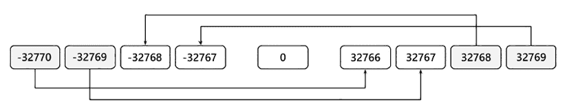

图 2.1：短整型值溢出和下溢的示例

如果我们考虑的是 `unsigned short` 类型而不是 `short`，同样的问题会发生，尽管它们可能更容易理解。`unsigned short` 的范围是 0 到 65,535。尝试存储 65,536 将导致存储的值为 0。同样，尝试存储 65,537 将导致存储的值为 1。这是存储值与数据类型可以存储的值的数量之间的模运算的结果。对于 `unsigned short`，这是 2¹⁶ 或 62,536。对于下溢，结果以类似的方式发生。-1 变为 65,535，-2 变为 65,534，依此类推。这与将负值加到 65,536 然后执行模 65,536 运算相同。溢出和下溢在以下表中显示：

| **要存储的值** | **存储的值** |
| --- | --- |
| -2 | 65534 |
| -1 | 65535 |
| 0 | 0 |
| … | … |
| 65535 | 65535 |
| 65536 | 0 |
| 65537 | 1 |

表 2.4：无符号短整型溢出和下溢的示例

同样，下一个图像展示了相同的价值：

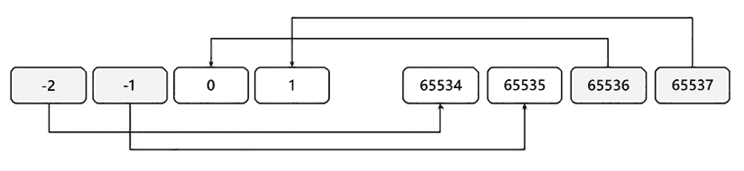

图 2.2：无符号短整型溢出和下溢的示例

C++中整型类型的一个重大问题是它们的大小没有明确规定。唯一明确定义的大小是 `char` 类型（及其 `signed` 和 `unsigned` 修饰符），它必须是 1。对于其余部分，以下关系适用：

```cpp
1 == sizeof(char) <= sizeof(short) <= sizeof(int) <= sizeof(long) <= sizeof(long long) 
```

实际上，在大多数平台上，`short` 是 16 位的，`int` 和 `long` 都是 32 位的，而 `long long` 是 64 位的。然而，有些平台 `long` 和 `long long` 都是 64 位的，或者 `int` 是 16 位的。为了克服这种异质性，C++11 标准引入了一系列固定宽度的整型类型。这些类型在 `<cstdint>` 头文件中定义，并分为两类：

+   一类可选的类型，可能在某些平台上不可用。这些类型具有它们名称指定的确切位数：

    +   `int8_t` 和 `uint8_t` 是 8 位的

    +   `int16_t` 和 `uint16_t` 是 16 位的

    +   `int32_t` 和 `uint32_t` 是 32 位的

    +   `int64_t` 和 `uint64_t` 是 64 位的

    +   此外，还有 `intptr_t` 和 `uintptr_t`，它们的大小足以存储指向 void 的指针

+   一类强制类型，因此可在所有平台上使用。这些类型又分为两类：

    +   一种针对快速访问进行优化的类型；这些被称为 `int_fastX_t` 和 `uint_fastX_t`，其中 `X` 是 8、16、32 或 64，表示位数。这些类型提供了在特定架构上访问速度最快且宽度至少为 `X` 的整型类型。

    +   一种优化内存消耗的；这些被称为 `int_leastX_t` 和 `uint_leastX_t`，其中 `X` 是 8、16、32 或 64，表示位数。这些类型提供了在特定架构上表示的最小整数类型，但宽度至少为 `X`。

在实践中，大多数编译器将 8 位类型（`int8_t`、`uint8_t`、`int_least8_t`、`uint_least8_t`、`int_fast8_t` 和 `uint_fast8_t`）视为与 `signed char` 和 `unsigned char` 相同。这意味着在不同的系统上，使用它们的程序可能与其他固定宽度整数类型的程序表现不同。以下是一个示例，以演示这一点：

```cpp
std::int8_t x = 42;
std::cout << x << '\n'; // [1] prints *
std::int16_t y = 42;
std::cout << y << '\n'; // [2] prints 42 
```

`x` 和 `y` 都是固定宽度整数类型，并且都被分配了值 42。然而，当将它们的值打印到控制台时，`x` 将被打印为 `*` 而不是 42。但请注意，这并不是一个保证，因为行为是系统相关的。

因此，您可能想要避免使用 8 位固定宽度整数类型，并优先考虑 `int16_t`/`uint16_t` 或快速/最小变体之一。

在编写数值字面量时，您可以使用单引号（`'`）作为数字分隔符。这使得阅读大数字变得更容易，也许可以直观地比较它们。它可以用于十进制、十六进制、八进制和二进制数字，如下面的代码片段所示：

```cpp
auto a = 4'234'871'523ll;        // 4234871523
auto b = 0xBAAD'F00D;            // 3131961357
auto c = 00'12'34;               // 668
auto d = 0b1011'01011'0001'1001; // 46361 
```

在确定数值时，数字分隔符被忽略，因此它们的位置无关紧要。这意味着您可以在没有产生错误的情况下以没有实际意义的格式编写数字：

```cpp
auto e = 1'2'3'4'5; 
```

## 参见

+   *理解各种字符和字符串类型*，了解不同的字符和字符串类型

# 数值类型的限制和其他属性

有时，有必要知道并使用数值类型（如 `char`、`int` 或 `double`）可以表示的最小和最大值。许多开发者使用标准 C 宏来完成此操作，例如 `CHAR_MIN`/`CHAR_MAX`、`INT_MIN`/`INT_MAX` 和 `DBL_MIN`/`DBL_MAX`。C++ 提供了一个名为 `numeric_limits` 的类模板，它为每个数值类型提供了特化，这使得您可以查询类型的最大和最小值。然而，`numeric_limits` 不仅限于该功能，还提供了用于类型属性查询的附加常量，例如类型是否为有符号，它需要多少位来表示其值，是否可以表示浮点类型的无穷大，以及其他许多内容。在 C++11 之前，`numeric_limits<T>` 的使用受到限制，因为它不能用于需要常量的地方（例如数组的大小和 switch 语句）。因此，开发者更喜欢在其代码中使用 C 宏。在 C++11 中，这种情况不再存在，因为 `numeric_limits<T>` 的所有静态成员现在都是 `constexpr`，这意味着它们可以在需要常量表达式的任何地方使用。

## 准备工作

`numeric_limits<T>`类模板在`<limits>`头文件中的`std`命名空间中可用。

## 如何做到这一点...

使用`std::numeric_limits<T>`查询数值类型`T`的各种属性：

+   使用`min()`和`max()`静态方法获取一个类型的最小和最大有限数值。以下是如何使用这些方法的示例：

    ```cpp
    // example 1
    template<typename T, typename Iter>
    T minimum(Iter const start, Iter const end) // finds the
     // minimum value
     // in a range
    {
      T minval = std::numeric_limits<T>::max();
      for (auto i = start; i < end; ++i)
      {
        if (*i < minval)
          minval = *i;
      }
      return minval;
    }
    // example 2
    int range[std::numeric_limits<char>::max() + 1] = { 0 };
    // example 3
    switch(get_value())
    {
      case std::numeric_limits<int>::min():
      // do something
    break;
    } 
    ```

+   使用其他静态方法和静态常量来检索数值类型的其他属性。在以下示例中，`bits`变量是一个`std::bitset`对象，它包含表示变量`n`（它是一个整数）所表示数值所需的位序列：

    ```cpp
    auto n = 42;
    std::bitset<std::numeric_limits<decltype(n)>::digits>
       bits { static_cast<unsigned long long>(n) }; 
    ```

在 C++11 中，`std::numeric_limits<T>`的使用没有限制；因此，在您的现代 C++代码中，最好使用它而不是 C 宏。

## 它是如何工作的...

`std::numeric_limits<T>`类模板允许开发者查询数值类型的属性。实际值通过特化提供，标准库为所有内置数值类型（`char`、`short`、`int`、`long`、`float`、`double`等）提供了特化。此外，第三方可能为其他类型提供额外的实现。一个例子是一个实现`bigint`类型和`decimal`类型并为此类提供`numeric_limits`特化的数值库（例如`numeric_limits<bigint>`和`numeric_limits<decimal>`）。

`<limits>`头文件中提供了以下数值类型的特化。请注意，`char16_t`和`char32_t`的特化是 C++11 中新增的；其他特化之前就已经可用。除了前面列出的特化之外，库还包括这些数值类型每个`cv-qualified`版本的特化，并且它们与无修饰特化相同。例如，考虑类型`int`；有四个实际特化（它们是相同的）：`numeric_limits<int>`、`numeric_limits<const int>`、`numeric_limits<volatile int>`和`numeric_limits<const volatile int>`。您可以在[`en.cppreference.com/w/cpp/types/numeric_limits`](https://en.cppreference.com/w/cpp/types/numeric_limits)找到特化的完整列表。

如前所述，在 C++11 中，`std::numeric_limits`的所有静态成员都是`constexpr`，这意味着它们可以在需要常量表达式的所有地方使用。这相对于 C 宏有几个主要优点：

+   它们更容易记住，因为你只需要知道类型的名称，而这通常是你应该知道的，而不是无数宏的名称。

+   它们支持 C 语言中不可用的类型，例如`char16_t`和`char32_t`。

+   它是唯一可能的解决方案，用于不知道类型的模板。

+   `min` 和 `max` 只是它提供的各种类型属性中的两种；因此，其实际用途超出了显示的数值限制。作为旁注，因此，这个类可能应该被命名为 *numeric_properties*，而不是 `numeric_limits`。

以下函数模板 `print_type_properties()` 打印出类型的最小和最大有限值，以及其他信息：

```cpp
template <typename T>
void print_type_properties()
{
  std::cout
    << "min="
    << std::numeric_limits<T>::min()        << '\n'
    << "max="
    << std::numeric_limits<T>::max()        << '\n'
    << "bits="
    << std::numeric_limits<T>::digits       << '\n'
    << "decdigits="
    << std::numeric_limits<T>::digits10     << '\n'
    << "integral="
    << std::numeric_limits<T>::is_integer   << '\n'
    << "signed="
    << std::numeric_limits<T>::is_signed    << '\n'
    << "exact="
    << std::numeric_limits<T>::is_exact     << '\n'
    << "infinity="
    << std::numeric_limits<T>::has_infinity << '\n';
} 
```

如果我们为 `unsigned` `short`、`int` 和 `double` 调用 `print_type_properties()` 函数，我们将得到以下输出：

| **unsigned short** | **int** | **double** |
| --- | --- | --- |

|

```cpp
min=0
max=65535
bits=16
decdigits=4
integral=1
signed=0
exact=1
infinity=0 
```

|

```cpp
min=-2147483648
max=2147483647
bits=31
decdigits=9
integral=1
signed=1
exact=1
infinity=0 
```

|

```cpp
min=2.22507e-308
max=1.79769e+308
bits=53
decdigits=15
integral=0
signed=1
exact=0
infinity=1 
```

|

表 2.5：`print_type_properties()` 对于 `unsigned short`、`int` 和 `double` 的输出

请注意，`digits` 和 `digits10` 常量之间存在差异：

+   `digits` 代表整数类型（如果存在符号位则不包括）和填充位（如果有）的位数，以及浮点类型尾数的位数。

+   `digits10` 是一个类型可以表示而不改变的小数位数。为了更好地理解这一点，让我们考虑 `unsigned short` 的例子。这是一个 16 位的整数类型。它可以表示从 0 到 65,536 的数字。它可以表示最多五位小数的数字，即从 10,000 到 65,536，但它不能表示所有五位小数的数字，因为从 65,537 到 99,999 的数字需要更多的位。因此，它在不需要更多位的情况下可以表示的最大数字有四位小数（从 1,000 到 9,999）。这就是 `digits10` 所指示的值。对于整数类型，它与常量 `digits` 有直接关系；对于一个整数类型 `T`，`digits10` 的值是 `std::numeric_limits<T>::digits * std::log10(2)`。

值得注意的是，标准库中那些是算术类型别名的类型（例如 `std::size_t`）也可以使用 `std::numeric_limits` 进行检查。另一方面，其他不是算术类型的标准类型，例如 `std::complex<T>` 或 `std::nullptr_t`，并没有 `std::numeric_limits` 特化。

## 相关内容

+   *在数字和字符串类型之间转换*，了解如何将数字和字符串之间进行转换

# 在数字和字符串类型之间转换

数字和字符串类型之间的转换是一种普遍的操作。在 C++11 之前，对将数字转换为字符串以及反向转换的支持很少，因此开发者主要不得不求助于不安全的类型函数，并且他们通常编写自己的实用函数以避免重复编写相同的代码。随着 C++11 的推出，标准库提供了在数字和字符串之间进行转换的实用函数。在本配方中，你将学习如何使用现代 C++标准函数在数字和字符串之间以及相反方向进行转换。

## 准备工作

本配方中提到的所有实用函数都包含在 `<string>` 头文件中。

## 如何做到这一点...

当您需要在不同数字和字符串之间进行转换时，请使用以下标准转换函数：

+   要将整数或浮点类型转换为字符串类型，请使用`std::to_string()`或`std::to_wstring()`，如下面的代码片段所示：

    ```cpp
    auto si = std::to_string(42);      // si="42"
    auto sl = std::to_string(42L);     // sl="42"
    auto su = std::to_string(42u);     // su="42"
    auto sd = std::to_wstring(42.0);   // sd=L"42.000000"
    auto sld = std::to_wstring(42.0L); // sld=L"42.000000" 
    ```

+   要将字符串类型转换为整型类型，请使用`std::stoi()`、`std::stol()`、`std::stoll()`、`std::stoul()`或`std::stoull()`，如下面的代码片段所示：

    ```cpp
    auto i1 = std::stoi("42");                  // i1 = 42
    auto i2 = std::stoi("101010"L, nullptr, 2); // i2 = 42
    auto i3 = std::stoi("052", nullptr, 8);     // i3 = 42
    auto i4 = std::stoi("0x2A"L, nullptr, 16);  // i4 = 42 
    ```

+   要将字符串类型转换为浮点类型，请使用`std::stof()`、`std::stod()`或`std::stold()`，如下面的代码片段所示：

    ```cpp
    // d1 = 123.45000000000000
    auto d1 = std::stod("123.45");
    // d2 = 123.45000000000000
    auto d2 = std::stod("1.2345e+2");
    // d3 = 123.44999980926514
    auto d3 = std::stod("0xF.6E6666p3"); 
    ```

## 它是如何工作的...

```cpp
int of these two functions:
```

```cpp
std::string to_string(int value);
std::wstring to_wstring(int value); 
```

除了`int`之外，这两个函数还为`long`、`long long`、`unsigned int`、`unsigned long`、`unsigned long long`、`float`、`double`和`long double`提供了重载。

当涉及到相反的转换时，有一整套具有**sto***n*（**字符串到数字**）格式的函数名称，其中*n*代表**i**（`integer`）、**l**（`long`）、**ll**（`long long`）、**ul**（`unsigned long`）或**ull**（`unsigned long long`）。以下列表显示了`stoi`函数及其两个重载——一个接受`std::string`作为第一个参数，另一个接受`std::wstring`作为第一个参数。此外，还有类似的函数称为`stol`、`stoll`、`stoul`、`stoull`、`stof`、`stod`和`stold`：

```cpp
int stoi(const std::string& str, std::size_t* pos = 0, int base = 10);
int stoi(const std::wstring& str, std::size_t* pos = 0, int base = 10); 
```

字符串到整型函数的工作方式是丢弃非空白字符之前的所有空白字符，然后尽可能多地取字符以形成一个有符号或无符号数（根据情况而定），然后将该数转换为请求的整型（`stoi()`将返回`整数`，`stoul()`将返回`unsigned long`，等等）。在所有以下示例中，结果都是整数`42`，除了最后一个示例，其结果是`-42`：

```cpp
auto i1 = std::stoi("42");             // i1 = 42
auto i2 = std::stoi("   42");          // i2 = 42
auto i3 = std::stoi("   42fortytwo");  // i3 = 42
auto i4 = std::stoi("+42");            // i4 = 42
auto i5 = std::stoi("-42");            // i5 = -42 
```

一个有效的整数值可能由以下部分组成：

+   符号，加号（`+`）或减号（`-`）（可选）

+   前缀`0`表示八进制基数（可选）

+   前缀`0x`或`0X`表示十六进制基数（可选）

+   一系列数字

可选的前缀`0`（表示八进制）仅在指定的基数为`8`或`0`时应用。同样，可选的前缀`0x`或`0X`（表示十六进制）仅在指定的基数为`16`或`0`时应用。

将字符串转换为整数的函数有三个参数：

+   输入字符串。

+   一个指针，当它不为空时，将接收已处理的字符数。这可能包括被丢弃的所有前导空白字符、符号和基数前缀，因此不应与整数值的位数混淆。

+   表示基数的数字；默认情况下，这是`10`。

输入字符串中的有效数字取决于基。对于基 `2`，唯一的有效数字是 `0` 和 `1`；对于基 `5`，它们是 `01234`。对于基 `11`，有效数字是 `0`-`9` 和字符 `A` 和 `a`。这继续到基 `36`，它有有效字符 `0`-`9`、`A`-`Z` 和 `a`-`z`。

以下是将具有各种基数数字的字符串转换为十进制整数的额外示例。在所有情况下，结果要么是 `42`，要么是 `-42`：

```cpp
auto i6 = std::stoi("052", nullptr, 8);      // i6 = 42
auto i7 = std::stoi("052", nullptr, 0);      // i7 = 42
auto i8 = std::stoi("0x2A", nullptr, 16);    // i8 = 42
auto i9 = std::stoi("0x2A", nullptr, 0);     // i9 = 42
auto i10 = std::stoi("101010", nullptr, 2); // i10 = 42
auto i11 = std::stoi("22", nullptr, 20);    // i11 = 42
auto i12 = std::stoi("-22", nullptr, 20);  // i12 = -42
auto pos = size_t{ 0 };
auto i13 = std::stoi("42", &pos);      // i13 = 42,  pos = 2
auto i14 = std::stoi("-42", &pos);     // i14 = -42, pos = 3
auto i15 = std::stoi("  +42dec", &pos);// i15 = 42,  pos = 5 
```

需要注意的一个重要事项是，如果转换失败，这些转换函数会抛出异常。可以抛出的有两个异常：

+   如果转换无法执行，将抛出 `std::invalid_argument`：

    ```cpp
    try
    {
      auto i16 = std::stoi("");
    }
    catch (std::exception const & e)
    {
      // prints "invalid stoi argument"
      std::cout << e.what() << '\n';
    } 
    ```

+   如果转换的值超出了结果类型的范围（或者如果底层函数将 `errno` 设置为 `ERANGE`），将抛出 `std::out_of_range`：

    ```cpp
    try
    {
      // OK
    auto i17 = std::stoll("12345678901234");
      // throws std::out_of_range
    auto i18 = std::stoi("12345678901234");
    }
    catch (std::exception const & e)
    {
      // prints "stoi argument out of range"
      std::cout << e.what() << '\n';
    } 
    ```

另一组将字符串转换为浮点型的函数与它们非常相似，只是它们没有用于数值基的参数。有效的浮点值在输入字符串中可能有不同的表示形式：

+   十进制浮点表达式（可选的符号，一串十进制数字，可选的点，可选的 `e` 或 `E`，后跟可选符号的指数）

+   二进制浮点表达式（可选的符号，`0x` 或 `0X` 前缀，一串十六进制数字，可选的点，可选的 `p` 或 `P`，后跟可选符号的指数）

+   无穷大表达式（可选的符号后跟不区分大小写的 `INF` 或 `INFINITY`）

+   一个非数字表达式（可选的符号后跟不区分大小写的 `NAN` 和可能的其他字母数字字符）

除了这些格式之外，当前安装的 C 区域设置支持的额外格式也可能被支持。

以下是将字符串转换为双精度浮点数的各种示例：

```cpp
auto d1 = std::stod("123.45");         // d1 =  123.45000000000000
auto d2 = std::stod("+123.45");        // d2 =  123.45000000000000
auto d3 = std::stod("-123.45");        // d3 = -123.45000000000000
auto d4 = std::stod("  123.45");       // d4 =  123.45000000000000
auto d5 = std::stod("  -123.45abc");   // d5 = -123.45000000000000
auto d6 = std::stod("1.2345e+2");      // d6 =  123.45000000000000
auto d7 = std::stod("0xF.6E6666p3");   // d7 =  123.44999980926514
auto d8 = std::stod("INF");            // d8 = inf
auto d9 = std::stod("-infinity");      // d9 = -inf
auto d10 = std::stod("NAN");           // d10 = nan
auto d11 = std::stod("-nanabc");       // d11 = -nan 
```

在前面以 `0xF.6E6666p3` 的形式看到的浮点基 2 科学记数法不是本食谱的主题。然而，为了清晰理解，这里提供了一个简短的描述，但建议您查阅额外的参考资料以获取详细信息（例如 [`en.cppreference.com/w/cpp/language/floating_literal`](https://en.cppreference.com/w/cpp/language/floating_literal)）。基 2 科学记数法中的浮点常数由几个部分组成：

+   十六进制前缀 `0x`。

+   一个整数部分；在这个例子中，它是 `F`，在十进制中是 15。

+   一个分数部分，在这个例子中是 `6E6666`，或者以二进制形式表示为 `011011100110011001100110`。要将它转换为十进制，我们需要加上二的反幂：`1/4 + 1/8 + 1/32 + 1/64 + 1/128 + ...`。

+   一个后缀，表示 2 的幂；在这个例子中，`p3` 表示 2 的 3 次幂。

十进制等值的值是通过将有效数字（由整数部分和分数部分组成）与基的指数幂相乘得到的。

对于给定的十六进制基数 2 浮点字面量，有效数字是 `15.4312499...`（请注意，第七位之后的数字没有显示），基数是 2，指数是 3。因此，结果是 `15.4212499... * 8`，即 `123.44999980926514`。

## 参见

+   *数值类型的限制和其他属性*，了解最小值和最大值，以及数值类型的其他属性

# 理解各种字符和字符串类型

在之前的菜谱中，我们探讨了各种整型和浮点类型。另一类类型，字符类型，通常是误解和混淆的来源。截至 C++20，C++ 语言中有五种字符数据类型：`char`、`wchar_t`、`char8_t`、`char16_t` 和 `char32_t`。在本菜谱中，我们将探讨这些类型之间的差异以及它们的使用方式。

## 如何做到这一点...

按照以下方式使用可用的字符类型：

+   用于存储 ASCII 字符、拉丁字符集（在 ISO-8859 标准中定义）或 UTF-8 编码字符的单个字节的 `char` 类型：

    ```cpp
    char c = 'C';
    const char* s = "C++";
    std::cout << c <<  s << '\n'; 
    ```

+   使用 Windows API 存储和操作 UTF-16LE 编码字符的 `wchar_t` 类型：

    ```cpp
    wchar_t c = L'Ʃ';
    const wchar_t* s = L"δῆμος";
    std::wcout << c << s << '\n'; 
    ```

+   用于存储 UTF-8 编码码点的单个字节的 `char8_t` 类型：

    ```cpp
    char8_t c = u8'A';
    const char8_t* s = u8"Æthelflæd"; 
    ```

+   用于存储 UTF-16 编码字符的 `char16_t` 类型：

    ```cpp
    char16_t c = u'Æ';
    const char16_t* s = u"Æthelflæd"; 
    ```

+   用于存储 UTF-32 编码字符的 `char32_t` 类型：

    ```cpp
    char32_t c = U'';
    const char32_t* s = U""; 
    ```

## 它是如何工作的...

C++语言早期用于存储字符的内建数据类型是 `char` 类型。这是一个 8 位数据类型，与 `signed char` 和 `unsigned char` 都不同。它不是这两个数据类型中的任何一个的 `typedef`。您可以使用 `std::is_same` 类型特性来测试这一点：

```cpp
std::cout << std::is_same_v<char, signed char> << '\n';   // prints 0
std::cout << std::is_same_v<char, unsigned char> << '\n'; // prints 0 
```

这两行都会打印 0。这意味着您可以对这些三种数据类型中的所有这些进行函数重载，如下面的代码片段所示：

```cpp
void f(char) {}
void f(signed char) {}
void f(unsigned char) {} 
```

标准没有指定 `char` 是有符号类型还是无符号类型。因此，其符号性取决于编译器或目标平台。在 x86 和 x64 系统上，`char` 类型是有符号类型，而在 ARM 上是无符号类型。

`char` 数据类型可以用来存储 ASCII 字符集和其他 8 位拉丁字符集，如 Latin-1、Latin-2、Latin/Cyrillic、Latin Nordic 等。它也可以用来存储多字节字符集的单个字节，最常用的是 Unicode 集的 UTF-8 编码。

为了处理固定宽度的多字节字符集，`wchar_t` 类型在 C++98 中被引入。这也是一个独特的数据类型（不是某些整型类型的 `typedef`）。其大小没有指定，因此也各不相同：在 Windows 上是 2 字节，在 Unix 系统上通常是 4 字节。

这意味着在编写可移植代码时不应使用 `wchar_t`。`wchar_t` 类型主要在 Windows 上使用，它被用于存储 Unicode 字符集的 UTF-16LE 编码的 16 位字符。这是 Windows 操作系统的本地字符集。

在标准的较新版本中，引入了三种新的字符数据类型。在 C++11 中，`char32_t` 和 `char16_t` 被添加来表示 32 位和 16 位宽字符。它们旨在表示 UTF-32 和 UTF-16 编码的 Unicode 字符。尽管它们是各自独特的类型，但它们与 `uint_least32_t` 和 `uint_least16_t` 分别具有相同的大小、符号和对齐。在 C++20 中，添加了 `char8_t` 数据类型。这是旨在存储 UTF-8 代码单元（它们是 8 位的）。`char8_t` 类型是一个独特的 8 位类型，它具有与 `unsigned char` 相同的大小、符号和对齐。

我们可以将所有这些信息总结在以下表格中：

| **类型** | **C++ 标准** | **尺寸（字节）** | **符号** |
| --- | --- | --- | --- |
| `char` | 所有版本 | 1 | 未指定 |
| `wchar_t` | C++98 | 未指定（通常是 2 或 4） | 未指定 |
| `char8_t` | C++20 | 1 | 无符号 |
| `char16_t` | C++11 | 2 | 无符号 |
| `char32_t` | C++11 | 4 | 无符号 |

表 2.6：C++ 字符类型的尺寸和符号总结

`char` 和 `char8_t` 类型的字符串被称为 *窄字符串*，而 `wchar_t`、`char16_t` 和 `char32_t` 类型的字符串被称为 *宽字符串*。C++ 标准提供了一个用于存储和操作字符序列的容器。这是一个类模板，它定义了几个类型别名以简化使用，如下表所示：

| **类型** | **定义** | **C++ 标准** |
| --- | --- | --- |
| `std::string` | `std::basic_string<char>` | C++98 |
| `std::wstring` | `std::basic_string<wchar_t>` | C++98 |
| `std::u8string` | `std::basic_string<char8_t>` | C++20 |
| `std::u16string` | `std::basic_string<char16_t>` | C++11 |
| `std::u32string` | `std::basic_string<char32_t>` | C++11 |

表 2.7：std::basic_string 的各种类型别名

与其他标准容器一样，`std::basic_string` 提供了多种成员函数来构建、访问元素、迭代、搜索或对包含的字符序列执行各种操作。特别需要提及的是 `basic_string` 中数据是如何存储的。在 C++11 中，它保证是连续的，就像数组一样。

另一方面，它如何处理字符串终止可能有点令人困惑。让我们通过一个例子来解释它：

```cpp
std::string s = "demo"; 
```

存储在 `basic_string` 对象中的元素是字符 `'d'` `'`，`'e'` `'`，`'m'` `'` 和 `'o'` `'`。这是如果你遍历对象（例如，`for (auto c : s)`）时得到的结果。`size()` 成员将返回 4。然而，`c_str()` 和 `data()` 成员函数都将返回一个空终止符。这意味着 `s[s.size()]` 保证是 0。

字符串通常以文字形式在源代码中提供。不同的字符类型有不同的前缀，如下表所示：

| **文字** | **C++ 标准** | **字符类型** | **字符串类型** |
| --- | --- | --- | --- |
| 无 | 所有版本 | `char` | `const char*` |
| `L` | C++98 | `wchar_t` | `const wchar_t*` |
| `u8` | C++11 | `char`（直到 C++20）`char8_t`（自 C++20） | `const char*`（直到 C++20）`const char8_t*`（自 C++20） |
| `u` | C++11 | `char16_t` | `const char16_t*` |
| `U` | C++11 | `char32_t` | `const char32_t*` |

表 2.8：不同字符和字符串类型的前缀

```cpp
auto is used didactically to explain the deduction rules):
```

```cpp
auto c1 = 'a';     // char
auto c2 = L'b';    // wchar_t
auto c3 = u8'c';   // char until C++20, char8_t in C++20
auto c4 = u'd';    // char16_t
auto c5 = U'e';    // char32_t
auto sa1 = "a";    // const char*
auto sa2 = L"a";   // const wchar_t*
auto sa3 = u8"a";  // const char* until C++20
// const char8_t* in C++20
auto sa4 = u"a";   // const char16_t*
auto sa5 = U"a";   // const char32_t* 
```

在第一部分，由于使用了单引号，变量 `c1` 到 `c5` 的字符类型根据字面量前缀（在注释的右侧提到推断出的类型）。在第二部分，由于使用了双引号，变量 `sa1` 到 `sa5` 的类型被推断为字符串类型，同样地，这也取决于字面量前缀。

对于 `"a"` 的推断类型不是 `std::string`，而是 `const char*`。如果您想使用任何 `basic_string` 类型别名，例如 `std::string`，您必须显式定义类型（不要使用 `auto`）或使用在 `std::string_literals` 命名空间中可用的标准用户定义字面量后缀。这将在下一个代码片段中展示：

```cpp
using namespace std::string_literals;
auto s1 = "a"s;    // std::string
auto s2 = L"a"s;   // std::wstring
auto s3 = u8"a"s;  // std::u8string
auto s4 = u"a"s;   // std::u16string
auto s5 = U"a"s;   // std::u32string 
```

为了避免混淆，以下表格解释了各种指针类型的含义：

| **类型** | **含义** |
| --- | --- |
| `char*` | 一个指向可变字符的可变指针。指针和指向的字符都可以被修改。 |
| `const char*` | 一个可变指针指向一个常量字符。指针可以被修改，但指向的位置的内容不能被修改。 |
| `char * const` | 一个指向可变字符的常量指针。指针不能被修改，但指向的位置的内容可以被修改。 |
| `const char * const` | 一个指向常量字符的常量指针。指针和指向的位置的内容都不能被修改。 |
| `char[]` | 字符数组。 |

表 2.9：各种指针类型的含义

您必须已经注意到，在前面的表格中，前缀 `u8` 在不同的标准中有不同的行为：

+   自 C++11 引入以来，直到 C++20，它定义了一个 `char` 字面量。

+   自 C++20 以来，当它通过引入 `char8_t` 被重新定义时，它定义了一个 `char8_t` 字面量。

这个 C++20 的变化是一个破坏性变化。它被优先考虑，而不是引入另一个可能使事情更加复杂的字面量前缀。

字符或字符串字面量可以包含代码点值而不是实际字符。这些必须使用 `\u`（用于 4 个十六进制数字的代码点）或 `\U`（用于 8 个十六进制数字的代码点）进行转义。以下是一个示例：

```cpp
std::u16string hb = u"Harald Bluetooth \u16BC\u16d2"; // 
std::u32string eh = U"Egyptian hieroglyphs \U00013000 \U000131B2"; //  
```

在 C++23 中，可以使用 Unicode 而不是代码点值。这是通过使用 `\N{xxx}` 转义序列来完成的，其中 `xxx` 是 Unicode 分配的名称。因此，上述代码片段在 C++23 中也可以写成以下形式：

```cpp
std::u16string hb = u"Harald Bluetooth \N{Runic Letter Long-Branch-Hagall H}\N{Runic Letter Berkanan Beorc Bjarkan B}";
std::u32string eh = U"Egyptian hieroglyphs \N{EGYPTIAN HIEROGLYPH A001} \N{EGYPTIAN HIEROGLYPH M003A}"; 
```

此外，在 C++23 中，可以使用具有任意数量十六进制数字的代码点值。在先前的示例中，包含埃及象形文字的字符串包含代码点 13000，它有 5 个十六进制数字。然而，由于 `\U` 转义序列需要 8 个十六进制数字，我们不得不包含三个前导零 `(\U00013000)`。在 C++23 中，这不再必要，但需要语法 `\u{n…}`（小写 `u`），其中 `n…` 是任意数量的十六进制数字。因此，此字符串也可以在 C++23 中按以下方式编写：

```cpp
std::u32string eh = U"Egyptian hieroglyphs \u{13000} \u{131B2}"; //  
```

以多种方式将字符和字符串打印到控制台：

+   使用 `std::cout` 和 `std::wcout` 全局对象

+   使用 `printf` 函数族

+   在 C++23 中使用 `std::print` 函数族

+   使用第三方文本处理库，例如广泛使用的 **fmt** 库（它是 C++20 和 C++23 中包含的 `std::format` 和 `std::print` 标准工具的来源）

`std::cout` 和 `std::wcout` 全局对象可用于将 `char`/`const char*`/`std::string` 值和，分别，`wchar_t`/`const wchar_t*`/`std::wstring` 值打印到标准输出控制台。打印 ASCII 字符不会引起问题，但处理其他字符集和编码，如 UTF-8，则更为复杂，因为没有标准支持，不同的平台需要不同的解决方案。你可以在下一配方 *将 Unicode 字符打印到输出控制台* 中了解更多关于这个主题的信息。

## 参见

+   *理解各种数值类型*，了解可用的整数和浮点类型

+   *使用 std::format 和 std::print 格式化和打印文本*，了解如何使用现代工具格式化和打印文本

# 将 Unicode 字符打印到输出控制台

在之前的配方中，*理解各种字符和字符串类型*，我们探讨了用于存储字符和字符串字符的各种数据类型。这种类型的多重性是必要的，因为随着时间的推移，已经开发出了多种字符集。

最广泛使用的字符集是 ASCII 和 Unicode。尽管对前者的支持自语言创建以来一直存在于所有编译器和目标平台上，但后者在 Windows 和 Unix/Linux 系统上的支持以不同的速度和形式发展。在本配方中，我们将探讨如何以不同的编码将文本打印到标准输出控制台。

## 如何做到这一点…

要将文本写入标准输出控制台，你可以使用以下方法：

+   对于 ASCII 字符的写入，使用 `std::cout`：

    ```cpp
    std::cout << "C++\n"; 
    ```

+   对于在 Linux 上写入 UTF-8 编码的 Unicode 字符，也使用 `std::cout`：

    ```cpp
    std::cout << "Erling Håland\n";
    std::cout << "Thomas Müller\n";
    std::cout << "Στέφανος Τσιτσιπάς\n";
    std::string monkeys = "";
    std::cout << monkeys << '\n'; 
    ```

    对于使用 `char8_t` 数据类型存储的 UTF-8 字符串，你仍然可以使用 `std::cout`，但必须将底层类型重新解释为字符数组：

    ```cpp
    std::cout << reinterpret_cast<const char*>(u8"Στέφανος Τσιτσιπάς\n"); 
    ```

+   在 Windows 系统上写入 UTF-8 编码的 Unicode 字符时，使用`char8_t`字符，在 C++20 中相应地使用`std::u8string`字符串。在早期版本中，您可以使用`char`和`std::string`。在写入标准输出之前，请确保调用 Windows API `SetConsoleOutputCP(CP_UTF8)`：

    ```cpp
    SetConsoleOutputCP(CP_UTF8);
    std::cout << reinterpret_cast<const char*>(u8"Erling Håland\n");
    std::cout << reinterpret_cast<const char*>(u8"Thomas Müller\n");
    std::cout << reinterpret_cast<const char*>(u8"Στέφανος Τσιτσιπάς\n");
    std::cout << reinterpret_cast<const char*>(u8"\n"); 
    ```

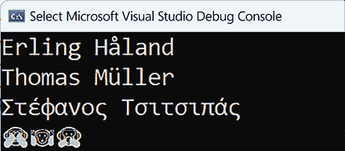

图 2.3：前一个代码片段的输出

+   在 Windows 系统上写入 UTF-16 编码的 Unicode 字符时，使用`wchar_t`字符和`std::wstring`字符串。在写入标准输出之前，请确保调用`_setmode(_fileno(stdout), _O_U16TEXT)`：

    ```cpp
    auto mode = _setmode(_fileno(stdout), _O_U16TEXT);
    std::wcout << L"Erling Håland\n";
    std::wcout << L"Thomas Müller\n";
    std::wcout << L"Στέφανος Τσιτσιπάς\n";
    _setmode(_fileno(stdout), mode); 
    ```

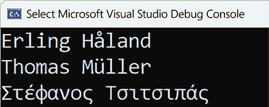

图 2.4：前一个代码片段的输出

## 它是如何工作的...

ASCII 编码在过去半个世纪中一直是最常见的字符编码格式。它包含 128 个字符，包括英语的大写和小写字母、10 个十进制数字和符号。该集合的前 32 个字符是不可打印的，被称为*控制字符*。C++语言完全支持 ASCII 字符集。您可以使用`std::cout`将 ASCII 字符打印到标准输出。

由于 ASCII 编码仅包括英语字母表中的字母，因此已经尝试了各种方法来支持其他语言和字母表。一种方法是*代码页*的概念。ASCII 编码只需要 7 位来编码 128 个字符。因此，可以使用 8 位数据类型来编码额外的 128 个字符。这意味着索引 128-255 中的字符可以映射到其他语言或字母表。这种映射称为代码页。有各种各样的代码页，如 IBM 代码页、DOS 代码页、Windows 代码页等。您可以在[`en.wikipedia.org/wiki/Code_page`](https://en.wikipedia.org/wiki/Code_page)上了解更多信息。以下表格列出了几个 Windows 代码页：

| **Code page** | **Name** | **Languages supported** |
| --- | --- | --- |
| 1250 | Windows Central Europe | Czech, Polish, Slovak, Hungarian, Slovene, Serbo-Croatian, Romanian, Albanian |
| 1251 | Windows Cyrillic | Russian, Belarusian, Ukrainian, Bulgarian, Macedonian, Serbian |
| 1252 | Windows Western | Spanish, Portuguese, French, German, Danish, Norwegian, Swedish, Finnish, Icelandic, Faroese, etc. |
| 1253 | Windows Greek | Greek |
| 1254 | Windows Turkish | Turkish |
| 1255 | Windows Hebrew | Hebrew |
| 1256 | Windows Arabic | Arabic, Persian, Urdu, English, French |
| 1257 | Windows Baltic | Estonian, Latvian, Lithuanian |
| 1258 | Windows Vietnamese | Vietnamese |

表 2.10：Windows 代码页的子集列表

为了理解它是如何工作的，让我们用一个代码片段来举例。索引 224 或 0xE0（十六进制）在不同的代码页中映射到不同的字符，如下表所示：

| **1250** | **1251** | **1252** | **1253** | **1254** | **1255** | **1256** | **1257** | **1258** |
| --- | --- | --- | --- | --- | --- | --- | --- | --- |
| ŕ | а | à | ΰ | à |  | à | ą | à |

表 2.11：几个 Windows 代码页中索引为 224 的字符

在编码术语中，将字符映射到的数值称为*码点*（或*码点*）。在我们的例子中，224 是一个码点，而*a*、*à*或*ą*是不同代码页中映射到这个码点的特定字符。

在 Windows 中，你可以通过调用`SetConsoleOutputCP()` API 来激活与运行进程关联的控制台的一个代码页。以下是一个示例片段，其中我们打印了从 1250 到 1258（前面列出的那些）所有代码页中映射到 224 码点的字符：

```cpp
char c = 224;
for (int codepage = 1250; codepage <= 1258; codepage++)
{
   SetConsoleOutputCP(codepage);
   std::cout << c << ' ';
} 
```

运行此程序的结果显示在下一张图片中。你可以看到，打印的字符是按照*表 2.9*中预期的字符。

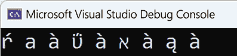

图 2.5：使用不同代码页打印码点 224

虽然代码页提供了一种简单的方法来在不同的脚本之间切换，但它并不是一个可以支持包含数百或数千个字符或象形文字的语言或书写系统（如中文或埃及象形文字）的解决方案。为此，开发了另一个标准，称为**Unicode**。这个编码标准旨在表示世界上大多数的书写脚本，无论是现在的还是过去的，以及其他符号，如近年来在短信中变得极为流行的表情符号。目前，Unicode 标准定义了大约 150,000 个字符。

Unicode 字符可以存储在几种编码中，最流行的是 UTF-8 和 UTF-16。还有 UTF-32 和 GB18030；后者不是 Unicode 规范的一部分，但在中国使用，并完全实现了 Unicode。

UTF-8 是一种可变长度的字符编码标准，与 ASCII 兼容。UTF-8 使用 1、2、3 或 4 个字节来编码所有可表示的码点。一个码点使用得越多，其编码使用的字节就越少。ASCII 编码的 128 个码点由一个字节表示。因此，UTF-8 完全与 ASCII 向后兼容。所有其他的 Unicode 码点都使用多个字节进行编码：范围在 128-2047 的码点使用 2 个字节，范围在 2048-65535 的码点使用 3 个字节，范围在 65536-1114111 的码点使用 4 个字节。编码中的第一个字节称为*引导字节*，它提供了关于用于编码码点的字节数的信息。正因为如此，UTF-8 是一个非常高效的编码系统，并且是万维网的首选选择，几乎所有的网页都使用这种编码。

UTF-16 也是一种可变长度的字符编码，可以编码所有的 Unicode 码点。为此，它使用一个或两个 16 位码单元，这使得它与 ASCII 不兼容。UTF-16 是 Windows 操作系统以及 Java 和 JavaScript 编程语言使用的编码。

UTF-32 是一种不太常见的编码系统。它是一种固定长度的编码，每个代码点使用 32 位。由于所有 Unicode 代码点最多需要 21 位，所以前 11 位总是 0。这使得它空间效率低下，这是其主要缺点。其主要优点是，在序列中查找第 N 个代码点所需的时间是常数，而 UTF-8 和 UTF-16 这样的可变长度编码则需要线性时间。

编译器通常假定源文件使用 UTF-8 编码。GCC、Clang 和 MSVC 都是如此。

Linux 发行版对 UTF-8 有原生支持。这意味着将字符串字面量写入输出控制台，如`"Στέφανος Τσιτσιπάς"`，将产生预期的结果，因为终端支持 UTF-8：

```cpp
std::cout << "Στέφανος Τσιτσιπάς"; 
```

另一方面，直接写入宽字符串，如`L"Στέφανος Τσιτσιπάς"`，不会按预期工作。要得到预期的结果，您需要设置一个区域对象。默认的 C 区域不知道如何将宽字符转换为 UTF-8。为了实现这一点，您需要使用能够做到这一点的区域。您有两个选择：

+   初始化一个与环境配置匹配的区域对象，通常应该是一个支持 UTF-8 的区域：

    ```cpp
    std::locale utf8("");
    std::wcout.imbue(utf8);
    std::wcout << L"Στέφανος Τσιτσιπάς\n"; 
    ```

+   使用特定的区域初始化一个区域对象，例如英语（美国）：

    ```cpp
    std::locale utf8("en_US.UTF-8");
    std::wcout.imbue(utf8);
    std::wcout << L"Στέφανος Τσιτσιπάς\n"; 
    ```

区域在*第七章*中详细讨论，*使用区域化设置进行流操作*。

在 Windows 系统上，情况不同。Windows 命令提示符(`cmd.exe`)不支持 UTF-8。尽管 Windows 10 添加了对名为“*使用 Unicode UTF-8 进行全球语言支持*”的 beta 功能的支持，但这在*区域设置*中隐藏得很深，并且目前报告说这可能会阻止某些应用程序正确运行。要将 UTF-8 内容写入命令提示符，您必须首先通过调用`SetConsoleOutputCP()`并将`CP_UTF8`作为参数（或其数值 65001）传递来设置正确的代码页：

```cpp
SetConsoleOutputCP(CP_UTF8);
std::cout << reinterpret_cast<const char*>(u8"Erling Håland\n");
std::cout << reinterpret_cast<const char*>(u8"Thomas Müller\n");
std::cout << reinterpret_cast<const char*>(u8"Στέφανος Τσιτσιπάς\n");
std::u8string monkeys = u8"\n";
std::cout << reinterpret_cast<const char*>(monkeys.c_str()); 
```

要写入 UTF-16，您需要调用`_setmode()`（来自`<io.h>`）来设置文件的翻译模式（在这种情况下，是标准输出控制台）为 UTF-16。为此，您必须传递`_O_U16TEXT`参数。该函数返回之前的翻译模式，您可以在写入所需内容后使用它来恢复翻译模式。

传递`_O_TEXT`设置文本模式（在此模式下，输入时的 CR-LF 组合被转换为单个 LF，而输出时的 LF 字符被转换为 CR-LF）：

```cpp
auto mode = _setmode(_fileno(stdout), _O_U16TEXT);
std::wcout << L"Erling Håland\n";
std::wcout << L"Thomas Müller\n";
std::wcout << L"Στέφανος Τσιτσιπάς\n";
_setmode(_fileno(stdout), mode); 
```

然而，为了使这可行，也很重要的是命令提示符应用程序使用的是 True Type 字体，例如 Lucinda Console 或 Consolas，而不是仅支持 ASCII 的 Raster 字体。

从 Windows 10 开始，Windows 提供了一种新的终端应用程序。这被称为**Windows Terminal**，它内置了对 UTF-8 的支持。这意味着以下代码无需先调用`SetConsoleOutputCP()`即可打印出预期的结果：

```cpp
std::cout << reinterpret_cast<const char*>(u8"Erling Håland\n"); 
```

与其他编程语言不同，C++对 Unicode 的支持并不是一个强项。本食谱提供了在控制台应用程序中处理 Unicode 的基础。然而，在实践中，事情可能会变得更加复杂，需要额外的支持。为了进一步了解这个主题，建议您查阅额外的资料，其中许多资料可在网上找到。

## 参见

+   *理解各种字符和字符串类型*，了解 C++中可用的字符和字符串类型

+   *使用 std::format 和 std::print 格式化和打印文本*，了解如何使用现代工具格式化和打印文本

+   *第七章*，*使用本地化设置进行流操作*，了解区域设置以及如何控制输入/输出流的行为

# 生成伪随机数

生成随机数对于各种应用程序都是必要的，从游戏到密码学，从抽样到预测。然而，“随机数”这个术语实际上并不准确，因为通过数学公式生成数字是确定性的，并不产生真正的随机数，而是产生看起来随机的数字，称为“伪随机数”。真正的随机性只能通过基于物理过程的硬件设备实现，即使这样也可能受到挑战，因为我们甚至可能认为整个宇宙实际上是确定性的。

现代 C++提供了通过伪随机数库生成伪随机数的支持，该库包含数字生成器和分布。理论上，它也可以生成真正的随机数，但在实践中，这些可能实际上只是伪随机数。

## 准备工作

在本食谱中，我们将讨论生成伪随机数的标准支持。理解随机数和伪随机数之间的区别是关键。真正的随机数是无法比随机机会预测得更好的数字，并且通过基于硬件的随机数生成器生成。伪随机数是通过生成具有近似真正随机数特性的序列的算法生成的数字。

此外，熟悉各种统计分布也是一个加分项。然而，了解均匀分布是强制性的，因为库中的所有引擎生成的数字都是均匀分布的。不深入细节，我们只提一下，均匀分布是一种概率分布，它关注的是等可能性发生的事件（在特定范围内）。

## 如何实现...

要在您的应用程序中生成伪随机数，您应执行以下步骤：

1.  包含头文件 `<random>`:

    ```cpp
    #include <random> 
    ```

1.  使用 `std::random_device` 生成器为一个伪随机引擎设置种子：

    ```cpp
    std::random_device rd{}; 
    ```

1.  使用可用的一个引擎生成数字，并用随机种子初始化它：

    ```cpp
    auto mtgen = std::mt19937{ rd() }; 
    ```

1.  使用可用的分布之一将引擎的输出转换为所需的统计分布之一：

    ```cpp
    auto ud = std::uniform_int_distribution<>{ 1, 6 }; 
    ```

1.  生成伪随机数：

    ```cpp
    for(auto i = 0; i < 20; ++i)
      auto number = ud(mtgen); 
    ```

## 它是如何工作的...

伪随机数库包含两种类型的组件：

+   *Engines*，这些是随机数生成器；这些可以生成具有均匀分布的伪随机数，或者如果可用，实际随机数。

+   *Distributions*，这些将引擎的输出转换为统计分布。

所有引擎（除了 `random_device`）都产生在均匀分布中的整数数，并且所有引擎都实现了以下方法：

+   `min()`：这是一个静态方法，返回生成器可以生成的最小值。

+   `max()`：这是一个静态方法，返回生成器可以生成的最大值。

+   `seed()`：这使用起始值初始化算法（除了 `random_device`，它不能被初始化）。

+   `operator()`：这生成一个在 `min()` 和 `max()` 之间均匀分布的新数字。

+   `discard()`：生成并丢弃指定数量的伪随机数。

以下引擎可用：

+   `linear_congruential_engine`：这是一个线性同余发生器，使用以下公式生成数字：

    *x*(*i*) = (*A* * *x*(i – *1*) + *C*) mod *M*

+   `mersenne_twister_engine`：这是一个梅森旋转发生器，它在 *W* * (*N* – 1) * *R* 位上保持一个值。每次需要生成一个数字时，它提取 *W* 位。当所有位都已被使用时，它通过移位和混合位来扭曲大值，以便它有一个新的位集可以从中提取。

+   `subtract_with_carry_engine`：这是一个实现基于以下公式的 *subtract with carry* 算法的生成器：

    *x*(*i*) = (*x*(*i* – *R*) – *x*(*i* – *S*) – *cy*(*i* – 1)) mod *M*

    在前面的公式中，*cy*定义为：

    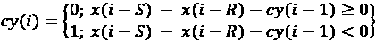

此外，库还提供了引擎适配器，这些适配器也是包装另一个引擎并基于基本引擎的输出生成数字的引擎。引擎适配器实现了前面提到的基本引擎的相同方法。以下可用的引擎适配器有：

+   `discard_block_engine`：一个生成器，从基本引擎生成的每个 *P* 个数字块中，只保留 *R* 个数字，丢弃其余的数字。

+   `independent_bits_engine`：一个生成器，它产生与基本引擎不同数量的位数的数字。

+   `shuffle_order_engine`：一个生成器，它保持由基本引擎生成的 *K* 个数字的随机顺序表，并从该表中返回数字，用基本引擎生成的数字替换它们。

选择伪随机数生成器应根据您应用程序的具体要求进行。线性同余引擎中等快速，但其内部状态存储需求非常小。减法进位引擎非常快，包括在那些没有高级算术指令集处理器的机器上。然而，它需要更大的内部状态存储，并且生成的数字序列具有较少的期望特征。梅森旋转器是这些引擎中最慢的，具有最长的存储持续时间，但产生最长的非重复伪数字序列。

所有这些引擎和引擎适配器都产生伪随机数。然而，库还提供了一个称为 `random_device` 的另一个引擎，它应该产生非确定性数字，但这不是一个实际约束，因为可能没有可用的物理随机熵源。因此，`random_device` 的实现实际上可能基于伪随机引擎。`random_device` 类不能像其他引擎那样进行播种，并且有一个名为 `entropy()` 的附加方法，它返回随机设备的熵，对于确定性生成器为 0，对于非确定性生成器为非零。

然而，这不是确定设备是否真正确定性的可靠方法。例如，GNU `libstdc++` 和 LLVM `libc++` 实现了一个非确定性设备，但熵返回 `0`。另一方面，`VC++` 和 `boost.random` 分别返回 `32` 和 `10` 作为熵。

所有这些生成器都产生均匀分布的整数。然而，这只是在大多数应用中需要随机数的大多数可能统计分布之一。为了能够产生其他分布中的数字（无论是整数还是实数），库提供了几个称为 *分布* 的类。

这些将根据其实施的统计分布转换引擎的输出。以下分布可用：

| **类型** | **类名** | **数字** | **统计分布** |
| --- | --- | --- | --- |
| 均匀分布 | `uniform_int_distribution` | 整数 | 均匀分布 |
| `uniform_real_distribution` | 实数 | 均匀 |
| 伯努利 | `bernoulli_distribution` | 布尔 | 伯努利 |
| `binomial_distribution` | 整数 | 二项式 |
| `negative_binomial_distribution` | 整数 | 负二项式 |
| `geometric_distribution` | 整数 | 几何 |
| 泊松 | `poisson_distribution` | 整数 | 泊松 |
| `exponential_distribution` | 实数 | 指数 |
| `gamma_distribution` | 实数 | 伽马 |
| `weibull_distribution` | 实数 | Weibull |
| `extreme_value_distribution` | 实数 | 极值 |
| 正态 | `normal_distribution` | 实数 | 标准正态（高斯） |
| `lognormal_distribution` | 实数 | 对数正态 |
| `chi_squared_distribution` | 实数 | 卡方 |
| `cauchy_distribution` | 实数 | 柯西 |
| `fisher_f_distribution` | 实数 | 费舍尔 F 分布 |
| `student_t_distribution` | 实数 | 学生 t 分布 |
| 抽样 | `discrete_distribution` | 整数 | 离散 |
| `piecewise_constant_distribution` | 实数 | 在常数子区间上分布的值 |
| `piecewise_linear_distribution` | 实数 | 在定义的子区间上分布的值 |

表 2.12：来自<random>头文件的标准化分布列表

如前所述，库提供的每个引擎都有其优缺点。当适当地初始化时，梅森旋转器，尽管速度最慢且内部状态最大，可以产生最长的非重复数字序列。在以下示例中，我们将使用`std::mt19937`，这是一个具有 19,937 位内部状态的 32 位梅森旋转器。还有一个 64 位的梅森旋转器，`std::mt19937_64`。`std::mt19937`和`std::mt19937_64`都是`std::mersenne_twister_engine`的别名。

生成随机数的最简单方法如下：

```cpp
auto mtgen = std::mt19937 {};
for (auto i = 0; i < 10; ++i)
  std::cout << mtgen() << '\n'; 
```

在这个例子中，`mtgen`是梅森旋转器的`std::mt19937`。要生成数字，你只需要使用调用操作符，它会推进内部状态并返回下一个伪随机数。然而，这段代码有缺陷，因为引擎没有被初始化。结果，它总是产生相同的数字序列，这在大多数情况下可能不是你想要的。

初始化引擎的方法有很多种。其中一种方法，与 C 语言的`random`库类似，是使用当前时间。在现代 C++中，它应该看起来像这样：

```cpp
auto seed = std::chrono::high_resolution_clock::now()
            .time_since_epoch()
            .count();
auto mtgen = std::mt19937{ static_cast<unsigned int>(seed) }; 
```

在这个例子中，`seed`是一个表示从时钟的纪元到当前时刻的滴答数的数字。然后使用这个数字来初始化引擎。这种方法的问题在于，那个`seed`的值实际上是确定的，在某些类别的应用中，它可能容易受到攻击。一个更可靠的方法是用实际的随机数来初始化生成器。

`std::random_device`类是一个应该返回真随机数的引擎，尽管实现可能实际上基于伪随机数生成器：

```cpp
std::random_device rd;
auto mtgen = std::mt19937 {rd()}; 
```

所有引擎产生的数字都遵循均匀分布。要将结果转换为另一个统计分布，我们必须使用一个分布类。为了展示生成的数字是如何根据所选分布分布的，我们将使用以下函数。这个函数生成指定数量的伪随机数，并计算它们在映射中的重复次数。然后使用映射中的值来生成一个条形图，显示每个数字出现的频率：

```cpp
void generate_and_print(std::function<int(void)> gen,
 int const iterations = 10000)
{
  // map to store the numbers and their repetition
auto data = std::map<int, int>{};
  // generate random numbers
for (auto n = 0; n < iterations; ++n)
    ++data[gen()];
  // find the element with the most repetitions
auto max = std::max_element(
             std::begin(data), std::end(data),
             [](auto kvp1, auto kvp2) {
    return kvp1.second < kvp2.second; });
  // print the bars
for (auto i = max->second / 200; i > 0; --i)
  {
    for (auto kvp : data)
    {
      std::cout
        << std::fixed << std::setprecision(1) << std::setw(3)
        << (kvp.second / 200 >= i ? (char)219 : ' ');
    }
    std::cout << '\n';
  }
  // print the numbers
for (auto kvp : data)
  {
    std::cout
      << std::fixed << std::setprecision(1) << std::setw(3)
      << kvp.first;
  }
  std::cout << '\n';
} 
```

以下代码使用`std::mt19937`引擎在范围`[1, 6]`内生成随机数；这基本上是你掷骰子时得到的结果：

```cpp
std::random_device rd{};
auto mtgen = std::mt19937{ rd() };
auto ud = std::uniform_int_distribution<>{ 1, 6 };
generate_and_print([&mtgen, &ud]() {return ud(mtgen); }); 
```

程序的输出如下：

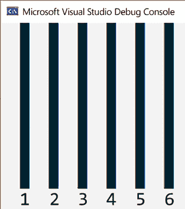

图 2.6：范围[1,6]的均匀分布

在下一个和最后一个示例中，我们将分布更改为均值为`5`和标准差为`2`的正态分布。这种分布产生实数；因此，为了使用之前的`generate_and_print()`函数，必须将数字四舍五入为整数：

```cpp
std::random_device rd{};
auto mtgen = std::mt19937{ rd() };
auto nd = std::normal_distribution<>{ 5, 2 };
generate_and_print(
  [&mtgen, &nd]() {
    return static_cast<int>(std::round(nd(mtgen))); }); 
```

以下将是前面代码的输出：

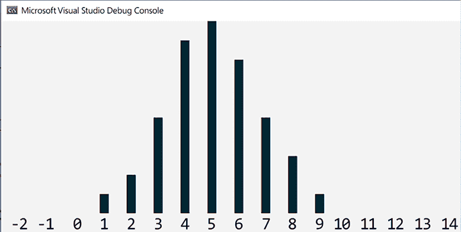

图 2.7：均值为 5 和标准方差为 2 的正态分布

在这里，我们可以看到，基于图形表示，分布已从均匀分布变为均值为 5 的正态分布。

## 参见

+   *正确初始化伪随机数生成器*，了解如何正确初始化随机数生成器

# 正确初始化伪随机数生成器

在之前的配方中，我们探讨了伪随机数库及其组件，以及如何使用它来生成不同统计分布的数字。在那个配方中，被忽视的一个重要因素是伪随机数生成器的正确初始化。

通过仔细分析（这超出了本配方或本书的目的），可以证明梅森旋转器引擎倾向于重复产生某些值并省略其他值，从而生成不是均匀分布的数字，而是二项式或泊松分布的数字。在本配方中，您将学习如何初始化生成器以生成具有真正均匀分布的伪随机数。

## 准备工作

您应该阅读之前的配方，*生成伪随机数*，以了解伪随机数库提供的概述。

## 如何操作...

为了正确初始化伪随机数生成器以生成均匀分布的伪随机数序列，执行以下步骤：

1.  使用`std::random_device`生成随机数作为种子值：

    ```cpp
    std::random_device rd; 
    ```

1.  为引擎的所有内部位生成随机数据：

    ```cpp
    std::array<int, std::mt19937::state_size> seed_data {};
    std::generate(std::begin(seed_data), std::end(seed_data),
                  std::ref(rd)); 
    ```

1.  从之前生成的伪随机数据创建一个`std::seed_seq`对象：

    ```cpp
    std::seed_seq seq(std::begin(seed_data), std::end(seed_data)); 
    ```

1.  创建一个引擎对象并初始化表示引擎内部状态的位；例如，`mt19937`有 19,937 位的内部状态：

    ```cpp
    auto eng = std::mt19937{ seq }; 
    ```

1.  根据应用程序的要求使用适当的分布：

    ```cpp
    auto dist = std::uniform_real_distribution<>{ 0, 1 }; 
    ```

## 它是如何工作的...

在之前配方中展示的所有示例中，我们使用了`std::mt19937`引擎来生成伪随机数。尽管梅森旋转器比其他引擎慢，但它可以产生最长的非重复数字序列，并具有最佳的频谱特性。然而，按照之前配方中所示的方式初始化引擎将不会产生这种效果。问题是`mt19937`的内部状态有 624 个 32 位整数，而在之前配方的示例中，我们只初始化了其中之一。

在使用伪随机数库时，请记住以下经验法则（如信息框所示）。

为了产生最佳结果，在生成数字之前，必须正确初始化引擎的整个内部状态。

伪随机数库提供了一个用于此特定目的的类，称为 `std::seed_seq`。这是一个可以以任意数量的 32 位整数进行初始化的生成器，并在 32 位空间内均匀地产生所需数量的整数。

在 *如何做...* 部分的先前代码中，我们定义了一个名为 `seed_data` 的数组，其中包含与 `mt19937` 生成器内部状态相等的 32 位整数——即 624 个整数。然后，我们使用 `std::random_device` 生成的随机数初始化该数组。该数组后来被用来初始化 `std::seed_seq`，而 `std::seed_seq` 又被用来初始化 `mt19937` 生成器。

## 参见

+   *生成伪随机数*，以便熟悉标准数值库生成伪随机数的能力

# 创建烹饪用户定义字面量

字面量是内置类型（数值、布尔、字符、字符字符串和指针）的常量，在程序中不能被更改。语言定义了一系列前缀和后缀来指定字面量（前缀/后缀实际上是字面量的一部分）。C++11 允许我们通过定义称为*字面量运算符*的函数来创建用户定义的字面量，这些运算符引入了用于指定字面量的后缀。这些运算符仅与数值字符和字符字符串类型一起使用。

这为在未来的版本中定义标准字面量和允许开发者创建自己的字面量打开了可能性。在本食谱中，我们将学习如何创建自己的烹饪字面量。

## 准备工作

用户定义的字面量可以有两种形式：*原始*和*烹饪*。原始字面量不会被编译器处理，而烹饪字面量则是被编译器处理的值（例如，处理字符字符串中的转义序列或识别字面量中的数值，如整数 2898 来自字面量 0xBAD）。原始字面量仅适用于整数和浮点类型，而烹饪字面量也适用于字符和字符字符串字面量。

## 如何做...

要创建烹饪用户定义字面量，你应该遵循以下步骤：

1.  在单独的命名空间中定义你的字面量以避免名称冲突。

1.  总是用下划线（`_`）作为用户定义后缀的前缀。

1.  为烹饪字面量定义以下形式之一的字面量运算符（使用 `char8_t` 的形式仅从 C++20 开始可用）。注意，在以下列表中，`T` 不是一个类型模板参数，而只是运算符返回类型的占位符：

    ```cpp
    T operator "" _suffix(unsigned long long int);
    T operator "" _suffix(long double);
    T operator "" _suffix(char);
    T operator "" _suffix(wchar_t);
    T operator "" _suffix(char8_t); // since C++20
    T operator "" _suffix(char16_t);
    T operator "" _suffix(char32_t);
    T operator "" _suffix(char const *, std::size_t);
    T operator "" _suffix(wchar_t const *, std::size_t);
    T operator "" _suffix(char8_t const *, std::size_t); // C++20
    T operator "" _suffix(char16_t const *, std::size_t);
    T operator "" _suffix(char32_t const *, std::size_t); 
    ```

    以下示例创建了一个用于指定千字节的用户定义字面量：

    ```cpp
    namespace compunits
    {
      constexpr size_t operator "" _KB(unsigned long long const size)
      {
        return static_cast<size_t>(size * 1024);
      }
    }
    auto size{ 4_KB };         // size_t size = 4096;
    using byte = unsigned char;
    auto buffer = std::array<byte, 1_KB>{}; 
    ```

## 它是如何工作的...

当编译器遇到一个具有用户定义后缀`_X`（它总是以下划线开头，因为不带前导下划线的后缀是为标准库保留的）的用户定义字面量时，它将执行无限定名称查找以识别名为`operator "" _X`的函数。如果找到了，则根据字面量和字面量运算符的类型调用它。否则，编译器将产生错误。

在“如何做...”部分的示例中，字面量运算符被调用为`operator "" _KB`，其参数类型为`unsigned long long int`。这是字面量运算符可以处理的唯一整数类型。同样，对于浮点用户定义字面量，参数类型必须是`long double`，因为对于数值类型，字面量运算符必须能够处理可能的最大值。此字面量运算符返回一个`constexpr`值，因此它可以在需要编译时值的上下文中使用，例如指定数组的大小，如前例所示。

当编译器识别出一个用户定义字面量并需要调用适当的用户定义字面量运算符时，它将根据以下规则从重载集中选择重载：

+   **对于整数字面量**：它按以下顺序调用：接受`unsigned long long`的运算符，接受`const char*`的原始字面量运算符，或字面量运算符模板。

+   **对于浮点字面量**：它按以下顺序调用：接受`long double`的运算符，接受`const char*`的原始字面量运算符，或字面量运算符模板。

+   **对于字符字面量**：它根据字符类型（`char`、`wchar_t`、`char16_t`和`char32_t`）调用适当的运算符。

+   **对于字符串字面量**：它调用适当的运算符，根据字符串类型，该运算符接受一个指向字符字符串的指针和大小。

在以下示例中，我们正在定义一个单位和数量的系统。我们希望使用千克、件、升和其他类型的单位。这在可以处理订单的系统中有用，您需要指定每件商品的量和单位。

在`units`命名空间中定义了以下内容：

+   一个作用域枚举，用于可能的单位类型（如千克、米、升和件）：

    ```cpp
    enum class unit { kilogram, liter, meter, piece, }; 
    ```

+   一个类模板，用于指定特定单位的数量（例如 3.5 千克或 42 件）：

    ```cpp
    template <unit U>
    class quantity
    {
      const double amount;
    public:
      constexpr explicit quantity(double const a) : amount(a)
      {}
      explicit operator double() const { return amount; }
    }; 
    ```

+   为了能够对`quantity`类模板进行加法和减法操作，定义了`operator+`和`operator-`函数：

    ```cpp
    template <unit U>
    constexpr quantity<U> operator+(quantity<U> const &q1,
                                    quantity<U> const &q2)
    {
      return quantity<U>(static_cast<double>(q1) +
                         static_cast<double>(q2));
    }
    template <unit U>
    constexpr quantity<U> operator-(quantity<U> const &q1,
                                    quantity<U> const &q2)
    {
      return quantity<U>(static_cast<double>(q1) –
                         static_cast<double>(q2));
    } 
    ```

+   创建`quantity`字面量的字面量运算符，定义在名为`unit_literals`的内部命名空间中。这样做是为了避免与其他命名空间中的字面量发生名称冲突。

    如果确实发生了这样的冲突，开发者可以使用适当的命名空间在需要定义字面量的作用域中选择它们：

    ```cpp
    namespace unit_literals
    {
      constexpr quantity<unit::kilogram> operator "" _kg(
          long double const amount)
      {
        return quantity<unit::kilogram> { static_cast<double>(amount) };
      }
      constexpr quantity<unit::kilogram> operator "" _kg(
          unsigned long long const amount)
      {
        return quantity<unit::kilogram> { static_cast<double>(amount) };
      }
      constexpr quantity<unit::liter> operator "" _l(
          long double const amount)
      {
        return quantity<unit::liter> { static_cast<double>(amount) };
      }
      constexpr quantity<unit::meter> operator "" _m(
          long double const amount)
      {
        return quantity<unit::meter> { static_cast<double>(amount) };
      }
      constexpr quantity<unit::piece> operator "" _pcs(
          unsigned long long const amount)
      {
        return quantity<unit::piece> { static_cast<double>(amount) };
      }
    } 
    ```

仔细观察可以发现，之前定义的字面量运算符并不相同：

+   `_kg` 定义了整数和浮点字面量；这使得我们能够创建整数和浮点值，例如 `1_kg` 和 `1.0_kg`。

+   `_l` 和 `_m` 仅适用于浮点字面量；这意味着我们只能使用浮点数定义这些单位的量值字面量，例如 `4.5_l` 和 `10.0_m`。

+   `_pcs` 仅适用于整数字面量；这意味着我们只能定义整数数量的件量，例如 `42_pcs`。

有这些字面量运算符可用，我们可以操作各种量。以下示例显示了有效和无效操作：

```cpp
using namespace units;
using namespace unit_literals;
auto q1{ 1_kg };    // OK
auto q2{ 4.5_kg };  // OK
auto q3{ q1 + q2 }; // OK
auto q4{ q2 - q1 }; // OK
// error, cannot add meters and pieces
auto q5{ 1.0_m + 1_pcs };
// error, cannot have an integer number of liters
auto q6{ 1_l };
// error, can only have an integer number of pieces
auto q7{ 2.0_pcs} 
```

`q1` 是 1 千克的量；这是一个整数值。由于存在重载的 `operator "" _kg(unsigned long long const)`，字面量可以从整数 1 正确创建。同样，`q2` 是 4.5 千克的量；这是一个实数值。由于存在重载的 `operator "" _kg(long double)`，字面量可以从双精度浮点值 4.5 创建。

另一方面，`q6` 是 1 升的量。由于没有重载的 `operator "" _l(unsigned long long)`，字面量无法创建。它需要一个接受 `unsigned long long` 的重载，但这样的重载不存在。同样，`q7` 是 2.0 件，但件字面量只能从整数值创建，因此这会生成另一个编译器错误。

## 更多内容...

尽管用户定义的字面量从 C++11 开始可用，但标准字面量运算符仅在 C++14 中可用。后续标准用户定义的字面量已添加到标准的下一个版本中。以下是一个这些标准字面量运算符的列表：

+   用于定义 `std::basic_string` 字面量的 `operator""s` 和在 C++17 中用于定义 `std::basic_string_view` 字面量的 `operator""sv`：

    ```cpp
    using namespace std::string_literals;
    auto s1{  "text"s }; // std::string
    auto s2{ L"text"s }; // std::wstring
    auto s3{ u"text"s }; // std::u16string
    auto s4{ U"text"s }; // std::u32string
    using namespace std::string_view_literals;
    auto s5{ "text"sv }; // std::string_view 
    ```

+   用于创建 `std::chrono::duration` 值的 `operator""h`、`operator""min`、`operator""s`、`operator""ms`、`operator""us` 和 `operator""ns`：

    ```cpp
    using namespace std::chrono_literals;
    // std::chrono::duration<long long>
    auto timer {2h + 42min + 15s}; 
    ```

+   用于创建 `std::chrono::year` 字面量的 `operator""y` 和用于创建表示月份一天的 `std::chrono::day` 字面量的 `operator""d`，两者都添加到 C++20：

    ```cpp
    using namespace std::chrono_literals;
    auto year { 2020y }; // std::chrono::year
    auto day { 15d };    // std::chrono::day 
    ```

+   用于创建 `std::complex<float>`、`std::complex<double>` 和 `std::complex<long double>` 值的 `operator""if`、`operator""i` 和 `operator""il`：

    ```cpp
    using namespace std::complex_literals;
    auto c{ 12.0 + 4.5i }; // std::complex<double> 
    ```

标准用户定义的字面量存在于多个命名空间中。例如，字符串的 `""s` 和 `""sv` 字面量定义在命名空间 `std::literals::string_literals` 中。

然而，`literals` 和 `string_literals` 都是内联命名空间。因此，你可以使用 `using namespace std::literals`、`using namespace std::string_literals` 或 `using namespace std::literals::string_literals` 来访问字面量。在之前的示例中，第二种形式被首选。

## 另请参阅

+   *使用原始字符串字面量来避免转义字符*，了解如何定义不需要转义特殊字符的字符串字面量

+   *创建原始用户定义字面量*，了解如何提供对输入序列的定制解释，以便改变编译器的正常行为

+   *第一章*，*使用内联命名空间进行符号版本控制*，了解如何使用内联命名空间和条件编译来对源代码进行版本控制

# 创建原始用户定义字面量

在前面的配方中，我们探讨了 C++11 允许库实现者和开发者创建用户定义字面量以及 C++14 标准中可用的用户定义字面量。然而，用户定义字面量有两种形式：一种是被烹饪的形式，其中字面量值在提供给字面量操作符之前由编译器处理；另一种是原始形式，其中字面量在提供给字面量操作符之前不会被编译器处理。后者仅适用于整型和浮点型。原始字面量对于改变编译器的正常行为很有用。例如，一个如 3.1415926 的序列被编译器解释为浮点值，但使用原始用户定义字面量，它可以被解释为用户定义的十进制值。在本配方中，我们将探讨创建原始用户定义字面量。

## 准备工作

在继续本配方之前，强烈建议您先完成前面的配方，*创建烹饪用户定义字面量*，因为这里不会重复用户定义字面量的通用细节。

为了说明如何创建原始用户定义字面量，我们将定义二进制字面量。这些二进制字面量可以是 8 位、16 位和 32 位（无符号）类型。这些类型将被称为 `byte8`、`byte16` 和 `byte32`，我们将创建的字面量将被称为 `_b8`、`_b16` 和 `_b32`。

## 如何做到这一点...

要创建原始用户定义字面量，您应该遵循以下步骤：

1.  在单独的命名空间中定义您的字面量以避免名称冲突。

1.  总是以下划线（`_`）作为用户定义后缀的前缀。

1.  定义以下形式的字面量操作符或字面量操作符模板：

    ```cpp
    T operator "" _suffix(const char*);
    template<char...> T operator "" _suffix(); 
    ```

以下示例展示了 8 位、16 位和 32 位二进制字面量的可能实现：

```cpp
namespace binary
{
  using byte8  = unsigned char;
  using byte16 = unsigned short;
  using byte32 = unsigned int;
  namespace binary_literals
  {
    namespace binary_literals_internals
    {
      template <typename CharT, char... bits>
      struct binary_struct;
      template <typename CharT, char... bits>
      struct binary_struct<CharT, '0', bits...>
      {
        static constexpr CharT value{
          binary_struct<CharT, bits...>::value };
      };
      template <typename CharT, char... bits>
      struct binary_struct<CharT, '1', bits...>
      {
        static constexpr CharT value{
          static_cast<CharT>(1 << sizeof...(bits)) |
          binary_struct<CharT, bits...>::value };
      };
      template <typename CharT>
      struct binary_struct<CharT>
      {
        static constexpr CharT value{ 0 };
      };
    }
    template<char... bits>
    constexpr byte8 operator""_b8()
    {
      static_assert(
        sizeof...(bits) <= 8,
        "binary literal b8 must be up to 8 digits long");
      return binary_literals_internals::
                binary_struct<byte8, bits...>::value;
    }
    template<char... bits>
    constexpr byte16 operator""_b16()
    {
      static_assert(
        sizeof...(bits) <= 16,
        "binary literal b16 must be up to 16 digits long");
      return binary_literals_internals::
                binary_struct<byte16, bits...>::value;
    }
    template<char... bits>
    constexpr byte32 operator""_b32()
    {
      static_assert(
        sizeof...(bits) <= 32,
        "binary literal b32 must be up to 32 digits long");
      return binary_literals_internals::
                binary_struct<byte32, bits...>::value;
    }
  }
} 
```

## 它是如何工作的...

首先，我们在名为 `binary` 的命名空间内定义一切，并首先介绍几个类型别名：`byte8`、`byte16` 和 `byte32`。这些代表 8 位、16 位和 32 位的整型，正如其名称所暗示的。

上一个章节中的实现使我们能够定义形式为 `1010_b8`（十进制值为 10 的 `byte8` 值）或 `000010101100_b16`（十进制值为 2130496 的 `byte16` 值）的二进制字面量。然而，我们想确保我们不会超过每种类型的数字数量。换句话说，如 `111100001_b8` 这样的值应该是非法的，并且编译器应该产生错误。

字面量运算符模板定义在一个嵌套的命名空间中，称为 `binary_literal_internals`。这是一种良好的实践，以避免与其他命名空间中的其他字面量运算符发生名称冲突。如果发生类似情况，您可以选择在适当的范围内使用适当的命名空间（例如，一个函数或块中的一个命名空间和另一个函数或块中的另一个命名空间）。

三个字面量运算符模板非常相似。唯一不同的是它们的名称（`_b8`、`_16` 和 `_b32`）、返回类型（`byte8`、`byte16` 和 `byte32`）以及在静态断言中的条件，该断言检查数字的位数。

我们将在后续的菜谱中探讨变长模板和模板递归的细节；然而，为了更好地理解，以下是这种特定实现的工作原理：`bits` 是一个模板参数包，它不是一个单一值，而是模板可以实例化的所有值。例如，如果我们考虑字面量 `1010_b8`，那么字面量运算符模板将被实例化为 `operator"" _b8<'1', '0', '1', '0'>()`。在计算二进制值之前，我们检查字面量的位数。对于 `_b8`，位数不得超过八个（包括任何尾随零）。同样，对于 `_b16` 应该是 16 位，对于 `_b32` 应该是 32 位。为此，我们使用 `sizeof...` 操作符，它返回参数包中的元素数量（在这种情况下，`bits`）。

如果数字位数正确，我们可以继续展开参数包，并递归地计算二进制字面量表示的十进制值。这是通过一个额外的类模板及其特化来完成的。这些模板定义在另一个嵌套的命名空间中，称为 `binary_literals_internals`。这也是一种良好的实践，因为它隐藏（除非通过适当的限定符）了从客户端隐藏实现细节（除非显式使用 `using namespace` 指令使它们对当前命名空间可用）。

尽管这看起来像是递归，但这并不是真正的运行时递归。这是因为，在编译器展开并从模板生成代码之后，我们最终得到的是对具有不同参数数量的重载函数的调用。这在上面的菜谱“编写具有可变数量参数的函数模板”的 *第三章* 中有解释。

`binary_struct` 类模板有一个模板类型 `CharT` 用于函数的返回类型（我们需要这个，因为我们的字面量运算符模板应该返回 `byte8`、`byte16` 或 `byte32`），以及一个参数包：

```cpp
template <typename CharT, char... bits>
struct binary_struct; 
```

该类模板有几种特化可用，带有参数包分解（你可以在*第三章*的*编写具有可变参数数量的函数模板*食谱中了解更多）。当包的第一个数字是`'0'`时，计算值保持不变，我们继续展开包的其余部分。如果包的第一个数字是`'1'`，则新值是 1，左移包剩余部分的位数，或者包剩余部分的值：

```cpp
template <typename CharT, char... bits>
struct binary_struct<CharT, '0', bits...>
{
  static constexpr CharT value{ binary_struct<CharT, bits...>::value };
};
template <typename CharT, char... bits>
struct binary_struct<CharT, '1', bits...>
{
  static constexpr CharT value{
    static_cast<CharT>(1 << sizeof...(bits)) |
    binary_struct<CharT, bits...>::value };
}; 
```

最后一个特化处理了包为空的情况；在这种情况下，我们返回 0：

```cpp
template <typename CharT>
struct binary_struct<CharT>
{
  static constexpr CharT value{ 0 };
}; 
```

在定义了这些辅助类之后，我们可以按照预期实现`byte8`、`byte16`和`byte32`二进制字面量。请注意，我们需要将`binary_literals`命名空间的内容引入当前命名空间，以便使用字面量操作符模板：

```cpp
using namespace binary;
using namespace binary_literals;
auto b1 = 1010_b8;
auto b2 = 101010101010_b16;
auto b3 = 101010101010101010101010_b32; 
```

以下定义会触发编译器错误：

```cpp
// binary literal b8 must be up to 8 digits long
auto b4 = 0011111111_b8;
// binary literal b16 must be up to 16 digits long
auto b5 = 001111111111111111_b16;
// binary literal b32 must be up to 32 digits long
auto b6 = 0011111111111111111111111111111111_b32; 
```

原因是`static_assert`中的条件未满足。在字面量操作符之前的字符序列长度大于预期，在所有情况下都是如此。

## 相关内容

+   *使用原始字符串字面量来避免转义字符*，了解如何定义不需要转义特殊字符的字符串字面量

+   *创建烹饪用户定义字面量*，了解如何创建用户定义类型的字面量

+   *第三章*，*编写具有可变参数数量的函数模板*，了解变长模板如何使我们能够编写可以接受任意数量参数的函数

+   *第一章*，*创建类型别名和别名模板*，了解类型别名

# 使用原始字符串字面量来避免转义字符

字符串可能包含特殊字符，例如不可打印字符（换行符、水平制表符和垂直制表符等）、字符串和字符分隔符（双引号和单引号），或者任意的八进制、十六进制或 Unicode 值。这些特殊字符通过以反斜杠开头的转义序列引入，后跟字符（例如 `'` 和 `"`）、其指定的字母（例如 `n` 表示换行，`t` 表示水平制表符），或其值（例如八进制 050、十六进制 XF7 或 Unicode U16F0）。因此，反斜杠字符本身必须通过另一个反斜杠字符进行转义。这导致了一些更复杂的字面量字符串，这些字符串可能难以阅读。

为了避免转义字符，C++11 引入了原始字符串字面量，它不处理转义序列。在本食谱中，你将学习如何使用原始字符串字面量的各种形式。

## 准备工作

在本食谱中，以及本书的其余部分，我将使用`s`后缀来定义`basic_string`字面量。这在本章的*创建烹饪用户定义字面量*食谱中已有介绍。

## 如何做到...

为了避免转义字符，可以使用以下形式之一定义字符串字面量：

+   `R"( literal )"`作为默认形式：

    ```cpp
    auto filename {R"(C:\Users\Marius\Documents\)"s};
    auto pattern {R"((\w+)=(\d+)$)"s};
    auto sqlselect {
      R"(SELECT *
      FROM Books
      WHERE Publisher='Packtpub'
      ORDER BY PubDate DESC)"s}; 
    ```

+   `R"delimiter( literal )delimiter"`，其中 `delimiter` 是任何不包括括号、反斜杠和空格的字符序列，而 `literal` 是任何字符序列，限制是不能包含关闭序列 `)delimiter"`。以下是一个以 `!!` 作为分隔符的示例：

    ```cpp
    auto text{ R"!!(This text contains both "( and )".)!!"s };
    std::cout << text << '\n'; 
    ```

## 它是如何工作的...

当使用字符串文本文本时，不会处理转义，实际字符串内容将写入分隔符之间（换句话说，所见即所得）。以下示例显示了看起来相同的原始文本文本；然而，第二个仍然包含转义字符。由于在字符串文本文本的情况下不会处理这些转义字符，它们将以原样打印到输出中：

```cpp
auto filename1 {R"(C:\Users\Marius\Documents\)"s};
auto filename2 {R"(C:\\Users\\Marius\\Documents\\)"s};
// prints C:\Users\Marius\Documents\
std::cout << filename1 << '\n';
// prints C:\\Users\\Marius\\Documents\\
std::cout << filename2 << '\n'; 
```

如果文本必须包含 `)"` 序列，则必须使用不同的分隔符，在 `R"delimiter( literal )delimiter"` 形式中。根据标准，分隔符中可能包含的字符可以如下所示：

> 基本源字符集的任何成员，除了：空格、左括号（右括号），反斜杠 \，以及代表水平制表符、垂直制表符、换页符和换行符的控制字符。

原始字符串文本文本可以由 `L`、`u8`、`u` 和 `U` 之一前缀，分别表示宽字符串、UTF-8、UTF-16 或 UTF-32 字符串文本文本。以下是一些此类字符串文本文本的示例：

```cpp
auto t1{ LR"(text)"  };  // const wchar_t*
auto t2{ u8R"(text)" };  // const char* until C++20
 // const char8_t* in C++20
auto t3{ uR"(text)"  };  // const char16_t*
auto t4{ UR"(text)"  };  // const char32_t*
auto t5{ LR"(text)"s  }; // std::wstring
auto t6{ u8R"(text)"s }; // std::string until C++20
 // std::u8string in C++20
auto t7{ uR"(text)"s  }; // std::u16string
auto t8{ UR"(text)"s  }; // std::u32string 
```

注意，字符串末尾存在后缀 `""s` 会使编译器推断类型为各种字符串类，而不是字符数组。

## 参见

+   *创建用户定义的文本文本*，以了解如何创建用户定义类型的文本文本

+   *了解各种字符和字符串类型*，以了解更多关于字符和字符串类型、文本文本前缀以及 C++20 中对 `u8` 前缀的更改

# 创建字符串辅助库

标准库中的字符串类型是一般用途的实现，缺乏许多有用的方法，例如更改大小写、修剪、分割等，这些可能满足不同开发者的需求。存在提供丰富字符串功能的第三方库。然而，在本配方中，我们将查看实现几个简单但有用的方法，这些方法你可能在实践中经常需要。目的是了解字符串方法和标准通用算法如何用于字符串操作，同时也是为了有一个可重用的代码库，可以在你的应用程序中使用。

在本配方中，我们将实现一个小型字符串实用程序库，它将提供以下功能的函数：

+   将字符串转换为小写或大写

+   反转字符串

+   从字符串的开始和/或末尾修剪空白字符

+   从字符串的开始和/或末尾删除特定的字符集

+   从字符串中删除任何位置的字符出现

+   使用特定分隔符对字符串进行标记化

在开始实现之前，让我们看看一些先决条件。

## 准备工作

我们将要实现的字符串库应该与所有标准字符串类型一起工作——也就是说，`std::string`、`std::wstring`、`std::u16string` 和 `std::u32string`。

为了避免指定像 `std::basic_string<CharT, std::char_traits<CharT>, std::allocator<CharT>>` 这样长的名称，我们将使用以下别名模板来表示字符串和字符串流：

```cpp
template <typename CharT>
using tstring =
  std::basic_string<CharT, std::char_traits<CharT>,
                    std::allocator<CharT>>;
template <typename CharT>
using tstringstream =
  std::basic_stringstream<CharT, std::char_traits<CharT>,
                          std::allocator<CharT>>; 
```

要实现这些字符串辅助函数，我们需要包含 `<string>` 头文件以使用字符串，以及 `<algorithm>` 头文件以使用我们将使用的通用标准算法。

在本食谱的所有示例中，我们将使用 C++14 的标准用户定义字面量运算符，对于字符串，我们需要显式使用 `std::string_literals` 命名空间。

## 如何做...

1.  要将字符串转换为小写或大写，请使用通用算法 `std::transform()` 将 `tolower()` 或 `toupper()` 函数应用于字符串中的字符：

    ```cpp
    template<typename CharT>
    inline tstring<CharT> to_upper(tstring<CharT> text)
    {
      std::transform(std::begin(text), std::end(text),
                     std::begin(text), toupper);
      return text;
    }
    template<typename CharT>
    inline tstring<CharT> to_lower(tstring<CharT> text)
    {
      std::transform(std::begin(text), std::end(text),
                     std::begin(text), tolower);
      return text;
    } 
    ```

1.  要反转字符串，请使用通用算法 `std::reverse()`：

    ```cpp
    template<typename CharT>
    inline tstring<CharT> reverse(tstring<CharT> text)
    {
      std::reverse(std::begin(text), std::end(text));
      return text;
    } 
    ```

1.  要在字符串的开始、结束或两者之间修剪，请使用 `std::basic_string` 方法 `find_first_not_of()` 和 `find_last_not_of()`：

    ```cpp
    template<typename CharT>
    inline tstring<CharT> trim(tstring<CharT> const & text)
    {
      auto first{ text.find_first_not_of(' ') };
      auto last{ text.find_last_not_of(' ') };
      return text.substr(first, (last - first + 1));
    }
    template<typename CharT>
    inline tstring<CharT> trimleft(tstring<CharT> const & text)
    {
      auto first{ text.find_first_not_of(' ') };
      return text.substr(first, text.size() - first);
    }
    template<typename CharT>
    inline tstring<CharT> trimright(tstring<CharT> const & text)
    {
      auto last{ text.find_last_not_of(' ') };
      return text.substr(0, last + 1);
    } 
    ```

1.  要从字符串中修剪给定集合中的字符，请使用 `std::basic_string` 方法的重载 `find_first_not_of()` 和 `find_last_not_of()`，这些方法接受一个字符串参数，该参数定义了要查找的字符集：

    ```cpp
    template<typename CharT>
    inline tstring<CharT> trim(tstring<CharT> const & text,
                               tstring<CharT> const & chars)
    {
      auto first{ text.find_first_not_of(chars) };
      auto last{ text.find_last_not_of(chars) };
      return text.substr(first, (last - first + 1));
    }
    template<typename CharT>
    inline tstring<CharT> trimleft(tstring<CharT> const & text,
                                   tstring<CharT> const & chars)
    {
      auto first{ text.find_first_not_of(chars) };
      return text.substr(first, text.size() - first);
    }
    template<typename CharT>
    inline tstring<CharT> trimright(tstring<CharT> const &text,
                                    tstring<CharT> const &chars)
    {
      auto last{ text.find_last_not_of(chars) };
      return text.substr(0, last + 1);
    } 
    ```

1.  要从字符串中删除字符，请使用 `std::remove_if()` 和 `std::basic_string::erase()`：

    ```cpp
    template<typename CharT>
    inline tstring<CharT> remove(tstring<CharT> text,
                                 CharT const ch)
    {
      auto start = std::remove_if(
                      std::begin(text), std::end(text),
                      = {return c == ch; });
      text.erase(start, std::end(text));
      return text;
    } 
    ```

1.  要根据指定的分隔符拆分字符串，请使用 `std::getline()` 从初始化为字符串内容的 `std::basic_stringstream` 中读取。从流中提取的标记被推入字符串的向量中：

    ```cpp
    template<typename CharT>
    inline std::vector<tstring<CharT>> split
      (tstring<CharT> text, CharT const delimiter)
    {
      auto sstr = tstringstream<CharT>{ text };
      auto tokens = std::vector<tstring<CharT>>{};
      auto token = tstring<CharT>{};
      while (std::getline(sstr, token, delimiter))
      {
        if (!token.empty()) tokens.push_back(token);
      }
      return tokens;
    } 
    ```

## 它是如何工作的...

要实现库中的实用函数，我们有两种选择：

+   函数将修改通过引用传递的字符串

+   函数将不会修改原始字符串，而是返回一个新的字符串

第二种选择的优势在于它保留了原始字符串，这在许多情况下可能很有用。否则，在这些情况下，你首先必须复制字符串并修改副本。本食谱中提供的实现采用了第二种方法。

在 *如何做...* 部分中，我们首先实现的函数是 `to_upper()` 和 `to_lower()`。这些函数将字符串的内容更改为大写或小写。实现这一点最简单的方法是使用 `std::transform()` 标准算法。这是一个通用算法，它将一个函数应用于范围（由开始和结束迭代器定义）中的每个元素，并将结果存储在另一个范围中，其中只需指定开始迭代器。输出范围可以是输入范围，这正是我们用来转换字符串的方法。应用的功能是 `toupper()` 或 `tolower()`：

```cpp
auto ut{ string_library::to_upper("this is not UPPERCASE"s) };
// ut = "THIS IS NOT UPPERCASE"
auto lt{ string_library::to_lower("THIS IS NOT lowercase"s) };
// lt = "this is not lowercase" 
```

我们考虑的下一个函数是`reverse()`，正如其名称所暗示的，它反转字符串的内容。为此，我们使用了`std::reverse()`标准算法。这个通用算法反转由开始和结束迭代器定义的范围中的元素：

```cpp
auto rt{string_library::reverse("cookbook"s)}; // rt = "koobkooc" 
```

当涉及到修剪时，字符串可以在开头、结尾或两边进行修剪。因此，我们实现了三个不同的函数：`trim()`用于修剪两端，`trimleft()`用于修剪字符串的开头，`trimright()`用于修剪字符串的结尾。函数的第一个版本只修剪空格。为了找到正确的修剪部分，我们使用了`std::basic_string`的`find_first_not_of()`和`find_last_not_of()`方法。这些方法返回字符串中不是指定字符的第一个和最后一个字符。随后，对`std::basic_string`的`substr()`方法的调用返回一个新的字符串。`substr()`方法接受字符串中的索引和要复制到新字符串中的元素数量：

```cpp
auto text1{"   this is an example   "s};
auto t1{ string_library::trim(text1) };
// t1 = "this is an example"
auto t2{ string_library::trimleft(text1) };
// t2 = "this is an example   "
auto t3{ string_library::trimright(text1) };
// t3 = "   this is an example" 
```

有时，从字符串中删除其他字符和空格可能很有用。为了做到这一点，我们为修剪函数提供了重载，这些重载指定了要删除的字符集。该集合也指定为一个字符串。实现与之前的一个非常相似，因为`find_first_not_of()`和`find_last_not_of()`都有接受包含要排除搜索的字符的字符串的重载：

```cpp
auto chars1{" !%\n\r"s};
auto text3{"!!  this % needs a lot\rof trimming  !\n"s};
auto t7{ string_library::trim(text3, chars1) };
// t7 = "this % needs a lot\rof trimming"
auto t8{ string_library::trimleft(text3, chars1) };
// t8 = "this % needs a lot\rof trimming  !\n"
auto t9{ string_library::trimright(text3, chars1) };
// t9 = "!!  this % needs a lot\rof trimming" 
```

如果需要从字符串的任何部分删除字符，修剪方法就无济于事，因为它们只处理字符串开头和结尾的连续字符序列。然而，为了实现这一点，我们实现了一个简单的`remove()`方法。这个方法使用了`std::remove_if()`标准算法。

`std::remove()`和`std::remove_if()`的工作方式可能一开始并不直观。它们通过重新排列范围的内容（使用移动赋值）从由第一个和最后一个迭代器定义的范围中删除满足条件的元素。需要删除的元素被放置在范围的末尾，函数返回一个指向表示已删除元素的范围内第一个元素的迭代器。这个迭代器基本上定义了修改后的范围的新末尾。如果没有元素被删除，则返回的迭代器是原始范围的末尾迭代器。然后使用此返回迭代器的值调用`std::basic_string::erase()`方法，该方法实际上删除由两个迭代器定义的字符串的内容。在我们的情况下，这两个迭代器是`std::remove_if()`返回的迭代器和字符串的末尾：

```cpp
auto text4{"must remove all * from text**"s};
auto t10{ string_library::remove(text4, '*') };
// t10 = "must remove all  from text"
auto t11{ string_library::remove(text4, '!') };
// t11 = "must remove all * from text**" 
```

我们最后实现的 `split()` 方法，根据指定的分隔符将字符串的内容分割。有各种实现这种功能的方法。在我们的实现中，我们使用了 `std::getline()`。这个函数从输入流中读取字符，直到找到指定的分隔符，并将字符放入字符串中。

在开始从输入缓冲区读取之前，它会在输出字符串上调用 `erase()` 来清除其内容。在循环中调用此方法会产生放置在向量中的标记。在我们的实现中，从结果集中跳过了空标记：

```cpp
auto text5{"this text will be split   "s};
auto tokens1{ string_library::split(text5, ' ') };
// tokens1 = {"this", "text", "will", "be", "split"}
auto tokens2{ string_library::split(""s, ' ') };
// tokens2 = {} 
```

这里展示了两个文本分割的示例。在第一个示例中，`text5` 变量的文本被分割成单词，如前所述，空标记被忽略。在第二个示例中，分割空字符串会产生一个空的 `token` 向量。

## 更多内容…

在标准库的最近版本中，为 `std::basic_string` 类模板添加了几个辅助方法，以帮助用户避免定义一些广泛使用的函数。这些方法在以下表中列出：

| **函数** | **C++版本** | **描述** |
| --- | --- | --- |
| `starts_with` | C++20 | 检查字符串是否以指定的前缀开头 |
| `ends_with` | C++20 | 检查字符串是否以指定的后缀结尾 |
| `contains` | C++23 | 检查字符串是否包含指定的子字符串 |

表 2.13：广泛使用的字符串操作的新基本 _string 成员函数

这些成员函数的使用在以下代码片段中得到了示例：

```cpp
std::string text = "The Lord of the Rings";
if(text.starts_with("The")) {}
if(text.ends_with("Rings")) {}
if(text.contains("Lord")) {} 
```

## 相关内容

+   *创建用户定义的 cooked 文本字面量*，以了解如何创建用户定义类型的字面量

+   *第一章*，*创建类型别名和别名模板*，了解类型别名的知识

# 使用正则表达式验证字符串的格式

正则表达式是一种用于在文本中进行模式匹配和替换的语言。C++11 通过 `<regex>` 头文件中提供的一组类、算法和迭代器，在标准库中提供了对正则表达式的支持。在本食谱中，我们将学习如何使用正则表达式来验证字符串是否与某个模式匹配（例如验证电子邮件或 IP 地址格式）。

## 准备工作

在本食谱中，我们将在必要时解释我们所使用的正则表达式的细节。然而，您至少应该对正则表达式有一些基本了解，以便使用 C++标准库中的正则表达式。正则表达式语法和标准的描述超出了本书的目的；如果您不熟悉正则表达式，建议在继续阅读本食谱和其他专注于正则表达式的食谱之前，了解更多关于正则表达式的信息。学习、构建和调试正则表达式的良好在线资源可以在[`regexr.com`](https://regexr.com)和[`regex101.com`](https://regex101.com)找到。

## 如何操作...

为了验证一个字符串是否与正则表达式匹配，执行以下步骤：

1.  包含 `<regex>` 和 `<string>` 头文件以及 `std::string_literals` 命名空间，用于字符串的标准用户定义文字（自 C++14 开始添加）：

    ```cpp
    #include <regex>
    #include <string>
    using namespace std::string_literals; 
    ```

1.  使用原始字符串文字来指定正则表达式，以避免转义反斜杠（这可能会频繁发生）。以下正则表达式验证大多数电子邮件格式：

    ```cpp
    auto pattern {R"(^[A-Z0-9._%+-]+@[A-Z0-9.-]+\.[A-Z]{2,}$)"s}; 
    ```

1.  创建一个 `std::regex`/`std::wregex` 对象（取决于所使用的字符集）来封装正则表达式：

    ```cpp
    auto rx = std::regex{pattern}; 
    ```

1.  要忽略大小写或指定其他解析选项，请使用具有额外正则表达式标志参数的重载构造函数：

    ```cpp
    auto rx = std::regex{pattern, std::regex_constants::icase}; 
    ```

1.  使用 `std::regex_match()` 将正则表达式与整个字符串匹配：

    ```cpp
    auto valid = std::regex_match("marius@domain.com"s, rx); 
    ```

## 它是如何工作的...

考虑到验证电子邮件地址格式的难题，尽管这看起来可能是一个简单的问题，但在实践中，很难找到一个简单的正则表达式来涵盖所有有效的电子邮件格式可能的情况。在这个菜谱中，我们不会尝试找到那个终极的正则表达式，而是应用一个足够大多数情况的正则表达式。我们将用于此目的的正则表达式如下：

```cpp
^[A-Z0-9._%+-]+@[A-Z0-9.-]+\.[A-Z]{2,}$ 
```

以下表格解释了正则表达式的结构：

| **部分** | **描述** |
| --- | --- |
| `^` | 字符串的开始 |
| `[A-Z0-9._%+-]+` | 至少一个字符是 uppercase letter `A-Z`，digit `0-9`，或者是 `.`, `%`, `+`, 或 `-`，这代表电子邮件地址的本地部分 |
| `@` | 字符 `@` |
| `[A-Z0-9.-]+` | 至少一个字符是 uppercase letter `A-Z`，digit `0-9`，或者是符号 `.` 或 `-`，这代表域名部分的主机名 |
| `\.` | 分隔域名主机名和标签的点 |
| `[A-Z]{2,}` | 域名的 DNS 标签，可以包含 2 到 63 个字符 |
| `$` | 字符串的结束 |

表 2.14：之前定义的正则表达式的结构

请记住，在实践中，域名由一个主机名后跟一个点分隔的 DNS 标签列表组成。例如，`localhost`，`gmail.com` 和 `yahoo.co.uk`。我们正在使用的这个正则表达式不匹配没有 DNS 标签的域名，如 `localhost`（例如，`root@localhost` 是一个有效的电子邮件地址）。域名也可以是一个括号中指定的 IP 地址，如 `[192.168.100.11]`（如 `john.doe@[192.168.100.11]`）。包含此类域名的电子邮件地址将不会匹配之前定义的正则表达式。尽管这些相当罕见的格式不会匹配，但正则表达式可以涵盖大多数电子邮件格式。

本章示例中的正则表达式仅用于教学目的，并不打算在生产代码中直接使用。如前所述，此示例并不涵盖所有可能的电子邮件格式。

我们首先包含了必要的头文件——即 `<regex>` 用于正则表达式和 `<string>` 用于字符串。下面的 `is_valid_email()` 函数（基本上包含 *How to do it...* 部分的示例），接受一个表示电子邮件地址的字符串，并返回一个布尔值，指示电子邮件是否有有效的格式。

我们首先构造一个 `std::regex` 对象来封装由原始字符串字面量指示的正则表达式。使用原始字符串字面量是有帮助的，因为它避免了转义反斜杠，这在正则表达式中也被用作转义字符。然后函数调用 `std::regex_match()`，传递输入文本和正则表达式：

```cpp
bool is_valid_email_format(std::string const & email)
{
  auto pattern {R"(^[A-Z0-9._%+-]+@[A-Z0-9.-]+\.[A-Z]{2,}$)"s};
  auto rx = std::regex{ pattern };
  return std::regex_match(email, rx);
} 
```

`std::regex_match()` 方法尝试将正则表达式与整个字符串进行匹配。如果成功，它返回 `true`；否则，它返回 `false`：

```cpp
auto ltest = [](std::string const & email)
{
  std::cout << std::setw(30) << std::left
            << email << " : "
            << (is_valid_email_format(email) ?
                "valid format" : "invalid format")
            << '\n';
};
ltest("JOHN.DOE@DOMAIN.COM"s);         // valid format
ltest("JOHNDOE@DOMAIL.CO.UK"s);        // valid format
ltest("JOHNDOE@DOMAIL.INFO"s);         // valid format
ltest("J.O.H.N_D.O.E@DOMAIN.INFO"s);   // valid format
ltest("ROOT@LOCALHOST"s);              // invalid format
ltest("john.doe@domain.com"s);         // invalid format 
```

在这个简单的测试中，唯一不匹配正则表达式的电子邮件是 `ROOT@LOCALHOST` 和 `john.doe@domain.com`。第一个包含没有点前缀的 DNS 标签的域名，这种情况在正则表达式中没有涵盖。第二个只包含小写字母，而在正则表达式中，本地部分和域名有效的字符集是 uppercase 字母，A 到 Z。

我们可以不通过添加额外的有效字符（如 `[A-Za-z0-9._%+-]`）来复杂化正则表达式，而是指定匹配可以忽略大小写。这可以通过向 `std::basic_regex` 类的构造函数添加一个额外的参数来实现。为此目的而定义的可用常量位于 `regex_constants` 命名空间中。

以下对 `is_valid_email_format()` 的微小更改将使其忽略大小写，并允许电子邮件地址包含大小写字母都能正确匹配正则表达式：

```cpp
bool is_valid_email_format(std::string const & email)
{
  auto rx = std::regex{
    R"(^[A-Z0-9._%+-]+@[A-Z0-9.-]+\.[A-Z]{2,}$)"s,
    std::regex_constants::icase};
  return std::regex_match(email, rx);
} 
```

这个 `is_valid_email_format()` 函数相当简单，如果将正则表达式作为参数提供，并附带要匹配的文本，它可以用于匹配任何内容。然而，如果能通过一个函数处理不仅多字节字符串（`std::string`），而且宽字符串（`std::wstring`），那就更好了。这可以通过创建一个函数模板来实现，其中字符类型作为模板参数提供：

```cpp
template <typename CharT>
using tstring = std::basic_string<CharT, std::char_traits<CharT>,
                                  std::allocator<CharT>>;
template <typename CharT>
bool is_valid_format(tstring<CharT> const & pattern,
                     tstring<CharT> const & text)
{
  auto rx = std::basic_regex<CharT>{ pattern, std::regex_constants::icase };
  return std::regex_match(text, rx);
} 
```

我们首先为 `std::basic_string` 创建一个别名模板，以简化其使用。新的 `is_valid_format()` 函数是一个与我们的 `is_valid_email()` 实现非常相似的函数模板。然而，我们现在使用 `std::basic_regex<CharT>` 而不是 `std::regex` 的 typedef，后者是 `std::basic_regex<char>`，模式作为第一个参数提供。我们现在实现了一个名为 `is_valid_email_format_w()` 的新函数，用于宽字符串，它依赖于这个函数模板。然而，这个函数模板可以被重用于实现其他验证，例如，检查车牌号是否有特定的格式：

```cpp
bool is_valid_email_format_w(std::wstring const & text)
{
  return is_valid_format(
    LR"(^[A-Z0-9._%+-]+@[A-Z0-9.-]+\.[A-Z]{2,}$)"s,
    text);
}
auto ltest2 = [](auto const & email)
{
  std::wcout << std::setw(30) << std::left
     << email << L" : "
     << (is_valid_email_format_w(email) ? L"valid" : L"invalid")
     << '\n';
};
ltest2(L"JOHN.DOE@DOMAIN.COM"s);       // valid
ltest2(L"JOHNDOE@DOMAIL.CO.UK"s);      // valid
ltest2(L"JOHNDOE@DOMAIL.INFO"s);       // valid
ltest2(L"J.O.H.N_D.O.E@DOMAIN.INFO"s); // valid
ltest2(L"ROOT@LOCALHOST"s);            // invalid
ltest2(L"john.doe@domain.com"s);       // valid 
```

在这里展示的所有示例中，唯一不符合预期的是 `ROOT@LOCALHOST`。

`std::regex_match()` 方法实际上有几个重载版本，其中一些版本有一个参数是 `std::match_results` 对象的引用，用于存储匹配结果。如果没有匹配，则 `std::match_results` 为空，其大小为 0。否则，如果存在匹配，则 `std::match_results` 对象不为空，其大小为 1，加上匹配的子表达式数量。

以下版本的函数使用了提到的重载，并将匹配的子表达式返回在一个 `std::smatch` 对象中。请注意，正则表达式已更改，因为定义了三个捕获组——一个用于本地部分，一个用于域名的主机部分，一个用于 DNS 标签。如果匹配成功，则 `std::smatch` 对象将包含四个子匹配对象：第一个（索引 0）匹配整个字符串，第二个（索引 1）匹配第一个捕获组（本地部分），第三个（索引 2）匹配第二个捕获组（主机名），第四个（索引 3）匹配第三个也是最后一个捕获组（DNS 标签）。结果以元组形式返回，其中第一个项目实际上表示成功或失败：

```cpp
std::tuple<bool, std::string, std::string, std::string>
is_valid_email_format_with_result(std::string const & email)
{
  auto rx = std::regex{
    R"(^([A-Z0-9._%+-]+)@([A-Z0-9.-]+)\.([A-Z]{2,})$)"s,
    std::regex_constants::icase };
  auto result = std::smatch{};
  auto success = std::regex_match(email, result, rx);
  return std::make_tuple(
    success,
    success ? result[1].str() : ""s,
    success ? result[2].str() : ""s,
    success ? result[3].str() : ""s);
} 
```

在前面的代码之后，我们使用 C++17 结构化绑定将元组的内容解包到命名变量中：

```cpp
auto ltest3 = [](std::string const & email)
{
  auto [valid, localpart, hostname, dnslabel] =
    is_valid_email_format_with_result(email);
  std::cout << std::setw(30) << std::left
     << email << " : "
     << std::setw(10) << (valid ? "valid" : "invalid")
     << "local=" << localpart
     << ";domain=" << hostname
     << ";dns=" << dnslabel
     << '\n';
};
ltest3("JOHN.DOE@DOMAIN.COM"s);
ltest3("JOHNDOE@DOMAIL.CO.UK"s);
ltest3("JOHNDOE@DOMAIL.INFO"s);
ltest3("J.O.H.N_D.O.E@DOMAIN.INFO"s);
ltest3("ROOT@LOCALHOST"s);
ltest3("john.doe@domain.com"s); 
```

程序的输出将如下所示：

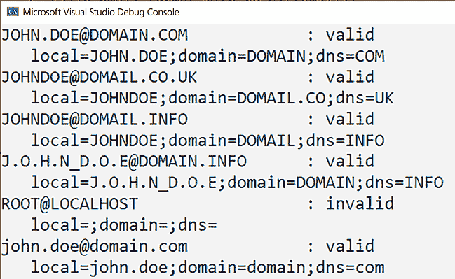

图 2.8：测试输出

## 还有更多...

正则表达式有多种版本，C++标准库支持其中的六种：ECMAScript、基本 POSIX、扩展 POSIX、awk、grep 和 egrep（带有 `-E` 选项的 grep）。默认使用的语法是 ECMAScript，若要使用其他语法，必须在定义正则表达式时显式指定语法。您可以在[`en.cppreference.com/w/cpp/regex/syntax_option_type`](https://en.cppreference.com/w/cpp/regex/syntax_option_type)了解更多支持的语法选项。除了指定语法外，还可以指定解析选项，例如忽略大小写进行匹配。

标准库提供的类和算法比我们之前看到的要多。库中可用的主要类如下（所有这些都是类模板，并且为了方便，为不同的字符类型提供了 typedefs）：

+   类模板 `std::basic_regex` 定义了正则表达式对象：

    ```cpp
    typedef basic_regex<char>    regex;
    typedef basic_regex<wchar_t> wregex; 
    ```

+   类模板 `std::sub_match` 表示匹配捕获组的字符序列；这个类实际上是 `std::pair` 的派生类，其 `first` 和 `second` 成员表示匹配序列中第一个和最后一个字符的迭代器。如果没有匹配序列，则两个迭代器相等：

    ```cpp
    typedef sub_match<const char *>            csub_match;
    typedef sub_match<const wchar_t *>         wcsub_match;
    typedef sub_match<string::const_iterator>  ssub_match;
    typedef sub_match<wstring::const_iterator> wssub_match; 
    ```

+   类模板 `std::match_results` 是匹配结果的集合；第一个元素始终是目标中的完整匹配，而其他元素是子表达式的匹配：

    ```cpp
    typedef match_results<const char *>            cmatch;
    typedef match_results<const wchar_t *>         wcmatch;
    typedef match_results<string::const_iterator>  smatch;
    typedef match_results<wstring::const_iterator> wsmatch; 
    ```

正则表达式标准库中可用的算法如下：

+   `std::regex_match()`: 这尝试将一个正则表达式（由一个`std::basic_regex`实例表示）与整个字符串进行匹配。

+   `std::regex_search()`: 这尝试将一个正则表达式（由一个`std::basic_regex`实例表示）与字符串的一部分（包括整个字符串）进行匹配。

+   `std::regex_replace()`: 这根据指定的格式替换正则表达式中的匹配项。

正则表达式标准库中可用的迭代器如下：

+   `std::regex_iterator`: 一个常量前向迭代器，用于遍历字符串中模式的匹配项。它有一个指向`std::basic_regex`的指针，该指针必须存在于迭代器被销毁之前。在创建和递增时，迭代器调用`std::regex_search()`并存储算法返回的`std::match_results`对象的副本。

+   `std::regex_token_iterator`: 一个常量前向迭代器，用于遍历字符串中每个正则表达式匹配项的子匹配。内部，它使用`std::regex_iterator`来遍历子匹配。由于它存储了一个指向`std::basic_regex`实例的指针，因此正则表达式对象必须存在于迭代器被销毁之前。

应该指出的是，标准正则表达式库的性能比其他实现（如 Boost.Regex）较差，并且不支持 Unicode。此外，可以争论说 API 本身使用起来比较繁琐。然而，使用标准库的好处是避免了额外的依赖。

## 参见

+   *使用正则表达式解析字符串内容*，学习如何在文本中执行多个模式的匹配

+   *使用正则表达式替换字符串内容*，以了解如何使用正则表达式执行文本替换

+   *第一章*，*使用结构化绑定处理多返回值*，学习如何将变量绑定到初始化表达式中的子对象或元素

# 使用正则表达式解析字符串内容

在前面的菜谱中，我们探讨了如何使用`std::regex_match()`来验证字符串内容是否与特定格式匹配。该库提供了一个名为`std::regex_search()`的另一个算法，它将正则表达式与字符串的任何部分（而不是整个字符串）进行匹配，正如`regex_match()`所做的那样。然而，这个函数不允许我们在输入字符串中搜索正则表达式的所有出现。为此，我们需要使用库中可用的一个迭代器类。

在这个菜谱中，你将学习如何使用正则表达式解析字符串的内容。为此，我们将考虑解析包含名称-值对的文本文件的问题。每个这样的对都在不同的行上定义，格式为 `name = value`，但以 `#` 开头的行代表注释，必须忽略。以下是一个示例：

```cpp
#remove # to uncomment a line
timeout=120
server = 127.0.0.1
#retrycount=3 
```

在查看实现细节之前，让我们考虑一些先决条件。

## 准备工作

关于 C++11 中正则表达式支持的详细信息，请参阅本章前面提到的 *使用正则表达式验证字符串格式* 菜谱。进行此菜谱需要基本了解正则表达式。

在以下示例中，`text` 是一个定义为以下内容的变量：

```cpp
auto text {
  R"(
    #remove # to uncomment a line
    timeout=120
    server = 127.0.0.1
    #retrycount=3
  )"s}; 
```

这唯一的目的是为了简化我们的代码片段，尽管在现实世界的例子中，你可能会从文件或其他来源读取文本。

## 如何做到这一点...

为了通过字符串搜索正则表达式的出现，你应该这样做：

1.  包含头文件 `<regex>` 和 `<string>` 以及命名空间 `std::string_literals` 以支持字符串的标准用户定义字面量（自 C++14 开始添加）：

    ```cpp
    #include <regex>
    #include <string>
    using namespace std::string_literals; 
    ```

1.  使用原始字符串字面量（或对于 `std::wregex` 使用原始宽字符串字面量）来指定正则表达式，以避免转义反斜杠（这可能会频繁发生）。以下正则表达式验证了之前提出的文件格式：

    ```cpp
    auto pattern {R"(^(?!#)(\w+)\s*=\s*([\w\d]+[\w\d._,\-:]*)$)"s}; 
    ```

1.  创建一个 `std::regex`/`std::wregex` 对象（根据使用的字符集而定）来封装正则表达式：

    ```cpp
    auto rx = std::regex{pattern}; 
    ```

1.  要在给定的文本中搜索正则表达式的第一个出现，请使用通用算法 `std::regex_search()`（示例 1）：

    ```cpp
    auto match = std::smatch{};
    if (std::regex_search(text, match, rx))
    {
      std::cout << match[1] << '=' << match[2] << '\n';
    } 
    ```

1.  要在给定的文本中找到所有正则表达式的出现，请使用迭代器 `std::regex_iterator`（示例 2）：

    ```cpp
    auto end = std::sregex_iterator{};
    for (auto it=std::sregex_iterator{ std::begin(text),
                                       std::end(text), rx };
         it != end; ++it)
    {
      std::cout << '\'' << (*it)[1] << "'='"
                << (*it)[2] << '\'' << '\n';
    } 
    ```

1.  要迭代通过一个匹配的所有子表达式，请使用迭代器 `std::regex_token_iterator`（示例 3）：

    ```cpp
    auto end = std::sregex_token_iterator{};
    for (auto it = std::sregex_token_iterator{
                      std::begin(text), std::end(text), rx };
         it != end; ++it)
    {
      std::cout << *it << '\n';
    } 
    ```

## 它是如何工作的...

一个可以解析前面显示的输入文件的简单正则表达式可能看起来像这样：

```cpp
^(?!#)(\w+)\s*=\s*([\w\d]+[\w\d._,\-:]*)$ 
```

这个正则表达式旨在忽略所有以 `#` 开头的行；对于不以 `#` 开头的行，匹配一个名称后跟等号，然后是一个值，该值可以由字母数字字符和几个其他字符（下划线、点、逗号等）组成。这个正则表达式的确切含义如下所述：

| **部分** | **描述** |
| --- | --- |
| `^` | 行首 |
| `(?!#)` | 一个负向前瞻，确保不可能匹配 `#` 字符 |
| `(\w)+` | 表示至少一个单词字符的标识符的捕获组 |
| `\s*` | 任意空白字符 |
| `=` | 等号 |
| `\s*` | 任意空白字符 |
| `([\w\d]+[\w\d._,\-:]*)` | 表示以字母数字字符开头的值，但也可以包含点、逗号、反斜杠、连字符、冒号或下划线等字符的捕获组 |
| `$` | 行尾 |

表 2.15：分解正则表达式

我们可以使用 `std::regex_search()` 在输入文本的任何位置进行搜索。此算法有几个重载版本，但通常它们的工作方式相同。您必须指定要处理的字符范围、一个输出 `std::match_results` 对象，该对象将包含匹配结果，以及一个表示正则表达式和匹配标志（定义搜索方式）的 `std::basic_regex` 对象。如果找到匹配项，函数返回 `true`，否则返回 `false`。

在上一节的第一例（见第四个列表项）中，`match` 是 `std::smatch` 的一个实例，它是 `std::match_results` 的一个 typedef，模板类型为 `string::const_iterator`。如果找到匹配项，此对象将包含所有匹配子表达式的匹配信息序列。索引 0 的子匹配始终是整个匹配。

索引 1 的子匹配是第一个匹配的子表达式，索引 2 的子匹配是第二个匹配的子表达式，依此类推。由于我们的正则表达式中有两个捕获组（即子表达式），在成功的情况下 `std::match_results` 将有三个子匹配。代表名称的标识符位于索引 1，等号后面的值位于索引 2。因此，此代码只打印以下内容：

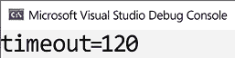

图 2.9：第一个示例的输出

`std::regex_search()` 算法无法遍历文本中所有可能的匹配项。为了做到这一点，我们需要使用一个迭代器。`std::regex_iterator` 就是为了这个目的而设计的。它不仅允许遍历所有匹配项，还可以访问匹配项的所有子匹配。

迭代器实际上在构造和每次递增时都会调用 `std::regex_search()`，并且会记住调用结果中的 `std::match_results`。默认构造函数创建了一个表示序列末尾的迭代器，可以用来测试在遍历匹配时何时应该停止循环。

在上一节的第二个示例（见第五个列表项）中，我们首先创建了一个序列末尾的迭代器，然后开始遍历所有可能的匹配项。在构造时，它将调用 `std::regex_match()`，如果找到匹配项，我们可以通过当前迭代器访问其结果。这将一直持续到没有找到匹配项（序列的末尾）。此代码将打印以下输出：

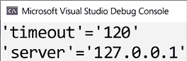

图 2.10：第二个示例的输出

`std::regex_iterator` 的一个替代方案是 `std::regex_token_iterator`。它的工作方式与 `std::regex_iterator` 类似，实际上，它内部包含这样一个迭代器，但它使我们能够访问匹配中的特定子表达式。这在本节中的第三个示例（见第六个列表项）中有所展示。我们首先创建一个序列结束迭代器，然后遍历匹配直到达到序列结束。在构造函数中，我们没有指定通过迭代器访问的子表达式的索引；因此，使用默认值 0。这意味着这个程序将打印出所有匹配项：

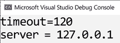

图 2.11：第三个示例的输出

如果我们只想访问第一个子表达式（在我们的例子中意味着名称），我们只需在标记迭代器的构造函数中指定子表达式的索引，如下所示：

```cpp
auto end = std::sregex_token_iterator{};
for (auto it = std::sregex_token_iterator{ std::begin(text),
               std::end(text), rx, 1 };
     it != end; ++it)
{
  std::cout << *it << '\n';
} 
```

这次，我们得到的输出只包含名称。如下图所示：

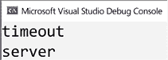

图 2.12：仅包含名称的输出

关于标记迭代器的一个有趣之处在于，如果子表达式的索引为 `-1`，它可以返回字符串的不匹配部分，在这种情况下，它返回一个 `std::match_results` 对象，该对象对应于最后一个匹配项和序列结束之间的字符序列：

```cpp
auto end = std::sregex_token_iterator{};
for (auto it = std::sregex_token_iterator{ std::begin(text),
               std::end(text), rx, -1 };
     it != end; ++it)
{
  std::cout << *it << '\n';
} 
```

这个程序将输出以下内容：

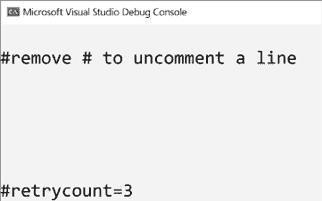

图 2.13：包括空行的输出

请注意，输出中的空行对应于空标记。

## 参见

+   *使用正则表达式验证字符串格式*，以熟悉 C++ 库对正则表达式工作的支持

+   *使用正则表达式替换字符串内容*，以学习如何在文本中执行多个模式匹配

# 使用正则表达式替换字符串内容

在前两个示例中，我们探讨了如何在字符串或字符串的一部分上匹配正则表达式，并遍历匹配和子匹配。正则表达式库还支持基于正则表达式的文本替换。在本例中，我们将学习如何使用 `std::regex_replace()` 来执行此类文本转换。

## 准备工作

关于 C++11 中正则表达式支持的详细信息，请参阅本章早些时候的 *使用正则表达式验证字符串格式* 示例。

## 如何操作...

为了使用正则表达式执行文本转换，你应该执行以下操作：

+   包含 `<regex>` 和 `<string>` 以及 `std::string_literals` 命名空间，用于 C++14 标准的字符串用户定义文字：

    ```cpp
    #include <regex>
    #include <string>
    using namespace std::string_literals; 
    ```

+   使用 `std::regex_replace()` 算法，并将替换字符串作为第三个参数。考虑以下示例。将所有由 `a`、`b` 或 `c` 组成的恰好三个字符的单词替换为三个连字符：

    ```cpp
    auto text{"abc aa bca ca bbbb"s};
    auto rx = std::regex{ R"(\b[a|b|c]{3}\b)"s };
    auto newtext = std::regex_replace(text, rx, "---"s); 
    ```

+   使用带有`$`前缀的匹配标识符的`std::regex_replace()`算法的第三个参数。例如，将“姓氏，名字”格式的名字替换为“名字 姓氏”格式，如下所示：

    ```cpp
    auto text{ "bancila, marius"s };
    auto rx = std::regex{ R"((\w+),\s*(\w+))"s };
    auto newtext = std::regex_replace(text, rx, "$2 $1"s); 
    ```

## 它是如何工作的...

`std::regex_replace()`算法有几个具有不同类型参数的重载，但参数的意义如下：

+   执行替换的输入字符串

+   一个封装用于识别要替换的字符串部分的正则表达式的`std::basic_regex`对象

+   用于替换的字符串格式

+   可选的匹配标志

返回值取决于使用的重载，可以是字符串或作为参数提供的输出迭代器的副本。用于替换的字符串格式可以是简单的字符串或带有`$`前缀的匹配标识符：

+   `$&`表示整个匹配。

+   `$1`、`$2`、`$3`等表示第一个、第二个和第三个子匹配等。

+   `` $` ``表示字符串中第一个匹配之前的部分。

+   `$'`表示字符串中最后一个匹配之后的部分。

在“如何做...”部分展示的第一个示例中，初始文本包含由恰好三个`a`、`b`和`c`字符组成的两个单词：`abc`和`bca`。正则表达式表示在单词边界之间的恰好三个字符的表达式。这意味着像`bbbb`这样的子文本不会与表达式匹配。替换的结果是字符串文本将变为`--- aa --- ca bbbb`。

可以为`std::regex_replace()`算法指定额外的匹配标志。默认情况下，匹配标志是`std::regex_constants::match_default`，这基本上指定了 ECMAScript 作为构建正则表达式所使用的语法。如果我们想，例如，只替换第一次出现的内容，那么我们可以指定`std::regex_constants::format_first_only`。在下面的示例中，结果是替换后的字符串为`--- aa bca ca bbbb`，因为替换在找到第一个匹配后停止：

```cpp
auto text{ "abc aa bca ca bbbb"s };
auto rx = std::regex{ R"(\b[a|b|c]{3}\b)"s };
auto newtext = std::regex_replace(text, rx, "---"s,
                 std::regex_constants::format_first_only); 
```

然而，替换字符串可以包含特殊指示符，用于整个匹配、特定的子匹配或未匹配的部分，如前所述。在“如何做...”部分展示的第二个示例中，正则表达式识别一个至少包含一个字符的单词，后面跟一个逗号和可能的空白字符，然后是另一个至少包含一个字符的单词。第一个单词应该是姓氏，而第二个单词应该是名字。替换字符串采用`$2 $1`格式。这是一条用于将匹配的表达式（在这个例子中是整个原始字符串）替换为另一个字符串的指令，该字符串由第二个子匹配组成，后面跟一个空格，然后是第一个子匹配。

在这种情况下，整个字符串都是匹配的。在下面的例子中，字符串内部将有多个匹配，并且它们都将被替换为指定的字符串。在这个例子中，我们正在替换以元音字母开头的单词（当然，这并不包括以元音音素开头的单词）前的不定冠词 *a*，将其替换为不定冠词 *an*：

```cpp
auto text{"this is a example with a error"s};
auto rx = std::regex{R"(\ba ((a|e|i|u|o)\w+))"s};
auto newtext = std::regex_replace(text, rx, "an $1"); 
```

正则表达式将字母 *a* 识别为一个单独的单词（`\b` 表示单词边界，所以 `\ba` 表示一个只有一个字母的单词，*a*），后面跟着一个空格和一个至少有两个字符且以元音字母开头的单词。当识别到这样的匹配时，它将被替换为一个由固定字符串 *an* 后跟一个空格和匹配的第一个子表达式组成的字符串，即单词本身。在这个例子中，`newtext` 字符串将是 `this is an example with an error`。

除了子表达式的标识符（`$1`、`$2` 等等）之外，还有整个匹配的标识符（`$&`）、第一个匹配之前字符串的部分（`$`），以及最后一个匹配之后字符串的部分（`$'`）。在最后一个例子中，我们将日期的格式从 `dd.mm.yyyy` 更改为 `yyyy.mm.dd`，同时也显示了匹配的部分：

```cpp
auto text{"today is 1.06.2023!!"s};
auto rx = std::regex{R"((\d{1,2})(\.|-|/)(\d{1,2})(\.|-|/)(\d{4}))"s};
// today is 2023.06.1!!
auto newtext1 = std::regex_replace(text, rx, R"($5$4$3$2$1)");
// today is [today is ][1.06.2023][!!]!!
auto newtext2 = std::regex_replace(text, rx, R"([$`][$&][$'])"); 
```

正则表达式匹配一个一位或两位数字后跟一个点、连字符或斜杠；然后是另一个一位或两位数字；然后是一个点、连字符或斜杠；最后是一个四位数。请记住，这只是一个例子，并且有更好的表达式可以用来解析日期。

对于 `newtext1`，替换字符串是 `$5$4$3$2$1`；这意味着年份，然后是第二个分隔符，然后是月份，第一个分隔符，最后是日期。因此，对于输入字符串 `today is 1.06.2023!`，结果是 `today is 2023.06.1!!`。

对于 `newtext2`，替换字符串是 ``[$`][$&][$']``；这意味着第一个匹配之前的部分，然后是整个匹配，最后是最后一个匹配之后的部分都放在方括号中。然而，结果并不是你一开始可能期望的 `[!!][1.06.2023][today is ]`，而是 `today is [today is ][1.06.2023][!!]!!`。这是因为被替换的是匹配的表达式，在这种情况下，只有日期 (`1.06.2023`)。这个子字符串被替换为另一个由初始字符串的所有部分组成的字符串。

## 参见

+   *使用正则表达式验证字符串的格式*，以便熟悉 C++库对正则表达式工作的支持

+   *使用正则表达式解析字符串内容*，以学习如何在文本中执行多个模式的匹配

# 使用 std::string_view 而不是常量字符串引用

当处理字符串时，会不断创建临时对象，即使你可能并没有真正意识到这一点。很多时候，这些临时对象都是无关紧要的，它们仅仅是为了将数据从一个地方复制到另一个地方（例如，从一个函数到其调用者）而服务的。这代表了一个性能问题，因为它们需要内存分配和数据复制，这些都应该尽量避免。为此，C++17 标准提供了一个新的字符串类模板，称为 `std::basic_string_view`，它表示对字符串的非拥有常量引用（即，字符序列）。在本食谱中，你将学习何时以及如何使用这个类。

## 准备工作

`string_view` 类在 `string_view` 头文件中的 `std` 命名空间中可用。

## 如何做到这一点...

你应该使用 `std::string_view` 来向函数传递参数（或从函数返回值），而不是 `std::string const &`，除非你的代码需要调用其他接受 `std::string` 参数的函数（在这种情况下，需要进行转换）：

```cpp
std::string_view get_filename(std::string_view str)
{
  auto const pos1 {str.find_last_of('')};
  auto const pos2 {str.find_last_of('.')};
  return str.substr(pos1 + 1, pos2 - pos1 - 1);
}
char const file1[] {R"(c:\test\example1.doc)"};
auto name1 = get_filename(file1);
std::string file2 {R"(c:\test\example2)"};
auto name2 = get_filename(file2);
auto name3 = get_filename(std::string_view{file1, 16}); 
```

## 它是如何工作的...

在我们查看新的字符串类型是如何工作之前，让我们考虑以下一个函数的例子，该函数旨在提取不带扩展名的文件名。这基本上是在 C++17 之前你会如何编写该函数：

```cpp
std::string get_filename(std::string const & str)
{
  auto const pos1 {str.find_last_of('\\')};
  auto const pos2 {str.find_last_of('.')};
  return str.substr(pos1 + 1, pos2 - pos1 - 1);
}
auto name1 = get_filename(R"(c:\test\example1.doc)"); // example1
auto name2 = get_filename(R"(c:\test\example2)");     // example2
if(get_filename(R"(c:\test\_sample_.tmp)").front() == '_') {} 
```

注意，在这个例子中，文件分隔符是 `\`（反斜杠），就像在 Windows 中一样。对于基于 Linux 的系统，它必须更改为 `/`（斜杠）。

`get_filename()` 函数相对简单。它接受一个对 `std::string` 的常量引用，并识别由最后一个文件分隔符和最后一个点界定的子串，这基本上代表了一个不带扩展名（以及不带文件夹名称）的文件名。

然而，这个代码的问题在于，它根据编译器的优化程度创建了一个、两个，甚至可能更多的临时对象。函数参数是一个常量 `std::string` 引用，但函数是用字符串字面量调用的，这意味着 `std::string` 需要从字面量构造。这些临时对象需要分配和复制数据，这既耗时又消耗资源。在最后一个例子中，我们只想检查文件名的第一个字符是否是下划线，但我们为此创建了至少两个临时字符串对象。

`std::basic_string_view` 类模板旨在解决这个问题。这个类模板与 `std::basic_string` 非常相似，两者几乎有相同的接口。这是因为 `std::basic_string_view` 的目的是在不进行进一步代码更改的情况下替代对 `std::basic_string` 的常量引用。就像 `std::basic_string` 一样，它为所有标准字符类型都有特殊化：

```cpp
typedef basic_string_view<char>     string_view;
typedef basic_string_view<wchar_t>  wstring_view;
typedef basic_string_view<char16_t> u16string_view;
typedef basic_string_view<char32_t> u32string_view; 
```

`std::basic_string_view` 类模板定义了对一个连续字符序列的引用。正如其名所示，它代表了一个视图，不能用来修改字符序列的引用。一个 `std::basic_string_view` 对象具有相对较小的尺寸，因为它只需要一个指向序列中第一个字符的指针和长度。它可以从一个 `std::basic_string` 对象构建，也可以从一个指针和长度构建，或者从一个以空字符终止的字符序列（在这种情况下，它将需要遍历字符串以找到长度）。因此，`std::basic_string_view` 类模板也可以用作多种字符串类型的通用接口（只要数据只需要被读取）。另一方面，从 `std::basic_string_view` 转换到 `std::basic_string` 是不可能的。

你必须显式地从 `std::basic_string_view` 构造一个 `std::basic_string` 对象，如下例所示：

```cpp
std::string_view sv{ "demo" };
std::string s{ sv }; 
```

将 `std::basic_string_view` 传递给函数并返回 `std::basic_string_view` 仍然会创建这种类型的临时对象，但这些是在栈上的小尺寸对象（在 64 位平台上，一个指针和大小可能为 16 字节）；因此，它们应该比分配堆空间和复制数据产生更少的性能成本。

注意，所有主要编译器都提供了 `std::basic_string` 的实现，这包括一个小字符串优化。尽管实现细节不同，但它们通常依赖于具有一定数量的字符的静态分配缓冲区（对于 VC++和 GCC 5 或更新的版本为 16），这不需要堆操作，只有当字符串的大小超过这个数字时才需要堆操作。

除了与 `std::basic_string` 中可用的方法相同的方法外，`std::basic_string_view` 还有两个更多：

+   `remove_prefix()`: 通过增加起始位置*N*个字符和减少长度*N*个字符来缩小视图

+   `remove_suffix()`: 通过减少长度来缩小视图，长度减少*N*个字符

在以下示例中，这两个成员函数用于从 `std::string_view` 中修剪空格，包括开头和结尾。函数的实现首先查找第一个不是空格的元素，然后查找最后一个不是空格的元素。然后，它从末尾移除最后一个非空格字符之后的所有内容，并从开头移除直到第一个非空格字符的所有内容。函数返回修剪两端的新视图：

```cpp
std::string_view trim_view(std::string_view str)
{
  auto const pos1{ str.find_first_not_of(" ") };
  auto const pos2{ str.find_last_not_of(" ") };
  str.remove_suffix(str.length() - pos2 - 1);
  str.remove_prefix(pos1);
  return str;
}
auto sv1{ trim_view("sample") };
auto sv2{ trim_view("  sample") };
auto sv3{ trim_view("sample  ") };
auto sv4{ trim_view("  sample  ") };
std::string s1{ sv1 };
std::string s2{ sv2 };
std::string s3{ sv3 };
std::string s4{ sv4 }; 
```

当使用 `std::basic_string_view` 时，你必须注意两件事：你不能更改视图所引用的底层数据，你必须管理数据的生命周期，因为视图是一个非拥有引用。

## 参见

+   *创建字符串辅助库*，以了解如何创建有用的文本实用工具，这些实用工具在标准库中不可直接使用

# 使用 std::format 和 std::print 格式化和打印文本

C++语言有两种格式化文本的方式：`printf`函数族和 I/O 流库。`printf`函数是从 C 继承而来的，提供了格式文本和参数的分离。流库提供了安全性和可扩展性，通常比`printf`函数更推荐，但通常速度较慢。C++20 标准提出了一个新的输出格式化库替代方案，其形式类似于`printf`，但更安全、更可扩展，旨在补充现有的流库。在本食谱中，我们将学习如何使用新的功能，而不是使用`printf`函数或流库。

## 准备工作

新的格式化库在`<format>`头文件中可用。你必须包含此头文件，以下示例才能正常工作。

## 如何做...

`std::format()`函数根据提供的格式字符串格式化其参数。你可以如下使用它：

+   在格式字符串中为每个参数提供空替换字段，表示为`{}`：

    ```cpp
    auto text = std::format("{} is {}", "John", 42); 
    ```

+   在替换字段内指定参数列表中每个参数的 0 基于索引，例如`{0}`、`{1}`等。参数的顺序不重要，但索引必须是有效的：

    ```cpp
    auto text = std::format("{0} is {1}", "John", 42); 
    ```

+   使用冒号（`:`）之后替换字段中提供的格式说明符来控制输出文本。对于基本和字符串类型，这是一个标准格式说明符。对于 chrono 类型，这是一个 chrono 格式说明符：

    ```cpp
    auto text = std::format("{0} hex is {0:08X}", 42);
    auto now = std::chrono::system_clock::now();
    auto date = std::format("Today is {:%Y-%m-%d}", now);
    std::cout << date << '\n'; 
    ```

你也可以使用`std::format_to()`或`std::format_to_n()`通过迭代器以输出格式写入参数，如下所示：

+   使用`std::format_n()`和`std::back_inserter()`辅助函数将内容写入缓冲区，例如`std::string`或`std::vector<char>`：

    ```cpp
    std::vector<char> buf;
    std::format_to(std::back_inserter(buf), "{} is {}", "John", 42); 
    ```

+   使用`std::formatted_size()`检索存储参数格式化表示所需的字符数：

    ```cpp
    auto size = std::formatted_size("{} is {}", "John", 42);
    std::vector<char> buf(size);
    std::format_to(buf.data(), "{} is {}", "John", 42); 
    ```

+   要限制写入输出缓冲区的字符数，你可以使用`std::format_to_n()`，它与`std::format_to()`类似，但最多写入`n`个字符：

    ```cpp
    char buf[100];
    auto result = std::format_to_n(buf, sizeof(buf), "{} is {}", "John", 42); 
    ```

在 C++23 中，你可以使用新`<print>`头文件中的以下函数直接将格式化文本写入文件流，例如标准输出控制台：

+   `std::print`，用于根据格式字符串写入参数：

    ```cpp
    std::print("The answer is {}", 42); 
    ```

+   `std::println`，用于根据格式字符串后跟一个换行符（`'\n'`）写入参数：

    ```cpp
    std::println("The answer is {}", 42);
    std::FILE* stream = std::fopen("demo.txt", "w");
    if (stream)
    {
       std::println(stream, "The answer is {}", 42);
       std::fclose(stream);
    } 
    ```

## 它是如何工作的...

`std::format()`函数有多个重载。你可以指定格式字符串为字符串视图或宽字符串视图，函数返回`std::string`或`std::wstring`。你也可以指定第一个参数为一个`std::locale`，它用于特定区域设置的格式化。函数重载都是变参函数模板，这意味着你可以在格式之后指定任意数量的参数。

格式字符串由普通字符、替换字段和转义序列组成。转义序列是 `{{` 和 `}}`，在输出中它们被替换为 `{` 和 `}`。替换字段在花括号 `{}` 内提供。它可以包含一个非负数，表示要格式化的参数的 0 基于索引，后跟一个冒号（`:`），然后是一个格式规范。如果格式规范无效，则抛出 `std::format_error` 类型的异常。

类似地，`std::format_to()` 有多个重载，就像 `std::format()` 一样。这两个函数的区别在于 `std::format_to()` 总是接受输出缓冲区的迭代器作为第一个参数，并返回输出范围的末尾之后的迭代器（而不是 `std::format()` 所做的字符串）。另一方面，`std::format_to_n()` 比 `std::format_to()` 多一个参数。它的第二个参数是一个表示要写入缓冲区的最大字符数的数字。

以下列表显示了这三个函数模板最简单重载的签名：

```cpp
template<class... Args>
std::string format(std::string_view fmt, const Args&... args);
template<class OutputIt, class... Args>
OutputIt format_to(OutputIt out,
                   std::string_view fmt, const Args&... args);
template<class OutputIt, class... Args>
std::format_to_n_result<OutputIt>
format_to_n(OutputIt out, std::iter_difference_t<OutputIt> n,
            std::string_view fmt, const Args&... args); 
```

当你提供格式字符串时，你可以提供参数标识符（它们的 0 基于索引）或省略它们。然而，同时使用两者是不合法的。如果省略了替换字段中的索引，则按提供的顺序处理参数，并且替换字段的数量不得大于提供的参数数量。如果提供了索引，它们必须对格式字符串有效。

当使用格式规范时：

+   对于基本类型和字符串类型，它被认为是标准格式规范。

+   对于 chrono 类型，它被认为是 chrono 格式规范。

+   对于用户定义的类型，它由用户定义的 `std::formatter` 类的特化来定义，该特化针对所需类型。

标准格式规范基于 Python 中的格式规范，具有以下语法：

```cpp
fill-and-align(optional) sign(optional) #(optional) 0(optional) width(optional) precision(optional) L(optional) type(optional) 
```

这些语法部分在此简要描述。

`fill-and-align` 是一个可选的填充字符，后跟一个对齐选项：

+   `<`: 强制字段与可用空间左对齐。

+   `>`: 强制字段与可用空间右对齐。

+   `^`: 强制字段与可用空间居中对齐。为此，它将在左侧插入 n/2 个字符，在右侧插入 n/2 个字符：

    ```cpp
    auto t1 = std::format("{:5}", 42);    // "   42"
    auto t2 = std::format("{:5}", 'x');   // "x    "
    auto t3 = std::format("{:*<5}", 'x'); // "x****"
    auto t4 = std::format("{:*>5}", 'x'); // "****x"
    auto t5 = std::format("{:*⁵}", 'x'); // "**x**"
    auto t6 = std::format("{:5}", true);  // "true " 
    ```

`sign`, `#`, 和 `0` 仅在数字（整数或浮点数）使用时有效。符号可以是以下之一：

+   `+`: 指定对于负数和正数都必须使用符号

+   `-`: 指定仅对负数使用符号（这是隐式行为）

+   一个空格：指定对于负数必须使用符号，并且对于非负数必须使用前导空格：

    ```cpp
    auto t7 = std::format("{0:},{0:+},{0:-},{0: }", 42);
    // "42,+42,42, 42"
    auto t8 = std::format("{0:},{0:+},{0:-},{0: }", -42);
    // "-42,-42,-42,-42" 
    ```

`#` 符号会导致使用交替形式。这可以是以下之一：

+   对于整型，当指定二进制、八进制或十六进制表示时，交替形式会在输出前添加前缀 `0b`、`0` 或 `0x`。

+   对于浮点类型，交替形式会导致格式化值中始终存在小数点字符，即使后面没有数字。此外，当使用 `g` 或 `G` 时，输出中不会移除尾随零。

数字 `0` 指定应该输出前导零到字段宽度，除非浮点类型的值为无穷大或 `NaN`。当与对齐选项一起出现时，指定符 `0` 被忽略：

```cpp
auto t9  = std::format("{:+05d}", 42); // "+0042"
auto t10 = std::format("{:#05x}", 42); // "0x02a"
auto t11 = std::format("{:<05}", -42); // "-42  " 
```

`width` 指定最小字段宽度，可以是正的十进制数或嵌套替换字段。`precision` 字段表示浮点类型的精度或对于字符串类型，将使用多少个字符。它用一个点（`.`）后跟一个非负十进制数或嵌套替换字段来指定。

使用大写 `L` 指定区域特定的格式化，这将导致使用区域特定的格式。此选项仅适用于算术类型。

可选的 `type` 决定了数据在输出中的表示方式。以下表格显示了可用的字符串表示类型：

| **类型** | **表示类型** | **描述** |
| --- | --- | --- |
| 字符串 | 无、`s` | 将字符串复制到输出。 |
| 整型 | `b` | 带前缀 0b 的二进制格式。 |
| `B` | 带前缀 0B 的二进制格式。 |
| `C` | 字符格式。将值作为字符类型复制到输出。 |
| 无或 `d` | 十进制格式。 |
| `O` | 带前缀 0 的八进制格式（除非值为 0）。 |
| `x` | 带前缀 0x 的十六进制格式。 |
| `X` | 带前缀 0X 的十六进制格式。 |
| `char` 和 `wchar_t` | 无或 `c` | 将字符复制到输出。 |
| `b`、`B`、`c`、`d`、`o`、`x`、`X` | 整数表示类型。 |
| `bool` | 无或 `s` | 将 true 或 false 作为文本表示（或其区域特定的形式）复制到输出。 |
| `b`、`B`、`c`、`d`、`o`、`x`、`X` | 整数表示类型。 |
| 浮点数 | `a` | 十六进制表示。相当于调用 `std::to_chars(first, last, value, std::chars_format::hex, precision)` 或 `std::to_chars(first, last, value, std::chars_format::hex)`，具体取决于是否指定了精度。 |
| `A` | 与 `a` 相同，除了它使用大写字母表示大于 9 的数字，并使用 P 来表示指数。 |
| `e` | 科学表示。产生输出，就像调用 `std::to_chars(first, last, value, std::chars_format::scientific, precision)`。 |
| `E` | 与 `e` 类似，除了它使用 `E` 来表示指数。 |
| `f`、`F` | 固定表示。产生输出，就像通过调用 `std::to_chars(first, last, value, std::chars_format::fixed, precision)`。当未指定精度时，默认为 6。 |
| `g` | 通用浮点表示。输出结果类似于调用 `std::to_chars(first, last, value, std::chars_format::general, precision)`。当未指定精度时，默认为 6。 |
| `G` | 与 `g` 相同，但使用 `E` 来表示指数。 |
| 指针 | 无或 `p` | 指针表示。输出结果类似于调用 `std::to_chars(first, last, reinterpret_cast<std::uintptr_t>(value), 16)` 并在输出前加上前缀 `0x`。这仅在 `std::uintptr_t` 被定义时可用；否则，输出是未定义的。 |

表 2.16：可用的表示类型列表

时间格式规范具有以下形式：

```cpp
fill-and-align(optional) width(optional) precision(optional) chrono-spec(optional) 
```

`fill-and-align`、`width` 和 `precision` 字段与之前描述的标准格式规范中的意义相同。精度仅在 `std::chrono::duration` 类型且表示类型为浮点类型时有效。在其他情况下使用它将抛出 `std::format_error` 异常。

时间规范可以是空的，在这种情况下，参数将被格式化为如果将其流式传输到 `std::stringstream` 并复制结果字符串。或者，它可以由一系列转换规范和普通字符组成。以下表格中展示了其中一些格式规范：

| **转换规范** | **描述** |
| --- | --- |
| `%%` | 写入一个字面的 `%` 字符。 |
| `%n` | 写入一个换行符。 |
| `%t` | 写入一个水平制表符。 |
| `%Y` | 将年份以十进制数字形式写入。如果结果小于四位数字，则使用 `0` 左侧填充至四位数字。 |
| `%m` | 将月份以十进制数字形式写入（一月为 `01`）。如果结果是单个数字，则前面会加上 `0`。 |
| `%d` | 将月份中的日期以十进制数字形式写入。如果结果是单个数字，则前面会加上 `0`。 |
| `%w` | 写入星期几的十进制数字（`0`-`6`），其中星期天为 `0`。 |
| `%D` | 等同于 `%m/%d/%y`。 |
| `%F` | 等同于 `%Y-%m-%d`。 |
| `%H` | 将小时（24 小时制）以十进制数字形式写入。如果结果是单个数字，则前面会加上 `0`。 |
| `%I` | 将小时（12 小时制）以十进制数字形式写入。如果结果是单个数字，则前面会加上 `0`。 |
| `%M` | 将分钟以十进制数字形式写入。如果结果是单个数字，则前面会加上 `0`。 |
| `%S` | 将秒以十进制数字形式写入。如果秒数小于 10，则结果前面会加上 `0`。 |
| `%R` | 等同于 `%H:%M`。 |
| `%T` | 等同于 `%H:%M:%S`。 |
| `%X` | 写入区域设置的时间表示。 |

表 2.17：最常见的 chrono 规范列表

完整的 chrono 库格式规范列表可以在 [`en.cppreference.com/w/cpp/chrono/system_clock/formatter`](https://en.cppreference.com/w/cpp/chrono/system_clock/formatter) 查询。

由于将格式化文本写入控制台或文件流需要两个操作（将文本格式化为字符串或字符向量，然后将该缓冲区写入输出流），C++23 标准引入了一些新函数来简化此过程。

新的`std::print`和`std::println`函数非常相似。唯一的区别是`std::println`在格式化文本后附加一个`\n`字符（换行符）。这两个函数各有两个重载：

+   第一个参数是`std::FILE*`，表示输出文件流

+   没有这样的参数，并且隐式地使用 C 输出流 stdout

因此，以下两个对`std::println`的调用是等效的：

```cpp
std::println("The answer is {}", 42);
std::println(stdout, "The answer is {}", 42); 
```

此外，以下两个对`std::print`和`std::println`的调用在标准输出流上具有相同的结果：

```cpp
std::println("The answer is {}", 42);
std::print("The answer is {}\n", 42); 
```

格式字符串的指定与`std::format`相同，之前已经介绍过。

## 参见

+   *使用用户定义类型与 std::format 结合*，学习如何为用户定义类型创建自定义格式化特化

+   *在数字和字符串类型之间转换*，学习如何在不同数字和字符串之间进行转换

# 使用用户定义类型与 std::format 结合

C++20 格式化库是使用类似`printf`的函数或 I/O 流库的现代替代品，它实际上是对它们的补充。尽管标准为基本类型（如整数和浮点类型、`bool`、字符类型、字符串和 chrono 类型）提供了默认格式化，但用户可以为用户定义类型创建自定义特化。在本食谱中，我们将学习如何做到这一点。

## 准备工作

您应该阅读之前的食谱，*使用 std::format 和 std::print 格式化和打印文本*，以便熟悉格式化库。

在我们将要展示的示例中，我们将使用以下类：

```cpp
struct employee
{
   int         id;
   std::string firstName;
   std::string lastName;
}; 
```

在下一节中，我们将介绍实现使用`std::format()`对用户定义类型进行文本格式化的必要步骤。

## 如何做到...

要启用使用新格式化库对用户定义类型进行格式化，必须执行以下操作：

+   在`std`命名空间中定义`std::formatter<T, CharT>`类的特化。

+   实现一个`parse()`方法来解析格式字符串中对应当前参数的部分。如果类继承自另一个格式化器，则可以省略此方法。

+   实现一个`format()`方法来格式化参数，并通过`format_context`写入输出。

对于这里列出的`employee`类，可以实现一个格式化器，将`employee`格式化为`[42] John Doe`的形式（即`[id] firstName lastName`），具体实现如下：

```cpp
template <>
struct std::formatter<employee>
{
   constexpr auto parse(format_parse_context& ctx)
 {
      return ctx.begin();
   }
   auto format(employee const & e, format_context& ctx) const 
 {
      return std::format_to(ctx.out(),
                            "[{}] {} {}",
                            e.id, e.firstName, e.lastName);
   }
}; 
```

## 它是如何工作的...

格式化库使用`std::formatter<T, CharT>`类模板来定义给定类型的格式化规则。内置类型、字符串类型和 chrono 类型由库提供格式化器。这些是`std::formatter<T, CharT>`类模板的特殊化实现。

这个类有两个方法：

+   `parse()`函数接受一个类型为`std::basic_format_parse_context<CharT>`的单个参数，并解析由解析上下文提供的类型`T`的格式说明。解析的结果应存储在类的成员字段中。如果解析成功，此函数应返回类型为`std::basic_format_parse_context<CharT>::iterator`的值，它表示格式说明符的结束。如果解析失败，函数应抛出类型为`std::format_error`的异常，以提供有关错误的详细信息。

+   `format()`函数接受两个参数，第一个是要格式化的类型`T`的对象，第二个是格式化上下文对象，类型为`std::basic_format_context<OutputIt, CharT>`。此函数应根据所需的说明符（可能是隐式的或解析格式说明的结果）将输出写入`ctx.out()`。函数必须返回类型为`std::basic_format_context<OutputIt, CharT>::iterator`的值，表示输出的结束。

在前一个部分中展示的实现中，`parse()`函数除了返回表示格式说明符开始的迭代器之外，不做任何事情。格式化总是通过在方括号内打印员工标识符，然后是名字和姓氏来完成的，例如`[42] John Doe`。尝试使用格式说明符会导致编译时错误：

```cpp
employee e{ 42, "John", "Doe" };
auto s1 = std::format("{}", e);   // [42] John Doe
auto s2 = std::format("{:L}", e); // error 
```

如果你希望你的用户定义类型支持格式说明符，那么你必须正确实现`parse()`方法。为了展示如何实现这一点，我们将支持`employee`类中定义的几个说明符，如下表所示：

| **说明符** | **描述** | **示例** |
| --- | --- | --- |
| `L` | 字典顺序 | [42] Doe, John |
| `l` | 小写 | [42] john doe |
| `u` | 大写 | [42] JOHN DOE |

表 2.18：用户定义的`employee`类支持的说明符

当使用`L`说明符时，`employee`将以方括号内的标识符开始格式化，然后是姓氏，一个逗号，然后是名字，例如`[42] Doe, John`。这些说明符的组合也是可能的。例如，`{:Ll}`将产生`[42] doe, john`，而`{:uL}`将产生`[42] DOE, JOHN`。

实现定义要求的`std::formatter`类模板的`employee`类的特殊化可能如下所示：

```cpp
template<>
struct std::formatter<employee>
{
   constexpr auto parse(std::format_parse_context& ctx)
 {
      auto iter = begin(ctx);
      while(iter != ctx.end() && *iter != '}')
      {
         switch (*iter)
         {
         case 'L': lexicographic_order = true; break;
         case 'u': uppercase = true; break;
         case 'l': lowercase = true; break;
         }
         ++iter;
      }
      return iter;
   }
   auto format(employee const& e, std::format_context& ctx) const
 {
      if (lexicographic_order)
         return std::format_to(ctx.out(), 
                               "[{}] {}, {}", 
                               e.id, 
                               text_format(e.lastName), 
                               text_format(e.firstName));
      return std::format_to(ctx.out(), 
                            "[{}] {} {}", 
                            e.id, 
                            text_format(e.firstName),
                            text_format(e.lastName));
   }
private:
   bool lexicographic_order = false;
   bool uppercase = false;
   bool lowercase = false;

   constexpr std::string text_format(std::string text) const
 {
      if(lowercase)
         std::transform(text.begin(), text.end(), text.begin(),                         ::tolower);
      else if(uppercase)
         std::transform(text.begin(), text.end(), text.begin(),                         ::toupper);
      return text;
   }
}; 
```

`parse()` 函数接收包含格式字符串的解析上下文。`begin()` 迭代器指向格式分隔符（`:`）之后的格式字符串的第一个元素。下一个表格提供了一个示例：

| **格式** | **begin() 迭代器** | **范围** |
| --- | --- | --- |
| `"{}"` | 等同于 `end()` | 空的 |
| `"{0}"` | 等同于 `end()` | 空的 |
| `"{0:L}"` | 指向 `'L'` | `L}` |
| `"{:L}"` | 指向 `'L'` | `L}` |
| `"{:Lul}"` | 指向 `'L'` | `Lul}` |

表 2.19：解析上下文内容的示例

定义了这些之后，前面的示例代码（使用 `{:L}` 格式参数）将可以工作。此外，可以使用 `L`、`u` 和 `l` 指定符的各种组合，如下所示：

```cpp
auto s1 = std::format("{}", e);     // [42] John Doe
auto s2 = std::format("{:L}", e);   // [42] Doe, John
auto s3 = std::format("{:u}", e);   // [42] JOHN DOE
auto s4 = std::format("{:lL}", e);  // [42] doe, john
// uppercase ignored when lowercase also specified
auto s5 = std::format("{:ulL}", e); // [42] doe, john 
```

同一个参数的多次使用也是可能的，如下面的代码片段所示：

```cpp
auto s6 = std::format("{0} = {0:L}", e);
// [42] John Doe = [42] Doe, John 
```

然而，使用其他格式指定符（例如 `A`）将不会工作；指定符将被简单地忽略，并使用默认格式化：

```cpp
auto s7 = std::format("{:A}", e);   // [42] John Doe 
```

如果你不需要解析格式指定符以支持各种选项，你可以完全省略 `parse()` 方法。但是，为了这样做，你的 `std::formatter` 特化必须从另一个 `std::formatter` 类派生。一个实现示例如下：

```cpp
template<>
struct std::formatter<employee> : std::formatter<char const*>
{
   auto format(employee const& e, std::format_context& ctx) const
 {
      return std::format_to(ctx.out(), "[{}] {} {}",
                            e.id, e.firstName, e.lastName);
   }
}; 
```

这个 `employee` 类的特化与前面在 *如何做...* 部分中显示的第一个实现等效。

## 还有更多...

C++23 标准引入了一个新的概念，称为 `std::formattable`（也在 `<format>` 头文件中），它指定一个类型是可格式化的。这意味着对于类型 `T`，有 `std::format` 的特化，并且它定义了 `parse()` 和 `format()` 成员函数，如本食谱中所述。

## 参考内容

+   *使用 std::format 格式化文本*，以获得对新的 C++20 文本格式化库的介绍

# 在 Discord 上了解更多

加入我们社区的 Discord 空间，与作者和其他读者进行讨论：

`discord.gg/7xRaTCeEhx`


