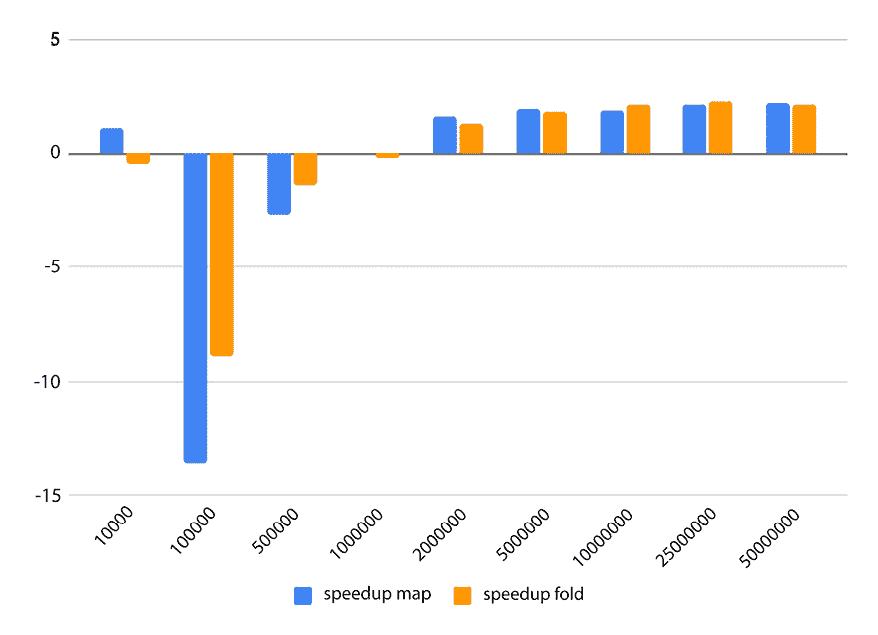
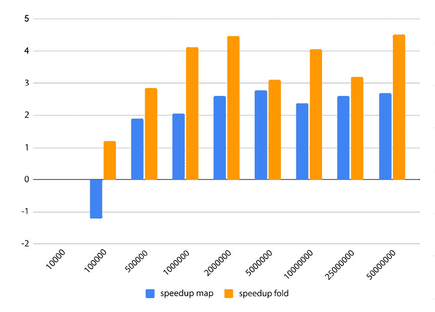
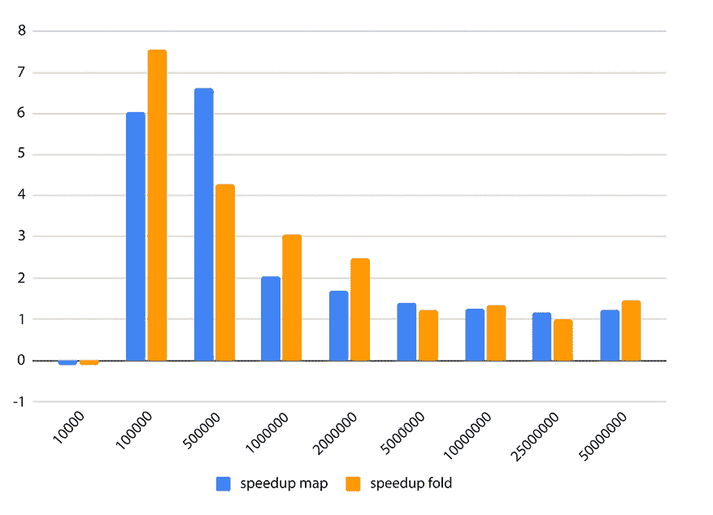
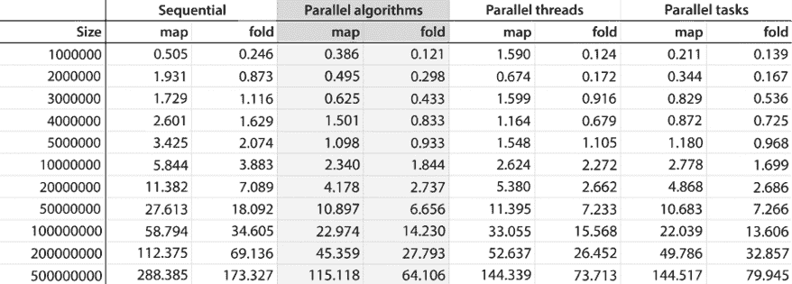
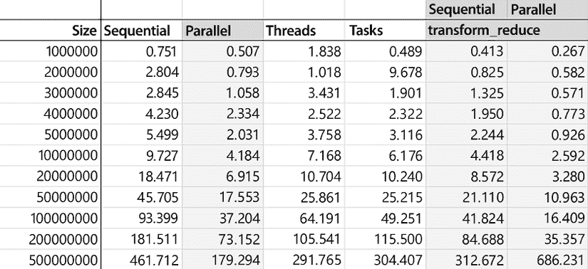

# 第八章：利用线程和并发

大多数计算机都包含多个处理器或至少多个核心，利用这种计算能力对于许多应用类别至关重要。不幸的是，许多开发者仍然持有顺序代码执行的心态，即使不依赖彼此的操作也可以并发执行。本章介绍了标准库对线程、异步任务和相关组件的支持，以及一些最后的实际示例。

大多数现代处理器（除了那些针对不需要强大计算能力的应用类型，如物联网应用）都有两个、四个或更多核心，这使您能够并发执行多个执行线程。应用程序必须明确编写以利用现有的多个处理单元；您可以通过同时在多个线程上执行函数来编写此类应用程序。自 C++11 以来，标准库提供了与线程、共享数据同步、线程通信和异步任务一起工作的支持。在本章中，我们将探讨与线程和任务相关的重要主题。

本章包括以下食谱：

+   与线程一起工作

+   使用互斥锁和锁同步对共享数据的访问

+   寻找递归互斥锁的替代方案

+   处理线程函数的异常

+   在线程之间发送通知

+   使用承诺和未来从线程返回值

+   异步执行函数

+   使用原子类型

+   使用线程实现并行 `map` 和 `fold`

+   使用任务实现并行 `map` 和 `fold`

+   使用标准并行算法实现并行 `map` 和 `fold`

+   使用可连接线程和取消机制

+   使用闩锁、屏障和信号量同步线程

+   从多个线程同步写入输出流

本章的第一部分，我们将探讨库中内置支持的多种线程对象和机制，例如线程、锁定对象、条件变量、异常处理等。

# 与线程一起工作

线程是由调度程序（如操作系统）独立管理的指令序列。线程可以是软件或硬件。软件线程是由操作系统管理的执行线程。它们通常通过时间切片在单个处理单元上运行。这是一种机制，其中每个线程在操作系统调度另一个软件线程在相同处理单元上运行之前，在处理单元上获得一个执行时间槽（在毫秒范围内）。硬件线程是在物理层面的执行线程。它们基本上是一个 CPU 或 CPU 核心。它们可以在具有多处理器或多核的系统上同时运行，即并行运行。许多软件线程可以同时在硬件线程上运行，通常通过使用时间切片。C++库提供了与软件线程一起工作的支持。在本食谱中，你将学习如何创建和操作线程。

## 准备工作

执行线程由`thread`类表示，该类在`<thread>`头文件中的`std`命名空间中可用。相同的头文件中还有其他线程实用工具，但位于`std::this_thread`命名空间中。

在以下示例中，使用了`print_time()`函数。此函数将本地时间打印到控制台。其实现如下：

```cpp
inline void print_time()
{
  auto now = std::chrono::system_clock::now();
  auto stime = std::chrono::system_clock::to_time_t(now);
  auto ltime = std::localtime(&stime);
  std::cout << std::put_time(ltime, "%c") << '\n';
} 
```

在下一节中，我们将看到如何使用线程执行常见操作。

## 如何做到这一点...

使用以下解决方案来管理线程：

1.  要创建一个不启动新线程执行的`std::thread`对象，请使用其默认构造函数：

    ```cpp
    std::thread t; 
    ```

1.  通过构造一个`std::thread`对象并将函数作为参数传递，在另一个线程上启动函数的执行：

    ```cpp
    void func1()
    {
      std::cout << "thread func without params" << '\n';
    }
    std::thread t1(func1);
    std::thread t2([]() {
      std::cout << "thread func without params" << '\n'; }); 
    ```

1.  通过构造一个`std::thread`对象，并将函数作为构造函数的参数传递，然后传递其参数，在另一个线程上启动具有参数的函数的执行：

    ```cpp
    void func2(int const i, double const d, std::string const s)
    {
      std::cout << i << ", " << d << ", " << s << '\n';
    }
    std::thread t(func2, 42, 42.0, "42"); 
    ```

1.  要等待线程完成其执行，请使用`thread`对象的`join()`方法：

    ```cpp
    t.join(); 
    ```

1.  要允许线程独立于当前`thread`对象继续执行，请使用`detach()`方法。这意味着线程将继续执行，直到完成，而不会被`std::thread`对象管理，该对象将不再拥有任何线程：

    ```cpp
    t.detach(); 
    ```

1.  要将引用传递给函数线程，请将它们包装在`std::ref`或`std::cref`（如果引用是常量）中：

    ```cpp
    void func3(int & i)
    {
      i *= 2;
    }
    int n = 42;
    std::thread t(func3, std::ref(n));
    t.join();
    std::cout << n << '\n'; // 84 
    ```

1.  要使线程的执行停止指定的时间长度，请使用`std::this_thread::sleep_for()`函数：

    ```cpp
    void func4()
    {
      using namespace std::chrono;
      print_time();
      std::this_thread::sleep_for(2s);
      print_time();
    }
    std::thread t(func4);
    t.join(); 
    ```

1.  要使线程的执行停止到指定的时间点，请使用`std::this_thread::sleep_until()`函数：

    ```cpp
    void func5()
    {
      using namespace std::chrono;
      print_time();
      std::this_thread::sleep_until(
        std::chrono::system_clock::now() + 2s);
      print_time();
    }
    std::thread t(func5);
    t.join(); 
    ```

1.  要挂起当前线程的执行并提供其他线程执行的机会，请使用`std::this_thread::yield()`：

    ```cpp
    void func6(std::chrono::seconds timeout)
    {
      auto now = std::chrono::system_clock::now();
      auto then = now + timeout;
      do
      {
        std::this_thread::yield();
      } while (std::chrono::system_clock::now() < then);
    }
    std::thread t(func6, std::chrono::seconds(2));
    t.join();
    print_time(); 
    ```

## 它是如何工作的...

表示单个执行线程的`std::thread`类有几个构造函数：

+   一个默认构造函数，它只创建线程对象，但不启动新线程的执行。

+   一个移动构造函数，它创建一个新的线程对象来表示之前由构造函数所创建的对象所表示的线程执行。在新对象构造完成后，另一个对象就不再与执行线程相关联。

+   一个带有可变数量参数的构造函数：第一个是一个表示顶级线程函数的函数，其余的是要传递给线程函数的参数。参数需要通过值传递给线程函数。如果线程函数通过引用或常量引用接收参数，它们必须被包装在`std::ref`或`std::cref`对象中。这些是辅助函数模板，它们生成`std::reference_wrapper`类型的对象，该对象将引用包装在可复制和可赋值的对象中。

在这个例子中，线程函数无法返回值。函数实际上具有除`void`之外的返回类型并不违法，但它会忽略函数直接返回的任何值。如果它必须返回一个值，可以使用共享变量或函数参数来实现。在本书后面的*使用承诺和未来从线程返回值*配方中，我们将看到线程函数如何使用*承诺*将值返回给另一个线程。

如果函数因异常而终止，则无法在启动线程的上下文中使用`try...catch`语句捕获异常。所有异常都必须在执行线程中被捕获，但它们可以通过`std::exception_ptr`对象在线程之间传输。我们将在稍后的配方中讨论这个主题，称为*处理线程函数中的异常*。

在线程开始执行后，它既是可连接的也是可分离的。连接线程意味着阻塞当前线程的执行，直到连接的线程结束其执行。分离线程意味着将线程对象与其所代表的线程执行解耦，允许当前线程和分离的线程同时执行。分离的线程有时被称为后台线程或守护线程。当程序终止（通过从主函数返回）时，仍在运行的分离线程不会被等待。这意味着那些线程的堆栈不会被回滚。因此，堆栈上对象的析构函数不会被调用，这可能导致资源泄漏或资源损坏（文件、共享内存等）。

使用`join()`方法来连接线程，使用`detach()`方法来分离线程。一旦调用这两个方法之一，该线程就被认为是不可连接的，线程对象可以安全地被销毁。当线程被分离时，它可能需要访问的共享数据必须在其整个执行过程中可用。

当你断开线程时，你不能再将其连接。尝试这样做将导致运行时错误。你可以通过使用`joinable()`成员函数来检查线程是否可以被连接来防止这种情况。

如果线程对象超出作用域并被销毁，但既没有调用`join()`也没有调用`detach()`，则将调用`std::terminate()`。

每个线程都有一个可以检索的标识符。对于当前线程，调用`std::this_thread::get_id()`函数。对于由`thread`对象表示的另一个执行线程，调用其`get_id()`方法。

在`std::this_thread`命名空间中提供了几个额外的实用函数：

+   `yield()`方法向调度器暗示激活另一个线程。这在实现忙等待例程时很有用，如上一节中的最后一个示例。然而，实际行为是特定于实现的。实际上，对这个函数的调用可能对线程的执行没有影响。

+   `sleep_for()`方法阻塞当前线程的执行，至少达到指定的持续时间（由于调度，线程被置于睡眠状态的实际时间可能比请求的持续时间更长）。

+   `sleep_until()`方法阻塞当前线程的执行，直到至少达到指定的时刻（由于调度，实际睡眠时间可能比请求的时间更长）。

`std::thread`类需要显式调用`join()`方法来等待线程完成。这可能导致编程错误（如上所述）。C++20 标准提供了一个新的线程类，称为`std::jthread`，它解决了这个不便之处。这将是本章后面“使用可连接线程和取消机制”食谱的主题。

## 参见

+   *使用互斥锁和锁同步对共享数据的访问*，了解可用于同步线程对共享数据访问的机制以及它们是如何工作的

+   *寻找递归互斥锁的替代方案*，了解为什么应该避免递归互斥锁，以及如何将使用递归互斥锁的线程安全类型转换为使用非递归互斥锁的线程安全类型

+   *处理线程函数中的异常*，了解如何在主线程或连接线程中处理从工作线程抛出的异常

+   *在线程之间发送通知*，了解如何使用条件变量在生产者和消费者线程之间发送通知

+   *使用承诺和未来从线程返回值*，了解如何使用`std::promise`对象从线程返回一个值或异常

# 使用互斥锁和锁同步对共享数据的访问

线程允许你同时执行多个函数，但通常这些函数需要访问共享资源。对共享资源的访问必须进行同步，以确保一次只有一个线程可以读取或写入共享资源。在本例中，我们将看到 C++标准定义了哪些机制来同步对共享数据的线程访问，以及它们是如何工作的。

## 准备工作

本例中讨论的`mutex`和`lock`类在`<mutex>`头文件中的`std`命名空间中可用，而`<shared_mutex>`用于 C++14 的共享互斥锁和锁。

## 如何操作...

使用以下模式来同步对单个共享资源的访问：

1.  在适当的作用域（类或全局作用域）中定义一个`mutex`：

    ```cpp
    std::mutex g_mutex; 
    ```

1.  在每个线程访问共享资源之前，先获取这个`mutex`的`lock`：

    ```cpp
    void thread_func()
    {
      using namespace std::chrono_literals;
      {
        std::lock_guard<std::mutex> lock(g_mutex);
        std::cout << "running thread " 
                  << std::this_thread::get_id() << '\n';
      }
      std::this_thread::yield();
      std::this_thread::sleep_for(2s);
      {
        std::lock_guard<std::mutex> lock(g_mutex);
        std::cout << "done in thread " 
                  << std::this_thread::get_id() << '\n';
      }
    } 
    ```

使用以下模式来同步对多个共享资源的访问，以避免死锁：

1.  在适当的作用域（全局或类作用域）中为每个共享资源定义一个互斥锁（mutex）：

    ```cpp
    template <typename T>
    struct container
    {
      std::mutex     mutex;
      std::vector<T> data;
    }; 
    ```

1.  使用死锁避免算法通过`std::lock()`同时锁定互斥锁：

    ```cpp
    template <typename T>
    void move_between(container<T> & c1, container<T> & c2, 
                      T const value)
    {
      std::lock(c1.mutex, c2.mutex);
      // continued at 3.
    } 
    ```

1.  在锁定它们之后，将每个互斥锁的所有权采用到`std::lock_guard`类中，以确保在函数（或作用域）结束时安全释放：

    ```cpp
    // continued from 2.
    std::lock_guard<std::mutex> l1(c1.mutex, std::adopt_lock);
    std::lock_guard<std::mutex> l2(c2.mutex, std::adopt_lock);
    c1.data.erase(
      std::remove(c1.data.begin(), c1.data.end(), value), 
      c1.data.end());
    c2.data.push_back(value); 
    ```

## 它是如何工作的...

**互斥锁**（**互斥**）是一种同步原语，它允许我们从多个线程中保护对共享资源的同步访问。C++标准库提供了几种实现：

+   `std::mutex`是最常用的互斥锁类型；它在上面的代码片段中进行了说明。它提供了获取和释放互斥锁的方法。`lock()`尝试获取互斥锁，如果不可用则阻塞，`try_lock()`尝试获取互斥锁，如果不可用则不阻塞并返回，`unlock()`释放互斥锁。

+   `std::timed_mutex`与`std::mutex`类似，但提供了两种使用超时获取互斥锁的方法：`try_lock_for()`尝试获取互斥锁，如果在指定的时间内互斥锁不可用，则返回它，`try_lock_until()`尝试获取互斥锁，如果在指定的时间点之前互斥锁不可用，则返回它。

+   `std::recursive_mutex`与`std::mutex`类似，但互斥锁可以从同一线程多次获取而不会被阻塞。

+   `std::recursive_timed_mutex`是递归互斥锁和定时互斥锁的组合。

+   `std::shared_timed_mutex`自 C++14 起使用，适用于在多个读者可以同时访问同一资源而不引起数据竞争的场景，同时只允许一个写者这样做。它实现了两种访问级别的锁定 – *共享*（多个线程可以共享同一互斥锁的所有权）和*独占*（只有一个线程可以拥有互斥锁） – 并提供了超时功能。

+   `std::shared_mutex`自 C++17 起与`shared_timed_mutex`类似，但没有超时功能。

第一个锁定可用互斥量的线程将拥有它并继续执行。所有从任何线程尝试锁定互斥量的后续尝试都会失败，包括已经拥有互斥量的线程，并且`lock()`方法会阻塞线程，直到通过调用`unlock()`释放互斥量。如果一个线程需要能够多次锁定互斥量而不被阻塞，从而避免死锁，则应使用`recursive_mutex`类模板。

使用互斥量保护对共享资源的访问的典型用法包括锁定互斥量，使用共享资源，然后解锁互斥量：

```cpp
g_mutex.lock();
// use the shared resource such as std::cout
std::cout << "accessing shared resource" << '\n';
g_mutex.unlock(); 
```

然而，这种使用互斥量的方法容易出错。这是因为每个对`lock()`的调用都必须与所有执行路径上的`unlock()`调用配对；也就是说，无论是正常返回路径还是异常返回路径。为了安全地获取和释放互斥量，无论函数的执行方式如何，C++标准定义了几个锁定类：

+   `std::lock_guard`是之前看到的锁定机制；它代表了一种以 RAII 方式实现的互斥量包装器。它试图在构造时获取互斥量，并在销毁时释放它。这在 C++11 中可用。以下是对`lock_guard`的典型实现：

    ```cpp
    template <class M>
    class lock_guard
    {
    public:
      typedef M mutex_type;
      explicit lock_guard(M& Mtx) : mtx(Mtx)
      {
        mtx.lock();
      }
      lock_guard(M& Mtx, std::adopt_lock_t) : mtx(Mtx)
      { }
      ~lock_guard() noexcept
      {
        mtx.unlock();
      }
      lock_guard(const lock_guard&) = delete;
      lock_guard& operator=(const lock_guard&) = delete;
    private:
      M& mtx;
    }; 
    ```

+   `std::unique_lock`是一个互斥量所有权包装器，它提供了对延迟锁定、时间锁定、递归锁定、所有权转移以及与条件变量一起使用支持。这在 C++11 中可用。

+   `std::shared_lock`是一个互斥量共享所有权包装器，它提供了对延迟锁定、时间锁定和所有权转移的支持。这在 C++14 中可用。

+   `std::scoped_lock`是多个互斥量的包装器，以 RAII 方式实现。在构造时，它试图以避免死锁的方式获取互斥量的所有权，就像它正在使用`std::lock()`一样，并在销毁时以获取它们的相反顺序释放互斥量。这在 C++17 中可用。

**RAII**，即**资源获取即初始化**，是一种在包括 C++在内的某些编程语言中使用的编程技术，它简化了资源管理，确保程序正确性，并减少代码大小。这种技术将资源的生命周期绑定到对象上。资源的分配（也称为获取），是在对象的创建过程中（在构造函数中）完成的，而资源的释放（解除分配）是在对象被销毁时（在析构函数中）完成的。这确保了资源不会泄漏，前提是绑定到对象本身不会泄漏。有关 RAII 的更多信息，请参阅[`en.cppreference.com/w/cpp/language/raii`](https://en.cppreference.com/w/cpp/language/raii)。

在 *如何做...* 部分的第一个例子中，我们使用了 `std::mutex` 和 `std::lock_guard` 来保护对 `std::cout` 流对象的访问，该对象在程序的所有线程之间共享。以下示例展示了 `thread_func()` 函数如何在多个线程上并发执行：

```cpp
std::vector<std::thread> threads;
for (int i = 0; i < 5; ++i)
  threads.emplace_back(thread_func);
for (auto & t : threads)
  t.join(); 
```

此程序的可能的输出如下：

```cpp
running thread 140296854550272
running thread 140296846157568
running thread 140296837764864
running thread 140296829372160
running thread 140296820979456
done in thread 140296854550272
done in thread 140296846157568
done in thread 140296837764864
done in thread 140296820979456
done in thread 140296829372160 
```

当一个线程需要获取多个互斥锁以保护多个共享资源时，逐个获取它们可能会导致死锁。让我们考虑以下示例（其中 `container` 是在 *如何做...* 部分中显示的类）：

```cpp
template <typename T>
void move_between(container<T> & c1, container<T> & c2, T const value)
{
  std::lock_guard<std::mutex> l1(c1.mutex);
  std::lock_guard<std::mutex> l2(c2.mutex);
  c1.data.erase(
    std::remove(c1.data.begin(), c1.data.end(), value), 
    c1.data.end());
  c2.data.push_back(value);
}
container<int> c1;
c1.data.push_back(1);
c1.data.push_back(2);
c1.data.push_back(3);
container<int> c2;
c2.data.push_back(4);
c2.data.push_back(5);
c2.data.push_back(6);
std::thread t1(move_between<int>, std::ref(c1), std::ref(c2), 3);
std::thread t2(move_between<int>, std::ref(c2), std::ref(c1), 6);
t1.join();
t2.join(); 
```

在这个例子中，`container` 类持有可能被不同线程同时访问的数据；因此，它需要通过获取互斥锁来保护。`move_between()` 函数是一个线程安全函数，它从一个容器中删除一个元素并将其添加到第二个容器中。为此，它按顺序获取两个容器的互斥锁，然后从第一个容器中删除元素并将其添加到第二个容器的末尾。

然而，此函数容易发生死锁，因为在获取锁的过程中可能会触发竞争条件。假设我们有一个场景，其中两个不同的线程执行此函数，但具有不同的参数：

+   第一个线程以 `c1` 和 `c2` 的顺序开始执行。

+   第一个线程在获取 `c1` 容器的锁后暂停。第二个线程以 `c2` 和 `c1` 的顺序开始执行。

+   第二个线程在获取 `c2` 容器的锁后暂停。

+   第一个线程继续执行并尝试获取 `c2` 的互斥锁，但互斥锁不可用。因此，发生死锁（这可以通过在获取第一个互斥锁后让线程短暂休眠来模拟）。

为了避免可能出现的此类死锁，互斥锁应按死锁避免方式获取，标准库提供了一个名为 `std::lock()` 的实用函数来执行此操作。`move_between()` 函数需要通过以下代码替换两个锁（如 *如何做...* 部分所示）来更改：

```cpp
std::lock(c1.mutex, c2.mutex);
std::lock_guard<std::mutex> l1(c1.mutex, std::adopt_lock);
std::lock_guard<std::mutex> l2(c2.mutex, std::adopt_lock); 
```

互斥锁的所有权必须仍然转移到锁保护对象，以便在函数执行结束后（或根据情况，当特定作用域结束时）正确释放。

在 C++17 中，一个新的互斥锁包装器 `std::scoped_lock` 可用，可用于简化代码，例如前一个示例中的代码。这种类型的锁可以以无死锁的方式获取多个互斥锁的所有权。当作用域锁被销毁时，这些互斥锁被释放。前面的代码等同于以下单行代码：

```cpp
std::scoped_lock lock(c1.mutex, c2.mutex); 
```

`scoped_lock` 类提供了一种简化的机制，用于在作用域块期间拥有一个或多个互斥锁，并有助于编写简单且更健壮的代码。

## 参见

+   *与线程一起工作*，了解 C++中`std::thread`类以及线程的基本操作

+   *使用可连接线程和取消机制*，了解 C++20 的`std::jthread`类，该类管理一个执行线程，并在其销毁时自动连接，以及改进的停止线程执行机制

+   *寻找递归互斥锁的替代方案*，了解为什么应该避免使用递归互斥锁，以及如何将使用递归互斥锁的线程安全类型转换为使用非递归互斥锁的线程安全类型

# 寻找递归互斥锁的替代方案

标准库提供了几种互斥锁类型，用于保护对共享资源的访问。`std::recursive_mutex`和`std::recursive_timed_mutex`是两种实现，允许您在同一个线程中使用多次锁定。递归互斥锁的一个典型用途是保护递归函数对共享资源的访问。`std::recursive_mutex`类可以从线程中多次锁定，无论是通过调用`lock()`还是`try_lock()`。当一个线程锁定一个可用的递归互斥锁时，它获得所有权；因此，来自同一线程的连续锁定尝试不会阻塞线程的执行，从而创建死锁。然而，递归互斥锁仅在执行了相同数量的`unlock()`调用后才会释放。递归互斥锁可能比非递归互斥锁具有更大的开销。因此，在可能的情况下，应避免使用它们。本菜谱展示了将使用递归互斥锁的线程安全类型转换为使用非递归互斥锁的线程安全类型的使用案例。

## 准备工作

您需要熟悉标准库中可用的各种互斥锁和锁。我建议您阅读之前的菜谱，*使用互斥锁和锁同步对共享数据的访问*，以了解它们的大致情况。

对于这个菜谱，我们将考虑以下类：

```cpp
class foo_rec
{
  std::recursive_mutex m;
  int data;
public:
  foo_rec(int const d = 0) : data(d) {}
  void update(int const d)
 {
    std::lock_guard<std::recursive_mutex> lock(m);
    data = d;
  }
  int update_with_return(int const d)
 {
    std::lock_guard<std::recursive_mutex> lock(m);
    auto temp = data;
    update(d);
    return temp;
  }
}; 
```

本菜谱的目的是将`foo_rec`类进行转换，以便我们可以避免使用`std::recursive_mutex`。

## 如何操作...

要将前面的实现转换为使用非递归互斥锁的线程安全类型，请执行以下操作：

1.  将`std::recursive_mutex`替换为`std::mutex`：

    ```cpp
    class foo
    {
      std::mutex m;
      int        data;
      // continued at 2.
    }; 
    ```

1.  定义私有非线程安全的版本，用于在线程安全的公共方法或辅助函数中使用：

    ```cpp
    void internal_update(int const d) { data = d; }
    // continued at 3. 
    ```

1.  将公共方法重写为使用新定义的非线程安全私有方法：

    ```cpp
    public:
      foo(int const d = 0) : data(d) {}
      void update(int const d)
     {
        std::lock_guard<std::mutex> lock(m);
        internal_update(d);
      }
      int update_with_return(int const d)
     {
        std::lock_guard<std::mutex> lock(m);
        auto temp = data;
        internal_update(d);
        return temp;
      } 
    ```

## 它是如何工作的...

我们刚才讨论的`foo_rec`类使用递归互斥锁来保护对共享数据的访问；在这种情况下，它是一个整数成员变量，从两个线程安全的公共函数中访问：

+   `update()`在私有变量中设置新值。

+   `update_and_return()`在私有变量中设置新值，并将旧值返回给调用函数。此函数调用`update()`来设置新值。

`foo_rec`的实现可能旨在避免代码重复，但这种方法实际上是一个可以改进的设计错误，如*如何做…*部分所示。我们不是重用公共线程安全函数，而是可以提供私有非线程安全函数，然后可以从公共接口调用这些函数。

同样的解决方案可以应用于其他类似问题：定义一个非线程安全的代码版本，然后提供可能轻量级的线程安全包装器。

## 参见

+   *与线程一起工作*，了解`std::thread`类以及 C++中与线程一起工作的基本操作

+   *使用互斥锁和锁同步对共享数据的访问*，以了解同步线程对共享数据访问的可用机制及其工作原理

# 处理线程函数中的异常

在第一个配方中，我们介绍了线程支持库，并展示了如何使用线程进行一些基本操作。在那个配方中，我们简要讨论了线程函数中的异常处理，并提到在启动线程的上下文中无法使用`try…catch`语句捕获异常。另一方面，异常可以在`std::exception_ptr`包装器内线程之间传输。在这个配方中，我们将了解如何处理线程函数中的异常。

## 准备工作

你现在已经熟悉了在先前的配方*与线程一起工作*中讨论的线程操作。`exception_ptr`类在`std`命名空间中可用，该命名空间在`<exception>`头文件中；`mutex`（我们之前更详细地讨论过）也在同一个命名空间中，但在`<mutex>`头文件中。

## 如何做…

为了正确处理在工作线程中从主线程或其连接的线程抛出的异常，请执行以下操作（假设可以从多个线程抛出多个异常）：

1.  使用全局容器来保存`std::exception_ptr`的实例：

    ```cpp
    std::vector<std::exception_ptr> g_exceptions; 
    ```

1.  使用全局`mutex`来同步对共享容器的访问：

    ```cpp
    std::mutex g_mutex; 
    ```

1.  使用`try…catch`块来处理在顶级线程函数中执行的代码。使用`std::current_exception()`捕获当前异常，并将其副本或引用包装到一个`std::exception_ptr`指针中，然后将该指针添加到共享异常容器中：

    ```cpp
    void func1()
    {
      throw std::runtime_error("exception 1");
    }
    void func2()
    {
      throw std::runtime_error("exception 2");
    }
    void thread_func1()
    {
      try
      {
        func1();
      }
      catch (...)
      {
        std::lock_guard<std::mutex> lock(g_mutex);
        g_exceptions.push_back(std::current_exception());
      }
    }
    void thread_func2()
    {
      try
      {
        func2();
      }
      catch (...)
      {
        std::lock_guard<std::mutex> lock(g_mutex);
        g_exceptions.push_back(std::current_exception());
      }
    } 
    ```

1.  在启动线程之前，从主线程中清除容器：

    ```cpp
    g_exceptions.clear(); 
    ```

1.  在主线程中，所有线程执行完成后，检查捕获的异常并适当地处理每个异常：

    ```cpp
    std::thread t1(thread_func1);
    std::thread t2(thread_func2);
    t1.join();
    t2.join();
    for (auto const & e : g_exceptions)
    {
      try
      {
        if(e)
          std::rethrow_exception(e);
      }
      catch(std::exception const & ex)
      {
        std::cout << ex.what() << '\n';
      }
    } 
    ```

## 它是如何工作的…

对于前一个示例中的示例，我们假设多个线程可以抛出异常，因此需要一个容器来保存它们。如果一次只有一个线程抛出异常，那么你不需要共享容器和互斥锁来同步对其的访问。你可以使用一个全局的`std::exception_ptr`类型的单个对象来保存线程之间传输的异常。

`std::current_exception()`是一个函数，通常用于`catch`子句中，用于捕获当前异常并创建一个`std::exception_ptr`实例。这样做是为了保留原始异常的副本或引用（取决于实现），只要有一个`std::exception_ptr`指针引用它，该异常就保持有效。如果在这个函数被调用时没有正在处理的异常，那么它创建一个空的`std::exception_ptr`。

`std::exception_ptr`指针是使用`std::current_exception()`捕获的异常的包装器。如果默认构造，它不包含任何异常；在这种情况下，它是一个空指针。如果两个对象都是空的或指向相同的异常对象，则这两个类型的对象相等。《std::exception_ptr`对象可以被传递到其他线程，在那里它们可以在`try...catch`块中被重新抛出和捕获。

`std::rethrow_exception()`是一个函数，它接受`std::exception_ptr`作为参数，并抛出由其参数引用的异常对象。

`std::current_exception()`、`std::rethrow_exception()`和`std::exception_ptr`都是 C++11 中可用的。

在上一节的示例中，每个线程函数使用整个代码执行的`try...catch`语句，以确保没有异常可能未捕获地离开函数。当处理异常时，会获取全局`mutex`对象的锁，并将包含当前异常的`std::exception_ptr`对象添加到共享容器中。使用这种方法，线程函数会在第一个异常处停止；然而，在其他情况下，你可能需要执行多个操作，即使前一个操作抛出了异常。在这种情况下，你将有多重`try...catch`语句，并且可能只将一些异常传输到线程外。

在主线程中，所有线程执行完毕后，容器被迭代，每个非空异常都会被重新抛出，并通过一个`try...catch`块捕获并适当处理。

## 参见

+   *与线程一起工作*，了解`std::thread`类以及 C++中处理线程的基本操作

+   *使用互斥锁和锁同步对共享数据的访问*，以了解可用于同步线程对共享数据访问的机制以及它们是如何工作的

# 在线程之间发送通知

互斥锁是同步原语，可以用来保护对共享数据的访问。然而，标准库提供了一个名为*条件变量*的同步原语，它允许一个线程向其他线程发出信号，表明某个条件已经发生。等待条件变量的线程或线程将被阻塞，直到条件变量被信号或直到超时或虚假唤醒发生。在这个菜谱中，我们将看到如何使用条件变量在产生数据的线程和消费数据的线程之间发送通知。

## 准备中

对于这个食谱，你需要熟悉线程、互斥锁和锁。条件变量在 `<condition_variable>` 头文件中的 `std` 命名空间中可用。

## 如何实现...

使用以下模式来同步线程，并在条件变量上实现通知：

1.  定义一个条件变量（在适当的作用域内）：

    ```cpp
    std::condition_variable cv; 
    ```

1.  定义一个线程用于锁定互斥锁的互斥锁。第二个互斥锁应用于同步不同线程对标准控制台访问：

    ```cpp
    std::mutex data_mutex; // data mutex
    std::mutex io_mutex;   // I/O mutex 
    ```

1.  定义线程之间使用的共享数据：

    ```cpp
    int data = 0; 
    ```

1.  在生产线程中，在修改数据之前锁定互斥锁：

    ```cpp
    std::thread producer([&](){
     // simulate long running operation
      {
     using namespace std::chrono_literals;
        std::this_thread::sleep_for(2s);
      }
     // produce
      {
        std::unique_lock lock(data_mutex);
        data = 42;
      }
     // print message
      {
        std::lock_guard l(io_mutex);
        std::cout << "produced " << data << '\n';
      }
     // continued at 5.
    }); 
    ```

1.  在生产线程中，通过调用 `notify_one()` 或 `notify_all()` 来信号条件变量（在用于保护共享数据的互斥锁解锁之后进行）：

    ```cpp
    // continued from 4.
    cv.notify_one(); 
    ```

1.  在消费线程中，获取数据互斥锁上的唯一锁并使用它来等待条件变量。请注意，可能会发生虚假唤醒，这是我们将在 *How it works…* 部分详细讨论的主题：

    ```cpp
    std::thread consumer([&](){
     // wait for notification
      {
        std::unique_lock lock(data_mutex);
        cv.wait(lock);
      }
     // continued at 7.
    }); 
    ```

1.  在消费线程中，在条件被通知后使用共享数据：

    ```cpp
    // continued from 6.
    {
      std::lock_guard lock(io_mutex);
      std::cout << "consumed " << data << '\n';
    } 
    ```

## 它是如何工作的...

上述示例表示两个共享公共数据（在这种情况下，是一个整型变量）的线程。一个线程在经过长时间的计算（用睡眠来模拟）后产生数据，而另一个线程只在数据被产生后消费它。为了做到这一点，它们使用了一个同步机制，该机制使用互斥锁和一个条件变量来阻塞消费线程，直到生产线程发出通知，表明数据已可用。在这个通信通道中的关键是消费线程等待的条件变量，直到生产线程通知它。两个线程几乎同时开始。生产线程开始一个长时间的计算，这个计算应该为消费线程产生数据。同时，消费线程实际上不能继续执行，直到数据可用；它必须保持阻塞，直到它被通知数据已产生。一旦通知，它就可以继续执行。整个机制的工作方式如下：

+   至少必须有一个线程在等待条件变量被通知。

+   至少必须有一个线程在信号条件变量。

+   等待的线程必须首先在互斥锁上获取一个锁（`std::unique_lock<std::mutex>`）并将其传递给条件变量的 `wait()`、`wait_for()` 或 `wait_until()` 方法。所有等待方法原子性地释放互斥锁并阻塞线程，直到条件变量被信号。此时，线程被解除阻塞，互斥锁再次原子性地获取（这意味着涉及的操作被视为一个整体，并且在执行这些操作时线程不能被中断）。

+   信号条件变量的线程可以使用 `notify_one()` 来这样做，其中只有一个阻塞的线程被解除阻塞，或者使用 `notify_all()`，其中所有等待条件变量的阻塞线程都被解除阻塞。

在多处理器系统中，条件变量无法完全预测。因此，可能会发生虚假唤醒，即使没有人信号条件变量，线程也会被解锁。因此，在线程被解除阻塞后，有必要检查条件是否为真。然而，虚假唤醒可能会多次发生，因此有必要在循环中检查条件变量。您可以在[`en.wikipedia.org/wiki/Spurious_wakeup`](https://en.wikipedia.org/wiki/Spurious_wakeup)上了解更多关于虚假唤醒的信息。

C++标准提供了两个条件变量的实现：

+   在此配方中使用的`std::condition_variable`定义了一个与`std::unique_lock`关联的条件变量。

+   `std::condition_variable_any`代表一个更通用的实现，它可以与满足基本锁要求的任何锁一起工作（实现了`lock()`和`unlock()`方法）。此实现的可能用途是提供可中断的等待，如安东尼·威廉姆斯在《C++并发实战》（2012 年）中所述：

> 自定义锁操作将按预期锁定相关互斥锁，并在接收到中断信号时执行必要的任务，即通知此条件变量。

条件变量的所有等待方法都有两个重载：

+   第一个重载接受`std::unique_lock<std::mutex>`（基于类型；即持续时间或时间点），并导致线程在条件变量被信号之前保持阻塞。此重载原子地释放互斥锁并阻塞当前线程，然后将其添加到等待条件变量的线程列表中。当条件通过`notify_one()`或`notify_all()`被通知，发生虚假唤醒或超时（取决于函数重载）时，线程被解除阻塞。当这种情况发生时，互斥锁再次被原子地获取。

+   第二个重载除了其他重载的参数外还接受一个谓词。这个谓词可以在等待条件变为`true`时避免虚假唤醒。此重载等同于以下内容：

    ```cpp
    while(!pred())
      wait(lock); 
    ```

```cpp
producer thread:
```

```cpp
std::mutex g_lockprint;
std::mutex g_lockqueue;
std::condition_variable g_queuecheck;
std::queue<int> g_buffer;
bool g_done;
void producer(
 int const id, 
  std::mt19937& generator,
  std::uniform_int_distribution<int>& dsleep,
  std::uniform_int_distribution<int>& dcode)
{
  for (int i = 0; i < 5; ++i)
  {
    // simulate work
    std::this_thread::sleep_for(
      std::chrono::seconds(dsleep(generator)));
    // generate data
    {
      std::unique_lock<std::mutex> locker(g_lockqueue);
      int value = id * 100 + dcode(generator);
      g_buffer.push(value);
      {
        std::unique_lock<std::mutex> locker(g_lockprint);
        std::cout << "[produced(" << id << ")]: " << value << '\n';
      }
    }
    // notify consumers 
    g_queuecheck.notify_one();
  }
} 
```

另一方面，消费者线程的实现如下所示：

```cpp
void consumer()
{
  // loop until end is signaled
while (!g_done)
  {
    std::unique_lock<std::mutex> locker(g_lockqueue);
    g_queuecheck.wait_for(
      locker, 
      std::chrono::seconds(1),
      [&]() {return !g_buffer.empty(); });
    // if there are values in the queue process them
while (!g_done && !g_buffer.empty())
    {
      std::unique_lock<std::mutex> locker(g_lockprint);
      std::cout << "[consumed]: " << g_buffer.front() << '\n';
      g_buffer.pop();
    }
  }
} 
```

消费者线程执行以下操作：

+   循环直到接收到生产数据过程结束的信号。

+   在与条件变量关联的`mutex`对象上获取一个唯一的锁。

+   使用`wait_for()`重载，该重载接受一个谓词，检查唤醒时缓冲区是否为空（以避免虚假唤醒）。此方法使用 1 秒的超时，并在超时发生后返回，即使条件已被信号。

+   在通过条件变量发出信号后，消耗队列中的所有数据。

为了测试这一点，我们可以启动几个生产线程和一个消费线程。生产线程生成随机数据，因此共享伪随机数生成器和分布。所有这些都在下面的代码示例中展示：

```cpp
auto seed_data = std::array<int, std::mt19937::state_size> {};
std::random_device rd {};
std::generate(std::begin(seed_data), std::end(seed_data),
              std::ref(rd));
std::seed_seq seq(std::begin(seed_data), std::end(seed_data));
auto generator = std::mt19937{ seq };
auto dsleep = std::uniform_int_distribution<>{ 1, 5 };
auto dcode = std::uniform_int_distribution<>{ 1, 99 };
std::cout << "start producing and consuming..." << '\n';
std::thread consumerthread(consumer);
std::vector<std::thread> threads;
for (int i = 0; i < 5; ++i)
{
  threads.emplace_back(producer, 
                       i + 1, 
                       std::ref(generator),
                       std::ref(dsleep),
                       std::ref(dcode));
}
// work for the workers to finish
for (auto& t : threads)
  t.join();
// notify the logger to finish and wait for it
g_done = true;
consumerthread.join();
std::cout << "done producing and consuming" << '\n'; 
```

该程序的可能的输出如下（实际输出会因每次执行而不同）：

```cpp
start producing and consuming...
[produced(5)]: 550
[consumed]: 550
[produced(5)]: 529
[consumed]: 529
[produced(5)]: 537
[consumed]: 537
[produced(1)]: 122
[produced(2)]: 224
[produced(3)]: 326
[produced(4)]: 458
[consumed]: 122
[consumed]: 224
[consumed]: 326
[consumed]: 458
...
done producing and consuming 
```

该标准还提供了一个名为`notify_all_at_thread_exit()`的辅助函数，它提供了一种方式，允许一个线程通过一个`condition_variable`对象通知其他线程它已经完全完成执行，包括销毁所有`thread_local`对象。此函数有两个参数：一个与条件变量关联的`condition_variable`和一个`std::unique_lock<std::mutex>`（它接受所有权）。此函数的典型用例是运行一个分离的线程，在完成前调用此函数。

## 参见

+   *与线程一起工作*，了解`std::thread`类以及 C++中与线程一起工作的基本操作

+   *使用互斥锁和锁同步对共享数据的访问*，了解可用于同步线程对共享数据访问的机制以及它们是如何工作的

# 使用承诺和未来从线程返回值

在本章的第一个菜谱中，我们讨论了如何与线程一起工作。你还了解到，线程函数不能返回值，并且线程应该使用其他方法，例如共享数据，来做到这一点；然而，为此需要同步。与主线程或另一个线程通信返回值或异常的另一种选择是使用`std::promise`。本菜谱将解释这个机制是如何工作的。

## 准备工作

本菜谱中使用的`promise`和`future`类在`<future>`头文件中的`std`命名空间中可用。

## 如何做...

要通过承诺和未来从一个线程向另一个线程通信一个值，这样做：

1.  通过参数将承诺提供给线程函数；例如：

    ```cpp
    void produce_value(std::promise<int>& p)
    {
      // simulate long running operation
      {
        using namespace std::chrono_literals;
        std::this_thread::sleep_for(2s);
      }
      // continued at 2.
    } 
    ```

1.  在承诺上调用`set_value()`来设置结果表示一个值或调用`set_exception()`来设置结果表示一个异常：

    ```cpp
    // continued from 1.
    p.set_value(42); 
    ```

1.  通过参数将承诺关联的未来提供给其他线程函数；例如：

    ```cpp
    void consume_value(std::future<int>& f)
    {
      // continued at 4.
    } 
    ```

1.  在`future`对象上调用`get()`来获取设置到承诺中的结果：

    ```cpp
    // continued from 3.
    auto value = f.get(); 
    ```

1.  在调用线程中，使用承诺的`get_future()`方法来获取与承诺关联的`future`：

    ```cpp
    std::promise<int> p;
    std::thread t1(produce_value, std::ref(p));
    std::future<int> f = p.get_future();
    std::thread t2(consume_value, std::ref(f));
    t1.join();
    t2.join(); 
    ```

## 它是如何工作的...

承诺-未来对基本上是一个通信通道，它允许一个线程通过共享状态与另一个线程通信一个值或异常。`promise`是一个异步的结果提供者，它有一个关联的`future`，代表异步返回对象。为了建立这个通道，你必须首先创建一个承诺。这反过来又创建了一个可以稍后通过承诺关联的未来读取的共享状态。

要将结果设置到承诺中，你可以使用以下任何一种方法：

+   使用`set_value()`或`set_value_at_thread_exit()`方法来设置返回值；后一个函数将值存储在共享状态中，但只有在线程退出时才通过关联的 future 使其可用。

+   使用`set_exception()`或`set_exception_at_thread_exit()`方法来设置一个异常作为返回值。异常被封装在一个`std::exception_ptr`对象中。后一个函数将异常存储在共享状态中，但只有在线程退出时才使其可用。

要检索与`promise`关联的`future`对象，请使用`get_future()`方法。要从`future`值中获取值，请使用`get()`方法。这将阻塞调用线程，直到共享状态中的值可用。Future 类有几种方法可以阻塞线程，直到共享状态的结果可用：

+   `wait()`仅在结果可用时返回。

+   `wait_for()`在结果可用或指定的超时时间到期时返回。

+   `wait_until()`在结果可用或指定的时刻到达时返回。

如果将异常设置到`promise`值，则在`future`对象上调用`get()`方法将抛出此异常。上一节中的示例已被重写如下，以抛出异常而不是设置结果：

```cpp
void produce_value(std::promise<int>& p)
{
  // simulate long running operation
  {
    using namespace std::chrono_literals;
    std::this_thread::sleep_for(2s);
  }
  try
  {
    throw std::runtime_error("an error has occurred!");
  }
  catch(...)
  {
    p.set_exception(std::current_exception());
  }
}
void consume_value(std::future<int>& f)
{
  std::lock_guard<std::mutex> lock(g_mutex);
  try
  {
    std::cout << f.get() << '\n';
  }
  catch(std::exception const & e)
  {
    std::cout << e.what() << '\n';
  } 
} 
```

你可以在这里看到，在`consume_value()`函数中，对`get()`的调用被放在一个`try...catch`块中。如果捕获到异常——在这个特定的实现中，确实是这样——其消息将被打印到控制台。

## 更多内容...

以这种方式建立 promise-future 通道是一个相当明确的操作，可以通过使用`std::async()`函数来避免；这是一个高级实用工具，它异步运行一个函数，创建一个内部 promise 和一个共享状态，并返回与共享状态关联的 future。我们将在下一个配方中看到`std::async()`是如何工作的，*异步执行函数*。

## 参见

+   *使用线程*，了解`std::thread`类以及如何在 C++中操作线程的基本操作

+   *处理线程函数中的异常*，了解如何从主线程或连接的线程中处理工作线程抛出的异常

# 异步执行函数

线程使我们能够同时运行多个函数；这有助于我们利用多处理器或多核系统中的硬件设施。然而，线程需要显式、低级别的操作。线程的替代方案是任务，它们是在特定线程中运行的作业单元。C++标准没有提供完整的任务库，但它允许开发者在不同线程上异步执行函数，并通过 promise-future 通道返回结果，如前一个配方中所示。在这个配方中，我们将看到如何使用`std::async()`和`std::future`来完成这项工作。

## 准备工作

在本食谱的示例中，我们将使用以下函数：

```cpp
void do_something()
{
  // simulate long running operation
  {
    using namespace std::chrono_literals;
    std::this_thread::sleep_for(2s);
  } 
  std::lock_guard<std::mutex> lock(g_mutex);
  std::cout << "operation 1 done" << '\n'; 
}
void do_something_else()
{
  // simulate long running operation
  {
    using namespace std::chrono_literals;
    std::this_thread::sleep_for(1s);
  } 
  std::lock_guard<std::mutex> lock(g_mutex);
  std::cout << "operation 2 done" << '\n'; 
}
int compute_something()
{
  // simulate long running operation
  {
    using namespace std::chrono_literals;
    std::this_thread::sleep_for(2s);
  } 
  return 42;
}
int compute_something_else()
{
  // simulate long running operation
  {
    using namespace std::chrono_literals;
    std::this_thread::sleep_for(1s);
  }
  return 24;
} 
```

在本食谱中，我们将使用 futures；因此，建议您阅读之前的食谱以快速了解它们的工作原理。`async()` 和 `future` 都在 `<future>` 头文件中的 `std` 命名空间中可用。

## 如何做...

当当前线程继续执行而不期望结果时，在另一个线程上异步执行函数，直到当前线程需要异步函数的结果，请执行以下操作：

1.  使用 `std::async()` 启动一个新线程来执行指定的函数。这将创建一个异步提供者，并返回与其关联的 `future` 对象。为了确保函数将异步运行，请使用 `std::launch::async` 策略作为 `std::async()` 函数的第一个参数：

    ```cpp
    auto f = std::async(std::launch::async, do_something); 
    ```

1.  继续执行当前线程：

    ```cpp
    do_something_else(); 
    ```

1.  当你需要确保异步操作完成时，请在 `std::async()` 返回的 `future` 对象上调用 `wait()` 方法：

    ```cpp
    f.wait(); 
    ```

    当当前线程继续执行，直到当前线程需要异步函数的结果时，在工作者线程上异步执行函数，请执行以下操作：

1.  使用 `std::async()` 启动一个新线程来执行指定的函数，创建一个异步提供者，并返回与其关联的 `future` 对象。为了确保函数确实异步运行，请使用函数的第一个参数的 `std::launch::async` 策略：

    ```cpp
    auto f = std::async(std::launch::async, compute_something); 
    ```

1.  继续执行当前线程：

    ```cpp
    auto value = compute_something_else(); 
    ```

1.  当你需要异步执行函数的结果时，请在 `std::async()` 返回的 `future` 对象上调用 `get()` 方法：

    ```cpp
    value += f.get(); 
    ```

## 它是如何工作的...

`std::async()` 是一个变长参数模板函数，有两个重载：一个指定了作为第一个参数的启动策略，另一个则没有。`std::async()` 的其他参数是要执行的函数及其参数（如果有）。启动策略由一个名为 `std::launch` 的范围枚举定义，该枚举在 `<future>` 头文件中可用：

```cpp
enum class launch : /* unspecified */ 
{
  async = /* unspecified */,
  deferred = /* unspecified */,
  /* implementation-defined */
}; 
```

可用的两个启动策略指定如下：

+   使用 `async`，将启动一个新线程来异步执行任务。

+   使用 `deferred`，任务将在第一次请求其结果时在调用线程上执行。

当同时指定两个标志（`std::launch::async | std::launch::deferred`）时，是否在新的线程上异步运行任务或在当前线程上同步运行是实现决策。这是不指定启动策略的其他 `std::async()` 重载的行为。这种行为是不确定的。

不要使用非确定性的 `std::async()` 重载来异步运行任务。为此，始终使用需要启动策略的重载，并且始终只使用 `std::launch::async`。

`std::async()` 的两种重载都返回一个 `future` 对象，该对象引用 `std::async()` 内部创建的共享状态，用于它建立的承诺-未来通道。当你需要异步操作的结果时，请在 `future` 上调用 `get()` 方法。这将阻塞当前线程，直到结果值或异常可用。如果 `future` 不携带任何值或你实际上不感兴趣该值，但想确保异步操作将在某个时刻完成，请使用 `wait()` 方法；它将阻塞当前线程，直到通过 `future` 可用共享状态。

`future` 类还有两个等待方法：`wait_for()` 指定一个持续时间，在此之后调用结束并返回，即使共享状态尚未通过 `future` 可用，而 `wait_until()` 指定一个时间点，在此之后调用返回，即使共享状态尚未可用。这些方法可以用来创建轮询例程并向用户显示状态消息，如下例所示：

```cpp
auto f = std::async(std::launch::async, do_something);
while(true)
{
  std::cout << "waiting...\n";
  using namespace std::chrono_literals;
  auto status = f.wait_for(500ms);
  if(status == std::future_status::ready) 
    break;
}
std::cout << "done!\n"; 
```

运行此程序的结果如下：

```cpp
waiting...
waiting...
waiting...
operation 1 done
done! 
```

## 相关内容

+   *使用承诺和未来从线程返回值*，了解如何使用 `std::promise` 对象从线程返回一个值或异常

# 使用原子类型

线程支持库提供了管理线程和同步对共享数据访问（使用互斥锁和锁，以及从 C++20 开始使用闩锁、屏障和信号量）的功能。标准库提供了对数据互补、低级原子操作的支持，这些操作是不可分割的操作，可以在不同线程上并发执行，而不会产生竞态条件，也不需要使用锁。它提供支持包括原子类型、原子操作和内存同步排序。在本菜谱中，我们将看到如何使用这些类型和函数。

## 准备工作

所有原子类型和操作都在 `<atomic>` 头文件中定义的 `std` 命名空间中。

## 如何操作...

以下是一系列使用原子类型的典型操作：

+   使用 `std::atomic` 类模板创建支持原子操作（如加载、存储或执行算术或位运算）的原子对象：

    ```cpp
    std::atomic<int> counter {0};
    std::vector<std::thread> threads;
    for(int i = 0; i < 10; ++i)
    {
      threads.emplace_back([&counter](){
        for(int j = 0; j < 10; ++j)
          ++counter;
        });
    }
    for(auto & t : threads) t.join();
    std::cout << counter << '\n'; // prints 100 
    ```

+   在 C++20 中，使用 `std::atomic_ref` 类模板将原子操作应用于引用的对象，该对象可以是整数类型、浮点类型或用户定义类型的引用或指针：

    ```cpp
    void do_count(int& c)
    {
      std::atomic_ref<int> counter{ c };
      std::vector<std::thread> threads;
      for (int i = 0; i < 10; ++i)
      {
        threads.emplace_back([&counter]() {
          for (int j = 0; j < 10; ++j)
            ++counter;
          });
      }
      for (auto& t : threads) t.join();
    }
    int main()
    {
      int c = 0;
      do_count(c);
      std::cout << c << '\n'; // prints 100
    } 
    ```

+   使用 `std::atomic_flag` 类来表示原子布尔类型：

    ```cpp
    std::atomic_flag lock = ATOMIC_FLAG_INIT;
    int counter = 0;
    std::vector<std::thread> threads;
    for(int i = 0; i < 10; ++i)
    {
      threads.emplace_back([&](){
        while(lock.test_and_set(std::memory_order_acquire));
          ++counter;
          lock.clear(std::memory_order_release);
      });
    }
    for(auto & t : threads) t.join();
    std::cout << counter << '\n'; // prints 10 
    ```

+   使用原子类型的成员 – `load()`、`store()` 和 `exchange()` – 或非成员函数 – `atomic_load()`/`atomic_load_explicit()`、`atomic_store()`/`atomic_store_explicit()`、和 `atomic_exchange()`/`atomic_exchange_explicit()` – 以原子方式读取、设置或交换原子对象的值。

+   使用其成员函数 `fetch_add()` 和 `fetch_sub()` 或非成员函数 `atomic_fetch_add()`/`atomic_fetch_add_explicit()` 和 `atomic_fetch_sub()`/`atomic_fetch_sub_explicit()` 来原子性地向原子对象添加或减去一个值，并返回操作前的值：

    ```cpp
    std::atomic<int> sum {0};
    std::vector<int> numbers = generate_random();
    size_t size = numbers.size();
    std::vector<std::thread> threads;
    for(int i = 0; i < 10; ++i)
    {
      threads.emplace_back(&sum, &numbers {
      for(size_t j = start; j < end; ++j)
      {
        std::atomic_fetch_add_explicit(
          &sum, numbers[j], 
          std::memory_order_acquire);
        // same as 
    // sum.fetch_add(numbers[i], std::memory_order_acquire);
      }},
      i*(size/10),
      (i+1)*(size/10));
    }
    for(auto & t : threads) t.join(); 
    ```

+   使用其成员函数 `fetch_and()`、`fetch_or()` 和 `fetch_xor()` 或非成员函数 `atomic_fetch_and()`/`atomic_fetch_and_explicit()`、`atomic_fetch_or()`/ `atomic_fetch_or_explicit()`、和 `atomic_fetch_xor()`/`atomic_fetch_xor_explicit()` 来执行分别对应 AND、OR 和 XOR 原子操作，并返回操作前原子对象的价值。

+   使用 `std::atomic_flag` 的成员函数 `test_and_set()` 和 `clear()` 或非成员函数 `atomic_flag_test_and_set()`/`atomic_flag_test_and_set_explicit()` 和 `atomic_flag_clear()`/`atomic_flag_clear_explicit()` 来设置或重置一个原子标志。此外，在 C++20 中，你可以使用成员函数 `test()` 和非成员函数 `atomic_flag_test()`/`atomic_flag_test_explicit()` 来原子性地返回标志的值。

+   在 C++20 中，使用成员函数 `wait()`、`notify_one()` 和 `notify_all()` 以及非成员函数 `atomic_wait()`/`atomic_wait_explicit()`、`atomic_notify_one()` 和 `atomic_notify_all()` 来执行线程同步，这些函数对 `std::atomic`、`std::atomic_ref` 和 `std::atomic_flag` 都可用。这些函数提供了一个比轮询更有效的等待原子对象值改变的机制。

## 它是如何工作的...

`std::atomic` 是一个类模板，定义了（包括其特化）一个原子类型。当一个线程写入对象而另一个线程读取数据时，原子类型对象的行为是明确定义的，无需使用锁来保护访问。原子变量的操作被视为单一、不可中断的操作。如果两个线程都想写入同一个原子变量，则第一个获得它的线程将写入，而另一个将等待原子写入完成后再写入。这是一个确定性行为，不需要额外的锁定。

`std::atomic` 类提供了几个特化：

+   对 `bool` 的完全特化，有一个名为 `atomic_bool` 的类型别名。

+   所有整型类型都实现了完全特化，包括类型别名（typedefs），例如 `atomic_bool`（对应 `std::atomic<bool>`）、`atomic_int`（对应 `std::atomic<int>`）、`atomic_long`（对应 `std::atomic<long>`）、`atomic_char`（对应 `std::atomic<char>`）、`atomic_size_t`（对应 `std::atomic<std::size_t>`）以及许多其他类型。

+   指针类型的部分特化。

+   在 C++20 中，对浮点类型 `float`、`double` 和 `long double` 实现了完全特化。

+   在 C++20 中，对 `std::shared_ptr<U>` 的 `std::atomic<std::shared_ptr<U>>` 和对 `std::weak_ptr<U>` 的 `std::atomic<std::weak_ptr<U>>` 实现了部分特化。

`atomic` 类模板具有各种成员函数，执行原子操作，例如以下：

+   `load()` 用于原子地加载并返回对象的值。

+   `store()` 用于原子地将非原子值存储在对象中；此函数不返回任何内容。

+   `exchange()` 用于原子地将非原子值存储在对象中并返回之前的值。

+   `operator=`，其效果与 `store(arg)` 相同。

+   `fetch_add()` 用于原子地将非原子参数添加到原子值中，并返回之前存储的值。

+   `fetch_sub()` 用于原子地从原子值中减去非原子参数并返回之前存储的值。

+   `fetch_and()`, `fetch_or()`, 和 `fetch_xor()` 用于原子地在参数和原子值之间执行位与、或或异或操作；将新值存储在原子对象中；并返回之前的值。

+   在 `operator++` 和 `operator--` 前缀和后缀中添加，以原子地增加和减少原子对象的值 1。这些操作相当于使用 `fetch_add()` 或 `fetch_sub()`。

+   `operator +=`, `-=`, `&=`, `|=`, 和 `ˆ=` 用于在参数和原子值之间添加、减去或执行位与、或或异或操作，并将新值存储在原子对象中。这些操作相当于使用 `fetch_add()`、`fetch_sub()`、`fetch_and()`、`fetch_or()` 和 `fetch_xor()`。

假设你有一个原子变量，例如 `std::atomic<int> a`；以下不是原子操作：

```cpp
a = a + 42; 
```

这涉及一系列操作，其中一些是原子的：

+   原子地加载原子对象的值

+   将 42 添加到加载的值（这不是原子操作）

+   原子地将结果存储在原子对象 `a` 中

另一方面，以下使用成员运算符 `+=` 的操作是原子的：

```cpp
a += 42; 
```

此操作与以下任一操作具有相同的效果：

```cpp
a.fetch_add(42);               // using member function
std::atomic_fetch_add(&a, 42); // using non-member function 
```

尽管 `std::atomic` 为 `bool` 类型提供了完全特化，称为 `std::atomic<bool>`，但标准还定义了另一种原子类型，称为 `std::atomic_flag`，它保证是无锁的。然而，此原子类型与 `std::atomic<bool>` 非常不同，并且它只有以下成员函数：

+   `test_and_set()` 原子地将值设置为 `true` 并返回之前的值。

+   `clear()` 原子地将值设置为 `false`。

+   在 C++20 中，有 `test()`，它原子地返回标志的值。

在 C++20 之前，初始化 `std::atomic_flag` 为确定值的唯一方法是使用 `ATOMIC_FLAG_INIT` 宏。此宏将原子标志初始化为清除（`false`）值：

```cpp
std::atomic_flag lock = ATOMIC_FLAG_INIT; 
```

在 C++20 中，此宏已被弃用，因为 `std::atomic_flag` 的默认构造函数将其初始化为清除状态。

之前提到的所有成员函数，无论是 `std::atomic` 还是 `std::atomic_flag`，都有非成员等效函数，这些函数以 `atomic_` 或 `atomic_flag_` 为前缀，具体取决于它们引用的类型。例如，`std::atomic::fetch_add()` 的等效函数是 `std::atomic_fetch_add()`，这些非成员函数的第一个参数始终是指向 `std::atomic` 对象的指针。内部，非成员函数在提供的 `std::atomic` 参数上调用等效的成员函数。同样，`std::atomic_flag::test_and_set()` 的等效函数是 `std::atomic_flag_test_and_set()`，其第一个参数是指向 `std::atomic_flag` 对象的指针。

所有这些 `std::atomic` 和 `std::atomic_flag` 的成员函数都有两套重载；其中一套有一个额外的参数表示内存顺序。同样，所有非成员函数——例如 `std::atomic_load()`、`std::atomic_fetch_add()` 和 `std::atomic_flag_test_and_set()`——都有一个带有后缀 `_explicit` 的伴随函数——`std::atomic_load_explicit()`、`std::atomic_fetch_add_explicit()` 和 `std::atomic_flag_test_and_set_explicit()`；这些函数有一个额外的参数表示内存顺序。

内存顺序指定了非原子内存访问如何围绕原子操作进行排序。默认情况下，所有原子类型和操作的内存顺序是 *顺序一致性*。

在 `std::memory_order` 枚举中定义了额外的排序类型，可以将它们作为 `std::atomic` 和 `std::atomic_flag` 的成员函数或带有后缀 `_explicit()` 的非成员函数的参数传递。

*顺序一致性* 是一种一致性模型，它要求在多处理器系统中，所有指令都必须按某种顺序执行，并且所有写操作都必须立即在整个系统中可见。这个模型最初由 Leslie Lamport 在 70 年代提出，描述如下：

*“任何执行的任何结果都等同于如果所有处理器的操作都按某种顺序执行，并且每个处理器的操作都按其程序指定的顺序出现在这个序列中。”*

以下表格描述了各种类型的内存排序函数，这些内容摘自 C++参考网站（[`en.cppreference.com/w/cpp/atomic/memory_order`](http://en.cppreference.com/w/cpp/atomic/memory_order)）。每个这些函数如何工作的细节超出了本书的范围，可以在标准的 C++参考中查找（参见前面的链接）：

| **模型** | **说明** |
| --- | --- |
| `memory_order_relaxed` | 这是一个非同步操作。没有同步或排序约束；仅要求此操作具有原子性。 |
| `memory_order_consume` | 使用此内存顺序的加载操作在受影响的内存位置执行消耗操作；当前线程中依赖于当前加载值的任何读取或写入操作都不能在此加载操作之前重排。在其他线程中对释放相同原子变量的数据依赖变量进行的写入在当前线程中是可见的。在大多数平台上，这仅影响编译器优化。 |
| `memory_order_acquire` | 使用此内存顺序的加载操作在受影响的内存位置执行获取操作；当前线程中的任何读取或写入操作都不能在此加载之前重排。在其他线程中释放相同原子变量的所有写入在当前线程中都是可见的。 |
| `memory_order_release` | 使用此内存顺序的存储操作执行释放操作；当前线程中的任何读取或写入操作都不能在此存储之后重排。当前线程中的所有写入在其他线程中获取相同原子变量的线程中都是可见的，并且对原子变量的依赖写入在其他线程中消耗相同原子变量的线程中变为可见。 |
| `memory_order_acq_rel` | 使用此内存顺序的读取-修改-写入操作既是获取操作也是释放操作。当前线程中的任何内存读取或写入都不能在此存储之前或之后重排。在其他线程中释放相同原子变量的所有写入在修改之前都是可见的，并且修改在其他线程中获取相同原子变量的线程中可见。 |
| `memory_order_seq_cst` | 任何具有此内存顺序的操作既是获取操作也是释放操作；存在一个单一的全序，其中所有线程以相同的顺序观察到所有修改。 |

表 8.1：描述原子操作内存访问顺序的 std::memory_order 成员

在 *如何做...* 部分的第一个示例展示了几个线程反复通过并发增加来修改一个共享资源——一个计数器。这个示例可以通过实现一个具有如 `increment()` 和 `decrement()` 方法来表示原子计数器的类进一步优化，这些方法用于修改计数器的值，以及 `get()` 方法，用于检索其当前值：

```cpp
template <typename T, 
          typename I = 
            typename std::enable_if<std::is_integral_v<T>>::type>
class atomic_counter
{
  std::atomic<T> counter {0};
public:
  T increment()
 {
    return counter.fetch_add(1);
  }
  T decrement()
 {
    return counter.fetch_sub(1);
  }
  T get()
 {
    return counter.load();
  }
}; 
```

使用这个类模板，第一个示例可以按照以下形式重写，结果相同：

```cpp
atomic_counter<int> counter;
std::vector<std::thread> threads;
for(int i = 0; i < 10; ++i)
{
  threads.emplace_back([&counter](){
    for(int j = 0; j < 10; ++j)
      counter.increment();
  });
}
for(auto & t : threads) t.join();
std::cout << counter.get() << '\n'; // prints 100 
```

如果需要在引用上执行原子操作，不能使用 `std::atomic`。然而，在 C++20 中，可以使用新的 `std::atomic_ref` 类型。这是一个类模板，它将原子操作应用于它引用的对象。此对象必须比 `std::atomic_ref` 对象存在时间更长，并且只要存在任何引用此对象的 `std::atomic_ref` 实例，此对象就只能通过 `std::atomic_ref` 实例访问。

`std::atomic_ref` 类型有以下特化：

+   主要模板可以用任何可以简单复制的类型`T`实例化，包括`bool`。

+   所有指针类型的部分特化。

+   整数类型（字符类型、有符号和无符号整数类型，以及`<cstdint>`头文件中 typedef 所需的所有其他整数类型）的特化。

+   浮点类型`float`、`double`和`long double`的特化。

当使用`std::atomic_ref`时，你必须记住：

+   通过`std::atomic_ref`引用的对象的任何子对象访问都不是线程安全的。

+   可以通过一个 const `std::atomic_ref`对象来修改引用的值。

此外，在 C++20 中，有一些新的成员函数和非成员函数提供了高效的线程同步机制：

+   成员函数`wait()`以及非成员函数`atomic_wait()`/`atomic_wait_explicit()`和`atomic_flag_wait()`/`atomic_flag_wait_explicit()`执行原子等待操作，阻塞线程直到被通知并且原子值发生变化。其行为类似于反复比较提供的参数与`load()`返回的值，如果相等，则阻塞直到由`notify_one()`或`notify_all()`通知，或者线程被意外解除阻塞。如果比较的值不相等，则函数返回而不阻塞。

+   成员函数`notify_one()`以及非成员函数`atomic_notify_one()`和`atomic_flag_notify_one()`原子性地通知，至少有一个线程在原子等待操作中被阻塞。如果没有这样的线程被阻塞，该函数不执行任何操作。

+   成员函数`notify_all()`以及非成员函数`atomic_notify_all()`和`atomic_flag_notify_all()`解除所有在原子等待操作中被阻塞的线程的阻塞，或者如果没有这样的线程，则不执行任何操作。

最后，应该提到的是，所有来自标准原子操作库的原子对象——`std::atomic`、`std::atomic_ref`和`std::atomic_flag`——都是无数据竞争的。

## 参见

+   *与线程协同工作*，了解`std::thread`类以及如何在 C++中处理线程的基本操作

+   *使用互斥锁和锁同步对共享数据的访问*，以了解同步线程对共享数据访问的可用机制及其工作原理

+   *异步执行函数*，了解如何使用`std::future`类和`std::async()`函数在不同的线程上异步执行函数并将结果返回

# 使用线程实现并行映射和折叠

在*第三章*，*探索函数*中，我们讨论了两个高阶函数：`map`，它通过转换范围或产生一个新的范围来将函数应用于范围中的元素，以及`fold`（也称为`reduce`），它将范围中的元素组合成一个单一值。我们所做的各种实现都是顺序的。然而，在并发、线程和异步任务的环境中，我们可以利用硬件来运行这些函数的并行版本，以加快大范围或转换和聚合耗时时的执行速度。在本配方中，我们将看到实现`map`和`fold`使用线程的可能解决方案。

## 准备工作

您需要熟悉`map`和`fold`函数的概念。建议您阅读*第三章*，*探索函数*中的*实现高阶函数 map 和 fold*配方。在本配方中，我们将使用*与线程一起工作*配方中展示的各种线程功能。

为了测量这些函数的执行时间并将其与顺序替代方案进行比较，我们将使用我们在*第六章*，*通用工具*中的*使用标准时钟测量函数执行时间*配方中引入的`perf_timer`类模板。

算法的并行版本可能会加快执行时间，但这并不一定在所有情况下都成立。线程的上下文切换和对共享数据的同步访问可能会引入显著的开销。对于某些实现和特定数据集，这种开销可能会使并行版本的实际执行时间比顺序版本更长。

为了确定需要拆分工作所需的线程数，我们将使用以下函数：

```cpp
unsigned get_no_of_threads()
{
  return std::thread::hardware_concurrency();
} 
```

在下一节中，我们将探讨`map`和`fold`函数并行版本的第一种可能实现。

## 如何做...

要实现`map`函数的并行版本，请执行以下操作：

1.  定义一个函数模板，它接受范围的`begin`和`end`迭代器以及应用于所有元素的功能：

    ```cpp
    template <typename Iter, typename F>
    void parallel_map(Iter begin, Iter end, F&& f)
    {
    } 
    ```

1.  检查范围的大小。如果元素数量小于预定义的阈值（对于此实现，阈值为 10,000），则以顺序方式执行映射：

    ```cpp
    auto size = std::distance(begin, end);
    if(size <= 10000)
      std::transform(begin, end, begin, std::forward<F>(f)); 
    ```

1.  对于较大的范围，可以将工作分配到多个线程，并让每个线程映射范围的一部分。这些部分不应重叠，以避免同步访问共享数据的需求：

    ```cpp
    else
    {
      auto no_of_threads = get_no_of_threads();
      auto part = size / no_of_threads;
      auto last = begin;
      // continued at 4\. and 5.
    } 
    ```

1.  启动线程，并在每个线程上运行映射的顺序版本：

    ```cpp
    std::vector<std::thread> threads;
    for(unsigned i = 0; i < no_of_threads; ++i)
    {
      if(i == no_of_threads - 1) last = end;
      else std::advance(last, part);
      threads.emplace_back(
        [=,&f]{std::transform(begin, last, 
                              begin, std::forward<F>(f));});
      begin = last;
    } 
    ```

1.  等待所有线程完成执行：

    ```cpp
    for(auto & t : threads) t.join(); 
    ```

将前面的步骤组合起来，得到以下实现：

```cpp
template <typename Iter, typename F>
void parallel_map(Iter begin, Iter end, F&& f)
{
  auto size = std::distance(begin, end);
  if(size <= 10000)
    std::transform(begin, end, begin, std::forward<F>(f)); 
  else
  {
    auto no_of_threads = get_no_of_threads();
    auto part = size / no_of_threads;
    auto last = begin;
    std::vector<std::thread> threads;
    for(unsigned i = 0; i < no_of_threads; ++i)
    {
      if(i == no_of_threads - 1) last = end;
      else std::advance(last, part);
      threads.emplace_back(
        [=,&f]{std::transform(begin, last, 
                              begin, std::forward<F>(f));});
      begin = last;
    }
    for(auto & t : threads) t.join();
  }
} 
```

要实现左`fold`函数的并行版本，请执行以下操作：

1.  定义一个函数模板，它接受一个范围的`begin`和`end`迭代器、一个初始值以及应用于范围元素的二进制函数：

    ```cpp
    template <typename Iter, typename R, typename F>
    auto parallel_fold(Iter begin, Iter end, R init, F&& op)
    {
    } 
    ```

1.  检查范围的大小。如果元素数量小于预定义的阈值（对于此实现，为 10,000），则以顺序方式执行折叠：

    ```cpp
    auto size = std::distance(begin, end);
    if(size <= 10000)
      return std::accumulate(begin, end, 
                             init, std::forward<F>(op)); 
    ```

1.  对于较大的范围，将工作拆分为多个线程，并让每个线程处理范围的一部分。这些部分不应重叠，以避免共享数据的线程同步。结果可以通过传递给线程函数的引用返回，以避免数据同步：

    ```cpp
    else
    {
      auto no_of_threads = get_no_of_threads();
      auto part = size / no_of_threads;
      auto last = begin;
      // continued with 4\. and 5.
    } 
    ```

1.  启动线程，并在每个线程上执行顺序版本的折叠：

    ```cpp
    std::vector<std::thread> threads;
    std::vector<R> values(no_of_threads);
    for(unsigned i = 0; i < no_of_threads; ++i)
    {
      if(i == no_of_threads - 1) last = end;
      else std::advance(last, part);
      threads.emplace_back(
        =,&op{
          result = std::accumulate(begin, last, R{}, 
                                   std::forward<F>(op));},
        std::ref(values[i]));
      begin = last;
    } 
    ```

1.  等待所有线程执行完毕并将部分结果合并到最终结果中：

    ```cpp
    for(auto & t : threads) t.join();
    return std::accumulate(std::begin(values), std::end(values),
                           init, std::forward<F>(op)); 
    ```

我们刚才组合的步骤导致以下实现：

```cpp
template <typename Iter, typename R, typename F>
auto parallel_fold(Iter begin, Iter end, R init, F&& op)
{
  auto size = std::distance(begin, end);
  if(size <= 10000)
    return std::accumulate(begin, end, init, std::forward<F>(op));
  else
  {
    auto no_of_threads = get_no_of_threads();
    auto part = size / no_of_threads;
    auto last = begin;
    std::vector<std::thread> threads;
    std::vector<R> values(no_of_threads);
    for(unsigned i = 0; i < no_of_threads; ++i)
    {
      if(i == no_of_threads - 1) last = end;
      else std::advance(last, part);
      threads.emplace_back(
        =,&op{
          result = std::accumulate(begin, last, R{}, 
                                   std::forward<F>(op));},
        std::ref(values[i]));
      begin = last;
    }
    for(auto & t : threads) t.join();
    return std::accumulate(std::begin(values), std::end(values), 
                           init, std::forward<F>(op));
  }
} 
```

## 它是如何工作的...

`map`和`fold`的这些并行实现有几个方面是相似的：

+   如果范围中的元素数量小于 10,000，它们都会回退到顺序版本。

+   它们都启动相同数量的线程。这些线程是通过使用静态函数`std::thread::hardware_concurrency()`确定的，该函数返回实现支持的并发线程数。然而，这个值更多的是一个提示，而不是一个准确值，应该考虑到这一点。

+   没有使用共享数据以避免访问同步。尽管所有线程都在处理同一范围的元素，但它们都处理不重叠的范围部分。

+   这两个函数都实现为函数模板，它们接受一个开始迭代器和结束迭代器来定义要处理的范围。为了将范围拆分为多个部分，由不同的线程独立处理，请在范围中间使用额外的迭代器。为此，我们使用`std::advance()`来增加迭代器的特定位置数。这对于向量或数组来说效果很好，但对于列表等容器来说效率非常低。因此，此实现仅适用于具有随机访问迭代器的范围。

`map`和`fold`的顺序版本可以用`std::transform()`和`std::accumulate()`简单地实现。实际上，为了验证并行算法的正确性并检查它们是否提供了任何执行速度提升，我们可以将它们与这些通用算法的执行进行比较。

为了进行测试，我们将使用`map`和`fold`在一个大小从 10,000 到 5,000 万元素的向量上。首先将范围映射（即转换），即每个元素的值翻倍，然后将结果折叠成一个单一值，通过将范围的所有元素相加。为了简单起见，范围中的每个元素都等于其基于 1 的索引（第一个元素是 1，第二个元素是 2，依此类推）。以下示例在大小不同的向量上运行了`map`和`fold`的顺序和并行版本，并以表格格式打印了执行时间：

作为练习，你可以改变元素的数量以及线程的数量，并观察并行版本与顺序版本的性能对比。

```cpp
std::vector<int> sizes
{
  10000, 100000, 500000, 
  1000000, 2000000, 5000000, 
  10000000, 25000000, 50000000
};
std::cout
  << std::right << std::setw(8) << std::setfill(' ') << "size"
  << std::right << std::setw(8) << "s map"
  << std::right << std::setw(8) << "p map"
  << std::right << std::setw(8) << "s fold"
  << std::right << std::setw(8) << "p fold"
  << '\n';
for (auto const size : sizes)
{
  std::vector<int> v(size);
  std::iota(std::begin(v), std::end(v), 1);
  auto v1 = v;
  auto s1 = 0LL;
  auto tsm = perf_timer<>::duration([&] {
    std::transform(std::begin(v1), std::end(v1), std::begin(v1), 
                   [](int const i) {return i + i; }); });
  auto tsf = perf_timer<>::duration([&] {
    s1 = std::accumulate(std::begin(v1), std::end(v1), 0LL,
                         std::plus<>()); });
  auto v2 = v;
  auto s2 = 0LL;
  auto tpm = perf_timer<>::duration([&] {
    parallel_map(std::begin(v2), std::end(v2), 
                 [](int const i) {return i + i; }); });
  auto tpf = perf_timer<>::duration([&] {
    s2 = parallel_fold(std::begin(v2), std::end(v2), 0LL,
                       std::plus<>()); });
  assert(v1 == v2);
  assert(s1 == s2);
  std::cout
    << std::right << std::setw(8) << std::setfill(' ') << size
    << std::right << std::setw(8) 
    << std::chrono::duration<double, std::micro>(tsm).count()
    << std::right << std::setw(8) 
    << std::chrono::duration<double, std::micro>(tpm).count()
    << std::right << std::setw(8) 
    << std::chrono::duration<double, std::micro>(tsf).count()
    << std::right << std::setw(8) 
    << std::chrono::duration<double, std::micro>(tpf).count()
    << '\n';
} 
```

该程序的可能的输出如下图表所示（在运行 Windows 64 位操作系统、Intel Core i7 处理器和 4 个物理核心、8 个逻辑核心的机器上执行）。特别是`fold`实现，并行版本的性能优于顺序版本。但这仅在向量的长度超过一定大小时才成立。在下面的表中，我们可以看到，对于最多一百万个元素，顺序版本仍然更快。当向量中有两百万个或更多元素时，并行版本执行得更快。请注意，实际时间可能会因运行而异，即使在同一台机器上，它们也可能在不同机器上非常不同：

```cpp
 size   s map   p map  s fold  p fold
   10000      11      10       7      10
  100000     108    1573      72     710
  500000     547    2006     361     862
 1000000    1146    1163     749     862
 2000000    2503    1527    1677    1289
 5000000    5937    3000    4203    2314
10000000   11959    6269    8269    3868
25000000   29872   13823   20961    9156
50000000   60049   27457   41374   19075 
```

为了更好地可视化这些结果，我们可以将并行版本的加速以柱状图的形式表示。在下面的图表中，蓝色柱状图表示并行`map`实现的加速，而橙色柱状图显示并行`fold`实现的加速。正值表示并行版本更快；负值表示顺序版本更快：



图 8.1：对于各种处理元素，map（蓝色）和 fold（橙色）并行实现的加速

这个图表使得更容易看出，只有当元素数量超过某个特定阈值（在我的基准测试中约为两百万）时，并行实现才比顺序版本更快。

## 参见

+   *第三章*，*实现高阶函数 map 和 fold*，了解函数式编程中的高阶函数，并了解如何实现广泛使用的`map`和`fold`（或 reduce）函数

+   *使用任务实现并行 map 和 fold*，了解如何使用异步函数实现函数式编程中的`map`和`fold`函数

+   *使用标准并行算法实现并行 map 和 fold*，了解如何使用 C++17 中的并行算法实现函数式编程中的`map`和`fold`函数

+   *使用线程*，了解`std::thread`类以及 C++中处理线程的基本操作

# 使用任务实现并行 map 和 fold

任务是执行并发计算的高级替代方案。`std::async()`使我们能够异步执行函数，无需处理低级线程细节。在本食谱中，我们将执行与之前食谱中相同的任务，即实现`map`和`fold`函数的并行版本，但我们将使用任务，并观察它与线程版本的比较。

## 准备工作

本菜谱中提出的解决方案在许多方面与之前菜谱中使用的线程的解决方案相似，即 *使用线程实现并行 map 和 fold*。在继续当前菜谱之前，请确保阅读那个菜谱。

## 如何做到这一点...

要实现 `map` 函数的并行版本，请按照以下步骤操作：

1.  定义一个函数模板，它接受一个范围的起始和结束迭代器以及应用于所有元素的功能：

    ```cpp
    template <typename Iter, typename F>
    void parallel_map(Iter begin, Iter end, F&& f)
    {
    } 
    ```

1.  检查范围的大小。对于元素数量小于预定义阈值（对于此实现，阈值为 10,000）的情况，以顺序方式执行映射：

    ```cpp
    auto size = std::distance(begin, end);
    if(size <= 10000)
      std::transform(begin, end, begin, std::forward<F>(f)); 
    ```

1.  对于较大的范围，将工作分成多个任务，并让每个任务映射范围的一部分。这些部分不应重叠，以避免同步对共享数据的线程访问：

    ```cpp
    else
    {
      auto no_of_tasks = get_no_of_threads();
      auto part = size / no_of_tasks;
      auto last = begin;
      // continued at 4\. and 5.
    } 
    ```

1.  启动异步函数，并对每个函数执行顺序版本的映射：

    ```cpp
    std::vector<std::future<void>> tasks;
    for(unsigned i = 0; i < no_of_tasks; ++i)
    {
      if(i == no_of_tasks - 1) last = end;
      else std::advance(last, part);
      tasks.emplace_back(std::async(
        std::launch::async, 
          [=,&f]{std::transform(begin, last, begin, 
                                std::forward<F>(f));}));
        begin = last;
    } 
    ```

1.  等待所有异步函数执行完成：

    ```cpp
    for(auto & t : tasks) t.wait(); 
    ```

将这些步骤组合起来，可以得到以下实现：

```cpp
template <typename Iter, typename F>
void parallel_map(Iter begin, Iter end, F&& f)
{
  auto size = std::distance(begin, end);
  if(size <= 10000)
    std::transform(begin, end, begin, std::forward<F>(f)); 
  else
  {
    auto no_of_tasks = get_no_of_threads();
    auto part = size / no_of_tasks;
    auto last = begin;
    std::vector<std::future<void>> tasks;
    for(unsigned i = 0; i < no_of_tasks; ++i)
    {
      if(i == no_of_tasks - 1) last = end;
      else std::advance(last, part);
      tasks.emplace_back(std::async(
        std::launch::async, 
          [=,&f]{std::transform(begin, last, begin, 
                                std::forward<F>(f));}));
      begin = last;
    }
    for(auto & t : tasks) t.wait();
  }
} 
```

要实现左 `fold` 函数的并行版本，请按照以下步骤操作：

1.  定义一个函数模板，它接受一个范围的起始和结束迭代器、一个初始值以及一个应用于范围元素的二元函数：

    ```cpp
    template <typename Iter, typename R, typename F>
    auto parallel_fold(Iter begin, Iter end, R init, F&& op)
    {
    } 
    ```

1.  检查范围的大小。对于元素数量小于预定义阈值（对于此实现，阈值为 10,000）的情况，以顺序方式执行折叠：

    ```cpp
    auto size = std::distance(begin, end);
    if(size <= 10000)
      return std::accumulate(begin, end, init, std::forward<F>(op)); 
    ```

1.  对于较大的范围，将工作分成多个任务，并让每个任务折叠范围的一部分。这些部分不应重叠，以避免同步对共享数据的线程访问。结果可以通过传递给异步函数的引用返回，以避免同步：

    ```cpp
    else
    {
      auto no_of_tasks = get_no_of_threads();
      auto part = size / no_of_tasks;
      auto last = begin;
      // continued at 4\. and 5.
    } 
    ```

1.  启动异步函数，并对每个函数执行顺序版本的折叠：

    ```cpp
    std::vector<std::future<R>> tasks;
    for(unsigned i = 0; i < no_of_tasks; ++i)
    {
      if(i == no_of_tasks - 1) last = end;
      else std::advance(last, part);
      tasks.emplace_back(
        std::async(
          std::launch::async,
          [=,&op]{return std::accumulate(
                              begin, last, R{}, 
                              std::forward<F>(op));}));
      begin = last;
    } 
    ```

1.  等待所有异步函数执行完成，并将部分结果折叠成最终结果：

    ```cpp
    std::vector<R> values;
    for(auto & t : tasks)
      values.push_back(t.get());
    return std::accumulate(std::begin(values), std::end(values), 
                           init, std::forward<F>(op)); 
    ```

将这些步骤组合起来，可以得到以下实现：

```cpp
template <typename Iter, typename R, typename F>
auto parallel_fold(Iter begin, Iter end, R init, F&& op)
{
  auto size = std::distance(begin, end);
  if(size <= 10000)
    return std::accumulate(begin, end, init, std::forward<F>(op));
  else
  {
    auto no_of_tasks = get_no_of_threads();
    auto part = size / no_of_tasks;
    auto last = begin;
    std::vector<std::future<R>> tasks;
    for(unsigned i = 0; i < no_of_tasks; ++i)
    {
      if(i == no_of_tasks - 1) last = end;
      else std::advance(last, part);
      tasks.emplace_back(
        std::async(
          std::launch::async,
          [=,&op]{return std::accumulate(
                            begin, last, R{}, 
                            std::forward<F>(op));}));
      begin = last;
    }
    std::vector<R> values;
    for(auto & t : tasks)
      values.push_back(t.get());
    return std::accumulate(std::begin(values), std::end(values), 
                           init, std::forward<F>(op));
  }
} 
```

## 它是如何工作的...

提出的实现仅略不同于之前的菜谱。线程被替换为异步函数，从 `std::async()` 开始，并通过返回的 `std::future` 提供结果。并发启动的异步函数数量等于实现可以支持的线程数量。这个值由静态方法 `std::thread::hardware_concurrency()` 返回，但这个值只是一个提示，不应被视为非常可靠。

采用这种方法的两个主要原因：

+   看看一个为线程并行执行而实现的函数如何修改以使用异步函数，从而避免线程的底层细节。

+   运行与支持的线程数量相等的异步函数可能每个线程运行一个函数；这可能会为并行函数提供最快的执行时间，因为上下文切换和等待时间的开销最小。

我们可以使用与之前配方相同的方法测试新的`map`和`fold`实现的性能：

```cpp
std::vector<int> sizes
{
  10000, 100000, 500000,
  1000000, 2000000, 5000000,
  10000000, 25000000, 50000000
};
std::cout
  << std::right << std::setw(8) << std::setfill(' ') << "size"
  << std::right << std::setw(8) << "s map"
  << std::right << std::setw(8) << "p map"
  << std::right << std::setw(8) << "s fold"
  << std::right << std::setw(8) << "p fold"
  << '\n';
for(auto const size : sizes)
{
  std::vector<int> v(size);
  std::iota(std::begin(v), std::end(v), 1);
  auto v1 = v;
  auto s1 = 0LL;
  auto tsm = perf_timer<>::duration([&] {
    std::transform(std::begin(v1), std::end(v1), std::begin(v1), 
                   [](int const i) {return i + i; }); });
  auto tsf = perf_timer<>::duration([&] {
    s1 = std::accumulate(std::begin(v1), std::end(v1), 0LL,
                         std::plus<>()); });
auto v2 = v;
auto s2 = 0LL;
auto tpm = perf_timer<>::duration([&] {
  parallel_map(std::begin(v2), std::end(v2), 
               [](int const i) {return i + i; }); });
auto tpf = perf_timer<>::duration([&] {
  s2 = parallel_fold(std::begin(v2), std::end(v2), 0LL, 
                       std::plus<>()); });
assert(v1 == v2);
assert(s1 == s2);
std::cout
  << std::right << std::setw(8) << std::setfill(' ') << size
  << std::right << std::setw(8) 
  << std::chrono::duration<double, std::micro>(tsm).count()
  << std::right << std::setw(8) 
  << std::chrono::duration<double, std::micro>(tpm).count()
  << std::right << std::setw(8) 
  << std::chrono::duration<double, std::micro>(tsf).count()
  << std::right << std::setw(8) 
  << std::chrono::duration<double, std::micro>(tpf).count()
  << '\n';
} 
```

前一个程序的可能输出，可能因执行而略有不同，因机器而大不相同，如下所示：

```cpp
 size   s map   p map  s fold  p fold
   10000      11      11      11      11
  100000     117     260     113      94
  500000     576     303     571     201
 1000000    1180     573    1165     283
 2000000    2371     911    2330     519
 5000000    5942    2144    5841    1886
10000000   11954    4999   11643    2871
25000000   30525   11737   29053    9048
50000000   59665   22216   58689   12942 
```

与线程解决方案的说明类似，以下图表显示了并行`map`和`fold`实现的加速。

负值表示顺序版本更快：



图 8.2：使用异步函数的并行实现（在蓝色中）和折叠（在橙色中）相对于顺序实现的加速

如果我们将此与使用线程的并行版本的结果进行比较，我们会发现这些执行时间更快，并且速度提升显著，尤其是在`fold`函数上。以下图表显示了任务实现相对于线程实现的加速：



图 8.3：使用异步函数的并行实现相对于使用线程的并行实现（在蓝色中）和折叠（在橙色中）的速度提升

## 还有更多...

之前显示的实现只是我们可以采取的并行化`map`和`fold`函数的可能方法之一。一个可能的替代方案使用以下策略：

+   将要处理的范围分成两个相等的部分。

+   递归异步调用并行函数以处理范围的第一个部分。

+   递归同步调用并行函数以处理范围的第二部分。

+   在完成同步递归调用后，等待异步递归调用结束再完成执行。

这种分而治之算法可能会创建很多任务。根据范围的大小，异步调用的数量可能会远远超过线程的数量，在这种情况下，会有很多等待时间，这会影响整体执行时间。

`map`和`fold`函数可以使用以下分而治之算法实现：

```cpp
template <typename Iter, typename F>
void parallel_map(Iter begin, Iter end, F f)
{ 
  auto size = std::distance(begin, end);
  if(size <= 10000)
  {
    std::transform(begin, end, begin, std::forward<F>(f)); 
  }
  else
  {
    auto middle = begin;
    std::advance(middle, size / 2);
    auto result = std::async(
      std::launch::deferred, 
      parallel_map<Iter, F>, 
      begin, middle, std::forward<F>(f));
    parallel_map(middle, end, std::forward<F>(f));
    result.wait();
  }
}
template <typename Iter, typename R, typename F>
auto parallel_fold(Iter begin, Iter end, R init, F op)
{
  auto size = std::distance(begin, end);
  if(size <= 10000)
    return std::accumulate(begin, end, init, std::forward<F>(op));
  else
  {
    auto middle = begin;
    std::advance(middle, size / 2);
    auto result1 = std::async(
      std::launch::async, 
      parallel_reduce<Iter, R, F>, 
      begin, middle, R{}, std::forward<F>(op));
    auto result2 = parallel_fold(middle, end, init, 
                                 std::forward<F>(op));
    return result1.get() + result2;
  }
} 
```

此实现的执行时间列于此处，与之前实现的执行时间并列：

```cpp
 size   s map p1 map  p2 map  s fold p1 fold p2 fold
   10000      11     11      10       7      10      10
  100000     111    275     120      72      96     426
  500000     551    230     596     365     210    1802
 1000000    1142    381    1209     753     303    2378
 2000000    2411    981    2488    1679     503    4190
 5000000    5962   2191    6237    4177    1969    7974
10000000   11961   4517   12581    8384    2966   15174 
```

当我们比较这些执行时间时，我们可以看到这个版本（在前面的输出中由`p2`表示）对于`map`和`fold`都与顺序版本相似，并且比之前显示的第一个并行版本（由`p1`表示）要差得多。

## 参见

+   *使用线程实现并行 map 和 fold*，查看如何使用原始线程实现函数式编程中的`map`和`fold`函数

+   *使用标准并行算法实现并行 map 和 fold*，了解如何使用 C++17 的并行算法实现函数式编程中的`map`和`fold`函数

+   *异步执行函数*，了解如何使用`std::future`类和`std::async()`函数在不同的线程上异步执行函数并将结果返回

# 使用标准并行算法实现并行 map 和 fold

在前两个食谱中，我们使用线程和任务实现了`map`和`fold`函数的并行版本（在标准库中分别称为`std::transform()`和`std::accumulate()`）。然而，这些实现需要手动处理并行化细节，例如将数据分割成并行处理的数据块，创建线程或任务，同步它们的执行，以及合并结果。

在 C++17 中，许多标准泛型算法已被并行化。实际上，同一个算法可以按顺序或并行执行，这取决于提供的执行策略。在本食谱中，我们将学习如何使用标准算法并行实现`map`和`fold`。

## 准备工作

在继续此食谱之前，建议你阅读前两个，以确保你理解了各种并行实现之间的差异。

## 如何做到这一点...

要使用具有并行执行的标准化算法，你应该做以下事情：

+   寻找一个适合并行化的算法。并非每个算法在并行时都会运行得更快。确保你正确地识别了程序中可以通过并行化改进的部分。为此使用分析器，并且通常查看具有*O(n)*或更差复杂性的操作。

+   包含头文件`<execution>`以使用执行策略。

+   将并行执行策略（`std::execution::par`）作为重载算法的第一个参数。

使用`std::transform()`的并行重载实现的 map 函数的并行实现如下：

```cpp
template <typename Iter, typename F>
void parallel_map(Iter begin, Iter end, F&& f)
{
   std::transform(std::execution::par,
                  begin, end,
                  begin,
                  std::forward<F>(f));
} 
```

使用`std::reduce()`的并行重载实现的 fold 函数的并行实现如下：

```cpp
template <typename Iter, typename R, typename F>
auto parallel_fold(Iter begin, Iter end, R init, F&& op)
{
   return std::reduce(std::execution::par,
                      begin, end,
                      init,
                      std::forward<F>(op));
} 
```

## 它是如何工作的...

在 C++17 中，69 个标准泛型算法被重载以支持并行执行。这些重载将执行策略作为第一个参数。从头文件`<execution>`中可用的执行策略如下：

| **策略** | **自** | **描述** | **全局对象** |
| --- | --- | --- | --- |
| `std::execution::sequenced_policy` | C++17 | 表示算法可能不会并行执行。 | `std::execution::seq` |
| `std::execution::parallel_policy` | C++17 | 表示算法的执行可能被并行化。 | `std::execution::par` |
| `std::execution::parallel_unsequenced_policy` | C++17 | 表示算法的执行可能被并行化和向量化。 | `std::execution::par_unseq` |
| `std::execution::unsequenced_policy` | C++20 | 表示算法的执行可能被向量化。 | `std::execution::unseq` |

表 8.2：来自 `<execution>` 头文件的执行策略

向量化是将算法转换为一次处理一组值（向量）而不是一次处理单个值的过程。现代处理器通过**SIMD**（**单指令，多数据**）单元在硬件级别提供这种功能。

除了现有的已重载的算法外，还增加了七个新算法：

| **算法** | **描述** |
| --- | --- |
| `std::for_each_n` | 根据指定的执行策略，将给定的函数应用于指定范围的前*N*个元素。 |
| `std::exclusive_scan` | 计算元素范围的局部和（使用`std::plus<>`或二元操作），但排除第*i*个元素的第*i*个和。如果二元操作是结合的，则结果与使用`std::partial_sum()`相同。 |
| `std::inclusive_scan` | 计算元素范围的局部和（使用`std::plus<>`或二元操作），但包括第*i*个元素在第*i*个和中。 |
| `std::transform_exclusive_scan` | 将一元函数应用于范围的每个元素，然后计算结果范围的排除扫描。 |
| `std::transform_inclusive_scan` | 将一元函数应用于范围中的每个元素，然后计算结果范围的包含扫描。 |
| `std::reduce` | `std::accumulate()`的无序版本。 |
| `std::transform_reduce` | 将函数应用于范围的元素，然后无序地累积结果范围的元素（即减少）。 |

表 8.2：来自 `<algorithm>` 和 `<numeric>` 头文件的新算法

在前面的示例中，我们使用`std::transform()`和`std::reduce()`与执行策略一起使用——在我们的情况下，`std::execution::par`。算法`std::reduce()`类似于`std::accumulate()`，但它以无序的方式处理元素。`std::accumulate()`没有指定执行策略的重载，因此它只能顺序执行。

需要注意的是，尽管一个算法支持并行化，但这并不意味着它的运行速度会比顺序版本更快。执行速度取决于实际硬件、数据集和算法的特定特性。实际上，这些算法在并行化时可能永远不会，或者几乎不会比顺序执行更快。因此，例如，微软对一些排列、复制或移动元素的算法的实现并没有执行并行化，而是在所有情况下都回退到顺序执行。这些算法包括 `copy()`、`copy_n()`、`fill()`、`fill_n()`、`move()`、`reverse()`、`reverse_copy()`、`rotate()`、`rotate_copy()` 和 `swap_ranges()`。此外，标准并不保证特定的执行；指定策略实际上是一个执行策略的请求，但没有隐含的保证。

另一方面，标准库允许并行算法分配内存。当无法这样做时，算法会抛出 `std::bad_alloc`。然而，微软的实现有所不同，它不是抛出异常，而是回退到算法的顺序版本。

另一个必须了解的重要方面是，标准算法与不同类型的迭代器一起工作。一些需要前向迭代器，一些需要输入迭代器。然而，所有允许指定执行策略的重载都限制了算法与前向迭代器的使用。

看一下下面的表格：



图 8.4：顺序和并行实现 `map` 和 `reduce` 函数的执行时间比较

在这里，你可以看到 `map` 和 `reduce` 函数顺序和并行实现的执行时间比较。突出显示的是本食谱中实现的函数版本。这些时间可能会因执行而略有不同。这些值是通过在具有四核英特尔至强 CPU 的机器上使用 Visual C++ 2019 16.4.x 编译的 64 位发布版本获得的。尽管对于这些数据集，并行版本的性能优于顺序版本，但实际上哪个版本更好取决于数据集的大小。这就是为什么在通过并行化工作来优化时，分析至关重要。

## 还有更多...

在这个例子中，我们看到了 `map` 和 `fold`（也称为 reduce）的单独实现。然而，在 C++17 中，有一个名为 `std::transform_reduce()` 的标准算法，它将这两个操作组合成一个单独的函数调用。这个算法有顺序执行的过载，以及基于策略的并行化和向量化执行。因此，我们可以利用这个算法来代替我们在前三个食谱中手动实现的实现。

以下是用以计算范围中所有元素双倍之和的算法的顺序和并行版本：

```cpp
std::vector<int> v(size);
std::iota(std::begin(v), std::end(v), 1);
// sequential
auto sums = std::transform_reduce(
    std::begin(v), std::end(v), 
    0LL,
    std::plus<>(),
    [](int const i) {return i + i; } );
// parallel
auto sump = std::transform_reduce(
    std::execution::par,
    std::begin(v), std::end(v),
    0LL,
    std::plus<>(),
    [](int const i) {return i + i; }); 
```

如果我们将以下表格中最后两列显示的这两个调用的执行时间与单独调用 `map` 和 `reduce` 的总时间进行比较，正如其他实现中所示，您会发现 `std::transform_reduce()`，尤其是并行版本，在大多数情况下执行得更好：



图 8.5：transform/reduce 模式的执行时间比较，突出显示 C++17 中 std::transform_reduce() 标准算法的时间

## 参见

+   *第三章*，*实现高阶函数 map 和 fold*，了解函数式编程中的高阶函数，并了解如何实现广泛使用的 `map` 和 `fold`（或 reduce）函数

+   *使用线程实现并行 map 和 fold*，了解如何使用原始线程实现函数式编程中的 `map` 和 `fold` 函数

+   *使用任务实现并行 map 和 fold*，了解如何使用异步函数实现函数式编程中的 `map` 和 `fold` 函数

# 使用可连接线程和取消机制

C++11 类 `std::thread` 代表一个执行线程，并允许多个函数并发执行。然而，它有一个主要的不便之处：您必须显式调用 `join()` 方法等待线程完成执行。这可能导致问题，因为如果 `std::thread` 对象在仍然可连接时被销毁，则会调用 `std::terminate()`。C++20 提供了一个改进的线程类，称为 `std::jthread`（来自 *joinable thread*），如果对象销毁时线程仍然可连接，则会自动调用 `join()`。此外，此类型支持通过 `std::stop_source`/`std::stop_token` 进行取消，其析构函数也会在连接之前请求线程停止。在本菜谱中，您将学习如何使用这些新的 C++20 类型。

## 准备工作

在继续之前，您应该阅读本章的第一个菜谱，*与线程一起工作*，以确保您熟悉 `std::thread`。要使用 `std::jthread`，您需要包含相同的 `<thread>` 头文件。对于 `std::stop_source` 和 `std::stop_token`，您需要包含头文件 `<stop_token>`。

## 如何做到...

使用可连接线程和协作取消机制的经典场景如下：

+   如果您想在对象超出作用域时自动连接线程对象，请使用 `std::jthread` 而不是 `std::thread`。您仍然可以使用 `std::thread` 所有的方法，例如使用 `join()` 显式连接：

    ```cpp
    void thread_func(int i)
    {
        while(i-- > 0)
        {
            std::cout << i << '\n';
        }
    }
    int main()
    {
        std::jthread t(thread_func, 10);
    } 
    ```

+   如果您需要能够取消线程的执行，您应该做以下事情：

    +   确保线程函数的第一个参数是 `std::stop_token` 对象。

    +   在线程函数中，定期使用 `std::stop_token` 对象的 `stop_requested()` 方法检查是否请求停止，并在收到信号时停止。

    +   使用 `std::jthread` 在单独的线程上执行函数。

    +   从调用线程中，使用 `std::jthread` 对象的 `request_stop()` 方法请求线程函数停止并返回：

        ```cpp
        void thread_func(std::stop_token st, int& i)
        {
            while(!st.stop_requested() && i < 100)
            {
                using namespace std::chrono_literals;
                std::this_thread::sleep_for(200ms);
                i++;
            }
        }
        int main()
        {
            int a = 0;

            std::jthread t(thread_func, std::ref(a));

            using namespace std::chrono_literals;
            std::this_thread::sleep_for(1s);

            t.request_stop();

            std::cout << a << '\n';       // prints 4
        } 
        ```

+   如果你需要取消多个线程的工作，你可以这样做：

    +   所有线程函数都必须将 `std::stop_token` 对象作为第一个参数。

    +   所有线程函数都应该定期检查是否请求了停止，通过调用 `std::stop_token` 的 `stop_requested()` 方法，如果请求了停止，则终止执行。

    +   使用 `std::jthread` 在不同的线程上执行函数。

    +   在调用线程中，创建一个 `std::stop_source` 对象。

    +   通过调用 `std::stop_source` 对象的 `get_token()` 方法获取 `std::stop_token` 对象，并在创建 `std::jthread` 对象时将其作为第一个参数传递给线程函数。

    +   当你想要停止线程函数的执行时，调用 `std::stop_source` 对象的 `request_stop()` 方法。

        ```cpp
        void thread_func(std::stop_token st, int& i)
        {
            while(!st.stop_requested() && i < 100)
            {
                using namespace std::chrono_literals;
                std::this_thread::sleep_for(200ms);
                i++;
            }
        }
        int main()
        {
            int a = 0;
            int b = 10;

            std::stop_source st;

            std::jthread t1(thread_func, st.get_token(),
                            std::ref(a));
            std::jthread t2(thread_func, st.get_token(),
                            std::ref(b));

            using namespace std::chrono_literals;
            std::this_thread::sleep_for(1s);

            st.request_stop();

            std::cout << a << ' ' << b << '\n';       // prints 4
        // and 14
        } 
        ```

+   如果你需要在停止源请求取消时执行一段代码，你可以使用由 `std::stop_token` 对象创建的 `std::stop_callback`，它发出停止请求，并在请求停止时（通过与 `std::stop_token` 关联的 `std::stop_source` 对象）调用回调函数：

    ```cpp
    void thread_func(std::stop_token st, int& i)
    {
        while(!st.stop_requested() && i < 100)
        {
            using namespace std::chrono_literals;
            std::this_thread::sleep_for(200ms);
            i++;
        }
    }
    int main()
    {
        int a = 0;

        std::stop_source src;
        std::stop_token token = src.get_token();
        std::stop_callback cb(token, []{std::cout << "the end\n";});

        std::jthread t(thread_func, token, std::ref(a));

        using namespace std::chrono_literals;
        std::this_thread::sleep_for(1s);

        src.request_stop();

        std::cout << a << '\n';       // prints "the end" and 4
    } 
    ```

## 它是如何工作的...

`std::jthread` 与 `std::thread` 非常相似。实际上，它是试图修复 C++11 中线程所缺失的功能。它的公共接口与 `std::thread` 非常相似。`std::thread` 所有的方法在 `std::jthread` 中也都存在。然而，它在以下关键方面有所不同：

+   在内部，它至少在逻辑上维护一个共享的停止状态，这使得可以请求线程函数停止执行。

+   它有几种处理协作取消的方法：`get_stop_source()`，它返回与线程共享停止状态关联的 `std::stop_source` 对象，`get_stop_token()`，它返回与线程共享停止状态关联的 `std::stop_token`，以及 `request_stop()`，它通过共享停止状态请求取消线程函数的执行。

+   其析构函数的行为，当线程可连接时，会调用 `request_stop()` 然后调用 `join()`，首先发出停止执行请求，然后等待线程完成执行。

你可以像创建 `std::thread` 对象一样创建 `std::jthread` 对象。然而，传递给 `std::jthread` 的可调用函数可以有一个类型为 `std::stop_token` 的第一个参数。当你想要能够协作取消线程的执行时，这是必要的。

典型场景包括图形用户界面，其中用户交互可能会取消正在进行的操作，但可以设想许多其他情况。这样的函数线程调用如下：

+   如果为`std::jthread`构造时提供的线程函数的第一个参数是`std::stop_token`，则将其转发到可调用函数。

+   如果在存在参数的情况下，可调用函数的第一个参数不是`std::stop_token`对象，则将`std::jthread`对象内部共享的停止状态关联的`std::stop_token`对象传递给函数。此令牌通过调用`get_stop_token()`获得。

线程函数必须定期检查`std::stop_token`对象的状态。`stop_requested()`方法检查是否请求了停止。停止请求来自`std::stop_source`对象。

如果多个停止令牌与同一个停止源相关联，则停止请求对所有停止令牌都是可见的。如果请求停止，则无法撤销，并且后续的停止请求没有意义。要请求停止，应调用`request_stop()`方法。你可以通过调用`stop_possible()`方法来检查`std::stop_source`是否与停止状态相关联，并且可以请求停止。

如果你需要在请求停止源停止时调用回调函数，则可以使用`std::stop_callback`类。这会将`std::stop_token`对象与回调函数关联起来。当停止令牌的停止源被请求停止时，将调用回调。回调函数的调用方式如下：

+   在调用`request_stop()`的同一线程中。

+   在构建`std::stop_callback`对象之前，如果已经请求停止。

你可以为同一个停止令牌创建任意数量的`std::stop_callback`对象。然而，回调函数被调用的顺序是不确定的。唯一的保证是，如果停止是在`std::stop_callback`对象创建之后请求的，它们将同步执行。

还需要注意的是，如果任何回调函数通过异常返回，则将调用`std::terminate()`。

## 参见

+   *与线程协同工作*，了解`std::thread`类以及如何在 C++中处理线程的基本操作

+   *线程间发送通知*，了解如何使用条件变量在生产者和消费者线程之间发送通知

# 使用 latches、barriers 和 semaphores 同步线程

C++11 的线程支持库包括互斥锁和条件变量，这些变量使得线程同步到共享资源成为可能。互斥锁允许多个进程中的一个线程执行，而其他想要访问共享资源的线程将被挂起。在某些情况下，互斥锁的使用可能会很昂贵。因此，C++20 标准引入了几个新的、更简单的同步机制：latches、barriers 和 semaphores。尽管它们不提供新的用例，但它们的使用更简单，并且可能由于内部依赖于无锁机制而具有更高的性能。

## 准备工作

新的 C++20 同步机制定义在新头文件中。你必须包含 `<latch>` 以使用 `std::latch`、`<barrier>` 或 `std::barrier`，以及 `<semaphore>` 以使用 `std::counting_semaphore` 和 `std::binary_semaphore`。

本食谱中的代码片段将使用以下两个函数：

```cpp
void process(std::vector<int> const& data) noexcept
{
   for (auto const e : data)
      std::cout << e << ' ';  
   std::cout << '\n';
}
int create(int const i, int const factor) noexcept
{
   return i * factor;
} 
```

## 如何实现...

按以下方式使用 C++20 同步机制：

+   当你需要线程等待直到一个由其他线程减少的计数器达到零时，请使用 `std::latch`。闩锁必须使用非零计数初始化，并且多个线程可以减少它，而其他线程等待计数达到零。当这种情况发生时，所有等待的线程都会被唤醒，并且闩锁不能再使用。如果闩锁计数没有减少到零（没有足够的线程减少它），等待的线程将永远阻塞。在下面的示例中，四个线程正在创建数据（存储在整数向量中），主线程通过使用 `std::latch`（每个线程在其工作完成后减少）来等待它们的完成：

    ```cpp
    int const jobs = 4;
    std::latch work_done(jobs);
    std::vector<int> data(jobs);
    std::vector<std::jthread> threads;
    for(int i = 1; i <= jobs; ++i)
    {   
       threads.push_back(std::jthread([&data, i, &work_done]{
          using namespace std::chrono_literals;
          std::this_thread::sleep_for(1s); // simulate work
          data[i-1] = create(i, 1);        // create data

          work_done.count_down();          // decrement counter
       }));   
    }
    work_done.wait();             // wait for all jobs to finish
    process(data);                // process data from all jobs 
    ```

+   当你需要执行并行任务之间的循环同步时，请使用 `std::barrier`。你使用一个计数和一个可选的完成函数来构造一个屏障。线程到达屏障，减少内部计数，并阻塞。当计数达到零时，调用完成函数，所有阻塞的线程被唤醒，并开始新的周期。在下面的示例中，四个线程正在创建数据，并将它们存储在一个整数向量中。当所有线程完成一个周期后，主线程通过一个完成函数处理数据。每个线程在完成一个周期后都会阻塞，直到通过使用 `std::barrier` 对象被唤醒，该对象也存储了完成函数。这个过程重复 10 次：

    ```cpp
    int const jobs = 4;
    std::vector<int> data(jobs);
    int cycle = 1;
    std::stop_source st;
    // completion function
    auto on_completion = [&data, &cycle, &st]() noexcept {
       process(data);          // process data from all jobs
       cycle++;
       if (cycle == 10)        // stop after ten cycles
          st.request_stop();
       };
    std::barrier work_done(jobs, on_completion);
    std::vector<std::jthread> threads;
    for (int i = 1; i <= jobs; ++i)
    {
       threads.push_back(std::jthread(
          &data, &cycle, &work_done
          {
             while (!st.stop_requested())
             {
                using namespace std::chrono_literals;
                // simulate work
                std::this_thread::sleep_for(200ms); 
                data[i-1] = create(i, cycle); // create data 
                work_done.arrive_and_wait();  // decrement counter
             }
          },
          st.get_token(),
          i));
    }
    for (auto& t : threads) t.join(); 
    ```

+   当你想限制 *N* 个线程（在 `binary_semaphore` 的情况下是一个线程）访问共享资源，或者你想在不同线程之间传递通知时，请使用 `std::counting_semaphore<N>` 或 `std::binary_semaphore`。在下面的示例中，四个线程正在创建数据，并将数据添加到整数向量的末尾。为了避免竞争条件，使用了一个 `binary_semaphore` 对象来限制对向量的访问只能由单个线程进行：

    ```cpp
    int const jobs = 4;
    std::vector<int> data;
    std::binary_semaphore sem(1);
    std::vector<std::jthread> threads;
    for (int i = 1; i <= jobs; ++i)
    {
       threads.push_back(std::jthread([&data, i, &sem] {
          for (int k = 1; k < 5; ++k)
          {
             // simulate work
    using namespace std::chrono_literals;
             std::this_thread::sleep_for(200ms);
             // create data
    int value = create(i, k);
             // acquire the semaphore
             sem.acquire();
             // write to the shared resource
             data.push_back(value);
             // release the semaphore
             sem.release();
          }
       }));
    }
    for (auto& t : threads) t.join();
    process(data); // process data from all jobs 
    ```

## 它是如何工作的...

`std::latch` 类实现了一个可以用来同步线程的计数器。它是一个无竞争的类，工作方式如下：

+   计数器在创建闩锁时初始化，并且只能减少。

+   一个线程可以减少闩锁的值，并且可以多次这样做。

+   一个线程可以通过等待直到闩锁计数器达到零来阻塞。

+   当计数器达到零时，闩锁永久地被信号，并且所有在闩锁上阻塞的线程都会被唤醒。

`std::latch` 类有以下方法：

| **方法** | **描述** |
| --- | --- |
| `count_down()` | 通过原子操作减少内部计数器 *N*（默认为 `1`）而不阻塞调用者。此操作是原子性的。*N* 必须是一个正数，且不超过内部计数器的值；否则，行为是未定义的。 |
| `try_wait()` | 表示内部计数器是否达到零，如果是，则返回 `true`。尽管计数器已经达到零，但函数可能仍然返回 `false` 的概率非常低。 |
| `wait()` | 阻塞调用线程，直到内部计数器达到零。如果内部计数器已经为零，函数将立即返回而不阻塞。 |
| `arrive_and_wait()` | 此函数相当于调用 `count_down()`，然后调用 `wait()`。它将内部计数器减少 *N*（默认为 `1`）并阻塞调用线程，直到内部计数器达到零。 |

表 8.3：描述原子操作内存访问顺序的 `std::memory_order` 成员

在上一节的第一例中，我们有一个名为 `work_done` 的 `std::latch`，它初始化为执行工作的线程（或作业）数量。每个线程生成数据，然后将其写入共享资源，即整数向量。尽管这是共享的，但由于每个线程写入不同的位置，因此不存在竞态条件；因此，不需要同步机制。完成工作后，每个线程都会减少 `latch` 的计数器。主线程会等待直到 `latch` 的计数器达到零，之后它会处理来自线程的数据。

由于 `std::latch` 的内部计数器不能增加或重置，因此这种同步机制只能使用一次。一个类似但可重复使用的同步机制是 `std::barrier`。屏障允许线程阻塞，直到操作完成，这对于管理多个线程执行的重叠任务很有用。

屏障的工作方式如下：

+   一个屏障包含一个计数器，它在创建时初始化，并且可以被到达屏障的线程减少。当计数器达到零时，它将重置为其初始值，屏障可以再次使用。

+   屏障还包含一个完成函数，当计数器达到零时被调用。如果使用默认的完成函数，它将在调用 `arrive_and_wait()` 或 `arrive_and_drop()` 时作为调用的一部分被调用。否则，完成函数将在参与完成阶段的某个线程上被调用。

+   一个屏障从开始到重置的过程称为 **完成阶段**。这从所谓的 **同步点** 开始，以 **完成步骤** 结束。

+   在屏障构建后到达同步点的第一个 *N* 个线程被称为 **参与线程集**。只有这些线程在每个后续周期中被允许到达屏障。

+   到达同步点的线程可以通过调用 `arrive_and_wait()` 来决定参与完成阶段。然而，线程也可以通过调用 `arrive_and_drop()` 来从参与集中移除自己。在这种情况下，另一个线程必须取代它在参与集中的位置。

+   当参与集中的所有线程都到达同步点时，执行完成阶段。这个过程有三个步骤：首先，调用完成函数。其次，唤醒所有阻塞的线程。最后，重置屏障计数并开始新周期。

`std::barrier` 类有以下方法：

| **方法** | **描述** |
| --- | --- |
| `arrive()` | 到达屏障的同步点并按值 n 减少预期的计数。如果 n 的值大于预期的计数，或者等于或小于零，则行为未定义。该函数以原子方式执行。 |
| `wait()` | 在同步点阻塞，直到执行完成步骤。 |
| `arrive_and_wait()` | 到达屏障的同步点并阻塞。调用此函数的线程必须属于参与集；否则，行为未定义。此函数仅在完成阶段结束后才返回。 |
| `arrive_and_drop()` | 到达屏障的同步点并从参与集中移除线程。函数是否阻塞直到完成阶段结束是一个实现细节。调用此函数的线程必须属于参与集；否则，行为未定义。 |

表 8.4：std::barrier 类的成员函数

```cpp
How to do it... section. In this example, a std::barrier is created and initialized with a counter, which represents the number of threads, and a completion function. This function processes the data produced by all the threads, then increments a loop counter, and requests threads to stop after 10 loops. This basically means that the barrier will perform 10 cycles before the threads will finish their work. Each thread loops until a stop is requested, and, in each iteration, they produce some data, written to the shared vector of integers. At the end of the loop, each thread arrives at the barrier synchronization point, decrements the counter, and waits for it to reach zero and the completion function to execute. This is done with a call to the arrive_and_wait() method of the std::barrier class.
```

C++20 中线程支持库中可用的最后一种同步机制由信号量表示。信号量包含一个内部计数器，可以被多个线程同时增加和减少。当计数器达到零时，进一步尝试减少它将阻塞线程，直到另一个线程增加计数器。

有两个信号量类：`std::counting_semaphore<N>` 和 `std::binary_semaphore`。后者实际上是 `std::counting_semaphore<1>` 的别名。

`counting_semaphore` 允许 *N* 个线程访问共享资源，与只允许一个线程的互斥锁不同。`binary_semaphore` 在这个方面与互斥锁相似，因为只有一个线程可以访问共享资源。另一方面，互斥锁绑定到线程：锁定互斥锁的线程必须解锁它。然而，对于信号量来说并非如此。信号量可以被未获取它的线程释放，并且获取了信号量的线程也不必释放它。

`std::counting_semaphore` 类有以下方法：

| **方法** | **描述** |
| --- | --- |
| `acquire()` | 如果内部计数器大于 0，则将其减 1。否则，它将阻塞，直到计数器大于 0。 |
| `try_acquire()` | 如果计数器大于 0，则尝试将其减少 1。如果成功，返回`true`，否则返回`false`。此方法不会阻塞。 |
| `try_acquire_for()` | 如果计数器大于 0，则尝试将其减少 1。否则，它将阻塞，直到计数器大于 0 或发生指定的超时。如果成功减少计数器，函数返回`true`。 |
| `try_acquire_until()` | 如果计数器大于 0，则尝试将其减少 1。否则，它将阻塞，直到计数器大于 0 或经过指定的时间点。如果成功减少计数器，函数返回`true`。 |
| `release()` | 通过指定的值（默认为 1）增加内部计数器。任何被阻塞等待计数器大于 0 的线程将被唤醒。 |

表 8.5：std::counting_semaphore 类的成员函数

这里列出的方法对计数器进行的所有增加和减少操作都是原子执行的。

*如何做...*部分的最后一个示例展示了如何使用`binary_semaphore`。多个线程（在这个例子中是四个）在循环中产生工作并写入共享资源。与前面的示例不同，它们只是简单地将数据添加到整数向量的末尾。因此，必须在线程之间同步对向量的访问，这就是使用二进制信号量的地方。在每次循环中，线程函数创建一个新的值（这可能需要一些时间）。然后，这个值被追加到向量的末尾。然而，线程必须调用信号量的`acquire()`方法以确保它是唯一可以继续执行并访问共享资源的线程。在写操作完成后，线程调用信号量的`release()`方法以增加内部计数器并允许另一个线程访问共享资源。

信号量可用于多种用途：阻止对共享资源的访问（类似于互斥锁）、在线程之间发出或传递通知（类似于条件变量），或实现屏障，通常比类似的机制具有更好的性能。

## 参见

+   *与线程一起工作*，了解`std::thread`类以及 C++中处理线程的基本操作

+   *使用互斥锁和锁同步对共享数据的访问*，以了解可用于同步线程对共享数据访问的机制以及它们的工作原理

+   *在线程之间发送通知*，了解如何使用条件变量在生产者和消费者线程之间发送通知

# 同步来自多个线程的输出流写入

`std::cout` 是 `std::ostream` 类的全局对象。它用于将文本写入标准输出控制台。尽管写入它是保证线程安全的，但这仅适用于 `operator<<` 的单个调用。多个此类顺序调用可能会被中断并在稍后恢复，这使得必须使用同步机制来避免损坏的结果。这适用于所有多个线程操作同一输出流的场景。为了简化这种情况，C++20 引入了 `std::basic_osyncstream` 以提供同步写入同一输出流的线程的机制。在本食谱中，你将学习如何使用这个新工具。

## 如何做到这一点...

要同步多个线程对输出流的写入访问，请执行以下操作：

+   包含 `<syncstream>` 头文件。

+   定义一个 `std::osyncstream` 类型的变量来包装共享输出流，例如 `std::cout`。

+   仅使用包装变量写入输出流。

下面的代码片段展示了这种模式的示例：

```cpp
std::vector<std::jthread> threads;
for (int i = 1; i <= 10; ++i)
{
   threads.push_back(
      std::jthread([](const int id)
         {
            std::osyncstream scout{ std::cout };
            scout << "thread " << id << " running\n";
         }, i));
} 
```

## 它是如何工作的...

默认情况下，标准 C++ 流对象 `std::cin`/`std::wcin`、`std::cout`/`std::wcout`、`std::cerr`/`std::wcerr` 和 `std::clog`/`std::wclog` 与其各自的 C 流 `stdin`、`stdout` 和 `stderr` 同步（除非调用 `std::ios_base::sync_with_stdio()` 禁用了这种同步）。这意味着对 C++ 流对象进行的任何操作都会立即应用于相应的 C 流。此外，访问这些流是保证线程安全的。这意味着对 `operator <<` 或 `>>` 的调用是原子的；另一个线程无法访问流，直到调用完成。然而，多个调用可能会被中断，如下面的示例所示：

```cpp
std::vector<std::jthread> threads;
for (int i = 1; i <= 10; ++i)
{
   threads.push_back(
      std::jthread([](const int id)
         {
            std::cout << "thread " << id << " running\n";
         }, i));
} 
```

输出在不同的执行中会有所不同，但看起来如下所示：

```cpp
thread thread thread 6 running
thread 2 running
1 running
thread 3 running
5 running
thread 4thread 7 running
thread 10 running
thread 9 running
 running
thread 8 running 
```

在线程函数中，对 `operator <<` 有三种不同的调用方式。尽管每个调用都是原子性的，但线程在调用之间可能会被挂起，以便其他线程有机会执行。这就是为什么我们看到的输出具有之前显示的形状。

这可以通过几种方式解决。可以使用同步机制，例如互斥锁。然而，在这种情况下，一个更简单的解决方案是使用一个局部的 `std::stringstream` 对象来构建要在控制台上显示的文本，并对 `operator<<` 进行单次调用，如下所示：

```cpp
std::vector<std::jthread> threads;
for (int i = 1; i <= 10; ++i)
{
   threads.push_back(
      std::jthread([](const int id)
         {
            std::stringstream ss;
            ss << "thread " << id << " running\n";
            std::cout << ss.str();
         }, i));
} 
```

这些更改后，输出具有预期的形式：

```cpp
thread 1 running
thread 2 running
thread 3 running
thread 4 running
thread 5 running
thread 6 running
thread 7 running
thread 8 running
thread 9 running
thread 10 running 
```

在 C++20 中，你可以使用`std::osyncstream`/`std::wosyncstream`对象来包装一个输出流以同步访问，如*如何实现…*部分所示。`osyncstream`类保证如果所有来自不同线程的写操作都通过这个类的实例进行，则不会有数据竞争。`std::basic_osyncstream`类包装了一个`std::basic_syncbuf`的实例，它反过来包装了一个输出缓冲区，但也包含一个单独的内部缓冲区。这个类在内部缓冲区中累积输出，并在对象被销毁或显式调用`emit()`成员函数时将其传输到包装的缓冲区。

同步流包装器可以用来同步访问任何输出流，而不仅仅是`std::ostream`/`std::wostream`（`std::cout`/`std::wcout`的类型）。例如，它可以用来同步访问字符串流，如下面的代码片段所示：

```cpp
int main()
{
   std::ostringstream str{ };
   {
      std::osyncstream syncstr{ str };
      syncstr << "sync stream demo";
      std::cout << "A:" << str.str() << '\n'; // [1]
   }
   std::cout << "B:" << str.str() << '\n';    // [2]
} 
```

在这个示例中，我们定义了一个名为`str`的`std::ostringstream`对象。在内部块中，这个对象被`std::osyncstream`对象包装，然后我们通过这个包装器将文本`"sync stream demo"`写入字符串流。在**[1]**行标记的行上，我们打印字符串流的内容到控制台。然而，流的缓冲区内容为空，因为同步流尚未被销毁，也没有发生对`emit()`的调用。当同步流超出作用域时，其内部缓冲区的内容传输到包装流。因此，在**[2]**行标记的行上，`str`字符串流包含文本`"sync stream demo"`。这导致程序输出如下：

```cpp
A:
B:sync stream demo 
```

我们可以进一步阐述这个示例，以展示`emit()`成员函数如何影响流的操作。让我们考虑以下代码片段：

```cpp
int main()
{
   std::ostringstream str{ };
   {
      std::osyncstream syncstr{ str };
      syncstr << "sync stream demo";
      std::cout << "A:" << str.str() << '\n'; // [1]
      syncstr.emit();
      std::cout << "B:" << str.str() << '\n'; // [2]
      syncstr << "demo part 2";
      std::cout << "C:" << str.str() << '\n'; // [3]
   }
   std::cout << "D:" << str.str() << '\n';    // [4]
} 
```

这个第二个示例的第一部分是相同的。在**[1]**行，字符串缓冲区的内容为空。然而，在调用`emit()`之后，同步流将内部缓冲区的内容传输到包装的输出流。因此，在**[2]**行，字符串缓冲区包含文本`"sync stream demo"`。新的文本`"demo part 2"`通过同步流写入字符串流，但在**[3]**行标记执行之前，这些文本并未传输到字符串流；因此，此时字符串流的内容没有改变。当内部块结束时超出作用域，同步流内部缓冲区的新内容再次传输到包装的字符串流，此时字符串流将包含文本`"sync stream demodemo part 2"`。因此，这个第二个示例的输出如下：

```cpp
A:
B:sync stream demo
C:sync stream demo
D:sync stream demodemo part 2 
```

`std::basic_syncstream` 类有一个名为 `get_wrapped()` 的成员函数，它返回指向包装流缓冲区的指针。这可以用来构造 `std::basic_syncstream` 类的新实例，以便你可以通过 `std::basic_osyncstream` 的不同实例将内容序列到相同的输出流。下面的代码片段演示了它是如何工作的：

```cpp
int main()
{
   std::ostringstream str{ };
   {
      std::osyncstream syncstr{ str };
      syncstr << "sync stream demo";
      std::cout << "A:" << str.str() << '\n';    // [1]
      {
         std::osyncstream syncstr2{ syncstr.get_wrapped() };
         syncstr2 << "demo part 3";
         std::cout << "B:" << str.str() << '\n'; // [2]
      }
      std::cout << "C:" << str.str() << '\n';    // [3]
   }
   std::cout << "D:" << str.str() << '\n';       // [4]
} 
```

再次，示例的第一部分没有改变。然而，这里我们有一个第二个内部块，其中使用 `syncstr` 的 `get_wrapped()` 成员函数返回的流缓冲区指针构造了第二个 `std::osyncstream` 实例。在标记为 **[2]** 的行，两个 `std::osyncstream` 实例都尚未被销毁；因此，`str` 字符串流的内容仍然是空的。第一个要销毁的同步流是 `syncstr2`，在第二个内部块的末尾。因此，在标记为 **[3]** 的行，字符串流的内容将是 `"demo part 3"`。然后，第一个同步流对象 `syncstr` 在第一个内部块的末尾超出作用域，将文本 `"sync stream demo"` 添加到字符串流中。运行此程序的输出如下：

```cpp
A:
B:
C:demo part 3
D:demo part 3sync stream demo 
```

尽管在所有这些示例中我们都定义了命名变量，但你也可以使用临时同步流向输出流写入，如下所示：

```cpp
threads.push_back(
   std::jthread([](const int id)
      {
         std::osyncstream{ std::cout } << "thread " << id 
                                       << " running\n";
      }, i)); 
```

## 参见

+   *与线程一起工作*，了解 `std::thread` 类以及 C++ 中处理线程的基本操作

+   *使用可连接的线程和取消机制*，了解 C++20 的 `std::jthread` 类，该类管理执行线程并在其销毁时自动连接，以及改进的停止线程执行机制

# 在 Discord 上了解更多

加入我们社区的 Discord 空间，与作者和其他读者进行讨论：

`discord.gg/7xRaTCeEhx`


