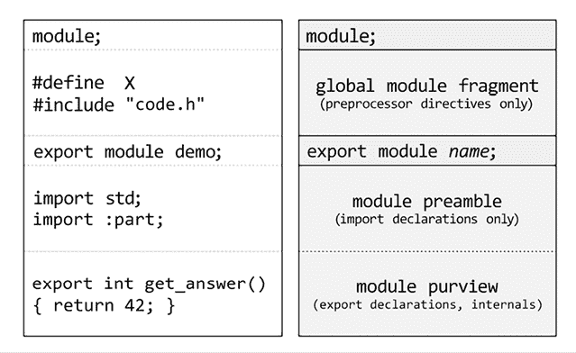
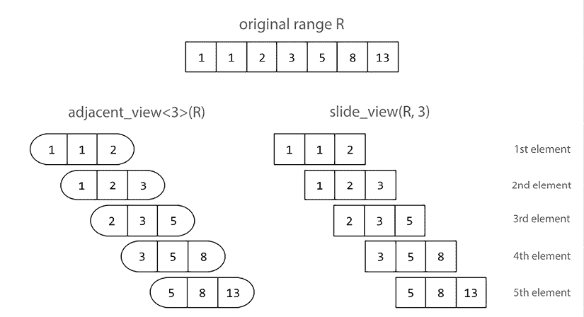
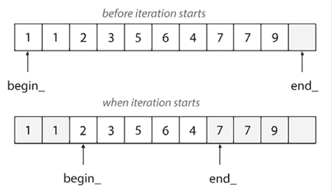

# 12

# C++ 20 核心特性

新的 C++20 标准是 C++ 语言发展中的一个重大步骤。C++20 为语言和标准库带来了许多新特性。其中一些已经在之前的章节中讨论过，例如文本格式化库、chrono 库的日历扩展、线程支持库的更改等等。然而，对语言影响最大的特性是模块、概念、协程和新的 ranges 库。这些特性的规范非常长，这使得在本书中详细讨论它们变得困难。因此，在这一章中，我们将探讨这些特性的最重要的方面和用例。本章旨在帮助你开始使用这些特性。

本章包括以下菜谱：

+   与模块一起工作

+   理解模块分区

+   使用概念指定模板参数的要求

+   使用表达式和子句

+   探索缩写函数模板

+   使用 ranges 库遍历集合

+   探索标准范围适配器

+   将范围转换为容器

+   创建自己的范围视图

+   使用约束算法

+   创建用于异步计算的协程任务类型

+   创建用于值序列的协程生成器类型

+   使用 std::generator 类型生成值序列

让我们从学习模块开始这一章，模块是数十年来对 C++ 语言影响最大的变革。

# 与模块一起工作

模块是 C++20 标准中最重要的一项变革之一。它们代表了 C++ 语言以及我们编写和消费代码方式的根本性变革。模块通过单独编译的源文件提供，这些源文件与使用它们的翻译单元分开编译。

模块提供了多个优势，尤其是在与头文件使用相比时：

+   它们只导入一次，导入的顺序并不重要。

+   它们不需要在不同源文件中分割接口和实现，尽管这仍然是可能的。

+   模块有可能减少编译时间，在某些情况下甚至可以显著减少。从模块导出的实体在二进制文件中描述，编译器可以比传统的预编译头更快地处理这些文件。

+   此外，此文件可能被用于构建与其他语言 C++ 代码的集成和互操作性。

在这个菜谱中，你将学习如何开始使用模块。

## 准备工作

在撰写本文时，主要的编译器（VC++、Clang 和 GCC）为模块提供不同级别的支持。构建系统，如 CMake，在模块的采用方面落后（尽管这可能在不久的将来发生变化）。由于不同的编译器有不同的方式和不同的编译器选项来支持模块，本书将不会提供如何构建这些示例的详细信息。您被邀请查阅特定编译器的在线文档。

伴随这本书的源代码包括使用 Visual Studio 2019 16.8 和 Visual Studio 2022 17.x 的 MSVC 编译器（cl.exe）构建本食谱和下一个食谱中展示的源代码的脚本。

存在几种类型的模块文件：**模块接口单元**、**模块接口分区**和**模块实现分区**。在本食谱中，我们将仅提及第一种；其他两种，我们将在下一个食谱中学习。

## 如何做到这一点…

当你模块化你的代码时，你可以做以下几件事情：

+   使用`import`指令和模块名称导入模块。标准库在`std`模块中可用，但仅从 C++23 开始。这允许我们在 C++23 中编写以下内容：

    ```cpp
    import std;
    int main()
    {
       std::println("Hello, world!");
    } 
    std.core module from Visual C++, which contains most of the functionality of the standard library, including the streams library:
    ```

    ```cpp
    import std.core;
    int main()
    {
      std::cout << "Hello, World!\n";
    } 
    ```

+   通过创建一个**模块接口单元**（**MIU**）来导出模块，该单元可以包含函数、类型、常量和甚至宏。它们的声明必须以关键字`export`开头。模块接口单元文件必须以`.ixx`扩展名结尾，适用于 VC++。Clang 接受不同的扩展名，包括`.cpp`、`.cppm`，甚至`.ixx`。以下示例导出了一个名为`point`的类模板，一个名为`distance()`的函数，该函数计算两点之间的距离，以及一个用户定义的文法操作符`_ip`，它可以从字符串创建`point`类型的对象，形式为`"0,0"`或`"12,-3"`：

    ```cpp
    // --- geometry.ixx/.cppm ---
    export module geometry;
    #ifdef __cpp_lib_modules
    import std;
    #else
    import std.core;
    #endif
    export template <class T,
       typename = typename std::enable_if_t<std::is_arithmetic_v<T>, T>>
    struct point
    {
       T x;
       T y;
    };
    export using int_point = point<int>;
    export constexpr int_point int_point_zero{ 0,0 };
    export template <class T>
    double distance(point<T> const& p1, point<T> const& p2)
    {
       return std::sqrt((p2.x - p1.x) * (p2.x - p1.x) +
                        (p2.y - p1.y) * (p2.y - p1.y));
    }
    namespace geometry_literals
    {
       export int_point operator ""_ip(const char* ptr, std::size_t size)
       {
          int x = 0, y = 0;
          if(ptr)
          {
             while (*ptr != ',' && *ptr != ' ')
                x = x * 10 + (*ptr++ - '0');
             while (*ptr == ',' || *ptr == ' ') ptr++;
             while (*ptr != 0)
                y = y * 10 + (*ptr++ - '0');
          }
          return { x, y };
       }
    }
    // --- main.cpp ---
    #ifdef __cpp_lib_modules
    import std;
    #else
    import std.core;
    #endif
    import geometry;
    int main()
    {
       int_point p{ 3, 4 };
       std::cout << distance(int_point_zero, p) << '\n';
       {
          using namespace geometry_literals;
          std::cout << distance("0,0"_ip, "30,40"_ip) << '\n';
       }
    } 
    ```

+   使用`import`指令也可以导入头文件的内容。这里展示的例子使用了与前面示例中相同的类型和函数：

    ```cpp
    // --- geometry.h ---
    #pragma once
    #include <cmath>
    template <class T,
       typename = typename std::enable_if_t<std::is_arithmetic_v<T>, T>>
    struct point
    {
       T x;
       T y;
    };
    using int_point = point<int>;
    constexpr int_point int_point_zero{ 0,0 };
    template <class T>
    double distance(point<T> const& p1, point<T> const& p2)
    {
       return std::sqrt((p2.x – p1.x) * (p2.x – p1.x) +
                        (p2.y – p1.y) * (p2.y – p1.y));
    }
    namespace geometry_literals
    {
       int_point operator ""_ip(const char* ptr, std::size_t)
       {
          int x = 0, y = 0;
          if(ptr)
          {
    while (*ptr != ',' && *ptr != ' ')
                x = x * 10 + (*ptr++ - '0');
             while (*ptr == ',' || *ptr == ' ') ptr++;
             while (*ptr != 0)
                y = y * 10 + (*ptr++ - '0');
          }
          return { x, y };
       }
    }
    // --- main.cpp ---
    #ifdef __cpp_lib_modules
    import std;
    #else
    import std.core;
    #endif
    import "geometry.h";
    int main()
    {
       int_point p{ 3, 4 };
       std::cout << distance(int_point_zero, p) << '\n';
       {
          using namespace geometry_literals;
          std::cout << distance("0,0"_ip, "30,40"_ip) << '\n';
       }
    } 
    ```

## 它是如何工作的...

模块单元由几个部分组成，包括必需的或可选的部分：

+   **全局模块片段**，通过`module;`语句引入。这部分是可选的，如果存在，可能只包含预处理器指令。这里添加的任何内容都被称为**全局模块**，它是所有全局模块片段和所有非模块的翻译单元的集合。

+   **模块声明**，这是一个必需的语句，形式为`export` `module name;`。

+   **模块序言**，这是可选的，可能只包含导入声明。

+   **模块范围**，即单元的内容，从模块声明开始，延伸到模块单元的末尾。

以下图表显示了一个包含所有上述部分的模块单元。在左侧，我们有模块的源代码，在右侧，解释了模块的各个部分：



图 12.1：一个模块（左侧）的示例，每个部分都被突出显示并解释（右侧）

一个模块可以导出任何实体，例如函数、类和常量。每个导出都必须以 `export` 关键字开头。这个关键字始终是第一个关键字，位于 `class`/`struct`、`template` 或 `using` 等其他关键字之前。前一个章节中展示的 **geometry** 模块中已经提供了几个示例：

+   一个名为 `point` 的 E 类模板，表示二维空间中的一个点

+   一个名为 `int_point` 的 `point<int>` 类型别名

+   一个名为 `int_point_zero` 的编译时常量

+   一个函数模板 `distance()`，用于计算两点之间的距离

+   一个用户自定义字面量 `_ip`，可以从 `"3,4"` 等字符串创建 `int_point` 对象

使用模块而不是头文件的翻译单元不需要进行任何其他更改，除了将 `#include` 预处理器指令替换为 `import` 指令。此外，也可以使用相同的 `import` 指令将头文件导入为模块，如前一个示例所示。

模块和命名空间之间没有关系。这两个是独立的概念。模块 `geometry` 在 `geometry_literals` 命名空间中导出了用户自定义字面量 `""_ip`，而模块中的其他所有导出都在全局命名空间中可用。

模块名称和单元文件名称之间也没有关系。几何模块是在一个名为 `geometry.ixx`/`.cppm` 的文件中定义的，尽管任何文件名都会产生相同的结果。建议您遵循一致的命名方案，并将模块名称用于模块文件名。另一方面，模块单元使用的扩展名因编译器而异，尽管这可能是当模块支持成熟时可能会发生变化的事情。

在 C++23 之前，标准库尚未模块化。然而，编译器已经将其作为模块提供。Clang 编译器为每个头文件提供不同的模块。另一方面，Visual C++ 编译器为标准库提供了以下模块：

+   `std.regex`: 头文件 `<regex>` 的内容

+   `std.filesystem`: 头文件 `<filesystem>` 的内容

+   `std.memory`: 头文件 `<memory>` 的内容

+   `std.threading`: 头文件 `<atomic>`, `<condition_variable>`, `<future>`, `<mutex>`, `<shared_mutex>`, 和 `<thread>` 的内容

+   `std.core`: C++ 标准库的其余部分

如您从这些模块名称中可以看到，例如 `std.core` 或 `std.regex`，模块的名称可以是由一系列标识符通过点（`.`）连接而成的序列。点号除了帮助将名称分割成表示逻辑层次结构的部分（如 `company.project.module`）之外，没有其他意义。使用点号在某种程度上可以提供比使用下划线（如 `std_core` 或 `std_regex`）更好的可读性，尽管下划线也是合法的，就像任何可能形成标识符的东西一样。

另一方面，C++23 标准提供了两个标准化命名的模块：

+   `std`，它将 C++ 标准头文件（如 `<vector>`、`<string>`、`<algorithm>` 等）和 C 包装器头文件（如 `<cstdio>`）中的所有内容导入到 `std` 命名空间。如果您使用 `std` 限定所有内容且不想污染全局命名空间，则应使用此模块。

+   `std.compat` 模块导入了 `std` 所有的内容，以及 C 包装器头文件的全球命名空间对应项。例如，如果 `std` 从 `<cstdio>` 中导入了 `std::fopen` 和 `std::fclose`（以及其他所有内容），那么 `std.compat` 将导入 `::fopen` 和 `::fclose`。如果您想更容易地迁移代码而不必使用 `std` 命名空间限定名称（如使用 `fopen` 而不是 `std::fopen`，使用 `size_t` 而不是 `std::size_t` 等），则应使用此模块。

作为程序员，您熟悉任何编程语言的典型入门程序，称为 *“Hello, world!”*，该程序简单地打印此文本到控制台。在 C++ 中，此程序的规范形式曾经如下所示：

```cpp
#include <iostream>
int main()
{
   std::cout << "Hello, world!\n";
} 
```

在 C++23 中，随着标准化模块和新文本格式化库打印功能的支持，此程序可以如下所示：

```cpp
import std;
int main()
{
   std::println("Hello, world!");
} 
```

您可以使用 `__cpp_lib_modules` 功能宏来检查标准模块 `std` 和 `std.compat` 是否可用。

## 相关内容

+   *理解模块分区*，以了解接口和实现分区

# 理解模块分区

模块源代码可能会变得很大且难以维护。此外，一个模块可能由逻辑上独立的几个部分组成。为了帮助处理这些情况，模块支持从称为 *分区* 的部分进行组合。一个作为分区且导出实体的模块单元称为 *模块接口分区*。

然而，也可能存在不导出任何内容的内部分区。这样的分区单元称为 *模块实现分区*。在本食谱中，您将学习如何与接口和实现分区一起工作。

## 准备工作

在继续阅读本食谱之前，您应该阅读之前的食谱 *使用模块*。您将需要我们在那里讨论的模块基础知识以及我们将在此食谱中继续使用的代码示例。

在以下示例中，我们将使用`std`模块，它仅在 C++23 中可用。对于之前的版本，在 VC++或其他编译器支持的特定模块中使用`std.core`。

## 如何做到...

你可以将一个模块拆分为几个分区，如下所示：

+   每个分区单元必须以`export module modulename:partitionname;`形式的声明开始。只有全局模块片段可以在此声明之前：

    ```cpp
    // --- geometry-core.ixx/.cppm ---
    export module geometry:core;
    import std;
    export template <class T,
       typename = typename std::enable_if_t<std::is_arithmetic_v<T>, T>>
    struct point
    {
       T x;
       T y;
    };
    export using int_point = point<int>;
    export constexpr int_point int_point_zero{ 0,0 };
    export template <class T>
    double distance(point<T> const& p1, point<T> const& p2)
    {
       return std::sqrt((p2.x - p1.x) * (p2.x - p1.x) +
                        (p2.y - p1.y) * (p2.y - p1.y));
    }
    // --- geometry-literals.ixx/.cppm ---
    export module geometry:literals;
    import :core;
    namespace geometry_literals
    {
       export int_point operator ""_ip(const char* ptr, std::size_t)
       {
          int x = 0, y = 0;
          if(ptr)
          {
    while (*ptr != ',' && *ptr != ' ')
                x = x * 10 + (*ptr++ - '0');
             while (*ptr == ',' || *ptr == ' ') ptr++;
             while (*ptr != 0)
                y = y * 10 + (*ptr++ - '0');
          }
          return { x, y };
       }
    } 
    ```

+   在主要模块接口单元中，使用`export import :partitionname`形式的声明导入并导出分区，如下例所示：

    ```cpp
    // --- geometry.ixx/.cppm ---
    export module geometry;
    export import :core;
    export import :literals; 
    ```

+   导入由多个分区组成的模块的代码只看到作为一个整体的模块，如果它是从一个单个模块单元构建的：

    ```cpp
    // --- main.cpp ---
    import std;
    import geometry;
    int main()
    {
       int_point p{ 3, 4 };
       std::cout << distance(int_point_zero, p) << '\n';
       {
          using namespace geometry_literals;
          std::cout << distance("0,0"_ip, "30,40"_ip) << '\n';
       }
    } 
    ```

+   可以创建不导出任何内容但包含可用于同一模块的代码的内部分区。这样的分区必须以`module modulename:partitionname;`形式的声明开始（不使用`export`关键字）。不同的编译器可能还需要为包含内部分区的文件使用不同的扩展名。对于 VC++，扩展名必须是`.cpp`：

    ```cpp
    // --- geometry-details.cpp --
    module geometry:details;
    import std;
    std::pair<int, int> split(const char* ptr)
    {
      int x = 0, y = 0;
      if(ptr)
      {
    while (*ptr != ',' && *ptr != ' ')
          x = x * 10 + (*ptr++ - '0');
        while (*ptr == ',' || *ptr == ' ') ptr++;
        while (*ptr != 0)
          y = y * 10 + (*ptr++ - '0');
      }
      return { x, y };
    }
    // --- geometry-literals.ixx/.cppm ---
    export module geometry:literals;
    import :core;
    import :details;
    namespace geometry_literals
    {
      export int_point operator ""_ip(const char* ptr, std::size_t)
      {
        auto [x, y] = split(ptr);
        return {x, y};
      }
    } 
    ```

## 它是如何工作的...

之前展示的代码是之前菜谱中介绍的模块示例的后续。`geometry`模块已被拆分为两个不同的分区，分别称为`core`和`literals`。

然而，当你声明分区时，你必须使用`modulename:partitionname`这种形式的名称，例如在`geometry:core`和`geometry:literals`中。在其他地方导入分区时，这并不是必需的。这可以在主要分区单元`geometry.ixx`和模块接口分区`geometry-literals.ixx`中看到。以下是一些清晰度更高的片段：

```cpp
// --- geometry-literals.ixx/.cppm ---
export module geometry:literals;
// import the core partition
import :core;
// --- geometry.ixx/.cppm ---
export module geometry;
// import the core partition and then export it
export import :core;
// import the literals partition and then export it
export import :literals; 
```

尽管模块分区是独立的文件，但它们对于使用模块的翻译单元来说并不是作为单独的模块或子模块可用的。它们作为一个单一、聚合的模块一起导出。如果你比较`main.cpp`文件中的源代码和之前菜谱中的代码，你将看不到任何区别。

与模块接口单元一样，没有命名包含分区的文件的规则。然而，编译器可能需要不同的扩展名或支持某些特定的命名方案。例如，VC++使用`<module-name>-<partition-name>.ixx`方案，这简化了构建命令。

分区，就像模块一样，可能包含未从模块导出的代码。一个分区可能完全不包含导出项，在这种情况下，它仅是一个内部分区。这样的分区被称为*模块实现分区*。它是在模块声明中不使用`export`关键字定义的。

一个内部分区的例子是前面展示的 `geometry:details` 分区。它提供了一个名为 `split()` 的辅助函数，用于从字符串中解析由逗号分隔的两个整数。然后，这个分区被导入到 `geometry:literals` 分区中，其中 `split()` 函数被用来实现用户定义的文法 `_ip`。

## 更多...

分区是模块的划分。然而，它们不是子模块。它们在模块之外没有逻辑存在。C++ 语言中没有子模块的概念。在这个菜谱中展示的代码使用分区可以稍微不同地使用模块来编写：

```cpp
// --- geometry-core.ixx ---
export module geometry.core;
import std;
export template <class T,
   typename = typename std::enable_if_t<std::is_arithmetic_v<T>, T>>
struct point
{
   T x;
   T y;
};
export using int_point = point<int>;
export constexpr int_point int_point_zero{ 0,0 };
export template <class T>
double distance(point<T> const& p1, point<T> const& p2)
{
   return std::sqrt(
      (p2.x - p1.x) * (p2.x - p1.x) +
      (p2.y - p1.y) * (p2.y - p1.y));
}
// --- geometry-literals.ixx ---
export module geometry.literals;
import geometry.core;
namespace geometry_literals
{
   export int_point operator ""_ip(const char* ptr, std::size_t)
   {
      int x = 0, y = 0;
      if(ptr)
      {
while (*ptr != ',' && *ptr != ' ')
            x = x * 10 + (*ptr++ - '0');
         while (*ptr == ',' || *ptr == ' ') ptr++;
         while (*ptr != 0)
            y = y * 10 + (*ptr++ - '0');
      }
      return { x, y };
   }
}
// --- geometry.ixx ---
export module geometry;
export import geometry.core;
export import geometry.literals; 
```

在这个示例中，我们有三个模块：`geometry.core`、`geometry.literals` 和 `geometry`。在这里，`geometry` 导入并重新导出了前两个模块的全部内容。正因为如此，`main.cpp` 中的代码不需要更改。

仅通过导入 `geometry` 模块，我们就可以访问 `geometry.core` 和 `geometry.literals` 模块的内容。

然而，如果我们不再定义 `geometry` 模块，那么我们需要显式地导入这两个模块，如下面的代码片段所示：

```cpp
import std;
import geometry.core;
import geometry.literals;
int main()
{
   int_point p{ 3, 4 };
   std::cout << distance(int_point_zero, p) << '\n';
   {
      using namespace geometry_literals;
      std::cout << distance("0,0"_ip, "30,40"_ip) << '\n';
   }
} 
```

在使用分区或多个模块来组件化源代码之间进行选择应取决于你项目的特定性。如果你使用多个较小的模块，你提供了更好的导入粒度。如果你正在开发一个大型的库，这可能很重要，因为用户应该只导入他们使用的东西（而不是当他们只需要一些功能时导入一个非常大的模块）。

## 参见

+   *与模块一起工作*，以探索 C++20 模块的基础知识

# 使用概念指定模板参数的要求

模板元编程是 C++ 语言的重要组成部分，它赋予了开发通用库（包括标准库）的能力。然而，模板元编程并非易事。相反，没有丰富的经验，复杂任务可能会变得繁琐且难以正确实现。事实上，由 Bjarne Stroustrup 和 Herb Sutter 创建的 C++ Core Guidelines 初始项目有一个规则叫做 *仅在真正需要时使用模板元编程*，该规则的理由是：

> 模板元编程很难正确实现，会减慢编译速度，并且通常很难维护。

模板元编程的一个重要方面是针对类型模板参数的约束指定，以便对可以实例化的模板类型施加限制。C++20 概念库旨在解决这个问题。概念是一组命名的约束，约束是对模板参数的要求。这些用于选择合适的函数重载和模板特化。

在这个菜谱中，我们将看到如何使用 C++20 概念来指定模板参数的要求。

## 准备工作

在我们开始学习概念之前，让我们考虑以下类模板，称为`NumericalValue`，它应该包含整型或浮点型的值。这个 C++11 实现使用了`std::enable_if`来指定`T`模板参数的要求：

```cpp
template <typename T>,
          typename = typename std::enable_if_t<std::is_arithmetic_v<T>, T>>
struct NumericalValue
{
  T value;
};
template <typename T>
NumericalValue<T> wrap(T value) { return { value }; }
template <typename T>
T unwrap(NumericalValue<T> t) { return t.value; }
auto nv = wrap(42);
std::cout << nv.value << '\n';   // prints 42
auto v = unwrap(nv);
std::cout << v << '\n';          // prints 42
using namespace std::string_literals;
auto ns = wrap("42"s);           // error 
```

此代码片段将是本食谱中展示的示例的基础。

## 如何做...

您可以如下指定模板参数的要求：

+   使用以下形式的`concept`关键字创建一个概念：

    ```cpp
    template <class T>
    concept Numerical = std::is_arithmetic_v<T>; 
    ```

+   或者，您可以使用标准定义的概念之一，这些概念在头文件`<concepts>`（或标准库的其他头文件）中可用：

    ```cpp
    template <class T>
    concept Numerical = std::integral<T> || std::floating_point<T>; 
    ```

+   在函数模板、类模板或变量模板中使用概念名称而不是`class`或`typename`关键字：

    ```cpp
    template <Numerical T>
    struct NumericalValue
    {
      T value;
    };
    template <Numerical T>
    NumericalValue<T> wrap(T value) { return { value }; }
    template <Numerical T>
    T unwrap(NumericalValue<T> t) { return t.value; } 
    ```

+   使用语法不变的方式实例化类模板和调用函数模板：

    ```cpp
    auto nv = wrap(42);
    std::cout << nv.value << '\n';   // prints 42
    auto v = unwrap(nv);
    std::cout << v << '\n';          // prints 42
    using namespace std::string_literals;
    auto ns = wrap("42"s);           // error 
    ```

## 它是如何工作的...

概念是一组一个或多个约束，总是在命名空间范围内定义。概念的定义类似于变量模板。以下代码片段展示了如何使用概念作为变量模板：

```cpp
template <class T>
concept Real = std::is_floating_point_v<T>;
template<Real T>
constexpr T pi = T(3.1415926535897932385L);
std::cout << pi<double> << '\n';
std::cout << pi<int>    << '\n'; // error 
```

概念本身不能被约束，也不能递归地引用自己。在前面展示的例子中，`Numerical`和`Real`概念由单个原子约束组成。然而，可以从多个约束创建概念。使用`&&`逻辑运算符从两个约束创建的约束称为*结合*，而使用`||`逻辑运算符从两个约束创建的约束称为*析取*。

在*如何做...*部分定义的`Numerical`概念使用了`std::is_arithmetic_v`类型特性。然而，我们可以有两个概念，`Real`和`Integral`，如下所示：

```cpp
template <class T>
concept Integral = std::is_integral_v<T>;
template <class T>
concept Real = std::is_floating_point_v<T>; 
```

从这两个类中，我们可以使用`||`逻辑运算符组合出`Numerical`概念，结果是析取：

```cpp
template <class T>
concept Numerical = Integral<T> || Real<T>; 
```

从语义上看，这两个版本的`Numerical`概念没有区别，尽管它们是以不同的方式定义的。

为了理解结合，让我们看另一个例子。考虑两个基类，`IComparableToInt`和`IConvertibleToInt`，它们应该被支持比较或转换为`int`的类继承。这些可以定义如下：

```cpp
struct IComparableToInt
{
  virtual bool CompareTo(int const o) = 0;
};
struct IConvertibleToInt
{
  virtual int ConvertTo() = 0;
}; 
```

一些类可以实现这两个概念，而另一些类只实现其中一个或另一个。这里的`SmartNumericalValue<T>`类实现了这两个概念，而`DullNumericalValue<T>`只实现了`IConvertibleToInt`类：

```cpp
template <typename T>
struct SmartNumericalValue : public IComparableToint, IConvertibleToInt
{
  T value;
  SmartNumericalValue(T v) :value(v) {}
  bool CompareTo(int const o) override
 { return static_cast<int>(value) == o; }
  int ConvertTo() override
 { return static_cast<int>(value); }
};
template <typename T>
struct DullNumericalValue : public IConvertibleToInt
{
  T value;
  DullNumericalValue(T v) :value(v) {}
  int ConvertTo() override
 { return static_cast<int>(value); }
}; 
```

我们想要编写一个函数模板，它只接受既是可比较的又可转换为`int`类型的参数。这里展示的`IComparableAndConvertible`概念是`IntComparable`和`IntConvertible`概念的结合。它们可以如下实现：

```cpp
template <class T>
concept IntComparable = std::is_base_of_v<IComparableToInt, T>;
template <class T>
concept IntConvertible = std::is_base_of_v<IConvertibleToInt, T>;
template <class T>
concept IntComparableAndConvertible = IntComparable<T> && IntConvertible<T>;
template <IntComparableAndConvertible T>
void print(T o)
{
  std::cout << o.value << '\n';
}
int main()
{
   auto snv = SmartNumericalValue<double>{ 42.0 };
   print(snv);                      // prints 42
auto dnv = DullNumericalValue<short>{ 42 };
   print(dnv);                      // error
} 
```

合取和析取是从左到右评估的，并且是短路执行的。这意味着对于合取，只有当左边的约束满足时，才会评估右边的约束；对于析取，只有当左边的约束不满足时，才会评估右边的约束。

第三类约束是*原子约束*。这些约束由一个表达式`E`以及从`E`的类型参数到约束实体的模板参数之间的映射组成，称为*参数映射*。原子约束是在*约束规范化*过程中形成的，这是一个将约束表达式转换成一系列原子约束的合取和析取的过程。通过将参数映射和模板参数代入表达式`E`来检查原子约束。结果必须是一个有效的`bool`类型的 prvalue 常量表达式；否则，约束不满足。

标准库定义了一系列概念，可以用来定义对模板参数的编译时要求。尽管这些概念大多数都同时施加了语法和语义要求，但编译器通常只能确保前者。当语义要求不满足时，程序被认为是无效的，编译器不需要提供任何关于问题的诊断。标准概念可以在几个地方找到：

+   在概念库中，在`<concepts>`头文件和`std`命名空间中。这包括核心语言概念（如`same_as`、`integral`、`floating_point`、`copy_constructible`和`move_constructible`），比较概念（如`equality_comparable`和`totally_ordered`），对象概念（如`copyable`、`moveable`和`regular`），以及可调用概念（如`invocable`和`predicate`）。

+   在算法库中，在`<iterator>`头文件和`std`命名空间中。这包括算法要求（如`sortable`、`permutable`和`mergeable`）和间接可调用概念（如`indirect_unary_predicate`和`indirect_binary_predicate`）。

+   在范围库中，在`<ranges>`头文件和`std::ranges`命名空间中。这包括针对范围的概念，如`range`、`view`、`input_range`、`output_range`、`forward_range`和`random_access_range`。

## 更多内容...

在这个配方中定义的概念使用了已经可用的类型特性。然而，有许多情况下对模板参数的要求无法用这种方式描述。因此，可以使用*`requires`表达式*来定义概念，这是一个`bool`类型的 prvalue 表达式，描述了模板参数的要求。这将是下一个配方的主题。

## 参见

+   *使用`requires`表达式和子句*，了解就地约束

# 使用`requires`表达式和子句

在上一个配方中，我们介绍了概念和约束的主题，通过几个仅基于现有类型特征的示例来了解它们。此外，我们还使用了更简洁的语法来指定概念，在模板声明中使用概念名称代替`typename`或`class`关键字。然而，借助*requires 表达式*可以定义更复杂的概念。这些是描述某些模板参数约束的`bool`类型的 prvalue。

在本配方中，我们将学习如何编写 requires 表达式以及指定模板参数约束的另一种方法。

## 准备工作

在本配方中展示的代码片段中，将使用上一个配方中定义的类模板`NumericalValue<T>`和函数模板`wrap()`。

## 如何做...

要指定模板参数的要求，可以使用`requires`关键字引入的 requires 表达式，如下所示：

+   使用一个简单的表达式，编译器会验证其正确性。在下面的代码片段中，必须为`T`模板参数重载运算符`+`：

    ```cpp
    template <typename T>
    concept Addable = requires (T a, T b) {a + b;};
    template <Addable T>
    T add(T a, T b)
    {
      return a + b;
    }
    add(1, 2);        // OK, integers
    add("1"s, "2"s);  // OK, std::string user-defined literals
    NumericalValue<int> a{1};
    NumericalValue<int> b{2};
    add(a, b); // error: no matching function for call to 'add'
    // 'NumericalValue<int>' does not satisfy 'Addable' 
    ```

+   使用一个简单的表达式来要求存在特定的函数。在以下代码片段中，必须存在一个名为`wrap()`的函数，该函数使用`T`模板参数的重载参数：

    ```cpp
    template <typename T>
    concept Wrapable = requires(T x) { wrap(x); };
    template <Wrapable T>
    void do_wrap(T x)
    {
      [[maybe_unused]] auto v = wrap(x);
    }
    do_wrap(42);    // OK, can wrap an int
    do_wrap(42.0);  // OK, can wrap a double
    do_wrap("42"s); // error, cannot wrap a std::string 
    ```

+   使用类型要求，通过`typename`关键字后跟类型名称（可选地带有限定符）来指定要求，例如成员名称、类模板特化或别名模板替换。在以下代码片段中，`T`模板参数必须有两个内部类型称为`value_type`和`iterator`。此外，还必须提供两个函数`begin()`和`end()`，它们接受`T`参数：

    ```cpp
    template <typename T>
    concept Container = requires(T x)
    {
      typename T::value_type;
      typename T::iterator;
      begin(x);
      end(x);
    };
    template <Container T>
    void pass_container(T const & c)
    {
      for(auto const & x : c)
        std::cout << x << '\n';
    }
    std::vector<int> v { 1, 2, 3};
    std::array<int, 3> a {1, 2, 3};
    int arr[] {1,2,3};
    pass_container(v);   // OK
    pass_container(a);   // OK
    pass_container(arr); // error: 'int [3]' does not satisfy
    // 'Container' 
    ```

+   使用复合要求来指定表达式的需求以及表达式的评估结果。在以下示例中，必须存在一个名为`wrap()`的函数，它可以接受`T`模板参数类型的参数，并且调用该函数的结果必须是`NumericalValue<T>`类型：

    ```cpp
    template <typename T>
    concept NumericalWrapable =
    requires(T x)
    {
      {wrap(x)} -> std::same_as<NumericalValue<T>>;
    };
    template <NumericalWrapable T>
    void do_wrap_numerical(T x)
    {
      [[maybe_unused]] auto v = wrap(x);
    }
    template <typename T>
    class any_wrapper
    {
    public:
      T value;
    };
    any_wrapper<std::string> wrap(std::string s)
    {
      return any_wrapper<std::string>{s};
    }
    // OK, wrap(int) returns NumericalValue<int>
    do_wrap_numerical(42);
    // error, wrap(string) returns any_wrapper<string>
    do_wrap_numerical("42"s); 
    ```

模板参数的约束也可以使用涉及`requires`关键字的语法来指定。这些称为*requires 子句*，可以如下使用：

+   在模板参数列表之后使用 requires 子句：

    ```cpp
    template <typename T> requires Addable<T>
    T add(T a, T b)
    {
      return a + b;
    } 
    ```

+   或者，在函数声明符的最后一个元素之后使用 requires 子句：

    ```cpp
    template <typename T>
    T add(T a, T b) requires Addable<T>
    {
      return a + b;
    } 
    ```

+   将 requires 子句与 requires 表达式结合，而不是使用命名概念。在这种情况下，`requires`关键字出现了两次，如下面的代码片段所示：

    ```cpp
    template <typename T>
    T add(T a, T b) requires requires (T a, T b) {a + b;}
    {
      return a + b;
    } 
    ```

## 它是如何工作的...

新的`requires`关键字具有多个用途。一方面，它用于引入一个指定模板参数约束的 requires 子句。另一方面，它用于定义一个`bool`类型的 prvalue 的 requires 表达式，用于定义模板参数的约束。

如果你不太熟悉 C++值类别（*lvalue*、*rvalue*、*prvalue*、*xvalue*、*glvalue*），建议你检查[`en.cppreference.com/w/cpp/language/value_category`](https://en.cppreference.com/w/cpp/language/value_category)。术语*prvalue*，意为*纯右值*，指定了一个不是 xvalue（即将过期的值）的右值。prvalue 的例子包括字面量、返回类型不是引用类型的函数调用、枚举或`this`指针。

在`requires`子句中，`requires`关键字必须后跟一个类型为`bool`的常量表达式。该表达式必须是原始表达式（例如`std::is_arithmetic_v<T>`或`std::integral<T>`），括号内的表达式，或者任何这样的表达式的序列，这些表达式通过`&&`或`||`运算符连接。

一个`requires`表达式的形式为`requires (parameters-list) { requirements }`。参数列表是可选的，并且可以完全省略（包括括号）。指定的需求可以引用：

+   范围内的模板参数

+   在`parameters-list`中引入的局部参数

+   任何从封装上下文中可见的其他声明

`requires`表达式的需求序列可以包含以下类型的需求：

+   **简单需求**：这些是不以`requires`关键字开头的任意表达式。编译器只检查其语言正确性。

+   **类型需求**：这些是以关键字`typename`开头后跟一个类型名称的表达式，它必须是有效的。这使编译器能够验证是否存在某个嵌套名称，或者是否存在类模板特化或别名模板替换。

+   **复合需求**：它们的形式为`{expression} noexcept -> type-constraint`。`noexcept`关键字是可选的，在这种情况下，表达式不得是可能抛出异常的。使用`->`引入的返回类型需求也是可选的。然而，如果它存在，那么`decltype(expression)`必须满足`type-constraint`施加的约束。

+   **嵌套需求**：这些是更复杂的表达式，它们指定了定义为 requires 表达式的约束，而这些表达式本身又可以是一个嵌套需求。以关键字`requires`开头的需求被视为嵌套需求。

在它们被评估之前，每个名称概念和每个`requires`表达式的主体都会被替换，直到获得一系列原子约束的合取和析取。这个过程被称为*规范化*。规范化及其分析的实际细节超出了本书的范围。

## 参见

+   *使用概念指定模板参数的需求*，以探索 C++20 概念的基础

# 探索缩写函数模板

在*第三章*中，我们学习了函数模板以及 lambda 表达式，包括泛型和模板 lambda。泛型 lambda 是一个使用`auto`指定符为其参数之一指定的 lambda 表达式。结果是具有模板调用操作符的函数对象。同样，定义具有更好参数类型控制优势的 lambda 模板也会产生相同的结果。在 C++20 中，这种为参数类型使用`auto`指定符的想法被推广到所有函数。

这引入了定义函数模板的简化语法，以这种方式定义的函数被称为**简化函数模板**。我们将在这个菜谱中看到如何使用它们。

## 如何做到…

你可以在 C++20 中定义以下类别的简化函数模板：

+   使用`auto`指定符定义参数的非约束简化函数模板：

    ```cpp
    auto sum(auto a, auto b)
    {
       return a + b;
    }
    auto a = sum(40, 2);    // 42
    auto b = sum(42.0, 2);  // 44.0 
    ```

+   使用在`auto`指定符之前指定的概念来约束函数模板参数的约束简化函数模板：

    ```cpp
    auto sum(std::integral auto a, std::integral auto b)
    {
       return a + b;
    }
    auto a = sum(40, 2);    // 42
    auto b = sum(42.0, 2);  // error 
    ```

+   使用上述语法但带有参数包的约束简化变长函数模板：

    ```cpp
    auto sum(std::integral auto ... args)
    {
       return (args + ...);
    }
    auto a = sum(10, 30, 2);   // 42 
    ```

+   使用上述语法但带有 lambda 表达式的约束简化 lambda 表达式：

    ```cpp
    int main()
    {
       auto lsum = [](std::integral auto a, std::integral auto b)
       {
          return a + b;
       };
       auto a = lsum(40, 2);    // 42
    auto b = lsum(42.0, 2);  // error
    } 
    ```

+   简化函数模板的特殊化可以像使用常规模板语法定义的函数模板一样定义：

    ```cpp
    auto sum(auto a, auto b)
    {
       return a + b;
    }
    template <>
    auto sum(char const* a, char const* b)
    {
       return std::string(a) + std::string(b);
    }
    auto a = sum(40, 2);       // 42
    auto b = sum("40", "2");   // "402" 
    ```

## 它是如何工作的…

模板语法被认为相当繁琐。简化函数模板旨在简化编写某些类别的函数模板。它们通过使用`auto`指定符作为参数类型的占位符来实现这一点，而不是典型的模板语法。以下两个定义是等价的：

```cpp
auto sum(auto a, auto b)
{
   return a + b;
}
template <typename T, typename U>
auto sum(T a, U b)
{
   return a + b;
} 
```

如果意图是定义具有相同类型参数的函数模板，那么这种简化函数模板的形式就不够了。这些简化函数模板被称为**非约束**，因为函数的参数上没有放置任何约束。

可以使用概念的帮助来定义这些约束，如下所示：

```cpp
auto sum(std::integral auto a, std::integral auto b)
{
   return a + b;
} 
```

约束简化函数模板的类别被称为**约束**。上面的函数等同于以下常规函数模板：

```cpp
template <typename T>
T sum(T a, T b);
template<>
int sum(int a, int b)
{
   return a + b;
} 
```

由于简化函数模板是一个函数模板，因此它可以像使用标准模板语法声明的任何函数一样进行特殊化：

```cpp
template <>
auto sum(char const* a, char const* b)
{
   return std::string(a) + std::string(b);
} 
```

约束简化函数模板也可以是变长参数；也就是说，它们具有可变数量的参数。它们没有特别之处，除了我们在*第五章*中学到的那些。此外，该语法还可以用来定义 lambda 模板。这些示例在上一节中已经给出。

## 参见

+   *第三章*，*使用泛型 lambda*，了解泛型 lambda 和 lambda 模板的使用

+   *第三章*，*编写函数模板*，以探索编写函数模板的语法

+   *第三章*，*编写具有可变数量参数的函数模板*，以了解您如何编写接受可变数量参数的函数

+   *使用概念指定模板参数的要求*，以了解如何使用函数模板和概念约束参数

# 使用 ranges 库遍历集合

C++ 标准库提供了三个重要的支柱——容器、迭代器和算法——使我们能够处理集合。因为这些算法是通用的，并且设计为与迭代器一起工作，迭代器定义了范围，它们通常需要编写显式且有时复杂的代码来实现简单任务。C++20 ranges 库已被设计用来解决这个问题，通过提供处理元素范围组件。这些组件包括范围适配器（或视图）和与范围一起工作的约束算法，而不是迭代器。在本食谱中，我们将查看一些这些视图和算法，并了解它们如何简化编码。

## 准备工作

在以下代码片段中，我们将参考一个名为 `is_prime()` 的函数，它接受一个整数并返回一个布尔值，指示该数字是否为质数。这里展示了一个简单的实现：

```cpp
bool is_prime(int const number)
{
  if (number != 2)
  {
    if (number < 2 || number % 2 == 0) return false;
    auto root = std::sqrt(number);
    for (int i = 3; i <= root; i += 2)
      if (number % i == 0) return false;
  }
  return true;
} 
```

对于一个高效的算法（这超出了本食谱的范围），我推荐 Miller–Rabin 质数测试。

ranges 库可在新的 `<ranges>` 头文件中找到，位于 `std::ranges` 命名空间中。为了简单起见，本食谱中将使用以下命名空间别名：

```cpp
namespace rv = std::ranges::views;
namespace rg = std::ranges; 
```

我们将在下一节探索 ranges 库的各种用法。

## 如何做到...

ranges 库可用于通过以下操作迭代范围：

+   使用 `iota_view` / `views::iota` 视图生成连续整数的序列。以下代码片段打印出从 1 到 9 的所有整数：

    ```cpp
    for (auto i : rv::iota(1, 10))
      std::cout << i << ' '; 
    ```

+   使用 `filter_view` / `views::filter` 过滤范围中的元素，仅保留满足谓词的元素。这里的第一段代码打印出从 1 到 99 的所有质数。然而，第二段代码保留并打印出从整数向量中所有的质数：

    ```cpp
    // prints 2 3 5 7 11 13 ... 79 83 89 97
    for (auto i : rv::iota(1, 100) | rv::filter(is_prime))
      std::cout << i << ' ';
    // prints 2 3 5 13
    std::vector<int> nums{ 1, 1, 2, 3, 5, 8, 13, 21 };
    for (auto i : nums | rv::filter(is_prime))
      std::cout << i << ' '; 
    ```

+   使用 `transform_view` / `views::transform` 通过对每个元素应用一元函数来转换范围中的元素。以下代码片段打印出从 1 到 99 的所有质数的后继数：

    ```cpp
    // prints 3 4 6 8 12 14 ... 80 84 90 98
    for (auto i : rv::iota(1, 100) |
                  rv::filter(is_prime) |
                  rv::transform([](int const n) {return n + 1; }))
      std::cout << i << ' '; 
    ```

+   使用 `take_view` / `views::take` 仅保留视图中的前 *N* 个元素。以下代码片段仅打印出从 1 和 99 的前 10 个质数：

    ```cpp
    // prints 2 3 5 7 11 13 17 19 23 29
    for (auto i : rv::iota(1, 100) |
                  rv::filter(is_prime) |
                  rv::take(10))
      std::cout << i << ' '; 
    ```

+   使用 `reverse_view` / `views::reverse` 以逆序迭代范围。这里的第一个代码片段打印出从 99 到 1 的前 10 个质数（降序），而第二个代码片段打印出从 1 到 99 的最后 10 个质数（升序）：

    ```cpp
    // prints 97 89 83 79 73 71 67 61 59 53
    for (auto i : rv::iota(1, 100) |
                  rv::reverse |
                  rv::filter(is_prime) |
                  rv::take(10))
      std::cout << i << ' ';
    // prints 53 59 61 67 71 73 79 83 89 97
    for (auto i : rv::iota(1, 100) |
                  rv::reverse |
                  rv::filter(is_prime) |
                  rv::take(10) |
                  rv::reverse)
      std::cout << i << ' '; 
    ```

+   使用 `drop_view` / `views::drop` 跳过范围中的前 *N* 个元素。以下代码片段按升序打印 1 到 99 之间的素数，但跳过了序列中的前 10 个和最后 10 个素数：

    ```cpp
    // prints 31 37 41 43 47
    for (auto i : rv::iota(1, 100) |
                  rv::filter(is_prime) |
                  rv::drop(10) |
                  rv::reverse |
                  rv::drop(10) |
                  rv::reverse)
      std::cout << i << ' '; 
    ```

范围库还可以用于使用范围而不是迭代器调用算法。大多数算法都有为此目的的重载。以下是一些示例：

+   确定范围的最大元素：

    ```cpp
    std::vector<int> v{ 5, 2, 7, 1, 4, 2, 9, 5 };
    auto m = rg::max(v); // 5 
    ```

+   对范围进行排序：

    ```cpp
    rg::sort(v); // 1 2 2 4 5 5 7 9 
    ```

+   复制范围。以下代码片段将范围中的元素复制到标准输出流：

    ```cpp
    rg::copy(v, std::ostream_iterator<int>(std::cout, " ")); 
    ```

+   反转范围中的元素：

    ```cpp
    rg::reverse(v); 
    ```

+   计算一个范围内的元素（验证谓词）：

    ```cpp
    auto primes = rg::count_if(v, is_prime); 
    ```

## 它是如何工作的...

C++20 范围库提供了处理元素范围的各种组件。这包括：

+   范围概念，如 `range` 和 `view`。

+   范围访问函数，如 `begin()`、`end()`、`size()`、`empty()` 和 `data()`。

+   范围工厂，用于创建元素序列，如 `empty_view`、`single_view` 和 `iota_view`。

+   范围适配器或视图，它从范围创建一个延迟评估的视图，例如 `filter_view`、`transform_view`、`take_view` 和 `drop_view`。

范围被定义为可以由迭代器和结束哨兵迭代的一系列元素。范围类型取决于定义范围的迭代器的功能。以下概念定义了范围类型：

| **概念** | **迭代器类型** | **能力** |
| --- | --- | --- |
| `input_range` | `input_iterator` | 至少可以迭代一次以进行读取。 |
| `output_range` | `output_iterator` | 可以迭代以进行写入。 |
| `forward_range` | `forward_iterator` | 可以多次迭代。 |
| `bidirectional_range` | `bidirectional_iterator` | 也可以以相反的顺序迭代。 |
| `random_access_range` | `random_access_iterator` | 元素可以在常数时间内随机访问。 |
| `contiguous_range` | `contiguous_iterator` | 元素在内存中连续存储。 |

表 12.1：定义范围类型的概念列表

因为 `forward_iterator` 满足 `input_iterator` 的要求，`bidirectional_iterator` 满足 `forward_iterator` 的要求，依此类推（从上表中的顶部到底部），所以范围也是如此。`forward_range` 满足 `input_range` 的要求，`bidirectional_range` 满足 `forward_range` 的要求，依此类推。除了上表中列出的范围概念之外，还有其他范围概念。其中一个值得提的是 `sized_range`，它要求范围必须在常数时间内知道其大小。

标准容器满足不同范围概念的要求。其中最重要的列在以下表格中：

|  | **输入范围** | **前向范围** | **双向范围** | **随机访问范围** | **连续范围** |
| --- | --- | --- | --- | --- | --- |
| `forward_list` | ✓ | ✓ |  |  |  |
| `list` | ✓ | ✓ | ✓ |  |  |
| `dequeue` | ✓ | ✓ | ✓ | ✓ |  |
| `array` | ✓ | ✓ | ✓ | ✓ | ✓ |
| `vector` | ✓ | ✓ | ✓ | ✓ | ✓ |
| `set` | ✓ | ✓ | ✓ |  |  |
| `map` | ✓ | ✓ | ✓ |  |  |
| `multiset` | ✓ | ✓ | ✓ |  |  |
| `multimap` | ✓ | ✓ | ✓ |  |  |
| `unordered_set` | ✓ | ✓ |  |  |  |
| `unordered_map` | ✓ | ✓ |  |  |  |
| `unordered_multiset` | ✓ | ✓ |  |  |  |
| `unordered_multimap` | ✓ | ✓ |  |  |  |

表 12.2：标准容器列表及其满足的要求

范围库的一个核心概念是范围*适配器*，也称为*视图*。视图是元素范围的非拥有包装器，复制、移动或赋值元素需要常数时间。视图是范围的组合适配。然而，这些适配是延迟发生的，仅在视图迭代时发生。

在上一节中，我们看到了使用各种视图的示例：过滤、转换、取、丢弃和反转。库中共有 16 个视图可用。所有视图都位于`std::ranges`命名空间中，名称如`filter_view`、`transform_view`、`take_view`、`drop_view`和`reverse_view`。然而，为了使用简便，这些视图可以用`views::filter`、`views::take`、`views::reverse`等形式的表达式使用。请注意，这些表达式的类型和值是不指定的，是编译器实现细节。

要了解视图是如何工作的，让我们看看以下示例：

```cpp
std::vector<int> nums{ 1, 1, 2, 3, 5, 8, 13, 21 };
auto v = nums | rv::filter(is_prime) | rv::take(3) | rv::reverse;
for (auto i : v) std::cout << i << ' '; // prints 5 3 2 
for statement. The views are said to be lazy. The pipe operator (|) is overloaded to simplify the composition of views.
```

视图的组合等同于以下：

```cpp
auto v = rv::reverse(rv::take(rv::filter(nums, is_prime), 3)); 
```

通常，以下规则适用：

+   如果适配器`A`只接受一个参数，一个范围`R`，那么`A(R)`和`R|A`是等价的。

+   如果适配器`A`接受多个参数，一个范围`R`和`args...`，那么以下三个是等价的：`A(R, args...)`、`A(args...)(R)`和`R|A(args...)`。

除了范围和范围适配器（或视图）之外，C++20 中通用算法的重载也可用，位于相同的`std::ranges`命名空间中。这些重载被称为*约束算法*。范围可以提供一个单一参数（如本食谱中的示例所示）或一个迭代器-哨兵对。此外，对于这些重载，返回类型已更改，以提供在算法执行期间计算出的附加信息。

## 更多内容...

标准范围库是基于由 Eric Niebler 创建的**range-v3**库设计的，可在 GitHub 上找到[`github.com/ericniebler/range-v3`](https://github.com/ericniebler/range-v3)。这个库提供了一组更大的范围适配器（视图），以及提供突变操作的行动（如排序、删除、洗牌等）。从 range-v3 库到 C++20 范围库的过渡可以非常平滑。实际上，本食谱中提供的所有示例都适用于这两个库。你只需要包含适当的头文件并使用 range-v3 特定的命名空间：

```cpp
#include "range/v3/view.hpp"
#include "range/v3/algorithm/sort.hpp"
#include "range/v3/algorithm/copy.hpp"
#include "range/v3/algorithm/reverse.hpp"
#include "range/v3/algorithm/count_if.hpp"
#include "range/v3/algorithm/max.hpp"
namespace rv = ranges::views;
namespace rg = ranges; 
```

使用这些替换，*如何做到这一点…* 部分的所有代码片段将继续使用符合 C++17 的编译器工作。

## 参见

+   *创建自己的范围视图*，以了解如何通过用户定义的范围适配器扩展范围库的功能

+   *使用概念指定模板参数的要求*，以探索 C++20 概念的基础

# 探索标准范围适配器

在上一个食谱中，我们探讨了范围库如何帮助我们简化使用集合（范围）时的各种任务，例如枚举、过滤、转换和反转。我们借助范围适配器做到了这一点。然而，我们只查看了一小部分适配器。标准库中还有更多适配器，其中一些包含在 C++20 中，其他包含在 C++23 中。在本食谱中，我们将探索标准库中的所有适配器。

## 准备工作

在本食谱中显示的代码片段中，我们将使用以下命名空间别名：

```cpp
namespace rv = std::ranges::views;
namespace rg = std::ranges; 
```

此外，为了编译下面的代码片段，您需要包含 `<ranges>` 和 `<algorithm>` 头文件（用于范围库）。

## 如何做到这一点…

在 C++20 中，以下适配器可供使用：

+   `ranges::filter_view` / `views::filter` 表示底层序列的视图，但不包含不满足指定谓词的元素：

    ```cpp
    std::vector<int> numbers{ 1, 1, 2, 3, 5, 8, 13 };
    auto primes = numbers | rv::filter(is_prime);
    rg::copy(primes, std::ostream_iterator<int>{ std::cout, " " }); 
    ```

    ```cpp
    2 3 5 13 
    ```

+   `ranges::transform_view` / `views::transform` 表示在将指定函数应用于范围中的每个元素之后，底层序列的视图：

    ```cpp
    std::vector<int> numbers{ 1, 1, 2, 3, 5, 8, 13 };
    auto letters = numbers | 
                   rv::transform([](int i) { 
                      return static_cast<char>('A' + i); });
    rg::copy(letters, std::ostream_iterator<char>{ std::cout, " " }); 
    ```

    ```cpp
    B B C D F I N 
    ```

+   `ranges::take_view` / `views::take` 表示从序列的开始处开始，包含指定数量的元素的底层序列视图：

    ```cpp
    std::vector<int> numbers{ 1, 1, 2, 3, 5, 8, 13 };
    auto some_numbers = numbers | rv::take(3);
    rg::copy(some_numbers, std::ostream_iterator<int>{ std::cout, " " }); 
    ```

    ```cpp
    1 1 2 
    ```

+   `ranges::take_while_view` / `views::take_while` 表示从开始处开始，包含所有满足给定谓词的连续元素的底层序列视图：

    ```cpp
    std::vector<int> numbers{ 1, 1, 2, 3, 5, 8, 13 };
    auto some_numbers = numbers | 
                        rv::take_while([](int i) { 
                           return i < 3; });});
    rg::copy(some_numbers, std::ostream_iterator<int>{ std::cout, " " }); 
    ```

    ```cpp
    1 1 2 
    ```

+   `ranges::drop_view` / `views::drop` 表示跳过指定数量的元素之后的底层序列视图：

    ```cpp
    std::vector<int> numbers{ 1, 1, 2, 3, 5, 8, 13 };
    auto some_numbers = numbers | rv::drop(3);
    rg::copy(some_numbers, std::ostream_iterator<int>{ std::cout, " " }); 
    ```

    ```cpp
    3 5 8 13 
    ```

+   `ranges::drop_while_view` / `views::drop_while` 表示跳过所有满足给定谓词的连续元素（从开始处）之后的底层序列视图：

    ```cpp
    std::vector<int> numbers{ 1, 1, 2, 3, 5, 8, 13 };
    auto some_numbers = numbers | 
                        rv::drop_while([](int i) { 
                           return i < 3; });
    rg::copy(some_numbers, std::ostream_iterator<int>{ std::cout, " " }); 
    ```

    ```cpp
    3 5 8 13 
    ```

+   `ranges::join_view` / `views::join` 展平范围视图；它表示由序列序列的所有元素组成的视图：

    ```cpp
    std::vector<std::vector<int>> numbers{ {1, 1}, {2, 3}, {5, 8}, {13} };
    auto joined_numbers = numbers | rv::join;
    rg::copy(joined_numbers, std::ostream_iterator<int>{ std::cout, " " }); 
    ```

    ```cpp
    1 1 2 3 5 8 13 
    ```

+   `ranges::split_view` / `views::split` 表示通过使用指定分隔符拆分视图获得的子范围视图。分隔符不是结果子范围的一部分：

    ```cpp
    std::string text{ "Hello, world!" };
    auto words = text | rv::split(' ');
    for (auto const word : words)
    {
       std::cout << std::quoted(std::string_view(word)) << ' ';
    } 
    ```

    ```cpp
    "Hello," "world!" 
    ```

+   `ranges::lazy_split_view` / `views::lazy_split` 与 `split` 类似，但它以 *延迟模式* 运行，这意味着它不会在迭代下一个结果元素之前查找下一个分隔符。它与常量范围一起工作，这些范围不受 `split_view` 支持：

    ```cpp
    std::string text{ "Hello, world!" };
    auto words = text | rv::lazy_split(' ');
    for (auto const word : words)
    {
       std::cout << 
          std::quoted(std::ranges::to<std::string>(word)) << ' ';
    } 
    ```

    ```cpp
    "Hello," "world!" 
    ```

+   `ranges::reverse_view` / `views::reverse` 表示以逆序呈现元素的底层序列视图：

    ```cpp
    std::vector<int> numbers{ 1, 1, 2, 3, 5, 8, 13 };
    auto reversed_numbers = numbers | rv::reverse;
    rg::copy(reversed_numbers, 
             std::ostream_iterator<int>{ std::cout, " " }); 
    ```

    ```cpp
    13 8 5 3 2 1 1 
    ```

+   `ranges::elements_view` / `views::elements` 表示对元组值底层序列的第 *N* 个元素的视图：

    ```cpp
    std::vector<std::tuple<int, std::string_view>> numbers{
       {1, "one"},
       {1, "one"},
       {2, "two"},
       {3, "three"},
       {5, "five"},
       {8, "eight"},
       {13, "thirteen"} };
    auto some_numbers = numbers | rv::elements<0>;
    rg::copy(some_numbers, std::ostream_iterator<int>{ std::cout, " " }); 
    ```

    ```cpp
    1 1 2 3 5 8 13 
    ```

    ```cpp
    auto some_names = numbers | rv::elements<1>;
    rg::copy(some_names, 
             std::ostream_iterator<std::string_view>{ std::cout, " " }); 
    ```

    ```cpp
    one one two three five eight thirteen 
    ```

+   `ranges::keys_view` / `views::keys` 是 `ranges::elements_view<R, 0>` 的别名，以及 `views::elements<0>` 类型的对象：

`ranges::values_view` / `views::values` 是 `ranges::elements_view<R, 1>` 的别名，以及 `views::elements<1>` 类型的对象：

```cpp
std::vector<std::pair<int, std::string_view>> numbers{
   {1, "one"},
   {1, "one"},
   {2, "two"},
   {3, "three"},
   {5, "five"},
   {8, "eight"},
   {13, "thirteen"} };
auto some_numbers = numbers | rv::keys;
rg::copy(some_numbers, std::ostream_iterator<int>{ std::cout, " " }); 
```

```cpp
1 1 2 3 5 8 13 
```

```cpp
auto some_names = numbers | rv::values;
rg::copy(some_names, 
         std::ostream_iterator<std::string_view>{ std::cout, " " }); 
```

```cpp
one one two three five eight thirteen 
```

在 C++23 中，以下适配器被添加到标准库中：

+   `ranges::enumerate_view` / `views::enumerate` 表示对元组的视图，其中第一个元素是底层序列元素的零基于索引，第二个元素是对底层元素的引用：

    ```cpp
    std::vector<std::string> words{ "one", "two", "three", 
                                    "four", "five" };
    auto enumerated_words = words | rv::enumerate;
    for (auto const [index, word] : enumerated_words)
    {
       std::println("{} : {}", index, word);
    } 
    ```

    ```cpp
    0 : one
    1 : two
    2 : three
    3 : four
    4 : five 
    ```

+   `ranges::zip_view` / `views::zip` 表示由两个或更多底层视图创建的元组视图，其中第 *N* 个元组是由每个底层视图的第 *N* 个元素创建的：

    ```cpp
    std::vector<int> numbers{ 1, 1, 2, 3, 5, 8, 13 };
    std::vector<std::string> words{ "one", "two", "three", 
                                    "four", "five" };
    auto zipped = rv::zip(numbers, words);
    for (auto const [number, word] : zipped)
    {
       std::println("{} : {}", number, word);
    } 
    ```

    ```cpp
    1 : one
    1 : two
    2 : three
    3 : four
    5 : five 
    ```

+   `ranges::zip_transform_view` / `views::zip_transform` 表示通过将给定的函数应用于两个或更多视图来生成的元素的视图。结果视图的第 *N* 个元素是由所有指定底层视图的第 *N* 个元素生成的：

    ```cpp
    std::vector<int> numbers{ 1, 1, 2, 3, 5, 8, 13 };
    std::vector<std::string> words{ "one", "two", "three", 
                                    "four", "five" };
    auto zipped = rv::zip_transform(
       [](int number, std::string word) {
          return std::to_string(number) + " : " + word;
       },
       numbers, 
       words);
    std::ranges::for_each(zipped, 
                          [](auto e) {std::println("{}", e); }); 
    ```

    ```cpp
    1 : one
    1 : two
    2 : three
    3 : four
    5 : five 
    ```

+   `ranges::adjacent_view` / `views::adjacent` 表示从底层视图中的 *N* 个元素的元组视图；每个元组是底层视图中的一个窗口，第 *i* 个元组包含索引在范围 `[i, i + N - 1]` 内的元素：

    ```cpp
    std::vector<int> numbers{ 1, 1, 2, 3, 5, 8, 13 };
    auto adjacent_numbers = numbers | rv::adjacent<3>;
    std::ranges::for_each(
       adjacent_numbers, 
       [](auto t) {
          auto [a, b, c] = t;
          std::println("{},{},{}", a, b, c); 
       }); 
    ```

    ```cpp
    1,1,2
    1,2,3
    2,3,5
    3,5,8
    5,8,13 
    ```

+   `ranges::adjacent_transform_view` / `views::adjacent_transform` 表示通过将指定函数应用于底层视图的 *N* 个相邻元素来生成的元素的视图；结果视图的第 *i* 个元素是通过将函数应用于底层范围中具有索引在范围 `[i, i + N - 1]` 内的元素生成的：

    ```cpp
    std::vector<int> numbers{ 1, 1, 2, 3, 5, 8, 13 };
    auto adjacent_numbers = 
       numbers | 
       rv::adjacent_transform<3>(
          [](int a, int b, int c) {return a * b * c; });
    std::ranges::for_each(adjacent_numbers, 
                          [](auto e) {std::print("{} ", e); }); 
    ```

    ```cpp
    2 6 30 120 520 
    ```

+   `ranges::join_with_view` / `views::join_with` 与 `join_view` 类似，因为它将范围视图展平为单个视图；然而，它接受一个分隔符，该分隔符插入到底层范围元素之间：

    ```cpp
    std::vector<std::vector<int>> numbers{ {1, 1, 2}, {3, 5, 8}, 
                                           {13} };
    auto joined_numbers = numbers | rv::join_with(0);
    rg::copy(joined_numbers, 
             std::ostream_iterator<int>{ std::cout, " " }); 
    ```

    ```cpp
    1 1 2 0 3 5 8 0 13 
    ```

+   `ranges::slide_view` / `views::slide` 是一个类似于 `ranges::adjacent_view` / `views::adjacent` 的范围适配器，除了从底层序列中指定的窗口大小是在运行时指定的：

    ```cpp
    std::vector<int> numbers{ 1, 1, 2, 3, 5, 8, 13 };
    auto slide_numbers = numbers | rv::slide(3);
    std::ranges::for_each(
       slide_numbers,
       [](auto r) {
          rg::copy(r, std::ostream_iterator<int>{ std::cout, " " });
          std::println("");
       }); 
    ```

    ```cpp
    1 1 2
    1 2 3
    2 3 5
    3 5 8
    5 8 13 
    ```

+   `ranges::chunk_view` / `views::chunk` 表示底层视图的 *N* 个元素的子视图。最后一个块可能少于 *N* 个元素（如果底层视图的大小不是 *N* 的倍数）：

    ```cpp
    std::vector<int> numbers{ 1, 1, 2, 3, 5, 8, 13 };
    auto chunk_numbers = numbers | rv::chunk(3);
    std::ranges::for_each(
       chunk_numbers,
       [](auto r) {
          rg::copy(r, std::ostream_iterator<int>{ std::cout, " " });
          std::println("");
       }); 
    ```

    ```cpp
    1 1 2
    3 5 8
    13 
    ```

+   `ranges::chunk_by_view` / `views::chunk_by` 表示由底层视图的子视图组成的视图，每次当提供给两个相邻元素的二进制谓词返回 `false` 时，都会分割底层视图：

    ```cpp
    std::vector<int> numbers{ 1, 1, 2, 3, 5, 8, 13 };
    auto chunk_numbers = 
       numbers | 
       rv::chunk_by([](int a, int b) {return a * b % 2 == 1; });
    std::ranges::for_each(
       chunk_numbers,
       [](auto r) {
          rg::copy(r, std::ostream_iterator<int>{ std::cout, " " });
          std::println("");
       }); 
    ```

    ```cpp
    1 1
    2
    3 5
    8
    13 
    ```

+   `ranges::stride_view` / `views::stride` 是从底层视图中的某些元素组成的视图，从第一个元素开始，每次前进 *N* 个元素：

    ```cpp
    std::vector<int> numbers{ 1, 1, 2, 3, 5, 8, 13 };
    auto stride_numbers = numbers | rv::stride(3);
    rg::copy(stride_numbers, 
             std::ostream_iterator<int>{ std::cout, " " }); 
    ```

    ```cpp
    1 3 13 
    ```

+   `ranges::cartesian_product_view` / `views::cartesian_product` 表示通过计算 1 个或多个底层视图的笛卡尔积来生成的元组视图：

    ```cpp
    std::vector<int> numbers{ 1, 2 };
    std::vector<std::string> words{ "one", "two", "three" };
    auto product = rv::cartesian_product(numbers, words);
    rg::for_each(
       product,
       [](auto t) {
          auto [number, word] = t;
          std::println("{} : {}", number, word);
       }); 
    ```

    ```cpp
    1 : one
    1 : two
    1 : three
    2 : one
    2 : two
    2 : three 
    ```

## 它是如何工作的…

我们在上一道菜谱中看到了范围适配器是如何工作的。在本节中，我们将仅查看一些你应该注意的适配器的细节和差异。

首先，让我们考虑`adjacent_view`和`slide_view`。它们在某种程度上是相似的，因为它们接受一个视图并产生这个底层视图的子视图的另一个视图。这些子视图被称为*窗口*，并具有指定的尺寸*N*。

第一个窗口从第一个元素开始，第二个从第二个元素开始，等等。然而，它们在两个显著方面有所不同：

+   `adjacent_view`和`slide_view`的窗口大小*N*在编译时指定，对于`adjacent_view`，在运行时指定`slide_view`。

+   由`adjacent_view`表示的视图的元素是元组，而由`slide_view`表示的视图的元素是其他视图。

以下图表展示了这两个适配器的比较：



图 12.2：相邻视图<3>(R)和滑动视图(R, 3)的比较

当窗口大小为 2 时，你可以使用`views::pairwise`和`views::pairwise_transform`，它们分别是类型`adjacent<2>`和`adjacent_transform<2>`的对象。

接下来要查看的适配器对是`split_view`和`lazy_split_view`。它们都做同样的事情：根据给定的分隔符将视图分割成子范围，这个分隔符可以是单个元素或元素的视图。这两个适配器都不在结果子范围中包含分隔符。然而，这两个在关键方面有所不同：`lazy_split_view`适配器，正如其名称所暗示的，是*惰性的*，这意味着它不会在迭代下一个结果元素的下一个分隔符之前向前查看，而`split_view`会这样做。此外，`split_view`支持`forward_range`类型或更高类型的范围，但不能分割一个常量范围，而`lazy_split_view`支持`input_range`类型或更高类型的范围，并且可以分割一个常量范围。

提出的问题是什么来用以及何时使用？通常，你应该优先选择`split_view`，因为它比`lazy_split_view`（具有更高效的迭代器递增和比较）更高效。然而，如果你需要分割一个常量范围，那么`split_view`就不是一个选项，你应该使用`lazy_split_view`。

有两个适配器，`join_view`（在 C++20 中）和`join_with_view`（在 C++23 中），它们执行连接操作，将范围的范围转换为单个（扁平化）范围。它们之间的区别在于后者，`join_with_view`，在两个连续的底层范围之间的元素之间插入一个分隔符。

关于标准范围适配器的更多详细信息，您可以查阅在[`en.cppreference.com/w/cpp/ranges`](https://en.cppreference.com/w/cpp/ranges)提供的在线文档。

## 参见

+   *使用 ranges 库迭代集合*，了解 C++ ranges 库的基本原理

+   *使用约束算法*，了解与范围一起工作的标准泛型算法

# 将范围转换为容器

将各种范围适配器应用于范围（如容器）的结果是一个复杂类型，难以类型化或记忆。通常，我们会使用`auto`指定符来指示链式适配器结果的类型，就像我们在前面的示例中看到的那样。范围是惰性的，这意味着它们只在迭代时才会被评估，并产生结果。然而，我们经常需要将一个或多个范围适配器应用于容器（如向量或映射）的结果存储起来。在 C++23 之前，这需要显式编码。但是，C++23 提供了一个范围转换函数，称为`std::ranges::to`，这使得这项任务变得简单。它还允许在不同容器之间进行转换。在这个示例中，我们将学习如何使用它。

## 准备工作

在以下代码片段中使用的`is_prime()`函数在*探索标准范围适配器*的示例中已展示，此处不再列出。

## 如何操作…

你可以使用`std::ranges::to`范围转换函数将范围转换为容器，如下所示：

+   将范围转换为`std::vector`：

    ```cpp
    std::vector<int> numbers{ 1, 1, 2, 3, 5, 8, 13 };
    std::vector<int> primes = numbers | 
                              std::views::filter(is_prime) | 
                              std::ranges::to<std::vector>();
    std::ranges::copy(primes, 
                      std::ostream_iterator<int>(std::cout, " "));
    std::println("");
    std::string text{ "server=demo123;db=optimus" };
    auto parts = text | 
                 std::views::lazy_split(';') | 
                 std::ranges::to<std::vector<std::string>>();
    std::ranges::copy(parts, 
                      std::ostream_iterator<std::string>(std::cout, " "));
    std::println(""); 
    ```

+   将范围转换为映射类型，例如`std::unordered_multimap`：

    ```cpp
    std::vector<int> numbers{ 1, 1, 2, 3, 5, 8, 13 };
    std::vector<std::string> words{"one", "two", "three", "four"};
    auto zipped = std::views::zip(numbers, words) | 
                  std::ranges::to<
                     std::unordered_multimap<int, std::string>>();
    for (auto const [number, word] : zipped)
    {
       std::println("{} = {}", number, word);
    } 
    ```

+   将范围转换为`std::string`：

    ```cpp
    std::string text{ "server=demo123;db=optimus" };
    std::string text2 = text | 
                        std::views::stride(3) | 
                        std::ranges::to<std::string>();
    std::println("{}", text2); 
    ```

## 它是如何工作的…

`std::ranges::to`范围转换函数从 C++23（功能测试宏`__cpp_lib_ranges_to_container`可以用来测试是否支持）的`<ranges>`头文件中可用。

尽管前面的示例展示了如何从一个范围转换为另一个范围，但`std::ranges::to`也可以用于在不同类型的容器之间进行转换，例如从向量到列表，或者从映射到对向量：

```cpp
std::vector<int> numbers{ 1, 1, 2, 3, 5, 8, 13 };
std::list<int> list = numbers | std::ranges::to<std::list>(); 
std::list and not std::list<int>. However, there are scenarios where this is not possible, and you will get compiler errors unless you explicitly provide the full type. Such an example is shown next:
```

```cpp
std::map<int, std::string> m{ {1, "one"}, {2, "two"}, {3, "three"} };
std::vector<std::pair<int, std::string>> words = 
   m | rg::to<std::vector<std::pair<int, std::string>>>(); 
```

当你使用管道（`|`）语法时，括号是强制性的；否则，你将得到编译错误（这些错误难以阅读）：

```cpp
std::vector<int> v {1, 1, 2, 3, 5, 8};
auto r = v | std::ranges::to<std::vector>;   // error 
```

正确的语法如下：

```cpp
auto r = v | std::ranges::to<std::vector>();  // OK 
```

## 相关内容

+   *探索标准范围适配器*，了解 C++20 和 C++23 中可用的范围适配器

+   *使用约束算法*，了解与范围一起工作的标准泛型算法

# 创建自己的范围视图

C++20 的范围库简化了元素范围的处理。库中定义的 16 个范围适配器（视图）提供了有用的操作，如前一个示例中所示。然而，你可以创建自己的视图，这些视图可以与标准视图一起使用。在这个示例中，你将学习如何做到这一点。我们将创建一个名为`trim`的视图，它接受一个范围和一个一元谓词，返回一个没有满足谓词的前后元素的新范围。

## 准备工作

在这个示例中，我们将使用与上一个示例中相同的命名空间别名，其中`rg`是`std::ranges`的别名，`rv`是`std::ranges::views`的别名。

## 如何操作...

要创建一个视图，请执行以下操作：

+   创建一个名为`trim_view`的类模板，它从`std::ranges::view_interface`派生：

    ```cpp
    template<rg::input_range R, typename P>
        requires rg::view<R>
    class trim_view :
        public rg::view_interface<trim_view<R, P>>
    {
    }; 
    ```

+   定义类的内部状态，这至少应包括一个起始和结束迭代器以及视图所适配的可视化范围。对于这个适配器，我们还需要一个谓词，以及一个布尔变量来标记迭代器是否已被评估：

    ```cpp
    private:
      R base_ {};
      P pred_;
      mutable rg::iterator_t<R> begin_ {std::begin(base_)};
      mutable rg::iterator_t<R> end_   {std::end(base_)};
      mutable bool evaluated_ = false;
      void ensure_evaluated() const
     {
        if(!evaluated_)
        {
          while(begin_ != std::end(base_) && pred_(*begin_))
          {begin_ = std::next(begin_);}
          while(end_ != begin_ && pred_(*std::prev(end_)))
          {end_ = std::prev(end_);}
          evaluated_ = true;
        }
      } 
    ```

+   定义一个默认构造函数（可以省略）和一个带有所需参数的 `constexpr` 构造函数。第一个参数始终是范围。对于这个视图，其他参数是一个谓词：

    ```cpp
    public:
      trim_view() = default;
      constexpr trim_view(R base, P pred)
        : base_(std::move(base))
        , pred_(std::move(pred))
        , begin_(std::begin(base_))
        , end_(std::end(base_))
      {} 
    ```

+   提供对内部数据的访问器，例如基本范围和谓词：

    ```cpp
     constexpr R base() const &       {return base_;}
      constexpr R base() &&            {return std::move(base_);}
      constexpr P const & pred() const { return pred_; } 
    ```

+   提供函数以检索起始和结束迭代器。为了确保视图是惰性的，这些迭代器应该仅在第一次使用时进行评估：

    ```cpp
     constexpr auto begin() const
     { ensure_evaluated(); return begin_; }
      constexpr auto end() const
     { ensure_evaluated(); return end_ ; } 
    ```

+   提供其他有用的成员，例如一个函数，用于返回范围的大小：

    ```cpp
     constexpr auto size() requires rg::sized_range<R>
     { return std::distance(begin_, end_); }
      constexpr auto size() const requires rg::sized_range<const R>
     { return std::distance(begin_, end_); } 
    ```

将所有这些放在一起，视图看起来如下：

```cpp
template<rg::input_range R, typename P> requires rg::view<R>
class trim_view : public rg::view_interface<trim_view<R, P>>
{
private:
  R base_ {};
  P pred_;
  mutable rg::iterator_t<R> begin_ {std::begin(base_)};
  mutable rg::iterator_t<R> end_   {std::end(base_)};
  mutable bool evaluated_ = false;
private:
  void ensure_evaluated() const
 {
    if(!evaluated_)
    {
      while(begin_ != std::end(base_) && pred_(*begin_))
      {begin_ = std::next(begin_);}
      while(end_ != begin_ && pred_(*std::prev(end_)))
      {end_ = std::prev(end_);}
      evaluated_ = true;
    }
  }
public:
  trim_view() = default;
  constexpr trim_view(R base, P pred)
    : base_(std::move(base))
    , pred_(std::move(pred))
    , begin_(std::begin(base_))
    , end_(std::end(base_))
  {}
  constexpr R base() const &       {return base_;}
  constexpr R base() &&            {return std::move(base_);}
  constexpr P const & pred() const { return pred_; }
  constexpr auto begin() const
 { ensure_evaluated(); return begin_; }
  constexpr auto end() const
 { ensure_evaluated(); return end_ ; }
  constexpr auto size() requires rg::sized_range<R>
 { return std::distance(begin_, end_); }
  constexpr auto size() const requires rg::sized_range<const R>
 { return std::distance(begin_, end_); }
}; 
```

为了简化用户定义视图与标准视图的组合性，以下也应执行：

+   为 `trim_view_range_adaptor_closure` 类创建用户定义的推导指南，用于类模板参数推导：

    ```cpp
    template<class R, typename P>
    trim_view(R&& base, P pred)
      -> trim_view<rg::views::all_t<R>, P>; 
    ```

+   创建可以实例化 `trim_view` 适配器的函数对象，并使用适当的参数。这些对象可以放在一个单独的命名空间中，因为它们代表实现细节：

    ```cpp
    namespace details
    {
      template <typename P>
      struct trim_view_range_adaptor_closure
      {
        P pred_;
        constexpr trim_view_range_adaptor_closure(P pred)
          : pred_(pred)
        {}
        template <rg::viewable_range R>
        constexpr auto operator()(R && r) const
     {
          return trim_view(std::forward<R>(r), pred_);
        }
      };
      struct trim_view_range_adaptor
      {
        template<rg::viewable_range R, typename P>
     constexpr auto operator () (R && r, P pred)
     {
          return trim_view( std::forward<R>(r), pred ) ;
        }
        template <typename P>
        constexpr auto operator () (P pred)
     {
          return trim_view_range_adaptor_closure(pred);
        }
      };
    } 
    ```

+   重载之前定义的 `trim_view_range_adaptor_closure` 类的管道操作符：

    ```cpp
    namespace details
    {
      template <rg::viewable_range R, typename P>
      constexpr auto operator | (
        R&& r,
        trim_view_range_adaptor_closure<P> const & a)
      {
        return a(std::forward<R>(r)) ;
      }
    } 
    ```

+   创建一个 `trim_view_range_adaptor` 类型的对象，该对象可以用来创建 `trim_view` 实例。这可以在名为 `views` 的命名空间中完成，以与范围库的命名空间相似：

    ```cpp
    namespace views
    {
      inline static details::trim_view_range_adaptor trim;
    } 
    ```

## 它是如何工作的...

我们在这里定义的 `trim_view` 类模板是从 `std::ranges::view_interface` 类模板派生的。这是范围库中的一个辅助类，用于定义视图，使用**怪异重复模板模式**（**CRTP**）。`trim_view` 类有两个模板参数：范围类型，它必须满足 `std::ranges::input_range` 概念，以及谓词类型。

`trim_view` 类内部存储基本范围和谓词。此外，它需要一个起始和结束（哨兵）迭代器。这些迭代器必须指向不满足修剪谓词的范围中的第一个元素和最后一个元素之后的元素。然而，因为视图是一个惰性对象，这些迭代器在需要迭代范围之前不应被解析。以下图显示了这些迭代器在整数范围中的位置，当视图必须从范围的开始和结束处修剪奇数时 `{1,1,2,3,5,6,4,7,7,9}`：



图 12.3：在迭代开始之前（上方）和开始时（下方）范围、起始和结束迭代器的视觉概念表示

我们可以使用 `trim_view` 类来编写以下代码片段：

```cpp
auto is_odd = [](int const n){return n%2 == 1;};
std::vector<int> n { 1,1,2,3,5,6,4,7,7,9 };
auto v = trim_view(n, is_odd);
rg::copy(v, std::ostream_iterator<int>(std::cout, " "));
// prints 2 3 5 6 4
for(auto i : rv::reverse(trim_view(n, is_odd)))
  std::cout << i << ' ';
// prints 4 6 5 3 2 
```

通过使用在 `details` 命名空间中声明的函数对象，使用 `trim_view` 类以及与其他视图的组合被简化，这些函数对象代表实现细节。然而，这些以及重载的管道运算符（`|`）使得可以将前面的代码重写如下：

```cpp
auto v = n | views::trim(is_odd);
rg::copy(v, std::ostream_iterator<int>(std::cout, " "));
for(auto i : n | views::trim(is_odd) | rv::reverse)
  std::cout << i << ' '; 
```

应该提到的是，**range-v3** 库确实包含一个名为 `trim` 的范围视图，但它尚未移植到 C++20 范围库。这可能在标准的未来版本中发生。

## 参见

+   *使用范围库迭代集合*，了解 C++ 范围库的基础

+   *使用概念指定模板参数的要求*，以探索 C++20 概念的基础

+   *第十章**，使用怪异重复模板模式进行静态多态，了解 CRTP 的工作原理

# 使用约束算法

C++ 标准库具有超过 100 个通用算法（其中大多数在 `<algorithm>` 头文件中，一些在 `<numeric>` 头文件中）。我们在 *第五章* 中看到了其中的一些算法，在多个菜谱中，我们学习了如何在范围内搜索元素、排序范围、初始化范围等。算法的通用性源于它们使用迭代器（一个元素序列的开始和结束迭代器——一个范围）的事实，但这也有一个缺点，即需要更多的显式代码，这些代码需要一次又一次地重复。为了简化这些算法的使用，C++20 标准在 `std::ranges` 命名空间中提供了匹配的算法，这些算法与范围一起工作（但也为迭代器提供了重载）。这些范围库中的算法被称为 **约束算法**，并在 `<algorithm>` 头文件中可用。尽管在这里不可能查看所有这些算法，但在这个菜谱中，我们将看到如何使用其中的一些来初始化、排序和查找范围内的元素。

## 如何做到这一点...

你可以对范围执行各种操作，包括初始化、查找和排序，如下所示：

+   使用 `std::ranges::fill()` 将一个值赋给一个范围内的所有元素：

    ```cpp
    std::vector<int> v(5);
    std::ranges::fill(v, 42);
    // v = {42, 42, 42, 42, 42} 
    ```

+   使用 `std::ranges::fill_n()` 将一个值赋给一个范围内的指定数量的元素。要分配的第一个元素由一个输出迭代器指示：

    ```cpp
    std::vector<int> v(10);
    std::ranges::fill_n(v.begin(), 5, 42);
    // v = {42, 42, 42, 42, 42, 0, 0, 0, 0, 0} 
    ```

+   使用 `std::ranges::generate_n()` 将给定函数连续调用返回的值赋给一个范围中的多个元素。第一个元素由一个迭代器指示：

    ```cpp
    std::vector<int> v(5);
    auto i = 1;
    std::ranges::generate_n(v.begin(), v.size(), 
                            [&i] { return I * i++; });
    // v = {1, 4, 9, 16, 25} 
    ```

+   使用 `std::ranges::iota()` 将递增的值赋给一个范围内的元素。值使用前缀 `operator++` 从一个初始指定的值开始递增：

    ```cpp
    std::vector<int> v(5);
    std::ranges::iota(v, 1);
    // v = {1, 2, 3, 4, 5} 
    ```

+   使用 `std::ranges::find()` 在一个范围内查找一个值；此算法返回一个指向第一个等于所提供值的元素的迭代器，如果存在这样的值，或者一个等于范围末尾的迭代器：

    ```cpp
    std::vector<int> v{ 1, 1, 2, 3, 5, 8, 13 };
    auto it = std::ranges::find(v, 3);
    if (it != v.cend()) std::cout << *it << '\n'; 
    ```

+   使用 `std::ranges::find_if()` 在一个范围内找到一个满足由一元谓词定义的标准的值。算法返回指向范围内第一个使谓词返回 `true` 的元素的迭代器，如果不存在这样的元素，则返回指向范围末尾的迭代器：

    ```cpp
    std::vector<int> v{ 1, 1, 2, 3, 5, 8, 13 };
    auto it = std::ranges::find_if(v, [](int const n) { return n > 10; });
    if (it != v.cend()) std::cout << *it << '\n'; 
    ```

+   使用 `std::ranges::find_first_of()` 在另一个范围中搜索来自一个范围的任何值的出现；算法返回指向第一个找到的元素的迭代器（在搜索范围内），或者等于范围末尾的迭代器，否则：

    ```cpp
    std::vector<int> v{ 1, 1, 2, 3, 5, 8, 13 };
    std::vector<int> p{ 5, 7, 11 };
    auto it = std::ranges::find_first_of(v, p);
    if (it != v.cend())
       std::cout << "found " << *it
       << " at index " << std::ranges::distance(v.cbegin(), it)
       << '\n'; 
    ```

+   使用 `std::ranges::sort()` 对范围进行排序。你可以提供一个应用于元素的比较函数。这可以包括 `std::ranges::greater`、`std::ranges::less` 以及来自 `<functional>` 头文件的其它函数对象，对应于 `<`、`<=`、`>`、`>=`、`==` 和 `!=` 操作符：

    ```cpp
    std::vector<int> v{ 3, 13, 5, 8, 1, 2, 1 };
    std::ranges::sort(v);
    // v = {1, 1, 2, 3, 5, 8, 13}
    std::ranges::sort(v, std::ranges::greater());
    // v = {13, 8, 5, 3, 2, 1 ,1} 
    ```

+   使用 `std::ranges::is_sorted()` 检查一个范围是否已排序：

    ```cpp
    std::vector<int> v{ 1, 1, 2, 3, 5, 8, 13 };
    auto sorted = std::ranges::is_sorted(v);
    sorted = std::ranges::is_sorted(v, std::ranges::greater()); 
    ```

+   使用 `std::ranges::is_sorted_until()` 从范围的开始找到一个已排序的子范围：

    ```cpp
    std::vector<int> v{ 3, 13, 5, 8, 1, 2, 1 };
    auto it = std::ranges::is_sorted_until(v);
    auto length = std::ranges::distance(v.cbegin(), it);
    // length = 2 
    ```

## 它是如何工作的…

除了一个之外，所有约束算法都位于 `<algorithm>` 头文件中。例外的是 `std::ranges::iota()`，它在 `<numeric>` 头文件中找到。在 *如何做…* 部分列出的算法只是可用约束算法的一小部分。它们被称为约束算法，因为它们的参数中定义了要求，这些要求是通过概念和约束来帮助实现的。以下是之前使用过的 `std::ranges::find()` 之一重载的定义：

```cpp
template <ranges::input_range R, class T, class Proj = std::identity>
requires std::indirect_binary_predicate<
    ranges::equal_to,
    std::projected<ranges::iterator_t<R>, Proj>,
    const T*>
constexpr ranges::borrowed_iterator_t<R>
    find( R&& r, const T& value, Proj proj = {} ); 
std::ranges::find() algorithm, also presented in the previous section, invoked with a beginning and ending iterator:
```

```cpp
std::vector<int> v{ 1, 1, 2, 3, 5, 8, 13 };
auto it = std::ranges::find(v.begin(), v.end(), 3);
if (it != v.cend()) std::cout << *it << '\n'; 
```

另一方面，有一些算法，如之前看到的 `std::ranges::fill_n()` 和 `std::ranges::generate_n()`，只有一个重载，它只接受一个从范围开始处的迭代器。

传统算法和约束算法之间的另一个区别是，后者没有指定执行策略的重载，而前者有。

约束算法相对于传统算法有以下几个优点：

+   因为不需要检索范围的开始和结束迭代器，所以需要编写的代码更少。

+   它们是受约束的，使用概念和约束，这有助于在误用时提供更好的错误信息。

+   它们可以与由范围库定义的 ranges/views 一起使用。

+   其中一些有重载，允许你指定一个应用于元素的投影，然后在这个投影上应用指定的谓词。

让我们先看看约束算法如何与范围交互。为此，我们考虑以下示例：

```cpp
std::vector<int> v{ 3, 13, 5, 8, 1, 2, 1 };
auto range =
   v |
   std::views::filter([](int const n) {return n % 2 == 1; }) |
   std::views::transform([](int const n) {return n * n; }) |
   std::views::take(4);
std::ranges::for_each(range, 
                      [](int const n) {std::cout << n << ' '; });
std::cout << '\n';
auto it = std::ranges::find_if(range, 
                               [](int const n) {return n > 10; });
if (it != range.end())
   std::cout << *it << '\n'; 
```

在这个例子中，我们有一个整数向量。从这个向量中，我们过滤出偶数，将剩余的元素通过它们的平方进行转换，最后保留四个结果数字。结果是范围。它的类型太复杂，难以记住或编写；因此，我们使用 `auto` 说明符，让编译器推断它。

对于那些想知道实际类型是什么（在这个先前的例子中），它是`std::ranges::take_view<std::ranges::transform_view<std::ranges::filter_view<std::ranges::ref_view<std::vector<int>>, lambda [](int n)->bool>, lambda [](int n)->int>>`。

我们希望将结果值打印到控制台并找到第一个大于 10 的值（如果存在）。为此，我们使用`std::ranges::for_each()`和`std::ranges::find_if()`，传递`range`对象，而无需直接处理迭代器。

在列表中之前提到的最后一个优点是能够指定一个投影。投影是一个可调用对象（例如，一个函数对象，或成员的引用）。这个投影应用于范围中的元素。在投影的结果上，再应用另一个谓词。

要理解这是如何工作的，让我们考虑一个包含 ID、名称和价格的产品的列表。从这个列表中，我们希望找到具有特定价格的产品并打印其名称。列表定义如下：

```cpp
struct Product
{
   int         id;
   std::string name;
   double      price;
};
std::vector<Product> products
{
   {1, "pen", 15.50},
   {2, "pencil", 9.99},
   {3, "rubber", 5.0},
   {4, "ruler", 5.50},
   {5, "notebook", 12.50}
}; 
```

使用传统算法，我们需要使用`std::find_if()`并传递一个 lambda 函数，该函数执行每个元素的检查：

```cpp
auto pos = std::find_if(
   products.begin(), products.end(),
   [](Product const& p) { return p.price == 12.5; });
if (pos != products.end())
   std::cout << pos->name << '\n'; 
```

使用约束算法，我们可以使用`std::ranges::find()`的一个重载，它接受一个范围、一个值和一个投影，如下面的代码片段所示：

```cpp
auto it = std::ranges::find(products, 12.50, &Product::price);
if (it != products.end())
   std::cout << it->name << '\n'; 
```

另一个类似的例子是按产品名称（升序）对范围进行字母排序：

```cpp
std::ranges::sort(products, std::ranges::less(), &Product::name);
std::ranges::for_each(products, [](Product const& p) {
      std::cout << std::format("{} = {}\n", p.name, p.price); }); 
```

希望这些示例表明，在一般情况下，有充分的理由选择新的 C++20 约束算法而不是传统算法。然而，请注意，当您想要指定执行策略（例如，并行化或矢量化算法的执行）时，不能使用约束算法，因为这些重载不可用。

## 参见

+   *第五章，在范围中查找元素*，了解搜索值序列的常规算法

+   *第五章，排序范围*，了解排序范围的常规算法

+   *第五章，初始化范围*，探索填充范围值的常规算法

+   *使用概念指定模板参数的要求*，探索 C++20 概念的基础

# 为异步计算创建协程任务类型

C++20 标准的一个主要组成部分是协程。简单来说，协程是可以暂停和恢复的函数。协程是编写异步代码的替代方案。它们有助于简化异步 I/O 代码、延迟计算或事件驱动应用程序。当协程被暂停时，执行返回到调用者，并将恢复协程所需的数据存储在栈之外。因此，C++20 协程被称为 *无栈*。不幸的是，C++20 标准没有定义实际的协程类型，只提供了一个构建它们的框架。这使得在没有依赖第三方组件的情况下使用协程编写异步代码变得困难。

在本食谱中，您将学习如何编写表示异步计算的协程任务类型，该任务在任务被等待时开始执行。

## 准备工作

定义协程框架的几个标准库类型和函数可在 `<coroutine>` 头文件中找到，在 `std` 命名空间中。然而，您需要使用最低编译器版本来支持协程：MSVC 19.28（从 Visual Studio 2019 16.8）、Clang 17 或 GCC 10。

本食谱的目标是创建一个任务类型，使我们能够编写异步函数，如下所示：

```cpp
task<int> get_answer()
{
  co_return 42;
}
task<> print_answer()
{
  auto t = co_await get_answer();
  std::cout << "the answer is " << t << '\n';
}
template <typename T>
void execute(T&& t)
{
  while (!t.is_ready()) t.resume();
};
int main()
{
  auto t = get_answer();
  execute(t);
  std::cout << "the answer is " << t.value() << '\n';
  execute(print_answer());
} 
```

## 如何操作...

要创建一个支持返回无值（`task<>`）、值（`task<T>`）或引用（`task<T&>`）的协程的任务类型，您应该执行以下操作：

+   创建一个名为 `promise_base` 的类，其内容如下：

    ```cpp
    namespace details
    {
      struct promise_base
      {
        auto initial_suspend() noexcept
     { return std::suspend_always{}; }
        auto final_suspend() noexcept
     { return std::suspend_always{}; }
        void unhandled_exception()
     { std::terminate(); }
       };
    } 
    ```

+   创建一个名为 `promise` 的类模板，从 `promise_base` 派生，添加 `get_return_object()` 和 `return_value()` 方法，并持有协程返回的值：

    ```cpp
    template <typename T>
    struct task;
    namespace details
    {
      template <typename T>
      struct promise final : public promise_base
      {
        task<T> get_return_object() noexcept;
        template<typename V,
                 typename = std::enable_if_t<
                    std::is_convertible_v<V&&, T>>>
        void return_value(V&& value)
        noexcept(std::is_nothrow_constructible_v<T, V&&>)
        {
          value_ = value;
        }
        T get_value() const noexcept { return value_; }
      private:
        T value_;
      };
    } 
    ```

+   为 `void` 类型特化 `promise` 类模板，并为 `get_return_object()` 和 `return_void()` 方法提供实现：

    ```cpp
    namespace details
    {
      template <>
      struct promise<void> final : public promise_base
      {
        task<void> get_return_object() noexcept;
        void return_void() noexcept {}
      };
    } 
    ```

+   为 `T&` 特化 `promise` 类模板。为 `get_return_object()` 和 `return_value()` 提供实现，并存储协程返回的引用的指针：

    ```cpp
    namespace details
    {
      template <typename T>
      struct promise<T&> final : public promise_base
      {    
        task<T&> get_return_object() noexcept;
        void return_value(T& value) noexcept
     {
          value_ = std::addressof(value);
        }
        T& get_value() const noexcept { return *value_; }
      private:
        T* value_ = nullptr;
      };
    } 
    ```

+   创建一个名为 `task` 的类模板，其内容如下所示。此类型必须有一个名为 `promise_type` 的内部类型，并持有执行协程的句柄。`task_awaiter` 和类成员在此列出：

    ```cpp
    template <typename T = void>
    struct task
    {
      using promise_type = details::promise<T>;
      // task_awaiter
    // members
    private:
      std::coroutine_handle<promise_type> handle_ = nullptr;
    }; 
    ```

+   创建一个名为 `task_awaiter` 的可等待类，实现 `await_ready()`、`await_suspend()` 和 `await_resume()` 方法：

    ```cpp
    struct task_awaiter
    {
      task_awaiter(std::coroutine_handle<promise_type> coroutine)
      noexcept
        : handle_(coroutine)
      {}
      bool await_ready() const noexcept
     {
         return !handle_ || handle_.done();
      }
      void await_suspend(
        std::coroutine_handle<> continuation) noexcept
     {
        handle_.resume();
      }
      decltype(auto) await_resume()
     {
        if (!handle_)
          throw std::runtime_error{ "broken promise" };
        return handle_.promise().get_value();
      }
      friend struct task<T>;
    private:
      std::coroutine_handle<promise_type> handle_;
    }; 
    ```

+   提供类成员，包括转换构造函数、移动构造函数和移动赋值运算符、析构函数、`co_await` 运算符、检查协程是否完成的方法、恢复挂起协程的方法以及获取协程返回值的方法：

    ```cpp
    explicit task(std::coroutine_handle<promise_type> handle)
      : handle_(handle)
    {
    }
    ~task()
    {
      if (handle_) handle_.destroy();
    }
    task(task&& t) noexcept : handle_(t.handle_)
    {
      t.handle_ = nullptr;
    }
    task& operator=(task&& other) noexcept
    {
      if (std::addressof(other) != this)
      {
        if (handle_) handle_.destroy();
        handle_ = other.handle_;
        other.handle_ = nullptr;
      }
      return *this;
    }
    task(task const &) = delete;
    task& operator=(task const &) = delete;
    T value() const noexcept
    { return handle_.promise().get_value(); }
    void resume() noexcept
    { handle_.resume(); }
    bool is_ready() const noexcept
    { return !handle_ || handle_.done(); }
    auto operator co_await() const& noexcept
    {
      return task_awaiter{ handle_ };
    } 
    ```

+   实现 `promise` 原始模板的 `get_return_object()` 成员及其特化。这必须在 `task` 类的定义之后完成：

    ```cpp
    namespace details
    {
       template <typename T>
       task<T> promise<T>::get_return_object() noexcept
       {
          return task<T>{
            std::coroutine_handle<promise<T>>::from_promise(*this)};
       }
       task<void> promise<void>::get_return_object() noexcept
       {
          return task<void>{
            std::coroutine_handle<promise<void>>::from_promise(*this)};
       }
       template <typename T>
       task<T&> promise<T&>::get_return_object() noexcept
       {
          return task<T&>{
            std::coroutine_handle<promise<T&>>::from_promise(
            *this)};
       }
    } 
    ```

## 它是如何工作的...

函数是执行一个或多个语句的代码块。你可以将它们赋给变量、将它们作为参数传递、获取它们的地址，当然，也可以调用它们。这些特性使它们成为 C++ 语言中的第一类公民。函数有时被称为 *子程序*。另一方面，协程是支持两个额外操作（挂起和恢复执行）的函数。

在 C++20 中，如果一个函数使用了以下任何一个，则该函数是一个协程：

+   `co_await` 操作符，它会在恢复执行之前挂起执行

+   `co_return` 关键字，用于完成执行并可选地返回一个值

+   `co_yield` 关键字，用于挂起执行并返回一个值

然而，并非每个函数都可以是协程。以下不能是协程：

+   构造函数和析构函数

+   Constexpr 函数

+   具有可变数量参数的函数

+   返回 `auto` 或概念类型的函数

+   `main()` 函数

协程由以下三个部分组成：

+   一个 *承诺对象*，在协程内部操作，用于传递协程的返回值或异常。

+   一个 *协程句柄*，在协程外部操作，用于恢复执行或销毁协程帧。

+   *协程帧*，通常在堆上分配，包含承诺对象、通过值复制的协程参数、局部变量、生命周期超过当前挂起点的临时变量，以及挂起点的表示，以便可以进行恢复和销毁。

承诺对象可以是任何实现了以下接口的类型，这是编译器所期望的：

| **默认构造函数** | **承诺必须是可默认构造的** |
| --- | --- |
| `initial_suspend()` | 指示是否在初始挂起点发生挂起。 |
| `final_suspend()` | 指示是否在最后一个挂起点发生挂起。 |
| `unhandled_exception()` | 当异常从协程块中传播出来时调用。 |
| `get_return_object()` | 函数的返回值。 |
| `return_value(v)` | 启用 `co_return v` 语句。它的返回类型必须是 `void`。 |
| `return_void()` | 启用 `co_return` 语句。它的返回类型必须是 `void`。 |
| `yield_value(v)` | 启用 `co_yield v` 语句。 |

表 12.3：由承诺实现的接口成员

我们在这里实现的 `promise` 类型的 `initial_suspend()` 和 `final_suspend()` 的实现返回 `std::suspend_always` 的一个实例。这是标准定义的两个平凡的可等待类型之一，另一个是 `std::suspend_never`。它们的实现如下：

```cpp
struct suspend_always
{
  constexpr bool await_ready() noexcept { return false; }
  constexpr void await_suspend(coroutine_handle<>) noexcept {}
  constexpr void await_resume() noexcept {}
};
struct suspend_never
{
  constexpr bool await_ready() noexcept { return true; }
  constexpr void await_suspend(coroutine_handle<>) noexcept {}
  constexpr void await_resume() noexcept {}
}; 
```

这些类型实现了 *可等待* 概念，它使得可以使用 `co_await` 操作符。这个概念需要三个函数。这些可以是自由函数或类成员函数。它们在以下表中列出：

| `await_ready()` | 指示结果是否就绪。如果返回值是 `false`（或可转换为 `false` 的值），则调用 `await_suspend()`。 |
| --- | --- |
| `await_suspend()` | 安排协程恢复或销毁。 |
| `await_resume()` | 为整个 `co_await e` 表达式提供结果。 |

表 12.4：可等待概念所需的函数

我们在本食谱中构建的 `task<T>` 类型有几个成员：

+   一个显式构造函数，它接受 `std::coroutine_handle<T>` 类型的参数，表示对协程的非拥有句柄。

+   析构函数用于销毁协程帧。

+   一个移动构造函数和移动赋值运算符。

+   删除了复制构造函数和复制赋值运算符，使得类只能移动。

+   返回一个实现可等待概念的 `task_awaiter` 值的 `co_await` 操作符。

+   `is_ready()`，一个返回布尔值的方法，指示协程值是否就绪。

+   `resume()`，一个用于恢复协程执行的方法。

+   `value()`，一个返回承诺对象所持有值的方法。

+   一个内部承诺类型称为 `promise_type`（此名称是强制性的）。

如果在协程执行过程中发生异常，并且这个异常没有在协程中被处理，那么将调用承诺的 `unhandled_exception()` 方法。在这个简单的实现中，这种情况没有被处理，程序会通过调用 `std::terminate()` 而异常终止。在下面的示例中，我们将看到一种可等待的实现，它可以处理异常。

让我们以以下协程为例，看看编译器是如何处理它的：

```cpp
task<> print_answer()
{
  auto t = co_await get_answer();
  std::cout << "the answer is " << t << '\n';
} 
```

由于我们在本食谱中构建的所有机制，编译器将此代码转换为以下内容（此片段是伪代码）：

```cpp
task<> print_answer()
{
  __frame* context;
  task<>::task_awaiter t = operator co_await(get_answer());
  if(!t.await_ready())
  {
    coroutine_handle<> resume_co =
      coroutine_handle<>::from_address(context);
    y.await_suspend(resume_co);
    __suspend_resume_point_1:
  }
  auto value = t.await_resume();
  std::cout << "the answer is " << value << '\n';
} 
```

如前所述，`main()` 函数是那些不能作为协程的函数之一。因此，在 `main()` 中无法使用 `co_await` 操作符。这意味着在 `main()` 中等待协程完成必须以不同的方式完成。

这是通过一个名为 `execute()` 的函数模板来处理的，该模板运行以下循环：

```cpp
while (!t.is_ready()) t.resume(); 
```

这个循环确保协程在每个挂起点之后恢复，直到其最终完成。

## 还有更多...

C++20 标准没有提供任何协程类型，自己编写是一个繁琐的任务。幸运的是，第三方库可以提供这些抽象。这样一个库是 **libcoro**，这是一个开源的实验性库，提供了一组通用原语，以利用 C++20 标准中描述的协程。该库可在 [`github.com/jbaldwin/libcoro`](https://github.com/jbaldwin/libcoro) 获取。它提供的组件之一是 `task<T>` 协程类型，类似于我们在本食谱中构建的类型。使用 `coro::task<T>` 类型，我们可以将我们的示例重写如下：

```cpp
#include <iostream>
#include <coro/task.hpp>
#include <coro/sync_wait.hpp>
coro::task<int> get_answer()
{
  co_return 42;
}
coro::task<> print_answer()
{
  auto t = co_await get_answer();
  std::cout << "the answer is " << t << '\n';
}
coro::task<> demo()
{
  auto t = co_await get_answer();
  std::cout << "the answer is " << t << '\n';
  co_await print_answer();
}
int main()
{
   coro::sync_wait(demo());
} 
```

如你所见，代码与我们在这道菜谱的第一部分所写的非常相似。变化很小。通过使用此 **libcoro** 库或其他类似的库，你不需要关心实现协程类型的细节，而是专注于它们的使用。

在本书的第二版中使用的另一个库是 **cppcoro**，可在 [`github.com/lewissbaker/cppcoro`](https://github.com/lewissbaker/cppcoro) 获取。然而，**cppcoro** 库已经多年未维护。尽管它仍然可在 GitHub 上找到，但它依赖于协程技术规范的实验性实现。例如，当使用 MSVC 时，这需要使用现在已过时的 `/await` 编译器标志。你应该只将此库作为编写协程原语（如我们将在下一道菜谱中看到的）的灵感来源。

## 参见

+   *创建一个用于值序列的协程生成器类型*，了解如何启用使用 `co_yield` 从协程返回多个值

# 创建一个用于值序列的协程生成器类型

在之前的菜谱中，我们看到了如何创建一个协程任务，它能够实现异步计算。我们使用了 `co_await` 操作符来挂起执行直到恢复，并使用 `co_return` 关键字来完成执行并返回一个值。然而，另一个关键字 `co_yield` 也将一个函数定义为协程。它挂起协程的执行并返回一个值。它使协程能够在每次恢复时返回多个值。为了支持此功能，需要另一种类型的协程。这种类型被称为 *生成器*。从概念上讲，它就像一个流，以惰性方式（在迭代时）产生类型 `T` 的值序列。在这道菜谱中，我们将看到我们如何实现一个简单的生成器。

## 准备工作

这道菜谱的目标是创建一个生成器协程类型，使我们能够编写如下代码：

```cpp
generator<int> iota(int start = 0, int step = 1) noexcept
{
  auto value = start;
  for (int i = 0;; ++i)
  {
    co_yield value;
    value += step;
  }
}
generator<std::optional<int>> iota_n(
  int start = 0, int step = 1,
  int n = std::numeric_limits<int>::max()) noexcept
{
  auto value = start;
  for (int i = 0; i < n; ++i)
  {
    co_yield value;
    value += step;
  }
}
generator<int> fibonacci() noexcept
{
  int a = 0, b = 1;
  while (true)
  {
    co_yield b;
    auto tmp = a;
    a = b;
    b += tmp;
  }
}
int main()
{
  for (auto i : iota())
  {
    std::cout << i << ' ';
    if (i >= 10) break;
  }
  for (auto i : iota_n(0, 1, 10))
  {
    if (!i.has_value()) break;
    std::cout << i.value() << ' ';
  }
  int c = 1;
  for (auto i : fibonacci())
  {
    std::cout << i << ' ';
    if (++c > 10) break;
  }
} 
```

建议你在继续进行这道菜谱之前，先遵循之前的菜谱，*创建一个用于异步计算的协程任务类型*。

## 如何做到这一点...

要创建一个支持同步惰性生成值序列的生成器协程类型，你应该做以下事情：

+   创建一个名为 `generator` 的类模板，其内容如下（每个部分的细节将在以下要点中介绍）： 

    ```cpp
    template <typename T>
    struct generator
    {
      // struct promise_type
    // struct iterator
    // member functions
    // iterators
    private:
       std::coroutine_handle<promise_type> handle_ = nullptr;
    }; 
    ```

+   创建一个名为 `promise_type` 的内部类（名称是强制性的），其内容如下：

    ```cpp
    struct promise_type
    {
      T const*             value_;
      std::exception_ptr   eptr_;
      auto get_return_object()
     { return generator{ *this }; }
      auto initial_suspend() noexcept
     { return std::suspend_always{}; }
      auto final_suspend() noexcept
     { return std::suspend_always{}; }
      void unhandled_exception() noexcept
     {
         eptr_ = std::current_exception();
      }
      void rethrow_if_exception()
     {
         if (eptr_)
         {
            std::rethrow_exception(eptr_);
         }
      }
      auto yield_value(T const& v)
     {
         value_ = std::addressof(v);
         return std::suspend_always{};
      }
      void return_void() {}
      template <typename U>
      U&& await_transform(U&& v)
     {
         return std::forward<U>(v);
      }
    }; 
    ```

+   创建一个名为 `iterator` 的内部类，其内容如下：

    ```cpp
    struct iterator
    {
      using iterator_category = std::input_iterator_tag;
      using difference_type   = ptrdiff_t;
      using value_type        = T;
      using reference         = T const&;
      using pointer           = T const*;
      std::coroutine_handle<promise_type> handle_ = nullptr;
      iterator() = default;
      iterator(nullptr_t) : handle_(nullptr) {}
      iterator(std::coroutine_handle<promise_type> arg)
        : handle_(arg)
      {}
      iterator& operator++()
      {
         handle_.resume();
         if (handle_.done())
         {
            std::exchange(handle_, {}).promise()
                                      .rethrow_if_exception();
         }
         return *this;
      }
      void operator++(int)
      {
         ++*this;
      }
      bool operator==(iterator const& _Right) const
      {
         return handle_ == _Right.handle_;
      }
      bool operator!=(iterator const& _Right) const
      {
         return !(*this == _Right);
      }
      reference operator*() const
      {
         return *handle_.promise().value_;
      }
      pointer operator->() const
      {
         return std::addressof(handle_.promise().value_);
      }
    }; 
    ```

+   提供默认构造函数、从 `promise_type` 对象显式构造函数、移动构造函数和移动赋值运算符，以及析构函数。删除复制构造函数和复制赋值运算符，以便类型只能移动：

    ```cpp
    explicit generator(promise_type& p)
      : handle_(
          std::coroutine_handle<promise_type>::from_promise(p))
    {}
    generator() = default;
    generator(generator const&) = delete;
    generator& operator=(generator const&) = delete;
    generator(generator&& other) : handle_(other.handle_)
    {
      other.handle_ = nullptr;
    }
    generator& operator=(generator&& other)
    {
      if (this != std::addressof(other))
      {
         handle_ = other.handle_;
         other.handle_ = nullptr;
      }
      return *this;
    }
    ~generator()
    {
      if (handle_)
      {
         handle_.destroy();
      }
    } 
    ```

+   提供函数 `begin()` 和 `end()` 以启用对生成器序列的迭代：

    ```cpp
    iterator begin()
    {
      if (handle_)
      {
         handle_.resume();
         if (handle_.done())
         {
            handle_.promise().rethrow_if_exception();
            return { nullptr };
         }
      }
      return { handle_ };
    }
    iterator end()
    {
      return { nullptr };
    } 
    ```

## 它是如何工作的...

本菜谱中实现的承诺类型与先前的菜谱中的类似，尽管有一些差异：

+   它被实现为一个内部类型，因此名称是 `promise_type`，因为协程框架要求协程类型有一个名为此的内部承诺类型。

+   它支持处理未捕获的异常。在先前的菜谱中，这种情况没有被处理，并且 `unhandled_exception()` 调用 `std::terminate()` 以异常终止进程。然而，这个实现会重试当前异常的指针并将其存储在 `std::exception_ptr` 对象中。这个异常在遍历生成的序列时被重新抛出（无论是调用 `begin()` 还是递增迭代器）。

+   函数 `return_value()` 和 `return_void()` 不存在，但被 `yield_value()` 替换，当 `co_yield expr` 表达式解析时调用。

生成器类也与之前菜谱中的任务类有一些相似之处：

+   它是默认可构造的

+   它可以从一个承诺对象构造

+   它不是可复制构造的并且可复制

+   它是可移动构造的并且可移动

+   它的析构函数销毁协程帧

这个类没有重载 `co_await` 操作符，因为在生成器上等待没有意义；相反，它提供了 `begin()` 和 `end()` 函数，这些函数返回迭代器对象，使得可以遍历值的序列。这个生成器被称为懒生成器，因为它不会在协程被恢复（无论是通过调用 `begin()` 还是递增迭代器）之前产生新值。协程是创建为挂起的，并且它的第一次执行只有在调用 `begin()` 函数时才开始。执行会继续，直到第一个 `co_yield` 语句或直到协程完成执行。同样，递增迭代器将恢复协程的执行，它将继续，直到下一个 `co_yield` 语句或直到其完成。

以下示例显示了一个生成多个整数值的协程。它不是通过使用循环，而是通过重复 `co_yield` 语句来实现的：

```cpp
generator<int> get_values() noexcept
{
  co_yield 1;
  co_yield 2;
  co_yield 3;
}
int main()
{
  for (auto i : get_values())
  {
    std::cout << i << ' ';
  }
} 
```

重要的是要注意，协程只能使用 `co_yield` 关键字并同步产生值。在这个特定实现中，协程内部不支持使用 `co_await` 操作符。要能够通过使用 `co_await` 操作符挂起执行，需要不同的实现。

## 更多...

在先前的菜谱中提到的 **libcoro** 库有一个 `generator<T>` 类型，可以用它来代替我们在这里创建的类型。实际上，通过将我们的 `generator<T>` 替换为 `coro::generator<T>`，之前显示的代码片段将继续按预期工作。

## 参见

+   *创建异步计算的协程任务类型*，介绍 C++20 协程

# 使用 std::generator 类型生成值序列

C++20 标准对标准库进行了两项主要更新：范围库和协程。然而，关于后者，支持非常有限。C++20 标准仅定义了构建协程的框架。因此，像 **libcoro** 这样的库被创建出来，以提供实际的协程，例如我们在前两个菜谱中看到的 `task` 和 `generator`。C++23 标准引入了第一个标准协程，称为 `std::generator`。这汇集了范围和协程，因为 `std::generator` 是一个表示同步协程生成器的视图。这是我们在上一个菜谱中明确构建的标准实现，*为值序列创建协程生成器类型*。让我们看看它是如何工作的。

在撰写本文时，只有 GCC 14 支持此标准协程。

## 如何做到这一点…

要以惰性方式生成元素序列，编写一个协程：

+   使用 `std::generator<T>` 作为返回类型。

+   使用 `co_yield` 语句返回一个值。

```cpp
std::generator<int> iota(int start = 0, int step = 1) noexcept
{
  auto value = start;
  for (int i = 0;; ++i)
  {
    co_yield value;
    value += step;
  }
}
int main()
{
  for (auto i : iota())
  {
    std::cout << i << ' ';
    if (i >= 10) break;
  }
} 
```

## 它是如何工作的…

新的 `std::generator` 类模板在其自己的头文件中可用，称为 `<generator>`。它从 `std::ranges::view_interface` 派生；因此，它是一个协程（可中断函数）评估产生的元素的视图。该类定义如下：

```cpp
template<class Ref, class V = void, class Allocator = void>
class generator
 : public ranges::view_interface<generator<Ref, V, Allocator>>; 
```

每次协程被恢复并评估 `co_yield` 语句时，都会生成序列的新元素。以下是一个包含一系列 `co_yield` 语句的示例（不是一个循环）。总共，这个协程生成了三个元素。然而，如果只评估一次 `get_values()` 协程，它只会生成一个元素。我们称这为惰性评估：

```cpp
std::generator<int> get_values() noexcept
{
  co_yield 1;
  co_yield 2;
  co_yield 3;
} 
```

`std::generator` 类型是一个同步生成器；协程只能使用 `co_yield` 语句来返回值。在协程内部无法使用 `co_await` 操作符。为此需要另一种类型的生成器，但目前尚无此类生成器。

使用 `std::generator` 类型生成值序列的另一个示例如下，它生成斐波那契数列。这是我们在上一个菜谱中看到的相同示例。唯一的变化是我们将 `generator<int>`（我们编写的）替换为 `std::generator<int>`，这是 C++23 标准中可用的：

```cpp
std::generator<int> fibonacci() noexcept
{
  int a = 0, b = 1;
  while (true)
  {
    co_yield b;
    auto tmp = a;
    a = b;
    b += tmp;
  }
}
int main()
{
  int c = 1;
  for (auto i : fibonacci())
  {
    std::cout << i << ' ';
    if (++c > 10) break;
  }
} 
```

## 参见

+   *使用范围库迭代集合*，了解 C++ 范围库的基本知识

+   *为异步计算创建协程任务类型*，介绍 C++20 协程

+   *为值序列创建协程生成器类型*，了解如何启用从协程返回多个值的 `co_yield` 的使用

# 在 Discord 上了解更多

加入我们社区的 Discord 空间，与作者和其他读者进行讨论：

`discord.gg/7xRaTCeEhx`


