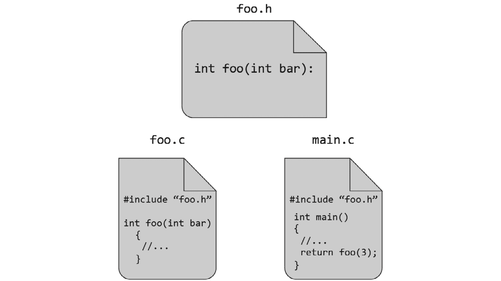

# *第四章*

# 支持软件开发的工具

## 引言

是的，有大量的不同工具。是的，每个人都有他们偏爱的工具。不，没有理由看不起使用与你不同工具的人。是的，喜欢`vi`的人很奇怪。在这一章中，我不会推荐特定的工具，但可能会介绍某些工具类别以及我找到的一些使用方法，这些方法对我有所帮助。

如果你刚开始学习编程——也许你只是上过几节课或者读过几本书——这一章应该会告诉你程序员除了在文本编辑器中输入`public static void`之外还做些什么。如果你更有经验，你也许还能在这里找到一些有用的信息。

## 版本控制/源代码管理

我想象许多读者现在可能认为关于版本控制的争论肯定已经结束了，所有开发者都在使用某种系统。遗憾的是，这显然是不真实的。让我从一个轶事开始。那是 2004 年，我刚刚开始在一家大学计算机实验室担任系统管理员。我的工作部分是维护实验室的电脑，部分是教授物理本科生编程和数值计算，部分是编写辅助教学的软件。作为这项工作的一部分，我开始使用版本控制，既用于我的源代码，也用于服务器上`/etc`目录中的一些配置文件。一位经验更丰富的同事看到我在这样做，告诉我我只是在给自己找麻烦；说这些小事情没有必要进行版本控制。

现在转到 2010 年，我在英国的一个大型科学设施工作。使用软件和大量的电脑，我们将原本需要整个博士研究生才能完成的工作缩短到了 1 到 8 小时之间。我是软件团队的一员，是的，我们使用版本控制来跟踪软件的变更以及了解哪个版本被发布。好吧，至少在某种程度上是这样的。文件/源代码的核心部分在版本控制中，但它的一个主要功能是提供一个脚本环境和领域特定语言（DSL），让“实验室台面”上的科学家可以编写自动化实验的脚本。这些脚本（不一定）在版本控制中。更糟糕的是，源代码被部署到实验站，如果有人发现核心中的错误，可以本地修复它，而无需在版本控制中跟踪更改。

因此，一个团队在这个设施进行了一次实验，并产生了一些有趣的结果。你后来尝试复制这个实验，却得到了不同的结果。这可能是软件相关的问题，对吧？你所需要做的只是使用与原始团队相同的软件……不幸的是，你做不到。它已经消失了。

这就是科学家未能使用软件开发工具可能会损害他们科学的一个例子。软件领域有很多“蛇油”，既有想要你使用他们的工具/方法论的人，因为他们会为此向你收费，也有决定“他们的”工作方式是正确的，而任何其他方式都是错误的人。你需要能够穿越所有这些废话，找出特定工具和技术如何影响你试图做的实际工作。科学哲学目前高度重视可重复性和审计。版本控制支持这一点，因此对于在科学领域工作的程序员使用版本控制是有益的。但他们并没有；至少不是始终如一。

在其最简单的形式——我在 2004 年使用的那种形式——版本控制是一个大的撤销栈。只是，与一系列撤销和重做命令不同，你可以留下消息解释每个变更是由谁做出的以及为什么。即使你是在独自工作，这也是一个非常好的功能——如果你尝试的事情变得混乱或者没有成功，你可以轻松地回滚到一个可工作的版本，并从那里继续。

一旦你更熟悉版本控制系统的功能，它就可以成为配置管理的强大工具。对同一产品的不同功能和错误修复工作可以并行进行，当工作准备好时，可以集成到产品的一个或多个版本中。详细讨论这个工作流程超出了我在这里愿意涵盖的范围：我推荐 Travis Swicegood 的关于版本控制的**实用程序员**书籍，例如**使用 Git 进行实用版本控制**——[`pragprog.com/book/tsgit/pragmatic-version-control-using-git`](http://pragprog.com/book/tsgit/pragmatic-version-control-using-git)。

### 关于版本控制和协作

版本控制并不比其他文档管理系统，如 SharePoint，更是一种协作工具。整合（或合并）不同人之间的相关工作很困难，需要了解代码的含义以及变更如何交互。版本控制系统没有这种知识，因此除了最简单的情况外，无法简化合并过程。它确实让你可以推迟问题直到你想要面对它，但仅此而已。

一些工具——例如，**GitHub** —— [`www.github.com`](http://www.github.com) – 在核心版本控制系统周围提供社交功能。然而，知道从谁那里整合什么，何时整合，以及解决冲突的问题仍然存在。社交功能为你提供了一个讨论这些问题的场所。

### 分布式版本控制

这些年来，我使用过许多版本控制系统，从与本地文件系统工作的简单工具到极其昂贵的商业产品。我现在最喜欢的工作方式是使用`darcs`，它们都以非常相似的方式工作）。

使用分布式版本控制系统（DVCS），将本地项目纳入版本控制非常简单，因此即使是玩具项目和原型也可以进行版本控制。这使得它们比早期的系统（如**RCS**（反应控制系统）和**SCCS**（源代码控制系统））更适合版本控制本地文件，因为这些系统将整个仓库（即构成版本化项目的所有文件）视为原子单元。换句话说，仓库可以处于一个版本或另一个版本，但永远不会处于一个中间状态，其中某些文件比其他文件的版本更早。

早期的系统，如 RCS，没有这种限制。在 RCS 中，每个文件都是独立版本化的，因此每个文件都可以在不同的版本上检出。虽然这更灵活，但也引入了某些问题。例如，考虑以下图中的文件。其中一个文件包含一个在其他文件中使用的函数。您需要更改函数的签名，以添加一个新参数。这意味着需要更改所有三个文件。

###### 图 4.1：跨越多个文件的依赖关系

在原子版本控制系统中，文件可以同时使用一个参数检出特定版本的文件，或者同时使用两个参数检出特定版本的文件。一个按文件版本化的系统将允许检出任何版本的组合，尽管其中一半的组合没有意义。

一旦在 DVCS 仓库中本地版本化了项目，与他人共享就变得简单，可以通过多种方式完成。如果您想在像**BitBucket**这样的托管服务上备份或共享仓库——[`www.bitbucket.org`](http://www.bitbucket.org)，您将其设置为远程仓库并推送内容。然后，合作者可以从远程版本克隆仓库并开始工作。如果他们与您在同一网络中，那么您只需共享包含仓库的文件夹，而无需设置远程服务。

#### 个人经验

在某些情况下，需要这些方法的组合。我使用的所有 DVCS 工具都支持这一点。在一个最近的项目中，所有内容都托管在远程服务上，但仓库中存储了数百兆字节的资产。对于办公室的计算机来说，不仅克隆远程仓库，而且相互对等以减少资产更改时的时间和带宽使用是有意义的。这种情况看起来如下图所示。

###### 图 4.2：分布式版本控制系统的配置可以摆脱集中式系统所需的“星形”拓扑结构

使用集中式版本控制系统来做这件事是可能的，但会很丑陋。其中一个开发者需要完全同步他们的工作副本与服务器，然后将整个仓库及其元数据完全复制到所有其他开发者的系统上。这比仅仅复制仓库之间的差异要低效。一些集中式版本控制系统甚至不支持这种方式，因为它们跟踪他们认为你在服务器上签出的文件。

DVCS 带来的另一个好处——部分归功于改进的算法，也归功于其分布式特性——是创建和销毁分支的便捷性。当我主要使用集中式版本控制（主要是 Subversion 和 Perforce）时，分支是为特定任务创建的，比如新版本发布，而我所在的团队发明了工作流程来决定何时将代码从一条分支迁移到另一条分支。

在 DVCS 中，我经常每小时创建一个分支。如果我想开始一些新的工作，我会在本地仓库版本中创建一个分支。过了一段时间，我可能完成了，分支被合并并删除；或者我确信这个想法是错误的——在这种情况下，它只是被删除；或者我想让别人看看，我就不合并这个分支而将其推送到远程。所有这些在集中式 VCS 中都是可能的，尽管速度慢得多——而且你需要网络访问才能创建分支。

## 持续集成与持续部署

在刚刚讨论了版本控制之后，是时候宣布我看到的比其他任何错误都更频繁的 VCS 错误了——这个错误是每个人（包括我自己）都会犯的，无论他们的经验或专业知识如何。获胜者是…

*在项目中添加新文件，但忘记将其添加到仓库中。*

我并不经常这样做——可能每月不到一次。但每次我这样做，当团队中的其他开发者同步他们的仓库时，我们就会陷入一种情况：对我而言一切正常，但他们无法构建。

如果我们很幸运，错误报告将指出文件未找到，我们可以快速解决问题。如果不这样，可能会有一些其他错误，比如缺失符号或其他需要花费时间追踪的问题，在发现根本原因之前。

如果我们有一种形式的机器人，它会看到每一次的提交，获取源代码，并尝试构建产品。如果它做不到，如果它出现并抱怨导致构建失败的人，那就太好了。

结果表明，我们已经生活在未来一段时间了，那个机器人已经存在了。它被称为**持续集成**，或 CI。

### 为什么使用持续集成？

找到那些缺失的文件并不是 CI 好处的唯一之处。如果你有自动化测试（见*第五章，编码实践*），CI 系统可以在每次更改时运行测试，并报告任何问题。我团队的 CI 服务器配置为运行分析工具（本章讨论），如果该工具发现任何问题，则认为构建失败。一些项目会自动生成 API 文档并将其发布到 web 服务器上。

一旦通过了所有测试，甚至可以让构建对人们安装可用。这与**持续部署**的概念相关：如果软件的某个版本看起来足够好可以使用（也就是说，它没有失败你给它做的任何测试），那么就开始使用它。你仍然可能会发现自动化测试没有暴露的问题，但你会比没有立即部署时更早地发现这些问题。

CI 的一个最终好处——虽然相当微妙但非常有用——是它迫使你设置你的项目，以便可以从版本控制中检出并自动构建。这意味着即使当人类程序员在处理项目时，他们也很容易设置源代码并开始变得高效。那个人可能是你，当你得到一台新笔记本电脑时。也可能是承包商或加入团队的新的员工。无论如何，如果只有一个步骤可以获取项目并构建它，那么他们可以快速上手，而不是询问你如何获取某个库或配置某个插件。

### CI 在真实团队中的应用

我参与过的某些团队对使用 CI 投入了极大的热情，以至于他们雇佣了专人维护 CI 基础设施（这不是一份全职工作，所以他们通常还会负责其他支持工具的维护并对其使用提供咨询）。在其他团队中，维护 CI 的责任则落在了开发者身上。

在第二种情况下，困难在于知道何时照顾 CI 而不是做项目工作。例如，在本节编写前的一个月，我不得不将我团队的 CI 系统迁移到不同的硬件上。尽管我试图确保系统配置在两个环境之间没有变化，但其中一个项目中的测试将不再运行。

问题是，测试在所有开发者的 IDE 上都运行得很好。我们真的需要花费更多的时间从增加客户支付的产品价值中抽离出来，去手把手地指导一些困惑的机器人吗？

我认为现在不使用 CI 进行开发是有风险的。是的，没有它，我*可以*避免所有问题。是的，*可能*不会出任何问题。但为什么要冒险呢？为什么不花一点额外的时间来确保我尽早发现问题呢？这是现在花一点时间，以备将来可能节省很多。因此，我试图在必要时找到时间维护 CI 服务。

## 构建管理

在上一节中，我提到采用 CI 的好处之一是它迫使你简化项目的构建（我的意思是编译源代码、转换资源、创建包以及任何其他将项目团队创建的输入转换为将被客户使用的产品的操作）。确实，为了使用 CI，你必须将构建过程压缩到自动化流程可以在任何源代码修订后完成它的程度。

没有必要编写脚本或其他程序来完成这项工作，因为已经存在大量的构建管理工具。从高层次来看，它们都做同样的事情：它们接受一组输入文件、一组输出文件，以及一些关于如何从一组到另一组进行转换的信息。当然，它们如何做到这一点因产品而异。

### 习惯或配置

一些构建系统，如 `make` 和 `ant`，需要在它们能够做任何事情之前，让开发者几乎告诉它们关于项目的所有信息。例如，虽然 `make` 有一个将 C 源文件转换为目标文件的隐式规则，但它实际上不会执行该规则，直到你告诉它你需要目标文件用于某个目的。

相反，其他工具（包括 Maven）对项目有一些假设。Maven 假设名为 `src/main/java` 的文件夹中的每个 `.java` 文件都必须编译成一个将成为产品一部分的类。

配置方法的优点是，即使对系统了解不多的人也能发现它。有人手持一组源文件、`grep` 和一点耐心，可以从 `Makefile` 或 `Xcode` 项目中找出哪些文件被构建成了哪些目标，以及如何构建。因为有一个完整的（或几乎是完整的）关于如何构建一切的规范，你可以找到需要更改的内容，以便使其行为不同。

这种可发现性的缺点是，你必须指定所有这些内容。你不能只是告诉 Xcode，名为 `Classes` 的文件夹中的任何 `.m` 文件都应该传递给 Objective-C 编译器；你必须给它一个包含所有这些文件的庞大列表。添加一个新文件，你必须更改这个列表。

在基于习惯的构建系统中，这种状况正好相反。如果你遵循习惯，一切都会自动完成。然而，如果你不知道这些习惯，它们可能很难发现。我曾经在一个 *Rails* 项目中遇到过这样的情况，静态资源（如图像）保存的文件夹在两个版本之间发生了变化。在启动应用程序时，我的所有图像都没有被使用，而且不清楚原因。当然，对于知道这些习惯的人来说，在不同项目之间转移时没有学习曲线。

总体来说，我更喜欢一种由惯例引导的方法，前提是这些惯例在某处有很好的文档记录，这样就可以轻松地了解发生了什么，以及当你需要时如何覆盖它。对我来说，减少努力和增加一致性的好处超过了偶尔遇到的惊喜。

### 生成其他构建系统的构建系统

一些构建过程变得如此复杂，以至于它们产生了另一个构建系统，在构建之前为目标系统配置构建环境。一个典型的例子是 GNU Autotools，——它实际上有一个三级构建系统。通常，开发者会运行`autoconf`，这是一个检查项目以确定后续步骤应该提出什么问题的工具，并生成一个名为`configure`的脚本。用户下载源代码包并运行`configure`，它会检查编译环境并使用一系列宏来创建一个 Makefile。然后 Makefile 可以编译源代码（最终！）创建产品。

如*Poul-Henning Kamp*所论证——[`queue.acm.org/detail.cfm?id=2349257`](http://queue.acm.org/detail.cfm?id=2349257))，这是一个糟糕的架构，它增加了不必要的层来处理那些没有编写成可移植到将使用其环境的代码。用这些工具编写的软件难以阅读，因为你必须阅读多种语言才能理解一行代码是如何工作的。

考虑你在项目中报告的一个特定 C 函数中的缺陷。你打开该函数，发现有两个不同的实现，由一个`#ifdef/#else/#endif`预处理器块选择。你搜索该块使用的宏，并在`config.h`中找到它，因此你必须阅读`configure`脚本以了解它是如何设置的。为了发现*那个*测试是否做得正确，你需要查看`configure.ac`文件以了解测试是如何生成的。

使用这种复杂过程的唯一理由可能是它被认为是一种传统，并且你的目标用户期望这样做，但即使如此，我也会质疑这种期望是由技术需求还是由**斯德哥尔摩综合症**——[`en.wikipedia.org/wiki/Stockholm_syndrome`](http://en.wikipedia.org/wiki/Stockholm_syndrome)驱动的。如果你的产品不需要可移植性，那么就没有必要增加所有这些复杂性——即使它确实需要，也可能有更好的方法来解决你的产品的问题。一个明显的方法是针对可移植平台，如 Mono 或 Python。

## 缺陷和工作跟踪

在它们的大部分历史中，计算机擅长一次只做一件事。即使是一个单独的客户或用户也能比这更好地并行处理，在你还在处理一件事的时候，他们可能会想出（并制作）多个请求。

将所有这些请求都写下来并跟踪你和你的同事在每个请求上的进度，这样你们就不会都试图解决相同的问题，并且可以通知客户哪些问题已经修复。bug 跟踪器（有时更通称为问题跟踪器或工作跟踪器）旨在解决这个问题。

### 何时以及什么内容进入？

我参与过一些项目，其中 bug 跟踪器在项目开始时就被所有项目功能请求填满（这个讨论与第十三章“团队合作”中软件项目管理模式的处理略有重叠）。这引入了一些问题。一个是**大列表**需要大量的梳理和编辑，以保持相关性，因为功能被添加和删除，分散在多个开发者之间，或者被发现依赖于其他工作。第二个是心理上的：在很长的一段时间里，项目团队成员将看到令人沮丧的尚未完成的事项列表，就像西西弗斯站在山脚下仰望他的石头一样。项目从一开始就会像死亡行军一样。

我的偏好是采用迭代方法来攻击工作跟踪器。当决定下一个构建将包含哪些内容时，将这些任务添加到工作跟踪器中。完成它们后，标记为已关闭。唯一从一次迭代保留到下一次迭代的东西是那些在计划中未能完成的任务。现在，跟踪器中的大列表始终是我们已经完成的大列表，而不是仍然剩下的大列表。这与看板系统类似，团队将有一个固定的“容量”的待办工作。当他们从待办桶中提取工作开始工作时，他们可以要求桶得到补充——但永远不要超过其容量。

我报告 bug 的方法不同。除非是我在现在工作的代码中的小事，这样我可以在几分钟内解决问题并继续前进，否则我总会立即报告。这意味着我不会忘记问题；修复是隐式地计划在下一个迭代中进行的，遵循**乔尔测试**规则，即在添加新代码之前修复 bug，我们可以看到每个产品构建中发现了多少 bug。（现在回想起来，我意识到这一章涵盖了测试中包含的许多要点。也许你应该只测量你团队相对于乔尔测试的 12 个点的表现，并修复你回答“否”的任何问题——[`www.joelonsoftware.com/articles/fog0000000043.html`](http://www.joelonsoftware.com/articles/fog0000000043.html)）。

### 如何精确跟踪？

所以，你设法在 2 小时内修复了那个 bug。但是，它实际上是 2 小时吗，还是 125 分钟？你花了那 2 小时仅仅修复 bug，还是在这段时间内还回答了关于工程师与销售之间的口哨赛跑的邮件？

能够比较估计时间与实际时间可能是有用的。我不确定“速度”——估计时间与实际花费在任务上的时间的比率——特别有帮助，因为在我的经验中，估计并不总是以一个常数因子错误。知道你**什么**工作估计得不好是有帮助的。你是否没有意识到添加新功能的风险，或者你是否倾向于认为所有错误修复都是微不足道的简单？

因此，精确的测量并不特别有帮助，了解这一点是有用的，因为准确性可能并不存在来支持这种精确度。我通常只在开始工作和结束工作的时候看我的手表，并四舍五入到最近的十五分钟或半小时。这意味着我的时间记录包括了我在修复错误时所做的所有那些中断和小的任务——这是可以接受的，因为它们减慢了我的速度，这需要记录。

估计甚至并不那么准确。我和我的团队玩的游戏是这样的：团队中的每个开发者（只有开发者）独立写下我们计划的任务预计需要多长时间。他们可以从中选择以下之一：1 小时、2 小时、4 小时、8 小时，或者不知道。如果我们认为一个任务将需要超过 8 小时，我们会将其分解并估计更小的任务部分。

对于每个任务，每个人都提出他们的估计。如果他们的估计大致相同，那么我们就选择最大的数字并继续。如果有意见分歧——也许一个开发者认为某件事需要一个小时，而另一个人认为需要一天——我们会讨论这个问题。很可能，团队中的一个人（或更多人）依赖于需要公开的隐性知识。通常，可以快速解决这些差异并继续下一件事。

## 集成开发环境

嗯，实际上，我想你的环境并不需要完全集成。长期以来，我的工具集是项目构建器、界面构建器、WebObjects 构建器、EOModeler 和编辑器的组合。它确实需要比简单的“文本编辑器和`make`”组合更高效。

什么大问题？为什么对文本编辑器这么苛刻？每次你必须停止制作软件来处理你的工具时，你都有可能失去注意力，忘记你在做什么，然后需要花几分钟重新熟悉问题。失去几分钟听起来并不像什么大问题，但如果你每天工作的时候每小时都这样做几次，它很快就会变成一个令人沮丧的生产力下降。

在接下来的几年里，你将大部分工作时间都在使用你的 IDE，*每一天*都在使用。你应该在它上面进行大量投资。这意味着为一个好的 IDE 花一些钱，它比免费的替代品更好。这意味着训练自己掌握技巧和快捷方式，这样你就可以不用思考就能完成它们，节省偶尔的几秒钟，更重要的是，保持你专注于工作。如果你的环境支持，甚至可能意味着编写插件，这样你就可以在不切换上下文的情况下做更多的事情。

在一些插件丰富的环境中，你可能会整天都待在集成开发环境（IDE）里，从未离开过。例如，Eclipse 现在包括了**Mylyn** ([`eclipse.org/mylyn/start/`](http://eclipse.org/mylyn/start/))这样一个以任务为中心的插件，因此你可以在 IDE 内部与你的缺陷跟踪器进行交互。它还会让你只关注与你当前正在工作的任务相关的文件。

你不仅需要深入掌握你选择的 IDE，还需要广泛了解替代方案。你最喜欢的工具的未来版本可能会带来很大的变化，以至于你切换到不同的应用程序会更加高效。或者，你可能会开始在一个你首选的 IDE 不可用的项目中工作；例如，你无法（轻易地）在 Xcode 中编写 Mono 应用程序，或者在 Visual Studio 中编写 Eclipse RCP 应用程序。

这种将开发环境限制在特定平台上的限制，无论出于技术还是商业原因，都是不幸的。这正是“只需使用一个文本编辑器”的人群有道理的地方：你可以一次性学习 `emacs`，无论你最终使用哪种编程语言，你都不需要再次学习如何使用编辑器来编写代码。既然你将在这些环境中度过你整个职业生涯，那么你对已知功能的任何更改都代表着巨大的低效。

注意，上述所有 IDE 都遵循相同的通用模式。当人们争论“哪个 IDE 是最好的？”时，他们实际上讨论的是“你更喜欢使用哪个带有**构建**按钮的略微增强的等宽字体文本编辑器？”Eclipse、Xcode、IntelliJ、Visual Studio……所有这些工具都基于相同的设计——让你能够查看源代码并更改源代码。作为次要效果，你还可以执行诸如构建源代码、运行构建的产品以及调试它等操作。

我认为世界上最成功的 IDE 是一个根本不是那样设计的 IDE。它是那些比已经提到的任何 IDE 都被更多非软件专业人士使用的 IDE。它是那些不需要你练习多年才能成为一个优秀的 IDE 用户之前就能获得好处的 IDE。它是当商业分析师、办公室助手、会计和项目经理需要他们的电脑运行一些自定义算法时都会转向的 IDE。世界上最成功的 IDE 是 Excel。

在电子表格中，最显眼的是输入和结果，而不是那些将你从一个带到另一个的中间过程。你可以通过输入不同的输入并观察结果在你面前变化来测试你的“代码”。你可以看到中间结果，不是通过中断和逐步执行，或者放入日志语句然后切换到日志视图，而是通过将算法分解成更小的步骤（或者如果你愿意可以称之为函数或过程）。然后你可以可视化这些中间结果是如何随着输入和输出的变化而变化的。这比 REPLs 提供的反馈更快。

许多电子表格用户自然采用“测试优先”的方法；他们为已知结果应该是什么的输入创建输入，并逐步尝试构建一个能够实现这些结果的公式。当然，还有有趣的可视化，如图表等（尽管产品的质量各不相同）。在 Xcode 中绘制图表是……具有挑战性的。确实，你根本无法做到这一点，但你可以让 Xcode 创建一个可以自己生成图表的应用程序。结果与工具相去甚远。

## 静态分析

在**第五章，编码实践**中，有一个关于**代码审查**的部分。考虑到审阅者会找到并专注于他们能找到的最简单的问题，如果能够消除所有这些琐碎的问题，迫使他们寻找更实质性的问题，那岂不是很好？

这就是静态分析所做的事情。它可以在不运行产品的情况下自动发现代码中的问题，但这些问题的离题性质使得编译器警告不适用，或者发现这些问题的速度太慢，以至于编译器不适合作为搜索它们的工具。

什么是离题问题？通常，那些需要了解你使用的函数或方法的语义的问题——这种知识超出了编译器的范围。例如，考虑一个 C++的`destroyObject<T>(T t)`函数，它会**删除**其参数。用相同的参数调用该函数两次将是一个错误——但是编译器并不知道这一点，如果它只是检查函数签名的话。其他问题则是关于风格的。例如，苹果的 C 语言 API 有一个与其内存管理规则相关的命名约定：当调用者拥有返回的对象时，函数名包含`Create`；当`callee`拥有时，包含`Get`。使用 C 语言混合这些名称并不是错误，所以编译器不会告诉你，但分析器可以。

基本上没有理由避免使用静态分析器（如果你的理由是还没有为你使用的语言/框架/等等提供静态分析器，你可能选择了一个尚未准备好的语言/框架/等等。关于这一点，在第十二章“商业”中有一个部分）。它将为你发现容易修复的错误，并迅速训练你从一开始就不犯这些错误。

## 代码生成

在许多应用中，有很多功能实现起来很简单，但必须反复执行。也许是将模型对象的数组转换为列表视图，从数据库模式创建类，或者从文本文件创建编译时常量列表。

这些情况通常可以通过生成代码来自动化。想法是将问题表达在一个简洁的表示中，然后将其翻译成可以集成到你的程序中的东西。这正是编译器所做的事情；尽管许多编程语言远非简洁，但它们仍然比机器的本地指令代码要容易操作得多。

### 编写自己的生成器不应是首选方案

正如代码生成器使创建产品变得更容易一样，它也使得调试变得更困难。以本章前面讨论的`autotools`构建系统为例。想象一下，一个开发者正在调查一个报告的问题，其中一个测试失败了（今天我不得不处理的问题）。日志文件告诉他们哪个 C 程序封装了测试，但开发者不能直接修改那个程序。他们必须发现`configure`脚本在哪里生成那个程序，以及它是通过什么方式尝试达到这个目的的。然后他们必须找出在`configure.ac`中那个 shell 脚本的部分是如何生成的，并找出对`m4`宏的修改，以便在两步之后实现 C 程序的期望变化。

简而言之，如果你的目标环境提供了原生解决你问题的工具，那么在诊断后续问题时，这种解决方案将需要更少的逆向工程。只有当这种解决方案过于昂贵或容易出错时，代码生成才是一个合理的替代方案。

本节开头给出的许多案例都是数据驱动的，例如从数据库模式推导出某些**对象关系映射（ORM**）系统的类描述的情况。这是一个某些编程语言允许你解决此问题而不在它们的语言中生成代码的情况。如果你可以在运行时解析发送给对象的短信，那么你可以告诉该对象其对象所在的表，并且它可以决定任何消息是否对应于该表中的列。如果你可以在运行时添加类和方法，那么你可以在应用程序连接到数据库时生成所有的 ORM 类。

这种功能的存在和适用性在很大程度上取决于你针对的环境，但在开始编写生成器之前，寻找并考虑这些功能。

### 当生成器不会被程序员使用时

如果这个设施的目标“客户”不是另一个开发者，那么尽管实现复杂度增加，生成器通常比功能齐全的编程语言是一个更好的选择。

在这个背景下，经常探索的解决方案是**领域特定语言（DSL**），这是一种非常有限的编程语言，它暴露的语法和功能与客户理解的问题比计算机科学概念更接近。我参与过的许多项目都使用了 DSL，因为它们在让客户根据需要修改系统与避免复杂的配置机制之间提供了一个很好的权衡。

#### 案例研究

使用该应用程序的“客户”不一定是最终产品的终端用户。在我参与的一个项目中，我创建了一个领域特定语言（DSL）供客户使用，以便他们能够定义项目中用于游戏化功能的成绩。一个解析应用程序会告诉他们定义中的任何不一致性，例如缺失或重复的属性，并且还生成了一组对象，这些对象将在应用程序中实现这些成绩的规则。它还可以生成一个脚本，连接到应用商店，告诉它这些成绩是什么。
