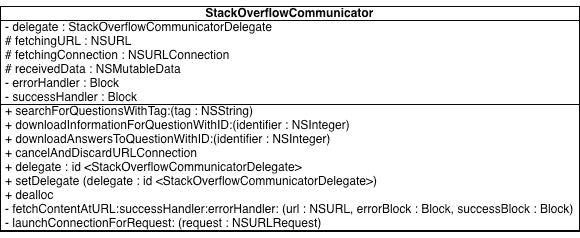

# 第九章：*第八章*

# 文档

## 简介

软件项目中产生的文档数量差异很大。在深入探讨何时以及如何记录你的代码之前，我首先定义一下我如何使用这个术语。

在本章的上下文中，文档指的是那些旨在帮助其他开发者理解软件产品和代码，但不是可执行代码或产品本身的任何其他资源。代码中的注释，由于不是可执行的，是文档的一部分。单元测试，虽然可执行，但不包含在产品中——*它们*将是文档，除了我在*第五章，编码实践*中涵盖了自动化测试之外。UML 图、开发者维基、提交信息、错误报告中的描述、白板会议：这些都有助于向其他开发者解释——而不是计算机——代码做什么，如何做，为什么这样做。

另一方面，为其他利益相关者准备的文档，如用户手册、在线帮助、为用户提供的营销材料，或者为管理者准备的进度表和概述，将不会在此处讨论。这些同样非常重要，如果你需要制作它们，那么你需要做好这项工作。但慈善始于家庭，通过帮助他们理解正在工作的代码来节省他们的时间是肯定的一种慈善行为。

## 文档比你想象的更有用

不记录代码的常见理由是*源代码本身就是准确的文档*——[`www.codinghorror.com/blog/2012/04/learn-to-read-the-source-luke.html`](http://www.codinghorror.com/blog/2012/04/learn-to-read-the-source-luke.html)；也就是说，虽然文档可能会出错或者随着软件的变化而变得不准确，但源代码保证是软件行为的精确且精确的描述。

如果你假设框架和编译器没有错误，那么这个想法是正确的：源代码*确实是*软件行为的完整且精确的文档。问题是，它并不总是最合适的文档来阅读。

当然，源代码是完全准确的，但它也是抽象层次最低的。如果你刚刚加入一个项目并需要熟悉不熟悉的软件，按顺序阅读每个操作（一旦你甚至已经找到了正确的顺序），并不是最容易进行的方式。

即使你忽略这一点，仅使用源代码作为了解软件的唯一信息来源也存在问题。它确实能告诉你产品**做什么**。经过一段时间的学习，你也能发现它是如何做到的。但是，编程语言指令能告诉你软件为什么这样做吗？那个奇怪的`if`语句是为了修复客户报告的 bug 吗？也许它是为了绕过 API 中的问题？也许原始开发者只是无法想出解决这个问题的其他方法。

因此，好的文档应该告诉你代码为什么这样做，同时也让你能快速发现它是如何做到的。它应该提供背景信息，而不是细节，而源代码则提供了所有细节，但背景信息难以发现。换句话说，源代码代表了你创建的虚拟世界的精确计划，而你的文档应该是**旅游指南**—[`www.infoq.com/presentations/The-Frustrated-Architect`](http://www.infoq.com/presentations/The-Frustrated-Architect)（据我所知，这个想法首先是由*Simon Brown*—[`www.codingthearchitecture.com`](http://www.codingthearchitecture.com)提出的），它提供了地图，推荐去哪些地方（以及避免哪些地方），以及关于世界历史的资料。

## **时效性问题**

关于创建除源代码之外的文档的另一个主要抱怨是，除非文档与源代码同时维护，否则它们会很快过时；阅读过时的文档比不阅读文档更糟；而且没有投入到工作代码中的努力都是浪费。

我首先来谈谈第二个问题。制作**任何**形式的开发者文档的目的，是为了让开发者更容易地使用软件。因此，创建文档的成本应该真正地与不制作文档的机会成本进行权衡。如果让开发者直接开始工作的努力节省的时间大于创建和维护文档所花费的时间，那么这样做是值得的。相反，如果权衡结果不佳，你需要决定是否放弃这种形式的文档，转而寻找更有价值的东西，或者找到更快的方式去制作它。

但其他问题又如何呢——过时的文档是否比没有文档更糟？这一点确实有道理，因为被引导到错误的方向不会帮助某人找到自己的路。然而，这个过程可能比你想象的要长得多，才会变得重要。记住，文档捕捉了高级功能：为什么（以及在一定程度上，如何）代码执行其功能。想象一下，你有一些文档，无论其完整性如何，都是最新的。你接下来的提交不太可能改变产品使用的框架，或者它连接到的数据库类型，甚至它如何对远程组件进行身份验证。从高层次来看，产品保持不变。

就像城市指南即使一些商店或餐厅改变了他们提供的服务仍然有用一样，你的代码旅游指南在方法有所改变时仍然可以有所帮助。文档真正过时无用的风险是一个在几年而不是几天内逐渐显现的问题。

## 自动生成的文档

在上一节中，我谈到了与生成文档相关的经济权衡：生产成本是否低于没有该文档的机会成本。可以通过两种方式使文档生产的平衡倾向于生产文档：要么降低生产成本，要么提高文档的价值。

从代码自动生成文档——通常称为文档的*逆向工程*——是一种降低生产成本的策略。这个想法很简单：如果开发者可以随时从源代码中创建文档，他们就可以随时获得关于代码如何工作的最新描述。

逆向工程工具，通常产生 UML 图，这是本章后面讨论的特定格式的文档（为了清楚起见，我并不是在谈论从代码注释中提取文档的工具；你仍然需要自己编写这种形式的文档），擅长提供项目的高级概述，其中省略了一些或所有细节。例如，给定一个类定义，如`.java`类或 Objective-C 的`.h`和`.m`文件，逆向工程工具可以突出显示 API 方法和属性，如下面的图所示：



###### 图 8.1：UML 类图

他们说没有免费的午餐（有些人说 TANSTAAFL），这是正确的。一方面，生产那个类图几乎不花任何成本。如果你理解 UML 类图（你还需要理解我是如何选择弯曲 UML 以使其更好地表示 Objective-C 的——U 代表**统一**，而不是**通用**），它确实比深入源代码并挑选出所有方法提供了一个更好的类 API 概述。但由于图表是从源代码生成的，而源代码没有告诉我们*为什么*它是这样的，这个图表不能为读者阐明这个类的背后的原因。

为什么 API 在一个地方使用委托回调而在另一个地方使用块回调？为什么使用`NSURLConnection`而不是其他类来下载内容？为什么一些实例变量是受保护的，而不是私有的？从这张图表中无法得知。

此外，你无法很好地了解*如何*。方法的调用顺序重要吗？在没有任何操作进行时调用取消方法可以吗？委托属性可以是`nil`吗？图表中没有说明。

因此，是的，自动生成的文档很便宜。它移除了代码中的信息，但没有提供任何额外的东西。拥有这样一个简要概述是有用的，但不太可能通过逆向工程生成的文档就能解决所有问题。

## 分析瘫痪

结合你从生成的文档中学到的知识，你可能会有将控制方向反过来。如果零输入努力的文档没有提供很多额外的价值，那么也许你投入更多精力创建文档，它就会变得更有用。

也许，在某种程度上，这是真的。然而，增加文档的增量价值是渐近的。事实上，情况更糟。创建过多的文档，人们甚至无法在没有一些指南——一些元文档的情况下使用*那些*文档——如果文档根本不存在，使用起来反而更容易。

注意，**分析瘫痪**（http://c2.com/cgi/wiki?AnalysisParalysis）并不是*直接*与编写文档相关的；它实际上是一种有缺陷的设计方法。与文档的交互发生在你深入研究问题时。当你害怕从设计解决方案转向构建它时，就会发生分析瘫痪。你是否考虑了所有边缘情况？是否处理了每个异常条件？是否有你没有考虑到的用例？你不知道——你不想在弄清楚之前开始构建。

磨练你的架构文档或类图基本上是浪费时间。找到这些边缘情况的最佳方式是构建东西并看看什么不起作用——特别是如果你正在编写单元测试来覆盖 API 的角落。通过将软件提供给客户，你会发现缺少了一个用例。

因此，分析瘫痪并不是在创建文档时出现的问题；它发生在你*专注于*文档的时候。记住，在章节的开始，我说过文档的存在是为了通过帮助程序员来支持代码的开发。你的目标是你的产品：你的客户想要使用的东西。

## 如何编写文档

本章的前几节讨论了编写文档的*原因*，即其带来的好处，以及为什么如果你做得太少或太多可能会遇到麻烦。现在，我们来讨论*如何*编写文档，现有的文档形式，它们如何有用（或否则），以及如何着手编写它们。

### 编码标准

大多数有超过几个开发者共同工作的组织都有一个风格指南或编码标准。这份文档解释了编写代码以创建“公司风格”的细节：括号应该放在哪里，变量应该如何命名，缩进应该用多少空格，等等。如果你以前没有见过，**GNU 编码标准**——[`www.gnu.org/prep/standards/standards.html`](http://www.gnu.org/prep/standards/standards.html)非常全面。事实上，我工作过的公司要求他们的代码符合 GNU 标准而不是自己编写：它已经存在，涵盖了大多数问题，并且很容易遵守。

编码标准对于确保新加入项目的开发者编写一致的代码非常有用——尤其是那些可能还没有意识到单一布局、变量和方法命名等价值的新手程序员。 (其价值在于你不会对变量的名称、表达式的位置等感到惊讶。代码的组织不会妨碍你专注于代码的意义——也许除了为什么、如何、什么，我应该再加上*在哪里*。) 对于熟悉他们使用的语言及其习惯用法的开发者来说，编码标准文档是浪费时间：他们可以从代码中*看到*你如何布局括号；他们可以自动适应你的风格，或者至少配置他们的 IDE 来为他们完成这项工作。正如 Herb Sutter 和 Alexei Alexandrescu 在《C++编码标准》中所说：

*那些仅仅是个人品味问题，并不影响正确性或可读性的问题不应包含在编码标准中。任何专业的程序员都能轻松阅读和编写格式略有不同但符合他们习惯的代码。*

很遗憾，许多编码标准文档并没有超出那些表面的特征。

编码规范中不具体描述如何布局代码的部分是没有用的。它们是那些想要控制别人写作的人的繁琐工作。告诉开发者“确保所有异常都被捕获”或“处理所有错误”并不是他们会放在心上的事情，除非这是他们工作的一部分。如果你想要确保程序员能够捕获异常或处理错误，那么你需要找到那些做不到的人，并指导他们将其作为他们思考工作的一部分。在第一天给他们一些文件上的命令是不够的，甚至第二天也不会记住。

一个经验丰富的开发者，如果还没有学会处理所有错误，仅仅因为一个维基页面告诉他们这样做，是不会开始的。一个已经学会处理所有错误（除了他们不知道的那个）的开发者，不会通过阅读编码规范文档来发现那个错误。一个不知道错误条件如何出现的初学者，仍然一无所知。

高级目标，如“处理所有错误”、“记录所有断言失败”（这可能是“断言所有前提条件和后置条件”之后的条目），等等，对于代码审查清单来说很棒。它们对于自动代码分析规则来说甚至更好。它们不属于标准文档：没有人会仅仅因为阅读了一个要求它们的要点就把这些事情变成“标准”。

#### 编码规范与我

如前所述，我在一家使用 GNU 标准的公司工作过。我还在一个时期为开发团队创建了编码规范，当时所有团队成员（包括我自己）对我们所使用的语言都不太熟悉。

在过去大约 4 年的时间里，尽管我在多家不同的公司工作并签订合同，但没有任何一家公司有文档化的编码规范。我并没有真正觉得缺少它——所谓的“标准”布局变成了“IDE 默认的布局”，其他所有事情都是通过自动化或手动审查完成的。

那么，我会推荐编写编码规范吗？只有在缺乏规范导致问题的时候才会。实际上，编写一个在代码提交到仓库之前重新格式化代码的预提交钩子可能更容易——尽管这可能更加被动-aggressive。一些 IDE（例如来自 JetBrains 的 IDE）已经提供了这个功能。

### 代码注释

每当提到评论时，总会有人搬出一些陈词滥调：

*真正的程序员不会注释他们的代码。如果编写起来很难，那么理解它应该也很困难，修改起来甚至更难（来自* **真正的程序员不会编写规范**——[`ifaq.wap.org/computers/realprogrammers.html`](http://ifaq.wap.org/computers/realprogrammers.html))

*任何代码都应该自文档化*。（在互联网上到处都是；在这个例子中，在**Stack Overflow**上——[`stackoverflow.com/questions/209015/what-is-self-documenting-code-and-can-it-replace-well-documented-code`](http://stackoverflow.com/questions/209015/what-is-self-documenting-code-and-can-it-replace-well-documented-code))

显然，第一个引用是一个玩笑，如果不是，请阅读相关的文章。第二个引用不是玩笑，只是非常错误。

当你编写任何代码时，从心理上讲，你处于“状态”之中。你很可能专注于那个问题，排除所有（或者至少是许多）其他问题。你已经针对那个特定的问题工作了一段时间，并且在那个领域的问题上工作了一段时间。所以，当然，你认为代码不需要任何注释。当你阅读代码时，它会触发所有那些突触连接，让你回想起你为什么要写它以及它应该做什么。

没有人能享受到这些联系的好处。即使是你，当你稍后回到代码时，也没有这种好处：没有加强的记忆会*随时间衰减*——[`www.simplypsychology.org/forgetting.html`](http://www.simplypsychology.org/forgetting.html)。根据那个链接，如果它们没有被巩固，记忆就会从长期记忆中消失。

考虑到这一点，注释是你能创建的最好的文档形式之一，因为它们在两种不同的信息形式之间建立了联系。信息是代码和文字注释，联系是直接的：你可以在同一个地方看到它们（即你 IDE 中的源代码编辑器）。如果其中一个不能让你回想起你产生它的想法，那么它与另一个的联系会触发一些记忆。

回想（这里有点故意玩文字游戏）本章开头的讨论，代码可以很快地告诉你软件做什么，经过一点工作就能告诉你它是如何做到的。没有必要再通过注释重复这些内容——你已经在看一些能提供这些信息的东西了。（快速回顾代码的工作原理可以节省阅读时间。或者，正如弗莱泽·赫斯通过引用弗兰克·韦斯特海默的话所说，“在实验室的一个月可以节省在图书馆的一个小时”——[`twitter.com/fraserhess/status/299261317892685824`](https://twitter.com/fraserhess/status/299261317892685824)。）因此，注释应该专注于*为什么*。

许多人会因为看到类似这样的代码而感到厌烦：

```cpp
    //add 1 to i
    i++;
```

当你编程经验足够丰富，知道你语言中各种操作符的作用时，这样的注释就是多余的噪音。如果所有注释都像这个例子一样，那么有能力的开发者阅读注释就几乎没有意义了——在这种情况下，确实很难为他们写注释的行为找到合理的理由。显然，并不是所有的注释都是这样的；实际上，你写的注释不需要是这样的。

如果你很难相信有人需要提醒`++`操作符的作用，那么你可能不记得学习编程的经历，也没有教过编程。**《教学 H.E.编程博客》**——[`teachingheprogramming.blogspot.co.uk`](http://teachingheprogramming.blogspot.co.uk) 是一个很好的概述，说明了对于不经常做这件事的人来说，你每天做的事情有多么困难。

问题是多余的注释就是多余的。你读它们，意识到它们没有帮助，然后继续。这不会浪费太多时间。更糟糕的是阅读那些让你精神上感到冲击的注释：那些会打断你对代码思考并让你思考注释的。

那个在你脑海中看起来非常有趣的笑话——不要写下来。它可能在推特或公司聊天室里效果很好，但在代码注释中就不合适了。即使阅读它的人第一次觉得它很有趣，但如果他们每天都要停下来反复阅读这个笑话，以便理解代码，那么他们可能就不会觉得有趣了。

当我写这本书的时候，有人在问答网站上问，是否有关于代码注释价值的实证研究——[`programmers.stackexchange.com/questions/187722/are-there-any-empirical-studies-about-the-effects-of-commenting-source-code-on-s`](http://programmers.stackexchange.com/questions/187722/are-there-any-empirical-studies-about-the-effects-of-commenting-source-code-on-s)。更有用的一点是，有人回答了这个问题，并提供了参考文献。其中一篇论文，**《模块化和注释对程序理解的影响》**——[`portal.acm.org/ft_gateway.cfm?id=802534&type=pdf&coll=DL&dl=GUIDE&CFID=278950761&CFTOKEN=48982755`](http://portal.acm.org/ft_gateway.cfm?id=802534&type=pdf&coll=DL&dl=GUIDE&CFID=278950761&CFTOKEN=48982755)，值得更详细地研究。

您的第一反应可能是查看这篇论文的日期——1981 年 3 月——并决定它不可能对现代程序员有任何相关性。但请稍等。这篇文章调查了人们（在三十年中变化不大）如何阅读（也没有太大变化）用英语（变化也不大）写的注释和按不同模块化线路组织的代码。唯一改变的是我们编写代码的方式，而且变化并不大。这篇文章调查了 FORTRAN 语言的代码，这种语言仍在使用，并且与 C 语言不太相似。它调查了使用不同模块化方法的代码，这种变化在现代代码中是观察到的，无论是使用过程式还是面向对象的编程语言。真的没有理由因为文章的年龄而摒弃这篇文章。

他们所做的是为一个问题实现几种不同的代码解决方案：一个单一程序，一个模块化程序，一个过度模块化程序（每个“模块”由 3-15 行组成），以及一个围绕抽象数据类型组织的程序。他们为每种程序产生了两个不同的版本；一个有描述每个模块功能的注释，另一个没有。有趣的是，为了消除关于程序操作的其它线索，他们使所有变量名非描述性，并移除了任何格式化提示。

是否这代表了一种与例如使用一致的（有意义的）命名和格式化策略在所有示例中一样好的控制，这值得探索。48 名程序员每人被分配了一个版本的代码和关于其操作的测验。他们总结了以下结果：

*注释结果似乎表明，通过添加总结模块要执行的功能的简短短语，可以显著提高对程序的理解。与原始假设相反，结论是注释对逻辑模块识别没有显著益处。那些使用未注释的单一版本的人似乎能够理解程序并理解各部分之间的交互，就像那些使用带注释的单一版本的人一样。然而，似乎那些使用未注释的模块化程序的人发现理解模块的功能以及它如何融入程序上下文比那些得到带注释的模块化版本的人更困难。*

这并不是说“注释是好的”或“注释是坏的”。*确实*说，特定类型的注释可以帮助人们理解模块化程序。请注意，它还指出，*未注释*的模块化程序比*未注释*的单一程序更难理解。这个结果与第五章“编码实践”中的 Dunsmore 等人研究有什么相关性吗？记住，他们发现面向对象的程序很难理解：

*那些导致松散耦合对象连接系统的理想设计属性，也产生了一个难以发现执行流程的系统；你不能轻易地看到任何特定消息的结果控制流向何方。*

### 文学编程

Donald Knuth 将注释回忆程序员思维过程的想法进一步发展，提出了**文学编程**（[`www.literateprogramming.com`](http://www.literateprogramming.com)）的概念。在文学编程环境中，程序被编写成“网络”，其中散文和代码可以交织在一起。

程序员被鼓励解释他们所创建代码背后的思维过程，包括将代码实现作为文档的一部分。在网络上使用超链接的代码引用树来生成仅包含源代码的网页视图（通过一个名为 `tangle` 的工具），然后可以将这些内容输入到常规的编译器或解释器中。另一个工具 `weave` 将网页转换成格式化的可读文档。

这个超链接图的目的是将编程语言所需的结构（例如，面向对象语言中的类和方法）与你的思维结构分开。如果你在思考两个不同的类以及它们将如何交互，你可以在想到它们的时候编写代码的部分，并告诉编译器它们应该如何排序。

在稍后阅读网页时，编写者会记得他们为什么做出这样的决定，因为代码的组织结构与他们的思维过程相匹配。其他读者将了解代码是如何演变的以及为什么做出某些决定：这是编写文档的关键原因。

我不确定文学编程是否是一种应该采纳的风格——我还没有用网络构建过任何大型项目。我虽然尝试过 LP 工具，并且发现这是一种编写软件的有趣方式（但无论如何，我也喜欢写散文）。我不确定它是否能够扩展——不一定适用于大型项目。如果我在写**测试驱动 iOS 开发**（[`blog.securemacprogramming.com/2012/04/test-driven-ios-development/`](http://blog.securemacprogramming.com/2012/04/test-driven-ios-development/)）时知道 CWEB，我可能会更快地完成它，并且错误更少。当**《实用程序员**》（[`pragprog.com/the-pragmatic-programmer/`](http://pragprog.com/the-pragmatic-programmer/)）的作者写那本书时，他们实际上重新实现了文学编程的一些部分，以保持他们的手稿与代码同步。

我所担忧的扩展问题是扩展到多个开发者。如果你觉得阅读别人的代码风格令人不快，那么等到你必须阅读他们的未经校对的散文。当然，有一种方法可以找到答案。

### 注释文档

当前的编程文献网站专注于你的思维和文档的结构，让代码适应这种流程，但许多其他工具存在，它们保留了代码的结构，但提取并格式化注释为超链接 API 文档。（注释文档不是在上述“注释”中讨论的吗？不完全是这样，因为其形式性和意图非常不同。）

这些工具——包括 Doxygen、Headerdoc 及其朋友——保留了代码与其文档的邻近性。当你对方法进行更改时，你可以看到其注释就在上面，这邀请你进行更新以保持一致性。

我发现为那些我认为其他人可能会使用的类和接口生成注释文档很有帮助。我通常不会生成美观的输出，但如果人们想要这么做，他们可以这么做。我当然欣赏这种选项，并且会使用格式化的文档来为其他程序员的 API 提供帮助。

一些静态分析工具，特别是微软的，会警告关于未记录的方法、类和字段。这导致仅仅为了存在而添加注释，而不一定导致文档标准得到提高。解释方法目的是“香蕉”及其返回值是“香蕉”的格式化注释到处都是。

注释文档中指定的大部分内容通常包括对方法输入值的限制（“`index`参数必须大于 0 但小于`count`”），何时调用它们（“在调用`configure()`之前调用此方法是一个错误”），或对返回值的期望（“返回的对象将具有小于`2*count`的`size`”）。这些可以作为断言（通常是在文档之外，而不是代替文档）表达的内容，或者你可以使用支持契约的语言。

### Uml 图

UML 是一个很大的主题。关于这个主题已经写了几本书。我甚至不想尝试复制所有这些内容，所以这里有一个简化的版本，它还让你能够与其他绘图技术进行比较：

*UML 图是以符合 UML 规则的方式表达你的代码某些方面的视图。任何理解这些规则的开发者都将从图中获得相同的信息（当然，前提是图实际上表达了足够的信息以避免歧义）。*

这意味着你可以考虑 CRC 卡片、数据流图和其他技术，这些都被包含在本节中。

首先要注意的是，即使你不了解 UML，也可以理解 UML 图。它只是框和线，尽管有时“框”的意义比“事物”更精确，而“线”的意义比“连接到这个其他事物”更精确。不要被这种想法吓倒，即它是一种复杂的语言，有很多规则需要学习。这只有在你想让它成为这样的时候才是真的。

这样的图表可以在许多上下文中出现。我通常将它们作为快速草图创建，在白板上或用纸和铅笔（或它们的现代等价物——iPad 和触控笔）。在这些情况下，规则不是*太*重要，但确实增加了其他读者理解我图表细节的可能性，以及我在记录同一件事情时可能会创建相同的图表两次。

很明显，这样产生的图表可能是暂时的，而不是永久的。它们可能会通过 iPhone 照片“以防万一”来保存，但可能性更大的是，它们将永远不会再次被查看。当然，没有人期望它们会进入某个“*项目 X 工件*”文件夹而被无限期保留。

你在这类图形上投入的精力越多，你越有可能想要保留它。对于像博客文章或书中的图表这样的东西，我通常会使用**Omnigraffle**—[`www.omnigroup.com/products/omnigraffle/`](http://www.omnigroup.com/products/omnigraffle/))，**dia**—[`live.gnome.org/Dia/`](https://live.gnome.org/Dia/)，或者其他一些让我可以使用 UML 中的形状和线条，但不关心规则的工具。

我也使用了一些关心规则的工具。我在一家公司工作过，该公司拥有**Enterprise Architect**—[`www.sparxsystems.com.au`](http://www.sparxsystems.com.au))的站点许可证，这是一个要求你构建符合规则的图表并支持通过代码“往返”的工具。往返意味着它可以从代码（前面讨论过）生成图表，也可以从图表生成存根代码。它还可以尊重现有代码，在向类添加新功能时不会覆盖现有方法。

一些其他团队广泛使用了这种方法，维护他们的组件或应用程序的 UML 设计，并在生成的 C++或 Java 类中实现行为。我的团队无法使用它，因为工具不支持（据我所知，现在仍然不支持）Objective-C。因此，我觉得自己没有资格谈论这是否是一个好主意：我的直觉是，这可能是一个好主意，因为它强迫你在设计时从高层次（图表中暴露的功能）思考，而不会陷入实现细节。另一方面，不同的语言有不同的习语和做事的偏好方式，这些在 UML 模型中并不容易表达。还有一些与配置代码生成器以符合团队喜好相关的开销——即使你不需要编写代码，你仍然需要*阅读*它。

## 摘要

当你需要它的时候，文档是一件好事。它有助于告诉你软件为什么和如何做它所做的事情，而当代码只能告诉你它做了什么，以及一点点的*如何*时。

维护文档会产生额外的成本，并存在文档和代码可能不同步的风险。有各种方式来记录代码，通过实验可以找到努力与收益之间最佳的权衡点。
